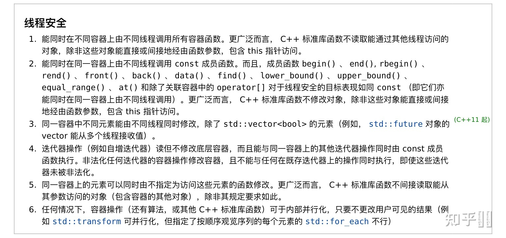

## **C++ STL**

### 请介绍一下STL

STL一共有六大组件，包括容器、算法、迭代器、仿函数、配置器和配接器，彼此可以组合套用。容器通过配置器取得数据存储空间，算法通过迭代器存取容器内容，仿函数可以协助算法完成不同的策略变化，配接器可以应用于容器、仿函数和迭代器。

- **容器**：各种数据结构，比如vector、list、map等，用来存放数据，从实现的角度来看是一种类模板
- **算法**：各种常用的算法，如 sort（插⼊，快排，堆排序），search（⼆分查找），从实现的角度来看是一种方法模板
- **迭代器**：从实现的角度来看，迭代器是一种将`operator*、operator->、operator++、operator--`等指针相关操作赋予重载的类模板，所有的STL容器都有自己的迭代器
- **仿函数**：从实现的⻆度看，仿函数是一种重载了operator()的类或者类模板。可以帮助算法实现不同的策略
- **配接器**：一种用来修饰容器或者仿函数或者迭代器接口的东西
- **配置器**：负责空间配置和管理，从实现的角度来看，配置器是一个实现了动态空间配置、空间管理、空间释放的类模板


### 内存管理 Allocator

SGI设计了**双层级配置器**：

- 第一级配置器直接使用malloc()和free()完成内存的分配和回收。
- 第二级配置器则根据需求量的大小选择不同的策略执行。

对于**第二级配置器**

- 如果需求块⼤⼩⼤于 128bytes，则直接转而调用第一级配置器，使用malloc()分配内存。
- 如果需求块大小小于128bytes，第二级配置器中维护了16个自由链表，负责16种小型区块的此配置能力
  - 即当有⼩于 128bytes 的需求块要求时，⾸先查看所需需求块⼤⼩所对应的链表中是否有空闲空间，如果有则直接返回，如果没有，则向内存池中申请所需需求块⼤⼩的内存空间，如果申请成功，则将其加⼊到⾃由链表中。如果内存池中没有空间，则使⽤ malloc() 从堆中进⾏申请，且申请到的⼤⼩是需求ᰁ的⼆倍（或⼆倍＋n 附加量），⼀倍放在⾃由空间中，⼀倍（或⼀倍＋n）放⼊内存池中。
  - 如果 malloc()也失败，则会遍历⾃由空间链表，四处寻找“尚有未⽤区块，且区块够⼤”的 freelist，找到⼀块就挖出一块返回。如果还是没有，扔交给malloc()处理，因为malloc()有out-of-memory处理机制或者有机会会释放其他的内存拿来用，如果可以就成功，如果不行就报bad_alloc异常


### STL中序列式容器的实现

（1）[vector](https://so.csdn.net/so/search?q=vector&spm=1001.2101.3001.7020)

- 是动态空间，随着元素的加入，它的内部机制会自行扩充空间以容纳新元素。vector维护的是一个连续的线性空间，而且普通指针就可以满足要求作为vector的迭代器（RandomAccessIterator）。
- vector的数据结构其实就是三个迭代器构成的，一个指向目前使用空间头的iterator，一个指向目前使用空间尾的iterator，一个指向目前可用空间尾的iterator。当有新元素插入时，如果目前容器足够用则直接插入，如果不够容量就扩充两倍，如果两倍还不够，就扩充至足够大的容量
- **扩充的过程并不是直接在原有空间后面追加容器，而是重新申请一块连续空间，将原有的数据拷贝到新空间中，再释放原有空间，完成一次扩充**。需要注意的是，每次扩充是重新开辟的空间，所以扩充后，原有的迭代器将会失效


（2）list

- 与vector相比，list的好处是每次插入或者删除一个元素，就配置或者释放一个空间，而且原有的迭代器也不会失效
- STL list是一个双向链表，普通指针已经不能满足list迭代器的需求，因为list的存储空间是不连续的。
- list的迭代器必须具备前移和后退的功能，所以list提供的是BidirectionalIterator。
- list 的数据结构中只要⼀个指向 node节点的指针就可以了。


（3）deque

- vector是单向开口的连续线性空间，deque是一种双向开口的连续线性空间。所谓双向开口，说的是deque支持从头尾两端进行元素的插入和删除。 相比于vector的扩充空间的方式，deque实际上更加贴切的实现了动态空间的概念。**deque没有容量的概念，因为它是动态的已分段连续空间组合而成，随时可以增加一段新的空间并连接起来**
- 由于要维护这种整体连续的假象，并提供随机存取的接⼝（即也提供 RandomAccessIterator），避开了“重新配置，复制，释放”的轮回，代价是复杂的迭代器结构。也就是说**除非必要，我们应该尽可能的使用vector，而不是deque**

那deque是如何做到维护整体连续的假象的呢？

- deque采用一块所谓的map作为主控，这里的map实际上就是一块大小连续的空间，其中每一个元素，我们称之为节点node，都指向了另一端连续线性空间称为缓冲区，缓冲区才是deque的真正存储空间的主体
- STL是运行我们指定缓冲区的大小的，默认0表示使用512bytes缓冲区。当map满载时，我们选用一块更大的空间来作为map，重新调整配置。
- deque另一个关键是它的iterator 的设计，deque 的 iterator 中有四个部分，cur 指向缓冲区现⾏元素，first 指向缓冲区的头，last 指向缓冲区的尾（有时会包含备⽤空间），node指向管控中⼼。所以总结来说，deque的数据结构中包含了，指向第⼀个节点的iterator start， 和指向最后⼀个节点的 iterator finish，⼀块连续空间作为主控 map，也需要记住 map 的⼤⼩，以备判断何时配置更⼤的 map。


（4）stack

- stack是一种先进后出的数据结构，只有一个出口，stack运行从最顶端新增元素，移除最顶端元素，取得最顶端元素
- deque是一种双向开口的数据结构，所以使用deque作为底部结构并封装其头部开口，就形成了一个stack


（5）queue

- 是⼀种先进先出的数据结构，有两个出⼝，允许从最底端加⼊元素，取得最顶端元素，从最底端新增元素，从最顶端移除元素。
- deque 是双向开⼝的数据结构，若以 deque 为底部结构并封闭其底端的出⼝，和头端的⼊⼝，就形成了⼀个 queue。（其实 list 也可以实现 deque）


（6）heap

- 堆并不属于STL容器组件，它是个幕后英雄，扮演 priority_queue 的助⼿
- priority_queue 允许用户以任何次序将任何元素压入容器中，但是取出时一定是从优先级最高(数值最高)的元素开始取。⼤根堆（binary max heap）正具有这样的性质，适合作为 priority_queue 的底层机制。


（7）priority_queue

- 底层是⼀个 vector，使⽤ heap 形成的算法，插⼊，获取 heap 中元素的算法，维护这个 vector，以达到允许⽤户以任何次序将任何元素插⼊容器内，但取出时⼀定是从优先权最⾼（数值最⾼）的元素开始取的⽬的。


（8）slist：STL list 是⼀个双向链表， slist 是⼀个单向链表


### vector使用的注意点，频繁对 vector 调⽤ push_back() 性能影响

使用注意点：

- 注意插入和删除元素后迭代器失效的问题
- 清空vector数据时，如果保存的数据项是指针类型，需要逐项delete，否则会造成内存泄露

频繁调用push_back()的影响：

- 向vector的尾部添加元素，很有可能引起整个对象存储空间的重新分配，重新分配更大的内存，再将原数据拷贝到新空间中，再释放原有内存，这个过程是耗时耗力的，频繁对vector调用push_back()会导致性能的下降
- 在C++11之后，vector容器中添加了一个新方法`emplace_back()`，和push_back()一样的是都是在容器末尾添加一个新的元素进去，不同的是emplace_back()在效率上相比较于push_back()有了一定的提升
- emplace_back()函数在原理上比push_back()有了一定的改进，包括在内存优化和运行效率方面。内存优化主要体现在使用了**就地构造(直接在容器内构造对象，不用拷贝一个复制品再使用)+强制类型转换**的方法来实现，在运行效率方面，由于省去了拷贝构造过程，因此有了一定的提升


### vector的底层原理

vector底层是一个动态数组，包含三个迭代器，start和finish之间是已经被使用的空间范围，end_of_storage是整块连续空间包括备用空间的尾部。

当空间不够装下数据（vec.push_back(val)）时，会自动申请另一片更大的空间（1.5倍或者2倍），然后把原来的数据拷贝到新的内存空间，接着释放原来的那片空间[vector内存增长机制]。

当释放或者删除（vec.clear()）里面的数据时，其存储空间不释放，仅仅是清空了里面的数据。因此，对vector的任何操作一旦引起了空间的重新配置，指向原vector的所有迭代器会都失效了。


### vector中的reserve和resize的区别

- reserve是直接扩充到已经确定的大小，可以减少多次开辟、释放空间的问题（优化push_back），就可以提高效率，其次还可以减少多次要拷贝数据的问题。reserve只是保证vector中的空间大小（capacity）最少达到参数所指定的大小n。reserve()只有一个参数。
- resize()可以改变有效空间的大小，也有改变默认值的功能。capacity的大小也会随着改变。resize()可以有多个参数。

* 当reserve的大小大于当前capacity时会改变当前capacity，当小于当前capacity时什么也不做。
* 当resize的大小大于当前capacity时会改变当前capacity，当小于当前size时，会收缩size至指定大小。

- resize()：改变当前容器内含有元素的**数量**(size())，eg: vector< v>; v.resize(len);v的size变为len，如果原来v的size⼩于len，那么容器新增（len-size）个元素，元素的值为默认为0。当v.push_back(3);之后，则是3是放在了v的末尾，即下标为len，此时容器是size为len+1；
- reserve ()：改变当前容器的最大**容量**(capacity)，它不会生成元素，只是确定这个容器重新分配⼀块能存len个对象的空间，然后把之前v.size()个对象通过 copy construtor 复制过来，销毁之前的内存；


### vector中的size和capacity的区别

- size表示当前vector中有多少个元素（finish - start）;
- capacity函数则表示它已经分配的内存中可以容纳多少元素（end_of_storage - start）;


### vector中erase方法与algorithn中的remove方法区别

- vector中erase方法真正删除了元素，迭代器不能访问了
- remove只是简单地将元素移到了容器的最后面，迭代器还是可以访问到。因为algorithm通过迭代器进行操作，不知道容器的内部结构，所以无法进行真正的删除。


### vector迭代器失效的情况

- 当插入一个元素到vector中，由于引起了内存重新分配，所以指向原内存的迭代器全部失效。
- 当删除容器中一个元素后,该迭代器所指向的元素已经被删除，那么也造成迭代器失效。erase方法会返回下一个有效的迭代器，所以当我们要删除某个元素时，需要it=vec.erase(it);。


### 正确释放vector的内存(clear(), swap(), shrink_to_fit())

- vec.clear()：清空内容，但是不释放内存。
- vector().swap(vec)：清空内容，且释放内存，想得到一个全新的vector。
- vec.shrink_to_fit()：请求容器降低其capacity和size匹配。
- vec.clear();vec.shrink_to_fit();：清空内容，且释放内存。


### list的底层原理

- list的底层是一个双向链表，使用链表存储数据，并不会将它们存储到一整块连续的内存空间中。恰恰相反，各元素占用的存储空间（又称为节点）是独立的、分散的，它们之间的线性关系通过指针来维持,每次插入或删除一个元素，就配置或释放一个元素空间。
- list不支持随机存取，适合处理大量的插入和删除，而不适合频繁的随机存取。


### 什么情况下用vector，什么情况下用list，什么情况下用deque

- vector可以随机存储元素（即可以通过公式直接计算出元素地址，而不需要挨个查找），但在非尾部插入删除数据时，效率很低，适合对象简单，对象数量变化不大，随机访问频繁。除非必要，我们尽可能选择使用vector而非deque，因为deque的迭代器比vector迭代器复杂很多。
- list不支持随机存储，适用于对象大，对象数量变化频繁，插入和删除频繁，比如写多读少的场景。
- 需要从首尾两端进行插入或删除操作的时候需要选择deque。


### priority_queue的底层原理

priority_queue：优先队列，其底层是用堆来实现的。在优先队列中，队首元素一定是当前队列中优先级最高的那一个。


### map和set有什么区别？

map和set都是C++的关联容器，其底层实现都是红黑树（RB-Tree）。

由于map和set所开放的各种操作接口，RB-tree也都提供了，所以几乎所有的map和set的操作行为，都只是转掉RB-tree的操作行为。

map和set区别在于：

- map中的元素是key-value对，key起到索引的作用，value表示与索引相关联的数据；set是关键字的简单集合，set中每个元素只包含一个关键字
- set的迭代器是const的，不允许修改元素的值；map运行修改value，但是不允许修改key。原因是map和set都是根据根据关键字排序来保证其有序性的，如果允许修改key的话，那么首先要删除该key，然后调节平衡，再插⼊修改后的键值，调节平衡，如此⼀来，严重破坏了map和set的结构，导致iterator失效，不知道应该指向改变前的位置，还是指向改变后的位置。所以STL中set的迭代器设置成const，不允许修改迭代器的值；而map的迭代器则不允许修改key的值，允许修改map的值
- map支持下标操作，set不支持下标操作。map可以⽤key做下标，map的下标运算符[ ]将关键码作为下标去执行查找，如果key不存在，则插入一个具有该key和mapped_type类型默认值的元素到map中，因此下标运算符[]在map应用中要慎用，const_map不能用，只希望确定某一个关键值是否存在而不希望插入元素也不应该使用，mapped_type类型没有默认值也不应该使⽤。如果find能解决需要，尽可能有find


### map 、set、multiset、multimap的底层原理

map 、set、multiset、multimap的底层实现都是红黑树，epoll模型的底层数据结构也是红黑树，linux系统中CFS进程调度算法，也用到红黑树。

红黑树的特性：

- 每个结点或是红色或是黑色；
- 根结点是黑色；
- 每个叶结点是黑的；
- 如果一个结点是红的，则它的两个儿子均是黑色；
- 每个结点到其叶子结点的所有路径上包含相同数目的黑色结点。


### 为何map和set的插入删除效率比其他序列容器高，而且每次insert之后，以前保存的iterator不会失效？

- 存储的是结点，不需要内存拷贝和内存移动。
- 插入操作只是结点指针换来换去，结点内存没有改变。而iterator就像指向结点的指针，内存没变，指向内存的指针也不会变。


### 当数据元素增多时（从10000到20000），map的set的查找速度会怎样变化？

RB-TREE用二分查找法，时间复杂度为logn，所以从10000增到20000时，查找次数从log10000=14次到log20000=15次，多了1次而已。


### map 、set、multiset、multimap的特点

- set和multiset会根据特定的排序准则自动将元素排序，set中元素不允许重复，multiset可以重复。
- map和multimap将key和value组成的pair作为元素，根据key的排序准则自动将元素排序（因为红黑树也是二叉搜索树，所以map默认是按key排序的），map中元素的key不允许重复，multimap可以重复。
- map和set的增删改查速度为都是logn，是比较高效的。


### 为何map和set不能像vector一样有个reserve函数来预分配数据?

在map和set内部存储的已经不是元素本身了，而是包含元素的结点。也就是说map内部使用的Alloc并不是map<Key, Data, Compare, Alloc>声明的时候从参数中传入的Alloc。


### set的底层实现实现为什么不用哈希表而使用红黑树？

set中元素是经过排序的，红黑树也是有序的，哈希是无序的 如果只是单纯的查找元素的话，那么肯定要选哈希表了，因为哈希表在的最好查找时间复杂度为O(1)，并且如果用到set中那么查找时间复杂度的一直是O（1），因为set中是不允许有元素重复的。而红黑树的查找时间复杂度为O(lgn)


### hash_map与map的区别？什么时候用hash_map，什么时候用map？

- 构造函数：hash_map需要hash function和等于函数，而map需要比较函数（大于或小于）。
- 存储结构：hash_map以hashtable为底层，而map以RB-TREE为底层。
- 总的说来，hash_map查找速度比map快，而且查找速度基本和数据量大小无关，属于常数级别。而map的查找速度是logn级别。但不一定常数就比log小，而且hash_map还有hash function耗时。
- 如果考虑效率，特别当元素达到一定数量级时，用hash_map。
- 考虑内存，或者元素数量较少时，用map。


### unordered_map底层实现是哈希表，其冲突解决方法是什么

STL的unordered_map冲突解决方法使用的是开链法，即在重复元素上维护一个链表。


### unordered_map支持并发读写吗？

首先，C++11 前，C++语核没有线程的概念，所以标准没有规定容器的线程安全性。

C++11 起，对容器的线程读写安全性规定如下：

https://zh.cppreference.com/w/cpp/container#.E7.BA.BF.E7.A8.8B.E5.AE.89.E5.85.A8



根据条款 2，const 成员函数一定是线程安全的；由条款 4，迭代器操作对容器也仅有只读操作。


.find()是没问题的，但不要用 [] 运算符，这个可能产生意料之外的写操作。

曾经我一个程序莫名卡死，怀疑是 [] 运算符引用存在的 key 仍然引起了写操作，没有切实证据，但把 [] 全部改成 .find() 之后就好了。


**至于unordered_map的并发写**

这个BUG的解决也很富有戏剧性，大概有两天我的思路没有进展，直到第二天晚上偶然打开cppreference时注意到了`std::unordered_map`的一个之前没注意到的细节：**`rehash`**。最初始时，`std::unordered_map`最初一般只有7个bucket，但随着插入量的增长，同一个bucket中的元素越来越多，越来越多的时间会被花费在bucket内部的线性查找上，因此`std::unordered_map`会在适当时机进行**扩容操作**，增添bucket的数量，并将之前的k-v pair重新分配到其对应的桶中。

https://en.cppreference.com/w/cpp/container/unordered_map

我自己写了一点测试代码了解`rehash`的行为后，猜测可能是并发访问下`rehash`造成了`std::unordered_map`的undefined行为，但这种想法一旦成立，也就意味着我前文中**降低锁粒度**所思考的逻辑存在着严重的问题。验证方法也很简单，在`lock_table_`创建时，把桶的数量开到足够大，这样就不会出现`rehash`的情景了：

```cpp
LockManager() {
    enable_cycle_detection_ = true;
    cycle_detection_thread_ = new std::thread(&LockManager::RunCycleDetection, this);
    
    // reserve enough buckets to avoid rehash
    lock_table_.reserve(100);
    
    LOG_INFO("Cycle detection thread launched");
}
```

修改后再次提交到gradescope，顺利通过。这样基本石锤了时`rehash`导致`lock_table`中出现了两个相同的key；


**总结**

`std::unordered_map<Key, Value>`是一个无法保证线程安全的数据结构，我们必须自己来处理它的并发访问。并发访问可以支持单个进程的写操作，或者多个进程的并发读操作。一般情况下我们可以把对Value的写操作，看做是一个对`std::unordered_map<Key, Value>`的读操作，因为这个操作并不改变Key与Value的映射关系。`operator[]`是一个十分需要小心使用的方法，因为它既可能对应一个读操作，也可能对应一个写操作，如果这个方法触发了插入行为，那么其中的元数据就会被修改，如果装载引子接近了上限值时还可能触发rehash，因此`operator []`不应该并发的调用。


### STL中迭代器的作用，有了指针为什么还要迭代器

迭代器的作用：

- Iterator（迭代器）模式⼜称 Cursor（游标）模式，用于提供一种方法顺序访问一个聚合对象中各个元素，而又不暴露该对象的内部表示。或者这样说可能更容易理解：迭代器模式是运用于聚合对象的一种模式，通过运用该模式，使得我们可以在不适用对象内部表示的情况下，按照一定的顺序（由iterator提供的⽅法）访问聚合对象中的各个元素
- 由于Iterator模式的以上特性：与聚合对象耦合，在一定程度上限制了它的广泛运用，一般仅用于底层聚合支持类，比如STL的list、vector、stack 等容器类及ostream_iterator等扩展iterator。

迭代器和指针的区别：

- 迭代器不是指针，是类模板，表现的像指针。它支持模拟量指针的一些功能，通过重载了指针的一些操作符，->、*、++、–等。迭代器封装了指针，是一个“可遍历STL容器内全部或者部分元素”的对象，本质是封装了原生指针，值指针概念的一种提升，提供了比指针更高级的行为，相当于一种智能指针，它可以根据不同类型的数据结构来实现不同过的++、–-等操作
- 迭代器返回的是对象引用而不是对象的值，所以cout只能输出迭代器使用*取值后的值⽽不能直接输出其⾃身。

迭代器产⽣原因：

- **Iterator类的访问方式就是把不同集合类的访问逻辑抽象出来，使得不用暴露集合内部的结构而达到循环遍历集合的效果**


### 迭代器失效的问题

插入操作：

- 对于vector和string，如果容器内存被重新分配，iterators,pointers,references失效；如果没有重新分配，那么插入点之前的iterator有效，插入点之后的iterator失效；

- 对于deque，如果插入点位于除front和back的其它位置，iterators,pointers,references失效；当我们插入元素到front和back时，deque的迭代器失效，但reference和pointers有效；

- 对于list和forward_list，所有的iterator,pointer和refercnce有效。

删除操作：

- 对于序列容器vector、deque来说，使用erase(iterator)后，后面的每个元素的迭代器都会失效，但是后面每个元素都会往前移动一个位置，erase会返回下一个有效的迭代器
- 对于关联容器map、set来说，使用erase(iterator)后，当前元素的迭代器会失效，但是其结构是红黑树，删除当前元素不会影响到下一个元素的迭代器，所以在调用erase之前，记录下一个元素的迭代器就可以了
- 对于list来说，它使用了不连续分配的内存，并且它的erase方法也会返回下一个有效的iterator，因此上面两种方法都可以正确使用


### 容器的元素可以声明引用类型吗?

**答案**

不能

**原因**

**C++ 容器要求元素具有 object type，引用不是 object type**。

```cpp
#include <vector>
#include <boost/shared_ptr.hpp>

using namespace std;

class test {};
typedef boost::shared_ptr<test> test_ptr;

int main()
{
    vector<test> tmp;
    vector<test*> tmp1;　　　　//小心内存泄露，重复析构等问题
    //vector<test&> tmp;　　　　//直接编译通不过
    vector<test_ptr> tmp2;
    //vector<test_ptr&> tmp3;　　//即使是boost的智能指针的引用也不行

    return 0;
}

```

c++ 的 STL 中主要有 vector ， list， map， set ， multimap，multiset ，这些容器都要求元素类型满足以下2种情况：

- 能被复制：向这些容器添加新元素时，容器会复制一份自己的版本，这要求容器使用的元素类型可以被复制，**也就是说类型需要复制构造函数的支持**
- 能被赋值：在使用容器的删除、查找、访问、使用迭代器修改元素等许多情况下，都需要元素的赋值操作支持，**类型需要赋值操作符运算的支持**。

* vector、list 中的单参数的resize 操作需要默认初始化指定个数的元素，**类型需要无参数的默认构造函数支持初始化**。

* set、multiset, map和multimap中的键类型、 list 中的sort 操作 都需要 < 比较操作来排序，**类型需要 < 操作符运算的支持**。

在STL中，容器的元素要满足三个基本要求：可拷贝(copyable)、可赋值(assignable)、可析构(destroyable)。**基本数据类型和自定义的类都满足这些条件，但是引用不满足，因为引用不能析构**。


### stack的底层实现

stack底层是用deque实现的，将deque的上端口封住，即变成stack。

stack的实现使用了设计模式中的适配器模式。


### STL线程不安全的情况

- 在对同一个容器进行多线程的读写、写操作时；
- 在每次调用容器的成员函数期间都要锁定该容器；
- 在每个容器返回的迭代器（例如通过调用begin或end）的生存期之内都要锁定该容器；
- 在每个在容器上调用的算法执行期间锁定该容器。


### C++ STL容器如何解决线程安全的问题？

众所周知，STL容器不是线程安全的。对于vector，即使写方（生产者）是单线程写入，但是并发读的时候，由于潜在的内存重新申请和对象复制问题，会导致读方（消费者）的迭代器失效。实际表现也就是招致了core dump。另外一种情况，如果是多个写方，并发的`push_back()`，也会导致core dump。

**解法一**

加锁是一种解决方案，比如互斥锁`std::mutex`。但是加`std::mutex`确实性能较差。对于多读少写的场景可以用读写锁（也叫共享独占锁）来缓解。比如C++17引入了`std::shared_mutex` 。更多锁的种类可以阅读我之前写的这篇文章：

[如何理解互斥锁、条件变量、读写锁以及自旋锁？](https://mp.weixin.qq.com/s?__biz=MjM5NDIyMjI3OQ==&mid=2649002539&idx=1&sn=b0cd8b1d1e471be565168b71458863e4&scene=21#wechat_redirect)

当然本文的目的自然不是自我重复再次介绍一次锁的使用，请继续阅读解法二！

**解法二**

更多的时候，其实可以通过固定vector的大小，避免动态扩容（无push_back）来做到lock-free！

即在开始并发读写之前（比如初始化）的时候，给vector设置好大小。

```
struct Data {
...
};
vector<Data> v;
v.resize(1000);
```

注意是`resize()`，不是`reserve()`！

可能大家平时用`reserve()`比较多，顾名思义，reserve就是预留内存。为的是避免内存重新申请以及容器内对象的拷贝。说白了，`reserve()`是给`push_back()`准备的！

而resize除了预留内存以外，还会调用容器元素的构造函数，不仅分配了N个对象的内存，还会构造N个对象。从这个层面上来说，`resize()`在时间效率上是比`reserve()`低的。但是在多线程的场景下，用resize再合适不过。

你可以resize好N个对象，多线程不管是读还是写，都是通过容器的下标访问`operator[]`来访问元素，不要`push_back()`新元素。所谓的『写操作』在这里不是插入新元素，而是修改旧元素。

如果N的最大个数是可以预期的就直接设置就好，如果没办法预期就再把vector搞成ring buffer（环形队列）来缓解压力。

可以给元素类加上成员变量标记当前的读写状态、是否被消费等等。

当然，你会说，如果B，C，D，E，F这个5个线程是等价的，要不停消费vector中的元素，会造成重复消费不？

当然会。你可以把队列头的下标定义成原子变量（`std::atomic`），尽管原子变量也需要做线程同步，但是比一般的锁开销要小很多啦。

如果你想连原子变量也不用，有没有办法呢？有啊。那就给B，C，D，E，F分配不同的消费队列啊。比如当前有5个读线程，那么每个线程就消费下标对5取模之后的某个固定结果的下标。比如：

- B消费：0、5、10、15、……
- C消费：1、6、11、16、……
- D消费：2、7、12、17、……
- E消费：3、8、13、18、……
- F消费：4、9、14、19、……

每个读线程各自维护自己当前消费的最新下标。

这样做有啥问题没？也有，就是可能会导致不同的线程繁忙和等待的情况差异巨大：忙的忙死，闲的闲死。具体场景具体分析，总之，无论如何要控制住。不要让一个任务hang住整个线程。

vector是顺序容器，STL中还有一类关联容器其线程安全问题也不容小觑。比如map、unordered_map。

我们可能会有这样一种场景：在并发环境下，收集一些Key-Value，存储在某一个公共的容器中。这里也谈一下不用锁的方案，当然做不到放之四海皆准。它有一些限制条件，只能看是否满足你的需要了。

当有多个写线程对情况下，并发地插入 map/unordered_map都会引发core dump。对此，在某些场景下也可以避免加锁：如果全量的key有办法在并发之前就能拿到的，那么就对这个map，提前做一下insert。并发环境中如果只是修改value，而不是插入新key就不会core dump！不过如果你没办法保证多个写线程不会同时修改同一个key的value，那么可能存在value的覆盖。无法保证这点时，还是需要加锁。不过可以对key采取某种hash策略转成整型，然后进行`分段加锁`，减少一点锁冲突的概率，或者用一下`CAS`的策略。

另外对于unordered_map，在单写多读的多线程场景下，会不会有问题呢？也可能有。gcc 4.7.2的unordered_map实现曾被爆出有这个问题。原因的新插入的元素，触发了rehash，让其他线程在unordered_map中查找的过程之中，出现了core dump。见：

> https://stackoverflow.com/questions/16353334/segv-in-gccs-stdunordered-map

我不确定clang以及后续的gcc版本是否还有此问题。应该在不添加任何额外同步代码的情况下，无法解决。


**容器并发前初始化与伪共享的争议**

本文内容我曾经在知乎上写过，有网友评论：解法二会有false sharing（伪共享）的问题。

这里我简单回应一下，谈论伪共享，要考虑具体的场景。的确某些时候伪共享会带来性能损失，但是要和并行化带来的性能提升来比较，孰高孰低。如果并行提升的性能足够多，是足以弥补这点伪共享的损失的。

比如我要进行远程IO，我有N个key要查询redis，把他们的结果存储到一个vector中，这个vector的写入操作在IO的异步回调函数中。在不加任何额外处理的情况下，极大概率会导致vector的core dump。而如果vector初始化一下，则无需在回调函数中加锁，就能保证安全。这时候并行IO本身带来的性能提升，远远大于`可能`的伪共享带来损失。

这里为什么说`可能`呢？因为伪共享的触发没你想象的这么简单。如何成功模拟出一次伪共享带来性能损失的例子？你可以写程序自测一下，并不容易……甚至你改一下优化级别，改成O2，测试表现都很不一样。

一般网络上谈论伪共享时所举的例子，并不是一个vector中多个元素之间并行读写触发了伪共享。而是vector的元素类型是一个对象，对象中有2个数据字段a和b，在多线程分别更新同一个元素的a和b字段的时候，导致了伪共享。比如一个线程更新vector中每个元素的a字段，另外一个线程更新vector中每个元素的b字段。