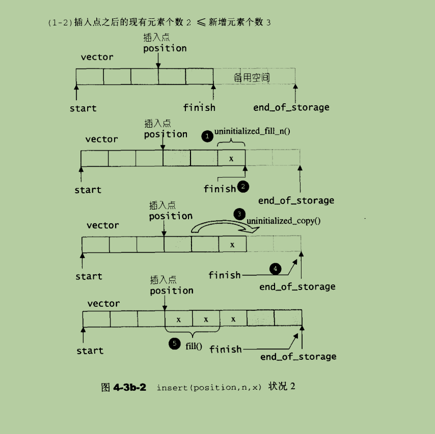
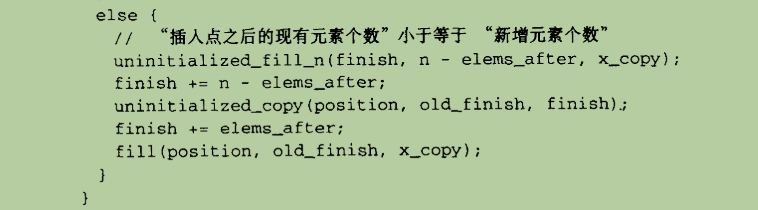
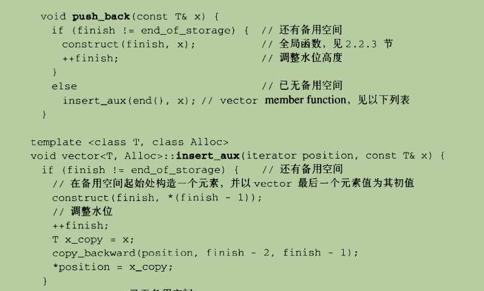
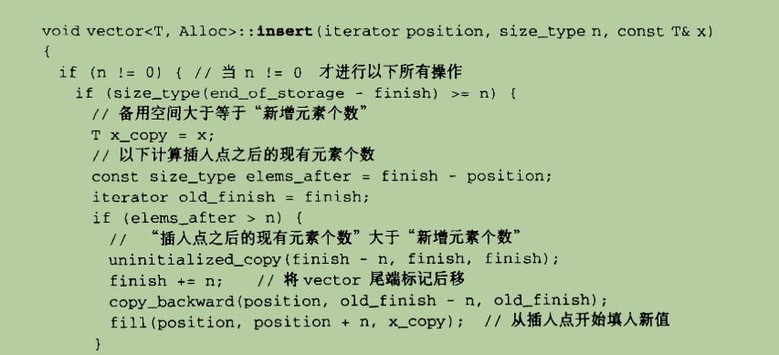

# C++ STL

## std::cin

Defined in header `<iostream>`

与字符串输入一样，有时候使用 cin>> 读取字符也不会按我们想要的结果行事。

例如，因为它会忽略掉所有前导白色空格，所以使用 cin>> 就不可能仅输入一个空格或回车符。除非用户输入了空格键、制表符之外的其他字符，否则程序将不可能通过 cin 语句继续执行（一旦输入了这样的字符，在程序可以继续下一个语句之前，仍然需要按回车键）。因此，要求用户“按回车键继续”的程序，不能使用 >> 运算符只读取按回车键的行为。

在这些情况下，cin 对象有一个名为 get 的内置函数很有帮助。因为 get 函数是内置在 cin 对象中的，所以可称之为 cin 的一个成员函数。get 成员函数读取单个字符，包括任何白色空格字符。如果程序需要存储正在读取的字符，则可以通过以下任意一种方式调用 get 成员函数。

在这两个例子中，假设 cin 是正被读入字符的 char 变量的名称：

cin.get (ch);
ch = cin.get();

如果程序正在使用 get 函数简单地暂停屏幕直到按回车键，并且不需要存储字符，则该函数也可以这样调用：

cin.get();

> 注意：cin.get()会消耗输入缓冲区的字符，并且不会跳过空格和回车符、换行符，可以用来判断是否读取完一行。


## std::getline

Defined in header `<string>`

```cpp
std::getline(std::cin, std::string s);
```


虽然可以使用 cin 和 >> 运算符来输入字符串，但它可能会导致一些需要注意的问题。

当 cin 读取数据时，它会传递并忽略任何前导白色空格字符（空格、制表符或换行符）。一旦它接触到第一个非空格字符即开始阅读，当它读取到下一个空白字符时，它将停止读取。以下面的语句为例：

```
cin >> namel;
```

可以输入 "Mark" 或 "Twain"，但不能输入 "Mark Twain"，因为 cin 不能输入包含嵌入空格的字符串。下面程序演示了这个问题：

```cpp
    // This program illustrates a problem that can occur if
    // cin is used to read character data into a string object.
    #include <iostream>
    #include <string> // Header file needed to use string objects
    using namespace std;
    int main()
    {
        string name;
        string city;
        cout << "Please enter your name: ";
        cin >> name;
        cout << "Enter the city you live in: ";
        cin >> city;
        cout << "Hello, " << name << endl;
        cout << "You live in " << city << endl;
        return 0;
    }
```

程序输出结果：

Please enter your name： John Doe
Enter the city you live in: Hello, John
You live in Doe

请注意，在这个示例中，用户根本没有机会输入 city 城市名。因为在第一个输入语句中，当 cin 读取到 John 和 Doe 之间的空格时，它就会停止阅读，只存储 John 作为 name 的值。在第二个输入语句中， cin 使用键盘缓冲区中找到的剩余字符，并存储 Doe 作为 city 的值。

为了解决这个问题，可以使用一个叫做 getline 的 C++ 函数。**此函数可读取整行，包括前导和嵌入的空格，并将其存储在字符串对象中。**

getline 函数如下所示：

```
getline(cin, inputLine);
```

其中 cin 是正在读取的输入流，而 inputLine 是接收输入字符串的 string 变量的名称。下面的程序演示了 getline 函数的应用：

```
// This program illustrates using the getline function
//to read character data into a string object.
#include <iostream>
#include <string> // Header file needed to use string objects
using namespace std;

int main()
{
    string name;
    string city;
    cout << "Please enter your name: ";
    getline(cin, name);
    cout << "Enter the city you live in: ";
    getline(cin, city);
    cout << "Hello, " << name << endl;
    cout << "You live in " << city << endl;
    return 0;
}
```

程序输出结果：

Please enter your name: John Doe
Enter the city you live in: Chicago
Hello, John Doe
You live in Chicago


## std::stringstream

Defined in header `<sstream>`

> int x;
>
> ss >> x;	// 可以实现类型的隐式转换

　以前没有接触过stringstream这个类的时候，常用的字符串和数字转换函数就是sscanf和sprintf函数。开始的时候就觉得这两个函数应经很叼了，但是毕竟是属于c的。c++中引入了流的概念，通过流来实现字符串和数字的转换方便多了。在这里，总结之前的，并介绍新学的。

***3\***|***0\*****常见格式串:**　　
***4\***|***0\***

　　%% 印出百分比符号，不转换。
　　%c 整数转成对应的 ASCII 字元。
　　%d 整数转成十进位。
　　%f 倍精确度数字转成浮点数。
　　%o 整数转成八进位。
　　%s 整数转成字符串。
　　%x 整数转成小写十六进位。
　　%X 整数转成大写十六进位。
　　%n sscanf(str, "%d%n", &dig, &n)，%n表示一共转换了多少位的字符

***5\***|***0\*****sprintf函数**
***6\***|***0\***

　　 sprintf函数原型为 int sprintf(char *str, const char *format, ...)。作用是格式化字符串，具体功能如下所示：

　　（1）将数字变量转换为字符串。

　　（2）得到整型变量的16进制和8进制字符串。

　　（3）连接多个字符串。

```cpp
int main(){
    char str[256] = { 0 };
    int data = 1024;
    //将data转换为字符串
    sprintf(str,"%d",data);
    //获取data的十六进制
    sprintf(str,"0x%X",data);
    //获取data的八进制
    sprintf(str,"0%o",data);
    const char *s1 = "Hello";
    const char *s2 = "World";
    //连接字符串s1和s2
    sprintf(str,"%s %s",s1,s2);
    cout<<str<<endl; 
    return 0;
} 
```

***7\***|***0\*****sscanf函数**
***8\***|***0\***

　　sscanf函数原型为int sscanf(const char *str, const char *format, ...)。将参数str的字符串根据参数format字符串来转换并格式化数据，转换后的结果存于对应的参数内。具体功能如下：

　　（1）根据格式从字符串中提取数据。如从字符串中取出整数、浮点数和字符串等。

　　（2）取指定长度的字符串

　　（3）取到指定字符为止的字符串

　　（4）取仅包含指定字符集的字符串

　　（5）取到指定字符集为止的字符串

　　当然，sscanf可以支持格式串"%[]"形式的，有兴趣的可以研究一下。

```c
int main(){
    char s[15] = "123.432,432";
    int n;
    double f1;
    int f2;
    sscanf(s, "%lf,%d%n", &f1, &f2, &n);
    cout<<f1<<" "<<f2<<" "<<n;
    return 0;
} 
```

　　输出结果：123.432 432 11， 即一共转换了11位的字符。

***9\***|***0\*****stringstream类：**
***10\***|***0\***

　　<sstream>库定义了三种类：istringstream、ostringstream和stringstream，分别用来进行流的输入、输出和输入输出操作。

　　1.stringstream::str(); returns a string object with a copy of the current contents of the stream.

　　2.stringstream::str (const string& s); sets s as the contents of the stream, discarding any previous contents.

　　3.stringstream清空，stringstream s; s.str("");

　　4.实现任意类型的转换

　　　　**template<typename out_type, typename in_value>**
　　　　**out_type convert(const in_value & t){**
　　　　　　**stringstream stream;**
　　　　　　**stream<<t;//向流中传值**
　　　　　　**out_type result;//这里存储转换结果**
　　　　　　**stream>>result;//向result中写入值**
　　　　　　**return result;**
　　　　**}**

```cpp
int main(){
    string s = "1 23 # 4";
    stringstream ss;
    ss<<s;
    while(ss>>s){
        cout<<s<<endl;
        int val = convert<int>(s);
        cout<<val<<endl;
    }
    return 0;
}
```

　　输出：1 1 23 23 # 0 4 4

　　

　　顺便说一下，今天做题的时候也用到了stringstream这个类，是二叉树的序列化和反序列化。

　　题目链接：http://www.lintcode.com/zh-cn/problem/binary-tree-serialization/

***11\***|***0\*****二叉树的序列化和反序列化**
***12\***|***0\***

　　设计一个算法，并编写代码来序列化和反序列化二叉树。将树写入一个文件被称为“序列化”，读取文件后重建同样的二叉树被称为“反序列化”。如何反序列化或序列化二叉树是没有限制的，你只需要确保可以将二叉树序列化为一个字符串，并且可以将字符串反序列化为原来的树结构。

***12\***|***1\*****思路：**
***12\***|***2\***

　　通过先序遍历建立二叉树的序列化，其中空子树用'#'来表示。反序列化的时候呢，遇到'#'就停止递归构造。另外序列化的时候是将整数通过stringstream转换成字符串，反序列化是将字符串通过stringstream转换成整数。

```cpp
/**
 * Definition of TreeNode:
 * class TreeNode {
 * public:
 *     int val;
 *     TreeNode *left, *right;
 *     TreeNode(int val) {
 *         this->val = val;
 *         this->left = this->right = NULL;
 *     }
 * }
 */
class Solution {
public:
    /**
     * This method will be invoked first, you should design your own algorithm 
     * to serialize a binary tree which denote by a root node to a string which
     * can be easily deserialized by your own "deserialize" method later.
     */
    bool first;
    
    template<typename out_type, typename in_value>
    out_type convert(const in_value & t){
        stringstream stream;
        stream<<t;//向流中传值
        out_type result;//这里存储转换结果
        stream>>result;//向result中写入值
        return result;
    }
    
    void pre_order(TreeNode *root, string &s){
        if(root){
            string tmp = convert<string>(root->val);
            if(!first)
                s+= " "+tmp;
            else {
                first = false;
                s+=tmp;
            }
            pre_order(root->left, s);
            pre_order(root->right, s);
        } else {
            if(first)
                s+='#';
            else {
                first = false;
                s+=" #";
            }
        }
    }
    string serialize(TreeNode *root) {
        // write your code here
        string s="";
        first = true;
        pre_order(root, s);//先序实现序列化
        return s;
    }
    
    stringstream ss;
    void buildT(TreeNode * &T){
        string s;
        ss>>s;
        if(s == "#") return ;
        int val = convert<int>(s);
        T = new TreeNode(val);
        buildT(T->left);
        buildT(T->right);
    }
    
    /**
     * This method will be invoked second, the argument data is what exactly
     * you serialized at method "serialize", that means the data is not given by
     * system, it's given by your own serialize method. So the format of data is
     * designed by yourself, and deserialize it here as you serialize it in 
     * "serialize" method.
     */
    TreeNode *deserialize(string data) {
        // write your code here
        TreeNode *T = NULL;
        ss.str("");
        ss<<data;
        buildT(T);
        return T;
    }
};
```


## 1. std::vector

Defined in header `<vector>`

### Iterator invalidation

| Operations                                                   | Invalidated                                                  |
| ------------------------------------------------------------ | ------------------------------------------------------------ |
| All read only operations                                     | Never                                                        |
| [swap](https://en.cppreference.com/w/cpp/container/vector/swap), [std::swap](https://en.cppreference.com/w/cpp/algorithm/swap) | [end()](https://en.cppreference.com/w/cpp/container/vector/end) |
| [clear](https://en.cppreference.com/w/cpp/container/vector/clear), [operator=](https://en.cppreference.com/w/cpp/container/vector/operator%3D), [assign](https://en.cppreference.com/w/cpp/container/vector/assign) | Always                                                       |
| [reserve](https://en.cppreference.com/w/cpp/container/vector/reserve), [shrink_to_fit](https://en.cppreference.com/w/cpp/container/vector/shrink_to_fit) | If the vector changed capacity, all of them. If not, none.   |
| [erase](https://en.cppreference.com/w/cpp/container/vector/erase) | Erased elements and all elements after them (including [end()](https://en.cppreference.com/w/cpp/container/vector/end)) |
| [push_back](https://en.cppreference.com/w/cpp/container/vector/push_back), [emplace_back](https://en.cppreference.com/w/cpp/container/vector/emplace_back) | If the vector changed capacity, all of them. If not, only end(). |
| [insert](https://en.cppreference.com/w/cpp/container/vector/insert), [emplace](https://en.cppreference.com/w/cpp/container/vector/emplace) | If the vector changed capacity, all of them. If not, only those at or after the insertion point (including end()). |
| [resize](https://en.cppreference.com/w/cpp/container/vector/resize) | If the vector changed capacity, all of them. If not, only end() and any elements erased. |
| [pop_back](https://en.cppreference.com/w/cpp/container/vector/pop_back) | The element erased and [end()](https://en.cppreference.com/w/cpp/container/vector/end). |

### Member types

| Member type              | Definition                                                   |
| ------------------------ | ------------------------------------------------------------ |
| `value_type`             | `T`                                                          |
| `allocator_type`         | `Allocator`                                                  |
| `size_type`              | Unsigned integer type (usually [std::size_t](https://en.cppreference.com/w/cpp/types/size_t)) |
| `difference_type`        | Signed integer type (usually [std::ptrdiff_t](https://en.cppreference.com/w/cpp/types/ptrdiff_t)) |
| `reference`              | value_type&                                                  |
| `const_reference`        | const value_type&                                            |
| `pointer`                | `Allocator::pointer`(until C++11)[std::allocator_traits](http://en.cppreference.com/w/cpp/memory/allocator_traits)<Allocator>::pointer(since C++11) |
| `const_pointer`          | `Allocator::const_pointer`(until C++11)[std::allocator_traits](http://en.cppreference.com/w/cpp/memory/allocator_traits)<Allocator>::const_pointer(since C++11) |
| `iterator`               | [*LegacyRandomAccessIterator*](https://en.cppreference.com/w/cpp/named_req/RandomAccessIterator) to `value_type` |
| `const_iterator`         | [*LegacyRandomAccessIterator*](https://en.cppreference.com/w/cpp/named_req/RandomAccessIterator) to `const value_type` |
| `reverse_iterator`       | [std::reverse_iterator](http://en.cppreference.com/w/cpp/iterator/reverse_iterator)<iterator> |
| `const_reverse_iterator` | [std::reverse_iterator](http://en.cppreference.com/w/cpp/iterator/reverse_iterator)<const_iterator> |

### Member functions

| [(constructor)](https://en.cppreference.com/w/cpp/container/vector/vector) | constructs the `vector` (public member function)             |
| ------------------------------------------------------------ | ------------------------------------------------------------ |
| [(destructor)](https://en.cppreference.com/w/cpp/container/vector/~vector) | destructs the `vector` (public member function)              |
| [operator=](https://en.cppreference.com/w/cpp/container/vector/operator%3D) | assigns values to the container (public member function)     |
| [assign](https://en.cppreference.com/w/cpp/container/vector/assign) | assigns values to the container (public member function)     |
| [get_allocator](https://en.cppreference.com/w/cpp/container/vector/get_allocator) | returns the associated allocator (public member function)    |
| Element access                                               |                                                              |
| [at](https://en.cppreference.com/w/cpp/container/vector/at)  | access specified element with bounds checking (public member function) |
| [operator[\]](https://en.cppreference.com/w/cpp/container/vector/operator_at) | access specified element (public member function)            |
| [front](https://en.cppreference.com/w/cpp/container/vector/front) | access the first element (public member function)            |
| [back](https://en.cppreference.com/w/cpp/container/vector/back) | access the last element (public member function)             |
| [data](https://en.cppreference.com/w/cpp/container/vector/data) | direct access to the underlying array (public member function) |
| Iterators                                                    |                                                              |
| [begincbegin](https://en.cppreference.com/w/cpp/container/vector/begin)(C++11) | returns an iterator to the beginning (public member function) |
| [endcend](https://en.cppreference.com/w/cpp/container/vector/end)(C++11) | returns an iterator to the end (public member function)      |
| [rbegincrbegin](https://en.cppreference.com/w/cpp/container/vector/rbegin)(C++11) | returns a reverse iterator to the beginning (public member function) |
| [rendcrend](https://en.cppreference.com/w/cpp/container/vector/rend)(C++11) | returns a reverse iterator to the end (public member function) |
| Capacity                                                     |                                                              |
| [empty](https://en.cppreference.com/w/cpp/container/vector/empty) | checks whether the container is empty (public member function) |
| [size](https://en.cppreference.com/w/cpp/container/vector/size) | returns the number of elements (public member function)      |
| [max_size](https://en.cppreference.com/w/cpp/container/vector/max_size) | returns the maximum possible number of elements (public member function) |
| [reserve](https://en.cppreference.com/w/cpp/container/vector/reserve) | reserves storage (public member function)                    |
| [capacity](https://en.cppreference.com/w/cpp/container/vector/capacity) | returns the number of elements that can be held in currently allocated storage (public member function) |
| [shrink_to_fit](https://en.cppreference.com/w/cpp/container/vector/shrink_to_fit)(C++11) | reduces memory usage by freeing unused memory (public member function) |
| Modifiers                                                    |                                                              |
| [clear](https://en.cppreference.com/w/cpp/container/vector/clear) | clears the contents (public member function)                 |
| [insert](https://en.cppreference.com/w/cpp/container/vector/insert) | inserts elements (public member function)                    |
| [emplace](https://en.cppreference.com/w/cpp/container/vector/emplace)(C++11) | constructs element in-place (public member function)         |
| [erase](https://en.cppreference.com/w/cpp/container/vector/erase) | erases elements (public member function)                     |
| [push_back](https://en.cppreference.com/w/cpp/container/vector/push_back) | adds an element to the end (public member function)（注意：push_back()和pop_back()的存在意味着vector也是栈） |
| [emplace_back](https://en.cppreference.com/w/cpp/container/vector/emplace_back)(C++11) | constructs an element in-place at the end (public member function) |
| [pop_back](https://en.cppreference.com/w/cpp/container/vector/pop_back) | removes the last element (public member function)            |
| [resize](https://en.cppreference.com/w/cpp/container/vector/resize) | changes the number of elements stored (public member function) |
| [swap](https://en.cppreference.com/w/cpp/container/vector/swap) | swaps the contents (public member function)                  |

### Non-member functions

| [operator==operator!=operatoroperator>=operator<=>](https://en.cppreference.com/w/cpp/container/vector/operator_cmp)(removed in C++20)(removed in C++20)(removed in C++20)(removed in C++20)(removed in C++20)(C++20) | lexicographically compares the values in the vector (function template) |
| ------------------------------------------------------------ | ------------------------------------------------------------ |
| [std::swap(std::vector)](https://en.cppreference.com/w/cpp/container/vector/swap2) | specializes the [std::swap](https://en.cppreference.com/w/cpp/algorithm/swap) algorithm (function template) |
| [erase(std::vector)erase_if(std::vector)](https://en.cppreference.com/w/cpp/container/vector/erase2)(C++20) | Erases all elements satisfying specific criteria (function template) |

### 用法示例

```c++
#include <iostream>
#include <vector>
 
int main()
{
    // Create a vector containing integers
    // 注：使用大括号可以直接构造vector
    std::vector<int> v = { 7, 5, 16, 8 };
 
    // Add two more integers to vector
    v.push_back(25);
    v.push_back(13);
 
    // Print out the vector
    std::cout << "v = { ";
    for (int n : v) {
        std::cout << n << ", ";
    }
    std::cout << "}; \n";
    
    // vector构造函数
    // 1. 直接构造一个含100个1的vector
    vector<int> vec(100, 1);
    // 2. 用迭代器构造一个新的vector
    vector vec2(vec.begin(), vec.end());
    // 3. 构造给定大小的二维数组
    vector<vector<int>> vec(4, vector<int>(5));	// 4行5列的二维数组
    // 4. 构造给定大小的二维数组，并初始化
    vector<vector<int>> vec(4, vector<int>(5, 0));	// 4行5列的二维数组
}
```

Output:

```c++
v = { 7, 5, 16, 8, 25, 13, };
```

### 1.1 std::vector源码解疑

#### 1.1.1 为什么insert()那里要分步copy?





原因是对于未使用空间和已使用空间，insert()算法区别对待。因为对于已使用空间，是不需要构造的，直接使用就行了（uninitialized_fill_n）；而对于未使用空间需要构造，所以需要调用（uninitialized_copy）。这种区别对待可能是为了性能考虑，因为对未使用空间的构造会造成性能上的损耗，所以尽量避免所有元素都使用uninitialized_copy。

https://bbs.csdn.net/topics/70025568

#### 1.1.2 为什么insert元素时要做一份copy（明明参数是常引用）?





原因是为了避免以下情况：

```c++
vector<int> x {1, 2, 3};
x.insert(x.begin(), x[1]);
```

这种情况下，是自己给自己赋值？（有点疑惑）

https://www.zhihu.com/question/56911557

### 1.2 vector使用注意

vector的赋值会发生拷贝。

示例：

```c++
int main() {
    std::vector<int> vec = { 1, 2 };
    auto vec2 = vec;
    vec2.push_back(3);
    for (int elem : vec) {
        std::cout << elem << " ";
    }
    std::cout << std::endl;
    for (int elem : vec2) {
        std::cout << elem << " ";
    }
    std::cout << std::endl;
    return 0;
}
```

运行结果：

```
1 2
1 2 3
```


## std::string


| Defined in header `<string>`    |                                  |
| ------------------------------- | -------------------------------- |
| Type                            | Definition                       |
| **std::string**                 | std::basic_string<char>          |
| **std::wstring**                | std::basic_string<wchar_t>       |
| **std::u8string** (C++20)       | std::basic_string<char8_t>       |
| **std::u16string** (C++11)      | std::basic_string<char16_t>      |
| **std::u32string** (C++11)      | std::basic_string<char32_t>      |
| **std::pmr::string** (C++17)    | std::pmr::basic_string<char>     |
| **std::pmr::wstring** (C++17)   | std::pmr::basic_string<wchar_t>  |
| **std::pmr::u8string** (C++20)  | std::pmr::basic_string<char8_t>  |
| **std::pmr::u16string** (C++17) | std::pmr::basic_string<char16_t> |
| **std::pmr::u32string** (C++17) | std::pmr::basic_string<char32_t> |

### Template parameters

| CharT     | -    | character type                                               |
| --------- | ---- | ------------------------------------------------------------ |
| Traits    | -    | traits class specifying the operations on the character type |
| Allocator | -    | [*Allocator*](https://en.cppreference.com/w/cpp/named_req/Allocator) type used to allocate internal storage |

### Member types

| Member type              | Definition                                                   |
| ------------------------ | ------------------------------------------------------------ |
| `traits_type`            | `Traits`                                                     |
| `value_type`             | `CharT`                                                      |
| `allocator_type`         | `Allocator`                                                  |
| `size_type`              | `Allocator::size_type`(until C++11)[std::allocator_traits](http://en.cppreference.com/w/cpp/memory/allocator_traits)<Allocator>::size_type(since C++11) |
| `difference_type`        | `Allocator::difference_type`(until C++11)[std::allocator_traits](http://en.cppreference.com/w/cpp/memory/allocator_traits)<Allocator>::difference_type(since C++11) |
| `reference`              | value_type&                                                  |
| `const_reference`        | const value_type&                                            |
| `pointer`                | `Allocator::pointer`(until C++11)[std::allocator_traits](http://en.cppreference.com/w/cpp/memory/allocator_traits)<Allocator>::pointer(since C++11) |
| `const_pointer`          | `Allocator::const_pointer`(until C++11)[std::allocator_traits](http://en.cppreference.com/w/cpp/memory/allocator_traits)<Allocator>::const_pointer(since C++11) |
| `iterator`               | [*LegacyRandomAccessIterator*](https://en.cppreference.com/w/cpp/named_req/RandomAccessIterator) to `value_type` |
| `const_iterator`         | [*LegacyRandomAccessIterator*](https://en.cppreference.com/w/cpp/named_req/RandomAccessIterator) to `const value_type` |
| `reverse_iterator`       | [std::reverse_iterator](http://en.cppreference.com/w/cpp/iterator/reverse_iterator)<iterator> |
| `const_reverse_iterator` | [std::reverse_iterator](http://en.cppreference.com/w/cpp/iterator/reverse_iterator)<const_iterator> |

### Member functions

| [(constructor)](https://en.cppreference.com/w/cpp/string/basic_string/basic_string) | constructs a `basic_string` (public member function)         |
| ------------------------------------------------------------ | ------------------------------------------------------------ |
| (destructor)                                                 | destroys the string, deallocating internal storage if used (public member function) |
| [operator=](https://en.cppreference.com/w/cpp/string/basic_string/operator%3D) | assigns values to the string (public member function)        |
| [assign](https://en.cppreference.com/w/cpp/string/basic_string/assign) | assign characters to a string (public member function)       |
| [get_allocator](https://en.cppreference.com/w/cpp/string/basic_string/get_allocator) | returns the associated allocator (public member function)    |
| Element access                                               |                                                              |
| [at](https://en.cppreference.com/w/cpp/string/basic_string/at) | accesses the specified character with bounds checking (public member function) |
| [operator[\]](https://en.cppreference.com/w/cpp/string/basic_string/operator_at) | accesses the specified character (public member function)    |
| [front](https://en.cppreference.com/w/cpp/string/basic_string/front)(C++11) | accesses the first character (public member function)        |
| [back](https://en.cppreference.com/w/cpp/string/basic_string/back)(C++11) | accesses the last character (public member function)         |
| [data](https://en.cppreference.com/w/cpp/string/basic_string/data) | returns a pointer to the first character of a string (public member function) |
| [c_str](https://en.cppreference.com/w/cpp/string/basic_string/c_str) | returns a non-modifiable standard C character array version of the string (public member function) |
| [operator basic_string_view](https://en.cppreference.com/w/cpp/string/basic_string/operator_basic_string_view)(C++17) | returns a non-modifiable string_view into the entire string (public member function) |
| Iterators                                                    |                                                              |
| [begincbegin](https://en.cppreference.com/w/cpp/string/basic_string/begin)(C++11) | returns an iterator to the beginning (public member function) |
| [endcend](https://en.cppreference.com/w/cpp/string/basic_string/end)(C++11) | returns an iterator to the end (public member function)      |
| [rbegincrbegin](https://en.cppreference.com/w/cpp/string/basic_string/rbegin)(C++11) | returns a reverse iterator to the beginning (public member function) |
| [rendcrend](https://en.cppreference.com/w/cpp/string/basic_string/rend)(C++11) | returns a reverse iterator to the end (public member function) |
| Capacity                                                     |                                                              |
| [empty](https://en.cppreference.com/w/cpp/string/basic_string/empty) | checks whether the string is empty (public member function)  |
| [sizelength](https://en.cppreference.com/w/cpp/string/basic_string/size) | returns the number of characters (public member function)    |
| [max_size](https://en.cppreference.com/w/cpp/string/basic_string/max_size) | returns the maximum number of characters (public member function) |
| [reserve](https://en.cppreference.com/w/cpp/string/basic_string/reserve) | reserves storage (public member function)，注**reserve**不给分配空间，不能直接用下标引用，如有需求使用**resize** |
| [capacity](https://en.cppreference.com/w/cpp/string/basic_string/capacity) | returns the number of characters that can be held in currently allocated storage (public member function) |
| [shrink_to_fit](https://en.cppreference.com/w/cpp/string/basic_string/shrink_to_fit)(C++11) | reduces memory usage by freeing unused memory (public member function) |
| Operations                                                   |                                                              |
| [clear](https://en.cppreference.com/w/cpp/string/basic_string/clear) | clears the contents (public member function)                 |
| [insert](https://en.cppreference.com/w/cpp/string/basic_string/insert) | inserts characters (public member function)                  |
| [erase](https://en.cppreference.com/w/cpp/string/basic_string/erase) | removes characters (public member function)（注意，erase()是O(n)复杂度的，并不是O(1)...） |
| [push_back](https://en.cppreference.com/w/cpp/string/basic_string/push_back) | appends a character to the end (public member function)（注意，push_back()和pop_back()的存在使得string也是一种栈） |
| [pop_back](https://en.cppreference.com/w/cpp/string/basic_string/pop_back)(C++11) | removes the last character (public member function)          |
| [append](https://en.cppreference.com/w/cpp/string/basic_string/append) | appends characters to the end (public member function)       |
| [operator+=](https://en.cppreference.com/w/cpp/string/basic_string/operator%2B%3D) | appends characters to the end (public member function)       |
| [compare](https://en.cppreference.com/w/cpp/string/basic_string/compare) | compares two strings (public member function)                |
| [starts_with](https://en.cppreference.com/w/cpp/string/basic_string/starts_with)(C++20) | checks if the string starts with the given prefix (public member function) |
| [ends_with](https://en.cppreference.com/w/cpp/string/basic_string/ends_with)(C++20) | checks if the string ends with the given suffix (public member function) |
| [contains](https://en.cppreference.com/w/cpp/string/basic_string/contains)(C++23) | checks if the string contains the given substring or character (public member function) |
| [replace](https://en.cppreference.com/w/cpp/string/basic_string/replace) | replaces specified portion of a string (public member function) |
| [substr](https://en.cppreference.com/w/cpp/string/basic_string/substr) | returns a substring (public member function)<br>注：substr的参数并不是start和end，而是**start**和**length** |
| [copy](https://en.cppreference.com/w/cpp/string/basic_string/copy) | copies characters (public member function)                   |
| [resize](https://en.cppreference.com/w/cpp/string/basic_string/resize) | changes the number of characters stored (public member function) |
| [swap](https://en.cppreference.com/w/cpp/string/basic_string/swap) | swaps the contents (public member function)                  |
| Search                                                       |                                                              |
| [find](https://en.cppreference.com/w/cpp/string/basic_string/find) | find characters in the string (public member function)       |
| [rfind](https://en.cppreference.com/w/cpp/string/basic_string/rfind) | find the last occurrence of a substring (public member function) |
| [find_first_of](https://en.cppreference.com/w/cpp/string/basic_string/find_first_of) | find first occurrence of characters (public member function) |
| [find_first_not_of](https://en.cppreference.com/w/cpp/string/basic_string/find_first_not_of) | find first absence of characters (public member function)    |
| [find_last_of](https://en.cppreference.com/w/cpp/string/basic_string/find_last_of) | find last occurrence of characters (public member function)  |
| [find_last_not_of](https://en.cppreference.com/w/cpp/string/basic_string/find_last_not_of) | find last absence of characters (public member function)     |
| Constants                                                    |                                                              |
| [npos](https://en.cppreference.com/w/cpp/string/basic_string/npos)[static] | special value. The exact meaning depends on the context (public static member constant) |

### Non-member functions

| [operator+](https://en.cppreference.com/w/cpp/string/basic_string/operator%2B) | concatenates two strings or a string and a char (function template) |
| ------------------------------------------------------------ | ------------------------------------------------------------ |
| [operator==operator!=operatoroperator<=operator>=operator<=>](https://en.cppreference.com/w/cpp/string/basic_string/operator_cmp)(removed in C++20)(removed in C++20)(removed in C++20)(removed in C++20)(removed in C++20)(C++20) | lexicographically compares two strings (function template)   |
| [std::swap(std::basic_string)](https://en.cppreference.com/w/cpp/string/basic_string/swap2) | specializes the [std::swap](https://en.cppreference.com/w/cpp/algorithm/swap) algorithm (function template) |
| [erase(std::basic_string)erase_if(std::basic_string)](https://en.cppreference.com/w/cpp/string/basic_string/erase2)(C++20) | Erases all elements satisfying specific criteria (function template) |
| Input/output                                                 |                                                              |
| [operator<>](https://en.cppreference.com/w/cpp/string/basic_string/operator_ltltgtgt) | performs stream input and output on strings (function template) |
| [getline](https://en.cppreference.com/w/cpp/string/basic_string/getline) | read data from an I/O stream into a string (function template) |
| Numeric conversions                                          |                                                              |
| [stoistolstoll](https://en.cppreference.com/w/cpp/string/basic_string/stol)(C++11)(C++11)(C++11) | converts a string to a signed integer (function)             |
| [stoulstoull](https://en.cppreference.com/w/cpp/string/basic_string/stoul)(C++11)(C++11) | converts a string to an unsigned integer (function)          |
| [stofstodstold](https://en.cppreference.com/w/cpp/string/basic_string/stof)(C++11)(C++11)(C++11) | converts a string to a floating point value (function)       |
| [to_string](https://en.cppreference.com/w/cpp/string/basic_string/to_string)(C++11) | converts an integral or floating point value to `string` (function) |
| [to_wstring](https://en.cppreference.com/w/cpp/string/basic_string/to_wstring)(C++11) | converts an integral or floating point value to `wstring` (function) |

### Literals

| Defined in inline namespace `std::literals::string_literals` |                                                              |
| ------------------------------------------------------------ | ------------------------------------------------------------ |
| [operator""s](https://en.cppreference.com/w/cpp/string/basic_string/operator""s)(C++14) | Converts a character array literal to `basic_string` (function) |

> 注：关于std::string的重载运算符，string有重载 '+' 运算符，但没有重载 '-' 运算符。

### Helper classes

| [std::hashstd::hashstd::hashstd::hashstd::hashstd::hashstd::hashstd::hashstd::hashstd::hash](https://en.cppreference.com/w/cpp/string/basic_string/hash)(C++11)(C++20)(C++11)(C++11)(C++11)(C++17)(C++20)(C++17)(C++17)(C++17) | hash support for strings (class template specialization) |
| ------------------------------------------------------------ | -------------------------------------------------------- |
|                                                              |                                                          |

### [Deduction guides](https://en.cppreference.com/w/cpp/string/basic_string/deduction_guides) (since C++17)

### Example

Run this code

```c++
#include <iostream>
#include <string>
 
int main()
{
    using namespace std::literals;
 
    // Creating a string from const char*
    std::string str1 = "hello";
 
    // Creating a string using string literal
    auto str2 = "world"s;
 
    // Concatenating strings
    std::string str3 = str1 + " " + str2;
 
    // Print out the result
    std::cout << str3 << '\n';
 
    std::string::size_type pos = str3.find(" ");
    str1 = str3.substr(pos + 1); // the part after the space
    str2 = str3.substr(0, pos);  // the part till the space
 
    std::cout << str1 << ' ' << str2 << '\n';
 
    // Accessing an element using subscript operator[]
    std::cout << str1[0] << '\n';
    str1[0] = 'W';
    std::cout << str1 << '\n';
}
```

Output:

```c++
hello world
world hello
w
World
```


>**insert()和emplace()的区别：**
>
>insert：只能insert构造好的对象。
>
>emplace：可以insert未构造的对象，通过调用对象的构造函数，先进行构造再insert。
>
>```c++
>#include <iostream>
>#include <string>
>#include <deque>
> 
>struct A {
>    std::string s;
>    A(std::string str) : s(std::move(str))  { std::cout << " constructed\n"; }
>    A(const A& o) : s(o.s) { std::cout << " copy constructed\n"; }
>    A(A&& o) : s(std::move(o.s)) { std::cout << " move constructed\n"; }
>    A& operator=(const A& other) {
>        s = other.s;
>        std::cout << " copy assigned\n";
>        return *this;
>    }
>    A& operator=(A&& other) {
>        s = std::move(other.s);
>        std::cout << " move assigned\n";
>        return *this;
>    }
>};
> 
>int main()
>{
>    std::deque<A> container;
> 
>    std::cout << "construct 2 times A:\n";
>    A two { "two" };
>    A three { "three" };
> 
>    std::cout << "emplace:\n";
>    container.emplace(container.end(), "one");
> 
>    std::cout << "emplace with A&:\n";
>    container.emplace(container.end(), two);
> 
>    std::cout << "emplace with A&&:\n";
>    container.emplace(container.end(), std::move(three));
> 
>    std::cout << "content:\n";
>    for (const auto& obj : container)
>        std::cout << ' ' << obj.s;
>    std::cout << '\n';
>}
>```
>
>Output:
>
>```
>construct 2 times A:
> constructed
> constructed
>emplace:
> constructed
>emplace with A&:
> copy constructed
>emplace with A&&:
> move constructed
>content:
> one two three
>```

## std::stack

| Defined in header `<stack>`                                  |      |      |
| ------------------------------------------------------------ | ---- | ---- |
| template<   class T,   class Container = [std::deque](http://en.cppreference.com/w/cpp/container/deque)<T> > class stack; |      |      |
|                                                              |      |      |

The `std::stack` class is a container adapter that gives the programmer the functionality of a stack - specifically, a LIFO (last-in, first-out) data structure.

The class template acts as a wrapper to the underlying container - only a specific set of functions is provided. The stack pushes and pops the element from the back of the underlying container, known as the top of the stack.

### Template parameters

| T         | -    | The type of the stored elements. The behavior is undefined if `T` is not the same type as `Container::value_type`. (since C++17) |
| --------- | ---- | ------------------------------------------------------------ |
| Container | -    | The type of the underlying container to use to store the elements. The container must satisfy the requirements of [*SequenceContainer*](https://en.cppreference.com/w/cpp/named_req/SequenceContainer). Additionally, it must provide the following functions with the usual semantics:`back()``push_back()``pop_back()`The standard containers [std::vector](https://en.cppreference.com/w/cpp/container/vector), [std::deque](https://en.cppreference.com/w/cpp/container/deque) and [std::list](https://en.cppreference.com/w/cpp/container/list) satisfy these requirements. By default, if no container class is specified for a particular stack class instantiation, the standard container [std::deque](https://en.cppreference.com/w/cpp/container/deque) is used. |

### Member types

| Member type       | Definition                   |
| ----------------- | ---------------------------- |
| `container_type`  | `Container`                  |
| `value_type`      | `Container::value_type`      |
| `size_type`       | `Container::size_type`       |
| `reference`       | `Container::reference`       |
| `const_reference` | `Container::const_reference` |

### Member functions

| [(constructor)](https://en.cppreference.com/w/cpp/container/stack/stack) | constructs the `stack` (public member function)              |
| ------------------------------------------------------------ | ------------------------------------------------------------ |
| [(destructor)](https://en.cppreference.com/w/cpp/container/stack/~stack) | destructs the `stack` (public member function)               |
| [operator=](https://en.cppreference.com/w/cpp/container/stack/operator%3D) | assigns values to the container adaptor (public member function) |
| Element access                                               |                                                              |
| [top](https://en.cppreference.com/w/cpp/container/stack/top) | accesses the top element (public member function)            |
| Capacity                                                     |                                                              |
| [empty](https://en.cppreference.com/w/cpp/container/stack/empty) | checks whether the underlying container is empty (public member function) |
| [size](https://en.cppreference.com/w/cpp/container/stack/size) | returns the number of elements (public member function)      |
| Modifiers                                                    |                                                              |
| [push](https://en.cppreference.com/w/cpp/container/stack/push) | inserts element at the top (public member function)          |
| [emplace](https://en.cppreference.com/w/cpp/container/stack/emplace)(C++11) | constructs element in-place at the top (public member function) |
| [pop](https://en.cppreference.com/w/cpp/container/stack/pop) | removes the top element (public member function)（注：pop返回值为void） |
| [swap](https://en.cppreference.com/w/cpp/container/stack/swap)(C++11) | swaps the contents (public member function)                  |

## std::queue

| Defined in header `<queue>`                                  |      |      |
| ------------------------------------------------------------ | ---- | ---- |
| template<   class T,   class Container = [std::deque](http://en.cppreference.com/w/cpp/container/deque)<T> > class queue; |      |      |
|                                                              |      |      |

The `std::queue` class is a container adapter that gives the programmer the functionality of a queue - specifically, a FIFO (first-in, first-out) data structure.

The class template acts as a wrapper to the underlying container - only a specific set of functions is provided. The queue pushes the elements on the back of the underlying container and pops them from the front.

### Template parameters

| T         | -    | The type of the stored elements. The behavior is undefined if `T` is not the same type as `Container::value_type`. (since C++17) |
| --------- | ---- | ------------------------------------------------------------ |
| Container | -    | The type of the underlying container to use to store the elements. The container must satisfy the requirements of [*SequenceContainer*](https://en.cppreference.com/w/cpp/named_req/SequenceContainer). Additionally, it must provide the following functions with the usual semantics:`back()``front()``push_back()``pop_front()`The standard containers [std::deque](https://en.cppreference.com/w/cpp/container/deque) and [std::list](https://en.cppreference.com/w/cpp/container/list) satisfy these requirements. |

### Member types

| Member type       | Definition                   |
| ----------------- | ---------------------------- |
| `container_type`  | `Container`                  |
| `value_type`      | `Container::value_type`      |
| `size_type`       | `Container::size_type`       |
| `reference`       | `Container::reference`       |
| `const_reference` | `Container::const_reference` |

### Member functions

| [(constructor)](https://en.cppreference.com/w/cpp/container/queue/queue) | constructs the `queue` (public member function)              |
| ------------------------------------------------------------ | ------------------------------------------------------------ |
| [(destructor)](https://en.cppreference.com/w/cpp/container/queue/~queue) | destructs the `queue` (public member function)               |
| [operator=](https://en.cppreference.com/w/cpp/container/queue/operator%3D) | assigns values to the container adaptor (public member function) |
| Element access                                               |                                                              |
| [front](https://en.cppreference.com/w/cpp/container/queue/front) | access the first element (public member function)            |
| [back](https://en.cppreference.com/w/cpp/container/queue/back) | access the last element (public member function)             |
| Capacity                                                     |                                                              |
| [empty](https://en.cppreference.com/w/cpp/container/queue/empty) | checks whether the underlying container is empty (public member function) |
| [size](https://en.cppreference.com/w/cpp/container/queue/size) | returns the number of elements (public member function)      |
| Modifiers                                                    |                                                              |
| [push](https://en.cppreference.com/w/cpp/container/queue/push) | inserts element at the end (public member function)          |
| [emplace](https://en.cppreference.com/w/cpp/container/queue/emplace)(C++11) | constructs element in-place at the end (public member function) |
| [pop](https://en.cppreference.com/w/cpp/container/queue/pop) | removes the first element (public member function)（注意：pop的返回类型为void） |
| [swap](https://en.cppreference.com/w/cpp/container/queue/swap)(C++11) | swaps the contents (public member function)                  |

## std::deque

双端队列，队列的两头都可以插入或者弹出。

**注：deque可以用[]操作符，类似vector。而stack，queue，priority_queue都不可以。**

Defined in header `<deque>`

`std::deque` (double-ended queue) is an indexed sequence container that allows fast insertion and deletion at both its beginning and its end. In addition, insertion and deletion at either end of a deque never invalidates pointers or references to the rest of the elements.

As opposed to [std::vector](https://en.cppreference.com/w/cpp/container/vector), the elements of a deque are not stored contiguously: typical implementations use a sequence of individually allocated fixed-size arrays, with additional bookkeeping, which means indexed access to deque must perform two pointer dereferences, compared to vector's indexed access which performs only one.

The storage of a deque is automatically expanded and contracted as needed. Expansion of a deque is cheaper than the expansion of a [std::vector](https://en.cppreference.com/w/cpp/container/vector) because it does not involve copying of the existing elements to a new memory location. On the other hand, deques typically have large minimal memory cost; a deque holding just one element has to allocate its full internal array (e.g. 8 times the object size on 64-bit libstdc++; 16 times the object size or 4096 bytes, whichever is larger, on 64-bit libc++).

The complexity (efficiency) of common operations on deques is as follows:

- Random access - constant *O(1)*
- Insertion or removal of elements at the end or beginning - constant *O(1)*
- Insertion or removal of elements - linear *O(n)*

### Member types

| Member type              | Definition                                                   |
| ------------------------ | ------------------------------------------------------------ |
| `value_type`             | `T`                                                          |
| `allocator_type`         | `Allocator`                                                  |
| `size_type`              | Unsigned integer type (usually [std::size_t](https://en.cppreference.com/w/cpp/types/size_t)) |
| `difference_type`        | Signed integer type (usually [std::ptrdiff_t](https://en.cppreference.com/w/cpp/types/ptrdiff_t)) |
| `reference`              | value_type&                                                  |
| `const_reference`        | const value_type&                                            |
| `pointer`                | `Allocator::pointer`(until C++11)[std::allocator_traits](http://en.cppreference.com/w/cpp/memory/allocator_traits)<Allocator>::pointer(since C++11) |
| `const_pointer`          | `Allocator::const_pointer`(until C++11)[std::allocator_traits](http://en.cppreference.com/w/cpp/memory/allocator_traits)<Allocator>::const_pointer(since C++11) |
| `iterator`               | [*LegacyRandomAccessIterator*](https://en.cppreference.com/w/cpp/named_req/RandomAccessIterator) to `value_type` |
| `const_iterator`         | [*LegacyRandomAccessIterator*](https://en.cppreference.com/w/cpp/named_req/RandomAccessIterator) to `const value_type` |
| `reverse_iterator`       | [std::reverse_iterator](http://en.cppreference.com/w/cpp/iterator/reverse_iterator)<iterator> |
| `const_reverse_iterator` | [std::reverse_iterator](http://en.cppreference.com/w/cpp/iterator/reverse_iterator)<const_iterator> |

### Member functions

| [(constructor)](https://en.cppreference.com/w/cpp/container/deque/deque) | constructs the `deque` (public member function)              |
| ------------------------------------------------------------ | ------------------------------------------------------------ |
| [(destructor)](https://en.cppreference.com/w/cpp/container/deque/~deque) | destructs the `deque` (public member function)               |
| [operator=](https://en.cppreference.com/w/cpp/container/deque/operator%3D) | assigns values to the container (public member function)     |
| [assign](https://en.cppreference.com/w/cpp/container/deque/assign) | assigns values to the container (public member function)     |
| [get_allocator](https://en.cppreference.com/w/cpp/container/deque/get_allocator) | returns the associated allocator (public member function)    |
| Element access                                               |                                                              |
| [at](https://en.cppreference.com/w/cpp/container/deque/at)   | access specified element with bounds checking (public member function) |
| [operator[\]](https://en.cppreference.com/w/cpp/container/deque/operator_at) | access specified element (public member function)            |
| [front](https://en.cppreference.com/w/cpp/container/deque/front) | access the first element (public member function)            |
| [back](https://en.cppreference.com/w/cpp/container/deque/back) | access the last element (public member function)             |
| Iterators                                                    |                                                              |
| [begincbegin](https://en.cppreference.com/w/cpp/container/deque/begin)(C++11) | returns an iterator to the beginning (public member function) |
| [endcend](https://en.cppreference.com/w/cpp/container/deque/end)(C++11) | returns an iterator to the end (public member function)      |
| [rbegincrbegin](https://en.cppreference.com/w/cpp/container/deque/rbegin)(C++11) | returns a reverse iterator to the beginning (public member function) |
| [rendcrend](https://en.cppreference.com/w/cpp/container/deque/rend)(C++11) | returns a reverse iterator to the end (public member function) |
| Capacity                                                     |                                                              |
| [empty](https://en.cppreference.com/w/cpp/container/deque/empty) | checks whether the container is empty (public member function) |
| [size](https://en.cppreference.com/w/cpp/container/deque/size) | returns the number of elements (public member function)      |
| [max_size](https://en.cppreference.com/w/cpp/container/deque/max_size) | returns the maximum possible number of elements (public member function) |
| [shrink_to_fit](https://en.cppreference.com/w/cpp/container/deque/shrink_to_fit)(C++11) | reduces memory usage by freeing unused memory (public member function) |
| Modifiers                                                    |                                                              |
| [clear](https://en.cppreference.com/w/cpp/container/deque/clear) | clears the contents (public member function)                 |
| [insert](https://en.cppreference.com/w/cpp/container/deque/insert) | inserts elements (public member function)                    |
| [emplace](https://en.cppreference.com/w/cpp/container/deque/emplace)(C++11) | constructs element in-place (public member function)         |
| [erase](https://en.cppreference.com/w/cpp/container/deque/erase) | erases elements (public member function)                     |
| [push_back](https://en.cppreference.com/w/cpp/container/deque/push_back) | adds an element to the end (public member function)          |
| [emplace_back](https://en.cppreference.com/w/cpp/container/deque/emplace_back)(C++11) | constructs an element in-place at the end (public member function) |
| [pop_back](https://en.cppreference.com/w/cpp/container/deque/pop_back) | removes the last element (public member function)            |
| [push_front](https://en.cppreference.com/w/cpp/container/deque/push_front) | inserts an element to the beginning (public member function) |
| [emplace_front](https://en.cppreference.com/w/cpp/container/deque/emplace_front)(C++11) | constructs an element in-place at the beginning (public member function) |
| [pop_front](https://en.cppreference.com/w/cpp/container/deque/pop_front) | removes the first element (public member function)           |
| [resize](https://en.cppreference.com/w/cpp/container/deque/resize) | changes the number of elements stored (public member function) |
| [swap](https://en.cppreference.com/w/cpp/container/deque/swap) | swaps the contents (public member function)                  |


## std::priority_queue

Defined in header `<queue>`

| template<   class T,   class Container = [std::vector](http://en.cppreference.com/w/cpp/container/vector)<T>,   class Compare = [std::less](http://en.cppreference.com/w/cpp/utility/functional/less)<typename Container::value_type> > class priority_queue; |      |      |
| ------------------------------------------------------------ | ---- | ---- |
|                                                              |      |      |

注意：std::priority_queue是小于std::less\<int>时为大顶堆（**默认为大顶堆**），大于时std::greater\<int>为小顶堆。

> 关于小顶堆和小根堆的区别，有的地方说没有区别，有的地方说是相反。但说法不重要，只要知道小顶堆是指堆顶元素最小，即第一个元素最小即可。
>
> priority_queue的比较运算符和sort的比较运算符刚好相反。
>
> **大顶堆：**
>
> data = {9, 8, 7, 6, 5, 4, 3, 2, 1}
>
> std::priority_queue<int, vector\<int>, std::less\<int>> priQue;
>
> auto cmp = \[](int a, int b){return a < b;};
>
> std::priority_queue<int, vector\<int>, decltype(cmp)> priQue;
>
> **小顶堆：**
>
> data = {1, 2, 3, 4, 5, 6, 7, 8, 9}
>
> std::priority_queue<int, vector\<int>, std::greater\<int>> priQue;
>
> auto cmp = \[](int a, int b){return a > b;};
>
> std::priority_queue<int, vector\<int>, decltype(cmp)> priQue;

A priority queue is a container adaptor that provides constant time lookup of the largest (by default) element, at the expense of logarithmic insertion and extraction.

A user-provided `Compare` can be supplied to change the ordering, e.g. using [std::greater](http://en.cppreference.com/w/cpp/utility/functional/greater)<T> would cause the smallest element to appear as the [top()](https://en.cppreference.com/w/cpp/container/priority_queue/top).

Working with a `priority_queue` is similar to managing a [heap](https://en.cppreference.com/w/cpp/algorithm/make_heap) in some random access container, with the benefit of not being able to accidentally invalidate the heap.

### Member types

| Member type       | Definition                   |
| ----------------- | ---------------------------- |
| `container_type`  | `Container`                  |
| `value_compare`   | `Compare`                    |
| `value_type`      | `Container::value_type`      |
| `size_type`       | `Container::size_type`       |
| `reference`       | `Container::reference`       |
| `const_reference` | `Container::const_reference` |

### Member functions

| [(constructor)](https://en.cppreference.com/w/cpp/container/priority_queue/priority_queue) | constructs the `priority_queue` (public member function)     |
| ------------------------------------------------------------ | ------------------------------------------------------------ |
| [(destructor)](https://en.cppreference.com/w/cpp/container/priority_queue/~priority_queue) | destructs the `priority_queue` (public member function)      |
| [operator=](https://en.cppreference.com/w/cpp/container/priority_queue/operator%3D) | assigns values to the container adaptor (public member function) |
| Element access                                               |                                                              |
| [top](https://en.cppreference.com/w/cpp/container/priority_queue/top) | accesses the top element (public member function)<br>注意priority_queue的取队首元素为top()而不是front() |
| Capacity                                                     |                                                              |
| [empty](https://en.cppreference.com/w/cpp/container/priority_queue/empty) | checks whether the underlying container is empty (public member function) |
| [size](https://en.cppreference.com/w/cpp/container/priority_queue/size) | returns the number of elements (public member function)      |
| Modifiers                                                    |                                                              |
| [push](https://en.cppreference.com/w/cpp/container/priority_queue/push) | inserts element and sorts the underlying container (public member function) |
| [emplace](https://en.cppreference.com/w/cpp/container/priority_queue/emplace)(C++11) | constructs element in-place and sorts the underlying container (public member function) |
| [pop](https://en.cppreference.com/w/cpp/container/priority_queue/pop) | removes the top element (public member function)             |
| [swap](https://en.cppreference.com/w/cpp/container/priority_queue/swap)(C++11) | swaps the contents (public member function)                  |
| Member objects                                               |                                                              |
| Container c                                                  | the underlying container (protected member object)           |
| Compare comp                                                 | the comparison function object (protected member object)     |

### Example

```c++
#include <functional>
#include <queue>
#include <vector>
#include <iostream>
 
template<typename T>
void print_queue(T q) { // NB: pass by value so the print uses a copy
    while(!q.empty()) {
        std::cout << q.top() << ' ';
        q.pop();
    }
    std::cout << '\n';
}
 
int main() {
    std::priority_queue<int> q;
 
    const auto data = {1,8,5,6,3,4,0,9,7,2};
 
    for(int n : data)
        q.push(n);
 
    print_queue(q);
 
    // 注：
    // priority_queue和sort相反，priority_queue是默认递减排序，即大顶堆；
    // 若要递增排序（小顶堆），则需要指定排序规则为std::greater<T>()
    
    std::priority_queue<int, std::vector<int>, std::greater<int>>
        q2(data.begin(), data.end());
 
    print_queue(q2);
 
    // Using lambda to compare elements.
    auto cmp = [](int left, int right) { return (left ^ 1) < (right ^ 1); };
    // 这个 cmp 操作符挺有意思的，^ 是异或运算符，a^1 就是把a的二进制最低位改变，1^1=0，0^1=1，所以
    // 奇数^1 = 奇数-1，偶数^1 = 偶数+1
    std::priority_queue<int, std::vector<int>, decltype(cmp)> q3(cmp);
 
    for(int n : data)
        q3.push(n);
 
    print_queue(q3);
}
```

Output:

```
9 8 7 6 5 4 3 2 1 0 
0 1 2 3 4 5 6 7 8 9 
8 9 6 7 4 5 2 3 0 1
```

## 2. std::unordered_set

Defined in header `<unordered_set>`

## std::set

Defined in header `<set>`

## std::multiset

Defined in header `<set>`

三者方法基本一致，set和multiset比unordered_set多了<,<=,>,>=比较符

### 2.1 Member functions

| [(constructor)](https://en.cppreference.com/w/cpp/container/unordered_set/unordered_set)(C++11) | constructs the `unordered_set` (public member function)      |
| ------------------------------------------------------------ | ------------------------------------------------------------ |
| [(destructor)](https://en.cppreference.com/w/cpp/container/unordered_set/~unordered_set)(C++11) | destructs the `unordered_set` (public member function)       |
| [operator=](https://en.cppreference.com/w/cpp/container/unordered_set/operator%3D)(C++11) | assigns values to the container (public member function)     |
| [get_allocator](https://en.cppreference.com/w/cpp/container/unordered_set/get_allocator)(C++11) | returns the associated allocator (public member function)    |
| **Iterators**                                                |                                                              |
| [begincbegin](https://en.cppreference.com/w/cpp/container/unordered_set/begin)(C++11) | returns an iterator to the beginning (public member function) |
| [endcend](https://en.cppreference.com/w/cpp/container/unordered_set/end)(C++11) | returns an iterator to the end (public member function)      |
| **Capacity**                                                 |                                                              |
| [empty](https://en.cppreference.com/w/cpp/container/unordered_set/empty)(C++11) | checks whether the container is empty (public member function) |
| [size](https://en.cppreference.com/w/cpp/container/unordered_set/size)(C++11) | returns the number of elements (public member function)      |
| [max_size](https://en.cppreference.com/w/cpp/container/unordered_set/max_size)(C++11) | returns the maximum possible number of elements (public member function) |
| **Modifiers**                                                |                                                              |
| [clear](https://en.cppreference.com/w/cpp/container/unordered_set/clear)(C++11) | clears the contents (public member function)                 |
| [insert](https://en.cppreference.com/w/cpp/container/unordered_set/insert)(C++11) | inserts elements or nodes (since C++17) (public member function) |
| [emplace](https://en.cppreference.com/w/cpp/container/unordered_set/emplace)(C++11) | constructs element in-place (public member function)         |
| [emplace_hint](https://en.cppreference.com/w/cpp/container/unordered_set/emplace_hint)(C++11) | constructs elements in-place using a hint (public member function) |
| [erase](https://en.cppreference.com/w/cpp/container/unordered_set/erase)(C++11) | erases elements (public member function)                     |
| [swap](https://en.cppreference.com/w/cpp/container/unordered_set/swap)(C++11) | swaps the contents (public member function)                  |
| [extract](https://en.cppreference.com/w/cpp/container/unordered_set/extract)(C++17) | extracts nodes from the container (public member function)   |
| [merge](https://en.cppreference.com/w/cpp/container/unordered_set/merge)(C++17) | splices nodes from another container (public member function) |
| **Lookup**                                                   |                                                              |
| [count](https://en.cppreference.com/w/cpp/container/unordered_set/count)(C++11) | returns the number of elements matching specific key (public member function) |
| [find](https://en.cppreference.com/w/cpp/container/unordered_set/find)(C++11) | finds element with specific key (public member function)     |
| [contains](https://en.cppreference.com/w/cpp/container/unordered_set/contains)(C++20) | checks if the container contains element with specific key (public member function) |
| [equal_range](https://en.cppreference.com/w/cpp/container/unordered_set/equal_range)(C++11) | returns range of elements matching a specific key (public member function) |
| **Bucket interface**                                         |                                                              |
| [begin(size_type)cbegin(size_type)](https://en.cppreference.com/w/cpp/container/unordered_set/begin2)(C++11) | returns an iterator to the beginning of the specified bucket (public member function) |
| [end(size_type)cend(size_type)](https://en.cppreference.com/w/cpp/container/unordered_set/end2)(C++11) | returns an iterator to the end of the specified bucket (public member function) |
| [bucket_count](https://en.cppreference.com/w/cpp/container/unordered_set/bucket_count)(C++11) | returns the number of buckets (public member function)       |
| [max_bucket_count](https://en.cppreference.com/w/cpp/container/unordered_set/max_bucket_count)(C++11) | returns the maximum number of buckets (public member function) |
| [bucket_size](https://en.cppreference.com/w/cpp/container/unordered_set/bucket_size)(C++11) | returns the number of elements in specific bucket (public member function) |
| [bucket](https://en.cppreference.com/w/cpp/container/unordered_set/bucket)(C++11) | returns the bucket for specific key (public member function) |
| **Hash policy**                                              |                                                              |
| [load_factor](https://en.cppreference.com/w/cpp/container/unordered_set/load_factor)(C++11) | returns average number of elements per bucket (public member function) |
| [max_load_factor](https://en.cppreference.com/w/cpp/container/unordered_set/max_load_factor)(C++11) | manages maximum average number of elements per bucket (public member function) |
| [rehash](https://en.cppreference.com/w/cpp/container/unordered_set/rehash)(C++11) | reserves at least the specified number of buckets and regenerates the hash table (public member function) |
| [reserve](https://en.cppreference.com/w/cpp/container/unordered_set/reserve)(C++11) | reserves space for at least the specified number of elements and regenerates the hash table (public member function) |
| **Observers**                                                |                                                              |
| [hash_function](https://en.cppreference.com/w/cpp/container/unordered_set/hash_function)(C++11) | returns function used to hash the keys (public member function) |
| [key_eq](https://en.cppreference.com/w/cpp/container/unordered_set/key_eq)(C++11) | returns the function used to compare keys for equality (public member function) |

### 2.2 Non-member functions

| [operator==operator!=](https://en.cppreference.com/w/cpp/container/unordered_set/operator_cmp)(removed in C++20) | compares the values in the unordered_set (function template) |
| ------------------------------------------------------------ | ------------------------------------------------------------ |
| [std::swap(std::unordered_set)](https://en.cppreference.com/w/cpp/container/unordered_set/swap2)(C++11) | specializes the [std::swap](https://en.cppreference.com/w/cpp/algorithm/swap) algorithm (function template) |
| [erase_if(std::unordered_set)](https://en.cppreference.com/w/cpp/container/unordered_set/erase_if)(C++20) | Erases all elements satisfying specific criteria (function template) |

### 2.3 用法整理

#### 1 定义

　　unordered_set本质是使用hash散列的方式存储数据，是一种使用hash值作为key的容器，所以当有频繁的搜索、插入和移除拥有常数时间。unordered_set存储原理是声明一个有n个桶的数据结构，计算加入到unordered_set的新的值hash，然后计算hash%n后的值x，将新的值加入到桶x中。当桶x中已经有了元素，就直接链接在后边。当数据结构中的元素满足一定数量时需要扩充桶的数量，并重新构建桶结构。它具有以下特点：

　　1、unordered_set是一种容器，它以不特定的顺序存储唯一的元素，并允许根据元素的值快速检索单个元素。

　　2、在unordered_set中，元素的值同时是唯一标识它的键。键是不可变的，只可增删，不可修改。

　　3、在内部，unordered_set中的元素没有按照任何特定的顺序排序，而是根据它们的散列值组织成桶（一个线性链表代表一个桶），从而允许通过它们的值直接快速访问单个元素（平均时间复杂度为常数）。

　　4、unordered_set容器比set容器更快地通过它们的键访问单个元素，尽管它们在元素子集的范围迭代中通常效率较低。

　　5、容器中的迭代器只能是正向迭代器。

#### 2 基本的函数

##### 2.1 unordered_set构造

　　`std::unordered_set<std::string> c`：初始化容器；

　　`std::unordered_set<std::string> c{ "aaa", "bbb", "ccc" }`：初始化容器，并将"aaa", "bbb", "ccc"加入到容器中；

　　`std::unordered_set<std::string> c{ 16 }`：初始化容器，并设置16个桶；

##### 2.2 添加新的元素

　　c.insert("dddd")：向容器添加元素”dddd"；

　　a.insert({ "aaa","bbbb","cccc" })：向容器添加元素"aaa","bbbb","cccc"；

　　a.insert(b.begin(), b.end())：b是一个存储着和a相同类型元素的向量，可将b中所有元素添加到a中。

##### 2.3 查找元素

　　a.find("eeee")：查找元素"eeee"，返回结果为a.end()则表明没有找到，否则返回所对应元素；

　　a.count("eeee")：查找元素"eeee"在a中有几个（由于unordered_set中没有相同的元素，所以结果通常为0或1）。

##### 2.4 查找桶接口

　　a.bucket_count()：返回数据结构中桶的数量；

　　a.bucket_size(i)：返回桶i中的大小；

　　a.bucket(“eeee")：返回元素"eeee"在哪个桶里。

##### 2.5 观察器

　　a.hash_function()("aaa")：返回"aaa"所对应的hash值；

　　a.key_eq()("aaa","aaaa") ：当元素相同时返回true，否则返回false。

##### 2.6 清除元素

　　a.clear()：清除a中所有元素；

　　a.erase("aaa")：清除元素"aaa"。

##### 2.7 统计函数

　　a.size()：返回a中总的元素个数；

　　a.max_size()：返回a中最大容纳元素；

　　a.empty()：判断a中是否为空。

### 2.4 set和map的区别

当我们想使用哈希法来解决问题的时候，我们一般会选择如下三种数据结构。

- 数组
- set （集合）
- map (映射)

简单来说，set和map的区别就是，set里面的元素是**values**，而map里面的元素时**key-values**。

这里数组就没啥可说的了，我们来看一下set。

在C++中，set 和 map 分别提供以下三种数据结构，其底层实现以及优劣如下表所示：

| 集合               | 底层实现 | 是否有序 | 数值是否可以重复 | 能否更改数值 | 查询效率 | 增删效率 |
| ------------------ | -------- | -------- | ---------------- | ------------ | -------- | -------- |
| std::set           | 红黑树   | 有序     | 否               | 否           | O(logn)  | O(logn)  |
| std::multiset      | 红黑树   | 有序     | 是               | 否           | O(logn)  | O(logn)  |
| std::unordered_set | 哈希表   | 无序     | 否               | 否           | O(1)     | O(1)     |

std::unordered_set底层实现为哈希表，std::set 和std::multiset 的底层实现是红黑树，红黑树是一种平衡二叉搜索树，所以key值是有序的，但key不可以修改，改动key值会导致整棵树的错乱，所以只能删除和增加。

| 映射               | 底层实现 | 是否有序 | 数值是否可以重复 | 能否更改数值 | 查询效率 | 增删效率 |
| ------------------ | -------- | -------- | ---------------- | ------------ | -------- | -------- |
| std::map           | 红黑树   | key有序  | key不可重复      | key不可修改  | O(logn)  | O(logn)  |
| std::multimap      | 红黑树   | key有序  | key可重复        | key不可修改  | O(logn)  | O(logn)  |
| std::unordered_map | 哈希表   | key无序  | key不可重复      | key不可修改  | O(1)     | O(1)     |

std::unordered_map 底层实现为哈希表，std::map 和std::multimap 的底层实现是红黑树。同理，std::map 和std::multimap 的key也是有序的（这个问题也经常作为面试题，考察对语言容器底层的理解）。

当我们要使用集合来解决哈希问题的时候，优先使用unordered_set，因为它的查询和增删效率是最优的，如果需要集合是有序的，那么就用set，如果要求不仅有序还要有重复数据的话，那么就用multiset。

那么再来看一下map ，在map 是一个key value 的数据结构，map中，对key是有限制，对value没有限制的，因为key的存储方式使用红黑树实现的。

其他语言例如：java里的HashMap ，TreeMap 都是一样的原理。可以灵活贯通。

虽然std::set、std::multiset 的底层实现是红黑树，不是哈希表，但是std::set、std::multiset 依然使用哈希函数来做映射，只不过底层的符号表使用了红黑树来存储数据，所以使用这些数据结构来解决映射问题的方法，我们依然称之为哈希法。 map也是一样的道理。

这里在说一下，一些C++的经典书籍上 例如STL源码剖析，说到了hash_set hash_map，这个与unordered_set，unordered_map又有什么关系呢？

实际上功能都是一样一样的， 但是unordered_set在C++11的时候被引入标准库了，而hash_set并没有，所以建议还是使用unordered_set比较好，这就好比一个是官方认证的，hash_set，hash_map 是C++11标准之前民间高手自发造的轮子。


## std::unordered_map

Defined in header `<unordered_map>`

## std::map

Defined in header `<map>`

## std::multimap

Defined in header `<map>`

三者方法基本一致

**注：map系数据结构除了multimap都可以用[]operator，multimap必须用find，返回的是相同key值的iterator链表，而set系数据结构都只能用find。**

### Member types

| Member type                        | Definition                                                   |
| ---------------------------------- | ------------------------------------------------------------ |
| `key_type`                         | `Key`                                                        |
| `mapped_type`                      | `T`                                                          |
| `value_type`                       | [std::pair](http://en.cppreference.com/w/cpp/utility/pair)<const Key, T> |
| `size_type`                        | Unsigned integer type (usually [std::size_t](https://en.cppreference.com/w/cpp/types/size_t)) |
| `difference_type`                  | Signed integer type (usually [std::ptrdiff_t](https://en.cppreference.com/w/cpp/types/ptrdiff_t)) |
| `hasher`                           | `Hash`                                                       |
| `key_equal`                        | `KeyEqual`                                                   |
| `allocator_type`                   | `Allocator`                                                  |
| `reference`                        | value_type&                                                  |
| `const_reference`                  | const value_type&                                            |
| `pointer`                          | [std::allocator_traits](http://en.cppreference.com/w/cpp/memory/allocator_traits)<Allocator>::pointer |
| `const_pointer`                    | [std::allocator_traits](http://en.cppreference.com/w/cpp/memory/allocator_traits)<Allocator>::const_pointer |
| `iterator`                         | [*LegacyForwardIterator*](https://en.cppreference.com/w/cpp/named_req/ForwardIterator) to `value_type`<br>map的iterator底层实现是指针，访问元素有两种方式：<br>1.**iter->second**<br>2.**(\*iter).second** |
| `const_iterator`                   | [*LegacyForwardIterator*](https://en.cppreference.com/w/cpp/named_req/ForwardIterator) to `const value_type` |
| `local_iterator`                   | An iterator type whose category, value, difference, pointer and reference types are the same as `iterator`. This iterator can be used to iterate through a single bucket but not across buckets |
| `const_local_iterator`             | An iterator type whose category, value, difference, pointer and reference types are the same as `const_iterator`. This iterator can be used to iterate through a single bucket but not across buckets |
| `node_type` (since C++17)          | a specialization of [node handle](https://en.cppreference.com/w/cpp/container/node_handle) representing a container node |
| `insert_return_type` (since C++17) | type describing the result of inserting a `node_type`, a specialization oftemplate <class Iter, class NodeType> struct */\*unspecified\*/* {   Iter   position;   bool   inserted;   NodeType node; }; instantiated with template arguments `iterator` and `node_type`. |

### Member functions

| [(constructor)](https://en.cppreference.com/w/cpp/container/unordered_map/unordered_map)(C++11) | constructs the `unordered_map` (public member function)      |
| ------------------------------------------------------------ | ------------------------------------------------------------ |
| [(destructor)](https://en.cppreference.com/w/cpp/container/unordered_map/~unordered_map)(C++11) | destructs the `unordered_map` (public member function)       |
| [operator=](https://en.cppreference.com/w/cpp/container/unordered_map/operator%3D)(C++11) | assigns values to the container (public member function)     |
| [get_allocator](https://en.cppreference.com/w/cpp/container/unordered_map/get_allocator)(C++11) | returns the associated allocator (public member function)    |
| Iterators                                                    |                                                              |
| [begincbegin](https://en.cppreference.com/w/cpp/container/unordered_map/begin)(C++11) | returns an iterator to the beginning (public member function) |
| [endcend](https://en.cppreference.com/w/cpp/container/unordered_map/end)(C++11) | returns an iterator to the end (public member function)      |
| Capacity                                                     |                                                              |
| [empty](https://en.cppreference.com/w/cpp/container/unordered_map/empty)(C++11) | checks whether the container is empty (public member function) |
| [size](https://en.cppreference.com/w/cpp/container/unordered_map/size)(C++11) | returns the number of elements (public member function)      |
| [max_size](https://en.cppreference.com/w/cpp/container/unordered_map/max_size)(C++11) | returns the maximum possible number of elements (public member function) |
| Modifiers                                                    |                                                              |
| [clear](https://en.cppreference.com/w/cpp/container/unordered_map/clear)(C++11) | clears the contents (public member function)                 |
| [insert](https://en.cppreference.com/w/cpp/container/unordered_map/insert)(C++11) | inserts elements or nodes (since C++17) (public member function)<br>map插入元素有两种方式：<br>1.**map.insert(pair<int, int>(1, 2));**<br>2.**map[key] = value;** |
| [insert_or_assign](https://en.cppreference.com/w/cpp/container/unordered_map/insert_or_assign)(C++17) | inserts an element or assigns to the current element if the key already exists (public member function) |
| [emplace](https://en.cppreference.com/w/cpp/container/unordered_map/emplace)(C++11) | constructs element in-place (public member function)         |
| [emplace_hint](https://en.cppreference.com/w/cpp/container/unordered_map/emplace_hint)(C++11) | constructs elements in-place using a hint (public member function) |
| [try_emplace](https://en.cppreference.com/w/cpp/container/unordered_map/try_emplace)(C++17) | inserts in-place if the key does not exist, does nothing if the key exists (public member function) |
| [erase](https://en.cppreference.com/w/cpp/container/unordered_map/erase)(C++11) | erases elements (public member function)<br>map的erase的参数有两种：<br>1. **map::iterator**<br>2. **key** |
| [swap](https://en.cppreference.com/w/cpp/container/unordered_map/swap)(C++11) | swaps the contents (public member function)                  |
| [extract](https://en.cppreference.com/w/cpp/container/unordered_map/extract)(C++17) | extracts nodes from the container (public member function)   |
| [merge](https://en.cppreference.com/w/cpp/container/unordered_map/merge)(C++17) | splices nodes from another container (public member function) |
| Lookup                                                       |                                                              |
| [at](https://en.cppreference.com/w/cpp/container/unordered_map/at)(C++11) | access specified element with bounds checking (public member function) |
| [operator[\]](https://en.cppreference.com/w/cpp/container/unordered_map/operator_at)(C++11) | access or insert specified element (public member function)  |
| [count](https://en.cppreference.com/w/cpp/container/unordered_map/count)(C++11) | returns the number of elements matching specific key (public member function) |
| [find](https://en.cppreference.com/w/cpp/container/unordered_map/find)(C++11) | finds element with specific key (public member function)<br>**若find找到，返回iterator；<br>若未找到，返回map::end()** |
| [contains](https://en.cppreference.com/w/cpp/container/unordered_map/contains)(C++20) | checks if the container contains element with specific key (public member function) |
| [equal_range](https://en.cppreference.com/w/cpp/container/unordered_map/equal_range)(C++11) | returns range of elements matching a specific key (public member function) |
| Bucket interface                                             |                                                              |
| [begin(size_type)cbegin(size_type)](https://en.cppreference.com/w/cpp/container/unordered_map/begin2)(C++11) | returns an iterator to the beginning of the specified bucket (public member function) |
| [end(size_type)cend(size_type)](https://en.cppreference.com/w/cpp/container/unordered_map/end2)(C++11) | returns an iterator to the end of the specified bucket (public member function) |
| [bucket_count](https://en.cppreference.com/w/cpp/container/unordered_map/bucket_count)(C++11) | returns the number of buckets (public member function)       |
| [max_bucket_count](https://en.cppreference.com/w/cpp/container/unordered_map/max_bucket_count)(C++11) | returns the maximum number of buckets (public member function) |
| [bucket_size](https://en.cppreference.com/w/cpp/container/unordered_map/bucket_size)(C++11) | returns the number of elements in specific bucket (public member function) |
| [bucket](https://en.cppreference.com/w/cpp/container/unordered_map/bucket)(C++11) | returns the bucket for specific key (public member function) |
| Hash policy                                                  |                                                              |
| [load_factor](https://en.cppreference.com/w/cpp/container/unordered_map/load_factor)(C++11) | returns average number of elements per bucket (public member function) |
| [max_load_factor](https://en.cppreference.com/w/cpp/container/unordered_map/max_load_factor)(C++11) | manages maximum average number of elements per bucket (public member function) |
| [rehash](https://en.cppreference.com/w/cpp/container/unordered_map/rehash)(C++11) | reserves at least the specified number of buckets and regenerates the hash table (public member function) |
| [reserve](https://en.cppreference.com/w/cpp/container/unordered_map/reserve)(C++11) | reserves space for at least the specified number of elements and regenerates the hash table (public member function) |
| Observers                                                    |                                                              |
| [hash_function](https://en.cppreference.com/w/cpp/container/unordered_map/hash_function)(C++11) | returns function used to hash the keys (public member function) |
| [key_eq](https://en.cppreference.com/w/cpp/container/unordered_map/key_eq)(C++11) | returns the function used to compare keys for equality (public member function) |

### Non-member functions

| [operator==operator!=](https://en.cppreference.com/w/cpp/container/unordered_map/operator_cmp)(removed in C++20) | compares the values in the unordered_map (function template) |
| ------------------------------------------------------------ | ------------------------------------------------------------ |
| [std::swap(std::unordered_map)](https://en.cppreference.com/w/cpp/container/unordered_map/swap2)(C++11) | specializes the [std::swap](https://en.cppreference.com/w/cpp/algorithm/swap) algorithm (function template) |
| [erase_if(std::unordered_map)](https://en.cppreference.com/w/cpp/container/unordered_map/erase_if)(C++20) | Erases all elements satisfying specific criteria (function template) |

### [Deduction guides](https://en.cppreference.com/w/cpp/container/unordered_map/deduction_guides)(since C++17)

### Example

Run this code

```c++
#include <iostream>
#include <string>
#include <unordered_map>
 
int main()
{
    // Create an unordered_map of three strings (that map to strings)
    std::unordered_map<std::string, std::string> u = {
        {"RED","#FF0000"},
        {"GREEN","#00FF00"},
        {"BLUE","#0000FF"}
    };
 
    std::cout << "Iterate and print keys and values of unordered_map, being explicit with\n"
                 "the type of the iterator, n:\n";
    for( const std::pair<std::string, std::string>& n : u ) {
        std::cout << "Key:[" << n.first << "] Value:[" << n.second << "]\n";
    }
 
    std::cout << "Iterate and print keys and values of unordered_map, using auto:\n";
    for( const auto& n : u ) {
        std::cout << "Key:[" << n.first << "] Value:[" << n.second << "]\n";
    }
 
    std::cout << "Iterate and print keys and values using structured binding (since C++17):\n";
    for( const auto& [key, value] : u ) {
        std::cout << "Key:[" << key << "] Value:[" << value << "]\n";
    }
 
    // Add two new entries to the unordered_map
    u["BLACK"] = "#000000";
    u["WHITE"] = "#FFFFFF";
 
    std::cout << "Output values by key:\n";
    std::cout << "The HEX of color RED is:[" << u["RED"] << "]\n";
    std::cout << "The HEX of color BLACK is:[" << u["BLACK"] << "]\n";
}
```

Output:

```c++
Iterate and print keys and values of unordered_map, being explicit with
the type of the iterator, n:
Key:[BLUE] Value:[#0000FF]
Key:[GREEN] Value:[#00FF00]
Key:[RED] Value:[#FF0000]
Iterate and print keys and values of unordered_map, using auto:
Key:[BLUE] Value:[#0000FF]
Key:[GREEN] Value:[#00FF00]
Key:[RED] Value:[#FF0000]
Iterate and print keys and values using structured binding (since C++17):
Key:[BLUE] Value:[#0000FF]
Key:[GREEN] Value:[#00FF00]
Key:[RED] Value:[#FF0000]
Output values by key:
The HEX of color RED is:[#FF0000]
The HEX of color BLACK is:[#000000]
```

结构嵌套：

```c++
std::unordered_map<std::string, std::map<std::string, int>> tmap;
tmap["Alpha"]["a"]++;	// 妙！

```


## set和map自定义哈希

在并查集结构为了加速查找，底层使用基于hash的容器，在CPP中，叫做unordered_map! unordered_map是C++11标准的东西，其为基础类型提供了hash模板，但是如果自定义类型呢？我们如何去构建这个容器？下面会给你答案！

在STL库中，我们要注意区别map和unordered_map以及set和unordered_set，**其中map和set底层数据结构为红黑树，且为关联容器且按照关键字有序的保存元素，而另外两个其底层数据结构为哈希函数所组织的，查找效率为O(1)。**

由于在STL中，有关于hash的数据结构值针对于基础数据类型如int, string等提供了hash模板，因此如果想要使用自定义类，那么我们需要重写仿函数，也就是自定义hash函数！一般来说，我们需要重写以下两个函数：
**注意：重写的两个函数为常函数，一定不要忘了加const**

```cpp
// hash函数
size_t operator()(const Key& k) const{
    ...
}
// 判断键值是否相等
bool operator()(const Key& k1, const Key& k2){
    ...
}
```

接下来我们看一个自定义类型使用unordered_map的例子，而另外一个unordered_set的重写方式是一样的，大家自己可以去试一试！在这里我们使用自定义类型为Key，然后分别使用struct建立仿函数，重写hash函数和equal_to函数！！！然后就可以愉快的使用啦！


**自定义unordered_map**

```cpp
#include <unordered_map>
#include <string>
#include <iostream>

using namespace std;

struct Key{
    string first;
    string second;
    Key(string first, string second): first(first), second(second) {}
};

struct KeyHash{
     //当然，可以使用其他的方式来组合这个哈希值,这里是cppreference里面的例子，产生的数够乱就行。
    size_t operator()(const Key& k) const{
        return hash<string>()(k.first) ^
        (hash<string>()(k.second) << 1);
    }
};

struct KeyEqual{
    bool operator()(const Key& lhs, const Key& rhs) const{
        return lhs.first == rhs.first && lhs.second == rhs.second;
    }
};

int main(int argv, char** argc){
    unordered_map<Key, string, KeyHash, KeyEqual> m = {
        {{"teddy", "zhang"}, "example"},
        {{"mary", "sue"}, "another"}
    };
    Key a("teddy", "zhang");
    cout << m[a] << endl;
    for(auto s: m){
        cout << s.second << endl;
    }
}
```


**自定义unordered_set**

```cpp
struct Key {
    string first;
    string second;
    Key(string first, string second) : first(first), second(second) {}
};

struct KeyHash {
    size_t operator()(const Key& k) const {
        return hash<string>()(k.first) ^ (hash<string>()(k.second) << 1);
    }
};

struct KeyEqual {
    bool operator()(const Key& lhs, const Key& rhs) const {
        return lhs.first == rhs.first && lhs.second == rhs.second;
    }
};


int main() {
    unordered_set<Key, KeyHash, KeyEqual> umap = {
        {"a", "b"},
        {"c", "d"},
    };
    for (auto elem : umap) {
        cout << elem.first << endl;
    }
}
```


## std::sort

Defined in header `<algorithm>`

### Parameters

| first, last                                                  | -    | the range of elements to sort                                |
| ------------------------------------------------------------ | ---- | ------------------------------------------------------------ |
| policy                                                       | -    | the execution policy to use. See [execution policy](https://en.cppreference.com/w/cpp/algorithm/execution_policy_tag_t) for details. |
| comp                                                         | -    | comparison function object (i.e. an object that satisfies the requirements of [*Compare*](https://en.cppreference.com/w/cpp/named_req/Compare)) which returns true if the first argument is *less* than (i.e. is ordered *before*) the second. The signature of the comparison function should be equivalent to the following: bool cmp(const Type1 &a, const Type2 &b);While the signature does not need to have const &, the function must not modify the objects passed to it and must be able to accept all values of type (possibly const) `Type1` and `Type2` regardless of [value category](https://en.cppreference.com/w/cpp/language/value_category) (thus, Type1 & is not allowed, nor is Type1 unless for `Type1` a move is equivalent to a copy (since C++11)). The types Type1 and Type2 must be such that an object of type RandomIt can be dereferenced and then implicitly converted to both of them. |
| Type requirements                                            |      |                                                              |
| -`RandomIt` must meet the requirements of [*ValueSwappable*](https://en.cppreference.com/w/cpp/named_req/ValueSwappable) and [*LegacyRandomAccessIterator*](https://en.cppreference.com/w/cpp/named_req/RandomAccessIterator). |      |                                                              |
| -The type of dereferenced `RandomIt` must meet the requirements of [*MoveAssignable*](https://en.cppreference.com/w/cpp/named_req/MoveAssignable) and [*MoveConstructible*](https://en.cppreference.com/w/cpp/named_req/MoveConstructible). |      |                                                              |
| -`Compare` must meet the requirements of [*Compare*](https://en.cppreference.com/w/cpp/named_req/Compare). |      |                                                              |

### Return value

(none)

### Complexity

| *O(N·log(N))*, where N = [std::distance](http://en.cppreference.com/w/cpp/iterator/distance)(first, last) comparisons on average. | (until C++11) |
| ------------------------------------------------------------ | ------------- |
| *O(N·log(N))*, where N = [std::distance](http://en.cppreference.com/w/cpp/iterator/distance)(first, last) comparisons. | (since C++11) |

### Example

```c++
#include <algorithm>
#include <functional>
#include <array>
#include <iostream>
#include <string_view>
 
int main()
{
    std::array<int, 10> s = {5, 7, 4, 2, 8, 6, 1, 9, 0, 3};
 
    auto print = [&s](std::string_view const rem) {
        for (auto a : s) {
            std::cout << a << ' ';
        }
        std::cout << ": " << rem << '\n';
    };
 
    // sort()默认为递增排序
    std::sort(s.begin(), s.end());
    print("sorted with the default operator<");
 
    // 显示给sort()指定排序规则std::greater<int>()，指定sort()为递减排序
    std::sort(s.begin(), s.end(), std::greater<int>());
    print("sorted with the standard library compare function object");
 
    struct {
        bool operator()(int a, int b) const { return a < b; }
    } customLess;
    std::sort(s.begin(), s.end(), customLess);
    print("sorted with a custom function object");
 
    // 排序时，自定义函数是大于号，则大的元素排前面
    std::sort(s.begin(), s.end(), [](int a, int b) {
        return a > b;
    });
    print("sorted with a lambda expression");
}
```

Output:

```c++
0 1 2 3 4 5 6 7 8 9 : sorted with the default operator<
9 8 7 6 5 4 3 2 1 0 : sorted with the standard library compare function object
0 1 2 3 4 5 6 7 8 9 : sorted with a custom function object
9 8 7 6 5 4 3 2 1 0 : sorted with a lambda expression
```

## std::tuple

| Defined in header `<tuple>`             |      |               |
| --------------------------------------- | ---- | ------------- |
| template< class... Types > class tuple; |      | (since C++11) |
|                                         |      |               |

Class template `std::tuple` is a fixed-size collection of heterogeneous values. It is a generalization of [std::pair](https://en.cppreference.com/w/cpp/utility/pair).

If [std::is_trivially_destructible](http://en.cppreference.com/w/cpp/types/is_destructible)<Ti>::value is true for every `Ti` in `Types`, the destructor of `tuple` is trivial.

### Template parameters

| Types... | -    | the types of the elements that the tuple stores. Empty list is supported. |
| -------- | ---- | ------------------------------------------------------------ |
|          |      |                                                              |

### Member functions

| [(constructor)](https://en.cppreference.com/w/cpp/utility/tuple/tuple)(C++11) | constructs a new `tuple` (public member function)            |
| ------------------------------------------------------------ | ------------------------------------------------------------ |
| [operator=](https://en.cppreference.com/w/cpp/utility/tuple/operator%3D)(C++11) | assigns the contents of one `tuple` to another (public member function) |
| [swap](https://en.cppreference.com/w/cpp/utility/tuple/swap)(C++11) | swaps the contents of two `tuple`s (public member function)  |

### Non-member functions

| [make_tuple](https://en.cppreference.com/w/cpp/utility/tuple/make_tuple)(C++11) | creates a `tuple` object of the type defined by the argument types (function template) |
| ------------------------------------------------------------ | ------------------------------------------------------------ |
| [tie](https://en.cppreference.com/w/cpp/utility/tuple/tie)(C++11) | creates a **tuple** of lvalue references or unpacks a tuple into individual objects (function template) |
| [forward_as_tuple](https://en.cppreference.com/w/cpp/utility/tuple/forward_as_tuple)(C++11) | creates a `tuple` of [forwarding references](https://en.cppreference.com/w/cpp/language/reference#Forwarding_references) (function template) |
| [tuple_cat](https://en.cppreference.com/w/cpp/utility/tuple/tuple_cat)(C++11) | creates a `tuple` by concatenating any number of tuples (function template) |
| [std::get(std::tuple)](https://en.cppreference.com/w/cpp/utility/tuple/get)(C++11) | tuple accesses specified element (function template)         |
| [operator==operator!=operatoroperator>=operator<=>](https://en.cppreference.com/w/cpp/utility/tuple/operator_cmp)(removed in C++20)(removed in C++20)(removed in C++20)(removed in C++20)(removed in C++20)(C++20) | lexicographically compares the values in the tuple (function template) |
| [std::swap(std::tuple)](https://en.cppreference.com/w/cpp/utility/tuple/swap2)(C++11) | specializes the [std::swap](https://en.cppreference.com/w/cpp/algorithm/swap) algorithm (function template) |

### Helper classes

| [std::tuple_size](https://en.cppreference.com/w/cpp/utility/tuple/tuple_size)(C++11) | obtains the size of `tuple` at compile time (class template specialization) |
| ------------------------------------------------------------ | ------------------------------------------------------------ |
| [std::tuple_element](https://en.cppreference.com/w/cpp/utility/tuple/tuple_element)(C++11) | obtains the type of the specified element (class template specialization) |
| [std::uses_allocator](https://en.cppreference.com/w/cpp/utility/tuple/uses_allocator)(C++11) | specializes the [std::uses_allocator](https://en.cppreference.com/w/cpp/memory/uses_allocator) type trait (class template specialization) |
| [ignore](https://en.cppreference.com/w/cpp/utility/tuple/ignore)(C++11) | placeholder to skip an element when unpacking a `tuple` using [`tie`](https://en.cppreference.com/w/cpp/utility/tuple/tie) (constant) |

### [Deduction guides](https://en.cppreference.com/w/cpp/utility/tuple/deduction_guides) (since C++17)

### Notes

Until [N4387](https://wg21.link/N4387) (applied as a defect report for C++11), a function could not return a tuple using copy-list-initialization:

```
std::tuple<int, int> foo_tuple() 
{
  return {1, -1};  // Error until N4387
  return std::tuple<int, int>{1, -1}; // Always works
  return std::make_tuple(1, -1); // Always works
}
```

### Example

Run this code

```c++
#include <tuple>
#include <iostream>
#include <string>
#include <stdexcept>
 
std::tuple<double, char, std::string> get_student(int id)
{
    if (id == 0) return std::make_tuple(3.8, 'A', "Lisa Simpson");
    if (id == 1) return std::make_tuple(2.9, 'C', "Milhouse Van Houten");
    if (id == 2) return std::make_tuple(1.7, 'D', "Ralph Wiggum");
    throw std::invalid_argument("id");
}
 
int main()
{
    auto student0 = get_student(0);
    std::cout << "ID: 0, "
              << "GPA: " << std::get<0>(student0) << ", "
              << "grade: " << std::get<1>(student0) << ", "
              << "name: " << std::get<2>(student0) << '\n';
 
    double gpa1;
    char grade1;
    std::string name1;
    std::tie(gpa1, grade1, name1) = get_student(1);
    std::cout << "ID: 1, "
              << "GPA: " << gpa1 << ", "
              << "grade: " << grade1 << ", "
              << "name: " << name1 << '\n';
 
    // C++17 structured binding:
    auto [ gpa2, grade2, name2 ] = get_student(2);
    std::cout << "ID: 2, "
              << "GPA: " << gpa2 << ", "
              << "grade: " << grade2 << ", "
              << "name: " << name2 << '\n';
}
```

Output:

```
ID: 0, GPA: 3.8, grade: A, name: Lisa Simpson
ID: 1, GPA: 2.9, grade: C, name: Milhouse Van Houten
ID: 2, GPA: 1.7, grade: D, name: Ralph Wiggum
```

## std::pair

| Defined in header `<utility>`                   |      |      |
| ----------------------------------------------- | ---- | ---- |
| template<   class T1,   class T2 > struct pair; |      |      |
|                                                 |      |      |

`std::pair` is a class template that provides a way to store two heterogeneous objects as a single unit. A pair is a specific case of a [std::tuple](https://en.cppreference.com/w/cpp/utility/tuple) with two elements.

If neither `T1` nor `T2` is a possibly cv-qualified class type with non-trivial destructor, or array thereof, the destructor of `pair` is trivial.

### Template parameters

| T1, T2 | -    | the types of the elements that the pair stores. |
| ------ | ---- | ----------------------------------------------- |
|        |      |                                                 |

### Member types

| Member type   | Definition |
| ------------- | ---------- |
| `first_type`  | `T1`       |
| `second_type` | `T2`       |

### Member objects

| Member name | Type |
| ----------- | ---- |
| `first`     | `T1` |
| `second`    | `T2` |

### Member functions

| [(constructor)](https://en.cppreference.com/w/cpp/utility/pair/pair) | constructs new pair (public member function)  |
| ------------------------------------------------------------ | --------------------------------------------- |
| [operator=](https://en.cppreference.com/w/cpp/utility/pair/operator%3D) | assigns the contents (public member function) |
| [swap](https://en.cppreference.com/w/cpp/utility/pair/swap)(C++11) | swaps the contents (public member function)   |

### Non-member functions

| [make_pair](https://en.cppreference.com/w/cpp/utility/pair/make_pair) | creates a `pair` object of type, defined by the argument types (function template) |
| ------------------------------------------------------------ | ------------------------------------------------------------ |
| [operator==operator!=operatoroperator>=operator<=>](https://en.cppreference.com/w/cpp/utility/pair/operator_cmp)(removed in C++20)(removed in C++20)(removed in C++20)(removed in C++20)(removed in C++20)(C++20) | lexicographically compares the values in the pair (function template) |
| [std::swap(std::pair)](https://en.cppreference.com/w/cpp/utility/pair/swap2)(C++11) | specializes the [std::swap](https://en.cppreference.com/w/cpp/algorithm/swap) algorithm (function template) |
| [std::get(std::pair)](https://en.cppreference.com/w/cpp/utility/pair/get)(C++11) | accesses an element of a `pair` (function template)          |

### Helper classes

| [std::tuple_size](https://en.cppreference.com/w/cpp/utility/pair/tuple_size)(C++11) | obtains the size of a `pair` (class template specialization) |
| ------------------------------------------------------------ | ------------------------------------------------------------ |
| [std::tuple_element](https://en.cppreference.com/w/cpp/utility/pair/tuple_element)(C++11) | obtains the type of the elements of `pair` (class template specialization) |

## std::make_pair

| Defined in header `<utility>`                                |      |                             |
| ------------------------------------------------------------ | ---- | --------------------------- |
| template< class T1, class T2 > [std::pair](http://en.cppreference.com/w/cpp/utility/pair)<T1,T2> make_pair( T1 t, T2 u ); |      | (until C++11)               |
| template< class T1, class T2 > [std::pair](http://en.cppreference.com/w/cpp/utility/pair)<V1,V2> make_pair( T1&& t, T2&& u ); |      | (since C++11) (until C++14) |
| template< class T1, class T2 > constexpr [std::pair](http://en.cppreference.com/w/cpp/utility/pair)<V1,V2> make_pair( T1&& t, T2&& u ); |      | (since C++14)               |
|                                                              |      |                             |

Creates a [std::pair](https://en.cppreference.com/w/cpp/utility/pair) object, deducing the target type from the types of arguments.

| The deduced types `V1` and `V2` are [std::decay](http://en.cppreference.com/w/cpp/types/decay)<T1>::type and [std::decay](http://en.cppreference.com/w/cpp/types/decay)<T2>::type (the usual type transformations applied to arguments of functions passed by value) unless application of [std::decay](https://en.cppreference.com/w/cpp/types/decay) results in [std::reference_wrapper](http://en.cppreference.com/w/cpp/utility/functional/reference_wrapper)<X> for some type `X`, in which case the deduced type is `X&`. | (since C++11) |
| ------------------------------------------------------------ | ------------- |
|                                                              |               |

### Parameters

| t, u | -    | the values to construct the pair from |
| ---- | ---- | ------------------------------------- |
|      |      |                                       |

### Return value

A [std::pair](https://en.cppreference.com/w/cpp/utility/pair) object containing the given values.

### Example

Run this code

```c++
#include <iostream>
#include <utility>
#include <functional>
 
int main()
{
    int n = 1;
    int a[5] = {1, 2, 3, 4, 5};
 
    // build a pair from two ints
    auto p1 = std::make_pair(n, a[1]);
    std::cout << "The value of p1 is "
              << "(" << p1.first << ", " << p1.second << ")\n";
 
    // build a pair from a reference to int and an array (decayed to pointer)
    auto p2 = std::make_pair(std::ref(n), a);
    n = 7;
    std::cout << "The value of p2 is "
              << "(" << p2.first << ", " << *(p2.second + 2) << ")\n";
}
```

Output:

```
The value of p1 is (1, 2)
The value of p2 is (7, 3)
```

## std::get(std::pair)

### Parameters

| p    | -    | pair whose contents to extract |
| ---- | ---- | ------------------------------ |
|      |      |                                |

### Return value

1-4) Returns a reference to `p.first` if `I==0` and a reference to `p.second` if `I==1`.

5-8) Returns a reference to `p.first`.

9-12) Returns a reference to `p.second`.

### Example

Run this code

```c++
#include <iostream>
#include <utility>
 
int main()
{
    auto p = std::make_pair(1, 3.14);
    std::cout << '(' << std::get<0>(p) << ", " << std::get<1>(p) << ")\n";
    std::cout << '(' << std::get<int>(p) << ", " << std::get<double>(p) << ")\n";
}
```

Output:

```
(1, 3.14)
(1, 3.14)
```

## std::list

| Defined in header `<list>`                                   |      |               |
| ------------------------------------------------------------ | ---- | ------------- |
| template<   class T,   class Allocator = [std::allocator](http://en.cppreference.com/w/cpp/memory/allocator)<T> > class list; | (1)  |               |
| namespace pmr {   template <class T>   using list = std::list<T, [std::pmr::polymorphic_allocator](http://en.cppreference.com/w/cpp/memory/polymorphic_allocator)<T>>; } | (2)  | (since C++17) |
|                                                              |      |               |

注：list的插入与删除都是O(1)级别的。std::list是双向链表。

`std::list` is a container that supports constant time insertion and removal of elements from anywhere in the container. Fast random access is not supported. It is usually implemented as a doubly-linked list. Compared to [std::forward_list](https://en.cppreference.com/w/cpp/container/forward_list) this container provides bidirectional iteration capability while being less space efficient.

Adding, removing and moving the elements within the list or across several lists does not invalidate the iterators or references. An iterator is invalidated only when the corresponding element is deleted.

`std::list` meets the requirements of [*Container*](https://en.cppreference.com/w/cpp/named_req/Container), [*AllocatorAwareContainer*](https://en.cppreference.com/w/cpp/named_req/AllocatorAwareContainer), [*SequenceContainer*](https://en.cppreference.com/w/cpp/named_req/SequenceContainer) and [*ReversibleContainer*](https://en.cppreference.com/w/cpp/named_req/ReversibleContainer).

### Template parameters

| T         | -    | The type of the elements.`T` must meet the requirements of [*CopyAssignable*](https://en.cppreference.com/w/cpp/named_req/CopyAssignable) and [*CopyConstructible*](https://en.cppreference.com/w/cpp/named_req/CopyConstructible).(until C++11)The requirements that are imposed on the elements depend on the actual operations performed on the container. Generally, it is required that element type is a complete type and meets the requirements of [*Erasable*](https://en.cppreference.com/w/cpp/named_req/Erasable), but many member functions impose stricter requirements.(since C++11) (until C++17)The requirements that are imposed on the elements depend on the actual operations performed on the container. Generally, it is required that element type meets the requirements of [*Erasable*](https://en.cppreference.com/w/cpp/named_req/Erasable), but many member functions impose stricter requirements. This container (but not its members) can be instantiated with an incomplete element type if the allocator satisfies the [allocator completeness requirements](https://en.cppreference.com/w/cpp/named_req/Allocator#Allocator_completeness_requirements).(since C++17) |
| --------- | ---- | ------------------------------------------------------------ |
| Allocator | -    | An allocator that is used to acquire/release memory and to construct/destroy the elements in that memory. The type must meet the requirements of [*Allocator*](https://en.cppreference.com/w/cpp/named_req/Allocator). The behavior is undefined (until C++20)The program is ill-formed (since C++20) if Allocator::value_type is not the same as T. |

### Member types

| Member type              | Definition                                                   |
| ------------------------ | ------------------------------------------------------------ |
| `value_type`             | `T`                                                          |
| `allocator_type`         | `Allocator`                                                  |
| `size_type`              | Unsigned integer type (usually [std::size_t](https://en.cppreference.com/w/cpp/types/size_t)) |
| `difference_type`        | Signed integer type (usually [std::ptrdiff_t](https://en.cppreference.com/w/cpp/types/ptrdiff_t)) |
| `reference`              | value_type&                                                  |
| `const_reference`        | const value_type&                                            |
| `pointer`                | `Allocator::pointer`(until C++11)[std::allocator_traits](http://en.cppreference.com/w/cpp/memory/allocator_traits)<Allocator>::pointer(since C++11) |
| `const_pointer`          | `Allocator::const_pointer`(until C++11)[std::allocator_traits](http://en.cppreference.com/w/cpp/memory/allocator_traits)<Allocator>::const_pointer(since C++11) |
| `iterator`               | [*LegacyBidirectionalIterator*](https://en.cppreference.com/w/cpp/named_req/BidirectionalIterator) to `value_type` |
| `const_iterator`         | [*LegacyBidirectionalIterator*](https://en.cppreference.com/w/cpp/named_req/BidirectionalIterator) to `const value_type` |
| `reverse_iterator`       | [std::reverse_iterator](http://en.cppreference.com/w/cpp/iterator/reverse_iterator)<iterator> |
| `const_reverse_iterator` | [std::reverse_iterator](http://en.cppreference.com/w/cpp/iterator/reverse_iterator)<const_iterator> |

### Member functions

| [(constructor)](https://en.cppreference.com/w/cpp/container/list/list) | constructs the `list` (public member function)               |
| ------------------------------------------------------------ | ------------------------------------------------------------ |
| [(destructor)](https://en.cppreference.com/w/cpp/container/list/~list) | destructs the `list` (public member function)                |
| [operator=](https://en.cppreference.com/w/cpp/container/list/operator%3D) | assigns values to the container (public member function)     |
| [assign](https://en.cppreference.com/w/cpp/container/list/assign) | assigns values to the container (public member function)     |
| [get_allocator](https://en.cppreference.com/w/cpp/container/list/get_allocator) | returns the associated allocator (public member function)    |
| Element access                                               | **注意：**<br>front()和back()都是直接访问元素，而begin()和end()则是返回迭代器it，然后通过(*it)来访问元素 |
| [front](https://en.cppreference.com/w/cpp/container/list/front) | access the first element (public member function)            |
| [back](https://en.cppreference.com/w/cpp/container/list/back) | access the last element (public member function)             |
| Iterators                                                    |                                                              |
| [begincbegin](https://en.cppreference.com/w/cpp/container/list/begin)(C++11) | returns an iterator to the beginning (public member function) |
| [endcend](https://en.cppreference.com/w/cpp/container/list/end)(C++11) | returns an iterator to the end (public member function)      |
| [rbegincrbegin](https://en.cppreference.com/w/cpp/container/list/rbegin)(C++11) | returns a reverse iterator to the beginning (public member function) |
| [rendcrend](https://en.cppreference.com/w/cpp/container/list/rend)(C++11) | returns a reverse iterator to the end (public member function) |
| Capacity                                                     |                                                              |
| [empty](https://en.cppreference.com/w/cpp/container/list/empty) | checks whether the container is empty (public member function) |
| [size](https://en.cppreference.com/w/cpp/container/list/size) | returns the number of elements (public member function)<br>需要注意，size()方法复杂度与C++版本有关！<br>**For C++98, Up to linear.<br>For C++11, Constant.** |
| [max_size](https://en.cppreference.com/w/cpp/container/list/max_size) | returns the maximum possible number of elements (public member function) |
| Modifiers                                                    |                                                              |
| [clear](https://en.cppreference.com/w/cpp/container/list/clear) | clears the contents (public member function)                 |
| [insert](https://en.cppreference.com/w/cpp/container/list/insert) | inserts elements (public member function)                    |
| [emplace](https://en.cppreference.com/w/cpp/container/list/emplace)(C++11) | constructs element in-place (public member function)         |
| [erase](https://en.cppreference.com/w/cpp/container/list/erase) | erases elements (public member function)<br>erase返回**删除迭代器的下一个迭代器** |
| [push_back](https://en.cppreference.com/w/cpp/container/list/push_back) | adds an element to the end (public member function)          |
| [emplace_back](https://en.cppreference.com/w/cpp/container/list/emplace_back)(C++11) | constructs an element in-place at the end (public member function) |
| [pop_back](https://en.cppreference.com/w/cpp/container/list/pop_back) | removes the last element (public member function)            |
| [push_front](https://en.cppreference.com/w/cpp/container/list/push_front) | inserts an element to the beginning (public member function) |
| [emplace_front](https://en.cppreference.com/w/cpp/container/list/emplace_front)(C++11) | constructs an element in-place at the beginning (public member function) |
| [pop_front](https://en.cppreference.com/w/cpp/container/list/pop_front) | removes the first element (public member function)           |
| [resize](https://en.cppreference.com/w/cpp/container/list/resize) | changes the number of elements stored (public member function) |
| [swap](https://en.cppreference.com/w/cpp/container/list/swap) | swaps the contents (public member function)                  |
| Operations                                                   |                                                              |
| [merge](https://en.cppreference.com/w/cpp/container/list/merge) | merges two sorted lists (public member function)             |
| [splice](https://en.cppreference.com/w/cpp/container/list/splice) | moves elements from another `list` (public member function)  |
| [removeremove_if](https://en.cppreference.com/w/cpp/container/list/remove) | removes elements satisfying specific criteria (public member function) |
| [reverse](https://en.cppreference.com/w/cpp/container/list/reverse) | reverses the order of the elements (public member function)  |
| [unique](https://en.cppreference.com/w/cpp/container/list/unique) | removes consecutive duplicate elements (public member function) |
| [sort](https://en.cppreference.com/w/cpp/container/list/sort) | sorts the elements (public member function)                  |

### Non-member functions

| [operator==operator!=operatoroperator>=operator<=>](https://en.cppreference.com/w/cpp/container/list/operator_cmp)(removed in C++20)(removed in C++20)(removed in C++20)(removed in C++20)(removed in C++20)(C++20) | lexicographically compares the values in the list (function template) |
| ------------------------------------------------------------ | ------------------------------------------------------------ |
| [std::swap(std::list)](https://en.cppreference.com/w/cpp/container/list/swap2) | specializes the [std::swap](https://en.cppreference.com/w/cpp/algorithm/swap) algorithm (function template) |
| [erase(std::list)erase_if(std::list)](https://en.cppreference.com/w/cpp/container/list/erase2)(C++20) | Erases all elements satisfying specific criteria (function template) |

### [Deduction guides](https://en.cppreference.com/w/cpp/container/list/deduction_guides)(since C++17)

### Example

Run this code

```c++
#include <algorithm>
#include <iostream>
#include <list>
 
int main()
{
    // Create a list containing integers
    std::list<int> l = { 7, 5, 16, 8 };
 
    // Add an integer to the front of the list
    l.push_front(25);
    // Add an integer to the back of the list
    l.push_back(13);
 
    // Insert an integer before 16 by searching
    auto it = std::find(l.begin(), l.end(), 16);
    if (it != l.end()) {
        l.insert(it, 42);
    }
 
    // Print out the list
    std::cout << "l = { ";
    for (int n : l) {
        std::cout << n << ", ";
    }
    std::cout << "};\n";
}
```

Output:

```
l = { 25, 7, 5, 42, 16, 8, 13, };
```

## std::find

Defined in header `<algorithm>`

Returns an iterator to the first element in the range `[first, last)` that satisfies specific criteria.

template< class InputIt, class T >
InputIt find( InputIt first, InputIt last, const T& value );

注：std::find()的参数必须是迭代器，而不能是数组加下标的形式。

```c++
#include <iostream>
#include <algorithm>
#include <vector>
#include <iterator>
 
int main()
{
    std::vector<int> v{1, 2, 3, 4};
    int n1 = 3;
    int n2 = 5;
    auto is_even = [](int i){ return i%2 == 0; };
 
    auto result1 = std::find(begin(v), end(v), n1);
    auto result2 = std::find(begin(v), end(v), n2);
    auto result3 = std::find_if(begin(v), end(v), is_even);
 
    (result1 != std::end(v))
        ? std::cout << "v contains " << n1 << '\n'
        : std::cout << "v does not contain " << n1 << '\n';
 
    (result2 != std::end(v))
        ? std::cout << "v contains " << n2 << '\n'
        : std::cout << "v does not contain " << n2 << '\n';
 
    (result3 != std::end(v))
        ? std::cout << "v contains an even number: " << *result3 << '\n'
        : std::cout << "v does not contain even numbers\n";
}
```

Output:

```
v contains 3
v does not contain 5
v contains an even number: 2
```

## std::swap

| Defined in header `<algorithm>`   |      | (until C++11) |
| Defined in header `<utility>`     |      | (since C++11) |
| Defined in header `<string_view>` |      | (since C++17) |

**声明**：

```c++
template<class T>
void swap(T& a, T& b);
```

**功能**：

交换a和b的值。

**示例**：

```c++
#include <algorithm>
#include <iostream>
 
namespace Ns {
class A {
    int id{};
 
    friend void swap(A& lhs, A& rhs) {
        std::cout << "swap(" << lhs << ", " << rhs << ")\n";
        std::swap(lhs.id, rhs.id);
    }
 
    friend std::ostream& operator<< (std::ostream& os, A const& a) {
        return os << "A::id=" << a.id;
    }
 
public:
    A(int i) : id{i} { }
    A(A const&) = delete;
    A& operator = (A const&) = delete;
};
}
 
int main()
{
    int a = 5, b = 3;
    std::cout << a << ' ' << b << '\n';
    std::swap(a,b);
    std::cout << a << ' ' << b << '\n';
 
    Ns::A p{6}, q{9};
    std::cout << p << ' ' << q << '\n';
//  std::swap(p, q);  // error, type requirements are not satisfied
    swap(p, q);  // OK, ADL finds the appropriate friend `swap`
    std::cout << p << ' ' << q << '\n';
}
```

输出结果：

```
5 3
3 5
A::id=6 A::id=9
swap(A::id=6, A::id=9)
A::id=9 A::id=6
```


## std::reverse

Defined in header `<algorithm>`

**声明：**

| template< class BidirIt > void reverse( BidirIt first, BidirIt last ); | (until C++20) |

**作用：**

Reverses the order of the elements in the range `[first, last)`.

 Behaves as if applying [std::iter_swap](https://en.cppreference.com/w/cpp/algorithm/iter_swap) to every pair of iterators `first+i, (last-i) - 1` for each non-negative `i < (last-first)/2`.

**示例：**

```c++
#include <vector>
#include <iostream>
#include <iterator>
#include <algorithm>
 
int main()
{
    std::vector<int> v{1, 2, 3};
    std::reverse(v.begin(), v.end());
    for(auto e : v) std::cout << e;
    std::cout << '\n';
 
    int a[] = {4, 5, 6, 7};
    std::reverse(std::begin(a), std::end(a));
    for(auto e : a) std::cout << e;
}
```

Output:

```
321
7654
```


## std::transform

std::transform在指定的范围内应用于给定的操作，并将结果存储在指定的另一个范围内。

以下是std::transform的两个声明，一个是对应于一元操作，一个是对应于二元操作

```c++
template <class InputIterator, class OutputIterator, class UnaryOperation>
  OutputIterator transform (InputIterator first1, InputIterator last1,
                            OutputIterator result, UnaryOperation op);
	
template <class InputIterator1, class InputIterator2,
          class OutputIterator, class BinaryOperation>
  OutputIterator transform (InputIterator1 first1, InputIterator1 last1,
                            InputIterator2 first2, OutputIterator result,
                            BinaryOperation binary_op);
```

举例

```cpp
// transform algorithm example
#include <iostream>     // std::cout
#include <algorithm>    // std::transform
#include <vector>       // std::vector
#include <functional>   // std::plus
 
int op_increase (int i) { return ++i; }
 
int main () {
  std::vector<int> foo;
  std::vector<int> bar;
 
  // set some values:
  for (int i=1; i<6; i++) {
    foo.push_back (i*10);                         // foo: 10 20 30 40 50
  }
 
  bar.resize(foo.size());                         // allocate space
 
  std::transform (foo.begin(), foo.end(), bar.begin(), op_increase); // bar: 11 21 31 41 51
 
  // std::plus adds together its two arguments:
  std::transform (foo.begin(), foo.end(), bar.begin(), foo.begin(), std::plus<int>());  // foo: 21 41 61 81 101
 
  std::cout << "foo contains:";
  for (std::vector<int>::iterator it=foo.begin(); it!=foo.end(); ++it) {
    std::cout << ' ' << *it;
  }
  std::cout << '\n';
 
  return 0;
}
```


## 数学库函数

#### std::max()

返回两个值中的较大者

```c++
#include <algorithm>

int maxVal = std::max(9, 100);
```

#### std::min()

返回两个值中的较小者

```c++
#include <algorithm>

int minVal = std::min(9, 100);
```

#### std::abs()

返回给定值的绝对值

```c++
#include <stdlib>
or
#include <cmath>	// in C is "math.h"

int positiveVal = std::abs(-12);
```

#### rand()

rand()返回的是0~`RAND_MAX`之间的随机值。

> Returns a pseudo-random integer value between 0 and [RAND_MAX](https://en.cppreference.com/w/c/numeric/random/RAND_MAX) (0 and `RAND_MAX` included).
>
> [srand()](https://en.cppreference.com/w/c/numeric/random/srand) seeds the pseudo-random number generator used by `rand()`. If `rand()` is used before any calls to `srand()`, `rand()` behaves as if it was seeded with `srand(1)`. Each time `rand()` is seeded with `srand()`, it must produce the same sequence of values.
>
> `rand()` is not guaranteed to be thread-safe.

```c++
#include <stdlib>
or
#include <cstdlib>
    
// 取区间 [0, 9] 内的整数
for (int i =) {
    cout << rand() % 10 << " ";
}
cout << endl;

int randInt = rand() % 10;

/*
RAND_MAX:
#include <cstdlib>
Expands to an integer constant expression equal to the maximum value returned by the function std::rand. This value is implementation dependent. It's guaranteed that this value is at least 32767.
*/
```

#### srand()

为rand()指定种子。当rand()指定同一个种子后，rand()重复调用时会返回相同的值。

注：srand()只对一次rand()调用有效，若想每次调用rand()都返回相同值，则需要在每次rand()调用前调用srand()并指定相同的种子。

> Seeds the pseudo-random number generator used by [rand()](https://en.cppreference.com/w/c/numeric/random/rand) with the value `seed`.
>
> If `rand()` is used before any calls to `srand()`, `rand()` behaves as if it was seeded with `srand(1)`.
>
> Each time `rand()` is seeded with the same `seed`, it must produce the same sequence of values.
>
> `srand()` is not guaranteed to be thread-safe.

```c++
#include <stdlib.h>
#include <time.h>

int main()
{
    // 取 0~10 内的整数
    //srand(time(NULL));
    for (int i = 1; i < 11; ++i) {
        srand(5);
        cout << rand() % 10 << " ";
    }
    return 0;
}
/*

Output:
4 4 4 4 4 4 4 4 4 4

*/


int main()
{
    // 取 0~10 内的整数
    srand(time(NULL));
    for (int i = 1; i < 11; ++i) {
        cout << rand() % 10 << " ";
    }
    return 0;
}
/*

Output:
4 3 9 8 0 8 0 7 8 1

*/
```


#### pow()

返回给定数的指数

```c
#include <math.h>

int ret = pow(2, 10);
ret = 1024;
```

#### sqrt()

给指定数开根号

```c
#include <math.h>

int ret = sqrt(100);
ret = 10;
```


## C库函数

### malloc()

C 标准库 - <stdlib.h>

描述
C 库函数 void *malloc(size_t size) 分配所需的内存空间，并返回一个指向它的指针。

声明
下面是 malloc() 函数的声明。

void *malloc(size_t size)

参数
size -- 内存块的大小，以字节为单位。
返回值
该函数返回一个指针 ，指向已分配大小的内存。如果请求失败，则返回 NULL。

实例
下面的实例演示了 malloc() 函数的用法。

实例

```c
#include <stdio.h>
#include <string.h>
#include <stdlib.h>

int main()
{
   char *str;

   /* 最初的内存分配 */
   str = (char *) malloc(15);
   strcpy(str, "runoob");
   printf("String = %s,  Address = %u\n", str, str);

   /* 重新分配内存 */
   str = (char *) realloc(str, 25);
   strcat(str, ".com");
   printf("String = %s,  Address = %u\n", str, str);

   free(str);

   return(0);
}
```


让我们编译并运行上面的程序，这将产生以下结果：

String = runoob,  Address = 3662685808
String = runoob.com,  Address = 3662685808

### calloc

C 标准库 - <stdlib.h>

描述
C 库函数 void *calloc(size_t nitems, size_t size) 分配所需的内存空间，并返回一个指向它的指针。malloc 和 calloc 之间的不同点是，malloc 不会设置内存为零，而 calloc 会设置分配的内存为零。

声明
下面是 calloc() 函数的声明。

void *calloc(size_t nitems, size_t size)
参数
nitems -- 要被分配的元素个数。
size -- 元素的大小。
返回值
该函数返回一个指针，指向已分配的内存。如果请求失败，则返回 NULL。

实例
下面的实例演示了 calloc() 函数的用法。

实例

```c
#include <stdio.h>
#include <stdlib.h>

int main()
{
   int i, n;
   int *a;

   printf("要输入的元素个数：");
   scanf("%d",&n);

   a = (int*)calloc(n, sizeof(int));
   printf("输入 %d 个数字：\n",n);
   for( i=0 ; i < n ; i++ ) 
   {
      scanf("%d",&a[i]);
   }

   printf("输入的数字为：");
   for( i=0 ; i < n ; i++ ) {
      printf("%d ",a[i]);
   }
   free (a);  // 释放内存
   return(0);
}
```


让我们编译并运行上面的程序，这将产生以下结果：

要输入的元素个数：3
输入 3 个数字：
22
55
14
输入的数字为：22 55 14

## 类型转换函数

### 字符串转整型和浮点型

**C语言转换形式：**

Defined in header `<cstdlib>`

```c++
std::string str;
int i = atoi(str.c_str());
```

其参数只能是**字符数组**，不能是string类型，还有一类函数strtod

 atof()   将字符串转换为双精度浮点型值
 atoi()   将字符串转换为整型值
 atol()   将字符串转换为长整型值
 strtod()  将字符串转换为双精度浮点型值，并报告不能被转换的所有剩余数字
 strtol()  将字符串转换为长整值，并报告不能被转换的所有剩余数字

**C++转换格式（C++11）:**

Defined in header `<string>`

stoi() 将string转换为整数

```c++
std::string str;
int i = std::stoi(str);
```

同样, 可以使用 stol(long), stof(float), stod(double) 等.

### 数值型转字符串

**C++转换格式（C++11）:**

Defined in header `<string>`

std::to_string()函数源码

```c++
#include <string>
#include <sstream>

template <typename T>
std::string to_string(T value)
{
	std::ostringstream os ;
	os << value ;
	return os.str() ;
}

```


|                                                              |      |               |
| ------------------------------------------------------------ | ---- | ------------- |
| Defined in header `<string>`                                 |      |               |
| [std::string](http://en.cppreference.com/w/cpp/string/basic_string) to_string( int value ); | (1)  | (since C++11) |
| [std::string](http://en.cppreference.com/w/cpp/string/basic_string) to_string( long value ); | (2)  | (since C++11) |
| [std::string](http://en.cppreference.com/w/cpp/string/basic_string) to_string( long long value ); | (3)  | (since C++11) |
| [std::string](http://en.cppreference.com/w/cpp/string/basic_string) to_string( unsigned value ); | (4)  | (since C++11) |
| [std::string](http://en.cppreference.com/w/cpp/string/basic_string) to_string( unsigned long value ); | (5)  | (since C++11) |
| [std::string](http://en.cppreference.com/w/cpp/string/basic_string) to_string( unsigned long long value ); | (6)  | (since C++11) |
| [std::string](http://en.cppreference.com/w/cpp/string/basic_string) to_string( float value ); | (7)  | (since C++11) |
| [std::string](http://en.cppreference.com/w/cpp/string/basic_string) to_string( double value ); | (8)  | (since C++11) |
| [std::string](http://en.cppreference.com/w/cpp/string/basic_string) to_string( long double value ); | (9)  | (since C++11) |
|                                                              |      |               |

```c++
#include <iostream>
#include <string>
 
int main()
{
    for (const double f : {23.43, 1e-9, 1e40, 1e-40, 123456789.})
        std::cout << "std::cout: " << f << '\n'
                  << "to_string: " << std::to_string(f) << "\n\n";
}
```

Output:

```
std::cout: 23.43
to_string: 23.430000
 
std::cout: 1e-09
to_string: 0.000000
 
std::cout: 1e+40
to_string: 10000000000000000303786028427003666890752.000000
 
std::cout: 1e-40
to_string: 0.000000
 
std::cout: 1.23457e+08
to_string: 123456789.000000
```

**C语言转换形式：**

sprintf()

c++有同名stl，std::sprintf()，用法相同。

\1) Converts a signed integer to a string with the same content as what

 [std::sprintf](http://en.cppreference.com/w/cpp/io/c/fprintf)(buf, "%d", value) would produce for sufficiently large `buf`.

\2) Converts a signed integer to a string with the same content as what

 [std::sprintf](http://en.cppreference.com/w/cpp/io/c/fprintf)(buf, "%ld", value) would produce for sufficiently large `buf`.

\3) Converts a signed integer to a string with the same content as what

 [std::sprintf](http://en.cppreference.com/w/cpp/io/c/fprintf)(buf, "%lld", value) would produce for sufficiently large `buf`.

\4) Converts an unsigned integer to a string with the same content as what

 [std::sprintf](http://en.cppreference.com/w/cpp/io/c/fprintf)(buf, "%u", value) would produce for sufficiently large `buf`.

\5) Converts an unsigned integer to a string with the same content as what

 [std::sprintf](http://en.cppreference.com/w/cpp/io/c/fprintf)(buf, "%lu", value) would produce for sufficiently large `buf`.

\6) Converts an unsigned integer to a string with the same content as what

 [std::sprintf](http://en.cppreference.com/w/cpp/io/c/fprintf)(buf, "%llu", value) would produce for sufficiently large `buf`.

7,8) Converts a floating point value to a string with the same content as what

 [std::sprintf](http://en.cppreference.com/w/cpp/io/c/fprintf)(buf, "%f", value) would produce for sufficiently large `buf`.

\9) Converts a floating point value to a string with the same content as what

 [std::sprintf](http://en.cppreference.com/w/cpp/io/c/fprintf)(buf, "%Lf", value) would produce for sufficiently large `buf`.

```c
#include <stdio.h>
#include <math.h>

int main()
{
   char str[80];

   sprintf(str, "Pi 的值 = %f", M_PI);
   puts(str);
   
   return(0);
}
```

# C库函数原理及实现

## memcpy

`#include <string.h>`

**声明：**

void* memcpy(void* dest, const void* src, size_t n);

**作用：**

从存储区src复制n个字节到存储区dest。

**参数：**

* dest--目的地址的指针，类型强制转换为void*。
* src--源地址的指针，类型强制转换为const void*。
* n--要复制的字节数。

**返回值：**

目的地址，是一个指向目标存储区的指针。

**源代码：**

```c
void* memcpy(void* dest, const void* src, size_t n) {
    if (dest == NULL || src == NULL) return NULL;
    char* destStr = (char*)dest;
    char* srcStr = (char*)src;
    while (n-- > 0) {
        *destStr++ = *srcStr++;
    }
    return dest;
}
```

**注意：**

* glibc给出的源码是用汇编语言实现的，比较难懂，因此这里给出的是自己手写的C语言实现。
* 当复制的内存段出现重叠，由于复制是从前往后进行的，所以可能会出现问题，这时就要使用memmove()（反向复制）。
* 注意size_t类型是unsigned int。


## memmove

`#include <string.h>`

**声明**：

void* memmove(void* dest, const void* src, size_t n);

**作用：**

从存储区src复制n个字符到存储区dest。对于重叠内存块的处理，memmove()是比memcpy()更安全的方法。如果目标存储区和源存储区有内存重叠，那么memmove()能保证源串在被覆盖之前将重叠区域的字节拷贝到目标存储区中；如果没有重叠发生，那么其功能与memcpy()相同。

**参数：**

* dest--目的地址的指针，类型强制转换为void*。
* src--源地址的指针，类型强制转换为const void*。
* n--要复制的字节数。

**返回值：**

目的地址，是一个指向目标存储区的指针。

**源代码：**

```c++
void* memmove(void* dest, const void* src, size_t n) {
    if (dest == NULL || src == NULL) return NULL;
    char* destStr = (char*)dest;
    char* srcStr = (char*)src;
    // 发生重叠时，反向复制即可；没有重叠则正向复制。
    if (dest > src && src + n > dest) {
        destStr += n - 1;
        srcStr += n - 1;
        while (n-- > 0) {
            *destStr-- = *srcStr--;
        }
    } else {
        while (n-- > 0) {
            *destStr++ = *srcStr++;
        }
    }
    return dest;
}
```


## memset

`#include <string.h>`

**声明：**

void* memset(void* str, int c, size_t n);

**作用：**

复制字符c到str字符串的前n个字节。

**参数：**

* str--指向要填充的字符串地址
* c--要填充的字符
* n--要填充字符的个数

**返回值：**

返回一个指向存储区str的指针。

**源代码：**

```c
void* memset(void* dest, int c, size_t n) {
    if (!dest) return NULL;
    char* s = (char*)str;
    char ch = (char)c;
    while (n-- > 0) {
        *s++ = ch;
    }
    return str;
}
```


## strlen

`#include <string.h>` 	in C

`#include <cstring>`	in C++

**声明：**

size_t strlen(const char* str);

**作用：**

计算字符串的长度。

**源代码：**

```c++
// 普通实现
size_t strlen(const char* str) {
    if (str == NULL) return 0;
    const char* tmp = str;
    size_t len = 0;
    while (*tmp++ != '\0') ++len;
    return len;
}

// 源码实现
size_t strlen(const char* str) {
    if (str == NULL) return 0;
    const char* tmp = str;
    while(*tmp++);
    return (tmp - str - 1);
}
```

>注：很明显源码实现是更优的，因为相比普通实现少了一个循环体内的自增操作，效率是更高的。


## strcpy

`#include <string.h>` 	in C

`#include <cstring>`	in C++

**声明：**

char* strcpy(char* dest, const char* src);

**作用：**

把 src 所指向的字符串复制到 dest，注意：dest定义的空间应该⽐src⼤

**源代码：**

```c
char* strcpy(char* dest, const char* src) {
    if(dest == NULL || src == NULL); return NULL;	//优化点1：检查输⼊参数
    
    char* ret = dest;
    while (*src != '\0') {
        *dest++ = *src++;
    }
    *dest = '\0';	//优化点2：⼿动地将最后的'\0'补上
    return ret;
}


// 考虑内存重叠的版本
char* strcpy(char* dest, const char* src) {
    if(dest == NULL || src == NULL); return NULL;	//优化点1：检查输⼊参数
    
    char* ret = dest;
    memmove(dest, src, strlen(src) + 1);
    return ret;
}
```


## strcat

`#include <string.h>` 	in C

`#include <cstring>`	in C++

**声明：**

char* strcpy(char* dest, const char* src);

**作用：**

把 src 所指向的字符串追加到 dest 所指向的字符串的结尾。

**源代码：**

```c
char* strcat(char* dest, const char* src) {
    if (dest == NULL || src == NULL) return NULL;
    
    char* ret = dest;
    while (*dest != '\0') dest++;
    while (*src != '\0') {
        *dest++ = *src++;
    }
    *dest = '\0';
    return ret;
}
```


## strcmp

`#include <string.h>` 	in C

`#include <cstring>`	in C++

**声明：**

int strcmp(const char* s1, const char* s2);

**作用：**

把 str1 所指向的字符串和 str2 所指向的字符串进⾏⽐较。

该函数返回值如下：

如果返回值 < 0，则表示 str1 ⼩于 str2。

如果返回值 > 0，则表示 str1 ⼤于 str2。

如果返回值 = 0，则表示 str1 等于 str2。

**源代码：**

```c
int strcmp(const char* s1, const char* s2) {
    assert(s1 != NULL);
    assert(s2 != NULL);
    
    while (*s1 != '\0' && *s2 != '\0') {
        if (*s1 > *s2) return 1;
        else if (*s1 < *s2) return -1;
        else {
            ++s1;
            ++s2;
        }
    }
    //当有⼀个字符串已经⾛到结尾
    if (*s1 > *s2) return 1;
    else if (*s1 < *s2) return -1;
    else return 0;
}
```


## strstr

`#include <string.h>` 	in C

`#include <cstring>`	in C++

**声明：**

char* strstr(const char* s1, const char* s2);

**作用：**

在字符串 str1 中查找第⼀次出现字符串 str2 的位置，不包含终⽌符 '\0'

**源代码：**

```c
// 使用kmp算法
void getNext(const char* s, int next[]) {
    int len = strlen(s);
    int k = -1;
    int j = 0;
    next[0] = -1;
    while (j < len) {
        if (k == -1 || s[j] == s[k]) {
            ++j;
            ++k;
            next[j] = k;
        } else {
            k = next[k];
        }
    }
}

const char* strstr(const char* s1, const char* s2) {
    if (s1 == NULL || s2 == NULL) return NULL;
    int len1 = strlen(s1);
    int len2 = strlen(s2);
    int* next = (int*)malloc(len2 * sizeof(int));
    getNext(s2, next);
    
    int i = 0;
    int j = 0;
    while (i < len1 && j < len2) {
        if (j == -1 || s1[i] == s2[j]) {
            ++i;
            ++j;
        } else {
            j = next[j];
        }
    }
    if (j == len2) return s1 + i - j;
    return NULL;
}
```


## assert

`#include <assert.h>`

**声明：**

void assert(int expression);

**作用：**

计算表达式expression，如何expression的值为false，那么它会先向stderr打印一条错误信息，然后通过调用abort来终止程序运行。

**注意：**

* assert是一个**宏定义**，声明在assert.h中。一般来说，断言只在调试程序的时候使用，因为在实战中，直接终止程序是很不好的行为。调试的开关可以在文件开头，用一个NDEBUG宏来控制（NDEBUG是VC环境下Release与Debug版本的开关）：

  ```c++
  // Debug时开启assert断言, 实战时关闭assert断言, 通过NDEBUG来控制
  #include <stdio.h>
  #define NDEBUG
  #inclue <assert.h>
  ```

* assert主要用于在程序开头检验传入参数的合法性。

* assert和后面的语句应该空一行，以形成视觉和逻辑上的条理感。

**实现：**

```c++
#ifdef NDEBUG
#define assert(x) ((void)0)
#else
#include <assert.h>
#endif
```

# STL头文件

 经常看人写#include <bits/stdc++.h>却不知道是干啥的？

 

\#include<bits/stdc++.h>包含了目前c++所包含的所有头文件

对比：

[](javascript:void(0);)

```
#include <iostream> 
#include <cstdio> 
#include <fstream> 
#include <algorithm> 
#include <cmath> 
#include <deque> 
#include <vector> 
#include <queue> 
#include <string> 
#include <cstring> 
#include <map> 
#include <stack> 
#include <set> 
using namespace std;

int main(){
    
    return 0;
}
```

[](javascript:void(0);)

 

[](javascript:void(0);)

```
1 #include<bits/stdc++.h>
2 using namespace std;
3 
4 int main(){
5     
6     return 0;
7 }
```

[](javascript:void(0);)

这么神奇？可以这么轻松？

 

兼容性问题：

注意，目前POJ还**不支持**<bits/stdc++.h>（G++、C++都不支持）。HDU**部分支持**（G++支持，C++不支持）。

其他国外的oj，还有台湾的oj都支持，CF，Topcoder也都支持。

**当然，其实这是一个偷懒的写法，但是会降低编译速度（为何会降低编译速度，我还不能知道，等到之后学编译原理再来填坑吧）。**

笔试平台可以使用，方便，VS中并不支持,一般G++ 4.4以上就支持这个头文件了。当然，私下自己学习就不要去使用了，对你的自主学习一点都没有好处。

 

c++11支持这个

 

<bits/stdc++.h>的源代码

```
// C++ includes used for precompiling -*- C++ -*-

// Copyright (C) 2003-2014 Free Software Foundation, Inc.
//
// This file is part of the GNU ISO C++ Library.  This library is free
// software; you can redistribute it and/or modify it under the
// terms of the GNU General Public License as published by the
// Free Software Foundation; either version 3, or (at your option)
// any later version.

// This library is distributed in the hope that it will be useful,
// but WITHOUT ANY WARRANTY; without even the implied warranty of
// MERCHANTABILITY or FITNESS FOR A PARTICULAR PURPOSE.  See the
// GNU General Public License for more details.

// Under Section 7 of GPL version 3, you are granted additional
// permissions described in the GCC Runtime Library Exception, version
// 3.1, as published by the Free Software Foundation.

// You should have received a copy of the GNU General Public License and
// a copy of the GCC Runtime Library Exception along with this program;
// see the files COPYING3 and COPYING.RUNTIME respectively.  If not, see
// <http://www.gnu.org/licenses/>.

/** @file stdc++.h
 *  This is an implementation file for a precompiled header.
 */

// 17.4.1.2 Headers

// C
#ifndef _GLIBCXX_NO_ASSERT
#include <cassert>
#endif
#include <cctype>
#include <cerrno>
#include <cfloat>
#include <ciso646>
#include <climits>
#include <clocale>
#include <cmath>
#include <csetjmp>
#include <csignal>
#include <cstdarg>
#include <cstddef>
#include <cstdio>
#include <cstdlib>
#include <cstring>
#include <ctime>

#if __cplusplus >= 201103L
#include <ccomplex>
#include <cfenv>
#include <cinttypes>
#include <cstdalign>
#include <cstdbool>
#include <cstdint>
#include <ctgmath>
#include <cwchar>
#include <cwctype>
#endif

// C++
#include <algorithm>
#include <bitset>
#include <complex>
#include <deque>
#include <exception>
#include <fstream>
#include <functional>
#include <iomanip>
#include <ios>
#include <iosfwd>
#include <iostream>
#include <istream>
#include <iterator>
#include <limits>
#include <list>
#include <locale>
#include <map>
#include <memory>
#include <new>
#include <numeric>
#include <ostream>
#include <queue>
#include <set>
#include <sstream>
#include <stack>
#include <stdexcept>
#include <streambuf>
#include <string>
#include <typeinfo>
#include <utility>
#include <valarray>
#include <vector>

#if __cplusplus >= 201103L
#include <array>
#include <atomic>
#include <chrono>
#include <condition_variable>
#include <forward_list>
#include <future>
#include <initializer_list>
#include <mutex>
#include <random>
#include <ratio>
#include <regex>
#include <scoped_allocator>
#include <system_error>
#include <thread>
#include <tuple>
#include <typeindex>
#include <type_traits>
#include <unordered_map>
#include <unordered_set>
#endif
```

