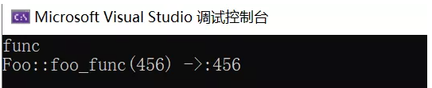
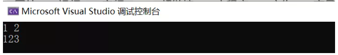
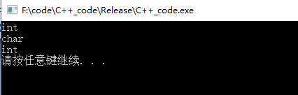
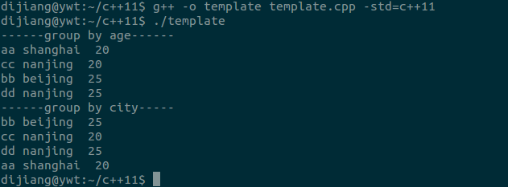
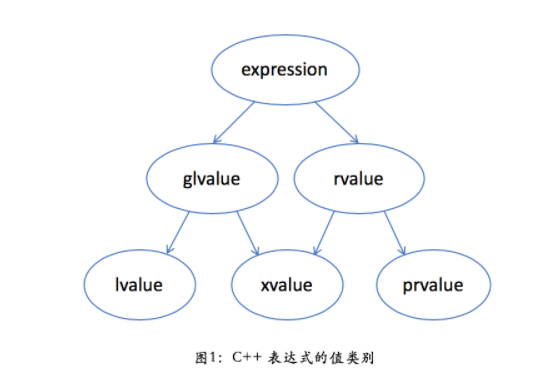
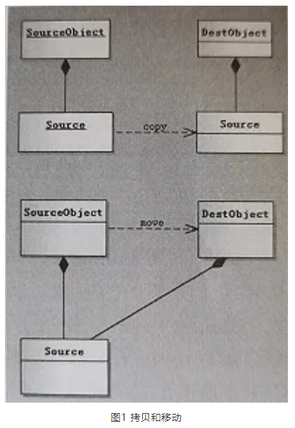
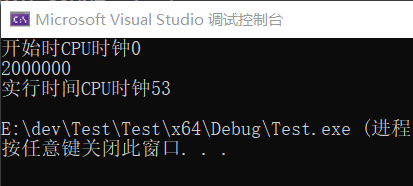
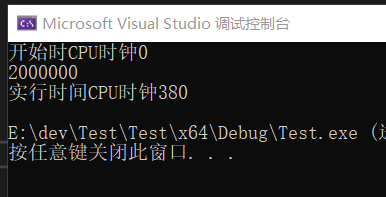

## **C++新特性总结**

* C++是一种静态类型语言，会在编译器进行类型检查。
* 面对一个比较复杂的类型声明语句时，要用**从右向左**读的顺序，离变量名最近的符号对变量类型有最直接的影响。


### C++11新特性：范围for语句

```c++
std::vector<int> vec = {1, 2, 3, 4};
for (auto elem : vec) {
	std::cout << elem << std::endl;
}
```

范围for语句只适用于静态数组和可迭代的对象，不适用于指针数组，如`int* arr = new int[5] {0}`就不可以用范围for语句进行迭代。

范围for语句的缺点是不能得知元素的索引。


> C++11中提供了基于范围的For循环，这样，在遍历容器、数组时就可以使用同一的方式进行，用起来更方便，代码也更整洁。本文中，将以遍历vector容器为例。介绍For循环遍历的技术演进过程。


**1 初级用法**

```c++
#include <iostream>
#include <vector>
int main(){
  std::vector<int> arr;  
  //...  
  for(auto it = arr.begin();it != arr.end();it++){    
  std::cout<<*it<<std::endl;
  }  
  return 0;
}
```

在上面的代码中，使用了auto关键字推导it的类型，忽略了变量类型的定义。


**2 中级用法**

在\<algorithm>头文件中有一个for_each算法，也可以实现上面For循环的功能，使用for_each时不需要关注迭代器，只需要关心容器里面的元素类型，使用这两种方法时，需要关注容器的开始和结尾。使用方法如下：

```c++
#include <algorithm>
#include <iostream>
#include <vector>
void do_print(int n){  
  std::cout<<n<<std::endl;
}
int main(){
  std::vector<int> arr;
  //...  
  for_each(arr.begin();arr.end();do_print);  
  return 0;
}
```


**3 C++11终极武器**

在C++11中，终于提供了基于范围的for循环，下面通过代码看下使用基于范围的for如何实现对vector的遍历。

```c++
#include <iostream>
#include <vector>
int main(){
  std::vector<int> arr;
  //...
  for(auto n : arr){
      std::cout<<n<<std::endl;
  }
  return 0;
}
```

在上面的代码中，使用auto关键字让编译器自动推导n的类型，在这个例子中，n被推导成int型。

n被定义后，在n后加上冒号(:)并加上表达式，for循环会自动将表达式当成是需要遍历的容器。这样在代码中就可以使用基于范围的for循环进行遍历容器了。

如果想在遍历容器的过程中对容器里面的值进行修改，该怎么做呢？大家不妨思考一下。

下面再次对上面的实例进行修改：

```c++
#include <iostream>
#include <vector>
int main(){
  std::vector<int> arr;
  //...
  for(auto &n : arr){
  std::cout<<n<<std::endl;
  }
  return 0;
}
```

从上面的代码可以看出，在n前面添加了引用（&），这样就可以在遍历的过程中进行修改容器的值了。如果不想修改，又想对比较大的容器进行无损耗遍历时可以按照下面的方式进行使用：

```c++
for(const auto &n : arr){
  std::cout<<n<<std::endl;
}
```


### C++11新特性：std::function

讲std::function前首先需要了解下什么是可调用对象

满足以下条件之一就可称为**可调用对象**：

- 是一个函数指针
- 是一个具有operator()成员函数的类对象(传说中的仿函数)，lambda表达式
- 是一个可被转换为函数指针的类对象
- 是一个类成员(函数)指针
- bind表达式或其它函数对象

而std::function就是上面这种可调用对象的封装器，可以把std::function看做一个函数对象，用于表示函数这个抽象概念。std::function的实例可以存储、复制和调用任何可调用对象，存储的可调用对象称为std::function的目标，若std::function不含目标，则称它为空，调用空的std::function的目标会抛出std::bad_function_call异常。


在C++11中，std::function是一个可调用的对象包装器，通过类进行实现，在编码时可以通过指定模板参数使用统一的方式处理函数、函数指针并且可以当做回调函数进行使用。在实际编程时，主要有以下场景：

- 绑定一个函数（普通函数或者静态函数）
- 实现回调函数
- 作为函数入参

接下来，针对上述三种情况分别进行代码实现。


**绑定一个函数**

```c++
#include <functional>
//普通函数
void func(void)
{
    std::cout << __FUNCTION__ << std::endl;
}
//静态类成员函数
class Foo
{
public:
    static int foo_func(int a)
    {
        std::cout << __FUNCTION__ << "(" << a << ") ->:";
        return a;
    }
};
int main(void)
{
    std::function<void(void)> fr = func;
    fr();
    std::function<int(int)> fr1 = Foo::foo_func;
    std::cout << fr1(456) << std::endl;
}
```

如上，运行代码后代码的执行结果为：




**作为回调函数**

```c++
#include <functional>
class A
{
    std::function<void()> callback_;
public:
    A(const std::function<void()>& f) :callback_(f) {};
    void notify(void)
    {
        callback_();
    }
};
class Foo {
public:
    void operator()(void)
    {
        std::cout << __FUNCTION__ << std::endl;
    }
};
int main(void)
{
    Foo foo;
    A aa(foo);
    aa.notify();
}
```

从上面代码可知，std::function 可以取代函数指针，使得函数延迟执行，因此可以当成回调函数使用。


**作为函数入参**

```c++
#include <functional>
void call_when_even(int x, const std::function<void(int)>& f)
{
    if (!(x & 1))
    {
        f(x);
    }
}
void output(int x)
{
    std::cout << x << " ";
}
int main(void)
{
    for (int i = 0; i < 10; ++i)
    {
        call_when_even(i, output);
    }
    std::cout << std::endl;
}
```

函数执行结果为：


**综上：std::function比普通的函数指针更加灵活方便，下期分享将结合std::bind进行使用。**


综合代码示例：

```c++
std::function<void(int)> f; // 这里表示function的对象f的参数是int，返回值是void
#include <functional>
#include <iostream>

struct Foo {
   Foo(int num) : num_(num) {}
   void print_add(int i) const { std::cout << num_ + i << '\n'; }
   int num_;
};

void print_num(int i) { std::cout << i << '\n'; }

struct PrintNum {
   void operator()(int i) const { std::cout << i << '\n'; }
};

int main() {
   // 存储自由函数
   std::function<void(int)> f_display = print_num;
   f_display(-9);

   // 存储 lambda
   std::function<void()> f_display_42 = []() { print_num(42); };
   f_display_42();

   // 存储到 std::bind 调用的结果
   std::function<void()> f_display_31337 = std::bind(print_num, 31337);
   f_display_31337();

   // 存储到成员函数的调用
   std::function<void(const Foo&, int)> f_add_display = &Foo::print_add;
   const Foo foo(314159);
   f_add_display(foo, 1);
   f_add_display(314159, 1);

   // 存储到数据成员访问器的调用
   std::function<int(Foo const&)> f_num = &Foo::num_;
   std::cout << "num_: " << f_num(foo) << '\n';

   // 存储到成员函数及对象的调用
   using std::placeholders::_1;
   std::function<void(int)> f_add_display2 = std::bind(&Foo::print_add, foo, _1);
   f_add_display2(2);

   // 存储到成员函数和对象指针的调用
   std::function<void(int)> f_add_display3 = std::bind(&Foo::print_add, &foo, _1);
   f_add_display3(3);

   // 存储到函数对象的调用
   std::function<void(int)> f_display_obj = PrintNum();
   f_display_obj(18);
}
```


**function的实现原理**

是不是觉得function做的事儿还挺神奇的？它是如何实现的呢？下面我们就来扒一扒它是如何实现的。

从实现上来说，有两种办法可以实现std::function：一种是通过类的多态，即通过虚表来达到多态；另一种方法是通过C语言的函数指针来实现。今天我们只介绍通过类多态的方式来实现function，对于通过函数指针实现的方式你可以自己去研究一下。

现在我们由浅入深的来分解一下function。通过观察我们可以发现function是一个包装类，它可以接收普通函数、**函数类对象**(也就是实现了（）操作符的类对象）等。它是如何做到的呢？

最简单的方式就是通过类模板。我们都知道function的类模板参数是可变的，但我们为了简单，所以只实现有一个参数的function类模板。这也符合我们的目标，只是扒一下实现原理，并不是想自己去实现它。

OK，下面我们来看看该如何定义这个类模板吧。

```c++
template<typename R, typename Arg0>
class myfunction<R(Arg0)> {
   ...
   public:
       R operator()(Arg0 arg0){
           return ...;
       }
};
```

上面的代码定义了一个最简单的，只有一个参数的类模板。它是 **function<int(int)>** 或 **function<String(int)>** 等格式的类模板。这样我们在外型上与标准库中的std::function类似了。

接下来我们需要思考一下，如何让我们自己实现的function可以调用不同的函数呢？从其行为上可以推理出其内部应该有一个指针，而且这个指针具有多态性。想想C++中的多态是如何实现的？通过继承和虚表对吧。所以在function内部应该有一个基类指针，所有传入到function中的函数、类函数对象等都应该是继承于该类的子类成员。除此之外，还要在**()**操作符前加`virtual`关键字，让它创建虚表。

了解了上面的原理后，下面我们就在自己的function中增加基类及其类的指针。代码如下：

```c++
template<typename R, typename Arg0>
class myfunction<R(Arg0)> function {

    private:
        class __callbase {
            public:
                virtual R operator()(Arg0 arg0) = 0;
                virtual ~__callbase() {}
        };

        __callbase *base_;

        ...

    public:
        ...
        R operator()(Arg0 arg0){
            return (*__callbase)(arg0); //这里调用基类对象的()操作符
        }

};
```

上面我们就将多态中的基类实现好了，在上面的代码中最关键是的`operator()`中增加了**virtual**关键字，这样该函数就被放到了vtable中，后面就可以在子类中实现该方法了。下面我们来实现子类。

```c++
...
class myfunction<R(Arg0)> function{
    private:
        ...

        template<typename F>
        class __callable: public __callbase {

            public:
                callable(F functor)
                    : functor(functor){}

                virtual R operator()(Arg0 arg0) {
                    return functor(arg0);
                }

            private:
                F functor;
        };

        ...
    public:
        ...
        template<typename F>
        myfunction(F f): base_(new __callable<F>(f)){
        }

        ~myfunction(){
            if(base_) {
                delete base_;
                base_ = nullptr;
            }
        }
};
```

在子类的实现中，核心点是增加指向赋值给function类的函数指针或函数类对象，也就是上面`__callable`类中的**F functor** 成员。该成员的类型是通过模板`template<typename F>`推导出来的。如果我们在创建function时传入的是函数，那么functor就是一个函数指针，如果我们传入的是函数类对象，则functor就是类对象。

另外你可以发现，我分别在myfunction类的构造函数和`__callable`类前定义了模板`F`，这样当我们在main函数中创建myfunction对象时，通过类型推导就可以获到F的具体类型了。代码如下：

```c++
int print(int a){
    ...
    return 0;
}

int main(...){
    ...
    myfunction myfunc(print); //通过这句可以获得F类型为函数指针
}
```

有了functor成员后，还需要在构造`__callable`时给functor赋值，也就是让functor指向具体的函数或函数类对象。之后重载**()**操作符就可以直接调用具体的函数或函数类对象了。

通过以上讲解我想你应该已经知道标准库中的function实现的基本原理了。当然我们这里实现的比较简陋，真正的实现还要考虑很多性能的问题，所以实现的要比这个复杂得多。另外标准库中的实现是通过函数指针来实现的而非通过C++的多态。

不过我们今天实现的的myfunction虽然与标准库有很多不同，但原理都是类似的，对于我们理解function已经足够了。


### C++11新特性：std::bind()

在上一期中，介绍了std::function，本节将和大家说一下bind绑定器，它可以将调用对象与调用参数一起绑定，然后将绑定的结果保存在std::function中，并延迟调用到任何我们需要的时候。

std::bind通常有两大作用：

- 将可调用对象与参数一起绑定为另一个std::function供调用
- 将n元可调用对象转成m(m < n)元可调用对象，绑定一部分参数，这里需要使用std::placeholders


**std::bind的基本用法**

```c++
void call_when_even(int x, const std::function<void(int)>& f)
{
    if (!(x & 1))
    {
        f(x);
    }
}
void output(int x)
{
    std::cout << x << " ";
}
void output_add_3(int x)
{
    std::cout << x + 3 << " ";
}
int main(void)
{
    auto fr = std::bind(output, std::placeholders::_1);
    for (int i = 0; i < 10; ++i)
    {
        call_when_even(i, fr);
    }
    std::cout << std::endl;
    {
        auto fr = std::bind(output_add_3, std::placeholders::_1);
        for (int i = 0; i < 10; ++i)
        {
            call_when_even(i, fr);
        }
        std::cout << std::endl;
    }
    return 0;
}
```

代码执行结果为：


在上面的代码中，通过使用std::bind在函数的外部绑定了不同的函数，实现最终结果的转换。


**std::bind的占位符**

```c++
void outputxy(int x, int y)
{
    std::cout << x << " " << y << std::endl;
}
int main(void)
{
    std::bind(outputxy, 1, 2)();//输出1,2
    std::bind(outputxy, std::placeholders::_1, 2)(2);//输出2,2
    std::bind(outputxy, 2, std::placeholders::_1)(1);//输出2,1
    std::bind(outputxy, std::placeholders::_2, std::placeholders::_1)(1, 2);//输出2,1
    return 0；
}
```


**std::bind和std::function配合使用**

```c++
class B
{
public:
    int i_ = 0;
    void output(int x, int y)
    {
        std::cout << x << " " << y << std::endl;
    }
};
int main(void)
{
    B b;
    std::function<void(int, int)> fr = std::bind(&B::output, &b, std::placeholders::_1, std::placeholders::_2);
    fr(1, 2);//输出1 2
    std::function<int& (void)> fr_i = std::bind(&B::i_, &b);
    fr_i() = 123;// 输出123
    std::cout << b.i_ << std::endl;
    return 0;
}
```

代码运行结果为：



上述代码中，通过bind函数将B的成员函数指针和b进行绑定，同时转换为一个仿函数存入fr中。同理，第二步中将B的成员函数i_和a进行了绑定。由此可知，function和bind配合使用后，所有的可调用对象都可以使用统一的操作方法。


std::bind具体示例：

```c++
#include <functional>
#include <iostream>
#include <memory>

void f(int n1, int n2, int n3, const int& n4, int n5) {
   std::cout << n1 << ' ' << n2 << ' ' << n3 << ' ' << n4 << ' ' << n5 << std::endl;
}

int g(int n1) { return n1; }

struct Foo {
   void print_sum(int n1, int n2) { std::cout << n1 + n2 << std::endl; }
   int data = 10;
};

int main() {
   using namespace std::placeholders;  // 针对 _1, _2, _3...

   // 演示参数重排序和按引用传递
   int n = 7;
   // （ _1 与 _2 来自 std::placeholders ，并表示将来会传递给 f1 的参数）
   auto f1 = std::bind(f, _2, 42, _1, std::cref(n), n);
   n = 10;
   f1(1, 2, 1001);  // 1 为 _1 所绑定， 2 为 _2 所绑定，不使用 1001
                    // 进行到 f(2, 42, 1, n, 7) 的调用

   // 嵌套 bind 子表达式共享占位符
   auto f2 = std::bind(f, _3, std::bind(g, _3), _3, 4, 5);
   f2(10, 11, 12);  // 进行到 f(12, g(12), 12, 4, 5); 的调用

   // 绑定指向成员函数指针
   Foo foo;
   auto f3 = std::bind(&Foo::print_sum, &foo, 95, _1);
   f3(5);

   // 绑定指向数据成员指针
   auto f4 = std::bind(&Foo::data, _1);
   std::cout << f4(foo) << std::endl;

   // 智能指针亦能用于调用被引用对象的成员
   std::cout << f4(std::make_shared<Foo>(foo)) << std::endl;
}
```


### C++11新特性：lambda表达式

C++11中，Lambda表达式是最常用的特性之一，有过java、python以及C#开发经验的人对lambda功能都不会陌生。lambda表达式来源于函数式编程，具备以下优点：

- 代码简洁、避免代码膨胀和功能分散，也利于功能维护
- 功能就近实现，程序更加灵活
- 函数式编程，可读性强


**lambda表达式概念和语法**

lambda实际上是一个匿名函数，运行时能够捕获到程序范围内的变量，其定义方式如下：

```c++
[capture] (params) opt -> ret {body;} ;
```


在上面的定义中，capture可以根据不同的取值，捕获不同范围内的变量，具体如下：

| capture形式 | 说明                                |
| ----------- | ----------------------------------- |
| []          | 不捕获变量                          |
| [&]         | 引用捕获，捕获所有变量              |
| [=]         | 按值捕获，捕获所有变量              |
| [=,&foo]    | 按值捕获所有变量，按引用捕获foo变量 |
| [foo]       | 按值捕获foo，不捕获其他变量         |
| [this]      | 捕获类中的this指针                  |

params是参数列表；opt是函数选项（如mutable）；ret是返回值类型；body是函数体，当然在实际的使用中，lambda表达式也可以省略函数返回值的定义。省略函数返回值的lambda表达式定义可以参考下面的示例：

```c++
auto fr = [](int a) { return (a+1); };
```

上面的代码在编译时，编译器会根据return的语句进行自动推导。

lambda表达式按值捕获参数时是不能够修改捕获的变量的，如果要进行修改，改如何做？


**如何修改按值捕获的变量？**

在使用lambda表达式时，如果使用按址引用，可以修改捕获的变量，如果是按值捕获同时又要修改变量时需要在定义时使用mutable关键字，而且要进行显示说明，如：

```c++
int a = 0;
auto fr = [=]() mutable {return a++;};
```

当lambda表达式按值捕获时，其实lambda表达式就相当于是一个仿函数，仿函数是一个有operator()成员函数的类对象，这个operator()默认是const的，所以不能修改成员变量，而加了mutable，就是去掉const属性。

在这里需要提醒大家，如果要在lambda表达式中使用mutable，不管表达式中有没有参数选项，都要把参数列表加上。

**由此可见：mutable的作用就要要取消const的作用。**


**lambda表达式和std::function配合使用**

在C++11中，lambda表达式类型又叫做“闭包类型”（Closure）。可以认为是一个带有operator()的类，于是可以将其和function配合使用，使用方法如下：

```c++
std::function<int(int)> fr = [](int a) {return a; };
```

同理，也可以和std::bind配合使用，只要将上面的代码稍作修改即可完成，具体如下：

```c++
std::function<int(void)> fr = std::bind([](int a) {return a; },123);
std::cout<<"fr()="<<fr()<<std::end;
```

如上：函数输出值为：123


**lambda表达式自定义stl的规则**

例如自定义sort排序规则：

```c++
struct A {
   int a;
   int b;
};

int main() {
   vector<A> vec;
   std::sort(vec.begin(), vec.end(), [](const A &left, const A &right) { return left.a < right.a; });
}
```


**最后，以一个lambda的例子结束本文：**

```c++
#include <vector>
#include <iostream>
#include <algorithm>
#include <functional>
int main()
{
    std::vector<int> c{ 1,2,3,4,5,6,7 };
    int x = 5;
    c.erase(std::remove_if(c.begin(), c.end(), [x](int n) { return n < x; }), c.end());
    std::cout << "c: ";
    for (auto i : c) {
        std::cout << i << ' ';
    }
    std::cout << '\n';
    // the type of a closure cannot be named, but can be inferred with auto
    auto func1 = [](int i) { return i + 4; };
    std::cout << "func1: " << func1(6) << '\n';
    // like all callable objects, closures can be captured in std::function
    // (this may incur unnecessary overhead)
    std::function<int(int)> func2 = [](int i) { return i + 4; };
    std::cout << "func2: " << func2(6) << '\n';
}
```


### C++11新特性：自动类型推导：auto、decltype

**auto** variable

**decltype**(expression)


什么时候使用auto呢？简单类型其实没必要使用auto，然而某些复杂类型就有必要使用auto，比如lambda表达式的类型，async函数的类型等，例如：

```c++
auto func = [&] {
    cout << "xxx";
}; // 对于func你难道不使用auto吗，反正我是不关心lambda表达式究竟是什么类型。

auto asyncfunc = std::async(std::launch::async, func);
```

> 在C++11中，C++标准协会引入了两个关键字，分别是：auto、decltype。这两个关键字实现了类型推导，使用这两个关键字不仅能获取复杂的数据类型，还能使代码更简洁，提高代码编写效率。


**一、auto类型推导**

**1 旧壶装新酒**

auto关键字并不是C++11新增的，在之前的版本中auto像幽灵一样的存在，它只是默默的躺在一个角落，等待着我们的临幸。终于有一天，它引起了人们的注意，这一次是不幸也是机会，它改变了原有的装饰换上了新的外衣。

在C++98/03中，auto一直是作为**存储型关键字，代表着“具有自动存储期的局部变量”**，乍听上去，十分的高大上，但是它的作用却非常小，很少被大家使用，主要是因为非静态型的局部变量本身就是具备“自动存储期的”。在老的版本中auto关键字使用方法如下：

```c++
auto int i=0;//可以直接使用 int i=0;进行替换
```

也正是因为这种原因，auto关键字在最新的C++11中被赋予了新的含义，**这一次它将作为类型指示符的形式出现，用来提示编译器对此类型的变量进行类型推导**。就像是齐天大圣身披五彩霞衣，脚踏七彩祥云而来。


在早期C/C++中auto的含义是：使用auto修饰的变量，是具有自动存储器的局部变量。

```cpp
int a =10 ;  //拥有自动生命期
auto int b = 20 ;//拥有自动生命期
static int c = 30 ;//延长了生命期
```


C++11中，auto有了全新的含义即：auto不再是一个存储类型指示符，而是作为一个新的类型指示符来指示编译器，**auto声明的变量必须由编译器在编译时期推导而得**。

通俗地讲，auto关键字是可以自动推导变量类型的。

auto的自动类型推断发生在编译期，所以使用auto并不会造成程序运行时效率的降低。而是否会造成编译期的时间消耗，我认为是不会的，在未使用auto时，编译器也需要得知右操作数的类型，再与左操作数的类型进行比较，检查是否可以发生相应的转化，是否需要进行隐式类型转换。


**auto和decltype的底层原理：**

一句话：**模板实参推断**

auto使用的是**模板实参推断**（Template Argument Deduction）的机制。auto被一个虚构的模板类型参数T替代，然后进行推断，即相当于把变量设为一个[函数参数](https://www.zhihu.com/search?q=函数参数&search_source=Entity&hybrid_search_source=Entity&hybrid_search_extra={"sourceType"%3A"answer"%2C"sourceId"%3A489015726})，将其传递给模板并推断为实参，auto相当于利用了其中进行的实参推断，承担了模板参数T的作用。比如

```cpp
template<typename Container>
void useContainer(const Container& container)
{
    auto pos = container.begin();
    while (pos != container.end())
    {
        auto& element = *pos++;
        … // 对元素进行操作
    }
}
```

其中第一个auto的初始化相当于下面这个模板传参时的情形，T就是为auto推断的类型

```cpp
// auto pos = container.begin()的推断等价于如下调用模板的推断
template<typename T>
void deducePos(T pos);

deducePos(container.begin());
```

而[auto类型变量](https://www.zhihu.com/search?q=auto类型变量&search_source=Entity&hybrid_search_source=Entity&hybrid_search_extra={"sourceType"%3A"answer"%2C"sourceId"%3A489015726})不会是引用类型*（模板实参推断的规则）*，所以要用auto&*（C++14支持直接用decltype(auto)推断原始类型）*，第二个auto推断对应于下面这个模板传参时的情形，同样T就是为auto推断的类型

```cpp
// auto& element = *pos++的推断等价于如下调用模板的推断
template<typename T>
void deduceElement(T& element);

deduceElement(*pos++);
```

唯一例外的是对初始化列表的推断，auto会将其视为std::initializer_list，而模板则不能对其推断

```cpp
auto x = { 1, 2 }; // C++14禁止了对auto用initializer_list直接初始化，必须用=
auto x2 { 1 }; // 保留了单元素列表的直接初始化，但不会将其视为initializer_list
std::cout << typeid(x).name(); // class std::initializer_list<int>
std::cout << typeid(x2).name(); // C++14中为int

template<typename T>
void deduceX(T x);

deduceX(x); // 错误：不能推断T
```

C++14还允许auto作为返回类型，但此时auto仍然使用的是模板实参推断的机制，因此返回类型为auto的函数如果返回一个初始化列表，则会出错

```cpp
auto newInitList() { return { 1 }; } // 错误
```

decltype比auto更确切地推断名称或表达式的类型*（即原始的[declared type](https://www.zhihu.com/search?q=declared+type&search_source=Entity&hybrid_search_source=Entity&hybrid_search_extra={"sourceType"%3A"answer"%2C"sourceId"%3A489015726})）*，实现原理应该和auto类似，只是特殊情况不太一样，具体实现需要更多考虑

```cpp
int i = 0;
decltype(i) x; // int x
decltype((i)) y = i; // int& y
decltype(i = 1) z = i; // int& z
std::cout << i << z; // 00
```


需要注意的是，auto不是一个类型的“声明”，而是一个“占位符”，编译器在编译期会将auto替换为变量实际的类型。使用auto定义变量时必须对其进行初始化，在编译阶段编译器需要根据初始化表达式来推导auto的实际类型。它自动推导变量类型是根据“=”右侧的变量类型决定的。下面是一段例子：

```cpp
#include <iostream>
#include <typeinfo>
using namespace std;

int TestAuto()
{
	return 10;
}

int main()
{
	int a = 10;
	auto b = a;//由a是int，可以推导出b的类型是int
	auto c = 'a';//由‘a’推导出c的类型是char
	auto d = TestAuto();
	cout << typeid(b).name() << endl;
	cout << typeid(c).name() << endl;
	cout << typeid(d).name() << endl;

    auto e;//这条语句编译不通过，使用auto定义变量时，必须对其进行初始化
    system("pause");
    return 0;

}
//typeid(b).name()是打印类型名称的函数
```




1. auto与指针和引用结合起来使用

用auto声明指针类型时，用auto和auto*没有任何区别，但用auto声明引用类型时则必须加&

```cpp
int main()
{
  int x = 10;
  auto a = &x;
  auto* b = &x;
  auto& c = x;
  cout << typeid(a).name() << endl;
  cout << typeid(b).name() << endl;
  cout << typeid(c).name() << endl;
  *a = 20;
  *b = 30;
  c = 40;
  return 0;
}
```


2. 在同一行定义多个变量
   当在同一行声明多个变量时，这些变量必须是相同的类型，否则编译器将会报错，因为编译器实际只对
   第一个类型进行推导，然后用推导出来的类型定义其他变量。

```cpp
#include <iostream>
using namespace std;

void TestAuto()
{
	auto a = 1, b = 2;
	//auto c = 3, d = 4.0;//错误
	auto c = 3, d = 4;//正确
	cout << c << endl;
	cout << d << endl;
}

int main()
{
	TestAuto();
	

	system("pause");
	return 0;

}
```

不可以使用的场景：

1. auto不能作为函数的参数

 参数要被编译成指令，但是开辟空间时候需要知道空间大小，auto做参数不知道多大，那么栈帧也不知道开多大。

```cpp
// 此处代码编译失败，auto不能作为形参类型，因为编译器无法对a的实际类型进行推导
void TestAuto(auto a)
{}
```


2. auto不能直接用来声明数组

```cpp
void TestAuto()
{
	int a[] = { 1, 2, 3 };
	auto b[3] = a;//auto类型不能出现在顶级数组类型中
}
```


因为数组也涉及大小，在下面的例子中，a的类型严格来说是 int [3]，所以b的大小也不确定。

3. 为了避免与C++98中的auto发生混淆，C++11只保留了auto作为类型指示符的用法
4. auto在实际中最常见的优势用法是C++11提供的新式for循环，还有lambda表达式等进行配合使用。

```cpp
#include <iostream>
using namespace std;

int main()
{
	int array[] = { 1, 2, 3, 4, 5 };
	for (auto e : array)//依次取array里面的元素读给e
		cout << e << endl;
	

	system("pause");
	return 0;

}
```


5. auto不能定义类的非静态成员变量

 

6. 实例化模板时不能使用auto作为模板参数

```cpp
//在定义模板函数时，用于声明依赖模板参数的变量类型。
template <typename _Tx,typename _Ty>
void Multiply(_Tx x, _Ty y)
{
    auto v = x*y;
    std::cout << v;
}

//若不使用auto变量来声明v，那这个函数就难定义啦，不到编译的时候，谁知道x*y的真正类型是什么呢？
//模板函数依赖于模板参数的返回值
template <typename _Tx, typename _Ty>
auto multiply(_Tx x, _Ty y)->decltype(x*y)
{
    return x*y;
}
```


当模板函数的返回值依赖于模板的参数时，我们依旧无法在编译代码前确定模板参数的类型，故也无从知道返回值的类型，这时我们可以使用auto。格式如上所示。

decltype操作符用于查询表达式的数据类型，也是C++11标准引入的新的运算符，其目的也是解决泛型编程中有些类型由模板参数决定，而难以表示它的问题。
auto在这里的作用也称为返回值占位，它只是为函数返回值占了一个位置，真正的返回值是后面的decltype(_Tx*_Ty)。为何要将返回值后置呢？如果没有后置，则函数声明时为：

decltype(x*y)multiply(_Tx x, _Ty y)
而此时x,y还没声明呢，编译无法通过。

* 如果初始化表达式为const或volatile（或者两者兼有），则除去const/volatile语义。

const int a1 = 10;
auto  b1= a1; //b1的类型为int而非const int（去除const）
const auto c1 = a1;//此时c1的类型为const int
b1 = 100;//合法
c1 = 100;//非法

* 如果auto关键字带上&号，则不去除const语意。

const int a2 = 10;
auto &b2 = a2;//因为auto带上&，故不去除const，b2类型为const int
b2 = 10; //非法
这是因为如何去掉了const，则b2为a2的非const引用，通过b2可以改变a2的值，则显然是不合理的。

* 初始化表达式为数组时，auto关键字推导类型为指针。

int a3[3] = { 1, 2, 3 };
auto b3 = a3;
cout << typeid(b3).name() << endl;
程序将输出

int *

* 若表达式为数组且auto带上&，则推导类型为数组类型。

int a7[3] = { 1, 2, 3 };
auto & b7 = a7;
cout << typeid(b7).name() << endl;
程序输出

int [3]

* 函数或者模板参数不能被声明为auto

void func(auto a)  //错误
{
//... 
}

* 时刻要注意auto并不是一个真正的类型。
  auto仅仅是一个占位符，它并不是一个真正的类型，不能使用一些以类型为操作数的操作符，如sizeof或者typeid。

cout << sizeof(auto) << endl;//错误
cout << typeid(auto).name() << endl;//错误


**2 auto的推导规则**
auto的推导规则总体来说有两个，分别是：

- 当不声明为指针或者引用时，auto的推导结果和初始化表达式将抛弃引用和cv限定字符类型一致。
- 当声明为指针或者引用时，auto的推导结果将保持初始化表达式的cv属性。

为了更好的理解，下面通过几个例子进行说明：

```c++
int x=0;
auto *a = &x;
auto b=&x;
auto &c = x;
auto d=c;
const auto e=x;
auto f=e;
const auto &g=x;
auto &h=g;
```

由事例可知：

- a和c中的auto被替换成了int，a和c被推导为int *
- b在推导时被推导出为指针类型
- d被赋值为一个表达式引用时，被直接推导成了int值类型
- e中的const auto会直接替换成const int
- f中的赋值表达式带有const限定符时，会直接将const属性抛弃，变成int
- g和h说明，当auto和&结合使用时，编译器的推导结果将保留原有的const属性。


**3 auto的限制**

auto的使用限制主要如下：

- auto关键字是不能使用在函数参数中的
- auto不能应用于非静态成员变量
- auto无法定义数组
- auto无法推导出模板参数

4、auto的使用场景

- 遍历容器的循环体中

```c++
#include<map>
int main(){
std::vector<int> v;
//...对容器进行赋值
for(auto it=v.begin();it!=v.end();it++){
//do some thing
}
return 0;
}
```

大家可以思考下，相对老的迭代器的定义C++11的写法和原来的有什么不同？

- 泛型函数

```c++
class Foo{
public:
  static int get(){
    return 0;
  }
};
class Bar{
public:
  static const char *get(){
    return "0";
  }
};

template <class A>
void func(){
  auto val = A::get();
}

int main(){
  func<Foo>();
  func<Bar>();
  return 0;
}
```

在上面的代码中，定义了一个泛型函数func，能够调用具有静态方法get的类型A，在get返回值后做统一的处理。如果不使用auto，则需要在新增一个模板参数，在调用get后针对不同的返回类型做对应的处理。


**auto在褪去了旧衣衫后被赋予了新的含义，具有强大的功能，但是他也同时具有两面性，用的不欠当则会使代码的可读性和可维护性变得糟糕。因此大家在使用auto的时候要考虑它带来的价值和烦恼。**


**二、decltype推导类型**

C++11中新增了decltype关键字，主要的功能是在编译时推导出一个表达式的类型，它的语法格式如下：

```c++
decltype(exp) //exp为一个表达式
```


**1 decltype的推导规则**

decltype的推导规则如下：

- exp是标识符或者类访问表达式时，decltype（exp）的结果和exp表达式一致
- exp是函数调用时，decltype(exp)的结果是函数的返回值的类型
- 除上述两种外，如果exp是一个左值，则decltype(exp)的结果是exp类型的左值引用，否则和exp类型一致

按照上面的规则，借助代码可以理解如下：

**1）标识符是表达式或者类访问表达式时**

```c++
 class Foo{
 public:
   static const int number=0;
   int x;
 };
 int n=0;
 volatile const int &x=n;
 decltype(n) a=n;//a为int型
 decltype(x) b=n;//b的类型为volatile const int &
 decltype(Foo::number) c=0;//c的类型为const int
 Foo foo;
 decltype(foo.x) d=0;//d为整型
```

由上面的事例可以得知，上面的类型推导结果是符合规则1的。


**2）函数调用**

```c++
int func_int_r();//返回值为整型
int &func_int_rr()//返回值为整型地址
decltype(func_int_r()) x=0;//x为整型
decltype(func_int_rr()) y=0;//y为一个整型的引用,既：y--> int &
```


**3)带括号的表达式和加法运算表达式**

```c++
struct Foo{int x;};
const Foo foo = Foo();
decltype(foo.x) a=0;//a为int
decltype((foo.x)) b=a; //b为const int &
int n=0,m=0;
decltype(n+m) c=0;//c为int
decltype(n+=m) d=c;//c为int &
```

从上面的例子可以看出，给表达式加上一对括号，decltype推导出的类型是不一样的，a,c是符合规则1的，b，d符合规则3。


**2 decltype的实际应用**

在实际的编程中，decltype多应用于泛型，请看下面的代码：

```c++
template <class Container>
class Foo{
  decltype(Container().begin()) iter;
  public:
    void func(Container &container){
      iter = container.begin();
    }
    //....
};
```

使用decltype编写泛型是不是简单的多了，不用再像老的C++标准一样，如果想要迭代器支持更多的类型。还需要单独进行编写。


**3 auto和decltype结合使用，返回类型后置语法**

在C++11中，增加了返回类型后置语法，又称为：跟踪返回类型，具体实现是将auto和decltype结合起来进行使用，共同完成返回值类型的推导。如下代码所示：

```c++
template <typename T,typename U>
auto add(T t,U u) -> decltype(t+u){
  return t+u;
}
```

为了帮助大家理解，再举一个例子：

```c++
int &foo(int &i);
float foo(float &f);
template <typename T>
auto func(T &val) -> decltype(foo(val)){
  return foo(val);
}
```

通过代码可以看出，下面的例子使用老版本的C++代码是不可能完成的，返回值类型后置语法主要是为了解决函数返回值类型依赖参数而导致的返回值类型不确定的情况，有了这种语法，就可以清晰的解决此类问题，避免C++98那种晦涩难懂的语法。


### C++11新特性：std::result_of 推导可调用对象

Defined in header `<type_traits>`  

std::result_of用法

template <class Fn, class... ArgTypes>

class result_of<Fn(ArgTypes...)>


头文件:

<type_traits>


用于在编译的时候推导出一个可调用对象(函数,std::funciton或者重载了operator()操作的对象等)的返回值类型.主要用于模板编写中.

模板参数:
Fn
         可调用对象

ArgTypes...
         参数列表. 注意是类型(int , string等)
成员:
type
         可调用对象的返回类型.(主要用该成员来获得结果)

一个简单的实例:

```cpp
#include <iostream>
#include <type_traits>
 
int fn(int) {return int();}                            // function
typedef int(&fn_ref)(int);                             // function reference
typedef int(*fn_ptr)(int);                             // function pointer
struct fn_class { int operator()(int i){return i;} };  // function-like class
 
int main() {
  typedef std::result_of<decltype(fn)&(int)>::type A;  // int
  typedef std::result_of<fn_ref(int)>::type B;         // int
  typedef std::result_of<fn_ptr(int)>::type C;         // int
  typedef std::result_of<fn_class(int)>::type D;       // int
 
  std::cout << std::boolalpha;
  std::cout << "typedefs of int:" << std::endl;
 
  std::cout << "A: " << std::is_same<int,A>::value << std::endl;
  std::cout << "B: " << std::is_same<int,B>::value << std::endl;
  std::cout << "C: " << std::is_same<int,C>::value << std::endl;
  std::cout << "D: " << std::is_same<int,D>::value << std::endl;
 
  return 0;
}
```

输出结果:

```
typedefs of int:
A: true
B: true
C: true
D: true
```


一个模板中应用的实例:

有一个vector<Person>,Person就是一个简单的结构体,包含name,age,city三个字段,想要编写一个Group_by函数,实现对这个vector<Person>按Person的某个字段分组.

因为字段未定,编写一个模板比较好.

思路是向Group_by传一个函数,让用户决定这个字段.分组比较简单,数据插入一个multimap<T,Person>返回即可,但是定义multimap中的T类型由用户传入的函数决定.于是这时候就可以用result_of来确定函数的返回值,即T的类型.

```cpp
#include<iostream>
#include<map>
#include<string>
#include<vector>
#include<algorithm>
#include <utility>
using namespace std;
 
struct Person
{
    string name;
    int age;
    string city;    
};
 
vector<Person> vt ={
    {"aa",20,"shanghai"},
    {"bb",25,"beijing"},
    {"cc",20,"nanjing"},
    {"dd",25,"nanjing"}
};
 
//Group_by函数
template<typename Fn>
multimap<typename result_of<Fn(Person)>::type, Person> GroupBy(const vector<Person>& vt,const Fn& keySelect)
{
	typedef typename result_of<Fn(Person)>::type key_type;
	multimap<key_type,Person> map;
        for_each(vt.begin(),vt.end(),
                    [&](const Person& p){
                    map.insert(make_pair(keySelect(p),p));
                    });
    return map;
}
 
int main()
{   
    //按年龄分组
    auto res = GroupBy(vt, [](const Person& p){ return p.age; });
    //按城市分组
    auto res1 = GroupBy(vt, [](const Person& p) { return p.city; });
 
    //打印结果
    cout << "----------group by age:---------------" << endl;
    for_each(res.begin(),res.end(),[](decltype(res)::value_type & p){
                    cout << p.second.name <<" " << p.second.city << "  " << p.second.age  << endl;
                    });
    cout << "----------group by city:---------------"<< endl;
    for_each(res1.begin(),res1.end(),[](decltype(res1)::value_type & p){
                    cout << p.second.name <<" " << p.second.city << "  " << p.second.age  << endl;
                    });
    return 0;
}
```

运行结果:



写在最后:

本例还可以不使用std::result_of的方法,通过尾置返回类型推导实现


### C++11新特性：类型推导方式对比

下面来看几个类型推导方式的对比，c++之std::declval 和 decltype以及std::result_of，invoke_result


**std::decltype**

decltype(expr) 是一个 C++11 新增的关键字，它的作用是将实体或者表达式的类型求出来。其最重要的点在于能不经过运算，直接推导出类型，但是其问题在于如果类对象，必须要成功构造。

```c++
auto a = value;
decltype(exp) b = value; //exp需要可运行
```

同时，其可以配合auto来进行类型推导，例如
auto test_decltype2(Fn f, Args… args) -> decltype(f(args…)){
与std::declval的区别如下，declval需要把每个参数和fn转成引用，其可跳过构造
decltype(std::declval< Fn>()(std::declval< Args>()…)) test_decltype1(Fn f,Args… args){


**std::declval**

declval将T转换成引用类型，配合decltype使用，跳过构造函数使用成员函数

```cpp
定义于头文件 <utility>
template<class T>
typename std::add_rvalue_reference<T>::type declval() noexcept;  //配合decltype 表达式使用

将任意类型 T 转换成引用类型，令在 decltype 表达式中不必经过构造函数就能使用成员函数。
通常在模板中使用 declval ，模板接受的模板实参通常可能无构造函数，但有同一成员函数，均返回所需类型。
注意， declval 只能用于不求值语境，且不要求有定义；求值包含此函数的表达式是错误。通常，若 odr 使用此函数被则程序为病式。
```

注意引用折叠

```cpp
std::add_lvalue_reference<T&>::type 是 T&
std::add_lvalue_reference<T&&>::type 是 T&
std::add_rvalue_reference<T&>::type 是 T&
std::add_rvalue_reference<T&&>::type 是 T&&

```


**std::result_of, std::invoke_result**

```cpp
Defined in header <type_traits>
template< class >
class result_of; // not defined

template< class F, class... ArgTypes >
class result_of<F(ArgTypes...)>;  (1)	(since C++11) (deprecated in C++17) (removed in C++20)
template< class F, class... ArgTypes>
class invoke_result;
只有当F可调用时，才返回type

template< class T >
using result_of_t = typename result_of<T>::type;  (1)	(since C++14) (deprecated in C++17) (removed in C++20)
template< class F, class... ArgTypes>
using invoke_result_t = typename invoke_result<F, ArgTypes...>::type;

```

> result_of与invoke_result的区别在于使用方式，
> std::result_of_t<Fn(Args…)> test_decltype3(Fn f, Args… args) {
> std::invoke_result_t<Fn,Args…> test_decltype4(Fn f, Args… args) {


**具体代码分析：**

```cpp
#include<utility>
#include<iostream>
#include <functional>

#include <type_traits>

int test(int a,int b){
    int c = a+b;
    std::cout<<"Run Test"<<c<<std::endl;
    return c;
}

class Kyoe
{
  public:
  Kyoe(int a){std::cout<<"construct Kyoe"<<std::endl;}
  int fun(){std::cout<<"fun Kyoe"<<std::endl;return 1;};
};
class Tyoe
{
  public:
  Tyoe(){std::cout<<"construct Tyoe"<<std::endl;}
  int fun(){std::cout<<"fun Tyoe"<<std::endl;return 1;};
};

class Jyoe
{
  public:
  Jyoe(const Jyoe& jy){std::cout<<"copy construct"<<std::endl;}  //创建拷贝构造函数后，编译器不会自动创建默认构造函数
    int fun(){std::cout<<"fun Jyoe"<<std::endl;return 1;};
};
/* 无法通过编译
template<typename Fn, typename... Args>
decltype(Fn(Args...)) test_decltype3(Fn f, Args... args) {
    std::cout<<"Run Test_Decltype3"<<std::endl;
    auto res = f(args...);
    return res;
}
*/

template<typename Fn, typename... Args>
std::result_of_t<Fn(Args...)> test_decltype3(Fn f, Args... args) {
    std::cout<<"Run Test_Decltype3"<<std::endl;
    auto res = f(args...);
    return res;
}

template<typename Fn, typename... Args>
std::invoke_result_t<Fn,Args...> test_decltype4(Fn f, Args... args) {
    std::cout<<"Run Test_Decltype4"<<std::endl;
    auto res = f(args...);
    return res;
}

template<typename Fn, typename... Args>
auto test_decltype2(Fn f, Args... args) -> decltype(f(args...)){ //这里必须这么使用，因为decltype需要实例化，但是f需要在入参中先声明，而declval则不需要，可以写成临时变量类型
    std::cout<<"Run Test_Decltype2"<<std::endl;
    auto res = f(args...);
    return res;
}

template<typename Fn,typename... Args>
decltype(std::declval<Fn>()(std::declval<Args>()...)) test_decltype1(Fn f,Args... args){
    std::cout<<"Run Test_Decltype1"<<std::endl;
    auto res = f(args...);
    return res;
}


int main(int agrc,char *argv[]){

    std::invoke(test,1,2);   //这里正常invoke执行函数
    decltype(std::invoke(test,1,2)) d; //这里是获取invoke的返回值类型，并未运行test函数，因为decltype不需要计算表达式，直接推导
    decltype(Tyoe().fun()) n = 1;  //这里同上，并未运行fun，但是必须要可构造并执行
    //decltype(Jyoe().fun()) m = 1;  //这里失败，因为没有默认构造函数，导致创建失败
    decltype(std::declval<Jyoe>().fun()) m = 1;  //这里可以成功，declval可以不经过构造函数直接使用成员函数
    std::result_of_t<decltype(&test)(int,int)> b = 1;   //这里注意invoke_result_t与result_of_t的使用上的区别
    //std::result_of_t<decltype(test)(int,int)> b = 1;
    std::invoke_result_t<decltype(test),int,int> a = 1;  
    auto res0 = test_decltype1(test,1,2);  //
    auto res1 = test_decltype2(test,1,3);
    auto res2 = test_decltype3(test,1,3);
    auto res3 = test_decltype4(test,1,3);

    std::cout<<"Main Res0: "<<res0<<std::endl;
    std::cout<<"Main Res1: "<<res1<<std::endl;

    return 0;

}
```

运行结果：

```
liuge@liuge-VirtualBox:~/Documents/mytest$ g++ -std=c++20 construct.cc -o construct
liuge@liuge-VirtualBox:~/Documents/mytest$ ./construct
Run Test3
Run Test_Decltype1
Run Test3
Run Test_Decltype2
Run Test4
Run Test_Decltype3
Run Test4
Run Test_Decltype4
Run Test4
Main Res0: 3
Main Res1: 4
```


### C++11新特性：模板

> C++11 改进了编译器的解析规则，尽可能的将多个“>”解析成模板参数结束符，方便了编写模板的相关代码。

**一 模板的右尖括号(“>”)**

在C++11之前，下面的这段代码在编译时将会报错,C++11之后，编译器将能够正常编译，代码如下：

```c++
template <typename T>
struct Foo{
typedef T type;
};

template <typename T>
class A{
  //
};
int main(){
  Foo<A<int>>::type t;
  return 0;
}
```

C98编译时，上述代码将会报错Foo<A\<int>>这种写法将不被支持。需要写成如下格式：Foo<A\<int> >（后面加一个空格）；在C++11之后，这种限制已经被取消，编译器已经能够做出正确判断并进行编译。


**二、模板的别名**

在C98中，可以使用typedef重定义一个类型，如：

```c++
typedef unsigned int uint_t;
```

在上面的代码中无符号整型类型被重新定义，但并不是新增一种类型，只是给已存在的类型重新定义了一个别名。

如果重新定义一个模板时，使用typedef将会使代码变得复杂，增加了编码的复杂度，如：

```c++
template <typename Val>
struct str_map{
  typedef std::map<std::string,Val> type;
};

str_map<int> type_map;
```

上面的代码使用的是C98格式，需要额外增加一个壳，C++11种提供一个新的语法，上面的代码可以写成如下方式：

```c++
template <typename Val>
using str_map = std::map<std::string,Val>;
str_map<int> map1;
```

如上代码所示，C98和C++11实现的功能一样，但是C++11实现代码则更加简洁。


C++11的using语法提供的功能已经涵盖了typedef的所有功能，如在一开始定义的无符号整型的别名也可以这样定义：

```c++
using uint_t = unsigned int;
```

由此可以看出，typedef定义方法和变量声明类似，显示了C++语法的一致性，但是有时又会增加C++代码的阅读复杂度，如在对函数指针进行重定义时：

```c++
typedef void (*func_t)(int ,int);
```

使用using语法时，using紧接着的是标识符，和赋值语法类似，将一个现有的类型赋值给新的类型。和typedef相比，代码更清晰，易于阅读。

```c++
using func_t = void (*)(int,int);
```

下面在来看下如何使用using语法，实现为一个模板定义一个别名。大家可以留言回复使用C98语法如何为一个模板定义一个别名。

```c++
/*C++11*/
template <typename T>
using func_t= void (*) (T,T);
func_t<int> xx;
```

在这里需要注意的是：不管是typedef还是using，都不会新增一个类型，而是对原有类型进行重新定义一个别名。using语法更加强大，编写出的代码更加简洁。


**三、函数模板的默认模板参数**

在C98中，类模板可以有默认模板参数，函数模板中的默认模板参数是不被支持的，这一限制，在C++11中得到了解除。如下面代码所示：

```c++
template <typename R=int,typename U>
R func(U val){
  val
}
int main(){
  func(123);
  return 0;
}
```

值得注意的是，如果在使用函数模板时显示指定了模板参数的类型，函数的返回值将返回的是指定参数的类型。如：

```c++
func<long long>(123);//func的返回值为long long
```

还有一种使用方式是将函数模板默认参数和模板参数自动推导一起使用，在一起使用时，如果函数模板无法自动推导，将会使用默认模板参数，否则将使用自动推导出的参数类型。如下代码：

```c++
template <typeame T>
struct identity{
  typedef T type;
};

template <typename T = int>
void func(typename identity<T>::type val,T = 0){
  ///...
}

int main(){
  func(123);
  func(123,123.0);
  return 0;
}
```

在上面的代码中，通过identity禁用了val的自动推导，但因为指定了默认参数模板类型，因此，在func(123)中，func的val参数将为int整型，在func(123,123.0)中，第二个参数为浮点行，模板参数T将优先被推导，自动推导生效时，默认模板参数会被直接忽略。


### C++11新特性：可变模板参数

在C++11之前，类模板或者模板函数的模板参数是固定的，从C++11开始，C++标准委员会增强了模板的功能，新的模板特性允许在模板定义中模板参数可以包含零到无限个参数列表，声明可变参数模板时主要是在class和typename后面添加省略号的方式。省略号的作用如下：

- 声明一个参数包，这个参数包中可以包含0到任意个模板参数；
- 在模板定义的右边，可以将参数包展开成一个个独立的参数；

**1 可变参数模板函数**

可变参数模板函数代码如下所示：

```c++
template <class ... T>
void Fun(T ... args){
    cout<<sizeof...(args)<<endl;
}
int main(){
    Fun();
    Fun(3,"23");
    Fun(3,"23",4);
    return 0;
}
```

上面的代码运行结果为：

```c++
0
2
3
```

代码中，分别调用了Fun的三个重载函数，第一个参数包中参数个数为0，第二个为2，第三个为3，所以在输出的时候结果分别为0,2，3。参数包的展开方式有两种，分别是递归函数方式展开、逗号表达式和函数初始化列表方式展开。

**1.1 递归方式展开**

同递归算法一样，使用递归方式展开需要提供一个参数包展开函数和一个递归结束函数，具体代码如下：

```c++
template <class  T>
void print(T t){
    cout<<t<<endl;
}

template <class T,class ... Args>
void print(T head,Args ... rest){
    cout<<"parameters:"<<head<<endl;
    print(rest ...);
}
int main(){
    print(2);
    print(3,"23");
    print(3,"23",4);
    return 0;
}
```

代码执行结果如下:

```c++
2
parameters:3
23
parameters:3
parameters:23
4
```

上面的两个函数一个是递归函数，一个是递归终止函数，没输出一个参数，调用一次参数包的参数个数就会减少一个，直到所有的参数输出完为止。

**1.2 逗号表达式和初始化列表方式**

逗号表达式的优点是不需要提供一个终止函数，就像在本文一开始提供的代码那样。下面我们用改方式实现递归打印参数的功能。

```c++
template <class  T>
void print(T t){
    cout<<t<<endl;
}

template <class ... Args>
void printAll(Args ... rest){
    int arr[]={(print(rest),0)...};
}
int main(){
   printAll(1,2,3,4);
    return 0;
}
```

代码运行结束后，同样会输出结果为：1,2，3,4。

在printAll函数中，每输出一个参数都会调用一次print函数，每次执行成功后，都可以得到逗号表达式的值0，这样实际上就是对一个可变数组arr[]进行了一次初始化，在实行过程中，(print(rest),0)...会被替换成(print(1),0)，(print(2),0)，(print(3),0)，(print(4),0)。按照优先级顺序，逗号表达式优先级最低，在执行逗号表达式前都会调用print输出参数。

在上面printAll函数还可以继续进行优化，如使用std::initializer代替数组，使用lanbda代替print函数。优化后的结果如下：

```c++
template <class ... Args>
void printAll(Args ... rest){
    std::initializer_list<int>{([&]{cout<<rest<<endl;}(),0)...};
}
```

执行程序会会得到同样的结果。

**2 可变参数模板类**

可变参数模板类实际上就是一个模板类，参数是可变的，在C++11中，元组类std::tuple就是一个可变参数的模板类。可变参数模板类参数包展开时主要通过模板特化和继承的方式进行。

std::tuple的原定如下：

```c++
template <class... Types> class tuple;
```

**2.1 模板递归和特殊方式展开参数包**

可变参数模板类在定义时一般需要2-3个类。主要包括类的声明、类的特化，如下面的参数模板类就定义了三个类。代码如下：

```c++
//前向声明
template <class ... Args> struct sum;
//基本定义
template<typename First,typename ... Rest>
struct sum<First,Rest ...> : std::integral_constant<int,sum<First>::value+sum<Rest ...>::value>{};

//递归终止
template <typename Last>
struct sum<Last> : std::integral_constant<int,sizeof(Last)>{};
```

在上面的代码中，主要包含了3个部分，第一部分是前向声明，声明了一个可变参数的模板类。第二部分是类的定义，在第二部分中实现了部分可展开的参数模板类。第三部分就是就是特化的递归终止类。

 也可以改变代码，省去前向声明，限制至少有一个参数，代码如下：

```c++
//基本定义
template<typename First,typename ... Rest>
struct sum{
    enum {value = sum<First>::value + sum<Rest ...>::value };
};

//递归终止
template <typename Last>
struct sum<Last>{
    enum{value = sizeof(Last) };
};
```

代码执行后，结果是一样的。

**2.2 继承方式展开参数包**

可变参数类比可变参数函数模板要复杂，但是功能也会更加强大，因为可变参数模板类可以具备状态，和type_traits联合使用后可以在编译器对类型进行判断、选择和转换等操作。

下面的代码展示了通过继承方式展开参数包的方法。

```c++
template <int ...>
struct IndexSeq{};

template<int N,int ... Indexes>
struct MakeIndexes : MakeIndexes<N-1,N-1,Indexes ...>{};
//模板特化展开模板参数包
template<int ... Indexes>
struct MakeIndexes<0,Indexes ...>{
    typedef IndexSeq<Indexes ...> type;
};
```

在上面的代码中MakeIndexes 继承自身的转化模板类，这个特化的模板类同时也在展开参数包，这个展开过程通过继承发起，直到遇到终止的特化 参数模板类。

**3 可变参数模板消除重复代码**

**可变参数模板的特性之一就是参数包中的参数数量和类型可以是任意的**，因此可以通过泛化的方式处理问题。如下面打印函数代码：

```c++
template <typename T>
void Print(T t){
    cout<< t <<", "<<endl;
}

template<typename T,typename ... Args>
void Print(T t,Args ... Rest){
    cout<<t<<" ";
    Print(Rest...);
}

```

上面的代码可以打印任意个数和类型参数，试想，如果使用传统的方法实现。需要写多个重载函数，如果后面进行扩展，也需要不断的新增重载函数。

除此之外，在C++11之前，定义一个工厂类，需要写很多的重载函数，进而创建不同的实例，使用泛化后，只需要一个可变参数模板就可以支撑很多功能。示例代码如下：

```c++
template <typename ... T>
T* Instance(T&& ...t){
    return new T(std::forward<T>(t)...);
}
```


### C++11新特性：列表初始化

> C++98中，提供了很多列表初始化的方法，不同的初始化方法都有各自的使用范围和作用，但是却没有一种可以通用所有情况，在C++11中，提供了一种通用的初始化方式，提出了列表初始化的概念。


**一、统一的初始化**

C++11中，可以对所有的类型对象进行列表初始化，但是在C++98中，只能对数组和POD类型进行列表初始化。C++11中，对类进行列表初始化代码如下所示：

```c++
class Foo{
public:
    Foo(int){};
  private:
    Foo(const Foo &);
};
int main{
  Foo a1(123);
  Foo a2=123;//编译将会报错，报错为：error:Foo(const Foo &) is private
  Foo a3 = {123};
  Foo a4{123};
  int a5={2};
  int a6{3};
  return 0;
}
```

在上述代码中。使用C++11提供的统一的初始化方法对类和POD类型的数据进行了初始化，而这种初始化的方法在C++98中是不被支持的。

另外，在上面的代码中{}前面的=号是可以被忽略的，不会对结果产生影响。


**二、列表初始化**

在C++11中，stl容器也可以像未指定长度的数组那样进行初始化，代码如下所示：

```c++
int arr[] {1,2,3,4};
std::map<std::string,int> mm ={
  {"1",1},{"2",2},{"3",3},{"4",4}
};
std::set<int> ss={1,2,3,4};
std::vector<int> vArr = {1,2,3,4};
```

如上面代码所示，上面的数组和容器可以初始化为任意长度。在stl容器的内部通过std::initializer_list模板支持其进行初始化的。同样的，在一个类中，也可以通过这个模板进行任意长度的初始化。如下代码所示：

```c++
class FooVec{
  std::vector<int> m_content;
public:
  FocVec(std::initializer_list<int> list){
    for(auto it = list.begin();it != list.end();it++){
      m_content.push_back(*it);
    }
  }
};
```

如此，只要在类添加一个std::initializer_list类的构造函数，就可以实现对类的初始化列表功能。同理，map和set也能实现该功能。

std::initializer_list模板不仅可以用来对自定义类型进行初始化，也可以用来传递同类型的数据集合，代码如下所示：

```c++
void func(std::initializer_list<int> l){
  for(auto it = l.begin();it!=l.end();it++){
    std::cout<<*it<<std::endl;
  }
}
int main(){
//传入一个空链表
  func({});
//传入一个链表
  func({1,2,3,4});
return 0;
}
```

如上面代码所示，在实际的应用中std::initializer_list可以根据需要，传入同一类型的多个数据集合。

### C++11新特性：智能指针

C++11新特性中主要有两种智能指针std::shared_ptr和std::unique_ptr。

那什么时候使用std::shared_ptr，什么时候使用std::unique_ptr呢？

- 当所有权不明晰的情况，有可能多个对象**共同管理**同一块内存时，要使用std::shared_ptr；
- 而std::unique_ptr强调的是**独占**，同一时刻只能有一个对象占用这块内存，不支持多个对象共同管理同一块内存。

两类智能指针使用方式类似，拿std::unique_ptr举例：

```c++
using namespace std;
struct A {
    ~A() {
        cout << "A delete" << endl;   
    }   
    void Print() {
        cout << "A" << endl;   
    }
};

int main() {
    auto ptr = std::unique_ptr<A>(new A);
    auto tptr = std::make_unique<A>(); // error, c++11还不行，需要c++14   
    std::unique_ptr<A> tem = ptr; // error, unique_ptr不允许移动，编译失败   
    ptr->Print();   
    return 0;
}
```

**智能指针的工作原理**

栈空间有个特点，当函数执行完后，它所用到的栈空间会被自动释放，而这正是智能指针所需要的。当它与构造函数/析构函数结合到一起时就可以实现智能指针了。下面我们来看一个例子：

```c++
template <typename T>
class AutoPtr {
    public:
        explicit AutoPtr(T *ptr = nullptr){
            std::cout << "set new object" << ptr << std::endl;
            _ptr = ptr;

        }

        ~AutoPtr(){
            std::cout << "delete object" << _ptr << std::endl;
            if(_ptr != nulptr)
                delete _ptr;
        }

    private:
        T * _ptr;
};

class MyClass{
    public:
        MyClass(){
            std::cout << "construct MyClass func" << std::endl;
        }

        ~MyClass(){
            std::cout << "deconstruct MyClass func" << std::endl;
        }
};

int main(int argc, char *argv[]){
    AutoPtr<MyClass> myclass(new MyClass());
}

//编译命令 clang++ -g -o autoptr test_autoptr.cpp
```

上面例子执行的结果为：

```
construct MyClass func
set new object, 0x7f8e25c028c0
delete object, 0x7f8e25c028c0
deconstruct MyClass func
```

在上面main函数中创建了一个智能指针`AutoPtr<MyClass> myclass`，其在堆空间分配了一个MyClass对象交由智能指针管理，即`myclass(new MyClass())`。当main函数结束时，它会调用智能指针的析构函数，析构函数中执行了`delete`操作，最终将之前new出来的myclass对象释放掉了。

**智能指针类型**

众所周知，C#和java中不需要开发人员自己释放内存，对象引用计数为零后.Net和Java虚拟机会对对象进行自动回收，从而防止内存泄露；但是C++语言中，在堆上分配的内存必须自己去管理，不用的时候要自己释放，如果管理不当就可能会出现内存泄露。

C++11提供了智能指针，使用智能指针后不需要用户自己释放内存空间，一旦使用时对象超出了自己的生命周期，就会进行自动释放，从而有效解决了内存泄露的问题。

在实际编程时，有三种智能指针可供使用，分别是：std::shared_ptr、std::unique_ptr和std::weak_ptr。

**1 共享智能指针：std::shared_ptr**

std::share_ptr指针的每一个拷贝都指向同一个对象，只有在引用计数为零时内存才会被释放。

指针声明原型为：

```c++
template <class T> class shared_ptr;
```

**1.1 std::shared_ptr的用法**

std::shared_ptr指针可以有三种方法进行初始化，分别是构造函数、辅助函数以及reset方法进行初始化化，代码如下所示：

```c++
int main () {
  std::shared_ptr<int> sp;
  sp.reset (new int);       //reset函数初始化
  *sp=10;
  std::cout << *sp << '\n';
  
  std::shared_ptr<int> p(new int(1));//构造函数初始化
  std::cout<< *p << std::endl;
  std::shared_ptr<int> foo = std::make_shared<int> (20);
  std::cout<< *foo << std::endl;
  return 0;
}
```

代码运行结果为：10  1 20

从上面代码可以看出，智能指针使用方法和普通指针使用方法类似，但是智能指针不需要自己管理内存。

**1.2 获取原始指针**

代码中可以使用get方法获取原始指针，如代码所示：

```c++
int main () {
  int* p = new int (10);
  std::shared_ptr<int> a (p);
  if (a.get()==p)
    std::cout << "a and p point to the same location\n";
  std::cout << *a.get() << "\n";
  std::cout << *a << "\n";
  std::cout << *p << "\n";
  return 0;
}
```

上面的代码试下了将一个普通指针赋值给智能指针，然后判断两个指针是否指向同一个内存地址。运行结果如下：

 ```
a and p point to the same location
10
10
10
 ```

**1.3 指定指针删除器**

智能指针在初始化时可以指定删除器，在指针计数为零时，自动调用指定的删除器从而释放指针指向的内存，删除器可以是一个函数，也可以是一个lambda表达式，如代码所示：

```c++
void DeletePoint(int *p){
    delete p;
}
int main(){
   std::shared_ptr<int> p(new int,DeletePoint);//函数方法删除器
   std::shared_ptr<int> p1(new int,[](int *p){delete p;});//表达式
   return 0;
}
```

上面是一个普通的指针，如果想用智能指针管理动态数组该怎么处理呢？请看下面的代码：

 ```c++
std::shared_ptr<int> p(new int[100],std::default_delete<int []>);
 ```

上面的代码使用了std::default_delete,实际上default_delete的底层依然是调用delete来实现的。

**1.4 使用std::shared_ptr 的注意事项**

std::shared_ptr注意事项如下：

- 不能使用同一个原始指针初始化多个std::shared_ptr
- 不要在函数实参中创建智能对象指针，主要是因为不同的编译器可能存在不同的约定，因为调用顺序的不同可能引起内存泄露，因此在使用时应当先创建对象，在传入函数使用。
- 如果函数要返回this指针时，不要将this当做智能共享指针进行返回。因为如果使用同一个指针（this）构造了两个对象，析构时可能导致重复析构。正常的使用方法应该是继承std::enable_shared_from_this\<T>类，然后在返回基类的指针对象。
- 避免循环引用，循环引用会导致内存泄露。

**2 独占的智能指针：std::unique_ptr**

独占智能指针使用时有限制，如：不允许其它智能指针共享其内部指针；不允许通过赋值将一个独占指针给另外一个独占指针。如果想要将一个独占指针分配给另外一个独占指针，有两种方法，分别是：

- 通过函数返回值;
- 通过std::move方法转义指针对象的所有权.

代码如下所示：

```c++
  std::unique_ptr<T> p(new T);
  std::unique_ptr<T> p1 = std::move(p);
```

在C++ 11中，并没有提供make_unique函数来初始化独占指针，但是在C++14里面提供了类似的功能创建一个unique_ptr指针对象。当然我们也可以自己实现一个，实现方法如下：

```c++
template <class T,class ...Args> inline typename std::enable_if<!is_array<T>::value,
std::unique_ptr<T>>::type
make_unique(Args & ... args){
    return std::unique_ptr<T>(new T(std::foeward<Args>(args)...));
}
```

**2.1 unique_ptr使用方法**

下面的代码通过reset方法实现独占指针的赋值和使用:

```c++
int main () {
  std::unique_ptr<int> up;  
  up.reset (new int);      
  *up=5;
  std::cout << *up << '\n';
  up.reset (new int);      
  *up=10;
  std::cout << *up << '\n';
  up.reset();             
  return 0;
}
```

**3 弱引用指针:std::weak_ptr**

弱引用指针是共享指针的一个助手，它主要的功能是监视shared_ptr的生命周期，它也不能对资源进行管理，但是却可以通过shared_ptr对资源进行监控，弱引用指针本身的构造和析构都不会对引用计数进行修改，纯粹是作为一个助手监视shared_ptr管理的资源是否存在。

**3.1 std::weak_ptr的基本用法**

\1) 通过use_count获取当前资源的引用计数，代码如下：

```c++
int main(){
  std::shared_ptr<int>p(new int[10]);
  std::weak_ptr<int> wp(p);
  std::cout<<wp.use_count()<<std::endl;
  return 0;
}
```

上面代码运行结果为：1

2）通过expired方法判断资源是否已经被释放

```c++
int main(){
  std::shared_ptr<int>p(new int[10]);
  std::weak_ptr<int> wp(p);
  p.reset();
  if(wp.expired()){
      std::cout<<"监测指针已经被释放"<<std::endl;
  }else{
       std::cout<<"监测指针有效"<<std::endl;
  }
  return 0;
}
```

上面的代码运行结果为：监测指针已经被释放。

有一点需要大家注意的是，智能共享指针可以使用reset函数进行释放。

3）通过lock方法获取监视的shared_ptr资源

```c++
std::weak_ptr<int> wp;
void fun(){
     if(wp.expired()){
      std::cout<<"监测指针已经被释放"<<std::endl;
  }else{
       auto p=wp.lock();
       std::cout<<*p<<std::endl;
  }
}

int main(){
  auto p = std::make_shared<int>(100);
  wp = p;
  fun();
  return 0;
}
```

上面代码输出为：100.

弱指针除了上面描述的功能外，在shared_ptr返回this指针的实现中也是使用了弱指针的方法才得以实现，同理，在解决循环引用的问题时，只需要将两个类中的任意一个类的成员使用弱指针，循环引用导致的内存泄露问题都可以顺利解决。

> 注意：这里提到了shared_ptr的循环引用问题，
>
> ```c++
> ...
> struct Node
> {
>  ScopeddPtr<Node> _prev;
>  ScopeddPtr<Node> _next;
> 
>  ~Node()
> 
>  {
>      std::cout << "delete :" <<this<< std::endl;
>  }
> };
> 
> ScopedPtr<Node> cur(new(Node));
> ScopedPtr<Node> next(new(Node));
> cur->_next = next;
> next->_prev = cur;
> ```
>
> 上面这段代码就会出现内存泄漏，我们来分析一下。
>
> 首先第一行会创建三个Node类型的智能指针，分别是 `cur->_prev`、`cur->_next` 、`cur` 此时它们各自的引用计数都是 1；第二行也会创建三个Nodet智能指针，分别是`next->_prev`、`next->_next`及`next`; 第三行完成之后，`cur->_next`和`next`的引用计数都为 2；第四行完成后，`next->_prev`和`cur`的引用计数也变成了2；
>
> 当main程序结束时，next和cur分别调用它们的析构函数，因此`next`和`cur->_next`的引用计数变为1，`cur`和`next_prev`的引用计数也变成了1，但由于没有减至0，所以资源永会不会被释放掉。这就是产生内存泄露的原因。
>
> 真是辛辛苦苦好几年，一下回到解放前。使用引用计数还是会产生内存泄漏，我们仿佛又回到了起点。
>
> 而weak_ptr就是解决这个问题的。

**4 总结**

智能指针成为C++进行内存管理工具解决内存泄露问题的一件利器，虽然对我们帮助很大，但是依然要在使用时保持高度的警惕，避免因为使用不当导致更多的问题。在选择使用智能指针时，可以参照如下标准：

- 如果希望只有一个指针管理资源或者数组，可以使用独占指针：unique_ptr，反之，如果想用多个指针进行管理，可以使用shared_ptr；
- weak_ptr本身不操作资源，只做监控使用，用于解决shared_ptr的this指针返回问题和循环引用计数问题。是shared_ptr有利助手。

### C++11 智能指针shared_ptr代码实现

估计大家面试过程中应该都会被问到**C++11**的shared_ptr是如何实现的，大家应该都能答出来引用计数的概念，但是如果要让你手写一个shared_ptr，你能写出来吗？

最近，我写了一个简单的shared_ptr，在这里分享一波。

首先定义一个主管引用计数的类：

```c++
class SharedCount {
   public:
    SharedCount() : count_{1} {}

    void add() { ++count_; }

    void minus() { --count_; }

    int get() const { return count_; }

   private:
    std::atomic<int> count_;
};
```

然后就是SharedPtr类，首先在构造函数中创建SharedCount的对象：

 ```c++
template <typename T>
class SharedPtr {
   public:
    SharedPtr(T* ptr) : ptr_{ptr}, ref_count_{new SharedCount} {}

    SharedPtr() : ptr_{nullptr}, ref_count_{new SharedCount} {}

   private:
    T* ptr_;
    SharedCount* ref_count_;
};
 ```

通过构造函数创建出来的SharedPtr引用计数肯定是1，那析构函数怎么实现？无非就是将引用计数减1，如果引用计数最终减到0，则释放所有指针：

```c++
template <typename T>
class SharedPtr {
   public:
    ~SharedPtr() { clean(); }

   private:
    void clean() {
        if (ref_count_) {
            ref_count_->minus();
            if (ref_count_->get() == 0) {
                if (ptr_) delete ptr_;
                delete ref_count_;
            }
        }
    }
};
```

然后就是智能指针的关键部分，即在拷贝构造和拷贝赋值的时候将引用计数+1：

 ```c++
template <typename T>
class SharedPtr {
   public:
    SharedPtr(const SharedPtr& p) {
        this->ptr_ = p.ptr_;
        this->ref_count_ = p.ref_count_;
        ref_count_->add();
    }

    SharedPtr& operator=(const SharedPtr& p) {
        clean();
        this->ptr_ = p.ptr_;
        this->ref_count_ = p.ref_count_;
        ref_count_->add();
        return *this;
    }
};
 ```

处理了拷贝语义，还需要处理移动语义，即实现移动构造和移动赋值函数：

 ```c++
template <typename T>
class SharedPtr {
   public:
    SharedPtr(SharedPtr&& p) {
        this->ptr_ = p.ptr_;
        this->ref_count_ = p.ref_count_;
        p.ptr_ = nullptr;
        p.ref_count_ = nullptr;
    }

    SharedPtr& operator=(SharedPtr&& p) {
        clean();
        this->ptr_ = p.ptr_;
        this->ref_count_ = p.ref_count_;
        p.ptr_ = nullptr;
        p.ref_count_ = nullptr;
        return *this;
    }
};
 ```

在移动语义中，引用计数保持不变，同时清空原参数中的指针。

关于共享指针，到这里基本逻辑都已经实现完成，但还需要补充获取裸指针、获取引用计数等接口：

```c++
template <typename T>
class SharedPtr {
   public:
    int use_count() { return ref_count_->get(); }

    T* get() const { return ptr_; }

    T* operator->() const { return ptr_; }

    T& operator*() const { return *ptr_; }

    operator bool() const { return ptr_ == nullptr; }

   private:
    T* ptr_;
    SharedCount* ref_count_;
};
```

这样一个完整的智能指针大体已经实现完成，运行一下看看：

 ```c++
struct A {
    A() { std::cout << "A() \n"; }
    ~A() { std::cout << "~A() \n"; }
};

void test_simple_shared() {
    A* a = new A;
    SharedPtr<A> ptr(a);
    {
        std::cout << ptr.use_count() << std::endl;
        SharedPtr<A> b = ptr;
        std::cout << ptr.use_count() << std::endl;
        SharedPtr<A> c = ptr;
        std::cout << ptr.use_count() << std::endl;
        SharedPtr<A> d = std::move(b);
        std::cout << ptr.use_count() << std::endl;
    }
    std::cout << ptr.use_count() << std::endl;
}

int main() { test_simple_shared(); }
 ```

结果为：

 ```
A()
1
2
3
3
1
~A()
 ```

### C++11 智能指针 unique_ptr代码实现

C++还有个unique_ptr，这个相对于shared_ptr就简单多了，表示unique语义，没有引用计数的概念，因为不允许拷贝，原理就是禁止调用拷贝构造函数和拷贝赋值函数，直接贴代码吧：

```c++
template <typename T>
class UniquePtr {
   public:
    UniquePtr(T* ptr) : ptr_{ptr} {}

    UniquePtr() : ptr_{nullptr} {}

    UniquePtr(const UniquePtr& p) = delete;
    UniquePtr& operator=(const UniquePtr& p) = delete;

    UniquePtr(UniquePtr&& p) {
        this->ptr_ = p.ptr_;
        p.ptr_ = nullptr;
    }

    UniquePtr& operator=(UniquePtr&& p) {
        clean();
        this->ptr_ = p.ptr_;
        p.ptr_ = nullptr;
        return *this;
    }

    T* get() const { return ptr_; }

    T* operator->() const { return ptr_; }

    T& operator*() const { return *ptr_; }

    operator bool() const { return ptr_; }

    ~UniquePtr() { clean(); }

   private:
    void clean() {
        if (ptr_) delete ptr_;
    }

    T* ptr_;
};
```

重点其实只有这两个delete：

 ```c++
template <typename T>
class UniquePtr {
   public:
    UniquePtr(const UniquePtr& p) = delete;
    UniquePtr& operator=(const UniquePtr& p) = delete;
};
 ```

到这里已经实现了一个简单的shared_ptr和unique_ptr，希望对大家有所帮助，完整代码见这里：

> https://github.com/chengxumiaodaren/cpp-learning/blob/master/src/test_shared_ptr.cc

### C++11新特性：移动构造函数

移动构造函数是C++11中新增加的一种构造函数，其作用是提高程序性能。今天我们就细扒一下它的工作原理，看看它是怎么提高性能的。

**移动构造函数的由来**

在讲解移动构造函数之间，我们先来了解一下在没有移动构造函数之前哪里有性能瓶颈吧。我们来举个例子：

```c++
class A {
    public:
        A(){
            std::cout << "A construct..." << std::endl;
            ptr_ = new int(100);
        }

        A(const A & a){
            std::cout << "A copy construct ..." << std::endl;
            ptr_ = new int();
            memcpy(ptr_, a.ptr_, sizeof(int));
        }

        ~A(){
            std::cout << "A deconstruct ..." << std::endl;
            if(ptr_){
                delete ptr_;
            }
        }

        A& operator=(const A & a) {
            std::cout << " A operator= ...." << std::endl;
            return *this;
        }

        int * getVal(){
            return ptr_;
        }
    private:
        int *ptr_;
};

int main(int argc, char *argv[]){
    std::vector<A> vec;
    vec.push_back(A());
}

//clang++ -g -o testmove test_move.cpp
```

上面这段代码很简单对吧，就是定义了一个普通的类A。在main函数中创建一个vector，然后用A类创建一个对象，并把它放入到vector中。这样的程序在C++中是很常见，但就是这样很常见的代码确有非常大的性能问题。为什么呢？因为在将A对象放入vector时，在vector内部又创建了一个A对象，并调用了其拷贝构造函数进行了深拷贝。

我们看一下上面代码运行的结果就一目了然了，其结果如下：

```
A construct...          //main中创建的A对象
A copy construct ...    //vector内部创建的A对象
A deconstruct ...       //vector内部创建的A对象被析构
A deconstruct ...       //main中创建的A对象析构
```

上面的运行结果印证了我们之前的讨论，在vector内部确实又创建了一个A对象。如果在A对象中分配的是一个比较大的空间，且vector中要存放大量的A对象时（如 100000个)，就会不断的做分配/释放堆空间的操作，这会造成多在的性能消耗呀！

有什么办法可以解决这个问题呢？这就要用到我们今天要讲的移动构造函数了。

**移动构造函数的使用**

从C++11开始，类中不光可以有构造函数、拷贝构造函数，还增加了一种新的构造函数即移动构造函数。移动构造函数起什么作用呢？就像它的名子一样，它可以实现指针的移动，即可以将一个对象中的指针成员转移给另一个对象。指针成员转移后，原对象中的指针成员一般要被设置为NULL，防止其再被使用。

还是以我们上面的代码为例，如果我们有了移动构造函数，那么在将A对象push到vector时，vector内部虽然还是会再分A对象，但在进行数据的拷贝时就不是深拷贝了，而变成了浅拷贝，这样就大大提高了程序的执行效率。

如何为A增加移动构造函数呢？我们来看一下代码：

```c++
class A {
    public:
        ...

        A(A && a){
            std::cout << "A move construct ..." << std::endl;
            ptr_ = a.ptr_;
            a.ptr_ = nullptr;
        }
        ...
};
```

在 A 类中增加上面代码即可，上面的代码看起来与普通构造函数好像没什么两样，但你细心观察可以发现该构造函数的参数是 `A && a`。咦！`&&`这在以前还真没见过对吧。它表示的是C++中的右值，也就是只有创建A对象时传入的是右值才会执行该构造函数。

对于右值后面我们还会做详细介绍，现在我们只要知道要想让这个函数起作用，就必须传给它一个右值就可以了。如么问题来了，我们这个例子中如何传递给它一个右值呢？这就要用到 std::move 函数了。

std::move可以将任何一值变成右值，所以我们不管3721，在创建A对象时直接调用std::move”造”个右值给它就好了。于是我们修改main代码如下：

```c++
int main(int argc, char *argv[]){
    std::vector<A> vec;
    vec.push_back(std::move(A()));
}
```

经这样修后，我们运行一下程序看现在它的结果是什么样子吧。结果如下:

```
A construct...          //main中创建A对象
A move construct ...    //vector内部通过移动构造函数创建A对象，减少了对堆空间的频繁操作
A deconstruct ...       //释放vector中的A对象
A deconstruct ...       //释放main中创建的A对象
```

从上面的结果我们可以看出我们新增加的移动构造函数确实被调用了，这样就大大减了频繁对堆空间的分配/释放操作，从而提高了程序的执行效率。这里需要注意的是，在移动构造函数操作之后原A对象的指针地址已经指向NULL了，因此此时就不能再通过其访问之前的堆空间了。

### C++11新特性：左值、右值、左值引用、右值引用



- lvalue: 等号左边的表达式，既有名字又有地址的表达式

​    **变量，函数，数据成员名字**

​    **左值引用的表达式 如++x ,x=1 ,cout<<' '** 

   **字符串字面量**

   int & [operator](https://so.csdn.net/so/search?q=operator&spm=1001.2101.3001.7020)==(const int &lhs);

   ofstream & operator <<(ofstream on,const char *);//使用const char* 避免string 类型构造

   这些表达式背后都将返回一个左值引用

- rvaue: 等号右边的表达式

- glvalue: generalized lvalue 广义左值

- xvalue: expiring value 将亡值

- prvalue:pure rvalue 纯右值 

  纯右值没有标识符，是不可取地址的表达式，一般为临时对象

  返回非引用类型 x++，x+1, make_shared\<int>(42)

  除字符串的字面量。

**右值可以绑定在常量引用上(const int &x=1) 而不能绑定在普通引用(int &)**


大家可能都听说过左值右值，但可能会有部分读者还没有搞清楚这些概念。这里解惑下：

**左值和右值**

关于左值和右值，有两种方式理解：

**概念1**：

左值：可以放到等号左边的东西叫左值。

右值：不可以放到等号左边的东西就叫右值。

**概念2**：

左值：可以取地址并且有名字的东西就是左值。

右值：不能取地址的没有名字的东西就是右值。

> 右值可以赋值给左值，但左值不能赋值给右值。

举例来说：

```c++
int a = b + c
int d = 4; // d是左值，4作为普通字面量，是右值
```

a是左值，有变量名，可以取地址，也可以放到等号左边, 表达式b+c的返回值是右值，没有名字且不能取地址，&(b+c)不能通过编译，而且也不能放到等号左边。


左值一般有：

- 函数名和变量名
- 返回左值引用的函数调用
- 前置自增自减表达式++i、--i
- 由赋值表达式或赋值运算符连接的表达式(a=b, a += b等)
- 解引用表达式*p
- 字符串字面值"abcd"


介绍右值前需要先介绍两个概念：纯右值和将亡值。

**纯右值**

运算表达式产生的临时变量、不和对象关联的原始字面量、非引用返回的临时变量、lambda表达式等都是纯右值。例如：

- 除字符串字面值外的字面值
- 返回非引用类型的函数调用
- 后置自增自减表达式i++、i--
- 算术表达式(a+b, a*b, a&&b, a==b等)
- 取地址表达式等(&a)


**将亡值**

将亡值是指C++11新增的和右值引用相关的表达式，通常指将要被移动的对象、T&&函数的返回值、std::move函数的返回值、转换为T&&类型转换函数的返回值，将亡值可以理解为即将要销毁的值，通过“盗取”其它变量内存空间方式获取的值，在确保其它变量不再被使用或者即将被销毁时，可以避免内存空间的释放和分配，延长变量值的生命周期，常用来完成移动构造或者移动赋值的特殊任务。例如：

```c++
class A {
    xxx;
};
A a;
auto c = std::move(a); // c是将亡值
auto d = static_cast<A&&>(a); // d是将亡值
```


**左值引用、右值引用**

根据名字大概就可以猜到意思，左值引用就是对左值进行引用的类型，右值引用就是对右值进行引用的类型，他们都是引用，都是对象的一个别名，并不拥有所绑定对象的内存，所以都必须立即初始化。

```c++
type &name = exp; // 左值引用
type &&name = exp; // 右值引用
```


**左值引用**

看代码：

```c++
int a = 5;
int &b = a; // b是左值引用
b = 4;
int &c = 10; // error，10无法取地址，无法进行引用
const int &d = 10; // ok，因为是常引用，引用常量数字，这个常量数字会存储在内存中，可以取地址
```

可以得出结论：对于左值引用，等号右边的值必须可以取地址，如果不能取地址，则会编译失败，或者可以使用const引用形式，但这样就只能通过引用来读取输出，不能修改数组，因为是常量引用。


**右值引用**

如果使用右值引用，那表达式等号右边的值需要是右值，可以使用std::move函数强制把左值转换为右值。

```c++
int a = 4;
int &&b = a; // error, a是左值
int &&c = std::move(a); // ok
```


**小知识**

右值是C++从C继承来的概念，最初是指=号右边的值。但现在C++中的右值已经与它最初的概念完全不一样了。在C++中右值指的的临时值或常量，更准确的说法是**保存在CPU寄存器中的值为右值，而保存在内存中的值为左值**。

可能有很多同学对计算机系统的底层不太了解，我们这里做一个简单的介绍。计算机是由CPU、内存、主板、总线、各种硬件等组成的，这个大家应该都清楚。而CPU又是由逻辑处理器，算术单元、寄存器等组成的。我们的程序运行时并不是直接从内存中取令运行的，因为内存相对于CPU来说太慢了。一般情况下都是先将一部分指令读到CPU的指令寄存器，CPU再从指令寄存器中取指令然后一条一条的执行。对于数据也是一样，先将数据从内存中读到数据寄存器，然后CPU从数据寄存器读数据。以Intel的CPU为例，它就包括了 EAX、EBX、ECX、EDX…多个通用寄存器，这样就可以让CPU更高效的工作。

比如说一个常数5，我们在使用它时不会在内存中为其分配一个空间，而是直接把它放到寄存器中，所以它在C++中就是一个右值。再比如说我们定义了一个变量 a，它在内存中会分配空间，因此它在C++中就是左值。那么`a+5`是左值还是右值呢？当然是右值对吧，因为a+5的结果存放在寄存器中，它并没有在内存中分配新空间，所以它是右值。

通过上面的描述你就应该对 C++ 中的左值和右值比较清楚了。我们来看个例子吧：

```
#include<iostream>

int main(int argc, char *argv[]){

    int && a = 5;  // 正确，5会被直接存放在寄存器中，所以它是右值
    int b = 10;
    int && c = b;  // 错误，b在内存中有空间，所以是左值；左值不能赋值给右值
    int && d = b + 5; // 正确，虽然 b 在内存中，但 b+5 的结果放在寄存器中，它没有在内存中分配空间，因此是右值 
}
```

在C++中使用`&&`表示右值引用，在上面的例子中，我首先将常数5赋值给右值引用a，因为常数5是右值，所以这条语句可以编译成功；紧接着我定义了变量b，因为它是左值，所以当将b赋值给右值引用c时，编译器会报错；最后一行将`b+5`赋值给右值引用d，由于`b+5`不会在内存中占用空间所以这也是右值，因此最后一句编译也没有任何问题。

接下来我们看一个有意思的情况，代码如下：

```
...
int && e = a;
..
```

这种情况是否是合法的呢？实际上当你这么做的时候编译器会报错，因为a是左值而e必须接收右值。那有没有办法将一个左值转成右值呢？这个问题我们前面其实已经回答过了，通过std::move就可以解决这个问题。我们来看一个例子：

```
...
int && e = std::move(a);
...
```

之前我们直接将a赋值给e是肯定不行的，但上面的操作编译器就不会报错了，因为通过std::move可以将一个左值转成右值。但这里有一点需要特别注意：**e虽然接收的必须是右值，但它本身是左值。换句话说e是一种特殊的变量，它是只能接收右值的变量。我们再从左值的本质来看，e也是占内存空间的，所以它肯定是左值。**

### C++11新特性：万能引用

万能引用又叫通用引用。什么是通用引用呢？就是它既可以接收左值也可以接收右值。我们来看一下例子：

```c++
#include<iostream>

template<typename T>
void func(T&& param){
    std::cout << "the value is "<< param << std::endl;
}

int main(int argc, char *argv[]){

    int a = 123;
    auto && b = 5;   //通用引用，可以接收右值

    int && c = a;    //错误，右值引用，不能接收左值

    auto && d = a;   //通用引用，可以接收左值

    const auto && e = a; //错误，加了const就不再是通用引用了

    func(a);         //通用引用，可以接收左值
    func(10);        //通用引用，可以接收右值
}
```

在上面代码中有两种类型的通用引用: 一种是auto，另一种是通过模板定义的T&&。实际上auto就是模板中的T，它们是等价的。下面我们就对这段代码做下详细解读。

代码中的 a 是个左值，因为它在内存中会分配空间，这应该没什么异义；b 是通过引用。为什么呢？因为通用引用有两个条件：一，必须是T&&的形式，由于auto等价于T，所以auto && 符合这个要求；二，T类型要可以推导，也就是说它必须是个模板，而auto是模板的一种变型，因此b是通用引用。通用引用即可以接收左值，也可以接收右值，所以b=5是正确的；c不是通用引用，因为它不符合T&&的形式。所以第三行代码是错误的，右值引用只能接收右值；d是通用引用，所以给它赋值a是正确的；e不是通用引用，它多了一个const已不符合T&& 的形式，所以给它左值肯定会出错；最后两个函数调用的形参符合 T&&，又因是模板可以进行类型推导，所以是通用引用，因此给它传左值和右值它都能正确接收。

### C++11新特性：模板类型推导

通用引用好强大呀！它既可以接收左值又可以接收右值，它是如何做到的呢？这就要讲讲模板的类型推导了。

模板的类型推导规则还是蛮复杂的，这里我们只简要说明一下，有兴趣的同学可以查一下C++11的规范。我们还是举个具体的例子吧：

```c++
template <typename T>
void f(ParamType param);

f(expr);
```

上面这个例子是函数模板的通用例子，其中T是根据f函数的参数推到出来的，而ParamType则是根据 T 推导出来的。T与ParamType有可能相等，也可能不等，因为ParamType是可以加修饰的。我们看下面的例子：

```c++
template <typename T>
void f(T param);

template <typename T>
void func(T& param);

template <typename T>
void function(T&& param);

int main(int argc, char *argv[]) {

    int x = 10;         // x是int
    int & rr = x;       // rr是 int &
    const int cx = x;   // cx是const int
    const int& rx = x;  // rx是const int &
    int *pp = &x;       // pp是int *

    //下面是传值的模板，由于传入参数的值不影响原值，所以参数类型退化为原始类型
    f(x);               // T是int
    f(cx);              // T是int
    f(rx);              // T是int
    f(rr);              // T是int
    f(pp);              // T是int*，指针比较特殊，直接使用

    //下面是传引用模板, 如果输入参数类型有引用，则去掉引用;如果没有引用，则输入参数类型就是T的类型
    func(x);            // T为int
    func(cx);           // T为const int
    func(rx);           // T为const int
    func(rr);           // T为int
    func(pp);           // T是int*，指针比较特殊，直接使用

    //下面是通用引用模板，与引用模板规则一致
    function(x);        // T为int&
    function(5);        // T为int
}
```

上面代码中可以将类型推导分成两大类：其中类型不是引用也不是指针的模板为一类; 引用和指针模板为另一类。

对于第一类其推导时根据的原则是，函数参数传值不影响原值，所以无论你实际传入的参数是普通变量、常量还是引用，它最终都退化为不带任何修修饰的原始类型。如上面的例子中，`const int &`类型传进去后，退化为int型了。

第二类为模板类型为引用（包括左值引用和右值引用）或指针模板。这一类在类型推导时根据的原则是去除对等数量的引用符号，其它关键字照般。还是我们上面的例子，`func(x)`中x的类型为 `int&`，它与`T&`放在一起可以知道T为int。另一个例子`function(x)`，其中x为`int&`它与T&& 放在一起可知T为`int&`。

根据推导原则，我们可以知道通用引用最终的结果是什么了，左值与通用引用放在一推导出来的T仍为左值，而右值与通用引用放在一起推导出来的T仍然为右值。

### C++11新特性：类型成员

实际上上面通过模板推导出的T与move的返回类型息息相关的，要讲明白这一点我们先要把move的返回类型弄明白。下面我们就来讨论一下move的返回类型：

```c++
typename remove_reference<T>::type&&
```

move的返回类型非常奇特，我们在开发时很少会这样写，它表示的是什么意思呢？

这就要提到C++的另外一个知识点，即类型成员。你应该知道C++的类成员有成员函数、成员变量、静态成员三种类型，但从C++11之后又增加了一种成员称为类型成员。类型成员与静态成员一样，它们都属于类而不属于对象，访问它时也与访问静态成员一样用`::`访问。

了解了这点，我们再看move的返类型是不是也不难理解了呢？它表达的意思是返回remove_reference类的type类型成员。而该类是一个模板类，所以在它前面要加typename关键字。

remove_reference看着很陌生，接下来我们再分析一下remove_reference类，看它又起什么作用吧。其实，通过它的名子你应该也能猜个大概了，就是通过模板去除引用。我们来看一下它的实现吧。

```c++
template <typename T>
struct remove_reference{
    typedef T type;  //定义T的类型别名为type
};

template <typename T>
struct remove_reference<T&> //左值引用
{
    typedef T type;
}

template <typename T>
struct remove_reference<T&&> //右值引用
{
   typedef T type;
}
```

上面的代码就是remove_reference类的代码，在C++中struct与class基本是相同的，不同点是class默认成员是private，而struct默认是public，所以使用struct代码会写的更简洁一些。

通过上面的代码我们可以知道，经过remove_reference处理后，T的引用被剔除了。假设前面我们通过move的类型自动推导得到T为int&&，那么再次经过模板推导remove_reference的type成员，这样就可以得出type的类型为int了。

remove_reference利用模板的自动推导获取到了实参去引用后的类型。现在我们再回过来看move函数的时候是不是就一目了解了呢？之前无法理解的5行代码现然变成了这样：

```c++
int && move(int&& && t){
    return static_case<int&&>(t);
}

//或
int && move(int& && t){
    return static_case<int&&>(t);
}
```

经上面转换后，我们看这个代码就清晰多了，从中我们可以看到move实际上就是做了一个类型的强制转换。如果你是左值引用就强制转换成右值引用。

### C++11新特性：引用折叠

上面的代码我们看起来是简单了很多，但其参数`int& &&`和`int && &&`还是让人觉得很别扭。因为C++编译器根本就不支持这两种类型。咦！这是怎么回事儿呢？

到这里我们就要讲到最后一个知识点引用折叠了。在C++中根本就不存 `int& &&`、`int && &&`这样的语法，但在编译器内部是能将它们识别出来的。换句话说，编译器内部能识别这种格式，但它没有给我们提供相应的接口(语法）。

实际上，当编译器遇到这类形式的时候它会使用引用折叠技术，将它们变成我们熟悉的格式。其规则如下：

- `int & &` 折叠为 `int&`
- `int & &&` 折叠为 `int&`
- `int && &` 折叠为 `int&`
- `int && &&` 折叠为 `int &&`

总结一句话就是左值引用总是折叠为左值引用，右值引用总是折叠为右值引用。

经过这一系列的操作之后，对于一个具体的参数类型`int & a`，std::move就变成了下面的样子：

```c++
int && move(int& t){
    return static_case<int&&>(t);
}
```

这一下我们就清楚它在做什么事儿了哈！

### C++11新特性：std::move()

**使用std::move()的好处：**

> 1.在使用该方法的过程中，它并没有拷贝任何对象，只是**将对象的状态或者所有权从一个对象转移到了另外一个对象**，因此，在实际的使用过程中，减少了对象的多次拷贝，从而提升了程序的性能。
>
> 2.减少了拷贝对象的过程中调用拷贝构造函数的开销。
>
> 解决在效率上的问题，减少不必要的拷贝。如果存在这样一个移动构造函数的话，所有源对象为临时对象的拷贝构造行为都可以简化为移动式(move)构造。对于普通的string类型而言，std::move和copy construction之间的效率差是节省了一次O(n)的分配操作，一次O(n)的拷贝操作，一次O(1)的析构操作（被拷贝的那个临时对象的析构）。这里的效率提升是显而易见且显著的。
> 在STL vector扩容时，移动语义的优势更为重要，提升了很大的效率。
>
> **注意：!!!**
>
> 移动语义仅针对于那些**实现了移动构造函数的类的对象**，对于那种基本类型int、float等没有任何优化作用，还是会拷贝，因为它们实现没有对应的移动构造函数。

**std::move()的作用:**

> **生成右值**
>
> std::move()的作用是，无论你传给它的是左值还是右值，通过std::move之后都变成了右值。
>
> **延长将亡值的生命周期**
>
> 如果一个 prvalue 被绑定到一个引用上，右值引用的生命周期将延续到和引用变量一样长。
>
> ```css
> ++i;
> ```
>
> ++i 返回的值将在这条语句结束后被释放
>
> ```python
> int && a ==++i;
> ```
>
> 生命周期将延续与a相同。
>
> 但是通过move生成的xvalue将不会改变生命周期

在C++11中提供了std::move方法，该方法为使用移动语义提供了方便，在使用该方法的过程中，它并没有拷贝任何对象，只是将对象的状态或者所有权从一个对象转移到了另外一个对象，因此，在实际的使用过程中，减少了对象的多次拷贝，从而提升了程序的性能。

**1 拷贝和move区别**

为了方便理解拷贝和move的区别，请看下图



在图1中，如果将SourceObject对象拷贝到DestObject的过程中，如果使用拷贝，则需要将Source对象也进行拷贝，但如果使用move方法，则只是将SourceObject移动到DestObject对象中，仅仅是对象所有权和状态的改变，并没有发生任何拷贝。在这一过程中，move唯一的功能是将一个左值引用转换为一个右值引用，使我们通过右值引用使用这个对象，从而实现移动构造。


**2 拷贝和move实例**

在实际编码过程中，C++11提供的move方法会将拷贝的代价降低到最小，例如在vector中插入元素时，就可以使用move语义，减少对像的拷贝：

```c++
int main () 
{
  std::string foo = "foo-string";
  std::string bar = "bar-string";  
  std::vector<std::string> myvector;  
  myvector.push_back (foo);                    // copies  
  myvector.push_back (std::move(bar));         // moves
  std::cout << "myvector contains:";
  for (std::string& x:myvector) 
    std::cout << ' ' << x;  std::cout << '\n';
  return 0;
 }
```

程序运行结果如下：

```
myvector contains: foo-string bar-string
```

在上面的代码中vector插入了两个对象，第一个对象使用了拷贝，在插入容器后，依旧可以使用foo对象；第二个对象使用move，在插入容器后，就不在拥有对象，所以如果在上面的代码中，加一行如下输出，实际上是bar是打印不出任何内容的，如下：

```c++
std::cout<<"foo="<<foo<<" ,bar="<<bar<<std::endl;
```

运行后的结果如下：

```
foo=foo-string ,bar=
```


**3 move原型**

move方法的原型如下：

```c++
template <typename T>
typename remove_reference<T>::type&& move(T&& t)
{
  return static_cast<typename remove_reference<T>::type&&>(t);
}
```

从move方法的定义来看，move实际上并没有做任何事情，只是做了类型强制转换，当传入的参数为右值时，move实际上没有做任何事情，但是为了支持左值传参，让T&&满足万能传参，还是使用了引用折叠的方法，具体如下：

> 如果是X& &、X& && 和 X&& & 折叠后转换成为：X&；
>
> 如果是X&& && 折叠后转换成为：X&&。

所以，当`t`为左值或者左值引用时，进过引用折叠，得到的类型是`T&`。最后就是将左值转换为右值并返回了。

使用move传递左值时，还需要注意一点就是：`std::move()`可以应用于左值，但是用后就表示当前的值不再需要了，如果后续使用了该值，则会产生意想不到的结果。

### C++11新特性：std::forward()，完美转发

**std::forward的作用：**

> std::forward被称为**完美转发**，它的作用是保持原来的`值`属性不变。啥意思呢？通俗的讲就是，如果原来的值是左值，经std::forward处理后该值还是左值；如果原来的值是右值，经std::forward处理后它还是右值。

完美转发指可以写一个接受任意实参的函数模板，并转发到其它函数，目标函数会收到与转发函数完全相同的实参，转发函数实参是左值那目标函数实参也是左值，转发函数实参是右值那目标函数实参也是右值。

C++11给我们提供了这样一个函数std::forward,它就是专门为完美转发而生的，实际使用时它会完全按照参数本来的类型进行转发，而不是改变。

**代码示例：**

```c++
template<typename T>
void print(T & t){
    std::cout << "lvalue" << std::endl;
}

template<typename T>
void print(T && t){
    std::cout << "rvalue" << std::endl;
}

template<typename T>
void testForward(T && v){
    print(v);
    print(std::forward<T>(v));
    print(std::move(v));
}

int main(int argc, char * argv[])
{
    testForward(1);

    std::cout << "======================" << std::endl;

    int x = 1;
    testFoward(x);
}
```

在上面的代码中，定义了两个模板函数，一个接收左值，另一个接收右值。在`testForward`函数中向模板函数`print`传入不同的参数，这样我们就可以观察出forward与move的区别了。

上面代码执行结果如下：

```
lvalue
rvalue
rvalue
=========================
lvalue
lvalue
rvalue
```

从上面第一组的结果我们可以看到，传入的1虽然是右值，但经过函数传参之后它变成了左值（在内存中分配了空间）；而第二行由于使用了std::forward函数，所以不会改变它的右值属性，因此会调用参数为右值引用的print模板函数；第三行，因为std::move会将传入的参数强制转成右值，所以结果一定是右值。

再来看看第二组结果。因为x变量是左值，所以第一行一定是左值；第二行使用forward处理，它依然会让其保持左值，所以第二也是左值；最后一行使用move函数，因此一定是右值。

通过上面的例子我想你应该已经清楚forward的作用是什么了吧？


**std::forward原型：**

```c++
//左值引用版本
template <class T> 
T&& forward (typename remove_reference<T>::type& arg) noexcept;	// 注：这里返回值经引用折叠后为&& &，依然是左值&
//右值引用版本
template <class T> 
T&& forward (typename remove_reference<T>::type&& arg) noexcept;
```

在上面的声明中，主要包含两点：

1）如果参数是左值，函数不会修改参数类型，也将返回一个左值引用；

2）如果参数是右值，函数也将返回一个右值引用；

forward实现了两个模板函数，一个接收左值，另一个接收右值。在上面有代码中：

```c++
typename std::remove_reference<T>::type
```

的含义我们在[分析std::move](http://avdancedu.com/a39d51f9/)时已经向你做了说细的说明，其作用就是获得去掉引用后的参数类型。所以在上面的两个模板函数中，第一个是左值引用模板函数，第二个是右值引用模板函数。

紧接着forward模板函数对传入的参数进行强制转换，转换的目标类型符合引用折叠规则，因此左值参数最终转换后仍为左值，右值参数最终转成右值。

**1 参数转发示例**

```c++
void PrintV(int &t) {
    cout << "lvalue" << endl;
}

void PrintV(int &&t) {
    cout << "rvalue" << endl;
}

template<typename T>
void Test(T &&t) {
    PrintV(t);
    PrintV(std::forward<T>(t));
    PrintV(std::move(t));
    cout << endl;
}

int main() {
    Test(1); // lvalue rvalue rvalue
    int a = 1;
    Test(a); // lvalue lvalue rvalue
    Test(std::forward<int>(a)); // lvalue rvalue rvalue
    Test(std::forward<int&>(a)); // lvalue lvalue rvalue
    Test(std::forward<int&&>(a)); // lvalue rvalue rvalue
    return 0;
}
```

**分析**

- Test(1)：1是右值，模板中T &&t这种为万能引用，右值1传到Test函数中变成了右值引用，但是调用PrintV()时候，**t变成了左值，因为它变成了一个拥有名字的变量**，所以打印lvalue，而PrintV(std::forward<T>(t))时候，会进行完美转发，按照原来的类型转发，所以打印rvalue，PrintV(std::move(t))毫无疑问会打印rvalue。

- Test(a)：a是左值，模板中T &&这种为万能引用，左值a传到Test函数中变成了左值引用，所以有代码中打印。

- Test(std::forward<T>(a))：转发为左值还是右值，依赖于T，T是左值那就转发为左值，T是右值那就转发为右值。

  > 需要注意的是：
  >
  > ```c++
  > int a = 1;
  > PrintV(std::forward<int>(a));	// rvalue
  > 
  > // 输出结果是rvalue，说明std::forward<int>(a)会将a变成右值。
  > ```


从上面的实例可以知道，使用右值引用、完美转发、以及可变参数模板后，可以实现一个完成的函数宝装器，具体如下：

```c++
template<class Function,class ... Args>
inline auto FunctionWrapper(Function &&f,Args && ... args) -> decltype(f(std::forward<Args>(args)...))
{
    return f(std::forward<Args>(args)...);
}
```

代码如上，是不是很简单，这个函数已经完美实现一个万能的函数包装器，下面我们可以写一个代码进行验证。

```c++
void test0()
{
    std::cout<<"void"<<std::endl;
}

int test1()
{
    std::cout<<1<<std::endl;
    return 1;
}

int test2(int x)
{
    std::cout<<x<<std::endl;
    return x;
}

std::string test3(std::string str1,std::string str2)
{
     std::cout<<str2+str1<<std::endl;
    return str2+str1;
}

void test()
{
    FunctionWrapper(test0);
    FunctionWrapper(test1);
    FunctionWrapper(test2,2);
    FunctionWrapper(test3,"world","hello");
}
int main (
{
  test();
  return 0;
}
```

程序运行结果如下：

```
void
1
2
helloworld
```


### C++11新特性：容器的emplace_back()方法

empalce系列函数通过直接构造对象的方式避免内存拷贝和移动。

在C++11之前，向vector中插入数据时常用的方法是push_back，从C++11开始，又提供了empalce，emplace_back方法，这些方法可以看成是push_back的替代品，不但使用简单，而且性能提升也比较明显。emplace_back的使用方法如下：

```c++
struct A
{
    int x;
    double y;
    A(int a,double b):x(a),y(b){}
};  

int main()
{  
    std::vector<A> v;
    v.emplace_back(1,2);
    std::cout<<v.size()<<std::endl;		// 1
    return 0;
}
```

从上面的代码可以看出，emplace_back方法使用简单，可以直接通过构造函数构造对象，因此，在实际编码的时候，我们也需要提供对象的构造方法，如果不提供，编译时将会报错，可以注释掉构造函数验证下。

相比push_back，emplace_back的性能优势也很明显，emplace_back通过减少内存移动和拷贝从而提升容器的插入性能，可以在上面的代码基础上改造完成。

```c++
struct A
{
    int x;
    double y;
    std::string z;
    A(int a, double b, std::string c) :x(a), y(b), z(c) {
        std::cout << "is constructed" << std::endl;
    }
    A(const A& otherA) :x(otherA.x), y(otherA.y), z(std::move(otherA.z)) {
        std::cout << "is moved" << std::endl;
    }
};
int main()
{
    std::vector<A> v;
    std::cout << "------emplace_back:---------" << std::endl;
    v.emplace_back(1, 2, "helloword");
    std::cout << "------push_back:---------" << std::endl;
    v.push_back(A(3, 4, "china"));
    return 0;
}
```

运行结果为：

```
------emplace_back:---------
is constructed
------push_back:---------
is constructed
is moved
is moved
```

深度解析上述结果，理应push_back只复制构造一次，为什么却调用了两次复制构造函数呢？推测是触发了vector的自动扩容机制，先扩容为原来的两倍，构造好当前元素，放进去，然后再把原来的元素拷贝过去，所以总共两次。为了验证这个想法，进行了以下实验：

```c++
struct A
{
    int x;
    double y;
    std::string z;
    A(int a, double b, std::string c) :x(a), y(b), z(c) {
        std::cout << "is constructed" << std::endl;
    }
    A(const A& otherA) :x(otherA.x), y(otherA.y), z(std::move(otherA.z)) {
        std::cout << "is moved" << std::endl;
    }
};
int main()
{
    std::vector<A> v;
    v.reserve(sizeof(A) * 10);
    std::cout << "------emplace_back:---------" << std::endl;
    v.emplace_back(1, 2, "helloword");
    std::cout << "------create and push_back:---------" << std::endl;
    v.push_back(A(3, 4, "china"));
    std::cout << "------create:---------" << std::endl;
    A tmp(3, 4, "china");
    std::cout << "------push_back:---------" << std::endl;
    v.push_back(tmp);
    return 0;
}
```

运行结果如下：

```
------emplace_back:---------
is constructed
------create and push_back:---------
is constructed
is moved
------create:---------
is constructed
------push_back:---------
is moved
```

可以看到，先把vector预留足够多的空间，然后在进行下面的操作，这时就不会触发vector的自动扩容了，可以看到push_back只调用了一次赋值构造函数，完美验证猜想。


### C++11新特性：无序容器

C++11中新增了无序容器，如：unordered_map/unordered_multimap和unordered_set/unordered_multiset容器，在实际插入时，这些容器不在进行排序，因此相对有序的map和set来说效率都有提升。

map和set的底层实现是红黑树，对应的无序容器底层实现是Hash Table，由于内部通过哈希进行快速操作因此效率将会更高。在使用无序容器时，如果是基本类型数据，则不需要提供哈希函数和比较函数，使用方法和普通的map、set是一样的，如果数据类型是自定义的，在使用时需要提供哈希函数和比较函数，具体代码如下：

```c++
struct Key
{
    std::string first;
    std::string second;
};
struct KeyHash {
    std::size_t operator() (const Key& k) const {
        return std::hash<std::string>() (k.first) ^
            (std::hash<std::string>() (k.second) << 1);
    }
};
struct KeyEqual {
    bool operator()(const Key& lhs, const Key& rhs) const {
        return lhs.first == rhs.first && lhs.second == rhs.second;
    }
};
int main()
{
    //定义一个空的无序map 
    std::unordered_map<std::string, std::string> mymap1;
    //初始化
    std::unordered_map<std::string, double> mymap2 = {
         {"mom",5.4},
         {"dad",6.1},
         {"bro",5.9} };
    //拷贝构造
    std::unordered_map<std::string, double> mymap3 = mymap2;
    //移动构造
    std::unordered_map<std::string, double> mymap4 = std::move(mymap2);
    //区间构造
    std::vector<std::pair<std::string, double> > v = {
             {"cpp",1},
             {"java",2}
    };
    std::unordered_map<std::string, double> mymap5(v.begin(), v.end());
    std::unordered_map<std::string, double> mymap7(mymap2.begin(), mymap2.end());
    //自定义无序容器
    std::unordered_map< Key, std::string, KeyHash, KeyEqual> mymap6 = {
             { {"cpp","top"},"one"},
             { {"java","top"},"two"}
    };
    return 0;
}
```


### C++11新特性：tuple元组

tuple元组是一个泛化的std::pair，可以在一个数据结构中保存不同类型的变量，这一点和C#里面的tupe类似，由此可见，C++也在逐渐吸收其他编程语言的优良特性，加入到自己的势力范围里面来。

tupe简约而不简单，简约是指使用简单，不简单是指实现原理比较复杂，喜欢研究源码的同学可以去深入了解下。下面将介绍下tupe的使用方法。


**构建tuple**

```c++
#include <tuple>
using namespace std;
tuple<const char*,int> tp = make_tupe(recvPack,iRecvSize);
```

该tuple可以等价于一个结构体，翻译成结构体代码如下：

```c++
struct tuple {
    const char* elem1;
    int elem2;
}
```

构建tuple时，也可以使用下面的方式进行：

```c++
int x = 1;
int y = 2;
string s = "hello world";
auto tp = std::tie(x,y,s);//这里tp的类型会被推导成tuple类型
```

tp的类型实际为：std::tuple<int &,int &,string &>


**获取tuple的值**

在实际编程中，也可以通过tie方法获取tuple的值，解包时会自动将编程进行赋值，当然，如果在编码中不想解出所有的包内容，也可以使用std::ignore进行忽略，这样就可以解出自己想要的内容并进行赋值。如：

```c++
int x;
int y;
string s;
std::tie(x,y,s) = tp ;// 这里tp里面保存的值自动赋值给x,y,s
std::tie(std::ignore,y,s) = tp;//这样x就会被忽略，实际不会呗解析出来
```


**tuple的连接**

tuple可以通过tuple_cat 将多个tuple进行连接。代码如下：

```c++
int main()
{
    std::tuple<int,int,std:;string> t1(1,2,"hello");
    int n= 7;
    auto t2 = tuple_cat(t1,std::make_pair("foor","bar"),t1,std::tie(10));
    std::cout<<t2<<std::endl;
    n = 10；
    return 0;
}
```

上面代码的输出结果如下：

1,2,"hello","foor","bar",1,2,"hello",10


综上：tuple使用非常简单，但是这里我们也只是说了冰山一角，后面也会在再次进行说明。

值得关注的是tuple虽然可以替换结构体，但是也不能乱用，如果一个结构体中有超过3个的变量，使用tuple反而会变的麻烦，典型的特性是代码可读性降低，不利于代码的维护。


### C++11新特性：std::lock相关

C++11提供了两种锁封装，通过RAII方式可动态的释放锁资源，防止编码失误导致始终持有锁。

这两种封装是std::lock_guard和std::unique_lock，使用方式类似，看下面的代码：

```c++
#include <iostream>
#include <mutex>
#include <thread>
#include <chrono>

using namespace std;
std::mutex mutex_;

int main() {
    auto func1 = [](int k) {
        // std::lock_guard<std::mutex> lock(mutex_);
        std::unique_lock<std::mutex> lock(mutex_);
        for (int i = 0; i < k; ++i) {
            cout << i << " ";
        }
        cout << endl;
    };
    std::thread threads[5];
    for (int i = 0; i < 5; ++i) {
        threads[i] = std::thread(func1, 200);
    }
    for (auto& th : threads) {
        th.join();
    }
    return 0;
}
```

普通情况下建议使用std::lock_guard，因为std::lock_guard更加轻量级，但如果用在条件变量的wait中环境中，必须使用std::unique_lock。

> 注：th.join()方法是串行执行的，不是并行。


### C++11新特性：条件变量

条件变量是C++11引入的一种同步机制，它可以阻塞一个线程或多个线程，直到有线程通知或者超时才会唤醒正在阻塞的线程，条件变量需要和锁配合使用，这里的锁就是上面介绍的std::unique_lock。

这里使用条件变量实现一个CountDownLatch：

```c++
class CountDownLatch {
public:
    explicit CountDownLatch(uint32_t count) : count_(count);

    void CountDown() {
        std::unique_lock<std::mutex> lock(mutex_);
        --count_;
        if (count_ == 0) {
            cv_.notify_all();
        }
    }

    void Await(uint32_t time_ms = 0) {
        std::unique_lock<std::mutex> lock(mutex_);
        while (count_ > 0) {
            if (time_ms > 0) {
                cv_.wait_for(lock, std::chrono::milliseconds(time_ms));
            }
            else {
                cv_.wait(lock);
            }
        }
    }

    uint32_t GetCount() const {
        std::unique_lock<std::mutex> lock(mutex_);
        return count_;
    }

private:
    std::condition_variable cv_;
    mutable std::mutex mutex_;
    uint32_t count_ = 0;
};
```

条件变量是C++11中提供的又一种线程同步机制，它可以阻塞一个或者多个线程，直到收到其它线程发出的超时或者通知才能够唤醒正在等待的线程，条件变量需要和互斥量配合使用，在C++ 11中共提供了两种条件变量。

- condition_variable：配合std::unique_lock\<std::mutex>使用
- condition_variable_any：和lock、unlock配合使用，使用相对比较灵活但是性能也会比较差一点。

条件变量使用过程如下：

- 获取互斥量
- 循环检查条件，如果条件不满足则一直阻塞，反之继续执行
- 线程执行完后调用notify_one或者notify_all唤醒等待的线程

> 条件不满足，线程进入阻塞前要先**释放锁**，这样其他线程才能**获取锁**，然后修改条件，通知阻塞线程，然后阻塞线程恢复后也是先**申请锁**，然后继续后续操作。

在实际编码中，可以使用条件变量实现一个同步队列，同步队列可以作为线程安全的数据共享区，用户线程之间的数据读取，代码如下：

```c++
template<typename T>
class SynQueue
{
    bool IsFull() const {
        return m_queue.size() ==  m_maxSize;
    }
    
    bool IsEmpty() const {
        return m_queue.empty();
    }
public:
    SysQueue(int maxSize):m_maxSize(maxSize) {}
    
    void Put(const T &x) {
        std::lock_guard<std::mutex> locker(m_mutex);
        while(IsFull()) {
            cout<<"缓冲区满，需要等....."<<endl;
            m_notFull.wait(m_mutex);
        }
        
        m_queue.push_back(x);
        m_notEmpty.notify_one();
    }
    
    void Take(T &x) {
         std::lock_guard<std::mutex> locker(m_mutex);
         while(IsEmpty())
         {
             cout<<"缓冲区空，需要等....."<<endl;
            m_notEmpty.wait(m_mutex);
         }
         
         x = m_queue.front();
         m_queue.pop_front();
         m_notFull.notify_one();
    }
    
    bool Empty() {
        std::lock_guard<std::mutex> locker(m_mutex);
        return m_queue.empty();
    }
    
    bool Full() {
        std::lock_guard<std::mutex> locker(m_mutex);
        return m_queue.size()==m_maxSize;
    }
    
    size_t Size() {
         std::lock_guard<std::mutex> locker(m_mutex);
        return m_queue.size();
    }
    
    int Count() {
        return m_queue.size();
    }
private:
    std::list<T> m_queue;
    std::mutex m_mutex;
    std::condition_variable_any m_notEmpty;
    std::condition_variable_any m_notFull;
    int m_maxSize;
};
```

上面的代码实现了一个同步队列的功能，在队列没有满的情况下可以插入数据，如果队列满则会调用m_notFull进行阻塞等待其它线程发送通知，如果队列为空，则不能取出数据，会调用m_notEmpty条件变量进行阻塞，等待其它线程发送通知，然后继续执行。


### C++11新特性：原子变量

C++11提供了原子类型std::atomic，用于原子操作，使用这种方式既可以保证线程安全，也不需要使用锁来进行临界区保护，对一些普通变量来说尤其方便，看代码：

```c++
std::atomic<int> atomicInt;
atomicInt++;
atomicInt--;
atomicInt.store(2);
int value = atomicInt.load();
```

原子类型std::atomic\<T>可以使用类型做为模板，为了方便大家的使用C++11中内置了整型的原子变量。使用原子变量就不需要和互斥量配合使用，使用后的代码将更加简洁。下面的代码使用原子变量实现整型数值的自增操作。

 ```c++
const int MAX_COUNT=3;
atomic<int> n(0);

void increase_n()
{
    for(int i=0;i<MAX_COUNT;i++)
    {
        ++n;
    }
}

int main()
{
    thread t1(increase_n);
    thread t2(increase_n);

    t1.join();
    t2.join();
    cout<<n<<endl;
    return 0;
}
 ```

如上代码所示，最后程序输出结果为6；

**原子变量和互斥量性能对比**

下面，将对上面的代码进行改造，比较下分别使用原子变量和互斥变量，比较下他们的性能，代码一是对上面的代码简单改造，代码和运行结果如下：

```c++
const int MAX_COUNT = 1e6;
atomic<int> n(0);

void increase()
{
    for (int i = 0; i < MAX_COUNT; i++)
    {
        ++n;
    }
}

int main(void)
{
    long long ullBegin = clock();
    cout << "开始时CPU时钟" << ullBegin << endl;
    thread t1(increase);
    thread t2(increase);
    t1.join();
    t2.join();
    cout << n << endl;
    long long ullDelay = clock() - ullBegin;
    cout << "实行时间CPU时钟" << ullDelay << endl;
    return 0;
}
```

运行结果如下：



改成互斥量的代码为：

 ```c++
mutex g_mutex;
int sum(0);

void increase_mutex()
{
  for (int i = 0; i < MAX_COUNT; i++)
  {
    g_mutex.lock();
    ++sum;
    g_mutex.unlock();
  }
}
int main(void)
{
  ULONGLONG ullBegin = GetTickCount64();
  cout << "开始时CPU时钟" << ullBegin << endl;
  thread t1(increase_mutex);
  thread t2(increase_mutex);
  t1.join();
  t2.join();
  cout << n << endl;
  ULONGLONG ullDelay = GetTickCount64()-ullBegin;
  cout << "实行时间CPU时钟" << ullDelay << endl;
  return 0;
}
 ```

运行结果如下：



综上：由原子和互斥变量运行结果可知，使用原子变量比使用互斥量性能要提升**7.2倍**。


### C++11新特性：call_once/once_flag

在实际编程时，如果有变量或者函数需要被初始化或者执行一次，那么就可以使用call_once来保障了，在C++11中std::call_once用来保证在多线程运行环境下函数或者变量只被执行或者初始化一次，在使用call_once时，需要配合once_flag进行使用，使用方法也相对简单，代码示例如下：

```c++

int winner;
void set_winner (int x) { winner = x;   std::cout << "winner thread: " << winner << '\n';}
std::once_flag winner_flag;

void wait_1000ms (int id) {
  // count to 1000, waiting 1ms between increments:
  for (int i=0; i<1000; ++i)
    std::this_thread::sleep_for(std::chrono::milliseconds(1));
  // claim to be the winner (only the first such call is executed):
  std::call_once (winner_flag,set_winner,id);
}

int main ()
{
  std::thread threads[10];
  // spawn 10 threads:
  for (int i=0; i<10; ++i)
    threads[i] = std::thread(wait_1000ms,i+1);

  std::cout << "waiting for the first among 10 threads to count 1000 ms...\n";

  for (auto& th : threads) th.join();

  return 0;
}
```

在上面的代码中set_winner 只被运行了一次，id为获取到这个函数执行权限的线程序号。运行结果为：

 ```
waiting for the first among 10 threads to count 1000 ms...
winner thread: 6
 ```

需要说明的是每次执行代码时获取到函数执行权限的线程序号会存在不同。所以每次运行的结果也可能不同。


### C++11新特性：std::thread多线程

什么是多线程这里就不过多介绍，新特性关于多线程最主要的就是std::thread的使用，它的使用也很简单，看代码：

```c++
#include <iostream>
#include <thread>

using namespace std;

int main() {
    auto func = []() {
        for (int i = 0; i < 10; ++i) {
            cout << i << " ";
        }
        cout << endl;
    };
    std::thread t(func);
    if (t.joinable()) {
        t.detach();
    }
    auto func1 = [](int k) {
        for (int i = 0; i < k; ++i) {
            cout << i << " ";
        }
        cout << endl;
    };
    std::thread tt(func1, 20);
    if (tt.joinable()) { // 检查线程可否被join
        tt.join();
    }
    return 0;
}
```

这里记住，std::thread在其对象生命周期结束时必须要调用join()或者detach()，否则程序会terminate()，这个问题在C++20中的std::jthread得到解决，但是C++20现在多数编译器还没有完全支持所有特性，先暂时了解下即可，项目中没必要着急使用。

C++ 11之前，C++语言并没有提供支持，想要开发多线程程序就要借助于操作系统提供的多线程接口，但是，这样并不能开发跨平台可移植的并发程序，C++11提供了多线程语言支撑，使得程序的可移植性大大提升。

**1 线程**

线程是操作系统能够进行运算调度的最小单位。它被包含在进程之中，是进程中的实际运作单位。具备占用并发、占用资源少、资源共享等优势。同样，在使用线程进行编码时也要关注多线程的一些缺点，如：变量共享导致的结果差异、多线程调试、死锁等很多现实的问题，因此在使用多线程编码时要格外注意。

**1.1 创建线程**

C++ 11中创建一个线程是很简单的事情，只需要使用std::thread就可以轻松创建一个线程，我们要做的只是提供一个线程函数或者函数对象，创建线程时也可以同时给线程函数指定参数，代码如下：

```c++
void foo() 
{
  std::cout<<"foo"<<std::endl;
}

void bar(int x)
{
   std::cout<<"bar::x"<<x<<std::endl;
}

int main() 
{
  std::thread first (foo); 
  std::thread second (bar,0);
  std::cout << "main, foo and bar now execute concurrently...\n";
  first.join();
  second.join();
  std::cout << "foo and bar completed.\n";
  return 0;
}
```

上面的代码创建了两个线程，执行的线程函数一个有参一个无参，线程运行后输出的结果是这样的：

 ```
main, foo and bar now execute concurrently...
foo
bar::x=0
foo and bar completed.
 ```

但是也可能有其他输出形式，原因先不做解释，后面会揭晓答案。在这个代码中，创建的线程对象分别调用了join方法，这个方法的作用是阻塞线程，直到线程函数执行完毕，如果线程函数有返回值，返回值将会被忽略。

在thread中除了join外也提供了另外一个方法：**detach，线程创建完成后，调用detach方法，线程就会和主线程进行分离，编程一个后台的线程去执行，主线程也不会被阻塞**。需要关注的是一旦分离，两个线程之间就不会再有关联，也不能在通过join等待线程函数执行完毕。使用方法如下：

```c++
void foo() 
{
    while(1)
    {
        std::cout<<"foo"<<std::endl;
        Sleep(1000);
    }
  
}

int main() 
{
  std::thread first (foo); 
  while(1)
  {
     std::cout << "main thread.\n";
      Sleep(1000);
  }
  first.detach();
  return 0;
}
```

上面的代码线程创建完毕后，主线程输出“main thread”。线程first就会和主线程脱离，在后台执行线程函数，相互交叉打印日志。

按照上面的方法创建线程是一件非常简单的事情，但是，也有弊端，既：std::thread如果在线程函数返回前被析构就会发生意想不到的错误，因此需要确保线程函数在线程被析构之前执行完毕。如：可以将线程保存到一个容器中。如：

```c++
void foo() 
{
  std::cout<<"foo"<<std::endl;
}
void bar(int x)
{
   std::cout<<"bar::x="<<x<<std::endl;
}
std::vector<std::thread> g_list;
std::vector<std::shared_ptr<std::thread>> g_list2;

void CreateThread()
{
    //std::thread t(foo);
   // g_list.push_back(std::move(t));
   g_list2.push_back(std::make_shared<std::thread>(bar,2));
}

int main() 
{
 CreateThread();
 for(auto &thread : g_list)
 {
     thread.join();
 }
 for(auto &thread : g_list2)
 {
     thread->join();
 }
  return 0;
}
```

**1.2 线程基本用法**

**1） 获取当前信息：获取线程ID和CPU核心数**

```c++
void foo() 
{
    
}

int main() 
{
  std::thread first (foo); 
  //获取线程ID
  std::cout<<first.get_id()<<std::endl;
  //获取CPU核心数
  std::cout<<std::thread::hardware_concurrency()<<std::endl;
  return 0;
}
```

**2）线程休眠**

```c++
void foo() 
{
    std::this_thread::sleep_for(std::chrono::seconds(3));
    std::cout<<"time out"<<std::endl;
}

int main() 
{
  std::thread first (foo); 
  first.join();
  return 0;
}
```


### C++11新特性：mutex互斥量

**2 互斥量**

互斥量是一种线程同步的手段，用来保护多线程同时访问的共享数据，在C++ 11中，提供了多种互斥量，如下：

- std::mutex: 独占互斥
- std::timed_mutex:带有超时的互斥量
- std::recursive_mutex:递归互斥量
- std::recursive_timed_mutex:待超时的递归互斥量

**2.1 独占互斥量**

互斥量通常借助lock方法阻塞线程，取得控制权执行完毕后再调用unlock进行释放，在这个过程中，lock和unlock需要成对出现，这种方式时候同步的，同样也有一种方法是异步的，try_lock,取得互斥锁后会返回true，如果没有取得则返回false，是非阻塞的，std::mutex的用法如下：

```c++
std::mutex g_lock;
void foo() 
{
    g_lock.lock();
    std::cout<<"entry thread and get lock"<<std::endl;
    std::this_thread::sleep_for(std::chrono::seconds(1));
    std::cout<<"leave thread and release lock"<<std::endl;
    g_lock.unlock();
}

int main() 
{
  std::thread first (foo); 
  std::thread second (foo);
  std::thread three (foo); 
  first.join();
  second.join();
  three.join();
  return 0;
}
```

上面的代码通过互斥锁实现了三个线程的资源共享，运行结果如下：

 ```
entry thread and get lock
leave thread and release lock
entry thread and get lock
leave thread and release lock
entry thread and get lock
leave thread and release lock
 ```

lock和unlock必须成对出现，如果缺少unlock可能会造成第一个线程获得锁资源后，不进行释放，导致后面的线程产生所等待，导致线程假死。为了防止这种现像产生，可以使用**lock_guard**进行简化，他会**在构造时获得锁资源，超出生命周期后对锁资源进行释放**。如：

```c++
std::mutex g_lock;
void foo() 
{
    std::lock_guard<std::mutex> locker(g_lock);
    std::cout<<"entry thread and get lock"<<std::endl;
    std::this_thread::sleep_for(std::chrono::seconds(1));
    std::cout<<"leave thread and release lock"<<std::endl;
}
```

**2.2 递归的独占互斥变量**

递归锁一般不推荐使用，主要原因如下：

- 递归锁的使用会让逻辑变得复杂，导致多线程同步产生更加晦涩难懂的问题；
- 递归锁的效率同非递归锁相比，效率低；
- 递归锁允许同时获得同一个互斥量，超过一定次数后再次调用会产生系统异常

因此，鉴于以上原因，实际编码过程中并不建议使用递归锁，这里为了演示递归锁的使用方法，举例代码如下：

```c++
struct Complex{
    std::recursive_mutex mutex;
    int i;
    Complex():i(2){};
    
    void mul(int x) {
        std::lock_guard<std::recursive_mutex> lock(mutex);
        i *= x;
        std::cout<<"mul::i="<<i<<std::endl;
    }
    
    void div(int x) {
        std::lock_guard<std::recursive_mutex> lock(mutex);
        i /= x;
        std::cout<<"div::i="<<i<<std::endl;
    }
    
    void both(int x,int y) {
        std::lock_guard<std::recursive_mutex> lock(mutex);
        mul(x);
        div(y);
    }
};

int main() 
{
  Complex complex;
  complex.both(4,8);
  return 0;
}
```

**2.3 带超时的互斥量**

带超时的互斥锁主要是在原来互斥锁的基础上增加一个超时等待的功能，这样就不用一直去获取互斥锁，另外如果在等待的时间内还没有获得锁资源，在超时后还可以继续处理其他的事情。

超时互斥锁比普通的互斥锁多了两个接口，分别是：try_lock_for和try_lock_until,这两个接口的功能是设置获取互斥锁的等待超时时间。使用方法如下：

```c++
std::timed_mutex mtx;

void fireworks (int pid) {
  // waiting to get a lock: each thread prints "-" every 200ms:
  while (!mtx.try_lock_for(std::chrono::milliseconds(200))) {
    std::cout << "-";
  }
  // got a lock! - wait for 1s, then this thread prints "*"
  std::this_thread::sleep_for(std::chrono::milliseconds(1000));
  std::cout << pid <<"*\n";
  mtx.unlock();
}

int main ()
{
  std::thread threads[10];
  // spawn 10 threads:
  for (int i=0; i<10; ++i)
    threads[i] = std::thread(fireworks,i);

  for (auto& th : threads) th.join();

  return 0;
}
```

上面的代码通过while循环不断获取超时锁，如果达到超时时间还没有获取到锁就输出一个-，如果获取到锁则休眠1000毫秒输出*和线程号。代码运行结果如下：

```
------------------------------------0*
----------------------------------------3*
-----------------------------------9*
------------------------------8*
-------------------------6*
--------------------1*
---------------4*
----------7*
-----5*
2*
```


### C++11新特性：future, promise, packaged_task 异步操作

C++ 11中提供了异步操作相关类和函数，不同的类具备不同的功能，总体来说类主要有：std::future,std::promise,std::packaged_task，函数主要是std::async。

**1 异步操作类**

上面三个类的主要功能是：

- std::future：该类主要作为异步结果传输通道，方便获取线程函数的返回值；
- std::promise：用来包装一个值，和future绑定使用，方便线程赋值；
- std::packaged_task：包装一个可调用对象，和future配合使用，方便异步调用。

**1.1 std::future**

define in `<future>`

在thread库中提供了该future访问异步操作的结果，由于异步结果不能马上取得，只能在未来某个时候进行获取，这个结果是一个未来值，因此叫做future。通过查询future状态获取结果，future由三种状态组成，分别是：

- Deferred：异步操作还没开始
- Ready：异步操作已经完成
- Timeout：异步操作超时

在实际编码中，可以通过判断这三种内部状态异步获取执行结果。代码示例如下：

```c++
std::cout << "checking, please wait";
  std::chrono::milliseconds span (1000);
  do{
      status = fut.wait_for(span);
      if(status == std::future_status::deferred)
      {
          std::cout << "\ndeferred" << std::flush;
      }
      else if(status == std::future_status::timeout)
      {
          std::cout << "\ntimeout" << std::flush;
      }
      else if(status == std::future_status::ready)
      {
          std::cout << "\ready" << std::flush;
      }
  }while(status != std::future_status::ready);
```

**1.2 std::promise**

define in `<future>`

使用std::promise可以实现在两个不同线程之间的数值传递。使用方法如下：

```c++
void print_set(std::promise<int> &pro)
{
    std::cout << "set value: " << "100" << '\n';
    pro.set_value(100);
}

void print_int (std::future<int>& fut) {
  int x = fut.get();
  std::cout << "value: " << x << '\n';
}

int main ()
{
  std::promise<int> prom;                  
  std::future<int> fut = prom.get_future();     
  std::thread th2 (print_set, std::ref(prom));  
  std::thread th1 (print_int, std::ref(fut));                                                
  th1.join();
  th2.join();
  return 0;
}
```

上面的代码运行结果如下：

```
set value: 100
value: 100
```

**1.3 std::packaged_task**

define in `<future>`

和std::promise类似，需要结合future使用，但不同的是std::packaged_task包装的是一个函数，以此方便异步调用。使用方法如下：

```c++
int Add(int x,int y)
{
    return (x+y);
}

int main ()
{
  std::packaged_task<int(int,int)> pFun(Add);              
  std::future<int> fut = pFun.get_future();     
  std::thread th2 (std::move(pFun), 3,2);  
  int iRes = fut.get();
  std::cout<<"iRes="<<iRes<<std::endl;
  th2.join();
  return 0;
}
```

程序运行结果为：iRes=5


### C++11新特性：async 异步操作函数

**2 异步操作函数：async**

相对前面的异步操作类，std::async要高级的多，且可以直接创建异步的task类，异步返回结果保存在future中，在获取线程函数返回结果时，使用get()获取返回值，如果不需要值则使用wait()方法。

std::async原型如下：

```c++
future<typename result_of<Fn(Args...)>::type>
    async (launch::async|launch::deferred, Fn&& fn, Args&&... args);
```

原型参数说明如下：

- launch::async: 调用async后就开始启动线程
- launch::deferred:延迟启动线程，等到后面调用了wait、get时在启动线程。
- fn：线程函数
- args：线程函数参数

async基本用法如下：

```c++
bool is_prime (int x) {
  std::this_thread::sleep_for(std::chrono::seconds(3));
  for (int i=2; i<x; ++i) if (x%i==0) return false;
  return true;
}

int main ()
{
  // call function asynchronously:
  std::future<bool> fut = std::async(is_prime,444444443); 
  std::future_status status;
  // do something while waiting for function to set future:
  std::cout << "checking, please wait";
  std::chrono::milliseconds span(1000);
  do{
      status = fut.wait_for(span);
      if(status == std::future_status::deferred)
      {
          std::cout << "\ndeferred" << std::flush;
      }
      else if(status == std::future_status::timeout)
      {
          std::cout << "\ntimeout" << std::flush;
      }
      else if(status == std::future_status::ready)
      {
          std::cout << "\ready" << std::flush;
      }
  }while(status != std::future_status::ready);
  
  bool x = fut.get();     // retrieve return value

  std::cout << "\n444444443 " << (x?"is":"is not") << " prime.\n";

  return 0;
}
```

上面代码的运行如果为：

```
checking, please wait
timeout
timeout
timeout
eadyout
444444443 is prime.
```

async是更高层次的异步操作，在实际编码时无需关注线程创建细节，就可以方便的获取线程执行状态和结果；一般情况下，默认使用launch::async参数。


### C++11新特性：type_tratis

在《代码大全》书中对代码的圈复杂度规则进行了说明，具体如下：

- 从函数第一行开始，一直往下看程序；
- 遇到以下关键字或者同类的字那么圈复杂度加1；关键字如下：if，while，for，end，or，repeat等；
- switch中case语句的每种情况都新增一个圈复杂度。

为了解决因为代码圈复杂度产生的代码质量问题，C++11提供了type_tratis类型萃取功能，在一定程度上可以消除冗长的代码分支语句，降低圈复杂度进而提升代码的可维护性。

**1 基本的type_traits**

C++ 11之前通过const或者enum枚举定义一个编译期常量的类型，在C++11中，则不需要这么定义，只需要从std::integral_constant进行派生即可。

**1.1 定义编译期常量**

C++11中可以从std::integral_constant派生，定义自己的编译期常量，std::integral_constant的定义原型为：

```c++
template <class T, T v>
struct integral_constant {
    static constexpr T value = v;
    typedef T value_type;
    typedef integral_constant<T, v> type;
    constexpr operator T() { return v; }
};
```

在integral_constant类中，可以通过成员变量value获取定义的编译期常量值。使用方法也很简单，派生integral_constant类后，则不用再新增定义类型和枚举变量。如下所示：

```c++
template <unsigned n>
struct factorial : std::integral_constant<int, n* factorial<n - 1>::value> {};

template <>
struct factorial<0> : std::integral_constant<int, 1> {};

int main() {
    std::cout << factorial<5>::value;  // constexpr (no calculations on runtime)
    return 0;
}
```

上面的代码通过继承integral_constant实现一个阶乘，程序输出结果为：120

**1.2 类型判断**

type_traits从integral_constant派生而来，使用这些方法可以在编译期判断数据类型，常用的类型判断类型有：is_const,is_void,is_union,is_class等等，具体可参下面的链接，

> http://www.cplusplus.com/reference/type_traits/is_const/

使用方法如下：

```c++
int main() {
  std::cout << std::boolalpha;
  std::cout << "is_const:" << std::endl;
  std::cout << "int: " << std::is_const<int>::value << std::endl;
  std::cout << "const int: " << std::is_const<const int>::value << std::endl;
  std::cout << "const int*: " << std::is_const<const int*>::value << std::endl;
  std::cout << "int* const: " << std::is_const<int* const>::value << std::endl;
  return 0;
}
```

运行结果如下：

```c++
is_const:
int: false
const int: true
const int*: false
int* const: true
```

如要说明的是，有些人可能对std::is_const<const int*>::value这个返回值false有疑问，其实const int *是说指针是一个常量，但是指向的内存地址中的值是可以变化的，并不是常量。所以这里返回的事false。

**1.2 判断两个类型之间的关系**

traits同样提供了方法判断两个类型之间的关系，如：判断两个类型之间的相等或者继承关系traits主要提供了三种关系判断方法，主要是：**is_same,is_base_of,is_convertible.**

**(1) is_same用法**

is_same是用来在编译器判断两种类型是否相同。用法如下：

```c++
typedef int integer_type;
struct A { int x, y; };
struct B { int x, y; };
typedef A C;

int main() {
    std::cout << std::boolalpha;
    std::cout << "is_same:" << std::endl;
    std::cout << "int, const int: " << std::is_same<int, const int>::value << std::endl;
    std::cout << "int, integer_type: " << std::is_same<int, integer_type>::value << std::endl;
    std::cout << "A, B: " << std::is_same<A, B>::value << std::endl;
    std::cout << "A, C: " << std::is_same<A, C>::value << std::endl;
    std::cout << "signed char, std::int8_t: " << std::is_same<signed char, std::int8_t>::value << std::endl;
    return 0;
}
```

运行结果如下：

```c++
is_same:
int, const int: false
int, integer_type: true
A, B: false
A, C: true
signed char, std::int8_t: true
```

**（2）is_base_of用法**

is_base_of用来在编译期判断两种类型是否是继承关系，用法如下：

```c++
struct A {};
struct B : A {};

int main() {
    std::cout << std::boolalpha;
    std::cout << "is_base_of:" << std::endl;
    std::cout << "int, int: " << std::is_base_of<int, int>::value << std::endl;
    std::cout << "A, A: " << std::is_base_of<A, A>::value << std::endl;
    std::cout << "A, B: " << std::is_base_of<A, B>::value << std::endl;
    std::cout << "A, const B: " << std::is_base_of<A, const B>::value << std::endl;
    std::cout << "A&, B&: " << std::is_base_of<A&, B&>::value << std::endl;
    std::cout << "B, A: " << std::is_base_of<B, A>::value << std::endl;
    return 0;
}
```

程序运行结果如下：

```c++
is_base_of:
int, int: false
A, A: true
A, B: true
A, const B: true
A&, B&: false
B, A: false
```

**（3）is_convertible用法**

is_convertible是在编译期判断前面的模板参数是否能转换为后面的模板参数类型，用法如下：

```c++
struct A { };
struct B : A { };

int main() {
    std::cout << std::boolalpha;
    std::cout << "is_convertible:" << std::endl;
    std::cout << "int => float: " << std::is_convertible<int, float>::value << std::endl;
    std::cout << "int = >const int: " << std::is_convertible<int, const int>::value << std::endl;
    std::cout << "A => B: " << std::is_convertible<A, B>::value << std::endl;
    std::cout << "B => A: " << std::is_convertible<B, A>::value << std::endl;
    return 0;
}
```

程序运行结果如下：

```c++
is_convertible:
int => float: true
int => const int: true
A => B: false
B => A: true
```

**（4）类型转换**

常用的类型转换主要是对const类型的修改，引用的修改，数组的修改和指针的修改。涉及到的方法有很多，具体使用方法如下：

```c++
int main()
{
    std::cout << std::boolalpha;
    //添加和移除const,referrence
    std::cout << std::is_same<const int, std::add_const<int>::type>::value << std::endl;
    std::cout << std::is_same<int, std::remove_const<int>::type>::value << std::endl;
    std::cout << std::is_same<int&, std::add_lvalue_reference<int>::type>::value << std::endl;
    std::cout << std::is_same<int, std::remove_reference<int>::type>::value << std::endl;
    std::cout << std::is_same<int&&, std::add_rvalue_reference<int>::type>::value << std::endl;
    std::cout << std::is_same<int, std::remove_reference<int>::type>::value << std::endl;
    std::cout << std::is_same<int*, std::add_pointer<int>::type>::value << std::endl;
    //移除数组顶层维度
    std::cout << std::is_same<int, std::remove_extent<int[]>::type>::value << std::endl;
    std::cout << std::is_same<int[2], std::remove_extent<int[][2]>::type>::value << std::endl;
    //移除所有维度
    std::cout << std::is_same<int, std::remove_all_extents<int[][2][3]>::type>::value << std::endl;
    return 0;
}
```

程序运行结果如下：

```c++
true
true
true
true
true
true
true
true
true
true
```

**1.3 根据条件选择traits**

std::conditional在编译器根据条件来确定数据类型，形式形如一个三元运算符，如下：

```c++
template <bool Cond, class T, class F> struct conditional;
```

当表达式为真时类型是T，为假时类型是F。使用方法如下：

```c++
int main() {
  short int i = 1;    // code does not compile if type of i is not integral
  typedef std::conditional<true,int,float>::type A;                      // int
  typedef std::conditional<false,int,float>::type B;                     // float
  typedef std::conditional<std::is_integral<A>::value,long,int>::type C; // long
  typedef std::conditional<std::is_integral<B>::value,long,int>::type D; // int

  std::cout << std::boolalpha;
  std::cout << "typedefs of int:" << std::endl;
  std::cout << "A: " << std::is_same<int,A>::value << std::endl;
  std::cout << "B: " << std::is_same<int,B>::value << std::endl;
  std::cout << "C: " << std::is_same<int,C>::value << std::endl;
  std::cout << "D: " << std::is_same<int,D>::value << std::endl;
  return 0;
}
```

运行结果如下：

```c++
typedefs of int:
A: true
B: false
C: false
D: true
```

**1.4 获取可调用对象返回类型的traits**

std::result_of可以在编译器获取可调对象的返回类型，帮助解决编码过程中如下问题：

- 函数入参为模板参数，不能直接确定函数返回类型；
- 通过decltype推导函数返回类型时可读性差问题；
- 使用后置推导类型时，如果没有构造函数导致编译报错的问题；

std::result_of原型如下：

```c++
template <class Fn, class... ArgTypes> 
struct result_of<Fn(ArgTypes...)>;
```

第一个模板参数为可调用的对象类型，第二个参数为参数类型，使用方法如下：

```c++
int fn(int) {return int();}                            // function
typedef int(&fn_ref)(int);                             // function reference
typedef int(*fn_ptr)(int);                             // function pointer
struct fn_class { int operator()(int i){return i;} };  // function-like class

int main() {
  typedef std::result_of<decltype(fn)&(int)>::type A;  // int
  typedef std::result_of<fn_ref(int)>::type B;         // int
  typedef std::result_of<fn_ptr(int)>::type C;         // int
  typedef std::result_of<fn_class(int)>::type D;       // int

  std::cout << std::boolalpha;
  std::cout << "typedefs of int:" << std::endl;

  std::cout << "A: " << std::is_same<int,A>::value << std::endl;
  std::cout << "B: " << std::is_same<int,B>::value << std::endl;
  std::cout << "C: " << std::is_same<int,C>::value << std::endl;
  std::cout << "D: " << std::is_same<int,D>::value << std::endl;
  return 0;
}
```

运行结果如下：

```c++
typedefs of int:
A: true
B: true
C: true
D: true
```

**1.5 根据条件禁用或启用某些类型traits**

先看如下代码：

```c++
template <typename T>
void Fun(T*){ std::cout<<"T*"<<std::endl;}

template <typename T>
void Fun(T){std::cout<<"T"<<std::endl;}

int main() {
  Fun(1);
  return 0;
}
```

程序运行为最终会匹配到第二个模板函数，但是在实际的匹配过程中，当匹配到void Fun(T\*)时用整数对T*进行替换是错误的，但是编译器会继续匹配，直到匹配到void Fun(T)后执行正确的函数，这种规则就是SFINAE；反之，如果一个模板函数都没有匹配到，则编译器会报如下错误：

```c++
error: no matching function for call to 'Fun(int)'
```

std::enable_if实现了根据条件选择重载函数的规则，其原型如下：

```c++
template<bool Cond, class T = void> struct enable_if {};
template<class T> struct enable_if<true, T> { typedef T type; }
```

从上面定义可知，只有当表达式为true时才能生效，使用方法如下：

```c++
template <class T>
typename std::enable_if<std::is_integral<T>::value,bool>::type
  is_odd (T i) {return bool(i%2);}

template < class T,
           class = typename std::enable_if<std::is_integral<T>::value>::type>
bool is_even (T i) {return !bool(i%2);}

int main() {
  std::cout << std::boolalpha;
  std::cout << "i is odd: " << is_odd(2) << std::endl;
  std::cout << "i is even: " << is_even(3) << std::endl;
  return 0;
}
```

上面的代码std::enable_if 主要用作函数返回值，同时它还可以用来限定模板定义模板特化和入参类型限定。因此，它可以在编译期间检查模板参数是否有效。使用std::enable_if可以实现一个强大的重载机制，充分利用可以减少或者消除圈的复杂度。如：根据不同的数据基本类型转换为string进行输出。

```c++
template <class T>
std::string ToString(T t){
    if(typeid(T).name()==typeid(int).name() || 
    typeid(T).name() == typeid(double).name() || 
    typeid(T).name() == typeid(float).name())
    {
        std::stringstream ss;
        ss << t;
        return ss.str();
    }
    else if(typeid(T).name()==typeid(std::string).name())
    {
        return std::to_string(t);
    }
    return "null";
}
```

上面的代码为了实现基本数据类型的转换，圈复杂度直接上5，如果使用enable_if 则可以有效减少圈复杂度。实现方法如下：

```c++
template <class T>
typename std::enable_if<std::is_arithmetic<T>::value,string>::type
ToString(const T& t){return std::to_string(t);}

template<class T>
typename std::enable_if<std::is_same<T,string>::value,string>::type
ToString(const T& t){return t;}

int main() {
  std::cout << ToString<double>(3.5) << std::endl;
  return 0;
}
```

上面代码运行结果为：

```c++
3.500000
```


### C++11新特性：std::chrono

chrono很强大，也是我常用的功能，平时的打印函数耗时，休眠某段时间等，我都是使用chrono。


在C++11中引入了duration、time_point和clocks，在C++20中还进一步支持了日期和时区。这里简要介绍下C++11中的这几个新特性。


**duration**

std::chrono::duration表示一段时间，常见的单位有s、ms等，示例代码：

```c++
// 拿休眠一段时间举例，这里表示休眠100ms
std::this_thread::sleep_for(std::chrono::milliseconds(100));
```

sleep_for里面其实就是std::chrono::duration，表示一段时间，实际是这样：

 ```c++
typedef duration<int64_t, milli> milliseconds;
typedef duration<int64_t> seconds;
 ```

duration具体模板如下：

```c++
template <class Rep, class Period = ratio<1> > class duration;
```

Rep表示一种数值类型，用来表示Period的数量，比如int、float、double，Period是ratio类型，用来表示【用秒表示的时间单位】比如second，常用的duration已经定义好了，在std::chrono::duration下：

- ratio<3600, 1>：hours
- ratio<60, 1>：minutes
- ratio<1, 1>：seconds
- ratio<1, 1000>：microseconds
- ratio<1, 1000000>：microseconds
- ratio<1, 1000000000>：nanosecons

ratio的具体模板如下：

```c++
template <intmax_t N, intmax_t D = 1> class ratio;
```

N代表分子，D代表分母，所以ratio表示一个分数，我们可以自定义Period，比如ratio<2, 1>表示单位时间是2秒。


**time_point**

表示一个具体时间点，如2020年5月10日10点10分10秒，拿获取当前时间举例：

```c++
std::chrono::time_point<std::chrono::high_resolution_clock> Now() {
   return std::chrono::high_resolution_clock::now();
}
// std::chrono::high_resolution_clock为高精度时钟，下面会提到
```


**clocks**

时钟，chrono里面提供了三种时钟：

- steady_clock
- system_clock
- high_resolution_clock


steady_clock

稳定的时间间隔，表示相对时间，相对于系统开机启动的时间，无论系统时间如何被更改，后一次调用now()肯定比前一次调用now()的数值大，可用于计时。


system_clock

表示当前的系统时钟，可以用于获取当前时间：

```c++
int main() {
   using std::chrono::system_clock;
   system_clock::time_point today = system_clock::now();
   std::time_t tt = system_clock::to_time_t(today);
   std::cout << "today is: " << ctime(&tt);
   return 0;
}
// today is: Sun May 10 09:48:36 2020
```


high_resolution_clock

high_resolution_clock表示系统可用的最高精度的时钟，实际上就是system_clock或者steady_clock其中一种的定义，官方没有说明具体是哪个，不同系统可能不一样，我之前看gcc chrono源码中high_resolution_clock是steady_clock的typedef。


### C++17新特性：std::file_system

C++17正式将file_system纳入标准中，提供了关于文件的大多数功能，基本上应有尽有，这里简单举几个例子：

```c++
namespace fs = std::filesystem;
fs::create_directory(dir_path);
fs::copy_file(src, dst, fs::copy_options::skip_existing);
fs::exists(filename);
fs::current_path(err_code);
```

file_system之前，想拷贝个文件、获取文件信息等都需要使用好多C语言API搭配使用才能完成需求，而有了file_system，一切都变得相当简单。file_system是C++17才引入的新功能，但其实在C++14中就可以使用了，只是file_system在std::experimental空间下。

### C++20新特性：协程

协程具体是什么不做过多介绍，它最大的特点就是可以使用顺序代码的逻辑执行异步的任务，让我们写异步代码非常的方便。

如果一个函数的定义有以下任何一种情况，那么它就是协程：

\1. 使用co_await操作符暂停执行，直到恢复

```c++
task<> tcp_echo_server() {
  char data[1024];
  for (;;) {
    size_t n = co_await socket.async_read_some(buffer(data));
    co_await async_write(socket, buffer(data, n));
  }
}
```

\2. 使用关键字co_yield暂停执行，返回一个值

 ```c++
generator<int> iota(int n = 0) {
  while(true)
    co_yield n++;
}
 ```

\3. 使用关键字co_return完成执行，返回一个值

 ```c++
lazy<int> f() {
  co_return 7;
}
 ```

每个协程都必须有一个返回类型来满足以下的许多要求。

示例代码：

```c++
#include <coroutine>
#include <iostream>
#include <stdexcept>
#include <thread>
 
auto switch_to_new_thread(std::jthread& out) {
  struct awaitable {
    std::jthread* p_out;
    bool await_ready() { return false; }
    void await_suspend(std::coroutine_handle<> h) {
      std::jthread& out = *p_out;
      if (out.joinable())
        throw std::runtime_error("Output jthread parameter not empty");
      out = std::jthread([h] { h.resume(); });
      // Potential undefined behavior: accessing potentially destroyed *this
      // std::cout << "New thread ID: " << p_out->get_id() << '\n';
      std::cout << "New thread ID: " << out.get_id() << '\n'; // this is OK
    }
    void await_resume() {}
  };
  return awaitable{&out};
}
 
struct task{
  struct promise_type {
    task get_return_object() { return {}; }
    std::suspend_never initial_suspend() { return {}; }
    std::suspend_never final_suspend() noexcept { return {}; }
    void return_void() {}
    void unhandled_exception() {}
  };
};
 
task resuming_on_new_thread(std::jthread& out) {
  std::cout << "Coroutine started on thread: " << std::this_thread::get_id() << '\n';
  co_await switch_to_new_thread(out);
  // awaiter destroyed here
  std::cout << "Coroutine resumed on thread: " << std::this_thread::get_id() << '\n';
}
 
int main() {
  std::jthread out;
  resuming_on_new_thread(out);
}
```

限制：

协程不能使用可变参数、普通返回语句或占位符返回类型(auto或Concept)。Constexpr函数、构造函数、析构函数和主函数不能是协程。

## Modern C++有哪些能真正提升开发效率的语法糖？

我们说的 Modern C++，一般指的是 C++11 及以后的标准，从 C++ 11 开始，Modern C++ 引入了大量的实用的特性，主要是两大方面，学习的时候也可以从这两大方面学习：

1. 增强或者改善的语法特性；
2. 新增的或者改善的 STL 库。

我们来看几个具体的案例：

### 1、统一的类成员初始化语法与 std::initializer_list\<T>

在 C++98/03 中，假设我们要初始化一个类数组类型的成员（例如常用的清零操作），我们需要这么写：

```c++
class A
 {
 public:
     A()
     {
         //初始化arr
         arr[0] = 0;
         arr[1] = 0;
         arr[2] = 0;
         arr[3] = 0;
     }
 
 public:
     int arr[4];
 };
```

假设数组 arr 较长，我们可以使用循环或者借助 memset 函数去初始化，代码如下：

```c++
  class A
 {
 public:
     A()
     {
         //使用循环初始化arr
         for (int i = 0; i < 4; i++)
             arr[i] = 0;
     }
 
 public:
     int arr[4];
 };
 
 class A
 {
 public:
     A()
     {
         //使用memset初始化arr
         memset(arr, 0, sizeof(arr));
     }
 
 public:
     int arr[4];
 };
```

但是，我们知道，在 C++98/08 中我们可以直接通过赋值操作来初始化一个数组的：

```c++
 int arr[4] = { 0 };
```

但是对于作为类的成员变量的数组元素，C++98/03 是不允许我们这么做的。到 C++11 中全部放开并统一了，在 C++11 中我们也可以使用这样的语法来初始化数组：

```c++
 class A
 {
 public:
     //在 C++11中可以使用大括号语法初始化数组类型的成员变量
     A() : arr{0}
     {
     }
 
 public:
     int arr[4];
 };
```

如果你有兴趣，我们可以更进一步：在 C++ 98/03 标准中，对类的成员必须使用 static const 修饰，而且类型必须是整型 （包括 bool、 char、 int、 long 等），这样才能使用这种初始化语法：

```c++
 //C++98/03 在类定义处初始化成员变量
 class A
 {
 public:
     //T 的类型必须是整型，且必须使用 static const 修饰
     static const T t = 某个整型值;
 };
```

在 C++11 标准中就没有这种限制了，我们可以使用花括号（即{}）对任意类型的变量进行初始化，而且不用是 static 类型：

```c++
 //C++ 11 在类定义处初始化成员变量
 class A
 {
 public:
     //有没有一种Java初始化类成员变量的即视感^ _ ^
     bool ma{true};
     int mb{2019};
     std::string mc{"helloworld"};
 };
```

当然，在实际开发中，建议还是将这些成员变量的初始化统一写到构造函数的初始化列表中，方便阅读和维护代码。

### 2、注解标签

C++ 14 引入了 [[deprecated]] 标签来表示一个函数或者类型等已被弃用，在使用这些被弃用的函数或者类型并编译时， 编译器会给出相应的警告， 有的编译器直接生成编译错误：

```
 [[deprecated]] void funcX();
```

这个标签在实际开发中非常有用，尤其在设计一些库代码时，如果库作者希望某个函数或者类型不想再被用户使用，则可以使用该标注标记。当然，我们也可以使用如下语法给出编译时的具体警告或者出错信息：

```
 [[deprecated("use funY instead")]] void funcX();
```

有如下代码：

```c++
 #include <iostream>
 [[deprecated("use funcY instead")]] void funcX()
 {
     //实现省略
 }
 
 int main()
 {
     funcX();
     return 0;
 }
```

若在 main 函数中调用被标记为 deprecated 的函数 funcX，则在 gcc/g++7.3 中编译时会得到如下警告信息：

```
 [root@myaliyun testmybook]# g++ -g -o test_attributes test_attributes.cpp
 test_attributes.cpp: In function ‘int main()’:
 test_attributes.cpp:10:11: warning: ‘void funcX()’ is deprecated: use funcY instead
 [-Wdeprecated-declarations]
 funcX();
 ^
 test_attributes.cpp:3:42: note: declared here
 [[deprecated("use funcY instead")]] void funcX()
```

> Java 开发者对这个标注应该再熟悉不过了。在 Java 中使用@Deprecated 标注可以达到同样的效果，这大概是 C++标准委员“拖欠”广大 C++开发者太久的一个特性吧。

C++ 17 提供了三个实用注解： [[fallthrough]]、 [[nodiscard]] 和 [[maybe_unused]]，这里 逐一介绍它们的用法。[[fallthrough]] 用于 switch-case 语句中，在某个 case 分支执行完毕后如果没有 break 语句，则编译器可能会给出一条警告。但有时这可能是开发者有意为之的。为了让编译器明确知道开发者的意图，可以在需要某个 case 分支被“贯穿”的地方（上一个 case 没有break 语句）显式设置 [[fallthrough]] 标记。代码示例如下：

```
 switch (type)
 {
 case 1:
     func1();
     //这个位置缺少 break 语句，且没有 fallthrough 标注，
     //可能是一个逻辑错误，在编译时编译器可能会给出警告，以提醒修改
 
 case 2:
     func2();
     //这里也缺少 break 语句，但是使用了 fallthrough 标注，
     //说明是开发者有意为之的，编译器不会给出任何警告
     [[fallthrough]];
 
 case 3:
     func3();
 }
```

> 注意：在 gcc/g++中， [[fallthrough]] 后面的分号不是必需的，在 Visual Studio 中必须加上分号，否则无法编译通过。

熟悉 Golang 的读者，可能对 fallthrough 这一语法特性非常熟悉， Golang 中在 switch-case 后加上 fallthrough，是一个常用的告诉编译器意图的语法规则。代码示例如下：

```go
 //以下是 Golang 语法
 s := "abcd"
 switch s[3] {
     case 'a':
         fmt.Println("The integer was <= 4")
         fallthrough
 
     case 'b':
         fmt.Println("The integer was <= 5")
         fallthrough
 
     case 'c':
         fmt.Println("The integer was <= 6")
 
     default:
         fmt.Println("default case")
 }
```

[[nodiscard]] 一般用于修饰函数，告诉函数调用者必须关注该函数的返回值（即不能丢弃该函数的返回值）。如果函数调用者未将该函数的返回值赋值给一个变量，则编译器会给出一个警告。例如，假设有一个网络连接函数 connect，我们通过返回值明确说明了连接是否建立成功，则为了防止调用者在使用时直接将该值丢弃，我们可以将该函数使用 [[nodiscard]] 标记：

```c++
 [[nodiscard]] int connect(const char* address, short port)
 {
     //实现省略
 }
 
 int main()
 {
     //忽略了connect函数的返回值，编译器会给出一个警告
     connect("127.0.0.1", 8888);
     return 0;
 }
```

在 C++ 20 中，对于诸如 operator new()、 std::allocate()等库函数均使用了 [[nodiscard]] 进行标记，以强调必须使用这些函数的返回值。再来看另外一个标记。在通常情况下，编译器会对程序代码中未使用的函数或变量给出警告，另一些编译器干脆不允许通过编译。在 C++ 17 之前，程序员为了消除这些未使用的变量带来的编译警告或者错误，要么修改编译器的警告选项设置，要么定义一个类似于 UNREFERENCED_PARAMETER 的宏来显式调用这些未使用的变量一次，以消除编译警告或错误：

```c++
 #define UNREFERENCED_PARAMETER(x) x
 
 int APIENTRY wWinMain(HINSTANCE hInstance, HINSTANCE hPrevInstance, LPWSTR lpCmdLine, int nCmdShow)
 {
     //C++17之前为了消除编译器对未使用的变量hPrevInstance、lpCmdLine给出的警告，我们可以这么做
     UNREFERENCED_PARAMETER(hPrevInstance);
     UNREFERENCED_PARAMETER(lpCmdLine);
     //无关代码省略
 }
```

以上代码节选自一个标准 Win32 程序的结构，其中的函数参数 hPrevInstance 和 lpCmdLine 一般不会被用到，编译器会给出警告。为了消除这类警告，这里定义了一个宏 UNREFERENCED_PARAMETER 并进行调用，造成这两个参数被使用的假象。C++17 有了 [[maybe_unused]] 注解之后，我们就再也不需要这类宏来“欺骗”编译器了。以上代码使用该注解后可以修改如下：

```c++
 int APIENTRY wWinMain(HINSTANCE hInstance,
                       [[maybe_unused]] HINSTANCE hPrevInstance,
                       [[maybe_unused]] LPWSTR lpCmdLine,
                       int nCmdShow)
 {
     //无关代码省略
 }
```

### 3、final、 override 关键字和 =default、 =delete 语法

### 3.1 final 关键字

在 C++11 之前，我们没有特别好的方法阻止一个类被其他类继承，到了 C++11 有了 final 关键字我们就可以做到了。final 关键字修饰一个类，这个类将不允许被继承，这在其他语言（如 Java）中早就实现了。在 C++ 11 中， final 关键字要写在类名的后面，这在其他语言中是写在 class 关键字前面的。示例如下：

```c++
 class A final
 {
 };
 
 class B : A
 {
 };
```

由于类 A 被声明成 final， B 继承 A， 所以编译器会报如下错误提示类 A 不能被继承：

```
 error C3246: 'B' : cannot inherit from 'A' as it has been declared as 'final'
```

### 3.2 override 关键字

C++98/03 语法规定，在父类中加了 virtual 关键字的方法可以被子类重写，子类重写该方法时可以加或不加 virtual 关键字，例如下面这样：

```c++
 class A
 {
 protected:
     virtual void func(int a, int b)
     {
     }
 };
 
 class B : A
 {
 protected:
     virtual void func(int a, int b)
     {
     }
 };
 
 class C : B
 {
 protected:
     void func(int a, int b)
     {
     }
 };
```

这种宽松的规定可能会带来以下两个问题。

- 当我们阅读代码时，无论子类重写的方法是否添加了 virtual 关键字，我们都无法直观地确定该方法是否是重写的父类方法。
- 如果我们在子类中不小心写错了需要重写的方法的函数签名（可能是参数类型、 个数或返回值类型），这个方法就会变成一个独立的方法，这可能会违背我们重写父类某个方法的初衷，而编译器在编译时并不会检查到这个错误。

为了解决以上两个问题， C++11 引进了 override 关键字，其实 override 关键字并不是新语法，在 Java 等其他编程语言中早就支持。类方法被 override 关键字修饰，表明该方法重写了父类的同名方法，加了该关键字后，编译器会在编译阶段做相应的检查，如果其父类不存在相同签名格式的类方法，编译器就会给出相应的错误提示。情形一，父类不存在，子类标记了 override 的方法：

```c++
 class A
 {
 };
 
 class B : A
 {
 protected:
     void func(int k, int d) override
     {
     }
 };
```

由于在父类 A 中没有 func 方法，所以编译器会提示错误：

```
 error C3668: 'B::func' : method with override specifier 'override' did not override
 any base class methods
```

情形二，父类存在，子类标记了 override 的方法，但函数签名不一致：

```c++
 class A
 {
 protected:
     virtual int func(int k, int d)
     {
         return 0;
     }
 };
 
 class B : A
 {
 protected:
     virtual void func(int k, int d) override
     {
     }
 };
```

上述代码编译器会报同样的错误。正确的代码如下：

```c++
 class A
 {
 protected:
     virtual void func(int k, int d)
     {
     }
 };
 
 class B : A
 {
 protected:
     virtual void func(int k, int d) override
     {
     }
 };
```

### 3.3 default 语法

如果一个 C++类没有显式给出构造函数、析构函数、拷贝构造函数、 operator= 这几类函数的实现，则在需要它们时，编译器会自动生成；或者，在给出这些函数的声明时，如果没有给出其实现，则编译器在链接时会报错。如果使用=default 标记这类函数，则编译器会给出默认的实现。来看一个例子：

```
 class A
 {
 };
 
 int main()
 {
     A a;
     return 0;
 }
```

这样的代码是可以编译通过的，因为编译器默认生成 A 的一个无参构造函数，假设我们现在向 A 提供一个有参构造函数：

```
 class A
 {
 public:
     A(int i)
     {
     }
 };
 
 int main()
 {
     A a;
     return 0;
 }
```

这时，编译器就不会自动生成默认的无参构造函数了，这段代码会编译出错，提示 A 没有合适的无参构造函数：

```
 error C2512: 'A' : no appropriate default constructor available
```

我们这时可以手动为 A 加上无参构造函数， 也可以使用=default 语法强行让编译器自己生成：

```c++
class A
 {
 public:
     A() = default;
     A(int i)
     {
     }
 };
 
 int main()
 {
     A a;
     return 0;
 }
```

=default 最大的作用可能是在开发中简化了构造函数中没有实际初始化代码的写法，尤其是声明和实现分别属于.h 和.cpp 文件。例如，对于类 A，其头文件为 a.h，其实现文件为 a.cpp，则正常情况下我们需要在 a.cpp 文件中写其构造函数和析构函数的实现（可能没有实际的构造和析构逻辑）：

```c++
//a.h
 class A
 {
 public:
     A();
     ~A();
 };
 
 //a.cpp
 #include "a.h"
 
 A::A()
 {
 }
 
 A::~A()
 {
 }
```

可以发现，即使在 A 的构造函数和析构函数中什么逻辑也没有，我们还是不得不在 a.cpp 中写上构造函数和析构函数的实现。有了=default 关键字，我们就可以在 a.h 中直接写成：

```
  //a.h
 class A
 {
 public:
     A() = default;
     ~A() = default;
 };
 
 //a.cpp
 #include "a.h"
 //在 cpp 文件中就不用再写 A 的构造函数和析构函数的实现了
```

### 3.4 =delete 语法

既然有强制让编译器生成构造函数、析构函数、拷贝构造函数、 operator=的语法，那么也应该有禁止编译器生成这些函数的语法，没错，就是 =delete。在 C++ 98/03 规范中， 如果我们想让一个类不能被拷贝（即不能调用其拷贝构造函数），则可以将其拷贝构造函数和 operator=函数定义成 private 的：

```
class A
 {
 public:
     A() = default;
     ~A() = default;
 
 private:
     A(const A& a)
     {
     }
     
     A& operator =(const A& a)
     {
     }
 };
 
 int main()
 {
     A a1;
     A a2(a1);
     A a3;
     a3 = a1;
     return 0;
 }
```

通过以上代码利用 a1 构造 a2 时，编译器会提示错误：

```
 error C2248: 'A::A' : cannot access private member declared in class 'A'
 error C2248: 'A::operator =' : cannot access private member declared in class 'A'
```

我们利用这种方式间接实现了一个类不能被拷贝的功能，这也是继承自 boost::noncopyable 的类不能被拷贝的实现原理。现在有了=delete语法，我们直接使用该语法禁止编译器生成这两个函数即可：

```
 class A
 {
 public:
     A() = default;
     ~A() = default;
 public:
     A(const A& a) = delete;
     A& operator =(const A& a) = delete;
 };
 
 int main()
 {
     A a1;
     //A a2(a1);
     A a3;
     //a3 = a1;
     return 0;
 }
```

一般在一些工具类中， 我们不需要用到构造函数、 析构函数、 拷贝构造函数、 operator= 这 4 个函数，为了防止编译器自己生成，同时为了减小生成的可执行文件的体积，建议使用=delete 语法禁止编译器为这 4 个函数生成默认的实现代码，例如：

```
 //这是一个字符转码工具类
 class EncodeUtil
 {
 public:
     static std::wstring AnsiiToUnicode(const std::string& strAnsii);
     static std::string UnicodeToAnsii(const std::wstring& strUnicode);
     static std::string AnsiiToUtf8(const std::string& strAnsii);
     static std::string Utf8ToAnsii(const std::string& strUtf8);
     static std::string UnicodeToUtf8(const std::wstring& strUnicode);
     static std::wstring Utf8ToUnicode(const std::string& strUtf8);
     
 private:
     EncodeUtil() = delete;
     ~EncodeUtil() = delete;
     EncodeUtil(const EncodeUtil& rhs) = delete;
     EncodeUtil& operator=(const EncodeUtil& rhs) = delete;
 };
```

### 4、对多线程的支持

我们来看一个稍微复杂一点的例子。在 C++11 之前，由于 C++98/03 本身缺乏对线程和线程同步原语的支持，我们要写一个生产者消费者逻辑要这么写。在 Windows 上：

```
  /**
  * RecvMsgTask.h
  */
 class CRecvMsgTask : public CThreadPoolTask
 {
 public:
     CRecvMsgTask(void);
     ~CRecvMsgTask(void);
 
 public:
     virtual int Run();
     virtual int Stop();
     virtual void TaskFinish();
 
     BOOL AddMsgData(CBuffer* lpMsgData);
 
 private:
     BOOL HandleMsg(CBuffer* lpMsg);
 
 private:
     HANDLE                m_hEvent;
     CRITICAL_SECTION      m_csItem;
     HANDLE                m_hSemaphore;
     std::vector<CBuffer*> m_arrItem;
 };
 
 /**
  * RecvMsgTask.cpp
  */
 CRecvMsgTask::CRecvMsgTask(void)
 {
     ::InitializeCriticalSection(&m_csItem);
     m_hSemaphore = ::CreateSemaphore(NULL, 0, 0x7FFFFFFF, NULL);
     m_hEvent = ::CreateEvent(NULL, TRUE, FALSE, NULL);
 }
 
 CRecvMsgTask::~CRecvMsgTask(void)
 {
     ::DeleteCriticalSection(&m_csItem);
 
     if (m_hSemaphore != NULL)
     {
         ::CloseHandle(m_hSemaphore);
         m_hSemaphore = NULL;
     }
 
     if (m_hEvent != NULL)
     {
         ::CloseHandle(m_hEvent);
         m_hEvent = NULL;
     }
 }
 
 int CRecvMsgTask::Run()
 {
     HANDLE hWaitEvent[2];
     DWORD dwIndex;
     CBuffer * lpMsg;
 
     hWaitEvent[0] = m_hEvent;
     hWaitEvent[1] = m_hSemaphore;
 
     while (1)
     {
         dwIndex = ::WaitForMultipleObjects(2, hWaitEvent, FALSE, INFINITE);
 
         if (dwIndex == WAIT_OBJECT_0)
             break;
 
         lpMsg = NULL;
 
         ::EnterCriticalSection(&m_csItem);
         if (m_arrItem.size() > 0)
         {
             //消费者从队列m_arrItem中取出任务执行
             lpMsg = m_arrItem[0];
             m_arrItem.erase(m_arrItem.begin() + 0);
         }
         ::LeaveCriticalSection(&m_csItem);
 
         if (NULL == lpMsg)
             continue;
 
         //处理任务
         HandleMsg(lpMsg);
 
         delete lpMsg;
     }
 
     return 0;
 }
 
 int CRecvMsgTask::Stop()
 {
     m_HttpClient.SetCancalEvent();
     ::SetEvent(m_hEvent);
     return 0;
 }
 
 void CRecvMsgTask::TaskFinish()
 {
 }
 
 //生产者调用这个方法将Task放入队列m_arrItem中
 BOOL CRecvMsgTask::AddMsgData(CBuffer * lpMsgData)
 {
     if (NULL == lpMsgData)
         return FALSE;
 
     ::EnterCriticalSection(&m_csItem);
     m_arrItem.push_back(lpMsgData);
     ::LeaveCriticalSection(&m_csItem);
 
     ::ReleaseSemaphore(m_hSemaphore, 1, NULL);
 
     return TRUE;
 }
```

在 Linux 下：

```c++
 #include <pthread.h>
 #include <errno.h>
 #include <unistd.h>
 #include <list>
 #include <semaphore.h>
 #include <iostream>
 
 class Task
 {
 public:
     Task(int taskID)
     {
         this->taskID = taskID;
     }
     
     void doTask()
     {
         std::cout << "handle a task, taskID: " << taskID << ", threadID: " << pthread_self() << std::endl; 
     }
     
 private:
     int taskID;
 };
 
 pthread_mutex_t  mymutex;
 std::list<Task*> tasks;
 pthread_cond_t   mycv;
 
 void* consumer_thread(void* param)
 {   
     Task* pTask = NULL;
     while (true)
     {
         pthread_mutex_lock(&mymutex);
         while (tasks.empty())
         {               
             //如果获得了互斥锁，但是条件不合适的话，pthread_cond_wait会释放锁，不往下执行。
             //当发生变化后，条件合适，pthread_cond_wait将直接获得锁。
             pthread_cond_wait(&mycv, &mymutex);
         }
         
         pTask = tasks.front();
         tasks.pop_front();
 
         pthread_mutex_unlock(&mymutex);
         
         if (pTask == NULL)
             continue;
 
         pTask->doTask();
         delete pTask;
         pTask = NULL;       
     }
     
     return NULL;
 }
 
 void* producer_thread(void* param)
 {
     int taskID = 0;
     Task* pTask = NULL;
     
     while (true)
     {
         pTask = new Task(taskID);
             
         pthread_mutex_lock(&mymutex);
         tasks.push_back(pTask);
         std::cout << "produce a task, taskID: " << taskID << ", threadID: " << pthread_self() << std::endl; 
         
         pthread_mutex_unlock(&mymutex);
         
         //释放信号量，通知消费者线程
         pthread_cond_signal(&mycv);
         
         taskID ++;
 
         //休眠1秒
         sleep(1);
     }
     
     return NULL;
 }
 
 int main()
 {
     pthread_mutex_init(&mymutex, NULL);
     pthread_cond_init(&mycv, NULL);
 
     //创建5个消费者线程
     pthread_t consumerThreadID[5];
     for (int i = 0; i < 5; ++i)
         pthread_create(&consumerThreadID[i], NULL, consumer_thread, NULL);
     
     //创建一个生产者线程
     pthread_t producerThreadID;
     pthread_create(&producerThreadID, NULL, producer_thread, NULL);
 
     pthread_join(producerThreadID, NULL);
     
     for (int i = 0; i < 5; ++i)
         pthread_join(consumerThreadID[i], NULL);
     
     pthread_cond_destroy(&mycv);
     pthread_mutex_destroy(&mymutex);
 
     return 0;
 }
```

怎么样？上述代码如果对于新手来说，望而却步。为了实现这样的功能在 Windows 上你需要掌握线程如何创建、线程同步对象 CriticalSection、Event、Semaphore、WaitForSingleObject/WaitForMultipleObjects 等操作系统对象和 API。在 Linux 上需要掌握线程创建，你需要了解线程创建、互斥体、条件变量。对于需要支持多个平台的开发，需要开发者同时熟悉上述原理并编写多套适用不同平台的代码。C++11 的线程库改变了这个现状，现在你只需要掌握 std::thread、std::mutex、std::condition_variable 少数几个线程同步对象即可，同时使用这些对象编写出来的代码也可以跨平台。示例如下：

```c++
  #include <thread>
 #include <mutex>
 #include <condition_variable>
 #include <list>
 #include <iostream>
 
 class Task
 {
 public:
     Task(int taskID)
     {
         this->taskID = taskID;
     }
     
     void doTask()
     {
         std::cout << "handle a task, taskID: " << taskID << ", threadID: " << std::this_thread::get_id() << std::endl; 
     }
     
 private:
     int taskID;
 };
 
 std::mutex                mymutex;
 std::list<Task*>          tasks;
 std::condition_variable   mycv;
 
 void* consumer_thread()
 {   
     Task* pTask = NULL;
     while (true)
     {
         std::unique_lock<std::mutex> guard(mymutex);
         while (tasks.empty())
         {               
             //如果获得了互斥锁，但是条件不合适的话，pthread_cond_wait会释放锁，不往下执行。
             //当发生变化后，条件合适，pthread_cond_wait将直接获得锁。
             mycv.wait(guard);
         }
         
         pTask = tasks.front();
         tasks.pop_front();
         
         if (pTask == NULL)
             continue;
 
         pTask->doTask();
         delete pTask;
         pTask = NULL;       
     }
     
     return NULL;
 }
 
 void* producer_thread()
 {
     int taskID = 0;
     Task* pTask = NULL;
     
     while (true)
     {
         pTask = new Task(taskID);
             
         //使用括号减小guard锁的作用范围
         {
             std::lock_guard<std::mutex> guard(mymutex);
             tasks.push_back(pTask);
             std::cout << "produce a task, taskID: " << taskID << ", threadID: " << std::this_thread::get_id() << std::endl; 
         }
         
         //释放信号量，通知消费者线程
         mycv.notify_one();
         
         taskID ++;
 
         //休眠1秒
         std::this_thread::sleep_for(std::chrono::seconds(1));
     }
     
     return NULL;
 }
 
 int main()
 {
     //创建5个消费者线程
     std::thread consumer1(consumer_thread);
     std::thread consumer2(consumer_thread);
     std::thread consumer3(consumer_thread);
     std::thread consumer4(consumer_thread);
     std::thread consumer5(consumer_thread);
     
     //创建一个生产者线程
     std::thread producer(producer_thread);
 
     producer.join();
     consumer1.join();
     consumer2.join();
     consumer3.join();
     consumer4.join();
     consumer5.join();
 
     return 0;
 }
```

感觉如何？代码既简洁又统一。这就是 C++11 之后使用 Modern C++ 开发的效率！C++11 之后的 C++ 更像一门新的语言。当 C++11 的编译器发布之后（Visual Studio 2013、g++4.8），我第一时间更新了我的编译器，同时把我们的项目使用了 C++11 特性进行了改造。当然，例子还有很多，限于文章篇幅，这里就列举 4 个案例。

> 当然，Modern C++ 已经成为业界开发的主流，你应该欢迎它、拥抱它、熟悉它、使用它。

