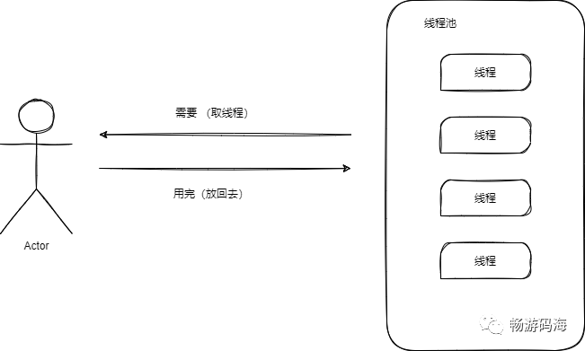
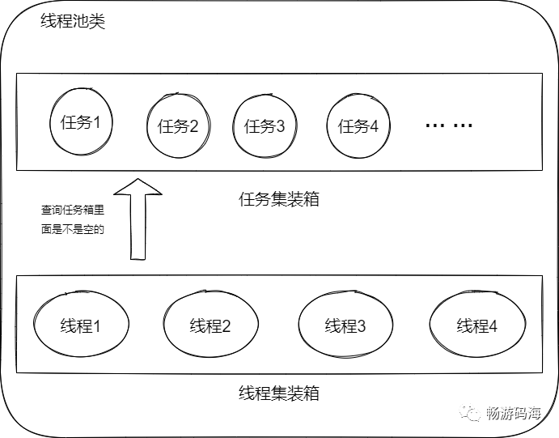

# 一、C++线程池

## 1.1 线程池设计思路

### 线程池是什么

我们先来打个比方，线程池就好像一个工具箱，我们每次需要拧螺丝的时候都要从工具箱里面取出一个螺丝刀来，有时候需要取出一个来拧，有时候螺丝多的时候需要多个人取出多个来拧，拧完自己的螺丝那么就会把螺丝刀再放回去，然后别人下次用的时候再取出来用。也许我的例子不是太完美，但是我想我已经基本阐述清楚了线程池。说白了线程池就是相当于**提前申请了一些资源**也就是**线程**，需要的时候就从线程池中**取出线程**来处理一些事情，处理完毕之后再**把线程放回去**。

线程池介绍

### 为什么需要线程池

我们来思考一个问题，为什么需要线程池呢？假如没有线程池的话我们每次调用线程是什么样子的？显然首先是先创建一个线程，然后再把任务交给这个线程，最后再把这个线程销毁掉。那么如果我们改用线程池的话，我们在程序运行的时候就会首先创建一批线程，然后交给线程池来管理。有需要的时候我们把线程拿出去处理任务，不需要的时候我们再回收到线程池中，这样是不是就避免了每次都需要创建和销毁线程这种消耗时间的操作。有人会说你使用线程池一开始就消耗了一些内存，之后一直不释放这些内存，这样岂不是有点浪费。其实这是类似于空间换时间的概念，我们确实多占用了一点内存但是这些内存和我们珍惜出来的这些时间相比，是非常划算的。

> 池的概念是一种非常常见的空间换时间的概念，除了有线程池之外还有进程池、内存池等等。其实他们的思想都是一样的就是我先申请一批资源出来，然后就随用随拿，不用再放回来。听到这儿是不是有种云计算的思想了，他们道理都是一样的。

### 如何设计线程池

> 现在硬核的知识要开始了，请坐稳扶好、抓紧扶手~

二话不说，先上图看看，我们要设计的线程池长什么样子！

线程池的设计

#### 设计思路

我们需要一个线程池类，那么线程池类中都需要哪些东西呢？我们庖丁解牛来看一看

- 我们需要存放我们创建好的线程，因此我们需要一个容器专门放线程
- 需要一个容器来存放我们的任务，每次把任务放到这个容器里面
- 由于是多线程的读取任务，所以必不可少的我们需要锁，每次读取任务需要加锁和解锁
- 我们需要判断什么时候终止，因此还需要一个判断终止的变量
- 为了避免轮询的判断任务集装箱里面是不是空的，这样效率太低了，因此我们这里采用条件变量

> 这里来说明一下什么是条件变量。条件变量是并发编程中的一种同步机制，条件变量使得线程能够阻塞到等待某个条件发生后，再继续执行，期间还会把之前拿到的锁先释放掉，不影响其它人拿这把锁。因此条件变量十分强大而高效。（条件变量和锁将会在我多线程文章中详细讲解，这里不是重点，所以不再展开细讲）

接下来我们来研究一下线程池中需要有哪些操作呢？

- 将任务添加到线程池中的操作，并且这时应该通知线程可以来取任务来执行了
- 一个循环操作，不断地等待任务集装箱里面有数据来执行，也就是初始化完毕后需要做的事情
- 通过改变终止变量来让上面循环停止的操作

> 好了，到此已经详细的把设计思路写清楚了，接下来该看具体的实现了

### 线程池的实现

接下来先来看一看线程池类是怎么实现的，注释已经很详细了，就不多说了直接上代码。

```c++
class CThreadMangerPool
{
public:
 CThreadMangerPool(void):is_runing(false){};
 bool init(int threadnum);//初始化函数
 ~CThreadMangerPool(void);
 void Run(void);  //执行函数
 void stop(void); //用来终止循环的函数
 void addTask(ThreadTask* task);//向任务集装箱中添加任务的函数
private:
 bool CreateThreads(int threadnum = 5);
 std::vector<std::shared_ptr<std::thread>> threadsPool;    //线程集装箱，用来存放线程
 std::list<std::shared_ptr<ThreadTask>>    threadTaskList; //任务集装箱，用来存放线程执行的任务
 std::condition_variable       threadPool_cv;  //条件变量
 std::mutex          threadMutex;   //互斥锁
 //std::vector<std::shared_ptr<CTcpClient>>  tcpClients;
 bool is_runing; //终止变量
};
```

我们来几个重点的函数实现~

> 在Run函数中，我们设计了一个循环，不断地执行等待并取出任务执行，如果没有的任务可以执行的话就睡眠等待（用之前提到的条件变量来实现）

**注意这里使用了一个手法，我们用while来判断任务集装箱中的数据是不是空的，是因为类似于进程的惊群现象，这里出现条件变量的虚假唤醒。（在这里并不是重点就不展开讲了，会在我文章的多线程处详细讲解）**

```c++
void CThreadMangerPool::Run(){
 std::shared_ptr<ThreadTask> task; 
 while(true){ //处在循环中

  std::unique_lock<std::mutex> guard(threadMutex);//利用RALL来管理锁，不用手动释放

  while(threadTaskList.empty()){ // 这里防止条件变量的虚假唤醒，所以不用if判断
   if (!is_runing)
    break;
   threadPool_cv.wait(guard); //条件变量的使用
  }
  if (!is_runing)  //同上 都是判断如果未启动或者调用了stop函数都会退出循环
   break;

  task = threadTaskList.front(); //取出任务
  threadTaskList.pop_front(); //把任务从容器中拿走

  if (task == NULL)
   continue;

  task->DoIt(); //执行任务处理函数
  task.reset(); //重置指针
 }

}
```

**接下来看看增加任务的函数是怎么实现的**

```c++
void CThreadMangerPool::addTask(ThreadTask* task){
 std::shared_ptr<ThreadTask> ptr; //创建一个指向任务的智能指针
 ptr.reset(task);
 {
  std::lock_guard<std::mutex> guard(threadMutex);  //同样是用RALL来管理锁，免去手动释放
  threadTaskList.push_back(ptr); //往任务集装箱中添加任务
 }
 threadPool_cv.notify_all(); //通知线程可以执行了，就是唤醒刚才在条件变量处睡眠的条件
 
}
```

好了，重点函数已经看完了，其他的轻松就可以实现包括**初始化函数**，**终止函数**等等

完结撒花~


## 1.2 C++11线程池完整实现

### 1.2.1 线程池需要什么功能

个人认为线程池需要支持以下几个基本功能：

- **核心线程数(core_threads)**：线程池中拥有的最少线程个数，初始化时就会创建好的线程，常驻于线程池。
- **最大线程个数(max_threads)**：线程池中拥有的最大线程个数，max_threads>=core_threads，当任务的个数太多线程池执行不过来时，内部就会创建更多的线程用于执行更多的任务，内部线程数不会超过max_threads，多创建出来的线程在一段时间内没有执行任务则会自动被回收掉，最终线程个数保持在核心线程数。
- **超时时间(time_out)**：如上所述，多创建出来的线程在time_out时间内没有执行任务就会被回收。
- 可获取当前线程池中线程的总个数。
- 可获取当前线程池中空闲线程的个数。
- 开启线程池功能的开关。
- 关闭线程池功能的开关，可以选择是否立即关闭，立即关闭线程池时，当前线程池里缓存的任务不会被执行。


### 1.2.2 线程池主要数据结构

1. 链表或者数组：用于存储线程池中的线程。

2. 队列：用于存储需要放入线程池中执行的任务。

3. 条件变量：当有任务需要执行时，用于通知正在等待的线程从任务队列中取出任务执行。

代码如下：

```c++

class ThreadPool {
 public:
  using PoolSeconds = std::chrono::seconds;

  /** 线程池的配置
   * core_threads: 核心线程个数，线程池中最少拥有的线程个数，初始化就会创建好的线程，常驻于线程池
   *
   * max_threads: >=core_threads，当任务的个数太多线程池执行不过来时，
   * 内部就会创建更多的线程用于执行更多的任务，内部线程数不会超过max_threads
   *
   * max_task_size: 内部允许存储的最大任务个数，暂时没有使用
   *
   * time_out: Cache线程的超时时间，Cache线程指的是max_threads-core_threads的线程,
   * 当time_out时间内没有执行任务，此线程就会被自动回收
   */
  struct ThreadPoolConfig {
      int core_threads;
      int max_threads;
      int max_task_size;
      PoolSeconds time_out;
  };

  /**
   * 线程的状态：有等待、运行、停止
   */
  enum class ThreadState { kInit = 0, kWaiting = 1, kRunning = 2, kStop = 3 };

  /**
   * 线程的种类标识：标志该线程是核心线程还是Cache线程，Cache是内部为了执行更多任务临时创建出来的
   */
  enum class ThreadFlag { kInit = 0, kCore = 1, kCache = 2 };

  using ThreadPtr = std::shared_ptr<std::thread>;
  using ThreadId = std::atomic<int>;
  using ThreadStateAtomic = std::atomic<ThreadState>;
  using ThreadFlagAtomic = std::atomic<ThreadFlag>;

  /**
   * 线程池中线程存在的基本单位，每个线程都有个自定义的ID，有线程种类标识和状态
   */
  struct ThreadWrapper {
      ThreadPtr ptr;
      ThreadId id;
      ThreadFlagAtomic flag;
      ThreadStateAtomic state;

      ThreadWrapper() {
          ptr = nullptr;
          id = 0;
          state.store(ThreadState::kInit);
      } 
  };
  using ThreadWrapperPtr = std::shared_ptr<ThreadWrapper>;
  using ThreadPoolLock = std::unique_lock<std::mutex>;

 private:
  ThreadPoolConfig config_;

  std::list<ThreadWrapperPtr> worker_threads_;

  std::queue<std::function<void()>> tasks_;
  std::mutex task_mutex_;
  std::condition_variable task_cv_;

  std::atomic<int> total_function_num_;
  std::atomic<int> waiting_thread_num_;
  std::atomic<int> thread_id_; // 用于为新创建的线程分配ID

  std::atomic<bool> is_shutdown_now_;
  std::atomic<bool> is_shutdown_;
  std::atomic<bool> is_available_;
};
```


### 1.2.3 线程池的主要模块

#### 1. 线程池的初始化

在构造函数中将各个成员变量都附初值，同时判断线程池的config是否合法。

 ```cpp
 ThreadPool(ThreadPoolConfig config) : config_(config) {
     this->total_function_num_.store(0);
     this->waiting_thread_num_.store(0);
 
     this->thread_id_.store(0);
     this->is_shutdown_.store(false);
     this->is_shutdown_now_.store(false);
 
     if (IsValidConfig(config_)) {
         is_available_.store(true);
     } else {
         is_available_.store(false);
     }
 }
 
 bool IsValidConfig(ThreadPoolConfig config) {
     if (config.core_threads < 1 || config.max_threads < config.core_threads || config.time_out.count() < 1) {
         return false;
     }
     return true;
 }
 ```


#### 2. 开启线程池

创建核心线程数个线程，常驻于线程池，等待任务的执行，线程ID由GetNextThreadId()统一分配。

```cpp

// 开启线程池功能
bool Start() {
    if (!IsAvailable()) {
        return false;
    }
    int core_thread_num = config_.core_threads;
    cout << "Init thread num " << core_thread_num << endl;
    while (core_thread_num-- > 0) {
        AddThread(GetNextThreadId());
    }
    cout << "Init thread end" << endl;
    return true;
}

// 当前线程池是否可用
bool IsAvailable() { return is_available_.load(); }

int GetNextThreadId() { return this->thread_id_++; }
```


#### 3. 关闭线程池

这里有两个标志位，is_shutdown_now置为true表示立即关闭线程，is_shutdown置为true则表示先执行完队列里的任务再关闭线程池。

```cpp

// 关掉线程池，内部还没有执行的任务会继续执行
void ShutDown() {
    ShutDown(false);
    cout << "shutdown" << endl;
}

// 执行关掉线程池，内部还没有执行的任务直接取消，不会再执行
void ShutDownNow() {
    ShutDown(true);
    cout << "shutdown now" << endl;
}

// private
void ShutDown(bool is_now) {
    if (is_available_.load()) {
        if (is_now) {
            this->is_shutdown_now_.store(true);
        } else {
            this->is_shutdown_.store(true);
        }
        this->task_cv_.notify_all();
        is_available_.store(false);
    }
}
```


#### 4. 添加线程

见AddThread()函数，默认会创建Core线程，也可以选择创建Cache线程，线程内部会有一个死循环，不停的等待任务，有任务到来时就会执行，同时内部会判断是否是Cache线程，如果是Cache线程，timeout时间内没有任务执行就会自动退出循环，线程结束。

这里还会检查is_shutdown和is_shutdown_now标志，根据两个标志位是否为true来判断是否结束线程。

```cpp

void AddThread(int id) { AddThread(id, ThreadFlag::kCore); }

void AddThread(int id, ThreadFlag thread_flag) {
    cout << "AddThread " << id << " flag " << static_cast<int>(thread_flag) << endl;
    ThreadWrapperPtr thread_ptr = std::make_shared<ThreadWrapper>();
    thread_ptr->id.store(id);
    thread_ptr->flag.store(thread_flag);
    auto func = [this, thread_ptr]() {
        for (;;) {
            std::function<void()> task;
            {
                ThreadPoolLock lock(this->task_mutex_);
                if (thread_ptr->state.load() == ThreadState::kStop) {
                    break;
                }
                cout << "thread id " << thread_ptr->id.load() << " running start" << endl;
                thread_ptr->state.store(ThreadState::kWaiting);
                ++this->waiting_thread_num_;
                bool is_timeout = false;
                
                // 条件变量阻塞等待，这是线程复用的关键
                if (thread_ptr->flag.load() == ThreadFlag::kCore) {
                    this->task_cv_.wait(lock, [this, thread_ptr] {
                        return (this->is_shutdown_ || this->is_shutdown_now_ || !this->tasks_.empty() ||
                                thread_ptr->state.load() == ThreadState::kStop);
                    });
                } else {
                    this->task_cv_.wait_for(lock, this->config_.time_out, [this, thread_ptr] {
                        return (this->is_shutdown_ || this->is_shutdown_now_ || !this->tasks_.empty() ||
                                thread_ptr->state.load() == ThreadState::kStop);
                    });
                    is_timeout = !(this->is_shutdown_ || this->is_shutdown_now_ || !this->tasks_.empty() ||
                                    thread_ptr->state.load() == ThreadState::kStop);
                }
                
                --this->waiting_thread_num_;
                cout << "thread id " << thread_ptr->id.load() << " running wait end" << endl;

                if (is_timeout) {
                    thread_ptr->state.store(ThreadState::kStop);
                }

                if (thread_ptr->state.load() == ThreadState::kStop) {
                    cout << "thread id " << thread_ptr->id.load() << " state stop" << endl;
                    break;
                }
                if (this->is_shutdown_ && this->tasks_.empty()) {
                    cout << "thread id " << thread_ptr->id.load() << " shutdown" << endl;
                    break;
                }
                if (this->is_shutdown_now_) {
                    cout << "thread id " << thread_ptr->id.load() << " shutdown now" << endl;
                    break;
                }
                thread_ptr->state.store(ThreadState::kRunning);
                task = std::move(this->tasks_.front());
                this->tasks_.pop();
            }
            task();
        }
        cout << "thread id " << thread_ptr->id.load() << " running end" << endl;
    };
    thread_ptr->ptr = std::make_shared<std::thread>(std::move(func));
    if (thread_ptr->ptr->joinable()) {
        thread_ptr->ptr->detach();
    }
    this->worker_threads_.emplace_back(std::move(thread_ptr));
}
```


#### 5. 添加任务

见如下代码，将任务使用std::bind封装成std::function放入任务队列中，任务较多时内部还会判断是否有空闲线程，如果没有空闲线程，会自动创建出最多(max_threads-core_threads)个Cache线程用于执行任务。

```cpp
// 放在线程池中执行函数
template <typename F, typename... Args>
auto Run(F &&f, Args &&... args) -> std::shared_ptr<std::future<std::result_of_t<F(Args...)>>> {
    if (this->is_shutdown_.load() || this->is_shutdown_now_.load() || !IsAvailable()) {
        return nullptr;
    }
    if (GetWaitingThreadSize() == 0 && GetTotalThreadSize() < config_.max_threads) {
        AddThread(GetNextThreadId(), ThreadFlag::kCache);
    }

    using return_type = std::result_of_t<F(Args...)>;
    auto task = std::make_shared<std::packaged_task<return_type()>>(
        std::bind(std::forward<F>(f), std::forward<Args>(args)...));
    total_function_num_++;

    std::future<return_type> res = task->get_future();
    {
        ThreadPoolLock lock(this->task_mutex_);
        this->tasks_.emplace([task]() { (*task)(); });
    }
    this->task_cv_.notify_one();
    return std::make_shared<std::future<std::result_of_t<F(Args...)>>>(std::move(res));
}
```


#### 6. 获取当前总线程个数

```cpp
int GetTotalThreadSize() { return this->worker_threads_.size(); }
```


#### 7. 获取当前空闲线程个数

waiting_thread_num值表示空闲线程的个数，该变量在线程循环内部会更新。

```cpp
int GetWaitingThreadSize() { return this->waiting_thread_num_.load(); }
```


#### 8. 完整代码

```cpp
#ifndef __THREAD_POOL__
#define __THREAD_POOL__

#include <atomic>
#include <chrono>
#include <condition_variable>
#include <functional>
#include <future>
#include <iostream>
#include <list>
#include <memory>
#include <mutex>
#include <queue>
#include <thread>
#include <tuple>
#include <utility>
#include <vector>

using std::cout;
using std::endl;

namespace wzq {

class ThreadPool {
   public:
    using PoolSeconds = std::chrono::seconds;

    /** 线程池的配置
     * core_threads: 核心线程个数，线程池中最少拥有的线程个数，初始化就会创建好的线程，常驻于线程池
     *
     * max_threads: >=core_threads，当任务的个数太多线程池执行不过来时，
     * 内部就会创建更多的线程用于执行更多的任务，内部线程数不会超过max_threads
     *
     * max_task_size: 内部允许存储的最大任务个数，暂时没有使用
     *
     * time_out: Cache线程的超时时间，Cache线程指的是max_threads-core_threads的线程,
     * 当time_out时间内没有执行任务，此线程就会被自动回收
     */
    struct ThreadPoolConfig {
        int core_threads;
        int max_threads;
        int max_task_size;
        PoolSeconds time_out;
    };

    /**
     * 线程的状态：有等待、运行、停止
     */
    enum class ThreadState { kInit = 0, kWaiting = 1, kRunning = 2, kStop = 3 };

    /**
     * 线程的种类标识：标志该线程是核心线程还是Cache线程，Cache是内部为了执行更多任务临时创建出来的
     */
    enum class ThreadFlag { kInit = 0, kCore = 1, kCache = 2 };

    using ThreadPtr = std::shared_ptr<std::thread>;
    using ThreadId = std::atomic<int>;
    using ThreadStateAtomic = std::atomic<ThreadState>;
    using ThreadFlagAtomic = std::atomic<ThreadFlag>;

    /**
     * 线程池中线程存在的基本单位，每个线程都有个自定义的ID，有线程种类标识和状态
     */
    struct ThreadWrapper {
        ThreadPtr ptr;
        ThreadId id;
        ThreadFlagAtomic flag;
        ThreadStateAtomic state;

        ThreadWrapper() {
            ptr = nullptr;
            id = 0;
            state.store(ThreadState::kInit);
        }
    };
    using ThreadWrapperPtr = std::shared_ptr<ThreadWrapper>;
    using ThreadPoolLock = std::unique_lock<std::mutex>;

    ThreadPool(ThreadPoolConfig config) : config_(config) {
        this->total_function_num_.store(0);
        this->waiting_thread_num_.store(0);

        this->thread_id_.store(0);
        this->is_shutdown_.store(false);
        this->is_shutdown_now_.store(false);

        if (IsValidConfig(config_)) {
            is_available_.store(true);
        } else {
            is_available_.store(false);
        }
    }

    ~ThreadPool() { ShutDown(); }

    bool Reset(ThreadPoolConfig config) {
        if (!IsValidConfig(config)) {
            return false;
        }
        if (config_.core_threads != config.core_threads) {
            return false;
        }
        config_ = config;
        return true;
    }

    // 开启线程池功能
    bool Start() {
        if (!IsAvailable()) {
            return false;
        }
        int core_thread_num = config_.core_threads;
        cout << "Init thread num " << core_thread_num << endl;
        while (core_thread_num-- > 0) {
            AddThread(GetNextThreadId());
        }
        cout << "Init thread end" << endl;
        return true;
    }

    // 获取正在处于等待状态的线程的个数
    int GetWaitingThreadSize() { return this->waiting_thread_num_.load(); }

    // 获取线程池中当前线程的总个数
    int GetTotalThreadSize() { return this->worker_threads_.size(); }

    // 放在线程池中执行函数
    template <typename F, typename... Args>
    auto Run(F &&f, Args &&... args) -> std::shared_ptr<std::future<std::result_of_t<F(Args...)>>> {
        if (this->is_shutdown_.load() || this->is_shutdown_now_.load() || !IsAvailable()) {
            return nullptr;
        }
        if (GetWaitingThreadSize() == 0 && GetTotalThreadSize() < config_.max_threads) {
            AddThread(GetNextThreadId(), ThreadFlag::kCache);
        }

        using return_type = std::result_of_t<F(Args...)>;
        auto task = std::make_shared<std::packaged_task<return_type()>>(
            std::bind(std::forward<F>(f), std::forward<Args>(args)...));
        total_function_num_++;

        std::future<return_type> res = task->get_future();
        {
            ThreadPoolLock lock(this->task_mutex_);
            this->tasks_.emplace([task]() { (*task)(); });
        }
        this->task_cv_.notify_one();
        return std::make_shared<std::future<std::result_of_t<F(Args...)>>>(std::move(res));
    }

    // 获取当前线程池已经执行过的函数个数
    int GetRunnedFuncNum() { return total_function_num_.load(); }

    // 关掉线程池，内部还没有执行的任务会继续执行
    void ShutDown() {
        ShutDown(false);
        cout << "shutdown" << endl;
    }

    // 执行关掉线程池，内部还没有执行的任务直接取消，不会再执行
    void ShutDownNow() {
        ShutDown(true);
        cout << "shutdown now" << endl;
    }

    // 当前线程池是否可用
    bool IsAvailable() { return is_available_.load(); }

   private:
    void ShutDown(bool is_now) {
        if (is_available_.load()) {
            if (is_now) {
                this->is_shutdown_now_.store(true);
            } else {
                this->is_shutdown_.store(true);
            }
            this->task_cv_.notify_all();
            is_available_.store(false);
        }
    }

    void AddThread(int id) { AddThread(id, ThreadFlag::kCore); }

    void AddThread(int id, ThreadFlag thread_flag) {
        cout << "AddThread " << id << " flag " << static_cast<int>(thread_flag) << endl;
        ThreadWrapperPtr thread_ptr = std::make_shared<ThreadWrapper>();
        thread_ptr->id.store(id);
        thread_ptr->flag.store(thread_flag);
        auto func = [this, thread_ptr]() {
            for (;;) {
                std::function<void()> task;
                {
                    ThreadPoolLock lock(this->task_mutex_);
                    if (thread_ptr->state.load() == ThreadState::kStop) {
                        break;
                    }
                    cout << "thread id " << thread_ptr->id.load() << " running start" << endl;
                    thread_ptr->state.store(ThreadState::kWaiting);
                    ++this->waiting_thread_num_;
                    bool is_timeout = false;
                    if (thread_ptr->flag.load() == ThreadFlag::kCore) {
                        this->task_cv_.wait(lock, [this, thread_ptr] {
                            return (this->is_shutdown_ || this->is_shutdown_now_ || !this->tasks_.empty() ||
                                    thread_ptr->state.load() == ThreadState::kStop);
                        });
                    } else {
                        this->task_cv_.wait_for(lock, this->config_.time_out, [this, thread_ptr] {
                            return (this->is_shutdown_ || this->is_shutdown_now_ || !this->tasks_.empty() ||
                                    thread_ptr->state.load() == ThreadState::kStop);
                        });
                        is_timeout = !(this->is_shutdown_ || this->is_shutdown_now_ || !this->tasks_.empty() 									 || thread_ptr->state.load() == ThreadState::kStop);
                    }
                    --this->waiting_thread_num_;
                    cout << "thread id " << thread_ptr->id.load() << " running wait end" << endl;

                    if (is_timeout) {
                        thread_ptr->state.store(ThreadState::kStop);
                    }

                    if (thread_ptr->state.load() == ThreadState::kStop) {
                        cout << "thread id " << thread_ptr->id.load() << " state stop" << endl;
                        break;
                    }
                    if (this->is_shutdown_ && this->tasks_.empty()) {
                        cout << "thread id " << thread_ptr->id.load() << " shutdown" << endl;
                        break;
                    }
                    if (this->is_shutdown_now_) {
                        cout << "thread id " << thread_ptr->id.load() << " shutdown now" << endl;
                        break;
                    }
                    thread_ptr->state.store(ThreadState::kRunning);
                    task = std::move(this->tasks_.front());
                    this->tasks_.pop();
                }
                task();
            }
            cout << "thread id " << thread_ptr->id.load() << " running end" << endl;
        };
        thread_ptr->ptr = std::make_shared<std::thread>(std::move(func));
        if (thread_ptr->ptr->joinable()) {
            thread_ptr->ptr->detach();
        }
        this->worker_threads_.emplace_back(std::move(thread_ptr));
    }

    // 清理僵尸线程
    void Vaccum() {
        ThreadPoolLock lock(this->task_mutex_);
        auto iter = this->worker_threads_.begin();
        while (iter != this->worker_threads_.end()) {
            auto thread_ptr = *iter;
            if (thread_ptr->state.load() == ThreadState::kStop) {
                iter = this->worker_threads_.erase(iter);
            }
            else {
                ++iter;
            }
        }
    }
    
    void Resize(int thread_num) {
        if (thread_num < config_.core_threads) return;
        int old_thread_num = worker_threads_.size();
        cout << "old num " << old_thread_num << " resize " << thread_num << endl;
        if (thread_num > old_thread_num) {
            while (thread_num-- > old_thread_num) {
                AddThread(GetNextThreadId());
            }
        } else {
            int diff = old_thread_num - thread_num;
            auto iter = worker_threads_.begin();
            while (iter != worker_threads_.end()) {
                if (diff == 0) {
                    break;
                }
                auto thread_ptr = *iter;
                if (thread_ptr->flag.load() == ThreadFlag::kCache &&
                    thread_ptr->state.load() == ThreadState::kWaiting) {  // wait
                    thread_ptr->state.store(ThreadState::kStop);          // stop;
                    --diff;
                    iter = worker_threads_.erase(iter);
                } else {
                    ++iter;
                }
            }
            this->task_cv_.notify_all();
        }
    }

    int GetNextThreadId() { return this->thread_id_++; }

    bool IsValidConfig(ThreadPoolConfig config) {
        if (config.core_threads < 1 || config.max_threads < config.core_threads || config.time_out.count() < 1) {
            return false;
        }
        return true;
    }

   private:
    ThreadPoolConfig config_;

    std::list<ThreadWrapperPtr> worker_threads_;

    std::queue<std::function<void()>> tasks_;
    std::mutex task_mutex_;
    std::condition_variable task_cv_;

    std::atomic<int> total_function_num_;
    std::atomic<int> waiting_thread_num_;
    std::atomic<int> thread_id_;

    std::atomic<bool> is_shutdown_now_;
    std::atomic<bool> is_shutdown_;
    std::atomic<bool> is_available_;
};

}  // namespace wzq

#endif
```


#### 9. 简单的测试代码

```cpp

int main() {
    cout << "hello" << endl;
    ThreadPool pool(ThreadPool::ThreadPoolConfig{4, 5, 6, std::chrono::seconds(4)});
    pool.Start();
    std::this_thread::sleep_for(std::chrono::seconds(4));
    cout << "thread size " << pool.GetTotalThreadSize() << endl;
    std::atomic<int> index;
    index.store(0);
    std::thread t([&]() {
        for (int i = 0; i < 10; ++i) {
            pool.Run([&]() {
                cout << "function " << index.load() << endl;
                std::this_thread::sleep_for(std::chrono::seconds(4));
                index++;
            });
            // std::this_thread::sleep_for(std::chrono::seconds(2));
        }
    });
    t.detach();
    cout << "=================" << endl;

    std::this_thread::sleep_for(std::chrono::seconds(4));
    pool.Reset(ThreadPool::ThreadPoolConfig{4, 4, 6, std::chrono::seconds(4)});
    std::this_thread::sleep_for(std::chrono::seconds(4));
    cout << "thread size " << pool.GetTotalThreadSize() << endl;
    cout << "waiting size " << pool.GetWaitingThreadSize() << endl;
    cout << "---------------" << endl;
    pool.ShutDownNow();
    getchar();
    cout << "world" << endl;
    return 0;
}
```


## 1.3 线程池设计解读

【导读】：C++线程池一直都是各位程序员们造轮子的首选项目之一。今天，小编带大家一起来看看这个轻量的线程池，本线程池是header-only的，并且整个文件只有100行，其中C++的高级用法有很多，很值得我们学习，一起来看看吧。


**线程池**

C++带有线程操作，异步操作，就是没有线程池，至于线程池的概念，我先搜一下别人的解释：
一般而言,线程池有以下几个部分:

\1. 完成主要任务的一个或多个线程。

\2. 用于调度管理的管理线程。

\3. 要求执行的任务队列。

我来讲讲人话：你的函数需要在多线程中运行，但是你又不能每来一个函数就开启一个线程，所以你就需要固定的N个线程来跑执行，但是有的线程还没有执行完，有的又在空闲，如何分配任务呢，你就需要封装一个线程池来完成这些操作，有了线程池这层封装，你就只需要告诉它开启几个线程，然后直接塞任务就行了，然后通过一定的机制获取执行结果。

这里有一个100行实现线程池的操作：

https://github.com/progschj/ThreadPool/blob/master/ThreadPool.h

分析源代码 头文件

```cpp
#include <vector>
#include <queue>
#include <memory>
#include <thread>
#include <mutex>
#include <condition_variable>
#include <future>
#include <functional>
#include <stdexcept>
```

vector,queue,momory 都没啥说的，thread线程相关，mutex 互斥量，解决资源抢占问题，condition_variable 条件量，用于唤醒线程和阻塞线程,future 从使用的角度出发，它是一个获取线程数据的函数。functional 函数子，可以理解为规范化的函数指针。stdexcept 就跟它的名字一样，标准异常。

```cpp
class ThreadPool {
public:
    ThreadPool(size_t);
    template<class F, class... Args>
    auto enqueue(F&& f, Args&&... args) 
        -> std::future<typename std::result_of<F(Args...)>::type>;
    ~ThreadPool();
private:
    // need to keep track of threads so we can join them
    std::vector< std::thread > workers;
    // the task queue
    std::queue< std::function<void()> > tasks;
    
    // synchronization
    std::mutex queue_mutex;
    std::condition_variable condition;
    bool stop;
};
```

线程池的声明，构造函数，一个enqueue模板函数 返回std::future<type>, 然后这个type又利用了运行时检测（还是编译时检测?）推断出来的，非常的amazing啊。成功的使用一行代码反复套娃，这高阶的用法就是大佬的水平吗，i了i了。
workers 是vector<std::thread> 俗称工作线程。
std::queue<std::function<void()>> tasks 俗称任务队列。
那么问题来了，这个任务队列的任务只能是void() 类型的吗？感觉没那么简单，还得接着看呐。mutex,condition_variable 没啥讲的,stop 控制线程池停止的。

```cpp

// the constructor just launches some amount of workers
inline ThreadPool::ThreadPool(size_t threads)
    :   stop(false)
{
    for(size_t i = 0;i<threads;++i)
        workers.emplace_back(
            [this]
            {
                for(;;)
                {
                    std::function<void()> task;

                    {
                        std::unique_lock<std::mutex> lock(this->queue_mutex);
                        this->condition.wait(lock,
                            [this]{ return this->stop || !this->tasks.empty(); });
                        if(this->stop && this->tasks.empty())
                            return;
                        task = std::move(this->tasks.front());
                        this->tasks.pop();
                    }

                    task();
                }
            }
        );
}
```

大佬写的注释就是这么朴实无华，说这个构造函数仅仅是把一定数量的线程塞进去，我是看了又看才悟出来这玩意是什么意思……虽然本质上的确是它说的只是把线程塞进去，但是这个线程也太绕了。


workers.emplace_back 参数是一个lambda表达式，不会阻塞，也就是说最外层的是一个异步函数，每个线程里面的事情才是重点。


labmda表达式中最外层是一个死循环，至于为什么是for(;;)而不是while(1) 这虽然不是重点，不过大佬的用法还是值得揣摩的，我估计是效率会更高？


task 申明后，紧跟着一个大括号，这个{}里面的部分，是一个同步操作，至于为什么用this->lock 而不是直接使用[&]来捕获参数，想来也是处于内存考虑。精打细算的风格像极了抠门的地主，i了i了。


紧接着一个wait(lock,condtion)的操作，像极了千层饼的套路。


第一层：这TM不是要锁死自己啊？这样不是构造都得卡死？


第二层：我们看到它emplace_back了一个线程，不会阻塞，但是等开锁，锁不就在它自己的线程里面嘛？那不得锁死了啊？


第三层：我们看到这个lock其实只是个包装，真正的锁是外层的mutex，所以从这里是不存在死锁的。但是你的wait的condition怎么可能不懂呢，必须要 stop 或者 !empty 才wait吗？


第四层：我们查资料发现后面的condition是返回false才会wait，也就是说要!stop && empty才会wait，就是说这个线程池是 运行态，并且没有任务才才会执行等待操作！否则就不等了，直接冲！


第五层：既然你判断了上面判断了stop和非空，为啥下面还要判断stop和空才退出呢？不显得冗余？


第六层：要确定它的确是被置为stop了，且队列执行空了，它才能够光荣退休。有没有问题呢，有，最后所有线程都阻塞了，你stop置为true它们也不知道啊……


我估计它的stop会有唤醒所有线程的操作，不过如果有的在执行，有的在等待，应该没办法都通知到位，但是在执行的在下一次判断的时候也能正常退出。


因为有了疑惑，我们就想看stop相关的操作，结果发现放在了析构函数里面……

```cpp

// the destructor joins all threads
inline ThreadPool::~ThreadPool()
{
    {
        std::unique_lock<std::mutex> lock(queue_mutex);
        stop = true;
    }
    condition.notify_all();
    for(std::thread &worker: workers)
        worker.join();
}
```

{}里面上锁进行了stop为true的操作，至于为什么不用原子操作，我也不知道，但是仔细想了下大概是因为本来就有一把锁了，再用原子就不是内味儿了。然后它果然通知了所有，并且还把工作线程join了。也就是等它们结束。

结束了千层饼の解析之后，我们看看最重要的入队操作

```cpp
// add new work item to the pool
template<class F, class... Args>
auto ThreadPool::enqueue(F&& f, Args&&... args) 
    -> std::future<typename std::result_of<F(Args...)>::type>
{
    using return_type = typename std::result_of<F(Args...)>::type;

    auto task = std::make_shared< std::packaged_task<return_type()> >(
            std::bind(std::forward<F>(f), std::forward<Args>(args)...)
        );
        
    std::future<return_type> res = task->get_future();
    {
        std::unique_lock<std::mutex> lock(queue_mutex);

        // don't allow enqueueing after stopping the pool
        if(stop)
            throw std::runtime_error("enqueue on stopped ThreadPool");

        tasks.emplace([task](){ (*task)(); });
    }
    condition.notify_one();
    return res;
}
```

typename std::result_of<F(Args...)>::type中的typename 应该是为消除歧义的，或者因为嵌套依赖名字的关系，做为一个坚决不写模板的普通程序员，这段代码太难了……-> type 我倒是知道怎么回事，就是指明它的返回类型的一种方式result_of<F(Args...)> 应该是指明了F是一个函数，签名为Args...这个变参，Args是啥它不关系，它关心的是返回值的参数类型 所以有个type。


至于为什么函数入口是一个右值引用那就超出我的理解范围了。难道说functional 必须要右值引用？那它的销毁谁来管呢？这个线程来管吗？这些坑我以后慢慢填。


前面我们说了tasks 只能接收void() 的函数类型，这里使用std::packaged_task<return_type()>完成对函数类型的推导，至于为什么不用 function<return_type()> ，因为这还不是最终放入tasks的对象，它要承接一个返回future<T>的工作，而package_task就是来打包返回future<T>的……


然后就是加锁入队+通知工作线程+返回future<T>的操作。本来是线程池最难理解的部分，反而显得平淡无奇了，因为前面那些花里胡哨的操作已经很好的打通了我们的理解能力。对于这个操作本来就有一点概念的，就显得有种“就这？”的感觉……


好了，今天也是上班摸鱼的一天。
