# **一、C++基础**

## 第二章 变量和基本类型

### 2.1 基本内置类型

#### 2.1.1 如何选择类型？

* 使用int来执行整型运算。在实际应用中，short通常太小而32位机器中long和int拥有一样的大小，所以当int表示的范围不够时，用long long。
* 使用double来执行浮点运算。因为实际应用中，float通常精度不够而long double提供的额外精度没有必要且计算消耗大，最重要的是，double和float的计算代价相差无几，甚至某些机器上，双精度运算甚至比单精度运算还快。

#### 2.1.2 字面值常量

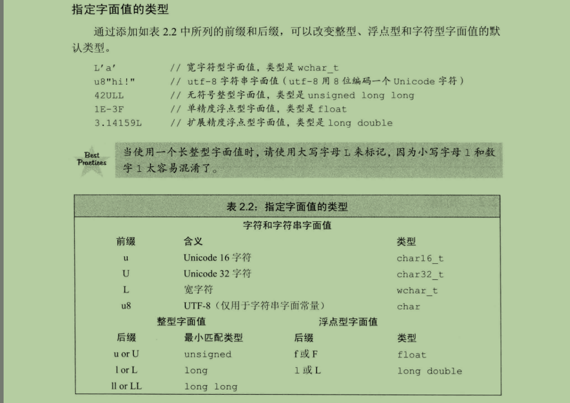

### 2.2 变量

#### 2.2.1 变量定义

##### 对象

定义：对象是指一块能存储数据并具有某种类型的存储空间。

##### 初始值

* 对象在创建时获得一个特定的值，叫做初始化。
* 初始化不是赋值。初始化是在对象创建时赋予其一个值，而赋值则是把对象的当前值擦除，而以一个新的值来替代。

##### 初始化方法

```c
int num = 0;
int num = { 0 };
int num{0};
int num(0);
```

列表初始化为C++11的新增特性，而列表初始化时会进行更严格的检查，在初始化内置类型时，如果存在丢失信息的风险（如将long给int初始化），则编译器会报错。

##### 默认初始化

存在以下几种情况：

* 对于内置类型，定义于函数体外的变量会被初始化为0，而定义在函数体内部的变量将**不会被初始化**，其值是未定义的。
* 对于类，对象的默认初始化行为由类的内部实现来决定。

结论：建议定义内置类型变量时，必须进行手动初始化。

#### 2.2.2 声明和定义的关系

```c
int num1;	// 声明
int num2 = 10;	// 定义
```

* 变量可以声明多次，但只能定义一次。
* 定义就是包含了显示初始化的声明。

#### 2.2.3 标识符

##### 变量命名规则

* C++标识符由字母、数字、下划线三类组成。
* 标识符中不能连续出现两个下划线，也不能以下划线紧连大写字母开头。
* 定义在函数体（包括类）外的标识符不能以下划线开头。

##### 变量命名规范

* 变量名用小写，如num。
* 类名或结构体名用大写，如Student。
* 单词间要有区分，如studentID，或student_ID。

##### 内置标识符

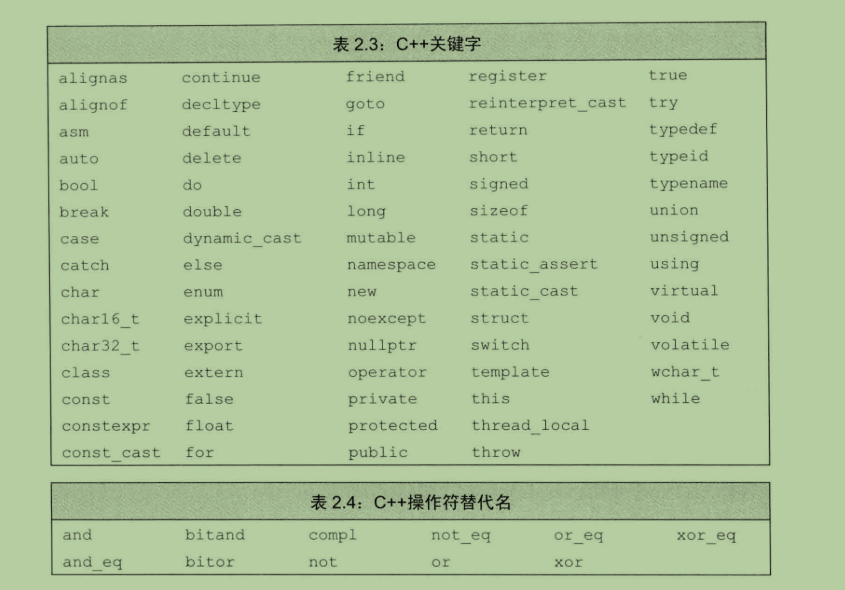

#### 2.2.4 名字的作用域

* 作用域通过花括号来分隔。
* 在某个花括号内的变量拥有**块作用域**。
* 在所有花括号之外的变量拥有**全局作用域**。

### 2.3 复合类型

#### 2.3.1 引用

引用定义：引用不是对象，只是为一个已经存在的对象起的另外一个名字。

注：引用只能绑定在对象上，而不能绑定在常量、表达式或其他引用上。

#### 2.3.1 指针

##### 获取对象的地址

指针存放某个对象的地址，要想获取该地址，用**取地址符&**。

##### 利用指针访问对象

如果指针指向了一个对象，则使用**解引用符***来访问所指对象。

##### 空指针

尽量使用nullptr来表示空指针。

##### void*指针

void*是一种特殊的指针类型，可以存放任意对象的地址。

##### 指针代码集合

**1、\*p++和(\*p)++的区别**

示例一：\*p++

```c++
int main() {
    int a = 1;
    int* b = &a;
    cout << "a: " << a << endl;
    cout << "b: " << b << endl;
    cout << "(*b): " << *b << endl;
    cout << endl;

    *b++;
    cout << "a: " << a << endl;
    cout << "b: " << b << endl;
    cout << "(*b): " << *b << endl;
} 
```

输出：

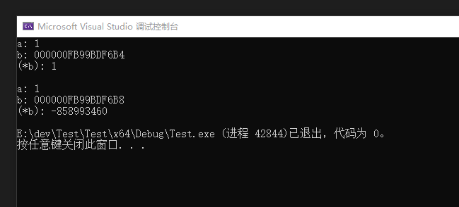

> 可以看出自增运算符的优先级是高于解引用运算符的，所以*b++实际上只是将b自增一个int的长度（4字节），而解引用的实际上是自增后的新地址指向的值，这里没有赋值操作，所以啥也没干，对a的值更是没有任何影响。


示例二：

```c++
int main() {
    int a = 1;
    int* b = &a;
    cout << "a: " << a << endl;
    cout << "b: " << b << endl;
    cout << "(*b): " << *b << endl;
    cout << endl;

    (*b)++;		// 只改动了这一行
    cout << "a: " << a << endl;
    cout << "b: " << b << endl;
    cout << "(*b): " << *b << endl;
} 
```

运行结果：

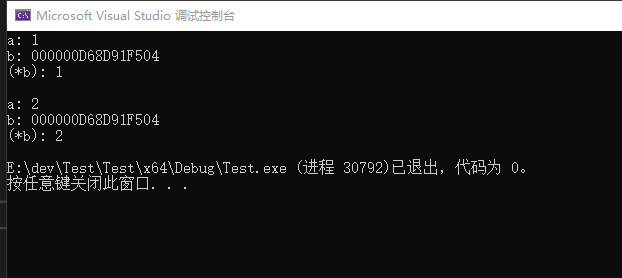

> 这才是对指针指向的值加一的正常操作。

#### 2.3.3 复合类型的声明

##### 定义多个指针变量

两种写法：

```c++
int *p1, *p2;	// 一行多个，多个*
int* p1;	// 一行一个，一个*
int* p2;
```

##### 指向指针的引用

因为指针也是对象，所以可以定义指向指针的引用。

```c++
int i = 42;
int* p = &i;
int* &q = p;	// q是指针p的引用
```

>小技巧：面对一个比较复杂的类型声明语句时，要用**从右向左**读的顺序，离变量名最近的符号对变量类型有最直接的影响。


### 2.4 const限定符

#### 2.4.1 const使用方法

基本事实：const变量一旦被定义，其值不能被改变。

```c++
// const定义时必须初始化，否则会报错；
const int a = 24;	// ok
const int b;		// error

// const变量的值不允许被改变
a = 0;		// error

// 指向常量的指针，指针指向的值不能被改变，但是指向可以修改
int c = 10;
const int* d =  &c;
c = 24;		// ok, *d = 24
*d = 30;	// error, 不允许通过*d修改c的值
d = &a;		// ok, 可以改变指针的指向

// const指针，指针指向不允许修改，const指针从定义开始就只能永远指向这个对象，但是可以修改指向对象的值
int* const e = &c;
e = &a;			// error, const指针不能改变指向
*e = 12;		// ok, 可以改变指向的对象的值

```

#### 2.4.2 const对象仅在文件内有效

* 在同一文件内，编译器在编译过程中会把所有用到const变量的地方替换成对应的常量值。

* 要在不同文件内使用同一个const变量需要用extern关键字，该变量只能定义一次，但可以被声明多次。

  a.c

  extern const int a = 24;

  b.c

  extern const int a;

#### 2.4.3 顶层const和底层const

顶层const表示指针或者变量本身是个常量，底层const表示指针所指的对象是一个常量，且用于声明引用的const都是底层const。

```c++
// 顶层const
const int a = 5;
int* const ptr1 = &a;

// 底层const
const int* ptr2 = &a;
```

#### 2.4.4 常量表达式和constexpr

**常量表达式：**指值不会改变并且编译过程中就能得到计算结果的表达式。字面值是常量表达式，用常量表达式初始化的const变量也是常量表达式。

**constexpr变量：**C++11规定，声明为constexpr类型的变量，编译器将会验证其是否是一个常量表达式，并做一些优化。

>一般来说，如果认定某个变量时一个常量表达式，那么就应该把它声明成constexpr类型。

示例：
```c++
const int maxSize = 100;	// maxSize是常量表达式
const int limit = maxSize + 1;	// limit是常量表达式
int minSize = 20;	// minSize不是常量表达式
const int ret = getSize();	// ret不是常量表达式，因为getSize()的返回值要运行时才得知


constexpr int mf = 20;		// ok
constexpr int limit = mf + 1;	// ok
constexpr int sz = size();	// 只有当size是一个constexpr函数时才正确
```

#### C/C++中的const

**const 与 #define 的区别**

在`C/C++`中定义常量通常使用`const`关键字，当然你也可以使有宏`#define`来定义。这两种方式定义常量如下所示：

- const 定义常量

  ```
  const int PI = 3.14;
  ```

- 宏定义常量

  ```
  #define PI = 3.14
  ```

这两种定义常量的方式有什么区别呢？

要回答这个问题，我们需要了解一点编译原理的知识。编译器在编译我们写好C/C++程序时，其编译器过程为：**预编译->编译->链接**。`C/C++`中宏的替换就是在预编译阶段完成的，也就是说在预编译阶段将C/C++中的所有用到的宏都用宏定义中的值替换掉。

而`const` 定义的常量则与宏定义的常量不同，它是在编译阶段进行检测，而且还可以对其类型进行检测。因此我们可以总结出使用`const`定义的常量与宏定义的常量有如下区别:

- 宏是在预编译时进行宏展开，而const是在编译时检测，所以两者操作的时期不同
- 由于宏在预编译时被操作，所以无法进行类型检测；而const则可以进行类型检测
- 因在编译阶段可以形成符号表，所以const定义的常量可以通过调试器进行调试；而宏在展开后就消失了，所以无法通过调试器进行调试

以上就是`const`与`宏`的最主要的区别。所以一般情况下我们都建议使用const来定义常量。

**const常量与const常量指针**

上面我们已经列举过const如何定义常量，这里就不再赘述了。现在咱们来看一下const常量指针，它该如何定义呢?

```
const int * ptr; //const常量指针
```

上面就是const常量指针的定义，也挺好理解的对吧。我们将const常量和const常量指针放在一起看一下：

```
const int i;    //const常量
const int* ptr; //const常量指针
```

将他们放在一起比较着看，你就更容易理解const常量指针了，无非就是将const常量中的类型变成指针而已。

**那么常量指针的作用是什么呢？**，我们来看个例子你就清楚了。

```c++
const int i = 100;     // 定义一个常量
i = 100;               // 不允许修改常量

int *p = &i;           // 老的编译器是被允许的，这实际存在安全问题
                       // 为了解决这个问题，新的编译器报错，非常量指针不允许指向常量地址

const int * ptr = &i;  // 常量指针指向常量地址
*ptr = 100;            // 不允许修改常量的内容
```

按照常量的定义，常量定义好后其内容就不允许再修改了，因此对于上面代码中的前两行相信你不会有什么异义。

但在较老的编译器上，存在一个漏洞，它允许你用普通指针指向常量地址。这样你就可以通过该指针修改常量的内容了，这是非常大的安全漏洞。为了消除这个安全隐患，在新的编译器上已经不允许普通指针指向const常量了。

为什么在老编译器上指针可以指向常量地址并修改其内容呢？究其原因是因为const定义的常量实际是在内存的可读写空间，只是由于编译器限制你才不能修改它。而老的编译器却没有这方面的限制，所以才会出现通过普通指针修改常量的可能。

我们再来看代码的最后两行。使用const常量指针指向常量地址，此时你无论用新编译器还是老编译器，都无法通过该指针修改常量的内容。所以代码的最后一行当你修改常量内容时就会报错。

通过上面的讲解，你应该对常量指针的概念比较清楚了。常量指针不能修改常量内容，但能不能让常量指针指向另外一个常量的地址呢？比如下面这样：

```c++
const int i = 100;
const int n = 1000;

const int * ptr = &i;   //常量指针先指向 i 常量的地址
ptr = &n;               //又修改为指向 n 常量的地址
```

这样做当然是可以的，因为常量指针限制的是不能修改常量内容，但并没有限制它指向哪个常量。


**const变形**

上面我们已经清楚了const常量指针是什么，它起了什么作用。但它还有一点你不知道，就是它会变型。我们来看一个例子：

```c++
const int * ptr;
int const * ptr;
```

上面这两行代码很像是不是？第二行代码将 const 放到了 int 类型之后，它表达的是什么意思呢？**其实两行表示的是同一个意思，都是常量指针**。只是有的人喜欢将const写在最前面，有的人喜欢将const 写在类型后面罢了。这里有一个记忆的小巧门，我们只要记住const是在 `*` 左边它就表示的是常量指针就OK了。


**指针常量**

上面的内容清楚之后，我们再来一个复杂的**指针常量**。看到这个词相信很多同学立马晕了，上面是常量指针，这又来个指针常量是这是说绕口令吗？先别急，我们先来看个例子：

```c++
int * const ptr;
```

上面这行代码是不是与前面的很相似？一模一样? 如果你这样认为说明你没有仔细观察。之前的常量指针const是在`*`号左边，这次的const跑到`*`号右边了。

它表示的是什么意思呢？

前面我已经说了，对于常量指针来说，你是不能修改它所指向的内容的，因为内容是常量，但它可以让它指向不同的常量地址。新需求来了，有没有可能让指针指向一个地址就不动了呢？或者换个思考的角度，既然const可以定义常量，能不能定义一个指针常量呢？**这就是指针常量的由来**。

C/C++编译器的作者考虑的一下这个需求，觉得这个需求是合理的，决定实现它。但怎么才能表示指针常量呢？于是就有了 `const int * const ptr` 这个写法，const 放在`*`后面表达对ptr的限制。

了解了指针变量的由来，下面我们来看一下它的用法：

```
int i = 100;
int n = 1000;

int * const ptr =  &i; // 正确，初始指向某个变量
ptr = &n;              // 错误，ptr是常量，不能再发生变化

*ptr = 20;             // 正确，因为我们没有对指针指向的内容做限制
```

上面代码中定义了两个变量 i 和 n，ptr是指针常量，因此它只能在初始化时指向某个变量的地址，之后它就不能更改变指向其它地址了，因为它是**常量**。**但需要注意的是ptr指向的内容是可以被修改的**。


**指向常量的指针常量**

看这个标题就觉得好复杂啊！没错我们又要升级难度了。先看个例子

```c++
const int * const ptr1;
int const * const ptr2;
```

天呐，一条语句中出列了两个const，如果我们没有基础的话，这两行代码简直无法理解。不过，有了上面的基础我们再来看这两句还是能猜出它要干什么的对吧？

这两条语句的含义是一样的，表示的是ptr1/ptr2指向的地址不能再改变，而且它指向的地址里的内容也不能再改变。


**小结**

在本文中我向你详细介绍了C/C++中的`const`的含义和用法，总结一下包括以下几种：

- 定义常量, 内容不能改变，`const int a;`
- 定义常量指针，指向的内容不能改变，`const int * ptr;` 或 `int const * ptr;`
- 定义指针常量，指针不能改变，但指向的内容可以改变。`int * const ptr`
- 定义指向常量的针指常量，指针不能改变，内容也不能改变。`const int * const ptr` 或 `int const * const ptr`

### 2.5 处理类型

#### 2.5.1 类型别名

两种方式：

```c++
// typedef方式
typedef double wages;
typedef wages base;		// 可以嵌套

// using方式（C++11）
using SI = Sales_item;

```

#### 2.5.2 auto类型说明符

auto是C++11引入的，auto会根据初始化时所赋的值来推断变量的类型，因此auto定义的变量必须有初始值。

```c++
auto i = 0;  // i为int类型
auto tmp;	 // error, 必须初始化
```

#### 2.5.3 decltype类型指示符

* 当需要自动推导类型，但是并不想初始化时，可以使用decltype（C++11）。
* decltype可以分析表达式并得到它的类型，却不实际计算表达式的值。

```c++
int i = 0, j = 1;
decltype(i)	x = 0;	// x为int类型
decltype(i + j) y = 0;	// y为int类型
decltype((i)) z = 0;	// z为int&类型
```

>注：decltype((variable))，使用双层括号时返回的类型永远是引用，而decltype(variable)返回的类型只有当variable本身是引用时才返回引用类型。

#### 2.5.4 打印变量的类型名

```c++
class Tom {
    int a;
    string b;
};

int main() {
    int a = 0;
    int& b = a;
    int& c = b;
    int* d = &a;
    Tom f;
    int&& e = std::move(a);
    cout << typeid(a).name() << endl;
    cout << typeid(b).name() << endl;
    cout << typeid(c).name() << endl;
    cout << typeid(d).name() << endl;
    cout << typeid(e).name() << endl;
    cout << typeid(f).name() << endl;
    cout << typeid(&f).name() << endl;
    return 0;
}
```


#### C/C++中的类型转换

在C语言中我们经常要做类型转换，例如malloc函数分配内存时需要从`void *`转换成你指定的类型指针。如下面这样：

```c++
int* block = (int*)malloc(sizeof(int));
```

上面的代码是将`void*`转换成`int*`，这种转换方式在C语言中称为`强制转换`。它的好处是简洁，灵活；缺点是需要人来决定转换后类型是否正确，因此对开发人员的要求是很高的。


**C++的四种类型转换**

C++觉得C的强制转换方式不是很友好，尤其是没法通过编译器或运行时检测工具来提供帮助，光靠人的能力来判断是很不靠谱的事儿。

而且相对于C来说，分析C++程序的运行轨迹要比分析C复杂得多。因此C++提出了四种新的类型转换方法，这四种类型转换方法分别是：`static_cast`、`dynamic_cast`、`const_cast`以及`reinterpret_cast`。

下面我们就来对这四种类型转换方法做下详细讨论。


**static_cast**

**static_cast主要用于不同类型变量之间的转换及左值转右值等**。比如说double转int就需要用static_cast转换。我们来举个例子：

```c++
//不同类型之间的转换
double d = 10.1;
int i = static_cast<int>(d);

//左值转右值
int lv = 10;
int && rv = static_cast<int&&>(lv);
```

> 这里需要注意的是：int 转 double是隐式转换，右值转左值也是隐性转换，所以对这两种情况是不需要用static_cast进行显示转换的。

上面我们说的是普通类型的转换。而对于类对象来说，static_cast不能直接将一种类对象转成另一种类对象。比如：

```c++
class A{
    public:
        int a;
};

class B:public A {
    public:
        int b;
};

class C {
    public:
        int c;
};

int main(int argc, char *argv[]){
    A a;
    B b;
    b = static_cast<B>(a); //不允许static_cast将一个对象转成另一个对象
}
```

像上面这种用static_cast将A类型的对象转成B类型对象是不允许的。但你可以利用static_cast将基类指针/引用转成子类指针/引用。如下所示：

```c++
...
A ca;
B & crb = static_cast<B&>(ca);
...
A * pa = new A();
B * cpb = static_cast<B*>(pa);
...
```

但这里有个前提条件，即只有有父子关系的类之间才可以做如上转换，否则编译失败。还有，虽然以上两种使用static_cast的方式都可以编译通过，但用户自己要防止越界访问的问题。

static_cast除了上面讨论的几种情况外，还有一点需要牢记，即**static_cast不允许不同类型之间指针/引用的转换(有父子关系的类对象除外)**。看个具体的例子：：

```c++
...
double *pd  = new double();
int * pi = static_cast<int*>(pd); //报错
...
```

上面的代码在编译时会报错，因为它不允许不同类型之间的指针或引用转换。对于有父子关系的类对象之间之所以可以转换是因为static_cast把它们当做同一类型看待了。

所以总结来说，static_cast主要用于不同类型变量之间的转换，指针和引用的转换不能用static_cast，而应该用reinterpret_cast。


**reinterpret_cast**

**reinterpret_cast类似于C语言中不同类型指针间的类型转换，最接近于C的强制转换**。举个例子：

```c++
...
double *pd  = new double();
int * pi = reinterpret_cast<int*>(pd);
...
```

上面的代码是将`double*` 转成 `int*`。如果你使用static_cast做这种转换转换是不允许的，但改用reinterpret_cast就一切正常。 当然，如果你用reinterpret_cast做static_cast善长的变量类型转换也会报错。从上面的描述我们应该知道reinterpret_cast与static_cast之间的区别了。

如果我们像下面这样用reinterpret_cast去做类型变量的转换，编译器会报错：

```c++
...
double d = 10.1;
int i = reinterpret_cast<int>(d);
...
```

这样的转换是绝对不允许的。

reinterpret_cast还有一个特点，它可以将指针转成长整型，也可以将长整型转成指针。如下所示：

```c++
...
int a = 10;
long ll = reinterpret_cast<long>(&a);
double *dd = reinterpret_cast<double*>(ll);
...
```

上面是将一个`int*`转成long型，又将long型转成`double*`，这些都是reinterpret_cast善长做的转换。

reinterpret_cast对于对象指针/引用的转换与普通类型的指针/引用转换是一样的。因此不同类型的对象指针/引用可以随意转换，但转换后是否会引起问题它不关心，这要由开发人员自己保证。

```c++
A * pa = new A();

B b;
B & rb = B();

C * cc = reinterpret_cast<C*>(pa);
C & rcc = reinterpret_cast<C&>(rb);
```

总结一下，reinterpret_cast是对指针/引用的转换，其中必须至少有一个是指针或引用，否则它会报错。


**const_cast**

这个比较简单，它的作用是去掉**指针/引用**中的const限制。这里要注意的是被转换的一定是指针/引用的const，而常数的const是不能去掉的。举个例子：

```c++
...
const int a = 10;
int b  = const_cast<int>(a);
...
```

上面的代码是想通过const_cast将常数的const去掉？这是决对不可以的！！！编译器一定会报错。

而如果是加了const的指针/引用就没问题了，我们再来一个列子:

```c++
...

const int * pca = new int(10);
int * pa = const_cast<int*>(pca);
...
```

将一个const 指针转换成非const指针正是const_cast做的事儿。

我们再来想一种case，是否可以将一种类型的const指针转换成另一种类型的非const指针呢？如下所示：

```c++
...
const int * pca = new int(10);
double * pa = const_cast<double*>(pca);
...
```

这样也是不允许的。对于const_cast来说，它只能将同一类型的const 指针/引用 转成非const指针/引用。

所以我们这里总结一下，const_cast是一个专门去掉同一类型的const限制的类型转换方法。它不如static_cast和reinterpret_cast应用的广泛。


**dynamic_cast**

这个转换方法限制比较多，一、它只能处理类对象；二、它只能处理指针；三、它只能用于将子对象转换成父对象这样的操作。我们来看一个例子：

```c++
...
A * a;
B * b =new B();
a = dynamic_cast<A*>(b);
...
```

只有上面这一种情况可以编译成功，其它情况都会失败！

用于动态类型转换。只能用于含有虚函数的类，用于类层次间的向上和向下转化。只能转指针或引用。向下转化时，如果是非法的**对于指针返回NULL，对于引用抛异常**。要深入了解内部转换的原理。

- 向上转换：指的是子类向基类的转换
- 向下转换：指的是基类向子类的转换

它通过判断在执行到该语句的时候变量的运行时类型（RTTI）和要转换的类型是否相同来判断是否能够进行向下转换。


**小结**

下面我们总结一下这四种类型转换方法。四种转换方法中，用的比较多的是static_cast和reinterpret_cast这两种转换方法。

static_cast主要用于普通类型变量的转换，如double到int的转换，或左值转右值。当然它也可以在父对象与子对象之间进行指针转换（既可以子类到父类转，也可以父类到子类转）。

reinterpret_cast主要用于不同类型指针/引用间的转换。也可以将指针/引用转成长整型或将长整型转成指针类型。但不可以像static_cast一样在两个不同的类型变量间转换。也就是说reinterpret_cast在转换时必须有一个是指针/引用。

const_cast就比较简单了，它只能将同一类型的const指针转成同一类型的非const指针。

dynamic_cast只能用于有父子关系的类对象之间的转换，而且只能用于将子对象转换成父对象。


**为什么不使用C的强制转换？**

- C的强制转换表面上看起来功能强大什么都能转，但是转化不够明确，不能进行错误检查，容易出错。

### 2.6 struct结构体

这一部分较简单，简单过即可。

自定义数据结构有两种方式，struct和class。

```c++
// struct方式
struct Item {
    string name;
    string location;
};	// 注：类型定义完后有一个分号
```

#### 2.6.1 struct列表初始化的好处

**什么是列表初始化？**

```c++
struct Item {
    string name;
    string location;
    Item(string n, string l) : name(n), location(l) {}	// 列表初始化方式
}

struct Item {
    string name;
    string location;
    Item(string n, string l) { name = n; location = l; }	// 构造函数初始化方式
}
```

Effective C++推荐我们使用列表初始化，而不要在构造函数里赋值，原因如下：

1. **可能类成员中存在常量**，如const int a，只能用初始化不能赋值。

2. **可能类成员中存在引用**，同样引用只能使用初始化不能赋值。

3. **提高效率**

   > 关于提高效率，在《Effective C++》条款12 尽量使用初始化而不要在构造函数里赋值，是这样说的：
   >
   > 以如下代码为例，
   >
   > ```c++
   > template<class T>
   > class NamedPtr {
   > public:
   > 	NamedPtr(const string& initName, T *initPtr);
   > 	...
   > private:
   > 	const string& name; // 必须通过成员初始化列表
   > 						// 进行初始化
   > 	T * const ptr; // 必须通过成员初始化列表
   > 				   // 进行初始化
   > };
   > ```
   >
   > 前面最初的类模板不包含 const 和引用成员。即使这样，用成员初始化列表还是比在构造函数里赋值要好。这次的原因在于效率。当使用成员初始化列表时，只有一个 string 成员函数被调用。而在构造函数里赋值时，将有两个被调用。为了理解为什么，请看在声明 NamedPtr\<T>对象时都发生了些什么。
   >
   > 对象的创建分两步：
   >
   > 1. 数据成员初始化。
   > 2. 执行被调用构造函数体内的动作。
   >
   > （对有基类的对象来说，基类的成员初始化和构造函数体的执行发生在派生类的成员初始化和构造函数体的执行之前）
   >
   > 对 NamedPtr 类来说，这意味着 string 对象 name 的构造函数总是在程序执行到 NamedPtr 的构造函数体之前就已经被调用了。问题只在于：string 的哪个构造函数会被调用？
   >
   > 这取决于 NamedPtr 类的成员初始化列表。如果没有为 name 指定初始化参数，string 的缺省构造函数会被调用。当在 NamedPtr 的构造函数里对 name执行赋值时，会对 name 调用 operator=函数。这样总共有两次对 string 的成员函数的调用：一次是缺省构造函数，另一次是赋值。相反，如果用一个成员初始化列表来指定 name 必须用 initName 来初始化，name 就会通过拷贝构造函数以仅一个函数调用的代价被初始化。即使是一个很简单的 string 类型，不必要的函数调用也会造成很高的代价。随着类越来越大，越来越复杂，它们的构造函数也越来越大而复杂，那么对象创建的代价也越来越高。养成尽可能使用成员初始化列表的习惯，不但可以满足 const 和引用成员初始化的要求，还可以大大减少低效地初始化数据成员的机会。
   >
   > **总结：**
   >
   > 简单来说，
   >
   > 使用构造函数初始化方式，string会调用两次构造函数，一次缺省构造函数，一次operator=赋值（拷贝构造函数）；
   >
   > 使用列表初始化方式，只会调用一次构造函数，即拷贝构造函数。
   >
   > 所以，使用列表初始化方式，可以减少构造函数多次调用导致的开销。

#### 2.6.2 预处理器

两个：#include和#define。

1. #include

   当预处理器看到#include标记时就会用指定的头文件的内容来替换#include。

2. #define

   #define把一个名字设定为预处理变量；

   #ifdef当且仅当变量已定义时为真；

   #ifndef当且仅当变量未定义时为真。


## 第三章 字符串、向量和数组

### 3.1 命名空间的using声明

using namespace std;

using namespace std::cout;

### 3.2 标准库类型string

>C++对标准库函数有性能上要求，因此一般场合标准库类型具有足够的效率。

#### 3.2.1 string初始化方式

两种方式：

1. 使用带等号方式，叫做拷贝初始化
2. 使用括号方式，叫做直接初始化

```c++
std::string s1 = "abcd";		// 拷贝初始化
std::string s2("abcd");		// 直接初始化
```

#### 3.2.2 处理字符函数

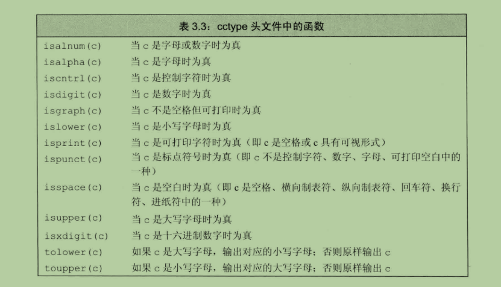

以上函数全部需要`#include <cctype>`用法：

```c++
#include <cctype>

std::string str_tolower(std::string s) {
    std::transform(s.begin(), s.end(), s.begin(),
        // static_cast<int(*)(int)>(std::tolower)         // wrong
        // [](int c){ return std::tolower(c); }           // wrong
        // [](char c){ return std::tolower(c); }          // wrong
        [](unsigned char c) { return std::tolower(c); } // correct
    );
    return s;
}

int main() {
    std::string s = "ABCD";
    std::cout << str_tolower(s) << std::endl;
}

输出：
abcd
```

>注：**使用C++版本的C库文件**
>
>对于C库头文件的C++版本，需要将 #include "ctype.h" 写法改为 #include \<cctype>，即在原名字前面加 c 前缀。

### 3.3 标准库类型vector

* vector是一种容器，因为它可以容纳其它的对象。
* vector的内部实现是使用**类模板**来实现的，创建vector对象的过程就是**模板实例化**的过程。

### 3.4 迭代器介绍

**迭代器运算符**

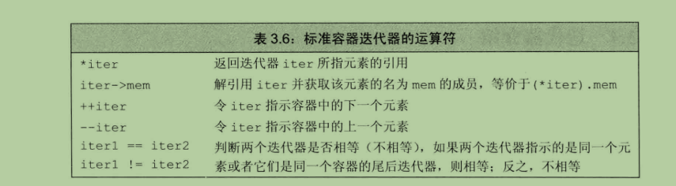

**迭代器用法**

```c++
std::vector<int> vec;

vec.begin();		// 指向第一个元素
vec.end();		// 指向最后一个元素的下一个位置

vector<int>::iterator it;	// 迭代器的类型
vector<int>::const_iterator it2;	// const迭代器
```

### 3.5 数组

#### 3.5.1 数组定义和初始化

数组定义时数组大小必须是常量表达式，编译期已知的值。

```c++
unsigned cnt = 42;		// 非常量表达式
constexpr unsigned sz = 42;	// 常量表达式
int arr[10];	// 含有10个整数的数组
int* parr[sz];	// 含有42个整型指针的数组
string bad[cnt];	// error, cnt不是常量表达式
```

> **建议：**尽量使用vector和string，而不使用数组和指针。

## 第四章 表达式

### 4.1 基础

#### 左值和右值

* 左值可以位于赋值语句的左侧，右值则不能。
* 当一个对象被用作右值的时候，用的是对象的值（内容）；当对象被用作左值的时候，用的是对象的身份（在内存中的位置）。

### 运算符优先级表

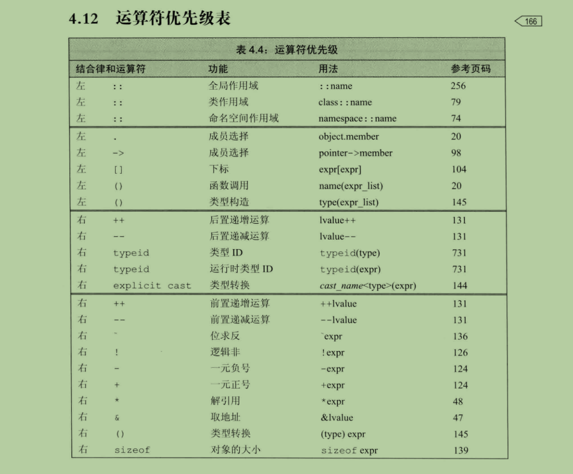

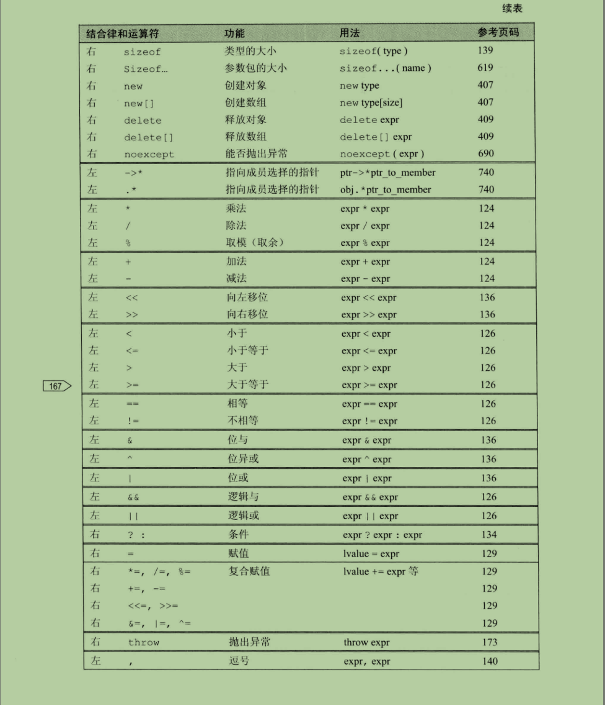


## C++ switch 语句

一个 **switch** 语句允许测试一个变量等于多个值时的情况。每个值称为一个 case，且被测试的变量会对每个 **switch case** 进行检查。

#### 语法

C++ 中 **switch** 语句的语法：

```c++
switch(expression){
    case constant-expression  :
       statement(s);
       break; // 可选的
    case constant-expression  :
       statement(s);
       break; // 可选的
  
    // 您可以有任意数量的 case 语句
    default : // 可选的
       statement(s);
}
```

**switch** 语句必须遵循下面的规则：

- **switch** 语句中的 **expression** 必须是一个**整型或枚举类型**，或者是一个 class 类型，其中 class 有一个单一的转换函数将其转换为整型或枚举类型。
- 在一个 switch 中可以有任意数量的 case 语句。每个 case 后跟一个要比较的值和一个冒号。
- case 的 **constant-expression** 必须与 switch 中的变量具有相同的数据类型，且必须是一个常量或字面量。
- 当被测试的变量等于 case 中的常量时，case 后跟的语句将被执行，直到遇到 **break** 语句为止。
- 当遇到 **break** 语句时，switch 终止，控制流将跳转到 switch 语句后的下一行。
- 不是每一个 case 都需要包含 **break**。如果 case 语句不包含 **break**，控制流将会 *继续* 后续的 case，直到遇到 break 为止。
- 一个 **switch** 语句可以有一个可选的 **default** case，出现在 switch 的结尾。default case 可用于在上面所有 case 都不为真时执行一个任务。default case 中的 **break** 语句不是必需的。

#### 流程图


## **二、C++基础知识**

### C和C++的特点与区别？

答：（1）C语言特点：

1.作为一种面向过程的结构化语言，易于调试和维护；

2.表现能力和处理能力极强，可以直接访问内存的物理地址；

3.C语言实现了对硬件的编程操作，也适合于应用软件的开发；

4.C语言还具有效率高，可移植性强等特点。

（2）C++语言特点：

1.在C语言的基础上进行扩充和完善，使C++兼容了C语言的面向过程特点，又成为了一种面向对象的程序设计语言；

2.可以使用抽象数据类型进行基于对象的编程；

3.可以使用多继承、多态进行面向对象的编程；

4.可以担负起以模版为特征的泛型化编程。

C++与C语言的本质差别：在于C++是面向对象的，而C语言是面向过程的。或者说C++是在C语言的基础上增加了面向对象程序设计的新内容，是对C语言的一次更重要的改革，使得C++成为软件开发的重要工具。


### 说一说extern“C”

extern "C"的主要作用就是为了能够正确实现C++代码调用其他C语言代码。加上extern "C"后，会指示编译器这部分代码按C语言（而不是C++）的方式进行编译。由于C++支持函数重载，因此编译器编译函数的过程中会将函数的参数类型也加到编译后的代码中，而不仅仅是函数名；而C语言并不支持函数重载，因此编译C语言代码的函数时不会带上函数的参数类型，一般只包括函数名。

这个功能十分有用处，因为在C++出现以前，很多代码都是C语言写的，而且很底层的库也是C语言写的，为了更好的支持原来的C代码和已经写好的C语言库，需要在C++中尽可能的支持C，而extern "C"就是其中的一个策略。

- C++代码调用C语言代码
- 在C++的头文件中使用
- 在多个人协同开发时，可能有的人比较擅长C语言，而有的人擅长C++，这样的情况下也会有用到


### 如何判断程序是C程序还是CPP程序

根据宏__cplusplus

```cpp
#include <iostream>
using namespace std;
 
void main()
{
#ifdef __cplusplus
	cout << "c++" << endl;
#else
	cout << endl;
#endif
	system("pause");
}
```


### 指针和引用的区别是什么？

**指针：**是保存另一个变量内存地址的变量，指针通过 * 访问保存的内存地址所指向的值；

**引用：**是另一个变量的别名，一旦被初始化就不能被改变，引用可以认为是一个具有自动间接性的常量指针，相当于编译器帮助实现了自动间接性取值，即：编译器帮助加上了 * 。引用内部实现为指针。

指针是在 C 语言中就已存在，功能非常强大，但是许多的不安全因素也都是指针导致的。引用是 C++ 中引入的概念，引用使用起来更加安全。

但是，C++引入引用的直接原因是支持 C++ 重载，来看下面一个例子：

```c++
//没有引用的情况下
void func1(const complex* x, const complex* y) 
    complex z = *x+*y;
    // ...
}
 
//有引用的情况下
void func2(const complex& x, const complex& y)
    complex z = x+y;
    // ...
}
```

可以看到，在引入引用后，两数相加更加合理，是无感知的，而没有引用的情况下，能明显看到和普通加法运算不同。

但指针和引用都有一个相同点：实现让一个变量对另一个变量的访问。

来通过一个简单例子加深下理解：

```c++
#include <iostream>
using namespace std;
 
int main() {
    int x = 10;
    int *p = &x;
    int &y = x;
 
    cout<<"*p = "<<*p<<endl;
    cout<<" y = "<<y<<endl;
}
```

输出为：

```
linuxy@linuxy:~/pointerRef$ g++ main.cpp -o main
linuxy@linuxy:~/pointerRef$ ./main
*p = 10
 y = 10
linuxy@linuxy:~/pointerRef$
```

上面的例子可以通过下图来理解： 

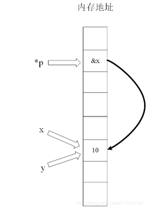

变量 p 存储 x 的地址，x 和 y 都是 10 的名称。

接下来详细的讲解一下区别。

- 因为引用可能会指向一个对象，因此，引用必须被初始化；而指针没有这样的限制

```cpp
string &pc;  //错误，引用必须被初始化
string *pc;  //未初始化的指针。合法但是危险
```

- 不存在指向空值的引用意味着使用引用的效率比指针要高，因为在使用引用之前不需要测试它的合法性。相反，指针应该总是被测试，防止其为空

```cpp
void printfDouble(const double &d){
    cout << rd;
}
 
void printfDouble(const double *pd){
    if(pd){
        cout << *pd;
    }
}
```

- 指针可以被重新赋值以指向另一个不同的对象，但是引用总是指向在初始化时被指定的对象，以后不能改变

```cpp
#include <iostream>
 
int main(){
    std::string s1("Nancy");
    std::string s2("Clancy");
    std::string &rs = s1;
    std::string *rp = &s1;
    rs = s2;   // rs仍然引用s1，但是s1现在的值是”Clancy“
    rp = &rs; // ps 现在指向s2，s1没有改变
}
```

指针和引用都是一种内存概念，区别在于，指针是一个实体，引用只是一个别名

在程序编译时，会将指针和引用添加到符号表中。

- 指针指向一块内存，指针的内容是所指向的内存的地址，在编译的时候，则是将“指针变量名-指针变量的地址”，所以说，指针包含的内容是可以改变的，允许拷贝和赋值，有const和非const的区别，甚至可以为空，sizeof指针得到的是指针类型的大小
- 而引用只是一块内存的别名，在添加到符号表的时候，是将“引用变量名-引用对象的地址”添加的符号表中，符号表一经完成就不能改变，所以引用必须而且只能在定义时被绑定到一块内存上，后继不能更改，也不能为空，也没有const和非const的区别。

sizeof引用得到代表对象的大小，sizeof引用得到的是指针本身的大小。另外在参数传递中，指针需要被解引用之后才可以对对象进行操作，而直接对引用进行的修改会直接作用到引用对象上。

作为参数时也不同，传指针的实质是传值，传递的值是指针的地址；传引用的实质是传地址，传递的是变量的地址。


### 何时使用指针，何时使用引用呢？

应该使用指针的情况：

- **有指向不存在对象的可能时**：在任何情况下都不能使用指向空值的引用。一个引用必须总是指向某些对象。因此，如果你使用一个变量时并让它指向一个对象，但是该对象在某些时候可能不指向任何对象，这时你应该把变量声明为指针，因为这样你可以赋空值给该变量
- **需要在不同时刻指向不同对象时**，使用指针，否则，总应该使用引用

- 打个比方。当你重载某个操作符时，应该使用引用（为了防止不必要的语义误解）。看个例子

```cpp
vector<int> v(10);
v[5] = 10;  
//如果operator []返回一个指针，那么v[5]就必须写成`*v[5] = 10`，这会使v看起来像一个向量指针
```

注：引用指向空值将导致未定义行为，请一定不要写这样的代码。比如：

```cpp
char *pc = 0;
char & rc = *pc;
```


### 对虚函数和多态的理解

多态的实现主要分为静态多态和动态多态，静态多态主要是重载，在编译的时候就已经确定；动态多态是用虚函数机制实现的，在运行期间动态绑定。举个例子：一个父类类型的指针指向一个子类对象时候，使用父类的指针去调用子类中重写了的父类中的虚函数的时候，会调用子类重写过后的函数，在父类中声明为加了virtual关键字的函数，在子类中重写时候不需要加virtual也是虚函数。

虚函数的实现：在有虚函数的类中，类的最开始部分是一个虚函数表的指针，这个指针指向一个虚函数表，表中放了虚函数的地址，实际的虚函数在代码段(.text)中。当子类继承了父类的时候也会继承其虚函数表，当子类重写父类中虚函数时候，会将其继承到的虚函数表中的地址替换为重新写的函数地址。使用了虚函数，会增加访问内存开销，降低效率。

### C++的多态

答：C++的多态性用一句话概括：在基类的函数前加上virtual关键字，在派生类中重写该函数，运行时将会根据对象的实际类型来调用相应的函数。如果对象类型是派生类，就调用派生类的函数；如果对象类型是基类，就调用基类的函数。

1）：用virtual关键字申明的函数叫做虚函数，虚函数肯定是类的成员函数；

2）：存在虚函数的类都有一个一维的虚函数表叫做虚表，类的对象有一个指向虚表开始的虚指针。虚表是和类对应的，虚表指针是和对象对应的；

3）：多态性是一个接口多种实现，是面向对象的核心，分为类的多态性和函数的多态性。；

4）：多态用虚函数来实现，结合动态绑定.；

5）：纯虚函数是虚函数再加上 = 0；

6）：抽象类是指包括至少一个纯虚函数的类；

纯虚函数：virtual void fun()=0;即抽象类，必须在子类实现这个函数，即先有名称，没有内容，在派生类实现内容。

### 虚函数实现

答：简单地说，每一个含有虚函数（无论是其本身的，还是继承而来的）的类都至少有一个与之对应的虚函数表，其中存放着该类所有的虚函数对应的函数指针。例：

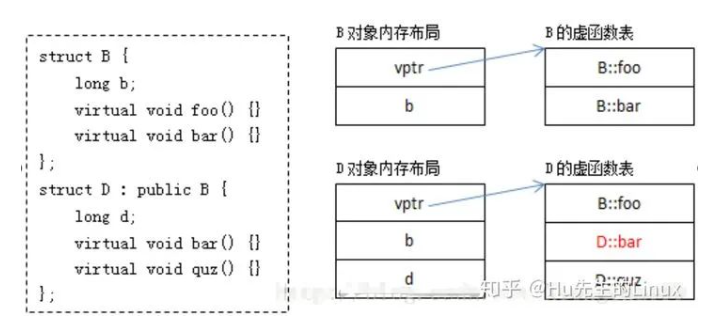

其中：

B的虚函数表中存放着B::foo和B::bar两个函数指针。

D的虚函数表中存放的既有继承自B的虚函数B::foo，又有重写（override）了基类虚函数B::bar的D::bar，还有新增的虚函数D::quz。

虚函数表构造过程：

从编译器的角度来说，B的虚函数表很好构造，D的虚函数表构造过程相对复杂。下面给出了构造D的虚函数表的一种方式（仅供参考）：

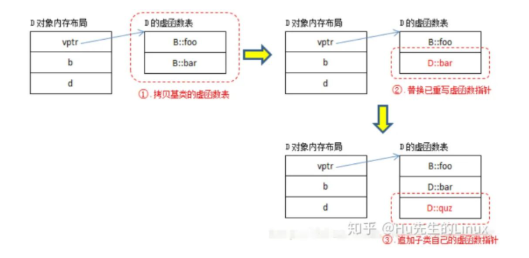

虚函数调用过程

以下面的程序为例：

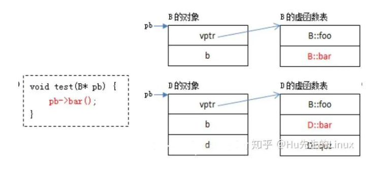

### 虚函数可以是内联函数吗？

- 虚函数可以是内联函数，内联是可以修饰虚函数的，但是当虚函数表现动态性时就不能内联
- 内联是在编译器建议编译器内联，而虚函数的多态性在运行期间，编译器无法知道运行期调用哪个代码，因此虚函数表现为多态性（运行期）不可以内联
- inline virtual唯一可以内联的时候：编译器知道所调用的对象是哪个类（如 Base::who()），这只有在编译器具有实际对象而不是对象的指针或者引用时才会发生

代码实例如下：

```cpp
#include <iostream>
using namespace std;
// 基类
class Base{
public:
    inline virtual void who(){
        cout << "I am Base\n";
    }
    virtual ~Base(){}
};
// 派生类
class Derived:public Base{
public:
    inline void who(){   // 不写inline时隐式内联
        cout << "I am Derived\n";
    }
};
int  main(){
    // 此处的虚函数 who()，是通过类（Base）的具体对象（b）来调用的，编译期间就能确定了，所以它可以是内联的，但最终是否内联取决于编译器。
    Base b;
    b.who();
    // 此处的虚函数是通过指针调用的，呈现多态性，需要在运行时期间才能确定，所以不能为内联。
    Base *bptr = new Derived();
    bptr->who();
    // 因为Base有虚析构函数（virtual ~Base() {}），所以 delete 时，会先调用派生类（Derived）析构函数，再调用基类（Base）析构函数，防止内存泄漏。
    delete bptr;
    bptr = nullptr;
    return 0;

}
```


### 内存的分配方式有几种

- 从静态存储区域分配：

内存在程序编译时就已经分配好，这块内存在程序的整个运行期间都存在。速度快、不容易出错， 因为有系统会善后。例如全局变量，static 变量，常量字符串等。

- 在栈上分配：

在执行函数时，函数内局部变量的存储单元都在栈上创建，函数执行结束时这些存储单元自动被释 放。栈内存分配运算内置于处理器的指令集中，效率很高，但是分配的内存容量有限。大小为2M。

- 从堆上分配：

即动态内存分配。程序在运行的时候用 malloc 或new 申请任意大小的内存，程序员自己负责在何 时用free 或delete 释放内存。动态内存的生存期由程序员决定，使用非常灵活。如果在堆上分配了空间，就有责任回收它，否则运行的程序会出现内存泄漏，另外频繁地分配和释放不同大小的堆空间将会产生 堆内碎块。

一个C、C++程序编译时内存分为5 大存储区：堆区、栈区、全局区、文字常量区、程序代码区。


### C和C++内存分配问题

答：

**（1）C语言编程中的内存基本构成**

C的内存基本上分为4部分：静态存储区、堆区、栈区以及常量区。他们的功能不同，对他们使用方式也就不同。

1.栈 ——由编译器自动分配释放；

2.堆 ——一般由程序员分配释放，若程序员不释放，程序结束时可能由OS回收；

3.全局区（静态区）——全局变量和静态变量的存储是放在一块的，初始化的全局变量和静态变量在一块区域，未初始化的全局变量

和未初始化的静态变量在相邻的另一块区域（C++中已经不再这样划分），程序结束释放；

4.另外还有一个专门放常量的地方，程序结束释放；

(a)函数体中定义的变量通常是在栈上；

(b)用malloc, calloc, realloc等分配内存的函数分配得到的就是在堆上；

(c)在所有函数体外定义的是全局量；

(d)加了static修饰符后不管在哪里都存放在全局区（静态区）；

(e)在所有函数体外定义的static变量表示在该文件中有效，不能extern到别的文件用；

(f)在函数体内定义的static表示只在该函数体内有效；

(g)另外，函数中的"adgfdf"这样的字符串存放在常量区。

**（2）C++编程中的内存基本构造**

在C++中内存分成5个区，分别是堆、栈、全局/静态存储区、常量存储区和代码区；

1、栈，就是那些由编译器在需要的时候分配，在不需要的时候自动清除的变量的存储区，里面的变量通常是局部变量、函数参数等。

2、堆，就是那些由new分配的内存块，他们的释放编译器不去管，由我们的应用程序去控制，一般一个new就要对应一个delete。如果程序员没有释放掉，那么在程序结束后，操作系统会自动回收。

3、全局/静态存储区，全局变量和静态变量被分配到同一块内存中，在以前的C语言中，全局变量又分为初始化的和未初始化的，在C++里面没有这个区分了，他们共同占用同一块内存区。

4、常量存储区，这是一块比较特殊的存储区，他们里面存放的是常量，不允许修改（当然，你要通过非正当手段也可以修改）。

5、代码区 （.text段），存放代码（如函数），不允许修改（类似常量存储区），但可以执行（不同于常量存储区）。

内存模型组成部分：自由存储区，动态区、静态区；

根据c/c++对象生命周期不同，c/c++的内存模型有三种不同的内存区域，即：自由存储区，动态区、静态区。

自由存储区：局部非静态变量的存储区域，即平常所说的栈；

动态区：用new ，malloc分配的内存，即平常所说的堆；

静态区：全局变量，静态变量，字符串常量存在的位置；

注：代码虽然占内存，但不属于c/c++内存模型的一部分；


**一个正在运行着的C编译程序占用的内存分为5个部分：代码区、初始化数据区、未初始化数据区、堆区 和栈区；**

（1）代码区（text segment）：代码区指令根据程序设计流程依次执行，对于顺序指令，则只会执行一次（每个进程），如果反复，则需要使用跳转指令，如果进行递归，则需要借助栈来实现。注意：代码区的指令中包括操作码和要操作的对象（或对象地址引用）。如果是立即数（即具体的数值，如5），将直接包含在代码中；

（2）全局初始化数据区/静态数据区（Data Segment）：只初始化一次。

（3）未初始化数据区（BSS）：在运行时改变其值。

（4）栈区（stack）：由编译器自动分配释放，存放函数的参数值、局部变量的值等，其操作方式类似于数据结构中的栈。

（5）堆区（heap）：用于动态内存分配。


**为什么分成这么多个区域？**

主要基于以下考虑：

* 代码是根据流程依次执行的，一般只需要访问一次，而数据一般都需要访问多次，因此单独开辟空间以方便访问和节约空间。

* 未初始化数据区在运行时放入栈区中，生命周期短。

* 全局数据和静态数据有可能在整个程序执行过程中都需要访问，因此单独存储管理。

* 堆区由用户自由分配，以便管理。


### 栈区与堆区的区别

（1）栈区（stack）：

* 由编译器进行管理，在需要时由编译器自动分配空间，在不需要时自动回收空间，一般保存的是局部变量和函数参数等。

* 一般来说，CPU有专门的指令可以用于入栈和出栈的操作。当一个函数被调用时，就会有指令把当前指令的地址压入栈内保存起来，然后跳转到被调用的函数执行。函数返回的时候，就会把栈里面的指令地址弹出来继续执行。

* 它是连续的内存空间，在函数调用的时候，首先入栈的是下一条可以执行指令的地址，然后是函数逇各个参数
  大多数编译器中，参数是从右向左入栈（原因在于采用这种顺序，可以让程序员在使用C/C++的“函数参数长度可变”这个特性时更方便。如果从左向右压栈，第一个参数(即描述可变参数表各个变量的那个参数)将被放在栈底，由于可变参数函数的第一步就需要解析可变参数表的各个参数类型，即第⼀步就需要得到上述参数，因此，将它放在栈底是很不⽅便的。）

* 本地函数调用结束时，局部变量先出栈，然后是参数，最后是栈顶指针最开始存放的地址，程序由该点继续运行，不会产生碎片

* 栈是⾼地址向低地址扩展，栈底⾼地址，空间较⼩。

* 栈操作很快：

  * 数据存取的位置总是在栈顶而不需要寻找位置存放获取读取数据

  * 栈中的所有数据必须占用已知且固定的大小

  * 调用函数时，传递给函数的值[包括指向对上数据的指针]和函数的局部变量被压入栈中。

    

（2）堆区（heap）：

* 由程序员管理，需要⼿动 new malloc delete free 进⾏分配和回收，如果不进⾏回收的话，会造成内存泄漏的问题。
* 在编译时大小未知或者大小可能变化的数据，要存储到堆上
* 堆是为动态分配预留的内存空间，是不连续的，每个线程都有一个栈，但是每一个应用程序只有一个堆。
* 堆是缺乏组织的：当向堆放入数据时，需要请求一定大小的空间。操作系统在堆的某处找到一块足够大的空位，把它标记为已使用，并且返回一个表示该位置地址的指针。这个过程称为在堆上分配内存
* 返回的堆地址指针存放在栈中[因为指针的大小是已知并且固定的]
* 实际上系统中有一个空闲链表，当有程序申请的时候，系统遍历空闲链表找到第一个大于等于申请大小的空间分配给程序，一般在分配程序的时候，也会在空间头部写入内存大小，方便delete回收空间大小。当然，如果有剩余的，也会将剩余的插入到空闲链表中，这也是产生内存碎片的原因
* 堆是低地址向⾼地址扩展，空间较⼤，较为灵活。
* 访问堆上的数据比访问栈上的数据慢：
  * 因为必须通过指针来访问。现代CPU在内存中跳转越少就越快
  
  * 在堆上分配大量的空间也可能消耗时间

  * 注意它与数据结构中的堆是两回事，分配方式倒是类似于链表。

    
  

（3） 全局/静态存储区：分为初始化和非初始化两个相邻区域，存储初始化和未初始化的全局变量和静态变量，程序结束后由系统释放
（4）常量存储区：存储常量，比如字符串，一般不允许修改。程序结束后由系统释放
（5）代码区：存放程序的二进制代码


**栈区与堆区内存申请的区别**：
存储内容：栈存储局部变量、函数参数等。堆存储使用new、malloc申请的变量等
申请方式：栈内存由系统分配，堆内存由程序员申请
申请后系统的响应：
栈：只要栈的剩余空间大于所申请空间，系统将为程序提供内存，否则将报异常提示栈溢出
堆：首先应该知道操作系统有一个记录空闲内存地址的链表，当系统收到程序的申请时，会遍历该链表，寻找第一个空间大于所省去空间的堆节点，然后将该节点从空闲节点链表中删除，并将该节点的空间分配给程序
申请大小的显示：WindowsT栈的大小一般是2M,堆的容量较大；
申请效率的比较：栈由系统自动分配，速度较快。堆使用new、malloc等分配，比较慢
总结：栈区优势在于处理效率，堆区优势在于灵活


### 协程

答：定义：**协程是一种用户态的轻量级线程**。

协程拥有自己的寄存器上下文和栈。协程调度切换时，将寄存器上下文和栈保存到其他地方，在切回来的时候，恢复先前保存的寄存器上下文和栈。因此：协程能保留上一次调用时的状态（即所有局部状态的一个特定组合），每次过程重入时，就相当于进入上一次调用的状态，换种说法：进入上一次离开时所处逻辑流的位置；

线程是抢占式，而协程是协作式；

**协程的优点**：

* 跨平台

* 跨体系架构

* 无需线程上下文切换的开销

* 无需原子操作锁定及同步的开销

* 方便切换控制流，简化编程模型

* 高并发+高扩展性+低成本：一个CPU支持上万的协程都不是问题。所以很适合用于高并发处理。

**协程的缺点**：

* 无法利用多核资源：协程的本质是个单线程,它不能同时将 单个CPU 的多个核用上,协程需要和进程配合才能运行在多CPU；

* 进行阻塞（Blocking）操作（如IO时）会阻塞掉整个程序：这一点和事件驱动一样，可以使用异步IO操作来解决。

### RAII

> RAII维基百科解释：
>
> 资源获取即初始化( RAII ) 是一种编程习惯用法，在几种面向对象的静态类型编程语言中用于描述特定的语言行为。在 RAII 中，持有资源是类不变量，并且与对象生命周期相关联。资源分配（或获取）在对象创建（特别是初始化）期间由构造函数完成，而资源释放（释放）在对象销毁（特别是终结）期间由析构函数完成. 换句话说，资源获取必须成功，初始化才能成功。因此，资源被保证在初始化完成和终结开始之间被持有（持有资源是类不变量），并且只在对象处于活动状态时被持有。因此，如果没有对象泄漏，则没有资源泄漏。
>
> --wiki百科

> 【资源】关键词的解释：
>
> 在计算机系统中，【资源】是数量有限且对系统正常运行具有一定作用的元素。
>
> 比如：网络套接字、互斥锁、文件句柄和内存等等，它们属于系统资源。由于系统的资源是有限的，所以，我们在编程使用系统资源时，都必须遵循一个步骤： 
>
> 1 申请资源；
>
> 2 使用资源；
>
> 3 释放资源。
>
> 第一步和第三步缺一不可，因为资源必须要申请才能使用的，使用完成以后，必须要释放，如果不释放的话，就会造成资源泄漏。

**Resource acquisition is initialization** (**RAII**)术语是由Stroustrup 在C++中创造的。C++总是将所有的事情都交给程序员去做，包括GC(Garbage Collection)。

 以上是对RAII概念的一些铺垫。

 顾名思义，**资源获取是初始化**，其中所暗含下半句意思是，资源释放就是删除。**我一开始困惑于这句话中的初始化是什么意思**，其实想想也能理解，其实就是类的构造，我们将所有资源的申请放在构造函数里（构造函数里new），资源的释放放在析构函数里（析构函数里delete）。其本质是一种思想：资源谁申请，谁就负责销毁，将资源绑定到具有生存周期的变量上，申请的资源随着变量的生命周期（一般来说是由scope确定）的开始而申请资源，结束而释放资源，极大地减少了手动的去写成对的一些操作（**主要是**new和delete）。

  假设，我将算法封装在类中，运行这个算法可能需要申请一些额外的内存来存放中间数据，所以，我们在类构造(即initialization)时候申请(new)这些资源，在类析构时候释放(delete)这些资源。这样可以尽可能就保证了程序员忘记delete 而引起的内存泄露。


标准库提供了一些RAII的实现，最典型的是智能指针，我们资源放置在智能指针里，使用引用计数来管理资源是否析构，引用计数为0时，该资源析构。


RAII可以总结如下：

- 将每个资源封装到一个类中，其中

- - 构造函数获取资源并建立所有类不变量，如果无法完成则抛出异常，
  - 析构函数释放资源并且从不抛出异常；

- 我们始终通过 RAII 类的实例使用资源

- - 本身具有自动存储期限或临时生命周期，或
  - 具有受自动或临时对象的生命周期限制的生命周期

### RTTI

RTTI(Runtime Type Information)的内容要比RAII要晦涩一点。顾名思义，运行时类型信息，实际上我们在运行程序时，在变量的内部其实保留着变量的类型信息，这一步实际上是存在微弱的的性能开销，后文会讲到如何关闭。

首先我们必须要从一个实际的问题出发：

 ```cpp
 
 class A
 {
   virtual void printType() {};
 };
 class B:public A
 {
 
 };
 class C :public A
 {
 
 };
 int main()
 {
   A* a=new B();
   B* b = a;
   getchar();
 }
 ```

这种情况，我们常常会遇到，这实际上是多态的一个实现，子类B和子类C继承于A，B子类的指针可以赋予A类的指针（子类对象指针可以赋予父类指针），但问题来了，此时的a如何正确的转回它本来的类型B呢？

上述  B* b = a;实际上会产生编译错误“初始化”: 无法从“A *”转换为“B *”

有人可能会想到C-Style的强制转化类型,即

```cpp
int main()
{
  A* a=new B();
  // B* b = a;
  B* b = (B*)a;
  getchar();
}
```

ok，这样其实就能正确的编译通过了，与这样进行等价的C++Style的语句是

 ```cpp
 int main()
 {
   A* a=new B();
   // B* b = a;
   B* b = static_cast<B*>(a);// 等价于 B* b = (B*)a;
   getchar();
 }
 ```

但这样写是有风险的，a是B的类型的话，这样转换当然没有问题，但如果a实际上是C类型(A的另一个子类)的话，就会存在问题了

```cpp

int main()
{
  //A* a=new B();
  A* a=new C();
  //B* b = (B*)a;
  B* b = static_cast<B*>(a);
  getchar();
}
```

我们的这个问题模型比较简单，仅仅针对我们的例子可以一目了然，但当问题比较复杂时，这个问题实际上是很大可能存在错误的，当C类型的a无法转换为B类型的b时，会抛出异常，程序就崩溃啦！！！这其实是不安全的写法！！！

这时，RTTI的作用就可以凸显出来了

```c++
// 代码段1
int main()
{
  //A* a=new B();
  A* a=new C();
  //B* b = (B*)a;
  B* b = dynamic_cast<B*>(a);
  if (b)
  {
    std::cout << "转换成功！" << std::endl;//此时不会经过打印这句话
  }
  getchar();
}

// 代码段2
int main()
{
  A* a=new B();
  B* b = dynamic_cast<B*>(a);
  if (b)
  {
    std::cout << "转换成功！" << std::endl;//此时会经过打印这句话
    //紧接着使用b去做事情
    //......
  }
  getchar();
}
```

教科书告诉我们：

> dynamic_cast主要用于类层次间的上行转换和下行转换，还可以用于类之间的交叉转换。在类层次间进行上行转换时，dynamic_cast和static_cast的效果是一样的；在进行下行转换时，dynamic_cast具有类型检查的功能，比static_cast更安全。

dynamic_cast若不成功，则只是返回nullptr，而**不是抛出异常**。意思是当a确实是B类型时，才进行转换；当a不是B类型时，返回nullptr（就如上面的代码，a其实是C类型，并不会打印"转换成功！"语句），这样就保证了类转换的安全性。问题是，dynamic_cast怎么知道此时的a其实是C类型而不是B类型的呢？怎么实现的？

其实是借助运行时类型信息(RTTI)，**类的类型信息保存在虚表的第一项，若不存在虚表，则其类型信息就是其静态类型，而不是运行时类型。**

在vs中可以关闭运行时类型信息，右击文件->属性->c/c++->语言->启用运行时类型信息->选择否，应用

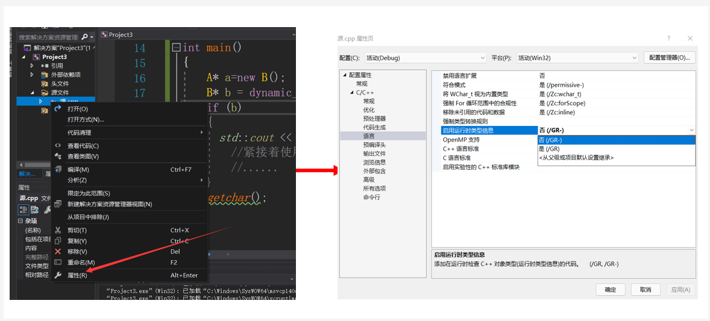

编译代码段2时，会抛出异常，如图所示：

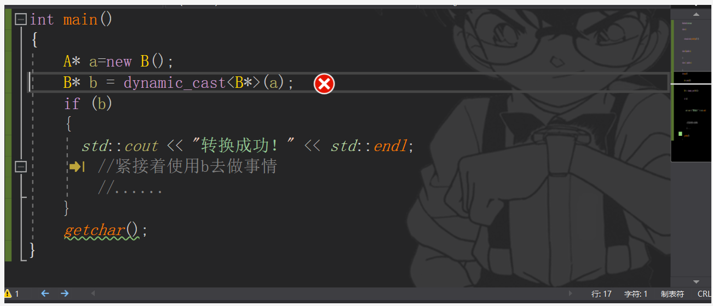

印证了我们想法的正确，此时没有运行时类型信息，或者说类型信息可能为空，则运行到dynamic_cast时，编译器无法进行判断，所以抛出异常。

当A中不存在虚函数时，又会怎样呢？

```cpp

#include<iostream>
class A
{
  //virtual void printType() {};
};
class B:public A
{

};
int main()
{
  A* a=new B();
  B* b = dynamic_cast<B*>(a);
  if (b)
  {
    std::cout << "转换成功！" << std::endl;
    //紧接着使用b去做事情
    //......
  }
  getchar();
}
```

实际上，当A中没有虚函数时的上述代码并不会编译通过，报错error C2683: “dynamic_cast”:“A”不是多态类型，为什么A中必须存在虚表才能编译通过？经过查阅相关博客，一种说法是虚表中维护着类的继承关系，没有虚表就无法知道继承关系，如下：

>  为何使用dynamic_cast转换类指针时，必须要有虚函数呢。dynamic_cast转换是在运行时进行转换，运行时转换就需要知道类对象的信息（继承关系等）。如何在运行时获取到这个信息——虚函数表。
>
>  C++对象模型中，对象实例最前面的就是虚函数表指针， 通过这个指针可以获取到该类对象的所有虚函数，包括父类的。因为派生类会继承基类的虚函数表，所以通过这个虚函数表，我们就可以知道该类对象的父类，在转换的时候就可以用来判断对象有无继承关系。
>
> https://blog.csdn.net/jiaoyongqing134/article/details/52384639

但这样解释起来感觉并不是很让人信服，因为就算没有虚表，继承关系也是明明白白的，class B:public A写的清清楚楚，我猜测编译错误的原因是因为dynamic_cast只能根据运行时类型信息来判断是否能转换，不存在虚表就无法知道运行时类型信息（处在虚表第一个位置），但这种猜测暂时无法得到验证。

实际上这也能解释typeid一个看起来比较奇怪的现象

```cpp
#include<iostream>
#include<typeinfo>
class A
{
  //virtual void printType() {};
};
class B:public A
{

};
int main()
{
  A* a=new B();
  std::cout << typeid(*a).name()<< std::endl;
  getchar();
}
```

在上述代码中

当A中虚函数注释掉 会打印  class A 

当A中虚函数取消注释  会打印  class B

当存在虚表（父类有虚函数，哪怕有一个）时，typeid是借助RTTI得到运行时类型；当不存在虚表时，得到的其实就是静态类型。
当从本质开始理解C++时，会逐渐明白语法的合理性，而不必做八股经书的布道者，一遍又一遍的吟诵……

水平有限，欢迎指正错误。

### 类构造析构、继承、多态、虚函数、虚指针、重载和重写

 大多数人对C++的语法向来讳莫如深，很多人第一反应就是，太难了，太复杂了。我向来是喜欢追求原理的，而不是停留在你告诉我这样做，我就仿照这样做，这个模式在初期接触是对的，但长远来看，还是理解原理比较踏实，有时候想想底层原理根本不用记语法，虽然标题比较长，看起来很吓人，但在我看来，它就是一个东西，翻来覆去也只是一种东西，把本质搞懂了就OK了。讲一讲心得，水平有限，如有错误，欢迎交流修订......

 首先，是类。类是C++面向对象编程的核心概念，类使得代码的逻辑和可读性大大增加，还记得C语言你是怎么写代码的吗？给定输入参数，然后经过乱七八糟的逻辑运行，最后输出一个结果，但可能你写着写着，可能就忘记了自己是谁......我要干什么.......为什么面向过程比面向对象编程的可读性较差呢？我觉得更多的是缺乏逻辑，而类将相关的数据和函数集成到一起，每个类只负责自己的数据的操作，清清爽爽，不烧脑。但C++比C多了这层逻辑以后，需要多一点开销去管理这些内容，这就是构造函数和析构函数，**每个类的析构函数和构造函数只负责自己类的资源申请和释放**，请记住这句话，记不住也没关系，我在后文会反复提到。

继承，概念基本上教科书讲的很清楚了，但强调一点，子类除了拥有父类所有的东西，还有自己独自的数据和方法，从数学的概念上讲是**包含**的关系，子类包含父类，大概就像下图一样吧


 是的，没错，一个子类可以拥有多个父类，但首先我们先考虑只有一个基类的情况。还记得C++教科书里有这样一句吗？继承的子类在创建对象时候，父类构造函数被唤醒，其次是子类函数，析构时候，子类析构函数先被唤醒，父类析构函数再被唤醒。相信这个顺序困扰了不少考生来记住顺序。下面告诉你为什么是这样，**每个类的析构函数和构造函数只负责自己类的资源申请和释放**（重复+1），当创建子类对象时候，由于子类是包含父类的，是比父类更“大”的概念,子类对象包含父类的资源，所以，当然要先分配子类空间中属于父类的那部分资源！父类构造函数分配完父类的那部分资源，紧接着子类构造函数紧接着分配属于自己的那部分资源，对于下图来说，构造子类对象时，肯定是**先**分配蓝色的空间（这部分是继承自父类的），**再**分配红色的空间（这部分是子类自己的)；析构子类对象时，要**先**释放掉自己的资源，**再**释放父类的资源。

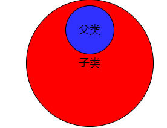

其实，这部分已经比较深入了，理解了感觉好像还不难。OK，其实本质就是这样。下图是一种更为主流的看待角度，构造子类就是从上至下的，但析构就是从下至上的。

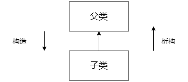

所以，当你继承于多个父对象呢?构造函数和析构函数的顺序呢？U1S1，最明显的可以肯定，构造时，两个父类的构造函数肯定先于子类，但两个父类构造函数的顺序是不确定的（印象中是随机的，依赖于编译器的实现，不知道是不是对的，有懂的可以交流）；同样的，析构时，唯一可以肯定的是子类析构先于两个父类析构，父类的析构顺序并不能确定。


 多态，虚指针，虚函数，函数重载，本质上在我看来就是一套东西。多态分为**编译期多态**和**运行期多态**。

 编译期多态依赖于函数重载实现，又称为静态多态，静态的意思是编译期间就确定函数的调用是哪个。**所谓的函数重载，就是具有相同的函数名但是有不同参数列表（参数列表包括参数的类型、参数的个数和参数的顺序，只要有一个不同就叫做参数列表不同，又称为函数签名）的函数，我们叫他们为函数重载**。函数重载可以在编译时候很久函数签名就确定我们应该调用哪个函数，我们称之为编译期的多态。


 运行期多态，其依赖于虚函数实现，又称为动态多态，与静态多态的区别是它是运行时而不是编译时确定要调用的函数的。对于相关功能的对象的集合，我们希望抽象出它们功能集合，在基类中声明为虚函数，然后再子类中去重写这些虚函数，以实现子类其特有的功能。虚函数，有想过“虚”的意义吗？或者Virtual Function的Virtual的含义吗？

> Virtual  adj.
>
> 释义：almost or nearly as described, but not completely or according to strict definition.

总的来说，我有这个函数，but not completely definition。对我来说，这里的虚是**虚假**的意思，它表明，我有这个函数，但我没定义。**所以让一个内部只有纯虚函数的类实例化一个对象是完全没有意义的**，它更重要的作用是继承，我们将具有纯虚函数的类称为interface，翻译为接口（其实我还是觉得英文更地道一点，根据构词法，interface，内部的表面，内部向外交流通信的表面.....希望你能体会到我的意思），当你把纯虚函数当做父类，根据定义子类拥有父类所有的东西，这些函数也被继承了，我们要做的就是在子类中实现这些函数。比如说，我有一个类，叫做水果（class Fruit），有一个纯虚方法，叫做得到水果的颜色

```
 virtual int getColor() =0;   
```

显然，水果的颜色太多了，我们并不知道水果指的到底是哪种颜色，我们去实例化一个对象(Fruit fruit)，去调用这个纯虚方法（fruit.getColor() ;）,这样做显然毫无意义，**让一个只有纯虚函数的类定义的类是实例化一个对象是完全没有意义的**，是不是对这句话有了更深理解了呢?**有虚函数的类一定是倾向于为了继承准备的**，如果不需要继承这个类，或者这个类是final class（一个C++11语法送给大家，**final关键字**表示该类是最后一个继承类，后续不会有类继承于它）的话，我们要把virtual关键字去掉，因为virtual的实现机制会损耗一丝丝性能。我可以指定Apple、Banana、Pear的父类是Fruit，这样我在实现了统一的调用interface，定义apple(Apple apple)，调用apple.getColor();我就可以知道是哪个颜色了，同理，banana.getColor();peargetColor()；。这也是多态的实现，父类一个方法，子类调用同一个方法却返回不同的结果，拥有不同的行为。


  是时候该引入劝退无数人、让人闻风丧胆的、大名鼎鼎的虚指针和虚函数表了。一旦你的类里有虚函数，无论是纯虚函数还是普通的虚函数，该类在创建一个实例对象时候，在对象里都会生成一个虚函数表来存放本类所有的虚函数，它本质上是一个一维数组，里面的元素是**这个类（埋下伏笔，后文会再次提到这个类）**的虚函数的指针，**这个对象在调用虚函数时，只会从自己的虚函数表里查找，然后调用（重要）**。如何定位虚函数呢？我们通过虚指针定位，虚指针指向虚函数表，通常处于对象内存的首地址位置存放。虚函数表里的虚函数指针是这个**这个类**的虚函数的指针。这个类如果是父类，没有任何疑问，如果这个类是子类呢？这里的虚函数表里的虚函数是谁呢？请循其本，【**每个类的析构函数和构造函数只负责自己类的资源申请和释放**（重复+2)，当进入父类构造函数时，它的虚函数表继承自父类，与父类的虚函数表完全一致，进入子类构造函数时，直接先继承父类的虚函数表，如果子类有该虚函数重写的话，更新为子类的函数地址。

OK，还有一个最重要的部分 ，多态的最重要的用法

```
Fruit *  fruit=new Apple;
```

是的，子类的对象指针可以直接赋给父类对象指针，想一想也可以理解，**父类是比子类更小的概念，子类比较“大”，**子类似乎可以通过删除一部分变成父类，但父类绝对不可以增加一部分东西变成子类，若想变成子类，必须通过子类的构造函数函数增加缺少的那部分资源，但显然，这是不可能的。

更有趣的是，此时fruit.getColor();的行为，可能你知道会调用Apple的getColor()函数，但为什么？答案是虚函数表，new Apple进行构造，先进入Fruit 构造函数，此时虚函数表是父类的，再进入子类构造函数，子类方法覆盖了虚指针，此时虚函数表里的函数一部分是父类，一部分是子类的,也有更新父类的虚函数。**这个对象在调用虚函数时，只会从自己的虚函数表里查找，然后调用，很明显，此时\*fruit对象里面的虚函数表里存放的是Apple的虚函数表！！！！**


 再从另一个知识点再来体会下虚函数的强大，可能有人告诉你，如果存在继承时，父类的析构函数一定要写成虚函数，为什么？

如果不变成虚函数，*fruit在析构时候会怎样呢？不变成虚函数，此时就像是强制类型转换，子类强制转换成了父类，析构只会调用父类析构函数，但你要知道**父类是比子类更小的概念，子类比较“大”，**析构了父类那部分资源，但子类自己申请的那些资源没有释放！！！！内存泄露！！！（即下图蓝色析构了，红色却不能被正确析构）

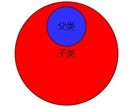

如果析构函数是虚函数，*fruit在析构时候，会先从自己的虚函数表里查找，很明显，**这个对象在调用虚函数时，只会从自己的虚函数表里查找，然后调用，**它的虚函数表里的析构函数是Apple的！！！！！！！因此先调用Apple析构，再调用父类析构，完美！

 重写是指非虚函数，父类和子类一个函数名字的话，子类方法会覆盖父类方法。


### 多重继承虚函数表分析

```cpp
//基类1
class Base1
{
public:
	virtual void f()
	{
		cout << "base1::f()" << endl;
	}
	virtual void g()
	{
		cout << "base1::g()" << endl;
	}
};
 
//基类2
class Base2
{
public:
	virtual void h()
	{
		cout << "base2::h()" << endl;
	}
	virtual void i()
	{
		cout << "base2::i()" << endl;
	}
};
 
//子类
class Derived :public Base1, public Base2
{
public:
	virtual void f() //覆盖父类1的虚函数
	{
		cout << "derived::f()" << endl;
	}
	virtual void i() //覆盖父类2的虚函数
	{
		cout << "derived::i()" << endl;
	}
 
	//如下三个我们自己的虚函数
	virtual void mh() 
	{
		cout << "derived::mh()" << endl;
	}
	
	virtual void mi()
	{
		cout << "derived::mi()" << endl;
	}
 
	virtual void mj()
	{
		cout << "derived::mj()" << endl;
	}
};
int main()
{
	//第四节  多重继承虚函数表分析
	//多重继承
	cout << sizeof(Base1) << endl;
	cout << sizeof(Base2) << endl;
	cout << sizeof(Derived) << endl;
 
	Derived ins; 
	Base1 &b1 = ins; //多态
	Base2 &b2 = ins;
	Derived &d = ins;
 
	typedef void(*Func)(void);
	long *pderived1 = (long *)(&ins);
	long *vptr1 = (long *)(*pderived1); //取第一个虚函数表指针。
 
	long *pderived2 = pderived1 + 1; //跳过4字。
	long *vptr2 = (long *)(*pderived2); //取第二个虚函数表指针。
 
	Func f1 = (Func)vptr1[0]; //0x00ab15d7 {project100.exe!Derived::f(void)}
	Func f2 = (Func)vptr1[1]; //0x00ab15f0 {project100.exe!Base1::g(void)}
	Func f3 = (Func)vptr1[2]; //0x00ab15cd {project100.exe!Derived::mh(void)}
	Func f4 = (Func)vptr1[3]; //0x00ab15ff {project100.exe!Derived::mi(void)}
	Func f5 = (Func)vptr1[4]; //0x00ab15eb {project100.exe!Derived::mj(void)}
	Func f6 = (Func)vptr1[5]; //非正常
	Func f7 = (Func)vptr1[6];
	Func f8 = (Func)vptr1[7];
	
	Func f11 = (Func)vptr2[0]; //0x00ab15af {project100.exe!Base2::h(void)}
	Func f22 = (Func)vptr2[1]; //0x00ab15b9 {project100.exe!Derived::i(void)}
	Func f33 = (Func)vptr2[2]; //非正常
	Func f44 = (Func)vptr2[3];
 
	b1.f();
	b2.i();
	d.f();
	d.i();
	d.mh();
	d.g();
	//----------------
	cout << "-----------------" << endl;
	f1();
	f2();
	f3();
	f4();
	f5();
	cout << "-------------" << endl;
	f11();
	f22();
    return 0;
}
```

- vs2017输出

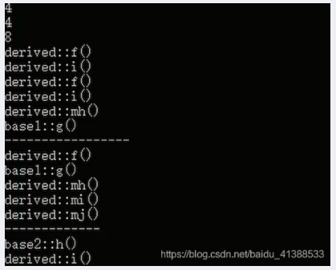

- linux环境编译输出

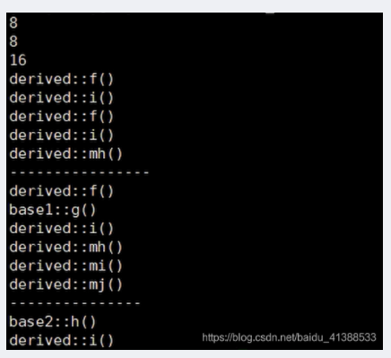

> - 一个**对象**，如果**它的类有多个基类**则**有多个虚函数表指针**（注意是两个虚函数表指针，而不是两个虚函数表）
> - **在多继承中，对应各个基类的vptr按继承顺序依次放置在类的内存空间中**，且**子类与第一个基类共用一个vptr(第二个基类有自己的vptr)**

**下面以VS2017结果进行分析**

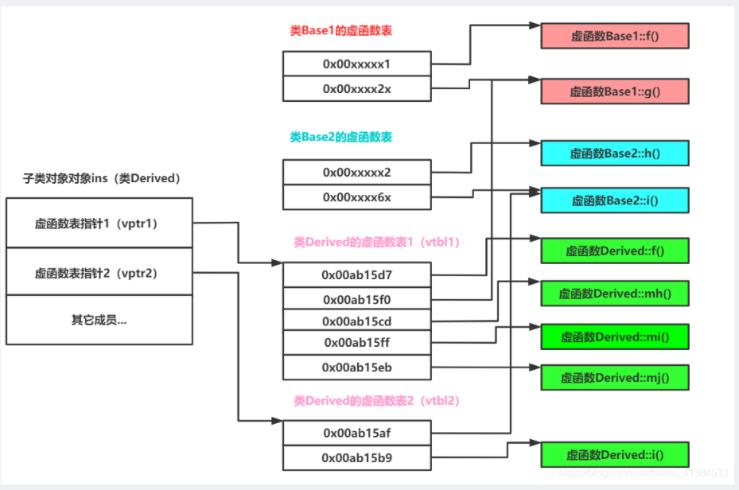

* 子类对象ins有两个虚函数表指针，vptr1,vptr2
* 类Derived有两个虚函数表，因为它继承自两个基类；
* 子类和第一个基类公用一个vptr（因为vptr指向一个虚函数表，所以也可以说子类和第一个基类共用一个虚函数表vtbl)
* 因为我们注意到了类Derived的虚函数表1里边的5个函数，而g()正好是base1里边的函数。
* 子类中的虚函数覆盖了父类中的同名虚函数。比如derived::f(),derived::i();


### 简述类成员函数的重写、重载和隐藏的区别

（1）重写和重载主要有以下几点不同。

- 范围的区别：被重写的和重写的函数在两个类中，而重载和被重载的函数在同一个类中。
- 参数的区别：被重写函数和重写函数的参数列表一定相同，而被重载函数和重载函数的参数列表一 定不同。
- virtual 的区别：重写的基类中被重写的函数必须要有virtual 修饰，而重载函数和被重载函数可以被 virtual 修饰，也可以没有。

（2）隐藏和重写、重载有以下几点不同。

- 与重载的范围不同：和重写一样，隐藏函数和被隐藏函数不在同一个类中。
- 参数的区别：隐藏函数和被隐藏的函数的参数列表可以相同，也可不同，但是函数名肯定要相同。当参数不相同时，无论基类中的参数是否被virtual 修饰，基类的函数都是被隐藏，而不是被重写。

**「注意」**：虽然重载和覆盖都是实现多态的基础，但是两者实现的技术完全不相同，达到的目的也是完 全不同的，覆盖是动态绑定的多态，而重载是静态绑定的多态。


### final关键字

**final关键字**表示该类是最后一个继承类，后续不会有类继承于它


### explicit关键字

explicit关键字一般用来修饰类的构造函数，作用是告诉编译器按照实际的类型来构造函数，不允许做隐式转换。


### const修饰类成员函数

```cpp
class A {
public:
    A() {};
    virtual ~A() {};
    static void fun() {};
};

```

把const加了一个函数后面，通常是对一个类的成员函数才这么做的。在一个类中，如果一个成员函数后面有const，则表面该成员函数不能修改这个类的成员变量。


### const可以修饰静态成员函数吗？

如：

```cpp
class A {
public:
    A() {};
    virtual ~A() {};
    static void fun() const {};
};

```

不可以，会编译报错。


### C++类内可以定义引用数据成员吗？

可以，必须通过成员函数初始化列表初始化。

### C++中类成员的访问权限

C++通过 public、protected、private 三个关键字来控制成员变量和成员函数的访问权限，它们分别表示公有的、受保护的、私有的，被称为成员访问限定符。在类的内部（定义类的代码内部），无论成员被声明为 public、protected 还是 private，都是可以互相访问的，没有访问权限的限制。在类的外部（定义类的代码之外），只能通过对象访问成员，并且通过对象只能访问 public 属性的成员，不能访问 private、protected 属性的成员

### C++的空类有哪些成员函数

- 缺省构造函数。
- 缺省拷贝构造函数。
- 缺省析构函数。
- 赋值运算符。
- 取址运算符。
- 取址运算符 const 。

**「注意」**：有些书上只是简单的介绍了前四个函数。没有提及后面这两个函数。但后面这两个函数也是 空类的默认函数。另外需要注意的是，只有当实际使用这些函数的时候，编译器才会去定义它们。


### 介绍C++中所有的构造函数

构造函数：类的对象被创建时，编译系统为对象分配内存空间，并自动调用构造函数，由构造函数完成成员的初始化工作。也就是构造函数的作用是初始化对象的数据成员。

- **无参构造函数**：即默认构造函数，如果没有明确写出无参构造函数，编译器会自动生成默认的无参构造函数，函数体为空。如果不想使用自动生成的无参构造函数，就必须自己显式写出一个无参构造函数
- **普通构造函数**：也称为重载构造函数。普通构造函数可以有各种参数形式，一个类可以有多个普通构造函数，前提是参数的个数或者类型不同，创建对象时根据传入参数的不同调用不同的构造函数
- **拷贝构造函数**：拷贝构造函数的函数参数为对象本身的引用，用于根据一个已经存在的对象复制出一个新的该类的对象，一般在函数中会将已经存在的对象的数据成员的值一一复制到新创建的对象中。如果没有显式的写拷贝构造函数，那么系统默认会生成一个拷贝构造函数，但是当前类中有指针成员时，最好不要使用编译器提供的默认的拷贝构造函数，最好自己定义并在类中进行深拷贝
- **类型转换构造函数**：根据一个指定类型的对象创建一个本类的对象，也可以算是普通构造函数的一种。这里要注意的是有时候不允许默认转换的话，可以将其声明为explicit，来阻止一些隐式转换的发生
- **赋值运算符的重载**：注意，这个类似拷⻉构造函数，将＝右边的本类对象的值复制给＝左边的对象，它不属于构造函数，＝左右两边的对象必需已经被创建。如果没有显示的写赋值运算符的重载，系统也会⽣成默认的赋值运算符，做⼀些基本的拷⻉⼯作。

```c
A a1, A a2; a1 = a2;//调⽤赋值运算符
A a3 = a1;//调⽤拷⻉构造函数，因为进⾏的是初始化⼯作，a3 并未存在
```


### 谈谈你对拷贝构造函数和赋值运算符的认识

拷贝构造函数和赋值运算符重载有以下两个不同之处：

- 拷贝构造函数生成新的类对象，而赋值运算符不能。
- 由于拷贝构造函数是直接构造一个新的类对象，所以在初始化这个对象之前不用检验源对象 是否和新建对象相同。而赋值运算符则需要这个操作，另外赋值运算中如果原来的对象中有内存分配要先把内存释放掉。

**「注意」**：当有类中有指针类型的成员变量时，一定要重写拷贝构造函数和赋值运算符，不要使用默认的。


### 拷贝构造函数的应用场景

拷贝构造函数是一种**特殊的**构造函数**，函数的名称必须和类名称一致，它必须的一个参数是本类型的一个**引用变量**。

拷贝函数用于对象的初始化。 例：一个简单得拷贝函数如下

```cpp
class Test3{
public:
	Test3(const Test3&obj) {
		a = obj.a + 100;
		b = obj.b + 100;
		cout << "拷贝构造函数" << endl;
	}
	~Test3(){//析构函数 
	}
};
```

**拷贝构造函数的三种应用场景：**

* 对象通过另外一个对象进行初始化
* 对象以值传递的方式传入函数参数
* 对象以值传递的方式从函数返回


### 为什么析构函数一般写成虚函数

由于类的多态性，基类指针可以指向派生类的对象，如果删除该基类的指针，就会调用该指针指向的派生类析构函数，而派生类的析构函数又自动调用基类的析构函数，这样整个派生类的对象完全被释放。如果析构函数不被声明成虚函数，则编译器实施静态绑定，在删除基类指针时，只会调用基类的析构函数而不调用派生类析构函数，这样就会造成派生类对象析构不完全，造成内存泄漏。所以将析构函数声明为虚函数是十分必要的。在实现多态时，当用基类操作派生类，在析构时防止只析构基类而不析构派生类的状况发生，要将基类的析构函数声明为虚函数。举个例子：

```cpp
#include <iostream>
using namespace std;

class Parent{
public:
    Parent(){
        cout << "Parent construct function"  << endl;
    };
    ~Parent(){
        cout << "Parent destructor function" <<endl;
    }
};

class Son : public Parent{
public:
    Son(){
        cout << "Son construct function"  << endl;
    };
    ~Son(){
        cout << "Son destructor function" <<endl;
    }
};

int main()
{
    Parent* p = new Son();
    delete p;
    p = NULL;
    return 0;
}
//运行结果：
//Parent construct function
//Son construct function
//Parent destructor function
```

将基类的析构函数声明为虚函数：

```cpp
#include <iostream>
using namespace std;

class Parent{
public:
    Parent(){
        cout << "Parent construct function"  << endl;
    };
    virtual ~Parent(){
        cout << "Parent destructor function" <<endl;
    }
};

class Son : public Parent{
public:
    Son(){
        cout << "Son construct function"  << endl;
    };
    ~Son(){
        cout << "Son destructor function" <<endl;
    }
};

int main()
{
    Parent* p = new Son();
    delete p;
    p = NULL;
    return 0;
}
//运行结果：
//Parent construct function
//Son construct function
//Son destructor function
//Parent destructor function
```


### 为啥构造函数又不能是虚函数？

1. 使用构造函数之前，虚表指针尚未初始化，所以构造函数不能是虚函数
2. 我们需要在编译时确定构造的类的类型，而虚函数表是在程序运行的过程中执行的。

> 实际上上面的说法不太准确，因为我们调用构造函数的时候，是会明确给出构造的类型的，如`Parent* p = new Son();`，那我们直接构造Son就可以了，不知道虚表的意义在哪里，事实上也正是因为构造函数不需要虚表这个东西，所以c++是禁止将构造函数定义为虚函数的。


### 构造函数里new自己会怎样

```cpp
class A {
public:
    A() {
        new A();
    }
    ~A() {}
};

int main()
{
    A a;
    return 0;
}
```

运行结果如下：

Stack overflow (参数: 0x0000000000000001, 0x0000008E376B3FD8)。

会无限循环导致栈溢出。


### 能否在构造函数和析构函数中抛出异常？

一.  析构函数

   参照《Effective C++》中条款08：别让异常逃离析构函数。

　  总结如下：

1. 不要在析构函数中抛出异常！虽然C++并不禁止析构函数抛出异常，但这样会导致程序过早结束或出现不明确的行为。

2. 如果某个操作可能会抛出异常，class应提供一个普通函数（而非析构函数），来执行该操作。目的是给客户一个处理错误的机会。

3. 如果析构函数中异常非抛不可，那就用try catch来将异常吞下，但这样方法并不好，我们提倡有错早些报出来。

 

二.  构造函数

   总结如下：

1. 构造函数中抛出异常，会导致析构函数不能被调用，但对象本身已申请到的内存资源会被系统释放（已申请到资源的内部成员变量会被系统依次逆序调用其析构函数）。

2. 因为析构函数不能被调用，所以可能会造成内存泄露或系统资源未被释放。

3. 构造函数中可以抛出异常，但必须保证在构造函数抛出异常之前，把系统资源释放掉，防止内存泄露。（如何保证？？？使用auto_ptr？？？）

 

最后总结如下：

1. 构造函数中尽量不要抛出异常，能避免的就避免，如果必须，要考虑不要内存泄露！

2. 不要在析构函数中抛出异常！


### 能否在构造函数中调用该类的另一个构造函数？

今天在面试的时候，写了一个类，自己在另一个构造函数中调用了另一个构造函数，面试官说，这样不行吧，你回去查查。

后来回来一查，果然我写的有问题。下面一篇文章写的很好详细，我这里转过来，原文来自这里：http://www.cnblogs.com/chio/archive/2007/10/20/931043.html

--------从这里开始转载---------

题目如下：问下列代码的打印结果为0吗？

```cpp

#include <stdlib.h>
#include <iostream>
using namespace std;
 
struct CLS
{
    int m_i;
    CLS( int i ) : m_i(i){}
    CLS()
    {
        CLS(0);
    }
};
int main()
{
    CLS obj;
    cout << obj.m_i << endl;
 
    system("PAUSE");
    return 0;
}
```

打印结果是不定的，不一定为0

代码奇怪的地方在于构造函数中调用了自己的另一个构造函数

我们知道，当定义一个对象时，会按顺序做2件事情：
1）分配好内存（非静态数据成员是未初始化的）
2）调用构造函数（构造函数的本意就是初始化非静态数据成员）

显然上面代码中，CLS obj；这里已经为obj分配了内存，然后调用默认构造函数，但是默认构造函数还未执行完，却调用了另一个构造函数，这样相当于产生了一个匿名的临时CLS对象，它调用CLS(int)构造函数，将这个匿名临时对象自己的数据成员m_i初始化为0；但是obj的数据成员并没有得到初始化。于是obj的m_i是未初始化的，因此其值也是不确定的

从这里，我们归纳如下：
1）在c++里，由于构造函数允许有默认参数，使得这种构造函数调用构造函数来重用代码的需求大为减少
2）如果仅仅为了一个构造函数重用另一个构造函数的代码，那么完全可以把构造函数中的公共部分抽取出来定义一个成员函数(推荐为private),然后在每个需要这个代码的构造函数中调用该函数即可
3）偶尔我们还是希望在类的构造函数里调用另一个构造函数，可以按下面方式做：
在构造函数里调用另一个构造函数的关键是让第二个构造函数在第一次分配好的内存上执行，而不是分配新的内存，这个可以用标准库的placement new做到：
先看看标准库中placement new的定义

```cpp

inline void *__cdecl operator new(size_t, void *_P)
{
    return (_P); 
}
```

可见没有分配新的内存。

正确的方式：

```cpp

struct CLS
{
    int m_i;
    CLS( int i ) : m_i(i){}
    CLS()
    {
        new (this)CLS(0);
    }
};
```

另： 若构造函数调用自身，则会出现无限递归调用，是不允许的。

--------结束转载------------

所以，在实际使用的时候，单纯的在构造函数中调用其它的构造函数，只是会产生一个临时的匿名变量。如果仅仅是为了重用代码，可以把重用的代码封装成一个新的函数。


### 什么是右值引用，跟左值又有什么区别？

左值和右值的概念：

- 左值：能取地址，或者具名对象，表达式结束后依然存在的持久对象；
- 右值：不能取地址，匿名对象，表达式结束后就不再存在的临时对象；区别：
- 左值能赋值，右值不能；
- 左值可变，右值不能（仅对基础类型适用，用户自定义类型右值引用可以通过成员函数改变）；

### 面向对象的三大特征

- 封装性：将客观事物抽象成类，每个类对自身的数据和方法实行 protection （private ， protected ， public ）。
- 继承性：广义的继承有三种实现形式：实现继承（使用基类的属性和方法而无需额外编码的能力)、可 视继承(子窗体使用父窗体的外观和实现代码)、接口继承(仅使用属性和方法,实现滞后到子类实现)。
- 多态性：是将父类对象设置成为和一个或更多它的子对象相等的技术。用子类对象给父类对象赋值 之后，父类对象就可以根据当前赋值给它的子对象的特性以不同的方式运作。

### 对c++中的smart pointer四个智能指针：shared_ptr,unique_ptr,weak_ptr,auto_ptr的理解

C++里面的四个智能指针: auto_ptr, shared_ptr, weak_ptr, unique_ptr 其中后三个是c++11支持，并且第一个已经被11弃用。

智能指针的作用是管理一个指针，因为存在以下这种情况：申请的空间在函数结束时忘记释放，造成内存泄漏。使用智能指针可以很大程度上的避免这个问题，因为智能指针就是一个类，当超出了类的作用域是，类会自动调用析构函数，析构函数会自动释放资源。所以智能指针的作用原理就是在函数结束时自动释放内存空间，不需要手动释放内存空间。

- auto_ptr（c++98的方案，cpp11已经抛弃）

采用所有权模式。

```cpp
auto_ptr< string> p1 (new string ("I reigned lonely as a cloud.”));
auto_ptr<string> p2;
p2 = p1; //auto_ptr不会报错.
```

此时不会报错，p2剥夺了p1的所有权，但是当程序运行时访问p1将会报错。所以auto_ptr的缺点是：存在潜在的内存崩溃问题！

- unique_ptr（替换auto_ptr）

unique_ptr实现独占式拥有或严格拥有概念，保证同一时间内只有一个智能指针可以指向该对象。它对于避免资源泄露(例如“以new创建对象后因为发生异常而忘记调用delete”)特别有用。

采用所有权模式。

```cpp
unique_ptr<string> p3 (new string ("auto"));   //#4
unique_ptr<string> p4；                       //#5
p4 = p3;//此时会报错！！
```

编译器认为p4=p3非法，避免了p3不再指向有效数据的问题。因此，unique_ptr比auto_ptr更安全。

另外unique_ptr还有更聪明的地方：当程序试图将一个 unique_ptr 赋值给另一个时，如果源 unique_ptr 是个临时右值，编译器允许这么做；如果源 unique_ptr 将存在一段时间，编译器将禁止这么做，比如：

```cpp
unique_ptr<string> pu1(new string ("hello world"));
unique_ptr<string> pu2;
pu2 = pu1;                                      // #1 not allowed
unique_ptr<string> pu3;
pu3 = unique_ptr<string>(new string ("You"));   // #2 allowed
```

其中#1留下悬挂的unique_ptr(pu1)，这可能导致危害。而#2不会留下悬挂的unique_ptr，因为它调用 unique_ptr 的构造函数，该构造函数创建的临时对象在其所有权让给 pu3 后就会被销毁。这种随情况而已的行为表明，unique_ptr 优于允许两种赋值的auto_ptr 。

**「注意」**：如果确实想执行类似与#1的操作，要安全的重用这种指针，可给它赋新值。C++有一个标准库函数std::move()，让你能够将一个unique_ptr赋给另一个。例如：

```cpp
unique_ptr<string> ps1, ps2;
ps1 = demo("hello");
ps2 = move(ps1);
ps1 = demo("alexia");
cout << *ps2 << *ps1 << endl;
```

- shared_ptr

shared_ptr实现共享式拥有概念。多个智能指针可以指向相同对象，该对象和其相关资源会在“最后一个引用被销毁”时候释放。从名字share就可以看出了资源可以被多个指针共享，它使用计数机制来表明资源被几个指针共享。可以通过成员函数use_count()来查看资源的所有者个数。除了可以通过new来构造，还可以通过传入auto_ptr, unique_ptr,weak_ptr来构造。当我们调用release()时，当前指针会释放资源所有权，计数减一。当计数等于0时，资源会被释放。

shared_ptr 是为了解决 auto_ptr 在对象所有权上的局限性(auto_ptr 是独占的), 在使用引用计数的机制上提供了可以共享所有权的智能指针。

成员函数：

use_count 返回引用计数的个数

unique 返回是否是独占所有权( use_count 为 1)

swap 交换两个 shared_ptr 对象(即交换所拥有的对象)

reset 放弃内部对象的所有权或拥有对象的变更, 会引起原有对象的引用计数的减少

get 返回内部对象(指针), 由于已经重载了()方法, 因此和直接使用对象是一样的.如 shared_ptrsp(new int(1)); sp 与 sp.get()是等价的

- weak_ptr

weak_ptr 是一种不控制对象生命周期的智能指针, 它指向一个 shared_ptr 管理的对象. 进行该对象的内存管理的是那个强引用的 shared_ptr. weak_ptr只是提供了对管理对象的一个访问手段。weak_ptr 设计的目的是为配合 shared_ptr 而引入的一种智能指针来协助 shared_ptr 工作, 它只可以从一个 shared_ptr 或另一个 weak_ptr 对象构造, 它的构造和析构不会引起引用记数的增加或减少。weak_ptr是用来解决shared_ptr相互引用时的死锁问题,如果说两个shared_ptr相互引用,那么这两个指针的引用计数永远不可能下降为0,资源永远不会释放。它是对对象的一种弱引用，不会增加对象的引用计数，和shared_ptr之间可以相互转化，shared_ptr可以直接赋值给它，它可以通过调用lock函数来获得shared_ptr。

```cpp
class B;
class A
{
public:
shared_ptr<B> pb_;
~A()
{
     cout<<"A delete
";
}
};
class B
{
public:
shared_ptr<A> pa_;
~B()
{
    cout<<"B delete
";
}
};
void fun()
{
    shared_ptr<B> pb(new B());
    shared_ptr<A> pa(new A());
    pb->pa_ = pa;
    pa->pb_ = pb;
    cout<<pb.use_count()<<endl;
    cout<<pa.use_count()<<endl;
}
int main()
{
    fun();
    return 0;
}
```

可以看到fun函数中pa ，pb之间互相引用，两个资源的引用计数为2，当要跳出函数时，智能指针pa，pb析构时两个资源引用计数会减一，但是两者引用计数还是为1，导致跳出函数时资源没有被释放（A B的析构函数没有被调用），如果把其中一个改为weak_ptr就可以了，我们把类A里面的shared_ptr pb_; 改为weak_ptr pb_; 运行结果如下，这样的话，资源B的引用开始就只有1，当pb析构时，B的计数变为0，B得到释放，B释放的同时也会使A的计数减一，同时pa析构时使A的计数减一，那么A的计数为0，A得到释放。

**「注意」**：不能通过weak_ptr直接访问对象的方法，比如B对象中有一个方法print(),我们不能这样访问，pa->pb\_->print(); 英文pb\_是一个weak_ptr，应该先把它转化为shared_ptr,如：shared_ptr p = pa->pb_.lock(); p->print();


### C++中为什么要用模板类

- 是类型无关的，因此具有很高的复用性
- 它在编译时而不是运行时检查数据类型，保证了类型安全
- 是平台无关的，可移植:如stl，boost是跨平台的
- 可用于基本数据类型


### 模板函数和模板类的特例化

**「引入原因」**

编写单一的模板，它能适应多种类型的需求，使每种类型都具有相同的功能，但对于某种特定类型，如果要实现其特有的功能，单一模板就无法做到，这时就需要模板特例化

**「定义」**对单一模板提供的一个特殊实例，它将一个或多个模板参数绑定到特定的类型或值上

（1）模板函数特例化

必须为原函数模板的每个模板参数都提供实参，且使用关键字template后跟一个空尖括号对<>，表明将原模板的所有模板参数提供实参，举例如下：

```cpp
template<typename T> //模板函数
int compare(const T &v1,const T &v2)
{
    if(v1 > v2) return -1;
    if(v2 > v1) return 1;
    return 0;
}
//模板特例化,满足针对字符串特定的比较，要提供所有实参，这里只有一个T
template<> 
int compare(const char* const &v1,const char* const &v2)
{
    return strcmp(p1,p2);
}
```

**「本质」**特例化的本质是实例化一个模板，而非重载它。特例化不影响参数匹配。参数匹配都以最佳匹配为原则。例如，此处如果是compare(3,5)，则调用普通的模板，若为compare(“hi”,”haha”)则调用特例化版本（因为这个cosnt char*相对于T，更匹配实参类型），注意二者函数体的语句不一样了，实现不同功能。

**「注意」**模板及其特例化版本应该声明在同一个头文件中，且所有同名模板的声明应该放在前面，后面放特例化版本。

（2）类模板特例化

原理类似函数模板，不过在类中，我们可以对模板进行特例化，也可以对类进行部分特例化。对类进行特例化时，仍然用template<>表示是一个特例化版本，例如：

```cpp
template<>
class hash<sales_data>
{
    size_t operator()(sales_data& s);
    //里面所有T都换成特例化类型版本sales_data
    //按照最佳匹配原则，若T != sales_data，就用普通类模板，否则，就使用含有特定功能的特例化版本。
};
```

**「类模板的部分特例化」**

不必为所有模板参数提供实参，可以指定一部分而非所有模板参数，一个类模板的部分特例化本身仍是一个模板，使用它时还必须为其特例化版本中未指定的模板参数提供实参(特例化时类名一定要和原来的模板相同，只是参数类型不同，按最佳匹配原则，哪个最匹配，就用相应的模板)

**「特例化类中的部分成员」**

可以特例化类中的部分成员函数而不是整个类，举个例子：

```cpp
template<typename T>
class Foo
{
    void Bar();
    void Barst(T a)();
};

template<>
void Foo<int>::Bar()
{
    //进行int类型的特例化处理
    cout << "我是int型特例化" << endl;
}

Foo<string> fs;
Foo<int> fi;//使用特例化
fs.Bar();//使用的是普通模板，即Foo<string>::Bar()
fi.Bar();//特例化版本，执行Foo<int>::Bar()
//Foo<string>::Bar()和Foo<int>::Bar()功能不同
```

### 访问基类的私有虚函数

写出以下程序的输出结果：

```cpp
#include <iostream.h> 
class A
{ 
   virtual void g() 
   { 
      cout << "A::g" << endl; 
   } 
  private: 
   virtual void f() 
   { 
      cout << "A::f" << endl; 
   } 
}; 
class B : public A 
{ 
   void g() 
   { 
      cout << "B::g" << endl; 
   } 
   virtual void h() 
   { 
      cout << "B::h" << endl; 
   } 
}; 
typedef void( *Fun )( void ); 
void main() 
{ 
   B b; 
   Fun pFun; 
   for(int i = 0 ; i < 3; i++) 
   { 
      pFun = ( Fun )*( ( int* ) * ( int* )( &b ) + i ); 
      pFun(); 
   } 
} 
```

输出结果：

```
B::g 
A::f 
B::h 
```

**「注意」**：考察了面试者对虚函数的理解程度。一个对虚函数不了解的人很难正确的做出本题。在学习面向对象的多态性时一定要深刻理解虚函数表的工作原理。

### 用C++设计一个不能被继承的类

将构造函数和析构函数定义为private的。

```c++
class A {
private:
    A() {}
    ~A() {}
};

class B : A {
};

int main()
{
    B b;
    return 0;
}
```

如何修改才可以通过编译？

```cpp
template <typename T> class A 
{ 
   friend T; 
    private: 
     A() {} 
    ~A() {} 
}; 
class B : virtual public A<B> 
{ 
   public: 
    B() {} 
   ~B() {} 
}; 
class C : virtual public B 
{ 
   public: 
     C() {} 
    ~C() {} 
}; 
void main( void ) 
{ 
    B b; 
    //C c; 
    return; 
} 
```

**「注意」**：构造函数是继承实现的关键，每次子类对象构造时，首先调用的是父类的构造函数，然后才 是自己的。

### C++自己实现一个String类

```cpp
#include <iostream>
#include <cstring>
 
using namespace std;
 
class String{
public:
    // 默认构造函数
    String(const char *str = nullptr);
    // 拷贝构造函数
    String(const String &str);
    // 析构函数
    ~String();
    // 字符串赋值函数
    String& operator=(const String &str);
 
private:
    char *m_data;
    int m_size;
};
 
// 构造函数
String::String(const char *str)
{
    if(str == nullptr)  // 加分点：对m_data加NULL 判断
    {
        m_data = new char[1];   // 得分点：对空字符串自动申请存放结束标志'\0'的
        m_data[0] = '\0';
        m_size = 0;
    }
    else
    {
        m_size = strlen(str);
        m_data = new char[m_size + 1];
        strcpy(m_data, str);
    }
}
 
// 拷贝构造函数
String::String(const String &str)   // 得分点：输入参数为const型
{
    m_size = str.m_size;
    m_data = new char[m_size + 1];  //加分点：对m_data加NULL 判断
    strcpy(m_data, str.m_data);
}
 
// 析构函数
String::~String()
{
    delete[] m_data;
}
 
// 字符串赋值函数
String& String::operator=(const String &str)  // 得分点：输入参数为const
{
    if(this == &str)    //得分点：检查自赋值
        return *this;
 
    delete[] m_data;    //得分点：释放原有的内存资源
    m_size = strlen(str.m_data);
    m_data = new char[m_size + 1];  //加分点：对m_data加NULL 判断
    strcpy(m_data, str.m_data);
    return *this;       //得分点：返回本对象的引用
}
```

### 数组初始化

``` c++
int arr[4] = {1, 2, 3, 4};
int arr[4] = { 0 };
// or
int* arr = new int[4] {1, 2, 3, 4};
```

注意两种数组初始化方式的区别。

### 浅拷贝与深拷贝

简单总结就是：浅拷贝不会开辟新的内存，只是通过指针指向拷贝对象；而深拷贝会另开辟一块内存，然后把拷贝对象的内容复制过去。

浅拷贝的例子：

```c++
class A {
public:
    A(int size) : size_(size) {
        data_ = new int[size];
    }
    A(){}
    A(const A& a) {
        size_ = a.size_;
        data_ = a.data_;
        cout << "copy " << endl;
    }
    ~A() {
        delete[] data_;
    }
    int *data_;
    int size_;
};
int main() {
    A a(10);
    A b = a;
    cout << "b " << b.data_ << endl;
    cout << "a " << a.data_ << endl;
    return 0;
}
```

上面代码中，两个输出的是相同的地址，a和b的data_指针指向了同一块内存，这就是浅拷贝，只是数据的简单赋值，那再析构时data_内存会被释放两次，导致程序出问题，这里正常会出现double free导致程序崩溃的，但是不知道为什么我自己测试程序却没有崩溃，能力有限，没搞明白，无论怎样，这样的程序肯定是有隐患的，如何消除这种隐患呢，可以使用如下深拷贝：

```c++
class A {
public:
    A(int size) : size_(size) {
        data_ = new int[size];
    }
    A(){}
    A(const A& a) {
        size_ = a.size_;
        data_ = new int[size_];
        cout << "copy " << endl;
    }
    ~A() {
        delete[] data_;
    }
    int *data_;
    int size_;
};
int main() {
    A a(10);
    A b = a;
    cout << "b " << b.data_ << endl;
    cout << "a " << a.data_ << endl;
    return 0;
}
```

深拷贝就是再拷贝对象时，如果被拷贝对象内部还有指针引用指向其它资源，自己需要重新开辟一块新内存存储资源，而不是简单的赋值。

### 值传递和引用传递的区别

按值传递就是复制了一份传入函数，而按引用传递是传入了外部对象的引用，直观来讲如果在函数中对 v 进行修改，那么按值传递不会影响外部对象，而按引用传递的话修改相当于直接作用到外部对象上。应用当然是看你的需要来了，如果你希望函数内部修改不影响外部，那么就按值传递，否则按引用传递。

### 为什么空类大小是1

我们可能都知道，C++中空类的大小是1。

```c++

#include <iostream>

class EmptyA {};

int main() {
    std::cout << "sizeof EmptyA " << sizeof(EmptyA) << std::endl;
    return 0;
};
```

结果如下：

 sizeof EmptyA 1

然而在C语言中空结构体的大小是0，空结构体大小是0我们貌似可以理解，但为什么到C++中，空类的大小却是1呢？

原因如下：

实际上，这是类结构体实例化的原因，空的类或结构体同样可以被实例化，如果定义对空的类或者结构体取sizeof()的值为0，那么该空的类或结构体实例化出很多实例时，在内存地址上就不能区分该类实例化出的实例，所以，为了实现每个实例在内存中都有一个独一无二的地址，编译器往往会给一个空类隐含的加一个字节，这样空类在实例化后在内存得到了独一无二的地址，所以空类所占的内存大小是1个字节。

实际上，这不是本文的重点，重点其实是想向大家分享一下C++中的空基类优化(EBO)技术。

直接看代码：

```c++
#include <iostream>

class EmptyA {};

class A {
    int a;
};

class B : public EmptyA {
    int b;
};

class D : public A {
    int d;
};

class C {
    int c;
    EmptyA d;
};

int main() {
    std::cout << "sizeof EmptyA " << sizeof(EmptyA) << std::endl;
    std::cout << "sizeof B " << sizeof(B) << std::endl;
    std::cout << "sizeof C " << sizeof(C) << std::endl;
    std::cout << "sizeof A " << sizeof(A) << std::endl;
    std::cout << "sizeof D " << sizeof(D) << std::endl;
    return 0;
};
```

结果如下：

 ```c++
 sizeof EmptyA 1
 sizeof B 4
 sizeof C 8
 sizeof A 4
 sizeof D 8
 ```

这里：

- 空类EmptyA的大小是1，上面已经介绍过。
- 类C的大小是8，因为int占四个字节，EmptyA占1个字节，再加上字节对齐，编译器补了4个字节，最后就是8。
- 类A的大小是4，没啥毛病。
- 类D的大小是8，因为int占4个字节，继承的A类也占4个字节，最后就是8。


可以看到，类B的大小是4。

**为什么同样是继承。类D把类A的大小继承了下来。而类B的大小却是4，为什么没有把EmptyA的大小继承下来呢？**

这就是本文想分享的空基类优化(EBO)技术。具体其实上面的示例已经很清楚了，就是子类如果继承空类，并不会产生额外的大小，它的大小还是子类本身的大小。

**EBO技术有什么作用？**

我们普通开发者可能认为多那一两个字节没什么大不了的，但是在STL中，在精益求精、寸土必争的委员会大佬们那里，这至关重要，再贴下EBO在STL中的作用。

```c++
template<typename _Tp, _Tp __v>
struct integral_constant {
    static constexpr _Tp                  value = __v;
    typedef _Tp                           value_type;
    typedef integral_constant<_Tp, __v>   type;
};

typedef integral_constant<bool, true>     true_type;

typedef integral_constant<bool, false>    false_type;

template<>
struct __is_floating_point_helper<float>
: public true_type { };

template<>
struct __is_floating_point_helper<double>
: public true_type { };
```

STL中各种空类继承，如果继承空类会给子类产生额外的大小，那还了得？

我们可能平时用不到EBO技术，但还是建议了解，说不上哪天可以和面试官装一波呢。

打完收工。

### 计算cpp程序运行时间（ms）

需要c++11支持

```cpp
#include <chrono>

auto start = std::chrono::system_clock::now();
//do something
auto end = std::chrono::system_clock::now();
auto elapsed = std::chrono::duration_cast<std::chrono::milliseconds>(end - start);
std::cout << elapsed.count() <<"ms" << '\n';

---------------------------------------------------------------
#include <time.h>

time_t begin_t  = clock();
// to do 
time_t finish_t = clock();

cout<<"it cost " << (double )(finish_t - begin_t )/CLOCKS_PER_SEC <<" s"<<endl;
```


## **C++编程规范**

1. 一行定义一个变量。

   ```c++
   int a;
   int b;
   ```

2. 自加自减操作放到判断条件里的情况要格外注意，因为这种情况除了比较之外，会改变a的值。

   ```c++
   if (a-- > 0)
   ```

3. 


