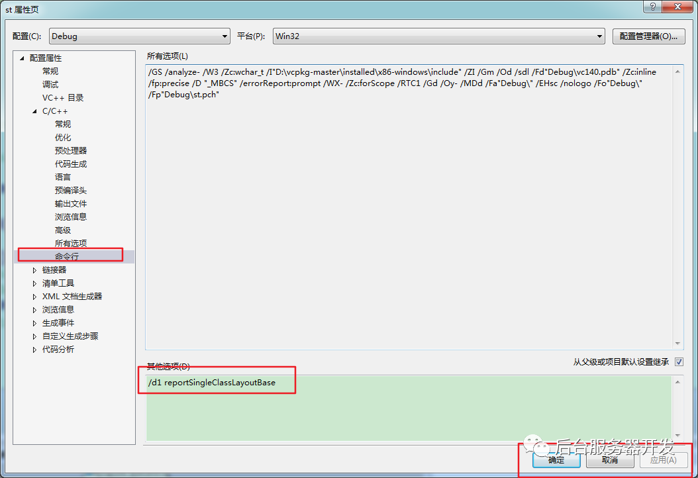

# C++对象模型

## C++ 虚函数和虚继承浅析

本文针对C++里的虚函数，虚继承表现和原理进行一些简单分析，有不对的地方请指出。下面都是以VC2008编译器对这两种机制内部实现为例。


**虚函数**

以下是百度百科对于虚函数的解释：

> 定义：在某基类中声明为 virtual 并在一个或多个派生类中被重新定 义的成员函数
>
> 语法：virtual 函数返回类型 函数名（参数表） { 函数体 }
>
> 用途：实现多态性，通过指向派生类的基类指针，访问派生类中同名覆盖成员


**函数**

函数声明和定义和普通的类成员函数一样，只是在返回值之前加入了关键字“virtual”声明为虚函数。而虚函数是实现多态的重要手段，意思是只有对虚函数的调用才能动态决定调用哪一个函数，这是相对于普通成员函数而言的，普通的成员函数在编译阶段就能确定调用哪一个函数。举个栗子：

> \#include <stdio.h>
>
>  
>
> **class** A {
>
> public:
>
>   **void** fn() { printf("fn in A\n"); }
>
>   virtual **void** v_fn() { printf("virtual fn in A\n"); }
>
> };
>
>  
>
> **class** B : public A {
>
> public:
>
>   **void** fn() { printf("fn in B\n"); }
>
>   virtual **void** v_fn() { printf("virtual fn in B\n"); }
>
> };
>
>  
>
> **int** main() {
>
>   A *a = **new** B();
>
>   a->fn();
>
>   a->v_fn();
>
>   **return** 0;
>
> }


基类A有两个成员函数fn和v_fn，派生类B继承自基类A，同样实现了两个函数，然后在main函数中用A的指针指向B的实例（向上转型，也是实现多态的必要手段），然后分别调用fn和v_fn函数。结果是“fn in A”和”virtual fn in B”。


这是因为fn是普通成员函数，它是通过类A的指针调用的，所以在编译的时候就确定了调用A的fn函数。而v_fn是虚函数，编译时不能确定，而是在运行时再通过一些机制来调用指针所指向的实例（B的实例）中的v_fn函数。假如派生类B中没有实现（完全一样，不是重载）v_fn这个函数，那么依然会调用基类类A中的v_fn；如果它实现了，就可以说派生类B覆盖了基类A中的v_fn这个虚函数。这就是虚函数的表现和使用，只有通过虚函数，才能实现面向对象语言中的多态性。


以上只是虚函数的表现和用途，下面来探讨它的实现机制。在此之前，先来看一个问题，还是以上的代码，基类A的大小为多少，也就是“printf(“%dn”, sizeof(A));”的输出会是多少呢？A中一个成员变量都没有，有人可能会说是0。额，0是绝对错误的，因为在C++中，即时是空类，它的大小也为1，这是另外的话题，不在本文讨论。当然1也是不对的，实际结果是4（32位系统），4刚好是一个int，一个指针（32位）的大小，派生类B的大小同样为4。这四个字节和实现多态，虚函数的机制有着很重要的关系。


其实用VC2008调试上面代码的时候，就会发现指针a所指向的实力中有一个成员常量（const），它的名字叫做vftable，全称大概叫做virtual function table（虚函数表）。它实际指向了一个数组，数组里面保存的是一系列函数指针，而上面的程序中，这个表只有一项，它就是派生类B中的v_fn函数入口地址。假如我们用一个A的指针指向一个A的实例呢？它同样有一个vftable，而它指向的表中也只有一项，这项保存的基类的v_fn函数入口地址。这用代码表示，就类似于下面这样：


> **void*** vftable_of_A[] = {
>
>   A::v_fn,
>
>   ...
>
> };
>
>  
>
> **class** A {
>
>   const **void*** vftable = vftable_of_A;
>
>   virtual **void** v_fn() {}
>
> };
>
>  
>
> **void*** vftable_of_B[] = {
>
>   B::v_fn,
>
>   ...
>
> };
>
>  
>
> **class** B {
>
>   const **void** *vftable = vftable_of_B;
>
>   vritual **void** v_fn() {}
>
> };


上面vftable的类型之所以用void*表示，实际上一个类中所有虚函数的地址都被放到这个表中，不同虚函数对应的函数指针类型不尽相同，所以这个表用C++的类型不好表述，但是在机器级里都是入口地址，即一个32位的数字（32位系统），等到调用时，因为编译器预先知道了函数的参数类型，返回值等，可以自动做好处理。


这样我们就能更好的理解虚函数和多态了。第一个代码中，a指针虽然是A*类型的，但是它却调用了B中的v_fn，因为不管是A类，还是A的基类，都会有一个变量vftable，它指向的虚函数表中保存了正确的v_fn入口。所以a->v_fn()实际做的工作就是从a指向的实例中取出vftable的值，然后找到虚函数表，再从表中去的v_fn的入口，进行调用。不管a是指向A的实例，还是指向B的实例，a->fn()所做的步骤都是上面说的一样，只是A的实例和B的实例有着不同的虚函数表，虚函数表里也保存着可能不同的虚函数入口，所以最终将进入不同的函数调用中。通过表来达到不用判断类型，亦可实现多态的作用。还有一点指的提醒的是，因为虚函数表是一个常量表，在编译时，编译器会自动生成，并且不会改变，所以如果有多个B类的实例，每个实例中都会有一个vftable指针，但是它们指向的是同一个虚函数表。


上面一段中说到了，A和B的实例有着不同的虚函数表，但是虚函数表中只是可能保存着不同的v_fn，那是因为C++允许派生类不覆盖基类中的虚函数，意思就是假如派生类B中没有实现v_fn这个函数（不是重载），那么B的实例的虚函数表会保存着基类A中v_fn的入口地址。也就是说B类不实现v_fn函数，但是它同样提供了这个接口，实际上是调用基类A中的v_fn。假如某个类只是一个抽象类，抽象出一些列接口，但是又不能实现这些接口，而要有派生类来实现，那么就可以把这些接口声明为纯虚函数，包含有纯虚函数的类称为抽象类。纯虚函数是一类特殊的虚函数，它的声明方式如下：


> class A {
>
> 
>
> public:
>
> 
>
> virtual 返回值 函数名（参数表）= 0；
>
> 
>
> };


在虚函数声明方式后加一个“=0”，并且不提供实现。抽象类不允许实例化（这样做编译器会报错，因为有成员函数没有实现，编译器不知道怎么调用）。纯虚函数的实现机制和虚函数类似，只是要求派生类类必须自己实现一个（也可以不实现，但是派生类也会是个抽象类，不能实例化）。


顺带提一下，java中的每一个成员函数都可以以理解为C++中的virtual函数，不用显式声明都可以实现重载，多态。而java的接口类似于C++中的抽象类，需要实现里面的接口。


虚继承


C++支持多重继承，这和现实生活很类似，任何一个物体都不可能单一的属于某一个类型。就像马，第一想到的就是它派生自动物这个基类，但是它在某系地方可不可以说也派生自交通工具这一个基类呢？所以C++的多重继承很有用，但是又引入了一个问题（专业术语叫做菱形继承？）。动物和交通工具都是从最根本的基类——“事物”继承而来，事物包含了两个最基本的属性，体积和质量。那么动物和交通工具都保存了基类成员变量——体积和质量的副本。而马有继承了这两个类，那么马就有两份体积和质量，这是不合理的，编译器无法确定使用哪一个，所以就会报错。JAVA中不存在这样的问题，因为JAVA不允许多重继承，它只可能实现多个接口，而接口里面只包含一些函数声明不包含成员变量，所以也不存在这样的问题。


这个问题用具体代码表述如下所示：


> **class** A {
>
> public:
>
>   **int** a;
>
> };
>
>  
>
> **class** B : public A {
>
> };
>
>  
>
> **class** C : public A {
>
> };
>
>  
>
> **class** D : public B, public C {
>
> };
>
>  
>
> **int** main() {
>
>   D d;
>
>   d.a = 1;
>
>   **return** 0;
>
> }


这个代码会报错，因为d中保存了两份A的副本，即有两个成员变量a，一般不会报错，但是一旦对D中的a使用，就会报一个“对a的访问不明确”。虚继承就可以解决这个问题。在探讨虚函数之前，先来一个sizeof的问题。


> \#include <stdio.h>
>
>  
>
> **class** A {
>
> public:
>
>   **int** a;
>
> };
>
>  
>
> **class** B : virtual public A {
>
> };
>
>  
>
>  
>
> **int** main() {
>
>   printf("%d\n", sizeof(B));
>
>   **return** 0;
>
> }


B的大小是？首先回答0的是绝对错的，理由我之前都说了。1也是错的，不解释。4也是错的，如果B不是虚继承自A的，那么4就是对的。正确答案是8，B虚继承A了之后，比预想中的多了4个字节，这是怎么回事呢？这个通过调试是看不出来的，因为看不到类似于vftable的成员变量（实际上编译器生成了一个类似的东西，但是调试时看不到，但是在观察反汇编的时候，可以见到vbtable的字样，应该是virtual base table的意思）。


虚继承的提出就是为了解决多重继承时，可能会保存两份副本的问题，也就是说用了虚继承就只保留了一份副本，但是这个副本是被多重继承的基类所共享的，该怎么实现这个机制呢？编译器会在派生类B的实例中保存一个A的实例，然后在B中加入一个变量，这个变量是A的实例在实际B实例中的偏移量，实际上B中并不直接保存offset的值，而是保存的一个指针，这个指针指向一个表vbtable，vbtable表中保存着所有虚继承的基类在实例中的offset值，多个B的实例共享这个表，每个实例有个单独的指针指向这个表，这样就很好理解为什么多了4个字节了。用代码表示就像下面这样。


> **class** A {
>
> public:
>
>   ...
>
> };
>
>  
>
> **int** vbtable_of_B[] = {
>
> 　　offset(B::_a),
>
>   ...
>
> };
>
>  
>
>  
>
> **class** B ：virtual public A{
>
> private:
>
>   const **int*** vbtable = vbtable_of_B;
>
>   A _a;
>
> };


每一个A的虚派生类，都会有自己的vbtable表，这个派生类的所有实例共享这个表，然后每个实例各自保存了一个指向vbtable表的指针。假如还有一个类C虚继承了A，那么编译器就会为它自动生成一个vbtable_of_C的表，然后C的实例都会有一个指向这个vbtable表的指针。


假如有多级的虚继承会发生什么情况，就像下面这段代码一样：


> \#include <stdio.h>
>
>  
>
> **class** A {
>
> public:
>
>   **int** a;
>
> };
>
>  
>
> **class** B : virtual public A {
>
> public:
>
> 　　**int** b;
>
> };
>
>  
>
> **class** C : virtual public B {
>
> };
>
>  
>
>  
>
> **int** main() {
>
>   printf("%d\n", sizeof(C));
>
>   **return** 0;
>
> }


程序运行的结果是16，按照之前的理论，大概会这么想。基类A里有1个变量，4个字节。B类虚继承了A，所以它有一个A的副本和一个vbtable，还有自己的一个变量，那就是12字节。然后C类又虚继承了B类，那么它有一个B的副本，一个vbtable，16字节。但实际上通过调试和反汇编发现，C中保存分别保存了A和B的副本（不包括B类的vbtable），8字节。然后有一个vbtable指针，4字节，表里面包含了A副本和B副本的偏移量。最后还有一个无用的4字节（？），一共16字节。不仅是这样，每经过一层的虚继承，便会多出4字节。这个多出来的四字节在反汇编中没发现实际用途，所以这个有待探讨，不管是编译器不够智能，还是有待其它作用，虚继承和多重继承都应该谨慎使用。


还是以上面的例子，假如C类是直接继承B类，而不是使用虚继承，那么C类的大小为12字节。它里面是直接保存了A和B的副本（不包含B的vbtable），然后还有一个自己的vbtable指针，所以一共12字节，没有了上一段所说的最后的4个字节。


但是如果想下面一种继承，会是什么情况？


> \#include <stdio.h>
>
>  
>
> **class** A {
>
> public:
>
>   **int** a;
>
> };
>
>  
>
> **class** B : virtual public A {
>
> };
>
>  
>
> **class** C : virtual public A {
>
> };
>
>  
>
> **class** D : public B, public C{
>
> };
>
>  
>
>  
>
> **int** main() {
>
>   printf("%d\n", sizeof(D));
>
>   **return** 0;
>
> }

D从B，C类派生出来，而B和C又同时虚继承了A。输出的结构是12，实际调试反汇编的时候发现，D中继承了B和C的vbtable，这就是8字节，而同时还保存了一个A的副本，4字节，总共12字节。它和上面的多重虚继承例子里的12字节是不一样的。之前一个例子中只有一个vbtable，一个A的实例，末尾还有一个未知的4字节。而这个例子中是有两个仅挨着的vbtable（都有效）和一个A的实例。


## C++类内存分布

C++ 类中内存分布具体是怎么样，尤其是C++中含有继承、虚函数、虚拟继承以及菱形继承等等情况下。

由于在`linux`下没有`windows`下显示直观，我们采用`vs2015`进行调试。

------

- **部署环境**

  我们在 `属性->C/C++ ->命令行 -> /d1 reportSingleClassLayoutXXX` ,XXX表示类名；



------

- **单个基础类**

  ```
  class Base
  {
  private:
   int a;
   int b;
  public:
   void test();
  };
  ```

  内存分布：

  ```
  class Base size(8):
     +-- -
     0 | a
     4 | b
     +-- -
  ```

  **总结**：我们发现普通类的内存分布是根据声明的顺序进行的,成员函数不占用内存。

------

- **基础类+继承类**

  ```
  class Base
  {
   int a;
   int b;
  public:
   void test();
  };
  
  class Divide :public Base
  {
  public:
   void run();
  private:
   int c;
   int d;
  };
  ```

  内存分布：

  ```
  class Divide size(16) :
     +-- -
     0 | +-- - (base class Base)
     0 | | a
     4 | | b
   | +-- -
     8 | c
    12 | d
     +-- -
  ```

  **总结**：根据内存分布，我们发现普通继承类，内存分布也是按照声明的顺序进行的，成员函数不占用内存；类的顺序是先基类，后子类。

------

- **含有虚函数的基类**

  ```
  class Base
  {
   int a;
   int b;
  public:
   void test();
   virtual void run();
  };
  ```

  内存分布：

  ```
  class Base size(12) :
     +-- -
     0 | {vfptr}
     4 | a
     8 | b
     +-- -
  
    Base::$vftable@:
   | &Base_meta
   | 0
     0 | &Base::run
  ```

  **总结**：带有虚函数的内存分布分为两部分，一部分是内存分布，一部分是虚表；我们从最上面发现，`vfptr`是放在了内存开始处，然后才是成员变量；虚函数`run`前面表示这个虚函数的序号为`0`。

------

- **含有虚函数的基类+继承子类**

  ```
  class Base
  {
   int a;
   int b;
  public:
   void test();
   virtual void run();
  };
  
  class Divide :public Base
  {
  public:
   void DivideFun();
   virtual void run();
  private:
   int c;
   int d;
  };
  ```

  内存分布：

  ```
  class Divide size(20) :
     +-- -
     0 | +-- - (base class Base)
     0 | | {vfptr}
     4 | | a
     8 | | b
   | +-- -
    12 | c
    16 | d
     +-- -
  
    Divide::$vftable@:
   | &Divide_meta
   | 0
     0 | &Divide::run
  ```

  **总结**：我们发现继承类，虚表只有一个，还是在内存开始处，内存排布顺序与普通继承类是一致的；

------

- **含有虚函数的基类+继承子类（多增加一个虚函数）**

  ```
  class Base
  {
   int a;
   int b;
  public:
   void test();
   virtual void run();
  };
  
  class Divide :public Base
  {
  public:
   void DivideFun();
   virtual void run();
   virtual void DivideRun();
  private:
   int c;
   int d;
  };
  ```

  内存分布：

  ```
  class Divide size(20) :
     +-- -
     0 | +-- - (base class Base)
     0 | | {vfptr}
     4 | | a
     8 | | b
   | +-- -
    12 | c
    16 | d
     +-- -
  
    Divide::$vftable@:
   | &Divide_meta
   | 0
     0 | &Divide::run
     1 | &Divide::DivideRun
  ```

  **总结**：虚表还是继承于基类，在虚表部分多了`DivideRun`序号为`1`的虚函数；

------

- **多重继承**

  ```cpp
  class Base
  {
   int a;
   int b;
  public:
   virtual void run();
  };
  
  class Divide1 :public Base
  {
  public:
   virtual void run();
  private:
   int c;
  };
  
  class Divide2 :public Base
  {`
  public:
   virtual void run();
  private:
   int d;
  };
  
  class Divide :public Divide1, Divide2
  {
  public:
   virtual void run();
  private:
   int d;
  };
  ```

  内存分布：

  ```cpp
  class Divide1 size(16) :
     +-- -
     0 | +-- - (base class Base)
     0 | | {vfptr}
   4 | | a
   8 | | b
  | +-- -
   12 | c
    +-- -
  
   Divide1::$vftable@:
  | &Divide1_meta
  | 0
    0 | &Divide1::run
  
   Divide1::run this adjustor: 0
  
   class Divide2 size(16) :
    +-- -
     0 | +-- - (base class Base)
     0 | | {vfptr}
    4 | | a
    8 | | b
  | +-- -
   12 | d
    +-- -
  
   Divide2::$vftable@:
  | &Divide2_meta
  | 0
    0 | &Divide2::run
  
   Divide2::run this adjustor: 0
  
   class Divide size(36) :
    +-- -
     0 | +-- - (base class Divide1)
     0 | | +-- - (base class Base)
     0 | | | {vfptr}
   4 | | | a
   8 | | | b
  | | +-- -
   12 | | c
  | +-- -
    | +-- - (base class Divide2)
    | | +-- - (base class Base)
    | | | {vfptr}
    | | | a
    | | | b
  | | +-- -
    | | d
  | +-- -
    | d
    +-- -
  
   Divide::$vftable@Divide1@:
  | &Divide_meta
  | 0
    0 | &Divide::run
  
   Divide::$vftable@Divide2@:
  | -16
    0 | &thunk: this -= 16; goto Divide::run
  
   Divide::run this adjustor: 0
  ```

  总结：主要看最后一个`Divide`类，内存排列顺序先是Divide1，后是Divide2，在Divide1和Divide2中各有一份虚表；

------

- **虚拟继承（菱形继承）**

  ```cpp
  class Base
  {
   int a;
   int b;
  public:
   virtual void run();
  };
  
  class Divide1 :virtual public Base
  {
  public:
   virtual void run();
  private:
   int c;
  };
  
  class Divide2 :virtual public Base
  {
  public:
   virtual void run();
  private:
   int d;
  };
  
  class Divide :public Divide1, Divide2
  {
  public:
   virtual void run();
  private:
   int d;
  };
  ```

  **内存分布：**

  ```cpp
  class Divide1 size(20) :
      +-- -
      0 | {vbptr}
     4 | c
     +-- -
     +-- - (virtual base Base)
     8 | {vfptr}
    12 | a
    16 | b
     +-- -
  
    Divide1::$vbtable@:
     0 | 0
     1 | 8 (Divide1d(Divide1 + 0)Base)
  
    Divide1::$vftable@:
   | -8
     0 | &Divide1::run
  
    Divide1::run this adjustor: 8
    vbi:    class  offset o.vbptr  o.vbte fVtorDisp
                Base       8       0       4 0
  
    class Divide2 size(20) :
     +-- -
     0 | {vbptr}
     4 | d
     +-- -
     +-- - (virtual base Base)
     8 | {vfptr}
    12 | a
    16 | b
     +-- -
  
    Divide2::$vbtable@:
     0 | 0
     1 | 8 (Divide2d(Divide2 + 0)Base)
  
    Divide2::$vftable@:
   | -8
     0 | &Divide2::run
  
    Divide2::run this adjustor: 8
    vbi:    class  offset o.vbptr  o.vbte fVtorDisp
                Base       8       0       4 0
  
    class Divide size(32) :
     +-- -
     0 | +-- - (base class Divide1)
     0 | | {vbptr}
     4 | | c
   | +-- -
     8 | +-- - (base class Divide2)
     8 | | {vbptr}
    12 | | d
   | +-- -
    16 | d
     +-- -
     +-- - (virtual base Base)
    20 | {vfptr}
    24 | a
    28 | b
     +-- -
  
    Divide::$vbtable@Divide1@:
     0 | 0
     1 | 20 (Divided(Divide1 + 0)Base)
  
    Divide::$vbtable@Divide2@:
     0 | 0
     1 | 12 (Divided(Divide2 + 0)Base)
  
    Divide::$vftable@:
   | -20
     0 | &Divide::run
  ```

  总结：通过内存分布可知，`Divide1`和`Divide2`都是两个虚表，Divide中却是成了3个虚表，只有一份base；所以说：**虚继承的作用是减少了对基类的重复，代价是增加了虚表指针的负担（增加了更多的需指针）**

