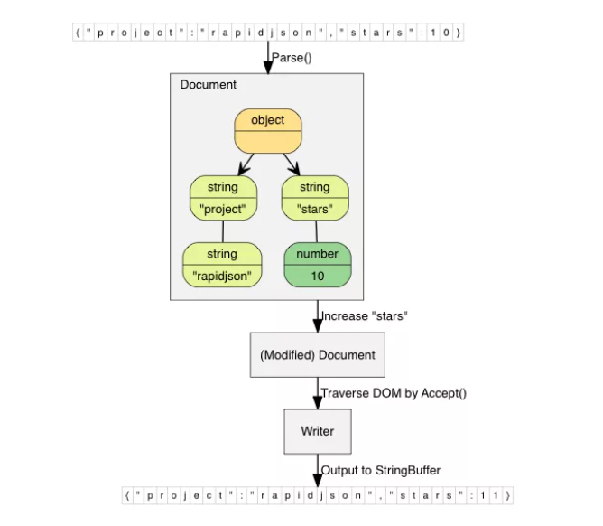

https://mp.weixin.qq.com/s/P8LJSRpHPJFaF2B29_7hqA

## RPC框架：brpc

**github地址**：https://github.com/apache/incubator-brpc

**一句话推荐**：如果把grpc理解成good rpc，那么brpc则是当之无愧的better rpc！

强烈建议C++同学使用或学习的一个框架。brpc支持的协议众多，不管是grpc还是thrift，亦或是HTTP+JSON都支持。并且是单端口支持多协议！基本上可以无缝集成到你现有的工作环境中。

另外brpc也集成http 、redis的client，基本不需要再依赖额外的库去做请求HTTP服务或者请求redis的事了。

另外就是brpc的架构设计上比之其他C++框架也是优秀的，即使你公司不使用brpc，你通过阅读brpc源码和文档也是大有收获的。brpc的文档堪称一绝，巨细无遗。

## json库：rapidjson

**github地址**：http://github.com/Tencent/rapidjson

**一句话推荐**：尽管斯人已去，但江（知）湖（乎）永远留下他的传说。

目前见过性能最好的json解析和序列化的库，性能上比老牌的json-cpp快一个量级，而且是header-only的，引入到自己项目中比较方便。但缺点是API着实难用，而且为了追求极致性能，浅拷贝居多，导致稍不注意就踩坑。

另外提醒一下，如果你项目中已经使用了brpc那么通常我们不用额外安装rapidjson的，因为brpc的thirdparty已经集成了。

当然额外安装rapidjson也未尝不可，因为brpc里面默认集成的那个是比较旧的版本。有一次我想让rapidjson序列化json字符串时，控制浮点数精度（小数位个数）的时候，就发现brpc集成的版本不够用，最终还是额外安装了最新的rapidjson。

## 内存管理库：jemalloc

**github地址**：https://github.com/jemalloc/jemalloc

**一句话推荐**：放着我来！

个人感觉jemalloc比tcmalloc更好用，性能也更好。当然也可能是tcmalloc我没配置好。AnyWay，jemalloc几乎不需要你费心。直接链接进去，对代码无侵入，自动就能提高性能。

## 序列化库：protobuf

**github地址**：https://github.com/protocolbuffers/protobuf

**一句话推荐**：不管protobuf3有多少槽点，它终将取代protobuf2，就像你从未听说过protobuf1一样

不多说了，在很多时候pb还是一个不错的配合rpc使用的序列化解决方案。首先是性能，其次是跨语言通信。当然槽点也不少，比如向下兼容做的不好，知乎上有个帖子专门吐槽来着。不仅protobuf3阉割掉了不少protobuf2中很多好用的功能，即使同为protobuf3，3.7和3.6的C++ API中也有差异，且向下兼容不够好，比如3.6的protoc编译出来的pb.h，链接3.7的libprotobuf.so就会有一堆符号未定义。

## gflags

**github地址**：https://github.com/gflags/gflags

**一句话推荐**：这个flag，你必须要立！

通过flag（俗称开关）。可以方便的调整一些逻辑分支的走向。也可以通过flag来配置一些参数，无需每次新增配置文件和增加配置解析的逻辑。但是有时候如果依赖的第三方库也用到了gflags，有同名的flag，编译启动会有问题。

## 官方备胎：boost

**github地址**：https://github.com/boostorg/boost

**一句话推荐**：梦想还是要有的，万一一不小心备胎转正了呢？

我常说boost是C++官方标准的备胎，但这有失偏颇，应该说是试金石。当然在C++11之后，你用到的boost库的地方会越来越少，但是也不是没有用武之地。另外就是如果你编译器没有支持新的C++版本，比如C++17，那么有些特性你可以从boost里找寻。

## 矩阵计算库：Eigen

**主页**：https://eigen.tuxfamily.org/index.php

**github地址**：https://github.com/PX4/eigen

**一句话推荐**：感觉这个库上手困难，不是因为你不懂C++，而是因为你不懂数学！

这是一个线性代数的C++库，主要采用的模板语法。在涉及到机器学习的一些C++工程中多有使用。

