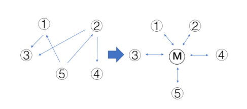

## **C++设计模式**

https://mp.weixin.qq.com/s/knzV1-bmrI7jhQqnhogGkw

### 一、设计模式简介

设计模式是主要针对面向对象语言提出的一种设计思想，主要是提高代码可复用性，抵御变化，尽量将变化所带来的影响降到最低。

总的设计模式有23种，可以分为三大类。(建议在面试的时候说几个自己熟悉的，比如单例模式、工厂模式、模板模式等)

**创建型模式**(共五种)：工厂方法模式、抽象工厂模式、单例模式、建造者模式、原型模式。

**结构型模式**(共七种)：适配器模式、装饰器模式、代理模式、外观模式、桥接模式、组合模式、享元模式。

**行为型模式**(共十一种)：策略模式、模板方法模式、观察者模式、迭代子模式、责任链模式、命令模式、备忘录模式、状态模式、访问者模式、中介者模式、解释器模式。


### 二、面向对象特点

- 封装：隐藏内部实现
- 继承：复用现有的代码
- 多态：改写对象的行为

### 三、面向对象设计原则

1. 依赖倒置原则：针对接口编程，依赖于抽象而不依赖于具体，抽象(稳定)不应依赖于实现细节(变化)，实现细节应该依赖于抽象，因为稳定态如果依赖于变化态则会变成不稳定态。
2. 开放封闭原则：对扩展开放，对修改关闭，业务需求是不断变化的，当程序需要扩展的时候，不要去修改原来的代码，而要灵活使用抽象和继承，增加程序的扩展性，使易于维护和升级，类、模块、函数等都是可以扩展的，但是不可修改。
3. 单一职责原则：一个类只做一件事，一个类应该仅有一个引起它变化的原因，并且变化的方向隐含着类的责任。
4. 里氏替换原则：子类必须能够替换父类，任何引用基类的地方必须能透明的使用其子类的对象，开放关闭原则的具体实现手段之一。
5. 接口隔离原则：接口最小化且完备，尽量少public来减少对外交互，只把外部需要的方法暴露出来。
6. 最少知道原则：一个实体应该尽可能少的与其他实体发生相互作用。
7. 将变化的点进行封装，做好分界，保持一侧变化，一侧稳定，调用侧永远稳定，被调用测内部可以变化。
8. 优先使用组合而非继承，继承为白箱操作，而组合为黑箱，继承某种程度上破坏了封装性，而且父类与子类之间耦合度比较高。
9. 针对接口编程，而非针对实现编程，强调**接口标准化**。

**总结:** 没有一步到位的设计模式，刚开始编程时不要把太多精力放到设计模式上，需求总是变化的，刚开始着重于实现，一般敏捷开发后为了应对变化重构再决定采取合适的设计模式。

### 四、设计模式

#### 1、策略模式

**核心思想：**通过类继承减少if-else分支

定义一系列的算法，将它们一个个封装，使得他们可以相互替换，一般为了解决多个if-else带来的复杂性，在多种算法相似的情况下，通过策略模式可减少if-else带来的复杂性和难以维护性，一般在项目中发现多个if-else并且预感将来还会在此增加if-else分支，那基本上就需要使用策略模式。
先举一个不使用策略模式的例子，拿计算来说，下面代码定义了加法操作和减法操作，以后如果需要增加乘法除法等计算，那就需要在枚举里添加新类型，并且增加if-else分支，这违反了开放关闭原则。

```cpp
enum class CalOperation {
    add,
    sub
};

int NoStragegy(CalOperation ope) {
    if (ope == CalOperation::add) {
        std::cout << "this is add operation" << std::endl;
    } else if (ope == CalOperation::sub) {
        std::cout << "this is sub operation" << std::endl;
    } // 如何将来需要增加乘法或者除法或者其它运算，还需要增加if-else
    return 0;
}
```

下例为使用策略模式，定义一个基类Calculation，包含虚函数operation()。

```cpp
#ifndef __CALCULATION__
#define __CALCULATION__

#include <iostream>

class Calculation {
   public:
    Calculation() {}

    virtual ~Calculation() {}

    virtual void operation() { std::cout << "base operation" << std::endl; }
};

#endif
```

每增加一种运算，就增加一个继承基类的子类，重写operation()函数。

```cpp
#ifndef __ADD__
#define __ADD__

#include "calculation.h"

class Add : public Calculation {
    void operation() override { std::cout << "this is add operation" << std::endl; }
};

#endif
#ifndef __SUB__
#define __SUB__

#include "calculation.h"

class Sub : public Calculation {
    void operation() override { std::cout << "this is sub operation" << std::endl; }
};

#endif
int Stragegy() {
    Calculation *cal = new Add();
    cal->operation();
    delete cal;

    Calculation *cal2 = new Sub(); // 这里将来都可以用工厂模式改掉，不会违反开放封闭原则
    cal2->operation();
    delete cal2;

    return 0;
}
```

是不是方便了很多，将来如果有乘法除法和其它运算规则，只需要再加一个继承基类的子类即可。

#### 2、观察者模式

**核心思想：**一个Notifier，添加多个Observers，在Notifier里调用Observer->update()

定义对象间的一对多关系，当一个对象状态发生改变的时候，其它依赖于它的对象都会得到广播通知并进行自定义动作，通过面向对象技术的多态技术，可以降低这种依赖关系，降低耦合度，上代码。

```cpp
#ifndef __OBSERVER__
#define __OBSERVER__

#include <iostream>

class ObserverBase {
   public:
    ObserverBase() {}
    virtual ~ObserverBase() {}

    virtual void Update() {}
};

#endif

------------------------------------------------------------------------
#ifndef __OBSERVER_FIRST_CHILD__
#define __OBSERVER_FIRST_CHILD__

#include "observer.h"

class ObserverFirstChild : public ObserverBase {
    void Update() override {
        std::cout << "first child receive notify" << std::endl;
    }
};

#endif

------------------------------------------------------------------------
#ifndef __OBSERVER_SECOND_CHILD__
#define __OBSERVER_SECOND_CHILD__

#include "observer.h"

class ObserverSecondChild : public ObserverBase {
    void Update() override {
        std::cout << "second child receive notify" << std::endl;
    }
};

#endif

------------------------------------------------------------------------
#include <list>
#include "observer_first_child.h"
#include "observer_second_child.h"

class NotifyBase {
   public:
    void Add(ObserverBase *ob) { observers.emplace_back(ob); };

    void Remove(ObserverBase *ob) { observers.erase(ob); }

    void Notify() {
        for (auto observer : observers) {
            observer->Update();
        }
    }

   private:
    std::list<ObserverBase *> observers;
};

int main() {
    ObserverBase *base1 = new ObserverFirstChild();
    ObserverBase *base2 = new ObserverSecondChild();

    NotifyBase notify;
    notify.Add(base2);
    notify.Add(base1);
    notify.Notify();
    notify.Remove(base1);
    notify.Notify();

    delete base2;
    delete base1;
    return 0;
}
```

 

#### 3、装饰器模式

**核心思想**：通过使用基类指针来组合不同派生类的功能

动态的给一个对象添加一些额外的职责，扩展一个类的功能，就增加功能来说，使用装饰器模式比单纯的继承子类更加灵活，不一定非要疯狂使用继承方式。
举个例子，有游戏这个大类，扩展这个类的功能，有打篮球，踢足球，玩lol，玩卡丁车，可以分别定义继承游戏基类的四个子类，但是如果想组合这几个功能呢，一个对象既会打篮球又会玩卡丁车，既会打篮球又会玩lol，再定义几个类继承游戏基类显然不是好的做法，装饰器模式可以很好的解决这个问题，上代码：
首先定义一个Game基类。

```cpp
#ifndef __GAME__
#define __GAME__

#include <iostream>

class Game {
   public:
    Game() {}

    virtual ~Game() {}

    virtual void Skill() { std::cout << "game skill" << std::endl; }
};

#endif
```

定义卡丁车子类和lol子类

```cpp
#ifndef __CAR_GAME__
#define __CAR_GAME__

#include "game.h"

class CarGame : public Game {
   public:
    void Skill() override { std::cout << "car game" << std::endl; }
};

#endif

------------------------------------------------------------------------
#ifndef __LOL_GAME__
#define __LOL_GAME__

#include "game.h"

class LolGame : public Game {
   public:
    void Skill() override { std::cout << "lol game" << std::endl; }
};

#endif
```

篮球和足球子类也可以像上面一样继承定义，但是如果都像上面一样继承的话不能实现动态扩展功能的需求，所以先定义一个装饰类，之后定义继承这个装饰类的篮球和足球子类。

```cpp
#ifndef __DECORATOR_GAME__
#define __DECORATOR_GAME__

#include "game.h"

class DecoratorGame : public Game {
   protected:
    Game *game_;

   public:
    DecoratorGame(Game *game) { game_ = game; }

    void Skill() override { game_->Skill(); }

    virtual ~DecoratorGame() {}
};

#endif

------------------------------------------------------------------------
#ifndef __BASKETBALL__
#define __BASKETBALL__

#include "decorator_game.h"

class BasketBallGame : public DecoratorGame {
   public:
    BasketBallGame(Game *game) : DecoratorGame(game) {}

    void Skill() override {
        std::cout << "basketball game" << std::endl;
        DecoratorGame::Skill();
    }
};

#endif

------------------------------------------------------------------------
#ifndef __SOCKETBALL__
#define __SOCKETBALL__

#include "decorator_game.h"

class SocketBallGame : public DecoratorGame {
   public:
    SocketBallGame(Game *game) : DecoratorGame(game) {}

    void Skill() override {
        std::cout << "socket game" << std::endl;
        DecoratorGame::Skill();
    }
};

#endif
```

最后看使用

```cpp
#include "lol_game.h"
#include "decorator_game.h"
#include "basketball.h"
#include "car_game.h"
#include "socketball.h"

int main() {
    Game *lol = new LolGame();
    Game *car = new CarGame();
    // 一个人既会打篮球又会打LOL可以如下使用
    Game* basketball_lol = new BasketBallGame(lol);
    basketball_lol->Skill();
    std::cout << std::endl;
    // 一个人既会打篮球又会玩卡丁车可以如下使用
    Game* basketball_car = new BasketBallGame(car);
    basketball_car->Skill();
    std::cout << std::endl;
    // 一个人既会打篮球又会玩卡丁车又会踢足球可以如下使用
    Game* g = new SocketBallGame(basketball_lol);
    g->Skill();

    delete lol;
    delete basketball_car;
    delete basketball_lol;
    delete g;

    return 0;
}
// 输出
basketball game
lol game

basketball game
car game

socket game
basketball game
lol game
```

通过上例可以看出，使用观察者模式可以动态的扩展类的职责，动态的组合类的各个功能，当看代码时发现一个类既继承了父类同时又持有父类的对象指针，那这基本上就是装饰器模式。

#### 4、工厂模式

**核心思想：**提供一个工厂类，使用该工厂类创建具体类对象，表面向外部暴露创建逻辑

工厂模式属于创建型模式，主要用于创建对象时不向外部暴露创建逻辑，通过一个共同的接口指向新创建的对象，通过面向对象的多态，将创建对象的工作延迟到子类执行，由子类决定实例化哪个对象。用于隔离对象使用者与其具体类型之间的耦合关系，当具体类型经常变化时，可以考虑使用工厂模式。有一个类型的抽象基类，同时又有很多继承该抽象基类的具体类型，我们做的就是使其依赖于抽象而不依赖于具体，实现方式是创建一个工厂基类，在为每个具体类型定义一个可以创建其相应对象的工厂，每一个具体类对应一个具体工厂，工厂类继承自工厂基类，通过工厂基类的多态性就可以决定创建什么类型的对象。上代码：

```cpp
#ifndef __GAME__
#define __GAME__

#include <iostream>

class Game {
  public:
    Game() {}
    virtual ~Game() {}

    virtual void Play() {
      std::cout << "play game" << std::endl;
    }
};

#endif

------------------------------------------------------------------------
#ifndef __BASKETBALL__
#define __BASKETBALL__

#include "game.h"

class BasketBall : public Game {
    void Play() override { std::cout << "play basketball" << std::endl; }
};

#endif

------------------------------------------------------------------------
#ifndef __SOCKETBALL__
#define __SOCKETBALL__

#include "game.h"

class SocketBall : public Game {
    void Play() override { std::cout << "play socketball" << std::endl; }
};

#endif
```

可以通过游戏工厂选择创建不同游戏类型的对象

```cpp
#ifndef __GAME_FACTORY__
#define __GAME_FACTORY__

#include "game.h"

class GameFactory {
    public:
    GameFactory() {}
    virtual ~GameFactory() {}

    virtual Game* CreateGame() = 0;
};

#endif

------------------------------------------------------------------------
#ifndef __BASKETBALL_FACTORY__
#define __BASKETBALL_FACTORY__

#include "game_factory.h"
#include "basketball.h"

class BasketBallFactory : public GameFactory {
   public:
    Game* CreateGame() override{
        return new BasketBall();
    };
};

#endif

------------------------------------------------------------------------
#ifndef __SOCKETBALL_FACTORY__
#define __SOCKETBALL_FACTORY__

#include "game_factory.h"
#include "socketball.h"

class SocketBallFactory : public GameFactory {
   public:
    Game* CreateGame() override{
        return new SocketBall();
    };
};

#endif

------------------------------------------------------------------------
#include "basketball_factory.h"
#include "socketball_factory.h"

int main() {
    GameFactory* factory = new BasketBallFactory();
    Game* game = factory->CreateGame();
    game->Play();

    delete factory;
    delete game;

    factory = new SocketBallFactory();
    game = factory->CreateGame();
    game->Play();

    delete factory;
    delete game;

    return 0;
}
输出：
play basketball
play socketball
```

当有新类型增加时，需要添加一个具体类和一个相应的创建工厂，尽管减少了耦合度，但是其实还是比较麻烦的。

#### 5、抽象工厂方法模式

和工厂方法模式类似，不做过多介绍，说一下定义，抽象工厂方法模式主要提供一个接口，让该接口负责创建多系列“相关或相互的对象”，无需指定具体的类，系列对象指的是某一特定系列下的对象间有相互依赖或相互作用的关系，不同系列的对象之间不能相互依赖，如果没有多系列对象创建的需求变化，没必要使用**抽象工厂方法**模式，使用**简单工厂方法**模式就可以，拿上一个举例继续说，游戏类型是一个系列，我们有了一个游戏类型的工厂，以后可能会再加入娱乐圈类型的一个系列，那就在做一个娱乐圈类型的系列工厂，以后可能还有文艺类型的系列，那就再加一个文艺类型的系列工厂，这就有了三个系列的工厂，所以就可以在这三类工厂的基础上再抽象出一个抽象的超级工厂，根据不同需求选择实例化哪一个系列的具体工厂，再创建具体工厂下的具体类型的对象。

#### 6、单例模式

单例模式是一种常用的软件设计模式，在应用这个模式时，单例对象的类必须保证只有一个实例存在，整个系统只能使用一个对象实例。

**优点：**不会频繁的创建和销毁对象，浪费系统资源。

可能这会儿需要你手写一个单例模式，而单例模式有多重写法：懒汉模式、饿汉模式，双重检查模式等。

* 懒汉模式就是用的时候再去创建对象，非线程安全
* 饿汉模式就是提前已经加载好的静态static对象，线程安全
* 双重检查模式就是两次检查避免多线程造成创建了多个对象，线程安全

**懒汉模式（加锁实现）：**

```cpp
#include <iostream>
#include <mutex>

class Singleton {
  public:
   static Singleton *GetInstance();

   void Func() { std::cout << "Singleton Func \n"; }

  private:
   Singleton() {}  // 避免外部构造对象，想拿到类的实例只能通过GetInstance()
   Singleton(const Singleton&) = delete;
   Singleton& operator=(const Singleton&) = delete;

   static Singleton *instance_;
   static std::mutex mutex_;
};

Singleton *Singleton::instance_ = nullptr;
std::mutex Singleton::mutex_;

Singleton *Singleton::GetInstance() {
   // double check
   if (instance_ == nullptr) {  // 1
       std::unique_lock<std::mutex> lock(mutex_);
       if (instance_ == nullptr) {  // 2
           instance_ = new Singleton();
      }
  }
   return instance_;
}

int main() {
   Singleton::GetInstance()->Func();
   return 0;
}
```

这就是传说中的**double check**方法，这里有几个关键点：

1. 为什么需要加锁？加锁的原因很简单，为了确保线程安全。

2. 您看过代码可能也有些疑惑，明明加一次锁和第二次的判断就足够了，为什么在加锁之前还需要进行一次判断呢？这里可以考虑只需要在判断指针为空的时候才去加锁，避免每次调用方法时都加锁，可以减少加锁解锁带来的额外开销。

3. 这里需要将类的构造函数和拷贝构造函数等设成私有函数，避免外部构造类的实例，防止外部通过new关键字进行实例化。


**懒汉模式（不加锁实现）：**

通过局部静态变量的方式实现，这种方法在C++11后是线程安全的，见代码

```cpp
#include <iostream>
#include <mutex>

class Singleton {
  public:
   static Singleton& GetInstance() {
       static Singleton instance;
       return instance;
  }

   void Func() { std::cout << "Singleton Func \n"; }

  private:
   Singleton() {}  // 避免外部构造对象，想拿到类的实例只能通过GetInstance()
   Singleton(const Singleton&) = delete;
   Singleton& operator=(const Singleton&) = delete;

};

int main() {
   Singleton::GetInstance().Func();
   return 0;
}
```

C++11确保局部静态变量创建时线程安全的，本人基本上用的单例都是使用这种方式。


**饿汉式实现：**

懒汉式指的是在需要实例的时候才去创建，就是上面的方法，而饿汉式则是提前创建好实例，外部需要实例的时候直接获取这个已经创建好的实例，看下饿汉式单例的实现吧：

```cpp
#include <iostream>

class Singleton {
  public:
   static Singleton *GetInstance();

   void Func() { std::cout << "Singleton Func \n"; }

  private:
   Singleton() {}  // 避免外部构造对象，想拿到类的实例只能通过GetInstance()
   Singleton(const Singleton&) = delete;
   Singleton& operator=(const Singleton&) = delete;

   static Singleton *instance_;
};

Singleton *Singleton::instance_ = new Singleton();

Singleton *Singleton::GetInstance() {
   return instance_;
}

int main() {
   Singleton::GetInstance()->Func();
   return 0;
}
```


**std::call_once实现：**

在C++11后可以利用新特性实现线程安全的单例模式，代码如下：

```cpp
template <typename T>
class SingleTon {
public:
 static T& instance() {
   std::call_once(once_, &SingleTon::init);
   return *value_;
}

private:
 SingleTon();
 ~SingleTon();

 SingleTon(const SingleTon&) = delete;
 SingleTon& operator=(const SingleTon&) = delete;

 static void init() { value_ = new T(); }
 static T* value_;

 static std::once_flag once_;
};
```


#### 7、代理模式

**核心思想：**提供一个代理来控制对对象的访问，例如智能指针

为其它对象提供一种代理以控制这个对象的访问，一般对于比较大的对象访问比较困难或者或带来很多麻烦，例如裸指针的使用，所以一般使用智能指针来控制裸指针，使用智能指针也是一种代理模式，举例：A喜欢B想送给B礼物，但是却不认识B，而C却认识B，所以可以把C作为A的代理去送给B礼物，代码：

```cpp
#ifndef __GIRL__
#define __GIRL__

#include <iostream>
#include <string>

class Girl {
   private:
    std::string name_;

   public:
    Girl(const std::string &name) : name_(name) {}

    std::string GetName() const noexcept { return name_; }
};

#endif

------------------------------------------------------------------------
#ifndef __GIFT__
#define __GIFT__

#include "girl.h"

class Gift {
   public:
    virtual void GiveGift() = 0;
};

#endif

------------------------------------------------------------------------
#ifndef __GIFT_PROXY__
#define __GIFT_PROXY__

#include "gift.h"
#include "girl.h"

class GiftProxy : public Gift {
   public:
    GiftProxy(Girl girl) : girl_(girl) {}

    void GiveGift() override { std::cout << "send " << girl_.GetName() << " gift" << std::endl; }

   private:
    Girl girl_;
};

#endif

------------------------------------------------------------------------
#include "gift_proxy.h"

int main() {
    Girl lili("lili");
    GiftProxy proxy(lili);
    proxy.GiveGift();
    return 0;
}
```

如上述代码，通过代理模式就可以给代码中的丽丽送礼物。

#### 8、模板方法

父类定义算法的骨架，而将一些步骤延迟到子类去实现，使得子类可以复用骨架，并附加特性，以开发框架举例，框架开发人员把框架调用流程定好，而将某些具体的步骤作为虚函数留给子类去重写，话不多说，上代码。

```cpp
#ifndef __GAME__
#define __GAME__

#include <iostream>

class Game {
   public:
    Game() {}

    virtual ~Game() {}

    void Run() {
        InitGame();
        StartGame();
        StopGame();
    }

   protected:
    virtual void StartGame() { std::cout << "step 2: start game" << std::endl; }

   private:
    void InitGame() { std::cout << "step 1: init game" << std::endl; }
    void StopGame() { std::cout << "step 3: stop game" << std::endl; }
};

#endif

------------------------------------------------------------------------
#include "game.h"

class BasketBall : public Game {
    void StartGame() override { std::cout << "start basketball game" << std::endl; }
};
#include "game.h"

class SocketBall : public Game {
    void StartGame() override { std::cout << "start socketball game" << std::endl; }
};

------------------------------------------------------------------------
#include "basketball.h"
#include "socketball.h"

int main() {
    Game *game = new BasketBall();
    game->Run();
    delete game;
    Game *game2 = new SocketBall();
    game2->Run();
    delete game2;
    return 0;
}
g++ test.cc -std=c++11 && ./a.out
输出：
step 1: init game
start basketball game
step 3: stop game
step 1: init game
start socketball game
step 3: stop game
```

代码很简单，体现的是思想，游戏包含三个步骤，初始化游戏，开始游戏，停止游戏，初始化游戏和停止游戏步骤比较统一，由父类Game定义好，而开始游戏是第二个步骤，可以有打篮球和踢足球，将来也可以有羽毛球，乒乓球等等，每增加一项运动，都可以从Game父类中继承后重写开始游戏这个函数，达到不同的功能，符合**模板方法**的特性，即**如何在确定稳定结构前提下，应对子步骤需求的变化**。

#### 9、桥接模式

**核心思想：**将画图的逻辑定义一个基类，将上色的逻辑定义一个基类，便于二者之间的组合

确定好抽象部分和实现部分，将抽象部分和实现部分分离，使得他们可以独立的变化，实现系统和抽象系统可能各自都会有各自的变化，使用桥接模式可以更加灵活的扩展。

方法：用组合代替继承。

举例：一个图形基类，可以有圆形矩形多边形等等，每个都需要从图形基类中继承出一个子类，但是每个子类还需要画图，画颜色，圆形可能需要黄色黑色白色蓝色等等，矩形也可能需要黄色黑色白色蓝色等等，这种如果单纯的使用继承就不太灵活，可以使用桥接模式，把图形种类当作抽象部分，画颜色当作实现部分，使用组合的方式将抽象部分和实现部分分离，上代码：
首先将实现部分(画图)提取出来，同时多种画图方式从这个基类继承后重写，之后会作为Shape图形类的一个成员变量。

```cpp
#ifndef __SHAPE_DRAW_IMPL__
#define __SHAPE_DRAW_IMPL__

#include <iostream>

class ShapeDrawImpl {
   public:
    virtual void Draw() = 0;

    virtual ~ShapeDrawImpl() {}
};

#endif

------------------------------------------------------------------------
#ifndef __SHAPE_DRAW_IMPL_RED__
#define __SHAPE_DRAW_IMPL_RED__

#include "shape_draw_impl.h"

class ShapeDrawImplRed : public ShapeDrawImpl{
   public:
    virtual void Draw() override {
        std::cout << "draw red" << std::endl;
    }
};

#endif

------------------------------------------------------------------------
#ifndef __SHAPE_DRAW_IMPL_BLACK__
#define __SHAPE_DRAW_IMPL_BLACK__

#include "shape_draw_impl.h"

class ShapeDrawImplBlack : public ShapeDrawImpl{
   public:
    virtual void Draw() override {
        std::cout << "draw black" << std::endl;
    }
};

#endif
```

上面定义了两种颜色的实现方式，红色和黑色，下面定义图形的类，定义一个图形基类，持有画图实现的句柄，之后定义多个继承图形基类的子类，圆形子类和矩形子类。

```cpp
#ifndef __SHAPE__
#define __SHAPE__

#include "shape_draw_impl.h"

class Shape {
   protected:
    ShapeDrawImpl *impl;

   public:
    virtual void Update() {}
    Shape(ShapeDrawImpl *impl_) : impl(impl_) {}
};

#endif

------------------------------------------------------------------------
#ifndef __SHAPE_CIRCLE__
#define __SHAPE_CIRCLE__

#include "shape.h"

class ShapeCircle : public Shape {
public:
    void Update() override {
        std::cout << "circle shape update" << std::endl;
        impl->Draw();
    }

    ShapeCircle(ShapeDrawImpl *imp) : Shape(imp) {}
};

#endif

------------------------------------------------------------------------
#ifndef __SHAPE_RECTANGLE__
#define __SHAPE_RECTANGLE__

#include "shape.h"

class ShapeRectangle : public Shape {
   public:
    void Update() override {
        std::cout << "rectangle shape update" << std::endl;
        impl->Draw();
    }

    ShapeRectangle(ShapeDrawImpl *imp) : Shape(imp) {}
};

#endif

------------------------------------------------------------------------
#include "shape_circle.h"
#include "shape_rectangle.h"
#include "shape_draw_impl_black.h"
#include "shape_draw_impl_red.h"

int main() {
    ShapeDrawImpl *impl = new ShapeDrawImplBlack();
    Shape* circle = new ShapeCircle(impl);
    circle->Update();

    delete impl;
    delete circle;

    return 0;
}
输出：
circle shape update
draw black
```

通过桥接模式可以更好的应对变化，应对抽象和实现的多种组合变化。

#### 10、原型模式

**核心思想：**实现一个clone接口，返回与原来类型相同的新对象。

用于创建重复的对象，定义一个clone接口，通过调用clone接口创建出与原来类型相同的对象，上代码：

```cpp
#ifndef __GAME__
#define __GAME__

#include <iostream>

class Game {
    public:
      virtual Game* clone() = 0;

      virtual void Play() = 0;
};

#endif

------------------------------------------------------------------------
#ifndef __BASKETBALL__
#define __BASKETBALL__

#include "game.h"

class BasketBall : public Game {
    virtual Game* clone() override {
        return new BasketBall();
    }

    virtual void Play() override {
      std::cout << "basketball" << std::endl;
    }
};

#endif

------------------------------------------------------------------------
#include "basketball.h"

int main() {
    Game *game = new BasketBall();
    game->Play();
    Game* new_game = game->clone();
    new_game->Play();

    delete game;
    delete new_game;

    return 0;
}
```

单纯看game不知道它是什么类型，它可能是篮球游戏也可能是足球游戏等，如果想创建一个与它相同类型的对象就可以使用原型模式其实就是实现一个clone接口，如果一个对象的拷贝构造函数比较复杂而自己不想使用拷贝构造的方式创建对象也可以使用原型模式，使用方式见上例。

#### 11、建造者模式

用于构建一个复杂的大的对象，一个复杂的对象通常需要一步步才可以构建完成，建造者模式强调的是一步步创建对象，并通过相同的构建过程可以获得不同的结果对象，一般来说建造者对象不是直接返回的，与抽象工厂方法区别是抽象工厂方法用于创建多个系列的对象，而建造者模式强调一步步构建对象，并且构建步骤固定，举例：想要构建一个老师类的对象，老师有第一技能和第二技能，第一技能是数学就代表是数学老师，第一技能是英语就代表是英语老师，构造一个老师对象需要先设定老师的第一技能再设定老师的第二技能，强调一步步设定技能，将这一步步的构建过程可以抽象出建造者模式。
首先定义老师类

```cpp
#ifndef __TEACHER__
#define __TEACHER__

#include <iostream>
#include <string>

class Teacher {
   private:
    std::string first_skill_;
    std::string second_skill_;

   public:
    void SetFirstSkill(const std::string& skill) { this->first_skill_ = skill; }

    void SetSecondSkill(const std::string& skill) { this->second_skill_ = skill; }
};

#endif
```

定义一个老师的抽象构建器，再根据具体老师继承出具体的老师构建器

 ```c++
#ifndef __TEACHER_ABSTRACT_BUILDER__
#define __TEACHER_ABSTRACT_BUILDER__

#include "teacher.h"

class TeacherAbstractBuilder {
   public:
    TeacherAbstractBuilder() {}
    virtual ~TeacherAbstractBuilder() {}

    virtual void BuildFirstSkill() = 0;
    virtual void BuildSecondSkill() = 0;

    virtual Teacher* GetTeacher() = 0;
};

#endif

------------------------------------------------------------------------
#ifndef __MATH_TEACHER_BUILDER__
#define __MATH_TEACHER_BUILDER__

#include "teacher_abstract_builder.h"

class MathTeacherBuilder : public TeacherAbstractBuilder {
   public:
    MathTeacherBuilder() { this->teacher_ = new Teacher(); }

    ~MathTeacherBuilder() { delete this->teacher_; }

    Teacher* GetTeacher() { return this->teacher_; }

    void BuildFirstSkill() { this->teacher_->SetFirstSkill("math"); }

    void BuildSecondSkill() { this->teacher_->SetSecondSkill("english"); }

   private:
    Teacher* teacher_;
};

#endif

------------------------------------------------------------------------
#ifndef __ENGLISH_TEACHER_BUILDER__
#define __ENGLISH_TEACHER_BUILDER__

#include "teacher_abstract_builder.h"

class EnglishTeacherBuilder : public TeacherAbstractBuilder {
   public:
    EnglishTeacherBuilder() { this->teacher_ = new Teacher(); }

    ~EnglishTeacherBuilder() { delete this->teacher_; }

    Teacher* GetTeacher() { return this->teacher_; }

    void BuildFirstSkill() { this->teacher_->SetFirstSkill("english"); }

    void BuildSecondSkill() { this->teacher_->SetSecondSkill("math"); }

   private:
    Teacher* teacher_;
};

#endif
 ```

定义一个稳定的Director类，由它根据具体的老师构建器决定构建哪一个老师

 ```cpp
#ifndef __DIRECTOR__
#define __DIRECTOR__

#include "teacher_abstract_builder.h"

class Director {
   public:
    Director(TeacherAbstractBuilder* builder) { this->builder_ = builder; }

    ~Director() {}

    void Create() {
        this->builder_->BuildFirstSkill();
        this->builder_->BuildSecondSkill();
    }

   private:
    TeacherAbstractBuilder* builder_;
};

#endif
 ```

使用方法如下：

 ```cpp
#include "director.h"
#include "english_teacher_builder.h"
#include "math_teacher_builder.h"

int main() {
    TeacherAbstractBuilder *builder = new MathTeacherBuilder();
    Director *director = new Director(builder);
    delete builder;
    delete director;

    builder = new EnglishTeacherBuilder();
    director = new Director(builder);
    delete builder;
    delete director;

    return 0;
}
 ```

通过Director利用不同的具体构建器都采用相同的步骤一步步构建出不同的具体的老师类对象。

#### 12、享元模式

通过共享技术有效支持大量细粒度的对象，主要解决面向对象代价问题，通过共享有效降低创建的对象个数，类似于对象池。
举例：篮球分多种颜色，我想要蓝色的篮球想要红色的篮球这就需要创建两个对象，当我再想要一个蓝色的篮球如果能够继续使用之前的那个对象就更好，通过享元模式可以做到。

```cpp
#ifndef __BASKETBALL__
#define __BASKETBALL__

#include <iostream>
#include <string>

class BasketBall {
   public:
    BasketBall(const std::string& color) : color_(color) {}
    ~BasketBall() {}

   private:
    std::string color_;
};

#endif

------------------------------------------------------------------------
#ifndef __BASKETBALL_FACTORY__
#define __BASKETBALL_FACTORY__

#include <unordered_map>
#include "basketball.h"

class BasketballFactory {
   private:
    std::unordered_map<std::string, BasketBall*> map_;

   public:
    BasketBall* GetBasketBallWithColor(const std::string& color) {
        if (map_.find(color) == map_.end()) {
            BasketBall* p = new BasketBall(color);
            map_[color] = p;
            return p;
        } else {
            return map_[color];
        }
    }
};

#endif

------------------------------------------------------------------------
#include "BasketballFactory.h"

int main() {
    BasketballFactory factory;
    BasketBall* white_ball1 = factory.GetBasketBallWithColor("white");
    BasketBall* black_ball1 = factory.GetBasketBallWithColor("black");
    BasketBall* white_ball2 = factory.GetBasketBallWithColor("white");
    BasketBall* black_ball2 = factory.GetBasketBallWithColor("black");
    std::cout << white_ball1 << std::endl;
    std::cout << white_ball2 << std::endl;
    std::cout << black_ball1 << std::endl;
    std::cout << black_ball2 << std::endl;
    // remember to delete
    return 0;
}
输出：
0x7fffe4984e70
0x7fffe4984e70
0x7fffe4984f00
0x7fffe4984f00
```

#### 13、外观模式

感觉外观模式没啥特别的，感觉就是做好功能之间边界的划分，做好封装，弄清楚哪部分是稳定的，哪部分是变化的，对外稳定松耦合，对内迭代变化高内聚，子系统的内部外部要做好解耦，为子系统的一组接口提供一个稳定一致的(界面)，子系统中的任何变化都不会影响这个(界面)的变化。

#### 14、适配器模式

太常见了，每个人都会用，两个不兼容的接口之间的桥梁，就像耳机转换头，充电器转换头等等都是适配器模式，将一个类的接口转换为客户希望的另一种接口的形式，使得原本由于接口不兼容而不能一起工作的类可以一起工作。

#### 15、中介模式

使用一个中介对象来封装一系列的对象交互，当多个对象间互相引用且操作比较复杂时可以考虑使用中介模式。如下图所示：左侧五个对象互相依赖，通过中介这个桥梁就可以减少这个依赖。



#### 16、状态模式

当一个对象的行为依赖于它的状态并且其有很多种状态而且将来还会有更多状态时，如果使用简单的if-else来增加新状态就违反了面向对象的开闭原则，这时可以考虑使用状态模式，将具体的状态做出一个抽象类，也类似于工厂模式，将具体的状态分散于各个子类中，避免了更多的if-else分支，上代码:

```cpp
#include <iostream>
using namespace std;

class Context;

class State {
   public:
    virtual void Handle(Context *context) = 0;
};

class Context {
   public:
    Context(State *state) : state_(state) {}

    void Request() {
        if (state_) {
            state_->Handle(this);
        }
    }

    void ChangeState(State *pState) { state_ = pState; }

   private:
    State *state_;
};

class ConcreteStateA : public State {
   public:
    void Handle(Context *context) override { cout << "I am state a" << endl; }
};

class ConcreteStateB : public State {
   public:
    void Handle(Context *context) override { cout << "I am state b" << endl; }
};

int main() {
    State *state_a = new ConcreteStateA();
    State *state_b = new ConcreteStateB();
    Context *context = new Context(state_a);

    context->Request();
    context->ChangeState(state_b);
    context->Request();

    delete context;
    delete state_b;
    delete state_a;

    return 0;
}
```

### 五、C++中常用哪些设计模式？


知乎上有一个问题：**C++ 有哪些经常用到的设计模式？**设计模式一共有23种至多，哪些才是经常用到的呢？这里Jungle简单总结了下个人在学习和开发过程中经常碰到的一些设计模式及其使用场景。


**单例模式：**日志系统，资源管理器，线程池，内存池等


**工厂模式：**对创建对象的封装，**符合开闭原则**。工厂模式在许多项目中大量使用，因为它将对象的构造过程封装，使创建对象的接口统一且简洁，另一方面符合开闭原则，易于扩展。开源项目NVDLA的compiler中各类node的建立，TensorFlow源码和LLVM中的pass，都有工厂模式的用例。


**适配器模式：****STL中的容器适配器stack和queue**，是对象适配器的绝佳用例。项目开发中也常常使用。


**观察者模式：**频繁使用，观察者模式建立了一种一对多的联动，一个对象改变时将自动通知其他对象，其他对象将作出反应。这是不是很常见？**消息更新、广播机制、消息传递、链式触发（高级啊）**……比如Qt信号槽机制，订阅更新👻


**职责链模式：****将一个请求的发送者和接收者解耦，让多个对象都有机会处理请求**。将接收请求的对象连接成一条链，并且沿着这条链传递请求，直到有一个对象能够处理它为止。采用职责链模式不仅可以方便扩展（当增加一个接受者时，只需要在链上的适当位置插入对应的处理方法即可），而且可以替换掉代码中可能存在的switch-case或者if-else。在工具的设计、具有层级关系或权限关系的任务处理场景中可以应用职责链模式。


**策略模式：**常**常与工厂模式搭配，封装不同的算法（策略）**，再结合C++多态机制，策略模式在实际开发过程中应用十分广泛。


**代理模式：**C++**智能指针、引用计数**等

