## **C语言**

### 1、C实现封装、继承和多态

提到面向对象编程，我们想到的就是封装、继承、多态，但是其实这几个特性并不是只有面向对象语言才能实现，面向过程的C语言也是可以支持实现这三个特性的，下面我们来具体看下

**封装**

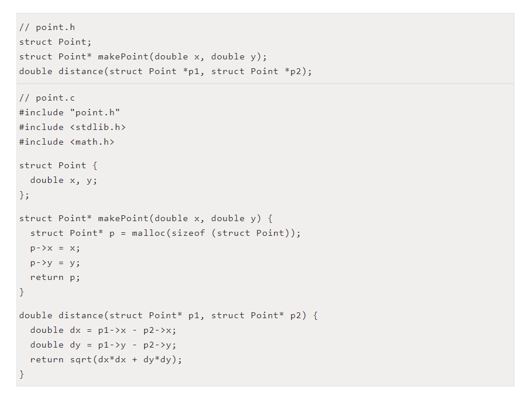

这样使用 `point.h` 的程序就不知道 Point 的内部结构，实现了数据的封装，外部只能使用声明的两个函数，如：

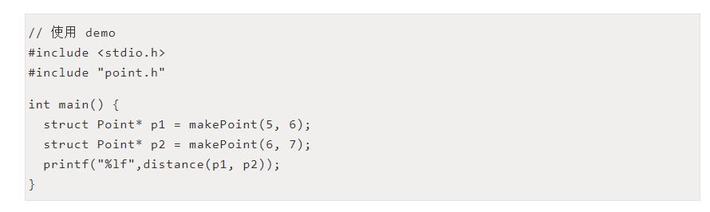

**继承**

接着上面的代码

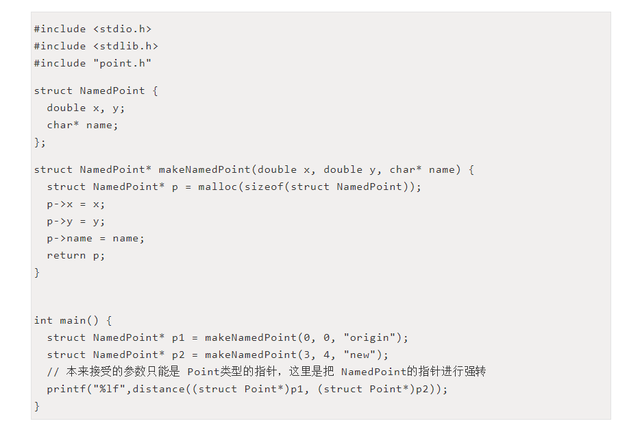

这是能够进行强转调用，是因为 NamedPoint 结构体的前两个成员的顺序与 Point 结构体的完全一致，所以可以进行强转，这其实就可以算是一个单继承。

**多态**

最后我们来看一下多态，这个C语言也是可以实现的，通过使用函数指针

先看一个简单的例子

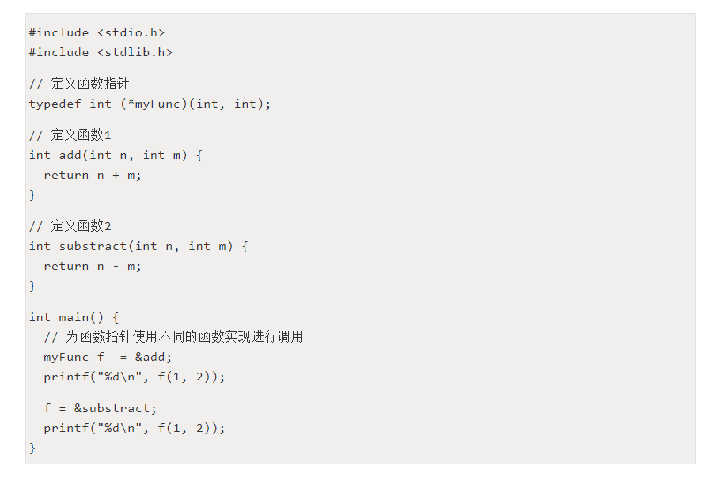

上面的例子如果大家感受还不太明显的话，接下来看一个 redis 源码中的使用

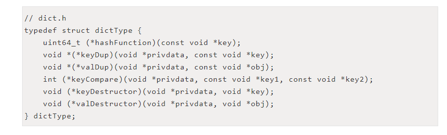

上面这个结构中都是函数指针，可以类比为 Java 中的接口及对应函数声明

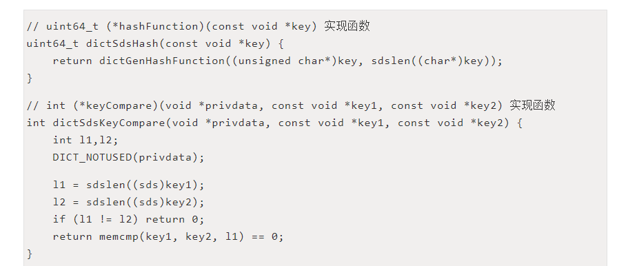

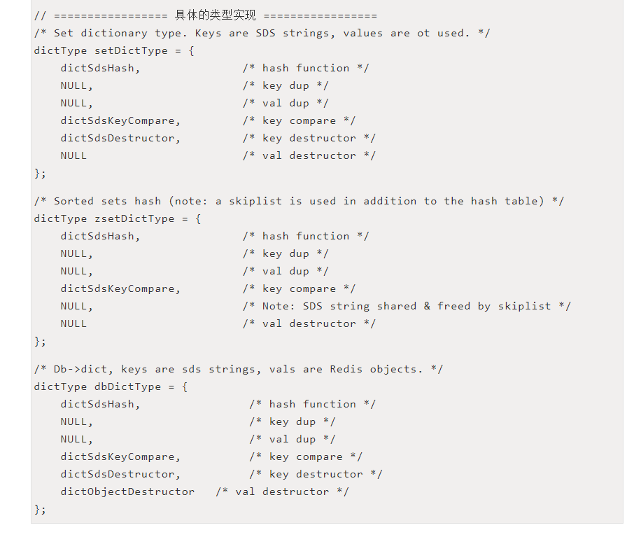

这几个类型都可以类比看做上面的接口的具体实现类，每个类有自己对应的函数实现。

所以不是使用了面向对象的语言，写出的代码就是面向对象的，而使用了面向过程的语言写出来的代码就不行，只不过面向对象的语言对面向对象提供了更好的支持，写起来更方便，更安全而已。代码质量的好坏不是仅仅靠使用了什么高级语言就可以的，要想提升代码质量还是需要我们去不断思考和实践的。

### 2、\__restrict__关键字作用

**概述**

关键字restrict只用于限定指针，表明本指针是访问一个数据对象的惟一且初始的方式。该关键字只用于修饰指针，功能是帮助[编译器](https://so.csdn.net/so/search?q=编译器&spm=1001.2101.3001.7020)进行优化！值得注意的是，优化需要就事论事，经过分析：如果发现确实优化不了，就不优化了。不加restrict关键字修饰的指针，编译器一定不进行优化！

举例：

restrict int* p1 = (int*)malloc(10 * sizeof(int));

p1存在restrict修饰,含义就是p1所指向的空间只会由p1去修改。

**目的**

关键字的用意是充分发挥多处理器（CPU大于1个）的并行性。并行的含义就和下面这句古文的含义很类似。注意和并发作区别。

并发是基于时间片轮转的，故而从宏观上看，各个进（线）程是一起运行的，微观上是串行的。并行就像是多向车道一样（车道数目------核数），各个进（线）程运行互不干扰。
**优化循环**

```c
void add(const double *x, const double *y, double *res)
{
    int i;
    for(i = 0; i < 6; ++i)
         res[i]= x[i] + y[i];
}
```

> 情形一二的前提：假设数组x和数组y内存无重叠，但是数组x和数组res内存有重叠：

什么情况下不能进行优化？

内存存在重叠的情况下是不能优化的。

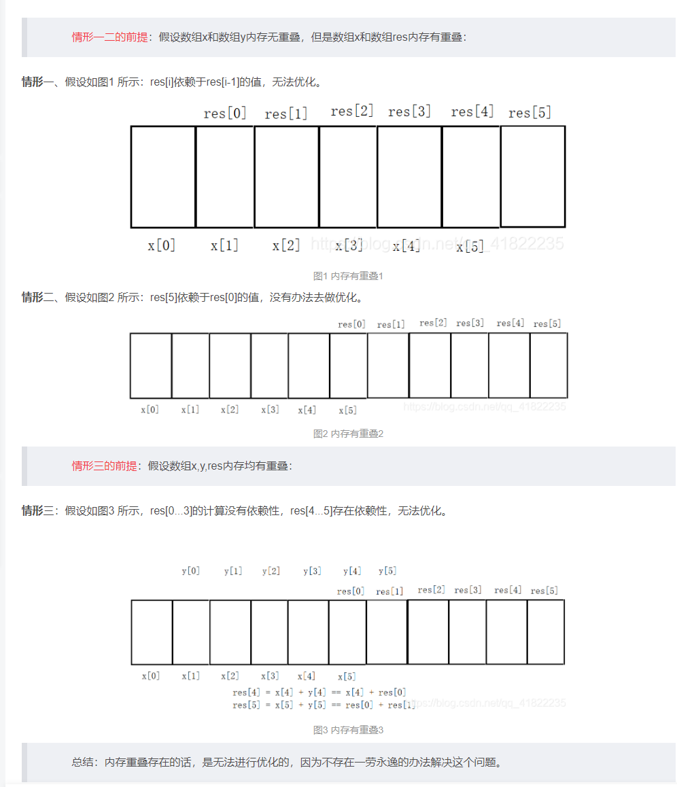

最理想的情形：

假设x,y,res三者指向的内存空间不会重叠， 如果这个函数将在多处理器的环境下执行，编译器可能会做这样的优化：把一个循环拆成两个循环，一个处理器计算res[0...2]，另一个处理器计算res[3...5]，两个处理器可以同时工作，使计算时间理论上缩短一半，同时保证了结果的正确性。如果程序员已经能够保证内存不重叠的话，就有必要指定restrict允许编译器进行优化。
————————————————
版权声明：本文为CSDN博主「楚楚可薇」的原创文章，遵循CC 4.0 BY-SA版权协议，转载请附上原文出处链接及本声明。
原文链接：https://blog.csdn.net/qq_41822235/article/details/83479562


### 3、用预处理指令#define 声明一个常数，用以表明1年中有多少秒

用预处理指令#define 声明一个常数，用以表明1年中有多少秒（忽略闰年问题）

```c
#define SEC_YEAR  (365*24*60*60)UL
```

考察点：

1. `#define` 语法的基本知识（例如：不能以分号结束，括号的使用，等等）
2. 懂得预处理器将为你计算常数表达式的值，因此，直接写出你是如何计算一年中有多少秒而不是计算出实际的值，是更清晰而没有代价的。
3. 意识到这个表达式将使一个16位机的整型数溢出-因此要用到长整型符号L,告诉编译器这个常数是的长整型数
4. 如果你在你的表达式中用到UL（表示无符号长整型），那么你有了一个好的起点。记住，第一印象很重要。


### 两个变量a和b，不允许使用条件判断符，找出较大值

- （a+b + abs(b-a)）/2


### ++i和i++的区别

++i先自增1，再返回，i++先返回i,再自增1

**更深层次：**

当然，就C语言代码来看，i++ 和 ++i 都只有一行，看起来似乎二者的执行效率一样了？其实不是的，在学习C语言时，教材和老师一般都会强调 i++ 和 ++i 的区别，例如下面这段C语言代码：

```c
int i , j, k;
i = 0;
j = i++;
i = 0;
k = ++i;
```

这段C语言代码执行后，j 和 k 的值并不相等：j 等于 0，k 等于 1。既然执行结果有差异，那么执行效率很有可能也是有差异的，事实的确如此。查看上述C语言代码对应的汇编代码，如下：

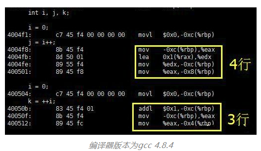

可见，j=i++; 计算机需要 4 条指令来解释，比执行 k=++i; 多出了一条指令。多出的一条指令为：在对 i 执行自加操作之前，先保存 i 的当前值留作稍后使用（赋值为j）。

**这是怎么回事呢？****不同的编译器结果还不一样呢？**

**而且这样看来，似乎 ++i 的执行效率比 i++ 高一些？**

那为了写出效率更高的C语言程序，以后是不是应该尽量使用 ++i，而不是 i++ 了呢？例如下面这样的C语言代码：

```c
for(i=0; i<10; i++);
for(i=0; i<10; ++i);
```

是不是上面那行C语言代码的执行效率低于下面的呢？只能说理论如此，实际上，现代C语言编译器已经足够聪明，它会根据上下文编译C语言代码。

应该明白，i++ 和 ++i 的效率差异主要来自于处理 i++ 时，需要先保存 i 的当前值留作稍后使用。如果之后没有人使用 i 的当前值，也就是说没有C语言代码读取 i++ 的值，编译器实在没有必要保存 i 的当前值了，因此就会将这一步优化掉。

为了便于分析，我们编写下面这样的C语言代码：

```c
int i = 0;
i++;
++i;
```

与上面的例子相比，区别在于在执行 i++ 时，没有人关心 i 的当前值了。查看这段C语言代码对应的汇编代码：

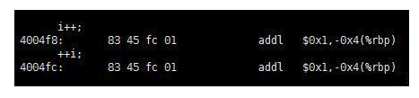

显然，i++ 和 ++i 对应的指令是一模一样的，不再有执行效率上的差异。

C语言中的 i++ 和 ++i 是有区别的，这就有可能带来效率上的差异。如果有代码关心 i++ 执行时的 i 当前值，程序在对 i 进行自加操作时，将不得不先保存 i 的当前值，而 ++i 就无需保存当前值，这就会带来效率上的差异。如果没人关心 i++ 的当前值，那么现代大多数C语言编译器将会将这一差异优化掉，此时 i++ 和 ++i 不再有效率上的差异。


### 写一个"标准"宏MIN ，这个宏输入两个参数并返回较小的一个

```c
#define MIN(a,b)  ((a)<=(b)?(a):(b))
```

考察点：

1. 标识#define在宏中应用的基本知识。这是很重要的。因为在 嵌入(inline)操作符 变为标准C的一部分之前，宏是方便产生嵌入代码的唯一方法，对于嵌入式系统来说，为了能达到要求的性能，嵌入代码经常是必须的方法。
2. 懂得在宏中小心地把参数用括号括起来
3. 我也用这个问题开始讨论宏的副作用，例如：当你写下面的代码时会发生什么事？

```c
   least = MIN(*p++, b);
```

宏定义的作用结果`MIN(*p++,b) ((*p++)<(b)?(*p++),b)` 指针p会做两次自增操作

如何消除宏的副作用

```c
#include <stdio.h>
#define min_i(x,y)    ((x)<=(y)?(x):(y))      //（1）
#define min_t(type,x,y) ({type _x = x;\       //（2）
                        type _y = y;\
                        _x<_y?_x:_y;\
                        })
#define min(x,y)    {const typeof(x)  _x = (x);\  //（3）
                    const typeof(y) _y = (y);\
                    (void)(&_x=&_y);\      //（4）
                    _x<_y?_x:_y;\
                    })

int main()
{
    int a = 10;
    int b = 20;
    printf("min_i(a++,b++)=%d\n",min_i(a++,b++));  //11
    printf("a=%d\n",a);  //12
    printf("b=%d\n",b);  //21

    a=10;
    b=20;
    printf("min_t(int,a++,b++)=%d\n",min_t(int,a++,b++));  //10
    printf("a=%d\n",a);  //11
    printf("b=%d\n",b);  //21

    a=10;
    b=20;
    printf("min(a++,b++)=%d\n",min(a++,b++));  //10
    printf("a=%d\n",a);  //11
    printf("b=%d\n",b);  //21
  
}
```

1. 这个定义计算x和y分别两次（x和y中的小者被计算两次)，当参数由副作用时，将产生不正确的结果
2. 使用语句表达式只计算参数一次，避免了可能的错误，语句表达式通常用于宏定义
3. typeof(x)表示x的值类型
4. 检查参数x和y的类型是否相同(如果x和y的类型不同编译器将会发出warning，并不影响后面语句的运行


### 预处理器标识#error的目的是什么？

编译程序时，只要遇到 #error 就会跳出一个编译错误，既然是编译错误，要它干嘛呢？其目的就是保证程序是按照你所设想的那样进行编译的。

下面举个例子：程序中往往有很多的预处理指令

```
#ifdef XXX
  ...
#else
  ...
#endif
```

当程序比较大时，往往有些宏定义是在外部指定的（如makefile），或是在系统头文件中指定的，当你不太确定当前是否定义了 XXX 时，就可以改成如下这样进行编译：

```
#ifdef XXX
...
#error "XXX has been defined"
#else

#endif
```

这样,如果编译时出现错误,输出了`XXX has been defined`,表明宏`XXX`已经被定义了。


### 内联函数inline与宏定义的区别？

**①内联函数在运行时可以进行调试，而宏定义不能。**

**②编译器会对内联函数的参数做类型安全检查或类型转换（同普通函数），而宏定义不会。**

**③内联函数可以访问类的成员变量，而宏定义不能。**

**④在类中声明的同时定义的成员函数，自动转换成内联函数。**

**注：**在内联函数中如果有复杂的操作，如递归调用、循环等，将不被内联。


### 如何打印出当前源文件的文件名和当前行号

- cout << __FILE__ << ends << __LINE__ << endl;
- __FILE__&__LINE__是系统预定义宏，这种宏并不是在某个文件中定义的，而是由编译器定义的


### 怎么样用C编写死循环

```
while(1)
{}

for(;;)
{}

loop:...
 
goto loop;
```


### 用变量a给出下面的定义

- a) 一个整型数（An integer）
- b)一个指向整型数的指针（ A pointer to an integer）
- c)一个指向指针的的指针，它指向的指针是指向一个整型数（ A pointer to a pointer to an intege）
- d)一个有10个整型数的数组（ An array of 10 integers）
- e) 一个有10个指针的数组，该指针是指向一个整型数的。（An array of 10 pointers to integers）
- f) 一个指向有10个整型数数组的指针（ A pointer to an array of 10 integers）
- g) 一个指向函数的指针，该函数有一个整型参数并返回一个整型数（A pointer to a function that takes an integer as an argument and returns an integer）
- h)  一个有10个指针的数组，该指针指向一个函数，该函数有一个整型参数并返回一个整型数 （ An array of ten pointers to functions that take an integer argument and return an integer ）

```c
a)int a;

b)int *a;

c)int **a;

d)int a[10]

e)int *a[10]

f)int (*a)[10]

g)int (*a)(int a)

h)int (*a[10])(int)
```


### 关键字static的作用是什么？

在C语言中，关键字static有三个明显的作用：

- **第一**、在修饰变量的时候，static修饰的静态局部变量只执行一次，而且延长了局部变量的生命周期，直到程序运行结束以后才释放。

- **第二**、static修饰全局变量的时候，这个全局变量只能在本文件中访问，不能在其它文件中访问，即便是extern外部声明也不可以。

- **第三**、static修饰一个函数，则这个函数的只能在本文件中调用，不能被其他文件调用。Static修饰的局部变量存放在全局数据区的静态变量区。初始化的时候自动初始化为0；

- - （1）不想被释放的时候，可以使用static修饰。比如修饰函数中存放在栈空间的数组。如果不想让这个数组在函数调用结束释放可以使用static修饰
  - （2）考虑到数据安全性（当程序想要使用全局变量的时候应该先考虑使用static）

\-------------------------------------------------------------------------

**在C++中static关键字除了具有C中的作用还有在类中的使用**在类中，static可以用来修饰静态数据成员和静态成员方法

**静态数据成员**

- （1）静态数据成员可以实现多个对象之间的数据共享，它是类的所有对象的共享成员，它在内存中只占一份空间，如果改变它的值，则各对象中这个数据成员的值都被改变。
- （2）静态数据成员是在程序开始运行时被分配空间，到程序结束之后才释放，只要类中指定了静态数据成员，即使不定义对象，也会为静态数据成员分配空间。
- （3）静态数据成员可以被初始化，但是只能在类体外进行初始化，若为对静态数据成员赋初值，则编译器会自动为其初始化为0。
- （4）静态数据成员既可以通过对象名引用，也可以通过类名引用。

**静态成员函数**

- （1）静态成员函数和静态数据成员一样，他们都属于类的静态成员，而不是对象成员。
- （2）非静态成员函数有this指针，而静态成员函数没有this指针。
- （3）静态成员函数主要用来方位静态数据成员而不能访问非静态成员。


### C 语言的关键字 static 和 C++ 的关键字 static 有什么区别

在 C 中 static 用来修饰局部静态变量和外部静态变量、函数。而 C++中除了上述功能外，还用来定义类的成员变量和函数。即静态成员和静态成员函数。

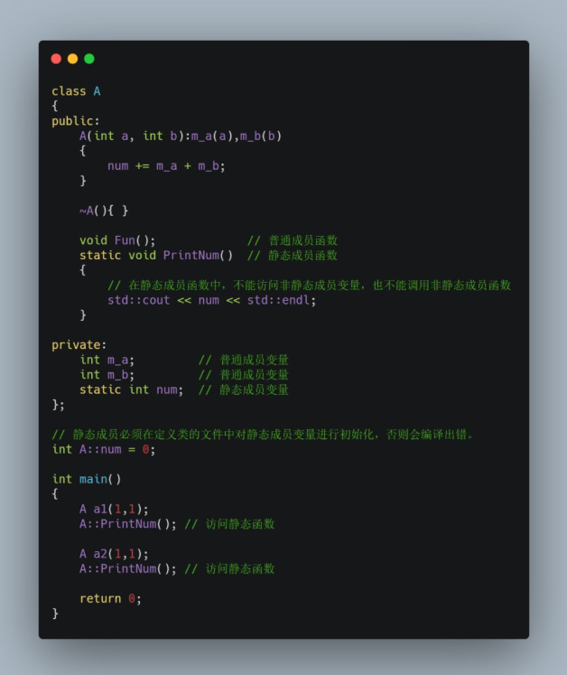


输出结果：

2
4

**01 静态成员变量**

普通成员变量每个对象有各自的一份，而静态成员变量一共就一份，为所有对象共享。

这里需要注意的是 sizeof 运算符不会计算静态成员变量的大小，如下栗子：

```cpp
class CTest
{
    int n;
    static int s;
};
```

则 sizeof(CTest) 等于 4


**02 静态成员函数**

普通成员函数必须具体作用于某个对象，而静态成员函数并不具体作用于某个对象。

因此**静态成员变量**和**静态成员函数**不需要通过对象就能访问，因为他是共享的。


**访问静态成员的方式** 

01 类名::成员名

```cpp
A::PrintNum();
```

02 对象名.成员名

```cpp
A a;
a.PrintNum();
```

03 指针->成员名

```cpp
A *p = new A();
p->PrintNum();
```

04 引用.成员名

```cpp
A a;
A & ref = a;
ref.PrintNum();
```


**小结** 

1. 静态成员变量本质上是全局变量，哪怕一个对象都不存在，类的静态成员变量也存在；

2. 静态成员函数本质上是全局函数；

3. 设置静态成员这种机制的目的是将和某些紧密相关的全局变量和函数写在类里面，看上去像是一个整体，易于维护和理解；

4. 在静态成员函数中，不能访问非静态成员变量，也不能调用非静态成员函数；

5. 静态成员必须在定义类的文件中对静态成员变量进行初始化，否则会编译出错。

**「注意」**：编程时 static 的记忆性，和全局性的特点可以让在不同时期调用的函数进行通信，传递信息，而 C++的静态成员则可以在多个对象实例间进行通信，传递信息。


### 全局变量和全局静态变量的区别

- 1）全局变量是不显式用 static 修饰的全局变量，全局变量默认是有外部链接性的，作用域是整个工程，在一个文件内定义的全局变量，在另一个文件中，通过 extern 全局变量名的声明，就可以使用全局变量。
- 2）全局静态变量是显式用 static 修饰的全局变量，作用域是声明此变量所在的文件，其他的文件即使用 extern 声明也不能使用。


### 静态数据的存储

**全局（静态）存储区**：分为 DATA 段和 BSS 段。

- DATA 段（全局初始化区）存放初始化的全局变量和静态变量；
- BSS 段（全局未初始化区）存放未初始化的全局变量和静态变量。程序运行结束时自动释放。
- 其中BSS段在程序执行之前会被系统自动清0，所以未初始化的全局变量和静态变量在程序执行之前已经为0。

存储在静态数据区的变量会在程序刚开始运行时就完成初始化，也是唯一的一次初始化。

在 C++ 中 static 的内部实现机制：静态数据成员要在程序一开始运行时就必须存在。因为函数在程序运行中被调用，所以静态数据成员不能在任何函数内分配空间和初始化。

这样，它的空间分配有三个可能的地方，一是作为类的外部接口的头文件，那里有类声明；二是类定义的内部实现，那里有类的成员函数定义；三是应用程序的 main() 函数前的全局数据声明和定义处。

静态数据成员要实际地分配空间，故不能在类的声明中定义（只能声明数据成员）。类声明只声明一个类的"尺寸和规格"，并不进行实际的内存分配，所以在类声明中写成定义是错误的。它也不能在头文件中类声明的外部定义，因为那会造成在多个使用该类的源文件中，对其重复定义。

static 被引入以告知编译器，将变量存储在程序的静态存储区而非栈上空间，静态数据成员按定义出现的先后顺序依次初始化，注意静态成员嵌套时，要保证所嵌套的成员已经初始化了。消除时的顺序是初始化的反顺序。

**优势：**可以节省内存，因为它是所有对象所公有的，因此，对多个对象来说，静态数据成员只存储一处，供所有对象共用。静态数据成员的值对每个对象都是一样，但它的值是可以更新的。只要对静态数据成员的值更新一次，保证所有对象存取更新后的相同的值，这样可以提高时间效率。


### Ｃ 语言的 malloc 和 Ｃ＋＋ 中的 new 有什么区别

- new 、delete 是操作符，可以重载，可以自定义内存分配策略，不做内存分配，甚至分配到非内存设备上，只能在C++ 中使用。
- malloc、free 是函数，可以覆盖，C、C++ 中都可以使用。
- new 可以调用对象的构造函数，对应的delete 调用相应的析构函数。
- malloc 仅仅分配内存，free 仅仅回收内存，并不执行构造和析构函数
- new 、delete 返回的是某种数据类型指针，malloc、free 返回的是void 指针。
- new类型是安全的，而malloc不是。例如int *p = new float[2];就会报错；而int p = malloc(2sizeof(int))编译时编译器就无法指出错误来。
- malloc/free需要库文件stdlib.h的支持，new/delete则不需要！

**「注意」**：malloc 申请的内存空间要用free 释放，而new 申请的内存空间要用delete 释放，不要混用。

**「注意」**：delete和free被调用后，内存不会立即回收，指针也不会指向空，delete或free仅仅是告诉操作系统，这一块内存被释放了，可以用作其他用途。但是由于没有重新对这块内存进行写操作，所以内存中的变量数值并没有发生变化，出现野指针的情况。因此，释放完内存后，应该将该指针指向NULL。


### 在C++中，使用malloc申请的内存能否通过delete释放？使用new申请的内存能否用free？

不能，malloc /free主要为了兼容C，new和delete 完全可以取代malloc /free的。malloc /free的操作对象都是必须明确大小的。而且不能用在动态类上。new 和delete会自动进行类型检查和大小，malloc/free不能执行构造函数与析构函数，所以动态对象它是不行的。当然从理论上说使用malloc申请的内存是可以通过delete释放的。不过一般不这样写的。而且也不能保证每个C++的运行时都能正常。

### 关键字const有什么含意？

关键字const有什么含意？

只要一个变量前用const来修饰，就意味着该变量里的数据只能被访问，而不能被修改，也就是意味着const“只读”（readonly）。

规则：const离谁近，谁就不能被修改；

const修饰一个变量时，一定要给这个变量初始化，若不初始化，在后面也不能初始化。

**const作用**：

- 1：可以用来定义常量，修饰函数参数，修饰函数返回值 ，且被const修饰的东西，都受到强制保护，可以预防其它代码无意识的进行修改，从而提高了程序的健壮性（是指系统对于规范要求以外的输入能够判断这个输入不符合规范要求，并能有合理的处理方式。ps：即所谓高手写的程序不容易死）；
- 2：使编译器保护那些不希望被修改的参数，防止无意代码的修改，减少bug；
- 3：给读代码的人传递有用的信息，声明一个参数，是为了告诉用户这个参数的应用目的；

**const优点**：

- 1：编译器可以对const进行类型安全检查（所谓的类型安全检查，能将程序集间彼此隔离开来，这种隔离能确保程序集彼此间不会产生负面影响，提高程序的可读性）；
- 2：有些集成化的调试工具可以对const常量进行调试，使编译器对处理内容有了更多的了解，消除了一些隐患。eg：void hanshu（const int i）{.......}  编译器就会知道i是一个不允许被修改的常量
- 3：可以节省空间，避免不必要的内存分配，因为编译器通常不为const常量分配内存空间，而是将它保存在符号表中，这样就没有了存储于读内存的操作，使效率也得以提高；
- 4：可以很方便的进行参数的修改和调整，同时避免意义模糊的数字出现

### 关键字volatile有什么含意？并给出三个不同的例子。

一个定义为volatile的变量是说这变量可能会被意想不到地改变，这样，编译器就不会去假设这个变量的值了。精确地说就是，优化器在用到这个变量时必须每次都小心地重新读取这个变量的值，而不是使用保存在寄存器里的备份。下面是volatile变量的几个例子：

- 1：并行设备的硬件寄存器（如：状态寄存器）
- 2：一个中断服务子程序中会访问到的非自动变量(Non-automatic variables)
- 3：多线程应用中被几个任务共享的变量

### 一个参数可以既是const又是volatile吗

可以，用const和volatile同时修饰变量，表示这个变量在程序内部是只读的，不能改变的，只在程序外部条件变化下改变，并且编译器不会优化这个变量。每次使用这个变量时，都要小心地去内存读取这个变量的值，而不是去寄存器读取它的备份。

注意：在此一定要注意const的意思，const只是不允许程序中的代码改变某一变量，其在编译期发挥作用，它并没有实际地禁止某段内存的读写特性。

### 变量的位操作

嵌入式系统总是要用户对变量或寄存器进行位操作。给定一个整型变量a，写两段代码，第一个设置a的bit 3，第二个清除a 的bit 3。在以上两个操作中，要保持其它位不变。

考察点：

- 1：不知道如何下手。该被面者从没做过任何嵌入式系统的工作。

- 2：用bit fields。Bit fields是被扔到C语言死角的东西，它保证你的代码在不同编译器之间是不可移植的，同时也保证了的你的代码是不可重用的。

  最近不幸看到 Infineon为其较复杂的通信芯片写的驱动程序，它用到了bit fields因此完全对我无用，因为我的编译器用其它的方式来实现bit fields的。从道德讲：永远不要让一个非嵌入式的家伙粘实际硬件的边。

- 3：用 `#defines` 和 `bit masks` 操作。这是一个有极高可移植性的方法，是应该被用到的方法。最佳的解决方案如下：

```c
#define BIT3 (0x1 << 3)
static int a;

void set_bit3(void)
{
    a |= BIT3;
}
void clear_bit3(void)
{
    a &= ~BIT3;
}
```

### 整型值与变量地址的强制转换

嵌入式系统经常具有要求程序员去访问某特定的内存位置的特点。在某工程中，要求设置一绝对地址为0x67a9的整型变量的值为0xaa66。编译器是一个纯粹的ANSI编译器。写代码去完成这一任务。

**考察点**：

这一问题测试你是否知道为了访问一绝对地址把一个整型数强制转换（typecast）为一指针是合法的。

```c
int *ptr;
ptr = (int *)0x67a9;
*ptr = 0xaa55;

......

*(int *const)(0x67a9) = 0xaa66;
```

### C定义中断服务子程序(ISR)

中断是嵌入式系统中重要的组成部分，这导致了很多编译开发商提供一种扩展—让标准C支持中断。具代表事实是，产生了一个新的关键字  __interrupt。下面的代码就使用了__interrupt关键字去定义了一个中断服务子程序(ISR)，请评论一下这段代码的。

```c
__interrupt double compute_area (double radius)
{
    double area = PI * radius * radius;
    printf("\nArea = %f", area);
    return area;
}
```

考察点：

- 1：ISR 不能返回一个值。如果你不懂这个，那么你不会被雇用的。
- 2：ISR 不能传递参数。如果你没有看到这一点，你被雇用的机会等同第一项。
- 3：在许多的处理器/编译器中，浮点一般都是不可重入的。有些处理器/编译器需要让额处的寄存器入栈，有些处理器/编译器就是不允许在ISR中做浮点运算。此外，ISR应该是短而有效率的，在ISR中做浮点运算是不明智的。
- 4：与第三点一脉相承，printf()经常有重入和性能上的问题。如果你丢掉了第三和第四点，我不会太为难你的。不用说，如果你能得到后两点，那么你的被雇用前景越来越光明了。

### 无符号整数计算

下面的代码输出是什么，为什么？

```c
void foo(void)
{
    unsigned int a = 6;
    int b = -20;
    (a+b > 6) ? puts("> 6") : puts("<= 6");
}
```

考察点：

这 个问题测试你是否懂得C语言中的整数自动转换原则，我发现有些开发者懂得极少这些东西。

不管如何，这无符号整型问题的答案是输出是 ">6"。原因 是当表达式中存在有符号类型和无符号类型时所有的操作数都自动转换为无符号类型。

因此-20变成了一个非常大的正整数，所以该表达式计算出的结果大于6。这一点对于应当频繁用到无符号数据类型的嵌入式系统来说是丰常重要的。

如果你答错了这个问题，你也就到了得不到这份工作的边缘。

### 取0的补码

评价下面的代码片断：

```c
unsigned int zero = 0;
unsigned int compzero = 0xFFFF;
/*1's complement of zero */
```

考察点：

对于一个int型不是16位的处理器来说，上面的代码是不正确的。应编写如下：

```c
unsigned int compzero = ~0;
```

这一问题真正能揭露出应试者是否懂得处理器字长的重要性。在我的经验里，好的嵌入式程序员非常准确地明白硬件的细节和它的局限，然而PC机程序往往把硬件作为一个无法避免的烦恼。

到了这个阶段，应试者或者完全垂头丧气了或者信心满满志在必得。如果显然应试者不是很好，那么这个测试就在这里结束了。

但如果显然应试者做得不错，那么我就 扔出下面的追加问题，这些问题是比较难的，我想仅仅非常优秀的应试者能做得不错。提出这些问题，我希望更多看到应试者应付问题的方法，而不是答案。不管如何，你就当是这个娱乐吧...

### malloc(0)

尽管不像非嵌入式计算机那么常见，嵌入式系统还是有从堆（heap）中动态分配内存的过程的。

那么嵌入式系统中，动态分配内存可能发生的问题是什么？

这里，我期望应试者能提到内存碎片，碎片收集的问题，变量的持行时间等等。这个主题已经在ESP杂志中被广泛地讨论过了（主要是  P.J. Plauger, 他的解释远远超过我这里能提到的任何解释），回过头看一下这些杂志吧！让应试者进入一种虚假的安全感觉后，我拿出这么 一个小节目：下面的代码片段的输出是什么，为什么？

```c
char *ptr;
if ((ptr = (char *)malloc(0)) == NULL)
  puts("Got a null pointer");
else
  puts("Got a valid pointer");
```

这 是一个有趣的问题。最近在我的一个同事不经意把0值传给了函数malloc，得到了一个合法的指针之后，我才想到这个问题。这就是上面的代码，该代码的输 出是"Got a valid pointer"。

我用这个来开始讨论这样的一问题，看看被面试者是否想到库例程这样做是正确。

**得到正确的答案固然重要，但解决问题的方法和你做决定的基本原理更重要些。**

### typedef的好处

Typedef 在C语言中频繁用以声明一个已经存在的数据类型的同义字。也可以用预处理器做类似的事。例如，思考一下下面的例子：

```c
#define dPS struct s *
typedef struct s * tPS;
```

以上两种情况的意图都是要定义`dPS` 和 `tPS` 作为一个指向结构s指针。哪种方法更好呢？（如果有的话）为什么？

考察点：

这是一个非常微妙的问题，任何人答对这个问题（正当的原因）是应当被恭喜的。答案是：typedef更好。思考下面的例子：

```c
dPS p1,p2;
tPS p3,p4;
```

第一个扩展为

```
struct s * p1, p2;
```

上面的代码定义p1为一个指向结构的指针，p2为一个实际的结构，这也许不是你想要的。第二个例子正确地定义了p3 和p4 两个指针。

### a+++b

C语言同意一些令人震惊的结构,下面的结构是合法的吗，如果是它做些什么？

```c
int a = 5, b = 7, c;
c = a+++b;
```

**考察点**：

这个问题将作为这个测验的一个愉快的结尾。不管你相不相信，上面的例子是完全合乎语法的。问题是编译器如何处理它？水平不高的编译作者实际上会争论这个问题，根据最处理原则，编译器应当能处理尽可能所有合法的用法。因此，上面的代码被处理成：

```
c = a++ + b;
```

因此, 这段代码持行后a = 6, b = 7, c = 12。

- 如果你知道答案，或猜出正确答案，做得好。
- 如果你不知道答案，我也不把这个当作问题。我发现这个问题的最大好处是这是一个关于代码编写风格，代码的可读性，代码的可修改性的好的话题。

### 变量的声明和定义有什么区别

> 注意：变量声明是加extern的才叫变量声明。

变量的定义为变量分配地址和存储空间， 变量的声明不分配地址。一个变量可以在多个地方声明， 但是只在一个地方定义。加入extern 修饰的是变量的声明，说明此变量将在文件以外或在文件后面部分定义。

说明：很多时候一个变量，只是声明不分配内存空间，直到具体使用时才初始化，分配内存空间， 如外部变量。

```c
int main() 
{
   extern int A;
   //这是个声明而不是定义，声明A是一个已经定义了的外部变量
   //注意：声明外部变量时可以把变量类型去掉如：extern A;
   dosth(); //执行函数
}
int A; //是定义，定义了A为整型的外部变量
```

### 简述#ifdef、#else、#endif和#ifndef的作用

利用#ifdef、#endif将某程序功能模块包括进去，以向特定用户提供该功能。在不需要时用户可轻易将其屏蔽。

```c
#ifdef MATH
#include "math.c"
#endif
```

在子程序前加上标记，以便于追踪和调试。

```c
#ifdef DEBUG
printf ("Indebugging......!");
#endif
```

应对硬件的限制。由于一些具体应用环境的硬件不一样，限于条件，本地缺乏这种设备，只能绕过硬件，直接写出预期结果。

**「注意」**：虽然不用条件编译命令而直接用if语句也能达到要求，但那样做目标程序长（因为所有语句都编译），运行时间长（因为在程序运行时间对if语句进行测试）。而采用条件编译，可以减少被编译的语句，从而减少目标程序的长度，减少运行时间。

### 结构体struct可以直接赋值吗

声明时可以直接初始化，同一结构体的不同对象之间也可以直接赋值，但是当结构体中含有指针“成员”时一定要小心。

**「注意」**：当有多个指针指向同一段内存时，某个指针释放这段内存可能会导致其他指针的非法操作。因此在释放前一定要确保其他指针不再使用这段内存空间，否则会造成野指针。

### 结构体struct内存对齐问题

请写出以下代码的输出结果：

```c
#include<stdio.h>
struct S1
{
    int i:8;
    char j:4;
    int a:4;
    double b;
};
 
struct S2
{
    int i:8;
    char j:4;
    double b;
    int a:4;
};
 
struct S3
{
    int i;
    char j;
    double b;
    int a;
};
 
int main()
{
    printf("%d\n",sizeof(S1));  // 输出8
    printf("%d\n",sizeof(S1);  // 输出12
    printf("%d\n",sizeof(Test3));  // 输出8
    return 0;
}
 
sizeof(S1)=16
sizeof(S2)=24
sizeof(S3)=24
```

**「说明」**：结构体作为一种复合数据类型，其构成元素既可以是基本数据类型的变量，也可以是一些复合型类型数据。对此，编译器会自动进行成员变量的对齐以提高运算效率。默认情况下，按自然对齐条件分配空间。各个成员按照它们被声明的顺序在内存中顺序存储，第一个成员的地址和整个结构的地址相同，向结构体成员中size最大的成员对齐。

许多实际的计算机系统对基本类型数据在内存中存放的位置有限制，它们会要求这些数据的首地址的值是某个数k（通常它为4或8）的倍数，而这个k则被称为该数据类型的对齐模数。


### 全局变量和局部变量有什么区别？是怎么实现的？操作系统和编译器是怎么知道的？

- 全局变量是整个程序都可访问的变量，谁都可以访问，生存期在整个程序从运行到结束（在程序结束时所占内存释放）；
- 而局部变量存在于模块（子程序，函数）中，只有所在模块可以访问，其他模块不可直接访问，模块结束（函数调用完毕），局部变量消失，所占据的内存释放。
- 操作系统和编译器，可能是通过内存分配的位置来知道的，全局变量分配在全局数据段并且在程序开始运行的时候被加载，局部变量则分配在堆栈里面。

### C语言的指针和引用和c++的有什么区别？

- 指针有自己的一块空间，而引用只是一个别名；
- 使用sizeof看一个指针的大小是4，而引用则是被引用对象的大小；
- 作为参数传递时，指针需要被解引用才可以对对象进行操作，而直接对引 用的修改都会改变引用所指向的对象；
- 可以有const指针，但是没有const引用；
- 指针在使用中可以指向其它对象，但是引用只能是一个对象的引用，不能被改变；
- 指针可以有多级指针（**p），而引用止于一级；
- 指针和引用使用++运算符的意义不一样；
- 如果返回动态内存分配的对象或者内存，必须使用指针，引用可能引起内存泄露。

### C语言的结构体和C++的类有什么区别

- C语言的结构体是不能有函数成员的，而C++的类可以有。
- C语言的结构体中数据成员是没有private、public和protected访问限定的。而C++的类的成员有这些访问限定。
- C语言的结构体是没有继承关系的，而C++的类却有丰富的继承关系。

**「注意」**：虽然C的结构体和C++的类有很大的相似度，但是类是实现面向对象的基础。而结构体只可以简单地理解为类的前身。


### 请你来说一下C++中struct和class的区别

在C++中，class和struct做类型定义是只有两点区别：

- 默认继承权限不同，class继承默认是private继承，而struct默认是public继承

- class还可用于定义模板参数，像typename，但是关键字struct不能同于定义模板参数 C++保留struct关键字，原因

  保证与C语言的向下兼容性，C++必须提供一个struct

- C++中的struct定义必须百分百地保证与C语言中的struct的向下兼容性，把C++中的最基本的对象单元规定为class而不是struct，就是为了避免各种兼容性要求的限制

- 对struct定义的扩展使C语言的代码能够更容易的被移植到C++中


### 指针常量与常量指针区别

指针常量是指定义了一个指针，这个指针的值只能在定义时初始化，其他地方不能改变。常量指针 是指定义了一个指针，这个指针指向一个只读的对象，不能通过常量指针来改变这个对象的值。指针常量强调的是指针的不可改变性，而常量指针强调的是指针对其所指对象的不可改变性。

**「注意」**：无论是指针常量还是常量指针，其最大的用途就是作为函数的形式参数，保证实参在被调用 函数中的不可改变特性。


### 如何理解函数指针

（1）定义：

函数指针是指向函数的指针变量。函数指针本身对象是一个指针变量，该指针变量指向一个具体的函数。这正如用指针变量可指向整型变量、字符型、数组⼀样，这里是指向函数。

在编译时，每⼀个函数都有⼀个入口地址，该入口地址就是函数指针所指向的地址。有了指向函数的指针变量后，
可用该指针变量调用函数，就如同用指针变量可引用其他类型变量⼀样，在这些概念上是大体⼀致的。

（2）用途

调用函数和做函数的参数，比如回调函数

（3）示例

```c
char * fun(char * p) {…} // 函数fun
char * (*pf)(char * p); // 函数指针pf
pf = fun; // 函数指针pf指向函数fun
pf(p); // 通过函数指针pf调⽤函数fun
1234
```


### 回调函数的作用

当发生某种事件时，系统或者系统函数将会自动调用你定义的一段函数。

回调函数就相当于一个中断处理函数，由系统在符号你设定的条件时自动调用。为此，你需要做三件事：

- 声明
- 定义
- 设置触发条件

就是在你的函数中把你的回调函数名称转换为地址作为一个参数，以便于系统调用。

回调函数就是一个通过函数指针调用的函数。如果你把函数的指针（地址）作为参数传递给另外一个函数，当这个指针被用为调用它所指向的函数时，我们就说这是回调函数

从而可以把调⽤者与被调⽤者分开。调⽤者不关⼼谁是被调⽤者，所有它需知道的，只是存在⼀个具有某种特定原型、某些限制条件（如返回值为int）的被调⽤函数。


### 悬挂指针与野指针有什么区别？

- 野指针：**未初始化的指针叫做野指针**。⽤ gcc -Wall 编译, 会出现 used uninitialized 警告。
- 悬空指针：当指针指向的对象被释放，但是该指针没有任何改变，以至于其仍然**指向已经被回收的内存地址，这种情况下的指针叫做悬空指针**

无论是野指针还是悬空指针，都是指向无效内存区域(这里的无效指的是"不安全不可控")的指针。 访问"不安全可控"(invalid)的内存区域将导致"Undefined Behavior"


### 如何避免“野指针”

- 指针变量声明时没有被初始化。解决办法：指针声明时初始化，可以是具体的地址值，也可让它指向NULL。
- 指针p被free或者delete之后，没有置为NULL。解决办法：指针指向的内存空间被释放后指针应该指向NULL。
- 指针操作超越了变量的作用范围。解决办法：在变量的作用域结束前释放掉变量的地址空间并且让指针指向NULL。


### typedef 和define 有什么区别

- 用法不同：typedef 用来定义一种数据类型的别名，增强程序的可读性。define 主要用来定义 常量，以及书写复杂使用频繁的宏。
- 执行时间不同：typedef 是编译过程的一部分，有类型检查的功能。define 是宏定义，是预编译的部分，其发生在编译之前，只是简单的进行字符串的替换，不进行类型的检查。
- 作用域不同：typedef 有作用域限定。define 不受作用域约束，只要是在define 声明后的引用 都是正确的。
- 对指针的操作不同：typedef 和define 定义的指针时有很大的区别。

**「注意」**：typedef 定义是语句，因为句尾要加上分号。而define 不是语句，千万不能在句尾加分号。


### sizeof 和strlen 的区别

- sizeof是一个操作符，strlen是库函数。
- sizeof的参数可以是数据的类型，也可以是变量，而strlen只能以结尾为‘\0’的字符串作参数。
- 编译器在编译时就计算出了sizeof的结果，而strlen函数必须在运行时才能计算出来。并且sizeof计算的是数据类型占内存的大小，而strlen计算的是字符串实际的长度。
- 数组做sizeof的参数不退化，传递给strlen就退化为指针了

**sizeof操作符返回的是参数所占的内存数，而 strlen函数返回的是参数的字符串长度，不是所占用的内存的大小。需要注意的是，strlen函数的参数是字符串，并且必须以串结束符“\0”结尾。看看下面的代码。**

```c
#include<stdio.h>
#include<string.h>

int main(){
   char str[10] = "hello";
   printf("字符串的长度为：%d\n", strlen(str));
   printf("占用内存的大小为：%d\n", sizeof(str));
   return 0;
}
```

运行结果：

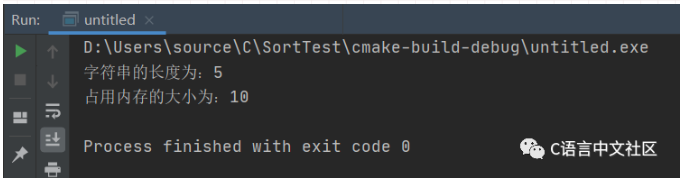

从运行结果可以发现，strlen和sizeof之间的区别在于，通过sizeof操作符得到的是定义的字符数组str占用的内存大小，而通过strlen函数得到的是对其进行初始化的字符长度。

当str是指针时，结果会是怎样的呢？

我们一起来看下面的代码

```c
#include<stdio.h>
#include<string.h>

int main(){
   char *str = "hello";
   printf("strlen(str) = %d\n", strlen(str));
   printf("sizeof(str) = %d\n", sizeof(str));
   printf("sizeof(*str) = %d\n", sizeof(*str));
   return 0;
}
```

运行结果：

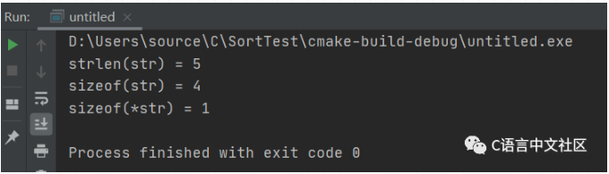

从运行结果发现，str占用内存的大小变为4，这是因为指针在32位计算机中占用4字节，所以其值为4，而接下来的sizeof(\*str)为1，这是因为*str表示字符串首地址的内容，在此就是字符H，占用内存大小为1字节。

### 简述strcpy、sprintf 与memcpy 的区别

- 操作对象不同，strcpy 的两个操作对象均为字符串，sprintf 的操作源对象可以是多种数据类型， 目的操作对象是字符串，memcpy 的两个对象就是两个任意可操作的内存地址，并不限于何种数据类型。
- 执行效率不同，memcpy 最高，strcpy 次之，sprintf 的效率最低。
- 实现功能不同，strcpy 主要实现字符串变量间的拷贝，sprintf 主要实现其他数据类型格式到字 符串的转化，memcpy 主要是内存块间的拷贝。

**「注意」**：strcpy、sprintf 与memcpy 都可以实现拷贝的功能，但是针对的对象不同，根据实际需求，来选择合适的函数实现拷贝功能。

### 请解析((void ()( ) )0)( )的含义

- void (*0)( ) ：是一个返回值为void，参数为空的函数指针0。
- (void (*)( ))0：把0转变成一个返回值为void，参数为空的函数指针。
- \*(void (\*)( ))0：在上句的基础上加*表示整个是一个返回值为void，无参数，并且起始地址为0的函数的名字。
- (\*(void (\*)( ))0)( )：这就是上句的函数名所对应的函数的调用。

### 写一个函数，确保在main函数执行前执行

```cpp
//第⼀种：gcc扩展，标记这个函数应当在main函数之前执⾏。同样有⼀个__attribute((destructor))，标记函数应当在程序结束之前（main结束之后，或者调⽤了exit后）执⾏;
__attribute((constructor))void before() {
    printf("before main 1\n");
}

//第⼆种：全局 static 变量的初始化在程序初始阶段，先于 main 函数的执⾏
int test1() {
    printf("before main 2\n");
    return 1;
}
static int i = test1();

// 第三种：利⽤ lambda 表达式
int a = []() {
    printf("before main 3\n");
    return 0;
}();


int main()
{
    printf("main function\n");
    return 0;
}
```

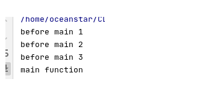