# **一、C++基础**

## 第二章 变量和基本类型

### 2.1 基本内置类型

#### 2.1.1 如何选择类型？

* 使用int来执行整型运算。在实际应用中，short通常太小而32位机器中long和int拥有一样的大小，所以当int表示的范围不够时，用long long。
* 使用double来执行浮点运算。因为实际应用中，float通常精度不够而long double提供的额外精度没有必要且计算消耗大，最重要的是，double和float的计算代价相差无几，甚至某些机器上，双精度运算甚至比单精度运算还快。

#### 2.1.2 字面值常量

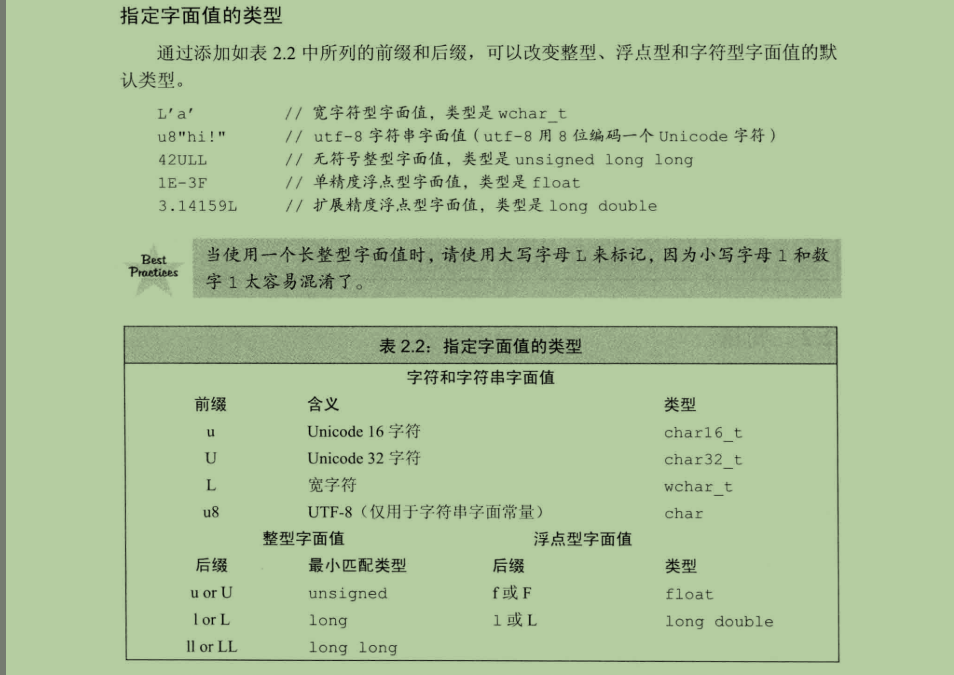

### 2.2 变量

#### 2.2.1 变量定义

##### 对象

定义：对象是指一块能存储数据并具有某种类型的存储空间。

##### 初始值

* 对象在创建时获得一个特定的值，叫做初始化。
* 初始化不是赋值。初始化是在对象创建时赋予其一个值，而赋值则是把对象的当前值擦除，而以一个新的值来替代。

##### 初始化方法

```c
int num = 0;
int num = { 0 };
int num{0};
int num(0);
```

列表初始化为C++11的新增特性，而列表初始化时会进行更严格的检查，在初始化内置类型时，如果存在丢失信息的风险（如将long给int初始化），则编译器会报错。

##### 默认初始化

存在以下几种情况：

* 对于内置类型，定义于函数体外的变量会被初始化为0，而定义在函数体内部的变量将**不会被初始化**，其值是未定义的。
* 对于类，对象的默认初始化行为由类的内部实现来决定。

结论：建议定义内置类型变量时，必须进行手动初始化。

#### 2.2.2 声明和定义的关系

```c
int num1;	// 声明
int num2 = 10;	// 定义
```

* 变量可以声明多次，但只能定义一次。
* 定义就是包含了显示初始化的声明。

#### 2.2.3 标识符

##### 变量命名规则

* C++标识符由字母、数字、下划线三类组成。
* 标识符中不能连续出现两个下划线，也不能以下划线紧连大写字母开头。
* 定义在函数体（包括类）外的标识符不能以下划线开头。

##### 变量命名规范

* 变量名用小写，如num。
* 类名或结构体名用大写，如Student。
* 单词间要有区分，如studentID，或student_ID。

##### 内置标识符

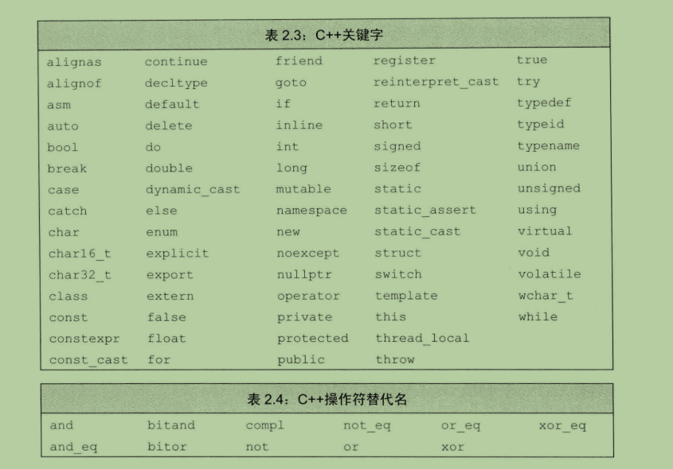

#### 2.2.4 名字的作用域

* 作用域通过花括号来分隔。
* 在某个花括号内的变量拥有**块作用域**。
* 在所有花括号之外的变量拥有**全局作用域**。

### 2.3 复合类型

#### 2.3.1 引用

引用定义：引用不是对象，只是为一个已经存在的对象起的另外一个名字。

注：引用只能绑定在对象上，而不能绑定在常量、表达式或其他引用上。

#### 2.3.1 指针

##### 获取对象的地址

指针存放某个对象的地址，要想获取该地址，用**取地址符&**。

##### 利用指针访问对象

如果指针指向了一个对象，则使用**解引用符***来访问所指对象。

##### 空指针

尽量使用nullptr来表示空指针。

##### void*指针

void*是一种特殊的指针类型，可以存放任意对象的地址。

##### 指针代码集合

**1、\*p++和(\*p)++的区别**

示例一：\*p++

```c++
int main() {
    int a = 1;
    int* b = &a;
    cout << "a: " << a << endl;
    cout << "b: " << b << endl;
    cout << "(*b): " << *b << endl;
    cout << endl;

    *b++;
    cout << "a: " << a << endl;
    cout << "b: " << b << endl;
    cout << "(*b): " << *b << endl;
} 
```

输出：

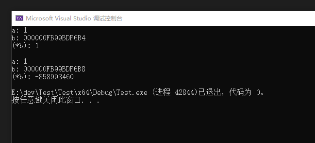

> 可以看出自增运算符的优先级是高于解引用运算符的，所以*b++实际上只是将b自增一个int的长度（4字节），而解引用的实际上是自增后的新地址指向的值，这里没有赋值操作，所以啥也没干，对a的值更是没有任何影响。


示例二：

```c++
int main() {
    int a = 1;
    int* b = &a;
    cout << "a: " << a << endl;
    cout << "b: " << b << endl;
    cout << "(*b): " << *b << endl;
    cout << endl;

    (*b)++;		// 只改动了这一行
    cout << "a: " << a << endl;
    cout << "b: " << b << endl;
    cout << "(*b): " << *b << endl;
} 
```

运行结果：

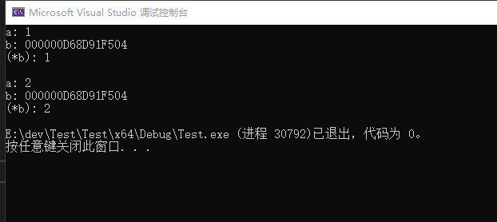

> 这才是对指针指向的值加一的正常操作。

#### 2.3.3 复合类型的声明

##### 定义多个指针变量

两种写法：

```c++
int *p1, *p2;	// 一行多个，多个*
int* p1;	// 一行一个，一个*
int* p2;
```

##### 指向指针的引用

因为指针也是对象，所以可以定义指向指针的引用。

```c++
int i = 42;
int* p = &i;
int* &q = p;	// q是指针p的引用
```

>小技巧：面对一个比较复杂的类型声明语句时，要用**从右向左**读的顺序，离变量名最近的符号对变量类型有最直接的影响。


### 2.4 const限定符

#### 2.4.1 const使用方法

基本事实：const变量一旦被定义，其值不能被改变。

```c++
// const定义时必须初始化，否则会报错；
const int a = 24;	// ok
const int b;		// error

// const变量的值不允许被改变
a = 0;		// error

// 指向常量的指针，指针指向的值不能被改变，但是指向可以修改
int c = 10;
const int* d =  &c;
c = 24;		// ok, *d = 24
*d = 30;	// error, 不允许通过*d修改c的值
d = &a;		// ok, 可以改变指针的指向

// const指针，指针指向不允许修改，const指针从定义开始就只能永远指向这个对象，但是可以修改指向对象的值
int* const e = &c;
e = &a;			// error, const指针不能改变指向
*e = 12;		// ok, 可以改变指向的对象的值

```

#### 2.4.2 const对象仅在文件内有效

* 在同一文件内，编译器在编译过程中会把所有用到const变量的地方替换成对应的常量值。

* 要在不同文件内使用同一个const变量需要用extern关键字，该变量只能定义一次，但可以被声明多次。

  a.c

  extern const int a = 24;

  b.c

  extern const int a;

#### 2.4.3 顶层const和底层const

顶层const表示指针或者变量本身是个常量，底层const表示指针所指的对象是一个常量，且用于声明引用的const都是底层const。

```c++
// 顶层const
const int a = 5;
int* const ptr1 = &a;

// 底层const
const int* ptr2 = &a;
```

#### 2.4.4 常量表达式和constexpr

**常量表达式：**指值不会改变并且编译过程中就能得到计算结果的表达式。字面值是常量表达式，用常量表达式初始化的const变量也是常量表达式。

**constexpr变量：**C++11规定，声明为constexpr类型的变量，编译器将会验证其是否是一个常量表达式，并做一些优化。

>一般来说，如果认定某个变量时一个常量表达式，那么就应该把它声明成constexpr类型。

示例：
```c++
const int maxSize = 100;	// maxSize是常量表达式
const int limit = maxSize + 1;	// limit是常量表达式
int minSize = 20;	// minSize不是常量表达式
const int ret = getSize();	// ret不是常量表达式，因为getSize()的返回值要运行时才得知


constexpr int mf = 20;		// ok
constexpr int limit = mf + 1;	// ok
constexpr int sz = size();	// 只有当size是一个constexpr函数时才正确
```

#### C/C++中的const

**const 与 #define 的区别**

在`C/C++`中定义常量通常使用`const`关键字，当然你也可以使有宏`#define`来定义。这两种方式定义常量如下所示：

- const 定义常量

  ```
  const int PI = 3.14;
  ```

- 宏定义常量

  ```
  #define PI = 3.14
  ```

这两种定义常量的方式有什么区别呢？

要回答这个问题，我们需要了解一点编译原理的知识。编译器在编译我们写好C/C++程序时，其编译器过程为：**预编译->编译->链接**。`C/C++`中宏的替换就是在预编译阶段完成的，也就是说在预编译阶段将C/C++中的所有用到的宏都用宏定义中的值替换掉。

而`const` 定义的常量则与宏定义的常量不同，它是在编译阶段进行检测，而且还可以对其类型进行检测。因此我们可以总结出使用`const`定义的常量与宏定义的常量有如下区别:

- 宏是在预编译时进行宏展开，而const是在编译时检测，所以两者操作的时期不同
- 由于宏在预编译时被操作，所以无法进行类型检测；而const则可以进行类型检测
- 因在编译阶段可以形成符号表，所以const定义的常量可以通过调试器进行调试；而宏在展开后就消失了，所以无法通过调试器进行调试

以上就是`const`与`宏`的最主要的区别。所以一般情况下我们都建议使用const来定义常量。

**const常量与const常量指针**

上面我们已经列举过const如何定义常量，这里就不再赘述了。现在咱们来看一下const常量指针，它该如何定义呢?

```
const int * ptr; //const常量指针
```

上面就是const常量指针的定义，也挺好理解的对吧。我们将const常量和const常量指针放在一起看一下：

```
const int i;    //const常量
const int* ptr; //const常量指针
```

将他们放在一起比较着看，你就更容易理解const常量指针了，无非就是将const常量中的类型变成指针而已。

**那么常量指针的作用是什么呢？**，我们来看个例子你就清楚了。

```c++
const int i = 100;     // 定义一个常量
i = 100;               // 不允许修改常量

int *p = &i;           // 老的编译器是被允许的，这实际存在安全问题
                       // 为了解决这个问题，新的编译器报错，非常量指针不允许指向常量地址

const int * ptr = &i;  // 常量指针指向常量地址
*ptr = 100;            // 不允许修改常量的内容
```

按照常量的定义，常量定义好后其内容就不允许再修改了，因此对于上面代码中的前两行相信你不会有什么异义。

但在较老的编译器上，存在一个漏洞，它允许你用普通指针指向常量地址。这样你就可以通过该指针修改常量的内容了，这是非常大的安全漏洞。为了消除这个安全隐患，在新的编译器上已经不允许普通指针指向const常量了。

为什么在老编译器上指针可以指向常量地址并修改其内容呢？究其原因是因为const定义的常量实际是在内存的可读写空间，只是由于编译器限制你才不能修改它。而老的编译器却没有这方面的限制，所以才会出现通过普通指针修改常量的可能。

我们再来看代码的最后两行。使用const常量指针指向常量地址，此时你无论用新编译器还是老编译器，都无法通过该指针修改常量的内容。所以代码的最后一行当你修改常量内容时就会报错。

通过上面的讲解，你应该对常量指针的概念比较清楚了。常量指针不能修改常量内容，但能不能让常量指针指向另外一个常量的地址呢？比如下面这样：

```c++
const int i = 100;
const int n = 1000;

const int * ptr = &i;   //常量指针先指向 i 常量的地址
ptr = &n;               //又修改为指向 n 常量的地址
```

这样做当然是可以的，因为常量指针限制的是不能修改常量内容，但并没有限制它指向哪个常量。


**const变形**

上面我们已经清楚了const常量指针是什么，它起了什么作用。但它还有一点你不知道，就是它会变型。我们来看一个例子：

```c++
const int * ptr;
int const * ptr;
```

上面这两行代码很像是不是？第二行代码将 const 放到了 int 类型之后，它表达的是什么意思呢？**其实两行表示的是同一个意思，都是常量指针**。只是有的人喜欢将const写在最前面，有的人喜欢将const 写在类型后面罢了。这里有一个记忆的小巧门，我们只要记住const是在 `*` 左边它就表示的是常量指针就OK了。


**指针常量**

上面的内容清楚之后，我们再来一个复杂的**指针常量**。看到这个词相信很多同学立马晕了，上面是常量指针，这又来个指针常量是这是说绕口令吗？先别急，我们先来看个例子：

```c++
int * const ptr;
```

上面这行代码是不是与前面的很相似？一模一样? 如果你这样认为说明你没有仔细观察。之前的常量指针const是在`*`号左边，这次的const跑到`*`号右边了。

它表示的是什么意思呢？

前面我已经说了，对于常量指针来说，你是不能修改它所指向的内容的，因为内容是常量，但它可以让它指向不同的常量地址。新需求来了，有没有可能让指针指向一个地址就不动了呢？或者换个思考的角度，既然const可以定义常量，能不能定义一个指针常量呢？**这就是指针常量的由来**。

C/C++编译器的作者考虑的一下这个需求，觉得这个需求是合理的，决定实现它。但怎么才能表示指针常量呢？于是就有了 `const int * const ptr` 这个写法，const 放在`*`后面表达对ptr的限制。

了解了指针变量的由来，下面我们来看一下它的用法：

```
int i = 100;
int n = 1000;

int * const ptr =  &i; // 正确，初始指向某个变量
ptr = &n;              // 错误，ptr是常量，不能再发生变化

*ptr = 20;             // 正确，因为我们没有对指针指向的内容做限制
```

上面代码中定义了两个变量 i 和 n，ptr是指针常量，因此它只能在初始化时指向某个变量的地址，之后它就不能更改变指向其它地址了，因为它是**常量**。**但需要注意的是ptr指向的内容是可以被修改的**。


**指向常量的指针常量**

看这个标题就觉得好复杂啊！没错我们又要升级难度了。先看个例子

```c++
const int * const ptr1;
int const * const ptr2;
```

天呐，一条语句中出列了两个const，如果我们没有基础的话，这两行代码简直无法理解。不过，有了上面的基础我们再来看这两句还是能猜出它要干什么的对吧？

这两条语句的含义是一样的，表示的是ptr1/ptr2指向的地址不能再改变，而且它指向的地址里的内容也不能再改变。


**小结**

在本文中我向你详细介绍了C/C++中的`const`的含义和用法，总结一下包括以下几种：

- 定义常量, 内容不能改变，`const int a;`
- 定义常量指针，指向的内容不能改变，`const int * ptr;` 或 `int const * ptr;`
- 定义指针常量，指针不能改变，但指向的内容可以改变。`int * const ptr`
- 定义指向常量的针指常量，指针不能改变，内容也不能改变。`const int * const ptr` 或 `int const * const ptr`

### 2.5 处理类型

#### 2.5.1 类型别名

两种方式：

```c++
// typedef方式
typedef double wages;
typedef wages base;		// 可以嵌套

// using方式（C++11）
using SI = Sales_item;

```

#### 2.5.2 auto类型说明符

auto是C++11引入的，auto会根据初始化时所赋的值来推断变量的类型，因此auto定义的变量必须有初始值。

```c++
auto i = 0;  // i为int类型
auto tmp;	 // error, 必须初始化
```

#### 2.5.3 decltype类型指示符

* 当需要自动推导类型，但是并不想初始化时，可以使用decltype（C++11）。
* decltype可以分析表达式并得到它的类型，却不实际计算表达式的值。

```c++
int i = 0, j = 1;
decltype(i)	x = 0;	// x为int类型
decltype(i + j) y = 0;	// y为int类型
decltype((i)) z = 0;	// z为int&类型
```

>注：decltype((variable))，使用双层括号时返回的类型永远是引用，而decltype(variable)返回的类型只有当variable本身是引用时才返回引用类型。

#### 2.5.4 打印变量的类型名

```c++
class Tom {
    int a;
    string b;
};

int main() {
    int a = 0;
    int& b = a;
    int& c = b;
    int* d = &a;
    Tom f;
    int&& e = std::move(a);
    cout << typeid(a).name() << endl;
    cout << typeid(b).name() << endl;
    cout << typeid(c).name() << endl;
    cout << typeid(d).name() << endl;
    cout << typeid(e).name() << endl;
    cout << typeid(f).name() << endl;
    cout << typeid(&f).name() << endl;
    return 0;
}
```


#### C/C++中的类型转换

在C语言中我们经常要做类型转换，例如malloc函数分配内存时需要从`void *`转换成你指定的类型指针。如下面这样：

```c++
int* block = (int*)malloc(sizeof(int));
```

上面的代码是将`void*`转换成`int*`，这种转换方式在C语言中称为`强制转换`。它的好处是简洁，灵活；缺点是需要人来决定转换后类型是否正确，因此对开发人员的要求是很高的。


**C++的四种类型转换**

C++觉得C的强制转换方式不是很友好，尤其是没法通过编译器或运行时检测工具来提供帮助，光靠人的能力来判断是很不靠谱的事儿。

而且相对于C来说，分析C++程序的运行轨迹要比分析C复杂得多。因此C++提出了四种新的类型转换方法，这四种类型转换方法分别是：`static_cast`、`dynamic_cast`、`const_cast`以及`reinterpret_cast`。

下面我们就来对这四种类型转换方法做下详细讨论。


**static_cast**

**static_cast主要用于不同类型变量之间的转换及左值转右值等**。比如说double转int就需要用static_cast转换。我们来举个例子：

```c++
//不同类型之间的转换
double d = 10.1;
int i = static_cast<int>(d);

//左值转右值
int lv = 10;
int && rv = static_cast<int&&>(lv);
```

> 这里需要注意的是：int 转 double是隐式转换，右值转左值也是隐性转换，所以对这两种情况是不需要用static_cast进行显示转换的。

上面我们说的是普通类型的转换。而对于类对象来说，static_cast不能直接将一种类对象转成另一种类对象。比如：

```c++
class A{
    public:
        int a;
};

class B:public A {
    public:
        int b;
};

class C {
    public:
        int c;
};

int main(int argc, char *argv[]){
    A a;
    B b;
    b = static_cast<B>(a); //不允许static_cast将一个对象转成另一个对象
}
```

像上面这种用static_cast将A类型的对象转成B类型对象是不允许的。但你可以利用static_cast将基类指针/引用转成子类指针/引用。如下所示：

```c++
...
A ca;
B & crb = static_cast<B&>(ca);
...
A * pa = new A();
B * cpb = static_cast<B*>(pa);
...
```

但这里有个前提条件，即只有有父子关系的类之间才可以做如上转换，否则编译失败。还有，虽然以上两种使用static_cast的方式都可以编译通过，但用户自己要防止越界访问的问题。

static_cast除了上面讨论的几种情况外，还有一点需要牢记，即**static_cast不允许不同类型之间指针/引用的转换(有父子关系的类对象除外)**。看个具体的例子：：

```c++
...
double *pd  = new double();
int * pi = static_cast<int*>(pd); //报错
...
```

上面的代码在编译时会报错，因为它不允许不同类型之间的指针或引用转换。对于有父子关系的类对象之间之所以可以转换是因为static_cast把它们当做同一类型看待了。

所以总结来说，static_cast主要用于不同类型变量之间的转换，指针和引用的转换不能用static_cast，而应该用reinterpret_cast。


**reinterpret_cast**

**reinterpret_cast类似于C语言中不同类型指针间的类型转换，最接近于C的强制转换**。举个例子：

```c++
...
double *pd  = new double();
int * pi = reinterpret_cast<int*>(pd);
...
```

上面的代码是将`double*` 转成 `int*`。如果你使用static_cast做这种转换转换是不允许的，但改用reinterpret_cast就一切正常。 当然，如果你用reinterpret_cast做static_cast善长的变量类型转换也会报错。从上面的描述我们应该知道reinterpret_cast与static_cast之间的区别了。

如果我们像下面这样用reinterpret_cast去做类型变量的转换，编译器会报错：

```c++
...
double d = 10.1;
int i = reinterpret_cast<int>(d);
...
```

这样的转换是绝对不允许的。

reinterpret_cast还有一个特点，它可以将指针转成长整型，也可以将长整型转成指针。如下所示：

```c++
...
int a = 10;
long ll = reinterpret_cast<long>(&a);
double *dd = reinterpret_cast<double*>(ll);
...
```

上面是将一个`int*`转成long型，又将long型转成`double*`，这些都是reinterpret_cast善长做的转换。

reinterpret_cast对于对象指针/引用的转换与普通类型的指针/引用转换是一样的。因此不同类型的对象指针/引用可以随意转换，但转换后是否会引起问题它不关心，这要由开发人员自己保证。

```c++
A * pa = new A();

B b;
B & rb = B();

C * cc = reinterpret_cast<C*>(pa);
C & rcc = reinterpret_cast<C&>(rb);
```

总结一下，reinterpret_cast是对指针/引用的转换，其中必须至少有一个是指针或引用，否则它会报错。


**const_cast**

这个比较简单，它的作用是去掉**指针/引用**中的const限制。这里要注意的是被转换的一定是指针/引用的const，而常数的const是不能去掉的。举个例子：

```c++
...
const int a = 10;
int b  = const_cast<int>(a);
...
```

上面的代码是想通过const_cast将常数的const去掉？这是决对不可以的！！！编译器一定会报错。

而如果是加了const的指针/引用就没问题了，我们再来一个列子:

```c++
...

const int * pca = new int(10);
int * pa = const_cast<int*>(pca);
...
```

将一个const 指针转换成非const指针正是const_cast做的事儿。

我们再来想一种case，是否可以将一种类型的const指针转换成另一种类型的非const指针呢？如下所示：

```c++
...
const int * pca = new int(10);
double * pa = const_cast<double*>(pca);
...
```

这样也是不允许的。对于const_cast来说，它只能将同一类型的const 指针/引用 转成非const指针/引用。

所以我们这里总结一下，const_cast是一个专门去掉同一类型的const限制的类型转换方法。它不如static_cast和reinterpret_cast应用的广泛。


**dynamic_cast**

这个转换方法限制比较多，一、它只能处理类对象；二、它只能处理指针；三、它只能用于将子对象转换成父对象这样的操作。我们来看一个例子：

```c++
...
A * a;
B * b =new B();
a = dynamic_cast<A*>(b);
...
```

只有上面这一种情况可以编译成功，其它情况都会失败！

用于动态类型转换。只能用于含有虚函数的类，用于类层次间的向上和向下转化。只能转指针或引用。向下转化时，如果是非法的**对于指针返回NULL，对于引用抛异常**。要深入了解内部转换的原理。

- 向上转换：指的是子类向基类的转换
- 向下转换：指的是基类向子类的转换

它通过判断在执行到该语句的时候变量的运行时类型（RTTI）和要转换的类型是否相同来判断是否能够进行向下转换。


**小结**

下面我们总结一下这四种类型转换方法。四种转换方法中，用的比较多的是static_cast和reinterpret_cast这两种转换方法。

static_cast主要用于普通类型变量的转换，如double到int的转换，或左值转右值。当然它也可以在父对象与子对象之间进行指针转换（既可以子类到父类转，也可以父类到子类转）。

reinterpret_cast主要用于不同类型指针/引用间的转换。也可以将指针/引用转成长整型或将长整型转成指针类型。但不可以像static_cast一样在两个不同的类型变量间转换。也就是说reinterpret_cast在转换时必须有一个是指针/引用。

const_cast就比较简单了，它只能将同一类型的const指针转成同一类型的非const指针。

dynamic_cast只能用于有父子关系的类对象之间的转换，而且只能用于将子对象转换成父对象。


**为什么不使用C的强制转换？**

- C的强制转换表面上看起来功能强大什么都能转，但是转化不够明确，不能进行错误检查，容易出错。

### 2.6 struct结构体

这一部分较简单，简单过即可。

自定义数据结构有两种方式，struct和class。

```c++
// struct方式
struct Item {
    string name;
    string location;
};	// 注：类型定义完后有一个分号
```

#### 2.6.1 struct列表初始化的好处

**什么是列表初始化？**

```c++
struct Item {
    string name;
    string location;
    Item(string n, string l) : name(n), location(l) {}	// 列表初始化方式
}

struct Item {
    string name;
    string location;
    Item(string n, string l) { name = n; location = l; }	// 构造函数初始化方式
}
```

Effective C++推荐我们使用列表初始化，而不要在构造函数里赋值，原因如下：

1. **可能类成员中存在常量**，如const int a，只能用初始化不能赋值。

2. **可能类成员中存在引用**，同样引用只能使用初始化不能赋值。

3. **提高效率**

   > 关于提高效率，在《Effective C++》条款12 尽量使用初始化而不要在构造函数里赋值，是这样说的：
   >
   > 以如下代码为例，
   >
   > ```c++
   > template<class T>
   > class NamedPtr {
   > public:
   > 	NamedPtr(const string& initName, T *initPtr);
   > 	...
   > private:
   > 	const string& name; // 必须通过成员初始化列表
   > 						// 进行初始化
   > 	T * const ptr; // 必须通过成员初始化列表
   > 				   // 进行初始化
   > };
   > ```
   >
   > 前面最初的类模板不包含 const 和引用成员。即使这样，用成员初始化列表还是比在构造函数里赋值要好。这次的原因在于效率。当使用成员初始化列表时，只有一个 string 成员函数被调用。而在构造函数里赋值时，将有两个被调用。为了理解为什么，请看在声明 NamedPtr\<T>对象时都发生了些什么。
   >
   > 对象的创建分两步：
   >
   > 1. 数据成员初始化。
   > 2. 执行被调用构造函数体内的动作。
   >
   > （对有基类的对象来说，基类的成员初始化和构造函数体的执行发生在派生类的成员初始化和构造函数体的执行之前）
   >
   > 对 NamedPtr 类来说，这意味着 string 对象 name 的构造函数总是在程序执行到 NamedPtr 的构造函数体之前就已经被调用了。问题只在于：string 的哪个构造函数会被调用？
   >
   > 这取决于 NamedPtr 类的成员初始化列表。如果没有为 name 指定初始化参数，string 的缺省构造函数会被调用。当在 NamedPtr 的构造函数里对 name执行赋值时，会对 name 调用 operator=函数。这样总共有两次对 string 的成员函数的调用：一次是缺省构造函数，另一次是赋值。相反，如果用一个成员初始化列表来指定 name 必须用 initName 来初始化，name 就会通过拷贝构造函数以仅一个函数调用的代价被初始化。即使是一个很简单的 string 类型，不必要的函数调用也会造成很高的代价。随着类越来越大，越来越复杂，它们的构造函数也越来越大而复杂，那么对象创建的代价也越来越高。养成尽可能使用成员初始化列表的习惯，不但可以满足 const 和引用成员初始化的要求，还可以大大减少低效地初始化数据成员的机会。
   >
   > **总结：**
   >
   > 简单来说，
   >
   > 使用构造函数初始化方式，string会调用两次构造函数，一次缺省构造函数，一次operator=赋值（拷贝构造函数）；
   >
   > 使用列表初始化方式，只会调用一次构造函数，即拷贝构造函数。
   >
   > 所以，使用列表初始化方式，可以减少构造函数多次调用导致的开销。

#### 2.6.2 预处理器

两个：#include和#define。

1. #include

   当预处理器看到#include标记时就会用指定的头文件的内容来替换#include。

2. #define

   #define把一个名字设定为预处理变量；

   #ifdef当且仅当变量已定义时为真；

   #ifndef当且仅当变量未定义时为真。


## 第三章 字符串、向量和数组

### 3.1 命名空间的using声明

using namespace std;

using namespace std::cout;

### 3.2 标准库类型string

>C++对标准库函数有性能上要求，因此一般场合标准库类型具有足够的效率。

#### 3.2.1 string初始化方式

两种方式：

1. 使用带等号方式，叫做拷贝初始化
2. 使用括号方式，叫做直接初始化

```c++
std::string s1 = "abcd";		// 拷贝初始化
std::string s2("abcd");		// 直接初始化
```

#### 3.2.2 处理字符函数

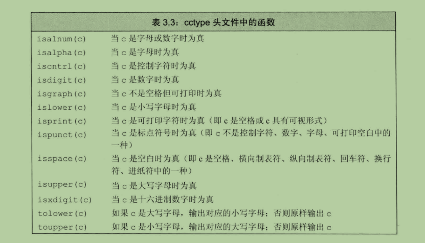

以上函数全部需要`#include <cctype>`用法：

```c++
#include <cctype>

std::string str_tolower(std::string s) {
    std::transform(s.begin(), s.end(), s.begin(),
        // static_cast<int(*)(int)>(std::tolower)         // wrong
        // [](int c){ return std::tolower(c); }           // wrong
        // [](char c){ return std::tolower(c); }          // wrong
        [](unsigned char c) { return std::tolower(c); } // correct
    );
    return s;
}

int main() {
    std::string s = "ABCD";
    std::cout << str_tolower(s) << std::endl;
}

输出：
abcd
```

>注：**使用C++版本的C库文件**
>
>对于C库头文件的C++版本，需要将 #include "ctype.h" 写法改为 #include \<cctype>，即在原名字前面加 c 前缀。

### 3.3 标准库类型vector

* vector是一种容器，因为它可以容纳其它的对象。
* vector的内部实现是使用**类模板**来实现的，创建vector对象的过程就是**模板实例化**的过程。

### 3.4 迭代器介绍

**迭代器运算符**


**迭代器用法**

```c++
std::vector<int> vec;

vec.begin();		// 指向第一个元素
vec.end();		// 指向最后一个元素的下一个位置

vector<int>::iterator it;	// 迭代器的类型
vector<int>::const_iterator it2;	// const迭代器
```

### 3.5 数组

#### 3.5.1 数组定义和初始化

数组定义时数组大小必须是常量表达式，编译期已知的值。

```c++
unsigned cnt = 42;		// 非常量表达式
constexpr unsigned sz = 42;	// 常量表达式
int arr[10];	// 含有10个整数的数组
int* parr[sz];	// 含有42个整型指针的数组
string bad[cnt];	// error, cnt不是常量表达式
```

> **建议：**尽量使用vector和string，而不使用数组和指针。

## 第四章 表达式

### 4.1 基础

#### 左值和右值

* 左值可以位于赋值语句的左侧，右值则不能。
* 当一个对象被用作右值的时候，用的是对象的值（内容）；当对象被用作左值的时候，用的是对象的身份（在内存中的位置）。

### 运算符优先级表

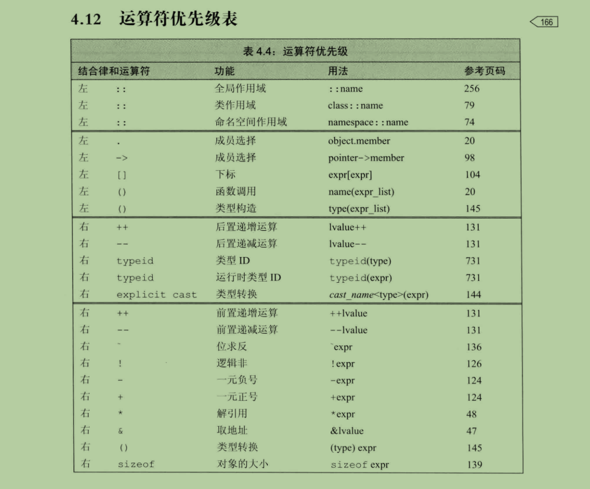

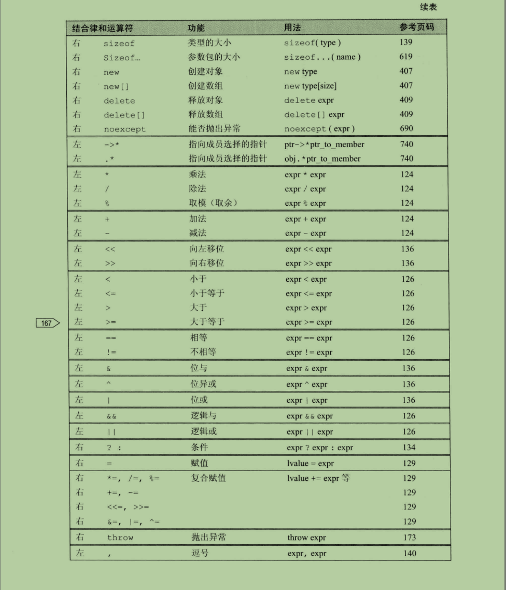


## C++ switch 语句

一个 **switch** 语句允许测试一个变量等于多个值时的情况。每个值称为一个 case，且被测试的变量会对每个 **switch case** 进行检查。

#### 语法

C++ 中 **switch** 语句的语法：

```c++
switch(expression){
    case constant-expression  :
       statement(s);
       break; // 可选的
    case constant-expression  :
       statement(s);
       break; // 可选的
  
    // 您可以有任意数量的 case 语句
    default : // 可选的
       statement(s);
}
```

**switch** 语句必须遵循下面的规则：

- **switch** 语句中的 **expression** 必须是一个**整型或枚举类型**，或者是一个 class 类型，其中 class 有一个单一的转换函数将其转换为整型或枚举类型。
- 在一个 switch 中可以有任意数量的 case 语句。每个 case 后跟一个要比较的值和一个冒号。
- case 的 **constant-expression** 必须与 switch 中的变量具有相同的数据类型，且必须是一个常量或字面量。
- 当被测试的变量等于 case 中的常量时，case 后跟的语句将被执行，直到遇到 **break** 语句为止。
- 当遇到 **break** 语句时，switch 终止，控制流将跳转到 switch 语句后的下一行。
- 不是每一个 case 都需要包含 **break**。如果 case 语句不包含 **break**，控制流将会 *继续* 后续的 case，直到遇到 break 为止。
- 一个 **switch** 语句可以有一个可选的 **default** case，出现在 switch 的结尾。default case 可用于在上面所有 case 都不为真时执行一个任务。default case 中的 **break** 语句不是必需的。

#### 流程图


## **C语言**

### 1、C实现封装、继承和多态

提到面向对象编程，我们想到的就是封装、继承、多态，但是其实这几个特性并不是只有面向对象语言才能实现，面向过程的C语言也是可以支持实现这三个特性的，下面我们来具体看下

**封装**

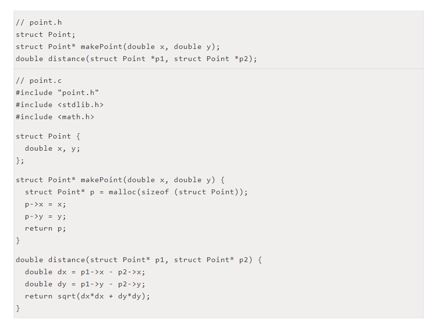

这样使用 `point.h` 的程序就不知道 Point 的内部结构，实现了数据的封装，外部只能使用声明的两个函数，如：

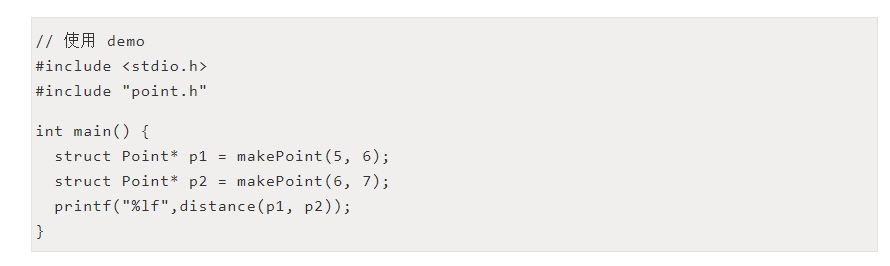

**继承**

接着上面的代码

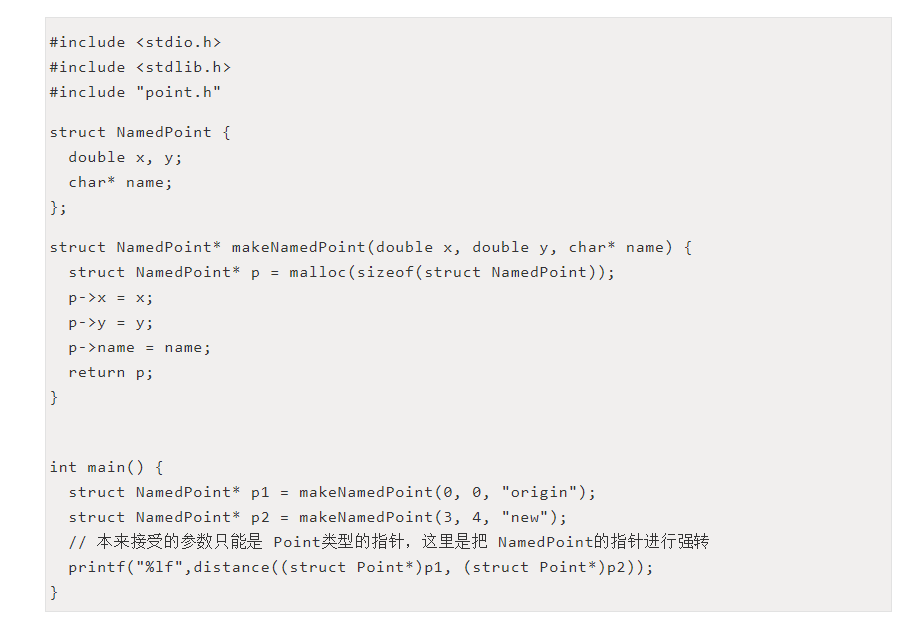

这是能够进行强转调用，是因为 NamedPoint 结构体的前两个成员的顺序与 Point 结构体的完全一致，所以可以进行强转，这其实就可以算是一个单继承。

**多态**

最后我们来看一下多态，这个C语言也是可以实现的，通过使用函数指针

先看一个简单的例子

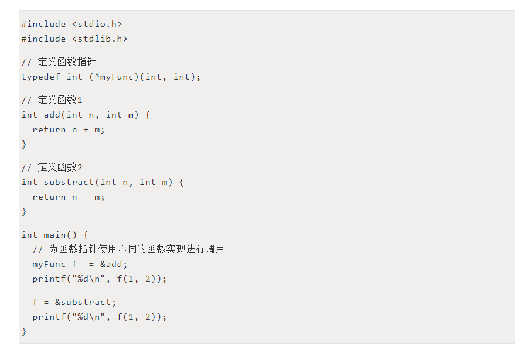

上面的例子如果大家感受还不太明显的话，接下来看一个 redis 源码中的使用

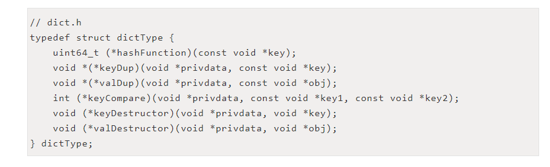

上面这个结构中都是函数指针，可以类比为 Java 中的接口及对应函数声明

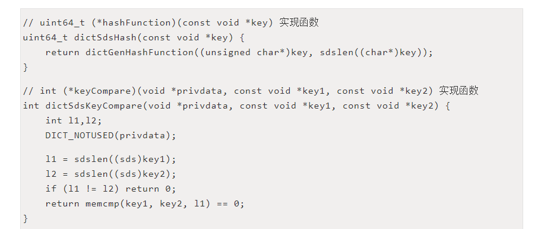

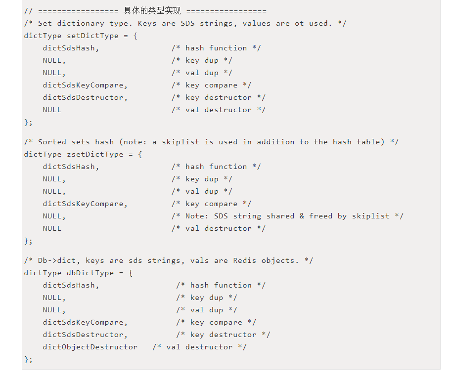

这几个类型都可以类比看做上面的接口的具体实现类，每个类有自己对应的函数实现。

所以不是使用了面向对象的语言，写出的代码就是面向对象的，而使用了面向过程的语言写出来的代码就不行，只不过面向对象的语言对面向对象提供了更好的支持，写起来更方便，更安全而已。代码质量的好坏不是仅仅靠使用了什么高级语言就可以的，要想提升代码质量还是需要我们去不断思考和实践的。

### 2、\__restrict__关键字作用

**概述**

关键字restrict只用于限定指针，表明本指针是访问一个数据对象的惟一且初始的方式。该关键字只用于修饰指针，功能是帮助[编译器](https://so.csdn.net/so/search?q=编译器&spm=1001.2101.3001.7020)进行优化！值得注意的是，优化需要就事论事，经过分析：如果发现确实优化不了，就不优化了。不加restrict关键字修饰的指针，编译器一定不进行优化！

举例：

restrict int* p1 = (int*)malloc(10 * sizeof(int));

p1存在restrict修饰,含义就是p1所指向的空间只会由p1去修改。

**目的**

关键字的用意是充分发挥多处理器（CPU只有1个）的并行性。并行的含义就和下面这句古文的含义很类似。注意和并发作区别。

并发是基于时间片轮转的，故而从宏观上看，各个进（线）程是一起运行的，微观上是串行的。并行就像是多向车道一样（车道数目------核数），各个进（线）程运行互不干扰。
**优化循环**

```c
void add(const double *x, const double *y, double *res)
{
    int i;
    for(i = 0; i < 6; ++i)
         res[i]= x[i] + y[i];
}
```

> 情形一二的前提：假设数组x和数组y内存无重叠，但是数组x和数组res内存有重叠：

什么情况下不能进行优化？

内存存在重叠的情况下是不能优化的。

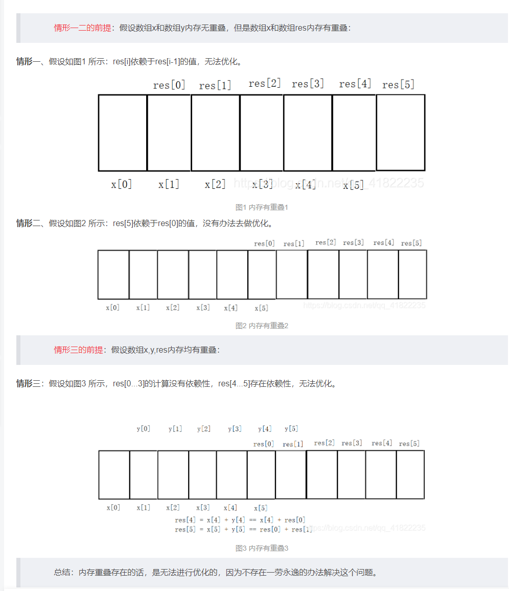

最理想的情形：

假设x,y,res三者指向的内存空间不会重叠， 如果这个函数将在多处理器的环境下执行，编译器可能会做这样的优化：把一个循环拆成两个循环，一个处理器计算res[0...2]，另一个处理器计算res[3...5]，两个处理器可以同时工作，使计算时间理论上缩短一半，同时保证了结果的正确性。如果程序员已经能够保证内存不重叠的话，就有必要指定restrict允许编译器进行优化。
————————————————
版权声明：本文为CSDN博主「楚楚可薇」的原创文章，遵循CC 4.0 BY-SA版权协议，转载请附上原文出处链接及本声明。
原文链接：https://blog.csdn.net/qq_41822235/article/details/83479562

### 3、用预处理指令#define 声明一个常数，用以表明1年中有多少秒

用预处理指令#define 声明一个常数，用以表明1年中有多少秒（忽略闰年问题）

```c
#define SEC_YEAR  (365*24*60*60)UL
```

考察点：

1. `#define` 语法的基本知识（例如：不能以分号结束，括号的使用，等等）
2. 懂得预处理器将为你计算常数表达式的值，因此，直接写出你是如何计算一年中有多少秒而不是计算出实际的值，是更清晰而没有代价的。
3. 意识到这个表达式将使一个16位机的整型数溢出-因此要用到长整型符号L,告诉编译器这个常数是的长整型数
4. 如果你在你的表达式中用到UL（表示无符号长整型），那么你有了一个好的起点。记住，第一印象很重要。


### 两个变量a和b，不允许使用条件判断符，找出较大值

- （a+b + abs(b-a)）/2


### ++i和i++的区别

++i先自增1，再返回，i++先返回i,再自增1

**更深层次：**

当然，就C语言代码来看，i++ 和 ++i 都只有一行，看起来似乎二者的执行效率一样了？其实不是的，在学习C语言时，教材和老师一般都会强调 i++ 和 ++i 的区别，例如下面这段C语言代码：

```c

int i , j, k;
i = 0;
j = i++;
i = 0;
k = ++i;
```

这段C语言代码执行后，j 和 k 的值并不相等：j 等于 0，k 等于 1。既然执行结果有差异，那么执行效率很有可能也是有差异的，事实的确如此。查看上述C语言代码对应的汇编代码，如下：

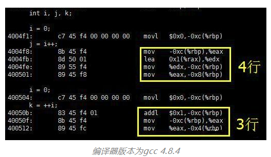

可见，j=i++; 计算机需要 4 条指令来解释，比执行 k=++i; 多出了一条指令。多出的一条指令为：在对 i 执行自加操作之前，先保存 i 的当前值留作稍后使用（赋值为j）。

**这是怎么回事呢？****不同的编译器结果还不一样呢？**

**而且这样看来，似乎 ++i 的执行效率比 i++ 高一些？**

那为了写出效率更高的C语言程序，以后是不是应该尽量使用 ++i，而不是 i++ 了呢？例如下面这样的C语言代码：

```c

for(i=0; i<10; i++);
for(i=0; i<10; ++i);
```

是不是上面那行C语言代码的执行效率低于下面的呢？只能说理论如此，实际上，现代C语言编译器已经足够聪明，它会根据上下文编译C语言代码。

应该明白，i++ 和 ++i 的效率差异主要来自于处理 i++ 时，需要先保存 i 的当前值留作稍后使用。如果之后没有人使用 i 的当前值，也就是说没有C语言代码读取 i++ 的值，编译器实在没有必要保存 i 的当前值了，因此就会将这一步优化掉。

为了便于分析，我们编写下面这样的C语言代码：

```c
int i = 0;
i++;
++i;
```

与上面的例子相比，区别在于在执行 i++ 时，没有人关心 i 的当前值了。查看这段C语言代码对应的汇编代码：

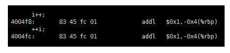

显然，i++ 和 ++i 对应的指令是一模一样的，不再有执行效率上的差异。

C语言中的 i++ 和 ++i 是有区别的，这就有可能带来效率上的差异。如果有代码关心 i++ 执行时的 i 当前值，程序在对 i 进行自加操作时，将不得不先保存 i 的当前值，而 ++i 就无需保存当前值，这就会带来效率上的差异。如果没人关心 i++ 的当前值，那么现代大多数C语言编译器将会将这一差异优化掉，此时 i++ 和 ++i 不再有效率上的差异。


### 写一个"标准"宏MIN ，这个宏输入两个参数并返回较小的一个

```c
#define MIN(a,b)  ((a)<=(b)?(a):(b))
```

考察点：

1. 标识#define在宏中应用的基本知识。这是很重要的。因为在 嵌入(inline)操作符 变为标准C的一部分之前，宏是方便产生嵌入代码的唯一方法，对于嵌入式系统来说，为了能达到要求的性能，嵌入代码经常是必须的方法。
2. 懂得在宏中小心地把参数用括号括起来
3. 我也用这个问题开始讨论宏的副作用，例如：当你写下面的代码时会发生什么事？

```c
   least = MIN(*p++, b);
```

宏定义的作用结果`MIN(*p++,b) ((*p++)<(b)?(*p++),b)` 指针p会做两次自增操作

如何消除宏的副作用

```c
#include <stdio.h>
#define min_i(x,y)    ((x)<=(y)?(x):(y))      //（1）
#define min_t(type,x,y) ({type _x = x;\       //（2）
                        type _y = y;\
                        _x<_y?_x:_y;\
                        })
#define min(x,y)    {const typeof(x)  _x = (x);\  //（3）
                    const typeof(y) _y = (y);\
                    (void)(&_x=&_y);\      //（4）
                    _x<_y?_x:_y;\
                    })

int main()
{
    int a = 10;
    int b = 20;
    printf("min_i(a++,b++)=%d\n",min_i(a++,b++));  //11
    printf("a=%d\n",a);  //12
    printf("b=%d\n",b);  //21

    a=10;
    b=20;
    printf("min_t(int,a++,b++)=%d\n",min_t(int,a++,b++));  //10
    printf("a=%d\n",a);  //11
    printf("b=%d\n",b);  //21

    a=10;
    b=20;
    printf("min(a++,b++)=%d\n",min(a++,b++));  //10
    printf("a=%d\n",a);  //11
    printf("b=%d\n",b);  //21
  
}
```

1. 这个定义计算x和y分别两次（x和y中的小者被计算两次)，当参数由副作用时，将产生不正确的结果
2. 使用语句表达式只计算参数一次，避免了可能的错误，语句表达式通常用于宏定义
3. typeof(x)表示x的值类型
4. 检查参数x和y的类型是否相同(如果x和y的类型不同编译器将会发出warning，并不影响后面语句的运行


### 预处理器标识#error的目的是什么？

编译程序时，只要遇到 #error 就会跳出一个编译错误，既然是编译错误，要它干嘛呢？其目的就是保证程序是按照你所设想的那样进行编译的。

下面举个例子：程序中往往有很多的预处理指令

```
#ifdef XXX
  ...
#else
  ...
#endif
```

当程序比较大时，往往有些宏定义是在外部指定的（如makefile），或是在系统头文件中指定的，当你不太确定当前是否定义了 XXX 时，就可以改成如下这样进行编译：

```
#ifdef XXX
...
#error "XXX has been defined"
#else

#endif
```

这样,如果编译时出现错误,输出了`XXX has been defined`,表明宏`XXX`已经被定义了。


### 内联函数inline与宏定义的区别？

**①内联函数在运行时可以进行调试，而宏定义不能。**

**②编译器会对内联函数的参数做类型安全检查或类型转换（同普通函数），而宏定义不会。**

**③内联函数可以访问类的成员变量，而宏定义不能。**

**④在类中声明的同时定义的成员函数，自动转换成内联函数。**

**注：**在内联函数中如果有复杂的操作，如递归调用、循环等，将不被内联。


### 如何打印出当前源文件的文件名和当前行号

- cout << __FILE__ << ends << __LINE__ << endl;
- __FILE__&__LINE__是系统预定义宏，这种宏并不是在某个文件中定义的，而是由编译器定义的


### 怎么样用C编写死循环

```
while(1)
{}

for(;;)
{}

loop:...
 
goto loop;
```


### 用变量a给出下面的定义

- a) 一个整型数（An integer）
- b)一个指向整型数的指针（ A pointer to an integer）
- c)一个指向指针的的指针，它指向的指针是指向一个整型数（ A pointer to a pointer to an intege）
- d)一个有10个整型数的数组（ An array of 10 integers）
- e) 一个有10个指针的数组，该指针是指向一个整型数的。（An array of 10 pointers to integers）
- f) 一个指向有10个整型数数组的指针（ A pointer to an array of 10 integers）
- g) 一个指向函数的指针，该函数有一个整型参数并返回一个整型数（A pointer to a function that takes an integer as an argument and returns an integer）
- h)  一个有10个指针的数组，该指针指向一个函数，该函数有一个整型参数并返回一个整型数 （ An array of ten pointers to functions that take an integer argument and return an integer ）

```c
a)int a;

b)int *a;

c)int **a;

d)int a[10]

e)int *a[10]

f)int (*a)[10]

g)int (*a)(int a)

h)int (*a[10])(int)
```


### 关键字static的作用是什么？

在C语言中，关键字static有三个明显的作用：

- **第一**、在修饰变量的时候，static修饰的静态局部变量只执行一次，而且延长了局部变量的生命周期，直到程序运行结束以后才释放。

- **第二**、static修饰全局变量的时候，这个全局变量只能在本文件中访问，不能在其它文件中访问，即便是extern外部声明也不可以。

- **第三**、static修饰一个函数，则这个函数的只能在本文件中调用，不能被其他文件调用。Static修饰的局部变量存放在全局数据区的静态变量区。初始化的时候自动初始化为0；

- - （1）不想被释放的时候，可以使用static修饰。比如修饰函数中存放在栈空间的数组。如果不想让这个数组在函数调用结束释放可以使用static修饰
  - （2）考虑到数据安全性（当程序想要使用全局变量的时候应该先考虑使用static）

\-------------------------------------------------------------------------

**在C++中static关键字除了具有C中的作用还有在类中的使用**在类中，static可以用来修饰静态数据成员和静态成员方法

**静态数据成员**

- （1）静态数据成员可以实现多个对象之间的数据共享，它是类的所有对象的共享成员，它在内存中只占一份空间，如果改变它的值，则各对象中这个数据成员的值都被改变。
- （2）静态数据成员是在程序开始运行时被分配空间，到程序结束之后才释放，只要类中指定了静态数据成员，即使不定义对象，也会为静态数据成员分配空间。
- （3）静态数据成员可以被初始化，但是只能在类体外进行初始化，若为对静态数据成员赋初值，则编译器会自动为其初始化为0。
- （4）静态数据成员既可以通过对象名引用，也可以通过类名引用。

**静态成员函数**

- （1）静态成员函数和静态数据成员一样，他们都属于类的静态成员，而不是对象成员。
- （2）非静态成员函数有this指针，而静态成员函数没有this指针。
- （3）静态成员函数主要用来方位静态数据成员而不能访问非静态成员。


### C 语言的关键字 static 和 C++ 的关键字 static 有什么区别

在 C 中 static 用来修饰局部静态变量和外部静态变量、函数。而 C++中除了上述功能外，还用来定义类的成员变量和函数。即静态成员和静态成员函数。

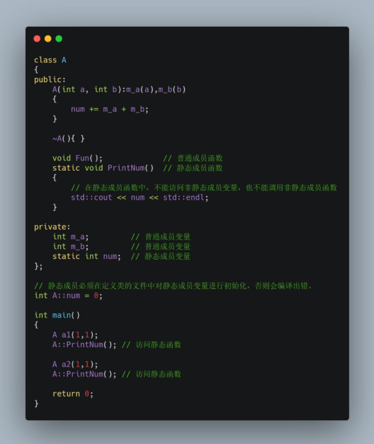


输出结果：

2
4

**01 静态成员变量**

普通成员变量每个对象有各自的一份，而静态成员变量一共就一份，为所有对象共享。

这里需要注意的是 sizeof 运算符不会计算静态成员变量的大小，如下栗子：

```cpp
class CTest
{
    int n;
    static int s;
};
```

则 sizeof(CTest) 等于 4


**02 静态成员函数**

普通成员函数必须具体作用于某个对象，而静态成员函数并不具体作用于某个对象。

因此**静态成员变量**和**静态成员函数**不需要通过对象就能访问，因为他是共享的。


**访问静态成员的方式** 

01 类名::成员名

```cpp
A::PrintNum();
```

02 对象名.成员名

```cpp
A a;
a.PrintNum();
```

03 指针->成员名

```cpp
A *p = new A();
p->PrintNum();
```

04 引用.成员名

```cpp
A a;
A & ref = a;
ref.PrintNum();
```


**小结** 

1. 静态成员变量本质上是全局变量，哪怕一个对象都不存在，类的静态成员变量也存在；

2. 静态成员函数本质上是全局函数；

3. 设置静态成员这种机制的目的是将和某些紧密相关的全局变量和函数写在类里面，看上去像是一个整体，易于维护和理解；

4. 在静态成员函数中，不能访问非静态成员变量，也不能调用非静态成员函数；

5. 静态成员必须在定义类的文件中对静态成员变量进行初始化，否则会编译出错。

**「注意」**：编程时 static 的记忆性，和全局性的特点可以让在不同时期调用的函数进行通信，传递信息，而 C++的静态成员则可以在多个对象实例间进行通信，传递信息。


### 全局变量和全局静态变量的区别

- 1）全局变量是不显式用 static 修饰的全局变量，全局变量默认是有外部链接性的，作用域是整个工程，在一个文件内定义的全局变量，在另一个文件中，通过 extern 全局变量名的声明，就可以使用全局变量。
- 2）全局静态变量是显式用 static 修饰的全局变量，作用域是声明此变量所在的文件，其他的文件即使用 extern 声明也不能使用。


### 静态数据的存储

**全局（静态）存储区**：分为 DATA 段和 BSS 段。

- DATA 段（全局初始化区）存放初始化的全局变量和静态变量；
- BSS 段（全局未初始化区）存放未初始化的全局变量和静态变量。程序运行结束时自动释放。
- 其中BSS段在程序执行之前会被系统自动清0，所以未初始化的全局变量和静态变量在程序执行之前已经为0。

存储在静态数据区的变量会在程序刚开始运行时就完成初始化，也是唯一的一次初始化。

在 C++ 中 static 的内部实现机制：静态数据成员要在程序一开始运行时就必须存在。因为函数在程序运行中被调用，所以静态数据成员不能在任何函数内分配空间和初始化。

这样，它的空间分配有三个可能的地方，一是作为类的外部接口的头文件，那里有类声明；二是类定义的内部实现，那里有类的成员函数定义；三是应用程序的 main() 函数前的全局数据声明和定义处。

静态数据成员要实际地分配空间，故不能在类的声明中定义（只能声明数据成员）。类声明只声明一个类的"尺寸和规格"，并不进行实际的内存分配，所以在类声明中写成定义是错误的。它也不能在头文件中类声明的外部定义，因为那会造成在多个使用该类的源文件中，对其重复定义。

static 被引入以告知编译器，将变量存储在程序的静态存储区而非栈上空间，静态数据成员按定义出现的先后顺序依次初始化，注意静态成员嵌套时，要保证所嵌套的成员已经初始化了。消除时的顺序是初始化的反顺序。

**优势：**可以节省内存，因为它是所有对象所公有的，因此，对多个对象来说，静态数据成员只存储一处，供所有对象共用。静态数据成员的值对每个对象都是一样，但它的值是可以更新的。只要对静态数据成员的值更新一次，保证所有对象存取更新后的相同的值，这样可以提高时间效率。


### Ｃ 语言的 malloc 和 Ｃ＋＋ 中的 new 有什么区别

- new 、delete 是操作符，可以重载，可以自定义内存分配策略，不做内存分配，甚至分配到非内存设备上，只能在C++ 中使用。
- malloc、free 是函数，可以覆盖，C、C++ 中都可以使用。
- new 可以调用对象的构造函数，对应的delete 调用相应的析构函数。
- malloc 仅仅分配内存，free 仅仅回收内存，并不执行构造和析构函数
- new 、delete 返回的是某种数据类型指针，malloc、free 返回的是void 指针。
- new类型是安全的，而malloc不是。例如int *p = new float[2];就会报错；而int p = malloc(2sizeof(int))编译时编译器就无法指出错误来。
- malloc/free需要库文件stdlib.h的支持，new/delete则不需要！

**「注意」**：malloc 申请的内存空间要用free 释放，而new 申请的内存空间要用delete 释放，不要混用。

**「注意」**：delete和free被调用后，内存不会立即回收，指针也不会指向空，delete或free仅仅是告诉操作系统，这一块内存被释放了，可以用作其他用途。但是由于没有重新对这块内存进行写操作，所以内存中的变量数值并没有发生变化，出现野指针的情况。因此，释放完内存后，应该将该指针指向NULL。


### 在C++中，使用malloc申请的内存能否通过delete释放？使用new申请的内存能否用free？

不能，malloc /free主要为了兼容C，new和delete 完全可以取代malloc /free的。malloc /free的操作对象都是必须明确大小的。而且不能用在动态类上。new 和delete会自动进行类型检查和大小，malloc/free不能执行构造函数与析构函数，所以动态对象它是不行的。当然从理论上说使用malloc申请的内存是可以通过delete释放的。不过一般不这样写的。而且也不能保证每个C++的运行时都能正常。

### 关键字const有什么含意？

关键字const有什么含意？

只要一个变量前用const来修饰，就意味着该变量里的数据只能被访问，而不能被修改，也就是意味着const“只读”（readonly）。

规则：const离谁近，谁就不能被修改；

const修饰一个变量时，一定要给这个变量初始化，若不初始化，在后面也不能初始化。

**const作用**：

- 1：可以用来定义常量，修饰函数参数，修饰函数返回值 ，且被const修饰的东西，都受到强制保护，可以预防其它代码无意识的进行修改，从而提高了程序的健壮性（是指系统对于规范要求以外的输入能够判断这个输入不符合规范要求，并能有合理的处理方式。ps：即所谓高手写的程序不容易死）；
- 2：使编译器保护那些不希望被修改的参数，防止无意代码的修改，减少bug；
- 3：给读代码的人传递有用的信息，声明一个参数，是为了告诉用户这个参数的应用目的；

**const优点**：

- 1：编译器可以对const进行类型安全检查（所谓的类型安全检查，能将程序集间彼此隔离开来，这种隔离能确保程序集彼此间不会产生负面影响，提高程序的可读性）；
- 2：有些集成化的调试工具可以对const常量进行调试，使编译器对处理内容有了更多的了解，消除了一些隐患。eg：void hanshu（const int i）{.......}  编译器就会知道i是一个不允许被修改的常量
- 3：可以节省空间，避免不必要的内存分配，因为编译器通常不为const常量分配内存空间，而是将它保存在符号表中，这样就没有了存储于读内存的操作，使效率也得以提高；
- 4：可以很方便的进行参数的修改和调整，同时避免意义模糊的数字出现

### 关键字volatile有什么含意？并给出三个不同的例子。

一个定义为volatile的变量是说这变量可能会被意想不到地改变，这样，编译器就不会去假设这个变量的值了。精确地说就是，优化器在用到这个变量时必须每次都小心地重新读取这个变量的值，而不是使用保存在寄存器里的备份。下面是volatile变量的几个例子：

- 1：并行设备的硬件寄存器（如：状态寄存器）
- 2：一个中断服务子程序中会访问到的非自动变量(Non-automatic variables)
- 3：多线程应用中被几个任务共享的变量

### 一个参数可以既是const又是volatile吗

可以，用const和volatile同时修饰变量，表示这个变量在程序内部是只读的，不能改变的，只在程序外部条件变化下改变，并且编译器不会优化这个变量。每次使用这个变量时，都要小心地去内存读取这个变量的值，而不是去寄存器读取它的备份。

注意：在此一定要注意const的意思，const只是不允许程序中的代码改变某一变量，其在编译期发挥作用，它并没有实际地禁止某段内存的读写特性。

### 变量的位操作

嵌入式系统总是要用户对变量或寄存器进行位操作。给定一个整型变量a，写两段代码，第一个设置a的bit 3，第二个清除a 的bit 3。在以上两个操作中，要保持其它位不变。

考察点：

- 1：不知道如何下手。该被面者从没做过任何嵌入式系统的工作。

- 2：用bit fields。Bit fields是被扔到C语言死角的东西，它保证你的代码在不同编译器之间是不可移植的，同时也保证了的你的代码是不可重用的。

  最近不幸看到 Infineon为其较复杂的通信芯片写的驱动程序，它用到了bit fields因此完全对我无用，因为我的编译器用其它的方式来实现bit fields的。从道德讲：永远不要让一个非嵌入式的家伙粘实际硬件的边。

- 3：用 `#defines` 和 `bit masks` 操作。这是一个有极高可移植性的方法，是应该被用到的方法。最佳的解决方案如下：

```c
#define BIT3 (0x1 << 3)
static int a;

void set_bit3(void)
{
    a |= BIT3;
}
void clear_bit3(void)
{
    a &= ~BIT3;
}
```

### 整型值与变量地址的强制转换

嵌入式系统经常具有要求程序员去访问某特定的内存位置的特点。在某工程中，要求设置一绝对地址为0x67a9的整型变量的值为0xaa66。编译器是一个纯粹的ANSI编译器。写代码去完成这一任务。

**考察点**：

这一问题测试你是否知道为了访问一绝对地址把一个整型数强制转换（typecast）为一指针是合法的。

```c
int *ptr;
ptr = (int *)0x67a9;
*ptr = 0xaa55;

......

*(int *const)(0x67a9) = 0xaa66;
```

### C定义中断服务子程序(ISR)

中断是嵌入式系统中重要的组成部分，这导致了很多编译开发商提供一种扩展—让标准C支持中断。具代表事实是，产生了一个新的关键字  __interrupt。下面的代码就使用了__interrupt关键字去定义了一个中断服务子程序(ISR)，请评论一下这段代码的。

```c
__interrupt double compute_area (double radius)
{
    double area = PI * radius * radius;
    printf("\nArea = %f", area);
    return area;
}
```

考察点：

- 1：ISR 不能返回一个值。如果你不懂这个，那么你不会被雇用的。
- 2：ISR 不能传递参数。如果你没有看到这一点，你被雇用的机会等同第一项。
- 3：在许多的处理器/编译器中，浮点一般都是不可重入的。有些处理器/编译器需要让额处的寄存器入栈，有些处理器/编译器就是不允许在ISR中做浮点运算。此外，ISR应该是短而有效率的，在ISR中做浮点运算是不明智的。
- 4：与第三点一脉相承，printf()经常有重入和性能上的问题。如果你丢掉了第三和第四点，我不会太为难你的。不用说，如果你能得到后两点，那么你的被雇用前景越来越光明了。

### 无符号整数计算

下面的代码输出是什么，为什么？

```c
void foo(void)
{
    unsigned int a = 6;
    int b = -20;
    (a+b > 6) ? puts("> 6") : puts("<= 6");
}
```

考察点：

这 个问题测试你是否懂得C语言中的整数自动转换原则，我发现有些开发者懂得极少这些东西。

不管如何，这无符号整型问题的答案是输出是 ">6"。原因 是当表达式中存在有符号类型和无符号类型时所有的操作数都自动转换为无符号类型。

因此-20变成了一个非常大的正整数，所以该表达式计算出的结果大于6。这一点对于应当频繁用到无符号数据类型的嵌入式系统来说是丰常重要的。

如果你答错了这个问题，你也就到了得不到这份工作的边缘。

### 取0的补码

评价下面的代码片断：

```c
unsigned int zero = 0;
unsigned int compzero = 0xFFFF;
/*1's complement of zero */
```

考察点：

对于一个int型不是16位的处理器来说，上面的代码是不正确的。应编写如下：

```c
unsigned int compzero = ~0;
```

这一问题真正能揭露出应试者是否懂得处理器字长的重要性。在我的经验里，好的嵌入式程序员非常准确地明白硬件的细节和它的局限，然而PC机程序往往把硬件作为一个无法避免的烦恼。

到了这个阶段，应试者或者完全垂头丧气了或者信心满满志在必得。如果显然应试者不是很好，那么这个测试就在这里结束了。

但如果显然应试者做得不错，那么我就 扔出下面的追加问题，这些问题是比较难的，我想仅仅非常优秀的应试者能做得不错。提出这些问题，我希望更多看到应试者应付问题的方法，而不是答案。不管如何，你就当是这个娱乐吧...

### malloc(0)

尽管不像非嵌入式计算机那么常见，嵌入式系统还是有从堆（heap）中动态分配内存的过程的。

那么嵌入式系统中，动态分配内存可能发生的问题是什么？

这里，我期望应试者能提到内存碎片，碎片收集的问题，变量的持行时间等等。这个主题已经在ESP杂志中被广泛地讨论过了（主要是  P.J. Plauger, 他的解释远远超过我这里能提到的任何解释），回过头看一下这些杂志吧！让应试者进入一种虚假的安全感觉后，我拿出这么 一个小节目：下面的代码片段的输出是什么，为什么？

```c
char *ptr;
if ((ptr = (char *)malloc(0)) == NULL)
  puts("Got a null pointer");
else
  puts("Got a valid pointer");
```

这 是一个有趣的问题。最近在我的一个同事不经意把0值传给了函数malloc，得到了一个合法的指针之后，我才想到这个问题。这就是上面的代码，该代码的输 出是"Got a valid pointer"。

我用这个来开始讨论这样的一问题，看看被面试者是否想到库例程这样做是正确。

**得到正确的答案固然重要，但解决问题的方法和你做决定的基本原理更重要些。**

### typedef的好处

Typedef 在C语言中频繁用以声明一个已经存在的数据类型的同义字。也可以用预处理器做类似的事。例如，思考一下下面的例子：

```c
#define dPS struct s *
typedef struct s * tPS;
```

以上两种情况的意图都是要定义`dPS` 和 `tPS` 作为一个指向结构s指针。哪种方法更好呢？（如果有的话）为什么？

考察点：

这是一个非常微妙的问题，任何人答对这个问题（正当的原因）是应当被恭喜的。答案是：typedef更好。思考下面的例子：

```c
dPS p1,p2;
tPS p3,p4;
```

第一个扩展为

```
struct s * p1, p2;
```

上面的代码定义p1为一个指向结构的指针，p2为一个实际的结构，这也许不是你想要的。第二个例子正确地定义了p3 和p4 两个指针。

### a+++b

C语言同意一些令人震惊的结构,下面的结构是合法的吗，如果是它做些什么？

```c
int a = 5, b = 7, c;
c = a+++b;
```

**考察点**：

这个问题将作为这个测验的一个愉快的结尾。不管你相不相信，上面的例子是完全合乎语法的。问题是编译器如何处理它？水平不高的编译作者实际上会争论这个问题，根据最处理原则，编译器应当能处理尽可能所有合法的用法。因此，上面的代码被处理成：

```
c = a++ + b;
```

因此, 这段代码持行后a = 6, b = 7, c = 12。

- 如果你知道答案，或猜出正确答案，做得好。
- 如果你不知道答案，我也不把这个当作问题。我发现这个问题的最大好处是这是一个关于代码编写风格，代码的可读性，代码的可修改性的好的话题。

### 变量的声明和定义有什么区别

> 注意：变量声明是加extern的才叫变量声明。

变量的定义为变量分配地址和存储空间， 变量的声明不分配地址。一个变量可以在多个地方声明， 但是只在一个地方定义。加入extern 修饰的是变量的声明，说明此变量将在文件以外或在文件后面部分定义。

说明：很多时候一个变量，只是声明不分配内存空间，直到具体使用时才初始化，分配内存空间， 如外部变量。

```c
int main() 
{
   extern int A;
   //这是个声明而不是定义，声明A是一个已经定义了的外部变量
   //注意：声明外部变量时可以把变量类型去掉如：extern A;
   dosth(); //执行函数
}
int A; //是定义，定义了A为整型的外部变量
```

### 简述#ifdef、#else、#endif和#ifndef的作用

利用#ifdef、#endif将某程序功能模块包括进去，以向特定用户提供该功能。在不需要时用户可轻易将其屏蔽。

```c
#ifdef MATH
#include "math.c"
#endif
```

在子程序前加上标记，以便于追踪和调试。

```c
#ifdef DEBUG
printf ("Indebugging......!");
#endif
```

应对硬件的限制。由于一些具体应用环境的硬件不一样，限于条件，本地缺乏这种设备，只能绕过硬件，直接写出预期结果。

**「注意」**：虽然不用条件编译命令而直接用if语句也能达到要求，但那样做目标程序长（因为所有语句都编译），运行时间长（因为在程序运行时间对if语句进行测试）。而采用条件编译，可以减少被编译的语句，从而减少目标程序的长度，减少运行时间。

### 结构体struct可以直接赋值吗

声明时可以直接初始化，同一结构体的不同对象之间也可以直接赋值，但是当结构体中含有指针“成员”时一定要小心。

**「注意」**：当有多个指针指向同一段内存时，某个指针释放这段内存可能会导致其他指针的非法操作。因此在释放前一定要确保其他指针不再使用这段内存空间，否则会造成野指针。

### 结构体struct内存对齐问题

请写出以下代码的输出结果：

```c
#include<stdio.h>
struct S1
{
    int i:8;
    char j:4;
    int a:4;
    double b;
};
 
struct S2
{
    int i:8;
    char j:4;
    double b;
    int a:4;
};
 
struct S3
{
    int i;
    char j;
    double b;
    int a;
};
 
int main()
{
    printf("%d\n",sizeof(S1));  // 输出8
    printf("%d\n",sizeof(S1);  // 输出12
    printf("%d\n",sizeof(Test3));  // 输出8
    return 0;
}
 
sizeof(S1)=16
sizeof(S2)=24
sizeof(S3)=32
```

**「说明」**：结构体作为一种复合数据类型，其构成元素既可以是基本数据类型的变量，也可以是一些复合型类型数据。对此，编译器会自动进行成员变量的对齐以提高运算效率。默认情况下，按自然对齐条件分配空间。各个成员按照它们被声明的顺序在内存中顺序存储，第一个成员的地址和整个结构的地址相同，向结构体成员中size最大的成员对齐。

许多实际的计算机系统对基本类型数据在内存中存放的位置有限制，它们会要求这些数据的首地址的值是某个数k（通常它为4或8）的倍数，而这个k则被称为该数据类型的对齐模数。

### 全局变量和局部变量有什么区别？是怎么实现的？操作系统和编译器是怎么知道的？

- 全局变量是整个程序都可访问的变量，谁都可以访问，生存期在整个程序从运行到结束（在程序结束时所占内存释放）；
- 而局部变量存在于模块（子程序，函数）中，只有所在模块可以访问，其他模块不可直接访问，模块结束（函数调用完毕），局部变量消失，所占据的内存释放。
- 操作系统和编译器，可能是通过内存分配的位置来知道的，全局变量分配在全局数据段并且在程序开始运行的时候被加载，局部变量则分配在堆栈里面。

### C语言的指针和引用和c++的有什么区别？

- 指针有自己的一块空间，而引用只是一个别名；
- 使用sizeof看一个指针的大小是4，而引用则是被引用对象的大小；
- 作为参数传递时，指针需要被解引用才可以对对象进行操作，而直接对引 用的修改都会改变引用所指向的对象；
- 可以有const指针，但是没有const引用；
- 指针在使用中可以指向其它对象，但是引用只能是一个对象的引用，不能被改变；
- 指针可以有多级指针（**p），而引用止于一级；
- 指针和引用使用++运算符的意义不一样；
- 如果返回动态内存分配的对象或者内存，必须使用指针，引用可能引起内存泄露。

### C语言的结构体和C++的类有什么区别

- C语言的结构体是不能有函数成员的，而C++的类可以有。
- C语言的结构体中数据成员是没有private、public和protected访问限定的。而C++的类的成员有这些访问限定。
- C语言的结构体是没有继承关系的，而C++的类却有丰富的继承关系。

**「注意」**：虽然C的结构体和C++的类有很大的相似度，但是类是实现面向对象的基础。而结构体只可以简单地理解为类的前身。


### 请你来说一下C++中struct和class的区别

在C++中，class和struct做类型定义是只有两点区别：

- 默认继承权限不同，class继承默认是private继承，而struct默认是public继承

- class还可用于定义模板参数，像typename，但是关键字struct不能同于定义模板参数 C++保留struct关键字，原因

  保证与C语言的向下兼容性，C++必须提供一个struct

- C++中的struct定义必须百分百地保证与C语言中的struct的向下兼容性，把C++中的最基本的对象单元规定为class而不是struct，就是为了避免各种兼容性要求的限制

- 对struct定义的扩展使C语言的代码能够更容易的被移植到C++中


### 指针常量与常量指针区别

指针常量是指定义了一个指针，这个指针的值只能在定义时初始化，其他地方不能改变。常量指针 是指定义了一个指针，这个指针指向一个只读的对象，不能通过常量指针来改变这个对象的值。指针常量强调的是指针的不可改变性，而常量指针强调的是指针对其所指对象的不可改变性。

**「注意」**：无论是指针常量还是常量指针，其最大的用途就是作为函数的形式参数，保证实参在被调用 函数中的不可改变特性。


### 如何理解函数指针

（1）定义：

函数指针是指向函数的指针变量。函数指针本身对象是一个指针变量，该指针变量指向一个具体的函数。这正如用指针变量可指向整型变量、字符型、数组⼀样，这里是指向函数。

在编译时，每⼀个函数都有⼀个入口地址，该入口地址就是函数指针所指向的地址。有了指向函数的指针变量后，
可用该指针变量调用函数，就如同用指针变量可引用其他类型变量⼀样，在这些概念上是大体⼀致的。

（2）用途

调用函数和做函数的参数，比如回调函数

（3）示例

```c
char * fun(char * p) {…} // 函数fun
char * (*pf)(char * p); // 函数指针pf
pf = fun; // 函数指针pf指向函数fun
pf(p); // 通过函数指针pf调⽤函数fun
1234
```


### 回调函数的作用

当发生某种事件时，系统或者系统函数将会自动调用你定义的一段函数。

回调函数就相当于一个中断处理函数，由系统在符号你设定的条件时自动调用。为此，你需要做三件事：

- 声明
- 定义
- 设置触发条件

就是在你的函数中把你的回调函数名称转换为地址作为一个参数，以便于系统调用。

回调函数就是一个通过函数指针调用的函数。如果你把函数的指针（地址）作为参数传递给另外一个函数，当这个指针被用为调用它所指向的函数时，我们就说这是回调函数

从而可以把调⽤者与被调⽤者分开。调⽤者不关⼼谁是被调⽤者，所有它需知道的，只是存在⼀个具有某种特定原型、某些限制条件（如返回值为int）的被调⽤函数。


### 悬挂指针与野指针有什么区别？

- 野指针：**未初始化的指针叫做野指针**。⽤ gcc -Wall 编译, 会出现 used uninitialized 警告。
- 悬空指针：当指针指向的对象被释放，但是该指针没有任何改变，以至于其仍然**指向已经被回收的内存地址，这种情况下的指针叫做悬空指针**

无论是野指针还是悬空指针，都是指向无效内存区域(这里的无效指的是"不安全不可控")的指针。 访问"不安全可控"(invalid)的内存区域将导致"Undefined Behavior"


### 如何避免“野指针”

- 指针变量声明时没有被初始化。解决办法：指针声明时初始化，可以是具体的地址值，也可让它指向NULL。
- 指针p被free或者delete之后，没有置为NULL。解决办法：指针指向的内存空间被释放后指针应该指向NULL。
- 指针操作超越了变量的作用范围。解决办法：在变量的作用域结束前释放掉变量的地址空间并且让指针指向NULL。


### typedef 和define 有什么区别

- 用法不同：typedef 用来定义一种数据类型的别名，增强程序的可读性。define 主要用来定义 常量，以及书写复杂使用频繁的宏。
- 执行时间不同：typedef 是编译过程的一部分，有类型检查的功能。define 是宏定义，是预编译的部分，其发生在编译之前，只是简单的进行字符串的替换，不进行类型的检查。
- 作用域不同：typedef 有作用域限定。define 不受作用域约束，只要是在define 声明后的引用 都是正确的。
- 对指针的操作不同：typedef 和define 定义的指针时有很大的区别。

**「注意」**：typedef 定义是语句，因为句尾要加上分号。而define 不是语句，千万不能在句尾加分号。


### sizeof 和strlen 的区别

- sizeof是一个操作符，strlen是库函数。
- sizeof的参数可以是数据的类型，也可以是变量，而strlen只能以结尾为‘\0’的字符串作参数。
- 编译器在编译时就计算出了sizeof的结果，而strlen函数必须在运行时才能计算出来。并且sizeof计算的是数据类型占内存的大小，而strlen计算的是字符串实际的长度。
- 数组做sizeof的参数不退化，传递给strlen就退化为指针了

**sizeof操作符返回的是参数所占的内存数，而 strlen函数返回的是参数的字符串长度，不是所占用的内存的大小。需要注意的是，strlen函数的参数是字符串，并且必须以串结束符“\0”结尾。看看下面的代码。**

```c
#include<stdio.h>
#include<string.h>

int main(){
   char str[10] = "hello";
   printf("字符串的长度为：%d\n", strlen(str));
   printf("占用内存的大小为：%d\n", sizeof(str));
   return 0;
}
```

运行结果：

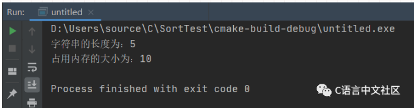

从运行结果可以发现，strlen和sizeof之间的区别在于，通过sizeof操作符得到的是定义的字符数组str占用的内存大小，而通过strlen函数得到的是对其进行初始化的字符长度。

当str是指针时，结果会是怎样的呢？

我们一起来看下面的代码

```c
#include<stdio.h>
#include<string.h>

int main(){
   char *str = "hello";
   printf("strlen(str) = %d\n", strlen(str));
   printf("sizeof(str) = %d\n", sizeof(str));
   printf("sizeof(*str) = %d\n", sizeof(*str));
   return 0;
}
```

运行结果：

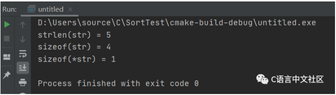

从运行结果发现，str占用内存的大小变为4，这是因为指针在32位计算机中占用4字节，所以其值为4，而接下来的sizeof(\*str)为1，这是因为*str表示字符串首地址的内容，在此就是字符H，占用内存大小为1字节。

### 简述strcpy、sprintf 与memcpy 的区别

- 操作对象不同，strcpy 的两个操作对象均为字符串，sprintf 的操作源对象可以是多种数据类型， 目的操作对象是字符串，memcpy 的两个对象就是两个任意可操作的内存地址，并不限于何种数据类型。
- 执行效率不同，memcpy 最高，strcpy 次之，sprintf 的效率最低。
- 实现功能不同，strcpy 主要实现字符串变量间的拷贝，sprintf 主要实现其他数据类型格式到字 符串的转化，memcpy 主要是内存块间的拷贝。

**「注意」**：strcpy、sprintf 与memcpy 都可以实现拷贝的功能，但是针对的对象不同，根据实际需求，来选择合适的函数实现拷贝功能。

### 请解析((void ()( ) )0)( )的含义

- void (*0)( ) ：是一个返回值为void，参数为空的函数指针0。
- (void (*)( ))0：把0转变成一个返回值为void，参数为空的函数指针。
- \*(void (\*)( ))0：在上句的基础上加*表示整个是一个返回值为void，无参数，并且起始地址为0的函数的名字。
- (\*(void (\*)( ))0)( )：这就是上句的函数名所对应的函数的调用。

### 写一个函数，确保在main函数执行前执行

```cpp
//第⼀种：gcc扩展，标记这个函数应当在main函数之前执⾏。同样有⼀个__attribute((destructor))，标记函数应当在程序结束之前（main结束之后，或者调⽤了exit后）执⾏;
__attribute((constructor))void before() {
    printf("before main 1\n");
}

//第⼆种：全局 static 变量的初始化在程序初始阶段，先于 main 函数的执⾏
int test1() {
    printf("before main 2\n");
    return 1;
}
static int i = test1();

// 第三种：利⽤ lambda 表达式
int a = []() {
    printf("before main 3\n");
    return 0;
}();


int main()
{
    printf("main function\n");
    return 0;
}
```

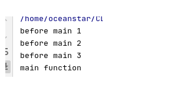

## **二、C++基础知识**

### C和C++的特点与区别？

答：（1）C语言特点：

1.作为一种面向过程的结构化语言，易于调试和维护；

2.表现能力和处理能力极强，可以直接访问内存的物理地址；

3.C语言实现了对硬件的编程操作，也适合于应用软件的开发；

4.C语言还具有效率高，可移植性强等特点。

（2）C++语言特点：

1.在C语言的基础上进行扩充和完善，使C++兼容了C语言的面向过程特点，又成为了一种面向对象的程序设计语言；

2.可以使用抽象数据类型进行基于对象的编程；

3.可以使用多继承、多态进行面向对象的编程；

4.可以担负起以模版为特征的泛型化编程。

C++与C语言的本质差别：在于C++是面向对象的，而C语言是面向过程的。或者说C++是在C语言的基础上增加了面向对象程序设计的新内容，是对C语言的一次更重要的改革，使得C++成为软件开发的重要工具。


### 说一说extern“C”

extern "C"的主要作用就是为了能够正确实现C++代码调用其他C语言代码。加上extern "C"后，会指示编译器这部分代码按C语言（而不是C++）的方式进行编译。由于C++支持函数重载，因此编译器编译函数的过程中会将函数的参数类型也加到编译后的代码中，而不仅仅是函数名；而C语言并不支持函数重载，因此编译C语言代码的函数时不会带上函数的参数类型，一般只包括函数名。

这个功能十分有用处，因为在C++出现以前，很多代码都是C语言写的，而且很底层的库也是C语言写的，为了更好的支持原来的C代码和已经写好的C语言库，需要在C++中尽可能的支持C，而extern "C"就是其中的一个策略。

- C++代码调用C语言代码
- 在C++的头文件中使用
- 在多个人协同开发时，可能有的人比较擅长C语言，而有的人擅长C++，这样的情况下也会有用到


### 如何判断程序是C程序还是CPP程序

根据宏__cplusplus

```cpp
#include <iostream>
using namespace std;
 
void main()
{
#ifdef __cplusplus
	cout << "c++" << endl;
#else
	cout << endl;
#endif
	system("pause");
}
```


### 指针和引用的区别是什么？

**指针：**是保存另一个变量内存地址的变量，指针通过 * 访问保存的内存地址所指向的值；

**引用：**是另一个变量的别名，一旦被初始化就不能被改变，引用可以认为是一个具有自动间接性的常量指针，相当于编译器帮助实现了自动间接性取值，即：编译器帮助加上了 * 。引用内部实现为指针。

指针是在 C 语言中就已存在，功能非常强大，但是许多的不安全因素也都是指针导致的。引用是 C++ 中引入的概念，引用使用起来更加安全。

但是，C++引入引用的直接原因是支持 C++ 重载，来看下面一个例子：

```c++
//没有引用的情况下
void func1(const complex* x, const complex* y) 
    complex z = *x+*y;
    // ...
}
 
//有引用的情况下
void func2(const complex& x, const complex& y)
    complex z = x+y;
    // ...
}
```

可以看到，在引入引用后，两数相加更加合理，是无感知的，而没有引用的情况下，能明显看到和普通加法运算不同。

但指针和引用都有一个相同点：实现让一个变量对另一个变量的访问。

来通过一个简单例子加深下理解：

```c++
#include <iostream>
using namespace std;
 
int main() {
    int x = 10;
    int *p = &x;
    int &y = x;
 
    cout<<"*p = "<<*p<<endl;
    cout<<" y = "<<y<<endl;
}
```

输出为：

```
linuxy@linuxy:~/pointerRef$ g++ main.cpp -o main
linuxy@linuxy:~/pointerRef$ ./main
*p = 10
 y = 10
linuxy@linuxy:~/pointerRef$
```

上面的例子可以通过下图来理解： 

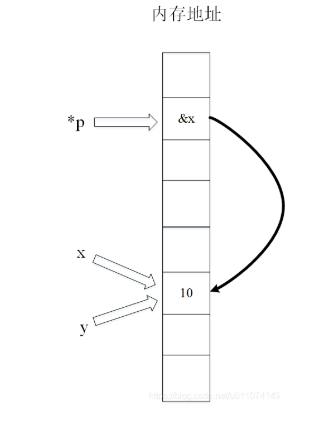

变量 p 存储 x 的地址，x 和 y 都是 10 的名称。

接下来详细的讲解一下区别。

- 因为引用可能会指向一个对象，因此，引用必须被初始化；而指针没有这样的限制

```cpp
string &pc;  //错误，引用必须被初始化
string *pc;  //未初始化的指针。合法但是危险
```

- 不存在指向空值的引用意味着使用引用的效率比指针要高，因为在使用引用之前不需要测试它的合法性。相反，指针应该总是被测试，防止其为空

```cpp
void printfDouble(const double &d){
    cout << rd;
}
 
void printfDouble(const double *pd){
    if(pd){
        cout << *pd;
    }
}
```

- 指针可以被重新赋值以指向另一个不同的对象，但是引用总是指向在初始化时被指定的对象，以后不能改变

```cpp
#include <iostream>
 
int main(){
    std::string s1("Nancy");
    std::string s2("Clancy");
    std::string &rs = s1;
    std::string *rp = &s1;
    rs = s2;   // rs仍然引用s1，但是s1现在的值是”Clancy“
    rp = &rs; // ps 现在指向s2，s1没有改变
}
```

指针和引用都是一种内存概念，区别在于，指针是一个实体，引用只是一个别名

在程序编译时，会将指针和引用添加到符号表中。

- 指针指向一块内存，指针的内容是所指向的内存的地址，在编译的时候，则是将“指针变量名-指针变量的地址”，所以说，指针包含的内容是可以改变的，允许拷贝和赋值，有const和非const的区别，甚至可以为空，sizeof指针得到的是指针类型的大小
- 而引用只是一块内存的别名，在添加到符号表的时候，是将“引用变量名-引用对象的地址”添加的符号表中，符号表一经完成就不能改变，所以引用必须而且只能在定义时被绑定到一块内存上，后继不能更改，也不能为空，也没有const和非const的区别。

sizeof引用得到代表对象的大小，sizeof引用得到的是指针本身的大小。另外在参数传递中，指针需要被解引用之后才可以对对象进行操作，而直接对引用进行的修改会直接作用到引用对象上。

作为参数时也不同，传指针的实质是传值，传递的值是指针的地址；传引用的实质是传地址，传递的是变量的地址。


### 何时使用指针，何时使用引用呢？

应该使用指针的情况：

- **有指向不存在对象的可能时**：在任何情况下都不能使用指向空值的引用。一个引用必须总是指向某些对象。因此，如果你使用一个变量时并让它指向一个对象，但是该对象在某些时候可能不指向任何对象，这时你应该把变量声明为指针，因为这样你可以赋空值给该变量
- **需要在不同时刻指向不同对象时**，使用指针，否则，总应该使用引用

- 打个比方。当你重载某个操作符时，应该使用引用（为了防止不必要的语义误解）。看个例子

```cpp
vector<int> v(10);
v[5] = 10;  
//如果operator []返回一个指针，那么v[5]就必须写成`*v[5] = 10`，这会使v看起来像一个向量指针
```

注：引用指向空值将导致未定义行为，请一定不要写这样的代码。比如：

```cpp
char *pc = 0;
char & rc = *pc;
```


### 对虚函数和多态的理解

多态的实现主要分为静态多态和动态多态，静态多态主要是重载，在编译的时候就已经确定；动态多态是用虚函数机制实现的，在运行期间动态绑定。举个例子：一个父类类型的指针指向一个子类对象时候，使用父类的指针去调用子类中重写了的父类中的虚函数的时候，会调用子类重写过后的函数，在父类中声明为加了virtual关键字的函数，在子类中重写时候不需要加virtual也是虚函数。

虚函数的实现：在有虚函数的类中，类的最开始部分是一个虚函数表的指针，这个指针指向一个虚函数表，表中放了虚函数的地址，实际的虚函数在代码段(.text)中。当子类继承了父类的时候也会继承其虚函数表，当子类重写父类中虚函数时候，会将其继承到的虚函数表中的地址替换为重新写的函数地址。使用了虚函数，会增加访问内存开销，降低效率。

### C++的多态

答：C++的多态性用一句话概括：在基类的函数前加上virtual关键字，在派生类中重写该函数，运行时将会根据对象的实际类型来调用相应的函数。如果对象类型是派生类，就调用派生类的函数；如果对象类型是基类，就调用基类的函数。

1）：用virtual关键字申明的函数叫做虚函数，虚函数肯定是类的成员函数；

2）：存在虚函数的类都有一个一维的虚函数表叫做虚表，类的对象有一个指向虚表开始的虚指针。虚表是和类对应的，虚表指针是和对象对应的；

3）：多态性是一个接口多种实现，是面向对象的核心，分为类的多态性和函数的多态性。；

4）：多态用虚函数来实现，结合动态绑定.；

5）：纯虚函数是虚函数再加上 = 0；

6）：抽象类是指包括至少一个纯虚函数的类；

纯虚函数：virtual void fun()=0;即抽象类，必须在子类实现这个函数，即先有名称，没有内容，在派生类实现内容。

### 虚函数实现

答：简单地说，每一个含有虚函数（无论是其本身的，还是继承而来的）的类都至少有一个与之对应的虚函数表，其中存放着该类所有的虚函数对应的函数指针。例：

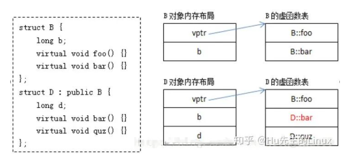

其中：

B的虚函数表中存放着B::foo和B::bar两个函数指针。

D的虚函数表中存放的既有继承自B的虚函数B::foo，又有重写（override）了基类虚函数B::bar的D::bar，还有新增的虚函数D::quz。

虚函数表构造过程：

从编译器的角度来说，B的虚函数表很好构造，D的虚函数表构造过程相对复杂。下面给出了构造D的虚函数表的一种方式（仅供参考）：

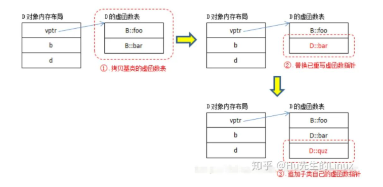

虚函数调用过程

以下面的程序为例：

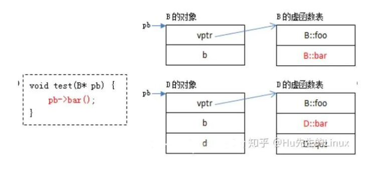

### 虚函数可以是内联函数吗？

- 虚函数可以是内联函数，内联是可以修饰虚函数的，但是当虚函数表现动态性时就不能内联
- 内联是在编译器建议编译器内联，而虚函数的多态性在运行期间，编译器无法知道运行期调用哪个代码，因此虚函数表现为多态性（运行期）不可以内联
- inline virtual唯一可以内联的时候：编译器知道所调用的对象是哪个类（如 Base::who()），这只有在编译器具有实际对象而不是对象的指针或者引用时才会发生

代码实例如下：

```cpp
#include <iostream>
using namespace std;
// 基类
class Base{
public:
    inline virtual void who(){
        cout << "I am Base\n";
    }
    virtual ~Base(){}
};
// 派生类
class Derived:public Base{
public:
    inline void who(){   // 不写inline时隐式内联
        cout << "I am Derived\n";
    }
};
int  main(){
    // 此处的虚函数 who()，是通过类（Base）的具体对象（b）来调用的，编译期间就能确定了，所以它可以是内联的，但最终是否内联取决于编译器。
    Base b;
    b.who();
    // 此处的虚函数是通过指针调用的，呈现多态性，需要在运行时期间才能确定，所以不能为内联。
    Base *bptr = new Derived();
    bptr->who();
    // 因为Base有虚析构函数（virtual ~Base() {}），所以 delete 时，会先调用派生类（Derived）析构函数，再调用基类（Base）析构函数，防止内存泄漏。
    delete bptr;
    bptr = nullptr;
    return 0;

}
```


### 内存的分配方式有几种

- 从静态存储区域分配：

内存在程序编译时就已经分配好，这块内存在程序的整个运行期间都存在。速度快、不容易出错， 因为有系统会善后。例如全局变量，static 变量，常量字符串等。

- 在栈上分配：

在执行函数时，函数内局部变量的存储单元都在栈上创建，函数执行结束时这些存储单元自动被释 放。栈内存分配运算内置于处理器的指令集中，效率很高，但是分配的内存容量有限。大小为2M。

- 从堆上分配：

即动态内存分配。程序在运行的时候用 malloc 或new 申请任意大小的内存，程序员自己负责在何 时用free 或delete 释放内存。动态内存的生存期由程序员决定，使用非常灵活。如果在堆上分配了空间，就有责任回收它，否则运行的程序会出现内存泄漏，另外频繁地分配和释放不同大小的堆空间将会产生 堆内碎块。

一个C、C++程序编译时内存分为5 大存储区：堆区、栈区、全局区、文字常量区、程序代码区。


### C和C++内存分配问题

答：

**（1）C语言编程中的内存基本构成**

C的内存基本上分为4部分：静态存储区、堆区、栈区以及常量区。他们的功能不同，对他们使用方式也就不同。

1.栈 ——由编译器自动分配释放；

2.堆 ——一般由程序员分配释放，若程序员不释放，程序结束时可能由OS回收；

3.全局区（静态区）——全局变量和静态变量的存储是放在一块的，初始化的全局变量和静态变量在一块区域，未初始化的全局变量

和未初始化的静态变量在相邻的另一块区域（C++中已经不再这样划分），程序结束释放；

4.另外还有一个专门放常量的地方，程序结束释放；

(a)函数体中定义的变量通常是在栈上；

(b)用malloc, calloc, realloc等分配内存的函数分配得到的就是在堆上；

(c)在所有函数体外定义的是全局量；

(d)加了static修饰符后不管在哪里都存放在全局区（静态区）；

(e)在所有函数体外定义的static变量表示在该文件中有效，不能extern到别的文件用；

(f)在函数体内定义的static表示只在该函数体内有效；

(g)另外，函数中的"adgfdf"这样的字符串存放在常量区。

**（2）C++编程中的内存基本构造**

在C++中内存分成5个区，分别是堆、栈、全局/静态存储区、常量存储区和代码区；

1、栈，就是那些由编译器在需要的时候分配，在不需要的时候自动清除的变量的存储区，里面的变量通常是局部变量、函数参数等。

2、堆，就是那些由new分配的内存块，他们的释放编译器不去管，由我们的应用程序去控制，一般一个new就要对应一个delete。如果程序员没有释放掉，那么在程序结束后，操作系统会自动回收。

3、全局/静态存储区，全局变量和静态变量被分配到同一块内存中，在以前的C语言中，全局变量又分为初始化的和未初始化的，在C++里面没有这个区分了，他们共同占用同一块内存区。

4、常量存储区，这是一块比较特殊的存储区，他们里面存放的是常量，不允许修改（当然，你要通过非正当手段也可以修改）。

5、代码区 （.text段），存放代码（如函数），不允许修改（类似常量存储区），但可以执行（不同于常量存储区）。

内存模型组成部分：自由存储区，动态区、静态区；

根据c/c++对象生命周期不同，c/c++的内存模型有三种不同的内存区域，即：自由存储区，动态区、静态区。

自由存储区：局部非静态变量的存储区域，即平常所说的栈；

动态区：用new ，malloc分配的内存，即平常所说的堆；

静态区：全局变量，静态变量，字符串常量存在的位置；

注：代码虽然占内存，但不属于c/c++内存模型的一部分；


**一个正在运行着的C编译程序占用的内存分为5个部分：代码区、初始化数据区、未初始化数据区、堆区 和栈区；**

（1）代码区（text segment）：代码区指令根据程序设计流程依次执行，对于顺序指令，则只会执行一次（每个进程），如果反复，则需要使用跳转指令，如果进行递归，则需要借助栈来实现。注意：代码区的指令中包括操作码和要操作的对象（或对象地址引用）。如果是立即数（即具体的数值，如5），将直接包含在代码中；

（2）全局初始化数据区/静态数据区（Data Segment）：只初始化一次。

（3）未初始化数据区（BSS）：在运行时改变其值。

（4）栈区（stack）：由编译器自动分配释放，存放函数的参数值、局部变量的值等，其操作方式类似于数据结构中的栈。

（5）堆区（heap）：用于动态内存分配。


**为什么分成这么多个区域？**

主要基于以下考虑：

* 代码是根据流程依次执行的，一般只需要访问一次，而数据一般都需要访问多次，因此单独开辟空间以方便访问和节约空间。

* 未初始化数据区在运行时放入栈区中，生命周期短。

* 全局数据和静态数据有可能在整个程序执行过程中都需要访问，因此单独存储管理。

* 堆区由用户自由分配，以便管理。


### 栈区与堆区的区别

（1）栈区（stack）：

* 由编译器进行管理，在需要时由编译器自动分配空间，在不需要时自动回收空间，一般保存的是局部变量和函数参数等。

* 一般来说，CPU有专门的指令可以用于入栈和出栈的操作。当一个函数被调用时，就会有指令把当前指令的地址压入栈内保存起来，然后跳转到被调用的函数执行。函数返回的时候，就会把栈里面的指令地址弹出来继续执行。

* 它是连续的内存空间，在函数调用的时候，首先入栈的是下一条可以执行指令的地址，然后是函数逇各个参数
  大多数编译器中，参数是从右向左入栈（原因在于采用这种顺序，可以让程序员在使用C/C++的“函数参数长度可变”这个特性时更方便。如果从左向右压栈，第一个参数(即描述可变参数表各个变量的那个参数)将被放在栈底，由于可变参数函数的第一步就需要解析可变参数表的各个参数类型，即第⼀步就需要得到上述参数，因此，将它放在栈底是很不⽅便的。）

* 本地函数调用结束时，局部变量先出栈，然后是参数，最后是栈顶指针最开始存放的地址，程序由该点继续运行，不会产生碎片

* 栈是⾼地址向低地址扩展，栈低⾼地址，空间较⼩。

* 栈操作很快：

  * 数据存取的位置总是在栈顶而不需要寻找位置存放获取读取数据

  * 栈中的所有数据必须占用已知且固定的大小

  * 调用函数时，传递给函数的值[包括指向对上数据的指针]和函数的局部变量被压入栈中。

    

（2）堆区（heap）：

* 由程序员管理，需要⼿动 new malloc delete free 进⾏分配和回收，如果不进⾏回收的话，会造成内存泄漏的问题。
* 在编译时大小未知或者大小可能变化的数据，要存储到堆上
* 堆是为动态分配预留的内存空间，是不连续的，每个线程都有一个栈，但是每一个应用程序只有一个堆。
* 堆是缺乏组织的：当向堆放入数据时，需要请求一定大小的空间。操作系统在堆的某处找到一块足够大的空位，把它标记为已使用，并且返回一个表示该位置地址的指针。这个过程称为在堆上分配内存
* 返回的堆地址指针存放在栈中[因为指针的大小是已知并且固定的]
* 实际上系统中有一个空闲链表，当有程序申请的时候，系统遍历空闲链表找到第一个大于等于申请大小的空间分配给程序，一般在分配程序的时候，也会在空间头部写入内存大小，方便delete回收空间大小。当然，如果有剩余的，也会将剩余的插入到空闲链表中，这也是产生内存碎片的原因
* 堆是低地址向⾼地址扩展，空间交⼤，较为灵活。
* 访问堆上的数据比访问栈上的数据慢：
  * 因为必须通过指针来访问。现代CPU在内存中跳转越少就越快
  
  * 在堆上分配大量的空间也可能消耗时间

  * 注意它与数据结构中的堆是两回事，分配方式倒是类似于链表。

    
  

（3） 全局/静态存储区：分为初始化和非初始化两个相邻区域，存储初始化和未初始化的全局变量和静态变量，程序结束后由系统释放
（4）常量存储区：存储常量，比如字符串，一般不允许修改。程序结束后由系统释放
（5）代码区：存放程序的二进制代码


**栈区与堆区内存申请的区别**：
存储内容：栈存储局部变量、函数参数等。堆存储使用new、malloc申请的变量等
申请方式：栈内存由系统分配，堆内存由程序员申请
申请后系统的响应：
栈：只要栈的剩余空间大于所申请空间，系统将为程序提供内存，否则将报异常提示栈溢出
堆：首先应该知道操作系统有一个记录空闲内存地址的链表，当系统收到程序的申请时，会遍历该链表，寻找第一个空间大于所省去空间的堆节点，然后将该节点从空闲节点链表中删除，并将该节点的空间分配给程序
申请大小的显示：WindowsT栈的大小一般是2M,堆的容量较大；
申请效率的比较：栈由系统自动分配，速度较快。堆使用new、malloc等分配，比较慢
总结：栈区优势在于处理效率，堆区优势在于灵活


### 协程

答：定义：**协程是一种用户态的轻量级线程**。

协程拥有自己的寄存器上下文和栈。协程调度切换时，将寄存器上下文和栈保存到其他地方，在切回来的时候，恢复先前保存的寄存器上下文和栈。因此：协程能保留上一次调用时的状态（即所有局部状态的一个特定组合），每次过程重入时，就相当于进入上一次调用的状态，换种说法：进入上一次离开时所处逻辑流的位置；

线程是抢占式，而协程是协作式；

**协程的优点**：

* 跨平台

* 跨体系架构

* 无需线程上下文切换的开销

* 无需原子操作锁定及同步的开销

* 方便切换控制流，简化编程模型

* 高并发+高扩展性+低成本：一个CPU支持上万的协程都不是问题。所以很适合用于高并发处理。

**协程的缺点**：

* 无法利用多核资源：协程的本质是个单线程,它不能同时将 单个CPU 的多个核用上,协程需要和进程配合才能运行在多CPU；

* 进行阻塞（Blocking）操作（如IO时）会阻塞掉整个程序：这一点和事件驱动一样，可以使用异步IO操作来解决。

### RAII

> RAII维基百科解释：
>
> 资源获取即初始化( RAII ) 是一种编程习惯用法，在几种面向对象的静态类型编程语言中用于描述特定的语言行为。在 RAII 中，持有资源是类不变量，并且与对象生命周期相关联。资源分配（或获取）在对象创建（特别是初始化）期间由构造函数完成，而资源释放（释放）在对象销毁（特别是终结）期间由析构函数完成. 换句话说，资源获取必须成功，初始化才能成功。因此，资源被保证在初始化完成和终结开始之间被持有（持有资源是类不变量），并且只在对象处于活动状态时被持有。因此，如果没有对象泄漏，则没有资源泄漏。
>
> --wiki百科

> 【资源】关键词的解释：
>
> 在计算机系统中，【资源】是数量有限且对系统正常运行具有一定作用的元素。
>
> 比如：网络套接字、互斥锁、文件句柄和内存等等，它们属于系统资源。由于系统的资源是有限的，所以，我们在编程使用系统资源时，都必须遵循一个步骤： 
>
> 1 申请资源；
>
> 2 使用资源；
>
> 3 释放资源。
>
> 第一步和第三步缺一不可，因为资源必须要申请才能使用的，使用完成以后，必须要释放，如果不释放的话，就会造成资源泄漏。

**Resource acquisition is initialization** (**RAII**)术语是由Stroustrup 在C++中创造的。C++总是将所有的事情都交给程序员去做，包括GC(Garbage Collection)。

 以上是对RAII概念的一些铺垫。

 顾名思义，**资源获取是初始化**，其中所暗含下半句意思是，资源释放就是删除。**我一开始困惑于这句话中的初始化是什么意思**，其实想想也能理解，其实就是类的构造，我们将所有资源的申请放在构造函数里（构造函数里new），资源的释放放在析构函数里（析构函数里delete）。其本质是一种思想：资源谁申请，谁就负责销毁，将资源绑定到具有生存周期的变量上，申请的资源随着变量的生命周期（一般来说是由scope确定）的开始而申请资源，结束而释放资源，极大地减少了手动的去写成对的一些操作（**主要是**new和delete）。

  假设，我将算法封装在类中，运行这个算法可能需要申请一些额外的内存来存放中间数据，所以，我们在类构造(即initialization)时候申请(new)这些资源，在类析构时候释放(delete)这些资源。这样可以尽可能就保证了程序员忘记delete 而引起的内存泄露。


标准库提供了一些RAII的实现，最典型的是智能指针，我们资源放置在智能指针里，使用引用计数来管理资源是否析构，引用计数为0时，该资源析构。


RAII可以总结如下：

- 将每个资源封装到一个类中，其中

- - 构造函数获取资源并建立所有类不变量，如果无法完成则抛出异常，
  - 析构函数释放资源并且从不抛出异常；

- 我们始终通过 RAII 类的实例使用资源

- - 本身具有自动存储期限或临时生命周期，或
  - 具有受自动或临时对象的生命周期限制的生命周期

### RTTI

RTTI(Runtime Type Information)的内容要比RAII要晦涩一点。顾名思义，运行时类型信息，实际上我们在运行程序时，在变量的内部其实保留着变量的类型信息，这一步实际上是存在微弱的的性能开销，后文会讲到如何关闭。

首先我们必须要从一个实际的问题出发：

 ```cpp
 
 class A
 {
   virtual void printType() {};
 };
 class B:public A
 {
 
 };
 class C :public A
 {
 
 };
 int main()
 {
   A* a=new B();
   B* b = a;
   getchar();
 }
 ```

这种情况，我们常常会遇到，这实际上是多态的一个实现，子类B和子类C继承于A，B子类的指针可以赋予A类的指针（子类对象指针可以赋予父类指针），但问题来了，此时的a如何正确的转回它本来的类型B呢？

上述  B* b = a;实际上会产生编译错误“初始化”: 无法从“A *”转换为“B *”

有人可能会想到C-Style的强制转化类型,即

```cpp
int main()
{
  A* a=new B();
  // B* b = a;
  B* b = (B*)a;
  getchar();
}
```

ok，这样其实就能正确的编译通过了，与这样进行等价的C++Style的语句是

 ```cpp
 int main()
 {
   A* a=new B();
   // B* b = a;
   B* b = static_cast<B*>(a);// 等价于 B* b = (B*)a;
   getchar();
 }
 ```

但这样写是有风险的，a是B的类型的话，这样转换当然没有问题，但如果a实际上是C类型(A的另一个子类)的话，就会存在问题了

```cpp

int main()
{
  //A* a=new B();
  A* a=new C();
  //B* b = (B*)a;
  B* b = static_cast<B*>(a);
  getchar();
}
```

我们的这个问题模型比较简单，仅仅针对我们的例子可以一目了然，但当问题比较复杂时，这个问题实际上是很大可能存在错误的，当C类型的a无法转换为B类型的b时，会抛出异常，程序就崩溃啦！！！这其实是不安全的写法！！！

这时，RTTI的作用就可以凸显出来了

```c++
// 代码段1
int main()
{
  //A* a=new B();
  A* a=new C();
  //B* b = (B*)a;
  B* b = dynamic_cast<B*>(a);
  if (b)
  {
    std::cout << "转换成功！" << std::endl;//此时不会经过打印这句话
  }
  getchar();
}

// 代码段2
int main()
{
  A* a=new B();
  B* b = dynamic_cast<B*>(a);
  if (b)
  {
    std::cout << "转换成功！" << std::endl;//此时会经过打印这句话
    //紧接着使用b去做事情
    //......
  }
  getchar();
}
```

教科书告诉我们：

> dynamic_cast主要用于类层次间的上行转换和下行转换，还可以用于类之间的交叉转换。在类层次间进行上行转换时，dynamic_cast和static_cast的效果是一样的；在进行下行转换时，dynamic_cast具有类型检查的功能，比static_cast更安全。

dynamic_cast若不成功，则只是返回nullptr，而**不是抛出异常**。意思是当a确实是B类型时，才进行转换；当a不是B类型时，返回nullptr（就如上面的代码，a其实是C类型，并不会打印"转换成功！"语句），这样就保证了类转换的安全性。问题是，dynamic_cast怎么知道此时的a其实是C类型而不是B类型的呢？怎么实现的？

其实是借助运行时类型信息(RTTI)，**类的类型信息保存在虚表的第一项，若不存在虚表，则其类型信息就是其静态类型，而不是运行时类型。**

在vs中可以关闭运行时类型信息，右击文件->属性->c/c++->语言->启用运行时类型信息->选择否，应用

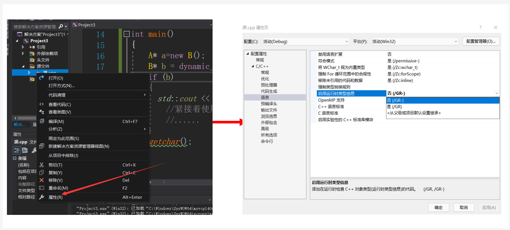

编译代码段2时，会抛出异常，如图所示：

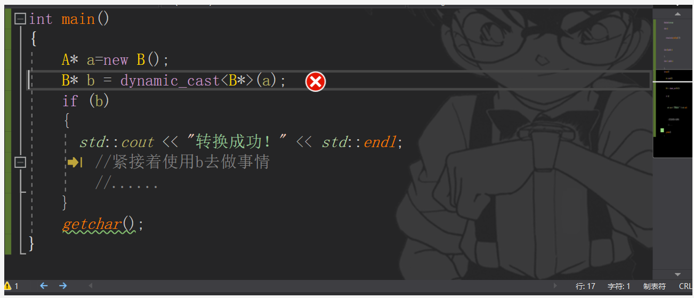

印证了我们想法的正确，此时没有运行时类型信息，或者说类型信息可能为空，则运行到dynamic_cast时，编译器无法进行判断，所以抛出异常。

当A中不存在虚函数时，又会怎样呢？

```cpp

#include<iostream>
class A
{
  //virtual void printType() {};
};
class B:public A
{

};
int main()
{
  A* a=new B();
  B* b = dynamic_cast<B*>(a);
  if (b)
  {
    std::cout << "转换成功！" << std::endl;
    //紧接着使用b去做事情
    //......
  }
  getchar();
}
```

实际上，当A中没有虚函数时的上述代码并不会编译通过，报错error C2683: “dynamic_cast”:“A”不是多态类型，为什么A中必须存在虚表才能编译通过？经过查阅相关博客，一种说法是虚表中维护着类的继承关系，没有虚表就无法知道继承关系，如下：

>  为何使用dynamic_cast转换类指针时，必须要有虚函数呢。dynamic_cast转换是在运行时进行转换，运行时转换就需要知道类对象的信息（继承关系等）。如何在运行时获取到这个信息——虚函数表。
>
>  C++对象模型中，对象实例最前面的就是虚函数表指针， 通过这个指针可以获取到该类对象的所有虚函数，包括父类的。因为派生类会继承基类的虚函数表，所以通过这个虚函数表，我们就可以知道该类对象的父类，在转换的时候就可以用来判断对象有无继承关系。
>
> https://blog.csdn.net/jiaoyongqing134/article/details/52384639

但这样解释起来感觉并不是很让人信服，因为就算没有虚表，继承关系也是明明白白的，class B:public A写的清清楚楚，我猜测编译错误的原因是因为dynamic_cast只能根据运行时类型信息来判断是否能转换，不存在虚表就无法知道运行时类型信息（处在虚表第一个位置），但这种猜测暂时无法得到验证。

实际上这也能解释typeid一个看起来比较奇怪的现象

```cpp
#include<iostream>
#include<typeinfo>
class A
{
  //virtual void printType() {};
};
class B:public A
{

};
int main()
{
  A* a=new B();
  std::cout << typeid(*a).name()<< std::endl;
  getchar();
}
```

在上述代码中

当A中虚函数注释掉 会打印  class A 

当A中虚函数取消注释  会打印  class B

当存在虚表（父类有虚函数，哪怕有一个）时，typeid是借助RTTI得到运行时类型；当不存在虚表时，得到的其实就是静态类型。
当从本质开始理解C++时，会逐渐明白语法的合理性，而不必做八股经书的布道者，一遍又一遍的吟诵……

水平有限，欢迎指正错误。

### 类构造析构、继承、多态、虚函数、虚指针、重载和重写

 大多数人对C++的语法向来讳莫如深，很多人第一反应就是，太难了，太复杂了。我向来是喜欢追求原理的，而不是停留在你告诉我这样做，我就仿照这样做，这个模式在初期接触是对的，但长远来看，还是理解原理比较踏实，有时候想想底层原理根本不用记语法，虽然标题比较长，看起来很吓人，但在我看来，它就是一个东西，翻来覆去也只是一种东西，把本质搞懂了就OK了。讲一讲心得，水平有限，如有错误，欢迎交流修订......

 首先，是类。类是C++面向对象编程的核心概念，类使得代码的逻辑和可读性大大增加，还记得C语言你是怎么写代码的吗？给定输入参数，然后经过乱七八糟的逻辑运行，最后输出一个结果，但可能你写着写着，可能就忘记了自己是谁......我要干什么.......为什么面向过程比面向对象编程的可读性较差呢？我觉得更多的是缺乏逻辑，而类将相关的数据和函数集成到一起，每个类只负责自己的数据的操作，清清爽爽，不烧脑。但C++比C多了这层逻辑以后，需要多一点开销去管理这些内容，这就是构造函数和析构函数，**每个类的析构函数和构造函数只负责自己类的资源申请和释放**，请记住这句话，记不住也没关系，我在后文会反复提到。

继承，概念基本上教科书讲的很清楚了，但强调一点，子类除了拥有父类所有的东西，还有自己独自的数据和方法，从数学的概念上讲是**包含**的关系，子类包含父类，大概就像下图一样吧

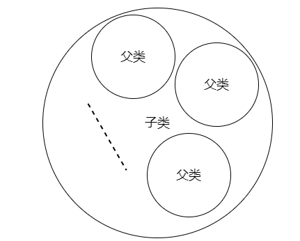

 是的，没错，一个子类可以拥有多个父类，但首先我们先考虑只有一个基类的情况。还记得C++教科书里有这样一句吗？继承的子类在创建对象时候，父类构造函数被唤醒，其次是子类函数，析构时候，子类析构函数先被唤醒，父类析构函数再被唤醒。相信这个顺序困扰了不少考生来记住顺序。下面告诉你为什么是这样，**每个类的析构函数和构造函数只负责自己类的资源申请和释放**（重复+1），当创建子类对象时候，由于子类是包含父类的，是比父类更“大”的概念,子类对象包含父类的资源，所以，当然要先分配子类空间中属于父类的那部分资源！父类构造函数分配完父类的那部分资源，紧接着子类构造函数紧接着分配属于自己的那部分资源，对于下图来说，构造子类对象时，肯定是**先**分配蓝色的空间（这部分是继承自父类的），**再**分配红色的空间（这部分是子类自己的)；析构子类对象时，要**先**释放掉自己的资源，**再**释放父类的资源。

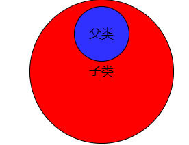

其实，这部分已经比较深入了，理解了感觉好像还不难。OK，其实本质就是这样。下图是一种更为主流的看待角度，构造子类就是从上至下的，但析构就是从下至上的。

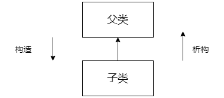

所以，当你继承于多个父对象呢?构造函数和析构函数的顺序呢？U1S1，最明显的可以肯定，构造时，两个父类的构造函数肯定先于子类，但两个父类构造函数的顺序是不确定的（印象中是随机的，依赖于编译器的实现，不知道是不是对的，有懂的可以交流）；同样的，析构时，唯一可以肯定的是子类析构先于两个父类析构，父类的析构顺序并不能确定。


 多态，虚指针，虚函数，函数重载，本质上在我看来就是一套东西。多态分为**编译期多态**和**运行期多态**。

 编译期多态依赖于函数重载实现，又称为静态多态，静态的意思是编译期间就确定函数的调用是哪个。**所谓的函数重载，就是具有相同的函数名但是有不同参数列表（参数列表包括参数的类型、参数的个数和参数的顺序，只要有一个不同就叫做参数列表不同，又称为函数签名）的函数，我们叫他们为函数重载**。函数重载可以在编译时候很久函数签名就确定我们应该调用哪个函数，我们称之为编译期的多态。


 运行期多态，其依赖于虚函数实现，又称为动态多态，与静态多态的区别是它是运行时而不是编译时确定要调用的函数的。对于相关功能的对象的集合，我们希望抽象出它们功能集合，在基类中声明为虚函数，然后再子类中去重写这些虚函数，以实现子类其特有的功能。虚函数，有想过“虚”的意义吗？或者Virtual Function的Virtual的含义吗？

> Virtual  adj.
>
> 释义：almost or nearly as described, but not completely or according to strict definition.

总的来说，我有这个函数，but not completely definition。对我来说，这里的虚是**虚假**的意思，它表明，我有这个函数，但我没定义。**所以让一个内部只有纯虚函数的类实例化一个对象是完全没有意义的**，它更重要的作用是继承，我们将具有纯虚函数的类称为interface，翻译为接口（其实我还是觉得英文更地道一点，根据构词法，interface，内部的表面，内部向外交流通信的表面.....希望你能体会到我的意思），当你把纯虚函数当做父类，根据定义子类拥有父类所有的东西，这些函数也被继承了，我们要做的就是在子类中实现这些函数。比如说，我有一个类，叫做水果（class Fruit），有一个纯虚方法，叫做得到水果的颜色

```
 virtual int getColor() =0;   
```

显然，水果的颜色太多了，我们并不知道水果指的到底是哪种颜色，我们去实例化一个对象(Fruit fruit)，去调用这个纯虚方法（fruit.getColor() ;）,这样做显然毫无意义，**让一个只有纯虚函数的类定义的类是实例化一个对象是完全没有意义的**，是不是对这句话有了更深理解了呢?**有虚函数的类一定是倾向于为了继承准备的**，如果不需要继承这个类，或者这个类是final class（一个C++11语法送给大家，**final关键字**表示该类是最后一个继承类，后续不会有类继承于它）的话，我们要把virtual关键字去掉，因为virtual的实现机制会损耗一丝丝性能。我可以指定Apple、Banana、Pear的父类是Fruit，这样我在实现了统一的调用interface，定义apple(Apple apple)，调用apple.getColor();我就可以知道是哪个颜色了，同理，banana.getColor();peargetColor()；。这也是多态的实现，父类一个方法，子类调用同一个方法却返回不同的结果，拥有不同的行为。


  是时候该引入劝退无数人、让人闻风丧胆的、大名鼎鼎的虚指针和虚函数表了。一旦你的类里有虚函数，无论是纯虚函数还是普通的虚函数，该类在创建一个实例对象时候，在对象里都会生成一个虚函数表来存放本类所有的虚函数，它本质上是一个一维数组，里面的元素是**这个类（埋下伏笔，后文会再次提到这个类）**的虚函数的指针，**这个对象在调用虚函数时，只会从自己的虚函数表里查找，然后调用（重要）**。如何定位虚函数呢？我们通过虚指针定位，虚指针指向虚函数表，通常处于对象内存的首地址位置存放。虚函数表里的虚函数指针是这个**这个类**的虚函数的指针。这个类如果是父类，没有任何疑问，如果这个类是子类呢？这里的虚函数表里的虚函数是谁呢？请循其本，【**每个类的析构函数和构造函数只负责自己类的资源申请和释放**（重复+2)，当进入父类构造函数时，它的虚函数表继承自父类，与父类的虚函数表完全一致，进入子类构造函数时，直接先继承父类的虚函数表，如果子类有该虚函数重写的话，更新为子类的函数地址。

OK，还有一个最重要的部分 ，多态的最重要的用法

```
Fruit *  fruit=new Apple;
```

是的，子类的对象指针可以直接赋给父类对象指针，想一想也可以理解，**父类是比子类更小的概念，子类比较“大”，**子类似乎可以通过删除一部分变成父类，但父类绝对不可以增加一部分东西变成子类，若想变成子类，必须通过子类的构造函数函数增加缺少的那部分资源，但显然，这是不可能的。

更有趣的是，此时fruit.getColor();的行为，可能你知道会调用Apple的getColor()函数，但为什么？答案是虚函数表，new Apple进行构造，先进入Fruit 构造函数，此时虚函数表是父类的，再进入子类构造函数，子类方法覆盖了虚指针，此时虚函数表里的函数一部分是父类，一部分是子类的,也有更新父类的虚函数。**这个对象在调用虚函数时，只会从自己的虚函数表里查找，然后调用，很明显，此时\*fruit对象里面的虚函数表里存放的是Apple的虚函数表！！！！**


 再从另一个知识点再来体会下虚函数的强大，可能有人告诉你，如果存在继承时，父类的析构函数一定要写成虚函数，为什么？

如果不变成虚函数，*fruit在析构时候会怎样呢？不变成虚函数，此时就像是强制类型转换，子类强制转换成了父类，析构只会调用父类析构函数，但你要知道**父类是比子类更小的概念，子类比较“大”，**析构了父类那部分资源，但子类自己申请的那些资源没有释放！！！！内存泄露！！！（即下图蓝色析构了，红色却不能被正确析构）

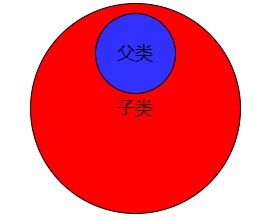

如果析构函数是虚函数，*fruit在析构时候，会先从自己的虚函数表里查找，很明显，**这个对象在调用虚函数时，只会从自己的虚函数表里查找，然后调用，**它的虚函数表里的析构函数是Apple的！！！！！！！因此先调用Apple析构，再调用父类析构，完美！

 重写是指非虚函数，父类和子类一个函数名字的话，子类方法会覆盖父类方法。

### 简述类成员函数的重写、重载和隐藏的区别

（1）重写和重载主要有以下几点不同。

- 范围的区别：被重写的和重写的函数在两个类中，而重载和被重载的函数在同一个类中。
- 参数的区别：被重写函数和重写函数的参数列表一定相同，而被重载函数和重载函数的参数列表一 定不同。
- virtual 的区别：重写的基类中被重写的函数必须要有virtual 修饰，而重载函数和被重载函数可以被 virtual 修饰，也可以没有。

（2）隐藏和重写、重载有以下几点不同。

- 与重载的范围不同：和重写一样，隐藏函数和被隐藏函数不在同一个类中。
- 参数的区别：隐藏函数和被隐藏的函数的参数列表可以相同，也可不同，但是函数名肯定要相同。当参数不相同时，无论基类中的参数是否被virtual 修饰，基类的函数都是被隐藏，而不是被重写。

**「注意」**：虽然重载和覆盖都是实现多态的基础，但是两者实现的技术完全不相同，达到的目的也是完 全不同的，覆盖是动态绑定的多态，而重载是静态绑定的多态。


### final关键字

**final关键字**表示该类是最后一个继承类，后续不会有类继承于它


### explicit关键字

explicit关键字一般用来修饰类的构造函数，作用是告诉编译器按照实际的类型来构造函数，不允许做隐式转换。


### const修饰类成员函数

```cpp
class A {
public:
    A() {};
    virtual ~A() {};
    static void fun() {};
};

```

把const加了一个函数后面，通常是对一个类的成员函数才这么做的。在一个类中，如果一个成员函数后面有const，则表面该成员函数不能修改这个类的成员变量。


### const可以修饰静态成员函数吗？

如：

```cpp
class A {
public:
    A() {};
    virtual ~A() {};
    static void fun() const {};
};

```

不可以，会编译报错。


### C++类内可以定义引用数据成员吗？

可以，必须通过成员函数初始化列表初始化。

### C++中类成员的访问权限

C++通过 public、protected、private 三个关键字来控制成员变量和成员函数的访问权限，它们分别表示公有的、受保护的、私有的，被称为成员访问限定符。在类的内部（定义类的代码内部），无论成员被声明为 public、protected 还是 private，都是可以互相访问的，没有访问权限的限制。在类的外部（定义类的代码之外），只能通过对象访问成员，并且通过对象只能访问 public 属性的成员，不能访问 private、protected 属性的成员

### C++的空类有哪些成员函数

- 缺省构造函数。
- 缺省拷贝构造函数。
- 缺省析构函数。
- 赋值运算符。
- 取址运算符。
- 取址运算符 const 。

**「注意」**：有些书上只是简单的介绍了前四个函数。没有提及后面这两个函数。但后面这两个函数也是 空类的默认函数。另外需要注意的是，只有当实际使用这些函数的时候，编译器才会去定义它们。


### 介绍C++中所有的构造函数

构造函数：类的对象被创建时，编译系统为对象分配内存空间，并自动调用构造函数，由构造函数完成成员的初始化工作。也就是构造函数的作用是初始化对象的数据成员。

- **无参构造函数**：即默认构造函数，如果没有明确写出无参构造函数，编译器会自动生成默认的无参构造函数，函数体为空。如果不想使用自动生成的无参构造函数，就必须自己显式写出一个无参构造函数
- **普通构造函数**：也称为重载构造函数。普通构造函数可以有各种参数形式，一个类可以有多个普通构造函数，前提是参数的个数或者类型不同，创建对象时根据传入参数的不同调用不同的构造函数
- **拷贝构造函数**：拷贝构造函数的函数参数为对象本身的引用，用于根据一个已经存在的对象复制出一个新的该类的对象，一般在函数中会将已经存在的对象的数据成员的值一一复制到新创建的对象中。如果没有显式的写拷贝构造函数，那么系统默认会生成一个拷贝构造函数，但是当前类中有指针成员时，最好不要使用编译器提供的默认的拷贝构造函数，最好自己定义并在类中进行深拷贝
- **类型转换构造函数**：根据一个指定类型的对象创建一个本类的对象，也可以算是普通构造函数的一种。这里要注意的是有时候不允许默认转换的话，可以将其声明为explicit，来阻止一些隐式转换的发生
- **赋值运算符的重载**：注意，这个类似拷⻉构造函数，将＝右边的本类对象的值复制给＝左边的对象，它不属于构造函数，＝左右两边的对象必需已经被创建。如果没有显示的写赋值运算符的重载，系统也会⽣成默认的赋值运算符，做⼀些基本的拷⻉⼯作。

```c
A a1, A a2; a1 = a2;//调⽤赋值运算符
A a3 = a1;//调⽤拷⻉构造函数，因为进⾏的是初始化⼯作，a3 并未存在
```


### 谈谈你对拷贝构造函数和赋值运算符的认识

拷贝构造函数和赋值运算符重载有以下两个不同之处：

- 拷贝构造函数生成新的类对象，而赋值运算符不能。
- 由于拷贝构造函数是直接构造一个新的类对象，所以在初始化这个对象之前不用检验源对象 是否和新建对象相同。而赋值运算符则需要这个操作，另外赋值运算中如果原来的对象中有内存分配要先把内存释放掉。

**「注意」**：当有类中有指针类型的成员变量时，一定要重写拷贝构造函数和赋值运算符，不要使用默认 的。


### 为什么析构函数一般写成虚函数

由于类的多态性，基类指针可以指向派生类的对象，如果删除该基类的指针，就会调用该指针指向的派生类析构函数，而派生类的析构函数又自动调用基类的析构函数，这样整个派生类的对象完全被释放。如果析构函数不被声明成虚函数，则编译器实施静态绑定，在删除基类指针时，只会调用基类的析构函数而不调用派生类析构函数，这样就会造成派生类对象析构不完全，造成内存泄漏。所以将析构函数声明为虚函数是十分必要的。在实现多态时，当用基类操作派生类，在析构时防止只析构基类而不析构派生类的状况发生，要将基类的析构函数声明为虚函数。举个例子：

```cpp
#include <iostream>
using namespace std;

class Parent{
public:
    Parent(){
        cout << "Parent construct function"  << endl;
    };
    ~Parent(){
        cout << "Parent destructor function" <<endl;
    }
};

class Son : public Parent{
public:
    Son(){
        cout << "Son construct function"  << endl;
    };
    ~Son(){
        cout << "Son destructor function" <<endl;
    }
};

int main()
{
    Parent* p = new Son();
    delete p;
    p = NULL;
    return 0;
}
//运行结果：
//Parent construct function
//Son construct function
//Parent destructor function
```

将基类的析构函数声明为虚函数：

```cpp
#include <iostream>
using namespace std;

class Parent{
public:
    Parent(){
        cout << "Parent construct function"  << endl;
    };
    virtual ~Parent(){
        cout << "Parent destructor function" <<endl;
    }
};

class Son : public Parent{
public:
    Son(){
        cout << "Son construct function"  << endl;
    };
    ~Son(){
        cout << "Son destructor function" <<endl;
    }
};

int main()
{
    Parent* p = new Son();
    delete p;
    p = NULL;
    return 0;
}
//运行结果：
//Parent construct function
//Son construct function
//Son destructor function
//Parent destructor function
```

### 为啥构造函数又不能是虚函数？

1. 使用构造函数之前，虚表指针尚未初始化，所以构造函数不能是虚函数
2. 我们需要在编译时确定构造的类的类型，而虚函数表是在程序运行的过程中执行的。

### 构造函数里new自己会怎样

```cpp
class A {
public:
    A() {
        new A();
    }
    ~A() {}
};

int main()
{
    A a;
    return 0;
}
```

运行结果如下：

Stack overflow (参数: 0x0000000000000001, 0x0000008E376B3FD8)。

会无限循环导致栈溢出。


### 能否在构造函数和析构函数中抛出异常？

一.  析构函数

   参照《Effective C++》中条款08：别让异常逃离析构函数。

　  总结如下：

1. 不要在析构函数中抛出异常！虽然C++并不禁止析构函数抛出异常，但这样会导致程序过早结束或出现不明确的行为。

2. 如果某个操作可能会抛出异常，class应提供一个普通函数（而非析构函数），来执行该操作。目的是给客户一个处理错误的机会。

3. 如果析构函数中异常非抛不可，那就用try catch来将异常吞下，但这样方法并不好，我们提倡有错早些报出来。

 

二.  构造函数

   总结如下：

1. 构造函数中抛出异常，会导致析构函数不能被调用，但对象本身已申请到的内存资源会被系统释放（已申请到资源的内部成员变量会被系统依次逆序调用其析构函数）。

2. 因为析构函数不能被调用，所以可能会造成内存泄露或系统资源未被释放。

3. 构造函数中可以抛出异常，但必须保证在构造函数抛出异常之前，把系统资源释放掉，防止内存泄露。（如何保证？？？使用auto_ptr？？？）

 

最后总结如下：

1. 构造函数中尽量不要抛出异常，能避免的就避免，如果必须，要考虑不要内存泄露！

2. 不要在析构函数中抛出异常！


### 能否在构造函数中调用该类的另一个构造函数？

今天在面试的时候，写了一个类，自己在另一个构造函数中调用了另一个构造函数，面试官说，这样不行吧，你回去查查。

后来回来一查，果然我写的有问题。下面一篇文章写的很好详细，我这里转过来，原文来自这里：http://www.cnblogs.com/chio/archive/2007/10/20/931043.html

--------从这里开始转载---------

题目如下：问下列代码的打印结果为0吗？

```cpp

#include <stdlib.h>
#include <iostream>
using namespace std;
 
struct CLS
{
    int m_i;
    CLS( int i ) : m_i(i){}
    CLS()
    {
        CLS(0);
    }
};
int main()
{
    CLS obj;
    cout << obj.m_i << endl;
 
    system("PAUSE");
    return 0;
}
```

打印结果是不定的，不一定为0

代码奇怪的地方在于构造函数中调用了自己的另一个构造函数

我们知道，当定义一个对象时，会按顺序做2件事情：
1）分配好内存（非静态数据成员是未初始化的）
2）调用构造函数（构造函数的本意就是初始化非静态数据成员）

显然上面代码中，CLS obj；这里已经为obj分配了内存，然后调用默认构造函数，但是默认构造函数还未执行完，却调用了另一个构造函数，这样相当于产生了一个匿名的临时CLS对象，它调用CLS(int)构造函数，将这个匿名临时对象自己的数据成员m_i初始化为0；但是obj的数据成员并没有得到初始化。于是obj的m_i是未初始化的，因此其值也是不确定的

从这里，我们归纳如下：
1）在c++里，由于构造函数允许有默认参数，使得这种构造函数调用构造函数来重用代码的需求大为减少
2）如果仅仅为了一个构造函数重用另一个构造函数的代码，那么完全可以把构造函数中的公共部分抽取出来定义一个成员函数(推荐为private),然后在每个需要这个代码的构造函数中调用该函数即可
3）偶尔我们还是希望在类的构造函数里调用另一个构造函数，可以按下面方式做：
在构造函数里调用另一个构造函数的关键是让第二个构造函数在第一次分配好的内存上执行，而不是分配新的内存，这个可以用标准库的placement new做到：
先看看标准库中placement new的定义

```cpp

inline void *__cdecl operator new(size_t, void *_P)
{
    return (_P); 
}
```

可见没有分配新的内存。

正确的方式：

```cpp

struct CLS
{
    int m_i;
    CLS( int i ) : m_i(i){}
    CLS()
    {
        new (this)CLS(0);
    }
};
```

另： 若构造函数调用自身，则会出现无限递归调用，是不允许的。

--------结束转载------------

所以，在实际使用的时候，单纯的在构造函数中调用其它的构造函数，只是会产生一个临时的匿名变量。如果仅仅是为了重用代码，可以把重用的代码封装成一个新的函数。


### 什么是右值引用，跟左值又有什么区别？

左值和右值的概念：

- 左值：能取地址，或者具名对象，表达式结束后依然存在的持久对象；
- 右值：不能取地址，匿名对象，表达式结束后就不再存在的临时对象；区别：
- 左值能赋值，右值不能；
- 左值可变，右值不能（仅对基础类型适用，用户自定义类型右值引用可以通过成员函数改变）；

### 面向对象的三大特征

- 封装性：将客观事物抽象成类，每个类对自身的数据和方法实行 protection （private ， protected ， public ）。
- 继承性：广义的继承有三种实现形式：实现继承（使用基类的属性和方法而无需额外编码的能力)、可 视继承(子窗体使用父窗体的外观和实现代码)、接口继承(仅使用属性和方法,实现滞后到子类实现)。
- 多态性：是将父类对象设置成为和一个或更多它的子对象相等的技术。用子类对象给父类对象赋值 之后，父类对象就可以根据当前赋值给它的子对象的特性以不同的方式运作。

### 对c++中的smart pointer四个智能指针：shared_ptr,unique_ptr,weak_ptr,auto_ptr的理解

C++里面的四个智能指针: auto_ptr, shared_ptr, weak_ptr, unique_ptr 其中后三个是c++11支持，并且第一个已经被11弃用。

智能指针的作用是管理一个指针，因为存在以下这种情况：申请的空间在函数结束时忘记释放，造成内存泄漏。使用智能指针可以很大程度上的避免这个问题，因为智能指针就是一个类，当超出了类的作用域是，类会自动调用析构函数，析构函数会自动释放资源。所以智能指针的作用原理就是在函数结束时自动释放内存空间，不需要手动释放内存空间。

- auto_ptr（c++98的方案，cpp11已经抛弃）

采用所有权模式。

```cpp
auto_ptr< string> p1 (new string ("I reigned lonely as a cloud.”));
auto_ptr<string> p2;
p2 = p1; //auto_ptr不会报错.
```

此时不会报错，p2剥夺了p1的所有权，但是当程序运行时访问p1将会报错。所以auto_ptr的缺点是：存在潜在的内存崩溃问题！

- unique_ptr（替换auto_ptr）

unique_ptr实现独占式拥有或严格拥有概念，保证同一时间内只有一个智能指针可以指向该对象。它对于避免资源泄露(例如“以new创建对象后因为发生异常而忘记调用delete”)特别有用。

采用所有权模式。

```cpp
unique_ptr<string> p3 (new string ("auto"));   //#4
unique_ptr<string> p4；                       //#5
p4 = p3;//此时会报错！！
```

编译器认为p4=p3非法，避免了p3不再指向有效数据的问题。因此，unique_ptr比auto_ptr更安全。

另外unique_ptr还有更聪明的地方：当程序试图将一个 unique_ptr 赋值给另一个时，如果源 unique_ptr 是个临时右值，编译器允许这么做；如果源 unique_ptr 将存在一段时间，编译器将禁止这么做，比如：

```cpp
unique_ptr<string> pu1(new string ("hello world"));
unique_ptr<string> pu2;
pu2 = pu1;                                      // #1 not allowed
unique_ptr<string> pu3;
pu3 = unique_ptr<string>(new string ("You"));   // #2 allowed
```

其中#1留下悬挂的unique_ptr(pu1)，这可能导致危害。而#2不会留下悬挂的unique_ptr，因为它调用 unique_ptr 的构造函数，该构造函数创建的临时对象在其所有权让给 pu3 后就会被销毁。这种随情况而已的行为表明，unique_ptr 优于允许两种赋值的auto_ptr 。

**「注意」**：如果确实想执行类似与#1的操作，要安全的重用这种指针，可给它赋新值。C++有一个标准库函数std::move()，让你能够将一个unique_ptr赋给另一个。例如：

```cpp
unique_ptr<string> ps1, ps2;
ps1 = demo("hello");
ps2 = move(ps1);
ps1 = demo("alexia");
cout << *ps2 << *ps1 << endl;
```

- shared_ptr

shared_ptr实现共享式拥有概念。多个智能指针可以指向相同对象，该对象和其相关资源会在“最后一个引用被销毁”时候释放。从名字share就可以看出了资源可以被多个指针共享，它使用计数机制来表明资源被几个指针共享。可以通过成员函数use_count()来查看资源的所有者个数。除了可以通过new来构造，还可以通过传入auto_ptr, unique_ptr,weak_ptr来构造。当我们调用release()时，当前指针会释放资源所有权，计数减一。当计数等于0时，资源会被释放。

shared_ptr 是为了解决 auto_ptr 在对象所有权上的局限性(auto_ptr 是独占的), 在使用引用计数的机制上提供了可以共享所有权的智能指针。

成员函数：

use_count 返回引用计数的个数

unique 返回是否是独占所有权( use_count 为 1)

swap 交换两个 shared_ptr 对象(即交换所拥有的对象)

reset 放弃内部对象的所有权或拥有对象的变更, 会引起原有对象的引用计数的减少

get 返回内部对象(指针), 由于已经重载了()方法, 因此和直接使用对象是一样的.如 shared_ptrsp(new int(1)); sp 与 sp.get()是等价的

- weak_ptr

weak_ptr 是一种不控制对象生命周期的智能指针, 它指向一个 shared_ptr 管理的对象. 进行该对象的内存管理的是那个强引用的 shared_ptr. weak_ptr只是提供了对管理对象的一个访问手段。weak_ptr 设计的目的是为配合 shared_ptr 而引入的一种智能指针来协助 shared_ptr 工作, 它只可以从一个 shared_ptr 或另一个 weak_ptr 对象构造, 它的构造和析构不会引起引用记数的增加或减少。weak_ptr是用来解决shared_ptr相互引用时的死锁问题,如果说两个shared_ptr相互引用,那么这两个指针的引用计数永远不可能下降为0,资源永远不会释放。它是对对象的一种弱引用，不会增加对象的引用计数，和shared_ptr之间可以相互转化，shared_ptr可以直接赋值给它，它可以通过调用lock函数来获得shared_ptr。

```cpp
class B;
class A
{
public:
shared_ptr<B> pb_;
~A()
{
     cout<<"A delete
";
}
};
class B
{
public:
shared_ptr<A> pa_;
~B()
{
    cout<<"B delete
";
}
};
void fun()
{
    shared_ptr<B> pb(new B());
    shared_ptr<A> pa(new A());
    pb->pa_ = pa;
    pa->pb_ = pb;
    cout<<pb.use_count()<<endl;
    cout<<pa.use_count()<<endl;
}
int main()
{
    fun();
    return 0;
}
```

可以看到fun函数中pa ，pb之间互相引用，两个资源的引用计数为2，当要跳出函数时，智能指针pa，pb析构时两个资源引用计数会减一，但是两者引用计数还是为1，导致跳出函数时资源没有被释放（A B的析构函数没有被调用），如果把其中一个改为weak_ptr就可以了，我们把类A里面的shared_ptr pb_; 改为weak_ptr pb_; 运行结果如下，这样的话，资源B的引用开始就只有1，当pb析构时，B的计数变为0，B得到释放，B释放的同时也会使A的计数减一，同时pa析构时使A的计数减一，那么A的计数为0，A得到释放。

**「注意」**：不能通过weak_ptr直接访问对象的方法，比如B对象中有一个方法print(),我们不能这样访问，pa->pb\_->print(); 英文pb\_是一个weak_ptr，应该先把它转化为shared_ptr,如：shared_ptr p = pa->pb_.lock(); p->print();


### C++中为什么要用模板类

- 是类型无关的，因此具有很高的复用性
- 它在编译时而不是运行时检查数据类型，保证了类型安全
- 是平台无光的，可移值:如stl，boost是跨平台的
- 可用于基本数据类型


### 模板函数和模板类的特例化

**「引入原因」**

编写单一的模板，它能适应多种类型的需求，使每种类型都具有相同的功能，但对于某种特定类型，如果要实现其特有的功能，单一模板就无法做到，这时就需要模板特例化

**「定义」**对单一模板提供的一个特殊实例，它将一个或多个模板参数绑定到特定的类型或值上

（1）模板函数特例化

必须为原函数模板的每个模板参数都提供实参，且使用关键字template后跟一个空尖括号对<>，表明将原模板的所有模板参数提供实参，举例如下：

```cpp
template<typename T> //模板函数
int compare(const T &v1,const T &v2)
{
    if(v1 > v2) return -1;
    if(v2 > v1) return 1;
    return 0;
}
//模板特例化,满足针对字符串特定的比较，要提供所有实参，这里只有一个T
template<> 
int compare(const char* const &v1,const char* const &v2)
{
    return strcmp(p1,p2);
}
```

**「本质」**特例化的本质是实例化一个模板，而非重载它。特例化不影响参数匹配。参数匹配都以最佳匹配为原则。例如，此处如果是compare(3,5)，则调用普通的模板，若为compare(“hi”,”haha”)则调用特例化版本（因为这个cosnt char*相对于T，更匹配实参类型），注意二者函数体的语句不一样了，实现不同功能。

**「注意」**模板及其特例化版本应该声明在同一个头文件中，且所有同名模板的声明应该放在前面，后面放特例化版本。

（2）类模板特例化

原理类似函数模板，不过在类中，我们可以对模板进行特例化，也可以对类进行部分特例化。对类进行特例化时，仍然用template<>表示是一个特例化版本，例如：

```cpp
template<>
class hash<sales_data>
{
    size_t operator()(sales_data& s);
    //里面所有T都换成特例化类型版本sales_data
    //按照最佳匹配原则，若T != sales_data，就用普通类模板，否则，就使用含有特定功能的特例化版本。
};
```

**「类模板的部分特例化」**

不必为所有模板参数提供实参，可以指定一部分而非所有模板参数，一个类模板的部分特例化本身仍是一个模板，使用它时还必须为其特例化版本中未指定的模板参数提供实参(特例化时类名一定要和原来的模板相同，只是参数类型不同，按最佳匹配原则，哪个最匹配，就用相应的模板)

**「特例化类中的部分成员」**

可以特例化类中的部分成员函数而不是整个类，举个例子：

```cpp
template<typename T>
class Foo
{
    void Bar();
    void Barst(T a)();
};

template<>
void Foo<int>::Bar()
{
    //进行int类型的特例化处理
    cout << "我是int型特例化" << endl;
}

Foo<string> fs;
Foo<int> fi;//使用特例化
fs.Bar();//使用的是普通模板，即Foo<string>::Bar()
fi.Bar();//特例化版本，执行Foo<int>::Bar()
//Foo<string>::Bar()和Foo<int>::Bar()功能不同
```

### 访问基类的私有虚函数

写出以下程序的输出结果：

```cpp
#include <iostream.h> 
class A
{ 
   virtual void g() 
   { 
      cout << "A::g" << endl; 
   } 
  private: 
   virtual void f() 
   { 
      cout << "A::f" << endl; 
   } 
}; 
class B : public A 
{ 
   void g() 
   { 
      cout << "B::g" << endl; 
   } 
   virtual void h() 
   { 
      cout << "B::h" << endl; 
   } 
}; 
typedef void( *Fun )( void ); 
void main() 
{ 
   B b; 
   Fun pFun; 
   for(int i = 0 ; i < 3; i++) 
   { 
      pFun = ( Fun )*( ( int* ) * ( int* )( &b ) + i ); 
      pFun(); 
   } 
} 
```

输出结果：

```
B::g 
A::f 
B::h 
```

**「注意」**：考察了面试者对虚函数的理解程度。一个对虚函数不了解的人很难正确的做出本题。在学习面向对象的多态性时一定要深刻理解虚函数表的工作原理。

### 用C++设计一个不能被继承的类

将构造函数和析构函数定义为private的。

```c++
class A {
private:
    A() {}
    ~A() {}
};

class B : A {
};

int main()
{
    B b;
    return 0;
}
```

如何修改才可以通过编译？

```cpp
template <typename T> class A 
{ 
   friend T; 
    private: 
     A() {} 
    ~A() {} 
}; 
class B : virtual public A<B> 
{ 
   public: 
    B() {} 
   ~B() {} 
}; 
class C : virtual public B 
{ 
   public: 
     C() {} 
    ~C() {} 
}; 
void main( void ) 
{ 
    B b; 
    //C c; 
    return; 
} 
```

**「注意」**：构造函数是继承实现的关键，每次子类对象构造时，首先调用的是父类的构造函数，然后才 是自己的。

### C++自己实现一个String类

```cpp
#include <iostream>
#include <cstring>
 
using namespace std;
 
class String{
public:
    // 默认构造函数
    String(const char *str = nullptr);
    // 拷贝构造函数
    String(const String &str);
    // 析构函数
    ~String();
    // 字符串赋值函数
    String& operator=(const String &str);
 
private:
    char *m_data;
    int m_size;
};
 
// 构造函数
String::String(const char *str)
{
    if(str == nullptr)  // 加分点：对m_data加NULL 判断
    {
        m_data = new char[1];   // 得分点：对空字符串自动申请存放结束标志'\0'的
        m_data[0] = '\0';
        m_size = 0;
    }
    else
    {
        m_size = strlen(str);
        m_data = new char[m_size + 1];
        strcpy(m_data, str);
    }
}
 
// 拷贝构造函数
String::String(const String &str)   // 得分点：输入参数为const型
{
    m_size = str.m_size;
    m_data = new char[m_size + 1];  //加分点：对m_data加NULL 判断
    strcpy(m_data, str.m_data);
}
 
// 析构函数
String::~String()
{
    delete[] m_data;
}
 
// 字符串赋值函数
String& String::operator=(const String &str)  // 得分点：输入参数为const
{
    if(this == &str)    //得分点：检查自赋值
        return *this;
 
    delete[] m_data;    //得分点：释放原有的内存资源
    m_size = strlen(str.m_data);
    m_data = new char[m_size + 1];  //加分点：对m_data加NULL 判断
    strcpy(m_data, str.m_data);
    return *this;       //得分点：返回本对象的引用
}
```

### 数组初始化

``` c++
int arr[4] = {1, 2, 3, 4};
int arr[4] = { 0 };
// or
int* arr = new int[4] {1, 2, 3, 4};
```

注意两种数组初始化方式的区别。

### 浅拷贝与深拷贝

简单总结就是：浅拷贝不会开辟新的内存，只是通过指针指向拷贝对象；而深拷贝会另开辟一块内存，然后把拷贝对象的内容复制过去。

浅拷贝的例子：

```c++
class A {
public:
    A(int size) : size_(size) {
        data_ = new int[size];
    }
    A(){}
    A(const A& a) {
        size_ = a.size_;
        data_ = a.data_;
        cout << "copy " << endl;
    }
    ~A() {
        delete[] data_;
    }
    int *data_;
    int size_;
};
int main() {
    A a(10);
    A b = a;
    cout << "b " << b.data_ << endl;
    cout << "a " << a.data_ << endl;
    return 0;
}
```

上面代码中，两个输出的是相同的地址，a和b的data_指针指向了同一块内存，这就是浅拷贝，只是数据的简单赋值，那再析构时data_内存会被释放两次，导致程序出问题，这里正常会出现double free导致程序崩溃的，但是不知道为什么我自己测试程序却没有崩溃，能力有限，没搞明白，无论怎样，这样的程序肯定是有隐患的，如何消除这种隐患呢，可以使用如下深拷贝：

```c++
class A {
public:
    A(int size) : size_(size) {
        data_ = new int[size];
    }
    A(){}
    A(const A& a) {
        size_ = a.size_;
        data_ = new int[size_];
        cout << "copy " << endl;
    }
    ~A() {
        delete[] data_;
    }
    int *data_;
    int size_;
};
int main() {
    A a(10);
    A b = a;
    cout << "b " << b.data_ << endl;
    cout << "a " << a.data_ << endl;
    return 0;
}
```

深拷贝就是再拷贝对象时，如果被拷贝对象内部还有指针引用指向其它资源，自己需要重新开辟一块新内存存储资源，而不是简单的赋值。

### 值传递和引用传递的区别

按值传递就是复制了一份传入函数，而按引用传递是传入了外部对象的引用，直观来讲如果在函数中对 v 进行修改，那么按值传递不会影响外部对象，而按引用传递的话修改相当于直接作用到外部对象上。应用当然是看你的需要来了，如果你希望函数内部修改不影响外部，那么就按值传递，否则按引用传递。

### 为什么空类大小是1

我们可能都知道，C++中空类的大小是1。

```c++

#include <iostream>

class EmptyA {};

int main() {
    std::cout << "sizeof EmptyA " << sizeof(EmptyA) << std::endl;
    return 0;
};
```

结果如下：

 sizeof EmptyA 1

然而在C语言中空结构体的大小是0，空结构体大小是0我们貌似可以理解，但为什么到C++中，空类的大小却是1呢？

原因如下：

实际上，这是类结构体实例化的原因，空的类或结构体同样可以被实例化，如果定义对空的类或者结构体取sizeof()的值为0，那么该空的类或结构体实例化出很多实例时，在内存地址上就不能区分该类实例化出的实例，所以，为了实现每个实例在内存中都有一个独一无二的地址，编译器往往会给一个空类隐含的加一个字节，这样空类在实例化后在内存得到了独一无二的地址，所以空类所占的内存大小是1个字节。

实际上，这不是本文的重点，重点其实是想向大家分享一下C++中的空基类优化(EBO)技术。

直接看代码：

```c++
#include <iostream>

class EmptyA {};

class A {
    int a;
};

class B : public EmptyA {
    int b;
};

class D : public A {
    int d;
};

class C {
    int c;
    EmptyA d;
};

int main() {
    std::cout << "sizeof EmptyA " << sizeof(EmptyA) << std::endl;
    std::cout << "sizeof B " << sizeof(B) << std::endl;
    std::cout << "sizeof C " << sizeof(C) << std::endl;
    std::cout << "sizeof A " << sizeof(A) << std::endl;
    std::cout << "sizeof D " << sizeof(D) << std::endl;
    return 0;
};
```

结果如下：

 ```c++
 sizeof EmptyA 1
 sizeof B 4
 sizeof C 8
 sizeof A 4
 sizeof D 8
 ```

这里：

- 空类EmptyA的大小是1，上面已经介绍过。
- 类C的大小是8，因为int占四个字节，EmptyA占1个字节，再加上字节对齐，编译器补了4个字节，最后就是8。
- 类A的大小是4，没啥毛病。
- 类D的大小是8，因为int占4个字节，继承的A类也占4个字节，最后就是8。


可以看到，类B的大小是4。

**为什么同样是继承。类D把类A的大小继承了下来。而类B的大小却是4，为什么没有把EmptyA的大小继承下来呢？**

这就是本文想分享的空基类优化(EBO)技术。具体其实上面的示例已经很清楚了，就是子类如果继承空类，并不会产生额外的大小，它的大小还是子类本身的大小。

**EBO技术有什么作用？**

我们普通开发者可能认为多那一两个字节没什么大不了的，但是在STL中，在精益求精、寸土必争的委员会大佬们那里，这至关重要，再贴下EBO在STL中的作用。

```c++
template<typename _Tp, _Tp __v>
struct integral_constant {
    static constexpr _Tp                  value = __v;
    typedef _Tp                           value_type;
    typedef integral_constant<_Tp, __v>   type;
};

typedef integral_constant<bool, true>     true_type;

typedef integral_constant<bool, false>    false_type;

template<>
struct __is_floating_point_helper<float>
: public true_type { };

template<>
struct __is_floating_point_helper<double>
: public true_type { };
```

STL中各种空类继承，如果继承空类会给子类产生额外的大小，那还了得？

我们可能平时用不到EBO技术，但还是建议了解，说不上哪天可以和面试官装一波呢。

打完收工。

### 计算cpp程序运行时间（ms）

需要c++11支持

```cpp
#include <chrono>

auto start = std::chrono::system_clock::now();
//do something
auto end = std::chrono::system_clock::now();
auto elapsed = std::chrono::duration_cast<std::chrono::milliseconds>(end - start);
std::cout << elapsed.count() <<"ms" << '\n';

---------------------------------------------------------------
#include <time.h>

time_t begin_t  = clock();
// to do 
time_t finish_t = clock();

cout<<"it cost " << (double )(finish_t - begin_t )/CLOCKS_PER_SEC <<" s"<<endl;
```

## **C++ STL**

### 请介绍一下STL

STL一共有六大组件，包括容器、算法、迭代器、仿函数、配置器和配接器，彼此可以组合套用。容器通过配置器取得数据存储空间，算法通过迭代器存取容器内容，仿函数可以协助算法完成不同的策略变化，配接器可以应用于容器、仿函数和迭代器。

- **容器**：各种数据结构，比如vector、list、map等，用来存放数据，从实现的角度来看是一种类模板
- **算法**：各种常用的算法，如 sort（插⼊，快排，堆排序），search（⼆分查找），从实现的角度来看是一种方法模板
- **迭代器**：从实现的角度来看，迭代器是一种将`operator*、operator->、operator++、operator--`等指针相关操作赋予重载的类模板，所有的STL容器都有自己的迭代器
- **仿函数**：从实现的⻆度看，仿函数是一种重载了operator()的类或者类模板。可以帮助算法实现不同的策略
- **配接器**：一种用来修饰容器或者仿函数或者迭代器接口的东西
- **配置器**：负责空间配置和管理，从实现的角度来看，配置器是一个实现了动态空间配置、空间管理、空间释放的类模板


### 内存管理 Allocator

SGI设计了**双层级配置器**：

- 第一级配置器直接使用malloc()和free()完成内存的分配和回收。
- 第二级配置器则根据需求量的大小选择不同的策略执行。

对于**第二级配置器**

- 如果需求块⼤⼩⼤于 128bytes，则直接转而调用第一级配置器，使用malloc()分配内存。
- 如果需求块大小小于128bytes，第二级配置器中维护了16个自由链表，负责16种小型区块的此配置能力
  - 即当有⼩于 128bytes 的需求块要求时，⾸先查看所需需求块⼤⼩所对应的链表中是否有空闲空间，如果有则直接返回，如果没有，则向内存池中申请所需需求块⼤⼩的内存空间，如果申请成功，则将其加⼊到⾃由链表中。如果内存池中没有空间，则使⽤ malloc() 从堆中进⾏申请，且申请到的⼤⼩是需求ᰁ的⼆倍（或⼆倍＋n 附加量），⼀倍放在⾃由空间中，⼀倍（或⼀倍＋n）放⼊内存池中。
  - 如果 malloc()也失败，则会遍历⾃由空间链表，四处寻找“尚有未⽤区块，且区块够⼤”的 freelist，找到⼀块就挖出一块返回。如果还是没有，扔交给malloc()处理，因为malloc()有out-of-memory处理机制或者有机会会释放其他的内存拿来用，如果可以就成功，如果不行就报bad_alloc异常


### STL中序列式容器的实现

（1）[vector](https://so.csdn.net/so/search?q=vector&spm=1001.2101.3001.7020)

- 是动态空间，随着元素的加入，它的内部机制会自行扩充空间以容纳新元素。vector维护的是一个连续的线性空间，而且普通指针就可以满足要求作为vector的迭代器（RandomAccessIterator）。
- vector的数据结构其实就是三个迭代器构成的，一个指向目前使用空间头的iterator，一个指向目前使用空间尾的iterator，一个指向目前可用空间尾的iterator。当有新元素插入时，如果目前容器足够用则直接插入，如果不够容量就扩充两倍，如果两倍还不够，就扩充至足够大的容量
- **扩充的过程并不是直接在原有空间后面追加容器，而是重新申请一块连续空间，将原有的数据拷贝到新空间中，再释放原有空间，完成一次扩充**。需要注意的是，每次扩充是重新开辟的空间，所以扩充后，原有的迭代器将会失效


（2）list

- 与vector相比，list的好处是每次插入或者删除一个元素，就配置或者释放一个空间，而且原有的迭代器也不会失效
- STL list是一个双向链表，普通指针已经不能满足list迭代器的需求，因为list的存储空间是不连续的。
- list的迭代器必须具备前移和后退的功能，所以list提供的是BidirectionalIterator。
- list 的数据结构中只要⼀个指向 node节点的指针就可以了。


（3）deque

- vector是单向开口的连续线性空间，deque是一种双向开口的连续线性空间。所谓双向开口，说的是deque支持从头尾两端进行元素的插入和删除。 相比于vector的扩充空间的方式，deque实际上更加贴切的实现了动态空间的概念。**deque没有容量的概念，因为它是动态的已分段连续空间组合而成，随时可以增加一段新的空间并连接起来**
- 由于要维护这种整体连续的假象，并提供随机存取的接⼝（即也提供 RandomAccessIterator），避开了“重新配置，复制，释放”的轮回，代价是复杂的迭代器结构。也就是说**除非必要，我们应该尽可能的使用vector，而不是deque**

那deque是如何做到维护整体连续的假象的呢？

- deque采用一块所谓的map作为主控，这里的map实际上就是一块大小连续的空间，其中每一个元素，我们称之为节点node，都指向了另一端连续线性空间称为缓冲区，缓冲区才是deque的真正存储空间的主体
- STL是运行我们指定缓冲区的大小的，默认0表示使用512bytes缓冲区。当map满载时，我们选用一块更大的空间来作为map，重新调整配置。
- deque另一个关键是它的iterator 的设计，deque 的 iterator 中有四个部分，cur 指向缓冲区现⾏元素，first 指向缓冲区的头，last 指向缓冲区的尾（有时会包含备⽤空间），node指向管控中⼼。所以总结来说，deque的数据结构中包含了，指向第⼀个节点的iterator start， 和指向最后⼀个节点的 iterator finish，⼀块连续空间作为主控 map，也需要记住 map 的⼤⼩，以备判断何时配置更⼤的 map。


（4）stack

- stack是一种先进后出的数据结构，只有一个出口，stack运行从最顶端新增元素，移除最顶端元素，取得最顶端元素
- deque是一种双向开口的数据结构，所以使用deque作为底部结构并封装其头部开口，就形成了一个stack


（5）queue

- 是⼀种先进先出的数据结构，有两个出⼝，允许从最底端加⼊元素，取得最顶端元素，从最底端新增元素，从最顶端移除元素。
- deque 是双向开⼝的数据结构，若以 deque 为底部结构并封闭其底端的出⼝，和头端的⼊⼝，就形成了⼀个 queue。（其实 list 也可以实现 deque）


（6）heap

- 堆并不属于STL容器组件，它是个幕后英雄，扮演 priority_queue 的助⼿
- priority_queue 允许用户以任何次序将任何元素压入容器中，但是取出时一定是从优先级最高(数值最高)的元素开始取。⼤根堆（binary max heap）正具有这样的性质，适合作为 priority_queue 的底层机制。


（7）priority_queue

- 底层是⼀个 vector，使⽤ heap 形成的算法，插⼊，获取 heap 中元素的算法，维护这个 vector，以达到允许⽤户以任何次序将任何元素插⼊容器内，但取出时⼀定是从优先权最⾼（数值最⾼）的元素开始取的⽬的。


（8）slist：STL list 是⼀个双向链表， slist 是⼀个单向链表


### vector使用的注意点，频繁对 vector 调⽤ push_back() 性能影响

使用注意点：

- 注意插入和删除元素后迭代器失效的问题
- 清空vector数据时，如果保存的数据项是指针类型，需要逐项delete，否则会造成内存泄露

频繁调用push_back()的影响：

- 向vector的尾部添加元素，很有可能引起整个对象存储空间的重新分配，重新分配更大的内存，再将原数据拷贝到新空间中，再释放原有内存，这个过程是耗时耗力的，频繁对vector调用push_back()会导致性能的下降
- 在C++11之后，vector容器中添加了一个新方法`emplace_back()`，和push_back()一样的是都是在容器末尾添加一个新的元素进去，不同的是emplace_back()在效率上相比较于push_back()有了一定的提升
- emplace_back()函数在原理上比push_back()有了一定的改进，包括在内存优化和运行效率方面。内存优化主要体现在使用了**就地构造(直接在容器内构造对象，不用拷贝一个复制品再使用)+强制类型转换**的方法来实现，在运行效率方面，由于省去了拷贝构造过程，因此有了一定的提升


### vector的底层原理

vector底层是一个动态数组，包含三个迭代器，start和finish之间是已经被使用的空间范围，end_of_storage是整块连续空间包括备用空间的尾部。

当空间不够装下数据（vec.push_back(val)）时，会自动申请另一片更大的空间（1.5倍或者2倍），然后把原来的数据拷贝到新的内存空间，接着释放原来的那片空间[vector内存增长机制]。

当释放或者删除（vec.clear()）里面的数据时，其存储空间不释放，仅仅是清空了里面的数据。因此，对vector的任何操作一旦引起了空间的重新配置，指向原vector的所有迭代器会都失效了。


### vector中的reserve和resize的区别

- reserve是直接扩充到已经确定的大小，可以减少多次开辟、释放空间的问题（优化push_back），就可以提高效率，其次还可以减少多次要拷贝数据的问题。reserve只是保证vector中的空间大小（capacity）最少达到参数所指定的大小n。reserve()只有一个参数。
- resize()可以改变有效空间的大小，也有改变默认值的功能。capacity的大小也会随着改变。resize()可以有多个参数。

* 当reserve的大小大于当前capacity时会改变当前capacity，当小于当前capacity时什么也不做。
* 当resize的大小大于当前capacity时会改变当前capacity，当小于当前size时，会收缩size至指定大小。

- resize()：改变当前容器内含有元素的**数量**(size())，eg: vector< v>; v.resize(len);v的size变为len，如果原来v的size⼩于len，那么容器新增（len-size）个元素，元素的值为默认为0。当v.push_back(3);之后，则是3是放在了v的末尾，即下标为len，此时容器是size为len+1；
- reserve ()：改变当前容器的最大**容量**(capacity)，它不会生成元素，只是确定这个容器重新分配⼀块能存len个对象的空间，然后把之前v.size()个对象通过 copy construtor 复制过来，销毁之前的内存；


### vector中的size和capacity的区别

- size表示当前vector中有多少个元素（finish - start）;
- capacity函数则表示它已经分配的内存中可以容纳多少元素（end_of_storage - start）;


### vector中erase方法与algorithn中的remove方法区别

- vector中erase方法真正删除了元素，迭代器不能访问了
- remove只是简单地将元素移到了容器的最后面，迭代器还是可以访问到。因为algorithm通过迭代器进行操作，不知道容器的内部结构，所以无法进行真正的删除。


### vector迭代器失效的情况

- 当插入一个元素到vector中，由于引起了内存重新分配，所以指向原内存的迭代器全部失效。
- 当删除容器中一个元素后,该迭代器所指向的元素已经被删除，那么也造成迭代器失效。erase方法会返回下一个有效的迭代器，所以当我们要删除某个元素时，需要it=vec.erase(it);。


### 正确释放vector的内存(clear(), swap(), shrink_to_fit())

- vec.clear()：清空内容，但是不释放内存。
- vector().swap(vec)：清空内容，且释放内存，想得到一个全新的vector。
- vec.shrink_to_fit()：请求容器降低其capacity和size匹配。
- vec.clear();vec.shrink_to_fit();：清空内容，且释放内存。


### list的底层原理

- list的底层是一个双向链表，使用链表存储数据，并不会将它们存储到一整块连续的内存空间中。恰恰相反，各元素占用的存储空间（又称为节点）是独立的、分散的，它们之间的线性关系通过指针来维持,每次插入或删除一个元素，就配置或释放一个元素空间。
- list不支持随机存取，适合处理大量的插入和删除，而不适合频繁的随机存取。


### 什么情况下用vector，什么情况下用list，什么情况下用deque

- vector可以随机存储元素（即可以通过公式直接计算出元素地址，而不需要挨个查找），但在非尾部插入删除数据时，效率很低，适合对象简单，对象数量变化不大，随机访问频繁。除非必要，我们尽可能选择使用vector而非deque，因为deque的迭代器比vector迭代器复杂很多。
- list不支持随机存储，适用于对象大，对象数量变化频繁，插入和删除频繁，比如写多读少的场景。
- 需要从首尾两端进行插入或删除操作的时候需要选择deque。


### priority_queue的底层原理

priority_queue：优先队列，其底层是用堆来实现的。在优先队列中，队首元素一定是当前队列中优先级最高的那一个。


### map和set有什么区别？

map和set都是C++的关联容器，其底层实现都是红黑树（RB-Tree）。

由于map和set所开放的各种操作接口，RB-tree也都提供了，所以几乎所有的map和set的操作行为，都只是转掉RB-tree的操作行为。

map和set区别在于：

- map中的元素是key-value对，key起到索引的作用，value表示与索引相关联的数据；set是关键字的简单集合，set中每个元素只包含一个关键字
- set的迭代器是const的，不允许修改元素的值；map运行修改value，但是不允许修改key。原因是map和set都是根据根据关键字排序来保证其有序性的，如果允许修改key的话，那么首先要删除该key，然后调节平衡，再插⼊修改后的键值，调节平衡，如此⼀来，严重破坏了map和set的结构，导致iterator失效，不知道应该指向改变前的位置，还是指向改变后的位置。所以STL中set的迭代器设置成const，不允许修改迭代器的值；而map的迭代器则不允许修改key的值，允许修改map的值
- map支持下标操作，set不支持下标操作。map可以⽤key做下标，map的下标运算符[ ]将关键码作为下标去执行查找，如果key不存在，则插入一个具有该key和mapped_type类型默认值的元素到map中，因此下标运算符[]在map应用中要慎用，const_map不能用，只希望确定某一个关键值是否存在而不希望插入元素也不应该使用，mapped_type类型没有默认值也不应该使⽤。如果find能解决需要，尽可能有find


### map 、set、multiset、multimap的底层原理

map 、set、multiset、multimap的底层实现都是红黑树，epoll模型的底层数据结构也是红黑树，linux系统中CFS进程调度算法，也用到红黑树。

红黑树的特性：

- 每个结点或是红色或是黑色；
- 根结点是黑色；
- 每个叶结点是黑的；
- 如果一个结点是红的，则它的两个儿子均是黑色；
- 每个结点到其叶子结点的所有路径上包含相同数目的黑色结点。


### 为何map和set的插入删除效率比其他序列容器高，而且每次insert之后，以前保存的iterator不会失效？

- 存储的是结点，不需要内存拷贝和内存移动。
- 插入操作只是结点指针换来换去，结点内存没有改变。而iterator就像指向结点的指针，内存没变，指向内存的指针也不会变。


### 当数据元素增多时（从10000到20000），map的set的查找速度会怎样变化？

RB-TREE用二分查找法，时间复杂度为logn，所以从10000增到20000时，查找次数从log10000=14次到log20000=15次，多了1次而已。


### map 、set、multiset、multimap的特点

- set和multiset会根据特定的排序准则自动将元素排序，set中元素不允许重复，multiset可以重复。
- map和multimap将key和value组成的pair作为元素，根据key的排序准则自动将元素排序（因为红黑树也是二叉搜索树，所以map默认是按key排序的），map中元素的key不允许重复，multimap可以重复。
- map和set的增删改查速度为都是logn，是比较高效的。


### 为何map和set不能像vector一样有个reserve函数来预分配数据?

在map和set内部存储的已经不是元素本身了，而是包含元素的结点。也就是说map内部使用的Alloc并不是map<Key, Data, Compare, Alloc>声明的时候从参数中传入的Alloc。


### set的底层实现实现为什么不用哈希表而使用红黑树？

set中元素是经过排序的，红黑树也是有序的，哈希是无序的 如果只是单纯的查找元素的话，那么肯定要选哈希表了，因为哈希表在的最好查找时间复杂度为O(1)，并且如果用到set中那么查找时间复杂度的一直是O（1），因为set中是不允许有元素重复的。而红黑树的查找时间复杂度为O(lgn)


### hash_map与map的区别？什么时候用hash_map，什么时候用map？

- 构造函数：hash_map需要hash function和等于函数，而map需要比较函数（大于或小于）。
- 存储结构：hash_map以hashtable为底层，而map以RB-TREE为底层。
- 总的说来，hash_map查找速度比map快，而且查找速度基本和数据量大小无关，属于常数级别。而map的查找速度是logn级别。但不一定常数就比log小，而且hash_map还有hash function耗时。
- 如果考虑效率，特别当元素达到一定数量级时，用hash_map。
- 考虑内存，或者元素数量较少时，用map。


### unordered_map底层实现是哈希表，其冲突解决方法是什么

STL的unordered_map冲突解决方法使用的是开链法，即在重复元素上维护一个链表。


### STL中迭代器的作用，有了指针为什么还要迭代器

迭代器的作用：

- Iterator（迭代器）模式⼜称 Cursor（游标）模式，用于提供一种方法顺序访问一个聚合对象中各个元素，而又不暴露该对象的内部表示。或者这样说可能更容易理解：迭代器模式是运用于聚合对象的一种模式，通过运用该模式，使得我们可以在不适用对象内部表示的情况下，按照一定的顺序（由iterator提供的⽅法）访问聚合对象中的各个元素
- 由于Iterator模式的以上特性：与聚合对象耦合，在一定程度上限制了它的广泛运用，一般仅用于底层聚合支持类，比如STL的list、vector、stack 等容器类及ostream_iterator等扩展iterator。

迭代器和指针的区别：

- 迭代器不是指针，是类模板，表现的像指针。它支持模拟量指针的一些功能，通过重载了指针的一些操作符，->、*、++、–等。迭代器封装了指针，是一个“可遍历STL容器内全部或者部分元素”的对象，本质是封装了原生指针，值指针概念的一种提升，提供了比指针更高级的行为，相当于一种智能指针，它可以根据不同类型的数据结构来实现不同过的++、–-等操作
- 迭代器返回的是对象引用而不是对象的值，所以cout只能输出迭代器使用*取值后的值⽽不能直接输出其⾃身。

迭代器产⽣原因：

- **Iterator类的访问方式就是把不同集合类的访问逻辑抽象出来，使得不用暴露集合内部的结构而达到循环遍历集合的效果**


### 迭代器失效的问题

插入操作：

- 对于vector和string，如果容器内存被重新分配，iterators,pointers,references失效；如果没有重新分配，那么插入点之前的iterator有效，插入点之后的iterator失效；

- 对于deque，如果插入点位于除front和back的其它位置，iterators,pointers,references失效；当我们插入元素到front和back时，deque的迭代器失效，但reference和pointers有效；

- 对于list和forward_list，所有的iterator,pointer和refercnce有效。

删除操作：

- 对于序列容器vector、deque来说，使用erase(iterator)后，后面的每个元素的迭代器都会失效，但是后面每个元素都会往前移动一个位置，erase会返回下一个有效的迭代器
- 对于关联容器map、set来说，使用erase(iterator)后，当前元素的迭代器会失效，但是其结构是红黑树，删除当前元素不会影响到下一个元素的迭代器，所以在调用erase之前，记录下一个元素的迭代器就可以了
- 对于list来说，它使用了不连续分配的内存，并且它的erase方法也会返回下一个有效的iterator，因此上面两种方法都可以正确使用


### 容器的元素可以声明引用类型吗?

**答案**

不能

**原因**

**C++ 容器要求元素具有 object type，引用不是 object type**。

```cpp
#include <vector>
#include <boost/shared_ptr.hpp>

using namespace std;

class test {};
typedef boost::shared_ptr<test> test_ptr;

int main()
{
    vector<test> tmp;
    vector<test*> tmp1;　　　　//小心内存泄露，重复析构等问题
    //vector<test&> tmp;　　　　//直接编译通不过
    vector<test_ptr> tmp2;
    //vector<test_ptr&> tmp3;　　//即使是boost的智能指针的引用也不行

    return 0;
}

```

c++ 的 STL 中主要有 vector ， list， map， set ， multimap，multiset ，这些容器都要求元素类型满足以下2种情况：

- 能被复制：向这些容器添加新元素时，容器会复制一份自己的版本，这要求容器使用的元素类型可以被复制，**也就是说类型需要复制构造函数的支持**
- 能被赋值：在使用容器的删除、查找、访问、使用迭代器修改元素等许多情况下，都需要元素的赋值操作支持，**类型需要赋值操作符运算的支持**。

* vector、list 中的单参数的resize 操作需要默认初始化指定个数的元素，**类型需要无参数的默认构造函数支持初始化**。

* set、multiset, map和multimap中的键类型、 list 中的sort 操作 都需要 < 比较操作来排序，**类型需要 < 操作符运算的支持**。

在STL中，容器的元素要满足三个基本要求：可拷贝(copyable)、可赋值(assignable)、可析构(destroyable)。**基本数据类型和自定义的类都满足这些条件，但是引用不满足，因为引用不能析构**。


### stack的底层实现

stack底层是用deque实现的，将deque的上端口封住，即变成stack。

stack的实现使用了设计模式中的适配器模式。


### STL线程不安全的情况

- 在对同一个容器进行多线程的读写、写操作时；
- 在每次调用容器的成员函数期间都要锁定该容器；
- 在每个容器返回的迭代器（例如通过调用begin或end）的生存期之内都要锁定该容器；
- 在每个在容器上调用的算法执行期间锁定该容器。


### C++ STL容器如何解决线程安全的问题？

众所周知，STL容器不是线程安全的。对于vector，即使写方（生产者）是单线程写入，但是并发读的时候，由于潜在的内存重新申请和对象复制问题，会导致读方（消费者）的迭代器失效。实际表现也就是招致了core dump。另外一种情况，如果是多个写方，并发的`push_back()`，也会导致core dump。

**解法一**

加锁是一种解决方案，比如互斥锁`std::mutex`。但是加`std::mutex`确实性能较差。对于多读少写的场景可以用读写锁（也叫共享独占锁）来缓解。比如C++17引入了`std::shared_mutex` 。更多锁的种类可以阅读我之前写的这篇文章：

[如何理解互斥锁、条件变量、读写锁以及自旋锁？](https://mp.weixin.qq.com/s?__biz=MjM5NDIyMjI3OQ==&mid=2649002539&idx=1&sn=b0cd8b1d1e471be565168b71458863e4&scene=21#wechat_redirect)

当然本文的目的自然不是自我重复再次介绍一次锁的使用，请继续阅读解法二！

**解法二**

更多的时候，其实可以通过固定vector的大小，避免动态扩容（无push_back）来做到lock-free！

即在开始并发读写之前（比如初始化）的时候，给vector设置好大小。

```
struct Data {
...
};
vector<Data> v;
v.resize(1000);
```

注意是`resize()`，不是`reserve()`！

可能大家平时用`reserve()`比较多，顾名思义，reserve就是预留内存。为的是避免内存重新申请以及容器内对象的拷贝。说白了，`reserve()`是给`push_back()`准备的！

而resize除了预留内存以外，还会调用容器元素的构造函数，不仅分配了N个对象的内存，还会构造N个对象。从这个层面上来说，`resize()`在时间效率上是比`reserve()`低的。但是在多线程的场景下，用resize再合适不过。

你可以resize好N个对象，多线程不管是读还是写，都是通过容器的下标访问`operator[]`来访问元素，不要`push_back()`新元素。所谓的『写操作』在这里不是插入新元素，而是修改旧元素。

如果N的最大个数是可以预期的就直接设置就好，如果没办法预期就再把vector搞成ring buffer（环形队列）来缓解压力。

可以给元素类加上成员变量标记当前的读写状态、是否被消费等等。

当然，你会说，如果B，C，D，E，F这个5个线程是等价的，要不停消费vector中的元素，会造成重复消费不？

当然会。你可以把队列头的下标定义成原子变量（`std::atomic`），尽管原子变量也需要做线程同步，但是比一般的锁开销要小很多啦。

如果你想连原子变量也不用，有没有办法呢？有啊。那就给B，C，D，E，F分配不同的消费队列啊。比如当前有5个读线程，那么每个线程就消费下标对5取模之后的某个固定结果的下标。比如：

- B消费：0、5、10、15、……
- C消费：1、6、11、16、……
- D消费：2、7、12、17、……
- E消费：3、8、13、18、……
- F消费：4、9、14、19、……

每个读线程各自维护自己当前消费的最新下标。

这样做有啥问题没？也有，就是可能会导致不同的线程繁忙和等待的情况差异巨大：忙的忙死，闲的闲死。具体场景具体分析，总之，无论如何要控制住。不要让一个任务hang住整个线程。

vector是顺序容器，STL中还有一类关联容器其线程安全问题也不容小觑。比如map、unordered_map。

我们可能会有这样一种场景：在并发环境下，收集一些Key-Value，存储在某一个公共的容器中。这里也谈一下不用锁的方案，当然做不到放之四海皆准。它有一些限制条件，只能看是否满足你的需要了。

当有多个写线程对情况下，并发地插入 map/unordered_map都会引发core dump。对此，在某些场景下也可以避免加锁：如果全量的key有办法在并发之前就能拿到的，那么就对这个map，提前做一下insert。并发环境中如果只是修改value，而不是插入新key就不会core dump！不过如果你没办法保证多个写线程不会同时修改同一个key的value，那么可能存在value的覆盖。无法保证这点时，还是需要加锁。不过可以对key采取某种hash策略转成整型，然后进行`分段加锁`，减少一点锁冲突的概率，或者用一下`CAS`的策略。

另外对于unordered_map，在单写多读的多线程场景下，会不会有问题呢？也可能有。gcc 4.7.2的unordered_map实现曾被爆出有这个问题。原因的新插入的元素，触发了rehash，让其他线程在unordered_map中查找的过程之中，出现了core dump。见：

> https://stackoverflow.com/questions/16353334/segv-in-gccs-stdunordered-map

我不确定clang以及后续的gcc版本是否还有此问题。应该在不添加任何额外同步代码的情况下，无法解决。


**容器并发前初始化与伪共享的争议**

本文内容我曾经在知乎上写过，有网友评论：解法二会有false sharing（伪共享）的问题。

这里我简单回应一下，谈论伪共享，要考虑具体的场景。的确某些时候伪共享会带来性能损失，但是要和并行化带来的性能提升来比较，孰高孰低。如果并行提升的性能足够多，是足以弥补这点伪共享的损失的。

比如我要进行远程IO，我有N个key要查询redis，把他们的结果存储到一个vector中，这个vector的写入操作在IO的异步回调函数中。在不加任何额外处理的情况下，极大概率会导致vector的core dump。而如果vector初始化一下，则无需在回调函数中加锁，就能保证安全。这时候并行IO本身带来的性能提升，远远大于`可能`的伪共享带来损失。

这里为什么说`可能`呢？因为伪共享的触发没你想象的这么简单。如何成功模拟出一次伪共享带来性能损失的例子？你可以写程序自测一下，并不容易……甚至你改一下优化级别，改成O2，测试表现都很不一样。

一般网络上谈论伪共享时所举的例子，并不是一个vector中多个元素之间并行读写触发了伪共享。而是vector的元素类型是一个对象，对象中有2个数据字段a和b，在多线程分别更新同一个元素的a和b字段的时候，导致了伪共享。比如一个线程更新vector中每个元素的a字段，另外一个线程更新vector中每个元素的b字段。


## **C++设计模式**

https://mp.weixin.qq.com/s/knzV1-bmrI7jhQqnhogGkw

### 一、设计模式简介

设计模式是主要针对面向对象语言提出的一种设计思想，主要是提高代码可复用性，抵御变化，尽量将变化所带来的影响降到最低。

总的设计模式有23种，可以分为三大类。(建议在面试的时候说几个自己熟悉的，比如单例模式、工厂模式、模板模式等)

**创建型模式**(共五种)：工厂方法模式、抽象工厂模式、单例模式、建造者模式、原型模式。

**结构型模式**(共七种)：适配器模式、装饰器模式、代理模式、外观模式、桥接模式、组合模式、享元模式。

**行为型模式**(共十一种)：策略模式、模板方法模式、观察者模式、迭代子模式、责任链模式、命令模式、备忘录模式、状态模式、访问者模式、中介者模式、解释器模式。


### 二、面向对象特点

- 封装：隐藏内部实现
- 继承：复用现有的代码
- 多态：改写对象的行为

### 三、面向对象设计原则

1. 依赖倒置原则：针对接口编程，依赖于抽象而不依赖于具体，抽象(稳定)不应依赖于实现细节(变化)，实现细节应该依赖于抽象，因为稳定态如果依赖于变化态则会变成不稳定态。
2. 开放封闭原则：对扩展开放，对修改关闭，业务需求是不断变化的，当程序需要扩展的时候，不要去修改原来的代码，而要灵活使用抽象和继承，增加程序的扩展性，使易于维护和升级，类、模块、函数等都是可以扩展的，但是不可修改。
3. 单一职责原则：一个类只做一件事，一个类应该仅有一个引起它变化的原因，并且变化的方向隐含着类的责任。
4. 里氏替换原则：子类必须能够替换父类，任何引用基类的地方必须能透明的使用其子类的对象，开放关闭原则的具体实现手段之一。
5. 接口隔离原则：接口最小化且完备，尽量少public来减少对外交互，只把外部需要的方法暴露出来。
6. 最少知道原则：一个实体应该尽可能少的与其他实体发生相互作用。
7. 将变化的点进行封装，做好分界，保持一侧变化，一侧稳定，调用侧永远稳定，被调用测内部可以变化。
8. 优先使用组合而非继承，继承为白箱操作，而组合为黑箱，继承某种程度上破坏了封装性，而且父类与子类之间耦合度比较高。
9. 针对接口编程，而非针对实现编程，强调**接口标准化**。

**总结:** 没有一步到位的设计模式，刚开始编程时不要把太多精力放到设计模式上，需求总是变化的，刚开始着重于实现，一般敏捷开发后为了应对变化重构再决定采取合适的设计模式。

### 四、设计模式

#### 1、策略模式

**核心思想：**通过类继承减少if-else分支

定义一系列的算法，将它们一个个封装，使得他们可以相互替换，一般为了解决多个if-else带来的复杂性，在多种算法相似的情况下，通过策略模式可减少if-else带来的复杂性和难以维护性，一般在项目中发现多个if-else并且预感将来还会在此增加if-else分支，那基本上就需要使用策略模式。
先举一个不使用策略模式的例子，拿计算来说，下面代码定义了加法操作和减法操作，以后如果需要增加乘法除法等计算，那就需要在枚举里添加新类型，并且增加if-else分支，这违反了开放关闭原则。

```cpp
enum class CalOperation {
    add,
    sub
};

int NoStragegy(CalOperation ope) {
    if (ope == CalOperation::add) {
        std::cout << "this is add operation" << std::endl;
    } else if (ope == CalOperation::sub) {
        std::cout << "this is sub operation" << std::endl;
    } // 如何将来需要增加乘法或者除法或者其它运算，还需要增加if-else
    return 0;
}
```

下例为使用策略模式，定义一个基类Calculation，包含虚函数operation()。

```cpp
#ifndef __CALCULATION__
#define __CALCULATION__

#include <iostream>

class Calculation {
   public:
    Calculation() {}

    virtual ~Calculation() {}

    virtual void operation() { std::cout << "base operation" << std::endl; }
};

#endif
```

每增加一种运算，就增加一个继承基类的子类，重写operation()函数。

```cpp
#ifndef __ADD__
#define __ADD__

#include "calculation.h"

class Add : public Calculation {
    void operation() override { std::cout << "this is add operation" << std::endl; }
};

#endif
#ifndef __SUB__
#define __SUB__

#include "calculation.h"

class Sub : public Calculation {
    void operation() override { std::cout << "this is sub operation" << std::endl; }
};

#endif
int Stragegy() {
    Calculation *cal = new Add();
    cal->operation();
    delete cal;

    Calculation *cal2 = new Sub(); // 这里将来都可以用工厂模式改掉，不会违反开放封闭原则
    cal2->operation();
    delete cal2;

    return 0;
}
```

是不是方便了很多，将来如果有乘法除法和其它运算规则，只需要再加一个继承基类的子类即可。

#### 2、观察者模式

**核心思想：**一个Notifier，添加多个Observers，在Notifier里调用Observer->update()

定义对象间的一对多关系，当一个对象状态发生改变的时候，其它依赖于它的对象都会得到广播通知并进行自定义动作，通过面向对象技术的多态技术，可以降低这种依赖关系，降低耦合度，上代码。

```cpp
#ifndef __OBSERVER__
#define __OBSERVER__

#include <iostream>

class ObserverBase {
   public:
    ObserverBase() {}
    virtual ~ObserverBase() {}

    virtual void Update() {}
};

#endif

------------------------------------------------------------------------
#ifndef __OBSERVER_FIRST_CHILD__
#define __OBSERVER_FIRST_CHILD__

#include "observer.h"

class ObserverFirstChild : public ObserverBase {
    void Update() override {
        std::cout << "first child receive notify" << std::endl;
    }
};

#endif

------------------------------------------------------------------------
#ifndef __OBSERVER_SECOND_CHILD__
#define __OBSERVER_SECOND_CHILD__

#include "observer.h"

class ObserverSecondChild : public ObserverBase {
    void Update() override {
        std::cout << "second child receive notify" << std::endl;
    }
};

#endif

------------------------------------------------------------------------
#include <list>
#include "observer_first_child.h"
#include "observer_second_child.h"

class NotifyBase {
   public:
    void Add(ObserverBase *ob) { observers.emplace_back(ob); };

    void Remove(ObserverBase *ob) { observers.erase(ob); }

    void Notify() {
        for (auto observer : observers) {
            observer->Update();
        }
    }

   private:
    std::list<ObserverBase *> observers;
};

int main() {
    ObserverBase *base1 = new ObserverFirstChild();
    ObserverBase *base2 = new ObserverSecondChild();

    NotifyBase notify;
    notify.Add(base2);
    notify.Add(base1);
    notify.Notify();
    notify.Remove(base1);
    notify.Notify();

    delete base2;
    delete base1;
    return 0;
}
```

 

#### 3、装饰器模式

**核心思想**：通过使用基类指针来组合不同派生类的功能

动态的给一个对象添加一些额外的职责，扩展一个类的功能，就增加功能来说，使用装饰器模式比单纯的继承子类更加灵活，不一定非要疯狂使用继承方式。
举个例子，有游戏这个大类，扩展这个类的功能，有打篮球，踢足球，玩lol，玩卡丁车，可以分别定义继承游戏基类的四个子类，但是如果想组合这几个功能呢，一个对象既会打篮球又会玩卡丁车，既会打篮球又会玩lol，再定义几个类继承游戏基类显然不是好的做法，装饰器模式可以很好的解决这个问题，上代码：
首先定义一个Game基类。

```cpp
#ifndef __GAME__
#define __GAME__

#include <iostream>

class Game {
   public:
    Game() {}

    virtual ~Game() {}

    virtual void Skill() { std::cout << "game skill" << std::endl; }
};

#endif
```

定义卡丁车子类和lol子类

```cpp
#ifndef __CAR_GAME__
#define __CAR_GAME__

#include "game.h"

class CarGame : public Game {
   public:
    void Skill() override { std::cout << "car game" << std::endl; }
};

#endif

------------------------------------------------------------------------
#ifndef __LOL_GAME__
#define __LOL_GAME__

#include "game.h"

class LolGame : public Game {
   public:
    void Skill() override { std::cout << "lol game" << std::endl; }
};

#endif
```

篮球和足球子类也可以像上面一样继承定义，但是如果都像上面一样继承的话不能实现动态扩展功能的需求，所以先定义一个装饰类，之后定义继承这个装饰类的篮球和足球子类。

```cpp
#ifndef __DECORATOR_GAME__
#define __DECORATOR_GAME__

#include "game.h"

class DecoratorGame : public Game {
   protected:
    Game *game_;

   public:
    DecoratorGame(Game *game) { game_ = game; }

    void Skill() override { game_->Skill(); }

    virtual ~DecoratorGame() {}
};

#endif

------------------------------------------------------------------------
#ifndef __BASKETBALL__
#define __BASKETBALL__

#include "decorator_game.h"

class BasketBallGame : public DecoratorGame {
   public:
    BasketBallGame(Game *game) : DecoratorGame(game) {}

    void Skill() override {
        std::cout << "basketball game" << std::endl;
        DecoratorGame::Skill();
    }
};

#endif

------------------------------------------------------------------------
#ifndef __SOCKETBALL__
#define __SOCKETBALL__

#include "decorator_game.h"

class SocketBallGame : public DecoratorGame {
   public:
    SocketBallGame(Game *game) : DecoratorGame(game) {}

    void Skill() override {
        std::cout << "socket game" << std::endl;
        DecoratorGame::Skill();
    }
};

#endif
```

最后看使用

```cpp
#include "lol_game.h"
#include "decorator_game.h"
#include "basketball.h"
#include "car_game.h"
#include "socketball.h"

int main() {
    Game *lol = new LolGame();
    Game *car = new CarGame();
    // 一个人既会打篮球又会打LOL可以如下使用
    Game* basketball_lol = new BasketBallGame(lol);
    basketball_lol->Skill();
    std::cout << std::endl;
    // 一个人既会打篮球又会玩卡丁车可以如下使用
    Game* basketball_car = new BasketBallGame(car);
    basketball_car->Skill();
    std::cout << std::endl;
    // 一个人既会打篮球又会玩卡丁车又会踢足球可以如下使用
    Game* g = new SocketBallGame(basketball_lol);
    g->Skill();

    delete lol;
    delete basketball_car;
    delete basketball_lol;
    delete g;

    return 0;
}
// 输出
basketball game
lol game

basketball game
car game

socket game
basketball game
lol game
```

通过上例可以看出，使用观察者模式可以动态的扩展类的职责，动态的组合类的各个功能，当看代码时发现一个类既继承了父类同时又持有父类的对象指针，那这基本上就是装饰器模式。

#### 4、工厂模式

**核心思想：**提供一个工厂类，使用该工厂类创建具体类对象，表面向外部暴露创建逻辑

工厂模式属于创建型模式，主要用于创建对象时不向外部暴露创建逻辑，通过一个共同的接口指向新创建的对象，通过面向对象的多态，将创建对象的工作延迟到子类执行，由子类决定实例化哪个对象。用于隔离对象使用者与其具体类型之间的耦合关系，当具体类型经常变化时，可以考虑使用工厂模式。有一个类型的抽象基类，同时又有很多继承该抽象基类的具体类型，我们做的就是使其依赖于抽象而不依赖于具体，实现方式是创建一个工厂基类，在为每个具体类型定义一个可以创建其相应对象的工厂，每一个具体类对应一个具体工厂，工厂类继承自工厂基类，通过工厂基类的多态性就可以决定创建什么类型的对象。上代码：

```cpp
#ifndef __GAME__
#define __GAME__

#include <iostream>

class Game {
  public:
    Game() {}
    virtual ~Game() {}

    virtual void Play() {
      std::cout << "play game" << std::endl;
    }
};

#endif

------------------------------------------------------------------------
#ifndef __BASKETBALL__
#define __BASKETBALL__

#include "game.h"

class BasketBall : public Game {
    void Play() override { std::cout << "play basketball" << std::endl; }
};

#endif

------------------------------------------------------------------------
#ifndef __SOCKETBALL__
#define __SOCKETBALL__

#include "game.h"

class SocketBall : public Game {
    void Play() override { std::cout << "play socketball" << std::endl; }
};

#endif
```

可以通过游戏工厂选择创建不同游戏类型的对象

```cpp

#ifndef __GAME_FACTORY__
#define __GAME_FACTORY__

#include "game.h"

class GameFactory {
    public:
    GameFactory() {}
    virtual ~GameFactory() {}

    virtual Game* CreateGame() = 0;
};

#endif

------------------------------------------------------------------------
#ifndef __BASKETBALL_FACTORY__
#define __BASKETBALL_FACTORY__

#include "game_factory.h"
#include "basketball.h"

class BasketBallFactory : public GameFactory {
   public:
    Game* CreateGame() override{
        return new BasketBall();
    };
};

#endif

------------------------------------------------------------------------
#ifndef __SOCKETBALL_FACTORY__
#define __SOCKETBALL_FACTORY__

#include "game_factory.h"
#include "socketball.h"

class SocketBallFactory : public GameFactory {
   public:
    Game* CreateGame() override{
        return new SocketBall();
    };
};

#endif

------------------------------------------------------------------------
#include "basketball_factory.h"
#include "socketball_factory.h"

int main() {
    GameFactory* factory = new BasketBallFactory();
    Game* game = factory->CreateGame();
    game->Play();

    delete factory;
    delete game;

    factory = new SocketBallFactory();
    game = factory->CreateGame();
    game->Play();

    delete factory;
    delete game;

    return 0;
}
输出：
play basketball
play socketball
```

当有新类型增加时，需要添加一个具体类和一个相应的创建工厂，尽管减少了耦合度，但是其实还是比较麻烦的。

#### 5、抽象工厂方法模式

和工厂方法模式类似，不做过多介绍，说一下定义，抽象工厂方法模式主要提供一个接口，让该接口负责创建多系列“相关或相互的对象”，无需指定具体的类，系列对象指的是某一特定系列下的对象间有相互依赖或相互作用的关系，不同系列的对象之间不能相互依赖，如果没有多系列对象创建的需求变化，没必要使用**抽象工厂方法**模式，使用**简单工厂方法**模式就可以，拿上一个举例继续说，游戏类型是一个系列，我们有了一个游戏类型的工厂，以后可能会再加入娱乐圈类型的一个系列，那就在做一个娱乐圈类型的系列工厂，以后可能还有文艺类型的系列，那就再加一个文艺类型的系列工厂，这就有了三个系列的工厂，所以就可以在这三类工厂的基础上再抽象出一个抽象的超级工厂，根据不同需求选择实例化哪一个系列的具体工厂，再创建具体工厂下的具体类型的对象。

#### 6、单例模式

单例模式是一种常用的软件设计模式，在应用这个模式时，单例对象的类必须保证只有一个实例存在，整个系统只能使用一个对象实例。

**优点：**不会频繁的创建和销毁对象，浪费系统资源。

可能这会儿需要你手写一个单例模式，而单例模式有多重写法：懒汉模式、饿汉模式，双重检查模式等。

* 懒汉模式就是用的时候再去创建对象，非线程安全
* 饿汉模式就是提前已经加载好的静态static对象，线程安全
* 双重检查模式就是两次检查避免多线程造成创建了多个对象，线程安全

**懒汉模式（加锁实现）：**

```cpp

#include <iostream>
#include <mutex>

class Singleton {
  public:
   static Singleton *GetInstance();

   void Func() { std::cout << "Singleton Func \n"; }

  private:
   Singleton() {}  // 避免外部构造对象，想拿到类的实例只能通过GetInstance()
   Singleton(const Singleton&) = delete;
   Singleton& operator=(const Singleton&) = delete;

   static Singleton *instance_;
   static std::mutex mutex_;
};

Singleton *Singleton::instance_ = nullptr;
std::mutex Singleton::mutex_;

Singleton *Singleton::GetInstance() {
   // double check
   if (instance_ == nullptr) {  // 1
       std::unique_lock<std::mutex> lock(mutex_);
       if (instance_ == nullptr) {  // 2
           instance_ = new Singleton();
      }
  }
   return instance_;
}

int main() {
   Singleton::GetInstance()->Func();
   return 0;
}
```

这就是传说中的**double check**方法，这里有几个关键点：

1. 为什么需要加锁？加锁的原因很简单，为了确保线程安全。

2. 您看过代码可能也有些疑惑，明明加一次锁和第二次的判断就足够了，为什么在加锁之前还需要进行一次判断呢？这里可以考虑只需要在判断指针为空的时候才去加锁，避免每次调用方法时都加锁，可以减少加锁解锁带来的额外开销。

3. 这里需要将类的构造函数和拷贝构造函数等设成私有函数，避免外部构造类的实例，防止外部通过new关键字进行实例化。


**懒汉模式（不加锁实现）：**

通过局部静态变量的方式实现，这种方法在C++11后是线程安全的，见代码

```cpp

#include <iostream>
#include <mutex>

class Singleton {
  public:
   static Singleton& GetInstance() {
       static Singleton instance;
       return instance;
  }

   void Func() { std::cout << "Singleton Func \n"; }

  private:
   Singleton() {}  // 避免外部构造对象，想拿到类的实例只能通过GetInstance()
   Singleton(const Singleton&) = delete;
   Singleton& operator=(const Singleton&) = delete;

};

int main() {
   Singleton::GetInstance().Func();
   return 0;
}
```

C++11确保局部静态变量创建时线程安全的，本人基本上用的单例都是使用这种方式。


**饿汉式实现：**

懒汉式指的是在需要实例的时候才去创建，就是上面的方法，而饿汉式则是提前创建好实例，外部需要实例的时候直接获取这个已经创建好的实例，看下饿汉式单例的实现吧：

```cpp
#include <iostream>

class Singleton {
  public:
   static Singleton *GetInstance();

   void Func() { std::cout << "Singleton Func \n"; }

  private:
   Singleton() {}  // 避免外部构造对象，想拿到类的实例只能通过GetInstance()
   Singleton(const Singleton&) = delete;
   Singleton& operator=(const Singleton&) = delete;

   static Singleton *instance_;
};

Singleton *Singleton::instance_ = new Singleton();

Singleton *Singleton::GetInstance() {
   return instance_;
}

int main() {
   Singleton::GetInstance()->Func();
   return 0;
}
```


**std::call_once实现：**

在C++11后可以利用新特性实现线程安全的单例模式，代码如下：

```cpp

template <typename T>
class SingleTon {
public:
 static T& instance() {
   std::call_once(once_, &SingleTon::init);
   return *value_;
}

private:
 SingleTon();
 ~SingleTon();

 SingleTon(const SingleTon&) = delete;
 SingleTon& operator=(const SingleTon&) = delete;

 static void init() { value_ = new T(); }
 static T* value_;

 static std::once_flag once_;
};
```


#### 7、代理模式

**核心思想：**提供一个代理来控制对对象的访问，例如智能指针

为其它对象提供一种代理以控制这个对象的访问，一般对于比较大的对象访问比较困难或者或带来很多麻烦，例如裸指针的使用，所以一般使用智能指针来控制裸指针，使用智能指针也是一种代理模式，举例：A喜欢B想送给B礼物，但是却不认识B，而C却认识B，所以可以把C作为A的代理去送给B礼物，代码：

```cpp
#ifndef __GIRL__
#define __GIRL__

#include <iostream>
#include <string>

class Girl {
   private:
    std::string name_;

   public:
    Girl(const std::string &name) : name_(name) {}

    std::string GetName() const noexcept { return name_; }
};

#endif

------------------------------------------------------------------------
#ifndef __GIFT__
#define __GIFT__

#include "girl.h"

class Gift {
   public:
    virtual void GiveGift() = 0;
};

#endif

------------------------------------------------------------------------
#ifndef __GIFT_PROXY__
#define __GIFT_PROXY__

#include "gift.h"
#include "girl.h"

class GiftProxy : public Gift {
   public:
    GiftProxy(Girl girl) : girl_(girl) {}

    void GiveGift() override { std::cout << "send " << girl_.GetName() << " gift" << std::endl; }

   private:
    Girl girl_;
};

#endif

------------------------------------------------------------------------
#include "gift_proxy.h"

int main() {
    Girl lili("lili");
    GiftProxy proxy(lili);
    proxy.GiveGift();
    return 0;
}
```

如上述代码，通过代理模式就可以给代码中的丽丽送礼物。

#### 8、模板方法

父类定义算法的骨架，而将一些步骤延迟到子类去实现，使得子类可以复用骨架，并附加特性，以开发框架举例，框架开发人员把框架调用流程定好，而将某些具体的步骤作为虚函数留给子类去重写，话不多说，上代码。

```cpp

#ifndef __GAME__
#define __GAME__

#include <iostream>

class Game {
   public:
    Game() {}

    virtual ~Game() {}

    void Run() {
        InitGame();
        StartGame();
        StopGame();
    }

   protected:
    virtual void StartGame() { std::cout << "step 2: start game" << std::endl; }

   private:
    void InitGame() { std::cout << "step 1: init game" << std::endl; }
    void StopGame() { std::cout << "step 3: stop game" << std::endl; }
};

#endif

------------------------------------------------------------------------
#include "game.h"

class BasketBall : public Game {
    void StartGame() override { std::cout << "start basketball game" << std::endl; }
};
#include "game.h"

class SocketBall : public Game {
    void StartGame() override { std::cout << "start socketball game" << std::endl; }
};

------------------------------------------------------------------------
#include "basketball.h"
#include "socketball.h"

int main() {
    Game *game = new BasketBall();
    game->Run();
    delete game;
    Game *game2 = new SocketBall();
    game2->Run();
    delete game2;
    return 0;
}
g++ test.cc -std=c++11 && ./a.out
输出：
step 1: init game
start basketball game
step 3: stop game
step 1: init game
start socketball game
step 3: stop game
```

代码很简单，体现的是思想，游戏包含三个步骤，初始化游戏，开始游戏，停止游戏，初始化游戏和停止游戏步骤比较统一，由父类Game定义好，而开始游戏是第二个步骤，可以有打篮球和踢足球，将来也可以有羽毛球，乒乓球等等，每增加一项运动，都可以从Game父类中继承后重写开始游戏这个函数，达到不同的功能，符合**模板方法**的特性，即**如何在确定稳定结构前提下，应对子步骤需求的变化**。

#### 9、桥接模式

**核心思想：**将画图的逻辑定义一个基类，将上色的逻辑定义一个基类，便于二者之间的组合

确定好抽象部分和实现部分，将抽象部分和实现部分分离，使得他们可以独立的变化，实现系统和抽象系统可能各自都会有各自的变化，使用桥接模式可以更加灵活的扩展。

方法：用组合代替继承。

举例：一个图形基类，可以有圆形矩形多边形等等，每个都需要从图形基类中继承出一个子类，但是每个子类还需要画图，画颜色，圆形可能需要黄色黑色白色蓝色等等，矩形也可能需要黄色黑色白色蓝色等等，这种如果单纯的使用继承就不太灵活，可以使用桥接模式，把图形种类当作抽象部分，画颜色当作实现部分，使用组合的方式将抽象部分和实现部分分离，上代码：
首先将实现部分(画图)提取出来，同时多种画图方式从这个基类继承后重写，之后会作为Shape图形类的一个成员变量。

```cpp
#ifndef __SHAPE_DRAW_IMPL__
#define __SHAPE_DRAW_IMPL__

#include <iostream>

class ShapeDrawImpl {
   public:
    virtual void Draw() = 0;

    virtual ~ShapeDrawImpl() {}
};

#endif

------------------------------------------------------------------------
#ifndef __SHAPE_DRAW_IMPL_RED__
#define __SHAPE_DRAW_IMPL_RED__

#include "shape_draw_impl.h"

class ShapeDrawImplRed : public ShapeDrawImpl{
   public:
    virtual void Draw() override {
        std::cout << "draw red" << std::endl;
    }
};

#endif

------------------------------------------------------------------------
#ifndef __SHAPE_DRAW_IMPL_BLACK__
#define __SHAPE_DRAW_IMPL_BLACK__

#include "shape_draw_impl.h"

class ShapeDrawImplBlack : public ShapeDrawImpl{
   public:
    virtual void Draw() override {
        std::cout << "draw black" << std::endl;
    }
};

#endif
```

上面定义了两种颜色的实现方式，红色和黑色，下面定义图形的类，定义一个图形基类，持有画图实现的句柄，之后定义多个继承图形基类的子类，圆形子类和矩形子类。

```cpp
#ifndef __SHAPE__
#define __SHAPE__

#include "shape_draw_impl.h"

class Shape {
   protected:
    ShapeDrawImpl *impl;

   public:
    virtual void Update() {}
    Shape(ShapeDrawImpl *impl_) : impl(impl_) {}
};

#endif

------------------------------------------------------------------------
#ifndef __SHAPE_CIRCLE__
#define __SHAPE_CIRCLE__

#include "shape.h"

class ShapeCircle : public Shape {
public:
    void Update() override {
        std::cout << "circle shape update" << std::endl;
        impl->Draw();
    }

    ShapeCircle(ShapeDrawImpl *imp) : Shape(imp) {}
};

#endif

------------------------------------------------------------------------
#ifndef __SHAPE_RECTANGLE__
#define __SHAPE_RECTANGLE__

#include "shape.h"

class ShapeRectangle : public Shape {
   public:
    void Update() override {
        std::cout << "rectangle shape update" << std::endl;
        impl->Draw();
    }

    ShapeRectangle(ShapeDrawImpl *imp) : Shape(imp) {}
};

#endif

------------------------------------------------------------------------
#include "shape_circle.h"
#include "shape_rectangle.h"
#include "shape_draw_impl_black.h"
#include "shape_draw_impl_red.h"

int main() {
    ShapeDrawImpl *impl = new ShapeDrawImplBlack();
    Shape* circle = new ShapeCircle(impl);
    circle->Update();

    delete impl;
    delete circle;

    return 0;
}
输出：
circle shape update
draw black
```

通过桥接模式可以更好的应对变化，应对抽象和实现的多种组合变化。

#### 10、原型模式

**核心思想：**实现一个clone接口，返回与原来类型相同的新对象。

用于创建重复的对象，定义一个clone接口，通过调用clone接口创建出与原来类型相同的对象，上代码：

```cpp
#ifndef __GAME__
#define __GAME__

#include <iostream>

class Game {
    public:
      virtual Game* clone() = 0;

      virtual void Play() = 0;
};

#endif

------------------------------------------------------------------------
#ifndef __BASKETBALL__
#define __BASKETBALL__

#include "game.h"

class BasketBall : public Game {
    virtual Game* clone() override {
        return new BasketBall();
    }

    virtual void Play() override {
      std::cout << "basketball" << std::endl;
    }
};

#endif

------------------------------------------------------------------------
#include "basketball.h"

int main() {
    Game *game = new BasketBall();
    game->Play();
    Game* new_game = game->clone();
    new_game->Play();

    delete game;
    delete new_game;

    return 0;
}
```

单纯看game不知道它是什么类型，它可能是篮球游戏也可能是足球游戏等，如果想创建一个与它相同类型的对象就可以使用原型模式其实就是实现一个clone接口，如果一个对象的拷贝构造函数比较复杂而自己不想使用拷贝构造的方式创建对象也可以使用原型模式，使用方式见上例。

#### 11、建造者模式

用于构建一个复杂的大的对象，一个复杂的对象通常需要一步步才可以构建完成，建造者模式强调的是一步步创建对象，并通过相同的构建过程可以获得不同的结果对象，一般来说建造者对象不是直接返回的，与抽象工厂方法区别是抽象工厂方法用于创建多个系列的对象，而建造者模式强调一步步构建对象，并且构建步骤固定，举例：想要构建一个老师类的对象，老师有第一技能和第二技能，第一技能是数学就代表是数学老师，第一技能是英语就代表是英语老师，构造一个老师对象需要先设定老师的第一技能再设定老师的第二技能，强调一步步设定技能，将这一步步的构建过程可以抽象出建造者模式。
首先定义老师类

```cpp

#ifndef __TEACHER__
#define __TEACHER__

#include <iostream>
#include <string>

class Teacher {
   private:
    std::string first_skill_;
    std::string second_skill_;

   public:
    void SetFirstSkill(const std::string& skill) { this->first_skill_ = skill; }

    void SetSecondSkill(const std::string& skill) { this->second_skill_ = skill; }
};

#endif
```

定义一个老师的抽象构建器，再根据具体老师继承出具体的老师构建器

 ```c++
 #ifndef __TEACHER_ABSTRACT_BUILDER__
 #define __TEACHER_ABSTRACT_BUILDER__
 
 #include "teacher.h"
 
 class TeacherAbstractBuilder {
    public:
     TeacherAbstractBuilder() {}
     virtual ~TeacherAbstractBuilder() {}
 
     virtual void BuildFirstSkill() = 0;
     virtual void BuildSecondSkill() = 0;
 
     virtual Teacher* GetTeacher() = 0;
 };
 
 #endif
 
 ------------------------------------------------------------------------
 #ifndef __MATH_TEACHER_BUILDER__
 #define __MATH_TEACHER_BUILDER__
 
 #include "teacher_abstract_builder.h"
 
 class MathTeacherBuilder : public TeacherAbstractBuilder {
    public:
     MathTeacherBuilder() { this->teacher_ = new Teacher(); }
 
     ~MathTeacherBuilder() { delete this->teacher_; }
 
     Teacher* GetTeacher() { return this->teacher_; }
 
     void BuildFirstSkill() { this->teacher_->SetFirstSkill("math"); }
 
     void BuildSecondSkill() { this->teacher_->SetSecondSkill("english"); }
 
    private:
     Teacher* teacher_;
 };
 
 #endif
 
 ------------------------------------------------------------------------
 #ifndef __ENGLISH_TEACHER_BUILDER__
 #define __ENGLISH_TEACHER_BUILDER__
 
 #include "teacher_abstract_builder.h"
 
 class EnglishTeacherBuilder : public TeacherAbstractBuilder {
    public:
     EnglishTeacherBuilder() { this->teacher_ = new Teacher(); }
 
     ~EnglishTeacherBuilder() { delete this->teacher_; }
 
     Teacher* GetTeacher() { return this->teacher_; }
 
     void BuildFirstSkill() { this->teacher_->SetFirstSkill("english"); }
 
     void BuildSecondSkill() { this->teacher_->SetSecondSkill("math"); }
 
    private:
     Teacher* teacher_;
 };
 
 #endif
 ```

定义一个稳定的Director类，由它根据具体的老师构建器决定构建哪一个老师

 ```cpp
 
 #ifndef __DIRECTOR__
 #define __DIRECTOR__
 
 #include "teacher_abstract_builder.h"
 
 class Director {
    public:
     Director(TeacherAbstractBuilder* builder) { this->builder_ = builder; }
 
     ~Director() {}
 
     void Create() {
         this->builder_->BuildFirstSkill();
         this->builder_->BuildSecondSkill();
     }
 
    private:
     TeacherAbstractBuilder* builder_;
 };
 
 #endif
 ```

使用方法如下：

 ```cpp
 
 #include "director.h"
 #include "english_teacher_builder.h"
 #include "math_teacher_builder.h"
 
 int main() {
     TeacherAbstractBuilder *builder = new MathTeacherBuilder();
     Director *director = new Director(builder);
     delete builder;
     delete director;
 
     builder = new EnglishTeacherBuilder();
     director = new Director(builder);
     delete builder;
     delete director;
 
     return 0;
 }
 ```

通过Director利用不同的具体构建器都采用相同的步骤一步步构建出不同的具体的老师类对象。

#### 12、享元模式

通过共享技术有效支持大量细粒度的对象，主要解决面向对象代价问题，通过共享有效降低创建的对象个数，类似于对象池。
举例：篮球分多种颜色，我想要蓝色的篮球想要红色的篮球这就需要创建两个对象，当我再想要一个蓝色的篮球如果能够继续使用之前的那个对象就更好，通过享元模式可以做到。

```cpp
#ifndef __BASKETBALL__
#define __BASKETBALL__

#include <iostream>
#include <string>

class BasketBall {
   public:
    BasketBall(const std::string& color) : color_(color) {}
    ~BasketBall() {}

   private:
    std::string color_;
};

#endif

------------------------------------------------------------------------
#ifndef __BASKETBALL_FACTORY__
#define __BASKETBALL_FACTORY__

#include <unordered_map>
#include "basketball.h"

class BasketballFactory {
   private:
    std::unordered_map<std::string, BasketBall*> map_;

   public:
    BasketBall* GetBasketBallWithColor(const std::string& color) {
        if (map_.find(color) == map_.end()) {
            BasketBall* p = new BasketBall(color);
            map_[color] = p;
            return p;
        } else {
            return map_[color];
        }
    }
};

#endif

------------------------------------------------------------------------
#include "BasketballFactory.h"

int main() {
    BasketballFactory factory;
    BasketBall* white_ball1 = factory.GetBasketBallWithColor("white");
    BasketBall* black_ball1 = factory.GetBasketBallWithColor("black");
    BasketBall* white_ball2 = factory.GetBasketBallWithColor("white");
    BasketBall* black_ball2 = factory.GetBasketBallWithColor("black");
    std::cout << white_ball1 << std::endl;
    std::cout << white_ball2 << std::endl;
    std::cout << black_ball1 << std::endl;
    std::cout << black_ball2 << std::endl;
    // remember to delete
    return 0;
}
输出：
0x7fffe4984e70
0x7fffe4984e70
0x7fffe4984f00
0x7fffe4984f00
```

#### 13、外观模式

感觉外观模式没啥特别的，感觉就是做好功能之间边界的划分，做好封装，弄清楚哪部分是稳定的，哪部分是变化的，对外稳定松耦合，对内迭代变化高内聚，子系统的内部外部要做好解耦，为子系统的一组接口提供一个稳定一致的(界面)，子系统中的任何变化都不会影响这个(界面)的变化。

#### 14、适配器模式

太常见了，每个人都会用，两个不兼容的接口之间的桥梁，就像耳机转换头，充电器转换头等等都是适配器模式，将一个类的接口转换为客户希望的另一种接口的形式，使得原本由于接口不兼容而不能一起工作的类可以一起工作。

#### 15、中介模式

使用一个中介对象来封装一系列的对象交互，当多个对象间互相引用且操作比较复杂时可以考虑使用中介模式。如下图所示：左侧五个对象互相依赖，通过中介这个桥梁就可以减少这个依赖。

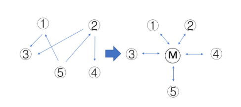

#### 16、状态模式

当一个对象的行为依赖于它的状态并且其有很多种状态而且将来还会有更多状态时，如果使用简单的if-else来增加新状态就违反了面向对象的开闭原则，这时可以考虑使用状态模式，将具体的状态做出一个抽象类，也类似于工厂模式，将具体的状态分散于各个子类中，避免了更多的if-else分支，上代码:

```cpp
#include <iostream>
using namespace std;

class Context;

class State {
   public:
    virtual void Handle(Context *context) = 0;
};

class Context {
   public:
    Context(State *state) : state_(state) {}

    void Request() {
        if (state_) {
            state_->Handle(this);
        }
    }

    void ChangeState(State *pState) { state_ = pState; }

   private:
    State *state_;
};

class ConcreteStateA : public State {
   public:
    void Handle(Context *context) override { cout << "I am state a" << endl; }
};

class ConcreteStateB : public State {
   public:
    void Handle(Context *context) override { cout << "I am state b" << endl; }
};

int main() {
    State *state_a = new ConcreteStateA();
    State *state_b = new ConcreteStateB();
    Context *context = new Context(state_a);

    context->Request();
    context->ChangeState(state_b);
    context->Request();

    delete context;
    delete state_b;
    delete state_a;

    return 0;
}
```


## **C++编程规范**

1. 一行定义一个变量。

   ```c++
   int a;
   int b;
   ```

2. 自加自减操作放到判断条件里的情况要格外注意，因为这种情况除了比较之外，会改变a的值。

   ```c++
   if (a-- > 0)
   ```

3. 

## **C++新特性总结**

* C++是一种静态类型语言，会在编译器进行类型检查。
* 面对一个比较复杂的类型声明语句时，要用**从右向左**读的顺序，离变量名最近的符号对变量类型有最直接的影响。


### C++11新特性：范围for语句

```c++
std::vector<int> vec = {1, 2, 3, 4};
for (auto elem : vec) {
	std::cout << elem << std::endl;
}
```

范围for语句只适用于静态数组和可迭代的对象，不适用于指针数组，如`int* arr = new int[5] {0}`就不可以用范围for语句进行迭代。

范围for语句的缺点是不能得知元素的索引。


> C++11中提供了基于范围的For循环，这样，在遍历容器、数组时就可以使用同一的方式进行，用起来更方便，代码也更整洁。本文中，将以遍历vector容器为例。介绍For循环遍历的技术演进过程。


**1 初级用法**

```c++
#include <iostream>
#include <vector>
int main(){
  std::vector<int> arr;  
  //...  
  for(auto it = arr.begin();it != arr.end();it++){    
  std::cout<<*it<<std::endl;
  }  
  return 0;
}
```

在上面的代码中，使用了auto关键字推导it的类型，忽略了变量类型的定义。


**2 中级用法**

在\<algorithm>头文件中有一个for_each算法，也可以实现上面For循环的功能，使用for_each时不需要关注迭代器，只需要关心容器里面的元素类型，使用这两种方法时，需要关注容器的开始和结尾。使用方法如下：

```c++
#include <algorithm>
#include <iostream>
#include <vector>
void do_print(int n){  
  std::cout<<n<<std::endl;
}
int main(){
  std::vector<int> arr;
  //...  
  for_each(arr.begin();arr.end();do_print);  
  return 0;
}
```


**3 C++11终极武器**

在C++11中，终于提供了基于范围的for循环，下面通过代码看下使用基于范围的for如何实现对vector的遍历。

```c++
#include <iostream>
#include <vector>
int main(){
  std::vector<int> arr;
  //...
  for(auto n : arr){
      std::cout<<n<<std::endl;
  }
  return 0;
}
```

在上面的代码中，使用auto关键字让编译器自动推导n的类型，在这个例子中，n被推导成int型。

n被定义后，在n后加上冒号(:)并加上表达式，for循环会自动将表达式当成是需要遍历的容器。这样在代码中就可以使用基于范围的for循环进行遍历容器了。

如果想在遍历容器的过程中对容器里面的值进行修改，该怎么做呢？大家不妨思考一下。

下面再次对上面的实例进行修改：

```c++
#include <iostream>
#include <vector>
int main(){
  std::vector<int> arr;
  //...
  for(auto &n : arr){
  std::cout<<n<<std::endl;
  }
  return 0;
}
```

从上面的代码可以看出，在n前面添加了引用（&），这样就可以在遍历的过程中进行修改容器的值了。如果不想修改，又想对比较大的容器进行无损耗遍历时可以按照下面的方式进行使用：

```c++
for(const auto &n : arr){
  std::cout<<n<<std::endl;
}
```


### C++11新特性：std::function

讲std::function前首先需要了解下什么是可调用对象

满足以下条件之一就可称为**可调用对象**：

- 是一个函数指针
- 是一个具有operator()成员函数的类对象(传说中的仿函数)，lambda表达式
- 是一个可被转换为函数指针的类对象
- 是一个类成员(函数)指针
- bind表达式或其它函数对象

而std::function就是上面这种可调用对象的封装器，可以把std::function看做一个函数对象，用于表示函数这个抽象概念。std::function的实例可以存储、复制和调用任何可调用对象，存储的可调用对象称为std::function的目标，若std::function不含目标，则称它为空，调用空的std::function的目标会抛出std::bad_function_call异常。


在C++11中，std::function是一个可调用的对象包装器，通过类进行实现，在编码时可以通过指定模板参数使用统一的方式处理函数、函数指针并且可以当做回调函数进行使用。在实际编程时，主要有以下场景：

- 绑定一个函数（普通函数或者静态函数）
- 实现回调函数
- 作为函数入参

接下来，针对上述三种情况分别进行代码实现。


**绑定一个函数**

```c++
#include <functional>
//普通函数
void func(void)
{
    std::cout << __FUNCTION__ << std::endl;
}
//静态类成员函数
class Foo
{
public:
    static int foo_func(int a)
    {
        std::cout << __FUNCTION__ << "(" << a << ") ->:";
        return a;
    }
};
int main(void)
{
    std::function<void(void)> fr = func;
    fr();
    std::function<int(int)> fr1 = Foo::foo_func;
    std::cout << fr1(456) << std::endl;
}
```

如上，运行代码后代码的执行结果为：

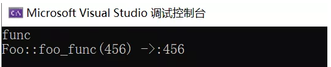


**作为回调函数**

```c++
#include <functional>
class A
{
    std::function<void()> callback_;
public:
    A(const std::function<void()>& f) :callback_(f) {};
    void notify(void)
    {
        callback_();
    }
};
class Foo {
public:
    void operator()(void)
    {
        std::cout << __FUNCTION__ << std::endl;
    }
};
int main(void)
{
    Foo foo;
    A aa(foo);
    aa.notify();
}
```

从上面代码可知，std::function 可以取代函数指针，使得函数延迟执行，因此可以当成回调函数使用。


**作为函数入参**

```c++
#include <functional>
void call_when_even(int x, const std::function<void(int)>& f)
{
    if (!(x & 1))
    {
        f(x);
    }
}
void output(int x)
{
    std::cout << x << " ";
}
int main(void)
{
    for (int i = 0; i < 10; ++i)
    {
        call_when_even(i, output);
    }
    std::cout << std::endl;
}
```

函数执行结果为：


**综上：std::function比普通的函数指针更加灵活方便，下期分享将结合std::bind进行使用。**


综合代码示例：

```c++
std::function<void(int)> f; // 这里表示function的对象f的参数是int，返回值是void
#include <functional>
#include <iostream>

struct Foo {
   Foo(int num) : num_(num) {}
   void print_add(int i) const { std::cout << num_ + i << '\n'; }
   int num_;
};

void print_num(int i) { std::cout << i << '\n'; }

struct PrintNum {
   void operator()(int i) const { std::cout << i << '\n'; }
};

int main() {
   // 存储自由函数
   std::function<void(int)> f_display = print_num;
   f_display(-9);

   // 存储 lambda
   std::function<void()> f_display_42 = []() { print_num(42); };
   f_display_42();

   // 存储到 std::bind 调用的结果
   std::function<void()> f_display_31337 = std::bind(print_num, 31337);
   f_display_31337();

   // 存储到成员函数的调用
   std::function<void(const Foo&, int)> f_add_display = &Foo::print_add;
   const Foo foo(314159);
   f_add_display(foo, 1);
   f_add_display(314159, 1);

   // 存储到数据成员访问器的调用
   std::function<int(Foo const&)> f_num = &Foo::num_;
   std::cout << "num_: " << f_num(foo) << '\n';

   // 存储到成员函数及对象的调用
   using std::placeholders::_1;
   std::function<void(int)> f_add_display2 = std::bind(&Foo::print_add, foo, _1);
   f_add_display2(2);

   // 存储到成员函数和对象指针的调用
   std::function<void(int)> f_add_display3 = std::bind(&Foo::print_add, &foo, _1);
   f_add_display3(3);

   // 存储到函数对象的调用
   std::function<void(int)> f_display_obj = PrintNum();
   f_display_obj(18);
}
```


**function的实现原理**

是不是觉得function做的事儿还挺神奇的？它是如何实现的呢？下面我们就来扒一扒它是如何实现的。

从实现上来说，有两种办法可以实现std::function：一种是通过类的多态，即通过虚表来达到多态；另一种方法是通过C语言的函数指针来实现。今天我们只介绍通过类多态的方式来实现function，对于通过函数指针实现的方式你可以自己去研究一下。

现在我们由浅入深的来分解一下function。通过观察我们可以发现function是一个包装类，它可以接收普通函数、**函数类对象**(也就是实现了（）操作符的类对象）等。它是如何做到的呢？

最简单的方式就是通过类模板。我们都知道function的类模板参数是可变的，但我们为了简单，所以只实现有一个参数的function类模板。这也符合我们的目标，只是扒一下实现原理，并不是想自己去实现它。

OK，下面我们来看看该如何定义这个类模板吧。

```c++
template<typename R, typename Arg0>
class myfunction<R(Arg0)> {
   ...
   public:
       R operator()(Arg0 arg0){
           return ...;
       }
};
```

上面的代码定义了一个最简单的，只有一个参数的类模板。它是 **function<int(int)>** 或 **function<String(int)>** 等格式的类模板。这样我们在外型上与标准库中的std::function类似了。

接下来我们需要思考一下，如何让我们自己实现的function可以调用不同的函数呢？从其行为上可以推理出其内部应该有一个指针，而且这个指针具有多态性。想想C++中的多态是如何实现的？通过继承和虚表对吧。所以在function内部应该有一个基类指针，所有传入到function中的函数、类函数对象等都应该是继承于该类的子类成员。除此之外，还要在**()**操作符前加`virtual`关键字，让它创建虚表。

了解了上面的原理后，下面我们就在自己的function中增加基类及其类的指针。代码如下：

```c++
template<typename R, typename Arg0>
class myfunction<R(Arg0)> function {

    private:
        class __callbase {
            public:
                virtual R operator()(Arg0 arg0) = 0;
                virtual ~__callbase() {}
        };

        __callbase *base_;

        ...

    public:
        ...
        R operator()(Arg0 arg0){
            return (*__callbase)(arg0); //这里调用基类对象的()操作符
        }

};
```

上面我们就将多态中的基类实现好了，在上面的代码中最关键是的`operator()`中增加了**virtual**关键字，这样该函数就被放到了vtable中，后面就可以在子类中实现该方法了。下面我们来实现子类。

```c++
...
class myfunction<R(Arg0)> function{
    private:
        ...

        template<typename F>
        class __callable: public __callbase {

            public:
                callable(F functor)
                    : functor(functor){}

                virtual R operator()(Arg0 arg0) {
                    return functor(arg0);
                }

            private:
                F functor;
        };

        ...
    public:
        ...
        template<typename F>
        myfunction(F f): base_(new __callable<F>(f)){
        }

        ~myfunction(){
            if(base_) {
                delete base_;
                base_ = nullptr;
            }
        }
};
```

在子类的实现中，核心点是增加指向赋值给function类的函数指针或函数类对象，也就是上面`__callable`类中的**F functor** 成员。该成员的类型是通过模板`template<typename F>`推导出来的。如果我们在创建function时传入的是函数，那么functor就是一个函数指针，如果我们传入的是函数类对象，则functor就是类对象。

另外你可以发现，我分别在myfunction类的构造函数和`__callable`类前定义了模板`F`，这样当我们在main函数中创建myfunction对象时，通过类型推导就可以获到F的具体类型了。代码如下：

```c++
int print(int a){
    ...
    return 0;
}

int main(...){
    ...
    myfunction myfunc(print); //通过这句可以获得F类型为函数指针
}
```

有了functor成员后，还需要在构造`__callable`时给functor赋值，也就是让functor指向具体的函数或函数类对象。之后重载**()**操作符就可以直接调用具体的函数或函数类对象了。

通过以上讲解我想你应该已经知道标准库中的function实现的基本原理了。当然我们这里实现的比较简陋，真正的实现还要考虑很多性能的问题，所以实现的要比这个复杂得多。另外标准库中的实现是通过函数指针来实现的而非通过C++的多态。

不过我们今天实现的的myfunction虽然与标准库有很多不同，但原理都是类似的，对于我们理解function已经足够了。

### C++11新特性：std::bind()

在上一期中，介绍了std::function，本节将和大家说一下bind绑定器，它可以将调用对象与调用参数一起绑定，然后将绑定的结果保存在std::function中，并延迟调用到任何我们需要的时候。

std::bind通常有两大作用：

- 将可调用对象与参数一起绑定为另一个std::function供调用
- 将n元可调用对象转成m(m < n)元可调用对象，绑定一部分参数，这里需要使用std::placeholders


**std::bind的基本用法**

```c++
void call_when_even(int x, const std::function<void(int)>& f)
{
    if (!(x & 1))
    {
        f(x);
    }
}
void output(int x)
{
    std::cout << x << " ";
}
void output_add_3(int x)
{
    std::cout << x + 3 << " ";
}
int main(void)
{
    auto fr = std::bind(output, std::placeholders::_1);
    for (int i = 0; i < 10; ++i)
    {
        call_when_even(i, fr);
    }
    std::cout << std::endl;
    {
        auto fr = std::bind(output_add_3, std::placeholders::_1);
        for (int i = 0; i < 10; ++i)
        {
            call_when_even(i, fr);
        }
        std::cout << std::endl;
    }
    return 0;
}
```

代码执行结果为：


在上面的代码中，通过使用std::bind在函数的外部绑定了不同的函数，实现最终结果的转换。


**std::bind的占位符**

```c++
void outputxy(int x, int y)
{
    std::cout << x << " " << y << std::endl;
}
int main(void)
{
    std::bind(outputxy, 1, 2)();//输出1,2
    std::bind(outputxy, std::placeholders::_1, 2)(2);//输出2,2
    std::bind(outputxy, 2, std::placeholders::_1)(1);//输出2,1
    std::bind(outputxy, std::placeholders::_2, std::placeholders::_1)(1, 2);//输出2,1
    return 0；
}
```


**std::bind和std::function配合使用**

```c++
class B
{
public:
    int i_ = 0;
    void output(int x, int y)
    {
        std::cout << x << " " << y << std::endl;
    }
};
int main(void)
{
    B b;
    std::function<void(int, int)> fr = std::bind(&B::output, &b, std::placeholders::_1, std::placeholders::_2);
    fr(1, 2);//输出1 2
    std::function<int& (void)> fr_i = std::bind(&B::i_, &b);
    fr_i() = 123;// 输出123
    std::cout << b.i_ << std::endl;
    return 0;
}
```

代码运行结果为：


上述代码中，通过bind函数将B的成员函数指针和b进行绑定，同时转换为一个仿函数存入fr中。同理，第二步中将B的成员函数i_和a进行了绑定。由此可知，function和bind配合使用后，所有的可调用对象都可以使用统一的操作方法。


std::bind具体示例：

```c++
#include <functional>
#include <iostream>
#include <memory>

void f(int n1, int n2, int n3, const int& n4, int n5) {
   std::cout << n1 << ' ' << n2 << ' ' << n3 << ' ' << n4 << ' ' << n5 << std::endl;
}

int g(int n1) { return n1; }

struct Foo {
   void print_sum(int n1, int n2) { std::cout << n1 + n2 << std::endl; }
   int data = 10;
};

int main() {
   using namespace std::placeholders;  // 针对 _1, _2, _3...

   // 演示参数重排序和按引用传递
   int n = 7;
   // （ _1 与 _2 来自 std::placeholders ，并表示将来会传递给 f1 的参数）
   auto f1 = std::bind(f, _2, 42, _1, std::cref(n), n);
   n = 10;
   f1(1, 2, 1001);  // 1 为 _1 所绑定， 2 为 _2 所绑定，不使用 1001
                    // 进行到 f(2, 42, 1, n, 7) 的调用

   // 嵌套 bind 子表达式共享占位符
   auto f2 = std::bind(f, _3, std::bind(g, _3), _3, 4, 5);
   f2(10, 11, 12);  // 进行到 f(12, g(12), 12, 4, 5); 的调用

   // 绑定指向成员函数指针
   Foo foo;
   auto f3 = std::bind(&Foo::print_sum, &foo, 95, _1);
   f3(5);

   // 绑定指向数据成员指针
   auto f4 = std::bind(&Foo::data, _1);
   std::cout << f4(foo) << std::endl;

   // 智能指针亦能用于调用被引用对象的成员
   std::cout << f4(std::make_shared<Foo>(foo)) << std::endl;
}
```


### C++11新特性：lambda表达式

C++11中，Lambda表达式是最常用的特性之一，有过java、python以及C#开发经验的人对lambda功能都不会陌生。lambda表达式来源于函数式编程，具备以下优点：

- 代码简洁、避免代码膨胀和功能分散，也利于功能维护
- 功能就近实现，程序更加灵活
- 函数式编程，可读性强


**lambda表达式概念和语法**

lambda实际上是一个匿名函数，运行时能够捕获到程序范围内的变量，其定义方式如下：

```c++
[capture] (params) opt -> ret {body;} ;
```


在上面的定义中，capture可以根据不同的取值，捕获不同范围内的变量，具体如下：

| capture形式 | 说明                                |
| ----------- | ----------------------------------- |
| []          | 不捕获变量                          |
| [&]         | 引用捕获，捕获所有变量              |
| [=]         | 按值捕获，捕获所有变量              |
| [=,&foo]    | 按值捕获所有变量，按引用捕获foo变量 |
| [foo]       | 按值捕获foo，不捕获其他变量         |
| [this]      | 捕获类中的this指针                  |

params是参数列表；opt是函数选项（如mutable）；ret是返回值类型；body是函数体，当然在实际的使用中，lambda表达式也可以省略函数返回值的定义。省略函数返回值的lambda表达式定义可以参考下面的示例：

```c++
auto fr = [](int a) { return (a+1); };
```

上面的代码在编译时，编译器会根据return的语句进行自动推导。

lambda表达式按值捕获参数时是不能够修改捕获的变量的，如果要进行修改，改如何做？


**如何修改按值捕获的变量？**

在使用lambda表达式时，如果使用按址引用，可以修改捕获的变量，如果是按值捕获同时又要修改变量时需要在定义时使用mutable关键字，而且要进行显示说明，如：

```c++
int a = 0;
auto fr = [=]() mutable {return a++;};
```

当lambda表达式按值捕获时，其实lambda表达式就相当于是一个仿函数，仿函数是一个有operator()成员函数的类对象，这个operator()默认是const的，所以不能修改成员变量，而加了mutable，就是去掉const属性。

在这里需要提醒大家，如果要在lambda表达式中使用mutable，不管表达式中有没有参数选项，都要把参数列表加上。

**由此可见：mutable的作用就要要取消const的作用。**


**lambda表达式和std::function配合使用**

在C++11中，lambda表达式类型又叫做“闭包类型”（Closure）。可以认为是一个带有operator()的类，于是可以将其和function配合使用，使用方法如下：

```c++
std::function<int(int)> fr = [](int a) {return a; };
```

同理，也可以和std::bind配合使用，只要将上面的代码稍作修改即可完成，具体如下：

```c++
std::function<int(void)> fr = std::bind([](int a) {return a; },123);
std::cout<<"fr()="<<fr()<<std::end;
```

如上：函数输出值为：123


**lambda表达式自定义stl的规则**

例如自定义sort排序规则：

```c++
struct A {
   int a;
   int b;
};

int main() {
   vector<A> vec;
   std::sort(vec.begin(), vec.end(), [](const A &left, const A &right) { return left.a < right.a; });
}
```


**最后，以一个lambda的例子结束本文：**

```c++
#include <vector>
#include <iostream>
#include <algorithm>
#include <functional>
int main()
{
    std::vector<int> c{ 1,2,3,4,5,6,7 };
    int x = 5;
    c.erase(std::remove_if(c.begin(), c.end(), [x](int n) { return n < x; }), c.end());
    std::cout << "c: ";
    for (auto i : c) {
        std::cout << i << ' ';
    }
    std::cout << '\n';
    // the type of a closure cannot be named, but can be inferred with auto
    auto func1 = [](int i) { return i + 4; };
    std::cout << "func1: " << func1(6) << '\n';
    // like all callable objects, closures can be captured in std::function
    // (this may incur unnecessary overhead)
    std::function<int(int)> func2 = [](int i) { return i + 4; };
    std::cout << "func2: " << func2(6) << '\n';
}
```


### C++11新特性：自动类型推导：auto、decltype

**auto** variable

**decltype**(expression)


什么时候使用auto呢？简单类型其实没必要使用auto，然而某些复杂类型就有必要使用auto，比如lambda表达式的类型，async函数的类型等，例如：

```c++
auto func = [&] {
    cout << "xxx";
}; // 对于func你难道不使用auto吗，反正我是不关心lambda表达式究竟是什么类型。

auto asyncfunc = std::async(std::launch::async, func);
```

> 在C++11中，C++标准协会引入了两个关键字，分别是：auto、decltype。这两个关键字实现了类型推导，使用这两个关键字不仅能获取复杂的数据类型，还能使代码更简洁，提高代码编写效率。


**一、auto类型推导**

**1 旧壶装新酒**

auto关键字并不是C++11新增的，在之前的版本中auto像幽灵一样的存在，它只是默默的躺在一个角落，等待着我们的临幸。终于有一天，它引起了人们的注意，这一次是不幸也是机会，它改变了原有的装饰换上了新的外衣。

在C++98/03中，auto一直是作为**存储型关键字，代表着“具有自动存储期的局部变量”**，乍听上去，十分的高大上，但是它的作用却非常小，很少被大家使用，主要是因为非静态型的局部变量本身就是具备“自动存储期的”。在老的版本中auto关键字使用方法如下：

```c++
auto int i=0;//可以直接使用 int i=0;进行替换
```

也正是因为这种原因，auto关键字在最新的C++11中被赋予了新的含义，**这一次它将作为类型指示符的形式出现，用来提示编译器对此类型的变量进行类型推导**。就像是齐天大圣身披五彩霞衣，脚踏七彩祥云而来。


在早期C/C++中auto的含义是：使用auto修饰的变量，是具有自动存储器的局部变量。

```cpp
int a =10 ;  //拥有自动生命期
auto int b = 20 ;//拥有自动生命期
static int c = 30 ;//延长了生命期
```


C++11中，auto有了全新的含义即：auto不再是一个存储类型指示符，而是作为一个新的类型指示符来指示编译器，**auto声明的变量必须由编译器在编译时期推导而得**。

通俗地讲，auto关键字是可以自动推导变量类型的。

auto的自动类型推断发生在编译期，所以使用auto并不会造成程序运行时效率的降低。而是否会造成编译期的时间消耗，我认为是不会的，在未使用auto时，编译器也需要得知右操作数的类型，再与左操作数的类型进行比较，检查是否可以发生相应的转化，是否需要进行隐式类型转换。


**auto和decltype的底层原理：**

一句话：**模板实参推断**

auto使用的是**模板实参推断**（Template Argument Deduction）的机制。auto被一个虚构的模板类型参数T替代，然后进行推断，即相当于把变量设为一个[函数参数](https://www.zhihu.com/search?q=函数参数&search_source=Entity&hybrid_search_source=Entity&hybrid_search_extra={"sourceType"%3A"answer"%2C"sourceId"%3A489015726})，将其传递给模板并推断为实参，auto相当于利用了其中进行的实参推断，承担了模板参数T的作用。比如

```cpp
template<typename Container>
void useContainer(const Container& container)
{
    auto pos = container.begin();
    while (pos != container.end())
    {
        auto& element = *pos++;
        … // 对元素进行操作
    }
}
```

其中第一个auto的初始化相当于下面这个模板传参时的情形，T就是为auto推断的类型

```cpp
// auto pos = container.begin()的推断等价于如下调用模板的推断
template<typename T>
void deducePos(T pos);

deducePos(container.begin());
```

而[auto类型变量](https://www.zhihu.com/search?q=auto类型变量&search_source=Entity&hybrid_search_source=Entity&hybrid_search_extra={"sourceType"%3A"answer"%2C"sourceId"%3A489015726})不会是引用类型*（模板实参推断的规则）*，所以要用auto&*（C++14支持直接用decltype(auto)推断原始类型）*，第二个auto推断对应于下面这个模板传参时的情形，同样T就是为auto推断的类型

```cpp
// auto& element = *pos++的推断等价于如下调用模板的推断
template<typename T>
void deduceElement(T& element);

deduceElement(*pos++);
```

唯一例外的是对初始化列表的推断，auto会将其视为std::initializer_list，而模板则不能对其推断

```cpp
auto x = { 1, 2 }; // C++14禁止了对auto用initializer_list直接初始化，必须用=
auto x2 { 1 }; // 保留了单元素列表的直接初始化，但不会将其视为initializer_list
std::cout << typeid(x).name(); // class std::initializer_list<int>
std::cout << typeid(x2).name(); // C++14中为int

template<typename T>
void deduceX(T x);

deduceX(x); // 错误：不能推断T
```

C++14还允许auto作为返回类型，但此时auto仍然使用的是模板实参推断的机制，因此返回类型为auto的函数如果返回一个初始化列表，则会出错

```cpp
auto newInitList() { return { 1 }; } // 错误
```

decltype比auto更确切地推断名称或表达式的类型*（即原始的[declared type](https://www.zhihu.com/search?q=declared+type&search_source=Entity&hybrid_search_source=Entity&hybrid_search_extra={"sourceType"%3A"answer"%2C"sourceId"%3A489015726})）*，实现原理应该和auto类似，只是特殊情况不太一样，具体实现需要更多考虑

```cpp
int i = 0;
decltype(i) x; // int x
decltype((i)) y = i; // int& y
decltype(i = 1) z = i; // int& z
std::cout << i << z; // 00
```


需要注意的是，auto不是一个类型的“声明”，而是一个“占位符”，编译器在编译期会将auto替换为变量实际的类型。使用auto定义变量时必须对其进行初始化，在编译阶段编译器需要根据初始化表达式来推导auto的实际类型。它自动推导变量类型是根据“=”右侧的变量类型决定的。下面是一段例子：

```cpp
#include <iostream>
#include <typeinfo>
using namespace std;

int TestAuto()
{
	return 10;
}

int main()
{
	int a = 10;
	auto b = a;//由a是int，可以推导出b的类型是int
	auto c = 'a';//由‘a’推导出c的类型是char
	auto d = TestAuto();
	cout << typeid(b).name() << endl;
	cout << typeid(c).name() << endl;
	cout << typeid(d).name() << endl;

    auto e;//这条语句编译不通过，使用auto定义变量时，必须对其进行初始化
    system("pause");
    return 0;

}
//typeid(b).name()是打印类型名称的函数
```

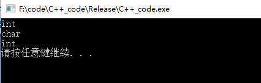


1. auto与指针和引用结合起来使用

用auto声明指针类型时，用auto和auto*没有任何区别，但用auto声明引用类型时则必须加&

```cpp
int main()
{
  int x = 10;
  auto a = &x;
  auto* b = &x;
  auto& c = x;
  cout << typeid(a).name() << endl;
  cout << typeid(b).name() << endl;
  cout << typeid(c).name() << endl;
  *a = 20;
  *b = 30;
  c = 40;
  return 0;
}
```


2. 在同一行定义多个变量
当在同一行声明多个变量时，这些变量必须是相同的类型，否则编译器将会报错，因为编译器实际只对
第一个类型进行推导，然后用推导出来的类型定义其他变量。

```cpp
#include <iostream>
using namespace std;

void TestAuto()
{
	auto a = 1, b = 2;
	//auto c = 3, d = 4.0;//错误
	auto c = 3, d = 4;//正确
	cout << c << endl;
	cout << d << endl;
}

int main()
{
	TestAuto();
	

	system("pause");
	return 0;

}
```

不可以使用的场景：

1. auto不能作为函数的参数

 参数要被编译成指令，但是开辟空间时候需要知道空间大小，auto做参数不知道多大，那么栈帧也不知道开多大。

```cpp
// 此处代码编译失败，auto不能作为形参类型，因为编译器无法对a的实际类型进行推导
void TestAuto(auto a)
{}
```


2. auto不能直接用来声明数组

```cpp
void TestAuto()
{
	int a[] = { 1, 2, 3 };
	auto b[3] = a;//auto类型不能出现在顶级数组类型中
}
```


因为数组也涉及大小，在下面的例子中，a的类型严格来说是 int [3]，所以b的大小也不确定。

3. 为了避免与C++98中的auto发生混淆，C++11只保留了auto作为类型指示符的用法
4. auto在实际中最常见的优势用法是C++11提供的新式for循环，还有lambda表达式等进行配合使用。

```cpp
#include <iostream>
using namespace std;

int main()
{
	int array[] = { 1, 2, 3, 4, 5 };
	for (auto e : array)//依次取array里面的元素读给e
		cout << e << endl;
	

	system("pause");
	return 0;

}
```


5. auto不能定义类的非静态成员变量

 

6. 实例化模板时不能使用auto作为模板参数

```cpp
//在定义模板函数时，用于声明依赖模板参数的变量类型。
template <typename _Tx,typename _Ty>
void Multiply(_Tx x, _Ty y)
{
    auto v = x*y;
    std::cout << v;
}

//若不使用auto变量来声明v，那这个函数就难定义啦，不到编译的时候，谁知道x*y的真正类型是什么呢？
//模板函数依赖于模板参数的返回值
template <typename _Tx, typename _Ty>
auto multiply(_Tx x, _Ty y)->decltype(x*y)
{
    return x*y;
}
```


当模板函数的返回值依赖于模板的参数时，我们依旧无法在编译代码前确定模板参数的类型，故也无从知道返回值的类型，这时我们可以使用auto。格式如上所示。

decltype操作符用于查询表达式的数据类型，也是C++11标准引入的新的运算符，其目的也是解决泛型编程中有些类型由模板参数决定，而难以表示它的问题。
auto在这里的作用也称为返回值占位，它只是为函数返回值占了一个位置，真正的返回值是后面的decltype(_Tx*_Ty)。为何要将返回值后置呢？如果没有后置，则函数声明时为：

decltype(x*y)multiply(_Tx x, _Ty y)
而此时x,y还没声明呢，编译无法通过。

* 如果初始化表达式为const或volatile（或者两者兼有），则除去const/volatile语义。

const int a1 = 10;
auto  b1= a1; //b1的类型为int而非const int（去除const）
const auto c1 = a1;//此时c1的类型为const int
b1 = 100;//合法
c1 = 100;//非法

* 如果auto关键字带上&号，则不去除const语意。

const int a2 = 10;
auto &b2 = a2;//因为auto带上&，故不去除const，b2类型为const int
b2 = 10; //非法
这是因为如何去掉了const，则b2为a2的非const引用，通过b2可以改变a2的值，则显然是不合理的。

* 初始化表达式为数组时，auto关键字推导类型为指针。

int a3[3] = { 1, 2, 3 };
auto b3 = a3;
cout << typeid(b3).name() << endl;
程序将输出

int *

* 若表达式为数组且auto带上&，则推导类型为数组类型。

int a7[3] = { 1, 2, 3 };
auto & b7 = a7;
cout << typeid(b7).name() << endl;
程序输出

int [3]

* 函数或者模板参数不能被声明为auto

void func(auto a)  //错误
{
//... 
}

* 时刻要注意auto并不是一个真正的类型。
  auto仅仅是一个占位符，它并不是一个真正的类型，不能使用一些以类型为操作数的操作符，如sizeof或者typeid。

cout << sizeof(auto) << endl;//错误
cout << typeid(auto).name() << endl;//错误


**2 auto的推导规则**
auto的推导规则总体来说有两个，分别是：

- 当不声明为指针或者引用时，auto的推导结果和初始化表达式将抛弃引用和cv限定字符类型一致。
- 当声明为指针或者引用时，auto的推导结果将保持初始化表达式的cv属性。

为了更好的理解，下面通过几个例子进行说明：

```c++
int x=0;
auto *a = &x;
auto b=&x;
auto &c = x;
auto d=c;
const auto e=x;
auto f=e;
const auto &g=x;
auto &h=g;
```

由事例可知：

- a和c中的auto被替换成了int，a和c被推导为int *
- b在推导时被推导出为指针类型
- d被赋值为一个表达式引用时，被直接推导成了int值类型
- e中的const auto会直接替换成const int
- f中的赋值表达式带有const限定符时，会直接将const属性抛弃，变成int
- g和h说明，当auto和&结合使用时，编译器的推导结果将保留原有的const属性。


**3 auto的限制**

auto的使用限制主要如下：

- auto关键字是不能使用在函数参数中的
- auto不能应用于非静态成员变量
- auto无法定义数组
- auto无法推导出模板参数

4、auto的使用场景

- 遍历容器的循环体中

```c++
#include<map>
int main(){
std::vector<int> v;
//...对容器进行赋值
for(auto it=v.begin();it!=v.end();it++){
//do some thing
}
return 0;
}
```

大家可以思考下，相对老的迭代器的定义C++11的写法和原来的有什么不同？

- 泛型函数

```c++
class Foo{
public:
  static int get(){
    return 0;
  }
};
class Bar{
public:
  static const char *get(){
    return "0";
  }
};

template <class A>
void func(){
  auto val = A::get();
}

int main(){
  func<Foo>();
  func<Bar>();
  return 0;
}
```

在上面的代码中，定义了一个泛型函数func，能够调用具有静态方法get的类型A，在get返回值后做统一的处理。如果不使用auto，则需要在新增一个模板参数，在调用get后针对不同的返回类型做对应的处理。


**auto在褪去了旧衣衫后被赋予了新的含义，具有强大的功能，但是他也同时具有两面性，用的不欠当则会使代码的可读性和可维护性变得糟糕。因此大家在使用auto的时候要考虑它带来的价值和烦恼。**


**二、decltype推导类型**

C++11中新增了decltype关键字，主要的功能是在编译时推导出一个表达式的类型，它的语法格式如下：

```c++
decltype(exp) //exp为一个表达式
```


**1 decltype的推导规则**

decltype的推导规则如下：

- exp是标识符或者类访问表达式时，decltype（exp）的结果和exp表达式一致
- exp是函数调用时，decltype(exp)的结果是函数的返回值的类型
- 除上述两种外，如果exp是一个左值，则decltype(exp)的结果是exp类型的左值引用，否则和exp类型一致

按照上面的规则，借助代码可以理解如下：

**1）标识符是表达式或者类访问表达式时**

```c++
 class Foo{
 public:
   static const int number=0;
   int x;
 };
 int n=0;
 volatile const int &x=n;
 decltype(n) a=n;//a为int型
 decltype(x) b=n;//b的类型为volatile const int &
 decltype(Foo::number) c=0;//c的类型为const int
 Foo foo;
 decltype(foo.x) d=0;//d为整型
```

由上面的事例可以得知，上面的类型推导结果是符合规则1的。


**2）函数调用**

```c++
int func_int_r();//返回值为整型
int &func_int_rr()//返回值为整型地址
decltype(func_int_r()) x=0;//x为整型
decltype(func_int_rr()) y=0;//y为一个整型的引用,既：y--> int &
```


**3)带括号的表达式和加法运算表达式**

```c++
struct Foo{int x;};
const Foo foo = Foo();
decltype(foo.x) a=0;//a为int
decltype((foo.x)) b=a; //b为const int &
int n=0,m=0;
decltype(n+m) c=0;//c为int
decltype(n+=m) d=c;//c为int &
```

从上面的例子可以看出，给表达式加上一对括号，decltype推导出的类型是不一样的，a,c是符合规则1的，b，d符合规则3。


**2 decltype的实际应用**

在实际的编程中，decltype多应用于泛型，请看下面的代码：

```c++
template <class Container>
class Foo{
  decltype(Container().begin()) iter;
  public:
    void func(Container &container){
      iter = container.begin();
    }
    //....
};
```

使用decltype编写泛型是不是简单的多了，不用再像老的C++标准一样，如果想要迭代器支持更多的类型。还需要单独进行编写。


**3 auto和decltype结合使用，返回类型后置语法**

在C++11中，增加了返回类型后置语法，又称为：跟踪返回类型，具体实现是将auto和decltype结合起来进行使用，共同完成返回值类型的推导。如下代码所示：

```c++
template <typename T,typename U>
auto add(T t,U u) -> decltype(t+u){
  return t+u;
}
```

为了帮助大家理解，再举一个例子：

```c++
int &foo(int &i);
float foo(float &f);
template <typename T>
auto func(T &val) -> decltype(foo(val)){
  return foo(val);
}
```

通过代码可以看出，下面的例子使用老版本的C++代码是不可能完成的，返回值类型后置语法主要是为了解决函数返回值类型依赖参数而导致的返回值类型不确定的情况，有了这种语法，就可以清晰的解决此类问题，避免C++98那种晦涩难懂的语法。


### C++11新特性：模板

> C++11 改进了编译器的解析规则，尽可能的将多个“>”解析成模板参数结束符，方便了编写模板的相关代码。

**一 模板的右尖括号(“>”)**

在C++11之前，下面的这段代码在编译时将会报错,C++11之后，编译器将能够正常编译，代码如下：

```c++
template <typename T>
struct Foo{
typedef T type;
};

template <typename T>
class A{
  //
};
int main(){
  Foo<A<int>>::type t;
  return 0;
}
```

C98编译时，上述代码将会报错Foo<A\<int>>这种写法将不被支持。需要写成如下格式：Foo<A\<int> >（后面加一个空格）；在C++11之后，这种限制已经被取消，编译器已经能够做出正确判断并进行编译。


**二、模板的别名**

在C98中，可以使用typedef重定义一个类型，如：

```c++
typedef unsigned int uint_t;
```

在上面的代码中无符号整型类型被重新定义，但并不是新增一种类型，只是给已存在的类型重新定义了一个别名。

如果重新定义一个模板时，使用typedef将会使代码变得复杂，增加了编码的复杂度，如：

```c++
template <typename Val>
struct str_map{
  typedef std::map<std::string,Val> type;
};

str_map<int> type_map;
```

上面的代码使用的是C98格式，需要额外增加一个壳，C++11种提供一个新的语法，上面的代码可以写成如下方式：

```c++
template <typename Val>
using str_map = std::map<std::string,Val>;
str_map<int> map1;
```

如上代码所示，C98和C++11实现的功能一样，但是C++11实现代码则更加简洁。


C++11的using语法提供的功能已经涵盖了typedef的所有功能，如在一开始定义的无符号整型的别名也可以这样定义：

```c++
using uint_t = unsigned int;
```

由此可以看出，typedef定义方法和变量声明类似，显示了C++语法的一致性，但是有时又会增加C++代码的阅读复杂度，如在对函数指针进行重定义时：

```c++
typedef void (*func_t)(int ,int);
```

使用using语法时，using紧接着的是标识符，和赋值语法类似，将一个现有的类型赋值给新的类型。和typedef相比，代码更清晰，易于阅读。

```c++
using func_t = void (*)(int,int);
```

下面在来看下如何使用using语法，实现为一个模板定义一个别名。大家可以留言回复使用C98语法如何为一个模板定义一个别名。

```c++
/*C++11*/
template <typename T>
using func_t= void (*) (T,T);
func_t<int> xx;
```

在这里需要注意的是：不管是typedef还是using，都不会新增一个类型，而是对原有类型进行重新定义一个别名。using语法更加强大，编写出的代码更加简洁。


**三、函数模板的默认模板参数**

在C98中，类模板可以有默认模板参数，函数模板中的默认模板参数是不被支持的，这一限制，在C++11中得到了解除。如下面代码所示：

```c++
template <typename R=int,typename U>
R func(U val){
  val
}
int main(){
  func(123);
  return 0;
}
```

值得注意的是，如果在使用函数模板时显示指定了模板参数的类型，函数的返回值将返回的是指定参数的类型。如：

```c++
func<long long>(123);//func的返回值为long long
```

还有一种使用方式是将函数模板默认参数和模板参数自动推导一起使用，在一起使用时，如果函数模板无法自动推导，将会使用默认模板参数，否则将使用自动推导出的参数类型。如下代码：

```c++
template <typeame T>
struct identity{
  typedef T type;
};

template <typename T = int>
void func(typename identity<T>::type val,T = 0){
  ///...
}

int main(){
  func(123);
  func(123,123.0);
  return 0;
}
```

在上面的代码中，通过identity禁用了val的自动推导，但因为指定了默认参数模板类型，因此，在func(123)中，func的val参数将为int整型，在func(123,123.0)中，第二个参数为浮点行，模板参数T将优先被推导，自动推导生效时，默认模板参数会被直接忽略。


### C++11新特性：可变模板参数

在C++11之前，类模板或者模板函数的模板参数是固定的，从C++11开始，C++标准委员会增强了模板的功能，新的模板特性允许在模板定义中模板参数可以包含零到无限个参数列表，声明可变参数模板时主要是在class和typename后面添加省略号的方式。省略号的作用如下：

- 声明一个参数包，这个参数包中可以包含0到任意个模板参数；
- 在模板定义的右边，可以将参数包展开成一个个独立的参数；

**1 可变参数模板函数**

可变参数模板函数代码如下所示：

```c++

template <class ... T>
void Fun(T ... args){
    cout<<sizeof...(args)<<endl;
}
int main(){
    Fun();
    Fun(3,"23");
    Fun(3,"23",4);
    return 0;
}
```

上面的代码运行结果为：

```c++

0
2
3
```

代码中，分别调用了Fun的三个重载函数，第一个参数包中参数个数为0，第二个为2，第三个为3，所以在输出的时候结果分别为0,2，3。参数包的展开方式有两种，分别是递归函数方式展开、逗号表达式和函数初始化列表方式展开。

**1.1 递归方式展开**

同递归算法一样，使用递归方式展开需要提供一个参数包展开函数和一个递归结束函数，具体代码如下：

```c++

template <class  T>
void print(T t){
    cout<<t<<endl;
}

template <class T,class ... Args>
void print(T head,Args ... rest){
    cout<<"parameters:"<<head<<endl;
    print(rest ...);
}
int main(){
    print(2);
    print(3,"23");
    print(3,"23",4);
    return 0;
}
```

代码执行结果如下:

```c++

2
parameters:3
23
parameters:3
parameters:23
4
```

上面的两个函数一个是递归函数，一个是递归终止函数，没输出一个参数，调用一次参数包的参数个数就会减少一个，直到所有的参数输出完为止。

**1.2 逗号表达式和初始化列表方式**

逗号表达式的优点是不需要提供一个终止函数，就像在本文一开始提供的代码那样。下面我们用改方式实现递归打印参数的功能。

```c++

template <class  T>
void print(T t){
    cout<<t<<endl;
}

template <class ... Args>
void printAll(Args ... rest){
    int arr[]={(print(rest),0)...};
}
int main(){
   printAll(1,2,3,4);
    return 0;
}
```

代码运行结束后，同样会输出结果为：1,2，3,4。

在printAll函数中，每输出一个参数都会调用一次print函数，每次执行成功后，都可以得到逗号表达式的值0，这样实际上就是对一个可变数组arr[]进行了一次初始化，在实行过程中，(print(rest),0)...会被替换成(print(1),0)，(print(2),0)，(print(3),0)，(print(4),0)。按照优先级顺序，逗号表达式优先级最低，在执行逗号表达式前都会调用print输出参数。

在上面printAll函数还可以继续进行优化，如使用std::initializer代替数组，使用lanbda代替print函数。优化后的结果如下：

```c++

template <class ... Args>
void printAll(Args ... rest){
    std::initializer_list<int>{([&]{cout<<rest<<endl;}(),0)...};
}
```

执行程序会会得到同样的结果。

**2 可变参数模板类**

可变参数模板类实际上就是一个模板类，参数是可变的，在C++11中，元组类std::tuple就是一个可变参数的模板类。可变参数模板类参数包展开时主要通过模板特化和继承的方式进行。

std::tuple的原定如下：

```c++

template <class... Types> class tuple;
```

**2.1 模板递归和特殊方式展开参数包**

可变参数模板类在定义时一般需要2-3个类。主要包括类的声明、类的特化，如下面的参数模板类就定义了三个类。代码如下：

```c++

//前向声明
template <class ... Args> struct sum;
//基本定义
template<typename First,typename ... Rest>
struct sum<First,Rest ...> : std::integral_constant<int,sum<First>::value+sum<Rest ...>::value>{};

//递归终止
template <typename Last>
struct sum<Last> : std::integral_constant<int,sizeof(Last)>{};
```

在上面的代码中，主要包含了3个部分，第一部分是前向声明，声明了一个可变参数的模板类。第二部分是类的定义，在第二部分中实现了部分可展开的参数模板类。第三部分就是就是特化的递归终止类。

 也可以改变代码，省去前向声明，限制至少有一个参数，代码如下：

```c++

//基本定义
template<typename First,typename ... Rest>
struct sum{
    enum {value = sum<First>::value + sum<Rest ...>::value };
};

//递归终止
template <typename Last>
struct sum<Last>{
    enum{value = sizeof(Last) };
};
```

代码执行后，结果是一样的。

**2.2 继承方式展开参数包**

可变参数类比可变参数函数模板要复杂，但是功能也会更加强大，因为可变参数模板类可以具备状态，和type_traits联合使用后可以在编译器对类型进行判断、选择和转换等操作。

下面的代码展示了通过继承方式展开参数包的方法。

```c++

template <int ...>
struct IndexSeq{};

template<int N,int ... Indexes>
struct MakeIndexes : MakeIndexes<N-1,N-1,Indexes ...>{};
//模板特化展开模板参数包
template<int ... Indexes>
struct MakeIndexes<0,Indexes ...>{
    typedef IndexSeq<Indexes ...> type;
};
```

在上面的代码中MakeIndexes 继承自身的转化模板类，这个特化的模板类同时也在展开参数包，这个展开过程通过继承发起，直到遇到终止的特化 参数模板类。

**3 可变参数模板消除重复代码**

可变参数模板的特性之一就是参数包中的参数数量和类型可以是任意的，因此可以通过泛化的方式处理问题。如下面打印函数代码：

```c++

template <typename T>
void Print(T t){
    cout<< t <<", "<<endl;
}

template<typename T,typename ... Args>
void Print(T t,Args ... Rest){
    cout<<t<<" ";
    Print(Rest...);
}

```

上面的代码可以打印任意个数和类型参数试想，如果使用传统的方法实现。需要写多个重载函数，如果后面进行扩展，也需要不断的新增重载函数。

除此之外，在C++11之前，定义一个工厂类，需要写很多的重载函数，进而创建不同的实例，使用范化后，只需要一个可变参数模板就可以支撑很多功能。示例代码如下：

```c++

template <typename ... T>
T* Instance(T&& ...t){
    return new T(std::forward<T>(t)...);
}
```


### C++11新特性：列表初始化

> C++98中，提供了很多列表初始化的方法，不同的初始化方法都有各自的使用范围和作用，但是却没有一种可以通用所有情况，在C++11中，提供了一种通用的初始化方式，提出了列表初始化的概念。


**一、统一的初始化**

C++11中，可以对所有的类型对象进行列表初始化，但是在C++98中，只能对数组和POD类型进行列表初始化。C++11中，对类进行列表初始化代码如下所示：

```c++
class Foo{
public:
    Foo(int){};
  private:
    Foo(const Foo &);
};
int main{
  Foo a1(123);
  Foo a2=123;//编译将会报错，报错为：error:Foo(const Foo &) is private
  Foo a3 = {123};
  Foo a4{123};
  int a5={2};
  int a6{3};
  return 0;
}
```

在上述代码中。使用C++11提供的统一的初始化方法对类和POD类型的数据进行了初始化，而这种初始化的方法在C++98中是不被支持的。

另外，在上面的代码中{}前面的=号是可以被忽略的，不会对结果产生影响。


**二、列表初始化**

在C++11中，stl容器也可以像未指定长度的数组那样进行初始化，代码如下所示：

```c++
int arr[] {1,2,3,4};
std::map<std::string,int> mm ={
  {"1",1},{"2",2},{"3",3},{"4",4}
};
std::set<int> ss={1,2,3,4};
std::vector<int> vArr = {1,2,3,4};
```

如上面代码所示，上面的数组和容器可以初始化为任意长度。在stl容器的内部通过std::initializer_list模板支持其进行初始化的。同样的，在一个类中，也可以通过这个模板进行任意长度的初始化。如下代码所示：

```c++
class FooVec{
  std::vector<int> m_content;
public:
  FocVec(std::initializer_list<int> list){
    for(auto it = list.begin();it != list.end();it++){
      m_content.push_back(*it);
    }
  }
};
```

如此，只要在类添加一个std::initializer_list类的构造函数，就可以实现对类的初始化列表功能。同理，map和set也能实现该功能。

std::initializer_list模板不仅可以用来对自定义类型进行初始化，也可以用来传递同类型的数据集合，代码如下所示：

```c++
void func(std::initializer_list<int> l){
  for(auto it = l.begin();it!=l.end();it++){
    std::cout<<*it<<std::endl;
  }
}
int main(){
//传入一个空链表
  func({});
//传入一个链表
  func({1,2,3,4});
return 0;
}
```

如上面代码所示，在实际的应用中std::initializer_list可以根据需要，传入同一类型的多个数据集合。


### C++11新特性：智能指针

C++11新特性中主要有两种智能指针std::shared_ptr和std::unique_ptr。

那什么时候使用std::shared_ptr，什么时候使用std::unique_ptr呢？

- 当所有权不明晰的情况，有可能多个对象**共同管理**同一块内存时，要使用std::shared_ptr；
- 而std::unique_ptr强调的是**独占**，同一时刻只能有一个对象占用这块内存，不支持多个对象共同管理同一块内存。

两类智能指针使用方式类似，拿std::unique_ptr举例：

```c++
using namespace std;
struct A {
    ~A() {
        cout << "A delete" << endl;   
    }   
    void Print() {
        cout << "A" << endl;   
    }
};

int main() {
    auto ptr = std::unique_ptr<A>(new A);
    auto tptr = std::make_unique<A>(); // error, c++11还不行，需要c++14   
    std::unique_ptr<A> tem = ptr; // error, unique_ptr不允许移动，编译失败   
    ptr->Print();   
    return 0;
}
```

**智能指针的工作原理**

栈空间有个特点，当函数执行完后，它所用到的栈空间会被自动释放，而这正是智能指针所需要的。当它与构造函数/析构函数结合到一起时就可以实现智能指针了。下面我们来看一个例子：

```c++
template <typename T>
class AutoPtr {
    public:
        explicit AutoPtr(T *ptr = nullptr){
            std::cout << "set new object" << ptr << std::endl;
            _ptr = ptr;

        }

        ~AutoPtr(){
            std::cout << "delete object" << _ptr << std::endl;
            if(_ptr != nulptr)
                delete _ptr;
        }

    private:
        T * _ptr;
};

class MyClass{
    public:
        MyClass(){
            std::cout << "construct MyClass func" << std::endl;
        }

        ~MyClass(){
            std::cout << "deconstruct MyClass func" << std::endl;
        }
};

int main(int argc, char *argv[]){
    AutoPtr<MyClass> myclass(new MyClass());
}

//编译命令 clang++ -g -o autoptr test_autoptr.cpp
```

上面例子执行的结果为：

```
construct MyClass func
set new object, 0x7f8e25c028c0
delete object, 0x7f8e25c028c0
deconstruct MyClass func
```

在上面main函数中创建了一个智能指针`AutoPtr<MyClass> myclass`，其在堆空间分配了一个MyClass对象交由智能指针管理，即`myclass(new MyClass())`。当main函数结束时，它会调用智能指针的析构函数，析构函数中执行了`delete`操作，最终将之前new出来的myclass对象释放掉了。

**智能指针类型**

众所周知，C#和java中不需要开发人员自己释放内存，对象引用计数为零后.Net和Java虚拟机会对对象进行自动回收，从而防止内存泄露；但是C++语言中，在堆上分配的内存必须自己去管理，不用的时候要自己释放，如果管理不当就可能会出现内存泄露。

C++11提供了智能指针，使用智能指针后不需要用户自己释放内存空间，一旦使用时对象超出了自己的生命周期，就会进行自动释放，从而有效解决了内存泄露的问题。

在实际编程时，有三种智能指针可供使用，分别是：std::shared_ptr、std::unique_ptr和std::weak_ptr。

**1 共享智能指针：std::shared_ptr**

std::share_ptr指针的每一个拷贝都指向同一个对象，只有在引用计数为零时内存才会被释放。

指针声明原型为：

```c++
template <class T> class shared_ptr;
```

**1.1 std::shared_ptr的用法**

std::shared_ptr指针可以有三种方法进行初始化，分别是构造函数、辅助函数以及reset方法进行初始化化，代码如下所示：

```c++

int main () {
  std::shared_ptr<int> sp;
  sp.reset (new int);       //reset函数初始化
  *sp=10;
  std::cout << *sp << '\n';
  
  std::shared_ptr<int> p(new int(1));//构造函数初始化
  std::cout<< *p << std::endl;
  std::shared_ptr<int> foo = std::make_shared<int> (20);
  std::cout<< *foo << std::endl;
  return 0;
}
```

代码运行结果为：10  1 20

从上面代码可以看出，智能指针使用方法和普通指针使用方法类似，但是智能指针不需要自己管理内存。

**1.2 获取原始指针**

代码中可以使用get方法获取原始指针，如代码所示：

```c++

int main () {
  int* p = new int (10);
  std::shared_ptr<int> a (p);
  if (a.get()==p)
    std::cout << "a and p point to the same location\n";
  std::cout << *a.get() << "\n";
  std::cout << *a << "\n";
  std::cout << *p << "\n";
  return 0;
}
```

上面的代码试下了将一个普通指针赋值给智能指针，然后判断两个指针是否指向同一个内存地址。运行结果如下：

 ```
 
 a and p point to the same location
 10
 10
 10
 ```

**1.3 指定指针删除器**

智能指针在初始化时可以指定删除器，在指针计数为零时，自动调用指定的删除器从而释放指针指向的内存，删除器可以是一个函数，也可以是一个lambda表达式，如代码所示：

```c++

void DeletePoint(int *p){
    delete p;
}
int main(){
   std::shared_ptr<int> p(new int,DeletePoint);//函数方法删除器
   std::shared_ptr<int> p1(new int,[](int *p){delete p;});//表达式
   return 0;
}
```

上面是一个普通的指针，如果想用智能指针管理动态数组该怎么处理呢？请看下面的代码：

 ```c++
 std::shared_ptr<int> p(new int[100],std::default_delete<int []>);
 ```

上面的代码使用了std::default_delete,实际上default_delete的底层依然是调用delete来实现的。

**1.4 使用std::shared_ptr 的注意事项**

std::shared_ptr注意事项如下：

- 不能使用同一个原始指针初始化多个std::shared_ptr
- 不要在函数实参中创建智能对象指针，主要是因为不同的编译器可能存在不同的约定，因为调用顺序的不同可能引起内存泄露，因此在使用时应当先创建对象，在传入函数使用。
- 如果函数要返回this指针时，不要将this当做智能共享指针进行返回。因为如果使用同一个指针（this）构造了两个对象，析构时可能导致重复析构。正常的使用方法应该是继承std::enable_shared_from_this\<T>类，然后在返回基类的指针对象。
- 避免循环引用，循环引用会导致内存泄露。

**2 独占的智能指针：std::unique_ptr**

独占智能指针使用时有限制，如：不允许其它智能指针共享其内部指针；不允许通过赋值将一个独占指针给另外一个独占指针。如果想要将一个独占指针分配给另外一个独占指针，有两种方法，分别是：

- 通过函数返回值;
- 通过std::move方法转义指针对象的所有权.

代码如下所示：

```c++

  std::unique_ptr<T> p(new T);
  std::unique_ptr<T> p1 = std::move(p);
```

在C++ 11中，并没有提供make_unique函数来初始化独占指针，但是在C++14里面提供了类似的功能创建一个unique_ptr指针对象。当然我们也可以自己实现一个，实现方法如下：

```c++

template <class T,class ...Args> inline typename std::enable_if<!is_array<T>::value,
std::unique_ptr<T>>::type
make_unique(Args & ... args){
    return std::unique_ptr<T>(new T(std::foeward<Args>(args)...));
}
```

**2.1 unique_ptr使用方法**

下面的代码通过reset方法实现独占指针的赋值和使用:

```c++

int main () {
  std::unique_ptr<int> up;  
  up.reset (new int);      
  *up=5;
  std::cout << *up << '\n';
  up.reset (new int);      
  *up=10;
  std::cout << *up << '\n';
  up.reset();             
  return 0;
}
```

**3 弱引用指针:std::weak_ptr**

弱引用指针是共享指针的一个助手，它主要的功能是监视shared_ptr的生命周期，它也不能对资源进行管理，但是却可以通过shared_ptr对资源进行监控，弱引用指针本身的构造和析构都不会对引用计数进行修改，纯粹是作为一个助手监视shared_ptr管理的资源是否存在。

**3.1 std::weak_ptr的基本用法**

\1) 通过use_count获取当前资源的引用计数，代码如下：

```c++

int main(){
  std::shared_ptr<int>p(new int[10]);
  std::weak_ptr<int> wp(p);
  std::cout<<wp.use_count()<<std::endl;
  return 0;
}
```

上面代码运行结果为：1

2）通过expired方法判断资源是否已经被释放

```c++

int main(){
  std::shared_ptr<int>p(new int[10]);
  std::weak_ptr<int> wp(p);
  p.reset();
  if(wp.expired()){
      std::cout<<"监测指针已经被释放"<<std::endl;
  }else{
       std::cout<<"监测指针有效"<<std::endl;
  }
  return 0;
}
```

上面的代码运行结果为：监测指针已经被释放。

有一点需要大家注意的是，智能共享指针可以使用reset函数进行释放。

3）通过lock方法获取监视的shared_ptr资源

```c++

std::weak_ptr<int> wp;
void fun(){
     if(wp.expired()){
      std::cout<<"监测指针已经被释放"<<std::endl;
  }else{
       auto p=wp.lock();
       std::cout<<*p<<std::endl;
  }
}

int main(){
  auto p = std::make_shared<int>(100);
  wp = p;
  fun();
  return 0;
}
```

上面代码输出为：100.

弱指针除了上面描述的功能外，在shared_ptr返回this指针的实现中也是使用了弱指针的方法才得以实现，同理，在解决循环引用的问题时，只需要将两个类中的任意一个类的成员使用弱指针，循环引用导致的内存泄露问题都可以顺利解决。

> 注意：这里提到了shared_ptr的循环引用问题，
>
> ```c++
> ...
> struct Node
> {
>     ScopeddPtr<Node> _prev;
>     ScopeddPtr<Node> _next;
> 
>     ~Node()
> 
>     {
>         std::cout << "delete :" <<this<< std::endl;
>     }
> };
> 
> ScopedPtr<Node> cur(new(Node));
> ScopedPtr<Node> next(new(Node));
> cur->_next = next;
> next->_prev = cur;
> ```
>
> 上面这段代码就会出现内存泄漏，我们来分析一下。
>
> 首先第一行会创建三个Node类型的智能指针，分别是 `cur->_prev`、`cur->_next` 、`cur` 此时它们各自的引用计数都是 1；第二行也会创建三个Nodet智能指针，分别是`next->_prev`、`next->_next`及`next`; 第三行完成之后，`cur->_next`和`next`的引用计数都为 2；第四行完成后，`next->_prev`和`cur`的引用计数也变成了2；
>
> 当main程序结束时，next和cur分别调用它们的析构函数，因此`next`和`cur->_next`的引用计数变为1，`cur`和`next_prev`的引用计数也变成了1，但由于没有减至0，所以资源永会不会被释放掉。这就是产生内存泄露的原因。
>
> 真是辛辛苦苦好几年，一下回到解放前。使用引用计数还是会产生内存泄漏，我们仿佛又回到了起点。
>
> 而weak_ptr就是解决这个问题的。

**4 总结**

智能指针成为C++进行内存管理工具解决内存泄露问题的一件利器，虽然对我们帮助很大，但是依然要在使用时保持高度的警惕，避免因为使用不当导致更多的问题。在选择使用智能指针时，可以参照如下标准：

- 如果希望只有一个指针管理资源或者数组，可以使用独占指针：unique_ptr，反之，如果想用多个指针进行管理，可以使用shared_ptr；
- weak_ptr本身不操作资源，只做监控使用，用于解决shared_ptr的this指针返回问题和循环引用计数问题。是shared_ptr有利助手。

### C++11 智能指针shared_ptr代码实现

估计大家面试过程中应该都会被问到**C++11**的shared_ptr是如何实现的，大家应该都能答出来引用计数的概念，但是如果要让你手写一个shared_ptr，你能写出来吗？

最近，我写了一个简单的shared_ptr，在这里分享一波。

首先定义一个主管引用计数的类：

```c++
class SharedCount {
   public:
    SharedCount() : count_{1} {}

    void add() { ++count_; }

    void minus() { --count_; }

    int get() const { return count_; }

   private:
    std::atomic<int> count_;
};
```

然后就是SharedPtr类，首先在构造函数中创建SharedCount的对象：

 ```c++
 
 template <typename T>
 class SharedPtr {
    public:
     SharedPtr(T* ptr) : ptr_{ptr}, ref_count_{new SharedCount} {}
 
     SharedPtr() : ptr_{nullptr}, ref_count_{new SharedCount} {}
 
    private:
     T* ptr_;
     SharedCount* ref_count_;
 };
 ```

通过构造函数创建出来的SharedPtr引用计数肯定是1，那析构函数怎么实现？无非就是将引用计数减1，如果引用计数最终减到0，则释放所有指针：

```c++

template <typename T>
class SharedPtr {
   public:
    ~SharedPtr() { clean(); }

   private:
    void clean() {
        if (ref_count_) {
            ref_count_->minus();
            if (ref_count_->get() == 0) {
                if (ptr_) delete ptr_;
                delete ref_count_;
            }
        }
    }
};
```

然后就是智能指针的关键部分，即在拷贝构造和拷贝赋值的时候将引用计数+1：

 ```c++
 template <typename T>
 class SharedPtr {
    public:
     SharedPtr(const SharedPtr& p) {
         this->ptr_ = p.ptr_;
         this->ref_count_ = p.ref_count_;
         ref_count_->add();
     }
 
     SharedPtr& operator=(const SharedPtr& p) {
         clean();
         this->ptr_ = p.ptr_;
         this->ref_count_ = p.ref_count_;
         ref_count_->add();
         return *this;
     }
 };
 ```

处理了拷贝语义，还需要处理移动语义，即实现移动构造和移动赋值函数：

 ```c++
 
 template <typename T>
 class SharedPtr {
    public:
     SharedPtr(SharedPtr&& p) {
         this->ptr_ = p.ptr_;
         this->ref_count_ = p.ref_count_;
         p.ptr_ = nullptr;
         p.ref_count_ = nullptr;
     }
 
     SharedPtr& operator=(SharedPtr&& p) {
         clean();
         this->ptr_ = p.ptr_;
         this->ref_count_ = p.ref_count_;
         p.ptr_ = nullptr;
         p.ref_count_ = nullptr;
         return *this;
     }
 };
 ```

在移动语义中，引用计数保持不变，同时清空原参数中的指针。

关于共享指针，到这里基本逻辑都已经实现完成，但还需要补充获取裸指针、获取引用计数等接口：

```c++

template <typename T>
class SharedPtr {
   public:
    int use_count() { return ref_count_->get(); }

    T* get() const { return ptr_; }

    T* operator->() const { return ptr_; }

    T& operator*() const { return *ptr_; }

    operator bool() const { return ptr_ == nullptr; }

   private:
    T* ptr_;
    SharedCount* ref_count_;
};
```

这样一个完整的智能指针大体已经实现完成，运行一下看看：

 ```c++
 
 struct A {
     A() { std::cout << "A() \n"; }
     ~A() { std::cout << "~A() \n"; }
 };
 
 void test_simple_shared() {
     A* a = new A;
     SharedPtr<A> ptr(a);
     {
         std::cout << ptr.use_count() << std::endl;
         SharedPtr<A> b = ptr;
         std::cout << ptr.use_count() << std::endl;
         SharedPtr<A> c = ptr;
         std::cout << ptr.use_count() << std::endl;
         SharedPtr<A> d = std::move(b);
         std::cout << ptr.use_count() << std::endl;
     }
     std::cout << ptr.use_count() << std::endl;
 }
 
 int main() { test_simple_shared(); }
 ```

结果为：

 ```
 
 A()
 1
 2
 3
 3
 1
 ~A()
 ```

### C++11 智能指针 unique_ptr代码实现

C++还有个unique_ptr，这个相对于shared_ptr就简单多了，表示unique语义，没有引用计数的概念，因为不允许拷贝，原理就是禁止调用拷贝构造函数和拷贝赋值函数，直接贴代码吧：

```c++

template <typename T>
class UniquePtr {
   public:
    UniquePtr(T* ptr) : ptr_{ptr} {}

    UniquePtr() : ptr_{nullptr} {}

    UniquePtr(const UniquePtr& p) = delete;
    UniquePtr& operator=(const UniquePtr& p) = delete;

    UniquePtr(UniquePtr&& p) {
        this->ptr_ = p.ptr_;
        p.ptr_ = nullptr;
    }

    UniquePtr& operator=(UniquePtr&& p) {
        clean();
        this->ptr_ = p.ptr_;
        p.ptr_ = nullptr;
        return *this;
    }

    T* get() const { return ptr_; }

    T* operator->() const { return ptr_; }

    T& operator*() const { return *ptr_; }

    operator bool() const { return ptr_; }

    ~UniquePtr() { clean(); }

   private:
    void clean() {
        if (ptr_) delete ptr_;
    }

    T* ptr_;
};
```

重点其实只有这两个delete：

 ```c++
 
 template <typename T>
 class UniquePtr {
    public:
     UniquePtr(const UniquePtr& p) = delete;
     UniquePtr& operator=(const UniquePtr& p) = delete;
 };
 ```

到这里已经实现了一个简单的shared_ptr和unique_ptr，希望对大家有所帮助，完整代码见这里：

> https://github.com/chengxumiaodaren/cpp-learning/blob/master/src/test_shared_ptr.cc

### C++11新特性：移动构造函数

移动构造函数是C++11中新增加的一种构造函数，其作用是提高程序性能。今天我们就细扒一下它的工作原理，看看它是怎么提高性能的。

**移动构造函数的由来**

在讲解移动构造函数之间，我们先来了解一下在没有移动构造函数之前哪里有性能瓶颈吧。我们来举个例子：

```c++

class A {
    public:
        A(){
            std::cout << "A construct..." << std::endl;
            ptr_ = new int(100);
        }

        A(const A & a){
            std::cout << "A copy construct ..." << std::endl;
            ptr_ = new int();
            memcpy(ptr_, a.ptr_, sizeof(int));
        }

        ~A(){
            std::cout << "A deconstruct ..." << std::endl;
            if(ptr_){
                delete ptr_;
            }
        }

        A& operator=(const A & a) {
            std::cout << " A operator= ...." << std::endl;
            return *this;
        }

        int * getVal(){
            return ptr_;
        }
    private:
        int *ptr_;
};

int main(int argc, char *argv[]){
    std::vector<A> vec;
    vec.push_back(A());
}

//clang++ -g -o testmove test_move.cpp
```

上面这段代码很简单对吧，就是定义了一个普通的类A。在main函数中创建一个vector，然后用A类创建一个对象，并把它放入到vector中。这样的程序在C++中是很常见，但就是这样很常见的代码确有非常大的性能问题。为什么呢？因为在将A对象放入vector时，在vector内部又创建了一个A对象，并调用了其拷贝构造函数进行了深拷贝。

我们看一下上面代码运行的结果就一目了然了，其结果如下：

```
A construct...          //main中创建的A对象
A copy construct ...    //vector内部创建的A对象
A deconstruct ...       //vector内部创建的A对象被析构
A deconstruct ...       //main中创建的A对象析构
```

上面的运行结果印证了我们之前的讨论，在vector内部确实又创建了一个A对象。如果在A对象中分配的是一个比较大的空间，且vector中要存放大量的A对象时（如 100000个)，就会不断的做分配/释放堆空间的操作，这会造成多在的性能消耗呀！

有什么办法可以解决这个问题呢？这就要用到我们今天要讲的移动构造函数了。

**移动构造函数的使用**

从C++11开始，类中不光可以有构造函数、拷贝构造函数，还增加了一种新的构造函数即移动构造函数。移动构造函数起什么作用呢？就像它的名子一样，它可以实现指针的移动，即可以将一个对象中的指针成员转移给另一个对象。指针成员转移后，原对象中的指针成员一般要被设置为NULL，防止其再被使用。

还是以我们上面的代码为例，如果我们有了移动构造函数，那么在将A对象push到vector时，vector内部虽然还是会再分A对象，但在进行数据的拷贝时就不是深拷贝了，而变成了浅拷贝，这样就大大提高了程序的执行效率。

如何为A增加移动构造函数呢？我们来看一下代码：

```c++
class A {
    public:
        ...

        A(A && a){
            std::cout << "A move construct ..." << std::endl;
            ptr_ = a.ptr_;
            a.ptr_ = nullptr;
        }
        ...
};
```

在 A 类中增加上面代码即可，上面的代码看起来与普通构造函数好像没什么两样，但你细心观察可以发现该构造函数的参数是 `A && a`。咦！`&&`这在以前还真没见过对吧。它表示的是C++中的右值，也就是只有创建A对象时传入的是右值才会执行该构造函数。

对于右值后面我们还会做详细介绍，现在我们只要知道要想让这个函数起作用，就必须传给它一个右值就可以了。如么问题来了，我们这个例子中如何传递给它一个右值呢？这就要用到 std::move 函数了。

std::move可以将任何一值变成右值，所以我们不管3721，在创建A对象时直接调用std::move”造”个右值给它就好了。于是我们修改main代码如下：

```c++
int main(int argc, char *argv[]){
    std::vector<A> vec;
    vec.push_back(std::move(A()));
}
```

经这样修后，我们运行一下程序看现在它的结果是什么样子吧。结果如下:

```
A construct...          //main中创建A对象
A move construct ...    //vector内部通过移动构造函数创建A对象，减少了对堆空间的频繁操作
A deconstruct ...       //释放vector中的A对象
A deconstruct ...       //释放main中创建的A对象
```

从上面的结果我们可以看出我们新增加的移动构造函数确实被调用了，这样就大大减了频繁对堆空间的分配/释放操作，从而提高了程序的执行效率。这里需要注意的是，在移动构造函数操作之后原A对象的指针地址已经指向NULL了，因此此时就不能再通过其访问之前的堆空间了。

### C++11新特性：左值、右值、左值引用、右值引用

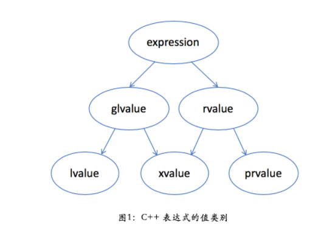

- lvalue: 等号左边的表达式，既有名字又有地址的表达式

​    **变量，函数，数据成员名字**

​    **左值引用的表达式 如++x ,x=1 ,cout<<' '** 

   **字符串字面量**

   int & [operator](https://so.csdn.net/so/search?q=operator&spm=1001.2101.3001.7020)==(const int &lhs);

   ofstream & operator <<(ofstream on,const char *);//使用const char* 避免string 类型构造

   这些表达式背后都将返回一个左值引用

- rvaue: 等号右边的表达式
- glvalue: generalized lvalue 广义左值
- xvalue: expiring value 将亡值
- prvalue:pure rvalue 纯右值 

   纯右值没有标识符，是不可取地址的表达式，一般为临时对象

   返回非引用类型 x++，x+1, make_shared\<int>(42)

   除字符串的字面量。

**右值可以绑定在常量引用上(const int &x=1) 而不能绑定在普通引用(int &)**


大家可能都听说过左值右值，但可能会有部分读者还没有搞清楚这些概念。这里解惑下：

**左值和右值**

关于左值和右值，有两种方式理解：

**概念1**：

左值：可以放到等号左边的东西叫左值。

右值：不可以放到等号左边的东西就叫右值。

**概念2**：

左值：可以取地址并且有名字的东西就是左值。

右值：不能取地址的没有名字的东西就是右值。

> 右值可以赋值给左值，但左值不能赋值给右值。

举例来说：

```c++
int a = b + c
int d = 4; // d是左值，4作为普通字面量，是右值
```

a是左值，有变量名，可以取地址，也可以放到等号左边, 表达式b+c的返回值是右值，没有名字且不能取地址，&(b+c)不能通过编译，而且也不能放到等号左边。


左值一般有：

- 函数名和变量名
- 返回左值引用的函数调用
- 前置自增自减表达式++i、--i
- 由赋值表达式或赋值运算符连接的表达式(a=b, a += b等)
- 解引用表达式*p
- 字符串字面值"abcd"


介绍右值前需要先介绍两个概念：纯右值和将亡值。

**纯右值**

运算表达式产生的临时变量、不和对象关联的原始字面量、非引用返回的临时变量、lambda表达式等都是纯右值。例如：

- 除字符串字面值外的字面值
- 返回非引用类型的函数调用
- 后置自增自减表达式i++、i--
- 算术表达式(a+b, a*b, a&&b, a==b等)
- 取地址表达式等(&a)


**将亡值**

将亡值是指C++11新增的和右值引用相关的表达式，通常指将要被移动的对象、T&&函数的返回值、std::move函数的返回值、转换为T&&类型转换函数的返回值，将亡值可以理解为即将要销毁的值，通过“盗取”其它变量内存空间方式获取的值，在确保其它变量不再被使用或者即将被销毁时，可以避免内存空间的释放和分配，延长变量值的生命周期，常用来完成移动构造或者移动赋值的特殊任务。例如：

```c++
class A {
    xxx;
};
A a;
auto c = std::move(a); // c是将亡值
auto d = static_cast<A&&>(a); // d是将亡值
```


**左值引用、右值引用**

根据名字大概就可以猜到意思，左值引用就是对左值进行引用的类型，右值引用就是对右值进行引用的类型，他们都是引用，都是对象的一个别名，并不拥有所绑定对象的内存，所以都必须立即初始化。

```c++
type &name = exp; // 左值引用
type &&name = exp; // 右值引用
```


**左值引用**

看代码：

```c++
int a = 5;
int &b = a; // b是左值引用
b = 4;
int &c = 10; // error，10无法取地址，无法进行引用
const int &d = 10; // ok，因为是常引用，引用常量数字，这个常量数字会存储在内存中，可以取地址
```

可以得出结论：对于左值引用，等号右边的值必须可以取地址，如果不能取地址，则会编译失败，或者可以使用const引用形式，但这样就只能通过引用来读取输出，不能修改数组，因为是常量引用。


**右值引用**

如果使用右值引用，那表达式等号右边的值需要是右值，可以使用std::move函数强制把左值转换为右值。

```c++
int a = 4;
int &&b = a; // error, a是左值
int &&c = std::move(a); // ok
```


**小知识**

右值是C++从C继承来的概念，最初是指=号右边的值。但现在C++中的右值已经与它最初的概念完全不一样了。在C++中右值指的的临时值或常量，更准确的说法是**保存在CPU寄存器中的值为右值，而保存在内存中的值为左值**。

可能有很多同学对计算机系统的底层不太了解，我们这里做一个简单的介绍。计算机是由CPU、内存、主板、总线、各种硬件等组成的，这个大家应该都清楚。而CPU又是由逻辑处理器，算术单元、寄存器等组成的。我们的程序运行时并不是直接从内存中取令运行的，因为内存相对于CPU来说太慢了。一般情况下都是先将一部分指令读到CPU的指令寄存器，CPU再从指令寄存器中取指令然后一条一条的执行。对于数据也是一样，先将数据从内存中读到数据寄存器，然后CPU从数据寄存器读数据。以Intel的CPU为例，它就包括了 EAX、EBX、ECX、EDX…多个通用寄存器，这样就可以让CPU更高效的工作。

比如说一个常数5，我们在使用它时不会在内存中为其分配一个空间，而是直接把它放到寄存器中，所以它在C++中就是一个右值。再比如说我们定义了一个变量 a，它在内存中会分配空间，因此它在C++中就是左值。那么`a+5`是左值还是右值呢？当然是右值对吧，因为a+5的结果存放在寄存器中，它并没有在内存中分配新空间，所以它是右值。

通过上面的描述你就应该对 C++ 中的左值和右值比较清楚了。我们来看个例子吧：

```
#include<iostream>

int main(int argc, char *argv[]){

    int && a = 5;  // 正确，5会被直接存放在寄存器中，所以它是右值
    int b = 10;
    int && c = b;  // 错误，b在内存中有空间，所以是左值；左值不能赋值给右值
    int && d = b + 5; // 正确，虽然 b 在内存中，但 b+5 的结果放在寄存器中，它没有在内存中分配空间，因此是右值 
}
```

在C++中使用`&&`表示右值引用，在上面的例子中，我首先将常数5赋值给右值引用a，因为常数5是右值，所以这条语句可以编译成功；紧接着我定义了变量b，因为它是左值，所以当将b赋值给右值引用c时，编译器会报错；最后一行将`b+5`赋值给右值引用d，由于`b+5`不会在内存中占用空间所以这也是右值，因此最后一句编译也没有任何问题。

接下来我们看一个有意思的情况，代码如下：

```
...
int && e = a;
..
```

这种情况是否是合法的呢？实际上当你这么做的时候编译器会报错，因为a是左值而e必须接收右值。那有没有办法将一个左值转成右值呢？这个问题我们前面其实已经回答过了，通过std::move就可以解决这个问题。我们来看一个例子：

```
...
int && e = std::move(a);
...
```

之前我们直接将a赋值给e是肯定不行的，但上面的操作编译器就不会报错了，因为通过std::move可以将一个左值转成右值。但这里有一点需要特别注意：**e虽然接收的必须是右值，但它本身是左值。换句话说e是一种特殊的变量，它是只能接收右值的变量。我们再从左值的本质来看，e也是占内存空间的，所以它肯定是左值。**

### C++11新特性：万能引用

万能引用又叫通用引用。什么是通用引用呢？就是它既可以接收左值也可以接收右值。我们来看一下例子：

```c++
#include<iostream>

template<typename T>
void func(T&& param){
    std::cout << "the value is "<< param << std::endl;
}

int main(int argc, char *argv[]){

    int a = 123;
    auto && b = 5;   //通用引用，可以接收右值

    int && c = a;    //错误，右值引用，不能接收左值

    auto && d = a;   //通用引用，可以接收左值

    const auto && e = a; //错误，加了const就不再是通用引用了

    func(a);         //通用引用，可以接收左值
    func(10);        //通用引用，可以接收右值
}
```

在上面代码中有两种类型的通用引用: 一种是auto，另一种是通过模板定义的T&&。实际上auto就是模板中的T，它们是等价的。下面我们就对这段代码做下详细解读。

代码中的 a 是个左值，因为它在内存中会分配空间，这应该没什么异义；b 是通过引用。为什么呢？因为通用引用有两个条件：一，必须是T&&的形式，由于auto等价于T，所以auto && 符合这个要求；二，T类型要可以推导，也就是说它必须是个模板，而auto是模板的一种变型，因此b是通用引用。通用引用即可以接收左值，也可以接收右值，所以b=5是正确的；c不是通用引用，因为它不符合T&&的形式。所以第三行代码是错误的，右值引用只能接收右值；d是通用引用，所以给它赋值a是正确的；e不是通用引用，它多了一个const已不符合T&& 的形式，所以给它左值肯定会出错；最后两个函数调用的形参符合 T&&，又因是模板可以进行类型推导，所以是通用引用，因此给它传左值和右值它都能正确接收。

### C++11新特性：模板类型推导

通用引用好强大呀！它既可以接收左值又可以接收右值，它是如何做到的呢？这就要讲讲模板的类型推导了。

模板的类型推导规则还是蛮复杂的，这里我们只简要说明一下，有兴趣的同学可以查一下C++11的规范。我们还是举个具体的例子吧：

```c++
template <typename T>
void f(ParamType param);

f(expr);
```

上面这个例子是函数模板的通用例子，其中T是根据f函数的参数推到出来的，而ParamType则是根据 T 推导出来的。T与ParamType有可能相等，也可能不等，因为ParamType是可以加修饰的。我们看下面的例子：

```c++
template <typename T>
void f(T param);

template <typename T>
void func(T& param);

template <typename T>
void function(T&& param);

int main(int argc, char *argv[]) {

    int x = 10;         // x是int
    int & rr = x;       // rr是 int &
    const int cx = x;   // cx是const int
    const int& rx = x;  // rx是const int &
    int *pp = &x;       // pp是int *

    //下面是传值的模板，由于传入参数的值不影响原值，所以参数类型退化为原始类型
    f(x);               // T是int
    f(cx);              // T是int
    f(rx);              // T是int
    f(rr);              // T是int
    f(pp);              // T是int*，指针比较特殊，直接使用

    //下面是传引用模板, 如果输入参数类型有引用，则去掉引用;如果没有引用，则输入参数类型就是T的类型
    func(x);            // T为int
    func(cx);           // T为const int
    func(rx);           // T为const int
    func(rr);           // T为int
    func(pp);           // T是int*，指针比较特殊，直接使用

    //下面是通用引用模板，与引用模板规则一致
    function(x);        // T为int&
    function(5);        // T为int
}
```

上面代码中可以将类型推导分成两大类：其中类型不是引用也不是指针的模板为一类; 引用和指针模板为另一类。

对于第一类其推导时根据的原则是，函数参数传值不影响原值，所以无论你实际传入的参数是普通变量、常量还是引用，它最终都退化为不带任何修修饰的原始类型。如上面的例子中，`const int &`类型传进去后，退化为int型了。

第二类为模板类型为引用（包括左值引用和右值引用）或指针模板。这一类在类型推导时根据的原则是去除对等数量的引用符号，其它关键字照般。还是我们上面的例子，`func(x)`中x的类型为 `int&`，它与`T&`放在一起可以知道T为int。另一个例子`function(x)`，其中x为`int&`它与T&& 放在一起可知T为`int&`。

根据推导原则，我们可以知道通用引用最终的结果是什么了，左值与通用引用放在一推导出来的T仍为左值，而右值与通用引用放在一起推导出来的T仍然为右值。

### C++11新特性：类型成员

实际上上面通过模板推导出的T与move的返回类型息息相关的，要讲明白这一点我们先要把move的返回类型弄明白。下面我们就来讨论一下move的返回类型：

```c++
typename remove_reference<T>::type&&
```

move的返回类型非常奇特，我们在开发时很少会这样写，它表示的是什么意思呢？

这就要提到C++的另外一个知识点，即类型成员。你应该知道C++的类成员有成员函数、成员变量、静态成员三种类型，但从C++11之后又增加了一种成员称为类型成员。类型成员与静态成员一样，它们都属于类而不属于对象，访问它时也与访问静态成员一样用`::`访问。

了解了这点，我们再看move的返类型是不是也不难理解了呢？它表达的意思是返回remove_reference类的type类型成员。而该类是一个模板类，所以在它前面要加typename关键字。

remove_reference看着很陌生，接下来我们再分析一下remove_reference类，看它又起什么作用吧。其实，通过它的名子你应该也能猜个大概了，就是通过模板去除引用。我们来看一下它的实现吧。

```c++
template <typename T>
struct remove_reference{
    typedef T type;  //定义T的类型别名为type
};

template <typename T>
struct remove_reference<T&> //左值引用
{
    typedef T type;
}

template <typename T>
struct remove_reference<T&&> //右值引用
{
   typedef T type;
}
```

上面的代码就是remove_reference类的代码，在C++中struct与class基本是相同的，不同点是class默认成员是private，而struct默认是public，所以使用struct代码会写的更简洁一些。

通过上面的代码我们可以知道，经过remove_reference处理后，T的引用被剔除了。假设前面我们通过move的类型自动推导得到T为int&&，那么再次经过模板推导remove_reference的type成员，这样就可以得出type的类型为int了。

remove_reference利用模板的自动推导获取到了实参去引用后的类型。现在我们再回过来看move函数的时候是不是就一目了解了呢？之前无法理解的5行代码现然变成了这样：

```c++
int && move(int&& && t){
    return static_case<int&&>(t);
}

//或
int && move(int& && t){
    return static_case<int&&>(t);
}
```

经上面转换后，我们看这个代码就清晰多了，从中我们可以看到move实际上就是做了一个类型的强制转换。如果你是左值引用就强制转换成右值引用。

### C++11新特性：引用折叠

上面的代码我们看起来是简单了很多，但其参数`int& &&`和`int && &&`还是让人觉得很别扭。因为C++编译器根本就不支持这两种类型。咦！这是怎么回事儿呢？

到这里我们就要讲到最后一个知识点引用折叠了。在C++中根本就不存 `int& &&`、`int && &&`这样的语法，但在编译器内部是能将它们识别出来的。换句话说，编译器内部能识别这种格式，但它没有给我们提供相应的接口(语法）。

实际上，当编译器遇到这类形式的时候它会使用引用折叠技术，将它们变成我们熟悉的格式。其规则如下：

- `int & &` 折叠为 `int&`
- `int & &&` 折叠为 `int&`
- `int && &` 折叠为 `int&`
- `int && &&` 折叠为 `int &&`

总结一句话就是左值引用总是折叠为左值引用，右值引用总是折叠为右值引用。

经过这一系列的操作之后，对于一个具体的参数类型`int & a`，std::move就变成了下面的样子：

```c++
int && move(int& t){
    return static_case<int&&>(t);
}
```

这一下我们就清楚它在做什么事儿了哈！

### C++11新特性：std::move()

**使用std::move()的好处：**

> 1.在使用该方法的过程中，它并没有拷贝任何对象，只是**将对象的状态或者所有权从一个对象转移到了另外一个对象**，因此，在实际的使用过程中，减少了对象的多次拷贝，从而提升了程序的性能。
>
> 2.减少了拷贝对象的过程中调用拷贝构造函数的开销。
>
> 解决在效率上的问题，减少不必要的拷贝。如果存在这样一个移动构造函数的话，所有源对象为临时对象的拷贝构造行为都可以简化为移动式(move)构造。对于普通的string类型而言，std::move和copy construction之间的效率差是节省了一次O(n)的分配操作，一次O(n)的拷贝操作，一次O(1)的析构操作（被拷贝的那个临时对象的析构）。这里的效率提升是显而易见且显著的。
> 在STL vector扩容时，移动语义的优势更为重要，提升了很大的效率。
>
> **注意：!!!**
>
> 移动语义仅针对于那些**实现了移动构造函数的类的对象**，对于那种基本类型int、float等没有任何优化作用，还是会拷贝，因为它们实现没有对应的移动构造函数。

**std::move()的作用:**

> **生成右值**
>
> std::move()的作用是，无论你传给它的是左值还是右值，通过std::move之后都变成了右值。
>
> **延长将亡值的生命周期**
>
> 如果一个 prvalue 被绑定到一个引用上，右值引用的生命周期将延续到和引用变量一样长。
>
> ```css
> ++i;
> ```
>
> ++i 返回的值将在这条语句结束后被释放
>
> ```python
> int && a ==++i;
> ```
>
> 生命周期将延续与a相同。
>
> 但是通过move生成的xvalue将不会改变生命周期

在C++11中提供了std::move方法，该方法为使用移动语义提供了方便，在使用该方法的过程中，它并没有拷贝任何对象，只是将对象的状态或者所有权从一个对象转移到了另外一个对象，因此，在实际的使用过程中，减少了对象的多次拷贝，从而提升了程序的性能。

**1 拷贝和move区别**

为了方便理解拷贝和move的区别，请看下图

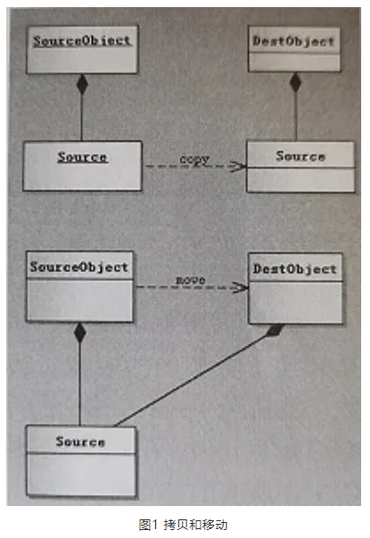

在图1中，如果将SourceObject对象拷贝到DestObject的过程中，如果使用拷贝，则需要将Source对象也进行拷贝，但如果使用move方法，则只是将SourceObject移动到DestObject对象中，仅仅是对象所有权和状态的改变，并没有发生任何拷贝。在这一过程中，move唯一的功能是将一个左值引用转换为一个右值引用，使我们通过右值引用使用这个对象，从而实现移动构造。


**2 拷贝和move实例**

在实际编码过程中，C++11提供的move方法会将拷贝的代价降低到最小，例如在vector中插入元素时，就可以使用move语义，减少对像的拷贝：

```c++
int main () 
{
  std::string foo = "foo-string";
  std::string bar = "bar-string";  
  std::vector<std::string> myvector;  
  myvector.push_back (foo);                    // copies  
  myvector.push_back (std::move(bar));         // moves
  std::cout << "myvector contains:";
  for (std::string& x:myvector) 
    std::cout << ' ' << x;  std::cout << '\n';
  return 0;
 }
```

程序运行结果如下：

```
myvector contains: foo-string bar-string
```

在上面的代码中vector插入了两个对象，第一个对象使用了拷贝，在插入容器后，依旧可以使用foo对象；第二个对象使用move，在插入容器后，就不在拥有对象，所以如果在上面的代码中，加一行如下输出，实际上是bar是打印不出任何内容的，如下：

```c++
std::cout<<"foo="<<foo<<" ,bar="<<bar<<std::endl;
```

运行后的结果如下：

```
foo=foo-string ,bar=
```


**3 move原型**

move方法的原型如下：

```c++
template <typename T>
typename remove_reference<T>::type&& move(T&& t)
{
  return static_cast<typename remove_reference<T>::type&&>(t);
}
```

从move方法的定义来看，move实际上并没有做任何事情，只是做了类型强制转换，当传入的参数为右值时，move实际上没有做任何事情，但是为了支持左值传参，让T&&满足万能传参，还是使用了引用折叠的方法，具体如下：

> 如果是X& &、X& && 和 X&& & 折叠后转换成为：X&；
>
> 如果是X&& && 折叠后转换成为：X&&。

所以，当`t`为左值或者左值引用时，进过引用折叠，得到的类型是`T&`。最后就是将左值转换为右值并返回了。

使用move传递左值时，还需要注意一点就是：`std::move()`可以应用于左值，但是用后就表示当前的值不再需要了，如果后续使用了该值，则会产生意想不到的结果。

### C++11新特性：std::forward()，完美转发

**std::forward的作用：**

> std::forward被称为**完美转发**，它的作用是保持原来的`值`属性不变。啥意思呢？通俗的讲就是，如果原来的值是左值，经std::forward处理后该值还是左值；如果原来的值是右值，经std::forward处理后它还是右值。

完美转发指可以写一个接受任意实参的函数模板，并转发到其它函数，目标函数会收到与转发函数完全相同的实参，转发函数实参是左值那目标函数实参也是左值，转发函数实参是右值那目标函数实参也是右值。

C++11给我们提供了这样一个函数std::forward,它就是专门为完美转发而生的，实际使用时它会完全按照参数本来的类型进行转发，而不是改变。

**代码示例：**

```c++
template<typename T>
void print(T & t){
    std::cout << "lvalue" << std::endl;
}

template<typename T>
void print(T && t){
    std::cout << "rvalue" << std::endl;
}

template<typename T>
void testForward(T && v){
    print(v);
    print(std::forward<T>(v));
    print(std::move(v));
}

int main(int argc, char * argv[])
{
    testForward(1);

    std::cout << "======================" << std::endl;

    int x = 1;
    testFoward(x);
}
```

在上面的代码中，定义了两个模板函数，一个接收左值，另一个接收右值。在`testForward`函数中向模板函数`print`传入不同的参数，这样我们就可以观察出forward与move的区别了。

上面代码执行结果如下：

```
lvalue
rvalue
rvalue
=========================
lvalue
lvalue
rvalue
```

从上面第一组的结果我们可以看到，传入的1虽然是右值，但经过函数传参之后它变成了左值（在内存中分配了空间）；而第二行由于使用了std::forward函数，所以不会改变它的右值属性，因此会调用参数为右值引用的print模板函数；第三行，因为std::move会将传入的参数强制转成右值，所以结果一定是右值。

再来看看第二组结果。因为x变量是左值，所以第一行一定是左值；第二行使用forward处理，它依然会让其保持左值，所以第二也是左值；最后一行使用move函数，因此一定是右值。

通过上面的例子我想你应该已经清楚forward的作用是什么了吧？


**std::forward原型：**

```c++
//左值引用版本
template <class T> 
T&& forward (typename remove_reference<T>::type& arg) noexcept;	// 注：这里返回值经引用折叠后为&& &，依然是左值&
//右值引用版本
template <class T> 
T&& forward (typename remove_reference<T>::type&& arg) noexcept;
```

在上面的声明中，主要包含两点：

1）如果参数是左值，函数不会修改参数类型，也将返回一个左值引用；

2）如果参数是右值，函数也将返回一个右值引用；

forward实现了两个模板函数，一个接收左值，另一个接收右值。在上面有代码中：

```c++
typename std::remove_reference<T>::type
```

的含义我们在[分析std::move](http://avdancedu.com/a39d51f9/)时已经向你做了说细的说明，其作用就是获得去掉引用后的参数类型。所以在上面的两个模板函数中，第一个是左值引用模板函数，第二个是右值引用模板函数。

紧接着forward模板函数对传入的参数进行强制转换，转换的目标类型符合引用折叠规则，因此左值参数最终转换后仍为左值，右值参数最终转成右值。

**1 参数转发示例**

```c++
void PrintV(int &t) {
    cout << "lvalue" << endl;
}

void PrintV(int &&t) {
    cout << "rvalue" << endl;
}

template<typename T>
void Test(T &&t) {
    PrintV(t);
    PrintV(std::forward<T>(t));
    PrintV(std::move(t));
    cout << endl;
}

int main() {
    Test(1); // lvalue rvalue rvalue
    int a = 1;
    Test(a); // lvalue lvalue rvalue
    Test(std::forward<int>(a)); // lvalue rvalue rvalue
    Test(std::forward<int&>(a)); // lvalue lvalue rvalue
    Test(std::forward<int&&>(a)); // lvalue rvalue rvalue
    return 0;
}
```

**分析**

- Test(1)：1是右值，模板中T &&t这种为万能引用，右值1传到Test函数中变成了右值引用，但是调用PrintV()时候，**t变成了左值，因为它变成了一个拥有名字的变量**，所以打印lvalue，而PrintV(std::forward<T>(t))时候，会进行完美转发，按照原来的类型转发，所以打印rvalue，PrintV(std::move(t))毫无疑问会打印rvalue。

- Test(a)：a是左值，模板中T &&这种为万能引用，左值a传到Test函数中变成了左值引用，所以有代码中打印。

- Test(std::forward<T>(a))：转发为左值还是右值，依赖于T，T是左值那就转发为左值，T是右值那就转发为右值。

  > 需要注意的是：
  >
  > ```c++
  > int a = 1;
  > PrintV(std::forward<int>(a));	// rvalue
  > 
  > // 输出结果是rvalue，说明std::forward<int>(a)会将a变成右值。
  > ```


从上面的实例可以知道，使用右值引用、完美转发、以及可变参数模板后，可以实现一个完成的函数宝装器，具体如下：

```c++
template<class Function,class ... Args>
inline auto FunctionWrapper(Function &&f,Args && ... args) -> decltype(f(std::forward<Args>(args)...))
{
    return f(std::forward<Args>(args)...);
}
```

代码如上，是不是很简单，这个函数已经完美实现一个万能的函数包装器，下面我们可以写一个代码进行验证。

```c++
void test0()
{
    std::cout<<"void"<<std::endl;
}

int test1()
{
    std::cout<<1<<std::endl;
    return 1;
}

int test2(int x)
{
    std::cout<<x<<std::endl;
    return x;
}

std::string test3(std::string str1,std::string str2)
{
     std::cout<<str2+str1<<std::endl;
    return str2+str1;
}

void test()
{
    FunctionWrapper(test0);
    FunctionWrapper(test1);
    FunctionWrapper(test2,2);
    FunctionWrapper(test3,"world","hello");
}
int main (
{
  test();
  return 0;
}
```

程序运行结果如下：

```
void
1
2
helloworld
```


### C++11新特性：容器的emplace_back()方法

empalce系列函数通过直接构造对象的方式避免内存拷贝和移动。

在C++11之前，向vector中插入数据时常用的方法是push_back，从C++11开始，又提供了empalce，emplace_back方法，这些方法可以看成是push_back的替代品，不但使用简单，而且性能提升也比较明显。emplace_back的使用方法如下：

```c++
struct A
{
    int x;
    double y;
    A(int a,double b):x(a),y(b){}
};  

int main()
{  
    std::vector<A> v;
    v.emplace_back(1,2);
    std::cout<<v.size()<<std::endl;		// 1
    return 0;
}
```

从上面的代码可以看出，emplace_back方法使用简单，可以直接通过构造函数构造对象，因此，在实际编码的时候，我们也需要提供对象的构造方法，如果不提供，编译时将会报错，可以注释掉构造函数验证下。

相比push_back，emplace_back的性能优势也很明显，emplace_back通过减少内存移动和拷贝从而提升容器的插入性能，可以在上面的代码基础上改造完成。

```c++
struct A
{
    int x;
    double y;
    std::string z;
    A(int a, double b, std::string c) :x(a), y(b), z(c) {
        std::cout << "is constructed" << std::endl;
    }
    A(const A& otherA) :x(otherA.x), y(otherA.y), z(std::move(otherA.z)) {
        std::cout << "is moved" << std::endl;
    }
};
int main()
{
    std::vector<A> v;
    std::cout << "------emplace_back:---------" << std::endl;
    v.emplace_back(1, 2, "helloword");
    std::cout << "------push_back:---------" << std::endl;
    v.push_back(A(3, 4, "china"));
    return 0;
}
```

运行结果为：

```
------emplace_back:---------
is constructed
------push_back:---------
is constructed
is moved
is moved
```

深度解析上述结果，理应push_back只复制构造一次，为什么却调用了两次复制构造函数呢？推测是触发了vector的自动扩容机制，先扩容为原来的两倍，构造好当前元素，放进去，然后再把原来的元素拷贝过去，所以总共两次。为了验证这个想法，进行了以下实验：

```c++
struct A
{
    int x;
    double y;
    std::string z;
    A(int a, double b, std::string c) :x(a), y(b), z(c) {
        std::cout << "is constructed" << std::endl;
    }
    A(const A& otherA) :x(otherA.x), y(otherA.y), z(std::move(otherA.z)) {
        std::cout << "is moved" << std::endl;
    }
};
int main()
{
    std::vector<A> v;
    v.reserve(sizeof(A) * 10);
    std::cout << "------emplace_back:---------" << std::endl;
    v.emplace_back(1, 2, "helloword");
    std::cout << "------create and push_back:---------" << std::endl;
    v.push_back(A(3, 4, "china"));
    std::cout << "------create:---------" << std::endl;
    A tmp(3, 4, "china");
    std::cout << "------push_back:---------" << std::endl;
    v.push_back(tmp);
    return 0;
}
```

运行结果如下：

```
------emplace_back:---------
is constructed
------create and push_back:---------
is constructed
is moved
------create:---------
is constructed
------push_back:---------
is moved
```

可以看到，先把vector预留足够多的空间，然后在进行下面的操作，这时就不会触发vector的自动扩容了，可以看到push_back只调用了一次赋值构造函数，完美验证猜想。


### C++11新特性：无序容器

C++11中新增了无序容器，如：unordered_map/unordered_multimap和unordered_set/unordered_multiset容器，在实际插入时，这些容器不在进行排序，因此相对有序的map和set来说效率都有提升。

map和set的底层实现是红黑树，对应的无序容器底层实现是Hash Table，由于内部通过哈希进行快速操作因此效率将会更高。在使用无序容器时，如果是基本类型数据，则不需要提供哈希函数和比较函数，使用方法和普通的map、set是一样的，如果数据类型是自定义的，在使用时需要提供哈希函数和比较函数，具体代码如下：

```c++
struct Key
{
    std::string first;
    std::string second;
};
struct KeyHash {
    std::size_t operator() (const Key& k) const {
        return std::hash<std::string>() (k.first) ^
            (std::hash<std::string>() (k.second) << 1);
    }
};
struct KeyEqual {
    bool operator()(const Key& lhs, const Key& rhs) const {
        return lhs.first == rhs.first && lhs.second == rhs.second;
    }
};
int main()
{
    //定义一个空的无序map 
    std::unordered_map<std::string, std::string> mymap1;
    //初始化
    std::unordered_map<std::string, double> mymap2 = {
         {"mom",5.4},
         {"dad",6.1},
         {"bro",5.9} };
    //拷贝构造
    std::unordered_map<std::string, double> mymap3 = mymap2;
    //移动构造
    std::unordered_map<std::string, double> mymap4 = std::move(mymap2);
    //区间构造
    std::vector<std::pair<std::string, double> > v = {
             {"cpp",1},
             {"java",2}
    };
    std::unordered_map<std::string, double> mymap5(v.begin(), v.end());
    std::unordered_map<std::string, double> mymap7(mymap2.begin(), mymap2.end());
    //自定义无序容器
    std::unordered_map< Key, std::string, KeyHash, KeyEqual> mymap6 = {
             { {"cpp","top"},"one"},
             { {"java","top"},"two"}
    };
    return 0;
}
```


### C++11新特性：tuple元组

tuple元组是一个泛化的std::pair，可以在一个数据结构中保存不同类型的变量，这一点和C#里面的tupe类似，由此可见，C++也在逐渐吸收其他编程语言的优良特性，加入到自己的势力范围里面来。

tupe简约而不简单，简约是指使用简单，不简单是指实现原理比较复杂，喜欢研究源码的同学可以去深入了解下。下面将介绍下tupe的使用方法。


**构建tuple**

```c++
#include <tuple>
using namespace std;
tuple<const char*,int> tp = make_tupe(recvPack,iRecvSize);
```

该tuple可以等价于一个结构体，翻译成结构体代码如下：

```c++
struct tuple {
    const char* elem1;
    int elem2;
}
```

构建tuple时，也可以使用下面的方式进行：

```c++
int x = 1;
int y = 2;
string s = "hello world";
auto tp = std::tie(x,y,s);//这里tp的类型会被推导成tuple类型
```

tp的类型实际为：std::tuple<int &,int &,string &>


**获取tuple的值**

在实际编程中，也可以通过tie方法获取tuple的值，解包时会自动将编程进行赋值，当然，如果在编码中不想解出所有的包内容，也可以使用std::ignore进行忽略，这样就可以解出自己想要的内容并进行赋值。如：

```c++
int x;
int y;
string s;
std::tie(x,y,s) = tp ;// 这里tp里面保存的值自动赋值给x,y,s
std::tie(std::ignore,y,s) = tp;//这样x就会被忽略，实际不会呗解析出来
```


**tuple的连接**

tuple可以通过tuple_cat 将多个tuple进行连接。代码如下：

```c++
int main()
{
    std::tuple<int,int,std:;string> t1(1,2,"hello");
    int n= 7;
    auto t2 = tuple_cat(t1,std::make_pair("foor","bar"),t1,std::tie(10));
    std::cout<<t2<<std::endl;
    n = 10；
    return 0;
}
```

上面代码的输出结果如下：

1,2,"hello","foor","bar",1,2,"hello",10


综上：tuple使用非常简单，但是这里我们也只是说了冰山一角，后面也会在再次进行说明。

值得关注的是tuple虽然可以替换结构体，但是也不能乱用，如果一个结构体中有超过3个的变量，使用tuple反而会变的麻烦，典型的特性是代码可读性降低，不利于代码的维护。


### C++11新特性：std::lock相关

C++11提供了两种锁封装，通过RAII方式可动态的释放锁资源，防止编码失误导致始终持有锁。

这两种封装是std::lock_guard和std::unique_lock，使用方式类似，看下面的代码：

```c++
#include <iostream>
#include <mutex>
#include <thread>
#include <chrono>

using namespace std;
std::mutex mutex_;

int main() {
    auto func1 = [](int k) {
        // std::lock_guard<std::mutex> lock(mutex_);
        std::unique_lock<std::mutex> lock(mutex_);
        for (int i = 0; i < k; ++i) {
            cout << i << " ";
        }
        cout << endl;
    };
    std::thread threads[5];
    for (int i = 0; i < 5; ++i) {
        threads[i] = std::thread(func1, 200);
    }
    for (auto& th : threads) {
        th.join();
    }
    return 0;
}
```

普通情况下建议使用std::lock_guard，因为std::lock_guard更加轻量级，但如果用在条件变量的wait中环境中，必须使用std::unique_lock。

> 注：th.join()方法是串行执行的，不是并行。


### C++11新特性：条件变量

条件变量是C++11引入的一种同步机制，它可以阻塞一个线程或多个线程，直到有线程通知或者超时才会唤醒正在阻塞的线程，条件变量需要和锁配合使用，这里的锁就是上面介绍的std::unique_lock。

这里使用条件变量实现一个CountDownLatch：

```c++
class CountDownLatch {
public:
    explicit CountDownLatch(uint32_t count) : count_(count);

    void CountDown() {
        std::unique_lock<std::mutex> lock(mutex_);
        --count_;
        if (count_ == 0) {
            cv_.notify_all();
        }
    }

    void Await(uint32_t time_ms = 0) {
        std::unique_lock<std::mutex> lock(mutex_);
        while (count_ > 0) {
            if (time_ms > 0) {
                cv_.wait_for(lock, std::chrono::milliseconds(time_ms));
            }
            else {
                cv_.wait(lock);
            }
        }
    }

    uint32_t GetCount() const {
        std::unique_lock<std::mutex> lock(mutex_);
        return count_;
    }

private:
    std::condition_variable cv_;
    mutable std::mutex mutex_;
    uint32_t count_ = 0;
};
```

条件变量是C++11中提供的又一种线程同步机制，它可以阻塞一个或者多个线程，直到收到其它线程发出的超时或者通知才能够唤醒正在等待的线程，条件变量需要和互斥量配合使用，在C++ 11中共提供了两种条件变量。

- condition_variable：配合std::unique_lock\<std::mutex>使用
- condition_variable_any：和lock、unlock配合使用，使用相对比较灵活但是性能也会比较差一点。

条件变量使用过程如下：

- 获取互斥量
- 循环检查条件，如果条件不满足则一直阻塞，反之继续执行
- 线程执行完后调用notify_one或者notify_all唤醒等待的线程

在实际编码中，可以使用条件变量实现一个同步队列，同步队列可以作为线程安全的数据共享区，用户线程之间的数据读取，代码如下：

```c++

template<typename T>
class SynQueue
{
    bool IsFull() const
{
        return m_queue.size() ==  m_maxSize;
    }
    
    bool IsEmpty() const
{
        return m_queue.empty();
    }
public:
    SysQueue(int maxSize):m_maxSize(maxSize)
    {
        
    }
    
    void Put(const T &x)
{
        std::lock_guard<std::mutex> locker(m_mutex);
        while(IsFull())
        {
            cout<<"缓冲区满，需要等....."<<endl;
            m_notFull.wait(m_mutex);
        }
        
        m_queue.push_back(x);
        m_notEmpty.notify_one();
    }
    
    void Take(T &x)
{
         std::lock_guard<std::mutex> locker(m_mutex);
         while(IsEmpty())
         {
             cout<<"缓冲区空，需要等....."<<endl;
            m_notEmpty.wait(m_mutex);
         }
         
         x = m_queue.front();
         m_queue.pop_front();
         m_notFull.notify_one();
    }
    
    bool Empty()
{
        std::lock_guard<std::mutex> locker(m_mutex);
        return m_queue.empty();
    }
    
    bool Full()
{
        std::lock_guard<std::mutex> locker(m_mutex);
        return m_queue.size()==m_maxSize;
    }
    
    size_t Size()
    {
         std::lock_guard<std::mutex> locker(m_mutex);
        return m_queue.size();
    }
    
    int Count()
{
        return m_queue.size();
    }
private:
    std::list<T> m_queue;
    std::mutex m_mutex;
    std::condition_variable_any m_notEmpty;
    std::condition_variable_any m_notFull;
    int m_maxSize;
};
```

上面的代码实现了一个同步队列的功能，在队列没有满的情况下可以插入数据，如果队列满则会调用m_notFull进行阻塞等待其它线程发送通知，如果队列为空，则不能取出数据，会调用m_notEmpty条件变量进行阻塞，等待其它线程发送通知，然后继续执行。


### C++11新特性：原子变量

C++11提供了原子类型std::atomic，用于原子操作，使用这种方式既可以保证线程安全，也不需要使用锁来进行临界区保护，对一些普通变量来说尤其方便，看代码：

```c++
std::atomic<int> atomicInt;
atomicInt++;
atomicInt--;
atomicInt.store(2);
int value = atomicInt.load();
```

原子类型std::atomic\<T>可以使用类型做为模板，为了方便大家的使用C++11中内置了整型的原子变量。使用原子变量就不需要和互斥量配合使用，使用后的代码将更加简洁。下面的代码使用原子变量实现整型数值的自增操作。

 ```c++
 
 const int MAX_COUNT=3;
 atomic<int> n(0);
 
 void increase_n()
 {
     for(int i=0;i<MAX_COUNT;i++)
     {
         ++n;
     }
 }
 
 int main()
 {
     thread t1(increase_n);
     thread t2(increase_n);
 
     t1.join();
     t2.join();
     cout<<n<<endl;
     return 0;
 }
 ```

如上代码所示，最后程序输出结果为6；

**原子变量和互斥量性能对比**

下面，将对上面的代码进行改造，比较下分别使用原子变量和互斥变量，比较下他们的性能，代码一是对上面的代码简单改造，代码和运行结果如下：

```c++

const int MAX_COUNT = 1e6;
atomic<int> n(0);

void increase()
{
    for (int i = 0; i < MAX_COUNT; i++)
    {
        ++n;
    }
}

int main(void)
{
    long long ullBegin = clock();
    cout << "开始时CPU时钟" << ullBegin << endl;
    thread t1(increase);
    thread t2(increase);
    t1.join();
    t2.join();
    cout << n << endl;
    long long ullDelay = clock() - ullBegin;
    cout << "实行时间CPU时钟" << ullDelay << endl;
    return 0;
}
```

运行结果如下：

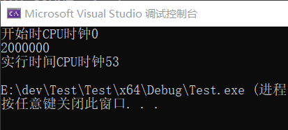

改成互斥量的代码为：

 ```c++
 
 mutex g_mutex;
 int sum(0);
 
 void increase_mutex()
 {
   for (int i = 0; i < MAX_COUNT; i++)
   {
     g_mutex.lock();
     ++sum;
     g_mutex.unlock();
   }
 }
 int main(void)
 {
   ULONGLONG ullBegin = GetTickCount64();
   cout << "开始时CPU时钟" << ullBegin << endl;
   thread t1(increase_mutex);
   thread t2(increase_mutex);
   t1.join();
   t2.join();
   cout << n << endl;
   ULONGLONG ullDelay = GetTickCount64()-ullBegin;
   cout << "实行时间CPU时钟" << ullDelay << endl;
   return 0;
 }
 ```

运行结果如下：

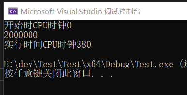

综上：由原子和互斥变量运行结果可知，使用原子变量比使用互斥量性能要提升**7.2倍**。


### C++11新特性：call_once/once_flag

在实际编程时，如果有变量或者函数需要被初始化或者执行一次，那么就可以使用call_once来保障了，在C++11中std::call_once用来保证在多线程运行环境下函数或者变量只被执行或者初始化一次，在使用call_once时，需要配合once_flag进行使用，使用方法也相对简单，代码示例如下：

```c++


int winner;
void set_winner (int x) { winner = x;   std::cout << "winner thread: " << winner << '\n';}
std::once_flag winner_flag;

void wait_1000ms (int id) {
  // count to 1000, waiting 1ms between increments:
  for (int i=0; i<1000; ++i)
    std::this_thread::sleep_for(std::chrono::milliseconds(1));
  // claim to be the winner (only the first such call is executed):
  std::call_once (winner_flag,set_winner,id);
}

int main ()
{
  std::thread threads[10];
  // spawn 10 threads:
  for (int i=0; i<10; ++i)
    threads[i] = std::thread(wait_1000ms,i+1);

  std::cout << "waiting for the first among 10 threads to count 1000 ms...\n";

  for (auto& th : threads) th.join();

  return 0;
}
```

在上面的代码中set_winner 只被运行了一次，id为获取到这个函数执行权限的线程序号。运行结果为：

 ```
 waiting for the first among 10 threads to count 1000 ms...
 winner thread: 6
 ```

需要说明的是每次执行代码时获取到函数执行权限的线程序号会存在不同。所以每次运行的结果也可能不同。


### C++11新特性：std::thread多线程

什么是多线程这里就不过多介绍，新特性关于多线程最主要的就是std::thread的使用，它的使用也很简单，看代码：

```c++
#include <iostream>
#include <thread>

using namespace std;

int main() {
    auto func = []() {
        for (int i = 0; i < 10; ++i) {
            cout << i << " ";
        }
        cout << endl;
    };
    std::thread t(func);
    if (t.joinable()) {
        t.detach();
    }
    auto func1 = [](int k) {
        for (int i = 0; i < k; ++i) {
            cout << i << " ";
        }
        cout << endl;
    };
    std::thread tt(func1, 20);
    if (tt.joinable()) { // 检查线程可否被join
        tt.join();
    }
    return 0;
}
```

这里记住，std::thread在其对象生命周期结束时必须要调用join()或者detach()，否则程序会terminate()，这个问题在C++20中的std::jthread得到解决，但是C++20现在多数编译器还没有完全支持所有特性，先暂时了解下即可，项目中没必要着急使用。

C++ 11之前，C++语言并没有提供支持，想要开发多线程程序就要借助于操作系统提供的多线程接口，但是，这样并不能开发跨平台可移植的并发程序，C++11提供了多线程语言支撑，使得程序的可移植性大大提升。

**1 线程**

线程是操作系统能够进行运算调度的最小单位。它被包含在进程之中，是进程中的实际运作单位。具备占用并发、占用资源少、资源共享等优势。同样，在使用线程进行编码时也要关注多线程的一些缺点，如：变量共享导致的结果差异、多线程调试、死锁等很多现实的问题，因此在使用多线程编码时要格外注意。

**1.1 创建线程**

C++ 11中创建一个线程是很简单的事情，只需要使用std::thread就可以轻松创建一个线程，我们要做的只是提供一个线程函数或者函数对象，创建线程时也可以同时给线程函数指定参数，代码如下：

```c++

void foo() 
{
  std::cout<<"foo"<<std::endl;
}

void bar(int x)
{
   std::cout<<"bar::x"<<x<<std::endl;
}

int main() 
{
  std::thread first (foo); 
  std::thread second (bar,0);
  std::cout << "main, foo and bar now execute concurrently...\n";
  first.join();
  second.join();
  std::cout << "foo and bar completed.\n";
  return 0;
}
```

上面的代码创建了两个线程，执行的线程函数一个有参一个无参，线程运行后输出的结果是这样的：

 ```
 
 main, foo and bar now execute concurrently...
 foo
 bar::x=0
 foo and bar completed.
 ```

但是也可能有其他输出形式，原因先不做解释，后面会揭晓答案。在这个代码中，创建的线程对象分别调用了join方法，这个方法的作用是阻塞线程，直到线程函数执行完毕，如果线程函数有返回值，返回值将会被忽略。

在thread中除了join外也提供了另外一个方法：**detach，线程创建完成后，调用detach方法，线程就会和主线程进行分离，编程一个后台的线程去执行，主线程也不会被阻塞**。需要关注的是一旦分离，两个线程之间就不会再有关联，也不能在通过join等待线程函数执行完毕。使用方法如下：

```c++

void foo() 
{
    while(1)
    {
        std::cout<<"foo"<<std::endl;
        Sleep(1000);
    }
  
}

int main() 
{
  std::thread first (foo); 
  while(1)
  {
     std::cout << "main thread.\n";
      Sleep(1000);
  }
  first.detach();
  return 0;
}
```

上面的代码线程创建完毕后，主线程输出“main thread”。线程first就会和主线程脱离，在后台执行线程函数，相互交叉打印日志。

按照上面的方法创建线程是一件非常简单的事情，但是，也有弊端，既：std::thread如果在线程函数返回前被析构就会发生意想不到的错误，因此需要确保线程函数在线程被析构之前执行完毕。如：可以将线程保存到一个容器中。如：

```c++
void foo() 
{
  std::cout<<"foo"<<std::endl;
}
void bar(int x)
{
   std::cout<<"bar::x="<<x<<std::endl;
}
std::vector<std::thread> g_list;
std::vector<std::shared_ptr<std::thread>> g_list2;

void CreateThread()
{
    //std::thread t(foo);
   // g_list.push_back(std::move(t));
   g_list2.push_back(std::make_shared<std::thread>(bar,2));
}

int main() 
{
 CreateThread();
 for(auto &thread : g_list)
 {
     thread.join();
 }
 for(auto &thread : g_list2)
 {
     thread->join();
 }
  return 0;
}
```

**1.2 线程基本用法**

**1） 获取当前信息：获取线程ID和CPU核心数**

```c++

void foo() 
{
    
}

int main() 
{
  std::thread first (foo); 
  //获取线程ID
  std::cout<<first.get_id()<<std::endl;
  //获取CPU核心数
  std::cout<<std::thread::hardware_concurrency()<<std::endl;
  return 0;
}
```

**2）线程休眠**

```c++

void foo() 
{
    std::this_thread::sleep_for(std::chrono::seconds(3));
    std::cout<<"time out"<<std::endl;
}

int main() 
{
  std::thread first (foo); 
  first.join();
  return 0;
}
```

**2 互斥量**

互斥量是一种线程同步的手段，用来保护多线程同时访问的共享数据，在C++ 11中，提供了多种互斥量，如下：

- std::mutex: 独占互斥
- std::timed_mutex:带有超时的互斥量
- std::recursive_mutex:递归互斥量
- std::recursive_timed_mutex:待超时的递归互斥量

**2.1 独占互斥量**

互斥量通常借助lock方法阻塞线程，取得控制权执行完毕后再调用unlock进行释放，在这个过程中，lock和unlock需要成对出现，这种方式时候同步的，同样也有一种方法是异步的，try_lock,取得互斥锁后会返回true，如果没有取得则返回false，是非阻塞的，std::mutex的用法如下：

```c++

std::mutex g_lock;
void foo() 
{
    g_lock.lock();
    std::cout<<"entry thread and get lock"<<std::endl;
    std::this_thread::sleep_for(std::chrono::seconds(1));
    std::cout<<"leave thread and release lock"<<std::endl;
    g_lock.unlock();
}

int main() 
{
  std::thread first (foo); 
  std::thread second (foo);
  std::thread three (foo); 
  first.join();
  second.join();
  three.join();
  return 0;
}
```

上面的代码通过互斥锁实现了三个线程的资源共享，运行结果如下：

 ```
 
 entry thread and get lock
 leave thread and release lock
 entry thread and get lock
 leave thread and release lock
 entry thread and get lock
 leave thread and release lock
 ```

lock和unlock必须成对出现，如果缺少unlock可能会造成第一个线程获得锁资源后，不进行释放，导致后面的线程产生所等待，导致线程假死。为了防止这种现像产生，可以使用lock_guard进行简化，他会在构造时获得锁资源，超出生命周期后对锁资源进行释放。如：

```c++

std::mutex g_lock;
void foo() 
{
    std::lock_guard<std::mutex> locker(g_lock);
    std::cout<<"entry thread and get lock"<<std::endl;
    std::this_thread::sleep_for(std::chrono::seconds(1));
    std::cout<<"leave thread and release lock"<<std::endl;
}
```

**2.2 递归的独占互斥变量**

递归锁一般不推荐使用，主要原因如下：

- 递归锁的使用会让逻辑变得复杂，导致多线程同步产生更加晦涩难懂的问题；
- 递归锁的效率同非递归锁相比，效率低；
- 递归锁允许同时获得同一个互斥量，超过一定次数后再次调用会产生系统异常

因此，鉴于以上原因，实际编码过程中并不建议使用递归锁，这里为了演示递归锁的使用方法，举例代码如下：

```c++
struct Complex{
    std::recursive_mutex mutex;
    int i;
    Complex():i(2){};
    void mul(int x)
{
        std::lock_guard<std::recursive_mutex> lock(mutex);
        i *= x;
        std::cout<<"mul::i="<<i<<std::endl;
    }
    
    void div(int x)
{
        std::lock_guard<std::recursive_mutex> lock(mutex);
        i /= x;
        std::cout<<"div::i="<<i<<std::endl;
    }
    
    void both(int x,int y)
{
        std::lock_guard<std::recursive_mutex> lock(mutex);
        mul(x);
        div(y);
    }    
};

int main() 
{
  Complex complex;
  complex.both(4,8);
  return 0;
}
```

**2.3 带超时的互斥量**

带超时的互斥锁主要是在原来互斥锁的基础上增加一个超时等待的功能，这样就不用一直去获取互斥锁，另外如果在等待的时间内还没有获得锁资源，在超时后还可以继续处理其他的事情。

超时互斥锁比普通的互斥锁多了两个接口，分别是：try_lock_for和try_lock_until,这两个接口的功能是设置获取互斥锁的等待超时时间。使用方法如下：

```c++
std::timed_mutex mtx;

void fireworks (int pid) {
  // waiting to get a lock: each thread prints "-" every 200ms:
  while (!mtx.try_lock_for(std::chrono::milliseconds(200))) {
    std::cout << "-";
  }
  // got a lock! - wait for 1s, then this thread prints "*"
  std::this_thread::sleep_for(std::chrono::milliseconds(1000));
  std::cout << pid <<"*\n";
  mtx.unlock();
}

int main ()
{
  std::thread threads[10];
  // spawn 10 threads:
  for (int i=0; i<10; ++i)
    threads[i] = std::thread(fireworks,i);

  for (auto& th : threads) th.join();

  return 0;
}
```

上面的代码通过while循环不断获取超时锁，如果达到超时时间还没有获取到锁就输出一个-，如果获取到锁则休眠1000毫秒输出*和线程号。代码运行结果如下：

```

------------------------------------0*
----------------------------------------3*
-----------------------------------9*
------------------------------8*
-------------------------6*
--------------------1*
---------------4*
----------7*
-----5*
2*
```

### C++11新特性：异步操作

C++ 11中提供了异步操作相关类和函数，不同的类具备不同的功能，总体来说类主要有：std::future,std::promise,std::package_task，函数主要是std::async。

**1 异步操作类**

上面三个类的主要功能是：

- std::future：该类主要作为异步结果传输通道，方便获取线程函数的返回值；
- std::promise：用来包装一个值，和future绑定使用，方便线程赋值；
- std::package_task：包装一个可调用对象，和future配合使用，方便异步调用。

**1.1 std::future**

define in `<future>`

在thread库中提供了该future访问异步操作的结果，由于异步结果不能马上取得，只能在未来某个时候进行获取，这个结果是一个未来值，因此叫做future。通过查询future状态获取结果，future由三种状态组成，分别是：

- Deferred：异步操作还没开始
- Ready：异步操作已经完成
- Timeout：异步操作超时

在实际编码中，可以通过判断这三种内部状态异步获取执行结果。代码示例如下：

```c++
std::cout << "checking, please wait";
  std::chrono::milliseconds span (1000);
  do{
      status = fut.wait_for(span);
      if(status == std::future_status::deferred)
      {
          std::cout << "\ndeferred" << std::flush;
      }
      else if(status == std::future_status::timeout)
      {
          std::cout << "\ntimeout" << std::flush;
      }
      else if(status == std::future_status::ready)
      {
          std::cout << "\ready" << std::flush;
      }
  }while(status != std::future_status::ready);
```

**1.2 std::promise**

define in `<future>`

使用std::promise可以实现在两个不同线程之间的数值传递。使用方法如下：

```c++

void print_set(std::promise<int> &pro)
{
    std::cout << "set value: " << "100" << '\n';
    pro.set_value(100);
}

void print_int (std::future<int>& fut) {
  int x = fut.get();
  std::cout << "value: " << x << '\n';
}

int main ()
{
  std::promise<int> prom;                  
  std::future<int> fut = prom.get_future();     
  std::thread th2 (print_set, std::ref(prom));  
  std::thread  th1 (print_int, std::ref(fut));                                                
  th1.join();
  th2.join();
  return 0;
}
```

上面的代码运行结果如下：

```

set value: 100
value: 100
```

**1.3 std::package_task**

define in `<future>`

和std::promise类似，需要结合future使用，但不同的是std::package_task包装的是一个函数，以此方便异步调用。使用方法如下：

```c++

int Add(int x,int y)
{
    return (x+y);
}

int main ()
{
  std::packaged_task<int(int,int)> pFun(Add);              
  std::future<int> fut = pFun.get_future();     
  std::thread th2 (std::move(pFun), 3,2);  
  int iRes = fut.get();
  std::cout<<"iRes="<<iRes<<std::endl;
  th2.join();
  return 0;
}
```

程序运行结果为：iRes=5

**2 异步操作函数：async**

相对前面的异步操作类，std::async要高级的多，且可以直接创建异步的task类，异步返回结果保存在future中，在获取线程函数返回结果时，使用get()获取返回值，如果不需要值则使用wait()方法。

std::async原型如下：

```c++
future<typename result_of<Fn(Args...)>::type>
    async (launch::async|launch::deferred, Fn&& fn, Args&&... args);
```

原型参数说明如下：

- launch::async: 调用async后就开始启动线程
- launch::deferred:延迟启动线程，等到后面调用了wait、get时在启动线程。
- fn：线程函数
- args：线程函数参数

async基本用法如下：

```c++
bool is_prime (int x) {
  std::this_thread::sleep_for(std::chrono::seconds(3));
  for (int i=2; i<x; ++i) if (x%i==0) return false;
  return true;
}

int main ()
{
  // call function asynchronously:
  std::future<bool> fut = std::async (is_prime,444444443); 
  std::future_status status;
  // do something while waiting for function to set future:
  std::cout << "checking, please wait";
  std::chrono::milliseconds span (1000);
  do{
      status = fut.wait_for(span);
      if(status == std::future_status::deferred)
      {
          std::cout << "\ndeferred" << std::flush;
      }
      else if(status == std::future_status::timeout)
      {
          std::cout << "\ntimeout" << std::flush;
      }
      else if(status == std::future_status::ready)
      {
          std::cout << "\ready" << std::flush;
      }
  }while(status != std::future_status::ready);
  
  bool x = fut.get();     // retrieve return value

  std::cout << "\n444444443 " << (x?"is":"is not") << " prime.\n";

  return 0;
}
```

上面代码的运行如果为：

```
checking, please wait
timeout
timeout
timeout
eadyout
444444443 is prime.
```

async是更高层次的异步操作，在实际编码时无需关注线程创建细节，就可以方便的获取线程执行状态和结果；一般情况下，默认使用launch::async参数。

### C++11新特性：type_tratis

在《代码大全》书中对代码的圈复杂度规则进行了说明，具体如下：

- 从函数第一行开始，一直往下看程序；
- 遇到以下关键字或者同类的字那么圈复杂度加1；关键字如下：if，while，for，end，or，repeat等；
- switch中case语句的每种情况都新增一个圈复杂度。

为了解决因为代码圈复杂度产生的代码质量问题，C++11提供了type_tratis类型萃取功能，在一定程度上可以消除冗长的代码分支语句，降低圈复杂度进而提升代码的可维护性。

**1 基本的type_traits**

C++ 11之前通过const或者enum枚举定义一个编译期常量的类型，在C++11中，则不需要这么定义，只需要从std::integral_constant进行派生即可。

**1.1 定义编译期常量**

C++11中可以从std::integral_constant派生，定义自己的编译期常量，std::integral_constant的定义原型为：

```c++
template <class T, T v>
struct integral_constant {
    static constexpr T value = v;
    typedef T value_type;
    typedef integral_constant<T, v> type;
    constexpr operator T() { return v; }
};
```

在integral_constant类中，可以通过成员变量value获取定义的编译期常量值。使用方法也很简单，派生integral_constant类后，则不用再新增定义类型和枚举变量。如下所示：

```c++
template <unsigned n>
struct factorial : std::integral_constant<int, n* factorial<n - 1>::value> {};

template <>
struct factorial<0> : std::integral_constant<int, 1> {};

int main() {
    std::cout << factorial<5>::value;  // constexpr (no calculations on runtime)
    return 0;
}
```

上面的代码通过继承integral_constant实现一个阶乘，程序输出结果为：120

**1.2 类型判断**

type_traits从integral_constant派生而来，使用这些方法可以在编译期判断数据类型，常用的类型判断类型有：is_const,is_void,is_union,is_class等等，具体可参下面的链接，

> http://www.cplusplus.com/reference/type_traits/is_const/

使用方法如下：

```c++
int main() {
  std::cout << std::boolalpha;
  std::cout << "is_const:" << std::endl;
  std::cout << "int: " << std::is_const<int>::value << std::endl;
  std::cout << "const int: " << std::is_const<const int>::value << std::endl;
  std::cout << "const int*: " << std::is_const<const int*>::value << std::endl;
  std::cout << "int* const: " << std::is_const<int* const>::value << std::endl;
  return 0;
}
```

运行结果如下：

```c++
is_const:
int: false
const int: true
const int*: false
int* const: true
```

如要说明的是，有些人可能对std::is_const<const int*>::value这个返回值false有疑问，其实const int *是说指针是一个常量，但是指向的内存地址中的值是可以变化的，并不是常量。所以这里返回的事false。

**1.2 判断两个类型之间的关系**

traits同样提供了方法判断两个类型之间的关系，如：判断两个类型之间的相等或者继承关系traits主要提供了三种关系判断方法，主要是：**is_same,is_base_of,is_convertible.**

**(1) is_same用法**

is_same是用来在编译器判断两种类型是否相同。用法如下：

```c++
typedef int integer_type;
struct A { int x, y; };
struct B { int x, y; };
typedef A C;

int main() {
    std::cout << std::boolalpha;
    std::cout << "is_same:" << std::endl;
    std::cout << "int, const int: " << std::is_same<int, const int>::value << std::endl;
    std::cout << "int, integer_type: " << std::is_same<int, integer_type>::value << std::endl;
    std::cout << "A, B: " << std::is_same<A, B>::value << std::endl;
    std::cout << "A, C: " << std::is_same<A, C>::value << std::endl;
    std::cout << "signed char, std::int8_t: " << std::is_same<signed char, std::int8_t>::value << std::endl;
    return 0;
}
```

运行结果如下：

```c++
is_same:
int, const int: false
int, integer_type: true
A, B: false
A, C: true
signed char, std::int8_t: true
```

**（2）is_base_of用法**

is_base_of用来在编译期判断两种类型是否是继承关系，用法如下：

```c++
struct A {};
struct B : A {};

int main() {
    std::cout << std::boolalpha;
    std::cout << "is_base_of:" << std::endl;
    std::cout << "int, int: " << std::is_base_of<int, int>::value << std::endl;
    std::cout << "A, A: " << std::is_base_of<A, A>::value << std::endl;
    std::cout << "A, B: " << std::is_base_of<A, B>::value << std::endl;
    std::cout << "A, const B: " << std::is_base_of<A, const B>::value << std::endl;
    std::cout << "A&, B&: " << std::is_base_of<A&, B&>::value << std::endl;
    std::cout << "B, A: " << std::is_base_of<B, A>::value << std::endl;
    return 0;
}
```

程序运行结果如下：

```c++
is_base_of:
int, int: false
A, A: true
A, B: true
A, const B: true
A&, B&: false
B, A: false
```

**（3）is_convertible用法**

is_convertible是在编译期判断前面的模板参数是否能转换为后面的模板参数类型，用法如下：

```c++
struct A { };
struct B : A { };

int main() {
    std::cout << std::boolalpha;
    std::cout << "is_convertible:" << std::endl;
    std::cout << "int => float: " << std::is_convertible<int, float>::value << std::endl;
    std::cout << "int = >const int: " << std::is_convertible<int, const int>::value << std::endl;
    std::cout << "A => B: " << std::is_convertible<A, B>::value << std::endl;
    std::cout << "B => A: " << std::is_convertible<B, A>::value << std::endl;
    return 0;
}
```

程序运行结果如下：

```c++
is_convertible:
int => float: true
int => const int: true
A => B: false
B => A: true
```

**（4）类型转换**

常用的类型转换主要是对const类型的修改，引用的修改，数组的修改和指针的修改。涉及到的方法有很多，具体使用方法如下：

```c++
int main()
{
    std::cout << std::boolalpha;
    //添加和移除const,referrence
    std::cout << std::is_same<const int, std::add_const<int>::type>::value << std::endl;
    std::cout << std::is_same<int, std::remove_const<int>::type>::value << std::endl;
    std::cout << std::is_same<int&, std::add_lvalue_reference<int>::type>::value << std::endl;
    std::cout << std::is_same<int, std::remove_reference<int>::type>::value << std::endl;
    std::cout << std::is_same<int&&, std::add_rvalue_reference<int>::type>::value << std::endl;
    std::cout << std::is_same<int, std::remove_reference<int>::type>::value << std::endl;
    std::cout << std::is_same<int*, std::add_pointer<int>::type>::value << std::endl;
    //移除数组顶层维度
    std::cout << std::is_same<int, std::remove_extent<int[]>::type>::value << std::endl;
    std::cout << std::is_same<int[2], std::remove_extent<int[][2]>::type>::value << std::endl;
    //移除所有维度
    std::cout << std::is_same<int, std::remove_all_extents<int[][2][3]>::type>::value << std::endl;
    return 0;
}
```

程序运行结果如下：

```c++
true
true
true
true
true
true
true
true
true
true
```

**1.3 根据条件选择traits**

std::conditional在编译器根据条件来确定数据类型，形式形如一个三元运算符，如下：

```c++
template <bool Cond, class T, class F> struct conditional;
```

当表达式为真时类型是T，为假时类型是F。使用方法如下：

```c++
int main() {
  short int i = 1;    // code does not compile if type of i is not integral
  typedef std::conditional<true,int,float>::type A;                      // int
  typedef std::conditional<false,int,float>::type B;                     // float
  typedef std::conditional<std::is_integral<A>::value,long,int>::type C; // long
  typedef std::conditional<std::is_integral<B>::value,long,int>::type D; // int

  std::cout << std::boolalpha;
  std::cout << "typedefs of int:" << std::endl;
  std::cout << "A: " << std::is_same<int,A>::value << std::endl;
  std::cout << "B: " << std::is_same<int,B>::value << std::endl;
  std::cout << "C: " << std::is_same<int,C>::value << std::endl;
  std::cout << "D: " << std::is_same<int,D>::value << std::endl;
  return 0;
}
```

运行结果如下：

```c++
typedefs of int:
A: true
B: false
C: false
D: true
```

**1.4 获取可调用对象返回类型的traits**

std::result_of可以在编译器获取可调对象的返回类型，帮助解决编码过程中如下问题：

- 函数入参为模板参数，不能直接确定函数返回类型；
- 通过decltype推导函数返回类型时可读性差问题；
- 使用后置推导类型时，如果没有构造函数导致编译报错的问题；

std::result_of原型如下：

```c++
template <class Fn, class... ArgTypes> 
struct result_of<Fn(ArgTypes...)>;
```

第一个模板参数为可调用的对象类型，第二个参数为参数类型，使用方法如下：

```c++
int fn(int) {return int();}                            // function
typedef int(&fn_ref)(int);                             // function reference
typedef int(*fn_ptr)(int);                             // function pointer
struct fn_class { int operator()(int i){return i;} };  // function-like class

int main() {
  typedef std::result_of<decltype(fn)&(int)>::type A;  // int
  typedef std::result_of<fn_ref(int)>::type B;         // int
  typedef std::result_of<fn_ptr(int)>::type C;         // int
  typedef std::result_of<fn_class(int)>::type D;       // int

  std::cout << std::boolalpha;
  std::cout << "typedefs of int:" << std::endl;

  std::cout << "A: " << std::is_same<int,A>::value << std::endl;
  std::cout << "B: " << std::is_same<int,B>::value << std::endl;
  std::cout << "C: " << std::is_same<int,C>::value << std::endl;
  std::cout << "D: " << std::is_same<int,D>::value << std::endl;
  return 0;
}
```

运行结果如下：

```c++
typedefs of int:
A: true
B: true
C: true
D: true
```

**1.5 根据条件禁用或启用某些类型traits**

先看如下代码：

```c++

template <typename T>
void Fun(T*){ std::cout<<"T*"<<std::endl;}

template <typename T>
void Fun(T){std::cout<<"T"<<std::endl;}

int main() {
  Fun(1);
  return 0;
}
```

程序运行为最终会匹配到第二个模板函数，但是在实际的匹配过程中，当匹配到void Fun(T\*)时用整数对T*进行替换是错误的，但是编译器会继续匹配，直到匹配到void Fun(T)后执行正确的函数，这种规则就是SFINAE；反之，如果一个模板函数都没有匹配到，则编译器会报如下错误：

```c++
error: no matching function for call to 'Fun(int)'
```

std::enable_if实现了根据条件选择重载函数的规则，其原型如下：

```c++

template<bool Cond, class T = void> struct enable_if {};
template<class T> struct enable_if<true, T> { typedef T type; }
```

从上面定义可知，只有当表达式为true时才能生效，使用方法如下：

```c++

template <class T>
typename std::enable_if<std::is_integral<T>::value,bool>::type
  is_odd (T i) {return bool(i%2);}

template < class T,
           class = typename std::enable_if<std::is_integral<T>::value>::type>
bool is_even (T i) {return !bool(i%2);}

int main() {
  std::cout << std::boolalpha;
  std::cout << "i is odd: " << is_odd(2) << std::endl;
  std::cout << "i is even: " << is_even(3) << std::endl;
  return 0;
}
```

上面的代码std::enable_if 主要用作函数返回值，同时它还可以用来限定模板定义模板特化和入参类型限定。因此，它可以在编译期间检查模板参数是否有效。使用std::enable_if可以实现一个强大的重载机制，充分利用可以减少或者消除圈的复杂度。如：根据不同的数据基本类型转换为string进行输出。

```c++

template <class T>
std::string ToString(T t){
    if(typeid(T).name()==typeid(int).name() || 
    typeid(T).name() == typeid(double).name() || 
    typeid(T).name() == typeid(float).name())
    {
        std::stringstream ss;
        ss << t;
        return ss.str();
    }
    else if(typeid(T).name()==typeid(std::string).name())
    {
        return std::to_string(t);
    }
    return "null";
}
```

上面的代码为了实现基本数据类型的转换，圈复杂度直接上5，如果使用enable_if 则可以有效减少圈复杂度。实现方法如下：

```c++

template <class T>
typename std::enable_if<std::is_arithmetic<T>::value,string>::type
ToString(const T& t){return std::to_string(t);}

template<class T>
typename std::enable_if<std::is_same<T,string>::value,string>::type
ToString(const T& t){return t;}

int main() {
  std::cout << ToString<double>(3.5) << std::endl;
  return 0;
}
```

上面代码运行结果为：

```c++
3.500000
```


### C++11新特性：std::chrono

chrono很强大，也是我常用的功能，平时的打印函数耗时，休眠某段时间等，我都是使用chrono。


在C++11中引入了duration、time_point和clocks，在C++20中还进一步支持了日期和时区。这里简要介绍下C++11中的这几个新特性。


**duration**

std::chrono::duration表示一段时间，常见的单位有s、ms等，示例代码：

```c++
// 拿休眠一段时间举例，这里表示休眠100ms
std::this_thread::sleep_for(std::chrono::milliseconds(100));
```

sleep_for里面其实就是std::chrono::duration，表示一段时间，实际是这样：

 ```c++
 typedef duration<int64_t, milli> milliseconds;
 typedef duration<int64_t> seconds;
 ```

duration具体模板如下：

```c++
template <class Rep, class Period = ratio<1> > class duration;
```

Rep表示一种数值类型，用来表示Period的数量，比如int、float、double，Period是ratio类型，用来表示【用秒表示的时间单位】比如second，常用的duration已经定义好了，在std::chrono::duration下：

- ratio<3600, 1>：hours
- ratio<60, 1>：minutes
- ratio<1, 1>：seconds
- ratio<1, 1000>：microseconds
- ratio<1, 1000000>：microseconds
- ratio<1, 1000000000>：nanosecons

ratio的具体模板如下：

```c++
template <intmax_t N, intmax_t D = 1> class ratio;
```

N代表分子，D代表分母，所以ratio表示一个分数，我们可以自定义Period，比如ratio<2, 1>表示单位时间是2秒。


**time_point**

表示一个具体时间点，如2020年5月10日10点10分10秒，拿获取当前时间举例：

```c++
std::chrono::time_point<std::chrono::high_resolution_clock> Now() {
   return std::chrono::high_resolution_clock::now();
}
// std::chrono::high_resolution_clock为高精度时钟，下面会提到
```


**clocks**

时钟，chrono里面提供了三种时钟：

- steady_clock
- system_clock
- high_resolution_clock


steady_clock

稳定的时间间隔，表示相对时间，相对于系统开机启动的时间，无论系统时间如何被更改，后一次调用now()肯定比前一次调用now()的数值大，可用于计时。


system_clock

表示当前的系统时钟，可以用于获取当前时间：

```c++
int main() {
   using std::chrono::system_clock;
   system_clock::time_point today = system_clock::now();
   std::time_t tt = system_clock::to_time_t(today);
   std::cout << "today is: " << ctime(&tt);
   return 0;
}
// today is: Sun May 10 09:48:36 2020
```


high_resolution_clock

high_resolution_clock表示系统可用的最高精度的时钟，实际上就是system_clock或者steady_clock其中一种的定义，官方没有说明具体是哪个，不同系统可能不一样，我之前看gcc chrono源码中high_resolution_clock是steady_clock的typedef。


### C++17新特性：std::file_system

C++17正式将file_system纳入标准中，提供了关于文件的大多数功能，基本上应有尽有，这里简单举几个例子：

```c++
namespace fs = std::filesystem;
fs::create_directory(dir_path);
fs::copy_file(src, dst, fs::copy_options::skip_existing);
fs::exists(filename);
fs::current_path(err_code);
```

file_system之前，想拷贝个文件、获取文件信息等都需要使用好多C语言API搭配使用才能完成需求，而有了file_system，一切都变得相当简单。file_system是C++17才引入的新功能，但其实在C++14中就可以使用了，只是file_system在std::experimental空间下。

### C++20新特性：协程

协程具体是什么不做过多介绍，它最大的特点就是可以使用顺序代码的逻辑执行异步的任务，让我们写异步代码非常的方便。

如果一个函数的定义有以下任何一种情况，那么它就是协程：

\1. 使用co_await操作符暂停执行，直到恢复

```c++
task<> tcp_echo_server() {
  char data[1024];
  for (;;) {
    size_t n = co_await socket.async_read_some(buffer(data));
    co_await async_write(socket, buffer(data, n));
  }
}
```

\2. 使用关键字co_yield暂停执行，返回一个值

 ```c++
 generator<int> iota(int n = 0) {
   while(true)
     co_yield n++;
 }
 ```

\3. 使用关键字co_return完成执行，返回一个值

 ```c++
 lazy<int> f() {
   co_return 7;
 }
 ```

每个协程都必须有一个返回类型来满足以下的许多要求。

示例代码：

```c++
#include <coroutine>
#include <iostream>
#include <stdexcept>
#include <thread>
 
auto switch_to_new_thread(std::jthread& out) {
  struct awaitable {
    std::jthread* p_out;
    bool await_ready() { return false; }
    void await_suspend(std::coroutine_handle<> h) {
      std::jthread& out = *p_out;
      if (out.joinable())
        throw std::runtime_error("Output jthread parameter not empty");
      out = std::jthread([h] { h.resume(); });
      // Potential undefined behavior: accessing potentially destroyed *this
      // std::cout << "New thread ID: " << p_out->get_id() << '\n';
      std::cout << "New thread ID: " << out.get_id() << '\n'; // this is OK
    }
    void await_resume() {}
  };
  return awaitable{&out};
}
 
struct task{
  struct promise_type {
    task get_return_object() { return {}; }
    std::suspend_never initial_suspend() { return {}; }
    std::suspend_never final_suspend() noexcept { return {}; }
    void return_void() {}
    void unhandled_exception() {}
  };
};
 
task resuming_on_new_thread(std::jthread& out) {
  std::cout << "Coroutine started on thread: " << std::this_thread::get_id() << '\n';
  co_await switch_to_new_thread(out);
  // awaiter destroyed here
  std::cout << "Coroutine resumed on thread: " << std::this_thread::get_id() << '\n';
}
 
int main() {
  std::jthread out;
  resuming_on_new_thread(out);
}
```

限制：

协程不能使用可变参数、普通返回语句或占位符返回类型(auto或Concept)。Constexpr函数、构造函数、析构函数和主函数不能是协程。

## Modern C++有哪些能真正提升开发效率的语法糖？

我们说的 Modern C++，一般指的是 C++11 及以后的标准，从 C++ 11 开始，Modern C++ 引入了大量的实用的特性，主要是两大方面，学习的时候也可以从这两大方面学习：

1. 增强或者改善的语法特性；
2. 新增的或者改善的 STL 库。

我们来看几个具体的案例：

### 1、统一的类成员初始化语法与 std::initializer_list\<T>

在 C++98/03 中，假设我们要初始化一个类数组类型的成员（例如常用的清零操作），我们需要这么写：

```c++
class A
 {
 public:
     A()
     {
         //初始化arr
         arr[0] = 0;
         arr[1] = 0;
         arr[2] = 0;
         arr[3] = 0;
     }
 
 public:
     int arr[4];
 };
```

假设数组 arr 较长，我们可以使用循环或者借助 memset 函数去初始化，代码如下：

```c++
  class A
 {
 public:
     A()
     {
         //使用循环初始化arr
         for (int i = 0; i < 4; i++)
             arr[i] = 0;
     }
 
 public:
     int arr[4];
 };
 
 class A
 {
 public:
     A()
     {
         //使用memset初始化arr
         memset(arr, 0, sizeof(arr));
     }
 
 public:
     int arr[4];
 };
```

但是，我们知道，在 C++98/08 中我们可以直接通过赋值操作来初始化一个数组的：

```c++
 int arr[4] = { 0 };
```

但是对于作为类的成员变量的数组元素，C++98/03 是不允许我们这么做的。到 C++11 中全部放开并统一了，在 C++11 中我们也可以使用这样的语法来初始化数组：

```c++
 class A
 {
 public:
     //在 C++11中可以使用大括号语法初始化数组类型的成员变量
     A() : arr{0}
     {
     }
 
 public:
     int arr[4];
 };
```

如果你有兴趣，我们可以更进一步：在 C++ 98/03 标准中，对类的成员必须使用 static const 修饰，而且类型必须是整型 （包括 bool、 char、 int、 long 等），这样才能使用这种初始化语法：

```c++
 //C++98/03 在类定义处初始化成员变量
 class A
 {
 public:
     //T 的类型必须是整型，且必须使用 static const 修饰
     static const T t = 某个整型值;
 };
```

在 C++11 标准中就没有这种限制了，我们可以使用花括号（即{}）对任意类型的变量进行初始化，而且不用是 static 类型：

```c++
 //C++ 11 在类定义处初始化成员变量
 class A
 {
 public:
     //有没有一种Java初始化类成员变量的即视感^ _ ^
     bool ma{true};
     int mb{2019};
     std::string mc{"helloworld"};
 };
```

当然，在实际开发中，建议还是将这些成员变量的初始化统一写到构造函数的初始化列表中，方便阅读和维护代码。

### 2、注解标签

C++ 14 引入了 [[deprecated]] 标签来表示一个函数或者类型等已被弃用，在使用这些被弃用的函数或者类型并编译时， 编译器会给出相应的警告， 有的编译器直接生成编译错误：

```
 [[deprecated]] void funcX();
```

这个标签在实际开发中非常有用，尤其在设计一些库代码时，如果库作者希望某个函数或者类型不想再被用户使用，则可以使用该标注标记。当然，我们也可以使用如下语法给出编译时的具体警告或者出错信息：

```
 [[deprecated("use funY instead")]] void funcX();
```

有如下代码：

```c++
 #include <iostream>
 [[deprecated("use funcY instead")]] void funcX()
 {
     //实现省略
 }
 
 int main()
 {
     funcX();
     return 0;
 }
```

若在 main 函数中调用被标记为 deprecated 的函数 funcX，则在 gcc/g++7.3 中编译时会得到如下警告信息：

```
 [root@myaliyun testmybook]# g++ -g -o test_attributes test_attributes.cpp
 test_attributes.cpp: In function ‘int main()’:
 test_attributes.cpp:10:11: warning: ‘void funcX()’ is deprecated: use funcY instead
 [-Wdeprecated-declarations]
 funcX();
 ^
 test_attributes.cpp:3:42: note: declared here
 [[deprecated("use funcY instead")]] void funcX()
```

> Java 开发者对这个标注应该再熟悉不过了。在 Java 中使用@Deprecated 标注可以达到同样的效果，这大概是 C++标准委员“拖欠”广大 C++开发者太久的一个特性吧。

C++ 17 提供了三个实用注解： [[fallthrough]]、 [[nodiscard]] 和 [[maybe_unused]]，这里 逐一介绍它们的用法。[[fallthrough]] 用于 switch-case 语句中，在某个 case 分支执行完毕后如果没有 break 语句，则编译器可能会给出一条警告。但有时这可能是开发者有意为之的。为了让编译器明确知道开发者的意图，可以在需要某个 case 分支被“贯穿”的地方（上一个 case 没有break 语句）显式设置 [[fallthrough]] 标记。代码示例如下：

```
 switch (type)
 {
 case 1:
     func1();
     //这个位置缺少 break 语句，且没有 fallthrough 标注，
     //可能是一个逻辑错误，在编译时编译器可能会给出警告，以提醒修改
 
 case 2:
     func2();
     //这里也缺少 break 语句，但是使用了 fallthrough 标注，
     //说明是开发者有意为之的，编译器不会给出任何警告
     [[fallthrough]];
 
 case 3:
     func3();
 }
```

> 注意：在 gcc/g++中， [[fallthrough]] 后面的分号不是必需的，在 Visual Studio 中必须加上分号，否则无法编译通过。

熟悉 Golang 的读者，可能对 fallthrough 这一语法特性非常熟悉， Golang 中在 switch-case 后加上 fallthrough，是一个常用的告诉编译器意图的语法规则。代码示例如下：

```go
 //以下是 Golang 语法
 s := "abcd"
 switch s[3] {
     case 'a':
         fmt.Println("The integer was <= 4")
         fallthrough
 
     case 'b':
         fmt.Println("The integer was <= 5")
         fallthrough
 
     case 'c':
         fmt.Println("The integer was <= 6")
 
     default:
         fmt.Println("default case")
 }
```

[[nodiscard]] 一般用于修饰函数，告诉函数调用者必须关注该函数的返回值（即不能丢弃该函数的返回值）。如果函数调用者未将该函数的返回值赋值给一个变量，则编译器会给出一个警告。例如，假设有一个网络连接函数 connect，我们通过返回值明确说明了连接是否建立成功，则为了防止调用者在使用时直接将该值丢弃，我们可以将该函数使用 [[nodiscard]] 标记：

```c++
 [[nodiscard]] int connect(const char* address, short port)
 {
     //实现省略
 }
 
 int main()
 {
     //忽略了connect函数的返回值，编译器会给出一个警告
     connect("127.0.0.1", 8888);
     return 0;
 }
```

在 C++ 20 中，对于诸如 operator new()、 std::allocate()等库函数均使用了 [[nodiscard]] 进行标记，以强调必须使用这些函数的返回值。再来看另外一个标记。在通常情况下，编译器会对程序代码中未使用的函数或变量给出警告，另一些编译器干脆不允许通过编译。在 C++ 17 之前，程序员为了消除这些未使用的变量带来的编译警告或者错误，要么修改编译器的警告选项设置，要么定义一个类似于 UNREFERENCED_PARAMETER 的宏来显式调用这些未使用的变量一次，以消除编译警告或错误：

```c++
 #define UNREFERENCED_PARAMETER(x) x
 
 int APIENTRY wWinMain(HINSTANCE hInstance, HINSTANCE hPrevInstance, LPWSTR lpCmdLine, int nCmdShow)
 {
     //C++17之前为了消除编译器对未使用的变量hPrevInstance、lpCmdLine给出的警告，我们可以这么做
     UNREFERENCED_PARAMETER(hPrevInstance);
     UNREFERENCED_PARAMETER(lpCmdLine);
     //无关代码省略
 }
```

以上代码节选自一个标准 Win32 程序的结构，其中的函数参数 hPrevInstance 和 lpCmdLine 一般不会被用到，编译器会给出警告。为了消除这类警告，这里定义了一个宏 UNREFERENCED_PARAMETER 并进行调用，造成这两个参数被使用的假象。C++17 有了 [[maybe_unused]] 注解之后，我们就再也不需要这类宏来“欺骗”编译器了。以上代码使用该注解后可以修改如下：

```c++
 int APIENTRY wWinMain(HINSTANCE hInstance,
                       [[maybe_unused]] HINSTANCE hPrevInstance,
                       [[maybe_unused]] LPWSTR lpCmdLine,
                       int nCmdShow)
 {
     //无关代码省略
 }
```

### 3、final、 override 关键字和 =default、 =delete 语法

### 3.1 final 关键字

在 C++11 之前，我们没有特别好的方法阻止一个类被其他类继承，到了 C++11 有了 final 关键字我们就可以做到了。final 关键字修饰一个类，这个类将不允许被继承，这在其他语言（如 Java）中早就实现了。在 C++ 11 中， final 关键字要写在类名的后面，这在其他语言中是写在 class 关键字前面的。示例如下：

```c++
 class A final
 {
 };
 
 class B : A
 {
 };
```

由于类 A 被声明成 final， B 继承 A， 所以编译器会报如下错误提示类 A 不能被继承：

```
 error C3246: 'B' : cannot inherit from 'A' as it has been declared as 'final'
```

### 3.2 override 关键字

C++98/03 语法规定，在父类中加了 virtual 关键字的方法可以被子类重写，子类重写该方法时可以加或不加 virtual 关键字，例如下面这样：

```c++
 class A
 {
 protected:
     virtual void func(int a, int b)
     {
     }
 };
 
 class B : A
 {
 protected:
     virtual void func(int a, int b)
     {
     }
 };
 
 class C : B
 {
 protected:
     void func(int a, int b)
     {
     }
 };
```

这种宽松的规定可能会带来以下两个问题。

- 当我们阅读代码时，无论子类重写的方法是否添加了 virtual 关键字，我们都无法直观地确定该方法是否是重写的父类方法。
- 如果我们在子类中不小心写错了需要重写的方法的函数签名（可能是参数类型、 个数或返回值类型），这个方法就会变成一个独立的方法，这可能会违背我们重写父类某个方法的初衷，而编译器在编译时并不会检查到这个错误。

为了解决以上两个问题， C++11 引进了 override 关键字，其实 override 关键字并不是新语法，在 Java 等其他编程语言中早就支持。类方法被 override 关键字修饰，表明该方法重写了父类的同名方法，加了该关键字后，编译器会在编译阶段做相应的检查，如果其父类不存在相同签名格式的类方法，编译器就会给出相应的错误提示。情形一，父类不存在，子类标记了 override 的方法：

```c++
 class A
 {
 };
 
 class B : A
 {
 protected:
     void func(int k, int d) override
     {
     }
 };
```

由于在父类 A 中没有 func 方法，所以编译器会提示错误：

```
 error C3668: 'B::func' : method with override specifier 'override' did not override
 any base class methods
```

情形二，父类存在，子类标记了 override 的方法，但函数签名不一致：

```c++
 class A
 {
 protected:
     virtual int func(int k, int d)
     {
         return 0;
     }
 };
 
 class B : A
 {
 protected:
     virtual void func(int k, int d) override
     {
     }
 };
```

上述代码编译器会报同样的错误。正确的代码如下：

```c++
 class A
 {
 protected:
     virtual void func(int k, int d)
     {
     }
 };
 
 class B : A
 {
 protected:
     virtual void func(int k, int d) override
     {
     }
 };
```

### 3.3 default 语法

如果一个 C++类没有显式给出构造函数、析构函数、拷贝构造函数、 operator= 这几类函数的实现，则在需要它们时，编译器会自动生成；或者，在给出这些函数的声明时，如果没有给出其实现，则编译器在链接时会报错。如果使用=default 标记这类函数，则编译器会给出默认的实现。来看一个例子：

```
 class A
 {
 };
 
 int main()
 {
     A a;
     return 0;
 }
```

这样的代码是可以编译通过的，因为编译器默认生成 A 的一个无参构造函数，假设我们现在向 A 提供一个有参构造函数：

```
 class A
 {
 public:
     A(int i)
     {
     }
 };
 
 int main()
 {
     A a;
     return 0;
 }
```

这时，编译器就不会自动生成默认的无参构造函数了，这段代码会编译出错，提示 A 没有合适的无参构造函数：

```
 error C2512: 'A' : no appropriate default constructor available
```

我们这时可以手动为 A 加上无参构造函数， 也可以使用=default 语法强行让编译器自己生成：

```c++
class A
 {
 public:
     A() = default;
     A(int i)
     {
     }
 };
 
 int main()
 {
     A a;
     return 0;
 }
```

=default 最大的作用可能是在开发中简化了构造函数中没有实际初始化代码的写法，尤其是声明和实现分别属于.h 和.cpp 文件。例如，对于类 A，其头文件为 a.h，其实现文件为 a.cpp，则正常情况下我们需要在 a.cpp 文件中写其构造函数和析构函数的实现（可能没有实际的构造和析构逻辑）：

```c++
//a.h
 class A
 {
 public:
     A();
     ~A();
 };
 
 //a.cpp
 #include "a.h"
 
 A::A()
 {
 }
 
 A::~A()
 {
 }
```

可以发现，即使在 A 的构造函数和析构函数中什么逻辑也没有，我们还是不得不在 a.cpp 中写上构造函数和析构函数的实现。有了=default 关键字，我们就可以在 a.h 中直接写成：

```
  //a.h
 class A
 {
 public:
     A() = default;
     ~A() = default;
 };
 
 //a.cpp
 #include "a.h"
 //在 cpp 文件中就不用再写 A 的构造函数和析构函数的实现了
```

### 3.4 =delete 语法

既然有强制让编译器生成构造函数、析构函数、拷贝构造函数、 operator=的语法，那么也应该有禁止编译器生成这些函数的语法，没错，就是 =delete。在 C++ 98/03 规范中， 如果我们想让一个类不能被拷贝（即不能调用其拷贝构造函数），则可以将其拷贝构造函数和 operator=函数定义成 private 的：

```
class A
 {
 public:
     A() = default;
     ~A() = default;
 
 private:
     A(const A& a)
     {
     }
     
     A& operator =(const A& a)
     {
     }
 };
 
 int main()
 {
     A a1;
     A a2(a1);
     A a3;
     a3 = a1;
     return 0;
 }
```

通过以上代码利用 a1 构造 a2 时，编译器会提示错误：

```
 error C2248: 'A::A' : cannot access private member declared in class 'A'
 error C2248: 'A::operator =' : cannot access private member declared in class 'A'
```

我们利用这种方式间接实现了一个类不能被拷贝的功能，这也是继承自 boost::noncopyable 的类不能被拷贝的实现原理。现在有了=delete语法，我们直接使用该语法禁止编译器生成这两个函数即可：

```
 class A
 {
 public:
     A() = default;
     ~A() = default;
 public:
     A(const A& a) = delete;
     A& operator =(const A& a) = delete;
 };
 
 int main()
 {
     A a1;
     //A a2(a1);
     A a3;
     //a3 = a1;
     return 0;
 }
```

一般在一些工具类中， 我们不需要用到构造函数、 析构函数、 拷贝构造函数、 operator= 这 4 个函数，为了防止编译器自己生成，同时为了减小生成的可执行文件的体积，建议使用=delete 语法禁止编译器为这 4 个函数生成默认的实现代码，例如：

```
 //这是一个字符转码工具类
 class EncodeUtil
 {
 public:
     static std::wstring AnsiiToUnicode(const std::string& strAnsii);
     static std::string UnicodeToAnsii(const std::wstring& strUnicode);
     static std::string AnsiiToUtf8(const std::string& strAnsii);
     static std::string Utf8ToAnsii(const std::string& strUtf8);
     static std::string UnicodeToUtf8(const std::wstring& strUnicode);
     static std::wstring Utf8ToUnicode(const std::string& strUtf8);
     
 private:
     EncodeUtil() = delete;
     ~EncodeUtil() = delete;
     EncodeUtil(const EncodeUtil& rhs) = delete;
     EncodeUtil& operator=(const EncodeUtil& rhs) = delete;
 };
```

### 4、对多线程的支持

我们来看一个稍微复杂一点的例子。在 C++11 之前，由于 C++98/03 本身缺乏对线程和线程同步原语的支持，我们要写一个生产者消费者逻辑要这么写。在 Windows 上：

```
  /**
  * RecvMsgTask.h
  */
 class CRecvMsgTask : public CThreadPoolTask
 {
 public:
     CRecvMsgTask(void);
     ~CRecvMsgTask(void);
 
 public:
     virtual int Run();
     virtual int Stop();
     virtual void TaskFinish();
 
     BOOL AddMsgData(CBuffer* lpMsgData);
 
 private:
     BOOL HandleMsg(CBuffer* lpMsg);
 
 private:
     HANDLE                m_hEvent;
     CRITICAL_SECTION      m_csItem;
     HANDLE                m_hSemaphore;
     std::vector<CBuffer*> m_arrItem;
 };
 
 /**
  * RecvMsgTask.cpp
  */
 CRecvMsgTask::CRecvMsgTask(void)
 {
     ::InitializeCriticalSection(&m_csItem);
     m_hSemaphore = ::CreateSemaphore(NULL, 0, 0x7FFFFFFF, NULL);
     m_hEvent = ::CreateEvent(NULL, TRUE, FALSE, NULL);
 }
 
 CRecvMsgTask::~CRecvMsgTask(void)
 {
     ::DeleteCriticalSection(&m_csItem);
 
     if (m_hSemaphore != NULL)
     {
         ::CloseHandle(m_hSemaphore);
         m_hSemaphore = NULL;
     }
 
     if (m_hEvent != NULL)
     {
         ::CloseHandle(m_hEvent);
         m_hEvent = NULL;
     }
 }
 
 int CRecvMsgTask::Run()
 {
     HANDLE hWaitEvent[2];
     DWORD dwIndex;
     CBuffer * lpMsg;
 
     hWaitEvent[0] = m_hEvent;
     hWaitEvent[1] = m_hSemaphore;
 
     while (1)
     {
         dwIndex = ::WaitForMultipleObjects(2, hWaitEvent, FALSE, INFINITE);
 
         if (dwIndex == WAIT_OBJECT_0)
             break;
 
         lpMsg = NULL;
 
         ::EnterCriticalSection(&m_csItem);
         if (m_arrItem.size() > 0)
         {
             //消费者从队列m_arrItem中取出任务执行
             lpMsg = m_arrItem[0];
             m_arrItem.erase(m_arrItem.begin() + 0);
         }
         ::LeaveCriticalSection(&m_csItem);
 
         if (NULL == lpMsg)
             continue;
 
         //处理任务
         HandleMsg(lpMsg);
 
         delete lpMsg;
     }
 
     return 0;
 }
 
 int CRecvMsgTask::Stop()
 {
     m_HttpClient.SetCancalEvent();
     ::SetEvent(m_hEvent);
     return 0;
 }
 
 void CRecvMsgTask::TaskFinish()
 {
 }
 
 //生产者调用这个方法将Task放入队列m_arrItem中
 BOOL CRecvMsgTask::AddMsgData(CBuffer * lpMsgData)
 {
     if (NULL == lpMsgData)
         return FALSE;
 
     ::EnterCriticalSection(&m_csItem);
     m_arrItem.push_back(lpMsgData);
     ::LeaveCriticalSection(&m_csItem);
 
     ::ReleaseSemaphore(m_hSemaphore, 1, NULL);
 
     return TRUE;
 }
```

在 Linux 下：

```c++
 #include <pthread.h>
 #include <errno.h>
 #include <unistd.h>
 #include <list>
 #include <semaphore.h>
 #include <iostream>
 
 class Task
 {
 public:
     Task(int taskID)
     {
         this->taskID = taskID;
     }
     
     void doTask()
     {
         std::cout << "handle a task, taskID: " << taskID << ", threadID: " << pthread_self() << std::endl; 
     }
     
 private:
     int taskID;
 };
 
 pthread_mutex_t  mymutex;
 std::list<Task*> tasks;
 pthread_cond_t   mycv;
 
 void* consumer_thread(void* param)
 {   
     Task* pTask = NULL;
     while (true)
     {
         pthread_mutex_lock(&mymutex);
         while (tasks.empty())
         {               
             //如果获得了互斥锁，但是条件不合适的话，pthread_cond_wait会释放锁，不往下执行。
             //当发生变化后，条件合适，pthread_cond_wait将直接获得锁。
             pthread_cond_wait(&mycv, &mymutex);
         }
         
         pTask = tasks.front();
         tasks.pop_front();
 
         pthread_mutex_unlock(&mymutex);
         
         if (pTask == NULL)
             continue;
 
         pTask->doTask();
         delete pTask;
         pTask = NULL;       
     }
     
     return NULL;
 }
 
 void* producer_thread(void* param)
 {
     int taskID = 0;
     Task* pTask = NULL;
     
     while (true)
     {
         pTask = new Task(taskID);
             
         pthread_mutex_lock(&mymutex);
         tasks.push_back(pTask);
         std::cout << "produce a task, taskID: " << taskID << ", threadID: " << pthread_self() << std::endl; 
         
         pthread_mutex_unlock(&mymutex);
         
         //释放信号量，通知消费者线程
         pthread_cond_signal(&mycv);
         
         taskID ++;
 
         //休眠1秒
         sleep(1);
     }
     
     return NULL;
 }
 
 int main()
 {
     pthread_mutex_init(&mymutex, NULL);
     pthread_cond_init(&mycv, NULL);
 
     //创建5个消费者线程
     pthread_t consumerThreadID[5];
     for (int i = 0; i < 5; ++i)
         pthread_create(&consumerThreadID[i], NULL, consumer_thread, NULL);
     
     //创建一个生产者线程
     pthread_t producerThreadID;
     pthread_create(&producerThreadID, NULL, producer_thread, NULL);
 
     pthread_join(producerThreadID, NULL);
     
     for (int i = 0; i < 5; ++i)
         pthread_join(consumerThreadID[i], NULL);
     
     pthread_cond_destroy(&mycv);
     pthread_mutex_destroy(&mymutex);
 
     return 0;
 }
```

怎么样？上述代码如果对于新手来说，望而却步。为了实现这样的功能在 Windows 上你需要掌握线程如何创建、线程同步对象 CriticalSection、Event、Semaphore、WaitForSingleObject/WaitForMultipleObjects 等操作系统对象和 API。在 Linux 上需要掌握线程创建，你需要了解线程创建、互斥体、条件变量。对于需要支持多个平台的开发，需要开发者同时熟悉上述原理并编写多套适用不同平台的代码。C++11 的线程库改变了这个现状，现在你只需要掌握 std::thread、std::mutex、std::condition_variable 少数几个线程同步对象即可，同时使用这些对象编写出来的代码也可以跨平台。示例如下：

```c++
  #include <thread>
 #include <mutex>
 #include <condition_variable>
 #include <list>
 #include <iostream>
 
 class Task
 {
 public:
     Task(int taskID)
     {
         this->taskID = taskID;
     }
     
     void doTask()
     {
         std::cout << "handle a task, taskID: " << taskID << ", threadID: " << std::this_thread::get_id() << std::endl; 
     }
     
 private:
     int taskID;
 };
 
 std::mutex                mymutex;
 std::list<Task*>          tasks;
 std::condition_variable   mycv;
 
 void* consumer_thread()
 {   
     Task* pTask = NULL;
     while (true)
     {
         std::unique_lock<std::mutex> guard(mymutex);
         while (tasks.empty())
         {               
             //如果获得了互斥锁，但是条件不合适的话，pthread_cond_wait会释放锁，不往下执行。
             //当发生变化后，条件合适，pthread_cond_wait将直接获得锁。
             mycv.wait(guard);
         }
         
         pTask = tasks.front();
         tasks.pop_front();
         
         if (pTask == NULL)
             continue;
 
         pTask->doTask();
         delete pTask;
         pTask = NULL;       
     }
     
     return NULL;
 }
 
 void* producer_thread()
 {
     int taskID = 0;
     Task* pTask = NULL;
     
     while (true)
     {
         pTask = new Task(taskID);
             
         //使用括号减小guard锁的作用范围
         {
             std::lock_guard<std::mutex> guard(mymutex);
             tasks.push_back(pTask);
             std::cout << "produce a task, taskID: " << taskID << ", threadID: " << std::this_thread::get_id() << std::endl; 
         }
         
         //释放信号量，通知消费者线程
         mycv.notify_one();
         
         taskID ++;
 
         //休眠1秒
         std::this_thread::sleep_for(std::chrono::seconds(1));
     }
     
     return NULL;
 }
 
 int main()
 {
     //创建5个消费者线程
     std::thread consumer1(consumer_thread);
     std::thread consumer2(consumer_thread);
     std::thread consumer3(consumer_thread);
     std::thread consumer4(consumer_thread);
     std::thread consumer5(consumer_thread);
     
     //创建一个生产者线程
     std::thread producer(producer_thread);
 
     producer.join();
     consumer1.join();
     consumer2.join();
     consumer3.join();
     consumer4.join();
     consumer5.join();
 
     return 0;
 }
```

感觉如何？代码既简洁又统一。这就是 C++11 之后使用 Modern C++ 开发的效率！C++11 之后的 C++ 更像一门新的语言。当 C++11 的编译器发布之后（Visual Studio 2013、g++4.8），我第一时间更新了我的编译器，同时把我们的项目使用了 C++11 特性进行了改造。当然，例子还有很多，限于文章篇幅，这里就列举 4 个案例。

> 当然，Modern C++ 已经成为业界开发的主流，你应该欢迎它、拥抱它、熟悉它、使用它。
