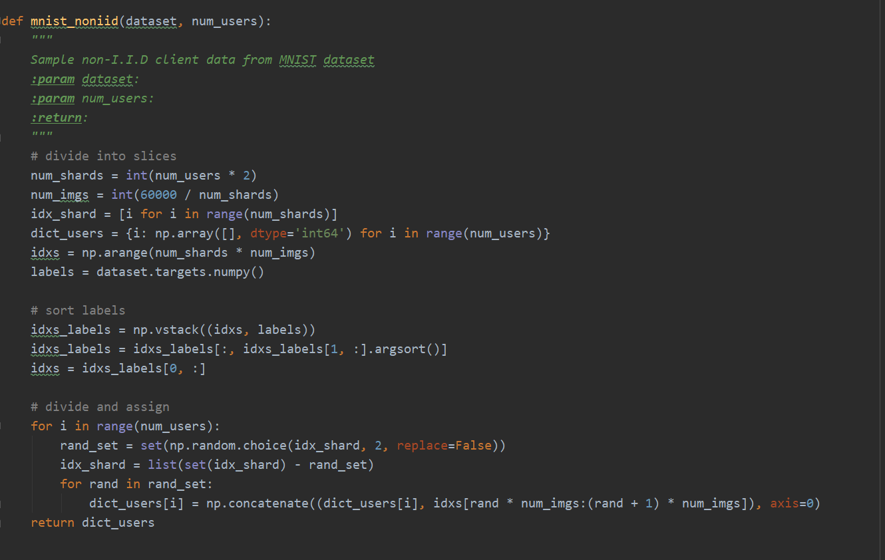
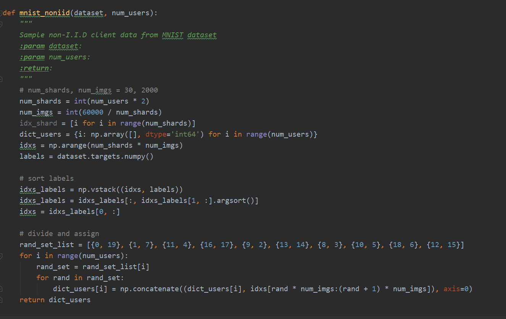
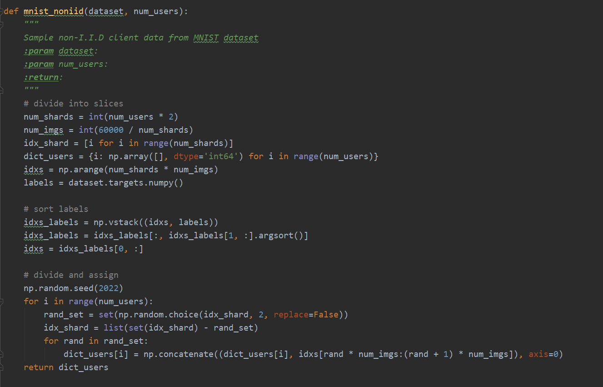
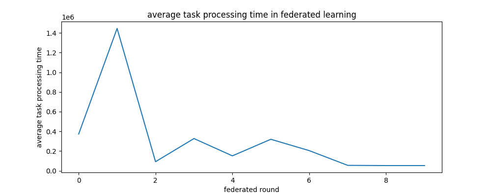
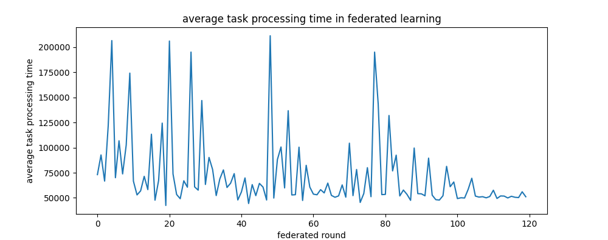
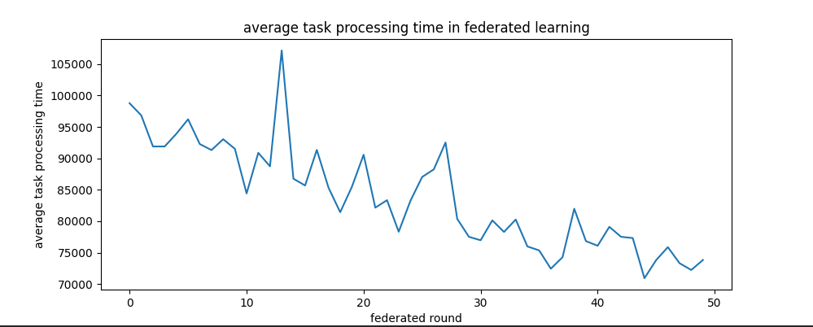
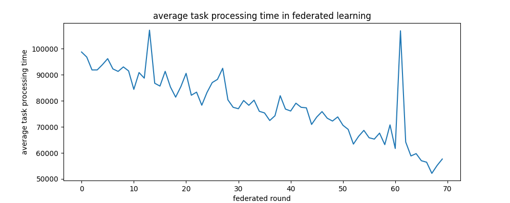
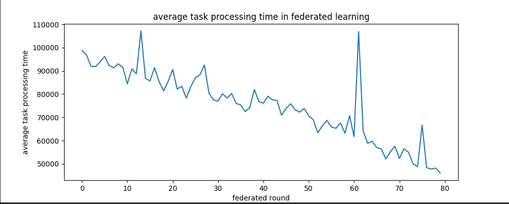
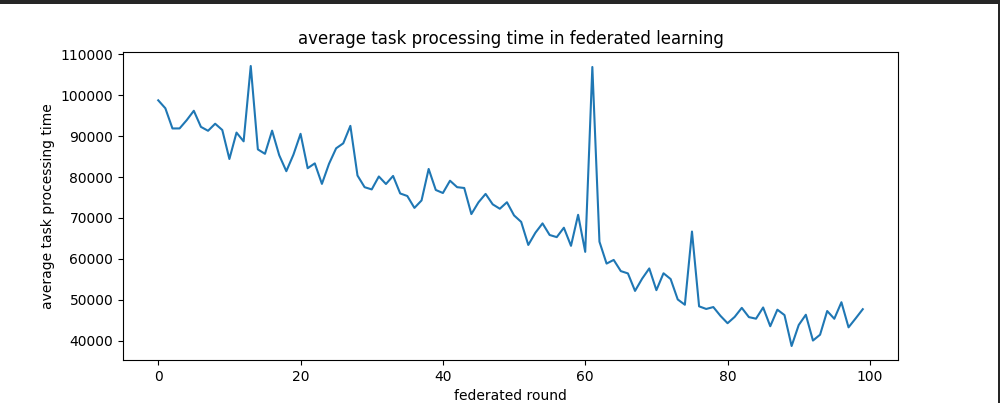
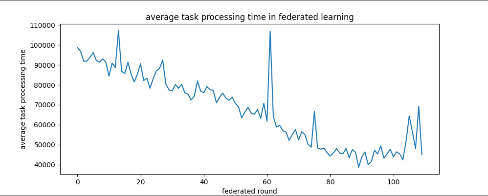

# 2022/03/08

任务调度的联邦部分：大概一到两周

第二点写一个专利，一到两周

集群聚类部分，扩大任务调度规模：大概一个月


### 一、联邦学习差分隐私DEBUG


**重复随机问题**

原来的数据划分方式存在重复随机问题。




**解决方案：**

1、手动划分




2、固定的随机，确保每个客户端视角下，数据划分是一致的。




### 二、任务调度的联邦部分


**参数调整：**

训练轮次预置：N轮

初始可调节因子预置：h

可调节因子最适值：k

可调节因子衰减：(h - k) / N


10轮

初始值：0.95

目标值：0.1

衰减值：0.85

federated_test测试集：dataset/Alibaba/Alibaba-Cluster-trace-100000-test.txt

测试集batch数目：1421

epsilon衰减次数：1421


$$
(0.95)*(x)^{1421}=0.1\\
(x)^{1421} = 0.1 / 0.95\\
1421\log_{10}x = \log_{10}(0.1 / 0.95)
$$
0.1 / 0.95 = 0.105263

$\log_{10}(0.1 / 0.95) = -0.9777$

$-0.9777 / 1421 = -0.000688$

$x = 10^{-0.000688} = 0.998417$

epsilon_decay = 0.998


初始参数：

```python
federated_rounds = 100			# 联邦轮次
lr = 0.003					   # learning rate
batch_size = 32				    # 批次大小
epsilon = 0.95				    # epsilon初始值
epsilon_min = 0.1				# epsilon最小值
epsilon_decay = 0.998			# epsilon退化率
```


10 epochs




120 epochs



[73132.86626215199, 92722.702892036, 66705.746504685, 121820.249590802, 206570.442634205, 70072.479599952, 106844.45866046699, 73854.147620578, 102625.980836049, 174191.738414569, 66658.74928734699, 52966.331984280005, 56957.73716351399, 71453.001764391, 58254.665541929, 113368.17557608002, 47722.9372213, 67325.165020036, 124416.518596038, 42451.510200521, 206131.87444036003, 73833.61359087, 53393.448462331005, 49167.823148150994, 67014.247960587, 60617.382002276994, 195127.15897330703, 60922.017607291, 57699.580984494, 146910.164527342, 63354.12775712601, 90256.07574600699, 78229.895099134, 52290.29769676601, 68826.620521045, 77848.472321749, 60353.85513515001, 64613.033650572, 74134.308037433, 47927.764029635, 55887.693916421005, 69854.53204146499, 44411.78494476999, 63209.88437252799, 52210.523233832006, 64411.99250891899, 60772.737887632, 47890.715144899, 211384.05745245994, 49822.315383646994, 88159.338856229, 100678.158032571, 59919.333989596, 136770.887310163, 52903.108462252996, 53169.18750812701, 100470.637301407, 47423.11458842699, 82391.557391183, 60784.185924656995, 53713.573307511004, 53086.870601169, 58184.06868802, 54948.39125654799, 64706.20213574901, 52465.87762884, 50615.51278308301, 51978.78086857901, 62892.50672871501, 50695.525598308, 104450.069199526, 52238.910194502, 78264.378500635, 45451.955229520005, 54288.47557101799, 80062.127008433, 51198.13219531, 195099.899915849, 143552.844701322, 53236.23679705199, 53473.75780217, 132029.32444431502, 76862.471283103, 92508.82423873199, 51919.92002667599, 57785.588453942, 53462.756911170996, 47546.120362812995, 99611.78269141901, 54228.39856458899, 54022.28160721299, 52072.517038581, 89563.662523919, 52703.721888405, 48224.33953091001, 47828.905938217, 52146.578300103996, 81369.551838573, 61104.452592341004, 65810.63732098699, 49294.902848574005, 50122.879674268996, 49865.912534443996, 58511.29133352199, 69537.85958876701, 51794.862492641, 50772.592663781004, 51187.122481229, 50044.09258022701, 51367.604848914, 57619.089724482, 49396.57030330999, 51912.952640436, 51787.690649037, 49918.399452468, 51578.903883097, 50592.449631605006, 50293.176718256, 56066.89581460601, 51120.534350573995]


### 调整balance_prob

```python
balance_factor_max = 0.9       # 阶梯平衡因子，前一级阶梯与后一级阶梯的比值应介于平衡因子[min, max]之间
balance_factor_min = 0.85
task_affinity_factor = 0.9     # 任务亲和度，针对大任务优化，大任务对高性能机器具有更高的亲和度，该优化的优先级高于负载因子
balance_prob = 0.3     		   # 小于balance_prob使用任务亲和度优化，大于balance_prob使用负载均衡优化
```


balance_prob = 0

DQN_transfer_time_mean: 7.856171732999999
DQN_wait_time_mean: 47895.859744661
DQN_execute_time_mean: 23.365570316999996
DQN_process_time_mean: 47927.081486710995


balance_prob = 0.1

DQN_transfer_time_mean: 7.856024296999999
DQN_wait_time_mean: 48252.4489327
DQN_execute_time_mean: 22.211651432000004
DQN_process_time_mean: 48282.516608429


balance_prob = 0.3

DQN_transfer_time_mean: 7.856108374
DQN_wait_time_mean: 44377.333180093985
DQN_execute_time_mean: 21.082078715000005
DQN_process_time_mean: 44406.271367183


balance_prob = 0.5

DQN_transfer_time_mean: 7.856390310999999
DQN_wait_time_mean: 52062.888882749
DQN_execute_time_mean: 13.368560436999998
DQN_process_time_mean: 52084.113833497


balance_prob = 0.7

DQN_transfer_time_mean: 7.855913126000001
DQN_wait_time_mean: 74848.348602747
DQN_execute_time_mean: 12.966370022
DQN_process_time_mean: 74869.170885895


balance_prob = 0.8

DQN_transfer_time_mean: 7.855506492
DQN_wait_time_mean: 84264.091142221
DQN_execute_time_mean: 17.353948003
DQN_process_time_mean: 84289.300596716


balance_prob = 0.9

DQN_transfer_time_mean: 7.855244877999999
DQN_wait_time_mean: 97385.26008606401
DQN_execute_time_mean: 22.214879222
DQN_process_time_mean: 97415.330210164


balance_prob = 1

DQN_transfer_time_mean: 7.855313696999999
DQN_wait_time_mean: 92388.341762823
DQN_execute_time_mean: 16.301954783
DQN_process_time_mean: 92412.499031303


### 参数配置

```python
federated_rounds = 100			# 联邦轮次
lr = 0.003					   # learning rate
batch_size = 32				    # 批次大小
epsilon = 0.95				    # epsilon初始值
epsilon_min = 0.1				# epsilon最小值
epsilon_decay = 0.998			# epsilon退化率

balance_factor_max = 0.9       # 阶梯平衡因子，前一级阶梯与后一级阶梯的比值应介于平衡因子[min, max]之间
balance_factor_min = 0.85
task_affinity_factor = 0.9     # 任务亲和度，针对大任务优化，大任务对高性能机器具有更高的亲和度，该优化的优先级高于负载因子
balance_prob = 0.3     		   # 小于balance_prob使用任务亲和度优化，大于balance_prob使用负载均衡优化
```


### 任务调度联邦学习效果


50 epochs



[98775.94773655498, 96830.37950566, 91888.86450816, 91897.14462001501, 93916.515997518, 96218.10025575699, 92276.807049244, 91319.210485428, 93045.64593565401, 91514.543122523, 84415.957315698, 90879.627119039, 88733.18016065599, 107169.21050405901, 86766.31711159002, 85684.18964262499, 91349.986501854, 85343.595739868, 81432.461357397, 85483.335536265, 90577.714607994, 82160.872002475, 83350.461152855, 78326.465850379, 83242.053632254, 87035.465978361, 88252.19239158499, 92522.84266037, 80377.46940978701, 77518.854039559, 76975.131736861, 80139.113692951, 78296.53035941301, 80270.468951359, 75985.35055056898, 75363.30067344001, 72447.656346258, 74277.12801224401, 81982.489290596, 76838.372003655, 76096.76957435801, 79106.749345964, 77523.75110961901, 77322.91908500702, 70938.482116559, 73814.61610211301, 75876.605121462, 73322.154984994, 72244.85918276699, 73838.113175254]


70 epochs



[98775.94773655498, 96830.37950566, 91888.86450816, 91897.14462001501, 93916.515997518, 96218.10025575699, 92276.807049244, 91319.210485428, 93045.64593565401, 91514.543122523, 84415.957315698, 90879.627119039, 88733.18016065599, 107169.21050405901, 86766.31711159002, 85684.18964262499, 91349.986501854, 85343.595739868, 81432.461357397, 85483.335536265, 90577.714607994, 82160.872002475, 83350.461152855, 78326.465850379, 83242.053632254, 87035.465978361, 88252.19239158499, 92522.84266037, 80377.46940978701, 77518.854039559, 76975.131736861, 80139.113692951, 78296.53035941301, 80270.468951359, 75985.35055056898, 75363.30067344001, 72447.656346258, 74277.12801224401, 81982.489290596, 76838.372003655, 76096.76957435801, 79106.749345964, 77523.75110961901, 77322.91908500702, 70938.482116559, 73814.61610211301, 75876.605121462, 73322.154984994, 72244.85918276699, 73838.113175254, 70615.417818519, 69030.278961693, 63385.733195748006, 66379.25021286, 68661.104960606, 65822.88665845699, 65301.436752033, 67605.063088784, 63173.019763216, 70764.72488986299, 61700.215000674, 106929.08463531898, 64183.440923484, 58828.044876272994, 59725.14462010899, 56990.151064825004, 56425.46897127401, 52141.76206247899, 55149.546369749994, 57642.76653001001]


epochs = 80



[98775.94773655498, 96830.37950566, 91888.86450816, 91897.14462001501, 93916.515997518, 96218.10025575699, 92276.807049244, 91319.210485428, 93045.64593565401, 91514.543122523, 84415.957315698, 90879.627119039, 88733.18016065599, 107169.21050405901, 86766.31711159002, 85684.18964262499, 91349.986501854, 85343.595739868, 81432.461357397, 85483.335536265, 90577.714607994, 82160.872002475, 83350.461152855, 78326.465850379, 83242.053632254, 87035.465978361, 88252.19239158499, 92522.84266037, 80377.46940978701, 77518.854039559, 76975.131736861, 80139.113692951, 78296.53035941301, 80270.468951359, 75985.35055056898, 75363.30067344001, 72447.656346258, 74277.12801224401, 81982.489290596, 76838.372003655, 76096.76957435801, 79106.749345964, 77523.75110961901, 77322.91908500702, 70938.482116559, 73814.61610211301, 75876.605121462, 73322.154984994, 72244.85918276699, 73838.113175254, 70615.417818519, 69030.278961693, 63385.733195748006, 66379.25021286, 68661.104960606, 65822.88665845699, 65301.436752033, 67605.063088784, 63173.019763216, 70764.72488986299, 61700.215000674, 106929.08463531898, 64183.440923484, 58828.044876272994, 59725.14462010899, 56990.151064825004, 56425.46897127401, 52141.76206247899, 55149.546369749994, 57642.76653001001, 52324.834680973, 56462.622031176, 55047.146105588996, 50051.789048485, 48757.02834761299, 66668.897093927, 48369.748226437, 47729.289307504, 48190.465458369, 46046.942375511004]


epochs = 100



[98775.94773655498, 96830.37950566, 91888.86450816, 91897.14462001501, 93916.515997518, 96218.10025575699, 92276.807049244, 91319.210485428, 93045.64593565401, 91514.543122523, 84415.957315698, 90879.627119039, 88733.18016065599, 107169.21050405901, 86766.31711159002, 85684.18964262499, 91349.986501854, 85343.595739868, 81432.461357397, 85483.335536265, 90577.714607994, 82160.872002475, 83350.461152855, 78326.465850379, 83242.053632254, 87035.465978361, 88252.19239158499, 92522.84266037, 80377.46940978701, 77518.854039559, 76975.131736861, 80139.113692951, 78296.53035941301, 80270.468951359, 75985.35055056898, 75363.30067344001, 72447.656346258, 74277.12801224401, 81982.489290596, 76838.372003655, 76096.76957435801, 79106.749345964, 77523.75110961901, 77322.91908500702, 70938.482116559, 73814.61610211301, 75876.605121462, 73322.154984994, 72244.85918276699, 73838.113175254, 70615.417818519, 69030.278961693, 63385.733195748006, 66379.25021286, 68661.104960606, 65822.88665845699, 65301.436752033, 67605.063088784, 63173.019763216, 70764.72488986299, 61700.215000674, 106929.08463531898, 64183.440923484, 58828.044876272994, 59725.14462010899, 56990.151064825004, 56425.46897127401, 52141.76206247899, 55149.546369749994, 57642.76653001001, 52324.834680973, 56462.622031176, 55047.146105588996, 50051.789048485, 48757.02834761299, 66668.897093927, 48369.748226437, 47729.289307504, 48190.465458369, 46046.942375511004, 44238.46282785499, 45786.845228044, 47997.470087769994, 45727.800869827006, 45348.080353642996, 48092.269750399, 43499.070085859996, 47551.93642876799, 46229.54046262699, 38664.94867495001, 43799.842728902, 46314.344549356996, 40001.304837607, 41429.650976985, 47222.870659542, 45325.553153115994, 49373.206897848, 43228.39986386399, 45417.351749971, 47671.349075378]





### 本周工作

任务调度系统与去中心化联邦学习平台的对接。


# 2021/12/29


## 评价指标

* **平均机器运行时间**：可以用于判断负载情况和资源占用情况，可以用于评估任务调度的成本。
* **任务平均处理时间**：可以用于衡量对批处理任务的平均响应时间。
* **makespan：**完全全部提交任务的最晚时间，可以衡量任务的整体响应时间。
* **单位时间吞吐量：**可以用于衡量系统处理大量任务的能力。
* **机器利用率标准差**：可以用于评估负载均衡情况。
* **任务平均等待时间**：可以评估任务的相应情况。
* **模型loss**：模型的loss


**阶梯平衡因子动作选择策略**

1. 对多域环境内的机器按照计算性能划分为n类

   > 例如：
   >
   > | very low  |      low      |     common     |      high       |    very high    | extremely high |
   > | :-------: | :-----------: | :------------: | :-------------: | :-------------: | :------------: |
   > | （0,800） | （800，2000） | （2000，6000） | （6000，12000） | （12000,24000） |    >=24000     |


2. 


$$
S = [M_{0}.mips, M_{0}.wait\_time, M_{1}.mips, M_{1}.wait\_time, ... , M_{k}.mips, M_{k}.wait\_time]
$$


|                  | RoundRobin |  Random  | Earliest | Genetic  |   D3QN   |
| ---------------- | :--------: | :------: | :------: | :------: | :------: |
| 平均任务传输时间 |    7.85    |   7.85   |   7.85   |   7.85   |   7.85   |
| 平均任务排队时间 |  75455.68  | 76069.27 | 76959.60 | 72048.88 | 71416.01 |
| 平均任务执行时间 |   31.58    |  32.62   |  32.53   |  30.37   |  30.23   |
| 平均任务处理时间 |  75495.11  | 76109.75 | 77000.00 | 72087.11 | 71454.10 |


$$
\text{bf} = \frac{\sum_{k=1}^{m}p_k}{m \cdot \text{min}(Q)}
$$


$$
\text{Reward}_i = \frac{C}{\alpha \cdot \log{PT_i} + \beta \cdot \log{MS_i}}
$$

| parameter | description         |
| --------- | ------------------- |
| $PT_i$    | $Task_i$的处理时间  |
| $MS_i$    | $Batch_i$的makespan |
| C         | 奖励系数            |
| $\alpha$  | 处理时间的权重系数  |
| $\beta$   | makespan的权重系数  |


`C=10, alpha=0.5, beta=0.5`

| $PT_i$ | $MS_i$ | $Reward_i$ |
| ------ | ------ | ---------- |
| 20     | 20000  | 3.57       |
| 240    | 20000  | 2.99       |
| 3000   | 20000  | 2.57       |
| 15000  | 20000  | 2.35       |


|                  |    DQN    | D3QN (bf=0.8) | D3QN (bf=0.7) | D3QN (bf=0.6) |
| ---------------- | :-------: | :-----------: | :-----------: | :-----------: |
| 平均任务传输时间 |   7.85    |     7.85      |     7.85      |     7.85      |
| 平均任务排队时间 | 198465.94 |   71416.01    |   67191.50    |   71579.89    |
| 平均任务执行时间 |   5.68    |     30.23     |     28.02     |     33.85     |
| 平均任务处理时间 | 198479.48 |   71454.10    |   67227.39    |   71621.60    |


|                  | DDPG |      |      |
| ---------------- | :--: | :--: | :--: |
| 平均任务传输时间 | 7.68 |      |      |
| 平均任务排队时间 |      |      |      |
| 平均任务执行时间 |      |      |      |
| 平均任务处理时间 |      |      |      |


14寸和27寸的字体配置对比

|                                               |    14寸字体配置     |    27寸字体配置     |
| --------------------------------------------- | :-----------------: | :-----------------: |
| vs（配置里直接搜字体）                        |         12          |         16          |
| self-define.css  #write font-size:            |        20px         |        24px         |
| self-define.css  table font-size:             |        18px         |        22px         |
| self-define.css  #write .md-fences font-size: |        18px         |        22px         |
| self-define.css  #write p line-height:        |       2.0rem        |       2.4rem        |
| self-define.css #blockquote > p font-size     |        18px         |        22px         |
| pycharm                                       |         16          |         20          |
| git bash text font-size                       |        小四         |        小三         |
| git bash window default-size                  | Columns:148,Rows:39 | Columns:148,Rows:44 |
| TexStudio Editor->Font Size                   |         12          |         16          |
| 力扣                                          |        16px         |        20px         |

