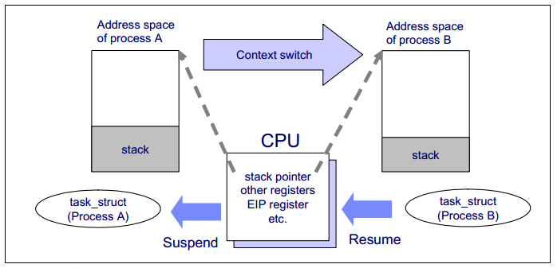
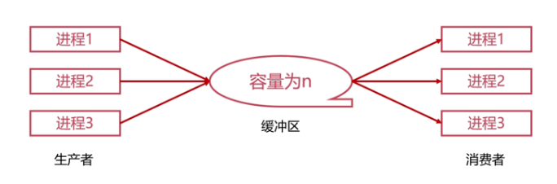
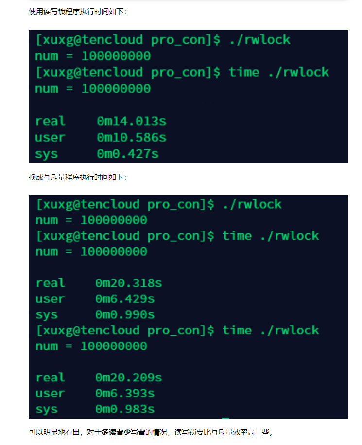
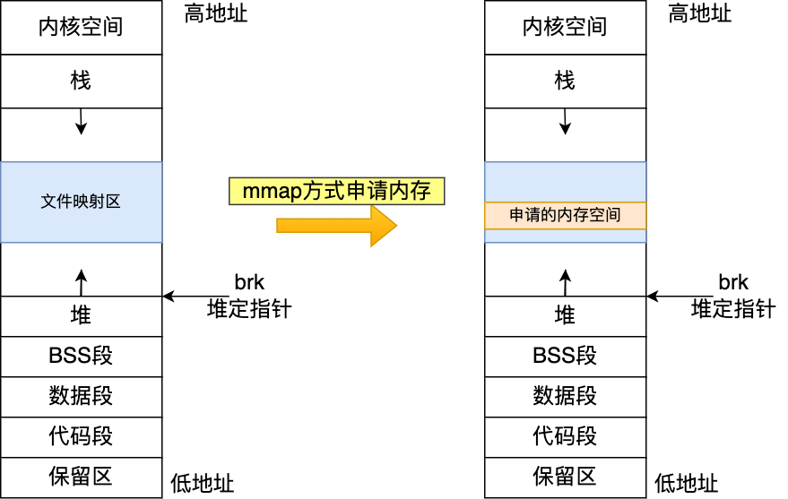
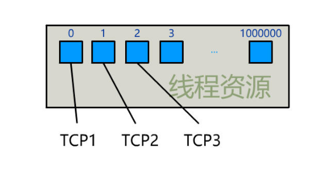
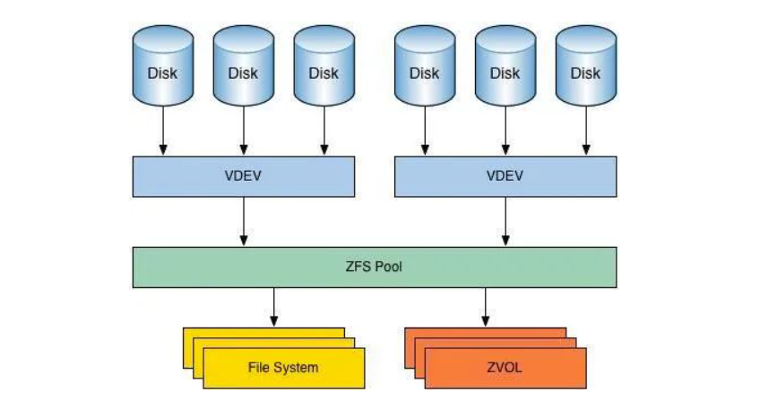

## Linux进程管理

### 1、进程

#### 1.1 进程控制块（PCB）

1. **进程描述信息**：

- 进程标识符：标识各个进程，每个进程都有⼀个并且唯⼀的标识符；
- ⽤户标识符：进程归属的⽤户，⽤户标识符主要为共享和保护服务；

2. **进程控制和管理信息**：

- 进程当前状态，如 new、ready、running、waiting 或 blocked 等；
- 进程优先级：进程抢占 CPU 时的优先级；

3. **资源分配清单**：

- 有关内存地址空间或虚拟地址空间的信息（页表），所打开⽂件的列表和所使⽤的 I/O 设备信息。

4. **CPU相关信息**：

- CPU 中各个寄存器的值，当进程被切换时，CPU 的状态信息都会被保存在相应的 PCB 中，以便进程

  重新执⾏时，能从断点处继续执⾏。

#### 1.2 进程状态

进程的三种基本状态：

运行态：占有cpu,并且就在cpu上执行。

就绪态：已经具备运行条件，但由于没有空闲cpu,而暂时不能运行。（也就是cpu没有调度到它）

阻塞态：因等待某一事件而不能运行。

其实这个很好理解，如果看过我之前关于线程的讨论的话应该很容易理解。注意：单核处理机同一时间只有一个进程处于运行态，双核则是两个。

还有两个状态：

创建态：进程正在被创建，系统为其初始化PCB，分配资源。

终止态：进程正在从系统中撤销，回收进程的资源，撤销其PCB。

下面一张图可看出这五个状态的关系：


#### 1.3 进程间的通信方式

1. **管道/匿名管道(Pipes)** ：用于具有亲缘关系的父子进程间或者兄弟进程之间的通信。管道是一种半双工的通信方式，数据只能单向流动，而且只能在具有亲缘关系的进程间使用。进程的亲缘关系通常是指父子进程关系。
2. **有名管道(Names Pipes)** : 匿名管道由于没有名字，只能用于亲缘关系的进程间通信。为了克服这个缺点，提出了有名管道。有名管道严格遵循**先进先出(first in first out)**。有名管道以磁盘文件的方式存在，可以实现本机任意两个进程通信。
3. **信号(Signal)** ：信号是一种比较复杂的通信方式，用于通知接收进程某个事件已经发生；
4. **消息队列(Message Queuing)** ：消息队列是消息的链表,具有特定的格式,存放在内存中并由消息队列标识符标识。管道和消息队列的通信数据都是先进先出的原则。与管道（无名管道：只存在于内存中的文件；命名管道：存在于实际的磁盘介质或者文件系统）不同的是消息队列存放在内核中，只有在内核重启(即，操作系统重启)或者显示地删除一个消息队列时，该消息队列才会被真正的删除。消息队列可以实现消息的随机查询,消息不一定要以先进先出的次序读取,也可以按消息的类型读取.比 FIFO 更有优势。**消息队列克服了信号承载信息量少，管道只能承载无格式字 节流以及缓冲区大小受限等缺。**
5. **信号量(Semaphores)** ：信号量是一个计数器，用于多进程对共享数据的访问，信号量的意图在于进程间同步。这种通信方式主要用于解决与同步相关的问题并避免竞争条件。它常作为一种锁机制，防止某进程正在访问共享资源时，其他进程也访问该资源。因此，主要作为进程间以及同一进程内不同线程之间的同步手段。
6. **共享内存(Shared memory)** ：使得多个进程可以访问同一块内存空间，不同进程可以及时看到对方进程中对共享内存中数据的更新。共享内存就是映射一段能被其他进程所访问的内存，这段共享内存由一个进程创建，但多个进程都可以访问。共享内存是最快的 IPC 方式，它是针对其他进程间通信方式运行效率低而专门设计的。它往往与其他通信机制，如信号量，配合使用，来实现进程间的同步和通信。
7. **套接字(Sockets)** : 此方法主要用于在客户端和服务器之间通过网络进行通信。套接字是支持 TCP/IP 的网络通信的基本操作单元，可以看做是不同主机之间的进程进行双向通信的端点，简单的说就是通信的两方的一种约定，用套接字中的相关函数来完成通信过程。与其他通信机制不同的是，它可用于不同机器间的进程通信。


#### 1.4 进程间调度方式

1. **先到先服务(FCFS)调度算法** : 从就绪队列中选择一个最先进入该队列的进程为之分配资源，使它立即执行并一直执行到完成或发生某事件而被阻塞放弃占用 CPU 时再重新调度。

2. **短作业优先(SJF)的调度算法** : 从就绪队列中选出一个估计运行时间最短的进程为之分配资源，使它立即执行并一直执行到完成或发生某事件而被阻塞放弃占用 CPU 时再重新调度。

3. **时间片轮转调度算法** : 时间片轮转调度是一种最古老，最简单，最公平且使用最广的算法，又称 RR(Round robin)调度。每个进程被分配一个时间段，称作它的时间片，即该进程允许运行的时间。

4. **多级反馈队列调度算法** ：前面介绍的几种进程调度的算法都有一定的局限性。如**短进程优先的调度算法，仅照顾了短进程而忽略了长进程** 。多级反馈队列调度算法既能使高优先级的作业得到响应又能使短作业（进程）迅速完成。，因而它是目前**被公认的一种较好的进程调度算法**，UNIX 操作系统采取的便是这种调度算法。

5. **优先级调度** ：为每个流程分配优先级，首先执行具有最高优先级的进程，依此类推。具有相同优先级的进程以 FCFS 方式执行。可以根据内存要求，时间要求或任何其他资源要求来确定优先级。


### 进程的上下⽂切换到底是切换什么呢？

回答：进程是由内核管理和调度的，所以进程的切换只能发⽣在内核态。所以，进程的上下⽂切换不仅包含了虚拟内存、栈、全局变量等⽤户空间的资源，还包括了内核堆栈、寄存器等内核空间的资源。


### 2、进程和线程对比

#### 2.1 进程和线程的概念

回答：线程是进程当中的⼀条执⾏流程。同⼀个进程内多个线程之间可以共享代码段、数据段、打开⽂件等资源，但每个线程各⾃都有⼀套独⽴的寄存器和栈，这样可以确保线程的控制流是相对独⽴的。

进程：编写的代码只是⼀个存储在硬盘的静态⽂件，通过编译后就会⽣成⼆进制可执⾏⽂件，当我们运⾏这个可执⾏⽂件后，它会被装载到内存中，接着 CPU 会执⾏程序中的每⼀条指令，那么这个运⾏中的程序，就被称为「进程（**Process**）。


#### 2.2 进程和线程的区别

线程与进程的⽐较如下：

- 进程是资源（包括内存、打开的⽂件等）分配的单位，线程是 CPU 调度的单位；
- 进程拥有⼀个完整的资源平台，⽽线程只独享必不可少的资源，如寄存器和栈；
- 线程同样具有就绪、阻塞、执⾏三种基本状态，同样具有状态之间的转换关系；
- 线程能减少并发执⾏的时间和空间开销；

对于，线程相⽐进程能减少开销，体现在：

- 线程的创建时间⽐进程快，因为进程在创建的过程中，还需要资源管理信息，⽐如内存管理信息、⽂件管理信息，⽽线程在创建的过程中，不会涉及这些资源管理信息，⽽是共享它们；
- 线程的终⽌时间⽐进程快，因为线程释放的资源相⽐进程少很多；
- 同⼀个进程内的线程切换⽐进程切换快，因为线程具有相同的地址空间（虚拟内存共享），这意味着同⼀个进程的线程都具有同⼀个⻚表，那么在切换的时候不需要切换⻚表。⽽对于进程之间的切换，切换的时候要把⻚表给切换掉，⽽⻚表的切换过程开销是⽐较⼤的；
- 由于同⼀进程的各线程间共享内存和⽂件资源，那么在线程之间数据传递的时候，就不需要经过内核了，这就使得线程之间的数据交互效率更⾼了；

所以，不管是时间效率，还是空间效率线程⽐进程都要⾼。

线程的缺点：

当进程中的⼀个线程崩溃时，会导致其所属进程的所有线程崩溃。举个例⼦，对于游戏的⽤户设计，则不应该使⽤多线程的⽅式，否则⼀个⽤户挂了，会影响其他同个进程的线程。


#### Tips：并发和并行的区别

并发是基于时间片轮转的，故而从宏观上看，各个进（线）程是一起运行的，微观上是串行的。并行就像是多向车道一样（车道数目------核数），各个进（线）程运行互不干扰。


### 3、CPU上下文切换

> **进程上下文切换：**
>
> 进程是由内核管理和调度的，所以进程的切换只能发⽣在内核态。所以，进程的上下⽂切换不仅包含了虚拟内存、栈、全局变量等⽤户空间的资源，还包括了内核堆栈、寄存器等内核空间的资源。
>
> **线程上下文切换：**
>
> 这还得看线程是不是属于同⼀个进程：
>
> - 当两个线程不是属于同⼀个进程，则切换的过程就跟进程上下⽂切换⼀样；
> - 当两个线程是属于同⼀个进程，因为虚拟内存是共享的，所以在切换时，虚拟内存和全局变量这些资源就保持不动，只需要切换线程的私有数据，比如栈和寄存器等不共享的数据；




我们都知道 Linux 是一个多任务操作系统，它支持的任务同时运行的数量远远大于 CPU 的数量。

当然，这些任务实际上并不是同时运行的（Single CPU），而是因为系统在短时间内将 CPU 轮流分配给任务，造成了多个任务同时运行的假象。


#### 3.1 CPU 上下文（CPU Context）

在每个任务运行之前，CPU 需要知道在哪里加载和启动任务。这意味着系统需要提前帮助设置**CPU寄存器**和**程序计数器**。

CPU 寄存器是内置于 CPU 中的小型但速度极快的内存。程序计数器用于存储 CPU 正在执行的或下一条要执行指令的位置。

它们都是 CPU 在运行任何任务之前必须依赖的依赖环境，因此也被称为 “CPU 上下文”。如下图所示：


知道了 CPU 上下文是什么，我想你理解 **CPU 上下文切换**就很容易了。“CPU上下文切换”指的是先保存上一个任务的 CPU 上下文（CPU寄存器和程序计数器），然后将新任务的上下文加载到这些寄存器和程序计数器中，最后跳转到程序计数器。

这些保存的上下文存储在系统内核中，并在重新安排任务执行时再次加载。这确保了任务的原始状态不受影响，并且任务似乎在持续运行。


#### 3.2 CPU 上下文切换的类型

你可能会说 CPU 上下文切换无非就是更新 CPU 寄存器和程序计数器值，而这些寄存器是为了快速运行任务而设计的，那为什么会影响 CPU 性能呢？

在回答这个问题之前，请问，你有没有想过这些“任务”是什么？你可能会说一个任务就是一个**进程**或者一个**线程**。是的，进程和线程正是最常见的任务，但除此之外，还有其他类型的任务。

别忘了**硬件中断**也是一个常见的任务，硬件触发信号，会引起中断处理程序的调用。

因此，CPU 上下文切换至少有三种不同的类型：

- 进程上下文切换
- 线程上下文切换
- 中断上下文切换

让我们一一来看看。


##### 1. 进程上下文切换

Linux 按照特权级别将进程的运行空间划分为内核空间和用户空间，分别对应下图中 `Ring 0` 和 `Ring 3` 的 CPU 特权级别的 。

- **内核空间**（`Ring 0`）拥有最高权限，可以直接访问所有资源
- **用户空间**（`Ring 3`）只能访问受限资源，不能直接访问内存等硬件设备。它必须通过**系统调用**被**陷入（trapped）**内核中才能访问这些特权资源。


从另一个角度看，一个进程既可以在用户空间也可以在内核空间运行。当一个进程在**用户空间**运行时，称为该进程的**用户态**，当它落入**内核空间**时，称为该进程的**内核态**。

从**用户态**到**内核态**的转换需要通过**系统调用**来完成。例如，当我们查看一个文件的内容时，我们需要以下系统调用：

- `open()`：打开文件
- `read()`：读取文件的内容
- `write()`：将文件的内容写入到输出文件（包括标准输出）
- `close()`：关闭文件

那么在上述系统调用过程中是否会发生 CPU 上下文切换呢？当然是的。

这需要先保存 CPU 寄存器中原来的用户态指令的位置。接下来，为了执行内核态的代码，需要将 CPU 寄存器更新到内核态指令的新位置。最后是跳转到内核态运行内核任务。

那么系统调用结束后，CPU 寄存器需要**恢复**原来保存的用户状态，然后切换到用户空间继续运行进程。

> 因此，在一次系统调用的过程中，实际上有两次 CPU 上下文切换。

但需要指出的是，系统调用过程不会涉及进程切换，也不会涉及虚拟内存等系统资源切换。这与我们通常所说的“进程上下文切换”不同。进程上下文切换是指从一个进程切换到另一个进程，而系统调用期间始终运行同一个进程

系统调用过程通常被称为**特权模式切换**，而不是**上下文切换**。但实际上，在系统调用过程中，CPU 的上下文切换也是不可避免的。


##### 2. 进程上下文切换 vs 系统调用

那么进程上下文切换和系统调用有什么区别呢？首先，进程是由内核管理的，进程切换只能发生在内核态。因此，进程上下文不仅包括**虚拟内存**、**栈**和**全局变量**等用户空间资源，还包括**内核栈**和**寄存器**等内核空间的状态。

所以**进程上下文切换**比**系统调用**要多出一步：

> 在保存当前进程的内核状态和 CPU 寄存器之前，需要保存进程的虚拟内存、栈等；并加载下一个进程的内核状态。

根据 Tsuna 的测试报告，每次上下文切换需要几十纳秒至微秒的 CPU 时间。这个时间是相当可观的，尤其是在大量进程上下文切换的情况下，很容易导致 CPU 花费大量时间来保存和恢复寄存器、内核栈、虚拟内存等资源。这正是我们在上一篇文章中谈到的，一个导致平均负载上升的重要因素。

那么，该进程何时会被调度/切换到在 CPU 上运行？其实有很多场景，下面我为大家总结一下：

- 当一个进程的 CPU 时间片用完时，它会被系统**挂起**，并切换到其他等待 CPU 运行的进程。
- 当系统资源不足（如内存不足）时，直到资源充足之前，进程无法运行。此时进程也会被**挂起**，系统会调度其他进程运行。
- 当一个进程通过 `sleep` 函数自动**挂起自己**时，自然会被重新调度。
- 当优先级较高的进程运行时，为了保证高优先级进程的运行，当前进程会被高优先级进程**挂起运行**。
- 当发生硬件中断时，CPU 上的进程会被**中断挂起**，转而执行内核中的中断服务程序。

了解这些场景是非常有必要的，因为一旦上下文切换出现性能问题，它们就是幕后杀手。


##### 3. 线程上下文切换

线程和进程最大的区别在于，线程是**任务调度**的基本单位，而进程是**资源获取**的基本单位。

说白了，内核中所谓的任务调度，实际的调度对象是线程；而进程只为线程提供虚拟内存和全局变量等资源。所以，对于线程和进程，我们可以这样理解：

- 当一个进程只有一个线程时，可以认为一个进程等于一个线程
- 当一个进程有多个线程时，这些线程共享相同的资源，例如虚拟内存和全局变量。
- 此外，线程也有自己的私有数据，比如栈和寄存器，在上下文切换时也需要保存。

这样，线程的上下文切换其实可以分为两种情况：

- 首先，前后两个线程属于不同的进程。此时，由于资源不共享，切换过程与进程上下文切换相同。
- 其次，前后两个线程属于同一个进程。此时，由于虚拟内存是共享的，所以切换时虚拟内存的资源保持不变，只需要切换线程的私有数据、寄存器等未共享的数据。

显然，同一个进程内的线程切换比切换多个进程消耗的资源要少。这也是多线程替代多进程的优势。


##### 4. 中断上下文切换

除了前面两种上下文切换之外，还有另外一种场景也输出 CPU 上下文切换的，那就是**中断**。

为了快速响应事件，硬件中断会中断正常的调度和执行过程，进而调用**中断处理程序**。

在中断其他进程时，需要保存进程的当前状态，以便中断后进程仍能从原始状态恢复。

与进程上下文不同，中断上下文切换不涉及进程的用户态。因此，即使中断进程中断了处于用户态的进程，也不需要保存和恢复进程的虚拟内存、全局变量等用户态资源。

另外，和进程上下文切换一样，中断上下文切换也会消耗 CPU。过多的切换次数会消耗大量的 CPU 资源，甚至严重降低系统的整体性能。因此，当发现中断过多时，需要注意排查它是否会对您的系统造成严重的性能问题。


#### 3.3 小结

- CPU上下文切换，是保证Linux系统正常工作的核心功能之一，一般情况下不需要我们特别关注。
- 但过多的上下文切换，会把CPU时间消耗在寄存器，内核栈以及虚拟内存等数据的保存和恢复上，从而缩短进程真正运行的时间，导致系统的整体性能大幅下降。
- 自愿上下文切换变多了，说明进程都在等待资源，有可能发生了 I/O 等其他问题
- 非自愿上下文切换变多了，说明进程都在被强制调度，也就是都在争抢 CPU，说明 CPU 的确成了瓶颈
- 中断次数变多了，说明 CPU 被中断处理程序占用，还需要通过查看 /proc/interrupts 文件来分析具体的中断类型。


### 4、死锁

#### 4.1 产生死锁的条件？

回答：

(1)互斥使用(资源独占)：一个资源每次只能给一个进程使用

(2)占有且等待(请求和保持，部分分配)：进程在申请新的资源的同时保持对原有资源的占有

(3)不可抢占(不可剥夺)：资源申请者不能强行的从资源占有者手中夺取资源，资源只能由占有者自愿释放

(4)循环等待：存在一个进程等待队列 {P1 , P2 , … , Pn}，其中P1等待P2占有的资源，P2等待P3占有的资源，…，Pn等待P1占有的资源，形成一个进程等待环路。

当死锁产生的时候一定会有这四个条件，**有一个条件不成立**都不会造成死锁。


#### 4.2 如何避免死锁？

回答：产⽣死锁的四个必要条件是：互斥条件、持有并等待条件、不可剥夺条件、环路等待条件。

那么避免死锁问题就只需要破环其中⼀个条件就可以，最常⻅的并且可⾏的就是使⽤资源有序分配法，来破环环路等待条件。


## Linux多线程编程

### 一、线程同步/线程通信方式

#### 1.1 引言

由于每个进程有自己独立的虚拟地址空间，为了打破进程与进程之间的“柏林墙”而实现通信，多进程更多的是考虑进程之间如何通信的问题；

而同一进程内的多个线程共享同一地址空间，为了避免多个线程同时访问数据造成的混乱，多线程之间更多的是考虑线程之间的同步问题。

> 所谓同步，即协同步调，按预定的先后次序访问共享资源，以免造成混乱。

线程同步：即当有一个线程在对内存进行操作时，其他线程都不可以对这个内存地址进行操作，直到该线程完成操作， 其他线程才能对该内存地址进行操作，而其他线程又处于等待状态。

线程同步的实现方式有6种：互斥量、读写锁、条件变量、自旋锁、屏障、信号量。

> 由于笔者主要学习UNIX环境的编程，所以这里只介绍UNIX环境常用的线程同步方式，即POSIX线程库（Pthreads）提供的线程同步接口。本文不会涉及Windows端的线程同步方式，如临界区（CriticalSection）等。


#### 1.2 生产者-消费者模型

为了更好地讲清楚以下的线程同步方式，我决定介绍每种线程同步方式时，都搭配一个实际的应用案例。这个应用案例我决定选择生产者-消费者模型这一经典问题。

问题描述：有一群**生产者进程**在生产产品，并将这些产品提供给**消费者进程**进行消费，生产者进程和消费者进程可以**并发执行**，在两者之间设置了一个具有**n个缓冲区**的缓冲池，生产者进程需要将所生产的产品放到一个缓冲区中，消费者进程可以从缓冲区中取走产品消费。



当生产者生产了一个产品之后，缓冲区里的产品就会+1；同样，如果消费者从缓冲区里边消费一个产品，缓冲区里的产品就会-1。这看起来没有任何问题。

但是在计算机中，这个缓冲区是位于**高速缓存或主存**上的，如果说生产者或消费者要操作里边的数据时，就分为三个步骤：

- 取出数据放到寄存器中 **register = count**；
- 在CPU的寄存器中将**register = register±1**；register = register + 1表示生产者生产了一个产品；register = register - 1表示消费者消费了一个产品。
- 将register放回缓冲区 **count = register**。

当生产者和消费者**并发**执行的时候，这就会出现问题，因为上述三个操作不具备**原子性**，即生产者和消费者的这三个操作可能会交叉执行，而不是一方执行完，另一方再执行。见下图，红色部分为生产者生产的过程，蓝色的为消费者消费的过程：


图右描述了一种可能出现的执行流程（假设count初始值为10）：

1. 生产者线程获得时间片，执行其第一步：把count值放到寄存器，即register = count；执行之后生产者线程私有的register和共享的count值均为10；
2. 生产者线程时间片未耗尽，执行其第二步：在寄存器中加1，即register = register + 1；执行之后生产者线程私有的register值为11，共享的count值为10；
3. 此时，生产者线程时间片耗尽，CPU调度消费者进程执行，消费者执行其第一步：把count值放到寄存器，即register = count；执行之后消费者线程私有的register和共享的count值均为10；
4. 消费者时间片未耗尽，消费者执行其第二步：在寄存器中减1，即register = register - 1；执行之后消费者线程私有的register值为9，共享的count值为10；
5. 消费者时间片未耗尽，消费者执行其第三步：把register值放回缓冲区，即count = register；执行之后消费者私有的register和共享的count值均为9；
6. 此时，消费者线程时间片耗尽，CPU调度生产者进程执行，生产者继续执行它的第三步：count = register；执行之后生产者私有的register和共享的count值均为11。

问题就出现了：整个过程中生产者生产了一个产品，消费者消费了一个产品，那count值前后应该不变，仍为10才对，现在却是11，说明这个数据是错误的。错误的原因就在于这两个进程**并发的执行**，他们轮流在操作缓冲区，导致缓冲区中的数据不一致，这个就是生产者-消费者的问题。

以下程序模拟了生产者消费者问题：生产者生产1亿个产品，消费者消费1亿个产品，最终num应该为0。但事实并非如此。

```c
#include<stdio.h>
#include<pthread.h>

int num = 0;//临界资源
void *producer(void* arg){
        int times = 100000000;//循环一亿次
        while(times--)
                num += 1;//每次生产一个产品
}

void *consumer(void* arg){
        int times = 100000000;
        while(times--)
                num -= 1;//每次消费一个产品
}

int main(){
        pthread_t thread_prod,thread_cons;
        pthread_create(&thread_prod, NULL, &producer, NULL);
        pthread_create(&thread_cons, NULL, &consumer, NULL);
        pthread_join(thread_prod, NULL);
        pthread_join(thread_cons, NULL);
        printf("num = %d\n", num);
}
```

该程序每次执行的结果并不相同，num值不为0：


> 关于这个程序有一点要注意，循环次数要设的大一点。我一开始设的100万次，由于100万次太少了，每个线程的时间片足够一次执行完所有循环而不被其他线程打断，所以最终会输出num等于0。
>
> 设置成1亿次之后就好了，线程的时间片无法一次执行完所有循环，执行完一部分就被CPU喊停，调度另一线程执行了，所以会出现num值不为0；且由于每次执行，线程之间的调度无法原样重现，所以num值每次都不一样。


#### 1.3 互斥量

互斥量（mutex）本质上说是一把锁，在访问共享资源前对互斥量进行设置（加锁），在访问完成后释放（解锁）互斥量。

对互斥量加锁以后，任何其他试图再次对互斥量加锁的线程都会被阻塞，直至当前线程释放该互斥量。

**POSIX互斥量API**

POSIX线程库（Pthreads）提供了互斥量接口，互斥量用pthread_mutex_t数据类型来表示。

使用互斥量前必须首先进行初始化，有两种初始化方式：

- 把它设置为常量PTHREAD_MUTEX_INITIALIZER（仅适用于静态分配的互斥量）；
- 调用pthread_mutex_init函数进行初始化。

对于动态分配的互斥量（如new和malloc），在释放内存前需要调用pthread_mutex_destroy函数。

其常见API如下：

```c
#include <pthread.h>
int pthread_mutex_init(pthread_mutex_t *restrict mutex,
                       const pthread_mutexattr_t *restrict attr);
int pthread_mutex_destroy(pthread_mutex_t *mutex);
//返回值：成功返回0；出错返回错误编号
```

> 要用默认属性初始化互斥量，只需把attr参数设为NULL。

```c
#include <pthread.h>
int pthread_mutex_lock(pthread_mutex_t *mutex);
int pthread_mutex_trylock(pthread_mutex_t *mutex);
int pthread_mutex_unlock(pthread_mutex_t *mutex);
//返回值：成功返回0；出错返回错误编号
```

- pthread_mutex_lock函数用于给互斥量加锁，如果互斥量已上锁，则调用该函数的线程将阻塞直到互斥量被解锁；
- 如果线程不希望被阻塞，它可以使用pthread_mutex_trylock函数尝试对互斥量进行加锁，如果未加锁，则锁住互斥量并返回0；如果已加锁，则返回EBUSY；
- pthread_mutex_unlock函数用于对互斥量解锁。

```c
#include <pthread.h>
#include <time.h>
int pthread_mutex_timedlock(pthread_mutex_t *restrict mutex,
                            const struct timespec *restrict tsptr);
//成功返回0；出错返回错误编号
```

- 当线程试图获取一个已加锁的互斥量时，pthread_mutex_timedlock函数允许绑定线程阻塞时间。在达到超时时间值时，该函数不会对互斥量加锁，而是返回错误码ETIMEDOUT。

> 超时指定愿意等待的绝对时间，用timespec结构表示，以秒和纳秒描述时间。


**互斥量解决生产者消费者问题**

程序如下：

```c
#include <stdio.h>
#include <pthread.h>

int num = 0;
pthread_mutex_t mutex = PTHREAD_MUTEX_INITIALIZER;

void *producer(void* arg){
        int times = 100000000;
        while(times--){
                pthread_mutex_lock(&mutex);
                num += 1;
                pthread_mutex_unlock(&mutex);
        }
}

void *consumer(void* arg){
        int times = 100000000;
        while(times--){
                pthread_mutex_lock(&mutex);
                num -= 1;
                pthread_mutex_unlock(&mutex);
        }
}

int main(){
        pthread_t thread_prod, thread_cons;
        pthread_create(&thread_prod, NULL, &producer, NULL);
        pthread_create(&thread_cons, NULL, &consumer, NULL);
        pthread_join(thread_prod, NULL);
        pthread_join(thread_cons, NULL);
        printf("num = %d\n", num);
}
```

执行结果如下：


可见，使用互斥量同步多线程共享资源的访问后，输出就如预期了，每次输出都是0。

> 执行的时候会明显感觉到很慢，特意用time命令测试了下，上述程序需要近4秒钟才可以执行完。所以加锁会带来性能的损耗。


#### 1.4 读写锁

互斥量只有两种状态：加锁和不加锁；且一次只有一个线程可以对其加锁；

读写锁有三种状态：读模式加锁、写模式加锁和不加锁；一次只有一个线程可以占有写模式的读写锁，但是多个线程可以同时占有读模式的读写锁。

> 读写锁非常适合对数据结构读的次数远大于写的情况。

**POSIX读写锁API**

读写锁在使用之前必须初始化，在释放它们的底层内存之前必须销毁。

```c
#include <pthread.h>
int pthread_rwlock_init(pthread_rwlock_t *restrict rwlock,
                        const pthread_rwlockattr_t *restrict attr);
int pthread_rwlock_destroy(pthread_rwlock_t *rwlock);
//两个函数返回值：成功返回0；出错返回错误编号
```

> 要用默认属性初始化读写锁，只需把attr参数设为NULL。
>
> 对于静态分配的读写锁，也可以使用常量PTHREAD_RWLOCK_INITIALIZER来初始化。

```c
#include <pthread.h>
int pthread_mutex_rdlock(pthread_rwlock_t *rwlock);
int pthread_mutex_wrlock(pthread_rwlock_t *rwlock);
int pthread_mutex_unlock(pthread_rwlock_t *rwlock);
//成功返回0；出错返回错误编号
```

- pthread_mutex_rdlock函数以读模式获取读写锁；
- pthread_mutex_wrlock函数以写模式获取读写锁；
- pthread_mutex_unlock函数用于解锁。

```c
#include <pthread.h>
#include <time.h>
int pthread_rwlock_timedrdlock(pthread_rwlock_t *restrict rwlock,
                               const struct timespec *restrict tsptr);
int pthread_rwlock_timedwrlock(pthread_rwlock_t *restrict rwlock,
                               const struct timespec *restrict tsptr);
//成功返回0；出错返回错误编号
```

上边两个函数用于指定线程应该停止阻塞的时间。

**读写锁解决读者写者问题**

读者写者问题与之前的生产者消费者问题不同：读者线程只去读取共享资源但不会修改它，而写者线程会修改共享资源。用读写锁可以很好的解决读者写者问题。读者线程以读模式获取锁，这样不影响其他线程以读模式获取锁；写者线程以写模式获取锁，这样在修改共享资源期间，其他线程无法访问该共享资源。

> 生产者消费者问题中的生产者线程和消费者线程实际上都是“写者”线程，因为它们都会修改共享资源。

以下程序使用读写锁（互斥量）解决了读者写者问题。

```c
#include <stdio.h>
#include <pthread.h>

int num = 0;
pthread_rwlock_t rwlock = PTHREAD_RWLOCK_INITIALIZER;
//pthread_mutex_t mutex = PTHREAD_MUTEX_INITIALIZER;

void *reader(void* arg){
        int times = 100000000;
        while(times--){
                pthread_rwlock_rdlock(&rwlock);
                //pthread_mutex_lock(&mutex);
                if(times%1000 == 0)
                        usleep(10);
                pthread_rwlock_unlock(&rwlock);
                //pthread_mutex_unlock(&mutex);
        }
}

void *writer(void* arg){
        int times = 100000000;
        while(times--){
                pthread_rwlock_wrlock(&rwlock);
                //pthread_mutex_lock(&mutex);
                num += 1;
                pthread_rwlock_unlock(&rwlock);
                //pthread_mutex_unlock(&mutex);
        }
}

int main(){
        pthread_t writer_1, reader_1, reader_2;
        pthread_create(&writer_1, NULL, &writer, NULL);
        pthread_create(&reader_1, NULL, &reader, NULL);
        pthread_create(&reader_2, NULL, &reader, NULL);
        pthread_join(writer_1, NULL);
        pthread_join(reader_1, NULL);
        pthread_join(reader_2, NULL);
        printf("num = %d\n", num);
}
```

使用读写锁程序执行时间如下：



可以明显地看出，对于**多读者少写者**的情况，读写锁要比互斥量效率高一些。

> 其实读写锁也可以解决上边的生产者消费者问题，就是生产者线程和消费者线程都是使用写模式对共享资源加锁。我测试了下，执行时间大概是8秒钟，是互斥量的两倍。所以用读写锁解决生产者消费者问题不仅没必要而且开销大。
>
> 问题的本质在于，生产者消费者问题没有把共享资源的访问作出读和写的细分，无论是生产者还是消费者对共享资源都是写，所以在这个问题里，读写锁发挥不出它的优势，读写锁还是更适合**多读少写**的情况。


#### 1.5 条件变量

条件变量允许线程睡眠，直到满足某种条件，当满足条件时，可以向该线程发送信号，通知并唤醒该线程。

条件变量通常与互斥量配合一起使用。条件变量由互斥量保护，线程在改变条件状态之前必须首先锁住互斥量，其他线程在获得互斥量之前不会察觉到条件的改变，因为必须在锁住互斥量之后它才可以计算条件是否发生变化。

**POSIX条件变量API**

使用条件变量前必须初始化；在释放条件变量的底层内存之前，可以使用pthread_cond_destroy函数进行销毁。

```c
#include <pthread.h>
int pthread_cond_init(pthread_cond_t *restrict cond,
                      const pthread_condattr_t *restrict attr);
int pthread_cond_destroy(pthread_cond_t *cond);
//两函数返回值：成功返回0；出错返回错误编号
```

> 要用默认属性初始化条件变量，只需把attr参数设为NULL。
>
> 对于静态分配的条件变量，也可以使用常量PTHREAD_COND_INITIALIZER来初始化。

```c
#include <pthread.h>
int pthread_cond_wait(pthread_cond_t *restrict cond,
                      pthread_mutex_t *restrict mutex);
int pthread_cond_timedwait(pthread_cond_t *restrict cond,
                           pthread_mutex_t *restrict mutex,
                           const struct timespec *restrict tsptr);
//两函数返回值：成功返回0；出错返回错误编号
```

- pthread_cond_wait函数用于等待条件变量为真；
- pthread_cond_timedwait函数可以指定一个等待时间，如果在给定时间内条件不能满足，则生成一个返回错误码的变量。

```c
#include <pthread.h>
int pthread_cond_signal(pthread_cond_t *cond);
int pthread_cond_broadcast(pthread_cond_t *cond);
//两函数返回值：成功返回0；出错返回错误编号
```

- 以上两个函数用于通知线程条件已满足；
- pthread_cond_signal函数至少能唤醒一个等待该条件的线程；
- pthread_cond_broadcast函数则能唤醒等待该条件的所有线程。

**条件变量解决生产者消费者问题**

生产者消费者问题中，有一个缓冲区大小的概念。

- 如果缓冲区内产品数量为0，则消费者无法消费，消费者线程必须等待；
- 如果缓冲区内产品数量达到最大值，则生产者不应继续生产，生产者线程应该等待。

之前用互斥量解决生产者消费者问题时，并没有考虑这一点。现在有了条件变量就可以解决这个问题了。程序如下：

```c
#include <stdio.h>
#include <pthread.h>

int num = 0;
const int buf_size = 10; //缓冲区大小
pthread_cond_t cond = PTHREAD_COND_INITIALIZER;
pthread_mutex_t mutex = PTHREAD_MUTEX_INITIALIZER;

void *producer(void* arg){
        while(1){
                pthread_mutex_lock(&mutex);
                while(num >= buf_size){
                        pthread_cond_wait(&cond, &mutex);
                        printf("缓冲区已满，等待消费者消费。\n");
                }
                num += 1;
                printf("生产一个产品，缓冲区当前产品数量：%d\n", num);
                sleep(1); //生产一个产品所需时间
                pthread_cond_signal(&cond);
                printf("通知消费者...\n");
                pthread_mutex_unlock(&mutex);
                sleep(1); //生产产品的频率
        }
}

void *consumer(void* arg){
        while(1){
                pthread_mutex_lock(&mutex);
                while(num <= 0){
                        pthread_cond_wait(&cond, &mutex);
                        printf("缓冲区已空，等待生产者生产。\n");
                }
                num -= 1;
                printf("消费一个产品，缓冲区当前产品数量：%d\n", num);
                sleep(1);
                pthread_cond_signal(&cond);
                printf("通知生产者...\n");
                pthread_mutex_unlock(&mutex);
        }
}

int main(){
        pthread_t producer_thread, consumer_thread;
        pthread_create(&producer_thread, NULL, &producer, NULL);
        pthread_create(&consumer_thread, NULL, &consumer, NULL);
        pthread_join(producer_thread, NULL);
        pthread_join(consumer_thread, NULL);
}
```

程序执行结果：


#### 1.6 自旋锁

自旋锁与互斥量类似，但它不使线程进入阻塞态；而是在获取锁之前一直占用CPU，处于忙等（自旋）状态。

自旋锁适用于锁被持有的时间短且线程不希望在重新调度上花费太多成本的情况。

**POSIX自旋锁API**

```c
#include <pthread.h>
int pthread_spin_init(pthread_spinlock_t *lock, int pshared);
int pthread_spin_destroy(pthread_spinlock_t *lock);
//两函数返回值：成功返回0；出错返回错误编号
```

- pshared参数表示进程共享属性，表明自旋锁是如何获取的。

```c
#include <pthread.h>
int pthread_spin_lock(pthread_spinlock_t *lock);
int pthread_spin_trylock(pthread_spinlock_t *lock);
int pthread_spin_unlock(pthread_spinlock_t *lock);
//三个函数返回值：成功返回0；出错返回错误编号
```

**自旋锁解决生产者消费者问题**

程序如下：

```c
#include <stdio.h>
#include <pthread.h>

int num = 0;
pthread_spinlock_t spinlock;

void *producer(void* arg){
        int times = 100000000;
        while(times--){
                pthread_spin_lock(&spinlock);
                num += 1;
                pthread_spin_unlock(&spinlock);
        }
}

void *consumer(void* arg){
        int times = 100000000;
        while(times--){
                pthread_spin_lock(&spinlock);
                num -= 1;
                pthread_spin_unlock(&spinlock);
        }
}

int main(){
        pthread_t thread_prod, thread_cons;
        pthread_create(&thread_prod, NULL, &producer, NULL);
        pthread_create(&thread_cons, NULL, &consumer, NULL);
        pthread_join(thread_prod, NULL);
        pthread_join(thread_cons, NULL);
        printf("num = %d\n", num);
}
```

由于我的环境是单核处理器，上边的程序别说1亿次循环，就是10次循环它也没能跑出来。

单核处理器一般建议不要使用自旋锁。因为，在同一时间只有一个线程是处在运行状态，那如果运行线程发现无法获取锁，只能等待解锁，但因为自身不挂起，所以那个获取到锁的线程没有办法进入运行状态，只能等到运行线程把操作系统分给它的时间片用完，才能有机会被调度。这种情况下使用自旋锁的代价很高。


#### 1.7 屏障

屏障是用户协调多个线程并行工作的同步机制。屏障允许每个线程等待，直到所有的合作线程都到达某一点，然后从该点继续执行。

```c
#include <pthread.h>
int pthread_barrier_init(pthread_barrier_t *restrict barrier,
                         const pthread_barrierattr_t *restrict atrr,
                         unsigned int count);
int pthread_barrier_destroy(pthread_barrier_t *barrier);
```

- count参数指定必须到达屏障的线程数目。

```c
#include <pthread.h>
int pthread_barrier_wait(pthread_barrier_t *barrier);
```

- 用pthread_barrier_wait函数来表明线程已完成工作，准备等其他线程赶上来。

> 屏障这部分就不写实例了，一是没想到好的例子；二是屏障用的也比较少。


#### 1.8 信号量

信号量（Semaphore）本质上是一个计数器，用于为多个进程提供共享数据对象的访问。

为了获得共享资源，进程需要执行下列操作：

- 测试控制该资源的信号量；
- 若信号量值为正，则进程可以使用该资源。在这种情况下，进程会将信号量值减1，表示它使用了一个资源单位；
- 否则，若信号量值为0，则进程进入休眠状态，直至信号量值大于0。进程被唤醒后，返回步骤1。

当进程不再使用该共享资源时，该信号量值增1。如果有进程正在休眠等待此信号量，则唤醒它们。

> 信号量通常是在内核中实现的。

**XSI信号量**

使用XSI信号量时，首先通过semget函数获得一个信号量ID。

```c
#include <sys/sem.h>
int semget(key_t key, int nsems, int flags);
//返回值：成功返回信号量ID，出错返回-1
```

- nsems参数指定该集合中的信号量数。

```c
#include <sys/sem.h>
int semctl(int semid, int semnum, int cmd, ... /* union semun arg */);
```

- semctl函数包含了多种信号量操作。

```c
#include <sys/sem.h>
int semop(int semid, struct sembuf semoparray[], size_t nops);
//返回值：成功返回0；出错返回-1
```

- semop函数自动执行信号量集合上的操作数组。


**POSIX信号量**

POSIX信号量相比XSI信号量有以下优点：

- 性能更高；
- 没有信号量集；
- 删除时更加完美。

POSIX信号量有两种形式：命名的和未命名的。它们的差异在于创建和销毁的形式上。

- 未命名的信号量只存在于内存中，并要求使用信号量的进程必须可以访问内存，这意味着其只能应用于同一进程中的线程，或不同进程中已经映射相同内存内容到它们地址空间中的线程；
- 命名信号量可通过名字访问，因此可以被任何已知它们名字的进程中的线程使用。

```c
#include <semaphore.h>
sem_t *sem_open(const char *name, int oflag, ... /* mode_t mode,
                unsigned int value */);
//成功返回指向信号量的指针；出错返回SEM_FAILED
```

- sem_open函数创建一个新的命名信号量或使用一个现有信号量。

```c
#include <semaphore.h>
int sem_close(sem_t *sem);
//返回值：成功返回0；出错返回-1
```

- sem_close函数用来释放任何信号量相关的资源。

```c
#include <semaphore.h>
int sem_unlink(const char *name);
//成功返回0；出错返回-1
```

- sem_unlink函数销毁命名信号量。如果没有打开的信号量引用，则该信号量会被销毁；否则，销毁将延迟到最后一个打开的引用关闭。

```c
#include <semaphore.h>
int sem_trywait(sem_t *sem);
int sem_wait(sem_t *sem);
//两函数返回值：成功返回0；出错返回-1
```

- sem_wait和sem_trywait函数来实现信号量的减1操作。sem_wait函数会阻塞，sem_trywait函数不会阻塞。

```c
#include <semaphore.h>
#include <time.h>
int sem_timedwait(sem_t *restrict sem,
                  const struct timespec *restrict tsptr);
//成功返回0；出错返回-1
```

- 同样是实现信号量的减1操作，只是可以指定阻塞时间。

```c
#include <semaphore.h>
int sem_post(sem_t *sem);
//成功返回0；出错返回-1
```

- sem_post函数实现信号量的增1操作。

```c
#include <semaphore.h>
int sem_init(sem_t *sem, int pshared, unsigned int value);
int sem_destroy(sem_t *sem);
int sem_getvalue(sem_t *restrict sem, int *restrict valp);
//三个函数返回值：成功返回0；出错返回-1
```

- sem_init函数创建一个未命名信号量；pshared参数表明是否在多个进程中使用信号量，如果是则指定一个非0值；value参数指定信号量的初始值。
- sem_destroy函数丢弃信号量；
- sem_getvalue函数用来获取信号量值。

> 如果一个信号量只有值0和1，那它就是二元信号量。当二元信号量是1时，它就是“解锁”的；是0时，它就是“加锁”的。

**POSIX信号量解决生产者消费者问题**

对于我们描述的生产者消费者问题，由于生产者和消费者是一个进程内的两个线程，所以我们采用未命名信号量解决该问题。

将信号量初值置为1，即解锁状态。该信号量在执行过程中只有0和1两个值，即二元信号量。程序如下：

```c
#include <stdio.h>
#include <pthread.h>
#include <semaphore.h>

int num = 0;
sem_t sem;

void *producer(void* arg){
    int times = 100000000;//循环一亿次
    while(times--){
        sem_wait(&sem);//减1操作，即加锁
        num += 1;//每次生产一个产品
        sem_post(&sem);//增1操作，即解锁
    }
}

void *consumer(void* arg){
    int times = 100000000;
    while(times--){
        sem_wait(&sem);//减1操作，即加锁
        num -= 1;//每次消费一个产品
        sem_post(&sem);//增1操作，即解锁
    }
}

int main(){
    pthread_t thread_prod,thread_cons;
    sem_init(&sem, 0, 1); //信号量初始值置为1,即解锁态
    pthread_create(&thread_prod, NULL, &producer, NULL);
    pthread_create(&thread_cons, NULL, &consumer, NULL);
    pthread_join(thread_prod, NULL);
    pthread_join(thread_cons, NULL);
    sem_destroy(&sem);
    printf("num = %d\n", num);
}
```

执行结果如下：


对比可以发现，执行时间比互斥量要长。


#### 1.9 总结

通过上边对各种同步方式的描述，我们可以做出下述总结。

互斥量（mutex）是最基本的线程同步方式，它只有两种状态（加锁和解锁）。尝试对互斥量加锁的线程如果发现互斥量已经被其他线程上锁了，那该线程就会由运行态进入阻塞态，即让出CPU，CPU可以调度其他线程运行，直到它想要的互斥量被其他线程释放了，CPU就可以把该线程转入就绪态准备调度其运行。

自旋锁与互斥量类似，也是只有解锁和加锁两种状态，它与互斥量的区别在于，它不会阻塞线程。即尝试对自旋锁加锁的线程如果发现自旋锁已经被其他线程上锁了，那该线程将不会让出CPU，会一直处于运行态继续尝试获取该自旋锁，直到它的时间片耗尽让出CPU或者得到锁继续向下执行。

读写锁适用于多读少写的情况，相比于互斥量，它把加锁态细分为读模式加锁和写模式加锁两种，从而允许更高程度的并行，允许多个读者同时访问共享资源，但写者将独占共享资源，所以读写锁也叫共享-互斥锁，即读模式共享，写模式互斥。

信号量相当于对互斥量做了扩展，某种程度上也可以把互斥量看作是特殊的“二元信号量”，当然互斥量更加严格，对于互斥量，解铃还须系铃人，谁锁上的谁负责解开；而二元信号量允许A线程加锁（减1），B线程解锁（增1）。多值信号量允许多个线程同时访问共享资源。

条件变量与互斥量配合使用，主要实现了一种通知机制。


## Linux内存管理

本篇跟大家说说**内存管理**，内存管理还是比较重要的一个环节，理解了它，至少对整个操作系统的工作会有一个初步的轮廓，这也难怪面试的时候常问内存管理。

干就完事，本文的提纲：


### 1、虚拟内存

如果你是电子相关专业的，肯定在大学里捣鼓过单片机。

单片机是没有操作系统的，所以每次写完代码，都需要借助工具把程序烧录进去，这样程序才能跑起来。

另外，**单片机的 CPU 是直接操作内存的「物理地址」**。


在这种情况下，要想在内存中同时运行两个程序是不可能的。如果第一个程序在 2000 的位置写入一个新的值，将会擦掉第二个程序存放在相同位置上的所有内容，所以同时运行两个程序是根本行不通的，这两个程序会立刻崩溃。

> 操作系统是如何解决这个问题呢？

这里关键的问题是这两个程序都引用了绝对物理地址，而这正是我们最需要避免的。

我们可以把进程所使用的地址「隔离」开来，即让操作系统为每个进程分配独立的一套「**虚拟地址**」，人人都有，大家自己玩自己的地址就行，互不干涉。但是有个前提每个进程都不能访问物理地址，至于虚拟地址最终怎么落到物理内存里，对进程来说是透明的，操作系统已经把这些都安排的明明白白了。


**操作系统会提供一种机制，将不同进程的虚拟地址和不同内存的物理地址映射起来。**

如果程序要访问虚拟地址的时候，由操作系统转换成不同的物理地址，这样不同的进程运行的时候，写入的是不同的物理地址，这样就不会冲突了。

于是，这里就引出了两种地址的概念：

- 我们程序所使用的内存地址叫做**虚拟内存地址**（*Virtual Memory Address*）
- 实际存在硬件里面的空间地址叫**物理内存地址**（*Physical Memory Address*）。

操作系统引入了虚拟内存，进程持有的虚拟地址会通过 CPU 芯片中的内存管理单元（MMU）的映射关系，来转换变成物理地址，然后再通过物理地址访问内存，如下图所示：


> 操作系统是如何管理虚拟地址与物理地址之间的关系？

主要有两种方式，分别是**内存分段和内存分页**，分段是比较早提出的，我们先来看看内存分段。


### 2、内存分段

程序是由若干个逻辑分段组成的，如可由代码分段、数据分段、栈段、堆段组成。**不同的段是有不同的属性的，所以就用分段（\*Segmentation\*）的形式把这些段分离出来。**

> 分段机制下，虚拟地址和物理地址是如何映射的？

分段机制下的虚拟地址由两部分组成，**段选择子**和**段内偏移量**。


- **段选择子**就保存在段寄存器里面。段选择子里面最重要的是**段号**，用作段表的索引。**段表**里面保存的是这个**段的基地址、段的界限和特权等级**等。
- 虚拟地址中的**段内偏移量**应该位于 0 和段界限之间，如果段内偏移量是合法的，就将段基地址加上段内偏移量得到物理内存地址。

在上面了，知道了虚拟地址是通过**段表**与物理地址进行映射的，分段机制会把程序的虚拟地址分成 4 个段，每个段在段表中有一个项，在这一项找到段的基地址，再加上偏移量，于是就能找到物理内存中的地址，如下图：


如果要访问段 3 中偏移量 500 的虚拟地址，我们可以计算出物理地址为，段 3 基地址 7000 + 偏移量 500 = 7500。

分段的办法很好，解决了程序本身不需要关心具体的物理内存地址的问题，但它也有一些不足之处：

- 第一个就是**内存碎片**的问题。
- 第二个就是**内存交换的效率低**的问题。

接下来，说说为什么会有这两个问题。

> 我们先来看看，分段为什么会产生内存碎片的问题？

我们来看看这样一个例子。假设有 1G 的物理内存，用户执行了多个程序，其中：

- 游戏占用了 512MB 内存
- 浏览器占用了 128MB 内存
- 音乐占用了 256 MB 内存。

这个时候，如果我们关闭了浏览器，则空闲内存还有 1024 - 512 - 256 = 256MB。

如果这个 256MB 不是连续的，被分成了两段 128 MB 内存，这就会导致没有空间再打开一个 200MB 的程序。


这里的内存碎片的问题共有两处地方：

- 外部内存碎片，也就是产生了多个不连续的小物理内存，导致新的程序无法被装载；
- 内部内存碎片，程序所有的内存都被装载到了物理内存，但是这个程序有部分的内存可能并不是很常使用，这也会导致内存的浪费；

针对上面两种内存碎片的问题，解决的方式会有所不同。

解决外部内存碎片的问题就是**内存交换**。

可以把音乐程序占用的那 256MB 内存写到硬盘上，然后再从硬盘上读回来到内存里。不过再读回的时候，我们不能装载回原来的位置，而是紧紧跟着那已经被占用了的 512MB 内存后面。这样就能空缺出连续的 256MB 空间，于是新的 200MB 程序就可以装载进来。

这个内存交换空间，在 Linux 系统里，也就是我们常看到的 Swap 空间，这块空间是从硬盘划分出来的，用于内存与硬盘的空间交换。

> 再来看看，分段为什么会导致内存交换效率低的问题？

对于多进程的系统来说，用分段的方式，内存碎片是很容易产生的，产生了内存碎片，那不得不重新 `Swap` 内存区域，这个过程会产生性能瓶颈。

因为硬盘的访问速度要比内存慢太多了，每一次内存交换，我们都需要把一大段连续的内存数据写到硬盘上。

所以，**如果内存交换的时候，交换的是一个占内存空间很大的程序，这样整个机器都会显得卡顿。**

为了解决内存分段的内存碎片和内存交换效率低的问题，就出现了内存分页。


### 3、内存分页

分段的好处就是能产生连续的内存空间，但是会出现内存碎片和内存交换的空间太大的问题。

要解决这些问题，那么就要想出能少出现一些内存碎片的办法。另外，当需要进行内存交换的时候，让需要交换写入或者从磁盘装载的数据更少一点，这样就可以解决问题了。这个办法，也就是**内存分页**（*Paging*）。

**分页是把整个虚拟和物理内存空间切成一段段固定尺寸的大小**。这样一个连续并且尺寸固定的内存空间，我们叫**页**（*Page*）。在 Linux 下，每一页的大小为 `4KB`。

虚拟地址与物理地址之间通过**页表**来映射，如下图：


页表实际上存储在 CPU 的**内存管理单元** （*MMU*） 中，于是 CPU 就可以直接通过 MMU，找出要实际要访问的物理内存地址。

而当进程访问的虚拟地址在页表中查不到时，系统会产生一个**缺页异常**，进入系统内核空间分配物理内存、更新进程页表，最后再返回用户空间，恢复进程的运行。

> 分页是怎么解决分段的内存碎片、内存交换效率低的问题？

由于内存空间都是预先划分好的，也就不会像分段会产生间隙非常小的内存，这正是分段会产生内存碎片的原因。而**采用了分页，那么释放的内存都是以页为单位释放的，也就不会产生无法给进程使用的小内存。**

如果内存空间不够，操作系统会把其他正在运行的进程中的「最近没被使用」的内存页面给释放掉，也就是暂时写在硬盘上，称为**换出**（*Swap Out*）。一旦需要的时候，再加载进来，称为**换入**（*Swap In*）。所以，一次性写入磁盘的也只有少数的一个页或者几个页，不会花太多时间，**内存交换的效率就相对比较高。**


更进一步地，分页的方式使得我们在加载程序的时候，不再需要一次性都把程序加载到物理内存中。我们完全可以在进行虚拟内存和物理内存的页之间的映射之后，并不真的把页加载到物理内存里，而是**只有在程序运行中，需要用到对应虚拟内存页里面的指令和数据时，再加载到物理内存里面去。**

> 分页机制下，虚拟地址和物理地址是如何映射的？

在分页机制下，虚拟地址分为两部分，**页号**和**页内偏移**。页号作为页表的索引，**页表**包含物理页每页所在**物理内存的基地址**，这个基地址与页内偏移的组合就形成了物理内存地址，见下图。


总结一下，对于一个内存地址转换，其实就是这样三个步骤：

- 把虚拟内存地址，切分成页号和偏移量；
- 根据页号，从页表里面，查询对应的物理页号；
- 直接拿物理页号，加上前面的偏移量，就得到了物理内存地址。

下面举个例子，虚拟内存中的页通过页表映射为了物理内存中的页，如下图：


这看起来似乎没什么毛病，但是放到实际中操作系统，这种简单的分页是肯定是会有问题的。

> 简单的分页有什么缺陷吗？

有空间上的缺陷。

因为操作系统是可以同时运行非常多的进程的，那这不就意味着页表会非常的庞大。

在 32 位的环境下，虚拟地址空间共有 4GB，假设一个页的大小是 4KB（2^12），那么就需要大约 100 万 （2^20） 个页，每个「页表项」需要 4 个字节大小来存储，那么整个 4GB 空间的映射就需要有 `4MB` 的内存来存储页表。

这 4MB 大小的页表，看起来也不是很大。但是要知道每个进程都是有自己的虚拟地址空间的，也就说都有自己的页表。

那么，`100` 个进程的话，就需要 `400MB` 的内存来存储页表，这是非常大的内存了，更别说 64 位的环境了。

##### 多级页表

要解决上面的问题，就需要采用的是一种叫作**多级页表**（*Multi-Level Page Table*）的解决方案。

在前面我们知道了，对于单页表的实现方式，在 32 位和页大小 `4KB` 的环境下，一个进程的页表需要装下 100 多万个「页表项」，并且每个页表项是占用 4 字节大小的，于是相当于每个页表需占用 4MB 大小的空间。

我们把这个 100 多万个「页表项」的单级页表再分页，将页表（一级页表）分为 `1024` 个页表（二级页表），每个表（二级页表）中包含 `1024` 个「页表项」，形成**二级分页**。如下图所示：


> 你可能会问，分了二级表，映射 4GB 地址空间就需要 4KB（一级页表）+ 4MB（二级页表）的内存，这样占用空间不是更大了吗？

当然如果 4GB 的虚拟地址全部都映射到了物理内上的，二级分页占用空间确实是更大了，但是，我们往往不会为一个进程分配那么多内存。

其实我们应该换个角度来看问题，还记得计算机组成原理里面无处不在的**局部性原理**么？

每个进程都有 4GB 的虚拟地址空间，而显然对于大多数程序来说，其使用到的空间远未达到 4GB，因为会存在部分对应的页表项都是空的，根本没有分配，对于已分配的页表项，如果存在最近一定时间未访问的页表，在物理内存紧张的情况下，操作系统会将页面换出到硬盘，也就是说不会占用物理内存。

如果使用了二级分页，一级页表就可以覆盖整个 4GB 虚拟地址空间，但**如果某个一级页表的页表项没有被用到，也就不需要创建这个页表项对应的二级页表了，即可以在需要时才创建二级页表**。做个简单的计算，假设只有 20% 的一级页表项被用到了，那么页表占用的内存空间就只有 4KB（一级页表） + 20% * 4MB（二级页表）= `0.804MB`
，这对比单级页表的 `4MB` 是不是一个巨大的节约？

那么为什么不分级的页表就做不到这样节约内存呢？我们从页表的性质来看，保存在内存中的页表承担的职责是将虚拟地址翻译成物理地址。假如虚拟地址在页表中找不到对应的页表项，计算机系统就不能工作了。所以**页表一定要覆盖全部虚拟地址空间，不分级的页表就需要有 100 多万个页表项来映射，而二级分页则只需要 1024 个页表项**（此时一级页表覆盖到了全部虚拟地址空间，二级页表在需要时创建）。

我们把二级分页再推广到多级页表，就会发现页表占用的内存空间更少了，这一切都要归功于对局部性原理的充分应用。

对于 64 位的系统，两级分页肯定不够了，就变成了四级目录，分别是：

- 全局页目录项 PGD（*Page Global Directory*）；
- 上层页目录项 PUD（*Page Upper Directory*）；
- 中间页目录项 PMD（*Page Middle Directory*）；
- 页表项 PTE（*Page Table Entry*）；


##### TLB

多级页表虽然解决了空间上的问题，但是虚拟地址到物理地址的转换就多了几道转换的工序，这显然就降低了这俩地址转换的速度，也就是带来了时间上的开销。

程序是有局部性的，即在一段时间内，整个程序的执行仅限于程序中的某一部分。相应地，执行所访问的存储空间也局限于某个内存区域。


我们就可以利用这一特性，把最常访问的几个页表项存储到访问速度更快的硬件，于是计算机科学家们，就在 CPU 芯片中，加入了一个专门存放程序最常访问的页表项的 Cache，这个 Cache 就是 TLB（*Translation Lookaside Buffer*） ，通常称为页表缓存、转址旁路缓存、快表等。


在 CPU 芯片里面，封装了内存管理单元（*Memory Management Unit*）芯片，它用来完成地址转换和 TLB 的访问与交互。

有了 TLB 后，那么 CPU 在寻址时，会先查 TLB，如果没找到，才会继续查常规的页表。

TLB 的命中率其实是很高的，因为程序最常访问的页就那么几个。


### 4、段页式内存管理

内存分段和内存分页并不是对立的，它们是可以组合起来在同一个系统中使用的，那么组合起来后，通常称为**段页式内存管理**。


段页式内存管理实现的方式：

- 先将程序划分为多个有逻辑意义的段，也就是前面提到的分段机制；
- 接着再把每个段划分为多个页，也就是对分段划分出来的连续空间，再划分固定大小的页；

这样，地址结构就由**段号、段内页号和页内位移**三部分组成。

用于段页式地址变换的数据结构是每一个程序一张段表，每个段又建立一张页表，段表中的地址是页表的起始地址，而页表中的地址则为某页的物理页号，如图所示：


段页式地址变换中要得到物理地址须经过三次内存访问：

- 第一次访问段表，得到页表起始地址；
- 第二次访问页表，得到物理页号；
- 第三次将物理页号与页内位移组合，得到物理地址。

可用软、硬件相结合的方法实现段页式地址变换，这样虽然增加了硬件成本和系统开销，但提高了内存的利用率。


### 5、Linux内存管理的实现

那么，Linux 操作系统采用了哪种方式来管理内存呢？

> 在回答这个问题前，我们得先看看 Intel 处理器的发展历史。

早期 Intel 的处理器从 80286 开始使用的是段式内存管理。但是很快发现，光有段式内存管理而没有页式内存管理是不够的，这会使它的 X86 系列会失去市场的竞争力。因此，在不久以后的 80386 中就实现了对页式内存管理。也就是说，80386 除了完成并完善从 80286 开始的段式内存管理的同时还实现了页式内存管理。

但是这个 80386 的页式内存管理设计时，没有绕开段式内存管理，而是建立在段式内存管理的基础上，这就意味着，**页式内存管理的作用是在由段式内存管理所映射而成的的地址上再加上一层地址映射。**

由于此时段式内存管理映射而成的地址不再是“物理地址”了，Intel 就称之为“线性地址”（也称虚拟地址）。于是，段式内存管理先将逻辑地址映射成线性地址，然后再由页式内存管理将线性地址映射成物理地址。


这里说明下逻辑地址和线性地址：

- 程序所使用的地址，通常是没被段式内存管理映射的地址，称为逻辑地址；
- 通过段式内存管理映射的地址，称为线性地址，也叫虚拟地址；

逻辑地址是「段式内存管理」转换前的地址，线性地址则是「页式内存管理」转换前的地址。

> 了解完 Intel 处理器的发展历史后，我们再来说说 Linux 采用了什么方式管理内存？

**Linux 内存主要采用的是页式内存管理，但同时也不可避免地涉及了段机制**。

这主要是上面 Intel 处理器发展历史导致的，因为 Intel X86 CPU 一律对程序中使用的地址先进行段式映射，然后才能进行页式映射。既然 CPU 的硬件结构是这样，Linux 内核也只好服从 Intel 的选择。

但是事实上，Linux 内核所采取的办法是使段式映射的过程实际上不起什么作用。也就是说，“上有政策，下有对策”，若惹不起就躲着走。

**Linux 系统中的每个段都是从 0 地址开始的整个 4GB 虚拟空间（32 位环境下），也就是所有的段的起始地址都是一样的。这意味着，Linux 系统中的代码，包括操作系统本身的代码和应用程序代码，所面对的地址空间都是线性地址空间（虚拟地址），这种做法相当于屏蔽了处理器中的逻辑地址概念，段只被用于访问控制和内存保护。**

> 我们再来瞧一瞧，Linux 的虚拟地址空间是如何分布的？

在 Linux 操作系统中，虚拟地址空间的内部又被分为**内核空间和用户空间**两部分，不同位数的系统，地址空间的范围也不同。比如最常见的 32 位和 64 位系统，如下所示：


通过这里可以看出：

- `32` 位系统的内核空间占用 `1G`，位于最高处，剩下的 `3G` 是用户空间；
- `64` 位系统的内核空间和用户空间都是 `128T`，分别占据整个内存空间的最高和最低处，剩下的中间部分是未定义的。

再来说说，内核空间与用户空间的区别：

- 进程在用户态时，只能访问用户空间内存；
- 只有进入内核态后，才可以访问内核空间的内存；

虽然每个进程都各自有独立的虚拟内存，但是**每个虚拟内存中的内核地址，其实关联的都是相同的物理内存**。这样，进程切换到内核态后，就可以很方便地访问内核空间内存。


接下来，进一步了解虚拟空间的划分情况，用户空间和内核空间划分的方式是不同的，内核空间的分布情况就不多说了。

我们看看用户空间分布的情况，以 32 位系统为例，我画了一张图来表示它们的关系：


通过这张图你可以看到，用户空间内存，从**低到高**分别是 7 种不同的内存段：

- 程序文件段，包括二进制可执行代码；
- 已初始化数据段，包括静态常量；
- 未初始化数据段，包括未初始化的静态变量；
- 堆段，包括动态分配的内存，从低地址开始向上增长；
- 文件映射段，包括动态库、共享内存等，从低地址开始向上增长（跟硬件和内核版本有关）
- 栈段，包括局部变量和函数调用的上下文等。栈的大小是固定的，一般是 `8 MB`。当然系统也提供了参数，以便我们自定义大小；

在这 7 个内存段中，堆和文件映射段的内存是动态分配的。比如说，使用 C 标准库的 `malloc()` 或者 `mmap()` ，就可以分别在堆和文件映射段动态分配内存。


### 6、总结

为了在多进程环境下，使得进程之间的内存地址不受影响，相互隔离，于是操作系统就为每个进程独立分配一套的**虚拟地址空间**，每个程序只关心自己的虚拟地址就可以，实际上大家的虚拟地址都是一样的，但分布到物理地址内存是不一样的。作为程序，也不用关心物理地址的事情。

每个进程都有自己的虚拟空间，而物理内存只有一个，所以当启用了大量的进程，物理内存必然会很紧张，于是操作系统会通过**内存交换**技术，把不常使用的内存暂时存放到硬盘（换出），在需要的时候再装载回物理内存（换入）。

那既然有了虚拟地址空间，那必然要把虚拟地址「映射」到物理地址，这个事情通常由操作系统来维护。

那么对于虚拟地址与物理地址的映射关系，可以有**分段**和**分页**的方式，同时两者结合都是可以的。

内存分段是根据程序的逻辑角度，分成了栈段、堆段、数据段、代码段等，这样可以分离出不同属性的段，同时是一块连续的空间。但是每个段的大小都不是统一的，这就会导致内存碎片和内存交换效率低的问题。

于是，就出现了内存分页，把虚拟空间和物理空间分成大小固定的页，如在 Linux 系统中，每一页的大小为 `4KB`。由于分了页后，就不会产生细小的内存碎片。同时在内存交换的时候，写入硬盘也就一个页或几个页，这就大大提高了内存交换的效率。

再来，为了解决简单分页产生的页表过大的问题，就有了**多级页表**，它解决了空间上的问题，但这就会导致 CPU 在寻址的过程中，需要有很多层表参与，加大了时间上的开销。于是根据程序的**局部性原理**，在 CPU 芯片中加入了 **TLB**，负责缓存最近常被访问的页表项，大大提高了地址的转换速度。

**Linux 系统主要采用了分页管理，但是由于 Intel 处理器的发展史，Linux 系统无法避免分段管理**。于是 Linux 就把所有段的基地址设为 `0`，也就意味着所有程序的地址空间都是线性地址空间（虚拟地址），相当于屏蔽了 CPU 逻辑地址的概念，所以段只被用于访问控制和内存保护。

另外，Linux 系统中虚拟空间分布可分为**用户态**和**内核态**两部分，其中用户态的分布：代码段、全局变量、BSS、函数栈、堆内存、映射区。


## Linux 内存分配原理（malloc）

### malloc 是如何分配内存的？

实际上，malloc() 并不是系统调用，而是 C 库里的函数，用于动态分配内存。

malloc 申请内存的时候，会有两种方式向操作系统申请堆内存。

- 方式一：通过 brk() 系统调用从堆分配内存
- 方式二：通过 mmap() 系统调用在文件映射区域分配内存；

方式一实现的方式很简单，就是通过 brk() 函数将「堆顶」指针向高地址移动，获得新的内存空间。如下图：


方式二通过 mmap() 系统调用中「私有匿名映射」的方式，在文件映射区分配一块内存，也就是从文件映射区“偷”了一块内存。如下图：



> 什么场景下 malloc()  会通过 brk() 分配内存？又是什么场景下通过 mmap() 分配内存？

malloc() 源码里默认定义了一个阈值：

- 如果用户分配的内存小于 128 KB，则通过 brk() 申请内存；
- 如果用户分配的内存大于 128 KB，则通过 mmap()  申请内存；


### malloc()  分配的是物理内存吗？

不是的，**malloc() 分配的是虚拟内存**。

如果分配后的虚拟内存没有被访问的话，是不会将虚拟内存不会映射到物理内存，这样就不会占用物理内存了。

只有在访问已分配的虚拟地址空间的时候，操作系统通过查找页表，发现虚拟内存对应的页没有在物理内存中，就会触发缺页中断，然后操作系统会建立虚拟内存和物理内存之间的映射关系。


### malloc(1)  会分配多大的虚拟内存？

malloc() 在分配内存的时候，并不是老老实实按用户预期申请的字节数来分配内存空间大小，而是**会预分配更大的空间作为内存池**。

具体会预分配多大的空间，跟 malloc 使用的内存管理器有关系，我们就以 malloc 默认的内存管理器（Ptmalloc2）来分析。

接下里，我们做个实验，用下面这个代码，通过 malloc 申请 1字节的内存时，看看操作系统实际分配了多大的内存空间。

```c
#include <stdio.h>
#include <malloc.h>

int main() {
  printf("使用cat /proc/%d/maps查看内存分配\n",getpid());
  
  //申请1字节的内存
  void *addr = malloc(1);
  printf("此1字节的内存起始地址：%x\n", addr);
  printf("使用cat /proc/%d/maps查看内存分配\n",getpid());
 
  //将程序阻塞，当输入任意字符时才往下执行
  getchar();

  //释放内存
  free(addr);
  printf("释放了1字节的内存，但heap堆并不会释放\n");
  
  getchar();
  return 0;
}
```

执行代码：


我们可以通过 /proc//maps 文件查看进程的内存分布情况。我在 maps 文件通过此 1 字节的内存起始地址过滤出了内存地址的范围。

```
[root@xiaolin ~]# cat /proc/3191/maps | grep d730
00d73000-00d94000 rw-p 00000000 00:00 0                                  [heap]
```

这个例子分配的内存小于 128 KB，所以是通过 brk() 系统调用向堆空间申请的内存，因此可以看到最右边有 [heap] 的标识。

可以看到，堆空间的内存地址范围是 00d73000-00d94000，这个范围大小是 132KB，也就说明了 **malloc(1) 实际上预分配 132K 字节的内存**。

可能有的同学注意到了，程序里打印的内存起始地址是 `d73010`，而 maps 文件显示堆内存空间的起始地址是 `d73000`，为什么会多出来 `0x10` （16字节）呢？这个问题，我们先放着，后面会说。


### free 释放内存，会归还给操作系统吗？

我们在上面的进程往下执行，看看通过 free() 函数释放内存后，堆内存还在吗？


从下图可以看到，通过 free 释放内存后，堆内存还是存在的，并没有归还给操作系统。


这是因为与其把这 1 字节释放给操作系统，不如先缓存着放进 malloc 的内存池里，当进程再次申请 1 字节的内存时就可以直接复用，这样速度快了很多。

当然，当进程退出后，操作系统就会回收进程的所有资源。

上面说的 free 内存后堆内存还存在，是针对 malloc 通过  brk() 方式申请的内存的情况。

如果 malloc 通过 mmap 方式申请的内存，free 释放内存后就会归归还给操作系统。

我们做个实验验证下， 通过 malloc 申请 128 KB 字节的内存，来使得 malloc 通过 mmap 方式来分配内存。

```c
#include <stdio.h>
#include <malloc.h>

int main() {
  //申请1字节的内存
  void *addr = malloc(128*1024);
  printf("此128KB字节的内存起始地址：%x\n", addr);
  printf("使用cat /proc/%d/maps查看内存分配\n",getpid());

  //将程序阻塞，当输入任意字符时才往下执行
  getchar();

  //释放内存
  free(addr);
  printf("释放了128KB字节的内存，内存也归还给了操作系统\n");

  getchar();
  return 0;
}
```

执行代码：


查看进程的内存的分布情况，可以发现最右边没有 [head] 标志，说明是通过 mmap 以匿名映射的方式从文件映射区分配的匿名内存。


然后我们释放掉这个内存看看：


再次查看该 128 KB 内存的起始地址，可以发现已经不存在了，说明归还给了操作系统。


对于 「malloc 申请的内存，free 释放内存会归还给操作系统吗？」这个问题，我们可以做个总结了：

- malloc 通过 **brk()** 方式申请的内存，free 释放内存的时候，**并不会把内存归还给操作系统，而是缓存在 malloc 的内存池中，待下次使用**；
- malloc 通过 **mmap()** 方式申请的内存，free 释放内存的时候，**会把内存归还给操作系统，内存得到真正的释放**。


### 为什么不全部使用 mmap 来分配内存？

因为向操作系统申请内存，是要通过系统调用的，执行系统调用是要进入内核态的，然后在回到用户态，运行态的切换会耗费不少时间。

所以，申请内存的操作应该避免频繁的系统调用，如果都用 mmap 来分配内存，等于每次都要执行系统调用。

另外，因为 mmap 分配的内存每次释放的时候，都会归还给操作系统，于是每次  mmap 分配的虚拟地址都是缺页状态的，然后在第一次访问该虚拟地址的时候，就会触发缺页中断。

也就是说，**频繁通过 mmap 分配的内存话，不仅每次都会发生运行态的切换，还会发生缺页中断（在第一次访问虚拟地址后），这样会导致 CPU 消耗较大**。

为了改进这两个问题，malloc 通过 brk() 系统调用在堆空间申请内存的时候，由于堆空间是连续的，所以直接预分配更大的内存来作为内存池，当内存释放的时候，就缓存在内存池中。

**等下次在申请内存的时候，就直接从内存池取出对应的内存块就行了，而且可能这个内存块的虚拟地址与物理地址的映射关系还存在，这样不仅减少了系统调用的次数，也减少了缺页中断的次数，这将大大降低 CPU 的消耗**。


### 既然 brk 那么牛逼，为什么不全部使用 brk 来分配？

前面我们提到通过 brk 从堆空间分配的内存，并不会归还给操作系统，那么我们那考虑这样一个场景。

如果我们连续申请了 10k，20k，30k 这三片内存，如果 10k 和 20k 这两片释放了，变为了空闲内存空间，如果下次申请的内存小于 30k，那么就可以重用这个空闲内存空间。


但是如果下次申请的内存大于 30k，没有可用的空闲内存空间，必须向 OS 申请，实际使用内存继续增大。

因此，随着系统频繁地 malloc 和 free ，尤其对于小块内存，堆内将产生越来越多不可用的碎片，导致“内存泄露”。而这种“泄露”现象使用 valgrind 是无法检测出来的。

所以，malloc 实现中，充分考虑了 sbrk 和 mmap 行为上的差异及优缺点，默认分配大块内存 (128KB) 才使用 mmap 分配内存空间。


### free() 函数只传入一个内存地址，为什么能知道要释放多大的内存？

还记得，我前面提到， malloc 返回给用户态的内存起始地址比进程的堆空间起始地址多了 16 字节吗？

这个多出来的 16 字节就是保存了该内存块的描述信息，比如有该内存块的大小。


这样当执行 free() 函数时，free 会对传入进来的内存地址向左偏移 16 字节，然后从这个 16 字节的分析出当前的内存块的大小，自然就知道要释放多大的内存了。


## Linux I/O

### 1、I/O多路复用

为了讲多路复用，当然还是要跟风，采用鞭尸的思路，先讲讲传统的网络 IO 的弊端，用拉踩的方式捧起多路复用 IO 的优势。

为了方便理解，以下所有代码都是伪代码，知道其表达的意思即可。

**Let's go**

#### 1.1 阻塞 IO

服务端为了处理客户端的连接和请求的数据，写了如下代码。

```cpp
listenfd = socket();   // 打开一个网络通信端口
bind(listenfd);        // 绑定
listen(listenfd);      // 监听
while(1) {
  connfd = accept(listenfd);  // 阻塞建立连接
  int n = read(connfd, buf);  // 阻塞读数据
  doSomeThing(buf);  // 利用读到的数据做些什么
  close(connfd);     // 关闭连接，循环等待下一个连接
}
```

这段代码会执行得磕磕绊绊，就像这样。


可以看到，服务端的线程阻塞在了两个地方，一个是 accept 函数，一个是 read 函数。

可以看到，服务端的线程阻塞在了两个地方，一个是 accept 函数，一个是 read 函数。

如果再把 read 函数的细节展开，我们会发现其阻塞在了两个阶段。


这就是传统的阻塞 IO。

整体流程如下图。


所以，如果这个连接的客户端一直不发数据，那么服务端线程将会一直阻塞在 read 函数上不返回，也无法接受其他客户端连接。

这肯定是不行的。

#### 1.2 非阻塞 IO

为了解决上面的问题，其关键在于改造这个 read 函数。

有一种聪明的办法是，每次都创建一个新的进程或线程，去调用 read 函数，并做业务处理。

```cpp
while(1) {
  connfd = accept(listenfd);  // 阻塞建立连接
  pthread_create（doWork);  // 创建一个新的线程
}
void doWork() {
  int n = read(connfd, buf);  // 阻塞读数据
  doSomeThing(buf);  // 利用读到的数据做些什么
  close(connfd);     // 关闭连接，循环等待下一个连接
}
```

这样，当给一个客户端建立好连接后，就可以立刻等待新的客户端连接，而不用阻塞在原客户端的 read 请求上。


不过，这不叫非阻塞 IO，只不过用了多线程的手段使得主线程没有卡在 read 函数上不往下走罢了。操作系统为我们提供的 read 函数仍然是阻塞的。

所以真正的非阻塞 IO，不能是通过我们用户层的小把戏，**而是要恳请操作系统为我们提供一个非阻塞的 read 函数**。

这个 read 函数的效果是，如果没有数据到达时（到达网卡并拷贝到了内核缓冲区），立刻返回一个错误值（-1），而不是阻塞地等待。

操作系统提供了这样的功能，只需要在调用 read 前，将文件描述符设置为非阻塞即可。

```cpp
fcntl(connfd, F_SETFL, O_NONBLOCK);
int n = read(connfd, buffer) != SUCCESS);
```

这样，就需要用户线程循环调用 read，直到返回值不为 -1，再开始处理业务。


这里我们注意到一个细节。

非阻塞的 read，指的是在数据到达前，即数据还未到达网卡，或者到达网卡但还没有拷贝到内核缓冲区之前，这个阶段是非阻塞的。

当数据已到达内核缓冲区，此时调用 read 函数仍然是阻塞的，需要等待数据从内核缓冲区拷贝到用户缓冲区，才能返回。

整体流程如下图


#### 1.3 I/O多路复用

为每个客户端创建一个线程，服务器端的线程资源很容易被耗光。



当然还有个聪明的办法，我们可以每 accept 一个客户端连接后，将这个文件描述符（connfd）放到一个数组里。

```cpp
fdlist.add(connfd);
```

然后弄一个新的线程去不断遍历这个数组，调用每一个元素的非阻塞 read 方法。

```cpp
while(1) {
  for(fd <-- fdlist) {
    if(read(fd) != -1) {
      doSomeThing();
    }
  }
}
```

这样，我们就成功用一个线程处理了多个客户端连接。


你是不是觉得这有些多路复用的意思？

但这和我们用多线程去将阻塞 IO 改造成看起来是非阻塞 IO 一样，这种遍历方式也只是我们用户自己想出的小把戏，每次遍历遇到 read 返回 -1 时仍然是一次浪费资源的系统调用。

在 while 循环里做系统调用，就好比你做分布式项目时在 while 里做 rpc 请求一样，是不划算的。

所以，还是得恳请操作系统老大，提供给我们一个有这样效果的函数，我们将一批文件描述符通过一次系统调用传给内核，由内核层去遍历，才能真正解决这个问题。

##### （1）select

select 是操作系统提供的系统调用函数，通过它，我们可以把一个文件描述符的数组发给操作系统， 让操作系统去遍历，确定哪个文件描述符可以读写， 然后告诉我们去处理：


select系统调用的函数定义如下。

```cpp
int select(
    int nfds,
    fd_set *readfds,
    fd_set *writefds,
    fd_set *exceptfds,
    struct timeval *timeout);
// nfds:监控的文件描述符集里最大文件描述符加1
// readfds：监控有读数据到达文件描述符集合，传入传出参数
// writefds：监控写数据到达文件描述符集合，传入传出参数
// exceptfds：监控异常发生达文件描述符集合, 传入传出参数
// timeout：定时阻塞监控时间，3种情况
//  1.NULL，永远等下去
//  2.设置timeval，等待固定时间
//  3.设置timeval里时间均为0，检查描述字后立即返回，轮询
```

> select 允许应用程序监视一组文件描述符，等待一个或者多个描述符成为就绪状态，从而完成 I/O 操作。
>
> - fd_set 使用数组实现，数组大小使用 FD_SETSIZE 定义，所以只能监听少于 FD_SETSIZE 数量的描述符。有三种类型的描述符类型：readset、writeset、exceptset，分别对应读、写、异常条件的描述符集合。
> - timeout 为超时参数，调用 select 会一直阻塞直到有描述符的事件到达或者等待的时间超过 timeout。
> - 成功调用返回结果大于 0，出错返回结果为 -1，超时返回结果为 0。

使用select的示例代码：

```c
fd_set fd_in, fd_out;
struct timeval tv;

// Reset the sets
FD_ZERO( &fd_in );
FD_ZERO( &fd_out );

// Monitor sock1 for input events
FD_SET( sock1, &fd_in );

// Monitor sock2 for output events
FD_SET( sock2, &fd_out );

// Find out which socket has the largest numeric value as select requires it
int largest_sock = sock1 > sock2 ? sock1 : sock2;

// Wait up to 10 seconds
tv.tv_sec = 10;
tv.tv_usec = 0;

// Call the select
int ret = select( largest_sock + 1, &fd_in, &fd_out, NULL, &tv );

// Check if select actually succeed
if ( ret == -1 )
    // report error and abort
else if ( ret == 0 )
    // timeout; no event detected
else
{
    if ( FD_ISSET( sock1, &fd_in ) )
        // input event on sock1

    if ( FD_ISSET( sock2, &fd_out ) )
        // output event on sock2
}
```


服务端代码，这样来写。

首先一个线程不断接受客户端连接，并把 socket 文件描述符放到一个 list 里。

```cpp
while(1) {
  connfd = accept(listenfd);
  fcntl(connfd, F_SETFL, O_NONBLOCK);
  fdlist.add(connfd);
}
```

然后，另一个线程不再自己遍历，而是调用 select，将这批文件描述符 list 交给操作系统去遍历。

```cpp
while(1) {
  // 把一堆文件描述符 list 传给 select 函数
  // 有已就绪的文件描述符就返回，nready 表示有多少个就绪的
  nready = select(list);
  ...
}
```

不过，当 select 函数返回后，用户依然需要遍历刚刚提交给操作系统的 list。

只不过，操作系统会将准备就绪的文件描述符做上标识，用户层将不会再有无意义的系统调用开销。

```cpp
while(1) {
  nready = select(list);
  // 用户层依然要遍历，只不过少了很多无效的系统调用
  for(fd <-- fdlist) {
    if(fd != -1) {
      // 只读已就绪的文件描述符
      read(fd, buf);
      // 总共只有 nready 个已就绪描述符，不用过多遍历
      if(--nready == 0) break;
    }
  }
}
```

正如刚刚的动图中所描述的，其直观效果如下。（同一个动图消耗了你两次流量，气不气？）


可以看出几个细节：

> 1. select 调用需要传入 fd 数组，需要拷贝一份到内核，高并发场景下这样的拷贝消耗的资源是惊人的。（可优化为不复制）
>
> 2. select 在内核层仍然是通过遍历的方式检查文件描述符的就绪状态，是个同步过程，只不过无系统调用切换上下文的开销。（内核层可优化为异步事件通知）
>
> 3. select 仅仅返回可读文件描述符的个数，具体哪个可读还是要用户自己遍历。（可优化为只返回给用户就绪的文件描述符，无需用户做无效的遍历）

整个 select 的流程图如下。


可以看到，这种方式，既做到了一个线程处理多个客户端连接（文件描述符），又减少了系统调用的开销（多个文件描述符只有一次 select 的系统调用 + n 次就绪状态的文件描述符的 read 系统调用）。


##### （2）poll

poll 也是操作系统提供的系统调用函数。

```cpp
int poll(struct pollfd *fds, nfds_tnfds, int timeout);

struct pollfd {
  intfd; /*文件描述符*/
  shortevents; /*监控的事件*/
  shortrevents; /*监控事件中满足条件返回的事件*/
};
```

它和 select 的主要区别就是，去掉了 select 只能监听 1024 个文件描述符的限制。

poll 的功能与 select 类似，也是等待一组描述符中的一个成为就绪状态。

poll 中的描述符是 pollfd 类型的数组，pollfd 的定义如下：

```c
struct pollfd {
               int   fd;         /* file descriptor */
               short events;     /* requested events */
               short revents;    /* returned events */
           };
```

poll使用示例：

```c
// The structure for two events
struct pollfd fds[2];

// Monitor sock1 for input
fds[0].fd = sock1;
fds[0].events = POLLIN;

// Monitor sock2 for output
fds[1].fd = sock2;
fds[1].events = POLLOUT;

// Wait 10 seconds
int ret = poll( &fds, 2, 10000 );
// Check if poll actually succeed
if ( ret == -1 )
    // report error and abort
else if ( ret == 0 )
    // timeout; no event detected
else
{
    // If we detect the event, zero it out so we can reuse the structure
    if ( fds[0].revents & POLLIN )
        fds[0].revents = 0;
        // input event on sock1

    if ( fds[1].revents & POLLOUT )
        fds[1].revents = 0;
        // output event on sock2
}
```


**select和poll的比较**

**1. 功能**

select 和 poll 的功能基本相同，不过在一些实现细节上有所不同。

- select 会修改描述符，而 poll 不会；
- select 的描述符类型使用数组实现，FD_SETSIZE 大小默认为 1024，因此默认只能监听少于 1024 个描述符。如果要监听更多描述符的话，需要修改 FD_SETSIZE 之后重新编译；而 poll 没有描述符数量的限制；
- poll 提供了更多的事件类型，并且对描述符的重复利用上比 select 高。
- 如果一个线程对某个描述符调用了 select 或者 poll，另一个线程关闭了该描述符，会导致调用结果不确定。

**2. 速度**

select 和 poll 速度都比较慢，每次调用都需要将全部描述符从应用进程缓冲区复制到内核缓冲区。

**3. 可移植性**

几乎所有的系统都支持 select，但是只有比较新的系统支持 poll。


##### （3）epoll 

epoll 是最终的大 boss，它解决了 select 和 poll 的一些问题。

还记得上面说的 select 的三个细节么？

> 1. select 调用需要传入 fd 数组，需要拷贝一份到内核，高并发场景下这样的拷贝消耗的资源是惊人的。（可优化为不复制）
>
> 2. select 在内核层仍然是通过遍历的方式检查文件描述符的就绪状态，是个同步过程，只不过无系统调用切换上下文的开销。（内核层可优化为异步事件通知）
>
> 3. select 仅仅返回可读文件描述符的个数，具体哪个可读还是要用户自己遍历。（可优化为只返回给用户就绪的文件描述符，无需用户做无效的遍历）

所以 epoll 主要就是针对这三点进行了改进。

> 1. 内核中保存一份文件描述符集合，无需用户每次都重新传入，只需告诉内核修改的部分即可。
>
> 2. 内核不再通过轮询的方式找到就绪的文件描述符，而是通过异步 IO 事件唤醒。
>
> 3. 内核仅会将有 IO 事件的文件描述符返回给用户，用户也无需遍历整个文件描述符集合。

具体，操作系统提供了这三个函数。

第一步，创建一个 epoll 句柄

```c
int epoll_create(int size);
```

第二步，向内核添加、修改或删除要监控的文件描述符。

```c
int epoll_ctl(
  int epfd, int op, int fd, struct epoll_event *event);
```

第三步，类似发起了 select() 调用

```c
int epoll_wait(
  int epfd, struct epoll_event *events, int max events, int timeout);
```

epoll_ctl() 用于向内核注册新的描述符或者是改变某个文件描述符的状态。已注册的描述符在内核中会被维护在一棵红黑树上，通过回调函数内核会将 I/O 准备好的描述符加入到一个链表中管理，进程调用 epoll_wait() 便可以得到事件完成的描述符。

从上面的描述可以看出，epoll 只需要将描述符从进程缓冲区向内核缓冲区拷贝一次，并且进程不需要通过轮询来获得事件完成的描述符。

epoll 仅适用于 Linux OS。

epoll 比 select 和 poll 更加灵活而且没有描述符数量限制。

epoll 对多线程编程更有友好，一个线程调用了 epoll_wait() 另一个线程关闭了同一个描述符也不会产生像 select 和 poll 的不确定情况。


使用起来，其内部原理就像如下一般丝滑。


如果你想继续深入了解 epoll 的底层原理，推荐阅读飞哥的《[图解 | 深入揭秘 epoll 是如何实现 IO 多路复用的！](http://mp.weixin.qq.com/s?__biz=MjM5Njg5NDgwNA==&mid=2247484905&idx=1&sn=a74ed5d7551c4fb80a8abe057405ea5e&chksm=a6e304d291948dc4fd7fe32498daaae715adb5f84ec761c31faf7a6310f4b595f95186647f12&scene=21#wechat_redirect)》，从 linux 源码级别，一行一行非常硬核地解读 epoll 的实现原理，且配有大量方便理解的图片，非常适合源码控的小伙伴阅读。


epoll使用示例：

```c
// Create the epoll descriptor. Only one is needed per app, and is used to monitor all sockets.
// The function argument is ignored (it was not before, but now it is), so put your favorite number here
int pollingfd = epoll_create( 0xCAFE );

if ( pollingfd < 0 )
 // report error

// Initialize the epoll structure in case more members are added in future
struct epoll_event ev = { 0 };

// Associate the connection class instance with the event. You can associate anything
// you want, epoll does not use this information. We store a connection class pointer, pConnection1
ev.data.ptr = pConnection1;

// Monitor for input, and do not automatically rearm the descriptor after the event
ev.events = EPOLLIN | EPOLLONESHOT;
// Add the descriptor into the monitoring list. We can do it even if another thread is
// waiting in epoll_wait - the descriptor will be properly added
if ( epoll_ctl( epollfd, EPOLL_CTL_ADD, pConnection1->getSocket(), &ev ) != 0 )
    // report error

// Wait for up to 20 events (assuming we have added maybe 200 sockets before that it may happen)
struct epoll_event pevents[ 20 ];

// Wait for 10 seconds, and retrieve less than 20 epoll_event and store them into epoll_event array
int ready = epoll_wait( pollingfd, pevents, 20, 10000 );
// Check if epoll actually succeed
if ( ret == -1 )
    // report error and abort
else if ( ret == 0 )
    // timeout; no event detected
else
{
    // Check if any events detected
    for ( int i = 0; i < ready; i++ )
    {
        if ( pevents[i].events & EPOLLIN )
        {
            // Get back our connection pointer
            Connection * c = (Connection*) pevents[i].data.ptr;
            c->handleReadEvent();
         }
    }
}
```


##### （4）epoll工作模式

epoll 的描述符事件有两种触发模式：水平触发 LT（level trigger）和 边缘触发 ET（edge trigger）。

**1. LT 模式**

当 epoll_wait() 检测到描述符事件到达时，将此事件通知进程，进程可以不立即处理该事件，下次调用 epoll_wait() 会再次通知进程。是默认的一种模式，并且同时支持 Blocking 和 No-Blocking。

**2. ET 模式**

和 LT 模式不同的是，通知之后进程必须立即处理事件，下次再调用 epoll_wait() 时不会再得到事件到达的通知。

很大程度上减少了 epoll 事件被重复触发的次数，因此效率要比 LT 模式高。只支持 No-Blocking，以避免由于一个文件句柄的阻塞读/阻塞写操作把处理多个文件描述符的任务饿死。


##### （5）应用场景

很容易产生一种错觉认为只要用 epoll 就可以了，select 和 poll 都已经过时了，其实它们都有各自的使用场景。

**1. select 应用场景**

select 的 timeout 参数精度为微秒，而 poll 和 epoll 为毫秒，因此 select 更加适用于实时性要求比较高的场景，比如核反应堆的控制。

select 可移植性更好，几乎被所有主流平台所支持。

**2. poll 应用场景**

poll 没有最大描述符数量的限制，如果平台支持并且对实时性要求不高，应该使用 poll 而不是 select。

**3. epoll 应用场景**

只需要运行在 Linux 平台上，有大量的描述符需要同时轮询，并且这些连接最好是长连接。

需要同时监控小于 1000 个描述符，就没有必要使用 epoll，因为这个应用场景下并不能体现 epoll 的优势。

需要监控的描述符状态变化多，而且都是非常短暂的，也没有必要使用 epoll。因为 epoll 中的所有描述符都存储在内核中，造成每次需要对描述符的状态改变都需要通过 epoll_ctl() 进行系统调用，频繁系统调用降低效率。并且 epoll 的描述符存储在内核，不容易调试。

#### 1.4 总结

大白话总结一下。

一切的开始，都起源于这个 read 函数是操作系统提供的，而且是阻塞的，我们叫它 **阻塞 IO**。

为了破这个局，程序员在用户态通过多线程来防止主线程卡死。

后来操作系统发现这个需求比较大，于是在操作系统层面提供了非阻塞的 read 函数，这样程序员就可以在一个线程内完成多个文件描述符的读取，这就是 **非阻塞 IO**。

但多个文件描述符的读取就需要遍历，当高并发场景越来越多时，用户态遍历的文件描述符也越来越多，相当于在 while 循环里进行了越来越多的系统调用。

后来操作系统又发现这个场景需求量较大，于是又在操作系统层面提供了这样的遍历文件描述符的机制，这就是 **IO 多路复用**。

多路复用有三个函数，最开始是 select，然后又发明了 poll 解决了 select 文件描述符的限制，然后又发明了 epoll 解决 select 的三个不足。

所以，IO 模型的演进，其实就是时代的变化，倒逼着操作系统将更多的功能加到自己的内核而已。

如果你建立了这样的思维，很容易发现网上的一些错误。

比如好多文章说，多路复用之所以效率高，是因为用一个线程就可以监控多个文件描述符。

这显然是知其然而不知其所以然，多路复用产生的效果，完全可以由用户态去遍历文件描述符并调用其非阻塞的 read 函数实现。而多路复用快的原因在于，操作系统提供了这样的系统调用，使得原来的 while 循环里多次系统调用，变成了一次系统调用 + 内核层遍历这些文件描述符。

就好比我们平时写业务代码，把原来 while 循环里调 http 接口进行批量，改成了让对方提供一个批量添加的 http 接口，然后我们一次 rpc 请求就完成了批量添加。

一个道理。

找时间我再专门写一篇，讲讲这块网络上鱼龙混杂的花式错误理解。

### 2、I/O模型

一个输入操作通常包括两个阶段：

- 等待数据准备好
- 从内核向进程复制数据

对于一个套接字上的输入操作，第一步通常涉及等待数据从网络中到达。当所等待数据到达时，它被复制到内核中的某个缓冲区。第二步就是把数据从内核缓冲区复制到应用进程缓冲区。

Unix 有五种 I/O 模型：

- 阻塞式 I/O
- 非阻塞式 I/O
- I/O 复用（select 和 poll）
- 信号驱动式 I/O（SIGIO）
- 异步 I/O（AIO）

#### 2.1 阻塞式 I/O

应用进程被阻塞，直到数据从内核缓冲区复制到应用进程缓冲区中才返回。

应该注意到，在阻塞的过程中，其它应用进程还可以执行，因此阻塞不意味着整个操作系统都被阻塞。因为其它应用进程还可以执行，所以不消耗 CPU 时间，这种模型的 CPU 利用率会比较高。

下图中，recvfrom() 用于接收 Socket 传来的数据，并复制到应用进程的缓冲区 buf 中。这里把 recvfrom() 当成系统调用。

```c
ssize_t recvfrom(int sockfd, void *buf, size_t len, int flags, struct sockaddr *src_addr, socklen_t *addrlen);
```


#### 2.2 I/O 复用

使用 select 或者 poll 等待数据，并且可以等待多个套接字中的任何一个变为可读。这一过程会被阻塞，当某一个套接字可读时返回，之后再使用 recvfrom 把数据从内核复制到进程中。

它可以让单个进程具有处理多个 I/O 事件的能力。又被称为 Event Driven I/O，即事件驱动 I/O。

如果一个 Web 服务器没有 I/O 复用，那么每一个 Socket 连接都需要创建一个线程去处理。如果同时有几万个连接，那么就需要创建相同数量的线程。相比于多进程和多线程技术，I/O 复用不需要进程线程创建和切换的开销，系统开销更小。


#### 2.3 信号驱动 I/O

应用进程使用 sigaction 系统调用，内核立即返回，应用进程可以继续执行，也就是说等待数据阶段应用进程是非阻塞的。内核在数据到达时向应用进程发送 SIGIO 信号，应用进程收到之后在信号处理程序中调用 recvfrom 将数据从内核复制到应用进程中。

相比于非阻塞式 I/O 的轮询方式，信号驱动 I/O 的 CPU 利用率更高。


#### 2.4 异步 I/O

应用进程执行 aio_read 系统调用会立即返回，应用进程可以继续执行，不会被阻塞，内核会在所有操作完成之后向应用进程发送信号。

异步 I/O 与信号驱动 I/O 的区别在于，异步 I/O 的信号是通知应用进程 I/O 完成，而信号驱动 I/O 的信号是通知应用进程可以开始 I/O。


#### 2.5 五大 I/O 模型比较

- 同步 I/O：将数据从内核缓冲区复制到应用进程缓冲区的阶段（第二阶段），应用进程会阻塞。
- 异步 I/O：第二阶段应用进程不会阻塞。

同步 I/O 包括阻塞式 I/O、非阻塞式 I/O、I/O 复用和信号驱动 I/O ，它们的主要区别在第一个阶段。

非阻塞式 I/O 、信号驱动 I/O 和异步 I/O 在第一阶段不会阻塞。


### 3、网络I/O：Linux网络包接受过程

https://mp.weixin.qq.com/s/GoYDsfy9m0wRoXi_NCfCmg

我们今天用图解的方式，来深度理解一下在Linux下网络包的接收过程。还是按照惯例来借用一段最简单的代码开始思考。为了简单起见，我们用udp来举例，如下：

```c
int main(){
    int serverSocketFd = socket(AF_INET, SOCK_DGRAM, 0);
    bind(serverSocketFd, ...);

    char buff[BUFFSIZE];
    int readCount = recvfrom(serverSocketFd, buff, BUFFSIZE, 0, ...);
    buff[readCount] = '\0';    
    printf("Receive from client:%s\n", buff);
}
```

上面代码是一段udp server接收收据的逻辑。当在开发视角看的时候，只要客户端有对应的数据发送过来，服务器端执行`recv_from`后就能收到它，并把它打印出来。我们现在想知道的是，当网络包达到网卡，直到我们的`recvfrom`收到数据，这中间，究竟都发生过什么？

**内核和网络设备驱动是通过中断的方式来处理的**。当设备上有数据到达的时候，会给CPU的相关引脚上触发一个电压变化，以通知CPU来处理数据。对于网络模块来说，由于处理过程比较复杂和耗时，如果在中断函数中完成所有的处理，将会导致中断处理函数（优先级过高）将过度占据CPU，将导致CPU无法响应其它设备，例如鼠标和键盘的消息。因此Linux中断处理函数是分上半部和下半部的。上半部是只进行最简单的工作，快速处理然后释放CPU，接着CPU就可以允许其它中断进来。剩下将绝大部分的工作都放到下半部中，可以慢慢从容处理。2.4以后的内核版本采用的下半部实现方式是软中断，由ksoftirqd内核线程全权处理。和硬中断不同的是，硬中断是通过给CPU物理引脚施加电压变化，而软中断是通过给内存中的一个变量的二进制值以通知软中断处理程序。

好了，大概了解了网卡驱动、硬中断、软中断和ksoftirqd线程之后，我们在这几个概念的基础上给出一个内核收包的路径示意:


当网卡上收到数据以后，Linux中第一个工作的模块是网络驱动。网络驱动会以DMA的方式把网卡上收到的帧写到内存里。再向CPU发起一个中断，以通知CPU有数据到达。第二，当CPU收到中断请求后，会去调用网络驱动注册的中断处理函数。网卡的中断处理函数并不做过多工作，发出软中断请求，然后尽快释放CPU。ksoftirqd检测到有软中断请求到达，调用poll开始轮询收包，收到后交由各级协议栈处理。对于UDP包来说，会被放到用户socket的接收队列中。


#### 3. Linux启动时的准备工作

Linux驱动，内核协议栈等等模块在具备接收网卡数据包之前，要做很多的准备工作才行。比如要提前创建好ksoftirqd内核线程，要注册好各个协议对应的处理函数，网络设备子系统要提前初始化好，网卡要启动好。只有这些都Ready之后，我们才能真正开始接收数据包。那么我们现在来看看这些准备工作都是怎么做的。

2.1 创建ksoftirqd内核线程

Linux的软中断都是在专门的内核线程（ksoftirqd）中进行的，因此我们非常有必要看一下这些进程是怎么初始化的，这样我们才能在后面更准确地了解收包过程。该进程数量不是1个，而是N个，其中N等于你的机器的核数。

系统初始化的时候在kernel/smpboot.c中调用了smpboot_register_percpu_thread， 该函数进一步会执行到spawn_ksoftirqd（位于kernel/softirq.c）来创建出softirqd进程。


相关代码如下：

```c
//file: kernel/softirq.c

static struct smp_hotplug_thread softirq_threads = {

    .store          = &ksoftirqd,
    .thread_should_run  = ksoftirqd_should_run,
    .thread_fn      = run_ksoftirqd,
    .thread_comm        = "ksoftirqd/%u",};
static __init int spawn_ksoftirqd(void){
    register_cpu_notifier(&cpu_nfb);

    BUG_ON(smpboot_register_percpu_thread(&softirq_threads));
    return 0;

}

early_initcall(spawn_ksoftirqd);
```

当ksoftirqd被创建出来以后，它就会进入自己的线程循环函数ksoftirqd_should_run和run_ksoftirqd了。不停地判断有没有软中断需要被处理。这里需要注意的一点是，软中断不仅仅只有网络软中断，还有其它类型。

```c
//file: include/linux/interrupt.h
enum{
    HI_SOFTIRQ=0,
    TIMER_SOFTIRQ,
    NET_TX_SOFTIRQ,
    NET_RX_SOFTIRQ,
    BLOCK_SOFTIRQ,
    BLOCK_IOPOLL_SOFTIRQ,
    TASKLET_SOFTIRQ,
    SCHED_SOFTIRQ,
    HRTIMER_SOFTIRQ,
    RCU_SOFTIRQ,  
};
```


#### 3. 硬中断处理

首先当数据帧从网线到达网卡上的时候，第一站是网卡的接收队列。网卡在分配给自己的RingBuffer中寻找可用的内存位置，找到后DMA引擎会把数据DMA到网卡之前关联的内存里，这个时候CPU都是无感的。当DMA操作完成以后，网卡会像CPU发起一个硬中断，通知CPU有数据到达。


> 注意：当RingBuffer满的时候，新来的数据包将给丢弃。ifconfig查看网卡的时候，可以里面有个overruns，表示因为环形队列满被丢弃的包。如果发现有丢包，可能需要通过ethtool命令来加大环形队列的长度。


#### 3. 总结

网络模块是Linux内核中最复杂的模块了，看起来一个简简单单的收包过程就涉及到许多内核组件之间的交互，如网卡驱动、协议栈，内核ksoftirqd线程等。看起来很复杂，本文想通过图示的方式，尽量以容易理解的方式来将内核收包过程讲清楚。现在让我们再串一串整个收包过程。

当用户执行完`recvfrom`调用后，用户进程就通过系统调用进行到内核态工作了。如果接收队列没有数据，进程就进入睡眠状态被操作系统挂起。这块相对比较简单，剩下大部分的戏份都是由Linux内核其它模块来表演了。

首先在开始收包之前，Linux要做许多的准备工作：

- \1. 创建ksoftirqd线程，为它设置好它自己的线程函数，后面指望着它来处理软中断呢
- \2. 协议栈注册，linux要实现许多协议，比如arp，icmp，ip，udp，tcp，每一个协议都会将自己的处理函数注册一下，方便包来了迅速找到对应的处理函数
- \3. 网卡驱动初始化，每个驱动都有一个初始化函数，内核会让驱动也初始化一下。在这个初始化过程中，把自己的DMA准备好，把NAPI的poll函数地址告诉内核
- \4. 启动网卡，分配RX，TX队列，注册中断对应的处理函数

以上是内核准备收包之前的重要工作，当上面都ready之后，就可以打开硬中断，等待数据包的到来了。

当数据到来了以后，第一个迎接它的是网卡（我去，这不是废话么）：

- \1. 网卡将数据帧DMA到内存的RingBuffer中，然后向CPU发起中断通知
- \2. CPU响应中断请求，调用网卡启动时注册的中断处理函数
- \3. 中断处理函数几乎没干啥，就发起了软中断请求
- \4. 内核线程ksoftirqd线程发现有软中断请求到来，先关闭硬中断
- \5. ksoftirqd线程开始调用驱动的poll函数收包
- \6. poll函数将收到的包送到协议栈注册的ip_rcv函数中
- \7. ip_rcv函数再讲包送到udp_rcv函数中（对于tcp包就送到tcp_rcv）

现在我们可以回到开篇的问题了，我们在用户层看到的简单一行`recvfrom`,Linux内核要替我们做如此之多的工作，才能让我们顺利收到数据。这还是简简单单的UDP，如果是TCP，内核要做的工作更多，不由得感叹内核的开发者们真的是用心良苦。

理解了整个收包过程以后，我们就能明确知道Linux收一个包的CPU开销了。首先第一块是用户进程调用系统调用陷入内核态的开销。第二块是CPU响应包的硬中断的CPU开销。第三块是ksoftirqd内核线程的软中断上下文花费的。后面我们再专门发一篇文章实际观察一下这些开销。


## Linux文件系统

### 1、总览


这张图大体上描述了 Linux 系统上，应用程序对磁盘上的文件进行读写时，从上到下经历了哪些事情。

这篇文章就以这张图为基础，介绍 Linux 在 I/O 上做了哪些事情。

### 2、文件系统

#### （1）什么是文件系统？

文件系统，本身是对存储设备上的文件，进行组织管理的机制。组织方式不同，就会形成不同的文件系统。比如常见的 Ext4、XFS、ZFS 以及网络文件系统 NFS 等等。

但是不同类型的文件系统标准和接口可能各有差异，我们在做应用开发的时候却很少关心系统调用以下的具体实现，大部分时候都是直接系统调用 `open`, `read`, `write`, `close` 来实现应用程序的功能，不会再去关注我们具体用了什么文件系统（UFS、XFS、Ext4、ZFS），磁盘是什么接口（IDE、SCSI，SAS，SATA 等），磁盘是什么存储介质（HDD、SSD）

应用开发者之所以这么爽，各种复杂细节都不用管直接调接口，是因为内核为我们做了大量的有技术含量的脏活累活。开始的那张图看到 Linux 在各种不同的文件系统之上，虚拟了一个 VFS，目的就是统一各种不同文件系统的标准和接口，让开发者可以使用相同的系统调用来使用不同的文件系统。

#### （2）文件系统如何工作？

**Linux 系统下的文件**

在 Linux 中一切皆文件。不仅普通的文件和目录，就连块设备、套接字、管道等，也都要通过统一的文件系统来管理。

```
用 ls -l 命令看最前面的字符可以看到这个文件是什么类型

brw-r--r-- 1 root    root    1, 2 4月  25 11:03 bnod // 块设备文件
crw-r--r-- 1 root    root    1, 2 4月  25 11:04 cnod // 符号设备文件
drwxr-xr-x 2 wrn3552 wrn3552    6 4月  25 11:01 dir // 目录
-rw-r--r-- 1 wrn3552 wrn3552    0 4月  25 11:01 file // 普通文件
prw-r--r-- 1 root    root       0 4月  25 11:04 pipeline // 有名管道
srwxr-xr-x 1 root    root       0 4月  25 11:06 socket.sock // socket文件
lrwxrwxrwx 1 root    root       4 4月  25 11:04 softlink -> file // 软连接
-rw-r--r-- 2 wrn3552 wrn3552 0 4月  25 11:07 hardlink // 硬链接（本质也是普通文件）
```

Linux 文件系统设计了两个数据结构来管理这些不同种类的文件：

- inode(index node)：索引节点
- dentry(directory entry)：目录项

**inode 和 dentry**

**inode**

inode 是用来记录文件的 metadata，所谓 metadata 在 Wikipedia 上的描述是 data of data，其实指的就是文件的各种属性，比如 inode 编号、文件大小、访问权限、修改日期、数据的位置等。

```
wrn3552@novadev:~/playground$ stat file
  文件：file
  大小：0               块：0          IO 块：4096   普通空文件
设备：fe21h/65057d      Inode：32828       硬链接：2
权限：(0644/-rw-r--r--)  Uid：( 3041/ wrn3552)   Gid：( 3041/ wrn3552)
最近访问：2021-04-25 11:07:59.603745534 +0800
最近更改：2021-04-25 11:07:59.603745534 +0800
最近改动：2021-04-25 11:08:04.739848692 +0800
创建时间：-
```

inode 和文件一一对应，它跟文件内容一样，都会被持久化存储到磁盘中。所以，inode 同样占用磁盘空间，只不过相对于文件来说它大小固定且大小不算大。

**dentry**

dentry 用来记录文件的名字、inode 指针以及与其他 dentry 的关联关系。

```
wrn3552@novadev:~/playground$ tree
.
├── dir
│   └── file_in_dir
├── file
└── hardlink
```

- 文件的名字：像 dir、file、hardlink、file_in_dir 这些名字是记录在 dentry 里的
- inode 指针：就是指向这个文件的 inode
- 与其他 dentry 的关联关系：其实就是每个文件的层级关系，哪个文件在哪个文件下面，构成了文件系统的目录结构

不同于 inode，dentry 是由内核维护的一个内存数据结构，所以通常也被叫做 dentry cache。

#### （3）文件是如何存储在磁盘上的？


这里有张图解释了文件是如何存储在磁盘上的，首先，磁盘再进行文件系统格式化的时候，会分出来 3 个区：

1. Superblock
2. inode blocks
3. data blocks

（其实还有 boot block，可能会包含一些 bootstrap 代码，在机器启动的时候被读到，这里忽略）其中 inode blocks 放的都是每个文件的 inode，data blocks 里放的是每个文件的内容数据。这里关注一下 superblock，它包含了整个文件系统的 metadata，具体有：

1. inode/data block 总量、使用量、剩余量
2. 文件系统的格式，属主等等各种属性

superblock 对于文件系统来说非常重要，如果 superblock 损坏了，文件系统就挂载不了了，相应的文件也没办法读写。既然 superblock 这么重要，那肯定不能只有一份，坏了就没了，它在系统中是有很多副本的，在 superblock 损坏的时候，可以使用 `fsck`（File System Check and repair）来恢复。回到上面的那张图，可以很清晰地看到文件的各种属性和文件的数据是如何存储在磁盘上的：

1. dentry 里包含了文件的名字、目录结构、inode 指针
2. inode 指针指向文件特定的 inode（存在 inode blocks 里）
3. 每个 inode 又指向 data blocks 里具体的 logical block，这里的 logical block 存的就是文件具体的数据

这里解释一下什么是 logical block：

1. 对于不同存储介质的磁盘，都有最小的读写单元

- `/sys/block/sda/queue/physical_block_size`

1. HDD 叫做 sector（扇区），SSD 叫做 page（页面）
2. 对于 hdd 来说，每个 sector 大小 512Bytes
3. 对于 SSD 来说每个 page 大小不等（和 cell 类型有关），经典的大小是 4KB
4. 但是 Linux 觉得按照存储介质的最小读写单元来进行读写可能会有效率问题，所以支持在文件系统格式化的时候指定 block size 的大小，一般是把几个 physical_block 拼起来就成了一个 logical block

- `/sys/block/sda/queue/logical_block_size`

1. 理论上应该是 logical_block_size >= physical_block_size，但是有时候我们会看到 physical_block_size = 4K，logical_block_size = 512B 情况，其实这是因为磁盘上做了一层 512B 的仿真（emulation）（详情可参考 [512e 和 4Kn](https://g.126.fm/038DZzG)）

### 3、ZFS

这里简单介绍一个广泛应用的文件系统 ZFS，一些数据库应用也会用到 ZFS，先看一张 zfs 的层级结构图：



这是一张从底向上的图：

1. 将若干物理设备 disk 组成一个虚拟设备 vdev（同时，disk 也是一种 vdev）
2. 再将若干个虚拟设备 vdev 加到一个 zpool 里
3. 在 zpool 的基础上创建 zfs 并挂载（zvol 可以先不看，我们没有用到）

#### （1）ZFS 的一些操作

**创建 zpool**

```
root@:~ # zpool create tank raidz /dev/ada1 /dev/ada2 /dev/ada3 raidz /dev/ada4 /dev/ada5 /dev/ada6
root@:~ # zpool list tank
NAME    SIZE  ALLOC   FREE  CKPOINT  EXPANDSZ   FRAG    CAP  DEDUP  HEALTH  ALTROOT
tank     11G   824K  11.0G        -         -     0%     0%  1.00x  ONLINE  -
root@:~ # zpool status tank
  pool: tank
 state: ONLINE
  scan: none requested
config:

        NAME        STATE     READ WRITE CKSUM
        tank        ONLINE       0     0     0
          raidz1-0  ONLINE       0     0     0
            ada1    ONLINE       0     0     0
            ada2    ONLINE       0     0     0
            ada3    ONLINE       0     0     0
          raidz1-1  ONLINE       0     0     0
            ada4    ONLINE       0     0     0
            ada5    ONLINE       0     0     0
            ada6    ONLINE       0     0     0
```

- 创建了一个名为 tank 的 zpool
- 这里的 raidz 同 RAID5

除了 raidz 还支持其他方案：


**创建 zfs**

```
root@:~ # zfs create -o mountpoint=/mnt/srev tank/srev
root@:~ # df -h tank/srev
Filesystem    Size    Used   Avail Capacity  Mounted on
tank/srev     7.1G    117K    7.1G     0%    /mnt/srev
```

- 创建了一个 zfs，挂载到了 /mnt/srev
- 这里没有指定 zfs 的 quota，创建的 zfs 大小即 zpool 大小

**对 zfs 设置 quota**

```
root@:~ # zfs set quota=1G tank/srev
root@:~ # df -h tank/srev
Filesystem    Size    Used   Avail Capacity  Mounted on
tank/srev     1.0G    118K    1.0G     0%    /mnt/srev
```

#### （2）ZFS 特性

**Pool 存储**

上面的层级图和操作步骤可以看到 zfs 是基于 zpool 创建的，zpool 可以动态扩容意味着存储空间也可以动态扩容，而且可以创建多个文件系统，文件系统共享完整的 zpool 空间无需预分配。

**事务文件系统**

zfs 的写操作是事务的，意味着要么就没写，要么就写成功了，不会像其他文件系统那样，应用打开了文件，写入还没保存的时候断电，导致文件为空。zfs 保证写操作事务采用的是 copy on write 的方式：


- 当 block B 有修改变成 B1 的时候，普通的文件系统会直接在 block B 原地进行修改变成 B1
- zfs 则会再另一个地方写 B1，然后再在后面安全的时候对原来的 B 进行回收
- 这样结果就不会出现 B 被打开而写失败的情况，大不了就是 B1 没写成功

这个特性让 zfs 在断电后不需要执行 fsck 来检查磁盘中是否存在写操作失败需要恢复的情况，大大提升了应用的可用性。

**ARC 缓存**

ZFS 中的 ARC(Adjustable Replacement Cache) 读缓存淘汰算法，是基于 IBM 的 ARP(Adaptive Replacement Cache) 演化而来。在一些文件系统中实现的标准 LRU 算法其实是有缺陷的：比如复制大文件之类的线性大量 I/O 操作，导致缓存失效率猛增（大量文件只读一次，放到内存不会被再读，坐等淘汰）。

另外，缓存可以根据时间来进行优化（LRU，最近最多使用），也可以根据频率进行优化（LFU，最近最常使用），这两种方法各有优劣，但是没办法适应所有场景。

ARC 的设计就是尝试在 LRU 和 LFU 之间找到一个平衡，根据当前的 I/O workload 来调整用 LRU 多一点还是 LFU 多一点。

ARC 定义了 4 个链表：

1. LRU list：最近最多使用的页面，存具体数据
2. LFU list：最近最常使用的页面，存具体数据
3. Ghost list for LRU：最近从 LRU 表淘汰下来的页面信息，不存具体数据，只存页面信息
4. Ghost list for LFU：最近从 LFU 表淘汰下来的页面信息，不存具体数据，只存页面信息

ARC 工作流程大致如下：

1. LRU list 和 LFU list 填充和淘汰过程和标准算法一样
2. 当一个页面从 LRU list 淘汰下来时，这个页面的信息会放到 LRU ghost 表中
3. 如果这个页面一直没被再次引用到，那么这个页面的信息最终也会在 LRU ghost 表中被淘汰掉
4. 如果这个页面在 LRU ghost 表中未被淘汰的时候，被再一次访问了，这时候会引起一次幽灵（phantom）命中
5. phantom 命中的时候，事实上还是要把数据从磁盘第一次放缓存
6. 但是这时候系统知道刚刚被 LRU 表淘汰的页面又被访问到了，说明 LRU list 太小了，这时它会把 LRU list 长度加一，LFU 长度减一
7. 对于 LFU 的过程也与上述过程类似

#### （3）ZFS 参考资料

关于 ZFS 详细介绍可以参考：

- 这篇[文章](https://farseerfc.me/zhs/zfs-layered-architecture-design.html)

### 4、磁盘类型

磁盘根据不同的分类方式，有各种不一样的类型。

#### （1）磁盘的存储介质

根据磁盘的存储介质可以分两类（大家都很熟悉）：

- HDD（机械硬盘）
- SSD（固态硬盘）

#### （2）磁盘的接口

根据磁盘接口分类：

- IDE (Integrated Drive Electronics)
- SCSI (Small Computer System Interface)
- SAS (Serial Attached SCSI)
- SATA (Serial ATA)
- ...

不同的接口，往往分配不同的设备名称。比如， IDE 设备会分配一个 hd 前缀的设备名，SCSI 和 SATA 设备会分配一个 sd 前缀的设备名。如果是多块同类型的磁盘，就会按照 a、b、c 等的字母顺序来编号。

#### （3）Linux 对磁盘的管理

其实在 Linux 中，磁盘实际上是作为一个块设备来管理的，也就是以块为单位读写数据，并且支持随机读写。每个块设备都会被赋予两个设备号，分别是主、次设备号。主设备号用在驱动程序中，用来区分设备类型；而次设备号则是用来给多个同类设备编号。

```
g18-"299" on ~# ls -l /dev/sda*
brw-rw---- 1 root disk 8,  0 Apr 25 15:53 /dev/sda
brw-rw---- 1 root disk 8,  1 Apr 25 15:53 /dev/sda1
brw-rw---- 1 root disk 8, 10 Apr 25 15:53 /dev/sda10
brw-rw---- 1 root disk 8,  2 Apr 25 15:53 /dev/sda2
brw-rw---- 1 root disk 8,  5 Apr 25 15:53 /dev/sda5
brw-rw---- 1 root disk 8,  6 Apr 25 15:53 /dev/sda6
brw-rw---- 1 root disk 8,  7 Apr 25 15:53 /dev/sda7
brw-rw---- 1 root disk 8,  8 Apr 25 15:53 /dev/sda8
brw-rw---- 1 root disk 8,  9 Apr 25 15:53 /dev/sda9
```

- 这些 sda 磁盘主设备号都是 8，表示它是一个 sd 类型的块设备
- 次设备号 0-10 表示这些不同 sd 块设备的编号

### 5、通用块层（Generic Block Layer）


和 VFS 类似，为了对上层屏蔽不同块设备的差异，内核在文件系统和块设备之前抽象了一个 Generic Block Layer（通用块层），有时候一些人也会把下面的 I/O 调度层并到通用块层里表述。

这两层主要做两件事：

1. 跟 VFS 的功能类似。向上，为文件系统和应用程序，提供访问块设备的标准接口；向下，把各种异构的磁盘设备抽象为统一的块设备，并提供统一框架来管理这些设备的驱动程序
2. 对 I/O 请求进行调度，通过重新排序、合并等方式，提高磁盘读写效率

下图是一个完整的 I/O 栈全景图：


可以看到中间的 Block Layer 其实就是 Generic Block Layer，在图中可以看到 Block Layer 的 I/O 调度分为两类，分别表示单队列和多队列的调度：

- I/O scheduler
- blkmq

#### （1）I/O 调度

老版本的内核里只支持单队列的 I/O scheduler，在 3.16 版本的内核开始支持多队列 blkmq，这里介绍几种经典的 I/O 调度策略。

单队列 I/O scheduler：

- NOOP：事实上是个 FIFO 的队列，只做基本的请求合并
- CFQ：Completely Fair Queueing，完全公平调度器，给每个进程维护一个 I/O 调度队列，按照时间片来均匀分布每个进程 I/O 请求，
- DeadLine：为读和写请求创建不同的 I/O 队列，确保达到 deadline 的请求被优先处理

#### （2）多队列 blkmq

- bfq：Budget Fair Queueing，也是公平调度器，不过不是按时间片来分配，而是按请求的扇区数量（带宽）
- kyber：维护两个队列（同步/读、异步/写），同时严格限制发到这两个队列的请求数以保证相应时间
- mq-deadline：多队列版本的 deadline

- 具体各种 I/O 调度策略可以参考 [IOSchedulers](https://wiki.ubuntu.com/Kernel/Reference/IOSchedulers)
- 关于 blkmq 可以参考 [Linux Multi-Queue Block IO Queueing Mechanism (blk-mq) Details](https://www.thomas-krenn.com/en/wiki/Linux_Multi-Queue_Block_IO_Queueing_Mechanism_(blk-mq)_Details)
- 多队列调度可以参考 [Block layer introduction part 2: the request layer](https://lwn.net/Articles/738449/)

### 6、性能指标

一般来说 I/O 性能指标有这几个：

- 使用率：ioutil，指的是磁盘处理 I/O 的时间百分比，ioutil 只看有没有 I/O 请求，不看 I/O 请求的大小。ioutil 越高表示一直都有 I/O 请求，不代表磁盘无法响应新的 I/O 请求
- IOPS：每秒的 I/O 请求数
- 吞吐量/带宽：每秒的 I/O 请求大小，通常是 MB/s 或者 GB/s 为单位
- 响应时间：I/O 请求发出到收到响应的时间
- 饱和度：指的是磁盘处理 I/O 的繁忙程度。这个指标比较玄学，没有直接的数据可以表示，一般是根据平均队列请求长度或者响应时间跟基准测试的结果进行对比来估算

（在做基准测试时，还会分顺序/随机、读/写进行排列组合分别去测 IOPS 和带宽）

上面的指标除了饱和度外，其他都可以在监控系统中看到。Linux 也提供了一些命令来输出不同维度的 I/O 状态：

- `iostat -d -x`：看各个设备的 I/O 状态，数据来源 `/proc/diskstats`
- `pidstat -d`：看近处的 I/O
- `iotop`：类似 top，按 I/O 大小对进程排序


## 缓存算法

### LRU（最近最少使用算法）

#### LRU算法简介

LRU算法就是**如果一个数据在最近一段时间没有被访问到，那么在将来它被访问的可能性也很小。所以，当指定的空间已存满数据时，应当把最久没有被访问到的数据淘汰**。

LRU的全称是**Least Recently Used**，即最近最少使用，也就是说我们认为最近使用过的数据应该是**「有用的」**，很久都没用过的数据应该是无用的，内存满了就优先删掉那些很久没用过的数据。

这里说句题外话，大家在面试时对于定义不必死记硬背，追求话术的专业性，一定要自己多思考多理解，能够表达清楚即可。

#### 实现思路

你能给一个**查询和插入的时间复杂度都是O(1)的解决方案**吗？

方案要满足**查询和插入的时间复杂度都是O(1)**的要求，分解一下，也就是我们的方案需要满足以下几点：

1. 这个结构必须是有序的，要能够找到最久未使用过的数据和最近使用过的数据；

2. 要能在O(1)时间内完成数据的查询和插入；

3. 要能快速移动元素，每次访问一个数据之后，要能变更这个数据的位置，将其放置到最近使用过的位置上，保证整个结构有序。

对于1和2，数据的快速查询和插入可以用哈希表，而对于3可以用链表实现，将他们综合综合一下，就能满足我们的需要了。得到一个新的数据结构：


- 对于数据的查询，我们首先通过哈希表的key查找，快速定位到链表中的节点，从而取得对应的value；

- 对于数据的插入，每次都在链表尾部进行，直接在表尾插入数据，如果链表满了，则删除链表表头数据，再在表尾插入。所以链表表头存放着最久未被使用过的数据，表尾存放着最近使用过的数据；

- 对于数据更新，首先通过哈希表的key快速定位到需要更新的数据在链表中是哪个节点，然后通过修改指针，快速实现节点的位置变更。将最近访问过的节点移动到链表尾部。

那这个结构为什么要用双向链表呢，**单链表为什么不行**？

**双向链表**和**单链表**唯一的区别就是前者有一个前驱指针。有哪一个操作需要前向操作？嗯...对，就是**删除元素**！当我们要删除元素时，若为单链表则只能从表头开始遍历，才能找到要删除节点的前一个元素，并将其连接到它的后一个元素，这就是没有前驱指针的缺点，如果是双向链表，则可以在O(1)时间内定位到删除节点的前驱节点，大大提高了效率。

**哈希表里面已经保存了key，链表中只存value不就行了吗，为什么还要同时存储key和value呢？**

当链表满了我们需要删除表头数据来腾出空间，但是我们删除了链表里的元素，是不是还要删除对应的哈希表中的元素？要删除这个元素是不是要知道key是什么？这个key从哪里来？没错，key是从链表的节点里来的。

#### 代码实现

```c++
// LRU缓存使用 双向链表+哈希表 方法，双向链表可以自己实现，也可以使用std::list

class LRUCache {
public:
    LRUCache(int capacity) : _capacity(capacity), _size(0) {}

    int get(int key) {
        if (map.find(key) == map.end()) return -1;
        auto it = map[key];
        int value = (*it).second;
        cache.erase(it);
        cache.push_front({key, value});
        map[key] = cache.begin();
        return value;
    }

    void put(int key, int value) {
        if (map.find(key) == map.end()) {
            if (_size == _capacity) {
                map.erase(cache.back().first);
                cache.pop_back();
            } else {
                ++_size;
            }
        } else {
            cache.erase(map[key]);
        }
        cache.push_front({key, value});
        map[key] = cache.begin();
    }
private:
    int _capacity;
    int _size;
    list<pair<int, int>> cache;
    unordered_map<int, list<pair<int, int>>::iterator> map;
};

/**
 * Your LRUCache object will be instantiated and called as such:
 * LRUCache* obj = new LRUCache(capacity);
 * int param_1 = obj->get(key);
 * obj->put(key,value);
 */
```


### LFU（最不经常使用算法）

#### LFU算法简介

请你为 最不经常使用（LFU）缓存算法设计并实现数据结构。

实现 LFUCache 类：

LFUCache(int capacity) - 用数据结构的容量 capacity 初始化对象
int get(int key) - 如果键 key 存在于缓存中，则获取键的值，否则返回 -1 。
void put(int key, int value) - 如果键 key 已存在，则变更其值；如果键不存在，请插入键值对。当缓存达到其容量 capacity 时，则应该在插入新项之前，移除最不经常使用的项。在此问题中，当存在平局（即两个或更多个键具有相同使用频率）时，应该去除 最近最久未使用 的键。
为了确定最不常使用的键，可以为缓存中的每个键维护一个 使用计数器 。使用计数最小的键是最久未使用的键。

当一个键首次插入到缓存中时，它的使用计数器被设置为 1 (由于 put 操作)。对缓存中的键执行 get 或 put 操作，使用计数器的值将会递增。

函数 get 和 put 必须以 O(1) 的平均时间复杂度运行。

#### 实现思路

双哈希链表

#### 代码实现

```c++
// 采用双哈希链表的方式，一个哈希链表用于确定key是否存在，一个哈希链表以count作为key，用于找到LFU元素

struct Node {
    int key;
    int val;
    int count;
    Node(int k, int v, int c) : key(k), val(v), count(c) {}
};
class LFUCache {
public:
    LFUCache(int capacity) : _capacity(capacity), _size(0), _minFreq(INT_MAX) {}
    
    int get(int key) {
        if (keyMap.find(key) == keyMap.end()) return -1;
        auto iter = keyMap[key];
        int value = (*iter).val;
        int iterCount = (*iter).count;
        freqMap[iterCount].erase(iter);
        if (freqMap[iterCount].size() == 0 && _minFreq == iterCount) {
            _minFreq = iterCount + 1;
        }
        ++iterCount;
        freqMap[iterCount].push_front(Node(key, value, iterCount));
        keyMap[key] = freqMap[iterCount].begin();
        return value;
    }
    
    void put(int key, int value) {
        if (_capacity == 0) return;
        if (keyMap.find(key) == keyMap.end()) { // 新增元素
            if (_size == _capacity) {
                // 先删除LFU元素
                Node tmp = freqMap[_minFreq].back();
                keyMap.erase(tmp.key);
                freqMap[_minFreq].pop_back();
            } else {
                ++_size;
            }
            // 再插入新元素
            _minFreq = 1;
            freqMap[_minFreq].push_front(Node(key, value, _minFreq));
            keyMap[key] = freqMap[_minFreq].begin();
        } else {    // 更新元素
            auto iter = keyMap[key];
            int iterCount = (*iter).count;
            freqMap[iterCount].erase(iter);
            if (freqMap[iterCount].size() == 0 && _minFreq == iterCount) {
                _minFreq = iterCount + 1;
            }
            ++iterCount;
            freqMap[iterCount].push_front(Node(key, value, iterCount));
            keyMap[key] = freqMap[iterCount].begin();
        }
    }
private:
    int _capacity;
    int _size;
    int _minFreq;
    unordered_map<int, list<Node>::iterator> keyMap;
    unordered_map<int, list<Node>> freqMap;
};

/**
 * Your LFUCache object will be instantiated and called as such:
 * LFUCache* obj = new LFUCache(capacity);
 * int param_1 = obj->get(key);
 * obj->put(key,value);
 */
```


## 基础知识


