# GaussDB（DWS）

## 简介

数据仓库服务（Data Warehouse Service，GaussDB（DWS））是一种基于公有云基础架构和平台的在线数据处理数据库，提供即开即用、可扩展且完全托管的分析型数据库服务。

1. 简介
GaussDB（DWS）是基于华为融合数据仓库GaussDB产品的云原生服务，兼容标准ANSI SQL 99和SQL 2003，同时兼容PsotgreSQL/Oracle数据库生态，为各行各业提供PB级大数据分析解决方案。
2. 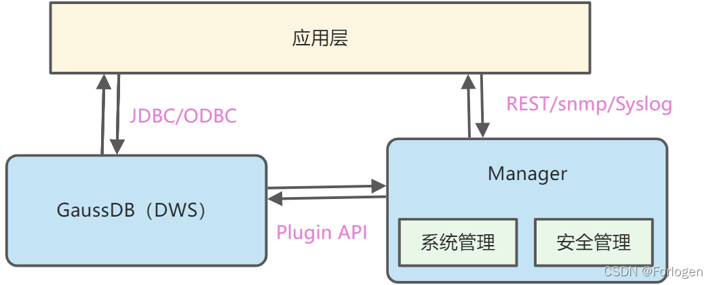

其中：

● DWS：基于MPP架构的数据库，提供PB级数据负载能力、百TB级数据支撑能力、海量数据查询统计分析能力与事务处理能力、支持结构化数据PB级分析能力等
● Manager：作为运维系统，负责GaussDB(DWS)的集群管理，支持大规模集群的安装部署、监控、告警、用户管理、权限管理、审计、服务管理、健康检查、问题定位、升级和补丁等。

DWS具有如下的优势：

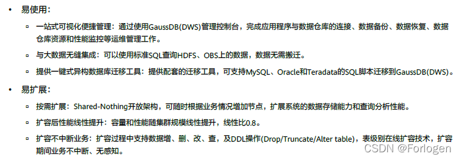

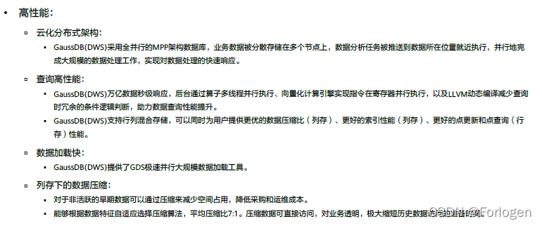

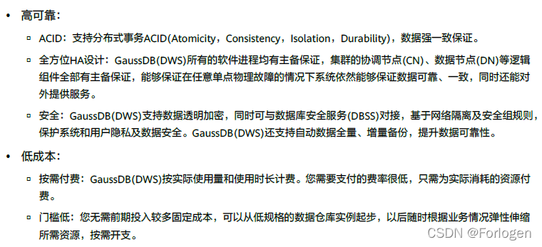

2. 架构
DWS的产品架构如下所示：

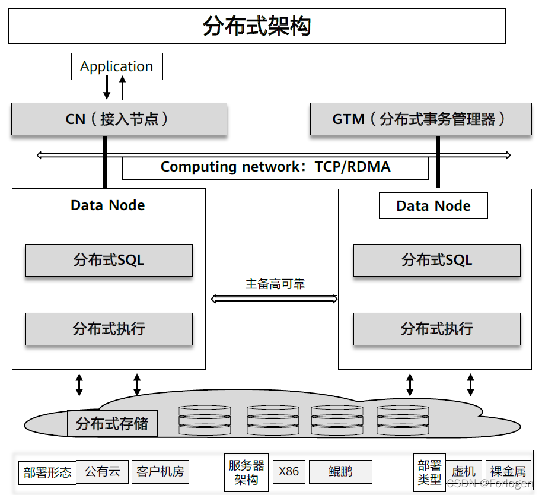

DWS本身基于分布式架构，组件支持主备/多活高可靠性设计；存算分离，按需独立扩展；支持事务的ACID，支持数据的强一致性保证。另外，底层支持x86和arm两种架构的服务器，部署类型支持虚拟机和裸金属服务器两种。基于鲲鹏芯片的垂直优化相比同代的x86性能提升30%。

逻辑上的架构如下图所示：

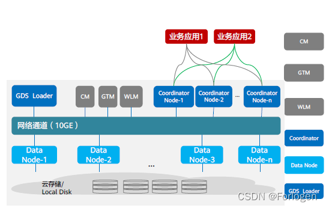

其中：

● 集群管理模块（Cluster Manager，CM）:管理和监控分布式系统中各个功能单元和物理资源的运行情况，确保整个系统的稳定运行；
● 全局事务控制器（Global Transaction Manager，GTM）：提供全局事务控制所需的信息，采用多版本并发控制MVCC机制
● 工作负载管理器（Worked Manager，WLM）：控制系统资源的分配，防止过量业务负载对系统的冲击导致业务拥塞和系统崩溃
● Corrdinator：整个系统的业务入口和结果返回，用于接收来自业务应用的访问请求，分解任务并调度任务分片的并行执行
● Data Node：用于执行查询任务分片的逻辑实体
● GDS Loader：并行数据加载，可配置多个，支持文本文件格式，错误数据自动识别

DN节点为保证高可用，具有主、备、从备三类DN，高可用的实现方式为：

● 主、备DN同步数据期间，如果主DN突然故障不可用，备DN会升为主DN
● 在原主DN恢复前，新升为主的DN会将数据日志同步到从备DN
●原主DN恢复后将成为备DN，并且会使用“从备DN”上的数据日志恢复异常期间的数据。

从备DN永远只作为从备使用，不会因为主DN或备DN故障而升级为主DN或备DN，从备只存放备DN故障时同步到从备的Xlog数据和数据通道复制产生的数据。

3. 数据查询流程
数据查询的流程示意图如下所示：

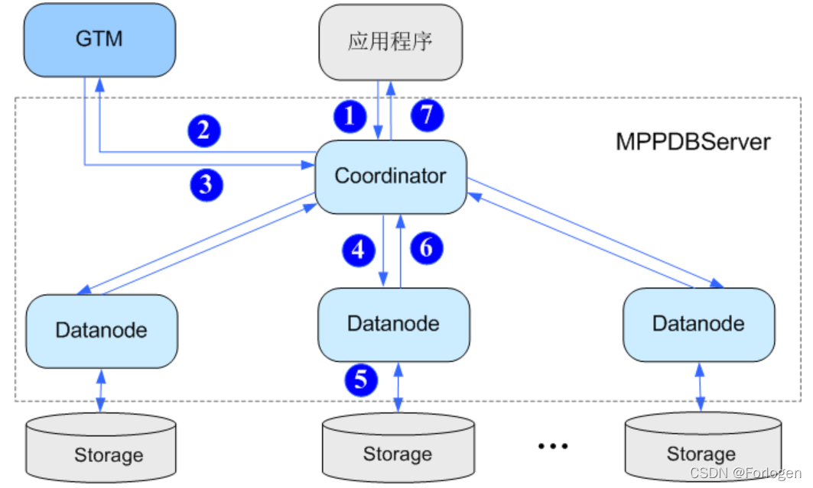

具体查询流程如下：

用户通过应用程序发出查询本地数据的SQL请求到Coordinator
Coordinator接收用户的SQL请求，分配服务进程，向GTM请求分配全局事务信息
GTM接收到Coordinator的请求，返回全局事务信息给Coordinator
Coordinator根据数据分布信息以及系统元信息，解析SQL为查询计划树，从查询计划树中提取可以发送到Datanode的执行步骤，封装成SQL语句或者子执行计划树，发送到Datanode执行
Datanode接收到读取任务后，查询具体Storage上的本地数据块
Datanode任务执行后，将执行结果返回给Coordinator
Coordinator将查询结果通过应用程序返回给用户
4. 应用
DWS的已有应用场景如下：

● 数据仓库迁移

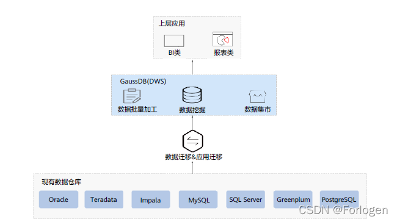

● 大数据融合分析

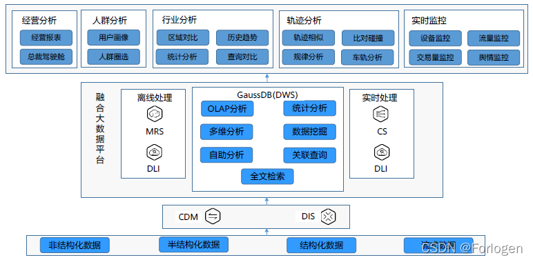

● 增强型ETL和实时BI分析

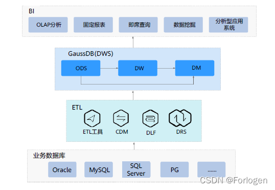

● 实时数据分析

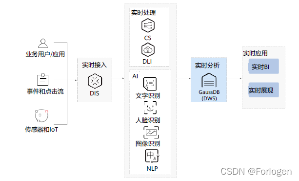

● 银行大数据分析平台

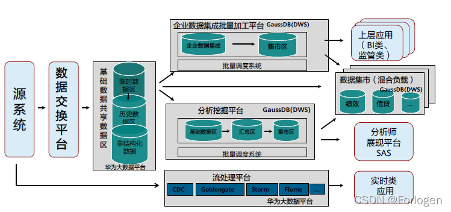

5. 组网方案
GaussDB(DWS)整个系统网络划分为2个平面，即业务平面和管理平面，两个平面之间采用物理隔离的方式进行部署，保证业务、管理各自网络的安全性。

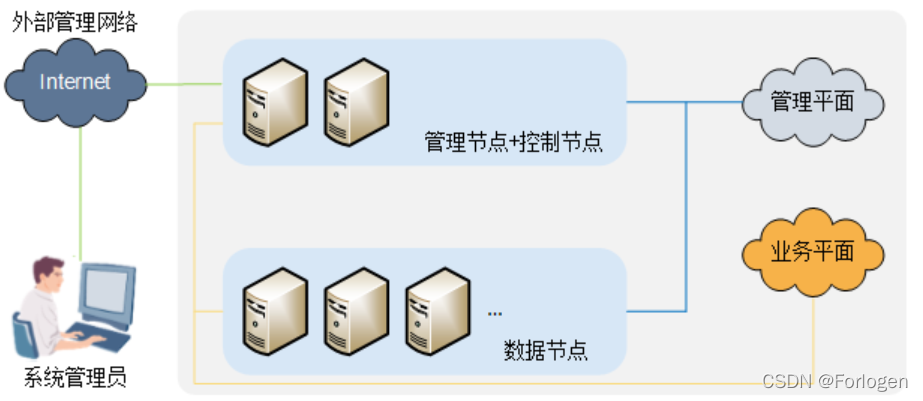

管理平面通过运维网络接入，提供系统管理和维护功能，主要用于集群的管理，对外提供集群监控、配置、审计、用户管理等服务。 业务平面，主要用于集群内部数据处理的专用网络平面，此处的业务平面非客户的应用网络平面。
关于不同场景下组网方案原则如下：

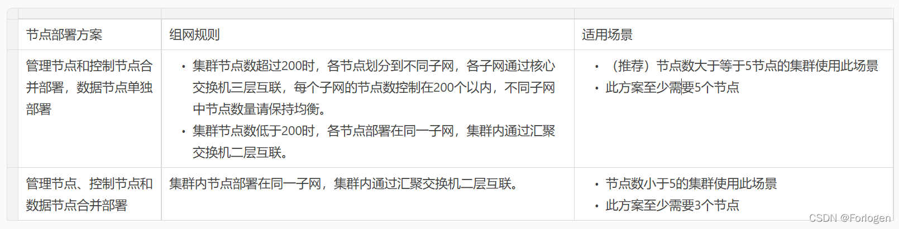

6. 集群组网方案
GaussDB(DWS)系统的网络划分为2个平面，即业务平面和管理平面，两个平面之间采用物理隔离的方式进行部署，保证业务、管理各自网络的安全性。主备管理节点还支持设置外部管理网络的IP地址，用户可以通过外部管理网络进行集群管理。

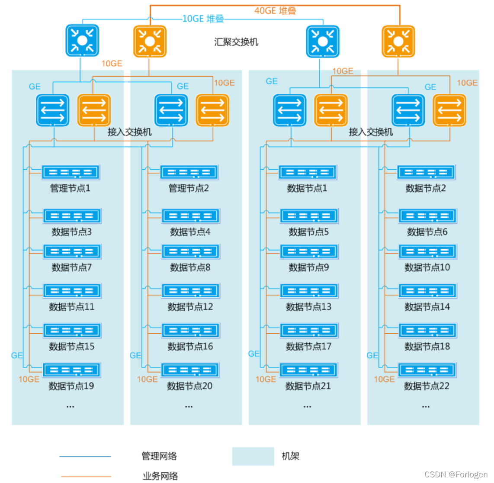

采用双平面组网时，集群中每个节点分别接入管理平面和业务平面，每个节点需要准备一个管理IP地址和一个业务IP地址，每个IP地址用两个网络接口配置Bond，分别接入两个接入交换机。各节点的业务平面建议采用10GE带宽，业务平面接入交换机与汇聚交换机之间建议采用10GE带宽，业务平面汇聚交换机的堆叠带宽建议设置为40GE。
————————————————
版权声明：本文为CSDN博主「Forlogen」的原创文章，遵循CC 4.0 BY-SA版权协议，转载请附上原文出处链接及本声明。
原文链接：https://blog.csdn.net/Forlogen/article/details/122336008

## GaussDB优势

多：超大集群：Shared-Nothing架构+独创的大规模集群通讯技术，最大支持1024节点，支持在线扩容。
快： 并行计算架构：充分利用集群中所有资源，提供极致分析性能，且随着集群规模扩展性能线性增长。 行列混存，极速查询分析：行列混存+向量化执行， 并行Bulk Load，数据快速入库。
好： 全组件HA：无单节点故障，支持跨DC容灾。 租户隔离：租户资源隔离，适合运营商多部门多业务场景。
省： 开放架构：X86、ARM服务器部署，降低TCO。 标准SQL， 平滑应用迁移: 兼容标准ANSI SQL92、SQL2003应用改造小， 提供Oracle、Teradata语法迁移工具。

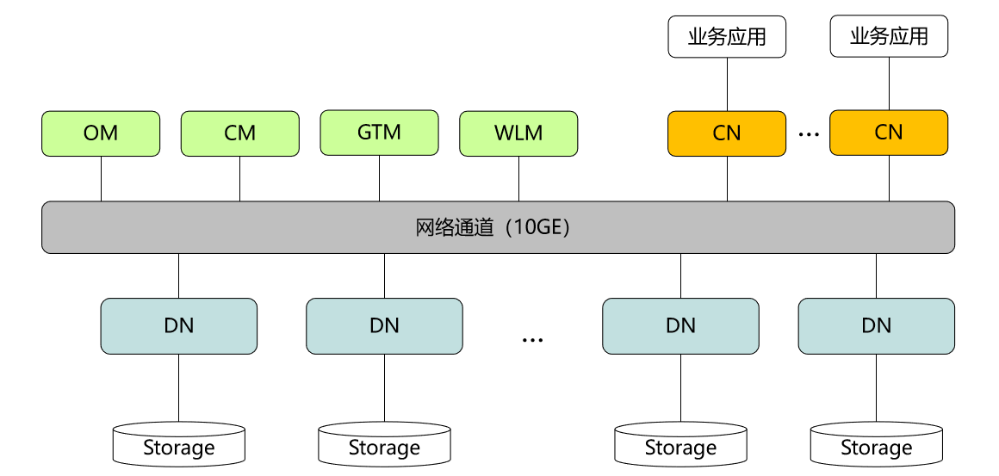

