# 阿里巴巴如何打造“EB级计算平台存储引擎”？

> 阿里妹导读：MaxCompute是阿里EB级计算平台，经过十年磨砺，它成为阿里巴巴集团数据中台的计算核心和阿里云大数据的基础服务。MaxCompute的存储引擎基于开源的Apache ORC文件格式，打造了新一代列存文件格式AliORC。本文整理自阿里巴巴MaxCompute西雅图团队的高级技术专家吴刚的专访，将为大家介绍AliORC的核心技术，同时分享作为Apache ORC开源社区PMC的心得和一些个人成长经历。

**一、MaxCompute平台存储引擎背景**

**
**

阿里云大数据计算服务( MaxCompute，原名 ODPS )是阿里云提供的一种安全可靠、高效能、低成本、从GB到EB级别按需弹性伸缩的在线大数据计算服务。MaxCompute 不仅仅是一个计算平台，也承担着大数据的存储。阿里巴巴集团99%的数据存储都基于 MaxCompute，总数量达EB级。MaxCompute 存储引擎处于MaxCompute Tasks和底层盘古分布式文件系统之间，提供一个统一的逻辑数据模型给各种各样的计算任务。

存储层最核心的部分就是文件格式。对于文件存储而言，有两种主流的方式，即按行存储以及按列存储。所谓按行存储就是把每一行数据依次存储在一起，即先存储第一行的数据再存储第二行的数据，以此类推。按列存储就是把表中的数据按照列存储在一起，先存储第一列的数据，再存储第二列的数据。而在大数据场景之下，往往只需要获取部分列的数据，那么使用列存就可以只读取少量数据，这样可以节省大量磁盘和网络I/O的消耗。此外，因为相同列的数据属性非常相似，冗余度非常高，列式存储可以增大数据压缩率，进而大大节省磁盘空间。MaxCompute 的存储格式演化，从最早的行存格式 CFile1，到第一个列存储格式 CFile2，再到新一代的列存格式AliORC，经历了从行存到列存的转换。

 

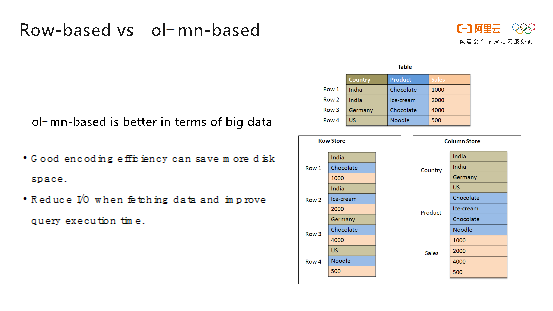

**二、什么是Apache ORC开源项目**

**
**

AliORC是基于开源的Apache ORC打造的列存文件格式，那什么是Apache ORC？Apache ORC是专为Hadoop生态系统打造的一款读写快、体积小的列式存储文件格式。它支持ACID事务，内置轻量级索引，以及支持各种复杂类型。有很多的开源系统采用了ORC，比如Spark、Presto、Hive、Hadoop、Impala和Arrow等。

 

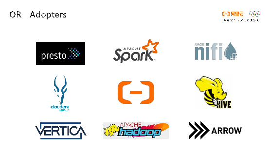

简单介绍一下Apache ORC项目的发展历程。在2013年初的时候，Hortonworks和Facebook一起开发出ORC用来替代Hive中的RCFile文件格式。经过两个版本的迭代，ORC孵化成为了Apache顶级开源项目，并且顺利地从Hive中脱离出来成为一个单独的项目。阿里云MaxCompute技术团队在2017年初参与到Apache ORC社区中，基于ORC打造了AliORC作为MaxCompute内置的文件存储格式之一。

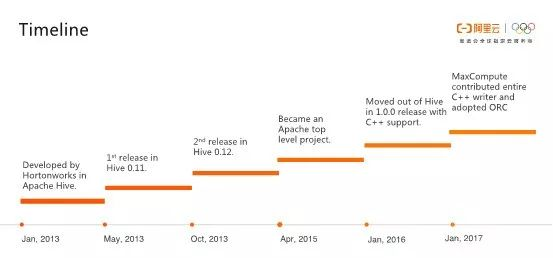

**阿里巴巴对ORC社区的贡献**

**
**

阿里巴巴MaxCompute技术团队为Apache ORC项目做出了大量贡献，共提交了30多个patch，总计1万5千多行代码。包括一个完整的C++实现的ORC Writer，以及一些重要的bug fix和性能优化。团队中一共有3名contributor。在2017年的Hadoop Summit上，ORC的创始人Owen O`Malley也特别提到了阿里巴巴的贡献。

开源地址

源码已经在 Github 开源，长按识别以下二维码，关注**“****阿里技术****”**官方公众号，并在对话框内回复**“数据****”**，即可获得 Github 下载链接、了解更多详情。

**开源ORC文件格式介绍**

**
**

ORC在类型系统上的建模是一个树形的结构。对于一些诸如Struct这样的复杂类型会有一个或者多个孩子节点；Map类型有两个孩子节点，即key和value；List类型只有一个孩子节点；其他的普通类型就是一个叶子节点。如下图所示，左侧的表结构就能够被形象地转化成右侧的树型结构，简单、直观。

 

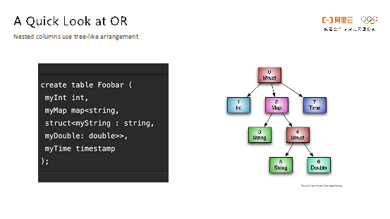

ORC主有两个优化指标，查询速度和存储效率，先来谈谈查询速度优化。ORC将文件切分成大小相近的块，在块内部使用列式存储，也就是将相同列的数据存储到一起。针对这些数据，ORC提供轻量的索引支持，记录每个数据块的最小值、最大值、非空值计数等。基于这些统计信息，可以在读取文件的时候非常方便地过滤掉不满足查询语句的数据，减少数据的读取量和网络传输消耗。此外，ORC还支持列裁剪，如果查询中只需要读取部分列，那么Reader只需要返回所需列的数据，进一步减小了需要读取的数据量。

 

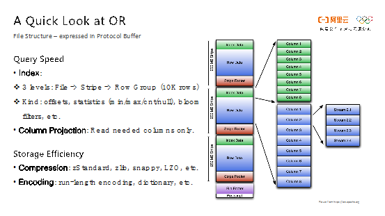

关于存储效率优化目标，ORC采用了通用的压缩算法，比如开源的zStandard、zlib、snappy、LZO等来提高文件压缩率。同时，也使用了轻量级的编码算法，比如游程编码、字典编码等来进一步提高压缩比。

**三、为何选择ORC？**

**
**

在对下一代文件格式进行技术选型的时候，为了更好的生态和开放性，我们决定把眼光投向开源社区。在大数据领域，除了Apache ORC之外，就是是由Cloudera和Twitter共同开发的Apache Parquet，其灵感来源于Google发表的Dremel的论文。Parquet的思想和ORC非常相近，使用了列式存储和通用的压缩以及编码算法，也能够提供轻量级索引以及统计信息。

 

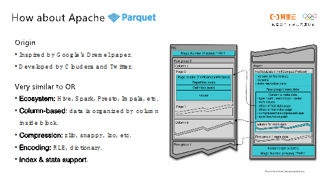

相比ORC，Parquet有两个优点。第一点就是Parquet能够更好地支持嵌套类型，Parquet能够通过使用definition level和repetition level来标识复杂类型的层数等信息。不过这样的设计就连Google的论文都使用整整一页来介绍这个算法，实现起来比较复杂。此外，当前Parquet的编码类型比ORC也更多一些，其支持plain、bit-packing以及浮点数等编码方式，所以Parquet在某些数据类型的压缩率上比ORC更高。

**ORC 和 Parquet 性能对比**

**
**

虽然Parquet相对ORC有自己的优势，但我们最终还是看性能说话。MaxCompute团队内部和开源社区都进行了性能测试，这里以Hadoop Summit上公开的一次性能测试进行阐述。Hortonworks的联合创始人Owen基于Github日志数据和纽约市出租车数据这两个开源数据集，测试了各种文件格式（ORC、Parquet、Avro和JSON）的存储效率和读表性能，由于Avro和JSON都是行存格式，我们在此略过。

 

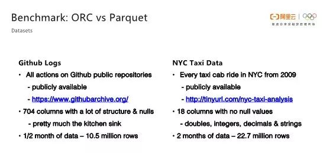

关于存储效率的对比，Taxi和Github两张表在相同压缩算法下，Parquet和ORC存储性能非常相近。Github项目数据集下ORC比Parquet的压缩率更高一些，压缩后数据量变得更小。

 

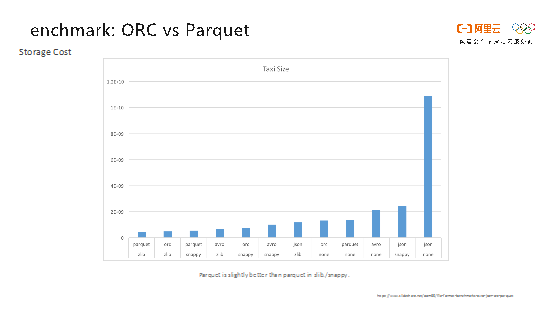

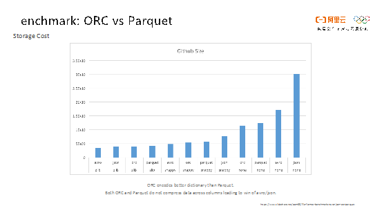

关于读表性能的对比，相同压缩算法的ORC文件读起来比Parquet要更快一些。

 

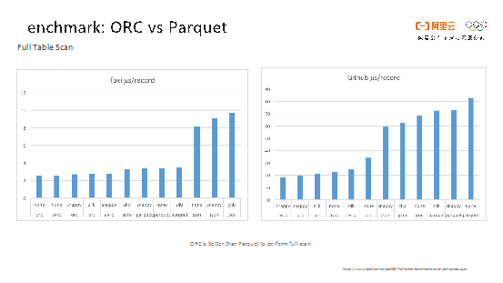

在数据压缩效率差不多的前提下，大数据场景我们更关心表的读取性能，因此ORC更契合我们的需求。同时由于ORC的设计简洁，社区有更强的领导力，最终我们决定选择ORC作为MaxCompute存储格式更新换代的起点。

 

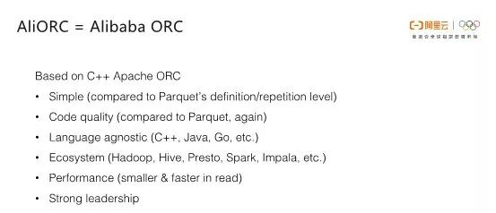

**四、AliORC技术揭秘** 

**
**

AliORC是基于开源Apache ORC深度优化的文件格式，它的首要目标是和开源的ORC保持兼容，这样才能保证易用性和开放性。AliORC主要从两个方面对于开源的ORC进行了优化，一方面，AliORC提供了更多的扩展特性，比如对于Clustered Index和C++ Arrow的支持，实现谓词下推等等。另一方面，AliORC进行了大量性能优化，实现了异步预读、智能的I/O管理以及自适应字典编码等。

 

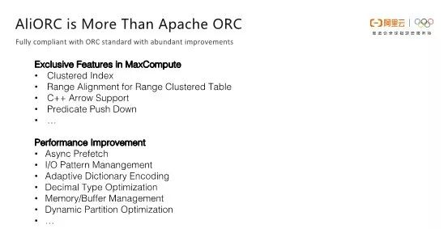

**异步预读**

**
**

传统读文件的方式一般是从底层文件系统（这里是阿里自研的的分布式文件系统盘古）先拿到原始数据，然后进行解压和解码。这两步操作分别是I/O密集型和CPU密集型的任务，并且两者没有任何并行性，因此就加长了整体的端到端时间，并且造成了资源浪费。AliORC这样就将所有的读盘操作变成了异步的操作，实现了从文件系统读数据和解压解码操作的并行处理，。Reader在读数据前，提前将读取数据的请求全部发送出去，当真正需要数据的时候就去检查之前的异步请求是否已经返回了；如果数据已经返回，则可以立即进行解压和解码操作而不需要等待读盘，这样就可以极大地提高并行度，降低读取文件的所需时间。

 

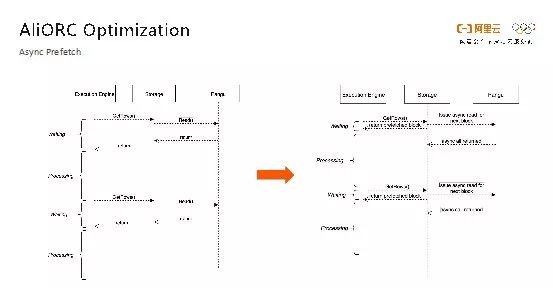

如下图所示的就是打开了异步预读优化前后的性能对比。开启异步预读之前，读取一个文件需要14秒，而在打开异步预读之后则只需要3秒，读取速度提升了数倍。当异步请求返回较慢时还是会变成同步请求，从右侧饼图可以看出，实际情况下80%以上的异步请求都是有效的。

 

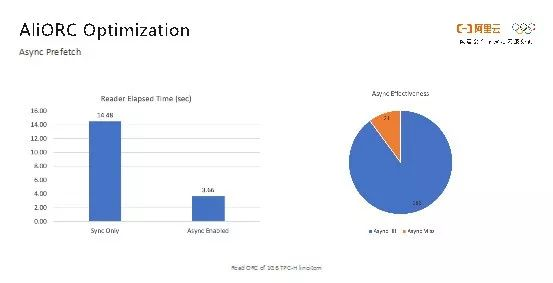

**消除小I/O**

**
**

在ORC文件中，不同列的文件大小是完全不同的，而每次读取都是以列为单位进行的。这样对于数据量比较小的列而言，读取时的网络I/O开销非常大。而ORC文件中有许多这样数据量很小的列，从而造成了大量小I/O的产生。小I/O不仅造成整体latency变慢，还会造成I/O次数增多降低并发度。为了消除这些小I/O开销，AliORC在Writer写数据时，针对不同列的数据压缩后大小进行了排序，将数据量少的列放在一起写。而在reader端，用一次大I/O块即可将排列在一起的小数据块全部读出来，大大减小了小I/O的次数。

 

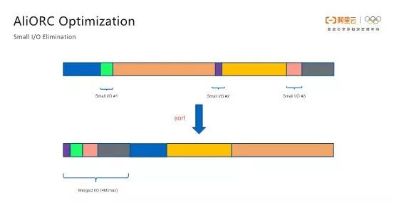

如下图所示的是AliORC优化前后的对比情况。蓝色部分表示的就是消除小I/O之前的I/O分布情况，橙色的部分则是表示消除之后的I/O分布情况。可以看到，消除小I/O之前，小于64K的I/O有26个，而在消除小I/O之后，小于64K的I/O为零，优化效果还是非常显著的。

 

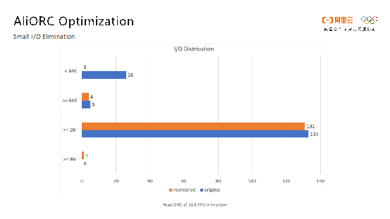

**内存管理**

**
**

在开源版本的ORC实现中，Writer的每列数据都使用了一个很大的Buffer去保存压缩后的数据，默认大小为1M。Buffer设置得越大，压缩率越高。但是不同列的数据量不同，某些列根本用不到1M大小的Buffer，因此就会造成极大的内存浪费。避免内存浪费的简单方法就是在一开始的时候只给很小的数据块作为Buffer，并且按需分配，如果需要写的数据更多，那么就通过类似C++ std::vector的resize方式提供更大的数据块。原本实现方式中，resize一次就需要进行一次O(N)的复制操作，将原始数据从老的Buffer拷贝到新的Buffer中去，这样性能损失非常大。因此，AliORC开发了新的内存管理结构，初始值为64K大小，按需每次分配一个连续64K大小的Block，但是Block与Block之间内存不是连续的。这种方式打破了内存连续的假设，会造成很多代码的改动，但是这一改动却是值得的。因为在很多场景下，原来的resize方式需要消耗很多内存，有可能造成内存耗尽，尤其是在动态分区写入的场景下，进而导致任务因为OOM而失败，而新的方式可以在这种场景下大大降低内存的峰值，效果非常明显。

 

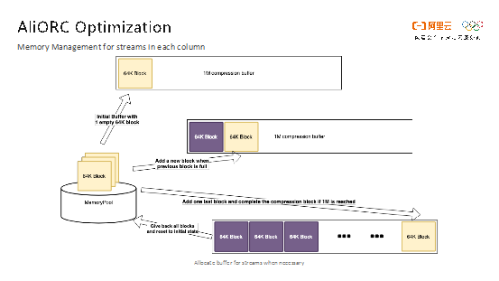

**Seek读取优化**

**
**

Seek原来的问题在于压缩块比较大，每个压缩块中包含很多个Row Group。在下图中，每一万行数据叫做一个Row Group。在Seek的场景下，可能会Seek到文件中间的任意一处，可能刚好是在某一个压缩块中间，比如图中第7个Row Group被包含在第2个压缩块中。通常Seek的操作就是先跳转第2个Block的头部，然后进行解压，将第7个Row Group之前的数据先解压出来，再真正地跳转到第7个Row Group处。但是图中绿色的部分数据我们并不需要读，因此这一段的数据量就被白白解压了，浪费掉很多计算资源。因此，AliORC就是在写文件的时候把压缩块和Row Group的边界进行对齐，这样Seek到任何的Row Group都是一个单独的压缩块，不需要额外解压缩操作。

 

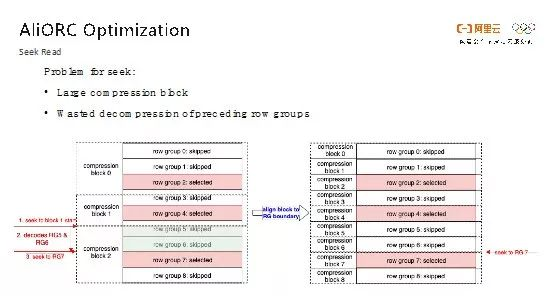

如图所示的是进行Seek优化前后的效果对比。蓝色部分是优化之前的情况，橙色部分代表优化之后的情况。可以发现，有了对于Seek的优化，解压所需的时间和数据量都降低了5倍左右。

 

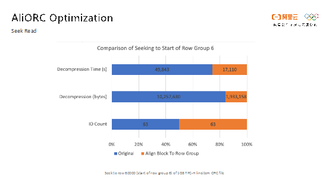

**自适应字典编码**

**
**

字典编码就是针对重复度比较高的字段，首先整理出来一个字典，然后使用字典中的序号来代替原来的数据进行编码。对字符串而言，相当于把字符串类型数据的编码转化成整型数据的编码，这样可以大大减少数据量。但是ORC字典编码存在一些问题。首先，不是所有的字符串都适合字典编码，而在开源ORC的实现里，每一列先默认打开字典编码，当写文件结束时再判断每一列是否适合字典编码，如果不适合，再回退到非字典编码。由于回退操作相当于需要重写字符串类型数据，因此开销会非常大。AliORC所做的优化就是通过一个自适应的算法提早决定某一列是否需要使用字典编码，这样就可以节省很多的计算资源。另外，开源的ORC中通过标准库中的std::unordered_map来实现字典编码，但是它的实现方式并不适合大数据场景下的数据特征，而Google开源的dense_hash_map库可以带来10%的写性能提升，因此AliORC采用了这种实现方式。最后，开源的ORC标准中要求对于字典类型进行排序，但实际上这是没有必要的，剔除掉该限制可以使得Writer端的性能提高3%。

 

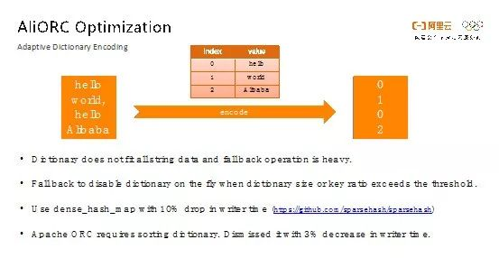

**Range分区表的Range对齐读取优化**

**
**

这部分主要是对于Range Partition的优化。如下图右侧的DDL所示，Range Partition就是将一张表按照某些定义好的列进行范围聚集，并对这些列的数据进行排序。比如图中的例子将这些数据存储到4个桶中，每个桶分别存储0到1、2到3、4到8以及9到无穷大的数据。在具体实现过程中，每个桶都使用了一个独立的AliORC文件，在文件尾部存储了一个类似于B+Tree的索引。当需要进行查询的时候，如果查询的Filter和Range Key相关，就可以直接利用该索引来排除不需要读取的文件和数据，进而大大减少所需要处理的数据量。

 

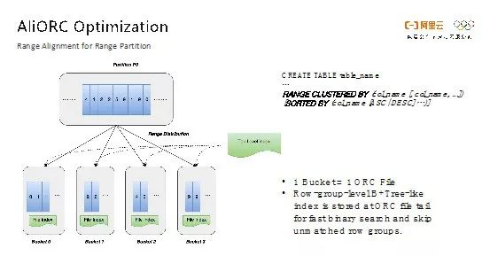

对于Range Partition而言，AliORC具有一个很强大的功能，叫做Range对齐。假设需要Join两张Range Partition的表，它们的Join Key就是Range Partition Key。如下图所示，表A有三个Range，表B有两个Range。在普通表的情况下，这两个表进行Join会产生大量的Shuffle，因为需要将相同的Join Key数据Shuffle到同一个Worker上进行Join操作，而我们知道Join操作又是非常消耗计算资源的。有了Range Partition之后，就可以根据Range的信息进行对齐，在这里就是将A表的三个桶和B表的两个桶进行对齐，产生如下图所示的三个蓝色区间，可以确定蓝色区间之外的数据是肯定不可能产生Join结果，因此Worker上的Reader根本不需要读取那些数据。

 

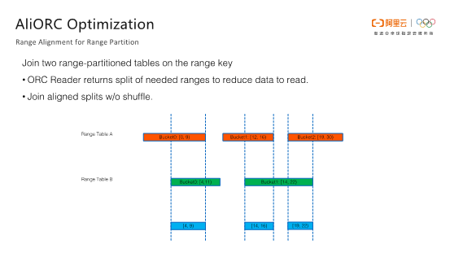

完成优化之后，每个Worker只需要打开蓝色区域的数据进行Join操作即可。这样就可以使得Join操作能够在本地Worker中完成，不需要进行Shuffle，进而大大降低了数据传输量，提高了端到端的效率。

**AliORC效果**

**
**

如下图所示的是在阿里巴巴内部测试中AliORC和开源的C++版本ORC以及Java版本ORC的读取时间比较。从图中可以看出AliORC的读取速度比开源ORC要快一倍。

 

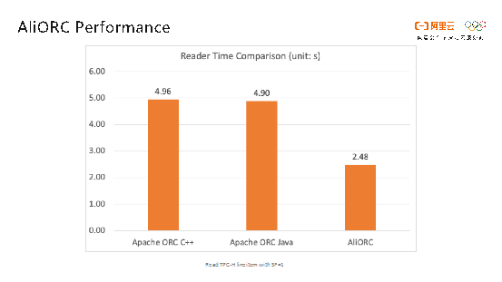

截止2019年5月在阿里巴巴内部也迭代了3个版本，从下图可以看出，每个版本之间也有接近30%的性能提升，并且还在持续优化当中。目前，AliORC已经在阿里集团内部MaxCompute生产环境中大规模使用，尚未在公有云上进行发布。后续我们也会将AliORC开放出来，让大家共享技术红利。

 

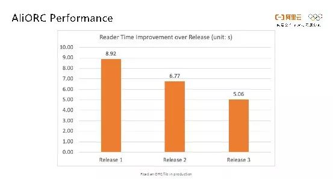

**
**

**五、个人成长**

**
**

**为何选择加入MaxCompute团队**

**
**

从个人角度而言，我更加看好大数据领域。虽然对于一项技术而言，黄金期往往最多只有10年。对于大数据技术而言，它已经经历了10年，但我相信大数据技术并不会衰落。尤其是在人工智能技术的加持下，大数据技术仍然有很多需要解决的问题，有各种各样的海量数据需要去分析、去处理、去储存。此外，阿里的MaxCompute团队更是人才济济，北京、杭州、西雅图等团队都具有强大的技术实力，从优秀的同事身边能够学习到很多东西。最后一点，开源大数据产品基本上都是国外的天下，而MaxCompute是完全国产自研的平台，加入MaxCompute团队让自己能够有机会为国产软件尽一份力量。

**如何走上大数据技术之路的**

**
**

我走上大数据技术这条路也是各种机缘巧合，之前在学校里面所学习的内容与大数据完全没有关系。在美国找工作的时候基本拿的都是视频编码相关的offer，只有Uber是给的大数据相关的岗位，由于比较好奇互联网独角兽的文化就加入了。在加入Uber Hadoop Platform组的时候，该组还处于组建的早期，平台内基本没有数据，公司内大家都是各玩各的，自己搭建一些Hadoop服务来执行任务。当时跟着团队从0到1地学习了Scala和Spark，从最开始了解如何使用Spark到阅读Spark源码，然后基于Spark慢慢地搭建起大数据平台、扎根大数据领域。而加入阿里巴巴MaxCompute团队之后，能够从需求、设计、开发、测试、优化和跟进用户等角度来接触打造大数据产品的各个阶段，这也是比较有趣和宝贵的经历。

**在阿里巴巴美国办公室的工作体验**

**
**

阿里的美国部门其实和国内的部门差别并不大，大家工作都是相似的节奏。虽然西雅图的办公室人数并不是很多，也就一百多人，但是各个团队的同事都有，比如集团、蚂蚁、阿里云、达摩院、量子实验室等等，很容易和不同技术方向的同事交流新点子和有趣的事情。另外，在阿里巴巴的美国办公室，可以近水楼台参加这边举办的行业会议和开源社区meetup，我们自己也会经常去分享和交流经验。

**如何一步步成为ORC社区PMC**

**
**

MaxCompute平台存储引擎升级需要引入新的文件格式，而ORC当时开源的C++版本只有Reader却没有Writer，因此刚好有这个机会去开发C++版本的ORC Writer。完成之后为了能够服务开源社区，并且集合社区的力量共同把C++版本ORC做好，因此我们将代码贡献回了开源社区，质量和数量都得到了开源社区的认可。成为Committer之后，责任也就更大了，不仅自己需要贡献代码，还需要和社区一起成长，review其他成员的代码，并讨论短期和长期的需求和设计。在获取Committer一年后，由于活跃度较高，因此被授予了PMC。这个过程中最大的感受就是，取之开源，回馈开源，高质量的开源社区需要大家一起来投入，开源精神才能长久、健康的发展下去。

作者简介：吴刚，阿里云智能计算平台事业部高级技术专家，主要负责MaxCompute平台存储引擎的开发和优化，同时是Apache顶级开源项目ORC的PMC。

入职阿里前就职于Uber总部负责内部的Spark计算平台，先后毕业于中国科学技术大学和卡内基梅隆大学。

# 什么是MaxCompute

更新时间：2022-05-19 14:29

MaxCompute（ODPS）是适用于数据分析场景的企业级SaaS（Software as a Service）模式云数据仓库，以Serverless架构提供快速、全托管的在线数据仓库服务，消除了传统数据平台在资源扩展性和弹性方面的限制，最小化用户运维投入，使您可以经济并高效地分析处理海量数据。

随着数据收集手段不断丰富，行业数据大量积累，数据规模已增长到了传统软件行业无法承载的海量数据（TB、PB、EB）级别。MaxCompute提供离线和流式数据的接入，支持大规模数据计算及查询加速能力，为您提供面向多种计算场景的数据仓库解决方案及分析建模服务。MaxCompute还为您提供完善的数据导入方案以及多种经典的分布式计算模型，您可以不必关心分布式计算和维护细节，便可轻松完成大数据分析。

MaxCompute适用于100 GB以上规模的存储及计算需求，最大可达EB级别，并且MaxCompute已经在阿里巴巴集团内部得到大规模应用。MaxCompute适用于大型互联网企业的数据仓库和BI分析、网站的日志分析、电子商务网站的交易分析、用户特征和兴趣挖掘等。

MaxCompute还深度融合了阿里云如下产品：

- [DataWorks](https://www.alibabacloud.com/help/zh/dataworks/latest/what-is-dataworks#concept-wqv-qbp-r2b)

  基于DataWorks实现一站式的数据同步、业务流程设计、数据开发、管理和运维功能。

- [机器学习PAI](https://www.alibabacloud.com/help/zh/machine-learning-platform-for-ai/latest/what-is-machine-learning-platform-for-ai#concept-1822926)

  基于机器学习平台的算法组件实现对MaxCompute数据进行模型训练等操作。

- [Quick BI](https://www.alibabacloud.com/help/zh/quick-bi/latest/what-is-quick-bi#concept-qrd-dlv-tdb)

  基于Quick BI对MaxCompute数据进行报表制作，实现数据可视化分析。

## 学习路径

您可以通过[MaxCompute学习路径](https://www.alibabacloud.com/getting-started/learningpath/maxcompute)快速了解MaxCompute的相关概念、基础操作、进阶操作等。

## 核心功能

| 功能分类                     | 功能描述                                                     |
| ---------------------------- | ------------------------------------------------------------ |
| 全托管的Serverless在线服务   | 对外以API方式访问的在线服务，开箱即用。预铺设大规模集群资源，可以按需使用、按量计费。无需平台运维，最小化运维投入。 |
| 弹性能力与扩展性             | 存储和计算独立扩展，支持企业将全部数据资产在一个平台上进行联动分析，消除数据孤岛。支持实时根据业务峰谷变化分配资源。 |
| 统一丰富的计算和存储能力     | MaxCompute支持多种计算模型和丰富的UDF。采用列压缩存储格式，通常情况下具备5倍压缩能力，可以大幅节省存储成本。 |
| 与DataWorks深度集成          | 一站式数据开发与治理平台DataWorks，可实现全域数据汇聚、融合加工和治理。DataWorks支持对MaxCompute项目进行管理以及Web端查询编辑。 |
| 集成AI能力                   | 与机器学习平台PAI无缝集成，提供强大的机器学习处理能力。您可以使用熟悉的Spark-ML开展智能分析。使用Python机器学习三方库。 |
| 深度集成Spark引擎            | 内建Apache Spark引擎，提供完整的Spark功能。与MaxCompute计算资源、数据和权限体系深度集成。 |
| 湖仓一体                     | 集成对数据湖（OSS或Hadoop HDFS）的访问分析，支持通过外部表映射、Spark直接访问方式开展数据湖分析。在一套数据仓库服务和用户接口下，实现数据湖与数据仓库的关联分析。详细信息，请参见[MaxCompute湖仓一体](https://www.alibabacloud.com/help/zh/maxcompute/latest/lakehouse-of-maxcompute?spm=a2c63.p38356.0.0.4f805e641vUgCz#task-2045385)。 |
| 支持流式采集和近实时分析     | 支持流式数据实时写入并在数据仓库中开展分析。与云上主要流式服务深度集成，轻松接入各种来源的流式数据。支持高性能秒级弹性并发查询，满足近实时分析场景需求。 |
| 提供持续的SaaS化云上数据保护 | 为云上企业提供基础设施、数据中心、网络、供电、平台安全能力、用户权限管理、隐私保护等三级超20项安全功能，兼具开源大数据与托管数据库的安全能力。 |

## 产品架构

MaxCompute的产品架构如下。

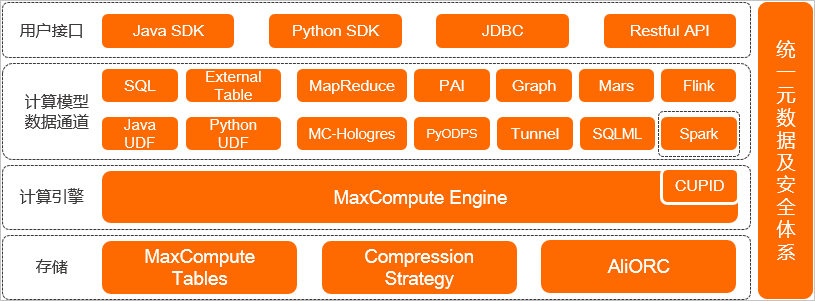

| 模块名称             | 功能说明                                                     |
| -------------------- | ------------------------------------------------------------ |
| 存储                 | MaxCompute Tables：[表](https://www.alibabacloud.com/help/zh/maxcompute/latest/table#concept-nbg-my1-5db)是MaxCompute的数据存储单元。MaxCompute中不同类型作业的操作对象（输入、输出）都是表。Compression Strategy：MaxCompute采用列压缩存储格式，通常情况下具备5倍压缩能力。AliORC：MaxCompute数据存储格式全面升级为AliORC，具备更高存储性能。 |
| 计算引擎             | MaxCompute本身具备计算引擎能力。在处理Spark作业时，MaxCompute运行在阿里云自研的CUPID平台之上，可以原生支持开源社区Yarn所支持的计算框架。 |
| 计算模型数据通道     | MaxCompute支持多种数据通道满足多场景需求：[SQL](https://www.alibabacloud.com/help/zh/maxcompute/latest/overview-of-maxcompute-sql#concept-awk-jmb-5db)：MaxCompute对外提供SQL功能。您可以将MaxCompute作为传统的数据库软件操作，但其却能处理EB级别的海量数据。**说明**MaxCompute SQL不支持事务、索引。MaxCompute的SQL语法与Oracle、MySQL有一定差别，您无法将其他数据库中的SQL语句无缝迁移至MaxCompute中。MaxCompute主要用于100 GB以上规模的数据计算，因此MaxCompute SQL最快支持在分钟或秒钟级别完成查询返回结果，但无法在毫秒级别返回结果。MaxCompute SQL的优点是学习成本低，您不需要了解复杂的分布式计算概念。如果您具备数据库操作经验，便可快速熟悉MaxCompute SQL的使用。[External Table](https://www.alibabacloud.com/help/zh/maxcompute/latest/external-table-overview#concept-znp-tdb-wdb)：提供处理除MaxCompute内部表以外的其他数据的能力。您可以通过一条简单的DDL语句，在MaxCompute上创建一张外部表，通过外部表关联外部数据源。[Java UDF](https://www.alibabacloud.com/help/zh/maxcompute/latest/java-udfs#concept-mxb-xn2-vdb)：当MaxCompute的内建函数无法满足计算需求时，您可以通过Java构建自定义函数。[Python UDF](https://www.alibabacloud.com/help/zh/maxcompute/latest/python-2-udfs#concept-pjv-qs2-xdb)：当MaxCompute的内建函数无法满足计算需求时，您可以通过Python构建自定义函数。[MapReduce](https://www.alibabacloud.com/help/zh/maxcompute/latest/summary-overview#concept-fml-smf-vdb)：MapReduce是MaxCompute提供的Java MapReduce编程模型，它可以简化开发流程，更为高效。[Hologres](https://www.alibabacloud.com/help/zh/hologres/latest/what-is-hologres#concept-1681168)：Hologres与MaxCompute在底层无缝连接，您无须移动数据，即可使用标准的PostgreSQL语句查询分析MaxCompute中的海量数据，快速获取查询结果。[PAI](https://www.alibabacloud.com/help/zh/machine-learning-platform-for-ai/latest/what-is-machine-learning-platform-for-ai#concept-1822926)：PAI是基于MaxCompute的一款机器学习算法平台。它实现了数据无需搬迁，便可进行从数据处理、模型训练、服务部署到预测的一站式机器学习。[PyODPS](https://www.alibabacloud.com/help/zh/maxcompute/latest/pyodps-quick-start#task-610562)：PyODPS是MaxCompute的Python版本的SDK，提供简单方便的Python编程接口。[Graph](https://www.alibabacloud.com/help/zh/maxcompute/latest/graph-overview#concept-xtj-fwl-vdb)：Graph是一套面向迭代的图计算处理框架。[Tunnel](https://www.alibabacloud.com/help/zh/maxcompute/latest/data-upload-and-download-overview#concept-am2-p3f-vdb)：提供高并发的数据上传下载服务。[Mars](https://www.alibabacloud.com/help/zh/maxcompute/latest/mars-overview#concept-2502322)：Mars是一个基于张量的统一分布式计算框架。Mars能利用并行和分布式技术，为Python数据科学栈加速。[SQLML](https://www.alibabacloud.com/help/zh/maxcompute/latest/maxcompute-sqlml-overview#concept-2042859)：SQLML功能依赖MaxCompute和机器学习PAI。您可以通过客户端开发MaxCompute SQLML作业，基于机器学习PAI对MaxCompute上的数据进行学习，并利用机器学习模型对数据进行预测，进而为业务规划提供指导。[Flink](https://www.alibabacloud.com/help/zh/realtime-compute-for-apache-flink/latest/what-is-alibaba-cloud-realtime-compute-for-apache-flink#concept-l1l-s5x-bhb)：Flink为MaxCompute提供实时数据处理能力。[Spark](https://www.alibabacloud.com/help/zh/maxcompute/latest/spark-overview#concept-jzp-wlb-kgb)：Spark是MaxCompute提供的兼容开源Spark的计算服务。它在统一的计算资源和数据集权限体系之上，提供Spark计算框架，支持您以熟悉的开发使用方式提交运行Spark作业，满足更丰富的数据处理分析需求。 |
| 用户接口             | MaxCompute提供如下用户接口：[Java SDK](https://www.alibabacloud.com/help/zh/maxcompute/latest/sdk-for-java#concept-utw-vvc-5db)[Python SDK](https://www.alibabacloud.com/help/zh/maxcompute/latest/python-sdk-overview#concept-2428299)[JDBC](https://www.alibabacloud.com/help/zh/maxcompute/latest/jdbc-reference-overview#concept-2338749)Restful API |
| 统一元数据及安全体系 | MaxCompute的[Information Schema](https://www.alibabacloud.com/help/zh/maxcompute/latest/overview-of-information-schema#concept-2054981)提供项目元数据及使用历史数据等信息，您可以对作业的运行情况，例如资源消耗、运行时长、数据处理量等指标进行分析，用于优化作业或规划资源容量。MaxCompute还提供了完善的安全管理体系，例如访问控制、数据加密、动态脱敏等为数据安全性提供保障。更多安全相关信息，请参见[安全管理](https://www.alibabacloud.com/help/zh/maxcompute/latest/gpdmim#task-2330709)。 |

## 产品优势

MaxCompute的主要优势如下：

- 简单易用

  - 面向数据仓库实现高性能存储、计算。
  - 预集成多种服务，标准SQL开发简单。
  - 内建完善的管理和安全能力。
  - 免运维，按量付费，不使用不产生费用。

- 匹配业务发展的弹性扩展能力

  存储和计算独立扩展，动态扩缩容，按需弹性扩展，无需提前规划容量，满足突发业务增长。

- 支持多种分析场景

  支持开放数据生态，以统一平台满足数据仓库、BI、近实时分析、数据湖分析、机器学习等多种场景。

- 开放的平台

  - 支持开放接口和生态，为数据、应用迁移、二次开发提供灵活性。
  - 支持与Airflow、Tableau等开源和商业产品灵活组合，构建丰富的数据应用。

## 联系我们
