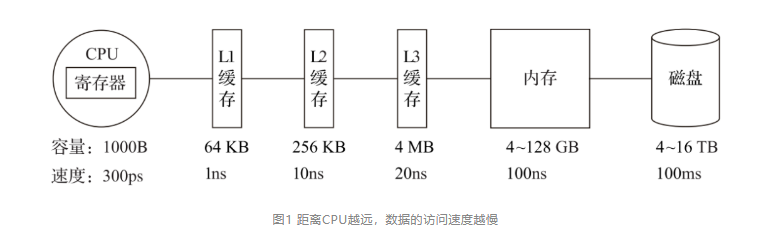
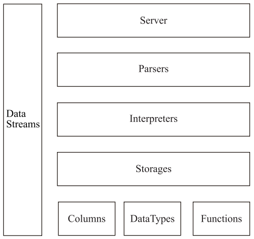
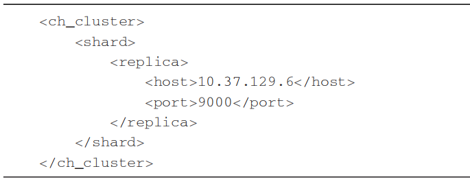
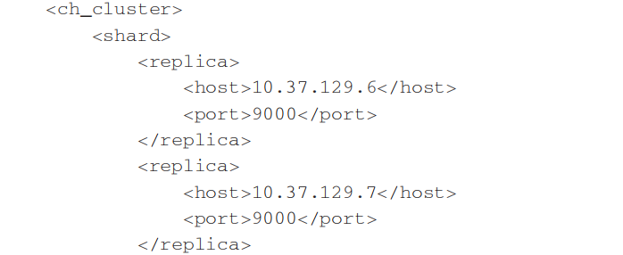
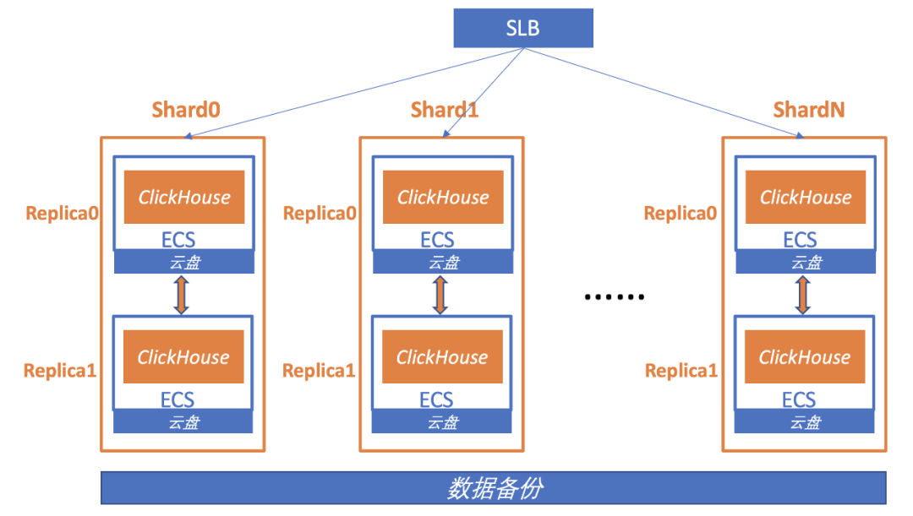
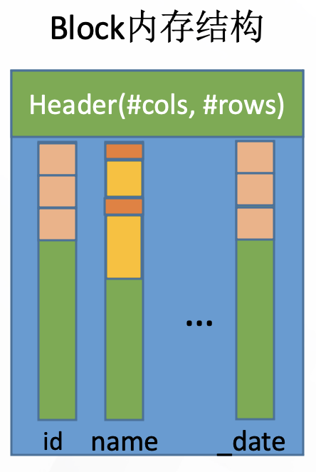
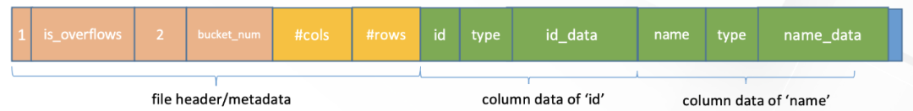
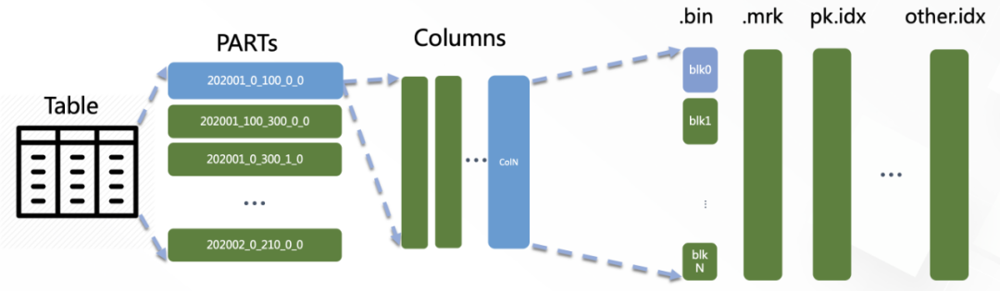
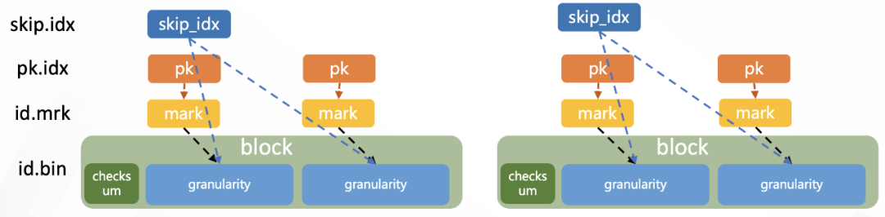

# ClickHouse

## 导读

**导读：**随着业务的迅猛增长，Yandex.Metrica目前已经成为世界第三大Web流量分析平台，每天处理超过200亿个跟踪事件。能够拥有如此惊人的体量，在它背后提供支撑的ClickHouse功不可没。ClickHouse已经为Yandex.Metrica存储了超过20万亿行的数据，90%的自定义查询能够在1秒内返回，其集群规模也超过了400台服务器。虽然ClickHouse起初只是为了Yandex.Metrica而研发的，但由于它出众的性能，目前也被广泛应用于Yandex内部其他数十个产品上。

初识ClickHouse的时候，我曾产生这样的感觉：它仿佛违背了物理定律，没有任何缺点，是一个不真实的存在。一款高性能、高可用OLAP数据库的一切诉求，ClickHouse似乎都能满足，这股神秘的气息引起了我极大的好奇。但是刚从Hadoop生态转向ClickHouse的时候，我曾有诸多的不适应，因为它和我们往常使用的技术"性格"迥然不同。如果把数据库比作汽车，那么ClickHouse俨然就是一辆手动挡的赛车。它在很多方面不像其他系统那样高度自动化。ClickHouse的一些概念也与我们通常的理解有所不同，特别是在分片和副本方面，有些时候数据的分片甚至需要手动完成。在进一步深入使用ClickHouse之后，我渐渐地理解了这些设计的目的。某些看似不够自动化的设计，反过来却在使用中带来了极大的灵活性。与Hadoop生态的其他数据库相比，ClickHouse更像一款"传统"MPP架构的数据库，它没有采用Hadoop生态中常用的主从架构，而是使用了多主对等网络结构，同时它也是基于关系模型的ROLAP方案。本文就让我们抽丝剥茧，看看ClickHouse都有哪些核心特性。

## 一、ClickHouse的核心特性

ClickHouse是一款MPP架构的列式存储数据库，但MPP和列式存储并不是什么"稀罕"的设计。拥有类似架构的其他数据库产品也有很多，但是为什么偏偏只有ClickHouse的性能如此出众呢？通过上一章的介绍，我们知道了ClickHouse发展至今的演进过程。它一共经历了四个阶段，每一次阶段演进，相比之前都进一步取其精华去其糟粕。可以说ClickHouse汲取了各家技术的精髓，将每一个细节都做到了极致。接下来将介绍ClickHouse的一些核心特性，正是这些特性形成的合力使得ClickHouse如此优秀。

**1. 完备的DBMS功能**

ClickHouse拥有完备的管理功能，所以它称得上是一个DBMS ( Database Management System，数据库管理系统 )，而不仅是一个数据库。作为一个DBMS，它具备了一些基本功能，如下所示。

- DDL ( 数据定义语言 )：可以动态地创建、修改或删除数据库、表和视图，而无须重启服务。
- DML ( 数据操作语言 )：可以动态查询、插入、修改或删除数据。
- 权限控制：可以按照用户粒度设置数据库或者表的操作权限，保障数据的安全性。
- 数据备份与恢复：提供了数据备份导出与导入恢复机制，满足生产环境的要求。
- 分布式管理：提供集群模式，能够自动管理多个数据库节点。

这里只列举了一些最具代表性的功能，但已然足以表明为什么Click House称得上是DBMS了。

**2. 列式存储与数据压缩**

列式存储和数据压缩，对于一款高性能数据库来说是必不可少的特性。一个非常流行的观点认为，如果你想让查询变得更快，最简单且有效的方法是减少数据扫描范围和数据传输时的大小，而列式存储和数据压缩就可以帮助我们实现上述两点。列式存储和数据压缩通常是伴生的，因为一般来说列式存储是数据压缩的前提。

按列存储与按行存储相比，前者可以有效减少查询时所需扫描的数据量，这一点可以用一个示例简单说明。假设一张数据表A拥有50个字段A1～A50，以及100行数据。现在需要查询前5个字段并进行数据分析，则可以用如下SQL实现：

```
SELECT A1，A2，A3，A4，A5 FROM A
```

如果数据按行存储，数据库首先会逐行扫描，并获取每行数据的所有50个字段，再从每一行数据中返回A1～A5这5个字段。不难发现，尽管只需要前面的5个字段，但由于数据是按行进行组织的，实际上还是扫描了所有的字段。如果数据按列存储，就不会发生这样的问题。由于数据按列组织，数据库可以直接获取A1～A5这5列的数据，从而避免了多余的数据扫描。

按列存储相比按行存储的另一个优势是对数据压缩的友好性。同样可以用一个示例简单说明压缩的本质是什么。假设有两个字符串abcdefghi和bcdefghi，现在对它们进行压缩，如下所示：

```
压缩前：abcdefghi_bcdefghi压缩后：abcdefghi_(9,8)
```

可以看到，压缩的本质是按照一定步长对数据进行匹配扫描，当发现重复部分的时候就进行编码转换。例如上述示例中的 (9，8)，表示如果从下划线开始向前移动9个字节，会匹配到8个字节长度的重复项，即这里的bcdefghi。

真实的压缩算法自然比这个示例更为复杂，但压缩的实质就是如此。数据中的重复项越多，则压缩率越高；压缩率越高，则数据体量越小；而数据体量越小，则数据在网络中的传输越快，对网络带宽和磁盘IO的压力也就越小。既然如此，那怎样的数据最可能具备重复的特性呢？答案是属于同一个列字段的数据，因为它们拥有相同的数据类型和现实语义，重复项的可能性自然就更高。

ClickHouse就是一款使用列式存储的数据库，数据按列进行组织，属于同一列的数据会被保存在一起，列与列之间也会由不同的文件分别保存 ( 这里主要指MergeTree表引擎 )。数据默认使用LZ4算法压缩，在Yandex.Metrica的生产环境中，数据总体的压缩比可以达到8:1 ( 未压缩前17PB，压缩后2PB )。列式存储除了降低IO和存储的压力之外，还为向量化执行做好了铺垫。

**3. 向量化执行引擎**

坊间有句玩笑，即"能用钱解决的问题，千万别花时间"。而业界也有种调侃如出一辙，即"能升级硬件解决的问题，千万别优化程序"。有时候，你千辛万苦优化程序逻辑带来的性能提升，还不如直接升级硬件来得简单直接。这虽然只是一句玩笑不能当真，但硬件层面的优化确实是最直接、最高效的提升途径之一。向量化执行就是这种方式的典型代表，这项寄存器硬件层面的特性，为上层应用程序的性能带来了指数级的提升。

向量化执行，可以简单地看作一项消除程序中循环的优化。这里用一个形象的例子比喻。小胡经营了一家果汁店，虽然店里的鲜榨苹果汁深受大家喜爱，但客户总是抱怨制作果汁的速度太慢。小胡的店里只有一台榨汁机，每次他都会从篮子里拿出一个苹果，放到榨汁机内等待出汁。如果有8个客户，每个客户都点了一杯苹果汁，那么小胡需要重复循环8次上述的榨汁流程，才能榨出8杯苹果汁。如果制作一杯果汁需要5分钟，那么全部制作完毕则需要40分钟。为了提升果汁的制作速度，小胡想出了一个办法。他将榨汁机的数量从1台增加到了8台，这么一来，他就可以从篮子里一次性拿出8个苹果，分别放入8台榨汁机同时榨汁。此时，小胡只需要5分钟就能够制作出8杯苹果汁。为了制作n杯果汁，非向量化执行的方式是用1台榨汁机重复循环制作n次，而向量化执行的方式是用n台榨汁机只执行1次。

为了实现向量化执行，需要利用CPU的SIMD指令。SIMD的全称是Single Instruction Multiple Data，即用单条指令操作多条数据。现代计算机系统概念中，它是通过数据并行以提高性能的一种实现方式 ( 其他的还有指令级并行和线程级并行 )，它的原理是在CPU寄存器层面实现数据的并行操作。

在计算机系统的体系结构中，存储系统是一种层次结构。典型服务器计算机的存储层次结构如图1所示。一个实用的经验告诉我们，存储媒介距离CPU越近，则访问数据的速度越快。



图1 距离CPU越远，数据的访问速度越慢

从上图中可以看到，从左向右，距离CPU越远，则数据的访问速度越慢。从寄存器中访问数据的速度，是从内存访问数据速度的300倍，是从磁盘中访问数据速度的3000万倍。所以利用CPU向量化执行的特性，对于程序的性能提升意义非凡。

ClickHouse目前利用SSE4.2指令集实现向量化执行。

**4. 关系模型与SQL查询**

相比HBase和Redis这类NoSQL数据库，ClickHouse使用关系模型描述数据并提供了传统数据库的概念 ( 数据库、表、视图和函数等 )。与此同时，ClickHouse完全使用SQL作为查询语言 ( 支持GROUP BY、ORDER BY、JOIN、IN等大部分标准SQL )，这使得它平易近人，容易理解和学习。因为关系型数据库和SQL语言，可以说是软件领域发展至今应用最为广泛的技术之一，拥有极高的"群众基础"。也正因为ClickHouse提供了标准协议的SQL查询接口，使得现有的第三方分析可视化系统可以轻松与它集成对接。在SQL解析方面，ClickHouse是大小写敏感的，这意味着SELECT a 和 SELECT A所代表的语义是不同的。

关系模型相比文档和键值对等其他模型，拥有更好的描述能力，也能够更加清晰地表述实体间的关系。更重要的是，在OLAP领域，已有的大量数据建模工作都是基于关系模型展开的 ( 星型模型、雪花模型乃至宽表模型 )。ClickHouse使用了关系模型，所以将构建在传统关系型数据库或数据仓库之上的系统迁移到ClickHouse的成本会变得更低，可以直接沿用之前的经验成果。

**5. 多样化的表引擎**

也许因为Yandex.Metrica的最初架构是基于MySQL实现的，所以在ClickHouse的设计中，能够察觉到一些MySQL的影子，表引擎的设计就是其中之一。与MySQL类似，ClickHouse也将存储部分进行了抽象，把存储引擎作为一层独立的接口。截至本书完稿时，ClickHouse共拥有合并树、内存、文件、接口和其他6大类20多种表引擎。其中每一种表引擎都有着各自的特点，用户可以根据实际业务场景的要求，选择合适的表引擎使用。

通常而言，一个通用系统意味着更广泛的适用性，能够适应更多的场景。但通用的另一种解释是平庸，因为它无法在所有场景内都做到极致。

在软件的世界中，并不会存在一个能够适用任何场景的通用系统，为了突出某项特性，势必会在别处有所取舍。其实世间万物都遵循着这样的道理，就像信天翁和蜂鸟，虽然都属于鸟类，但它们各自的特点却铸就了完全不同的体貌特征。信天翁擅长远距离飞行，环绕地球一周只需要1至2个月的时间。因为它能够长时间处于滑行状态，5天才需要扇动一次翅膀，心率能够保持在每分钟100至200次之间。而蜂鸟能够垂直悬停飞行，每秒可以挥动翅膀70～100次，飞行时的心率能够达到每分钟1000次。如果用数据库的场景类比信天翁和蜂鸟的特点，那么信天翁代表的可能是使用普通硬件就能实现高性能的设计思路，数据按粗粒度处理，通过批处理的方式执行；而蜂鸟代表的可能是按细粒度处理数据的设计思路，需要高性能硬件的支持。

将表引擎独立设计的好处是显而易见的，通过特定的表引擎支撑特定的场景，十分灵活。对于简单的场景，可直接使用简单的引擎降低成本，而复杂的场景也有合适的选择。

**6. 多线程与分布式**

ClickHouse几乎具备现代化高性能数据库的所有典型特征，对于可以提升性能的手段可谓是一一用尽，对于多线程和分布式这类被广泛使用的技术，自然更是不在话下。

如果说向量化执行是通过数据级并行的方式提升了性能，那么多线程处理就是通过线程级并行的方式实现了性能的提升。相比基于底层硬件实现的向量化执行SIMD，线程级并行通常由更高层次的软件层面控制。现代计算机系统早已普及了多处理器架构，所以现今市面上的服务器都具备良好的多核心多线程处理能力。由于SIMD不适合用于带有较多分支判断的场景，ClickHouse也大量使用了多线程技术以实现提速，以此和向量化执行形成互补。

如果一个篮子装不下所有的鸡蛋，那么就多用几个篮子来装，这就是分布式设计中分而治之的基本思想。同理，如果一台服务器性能吃紧，那么就利用多台服务的资源协同处理。为了实现这一目标，首先需要在数据层面实现数据的分布式。因为在分布式领域，存在一条金科玉律—计算移动比数据移动更加划算。在各服务器之间，通过网络传输数据的成本是高昂的，所以相比移动数据，更为聪明的做法是预先将数据分布到各台服务器，将数据的计算查询直接下推到数据所在的服务器。ClickHouse在数据存取方面，既支持分区 ( 纵向扩展，利用多线程原理 )，也支持分片 ( 横向扩展，利用分布式原理 )，可以说是将多线程和分布式的技术应用到了极致。

**7. 多主架构**

HDFS、Spark、HBase和Elasticsearch这类分布式系统，都采用了Master-Slave主从架构，由一个管控节点作为Leader统筹全局。而ClickHouse则采用Multi-Master多主架构，集群中的每个节点角色对等，客户端访问任意一个节点都能得到相同的效果。这种多主的架构有许多优势，例如对等的角色使系统架构变得更加简单，不用再区分主控节点、数据节点和计算节点，集群中的所有节点功能相同。所以它天然规避了单点故障的问题，非常适合用于多数据中心、异地多活的场景。

**8. 在线查询**

ClickHouse经常会被拿来与其他的分析型数据库作对比，比如Vertica、SparkSQL、Hive和Elasticsearch等，它与这些数据库确实存在许多相似之处。例如，它们都可以支撑海量数据的查询场景，都拥有分布式架构，都支持列存、数据分片、计算下推等特性。这其实也侧面说明了ClickHouse在设计上确实吸取了各路奇技淫巧。与其他数据库相比，ClickHouse也拥有明显的优势。例如，Vertica这类商用软件价格高昂；SparkSQL与Hive这类系统无法保障90%的查询在1秒内返回，在大数据量下的复杂查询可能会需要分钟级的响应时间；而Elasticsearch这类搜索引擎在处理亿级数据聚合查询时则显得捉襟见肘。

正如ClickHouse的"广告词"所言，其他的开源系统太慢，商用的系统太贵，只有Clickouse在成本与性能之间做到了良好平衡，即又快又开源。ClickHouse当之无愧地阐释了"在线"二字的含义，即便是在复杂查询的场景下，它也能够做到极快响应，且无须对数据进行任何预处理加工。

**9. 数据分片与分布式查询**

数据分片是将数据进行横向切分，这是一种在面对海量数据的场景下，解决存储和查询瓶颈的有效手段，是一种分治思想的体现。ClickHouse支持分片，而分片则依赖集群。每个集群由1到多个分片组成，而每个分片则对应了ClickHouse的1个服务节点。分片的数量上限取决于节点数量 ( 1个分片只能对应1个服务节点 )。

ClickHouse并不像其他分布式系统那样，拥有高度自动化的分片功能。ClickHouse提供了本地表 ( Local Table ) 与分布式表 ( Distributed Table ) 的概念。一张本地表等同于一份数据的分片。而分布式表本身不存储任何数据，它是本地表的访问代理，其作用类似分库中间件。借助分布式表，能够代理访问多个数据分片，从而实现分布式查询。

这种设计类似数据库的分库和分表，十分灵活。例如在业务系统上线的初期，数据体量并不高，此时数据表并不需要多个分片。所以使用单个节点的本地表 ( 单个数据分片 ) 即可满足业务需求，待到业务增长、数据量增大的时候，再通过新增数据分片的方式分流数据，并通过分布式表实现分布式查询。这就好比一辆手动挡赛车，它将所有的选择权都交到了使用者的手中。


## 二、ClickHouse的架构设计

目前ClickHouse公开的资料相对匮乏，比如在架构设计层面就很难找到完整的资料，甚至连一张整体的架构图都没有。我想这就是它为何身为一款开源软件，但又显得如此神秘的原因之一吧。即便如此，我们还是能从一些零散的材料中找到一些蛛丝马迹。接下来会说明ClickHouse底层设计中的一些概念，这些概念可以帮助我们了解ClickHouse。



图2 ClickHouse架构设计中的核心模块

**1. Column与Field**

Column和Field是ClickHouse数据最基础的映射单元。作为一款百分之百的列式存储数据库，ClickHouse按列存储数据，内存中的一列数据由一个Column对象表示。Column对象分为接口和实现两个部分，在IColumn接口对象中，定义了对数据进行各种关系运算的方法，例如插入数据的insertRangeFrom和insertFrom方法、用于分页的cut，以及用于过滤的filter方法等。而这些方法的具体实现对象则根据数据类型的不同，由相应的对象实现，例如ColumnString、ColumnArray和ColumnTuple等。在大多数场合，ClickHouse都会以整列的方式操作数据，但凡事也有例外。如果需要操作单个具体的数值 ( 也就是单列中的一行数据 )，则需要使用Field对象，Field对象代表一个单值。与Column对象的泛化设计思路不同，Field对象使用了聚合的设计模式。在Field对象内部聚合了Null、UInt64、String和Array等13种数据类型及相应的处理逻辑。

**2. DataType**

数据的序列化和反序列化工作由DataType负责。IDataType接口定义了许多正反序列化的方法，它们成对出现，例如serializeBinary和deserializeBinary、serializeTextJSON和deserializeTextJSON等，涵盖了常用的二进制、文本、JSON、XML、CSV和Protobuf等多种格式类型。IDataType也使用了泛化的设计模式，具体方法的实现逻辑由对应数据类型的实例承载，例如DataTypeString、DataTypeArray及DataTypeTuple等。

DataType虽然负责序列化相关工作，但它并不直接负责数据的读取，而是转由从Column或Field对象获取。在DataType的实现类中，聚合了相应数据类型的Column对象和Field对象。例如，DataTypeString会引用字符串类型的ColumnString，而DataTypeArray则会引用数组类型的ColumnArray，以此类推。

**3. Block与Block流**

ClickHouse内部的数据操作是面向Block对象进行的，并且采用了流的形式。虽然Column和Filed组成了数据的基本映射单元，但对应到实际操作，它们还缺少了一些必要的信息，比如数据的类型及列的名称。于是ClickHouse设计了Block对象，Block对象可以看作数据表的子集。Block对象的本质是由数据对象、数据类型和列名称组成的三元组，即Column、DataType及列名称字符串。Column提供了数据的读取能力，而DataType知道如何正反序列化，所以Block在这些对象的基础之上实现了进一步的抽象和封装，从而简化了整个使用的过程，仅通过Block对象就能完成一系列的数据操作。在具体的实现过程中，Block并没有直接聚合Column和DataType对象，而是通过ColumnWithTypeAndName对象进行间接引用。

有了Block对象这一层封装之后，对Block流的设计就是水到渠成的事情了。流操作有两组顶层接口：IBlockInputStream负责数据的读取和关系运算，IBlockOutputStream负责将数据输出到下一环节。Block流也使用了泛化的设计模式，对数据的各种操作最终都会转换成其中一种流的实现。IBlockInputStream接口定义了读取数据的若干个read虚方法，而具体的实现逻辑则交由它的实现类来填充。

IBlockInputStream接口总共有60多个实现类，它们涵盖了ClickHouse数据摄取的方方面面。这些实现类大致可以分为三类：第一类用于处理数据定义的DDL操作，例如DDLQueryStatusInputStream等；第二类用于处理关系运算的相关操作，例如LimitBlockInput-Stream、JoinBlockInputStream及AggregatingBlockInputStream等；第三类则是与表引擎呼应，每一种表引擎都拥有与之对应的BlockInputStream实现，例如MergeTreeBaseSelect-BlockInputStream ( MergeTree表引擎 )、TinyLogBlockInputStream ( TinyLog表引擎 ) 及KafkaBlockInputStream ( Kafka表引擎 ) 等。

IBlockOutputStream的设计与IBlockInputStream如出一辙。IBlockOutputStream接口同样也定义了若干写入数据的write虚方法。它的实现类比IBlockInputStream要少许多，一共只有20多种。这些实现类基本用于表引擎的相关处理，负责将数据写入下一环节或者最终目的地，例如MergeTreeBlockOutputStream 、TinyLogBlockOutputStream及StorageFileBlock-OutputStream等。

**4. Table**

在数据表的底层设计中并没有所谓的Table对象，它直接使用IStorage接口指代数据表。表引擎是ClickHouse的一个显著特性，不同的表引擎由不同的子类实现，例如IStorageSystemOneBlock ( 系统表 )、StorageMergeTree ( 合并树表引擎 ) 和StorageTinyLog ( 日志表引擎 ) 等。IStorage接口定义了DDL ( 如ALTER、RENAME、OPTIMIZE和DROP等 ) 、read和write方法，它们分别负责数据的定义、查询与写入。在数据查询时，IStorage负责根据AST查询语句的指示要求，返回指定列的原始数据。后续对数据的进一步加工、计算和过滤，则会统一交由Interpreter解释器对象处理。对Table发起的一次操作通常都会经历这样的过程，接收AST查询语句，根据AST返回指定列的数据，之后再将数据交由Interpreter做进一步处理。

**5. Parser与Interpreter**

Parser和Interpreter是非常重要的两组接口：Parser分析器负责创建AST对象；而Interpreter解释器则负责解释AST，并进一步创建查询的执行管道。它们与IStorage一起，串联起了整个数据查询的过程。Parser分析器可以将一条SQL语句以递归下降的方法解析成AST语法树的形式。不同的SQL语句，会经由不同的Parser实现类解析。例如，有负责解析DDL查询语句的ParserRenameQuery、ParserDropQuery和ParserAlterQuery解析器，也有负责解析INSERT语句的ParserInsertQuery解析器，还有负责SELECT语句的ParserSelectQuery等。

Interpreter解释器的作用就像Service服务层一样，起到串联整个查询过程的作用，它会根据解释器的类型，聚合它所需要的资源。首先它会解析AST对象；然后执行"业务逻辑" ( 例如分支判断、设置参数、调用接口等 )；最终返回IBlock对象，以线程的形式建立起一个查询执行管道。

**6. Functions 与Aggregate Functions**

ClickHouse主要提供两类函数—普通函数和聚合函数。普通函数由IFunction接口定义，拥有数十种函数实现，例如FunctionFormatDateTime、FunctionSubstring等。除了一些常见的函数 ( 诸如四则运算、日期转换等 ) 之外，也不乏一些非常实用的函数，例如网址提取函数、IP地址脱敏函数等。普通函数是没有状态的，函数效果作用于每行数据之上。当然，在函数具体执行的过程中，并不会一行一行地运算，而是采用向量化的方式直接作用于一整列数据。

聚合函数由IAggregateFunction接口定义，相比无状态的普通函数，聚合函数是有状态的。以COUNT聚合函数为例，其AggregateFunctionCount的状态使用整型UInt64记录。聚合函数的状态支持序列化与反序列化，所以能够在分布式节点之间进行传输，以实现增量计算。

**7. Cluster与Replication**

ClickHouse的集群由分片 ( Shard ) 组成，而每个分片又通过副本 ( Replica ) 组成。这种分层的概念，在一些流行的分布式系统中十分普遍。例如，在Elasticsearch的概念中，一个索引由分片和副本组成，副本可以看作一种特殊的分片。如果一个索引由5个分片组成，副本的基数是1，那么这个索引一共会拥有10个分片 ( 每1个分片对应1个副本 )。

如果你用同样的思路来理解ClickHouse的分片，那么很可能会在这里栽个跟头。ClickHouse的某些设计总是显得独树一帜，而集群与分片就是其中之一。这里有几个与众不同的特性。

- ClickHouse的1个节点只能拥有1个分片，也就是说如果要实现1分片、1副本，则至少需要部署2个服务节点。
- 分片只是一个逻辑概念，其物理承载还是由副本承担的。

代码清单1所示是ClickHouse的一份集群配置示例，从字面含义理解这份配置的语义，可以理解为自定义集群ch_cluster拥有1个shard ( 分片 ) 和1个replica ( 副本 )，且该副本由10.37.129.6服务节点承载。

代码清单1 自定义集群ch_cluster的配置示例



从本质上看，这组1分片、1副本的配置在ClickHouse中只有1个物理副本，所以它正确的语义应该是1分片、0副本。分片更像是逻辑层的分组，在物理存储层面则统一使用副本代表分片和副本。所以真正表示1分片、1副本语义的配置，应该改为1个分片和2个副本，如代码清单2所示。

代码清单2 1分片、1副本的集群配置




## 三、ClickHouse为何如此之快

很多用户心中一直会有这样的疑问，为什么ClickHouse这么快？前面的介绍对这个问题已经做出了科学合理的解释。比方说，因为ClickHouse是列式存储数据库，所以快；也因为ClickHouse使用了向量化引擎，所以快。这些解释都站得住脚，但是依然不能消除全部的疑问。因为这些技术并不是秘密，世面上有很多数据库同样使用了这些技术，但是依然没有ClickHouse这么快。所以我想从另外一个角度来探讨一番ClickHouse的秘诀到底是什么。

首先向各位读者抛出一个疑问：在设计软件架构的时候，做设计的原则应该是自顶向下地去设计，还是应该自下而上地去设计呢？在传统观念中，或者说在我的观念中，自然是自顶向下的设计，通常我们都被教导要做好顶层设计。而ClickHouse的设计则采用了自下而上的方式。ClickHouse的原型系统早在2008年就诞生了，在诞生之初它并没有宏伟的规划。相反它的目的很单纯，就是希望能以最快的速度进行GROUP BY查询和过滤。他们是如何实践自下而上设计的呢？

**1. 着眼硬件，先想后做**

首先从硬件功能层面着手设计，在设计伊始就至少需要想清楚如下几个问题。

- 我们将要使用的硬件水平是怎样的？包括CPU、内存、硬盘、网络等。
- 在这样的硬件上，我们需要达到怎样的性能？包括延迟、吞吐量等。
- 我们准备使用怎样的数据结构？包括String、HashTable、Vector等。
- 选择的这些数据结构，在我们的硬件上会如何工作？

如果能想清楚上面这些问题，那么在动手实现功能之前，就已经能够计算出粗略的性能了。所以，基于将硬件功效最大化的目的，ClickHouse会在内存中进行GROUP BY，并且使用HashTable装载数据。与此同时，他们非常在意CPU L3级别的缓存，因为一次L3的缓存失效会带来70～100ns的延迟。这意味着在单核CPU上，它会浪费4000万次/秒的运算；而在一个32线程的CPU上，则可能会浪费5亿次/秒的运算。所以别小看这些细节，一点一滴地将它们累加起来，数据是非常可观的。正因为注意了这些细节，所以ClickHouse在基准查询中能做到1.75亿次/秒的数据扫描性能。

**2. 算法在前，抽象在后**

常有人念叨："有时候，选择比努力更重要。"确实，路线选错了再努力也是白搭。在ClickHouse的底层实现中，经常会面对一些重复的场景，例如字符串子串查询、数组排序、使用HashTable等。如何才能实现性能的最大化呢？算法的选择是重中之重。以字符串为例，有一本专门讲解字符串搜索的书，名为"Handbook of Exact String Matching Algorithms"，列举了35种常见的字符串搜索算法。各位猜一猜ClickHouse使用了其中的哪一种？答案是一种都没有。这是为什么呢？因为性能不够快。在字符串搜索方面，针对不同的场景，ClickHouse最终选择了这些算法：对于常量，使用Volnitsky算法；对于非常量，使用CPU的向量化执行SIMD，暴力优化；正则匹配使用re2和hyperscan算法。性能是算法选择的首要考量指标。

**3. 勇于尝鲜，不行就换**

除了字符串之外，其余的场景也与它类似，ClickHouse会使用最合适、最快的算法。如果世面上出现了号称性能强大的新算法，ClickHouse团队会立即将其纳入并进行验证。如果效果不错，就保留使用；如果性能不尽人意，就将其抛弃。

**4. 特定场景，特殊优化**

针对同一个场景的不同状况，选择使用不同的实现方式，尽可能将性能最大化。关于这一点，其实在前面介绍字符串查询时，针对不同场景选择不同算法的思路就有体现了。类似的例子还有很多，例如去重计数uniqCombined函数，会根据数据量的不同选择不同的算法：当数据量较小的时候，会选择Array保存；当数据量中等的时候，会选择HashSet；而当数据量很大的时候，则使用HyperLogLog算法。

对于数据结构比较清晰的场景，会通过代码生成技术实现循环展开，以减少循环次数。接着就是大家熟知的大杀器—向量化执行了。SIMD被广泛地应用于文本转换、数据过滤、数据解压和JSON转换等场景。相较于单纯地使用CPU，利用寄存器暴力优化也算是一种降维打击了。

**5. 持续测试，持续改进**

如果只是单纯地在上述细节上下功夫，还不足以构建出如此强大的ClickHouse，还需要拥有一个能够持续验证、持续改进的机制。由于Yandex的天然优势，ClickHouse经常会使用真实的数据进行测试，这一点很好地保证了测试场景的真实性。与此同时，ClickHouse也是我见过的发版速度最快的开源软件了，差不多每个月都能发布一个版本。没有一个可靠的持续集成环境，这一点是做不到的。正因为拥有这样的发版频率，ClickHouse才能够快速迭代、快速改进。

所以ClickHouse的黑魔法并不是一项单一的技术，而是一种自底向上的、追求极致性能的设计思路。这就是它如此之快的秘诀。

## 小结

本文我们快速浏览了世界第三大Web流量分析平台Yandex.Metrica背后的支柱ClickHouse的核心特性和逻辑架构。通过对核心特性部分的展示，ClickHouse如此强悍的缘由已初见端倪，列式存储、向量化执行引擎和表引擎都是它的撒手锏。在架构设计部分，则进一步展示了ClickHouse的一些设计思路，例如Column、Field、Block和Cluster。了解这些设计思路，能够帮助我们更好地理解和使用ClickHouse。最后又从另外一个角度探讨了ClickHouse如此之快的秘诀。

——本文摘自机械工业出版社华章图书

《ClickHouse原理解析与实践》

**作者介绍：**

朱凯，ClickHouse贡献者之一，ClickHouse布道者，资深架构师，腾讯云最具价值专家TVP，开源爱好者，十多年IT从业经验，对大数据领域主流技术与解决方案有深入研究，擅长分布式系统的架构设计与整合。曾主导过多款大数据平台级产品的规划、设计与研发工作，一线实战经验丰富。现就职于远光软件股份有限公司，任大数据事业部平台开发部总经理。著有《企业级大数据平台构建：架构与实现》、《ClickHouse原理解析与实践》。


#  一文读懂备受大厂青睐的ClickHouse高性能列存核心原理

**引言**

ClickHouse是近年来备受关注的开源列式数据库，主要用于数据分析（OLAP）领域。目前国内各个大厂纷纷跟进大规模使用：

- 今日头条内部用ClickHouse来做用户行为分析，内部一共几千个ClickHouse节点，单集群最大1200节点，总数据量几十PB，日增原始数据300TB左右。
- 腾讯内部用ClickHouse做游戏数据分析，并且为之建立了一整套监控运维体系。
- 携程内部从18年7月份开始接入试用，目前80%的业务都跑在ClickHouse上。每天数据增量十多亿，近百万次查询请求。
- 快手内部也在使用ClickHouse，存储总量大约10PB， 每天新增200TB， 90%查询小于3S。
- 阿里内部专门孵化了相应的云数据库ClickHouse，并且在包括手机淘宝流量分析在内的众多业务被广泛使用。


在国外，Yandex内部有数百节点用于做用户点击行为分析，CloudFlare、Spotify等头部公司也在使用。

在开源的短短几年时间内，ClickHouse就俘获了诸多大厂的“芳心”，并且在Github上的活跃度超越了众多老牌的经典开源项目，如Presto、Druid、Impala、Geenplum等；其受欢迎程度和社区火热程度可见一斑。

而这些现象背后的重要原因之一就是它的极致性能，极大地加速了业务开发速度，本文尝试解读ClickHouse存储层的设计与实现，剖析它的性能奥妙。


**ClickHouse的组件架构**

下图是一个典型的ClickHouse集群部署结构图，符合经典的share-nothing架构。





整个集群分为多个shard（分片），不同shard之间数据彼此隔离；在一个shard内部，可配置一个或多个replica（副本），互为副本的2个replica之间通过专有复制协议保持最终一致性。

ClickHouse根据表引擎将表分为本地表和分布式表，两种表在建表时都需要在所有节点上分别建立。其中本地表只负责当前所在server上的写入、查询请求；而分布式表则会按照特定规则，将写入请求和查询请求进行拆解，分发给所有server，并且最终汇总请求结果。


**ClickHouse写入链路**

ClickHouse提供2种写入方法，1）写本地表；2）写分布式表。

写本地表方式，需要业务层感知底层所有server的IP，并且自行处理数据的分片操作。由于每个节点都可以分别直接写入，这种方式使得集群的整体写入能力与节点数完全成正比，提供了非常高的吞吐能力和定制灵活性。但是相对而言，也增加了业务层的依赖，引入了更多复杂性，尤其是节点failover容错处理、扩缩容数据re-balance、写入和查询需要分别使用不同表引擎等都要在业务上自行处理。

而写分布式表则相对简单，业务层只需要将数据写入单一endpoint及单一一张分布式表即可，不需要感知底层server拓扑结构等实现细节。写分布式表也有很好的性能表现，在不需要极高写入吞吐能力的业务场景中，建议直接写入分布式表降低业务复杂度。

以下阐述分布式表的写入实现原理。

ClickHouse使用Block作为数据处理的核心抽象，表示在内存中的多个列的数据，其中列的数据在内存中也采用列存格式进行存储。示意图如下：其中header部分包含block相关元信息，而id UInt8、name String、_date Date则是三个不同类型列的数据表示。





在Block之上，封装了能够进行流式IO的stream接口，分别是IBlockInputStream、IBlockOutputStream，接口的不同对应实现不同功能。

当收到INSERT INTO请求时，ClickHouse会构造一个完整的stream pipeline，每一个stream实现相应的逻辑：

```python
InputStreamFromASTInsertQuery        #将insert into请求封装为InputStream作为数据源
-> CountingBlockOutputStream         #统计写入block count
-> SquashingBlockOutputStream        #积攒写入block，直到达到特定内存阈值，提升写入吞吐
-> AddingDefaultBlockOutputStream    #用default值补全缺失列
-> CheckConstraintsBlockOutputStream #检查各种限制约束是否满足
-> PushingToViewsBlockOutputStream   #如有物化视图，则将数据写入到物化视图中
-> DistributedBlockOutputStream      #将block写入到分布式表中
```

注：*左右滑动阅览


在以上过程中，ClickHouse非常注重细节优化，处处为性能考虑。在SQL解析时，ClickHouse并不会一次性将完整的INSERT INTO table(cols) values(rows)解析完毕，而是先读取insert into table(cols)这些短小的头部信息来构建block结构，values部分的大量数据则采用流式解析，降低内存开销。在多个stream之间传递block时，实现了copy-on-write机制，尽最大可能减少内存拷贝。在内存中采用列存存储结构，为后续在磁盘上直接落盘为列存格式做好准备。


SquashingBlockOutputStream将客户端的若干小写，转化为大batch，提升写盘吞吐、降低写入放大、加速数据Compaction。


默认情况下，分布式表写入是异步转发的。DistributedBlockOutputStream将Block按照建表DDL中指定的规则（如hash或random）切分为多个分片，每个分片对应本地的一个子目录，将对应数据落盘为子目录下的.bin文件，写入完成后就返回client成功。随后分布式表的后台线程，扫描这些文件夹并将.bin文件推送给相应的分片server。.bin文件的存储格式示意如下：





**ClickHouse存储格式**

ClickHouse采用列存格式作为单机存储，并且采用了类LSM tree的结构来进行组织与合并。一张MergeTree本地表，从磁盘文件构成如下图所示。





本地表的数据被划分为多个Data PART，每个Data PART对应一个磁盘目录。Data PART在落盘后，就是immutable的，不再变化。ClickHouse后台会调度MergerThread将多个小的Data PART不断合并起来，形成更大的Data PART，从而获得更高的压缩率、更快的查询速度。当每次向本地表中进行一次insert请求时，就会产生一个新的Data PART，也即新增一个目录。如果insert的batch size太小，且insert频率很高，可能会导致目录数过多进而耗尽inode，也会降低后台数据合并的性能，这也是为什么ClickHouse推荐使用大batch进行写入且每秒不超过1次的原因。


在Data PART内部存储着各个列的数据，由于采用了列存格式，所以不同列使用完全独立的物理文件。每个列至少有2个文件构成，分别是.bin 和 .mrk文件。其中.bin是数据文件，保存着实际的data；而.mrk是元数据文件，保存着数据的metadata。此外，ClickHouse还支持primary index、skip index等索引机制，所以也可能存在着对应的pk.idx，skip_idx.idx文件。


在数据写入过程中，数据被按照index_granularity切分为多个颗粒（granularity），默认值为8192行对应一个颗粒。多个颗粒在内存buffer中积攒到了一定大小（由参数min_compress_block_size控制，默认64KB），会触发数据的压缩、落盘等操作，形成一个block。每个颗粒会对应一个mark，该mark主要存储着2项信息：1）当前block在压缩后的物理文件中的offset，2）当前granularity在解压后block中的offset。所以Block是ClickHouse与磁盘进行IO交互、压缩/解压缩的最小单位，而granularity是ClickHouse在内存中进行数据扫描的最小单位。


如果有ORDER BY key或Primary key，则ClickHouse在Block数据落盘前，会将数据按照ORDER BY key进行排序。主键索引pk.idx中存储着每个mark对应的第一行数据，也即在每个颗粒中各个列的最小值。


当存在其他类型的稀疏索引时，会额外增加一个<col>_<type>.idx文件，用来记录对应颗粒的统计信息。比如：

- minmax会记录各个颗粒的最小、最大值；
- set会记录各个颗粒中的distinct值；
- bloomfilter会使用近似算法记录对应颗粒中，某个值是否存在；





在查找时，如果query包含主键索引条件，则首先在pk.idx中进行二分查找，找到符合条件的颗粒mark，并从mark文件中获取block offset、granularity offset等元数据信息，进而将数据从磁盘读入内存进行查找操作。类似的，如果条件命中skip index，则借助于index中的minmax、set等信心，定位出符合条件的颗粒mark，进而执行IO操作。借助于mark文件，ClickHouse在定位出符合条件的颗粒之后，可以将颗粒平均分派给多个线程进行并行处理，最大化利用磁盘的IO吞吐和CPU的多核处理能力。


**总结**

本文主要从整体架构、写入链路、存储格式等几个方面介绍了ClickHouse存储层的设计，ClickHouse巧妙地结合了列式存储、稀疏索引、多核并行扫描等技术，最大化压榨硬件能力，在OLAP场景中性能优势非常明显。
