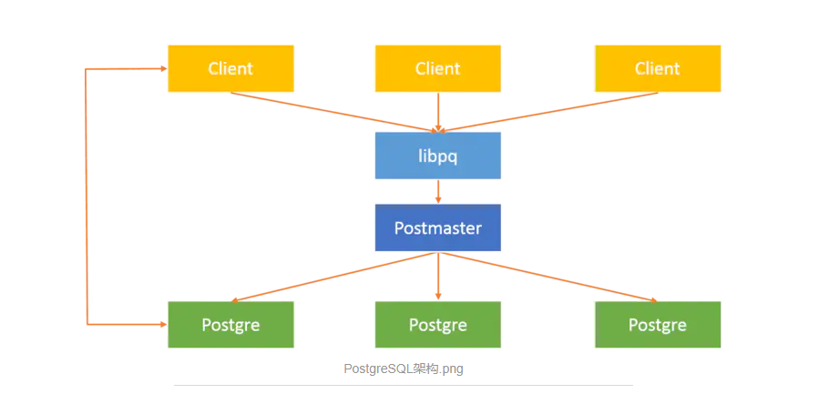
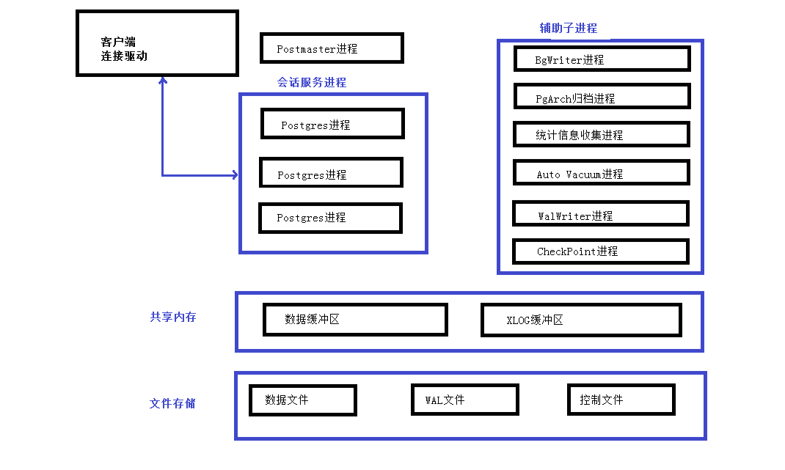
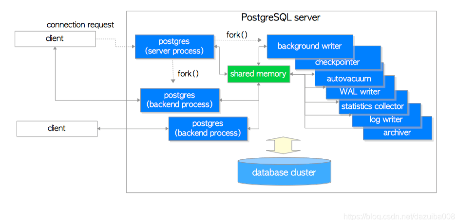
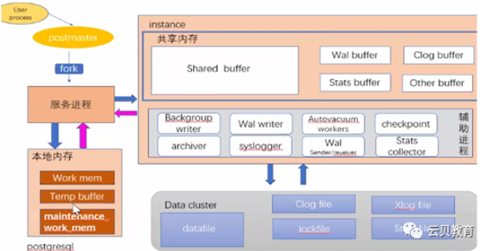
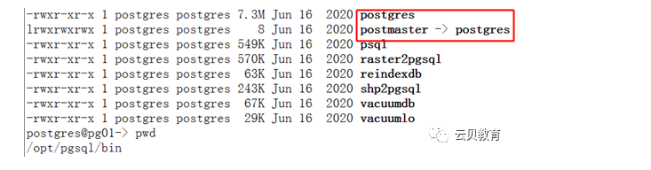
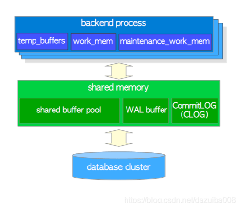
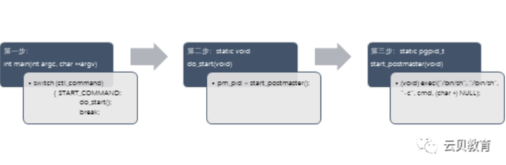

# Postgres

## 一、 Postgres背景

* PostgreSQL数据库是目前功能最强大的开源数据库。
* 稳定可靠：Postgres是唯一能做到数据零丢失的开源数据库。
* 开源省钱：Postgres是开源的、免费的
* 支持广泛：Postgres支持大量的主流开发语言
* 社区活跃：Postgres基本上每3个月推出一个补丁版本，这意味着bug很快会被修复。


## 二、Postgres进程架构

MySQL号称世界上最流行的数据库。
PostgreSQL号称世界上最先进的数据库。


### 2.1 进程结构图

- libpq：数据库应用连接接口库（如JDBC,ODBC）
- Postmaster：守护监听进程
- Postgres：服务进程

**PostgreSQL整体架构**

PostgreSQL采用的是经典的C/S架构模型。



**运行流程分析**

当一个前端数据库应用程序需要访问数据库：

- 调用libpq，将连接请求发送给Postmaster；
- Postmaster启用一个新的后端服务器进程postgres与前端应用连接；
- 服务进程Postgres直接与用户通信，不再通过Postmaster；
- Postgres接收客户端的命令请求，完成并返回结果；

客户端每创建一个数据库连接，postmaster就生成一个postgres进程，是一种1:1的进程结构（一个客户端对应一个服务进程）。

多进程的好处在于：系统的各个模块，各个服务进程之间耦合度更低，多用户直接并发运行不受影响。

带来的影响是：多进程比多线程的结构开销要大，进程的创建和回收比线程更加消耗资源，当用户发来的请求过多时，会造成负载过大，执行速度变慢。








1.进程结构

Postgresql 是一个C/S架构的关系型数据库，由多个后台进程管理数据库，下面分别介绍一些这些进程

postgres server process 是所有进程的父进程

backend process 每一个客户端的连接都有一个后端进程存在

backgroud processes 为管理数据库而产生的一些进程

backgroud work processes 9.3以后版本开始有这个进程,这里不做详细介绍

下面简短的介绍一些这几个进程的作用

| **进程**     | **说明**                  |
| ------------ | ------------------------- |
| 服务器进程   | 所有后台/后端进程的父进程 |
| 后端进程     | 处理客户端发出的语句请求  |
| 后台进程     | 负责数据库的管理任务      |
| 复制相关进程 | 流复制相关                |

```
postgres  118495      1    /opt/pgsql10.12/bin/postgres
postgres  18674  118495  postgres: logger process  
postgres  18686  118495  postgres: checkpointerprocess 
postgres  18687  118495  postgres: writer process  
postgres  18688  118495  postgres: wal writerprocess 
postgres  18689  118495  postgres: autovacuum launcherprocess 
postgres  18690  118495  postgres: stats collectorprocess 
postgres  18691  118495  postgres: bgworker: logicalreplication launcher 
postgres  46841  118495  postgres: postgres postgres[local] idle
```



2.2 postmaster

正如上所说，是所有进程的父进程，早期的版本叫postmaster.

pg_ctl start执行后，这个进程就会启动，然后，从物理内存中分配内存给shared memory，然后产生很多其他的backgroud processes ，等待客户端来连接，每产生一个连接就会生成一个backend process，一个postgres server process只能监听一个端口，默认端口是5432。尽管一台机器可以运行多个server,但是端口必须不同。

1.2 backend processes

通过TCP协议和客户端建立通讯，当客户端断开时，连接消失。允许多个客户端同时连接，连接数由max_connections参数控制，默认是100，如果客户端频繁的和服务端建立连接然后断开，会增加数据库的开销，导致服务器负载不正常，因为数据库本身不提供连接池的功能，如果有需要，可以使用pgbouncer或者pgpool-II。

1.3 backgroud processes

下面列出了相关的服务端进程，这里只做简单的介绍

 

| process                    | description                                                  | reference                                                    |
| -------------------------- | ------------------------------------------------------------ | ------------------------------------------------------------ |
| background writer          | 进程将shared buffer pool中的脏数据写到磁盘，检查点总能触发这个进程 | [Section 8.6](http://www.interdb.jp/pg/pgsql08.html#_8.6.)   |
| checkpointer               | 在9.2版本以后，检查点会触发产生这个进程                      | [Section 8.6](http://www.interdb.jp/pg/pgsql08.html#_8.6.), [Section 9.7](http://www.interdb.jp/pg/pgsql09.html#_9.7.) |
| autovacuum launcher        | 为vacuum process周期性的调用autovacuum work processes        | [Section 6.5](http://www.interdb.jp/pg/pgsql06.html#_6.5.)   |
| WAL writer                 | 周期性的从wal buffer刷新数据到磁盘                           | [Section 9.9](http://www.interdb.jp/pg/pgsql09.html#_9.9.)   |
| statistics collector       | 收集统计信息进程，比如pg_stat_activity 和pg_stat_database的数据 |                                                              |
| logging collector (logger) | 将错误信息写入到日志                                         |                                                              |
| archiver                   | 将日志归档的进程.                                            | [Section 9.10](http://www.interdb.jp/pg/pgsql09.html#_9.10.) |


### 2.2 内存架构

PostgreSQL 中的内存架构可以分为两大类：

本地内存区域—由每个后端进程分配供自己使用。

共享内存区域—由 PostgreSQL服务器的所有进程使用。

在Postgresql中，内存大概被分为两块

Local memory area – 为每一个backend process 分配的内存

Shared memory area – PostgreSQL server 所有的backgroud process使用的内存



 

| **组件**             | **描述**                                |
| -------------------- | --------------------------------------- |
| work_mem             | ORDER BY 和 DISTINCT 操作对元组进行排序 |
| maintenance_work_mem | 维护操作（VACUUM、REINDEX、alter等）    |
| temp_buffers         | 使用这个区域来存储临时表。              |
| shared buffer pool   | 数据缓冲区                              |
| WAL buffer           | WAL记录缓冲区                           |
| commit log           | 事务提交日志缓冲区                      |


2.1 Local memory area 

每一个backend process 都会分配一块local memory area, 每一块区域又分为三个子区域 ，见下表

| sub-area             | description                                                  | reference                                                  |
| -------------------- | ------------------------------------------------------------ | ---------------------------------------------------------- |
| work_mem             | 用户在sort,distinct,merge join，hash join的时候会用到这块区域 | [Chapter 3](http://www.interdb.jp/pg/pgsql03.html)         |
| maintenance_work_mem | vacuum，reindex会用到这块区域                                | [Section 6.1](http://www.interdb.jp/pg/pgsql06.html#_6.1.) |
| temp_buffers         | 存储临时表会用到这块区域                                     |                                                            |

 

2.2 Shared memory area 

这块区域在服务器启动的时候分配，这块区域也是分为好几个子区域，见下面介绍

| sub-area           | description                                                  | reference                                          |
| ------------------ | ------------------------------------------------------------ | -------------------------------------------------- |
| shared buffer pool | 将表或者索引的page从磁盘加载到shared buffer，然后在shared buffer操作 | [Chapter 8](http://www.interdb.jp/pg/pgsql08.html) |
| WAL buffer         | 在服务端出现问题的时候，确保数据不会丢失，在写到磁盘之前，wal buffer是wal log的缓存区域 | [Chapter 9](http://www.interdb.jp/pg/pgsql09.html) |
| commit log         | 为了并发控制所有事物的状态的保持而分配的区域                 |                                                    |

另外，Postgresql还分配一些其他的内存区域：

- 为访问控制分配的子区域，比如轻量级锁，共享或者专有锁.
- 为其他backgroud process提供的子区域，比如检查点，vacuum.
- 为事物处理提供的子区域，比如事物中的保存点，和二阶段事物提交.


### 2.3 postgres(postmaster)概述‍

postgres 服务器进程是PostgreSQL 服务器中**所有进程的父进程**。在早期版本中，它被称为”postmaster”。

**通过pg_ctl start,postgres 服务器进程将启动**。它在内存中分配一个共享内存区域，启动各种后台进程，必要时启动复制关联进程和后台工作进程，并等待来自客户端的连接请求。

**每当收到来自客户端的连接请求时，它就会启动一个后端进程**。（后端进程处理连接的客户端发出的所有请求）

一个postgres服务器进程监听一个网络端口，默认端口是5432。虽然同一台主机上可以运行多个PostgreSQL服务(不同集簇)，但是每个服务器之间应该设置监听不同的端口号。


**postgres(postmaster)源码浅析 1**

 src/bin/pg_ctl/pg_ctl.c



src/backend/postmaster/postmaster.c

```c
ListenAddresses
/* The TCP listen address(es) */
char   *ListenAddresses;
       if (ListenAddresses) (IP地址才能判断为真)
              char  *rawstring;
              List    *elemlist;
              ListCell           *l;
              int      success = 0;


bacend process
/*
 * BackendStartup -- start backend process
 *
 * returns: STATUS_ERROR if the fork failed,STATUS_OK otherwise.
 *
 * Note: if you change this code, also considerStartAutovacuumWorker.
 */
static int
BackendStartup(Port*port)
```


### 2.4 BackendProcesses概述

**后端进程，也称为postgres，由 postgres 服务器进程启动并处理由一个连接的客户端发出的所有语句。**

它通过单个 TCP 连接与客户端通信，并在客户端断开连接时终止。

由于只允许操作一个数据库，因此在连接到 PostgreSQL 服务器时，必须明确指定要使用的数据库。

允许多个客户端同时连接；配置参数max_connections控制客户端的最大数量（默认为 100）。

如果WEB应用等很多客户端频繁重复连接和断开与PostgreSQL服务器的连接，会增加建立连接和创建后端进

程的成本，**因为PostgreSQL没有实现本地连接池功能。这种情况对数据库服务器的性能有负面影响。为了处理这种情况，通常使用池中间件（pgbouncer 或pgpool-II）。**

 

**Backend Processes 源码浅析**

src/backend/tcop/postgres.c

```c
为用户交互连接调用InteractiveBackend（）
static int
InteractiveBackend(StringInfo inBuf)
{
       intc; /* character read from getc() */
       /*
        * display a prompt and obtain input from theuser
        */
       printf("backend>");
```


**BackendProcesses 相关参数浅析**

max_connections 活跃的并发连接数,最大连接数。

superuser_reserved_connections 为管理员保留的连接数。

```
tcp_keepalives_idle
```

规定在操作系统向客户端发送一个TCP keepalive消息后无网络活动的时间总量。如果指定值时没有单位，则以秒为单位。值0(默认值)表示选择操作系统默认值。指定不活动多少秒之后通过 TCP 向客户端发送一个 keepalive 消息。0 值表示使用默认值。这个参数只有在支持TCP_KEEPIDLE或等效套接字选项的系统或Windows 上才可以使用。在其他系统上，它必须为零。在通过 Unix 域套接字连接的会话中，这个参数被忽略并且总是读作零。

```
tcp_keepalives_interval
```

规定未被客户端确认收到的TCP keepalive消息应重新传输的时间长度。如果指定值时没有单位，

则以秒为单位。值0(默认值)表示选择操作系统默认值。这个参数只有在支持TCP_KEEPINTVL或等效套接字选项的系统或Windows 上才可以使用。

在其他系统上，必须为零。在通过 Unix域套接字连接的会话中，这个参数被忽略并总被读作零。

```
tcp_keepalives_count
```

指定服务器到客户端的连接被认为中断之前可以丢失的TCP keepalive消息的数量。值0(默认值)表示选择操作系统默认值。这个参数只有在支持TCP_KEEPCNT或等效套接字选项的系统上才可以使用。在其他系统上，必须为零。在通过 Unix 域套接字连接的会话中，这个参数被忽略并总被读作零。

```
tcp_user_timeout
```

指定传输的数据在TCP连接被强制关闭之前可以保持未确认状态的时间量。如果指定值时没有单位，则以毫秒为单位。值0(默认值)表示选择操作系统默认值。这个参数只有在支持TCP_USER_TIMEOUT的系统上才被支持；在其他系统上，它必须为零。在通过Unix-domain套接字连接的会话中，此参数将被忽略并且始终读取为零。


### 2.5 checkpointerprocess 概述

检查点进程，有点儿类似于虚拟机的快照。检查的作用主要是缩短数据库实例恢复的时间。

本图摘自” The Internals of PostgreSQL fordatabase administrators and system developers”


**checkpointerprocess 源码浅析**

src/backend/postmaster/checkpointer.c

src/include/catalog/pg_control.h

 CheckpointerMain函数是checkpointer进程的入口.

检查点结构体定义

```c
/*

 *检查点XLOG记录的主体。这是在这里声明的，因为我们在这里保存了最新版本的副本pg_control可能的灾难恢复。更改此结构需要 PG_CONTROL_VERSION。
*/
typedef structCheckPoint
{
        XLogRecPtr       redo;/* 创建存盘时下一个可用的RecPtr(即重做点)*/
        TimeLineID        ThisTimeLineID;        /*当前时间线 ID TLI */
        TimeLineID        PrevTimeLineID;        /*当前一个时间线*/
        boolfullPageWrites;   /* 当前整页写入的状态*/
        uint32       nextXidEpoch;   /* 下一个事物ID的高位*/
        TransactionId nextXid;        /*下一个空闲事物ID */
        Oid   nextOid;    /* 下一个空闲Oid*/
        MultiXactId nextMulti;        /*下一个空闲 MultiXactId */
        MultiXactOffset nextMultiOffset;/* 下一个空闲 MultiXact 偏移量 */
        TransactionId oldestXid;     /* 集簇范围最小的 datfrozenxid */
        Oid   oldestXidDB;     /* 带有最小datfrozenxid的数据库 */
        MultiXactId oldestMulti;     /* 集簇范围内最小的datfrozenxid */
        Oid   oldestMultiDB;   /* 带有最小datminmxid的数据库 */
        pg_time_t  time;/* 存盘时间栈*/
        TransactionId oldestCommitTsXid;      /* oldest Xid with valid commit *timestamp */
        TransactionId newestCommitTsXid;     /* newest Xid with valid commit * timestamp*/
        /*
         *最老的XID仍在运行。这只需要从在线检查点初始化热备用模式，所以我们只需要为在线检查点计算这一点，并且仅当wal_级别为副本时。否则它将设置为InvalidTransactionId。
         */
        TransactionId oldestActiveXid;
} CheckPoint;
```


**checkpointerprocess 相关参数浅析**

checkpoint_timeout = 5min       # range 30s-1d

服务器的检查点进程常常自动地执行一个检查点。检查点在每checkpoint_timeout秒开始，或者在快要超过 max_wal_size时开始。默认的设置分别是 5 分钟和 1 GB。如果从前一个检查点以来没有WAL被写入， 则即使过了checkpoint_timeout新的检查点也会被跳过（如果正在使用WAL归档并且你想对文件被归档频率设置一个较低的限制来约束 潜在的数据丢失，你应该调整archive_timeout 参数而不是检查点参数）。也可以使用SQL命令 CHECKPOINT来强制一个检查点。

max_wal_size = 1GB

min_wal_size = 80MB

checkpoint_completion_target = 0.5   # checkpoint target duration, 0.0 - 1.0

为了避免大批页面写入对I/O系统产生的冲击，一个检查点中对脏缓冲区的写出操作被散布到一段时间上。这个时间段由checkpoint_completion_target控制，它用检查点间隔的一个分数表示。I/O率将被调整，以便能按照要求完成检查点：当checkpoint_timeout给定的秒数已经过去，或者max_wal_size被超过之前会发生检查点，以先达到的为准。默认值为0.5，PostgreSQL被期望能够在下一个检查点启动之前的大约一半时间内完成每个检查点。在一个接近于正常操作期间最大I/O的系统上，你可能希望增加checkpoint_completion_target来降低检查点的I/O负载。但这种做法的缺点是被延长的检查点将会影响恢复时间，.

因为需要保留更多WAL段来用于可能的恢复操作。尽管checkpoint_completion_target可以被设置为高于1.0，但最好还是让它小于1.0（也许最多0.9），因为检查点还包含除了写出脏缓冲区之外的其他一些动作。1.0的设置极有可能导致检查点不能按时被完成，这可能由于所需的WAL段数量意外变化导致性能损失。

checkpoint_flush_after = 256kB     # measured in pages, 0 disables

在 Linux 和 POSIX 平台上，checkpoint_flush_after允许强制 OS 超过一个可配置的字节数后将检查点写入的页面刷入磁盘。否则，这些页面可能会被保留在OS 的页面缓存中，当检查点结束发出fsync时就会导致大量刷写形成延迟。这个设置通常有助于减小事务延迟，但是它也可能对性能带来负面影响，尤其是对于超过shared_buffers但小于 OS 页面缓存的负载来说更是如此。

checkpoint_warning = 30s        # 0 disables

检查点的代价相对比较昂贵，首先是因为它们要求写出所有当前为脏的缓冲区，正如以上讨论的，第二个原因是它们会导致额外的WAL流量。

因此比较明智的做法是将检查点参数设置得足够高，这样检查点就不会过于频繁地发生。你可以设置checkpoint_warning参数作为对于你的检查点参数的一种简单完整性检查。如果检查点的发生时间间隔比checkpoint_warning秒还要接近，一个消息将会被发送到服务器日志来推荐你增加max_wal_size。

偶尔出现的这样的消息并不会导致警报，但是如果它出现得太频繁，那么就应该增加检查点控制参数。如果你没有把max_wal_size设置得足够高， 那么在进行如大型COPY传输等批量操作的时候可能会导致出现大量类似的警告消息。


### 2.6 bgwriter process 概述

后台将脏页面写出到磁盘的辅助进程,引入该进程主要为达到如下两个目的：

1.首先,数据库在进行查询处理时若发现要读取的数据不在缓冲区中时要先从磁盘中读入要读取的数据所在的页面,

此时如果缓冲区已满,则需要先选择部分缓冲区中的页面替换出去,如果被替换的页面没有被修改过,那么可以直

接丢弃,但如果要被替换的页已被修改,则必须先将这页面写出到磁盘中后才能替换,这样数据库的查询就有可能被

阻塞,通过使用BgWriter定期写出缓冲区中的部分脏页面到磁盘中,为缓冲区腾出空间,就可以降低查询被阻塞的可能

性。

2.做检查点时.需要把所有脏页写出到磁盘,通过BgWriter预先写出一些脏页,可以减少设置检查点时要进行的IO操作。

BgWriter是8.0以后新加的特性。


**BgWriterprocess 源码浅析**

src/backend/postmaster/bgwriter.c

BackgroundWriterMain方法是辅助进程bgWriter进程的入口函数，其主要工作都在这个方法里。

```c
/*
 bgwriter进程的主要入口点这是从AuxiliaryProcessMain调用的，它已经创建了基本的执行环境。
 */
void
BackgroundWriterMain(void)
{
       sigjmp_buf     local_sigjmp_buf;
       MemoryContextbgwriter_context;
       bool       prev_hibernate;
       WritebackContextwb_context;
       /*
        * Properly accept or ignore signals thepostmaster might send us.
        *
        * bgwriter doesn't participate in ProcSignalsignalling, but a SIGUSR1
        * handler is still needed for latch wakeups.
        */
…………………
}
```


**BgWriterprocess 相关参数浅析**

bgwriter_delay = 200ms                 # 10-10000ms between rounds
指定后台写入器活动轮次之间的延迟。在每个轮次中，写入器都会为一定数量的脏缓冲区发出写操作（可以用下面的参数控制）。然后它就休眠 bgwriter_delay的时长， 然后重复动作。当缓冲池中没有脏缓冲区时，不管 bgwriter_delay，它都会进入更长的休眠。如果指定值时没有单位，则以毫秒为单位。默认值是 200 毫秒（200ms）。注意在许多系统上，休眠延迟的有效解析度是 10 毫秒；因此，为bgwriter_delay设置一个 不是 10 的倍数的值与把它设置为下一个更高的 10 的倍数是一样的效果。这个选项只能在服务器命令行上或者在postgresql.conf文件中设置。
bgwriter_lru_maxpages = 100            # 0-1000 max buffers written/round
在每个轮次中，不超过这么多个缓冲区将被后台写入器写出。把这个参数设置为零可禁用后台写出（注意被一个独立、专用辅助进程管理的检查点不受影响）。默认值是100 个缓冲区。这个参数只能在postgresql.conf文件中或在服务器命令行上设置。
bgwriter_lru_multiplier = 2.0          # 0-10.0 multiplier on buffersscanned/round
每一轮次要写的脏缓冲区的数目基于最近几个轮次中服务器进程需要的新缓冲区的数目。最近所需的平均值乘以bgwriter_lru_multiplier可以估算下一轮次中将会需要的缓冲区数目。脏缓冲区将被写出直到有很多干净可重用的缓冲区（然而，每一轮次中写出的缓冲区数不超过bgwriter_lru_maxpages）。因此，设置为 1.0 表示一种“刚刚好的”策略，这种策略会写出正好符合预测值的数目的缓冲区。更大大的值可以为需求高峰提供某种缓冲，而更小的值则需要服务进程来处理一些写出操作。默认值是 2.0。这个参数只能在postgresql.conf文件中或在服务器命令行上设置。
bgwriter_flush_after = 512kB           # measured in pages, 0 disables
只要后台写入的数据超过这个数量，尝试强制 OS 把这些写发送到底层存储上。这样做将限制内核页缓存中脏数据的量，降低了在检查点末尾发出一个 fsync 时或者 OS 在后台大批量写回数据时卡住的可能性。那常常会导致大幅度压缩的事务延迟，但是也有一些情况（特别是负载超过shared_buffers但小于 OS 页面高速缓存）的性能会降低。这种设置可能会在某些平台上没有效果。如果指定值时没有单位，则以块为单位，即为BLCKSZ 字节，通常为8kB.合法的范围在0（禁用受控写回）和2MB之间。Linux上的默认值是512kB，其他平台上是0（如果BLCKSZ不是8kB，则默认值和最大值会按比例缩放至这个值）。这个参数只能在postgresql.conf文件中或者服务器命令行上设置。


### 2.7 wal writerprocess 概述

预写日志(WAL)的中心思想是对数据文件的修改必须是只发生在这些修改,已经记录到日志之后的,也就是先写日志后写数据, 如果遵循这个过程,那么就不需要在每次事物提交的时候都把数据块刷回到磁盘,因为在出现崩溃的情况下,可以用日志来恢复数据库。使用WAL主要的好处就是显著地减少了写磁盘的次数,因为在日志提交的时候只需要把日志文件刷新到磁盘,而不是事物修改所涉及的所有数据文件。

同步顺序IO、异步随机IO


**wal writerprocess 源码浅析**

```c
WalWriterMain();src/backend/postmaster/walwriter.c
/*
WalWriter process，主入口函数是WalWriterMain(void)
 */
Void WalWriterMain(void)
{
       sigjmp_buf     local_sigjmp_buf;
       MemoryContextwalwriter_context;
       int                 left_till_hibernate;
       bool       hibernating;
       /*
        * Properly accept or ignore signals thepostmaster might send us
        *
        * We have no particular use for SIGINT at themoment, but seems
        * reasonable to treat like SIGTERM.
        */
       pqsignal(SIGHUP,WalSigHupHandler); /* set flag to read config file */
       pqsignal(SIGINT,WalShutdownHandler);   /* request shutdown*/
       pqsignal(SIGTERM,WalShutdownHandler);       /* requestshutdown */
       pqsignal(SIGQUIT,wal_quickdie);/* hard crash time */
       pqsignal(SIGALRM,SIG_IGN);
       pqsignal(SIGPIPE,SIG_IGN);
       pqsignal(SIGUSR1,walwriter_sigusr1_handler);
       pqsignal(SIGUSR2,SIG_IGN); /* not used */
… …

```


**wal writerprocess 相关参数浅析 1**

wal_level = replica       

wal_level决定多少信息写入到 WAL中。默认值是replica，它会写入足够的数据以支持WAL归档和复制，包括在后备服务器上运行只读查询。minimal会去掉除从崩溃或者立即关机中进行恢复所需的信息之外的所有记录。minimal,replica, or logical

在 9.6 之前的版本中，这个参数也允许值archive和hot_standby。现在仍然接受这些值，但是它们会被映射到replica。

fsync = on

PostgreSQL服务器将尝试确保更新被物理地写入到磁盘，做法是发出fsync()系统调用。虽然关闭fsync常常可以得到性能上的收益，但当发生断电或系统崩溃时可能造成不可恢复的数据损坏。

synchronous_commit = on

on、remote_apply、remote_write、local和off

如果[synchronous_standby_names](http://postgres.cn/docs/12/runtime-config-replication.html)为非空，这个参数也控制事务提交是否将等待它们的 WAL 记录被复制到后备服务器上。

1.on时，直到来自于当前同步的后备服务器的回复指示它们已经收到了事务的提交记录并将其刷入了磁盘，主服务器上的事务才会提交。

2.remote_apply时，提交将会等待，直到来自当前的同步后备的回复指示它们已经收到了该事务的提交记录并且已经应用了该事务，这样该事务才变得对后备上的查询可见。

\3. remote_write时，提交将等待，直到来自当前的同步后备的回复指示它们已经收到了该事务的提交记录并且已经把该记录写出到它们的操作系统，这种设置足以保证数据在后备服务器的PostgreSQL实例崩溃时得以保存，但是不能保证后备服务器遭受操作系统级别崩溃时数据能被保持，因为数据不一定必须要在后备机上达到稳定存储。 

\4. local会导致提交等待本地刷写到磁盘而不是复制完成。在使用同步复制时这通常不是我们想要的效果，但是为了完整性，还是提供了这样一个选项。

如果synchronous_standby_names为空，设置on、remote_apply、remote_write和local都提供了同样的同步级别：事务提交只等待本地刷写磁盘。


**wal writerprocess 相关参数浅析 2**

wal_sync_method

open_datasync（用open()选项O_DSYNC写WAL 文件）。

O_DSYNC 每次write都等待物理I/O完成，但是如果写操作不影响读取刚写入的数据，则不等待文件属性更新。

fdatasync（在每次提交时调用fdatasync()）

fsync（在每次提交时调用fsync()）

fsync的性能问题，与fdatasync

除了同步文件的修改内容（脏页），fsync还会同步文件的描述信息（metadata，包括size、访问时间st_atime& st_mtime等等），因为文件的数据和metadata通常存在硬盘的不同地方，因此fsync至少需要两次IO写操作fsync_writethrough（在每次提交时调用fsync()，强制任何磁盘写高速缓存的直通写）多余的一次IO操作，有多么昂贵呢？根据[Wikipedia](http://en.wikipedia.org/wiki/Disk-drive_performance_characteristics)[的数据](http://en.wikipedia.org/wiki/Disk-drive_performance_characteristics)，当前硬盘驱动的平均寻道时间（Average seek time）大约是3~15ms，7200RPM硬盘的平均旋转延迟（Average rotational latency）大约为4ms，因此一次IO操作的耗时大约为10ms左右。这个数字意味着什么？

open_sync（用open()选项O_SYNC写WAL 文件）

O_SYNC，以同步方式写入文件

功能：强制刷新内核缓冲区到输出文件。这是有必要的，因为为了数据安全，需要确保将数据真正写入磁盘或者磁盘的硬件告诉缓存中。

同步IO的定义：某一IO操作，要么已成功完成到磁盘的数据传递，要么被诊断为不成功。

​       

full_page_writes = on   

全页写

wal_compression = off 

当这个参数为on时，如果full_page_writes为打开或者处于基础备份期间，PostgreSQL服务器 会压缩写入到 WAL 中的完整页面镜像。


**wal writerprocess 相关参数浅析 3**

wal_log_hints = off 

当这个参数为on时，PostgreSQL服务器一个检查点之后页面被第一次修改期间把该磁盘页面的整个内容都写入WAL，即使对所谓的提示位做非关键修改也会这样做。

​         

wal_buffers = -1

用于还未写入磁盘的 WAL 数据的共享内存量。默认值 -1 选择等于shared_buffers的 1/32 的尺寸（大约3%），但是不小于64kB也不大于WAL 段的尺寸（通常为）。如果自动的选择太大或太小可以手工设置该值，但是任何小于32kB的正值都将被当作32kB。如果指定值时没有单位，则以WAL块作为单位，即为 XLOG_BLCKSZ 字节，通常为8kB。这个参数只能在服务器启动时设置。 

wal_writer_delay = 200ms

指定 WAL 写入器刷写WAL 的频繁程度，以时间为单位。 在刷写WAL之后，写入器将根据wal_writer_delay所给出的时间长度进行睡眠，除非被一个异步提交的事务提前唤醒。如果最近的刷写发生在 wal_writer_delay 之前，并且小于 wal_writer_flush_afterWAL的值产生之后，那么WAL只会被写入操作系统，而不会被刷写到磁盘。如果指定值时没有单位，则以毫秒作为单位。默认值是 200 毫秒（200ms）。注意在很多系统上，有效的睡眠延迟粒度是10 毫秒，把wal_writer_delay设置为一个不是 10 的倍数的值，其效果和把它设置为大于该值的下一个 10 的倍数产生的效果相同。这个参数只能在postgresql.conf文件中或者服务器命令行上设置。


