## 六、数据库的崩溃恢复

### 6.1 WAL日志

WAL（Write Ahead Log），就是数据库重做日志，与Oracle的redo log的功能是一样的。

> 注意这里的**WAL**是指一种技术，MySQL和Postgres都使用了这种技术，MySQL的WAL日志就是redo log。

WAL的核心机制是，在对数据进行任何变更之前，先确保对数据库的所有写操作都已经记录到WAL日志（事务日志）中，从而保证事务的更新操作不会丢失。

WAL，中文全称是 Write-Ahead Logging，它的关键点就是日志先写内存，再写磁盘。MySQL 执行更新操作后，**在真正把数据写入到磁盘前，先记录日志**。

好处是不用每一次操作都实时把数据写盘，就算 crash 后也可以通过redo log 恢复，所以能够实现快速响应 SQL 语句。

**WAL日志的作用：**

1. **实现事务的持久性**

   每个事务在提交时先保证WAL日志已经刷写到硬盘文件中，这样即使数据库系统发生异常或重启，用户也可以通过回放（Replay）该事务的WAL日志进行恢复，从而实现事务的持久化特性。

2. **支持数据库的灾难恢复**

   有了WAL日志之后，如果数据库崩溃，用户也可以使用WAL日志恢复整个数据库，任何尚未刷写到磁盘的数据页，都将通过回放WAL日志进行恢复（这叫做“向前滚动恢复”，简称“redo”）。这保证了所有事务对数据库的任何修改始终有效，即使发生断电、重启及其他系统异常，只要WAL日志保存完整，就一定能恢复这些修改，把整个数据库恢复到一致的状态。

3. **提升数据库的性能**

   采用WAL机制之后，每次事务提交时不必立即把更改的内存数据页持久化到硬盘中，只需把该事务对应的WAL日志刷写到硬盘即可。这样，被修改的内存数据页（又称“脏页”）可以延迟到适当的时机，由BgWriter进程或Checkpoint进程批量有序地刷写到硬盘中。WAL机制能够提升数据库性能主要基于以下几点。

   * 因为传统机械硬盘的顺序IO速度远高于随机IO速度。WAL日志是按顺序刷写的，所以传统机械硬盘读写WAL日志的性能很高。
   * 内存数据页对应到硬盘数据文件中的离散页面，因此读写内存数据页属于硬盘随机IO，性能很低。
   * WAL机制起到了把原本对数据文件的随机IO转换成WAL日志文件的顺序IO的作用，从而降低了事务提交时等待IO的时延，提高了数据库的性能。


WAL即 Write-Ahead Logging，是一种实现事务日志的标准方法。WAL 的中心思想是先写日志，再写数据，数据文件的修改必须发生在这些修改已经记录在日志文件中之后。采用WAL日志的数据库系统在事务提交时，WAL机制可以从两个方面来提高性能：

- 多个client写日志文件可以通过一次 fsync()来完成
- 日志文件是顺序写的，同步日志的开销要远比同步数据页的开销要小

总体来说，使用了WAL机制之后，磁盘写操作只有传统的回滚日志的一半左右，大大提高了数据库磁盘I/O操作的效率，从而提高了数据库的性能。

采用了WAL机制，就不需要在每次事务提交的时候都把数据页冲刷到磁盘，如果出现数据库崩溃， 我们可以用日志来恢复数据库，任何尚未附加到数据页的记录都将先从日志记录中重做（这叫向前滚动恢复，也叫做 REDO）。对于PostgreSQL来说，未采用WAL机制之前，如果数据库崩溃，可能存在数据页不完整的风险，而WAL 在日志里保存整个数据页的内容，完美地解决了这个问题。

参考链接：http://mysql.taobao.org/monthly/2017/03/02/


### 6.2 checkpoint机制

**背景**

上期月报[PgSQL · 特性分析 · Write-Ahead Logging机制浅析](http://mysql.taobao.org/monthly/2017/03/02/)中简单介绍了PostgreSQL中WAL机制，其中讲到如果是创建checkpoint会触发刷新xlog日志页到磁盘，本文主要分析下PostgreSQL中checkpoint机制。

checkpoint又名检查点，一般checkpoint会将某个时间点之前的脏数据全部刷新到磁盘，以实现数据的一致性与完整性。目前各个流行的关系型数据库都具备checkpoint功能，其主要目的是为了缩短崩溃恢复时间，以Oracle为例，在进行数据恢复时，会以最近的checkpoint为参考点执行事务前滚。而在WAL机制的浅析中，也提过PostgreSQL在崩溃恢复时会以最近的checkpoint为基础，不断应用这之后的WAL日志。

**检查点发生时机**

在xlog.h文件中，有如下代码对checkpoint进行了相应的分类：

```
/*
 * OR-able request flag bits for checkpoints.  The "cause" bits are used only
 * for logging purposes.  Note: the flags must be defined so that it's
 * sensible to OR together request flags arising from different requestors.
 */

/* These directly affect the behavior of CreateCheckPoint and subsidiaries */
#define CHECKPOINT_IS_SHUTDOWN	0x0001	/* Checkpoint is for shutdown */
#define CHECKPOINT_END_OF_RECOVERY	0x0002		/* Like shutdown checkpoint,
												 * but issued at end of WAL
												 * recovery */
#define CHECKPOINT_IMMEDIATE	0x0004	/* Do it without delays */
#define CHECKPOINT_FORCE		0x0008	/* Force even if no activity */
/* These are important to RequestCheckpoint */
#define CHECKPOINT_WAIT			0x0010	/* Wait for completion */
/* These indicate the cause of a checkpoint request */
#define CHECKPOINT_CAUSE_XLOG	0x0020	/* XLOG consumption */
#define CHECKPOINT_CAUSE_TIME	0x0040	/* Elapsed time */
#define CHECKPOINT_FLUSH_ALL	0x0080	/* Flush all pages, including those
										 * belonging to unlogged tables */
```

也就是说，以下几种情况会触发数据库操作系统做检查点操作：

1. 超级用户（其他用户不可）执行CHECKPOINT命令
2. 数据库shutdown
3. 数据库recovery完成
4. XLOG日志量达到了触发checkpoint阈值
5. 周期性地进行checkpoint
6. 需要刷新所有脏页

为了能够周期性的创建检查点，减少崩溃恢复时间，同时合并I/O，PostgreSQL提供了辅助进程checkpointer。它会对不断检测周期时间以及上面的XLOG日志量阈值是否达到，而周期时间以及XLOG日志量阈值可以通过参数来设置大小，接下来介绍下与checkpoints相关的参数。

**与检查点相关参数**

- checkpoint_segments
  - WAL log的最大数量，系统默认值是3。超过该数量的WAL日志，会自动触发checkpoint。
- checkpoint_timeout
  - 系统自动执行checkpoint之间的最大时间间隔。系统默认值是5分钟。
- checkpoint_completion_target
  - 该参数表示checkpoint的完成时间占两次checkpoint时间间隔的比例，系统默认值是0.5,也就是说每个checkpoint需要在checkpoints间隔时间的50%内完成。
- checkpoint_warning
  - 系统默认值是30秒，如果checkpoints的实际发生间隔小于该参数，将会在server log中写入写入一条相关信息。可以通过设置为0禁用。

参考链接：http://mysql.taobao.org/monthly/2017/04/04/


### 6.3 postgres崩溃恢复

**背景**

为了合并I/O提高性能，PostgreSQL数据库引入了共享缓冲区，当数据库非正常关闭，比如服务器断电时，共享缓冲区即内存中的数据就会丢失，这个时候数据库操作系统重启时就需要从非正常状态中恢复过来，继续提供服务。本文将具体分析在这种情况下，PostgreSQL数据库如何从崩溃状态中恢复。

上期月报[PgSQL · 特性分析 · checkpoint机制浅析](http://mysql.taobao.org/monthly/2017/04/04/)中介绍了PostgreSQL中的checkpoint机制。其中提到，当PostgreSQL数据库崩溃恢复时，会以最近的checkpoint为基础，不断应用这之后的XLOG日志。为了更好地理解PostgreSQL数据库从崩溃中恢复的过程，我们需要弄清楚以下几个问题：

- 数据库操作系统如何识别到自己是非正常状态（崩溃状态）
- 数据库如何找到合适的checkpoint作为基础
- 为什么应用XLOG日志可以恢复数据库数据
- 数据库如何应用XLOG日志

**数据库状态**

在PostgreSQL中，把数据库分为以下几种状态：

```
typedef enum DBState
{
	DB_STARTUP = 0,/*数据库启动*/
	DB_SHUTDOWNED,/*数据库正常关闭*/
	DB_SHUTDOWNED_IN_RECOVERY,/*数据库在恢复时关闭*/
	DB_SHUTDOWNING,/*数据库启动到正常关闭过程中崩溃*/
	DB_IN_CRASH_RECOVERY,/*数据库在恢复过程中崩溃*/
	DB_IN_ARCHIVE_RECOVERY,/*数据库处于归档恢复*/
	DB_IN_PRODUCTION/*数据库处于正常工作状态，等待接受事务处理*/
} DBState;
```

PostgreSQL的数据库状态被存储在pg_control文件中，可以执行pg_controldata命令，查看当前的数据库状态，返回结果如下：

```
pg_control version number:            942
Catalog version number:               201409291
Database system identifier:           6403125794625722170
Database cluster state:               shut down
...
```

其中 Database cluster state: shut down指明当前数据库的状态为DB_SHUTDOWNED，即正常关闭状态。

pg_control文件由对应的结构体ControlFileData存储，ControlFileData数据结构如下：

```
 typedef struct ControlFileData
{
	uint64		system_identifier; /*唯一系统标识符——保证控制文件和产生XLOG文件的数据库一致*/
	uint32		pg_control_version; /* 标识pg_control的版本*/
	uint32		catalog_version_no; /*标识catalog的版本 */
	DBState		state;			/*最后一次操作后的数据库状态 */
	pg_time_t	time;			/*pg_control最近一次更新的时间时*/
	...
	pg_crc32	crc;
} ControlFileData;
```

每次PostgreSQL数据库启动时，会读取pg_control文件获取最后一次操作后的数据库状态，如果为非正常关闭状态（DB_SHUTDOWNED），则会执行崩溃恢复逻辑。

**checkpoint相关结构**

ControlFileData结构

当数据库意识到自己处于崩溃状态后，会去选择一个合适的checkpoint作为基础，不断应用在这之后的XLOG日志。在PostgreSQL中，最近一次检查点的信息会被存储在pg_control文件中，pg_control由对应的结构体ControlFileData存储，ControlFileData数据结构如下：

```
 typedef struct ControlFileData
{
        ...
	XLogRecPtr	checkPoint;		/*指向最近一次的检查点位置*/
	XLogRecPtr	prevCheckPoint;  /*指向最近一次检查点的前一次检查点的位置*/
	CheckPoint	checkPointCopy; /*最近一次检查点控制信息的副本*/
	XLogRecPtr	minRecoveryPoint; /*归档恢复时必须恢复到的最小LSN*/
	XLogRecPtr	backupStartPoint; /*在线备份时进行的检查点开始LSN*/
	XLogRecPtr	backupEndPoint; /*在线备份时进行的检查点结束LSN*/
        bool		backupEndRequired; /* 用于判断是否基于正确的在线备份集恢复*/
        TimeLineID	minRecoveryPointTLI; /* 必须恢复到的最小时间线 */
	...
	pg_crc32	crc;
} ControlFileData;
```

在数据库崩溃恢复过程中，一般会选取最近一次的检查点作为恢复的基础，但是因为一个检查点的时间比较长，所以有可能数据库系统在检查点做完之前崩溃，这样磁盘上的检查点可能是不完全的，所以PostgreSQL数据库会多存储一个检查点的位置，即prevCheckPoint。


### 6.4 MySQL崩溃恢复

#### 当数据库 crash 后，如何恢复未刷盘的数据到内存中？

根据 redo log 和 binlog 的两阶段提交，未持久化的数据分为几种情况：

- change buffer 写入，redo log 虽然做了 fsync 但未 commit，binlog 未 fsync 到磁盘，这部分数据丢失。
- change buffer 写入，redo log fsync 未 commit，binlog 已经 fsync 到磁盘，先从 binlog 恢复 redo log，再从 redo log 恢复 change buffer。
- change buffer 写入，redo log 和 binlog 都已经 fsync，直接从 redo log 里恢复。


### 6.5 如果数据库误操作, 如何执行数据恢复?

数据库在某个时候误操作，就可以找到距离误操作最近的时间节点的bin log，重放到临时数据库里，然后选择误删的数据节点，恢复到线上数据库。


## 七、数据库分库、分表、分区表

### 7.1 什么是分库分表

中大型项目中，一旦遇到数据量比较大，小伙伴应该都知道就应该对数据进行拆分了。**有垂直和水平两种** 。

**垂直拆分** 比较简单，也就是本来一个数据库，数据量大之后，从业务角度进行拆分多个库。如下图，独立的拆分出订单库和用户库。

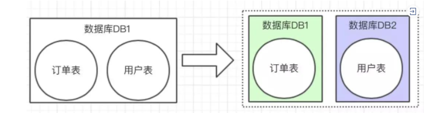

**水平拆分** 的概念，是同一个业务数据量大之后，进行水平拆分。

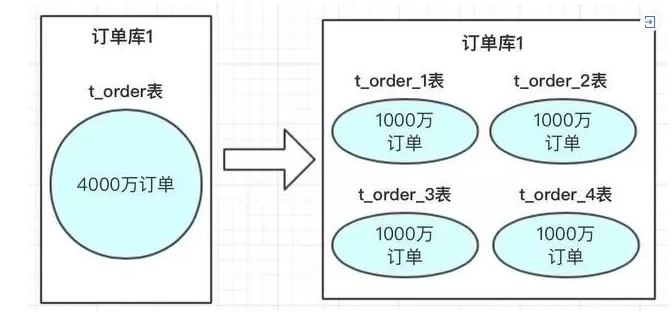

上图中订单数据达到了4000万，我们也知道mysql单表存储量推荐是百万级，如果不进行处理，mysql单表数据太大，会导致性能变慢。使用方案可以参考数据进行水平拆分。把4000万数据拆分4张表或者更多。当然也可以分库，再分表；把压力从数据库层级分开。


### 7.2 垂直方向分库分表

`垂直方向`主要针对的是`业务`，下面聊聊业务的发展跟分库分表有什么关系。

**1.1 单库**

在系统初期，业务功能相对来说比较简单，系统模块较少。

为了快速满足迭代需求，减少一些不必要的依赖。更重要的是减少系统的复杂度，保证开发速度，我们通常会使用`单库`来保存数据。

系统初期的数据库架构如下：

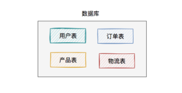

此时，使用的数据库方案是：`一个数据库`包含`多张业务表`。用户读数据请求和写数据请求，都是操作的同一个数据库。

**1.2 分表**

系统上线之后，随着业务的发展，不断的添加新功能。导致单表中的字段越来越多，开始变得有点不太好维护了。

一个用户表就包含了几十甚至上百个字段，管理起来有点混乱。

这时候该怎么办呢？

答：`分表`。

将`用户表`拆分为：`用户基本信息表` 和 `用户扩展表`。

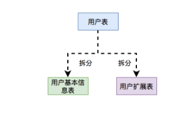

用户基本信息表中存的是用户最主要的信息，比如：用户名、密码、别名、手机号、邮箱、年龄、性别等核心数据。

这些信息跟用户息息相关，查询的频次非常高。

而用户扩展表中存的是用户的扩展信息，比如：所属单位、户口所在地、所在城市等等，非核心数据。

这些信息只有在特定的业务场景才需要查询，而绝大数业务场景是不需要的。

所以通过分表把核心数据和非核心数据分开，让表的结构更清晰，职责更单一，更便于维护。

除了按实际业务分表之外，我们还有一个常用的分表原则是：把调用频次高的放在一张表，调用频次低的放在另一张表。

有个非常经典的例子就是：订单表和订单详情表。

**1.3 分库**

不知不觉，系统已经上线了一年多的时间了。经历了N个迭代的需求开发，功能已经非常完善。

系统功能完善，意味着系统各种关联关系，错综复杂。

此时，如果不赶快梳理业务逻辑，后面会带来很多隐藏问题，会把自己坑死。

这就需要按业务功能，划分不同领域了。把相同领域的表放到同一个数据库，不同领域的表，放在另外的数据库。

具体拆分过程如下：

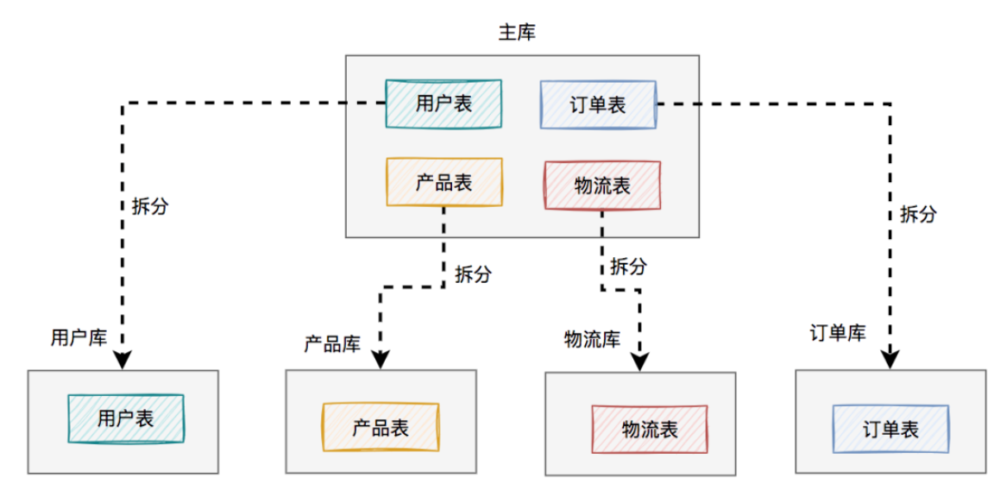

将用户、产品、物流、订单相关的表，从原来一个数据库中，拆分成单独的用户库、产品库、物流库和订单库，一共四个数据库。

> 在这里为了看起来更直观，每个库我只画了一张表，实际场景可能有多张表。

这样按领域拆分之后，每个领域只用关注自己相关的表，职责更单一了，一下子变得更好维护了。


**1.4 分库分表**

有时候按业务，只分库，或者只分表是不够的。比如：有些财务系统，需要按月份和年份汇总，所有用户的资金。

这就需要做：`分库分表`了。

每年都有个单独的数据库，每个数据库中，都有12张表，每张表存储一个月的用户资金数据。

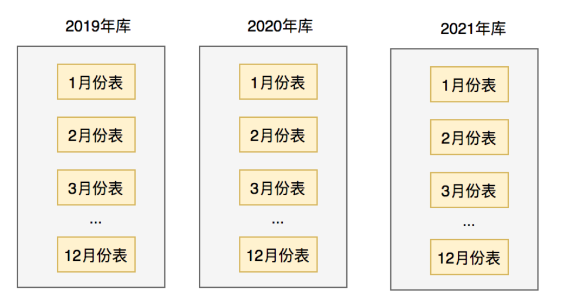

这样分库分表之后，就能非常高效的查询出某个用户每个月，或者每年的资金了。

此外，还有些比较特殊的需求，比如需要按照地域分库，比如：华中、华北、华南等区，每个区都有一个单独的数据库。

甚至有些游戏平台，按接入的游戏厂商来做分库分表。


### 7.3 水平方向分库分表

`水分方向`主要针对的是`数据`，下面聊聊数据跟分库分表又有什么关系。

**2.1 单库**

在系统初期，由于用户非常少，所以系统并发量很小。并且存在表中的数据量也非常少。

这时的数据库架构如下：

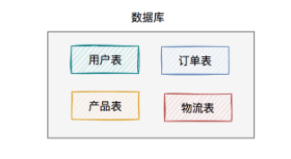

此时，使用的数据库方案同样是：`一个master数据库`包含`多张业务表`。

用户读数据请求和写数据请求，都是操作的同一个数据库，该方案比较适合于并发量很低的业务场景。

**2.2 主从读写分离**

系统上线一段时间后，用户数量增加了。

此时，你会发现用户的请求当中，读数据的请求占据了大部分，真正写数据的请求占比很少。

众所周知，`数据库连接是有限的`，它是非常宝贵的资源。而每次数据库的读或写请求，都需要占用至少一个数据库连接。

如果写数据请求需要的数据库连接，被读数据请求占用完了，不就写不了数据了？

这样问题就严重了。

为了解决该问题，我们需要把`读库`和`写库`分开。

于是，就出现了主从读写分离架构：

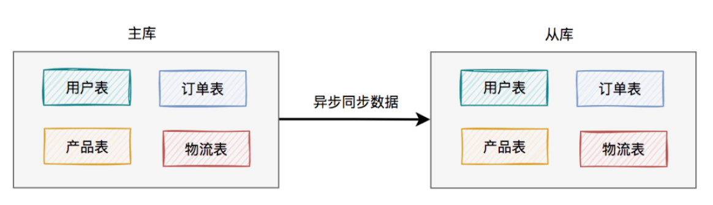

考虑刚开始用户量还没那么大，选择的是`一主一从`的架构，也就是常说的一个master一个slave。

所有的写数据请求，都指向主库。一旦主库写完数据之后，立马异步同步给从库。这样所有的读数据请求，就能及时从从库中获取到数据了（除非网络有延迟）。

读写分离方案可以解决上面提到的单节点问题，相对于单库的方案，能够更好的保证系统的稳定性。

因为如果主库挂了，可以升级从库为主库，将所有读写请求都指向新主库，系统又能正常运行了。

> 读写分离方案其实也是分库的一种，它相对于为数据做了备份，它已经成为了系统初期的首先方案。

但这里有个问题就是：如果用户量确实有些大，如果master挂了，升级slave为master，将所有读写请求都指向新master。

但此时，如果这个新master根本扛不住所有的读写请求，该怎么办？

这就需要`一主多从`的架构了：

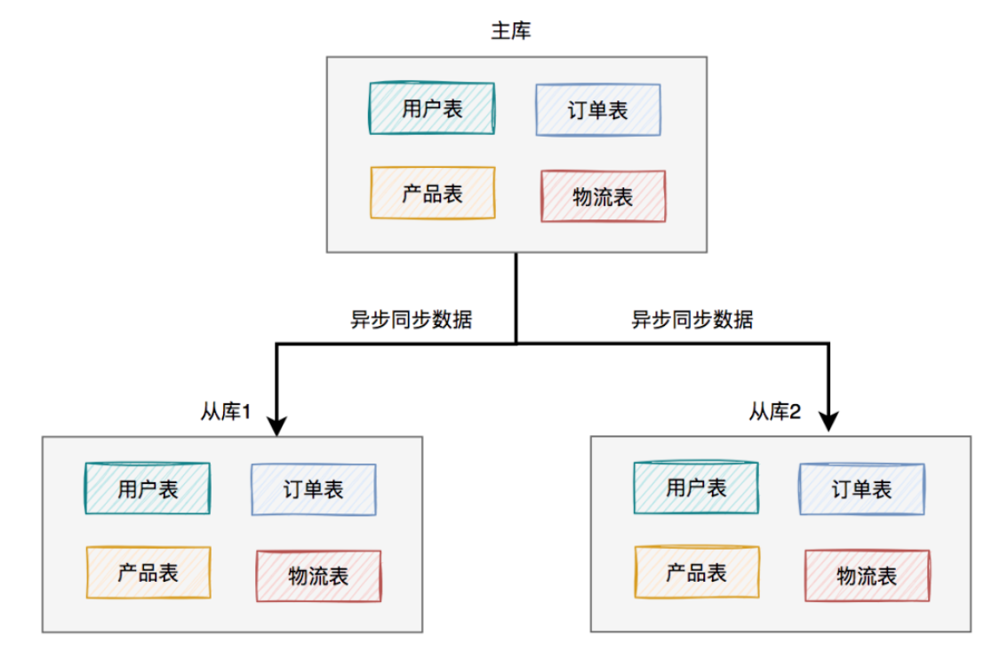

上图中我列的是`一主两从`，如果master挂了，可以选择从库1或从库2中的一个，升级为新master。假如我们在这里升级从库1为新master，则原来的从库2就变成了新master的的slave了。

调整之后的架构图如下：

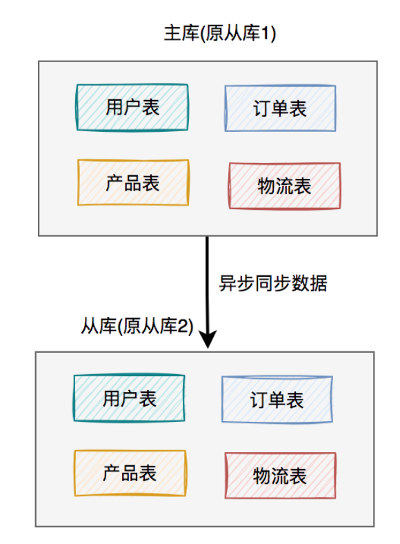

这样就能解决上面的问题了。

除此之外，如果查询请求量再增大，我们还可以将架构升级为一主三从、一主四从...一主N从等。

**2.3 分库**

上面的读写分离方案确实可以解决读请求大于写请求时，导致master节点扛不住的问题。但如果某个领域，比如：用户库。如果注册用户的请求量非常大，即写请求本身的请求量就很大，一个master库根本无法承受住这么大的压力。

这时该怎么办呢？

答：建立多个用户库。

用户库的拆分过程如下：

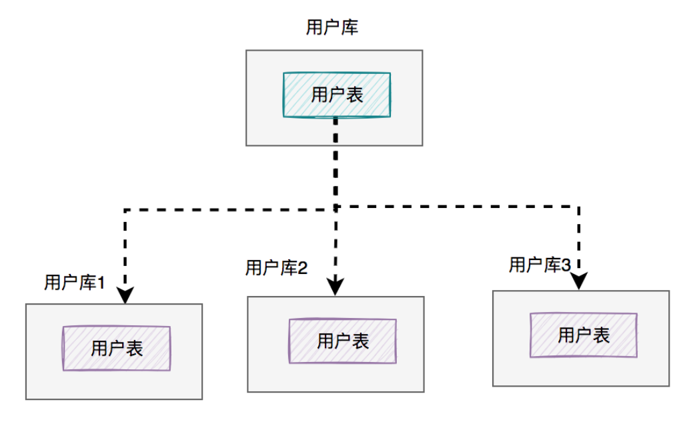

在这里我将用户库拆分成了三个库（真实场景不一定是这样的），每个库的表结构是一模一样的，只有存储的数据不一样。

**2.4 分表**

用户请求量上来了，带来的势必是数据量的成本上升。即使做了分库，但有可能单个库，比如：用户库，出现了5000万的数据。

根据经验值，单表的数据量应该尽量控制在1000万以内，性能是最佳的。如果有几千万级的数据量，用单表来存，性能会变得很差。

如果数据量太大了，需要建立的索引也会很大，从小到大检索一次数据，会非常耗时，而且非常消耗cpu资源。

这时该怎么办呢？

答：`分表`，这样可以控制每张表的数据量，和索引大小。

表拆分过程如下：

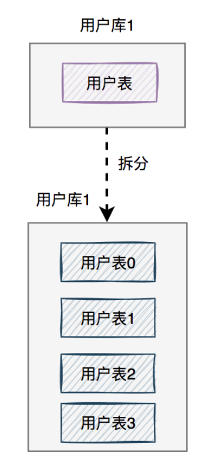

我在这里将用户库中的用户表，拆分成了四张表（真实场景不一定是这样的），每张表的表结构是一模一样的，只是存储的数据不一样。

如果以后用户数据量越来越大，只需再多分几张用户表即可。

**2.5 分库分表**

当系统发展到一定的阶段，用户并发量大，而且需要存储的数据量也很多。这时该怎么办呢？

答：需要做`分库分表`。

如下图所示：

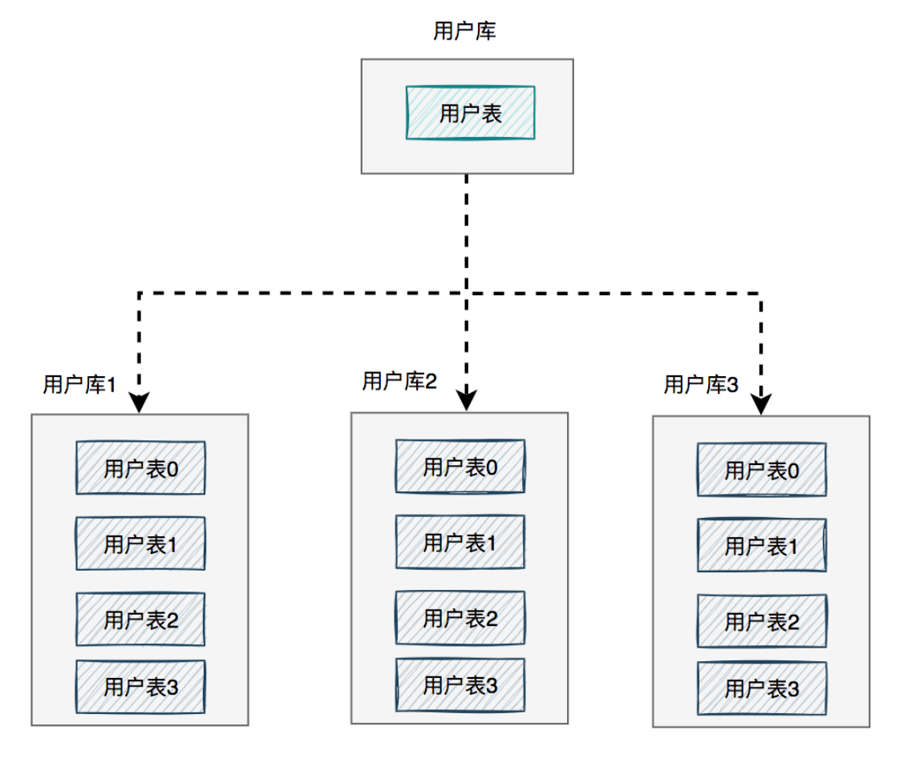

图中将用户库拆分成了三个库，每个库都包含了四张用户表。

如果有用户请求过来的时候，先根据用户id路由到其中一个用户库，然后再定位到某张表。

路由的算法挺多的：

- `根据id取模`，比如：id=7，有4张表，则7%4=3，模为3，路由到用户表3。
- `给id指定一个区间范围`，比如：id的值是0-10万，则数据存在用户表0，id的值是10-20万，则数据存在用户表1。
- `一致性hash算法`

这篇文章就不过多介绍了，后面会有文章专门介绍这些路由算法的。


### 7.4 分库分表总结

> * 分库主要是解决单库**并发量太大**的问题
> * 分表主要是解决单表**数据量太大**的问题

上面主要从：垂直和水平，两个方向介绍了我们的系统为什么要分库分表。

说实话垂直方向（即业务方向）更简单。

在水平方向（即数据方向）上，`分库`和`分表`的作用，其实是有区别的，不能混为一谈。

- `分库`：是为了解决数据库连接资源不足问题，和磁盘IO的性能瓶颈问题。
- `分表`：是为了解决单表数据量太大，sql语句查询数据时，即使走了索引也非常耗时问题。此外还可以解决消耗cpu资源问题。
- `分库分表`：可以解决 数据库连接资源不足、磁盘IO的性能瓶颈、检索数据耗时 和 消耗cpu资源等问题。

如果在有些业务场景中，用户并发量很大，但是需要保存的数据量很少，这时可以只分库，不分表。

如果在有些业务场景中，用户并发量不大，但是需要保存的数量很多，这时可以只分表，不分库。

如果在有些业务场景中，用户并发量大，并且需要保存的数量也很多时，可以分库分表。


### 7.5 分库分表方案

* Hash取模
* range范围方案
* 一致性Hash

详见Redis负载均衡笔记。


### 7.6 Postgres分区表

#### 7.6.1 分区表介绍

   通常情况下，扫描一个大表会很慢。 例如，如果一个订单表orders的数据量是50G，统计某个州范围内订单的平均额度，往往会消耗几分钟的时间。

```
  select avg(total_amount) from orders where state_code=1;
```

​     如果能够把大表分拆成小表，查询数据的时猴，只扫描数据所属的小表，就能大大降低扫描时间，提高查询速度。

​     PostgreSQL的分区表(Table Partitioning)可以用来解决此类问题。解决方式是：创建一个表orders，作为分区表(partitionedtable)，再创建50个分区（partition)，orders_1, orders_2, …, orders_50， 每一个分区对应一个州的数据，分区的数据量平均是1G。分区表和分区都是表。本例中，这50分区联合在一起，组成分区表orders。在执行查询语句（如下）的时候：

```
select avg(total_amount) from orders where state_code=1;
```

​     PostgreSQL通过对执行语句的分析处理，最终把扫描的任务定位在分区order_1上，把查询语句转换成下面的语句，其他分区根本不需要扫描。

```
select avg(total_amount) from orders_1;
```

#### 7.6.2 分区表应用举例

温度采集在物联网应用中非常普遍，通常一个系统中部署大量的温度传感器，传感器按照设定的采集频率把温度数据发送到服务器。 下面是一个温度采集的例子，表temperature_sensor_data，用于保存温度传感器采集的温度数据。 如果有10万个传感器，每隔一小时采集一次数据，则每一个月会产生3.7G的数据，一年会产生大约43G的数据。

​     对于这样量级的数据，通常需要采用特殊的处理方式。一种可能的方式是：按照月创建分区，数据按照所属的月份，被存储到较小的分区。

**2.1** **创建分区表**

​     在下面的例子中，创建了分区表temperature_sensor_data和12分区。分区表代表2017年全年的数据，而每一个分区代表单月的数据。

```sql
droptableifexists temperature_sensor_data ;
 
CREATETABLEtemperature_sensor_data (
    sensor_id      integer   NOTNULL,
    timestamp      timestampNOTNULL, 
    temperature    decimal(5,2) NOTNULL
)  PARTITION BY RANGE (timestamp);
 
droptableifexists temperature_sensor_data_2017_1;
CREATETABLEtemperature_sensor_data_2017_1
    PARTITION OF temperature_sensor_data
    FORVALUESFROM ('2017-01-01') TO ('2017-02-01');
 
droptableifexists temperature_sensor_data_2017_2;
CREATETABLEtemperature_sensor_data_2017_2
    PARTITION OF temperature_sensor_data
    FORVALUESFROM ('2017-02-01') TO ('2017-03-01');
 
 
droptableifexists temperature_sensor_data_2017_3;
CREATETABLEtemperature_sensor_data_2017_3
    PARTITION OF temperature_sensor_data
    FORVALUESFROM ('2017-03-01') TO ('2017-04-01');
 
droptableifexists temperature_sensor_data_2017_4;
CREATETABLEtemperature_sensor_data_2017_4
    PARTITION OF temperature_sensor_data
    FORVALUESFROM ('2017-04-01') TO ('2017-05-01');
 
 
droptableifexists temperature_sensor_data_2017_5;
CREATETABLEtemperature_sensor_data_2017_5
    PARTITION OF temperature_sensor_data
    FORVALUESFROM ('2017-05-01') TO ('2017-06-01');
 
 
droptableifexists temperature_sensor_data_2017_6;
CREATETABLEtemperature_sensor_data_2017_6
    PARTITION OF temperature_sensor_data
    FORVALUESFROM ('2017-06-01') TO ('2017-07-01');
 
droptableifexists temperature_sensor_data_2017_7;
CREATETABLEtemperature_sensor_data_2017_7
    PARTITION OF temperature_sensor_data
    FORVALUESFROM ('2017-07-01') TO ('2017-08-01');
 
droptableifexists temperature_sensor_data_2017_8;
CREATETABLEtemperature_sensor_data_2017_8
    PARTITION OF temperature_sensor_data
    FORVALUESFROM ('2017-08-01') TO ('2017-09-01');
 
droptableifexists temperature_sensor_data_2017_9;
CREATETABLEtemperature_sensor_data_2017_9
    PARTITION OF temperature_sensor_data
    FORVALUESFROM ('2017-09-01') TO ('2017-10-01');
 
droptableifexists temperature_sensor_data_2017_10;
CREATETABLEtemperature_sensor_data_2017_10
    PARTITION OF temperature_sensor_data
    FORVALUESFROM ('2017-10-01') TO ('2017-11-01');
 
droptableifexists temperature_sensor_data_2017_11;
CREATETABLEtemperature_sensor_data_2017_11
    PARTITION OF temperature_sensor_data
    FORVALUESFROM ('2017-11-01') TO ('2017-12-01');
 
droptableifexists temperature_sensor_data_2017_12;
CREATETABLEtemperature_sensor_data_2017_12
    PARTITION OF temperature_sensor_data
    FORVALUESFROM ('2017-12-01') TO ('2018-01-01');
```

**2.2** **模拟加载数据**

- 100000个传感器
- 每隔1小时采集一次数据
- 总共12个月

```sql
with   ids as ( select generate_series(1,100000) as sensor_id ), 
     times as ( SELECT  generate_series( '2017-01-01 00:00:00'::timestamp,'2017-12-31 23:59:00', '1 hour' ) as timestamp ),
   samples as ( select sensor_id, timestamp, random()*100::decimal as temperature from ids full join times on 1=1 )
insert into  temperature_sensor_data 
select sensor_id, timestamp, round(temperature::decimal,2) as temperature from samples;
postgres=# \d+
                                         List of relations
 Schema |              Name               |       Type        |    Owner    |  Size   | Description 
--------+---------------------------------+-------------------+-------------+---------+-------------
 public | temperature_sensor_data         | partitioned table | postgres | 0 bytes | 
 public | temperature_sensor_data_2017_1  | table             | postgres | 3703 MB | 
 public | temperature_sensor_data_2017_10 | table             | postgres | 3703 MB | 
 public | temperature_sensor_data_2017_11 | table             | postgres | 3584 MB | 
 public | temperature_sensor_data_2017_12 | table             | postgres | 3703 MB | 
 public | temperature_sensor_data_2017_2  | table             | postgres | 3345 MB | 
 public | temperature_sensor_data_2017_3  | table             | postgres | 3703 MB | 
 public | temperature_sensor_data_2017_4  | table             | postgres | 3584 MB | 
 public | temperature_sensor_data_2017_5  | table             | postgres | 3703 MB | 
 public | temperature_sensor_data_2017_6  | table             | postgres | 3584 MB | 
 public | temperature_sensor_data_2017_7  | table             | postgres | 3703 MB | 
 public | temperature_sensor_data_2017_8  | table             | postgres | 3703 MB | 
 public | temperature_sensor_data_2017_9  | table             | postgres | 3584 MB | 
(13 rows)
```

**2.3** **统计1月份的平均温度**

- 1月份的数据量是3703M
- 耗时大约33秒

```sql
postgres=#selectavg(temperature) from temperature_sensor_data wheretimestampbetween  '2017-01-01 00:00:00'and'2017-01-0123:59:00';
         avg        
---------------------
 50.0171680480000000
(1 row)
 
Time: 33305.055 ms(00:33.305)
postgres=#
```


**2.4** **使用一个大表，不使用分区表的查询结果**

- 单个表数据量是43G
- 耗时大约7分51秒

```sql
postgres=# \d+
                              List of relations
 Schema |          Name           | Type  |    Owner    | Size  | Description 
--------+-------------------------+-------+-------------+-------+-------------
 public | temperature_sensor_data | table | postgres | 43 GB | 
(1 row)
postgres=# select avg(temperature) from temperature_sensor_data where timestamp between  '2017-01-01 00:00:00' and '2017-01-01 23:59:00';
         avg         
---------------------
 50.0010354000000000
(1 row)

Time: 471373.514 ms (07:51.374)
```


#### 7.6.3 使用DeclarativePartitioning定义分区表

​     PostgreSQL从版本10开始，支持DeclarativePartitioning功能，就是使用create table语句定义分区表和分区。

​     创建分区表的方式是：create table tablename (…) partition by (…)

​     创建分区的方式是： create table partitionname partition oftablename for values (…);

​     其中partition by (…)定义来分区表根据哪些列来分区，使用什么算法；for values (…)定义一个分区内，落入该分区的数据的取值范围。

​     目前PostgreSQL12提供来3种分区算法：

- partition by range(…)，pg10引入
- partition by list(…)，pg10引入
- parition by hash(…)，pg11引入


**3.1** **使用PARTITION BY RANGE方式定义分区**

​     在创建分区表的时候，需要使用PARTITION BY指明该表是一个分区表，并且定义分区的方式。 以下是PostgreSQL官方文档中一个例子：

​     该例子中，根据logdate字段做分区，使用RANGE方式。分区表measurement对应3个分区：measurement_y2006m02，measurement_y2006m03，measurement_def。其中measurement_def是默认分区。

​     在插入数据的时候，如果logdate的取值在2016年2月份，则数据插入到分区measurement_y2006m02；如果logdate的取值在2016年3月份，则数据被插入到分区measurement_y2006m03；其它的数据，插入到默认分区measurement_def。

```sql
CREATE TABLE measurement (
    city_id         int not null,
    logdate         date not null,
    peaktemp        int,
    unitsales       int
) PARTITION BY RANGE (logdate);
CREATE TABLE measurement_y2006m02 PARTITION OF measurement
    FOR VALUES FROM ('2006-02-01') TO ('2006-03-01');

CREATE TABLE measurement_y2006m03 PARTITION OF measurement
    FOR VALUES FROM ('2006-03-01') TO ('2006-04-01');

CREATE TABLE measurement_def PARTITION OF measurement DEFAULT;
```

  查询数据的时候，PostgreSQL能够根据合适的过滤条件，选择正确的分区做查询；如果没有适当的过滤条件，则扫描所有分区。

```sql
postgres=# explain select * from measurement where logdate='2006-02-10';
                              QUERY PLAN                              
----------------------------------------------------------------------
 Seq Scan on measurement_y2006m02  (cost=0.00..33.12 rows=9 width=16)
   Filter: (logdate = '2006-02-10'::date)
(2 rows)


postgres=# explain select * from measurement;
                                  QUERY PLAN                                   
-------------------------------------------------------------------------------
 Append  (cost=0.00..113.25 rows=5550 width=16)
   ->  Seq Scan on measurement_y2006m02  (cost=0.00..28.50 rows=1850 width=16)
   ->  Seq Scan on measurement_y2006m03  (cost=0.00..28.50 rows=1850 width=16)
   ->  Seq Scan on measurement_def  (cost=0.00..28.50 rows=1850 width=16)
(4 rows)
```


**3.2** **使用PARTITION BY LIST(column )定义分区**

​      列的取值范围值是一个小的集合，类似编程中的枚举概念。当列值等于某个特定值的时候，落入指定的分区。

​      下面的例子中，分区表sale_order包含3个分区：

europe_order,asia_order,default_order。当列country等于'germany'或者'sweden'时，数据落入分区europe_order；当country的值等于india或japan时，行落入分区asia_order；当country等于其它值时，则行数据落入分区default_order。

```sql
CREATE TABLE sale_order
(
  order_no    integer,   
  store_no    integer,
  country     varchar(20),
  date        date,
  amount      decimal(5,2)
) PARTITION BY LIST(country);

CREATE TABLE europe_order
    PARTITION OF sale_order FOR VALUES IN ('germany', 'sweden');

CREATE TABLE asia_order
    PARTITION OF sale_order FOR VALUES IN ('india', 'japan');

CREATE TABLE default_order
    PARTITION OF sale_order DEFAULT;
```

查询数据的时候，PostgreSQL能够根据合适的过滤条件，选择正确的分区做查询；如果没有适当的过滤条件，则扫描所有分区。

```sql
postgres=#explain select * from sale_order where country='india';
                         QUERY PLAN                         
------------------------------------------------------------
 Seq Scan on asia_order (cost=0.00..19.25 rows=4 width=82)
   Filter: ((country)::text = 'india'::text)
(2 rows)
 
postgres=#explain select * from sale_order;
                              QUERY PLAN                               
-----------------------------------------------------------------------
 Append (cost=0.00..63.30 rows=2220 width=82)
   -> Seq Scan on europe_order  (cost=0.00..17.40 rows=740 width=82)
   -> Seq Scan on asia_order  (cost=0.00..17.40 rows=740 width=82)
   -> Seq Scan on default_order  (cost=0.00..17.40 rows=740 width=82)
(4 rows)
```


**3.3 使用PARTITION BY HASH( column )定义分区**

​      对列的值做哈希，哈希值把数据分割成几个分区。

​      下面的例子中，分区表orders包含4个分区：orders_p1，orders_p2，orders_p3，orders_p4。

​     插入数据时，对列o_w_id取余，结果等于0,1,2,3，行数据分别落入分区orders_p1, orders_p2, orders_p3，orders_p4。

```sql
createtableorders (
  o_w_id      integer     notnull,
  o_d_id      integer     notnull,
  o_id        integer     notnull,
  o_c_id      integer,
  o_carrier_id integer,
  o_ol_cnt    integer,
  o_all_local integer,
  o_entry_d   timestamp
)PARTITIONBY HASH ( o_w_id );
 
CREATETABLEorders_p1 PARTITION OF orders
    FORVALUESWITH (MODULUS 4, REMAINDER 0);
CREATETABLEorders_p2 PARTITION OF orders
    FORVALUESWITH (MODULUS 4, REMAINDER 1);
CREATETABLEorders_p3 PARTITION OF orders
    FORVALUESWITH (MODULUS 4, REMAINDER 2);
CREATETABLEorders_p4 PARTITION OF orders
    FORVALUESWITH (MODULUS 4, REMAINDER 3);
```


**3.4** **分区的其它特性**

- 可以在分区表上建立索引，相应的所有分区都能自动建立索引；或者，可以为分区单独建立索引。
- 可以根据需要，卸载或这增加一个分区。
- 分区可以指定单独的表空间，能充分利用多个磁盘。
- 分区可以指向一个PG外表，即FDW表。
- 分区表可以根据多个列的值来分区。
- 分区可以再次分区。


#### 7.6.4 使用表继承(Inheritance)方式定义分区表

​      分区表也可以使用继承的方式来使用。该方式早在PostgreSQL8就支持了。创建方式举例如下：

- 1. 创建一个普通表measurement

```sql
CREATE TABLE measurement (
    city_id         int not null,
    logdate         date not null,
    peaktemp        int,
    unitsales       int
);
```

- 2. 创建子表，继承自measurement

- - 每个子表的check约束是为了确保子表只运行符合条件的数据插入。

```sql
CREATE TABLE measurement_y2006m02 (
    CHECK ( logdate >= DATE '2006-02-01' AND logdate < DATE '2006-03-01' )
) INHERITS (measurement);

CREATE TABLE measurement_y2006m03 (
    CHECK ( logdate >= DATE '2006-03-01' AND logdate < DATE '2006-04-01' )
) INHERITS (measurement);

CREATE TABLE measurement_y2007m12 (
    CHECK ( logdate >= DATE '2007-12-01' AND logdate < DATE '2008-01-01' )
) INHERITS (measurement);

CREATE TABLE measurement_y2008m01 (
    CHECK ( logdate >= DATE '2008-01-01' AND logdate < DATE '2008-02-01' )
) INHERITS (measurement);
```

- 3. 创建函数和触发器，用于把数据插入到相应的分区。

```sql
CREATE OR REPLACE FUNCTION measurement_insert_trigger()
RETURNS TRIGGER AS $$
BEGIN
    IF ( NEW.logdate >= DATE '2006-02-01' AND
         NEW.logdate < DATE '2006-03-01' ) THEN
        INSERT INTO measurement_y2006m02 VALUES (NEW.*);
    ELSIF ( NEW.logdate >= DATE '2006-03-01' AND
            NEW.logdate < DATE '2006-04-01' ) THEN
        INSERT INTO measurement_y2006m03 VALUES (NEW.*);
    ELSIF ( NEW.logdate >= DATE '2007-12-01' AND
            NEW.logdate < DATE '2008-01-01' ) THEN
        INSERT INTO measurement_y2007m12 VALUES (NEW.*);
    ELSIF ( NEW.logdate >= DATE '2008-01-01' AND
            NEW.logdate < DATE '2008-02-01' ) THEN
        INSERT INTO measurement_y2008m01 VALUES (NEW.*);
    ELSE
        RAISE EXCEPTION 'Date out of range.  Fix the measurement_insert_trigger() function!';
    END IF;
    RETURN NULL;
END;
$$
LANGUAGE plpgsql;

CREATE TRIGGER insert_measurement_trigger
    BEFORE INSERT ON measurement
    FOR EACH ROW EXECUTE FUNCTION measurement_insert_trigger();
```

- 4. 插入数据

插入4条数据，应该分别落入4个子表。

```sql
insert into measurement 
   values (1, '2006-02-10', 10, 1),
          (1, '2006-03-10', 10, 1),
          (1, '2007-12-10', 10, 1),
          (1, '2008-01-10', 10, 1);
```

- 5. 查询数据

```sql
postgres=#select * from measurement;
 city_id | logdate   | peaktemp | unitsales 
---------+------------+----------+-----------
       1 | 2006-02-10 |       10 |         1
       1 | 2006-03-10 |       10 |         1
       1 | 2007-12-10 |       10 |         1
       1 | 2008-01-10 |       10 |         1
(4 rows)
 
postgres=#select * from measurement_y2006m02;
 city_id | logdate   | peaktemp | unitsales 
---------+------------+----------+-----------
       1 | 2006-02-10 |       10 |         1
(1 row)
 
postgres=#select * from measurement_y2006m03;
 city_id | logdate   | peaktemp | unitsales 
---------+------------+----------+-----------
       1 | 2006-03-10 |       10 |         1
(1 row)
 
postgres=#select * from measurement_y2007m12;
 city_id | logdate   | peaktemp | unitsales 
---------+------------+----------+-----------
       1 | 2007-12-10 |       10 |         1
(1 row)
 
postgres=#select * from measurement_y2008m01 ;
 city_id | logdate   | peaktemp | unitsales 
---------+------------+----------+-----------
       1 | 2008-01-10 |       10 |         1
(1 row)
 
postgres=#explain select * from measurement;
                                  QUERYPLAN                                   
-------------------------------------------------------------------------------
 Append (cost=0.00..151.00 rows=7401 width=16)
   -> Seq Scan on measurement  (cost=0.00..0.00 rows=1 width=16)
   -> Seq Scan on measurement_y2006m02  (cost=0.00..28.50 rows=1850 width=16)
   -> Seq Scan on measurement_y2006m03  (cost=0.00..28.50 rows=1850 width=16)
   -> Seq Scan on measurement_y2007m12  (cost=0.00..28.50 rows=1850 width=16)
   -> Seq Scan on measurement_y2008m01  (cost=0.00..28.50 rows=1850 width=16)
(6 rows)
 
postgres=#explain select * from measurement where logdate='2007-01-10';
                         QUERY PLAN                         
------------------------------------------------------------
 Seq Scan on measurement (cost=0.00..0.00 rows=1 width=16)
   Filter: (logdate = '2007-01-10'::date)
(2 rows)
```


## 八、数据库性能优化

### 在一个千万级的数据库查询中，如何提高查询效率？

千万级，亿级数据查询慢，有什么优化办法？
 • 对于经常进行检索的字段创建索引
 • 利用存储过程分页，避免客户端和SQL Server之间进行多次交互
 • sql语句用select top嵌套
 • 分表查询(将大表拆开多张小表，实现分区分表查询)
 • 可以创建临时表加快查询
 • 集群、主从复制、读写分离
 • ajax异步处理
 • 缓存技术

**1）数据库设计方面：** 
 a. 对查询进行优化，应尽量避免全表扫描，首先应考虑在 where 及 order by 涉及的列上建立索引。 
 b. 应尽量避免在 where 子句中对字段进行 null 值判断，否则将导致引擎放弃使用索引而进行全表扫描，如： select id from t where num is null 可以在num上设置默认值0，确保表中num列没有null值，然后这样查询： select id from t where num=0

c. 并不是所有索引对查询都有效，SQL是根据表中数据来进行查询优化的，当索引列有大量数据重复时,查询可能不会去利用索引，如一表中有字段sex，male、female几乎各一半，那么即使在sex上建了索引也对查询效率起不了作用。

d. 索引并不是越多越好，索引固然可以提高相应的 select 的效率，但同时也降低了 insert 及 update 的效率，因为 insert 或 update 时有可能会重建索引，所以怎样建索引需要慎重考虑，视具体情况而定。一个表的索引数最好不要超过6个，若太多则应考虑一些不常使用到的列上建的索引是否有必要。

e. 应尽可能的避免更新索引数据列，因为索引数据列的顺序就是表记录的物理存储顺序，一旦该列值改变将导致整个表记录的顺序的调整，会耗费相当大的资源。若应用系统需要频繁更新索引数据列，那么需要考虑是否应将该索引建为索引。

f. 尽量使用数字型字段，若只含数值信息的字段尽量不要设计为字符型，这会降低查询和连接的性能，并会增加存储开销。这是因为引擎在处理查询和连接时会逐个比较字符串中每一个字符，而对于数字型而言只需要比较一次就够了。

g. 尽可能的使用 varchar/nvarchar 代替 char/nchar ，因为首先变长字段存储空间小，可以节省存储空间，其次对于查询来说，在一个相对较小的字段内搜索效率显然要高些。

h. 尽量使用表变量来代替临时表。如果表变量包含大量数据，请注意索引非常有限（只有主键索引）。

i. 避免频繁创建和删除临时表，以减少系统表资源的消耗。

j. 临时表并不是不可使用，适当地使用它们可以使某些例程更有效，例如，当需要重复引用大型表或常用表中的某个数据集时。但是，对于一次性事件，最好使用导出表。

k. 在新建临时表时，如果一次性插入数据量很大，那么可以使用 select into 代替 create table，避免造成大量 log ，以提高速度；如果数据量不大，为了缓和系统表的资源，应先create table，然后insert。

l. 如果使用到了临时表，在存储过程的最后务必将所有的临时表显式删除，先 truncate table ，然后 drop table ，这样可以避免系统表的较长时间锁定。

 

**2)SQL语句方面：**

a. 应尽量避免在 where 子句中使用!=或<>操作符，否则将引擎放弃使用索引而进行全表扫描。

b. 应尽量避免在 where 子句中使用 or 来连接条件，否则将导致引擎放弃使用索引而进行全表扫描，如： select id from t where num=10 or num=20 可以这样查询： select id from t where num=10 union all select id from t where num=20

c. in 和 not in 也要慎用，否则会导致全表扫描，如： select id from t where num in(1,2,3) 对于连续的数值，能用 between 就不要用 in 了： select id from t where num between 1 and 3

d. 下面的查询也将导致全表扫描： select id from t where name like ‘%abc%’

e. 如果在 where 子句中使用参数，也会导致全表扫描。因为SQL只有在运行时才会解析局部变量，但优化程序不能将访问计划的选择推迟到运行时；它必须在编译时进行选择。然而，如果在编译时建立访问计划，变量的值还是未知的，因而无法作为索引选择的输入项。如下面语句将进行全表扫描： select id from t where num=@num 可以改为强制查询使用索引： select id from t with(index(索引名)) where num=@num

f. 应尽量避免在 where 子句中对字段进行表达式操作，这将导致引擎放弃使用索引而进行全表扫描。如： select id from t where num/2=100 应改为: select id from t where num=100*2

g. 应尽量避免在where子句中对字段进行函数操作，这将导致引擎放弃使用索引而进行全表扫描。如： select id from t where substring(name,1,3)=’abc’–name以abc开头的id select id from t where datediff(day,createdate,’2005-11-30′)=0–‘2005-11-30’生成的id 应改为: select id from t where name like ‘abc%’ select id from t where createdate>=’2005-11-30′ and createdate<’2005-12-1′

h. 不要在 where 子句中的“=”左边进行函数、算术运算或其他表达式运算，否则系统将可能无法正确使用索引。

i. 不要写一些没有意义的查询，如需要生成一个空表结构： select col1,col2 into #t from t where 1=0 这类代码不会返回任何结果集，但是会消耗系统资源的，应改成这样： create table #t(…)

j. 很多时候用 exists 代替 in 是一个好的选择： select num from a where num in(select num from b) 用下面的语句替换： select num from a where exists(select 1 from b where num=a.num)

k. 任何地方都不要使用 select * from t ，用具体的字段列表代替“*”，不要返回用不到的任何字段。

l. 尽量避免使用游标，因为游标的效率较差，如果游标操作的数据超过1万行，那么就应该考虑改写。

m. 尽量避免向客户端返回大数据量，若数据量过大，应该考虑相应需求是否合理。

n. 尽量避免大事务操作，提高系统并发能力。


### 原本可以执行得很快的 SQL 语句，执行速度却比预期的慢很多，原因是什么？如何解决？

原因：从大到小可分为四种情况

- MySQL 数据库本身被堵住了，比如：系统或网络资源不够。
- SQL 语句被堵住了，比如：表锁，行锁等，导致存储引擎不执行对应的 SQL 语句。
- 确实是索引使用不当，没有走索引。
- 表中数据的特点导致的，走了索引，但回表次数庞大。

解决：

- 考虑采用 force index 强行选择一个索引
- 考虑修改语句，引导 MySQL 使用我们期望的索引。比如把“order by b limit 1” 改成 “order by b,a limit 1” ，语义的逻辑是相同的。
- 第三种方法是，在有些场景下，可以新建一个更合适的索引，来提供给优化器做选择，或删掉误用的索引。
- 如果确定是索引根本没必要，可以考虑删除索引。


### 如何理解 MySQL 的边读边发

- 如果客户端接受慢，会导致 MySQL 服务端由于结果发不出去，这个事务的执行时间会很长。
- 服务端并不需要保存一个完整的结果集，取数据和发数据的流程都是通过一个 next_buffer 来操作的。
- 内存的数据页都是在 Buffer_Pool中操作的。
- InnoDB 管理 Buffer_Pool 使用的是改进的 LRU 算法，使用链表实现，实现上，按照 5:3 的比例把整个 LRU 链表分成了 young 区域和 old 区域。


### MySQL 的大表查询为什么不会爆内存？

- 由于 MySQL 是边读变发，因此对于数据量很大的查询结果来说，不会再 server 端保存完整的结果集，所以，如果客户端读结果不及时，会堵住 MySQL 的查询过程，但是不会把内存打爆。
- InnoDB 引擎内部，由于有淘汰策略，InnoDB 管理 Buffer_Pool 使用的是改进的 LRU 算法，使用链表实现，实现上，按照 5:3 的比例把整个 LRU 链表分成了 young 区域和 old 区域。对冷数据的全扫描，影响也能做到可控制。


### 短时间提高 MySQL 性能的方法

- 第一种方法：先处理掉那些占着连接但是不工作的线程。或者再考虑断开事务内空闲太久的连接。kill connection + id
- 第二种方法：减少连接过程的消耗：慢查询性能问题在 MySQL 中，会引发性能问题的慢查询，大体有以下三种可能：索引没有设计好；SQL 语句没写好；MySQL 选错了索引（force index）。


### 如何最快的复制一张表？

- 为了避免对源表加读锁，更稳妥的方案是先将数据写到外部文本文件，然后再写回目标表
- 一种方法是，使用 mysqldump 命令将数据导出成一组 INSERT 语句
- 另一种方法是直接将结果导出成.csv 文件。MySQL 提供语法，用来将查询结果导出到服务端本地目录：select * from db1.t where a>900 into outfile '/server_tmp/t.csv';得到.csv 导出文件后，你就可以用下面的 load data 命令将数据导入到目标表 db2.t 中：load data infile '/server_tmp/t.csv' into table db2.t;
- 物理拷贝：在 MySQL 5.6 版本引入了可传输表空间(transportable tablespace) 的方法，可以通过导出 + 导入表空间的方式，实现物理拷贝表的功能。


### 为什么 MySQL 会抖一下？

- 脏页会被后台线程自动 flush，也会由于数据页淘汰而触发 flush，而刷脏页的过程由于会占用资源，可能会让你的更新和查询语句的响应时间长一些。


## 九、数据库主从备份

### MySQL 是如何保证主备同步？

主备关系的建立：

- 一开始创建主备关系的时候，是由备库指定的，比如基于位点的主备关系，备库说“我要从binlog文件A的位置P”开始同步，主库就从这个指定的位置开始往后发。
- 而主备关系搭建之后，是主库决定要发给数据给备库的，所以主库有新的日志也会发给备库。

MySQL 主备切换流程：

- 客户端读写都是直接访问A，而节点B是备库，只要将A的更新都同步过来，到本地执行就可以保证数据是相同的。
- 当需要切换的时候就把节点换一下，A的节点B的备库

一个事务完整的同步过程：

- 备库B和主库A建立来了长链接，主库A内部专门线程用于维护了这个长链接。
- 在备库B上通过changemaster命令设置主库A的IP端口用户名密码以及从哪个位置开始请求binlog包括文件名和日志偏移量
- 在备库B上执行start-slave命令备库会启动两个线程：io_thread和sql_thread分别负责建立连接和读取中转日志进行解析执行
- 备库读取主库传过来的binlog文件备库收到文件写到本地成为中转日志
- 后来由于多线程复制方案的引入，sql_thread演化成了多个线程。


### 什么是主备延迟

主库和备库在执行同一个事务的时候出现时间差的问题，主要原因有：

- 有些部署条件下，备库所在机器的性能要比主库性能差。
- 备库的压力较大。
- 大事务，一个主库上语句执行10分钟，那么这个事务可能会导致从库延迟10分钟。


### 为什么要有多线程复制策略？

- 因为单线程复制的能力全面低于多线程复制，对于更新压力较大的主库，备库可能是一直追不上主库的，带来的现象就是备库上seconds_behind_master值越来越大。
- 在实际应用中，建议使用可靠性优先策略，减少主备延迟，提升系统可用性，尽量减少大事务操作，把大事务拆分小事务。


### MySQL 的并行策略有哪些？

- 按表分发策略：如果两个事务更新不同的表，它们就可以并行。因为数据是存储在表里的，所以按表分发，可以保证两个 worker 不会更新同一行。缺点：如果碰到热点表，比如所有的更新事务都会涉及到某一个表的时候，所有事务都会被分配到同一个 worker 中，就变成单线程复制了。
- 按行分发策略：如果两个事务没有更新相同的行，它们在备库上可以并行。如果两个事务没有更新相同的行，它们在备库上可以并行执行。显然，这个模式要求 binlog 格式必须是 row。缺点：相比于按表并行分发策略，按行并行策略在决定线程分发的时候，需要消耗更多的计算资源。


### MySQL的一主一备和一主多从有什么区别？

在一主一备的双 M 架构里，主备切换只需要把客户端流量切到备库；而在一主多从架构里，主备切换除了要把客户端流量切到备库外，还需要把从库接到新主库上。


### 主库出问题如何解决?

- 基于位点的主备切换：存在找同步位点这个问题
- MySQL 5.6 版本引入了 GTID，彻底解决了这个困难。那么，GTID 到底是什么意思，又是如何解决找同步位点这个问题呢？
- GTID：全局事务 ID，是一个事务在提交的时候生成的，是这个事务的唯一标识；它由两部分组成，格式是：GTID=server_uuid:gno
- 每个 MySQL 实例都维护了一个 GTID 集合，用来对应“这个实例执行过的所有事务”。
- 在基于 GTID 的主备关系里，系统认为只要建立主备关系，就必须保证主库发给备库的日志是完整的。因此，如果实例 B 需要的日志已经不存在，A’就拒绝把日志发给 B。


### MySQL 读写分离涉及到过期读问题的几种解决方案?

- 强制走主库方案
- sleep 方案
- 判断主备无延迟方案
- 配合 semi-sync 方案
- 等主库位点方案
- GTID 方案。
- 实际生产中，先客户端对请求做分类，区分哪些请求可以接受过期读，而哪些请求完全不能接受过期读；然后，对于不能接受过期读的语句，再使用等 GTID 或等位点的方案。


### MySQL的并发链接和并发查询有什么区别？

- 在执行show processlist的结果里，看到了几千个连接，指的是并发连接。而"当前正在执行"的语句，才是并发查询。
- 并发连接数多影响的是内存，并发查询太高对CPU不利。一个机器的CPU核数有限，线程全冲进来，上下文切换的成本就会太高。
- 所以需要设置参数：innodb_thread_concurrency 用来限制线程数，当线程数达到该参数，InnoDB就会认为线程数用完了，会阻止其他语句进入引擎执行。