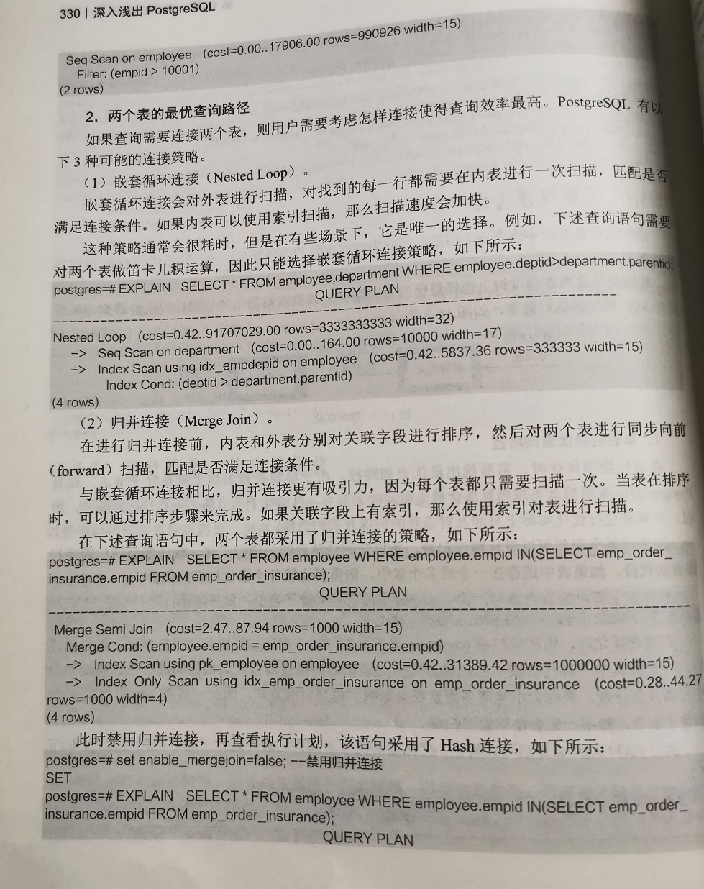

## 数据库架构

### 什么是数据库？

**数据库**是“按照数据结构来组织、存储和管理数据的仓库”。是一个长期存储在计算机内的、有组织的、可共享的、统一管理的大量数据的集合。

数据库系统把每一个应用只定义并且维护自己的数据的这样一种形式(图1)改变为对于数据的集中定义和集中管理(图2)。这种新的变化带来了数据独立性(data independence), 使得应用程序不再受到数据在逻辑组织或物理组织上带来的变化影响，反之亦然。


使用数据库系统的动机之一就是集成企业的运营数据，提供集中的、对于数据可控制的存取。


### 数据库演进之路

**数据库**已经发展了40年，可以说是一个传统又古老的领域。回顾数据库的发展历史，1980年到1990年属于商业起步阶段，此时**Oracle、IBM DB2、Sybase**以及**SQL Server**和**Informix**等开始出现。

1990年至2000年，**开源数据库**开始展露头角，出现了**PostgreSQL**和**MySQL**等。与此同时，出现了一些分析型数据库，因为之前出现的都是OLTP，而现在随着大量数据的出现，需要对于这些数据进行分析，因此出现了OLAP，而为了避免读写冲突，就需要建立分析型数据库系统，Teradata、Sybase IQ、Greenplum等就快速成长起来。


2000年到2010年期间，以谷歌为代表的互联网公司逐渐推出了NoSQL数据库。尤其是谷歌的GFS（Google File System）、Google Bigtable、Google MapReduce三大件。Google File System解决了分布式文件系统问题，Google Bigtable解决了分布式KV（Key-Value）存储的问题，Google MapReduce解决了在分布式文件系统和分布式KV存储上面如何做分布式计算和分析的问题。之所以产生了这三大件，是因为数据强一致性对系统的水平拓展以及海量数据爆发式增长的分析能力出现了断层。因此就需要解决这个问题，把这种数据的强一致性需求弱化，换来能够使用用分布式的集群做水平拓展处理。谷歌三大件在业界诞生以后，很快的衍生了一个新的领域叫NoSQL（Not Only SQL），就是针对非结构化、半结构化的海量数据处理系统。现在也有很多很好的商业公司基于NoSQL发展，比如说文档数据（MongoDB）、缓存（Redis）等大家平常应用开发都会用到的NoSQL系统。

而在2010年以后**，AWS Aurora、Redshift、Azure SQL Database、Google Spanner**发展起来了，它们的特点就是云原生、一体化分布式、HTAP的能力。

总结而言，数据库的演进经历了从结构化数据在线处理到海量数据分析，从SQL+OLAP的RDBMS到ETL+OLAP的Data Warehouse和Data Lake，再到今天异构多源的数据类型的发展历程。


### 数据库的发展-业务视角

大家知道，数据库可以分为几类：

- 最经典的是传统关系型OLTP数据库，其主要用于事务处理的结构化数据库，典型例子是银行的转账记账、电商下单、订单以及商品库存管理等。其面临的核心挑战是高并发、高可用以及高性能下的数据正确性和一致性。
- 其次是NoSQL数据库及专用型数据库，其主要用于存储和处理非结构化或半结构化数据（如文档，图，时序、时空，K-V），不强制数据的一致性，以此换来系统的水平拓展、吞吐能力的提升。
- 再次是分析型数据库 (On-Line Analytic Processing， OLAP)，其应用场景就是海量的数据、数据类型复杂以及分析条件复杂的情况，能够支持深度智能化分析。其面临的挑战主要是高性能、分析深度、与TP数据库的联动，以及与NoSQL数据库的联动。

除了数据的核心引擎之外，还有数据库外围的服务和管理类工具，比如数据传输、数据备份以及数据管理等。

最后就是数据库的管控平台，无论是私有云、专有云、混合云还是自己的IDC机房内进行部署，总要有一套数据库管控系统来管理数据库实例的产生和消亡、实例的资源消费等，能够以简单的形式提供给DBA以及数据库开发者。


随着数据库的发展，渐渐的数据库从传统的集中式架构，逐步转型成分布式架构。因为远超单机数据库容量的数据存储和访问峰值、实时数据分析检索(OLTP兼顾OLAP)、更高级别的容灾需求。

传统的集中式架构在稳定性和可用性方面有天然的优势，同时缺点也很明显，扩展性差。原来传统企业接入的终端有限，银行、政企的业务系统都是给内部人员使用，其扩展性方面的短板还不足以构成挑战。但是随着互联网尤其是移动互联网的发展，业务系统除了满足内部人员使用，还要支撑海量移动终端的访问请求，数据指数级增长所带来的高并发使得集中式架构面临着挑战，依靠垂直型扩展很难满足需求。

因为传统集中式数据库的限制条件，无法满足大数据时代对于数据库性能的要求，那么分布式的数据库逐渐进入人们的视野，分布式数据库一般具有以下特性具有灵活的体系结构、适应分布式的管理和控制机构、经济性能优越、系统的可靠性高、可用性好、局部应用的响应速度快、可扩展性好，易于集成现有系统等特点。

那么我们从几个方面来描述下数据库在集中式架构或分布式架构中使用到的核心技术点有哪些。传统集中式数据库架构指关系型数据库，如MySQL、Oracle、SqlServer等。分布式数据库系统架构比如CirrData, Oceanbase, TiDB, Cloudera Impala等等。下面我们先讲一下传统的集中式数据库架构以Mysql为例, 来描述在集中式数据库中涉及到的核心技术点。相关架构中的核心技术不会细讲，先知道有这么个东西就好，后期会专门一系列的文章来细讲数据库架构中这些技术的使用方式、技术的原理、为什么要这么用。


### 传统集中式数据库架构

将数据库系统拆开来看，其核心模块包括应用接口、SQL接口、查询执行引擎、数据访问模块和存储引擎。其中，查询执行引擎进一步可以拆分为计划生成器、计划优化器和计划执行器；数据访问模块则可以分为事务处理、内存处理、安全管理以及文件和索引管理等模块；并且事务处理是最核心的模块，其中包括了崩溃恢复和并发控制；最底层的存储引擎则包括数据文件、索引文件和系统及元数据文件。


传统数据库架构大致划分为几层：

- **应用层**: 给客户端提供连接数据库的工具。
- **会话层**: 处理客户端与服务器的session信息，并检测是否有访问数据库的权限相关的权限动作。
- **计划层**: 解析SQL字符串和逻辑计划的生成。
- **计算层**: 把逻辑计划转成物理计划，并计算结果。
- **数据访问层**: 文件和索引、事务的管理。
- **存储引擎**: 外部数据源存储的数据文件。

下面举一个查询的例子，看各个层之间是如何配合实现的。


### 查询分析处理过程

数据库查询分析处理过程是这样的：首先，通过SQL语句将查询任务提交上来，之后经过Session Manger和Parser进行处理，此时会有各种各样的执行方式，并生成Catalog和逻辑执行计划；之后对于逻辑执行计划进行优化，并生成物理执行计划；之后在借助系统的统计信息，如索引管理、内存管理来生成一个优化后的物理执行计划，再执行并生成最后结果。


简单而言，数据库系统的架构就是持久化存储的数据按照Data Page的形式进行存储，这些数据块在查询访问的时候会被带到内存里面。系统中有内存池，每个内存池可以装载一个Page，此时的问题就是内存池的大小是有限的，如果数据存储非常大，需要进行优化。此外，还涉及到优化数据访问的问题，一般通过索引解决，主要是Hash索引和树形索引。那么我们把各个组件拆解，来描述下各个组件都使用什么样的技术。


### 数据库核心组件

#### JDBC组件

大部分应用场景下，使用的都是JDBC组件，那么JDBC是什么？JDBC (Java Database Connectivity) API，即Java数据库编程接口，是一组标准的Java语言中的接口和类，使用这些接口和类，Java客户端程序可以访问各种不同类型的数据库。比如建立数据库连接、执行SQL语句进行数据的存取操作。通常和客户应用绑定在一起。


#### 会话管理组件

在连接数据库与断开连接之间的时间被称为一个数据会话。会话管理通常是数据库和外部交互的组件。JDBC与会话管理通常数据交互，可以使用grpc或者thrift这种RPC通信的技术。


#### 权限管理组件

权限是用户对一项功能的执行权利,在数据库中,根据系统管理方式的不同,可将权限分为系统权限与对象权限两类, 系统权限是指被授权用户是否可以连接到数据库上及数据库中可以进行哪些系统操作,另一类是对象权限是指用户对数据库中具体对象所拥有的权限, 对象权限,如数据库中的表,视图,存储过程,存储函数等。权限模组一般采用的技术是缓存机制。因为用户权限相关的数据会被持久化到物理设备中。缓存机制可以有效的减少IO操作。


#### SQL解析器组件

数据库需要支持标准的 SQL 语言，具体实现的时候必然要涉及到词法分析和语法分析。早期的程序可能会优先考虑手工实现词法分析和语法分析，现在大多数场合下都会采用工具来简化实现。MySQL、PostgreSQL 等采用 C/C++ 实现的开源数据库采用的是现代的 yacc/lex 组合，也就是 GNU bison/flex。其他比较流行的工具还有 ANTLR、JavaCC 等等。这些工具大多采用扩展的 BNF 语法，并支持很多定制化选项，使得语法比较容易维护和实现。通过这些工具可以使应用端发送过来的SQL字符串，转成一个AST(Abstract Syntax Tree)抽象SQL语法树。


#### SQL查询优化器

优化器作为数据库核心功能之一，也是数据库的“大脑”，理解优化器将有助于我们更好地优化SQL。


传统关系型数据库里面的优化器分为CBO和RBO两种。


**RBO(Rule Based Potimizer) 基于规则的优化器**:

RBO :RBO所用的判断规则是一组内置的规则，这些规则是硬编码在数据库的编码中的，RBO会根据这些规则去从SQL诸多的路径中来选择一条作为执行计划（比如在RBO里面，有这么一条规则：有索引使用索引。那么所有带有索引的表在任何情况下都会走索引）所以，RBO现在被很多数据库抛弃（oracle默认是CBO，但是仍然保留RBO代码，MySQL只有CBO）

RBO最大问题在于硬编码在数据库里面的一系列固定规则，来决定执行计划。并没有考虑目标SQL中所涉及的对象的实际数量，实际数据的分布情况，这样一旦规则不适用于该SQL，那么很可能选出来的执行计划就不是最优执行计划了。


**CBO(Cost Based Potimizer) 基于成本的优化器**:

CBO :CBO在会从目标诸多的执行路径中选择一个成本最小的执行路径来作为执行计划。这里的成本他实际代表了MySQL根据相关统计信息计算出来目标SQL对应的步骤的IO，CPU等消耗。也就是意味着数据库里的成本实际上就是对于执行目标SQL所需要IO,CPU等资源的一个估计值。而成本值是根据索引，表，行的统计信息计算出来的。(计算过程比较复杂)


##### Postgres的查询优化器

Postgres主要进行了两个阶段的优化，即逻辑优化和基于代价的物理优化。

* 逻辑优化：在关系代数的理论基础上对查询树的节点进行重组，从而生成一个没有冗余的查询树，以提高查询的效率。
* 物理优化：从查询的物理成本上进行优化，通过对各种基本信息进行分析后，选择成本相对低的查询路径。


**一、逻辑优化**

逻辑优化是指在不改变语义的基础上改变查询树的节点位置和结构，从而提升SQL语句的执行效率。

逻辑优化的基本理论来源于关系代数。Postgres数据库属于关系型数据库，关系型数据库查询语言的基础就是关系代数，因此，对查询语言的优化就可以通过使用关系代数的运算来进行。

逻辑优化阶段，使用关系代数中的并、交、差、积、除、选择、投影、连接、半连接等一系列运算方法对查询树进行等价代换，使得SQL语句采用查询树的执行效率更高。

逻辑优化的顺序如下所述：

1. 对子查询进行优化

   > 对子查询进行优化大致分为两个步骤：
   >
   > * 对子查询进行上提（即尽可能地把子查询提到父查询中，与父查询进行合并），这样可以减少子查询的层次，减少嵌套查询，使得查询节点尽可能地在叶子节点完成选择操作。
   > * 把选择出来的少量结果进行表间的连接操作，从而将表连接的操作数量降到最低，提高查询性能。

2. 对where、having、on等条件表达式优化及等价谓词重写。

3. 对外连接进行优化

   > 外连接包括左外连接、右外连接、全外连接等多种连接方式。把外连接转化为内连接，可以使得表的连接顺序更随意，提高查询效率。


**二、物理优化**

物理优化是指在查询树上选择最优的查询路径，该查询路径中的物理访问代价最少，从而提升SQL语句的执行效率。

1、 **单表的最优查询路径**

在进行物理优化时，需要找出最优查询的路径。由于单表在查询树上就是叶子节点，而且Postgres采用的动态规划算法会最先访问叶子节点，再由叶子节点向上层查找访问路径，所以，对单表进行优化实际上只涉及对该表的扫描方式的选择。

因为对每个表都可以进行顺序扫描，所以在评估单表的扫描方式时，默认都会评估顺序扫描表的代价。如果表中还存在一个或多个索引，则需要比较各个索引扫描的代价。

执行以下简单的查询语句，其中`empid`字段已经创建了索引，如下所示：

```sql
select * from employee where empid > 10001;
```

在物理优化时，先比较扫描employee表的两种方式（顺序扫描表和索引扫描表）的扫描代价，并选择其中一种代价较小的扫描方式作为该表的物理查询方式。数据的离散性、查询的命中行数及总行数、表的大小等诸多因素都会影响到物理查询方式，因此，虽然empid字段已经创建了索引，却不一定会使用索引扫描。

执行`explain`命令可以看到，优化器执行查询语句的扫描方式。


2、**两个表的最优查询路径**

其中Hash join性能最好，nested loop join性能最差。




#### 物理执行器组件

物理执行器又叫做计划执行器。执行器架构一般采用Volcano Model经典的基于行的流式迭代模型(Row-BasedStreaming Iterator Model)。比如我们熟知的主流关系数据库中都采用了这种模型，例如Oracle，SQL Server, MySQL等。


在Volcano模型中，所有的代数运算符(operator)都被看成是一个迭代器，它们都提供一组简单的接口：open()—next()—close()，查询计划树由一个个这样的关系运算符组成，每一次的next()调用，运算符就返回一行(Row)，每一个运算符的next()都有自己的流控逻辑，数据通过运算符自上而下的next()嵌套调用而被动的进行拉取。


这是一个最简单的火山模型例子，拉取数据的控制命令从最上层的Output运算符依次传递到执行树的最下层，而数据流动的方向正好相反。

这种计算模型对于CPU Cache是不友好的，所以一般在做表达式计算的时候通常采用编译执行。来提高CPU Cache的命中率。通常采用的的技术是llvm技术。

对于OLAP数据的物理执行引擎通常采用列存的数据结构，因为可以比较高效的提高CPU Cache的利用率，通常也可以采用比较高效SIMD指令来处理。

随着各个商业数据库做软硬件一体化解决方案的产生，通常也会使用GPU和FPGA这种技术来提高计算性能。


#### 索引组件


**索引**是对数据库表中一列或多列的值进行排序的一种结构，使用索引可快速访问数据库表中的特定信息。如果想按特定职员的姓来查找他或她，则与在表中搜索所有的行相比，索引有助于更快地获取信息。

**索引**的一个主要目的就是加快检索表中数据，亦即能协助信息搜索者尽快的找到符合限制条件的记录ID的辅助数据结构。

**数据库索引的核心技术**总的来说，索引就是拿空间换时间。数据库技术和大数据技术会有一个融合的过程，除了前面讲到的B树索引、Hash索引等，还有倒排索引、MinMax索引、BitSet索引、MDK索引等。


#### 事务处理组件


数据库的**事务**处理是数据库最重要的核心模组之一，数据库事务(transaction)是访问并可能操作各种数据项的一个数据库操作序列，这些操作要么全部执行,要么全部不执行，是一个不可分割的工作单位。事务由事务开始与事务结束之间执行的全部数据库操作组成。

- 事务是并发控制的基本单位。
- 一个事务包含的诸操作要么都执行，要么都不执行。


**事务的属性**

- 原子性 ：事务是数据库的逻辑工作单位，一个事务的诸操作要么都做，要么都不做。 
- 一致性 ：指事务执行前后必须保持数据库的逻辑一致性。一致性和原子性是密切相关的。 
- 隔离性 ：指并发执行的各个事务之间不能互相干扰。 
- 持久性 ：指一个事务的操作提交后， 其对数据库的改变是永久的，属于物理的而非逻辑的。


**数据库的事务隔离级别**

- READ UNCOMMITTED（读未提交数据）：允许事务读取未被其他事务提交的变更数据，会出现脏读、不可重复读和幻读问题。
- READ COMMITTED（读已提交数据）：只允许事务读取已经被其他事务提交的变更数据，可避免脏读，仍会出现不可重复读和幻读问题。
- REPEATABLE READ（可重复读）：确保事务可以多次从一个字段中读取相同的值，在此事务持续期间，禁止其他事务对此字段的更新，可以避免脏读和不可重复读，仍会出现幻读问题。
- SERIALIZABLE（序列化）：确保事务可以从一个表中读取相同的行，在这个事务持续期间，禁止其他事务对该表执行插入、更新和删除操作，可避免所有并发问题，但性能非常低。


**原子性使用的核心技术**

Transaction Undo Log来保证数据的原子性。日志的作用能够在发生错误时撤销之前的全部操作，肯定是需要将之前的操作都记录下来的，这样在发生错误时才可以回滚。

回滚日志除了能够在发生错误或者用户执行 ROLLBACK 时提供回滚相关的信息，它还能够在整个系统发生崩溃、数据库进程直接被杀死后，当用户再次启动数据库进程时，还能够立刻通过查询回滚日志将之前未完成的事务进行回滚，这也就需要回滚日志必须先于数据持久化到磁盘上，是我们需要先写日志后写数据库的主要原因。


**一致性使用的核心技术**

数据库一致性（Database Consistency）是指事务执行的结果必须是使数据库从一个一致性状态变到另一个一致性状态。保证数据库一致性是指当事务完成时，必须使所有数据都具有一致的状态。通常需要使用一致性协议来保证例如Paxos、Raft。


**隔离性使用的核心技术**

锁、时间戳、MVCC来保证数据的隔离性。

> MySQL是用锁来实现的事务隔离性（事务隔离级别）

锁是一种最为常见的并发控制机制，在一个事务中，我们并不会将整个数据库都加锁，而是只会锁住那些需要访问的数据项，常见数据库中的锁都分为两种，共享锁（Shared）和互斥锁（Exclusive），前者也叫读锁，后者叫写锁。读锁保证了读操作可以并发执行，相互不会影响，而写锁保证了在更新数据库数据时不会有其他的事务访问或者更改同一条记录造成不可预知的问题。

> Postgres是用时间戳来实现的事务隔离级别，其实这里的时间戳就是postgres每行记录里面的`xmin`和`xmax`字段。

时间戳也是实现事务的隔离性的一种方式，使用这种方式实现事务的数据库，例如 PostgreSQL 会为每一条记录保留两个字段；读时间戳中包括了所有访问该记录的事务中的最大时间戳，而记录行的写时间戳中保存了将记录改到当前值的事务的时间戳。使用时间戳实现事务的隔离性时，往往都会使用乐观锁，先对数据进行修改，在写回时再去判断当前值，也就是时间戳是否改变过，如果没有改变过，就写入，否则，生成一个新的时间戳并再次更新数据，乐观锁其实并不是真正的锁机制。

乐观并发控制（OCC）：是一种用来解决写-写冲突的无锁并发控制，认为事务间争用没有那么多，所以先进行修改，在提交事务前，检查一下事务开始后，有没有新提交改变，如果没有就提交，如果有就放弃并重试。

乐观并发控制类似自选锁。乐观并发控制适用于低数据争用，写冲突比较少的环境。

> MVCC也可以实现事务隔离性，MySQL和Postgres都有实现

MVCC也是实现事务的隔离性的一种方式，通过维护多个版本的数据，数据库可以允许事务在数据被其他事务更新时对旧版本的数据进行读取，很多数据库都对这一机制进行了实现；因为所有的读操作不再需要等待写锁的释放，所以能够显著地提升读的性能，MySQL 和 PostgreSQL 都对这一机制进行自己的实现。


关系型数据库实现SI的区别：

1.Oracle/innodb

undo回滚段

2.sqlserver

temp临时表空间

3.postgresql

表的数据页面


ANSI SQL-92中定义三种异常,脏读/不可重复读/幻读,SI都不会出现。

但是SI无法实现真正的可串行化,SI可能会出现串行化异常。

为了解决这个问题,PostgreSQL9.1之后添加了,可串行化快照隔离SSI。SSI可检测串行化异常。

目前Oralce只支持SI。


**持久性使用的核心技术**

Transacation Redo Log来保证数据的持久性。日志由两部分组成，一是内存中的重做日志缓冲区，因为重做日志缓冲区在内存中，所以它是易失的，另一个就是在磁盘上的重做日志文件，它是持久的。


#### 存储引擎组件

存储引擎通常要处理的事情

- 并发性：某些应用程序比其他应用程序具有很多的颗粒级锁定要求（如行级锁定）。
- 事务支持：并非所有的应用程序都需要事务，但对的确需要事务的应用程序来说，有着定义良好的需求，如ACID兼容等。
- 引用完整性：通过DDL定义的 外键，服务器需要强制保持关联数据库的引用完整性。
- 物理存储：它包括各种各样的事项，从表和索引的总的页大小，到存储数据所需的格式，到物理磁盘。
- 索引支持：不同的应用程序倾向于采用不同的索引策略，每种存储引擎通常有自己的编制索引方法，但某些索引方法（如B-tree索引）对几乎所有的存储引擎来说是共同的。
- 内存高速缓冲：与其他应用程序相比，不同的应用程序对某些内存高速缓冲策略的响应更好，因此，尽管某些内存高速缓冲对所有存储引擎来说是共同的（如用于用户连接的高速缓冲，MySQL的高速查询高速缓冲等），其他高速缓冲策略仅当使用特殊的存储引擎时才唯一定义。
- 性能帮助：包括针对并行操作的多I/O线程，线程并发性，数据库检查点，成批插入处理等。
- 其他目标特性：可能包括对地理空间操作的支持，对特定数据处理操作的安全限制等。


### 分布式数据库架构


分布式数据库一般由多个管理节点和数据节点组成，分别负责分布式数据库的运维和数据存储。相比于单机数据库，分布式数据库具有“逻辑统一、物理分散”的特点，逻辑统一是指，从用户角度看，不论多少个节点组成数据库的完整功能，对用户而言，都表现的像是一个单机数据库；物理分散是指，从实现角度看，分布式的数据库功能分别由不同的节点完成，由其内部进行自动化的统一调度。逻辑统一的要求和物理分散的实现，决定了在很多产品功能实现上，相较于单机数据库具有一定的复杂性和技术难度。


目前业界的分布式数据库产品非常多比如(Oceanbase, Impala, Greenplum, CirroData, SAP HANA)等等。按照目前业界这些分布式数据库的现状，技术路线分类如下：

- 基于开源数据库 + 中间件：开源单机数据库（如 mysql 、 postgres 等）已经经过了几十年的应用，产品功能相对稳定，单机数据处理性能也相对比较高。这种方案的优点是可以利用现有单机数据库稳定的产品功能，缺点是中间件的功能实现要受限于单机数据库的功能。当然，也有足够研究能力的厂商会对单机数据库进行功能优化和改进，比如 mysql 的主从同步机制、热点数据访问等，这对厂商的研发能力和技能储备要求非常高。
- 完全自研：公司组建团队进行产品的自研开发，当然，不可能完全重复造轮子，在实现部分产品功能时可能会采用或者借鉴一些开源软件，比如 TiDB 的数据存储使用了 RocksDB 。数据资产是公司最核心的资源，尤其是银行等金融行业，数据库不能出现重大问题，但数据库的产品功能完善需要经过一段时期的生成环境验证，需要填各种坑。因此，这种方案的优点是天生具有分布式的特性，从设计之初就是针对分布式架构进行设计的，而单机数据库的很多设计当时还未具备分布式的思维理念，缺点是产品的功能需要经过不同场景、不同数据量和不同行业用户的检验、改进和完善，才能具备成熟度，需要团队具备相应的应用场景。


目前数据库产品的业务场景一般分为支持 OLTP(交易性数据库)、 OLAP(分析性数据库) 和 HTAP（分析交易混合型数据库）。目前 OLAP 已经有很多成熟的产品或者大数据开源软件支持， HTAP 的理念是用一款产品同时解决 OLAP 和 OLTP 的场景。


那么我们来看下分布式数据库有哪些核心技术

#### 数据分布

单机的纵向扩展能力受主板卡槽等影响存在上限，有单机处理容量和速度的上限，而分布式数据库则是通过横向扩展能力来无限提升数据库处理速度、性能和容量。对于一个数据量很大的表，往往需要将其分布到多个节点进行处理。目前技术趋势如下：

1. 支持常见的数据分布方式有 hash 、 range 和 list 。MySQL 的语法还有一种 key ，但是可以类似于 hash ，区别在于 key 的 hash 函数由服务器提供。当然，有部分产品只支持其中一种或者两种。在银行业，比如银行卡等部分业务数据还具有一个特征，就是某个字符串的中间部分是具有业务特征，比如可能是省市代码，如果可以支持对字符串的子串支持多种分布方式会简化应用开发，但目前几乎没有产品支持这个功能。
2. 单表复制。在对分布在多个数据节点的 2 个表进行表连接时，会涉及网络通讯和大量数据传输，会影响性能。比如， A 表和 B 表进行表连接， B 表进行 hash 后保存在四个节点，如果此时在四个节点上均保存一份全量数据 A ，那么可以分别在四个节点完成表连接，然后再进行数据汇总。这种场景成为单表复制。这种表一般是数据量相对较少，数据改动较小。数据量少，是需要单个数据节点可以对其进行处理，数据改动较小是为了降低数据频繁改动时的性能影响。因为每次修改数据，需要同步修改四个数据节点的数据。


#### 分布式事务

分布式事务是分布式数据库的重点，也是它的难点。产品的实现方式各不相同，主要有如下两种流派：

1. 两阶段提交：这种业界最主流的选择方案，区别在于不同的产品对两阶段的实现方式不同，一种是利用 MySQL 支持的 XA 协议， MySQL 提供了 XA 协议的接口，可以在此基础上实现，一般用于采用中间件技术路线的产品；一种自己实现 XA 协议，一般用于自研路线的产品。目前这是业界实现主流。

2. 一阶段提交 + 事务补偿：这种方案设计者一般认为两阶段的成本较高，因此将分布式事务的各个阶段分别进行提交，如果某个阶段发生异常时，再对已提交的各阶段事务进行事务冲正。目前只有个别产品采用这种方案。

   

不论哪种流派，分布式事务的设计有几个难点：

1. 分布式事务的异常处理：从正常流程看，哪种方案都看似行得通，无法厚非。但真正设计难点在于分布式的参与节点多，在这个过程中，无论哪个节点都有可能故障，问题在于：无论哪个节点或者阶段发生过程，如何保证事务的完整性和数据一致性。
2. 分布式事务的隔离级别：如果对标单机数据库的四个事务隔离级别，分布式事务完全实现具有很高的难度，所有产品均实现难度不大的已提交读，部分产品实现了可串行化读，其它两个隔离级别实现起来复杂度较高。
3. 分布式事务的性能优化：由于分布式事务在 commit 阶段需要处理大量操作，甚至是跨节点的操作，因此，如何区分本地事务和分布式事务，如何优化提升分别式事务，是一个复杂的问题。由于每家产品各不相同，因为不具有通用可总结的规律。
4. 分布式事务的数据多版本控制（ MVCC ）：Oracle 和 MySQL 均实现了 MVCC 功能。但分布式事务的 MVCC 功能实现具有一定难度，如果结合事务隔离级别，实现难度更大。


#### 数据复制

不同于 DB2 、 Oracle 等数据库采用增强存储硬件可靠性，分布式数据库使用廉价 PC 服务器，它们的特点就是故障率相对比较高。对于一个数百台机器组成的分布式数据库时，出现几台服务器故障都是正常现象。分布式数据库一般采用 share nothing 的模型，每个数据节点都采用自己的本地存储。主要技术特点如下：

1. 为了保证数据的可靠性，必须将数据保存多份，经典的数值是三份：hadoop 中数据也是默认保存三份。这样，三个节点完全坏掉的可能性非常小，但并非理论上的不可能。对于一些数据安全性要求高的场景，可以保存五份。每多保存一份，就多一份的硬件支出成本，因此需要进行硬件成本和数据安全容忍度的平衡。
2. 为兼顾多个节点的数据安全性和数据写性能，一般采用超半数同步写成功的原则。在将数据保存三份或者五份时，在写数据时，如果只有一个节点写成功，其它节点采用异步模式，当该节点宕机，其它节点还未写成功时就会存在数据丢失的可能性；如果等待所有节点写成功，那么响应时间可能比较长，无法满足性能要求。因此，采用了折中方法，即超过半数同步写成功即可。这种思想可以采用 paxos 或者 raft 协议实现。


#### 读写分离

在数据存在多份时，会有一个节点作为主节点，其余节点保持与它的同步，称为从节点。由于半数写成功原则的存储，尤其在数据节点比较繁忙的时候，存在部分从节点与主节点不一致的情况。如果所有客户端的请求均发给主节点，主节点要承担所有读写功能，在高负载的情况下会雪上加霜，造成响应速度很慢。在常用业务场景中，一般都是写少读多。因此，对于一些对数据实时性要求不高的业务场景，可以将客户端的读请求发给从节点，从而降低从节点的负载。


#### 数据备份恢复

数据的备份恢复是数据库运维的基本操作。对于运维人员而言，一般是希望通过一个命令操作可以备份所有数据节点的数据，如同单机数据库备份一样。但是，因为备份过程需要每个节点的数据库单独进行备份，因此，需要保持每个数据节点的备份都是在同一个时间节点的备份快照，这非常重要。

业界常用的解决方法是在备份操作启动的时间，记录下整个数据库的当前最大事务 ID ，比如 LSN ，同时备份数据文件和日志文件。数据文件的备份可以采用物理备份，在备份的过程中可能会产生客户端请求修改数据的情况，这些修改的操作都已经通过日志文件进行了备份。在进行数据恢复时，首先还原数据文件，然后通过重复日志文件，一直到需要操作的时间点。


#### 容灾高可用

传统单机数据库的高可用和异地容灾，比如 Oracle ，多采用 ADG(active data guard) 和 OGG(oracle golden gate) 的模式进行数据实时同步，但是当主库发生故障时，切换到备库。在实时操作过程中，虽然可以进行自动切换，但为了检查主库和从库的一致性，银行业很多案例都需要进行人工核对，这样故障恢复就需要一定时间。但是分布式数据库的多数据副本模式就很好的解决了这个问题。比如三副本情况下，可以将 2 个节点放在本地机房，第三个节点放在异地机房。在正常情况下，进行数据修改时，按照超过半数即为成功的原则，由于本地的 2 个节点网络时延小，就会很快完成操作并相应客户端。当发生某个节点故障时，可以自动切换到本地节点的另外一个节点，同时第三个节点还在运行，只要这 2 个节点都写成功，仍然正常提供服务，此时业务系统相应时间过变长，可以视作服务能力降级，但是不会发生业务系统宕机。对于一些非常重要的系统，甚至可能采用 4+1 ，同城机房有 4 个节点，两个机房各有 2 个节点，第 5 个节点（即 4+1 中的 1 ）在异地机房，这样，即便本地机房节点故障发生 1 个节点故障，不会服务降级。


#### SMP vs MPP


SMP(Symmetric Multi-Processor)系统内有许多紧耦合多处理器，在这样的系统中，所有的CPU共享全部资源，如总线，内存和I/O系统等;

所谓对称多处理器结构，是指服务器中多个 CPU 对称工作，无主次或从属关系。各 CPU 共享相同的物理内存，每个 CPU 访问内存中的任何地址所需时间是相同的，因此 SMP 也被称为一致存储器访问结构 (UMA ：Uniform Memory Access) 。对 SMP 服务器进行扩展的方式包括增加内存、使用更快的 CPU 、增加 CPU 、扩充 I/O( 槽口数与总线数 ) 以及添加更多的外部设备 ( 通常是磁盘存储 ) 。

主要特征是共享，系统中所有资源 (CPU 、内存、 I/O 等 ) 都是共享的。也正是由于这种特征，导致了SMP 服务器的主要问题，那就是它的扩展能力非常有限。对于 SMP 服务器而言，每一个共享的环节都可能造成 SMP 服务器扩展时的瓶颈，而最受限制的则是内存。由于每个 CPU 必须通过相同的内存总线访问相同的内存资源，因此随着 CPU 数量的增加，内存访问冲突将迅速增加，最终会造成 CPU 资源的浪费，使 CPU 性能的有效性大大降低。实验证明， SMP 服务器 CPU 利用率最好的情况是 2 至 4 个 CPU 。


MPP(Massive Parallel Processing)由多个 SMP 服务器通过一定的节点互联网络进行连接，协同工作，完成相同的任务，从用户的角度来看是一个服务器系统。其基本特征是由多个 SMP 服务器 ( 每个 SMP 服务器称节点 ) 通过节点互联网络连接而成，每个节点只访问自己的本地资源 ( 内存、存储等 ) ，是一种完全无共享 (Share Nothing) 结构。

既然有两种结构，那它们各有什么特点呢？采用什么结构比较合适呢？通常情况下，MPP系统因为要在不同处理单元之间传送信息，所以它的效率要比SMP要差一点，但是这也不是绝对的，因为MPP系统不共享资源，因此对它而言，资源比SMP要多，当需要处理的事务达到一定规模时，MPP的效率要比SMP好。这就是看通信时间占用计算时间的比例而定，如果通信时间比较多，那MPP系统就不占优势了，相反，如果通信时间比较少，那MPP系统可以充分发挥资源的优势，达到高效率。当前使用的OTLP程序中，用户访问一个中心数据库，如果采用SMP系统结构，它的效率要比采用MPP结构要快得多。而MPP系统在决策支持和数据挖掘方面显示了优势，可以这样说，如果操作相互之间没有什么关系，处理单元之间需要进行的通信比较少，那采用MPP系统就要好，相反就不合适了。


#### 资源访问方式


- Shared Everthting:一般是针对单个主机，完全透明共享CPU/MEMORY/IO，并行处理能力是最差的，典型的代表SQLServer

  

- Shared Disk：各个处理单元使用自己的私有 CPU和Memory，共享磁盘系统。典型的代表Oracle Rac， 它是数据共享，可通过增加节点来提高并行处理的能力，扩展能力较好。其类似于SMP（对称多处理）模式，但是当存储器接口达到饱和的时候，增加节点并不能获得更高的性能 。

  

- Shared Nothing：各个处理单元都有自己私有的CPU/内存/硬盘等，不存在共享资源，类似于MPP（大规模并行处理）模式，各处理单元之间通过协议通信，并行处理和扩展能力更好。典型代表DB2 DPF和Hadoop ，各节点相互独立，各自处理自己的数据，处理后的结果可能向上层汇总或在节点间流转。


我们常说的 Sharding 其实就是Share Nothing架构，它是把某个表从物理存储上被水平分割，并分配给多台服务器（或多个实例），每台服务器可以独立工作，具备共同的schema，比如MySQL Proxy和Google的各种架构，只需增加服务器数就可以增加处理能力和容量。

Shared nothing架构（shared nothing architecture）是一 种分布式计算架构。这种架构中的每一个节点（ node）都是独立、自给的，而且整个系统中没有单点竞争。


#### 结论

前几年大数据时代刚来临的时候，Hadoop分布式组件应运而生，Hadoop有三大组件HDFS、MapReduce、Yarn，HDFS的作用是分布式的存储，来提高容灾和高可用，MapReduce来提供分布式计算，Yarn用来做集群的资源调度和资源整合。于是业界就产生了一个说法，叫做”数据库已死“，数据库领域会被改朝换代。存储、计算、调度通过Hadoop组件都可以办到，那么我们还用数据库做什么呢？经过时间的证明OLTP还是OLAP或者HTAP，开源数据库与商业数据库都存在巨大的功能和性能鸿沟。开源数据库虽然广泛应用在互联网等场景，但是传统的企业用户，无论是金融、保险、医疗、电信、等等，还是高度依赖商业数据库。互联网高数据量、高性能、高并发、扩展性、软件成本等等的限制条件。数据库的重要性越来越重要。上文只是讲了数据库中会用到什么要的技术，后续会对于每一个技术进行详细讲解。


## 数据库基础

### 关系型和非关系型数据库的区别？

关系型数据库的优点

- 容易理解，因为它采用了关系模型来组织数据。
- 可以保持数据的一致性。
- 数据更新的开销比较小。
- 支持复杂查询（带 where 子句的查询）

非关系型数据库（NOSQL）的优点

- 无需经过 SQL 层的解析，读写效率高。
- 基于键值对，读写性能很高，易于扩展
- 可以支持多种类型数据的存储，如图片，文档等等。
- 扩展（可分为内存性数据库以及文档型数据库，比如 Redis，MongoDB，HBase 等，适合场景：数据量大高可用的日志系统/地理位置存储系统）。


### 一条SQL语句执行的具体步骤

**MySQL**

Server 层按顺序执行 SQL 的步骤为：

- 客户端请求 -> 连接器（验证用户身份，给予权限）
- 查询缓存（存在缓存则直接返回，不存在则执行后续操作）
- 分析器（对 SQL 进行词法分析和语法分析操作）
- 优化器（主要对执行的 SQL 优化选择最优的执行方案方法）
- 执行器（执行时会先看用户是否有执行权限，有才去使用这个引擎提供的接口）-> 去引擎层获取数据返回（如果开启查询缓存则会缓存查询结果）


**Postgres**

* 首先客户端先连上来，可以通过libpq，或者JDBC/ODBC
* 一条Query语句进来了以后，先经过Parser这个模块，做词法分析和语法分析，熟悉pg的code就知道，经过Parser以后就生成一个parseTree。
* 然后把parseTree交给Analyzer做语义分析，语义分析完了以后就会生成一棵queryTree。
* 然后把queryTree交给基于规则系统的ReWriter模块，ReWriter模块它是处于Optimizer和Analyzer之间的，经过ReWriter模块以后可能会将一棵queryTree改写成一个queryTree list。
* 然后把queryTree list交给Optimizer去做逻辑优化以及基于cost的物理优化，生成plan。截止到这里，和postgres是一模一样的。不一样的点是生成的plan是并行的plan，而postgres生成的是串行的plan。
* Optimizer生成的plan交给Executor，然后Executor执行查询计划并返回查询结果。


### 1、DDL和DML

DDL语句是指建表、修改表和删除表的语句。

DML语句是指插入、更新和删除数据的语句，如insert、update和delete。


### 2、什么是视图？

通俗的说，视图就是由查询语句定义的虚拟表。对用户来说，视图如同一张真的表。

**视图的作用：**

* 可使复杂的查询易于理解和使用。
* 安全原因，视图可以隐藏一些数据，如在一张用户表中，可以通过定义视图把密码等敏感字段去掉。
* 把一些函数返回的结果映射成视图。
* 视图表相当于原表的副本，修改视图表不会修改原表的。
* 视图是查询多张表数据的结果集，视图数据不能修改，想修改数据需要修改单表数据，视图数据会随之改变。


### drop、truncate 和 delete 的区别

- DELETE 语句执行删除的过程是每次从表中删除一行，并且同时将该行的删除操作作为事务记录在日志中保存以便进行进行回滚操作。
- TRUNCATE TABLE  则一次性地从表中删除所有的数据并不把单独的删除操作记录记入日志保存，删除行是不能恢复的。并且在删除的过程中不会激活与表有关的删除触发器。执行速度快。
- drop语句将表所占用的空间全释放掉。
- 在速度上，一般来说，drop> truncate > delete。
- 如果想删除部分数据用 delete，注意带上 where 子句，回滚段要足够大；
- 如果想删除表，当然用 drop；如果想保留表而将所有数据删除，如果和事务无关，用 truncate 即可；
- 如果和事务有关，或者想触发 trigger，还是用 delete；如果是整理表内部的碎片，可以用 truncate 跟上 reuse stroage，再重新导入/插入数据。


### 在 MySQL 中有两个 kill 命令

- 一个是 kill query + 线程 id，表示终止这个线程中正在执行的语句
- 一个是 kill connection + 线程 id，这里 connection 可缺省，表示断开这个线程的连接

kill 不掉的原因

- kill命令被堵了，还没到位
- kill命令到位了，但是没被立刻触发
- kill命令被触发了，但执行完也需要时间


### MySQL 临时表的用法和特性

- 只对当前session可见。
- 可以与普通表重名。
- 增删改查用的是临时表。
- show tables 不显示普通表。
- 在实际应用中，临时表一般用于处理比较复杂的计算逻辑。
- 由于临时表是每个线程自己可见的，所以不需要考虑多个线程执行同一个处理时临时表的重名问题，在线程退出的时候，临时表会自动删除。


### grant 和 flush privileges语句

- grant语句会同时修改数据表和内存，判断权限的时候使用的内存数据，因此，规范使用是不需要加上 flush privileges 语句。
- flush privileges 语句本身会用数据表的数据重建一份内存权限数据，所以在权限数据可能存在不一致的情况下再使用。


### 要不要使用分区表？

- 分区并不是越细越好。实际上，单表或者单分区的数据一千万行，只要没有特别大的索引，对于现在的硬件能力来说都已经是小表了。
- 分区也不要提前预留太多，在使用之前预先创建即可。比如，如果是按月分区，每年年底时再把下一年度的 12 个新分区创建上即可。对于没有数据的历史分区，要及时的 drop 掉。


### join 用法

- 使用 left join 左边的表不一定是驱动表
- 如果需要 left join 的语义，就不能把被驱动表的字段放在 where 条件里面做等值判断或不等值判断，必须都写在 on 里面
- 标准的 group by 语句，是需要在 select 部分加一个聚合函数，比如select a,count(*) from t group by a order by null;


### 为什么删除了表，表文件的大小还是没变？

- 数据项删除之后 InnoDB 某个页 page A 会被标记为可复用。
- delete 命令把整个表的数据删除，结果就是，所有的数据页都会被标记为可复用。但是磁盘上，文件不会变小。
- 经过大量增删改的表，都是可能是存在空洞的。这些空洞也占空间所以，如果能够把这些空洞去掉，就能达到收缩表空间的目的。
- 重建表，就可以达到这样的目的。可以使用 alter table A engine=InnoDB 命令来重建表。


### count(*)实现方式以及各种 count 对比

- 对于 count(主键 id) 来说，InnoDB 引擎会遍历整张表，把每一行的 id 值都取出来，返回给 server 层。server 层拿到 id 后，判断是不可能为空的，就按行累加。
- 对于 count(1) 来说，InnoDB 引擎遍历整张表，但不取值。server 层对于返回的每一行，放一个数字“1”进去，判断是不可能为空的，按行累加。单看这两个用法的差别的话，你能对比出来，count(1) 执行得要比 count(主键 id) 快。因为从引擎返回 id 会涉及到解析数据行，以及拷贝字段值的操作。
- 对于 count(字段) 来说：如果这个“字段”是定义为 not null 的话，一行行地从记录里面读出这个字段，判断不能为 null，按行累加；如果这个“字段”定义允许为 null，那么执行的时候，判断到有可能是 null，还要把值取出来再判断一下，不是 null 才累加。也就是前面的第一条原则，server 层要什么字段，InnoDB 就返回什么字段。
- 但是 count * 是例外，并不会把全部字段取出来，而是专门做了优化，不取值。count(*) 肯定不是 null，按行累加。
- 所以结论是：按照效率排序的话，count(字段)<count(主键 id)<count(1)≈count(※)，所以建议尽量使用 count(*)。


### orderby 排序内部原理

- MySQL 会为每个线程分配一个内存（sort-buffer）用于排序，该内存大小为 sort_buffer_size；

- 如果排序的数据量小于 sort_buffer_size，排序就会在内存中完成；

  内部排序分为两种

- 全字段排序：到索引树上找到满足条件的主键ID根据主键ID去取出数据放到sort_buffer然后进行快速排序

- rowid排序：通过控制排序的行数据的长度来让sort_buffer中尽可能多的存放数据

- 如果数据量很大，内存中无法存下这么多，就会使用磁盘临时文件来辅助排序，称为外部排序；

- 外部排序，MySQL会分为好几份单独的临时文件来存放排序后的数据，一般是磁盘文件中进行归并，然后将这些文件合并成一个大文件；


## 基础知识

### 数据库引擎

答：数据库引擎是用于存储、处理和保护数据的核心服务。利用数据库引擎可控制访问权限并快速处理事务，从而满足企业内大多数需要处理大量数据的应用程序的要求。

简言之，数据库引擎就是一段用于支撑所有数据库操作的核心程序，就如名称一样，是一个车的引擎功能；

常见的数据库引擎有：

（1）Microsoft JET (Joint Engineering Technologe) 用于Access和VB的内嵌数据库功能的核心元素；

（2）ODBC（Open DataBase Connectivity，开放数据库互连）是由Microsoft定义的一种数据库访问标准，它提供一种标准的数据库访问方法以访问不同平台的数据库。一个ODBC应用程序既可以访问在本地PC机上的数据库，也可以访问多种异构平台上的数据库，例如SQL Server、Oracle或者DB2；

（3）OLE DB是Microsoft开发的最新数据库访问接口，Microsoft将其定义为ODBC接班人；

（4）MYSQL支持三个引擎：ISAM、MYISAM和HEAP。另外两种类型INNODB和BERKLEY（BDB）也常常可以使用；

①ISAM执行读取操作的速度很快，而且不占用大量的内存和存储资源。ISAM的两个主要不足之处在于，它不支持事务处理，也不能够容错；

②MyISAM是MySQL的ISAM扩展格式和缺省的数据库引擎MYISAM。除了提供ISAM里所没有的索引和字段管理的大量功能，MyISAM还使用一种表格锁定的机制，来优化多个并发的读写操作，其代价是你需要经常运行OPTIMIZE TABLE命令，来恢复被更新机制所浪费的空间；

③HEAP允许只驻留在内存里的临时表格。驻留在内存里让HEAP要比ISAM和MYISAM都快，但是它所管理的数据是不稳定的，而且如果在关机之前没有进行保存，那么所有的数据都会丢失。


### 数据库索引

答：定义：数据库索引是对数据库表中一列或多列的值进行排序的一种结构，使用索引可快速访问数据库表中的特定信息；

举例：employee 表的人员编号列（id）就是数据库索引，select * from employee where id=10000即可查找编号10000的人员信息。如果没有索引，必须遍历整个表直到id=10000；

数据库索引作用：

一，大大加快数据的检索速度，这也是创建索引的最主要的原因；

二，保证数据库表中每一行数据的唯一性；

三，可以加速表和表之间的连接，特别是在实现数据的参考完整性方面特别有意义；

四，在使用分组和排序子句进行数据检索时，同样可以显著减少查询中分组和排序的时间；

五，通过使用索引，可以在查询的过程中，使用优化隐藏器，提高系统的性能。

数据库索引缺陷：

一，表的增删改查、创建索引和维护索引要耗费时间；

二，索引需要占物理空间；

数据库索引的两个特征：索引有两个特征，即唯一性索引和复合索引；

①唯一性索引保证在索引列中的全部数据是唯一的，不会包含冗余数据；

②复合索引就是一个索引创建在两个列或者多个列上，搜索时需要两个或者多个索引列作为一个关键值；

数据库索引好比是一本书前面的目录，索引分为聚簇索引和非聚簇索引两类：

1）聚簇索引是按照数据存放的物理位置为顺序的，其多个连续行的访问速度更快；

2）非聚簇索引是按照数据存放的逻辑位置为顺序的，其单行访问速度更快；

**局部性原理与磁盘预读**

局部性原理：当一个数据被用到时，其附近的数据也通常会马上被使用。程序运行期间所需要的数据通常比较集中；

磁盘预读：正是由于局部性原理以及数据存储磁盘的读写速度慢的原因，每次对数据库进行读取都不是按需读取，而是读取多于需求数据区域内的数据到内存，用于后续使用，提高写读取数据速度；

注：磁盘预读一般都是每次读取逻辑上的一页，或物理上的一块，不管实际需求是多少；

数据库索引的实现通常使用B树及其变种B+树，下面进行B-/+Tree结构的数据库索引的性能分析：

（1）B树索引结构：

数据库系统的设计者巧妙利用了磁盘预读原理，将B树的一个节点的大小设为等于一个页，这样每个节点只需要一次I/O就可以完全载入。为了达到这个目的，在实际实现B-Tree还需要使用如下技巧：

——每次新建节点时，直接申请一个页的空间，这样就保证一个节点物理上也存储在一个页；

B-Tree中一次检索最多需要h-1次I/O（**磁盘IO不包括根节点，因为根节点常驻内存**），渐进复杂度为O(h)=O(logdN)。

一般实际应用中，出度d是非常大的数字，通常超过100，因此h非常小（通常不超过3）。

而红黑树这种结构，h明显要深的多。由于逻辑上很近的节点（父子）物理上可能很远，无法利用局部性，所以红黑树的I/O渐进复杂度也为O(h)，效率明显比B-Tree差很多。

所以，B树结构的数据库索引，在元素查找上效率很高；

（2）B+树的索引结构：

B+树则适当牺牲检索的时间复杂度（都必须检索到叶子结点），但改善了节点插入和删除的时间复杂度（类似用链表改善数组的效果），所以B+树属于一种折中选择。


