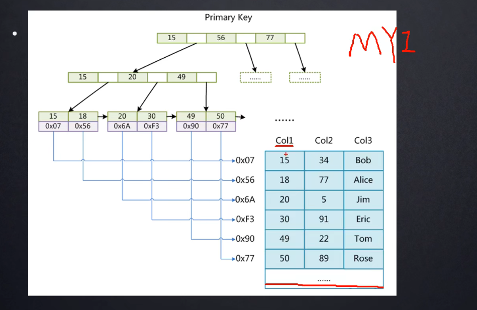

## 一、MySQL索引

### 1.1 索引定义

#### 1.1.1 引入：慢SQL查询的原因及优化手段

最先想到的优化手段是，检查sql语句是不是没有加索引，或者索引走的不对。用索引去优化sql语句，性能可以提升甚至几个数量级。

#### 1.1.2 索引定义

* **索引**是帮助MySQL高效获取数据的**排好序**的**数据结构**。

### 1.2 索引数据结构

* 索引数据结构
  * 二叉树
  * 红黑树
  * Hash表
  * B-Tree
  * B+Tree

#### 1.2.1 二叉树

上图为使用二叉树数据结构以Col2列为索引列建立的索引。

**为什么MySQL不使用二叉树作为索引数据结构？**

因为在数据有序的情况下，索引建立的二叉树会退化为链表，查找某个特定数据的复杂度退化为O(n)，索引的意义就不存在了。

> 数据结构可视化网址：
>
> https://www.cs.usfca.edu/~galles/visualization/Algorithms.html

#### 1.2.2 红黑树

红黑树是自平衡的二叉查找树。

**为什么MySQL不使用红黑树作为索引数据结构？**

当处理海量数据（例如百万或者千万数量级的数据）时，红黑树虽然具有自平衡的特点，可以比二叉树的高度降低一点点，但是海量数据情况下，树的高度仍然很高，查找数据的开销仍然很大。

#### 1.2.3 Hash

* 对索引的key进行一次hash计算就可以定位出数据存储的位置
* 很多时候Hash索引要比B+树高效

缺点：

* 仅能满足“=”,“IN”，不支持范围查询
* hash冲突问题，碰到hash冲突后需要遍历链表（链地址法解决冲突）
* 

#### 1.2.4 B树

B树是一种m叉多路平衡树，具有以下特点：

* 叶节点具有相同的深度，叶节点的指针为空。
* 所有索引元素不重复。
* 节点中的数据索引从左到右递增排列。

#### 1.2.5 B+树

B+树是B树的变种，具有以下特点：

* 非叶子结点不存储数据，只存储索引（冗余），可以存更多的索引。
* 叶子节点也包含所有索引字段。
* 叶子节点用指针连接，提高区间访问的性能。

**MySQL内部是使用B+树来作为索引的数据结构。**

**一个高度为3的B+树能存储多少数据？**

假设索引的数据类型为bigint，占8字节，而MySQL内部指针的实现是6字节，MySQL的一个节点大小为16KB（page size，可调节）。

则每个节点可以存放 16KB / (8 + 6)B = 1170 个索引，同理，第二层每个节点也可以存放1170个索引；而假设每个索引对应的数据是1KB，那么叶子节点可以存放 16KB / 1KB = 16条数据，则总共可以存放

1170 * 1170 * 16 = 2200万条数据。

因此，B+Tree是一种非常磁盘友好的数据结构，它可以使用很小的树的高度，就可以存储海量的数据。

**B+树在每一个节点要进行很多次比较操作，不也有很大的开销吗？**

事实上在进行数据比较之前，MySQL会将节点的数据加载到内存中，而在内存中的比较和一次磁盘IO的开销相比，几乎可以忽略不计。所以只要能够节省磁盘IO，就会带来很大的性能提升。

### 1.3 联合索引

在多个列上建立的索引叫做**联合索引**。对于联合索引的列，在查询时要遵循**最左前缀法则**，指的是查询的时候从联合索引的最左列开始并且不能跳过索引中的列。

**例子：**

对于上面三个查询，只有第一条是走索引的，因为第二和第三条都不符合联合索引的最左前缀法则。

#### 1.3.1 联合索引的B+Tree布局

按照索引列的顺序进行排序。

### 1.4 请讲述常用的索引有哪些种类？主键索引和非主键索引的区别？

根据叶子节点的内容，索引类型分为主键索引和非主键索引。

- 主键索引的叶子节点存的整行数据，在InnoDB里也被称为聚簇索引。
- 非主键索引叶子节点存的主键的值，在InnoDB里也被称为二级索引。

回答：

**普通索引**: 即针对数据库表创建索引

**唯一索引**: 与普通索引类似，不同的就是：MySQL 数据库索引列的值必须唯一，但允许有空值

**主键索引**: 它是一种特殊的唯一索引，不允许有空值。一般是在建表的时候同时创建主键索引

**组合索引**(联合索引): 为了进一步榨取 MySQL 的效率，就要考虑建立组合索引。

即将数据库表中的多个字段联合起来作为一个组合索引。

### 1.5 唯一和主键索引的区别，唯一与主与聚簇、非聚簇的关系？

**唯一索引 与 主键索引**

唯一索引是在表上一个或者多个字段组合建立的索引，这个（或这几个）字段的值组合起来在表中不可以重复。一张表可以建立任意多个唯一索引，但一般只建立一个。

主键是一种特殊的唯一索引，区别在于，唯一索引列允许null值，而主键列不允许为null值。一张表最多建立一个主键，也可以不建立主键。

**聚簇索引、非聚簇索引、主键**

在《数据库原理》一书中是这么解释聚簇索引和非聚簇索引的区别的：

**聚簇索引的叶子节点就是数据节点，而非聚簇索引的叶子节点仍然是索引节点，只不过有指向对应数据块的指针。**

**怎么理解呢？**

聚簇索引的顺序，就是数据在硬盘上的物理顺序。一般情况下主键就是默认的聚簇索引。

一张表只允许存在一个聚簇索引，因为真实数据的物理顺序只能有一种。如果一张表上还没有聚簇索引，为它新创建聚簇索引时，就需要对已有数据重新进行排序，所以对表进行修改速度较慢是聚簇索引的缺点，对于经常更新的列不宜建立聚簇索引。

聚簇索引性能最好，因为一旦具有第一个索引值的记录被找到，具有连续索引值的记录也一定物理地紧跟其后。一张表只能有一个聚簇索引，所以非常珍贵，必须慎重设置，一般要根据这个表最常用的SQL查询方式选择某个（或多个）字段作为聚簇索引（或复合聚簇索引）。

聚簇索引默认是主键，如果表中没有定义主键，InnoDB[1]会选择一个唯一的非空索引代替（“唯一的非空索引”是指列不能出现null值的唯一索引，跟主键性质一样）。如果没有这样的索引，InnoDB会隐式地定义一个主键来作为聚簇索引。

**聚簇索引 与 唯一索引**严格来说，聚簇索引不一定是唯一索引，聚簇索引的索引值并不要求是唯一的，唯一聚簇索引才是！在一个有聚簇索引的列上是可以插入两个或多个相同值的，这些相同值在硬盘上的物理排序与聚簇索引的排序相同，仅此而已。

### InnoDB存储引擎有哪些常见的索引？

回答：B+树索引、全文索引和哈希索引。

### MyISAM 和 InnoDB 实现 B 树索引方式的区别是什么？

- InnoDB 存储引擎：B+ 树索引的叶子节点保存数据本身，其数据文件本身就是索引文件。
- MyISAM 存储引擎：B+ 树索引的叶子节点保存数据的物理地址，叶节点的 data 域存放的是数据记录的地址，索引文件和数据文件是分离的。

### 说一下B+树与B树的区别？

- 1.B+树内节点不存储数据，所有 data 存储在叶节点导致查询时间复杂度固定为 log n。而B-树查询时间复杂度不固定，与 key 在树中的位置有关，最好为O(1)。
- 2.B+树叶节点两两相连可大大增加区间访问性，可使用在范围查询等，而B-树每个节点 key 和 data 在一起，则无法区间查找。
- 3.B+树更适合外部存储。由于内节点无 data 域，每个节点能索引的范围更大更精确

### 为什么MySQL数据库使用B+树不使用B树？

回答：当存储**同数量级**的数据的时候，B+树的高度比B树的**高度小**，这样的话进程**IO操作的次数就少**，效果就高。因为B+树的所有非叶子节点只存索引，数据存在叶子节点，一般3层的树高度，即可存千万级别的数据，而B数不行。(具体的计算可以到网上去看看，有面试官可能会问你怎么算出来的。）

### Hash 索引和 B+ 树索引区别是什么？你在设计索引是怎么抉择的？

- B+ 树可以进行范围查询，Hash 索引不能。
- B+ 树支持联合索引的最左侧原则，Hash 索引不支持。
- B+ 树支持 order by 排序，Hash 索引不支持。
- Hash 索引在等值查询上比 B+ 树效率更高。
- B+ 树使用 like 进行模糊查询的时候，like 后面（比如%开头）的话可以起到优化的作用，Hash 索引根本无法进行模糊查询。

### 索引的三种常见底层数据结构以及优缺点

三种常见的索引底层数据结构：分别是哈希表、有序数组和搜索树。

- 哈希表这种适用于等值查询的场景，比如 memcached 以及其它一些 NoSQL 引擎，不适合范围查询。
- 有序数组索引只适用于静态存储引擎，等值和范围查询性能好，但更新数据成本高。
- N 叉树由于读写上的性能优点以及适配磁盘访问模式以及广泛应用在数据库引擎中。
- 扩展（以 InnoDB 的一个整数字段索引为例，这个 N 差不多是 1200。棵树高是 4 的时候，就可以存 1200 的 3 次方个值，这已经 17 亿了。考虑到树根的数据块总是在内存中的，一个 10 亿行的表上一个整数字段的索引，查找一个值最多只需要访问 3 次磁盘。其实，树的第二层也有很大概率在内存中，那么访问磁盘的平均次数就更少了。）

### 如何选择在哪些列上建索引？

回答：一张表一般都要去建主键，所以**主键索引**几乎是每张表必备的，这个就不多说了。

**重复度低的列**。比如女子学校学生表中的性别列，所有数据的值都是女，这样的列就不适合建索引。比如学生表中的身份证号列，选择性就很高，就适合建索引。

**经常用于查询的列（出现在where条件中的列）**。不过如果不符合上一条的条件，即便是出现在where条件中也不适合建索引，甚至就不应该出现在where条件中。

**多表关联查询时作为关联条件的列**。比如学生表中有班级ID的列用于和班级表关联查询时作为关联条件，这个列就适合建索引。

**值会频繁变化的列不适合建索引。**因为在数据发生变化时是需要针对索引做一些处理的，所以如果不是有非常必要的原因，不要在值会频繁变化的列上建索引，会影响数据更新的性能。反过来也就是说索引要建在值比较固定不变的列上。

**一张表上不要建太多的索引。**和上一条的原因类似，如果一张表上的索引太多，会严重影响数据增删改的性能。也会耗费很大的磁盘空间。

### 索引的优点

- 索引的出现，就是为了提高数据查询的效率，就像书的目录一样。
- 对于数据库的表而言，索引其实就是它的“目录”。

### 索引的缺点

- 第一，创建索引和维护索引要耗费时间，这种时间随着数据量的增加而增加。
- 第二，索引需要占物理空间，除了数据表占数据空间之外，每一个索引还要占一定的物理空间，如果要建立聚簇索引，那么需要的空间就会更大。
- 第三，当对表中的数据进行增加、删除和修改的时候，索引也要动态的维护，这样就降低了数据的维护速度。

### 哪些列不该建索引？

- 第一，**对于那些在查询中很少使用或者参考的列不应该创建索引**。这是因为，既然这些列很少使用到，因此有索引或者无索引，并不能提高查询速度。相反，由于增加了索引，反而降低了系统的维护速度和增大了空间需求。
- 第二，**对于那些只有很少数据值的列也不应该增加索引**。这是因为，由于这些列的取值很少，例如人事表的性别列，在查询的结果中，结果集的数据行占了表中数据行的很大比例，即需要在表中搜索的数据行的比例很大。增加索引，并不能明显加快检索速度。
- 第三，**对于那些定义为`text`, `image` 和 `bit` 数据类型的列不应该增加索引**。这是因为，这些列的数据量要么相当大，要么取值很少。
- 第四，**当修改性能远远大于检索性能时，不应该创建索引**。这是因为，**修改性能和检索性能是互相矛盾的**。当增加索引时，会提高检索性能，但是会降低修改性能。当减少索引时，会提高修改性能，降低检索性能。因此，当修改性能远远大于检索性能时，不应该创建索引。

### 哪些操作会导致索引失效？

- 对索引使用左或者左右模糊匹配，也就是 like %xx 或者 like %xx% 这两种方式都会造成索引失效。原因在于查询的结果可能是多个，不知道从哪个索引值开始比较，于是就只能通过全表扫描的方式来查询。
- 对索引进行函数/对索引进行表达式计算，因为索引保持的是索引字段的原始值，而不是经过函数计算的值，自然就没办法走索引。
- 对索引进行隐式转换相当于使用了新函数。
- WHERE 子句中的 OR语句，只要有条件列不是索引列，就会进行全表扫描。

### 什么是最左匹配原则？

最左前缀匹配原则和联合索引的**索引存储结构和检索方式**是有关系的。

在组合索引树中，最底层的叶子节点按照第一列a列从左到右递增排列，但是b列和c列是无序的，b列只有在a列值相等的情况下小范围内递增有序，而c列只能在a，b两列相等的情况下小范围内递增有序。

就像上面的查询，B+树会先比较a列来确定下一步应该搜索的方向，往左还是往右。如果a列相同再比较b列。但是如果查询条件没有a列，B+树就不知道第一步应该从哪个节点查起。

可以说创建的idx_abc(a,b,c)索引，相当于创建了(a)、（a,b）（a,b,c）三个索引。、

**组合索引的最左前缀匹配原则：使用组合索引查询时，mysql会一直向右匹配直至遇到范围查询(>、<、between、like)就停止匹配。**

### 说一下覆盖索引和索引下推？

覆盖索引并不是说是索引结构，覆盖索引是一种很常用的优化手段。因为在使用辅助索引的时候，我们只可以拿到主键值，相当于获取数据还需要再根据主键查询主键索引再获取到数据。但是试想下这么一种情况，在上面abc_innodb表中的组合索引查询时，如果我只需要abc字段的，那是不是意味着我们查询到组合索引的叶子节点就可以直接返回了，而不需要回表。这种情况就是覆盖索引。

**举例子：**

假设我们只需要查询商品的名称、价格信息，我们有什么方式来避免**回表呢**？我们可以建立一个组合索引，即商品编码、名称、价格作为一个组合索引。如果索引中存在这些数据，查询将不会再次检索主键索引，从而避免回表。

从辅助索引中查询得到记录，而不需要通过聚族索引查询获得，MySQL 中将其称为覆盖索引。使用覆盖索引的好处很明显，我们不需要查询出包含整行记录的所有信息，因此可以减少大量的 I/O 操作。

通常在 InnoDB 中，除了查询部分字段可以使用覆盖索引来优化查询性能之外，统计数量也会用到。例如， SELECT COUNT(*) 时，如果不存在辅助索引，此时会

通过查询聚族索引来统计行数，如果此时正好存在一个辅助索引，则会通过查询辅助索引来统计行数，减少 I/O 操作。

覆盖索引：

- 在某个查询里面，索引 k 已经“覆盖了”我们的查询需求，称为覆盖索引。
- 覆盖索引可以减少树的搜索次数，显著提升查询性能，所以使用覆盖索引是一个常用的性能优化手段。

索引下推：

- MySQL 5.6 引入的索引下推优化（index condition pushdown)， 可以在索引遍历过程中，对索引中包含的字段先做判断，直接过滤掉不满足条件的记录，减少回表次数。

## 二、MySQL存储引擎

MySQL常见的存储引擎就是MyISAM存储引擎和InnoDB存储引擎，这些存储引擎都是**表级别**的，是在数据库建表的时候在指定的。

MyISAM发音 [mai sam]

InnoDB发音 [inno db]

### 2.1 MyISAM存储引擎

#### 2.1.1 MyISAM存储引擎索引实现

* MyISAM的索引文件和数据文件是分离的（非聚集）

  这个特性可以从MyISAM存储引擎的数据文件分布中略窥一二。

* 使用MyISAM存储引擎的索引需要二步操作，先从主键索引找到数据地址，然后再从磁盘中找数据。

### 2.2 InnoDB存储引擎

InnoDB存储引擎相比MyISAM存储引擎多了很多新的特性，比如事务的支持，所以实际工作中多数用的是InnoDB的存储引擎。

#### 2.2.1 InnoDB存储引擎索引实现

* 表数据文件本身就是按照B+Tree组织的一个索引结构文件。
* 聚集索引--叶节点包含了完整的数据记录。
* InnoDB引擎的主键索引实际上就是整张表，包含数据。

### 为什么建议InnoDB表必须建主键，并且推荐使用整型的自增主键？

因为如果用户不建主键的话，MySQL会帮你建一个主键索引。首先，MySQL会从第一列开始逐列查找一个唯一索引（即数据不重复），若找到，则以该列建主键索引，若没有找到，则MySQL自己会新建一列（用户不可见），该列可以认为就是存储的rowid，并以该列建主键索引。所以，与其让MySQL自己去维护这样一列，不如用户自己指定一列建主键索引，这样可以减少MySQL维护这个新增列的开销。

推荐使用整型的自增主键是因为，自增可以保证唯一性，而整型是因为整型数据类型的比较开销比较小，因为索引是一个B+树，肯定会有多次比较，而使用其他数据类型，比如string类型，则要逐位进行比较，比较的开销肯定是要比整型大的。

### 为什么 MySQL 自增主键 ID 不连续？

- 唯一键冲突
- 事务回滚
- 自增主键的批量申请
- 深层次原因是：MySQL 不判断自增主键是否存在，从而减少加锁的时间范围和粒度，这样能保持更高的性能，确保自增主键不能回退，所以才有自增主键不连续。
- 自增主键怎么做到唯一性？自增值加1来通过自增锁控制并发。

### MySQL 有哪些自增ID？各自场景是什么？

- 表的自增 ID 达到上限之后，在申请值不会变化，进而导致联系插入数据的时候报主键冲突错误。
- row_id 达到上限之后，归 0 在重新递增，如果出现相同的 row_id 后写的数据会覆盖之前的数据。
- Xid 只需要不在同一个 binlog 文件出现重复值即可，理论上会出现重复值，但概率极小可忽略不计。
- InnoDB 的 max_trx_id 递增值每次 MySQL 重启会保存起来。
- Xid 是由 server 层维护的。InnoDB 内部使用 Xid，就是为了能够在 InnoDB 事务和 server 之间做关联。但是，InnoDB 自己的 trx_id，是另外维护的。
- thread_id 是我们使用中最常见的，而且也是处理得最好的一个自增 id 逻辑了。使用了insert_unique算法

### Xid 在 MySQL 内部是怎么生成的呢？

MySQL 内部维护了一个全局变量 global_query_id，每次执行语句（包括select语句）的时候将它赋值给 Query_id，然后给这个变量加 1。如果当前语句是这个事务执行的第一条语句，那么 MySQL 还会同时把 Query_id 赋值给这个事务的 Xid。

而 global_query_id 是一个纯内存变量，重启之后就清零了。所以你就知道了，在同一个数据库实例中，不同事务的 Xid 也是有可能相同的。但是 MySQL 重启之后会重新生成新的 binlog 文件，这就保证了，同一个 binlog 文件里，Xid 一定是惟一的。

### 为什么非主键索引结构叶子节点存储的是主键值？

为了保证一致性和节省存储空间。

因为非主键索引不能保证唯一性，可能存在数据重复，所以为了区分数据要存储主键值，在使用二级索引（非主键索引）查找数据的时候，最终找到的是主键值，然后再用拿到的主键值，到主键索引中直接就可以拿到数据（因为主键索引就是整张表）。

### MySQL 存储引擎介绍（InnoDB、MyISAM、MEMORY）

- InnoDB 是事务型数据库的首选引擎，支持事务安全表 (ACID)，支持行锁定和外键。MySQL5.5.5 之后，InnoDB 作为默认存储引擎
- MyISAM 基于 ISAM 的存储引擎，并对其进行扩展。它是在 Web、数据存储和其他应用环境下最常用的存储引擎之一。MyISAM 拥有较高的插入、查询速度，但不支持事务。在 MySQL5.5.5 之前的版本中，MyISAM 是默认存储引擎
- MEMORY 存储引擎将表中的数据存储到内存中，为查询和引用其他表数据提供快速访问。

### 都说 InnoDB 好，那还要不要使用 MEMORY 引擎？

- 内存表就是使用 memory 引擎创建的表
- 为什么我不建议你在生产环境上使用内存表。这里的原因主要包括两个方面：锁粒度问题；数据持久化问题。
- 由于重启会丢数据，如果一个备库重启，会导致主备同步线程停止；如果主库跟这个备库是双 M 架构，还可能导致主库的内存表数据被删掉。