# MySQL-Postgres学习笔记

**注意MySQL和Postgres的很多功能的实现是不一样**


## 三、MySQL事务

### 3.1 什么是事务？

事务是数据库区别于文件系统的重要特性之一，事务可以一条非常简单的SQL语句组成，也可以由一组复杂的SQL语句组成，事务是访问并更新数据库中各种数据项的一个程序执行单元。在事务中的操作，**要么都做修改，要么都不做**，这就是事务的主要目的。


### 3.2 事务的特性有哪些？分别是怎么保证的？

回答：事务的四大特性分别是原子性、一致性、隔离性和持久性(ACID)。

* 原子性（Atomicity）：事务必须以一个整体单元的形式进行工作，对于数据的修改，要么全都执行，要么全不执行。如果只执行事务中多个操作的前半部分就出现错误，那么必须回滚所有的操作，让数据在逻辑上回滚到原先的状态。

* 一致性（Consistency）：在事务完成时，必须使所有的数据都保持在一致状态。

  一致性是指在事务开始之前和事务结束以后，数据库的完整性约束没有被破坏，即数据库事务不能破坏关系数据的完整性及业务逻辑上的一致性。一致性是事务追求的最终目标，前问所诉的原子性、持久性和隔离性，其实都是为了保证数据库状态的一致性。
  当然，上文都是数据库层面的保障，一致性的实现也需要应用层面进行保障。
  也就是你的业务，比如购买操作只扣除用户的余额，不减库存，肯定无法保证状态的一致。

* 隔离性（Isolation）：事务查看数据时所处的状态，要么是另一并发事务修改它之前的状态，要么是另一事务修改它之后的状态，事务是不会查看中间状态的数据的。

* 持久性（Durability）：事务完成之后，它对于系统的影响是永久性的。即使今后出现致命的系统故障（如机器重启、断电），数据也将一直保持。


### 	MySQL 的 change buffer 是什么？

- 当需要更新一个数据页时，如果数据页在内存中就直接更新；而如果这个数据页还没有在内存中的话，在不影响数据一致性的前提下，InnoDB 会将这些更新操作缓存在 change buffer 中。

- 这样就不需要从磁盘中读入这个数据页了，在下次查询需要访问这个数据页的时候，将数据页读入内存，然后执行 change buffer 中与这个页有关的操作。通过这种方式就能保证这个数据逻辑的正确性。

- 注意唯一索引的更新就不能使用 change buffer，实际上也只有普通索引可以使用。

- 适用场景：

  \- 对于写多读少的业务来说，页面在写完以后马上被访问到的概率比较小，此时 change buffer 的使用效果最好。这种业务模型常见的就是账单类、日志类的系统。

- \- 反过来，假设一个业务的更新模式是写入之后马上会做查询，那么即使满足了条件，将更新先记录在 change buffer，但之后由于马上要访问这个数据页，会立即触发 merge 过程。这样随机访问 IO 的次数不会减少，反而增加了 change buffer 的维护代价。


### 3.3 redo log、undo log和bin log

**redo log**是InnoDB引擎层面的物理格式日志，记录的是对于每个页的修改。

**undo log**是记录的每个操作的反向操作，用于回滚记录到某个特定版本，通常是逻辑日志。

**bin log**是记录的全量日志，是在mysql数据库上层产生的二进制日志。


下面这段话摘自《MySQL技术内幕-InnoDB存储引擎》

原子性、一致性和持久性是通过数据库的redo log和undo log来完成。redo log称为重做日志，用来保证事务的原子性和持久性。undo log用来保证事务的一致性。而隔离性是通过锁实现的。【具体大家看书吧，书上比较详细。】

**面试官可能会问三种日志的区别和作用。**

redo log：恢复提交事务修改的页操作；通常是物理日志，记录的是页的物理修改操作。

uodo log：回滚记录到某个特定版本，记录的是每个语句的反向操作；通常是逻辑日志，根据每行记录进行记录。

bin log：用来进行Point-In-Time(PIT)的恢复及主从复制环境的建立。

**这里面试官可能会接着问binlog和redolog的区别？**

回答：

（1）重做日志是在InnoDB存储引擎层产生的，而二进制日志是在MySQL数据库上层产生的，二进制日志不仅仅针对InnoDB存储引擎，任何存储引擎都会产生二进制日志。

（2）两种日志的记录内容形式不同。二进制日志是一种逻辑日志，记录的是SQL语句；而InnoDB存储引擎层面的重做日志是物理格式日志，记录的是对于每个页的修改。

（3）写入磁盘的时间不同，二进制日志只在事务提交完成后进行一次写入，而redo log在事务进行中不断的写入。

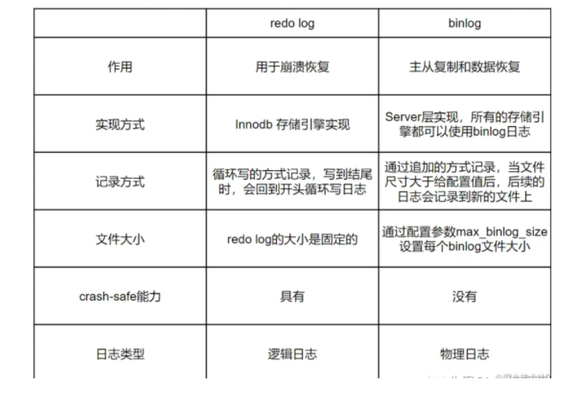


### 为什么需要 redo log？

- redo log 主要用于 MySQL 异常重启后的一种数据恢复手段，确保了数据的一致性。
- 其实是为了配合 MySQL 的 WAL 机制。因为 MySQL 进行更新操作，为了能够快速响应，所以采用了异步写回磁盘的技术，写入内存后就返回。但是这样，会存在 **crash后** 内存数据丢失的隐患，而 redo log 具备 crash safe 的能力。


### 为什么 redo log 具有 crash-safe 的能力，是 binlog 无法替代的？

第一点：redo log 可确保 innoDB 判断哪些数据已经刷盘，哪些数据还没有

- redo log 和 binlog 有一个很大的区别就是，一个是循环写，一个是追加写。也就是说 redo log 只会记录未刷盘的日志，已经刷入磁盘的数据都会从 redo log 这个有限大小的日志文件里删除。binlog 是追加日志，保存的是全量的日志。
- 当数据库 crash 后，想要恢复**未刷盘但已经写入 redo log 和 binlog 的数据**到内存时，binlog 是无法恢复的。虽然 binlog 拥有全量的日志，但没有一个标志让 innoDB 判断哪些数据已经刷盘，哪些数据还没有。
- 但 redo log 不一样，只要刷入磁盘的数据，都会从 redo log 中抹掉，因为是循环写！数据库重启后，直接把 redo log 中的数据都恢复至内存就可以了。

第二点：如果 redo log 写入失败，说明此次操作失败，事务也不可能提交

- redo log 每次更新操作完成后，就一定会写入日志，如果**写入失败**，说明此次操作失败，事务也不可能提交。
- redo log 内部结构是基于页的，记录了这个页的字段值变化，只要crash后读取redo log进行重放，就可以恢复数据。
- 这就是为什么 redo log 具有 crash-safe 的能力，而 binlog 不具备。


### redo log 写入方式？

redo log包括两部分内容，分别是内存中的**日志缓冲**(redo log buffer)和磁盘上的**日志文件**(redo log file)。

MySQL 每执行一条 DML 语句，会先把记录写入 **redo log buffer（用户空间）** ，再保存到内核空间的缓冲区 OS-buffer 中，后续某个时间点再一次性将多个操作记录写到 **redo log file（刷盘）** 。这种先写日志，再写磁盘的技术，就是**WAL**。

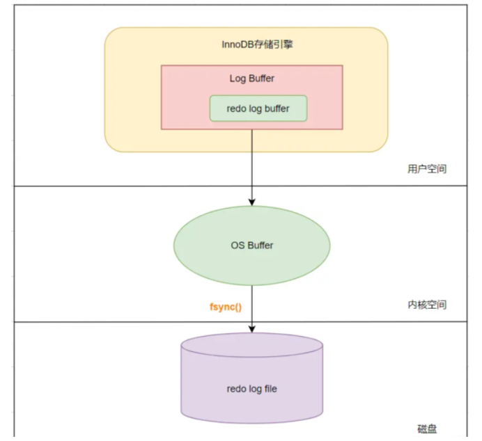

可以发现，redo log buffer写入到redo log file，是经过OS buffer中转的。其实可以通过参数innodb_flush_log_at_trx_commit进行配置，参数值含义如下：

- 0：称为**延迟写**，事务提交时不会将redo log buffer中日志写入到OS buffer，而是每秒写入OS buffer并调用写入到redo log file中。
- 1：称为**实时写**，实时刷”，事务每次提交都会将redo log buffer中的日志写入OS buffer并保存到redo log file中。
- 2：称为**实时写，延迟刷**。每次事务提交写入到OS buffer，然后是每秒将日志写入到redo log file。


### redo log 的执行流程?

我们来看下Redo log的执行流程，假设执行的 SQL 如下：

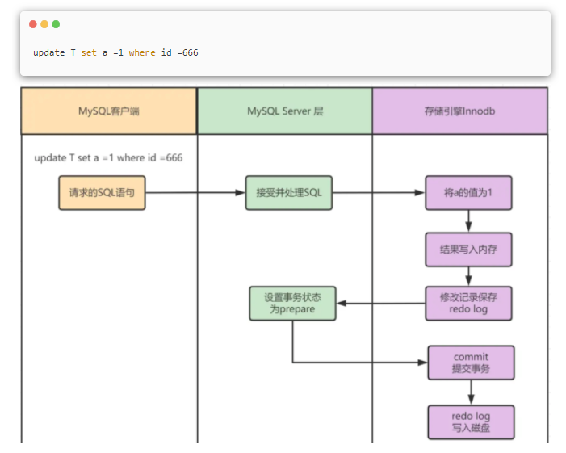

1. MySQL 客户端将请求语句 update T set a =1 where id =666，发往 MySQL Server 层。
2. MySQL Server 层接收到 SQL 请求后，对其进行分析、优化、执行等处理工作，将生成的 SQL 执行计划发到 InnoDB 存储引擎层执行。
3. InnoDB 存储引擎层将**a修改为1**的这个操作记录到内存中。
4. 记录到内存以后会修改 redo log 的记录，会在添加一行记录，其内容是**需要在哪个数据页上做什么修改**。
5. 此后，将事务的状态设置为 prepare ，说明已经准备好提交事务了。
6. 等到 MySQL Server 层处理完事务以后，会将事务的状态设置为 **commit**，也就是提交该事务。
7. 在收到事务提交的请求以后，**redo log** 会把刚才写入内存中的操作记录写入到磁盘中，从而完成整个日志的记录过程。


### binlog 的概念是什么，起到什么作用， 可以保证 crash-safe 吗?

- binlog 是归档日志，属于 MySQL Server 层的日志。可以实现**主从复制**和**数据恢复**两个作用。
- 当需要**恢复数据**时，可以取出某个时间范围内的 binlog 进行重放恢复。
- 但是 binlog 不可以做 crash safe，因为 crash 之前，binlog **可能没有写入完全** MySQL 就挂了。所以需要配合 **redo log** 才可以进行 crash safe。


### 什么是两阶段提交（MySQL）？

MySQL 将 redo log 的写入拆成了两个步骤：prepare 和 commit，中间再穿插写入binlog，这就是"两阶段提交"。

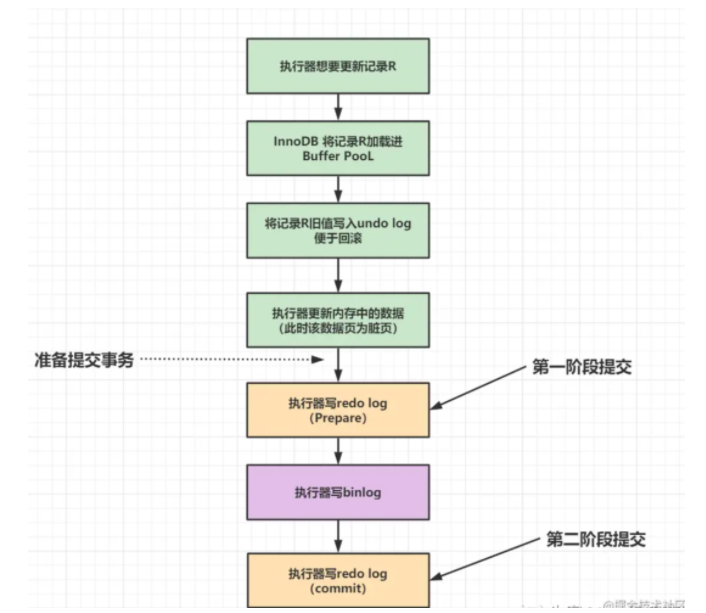

而两阶段提交就是让这两个状态保持逻辑上的一致。redolog 用于恢复主机故障时的未更新的物理数据，binlog 用于备份操作。两者本身就是两个独立的个体，要想保持一致，就必须使用分布式事务的解决方案来处理。

**为什么需要两阶段提交呢?**

- 如果不用两阶段提交的话，可能会出现这样情况
- 先写 redo log，crash 后 bin log 备份恢复时少了一次更新，与当前数据不一致。
- 先写 bin log，crash 后，由于 redo log 没写入，事务无效，所以后续 bin log 备份恢复时，数据不一致。
- 两阶段提交就是为了保证 redo log 和 binlog 数据的安全一致性。只有在这两个日志文件逻辑上高度一致了才能放心的使用。

在恢复数据时，redolog 状态为 commit 则说明 binlog 也成功，直接恢复数据；如果 redolog 是 prepare，则需要查询对应的 binlog事务是否成功，决定是回滚还是执行。


### MySQL 怎么知道 binlog 是完整的?

一个事务的 binlog 是有完整格式的：

- statement 格式的 binlog，最后会有 COMMIT；
- row 格式的 binlog，最后会有一个 XID event。


### binlog 日志的三种格式

binlog 日志有三种格式

- Statement：基于SQL语句的复制((statement-based replication,SBR))
- Row：基于行的复制。(row-based replication,RBR)
- Mixed：混合模式复制。(mixed-based replication,MBR)

**Statement格式**

每一条会修改数据的 SQL 都会记录在 binlog 中

- 优点：不需要记录每一行的变化，减少了binlog日志量，节约了IO，提高性能。
- 缺点：由于记录的只是执行语句，为了这些语句能在备库上正确运行，还必须记录每条语句在执行的时候的一些相关信息，以保证所有语句能在备库得到和在主库端执行时候相同的结果。

**Row格式**

不记录 SQL 语句上下文相关信息，仅保存哪条记录被修改。

- 优点：binlog 中可以不记录执行的 SQL 语句的上下文相关的信息，仅需要记录那一条记录被修改成什么了。所以rowlevel的日志内容会非常清楚的记录下每一行数据修改的细节。不会出现某些特定情况下的存储过程、或 function、或trigger的调用和触发无法被正确复制的问题。
- 缺点:可能会产生大量的日志内容。

**Mixed格式**

实际上就是 Statement 与 Row 的结合。一般的语句修改使用 statment 格式保存 binlog，如一些函数，statement 无法完成主从复制的操作，则采用 row 格式保存 binlog，MySQL 会根据执行的每一条具体的 SQL 语句来区分对待记录的日志形式。


### redo log日志格式

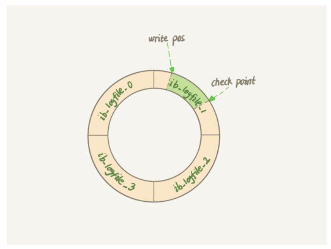

redo log buffer (内存中)是由首尾相连的四个文件组成的，它们分别是：ib_logfile_1、ib_logfile_2、ib_logfile_3、ib_logfile_4。

- write pos 是当前记录的位置，一边写一边后移，写到第 3 号文件末尾后就回到 0 号文件开头。
- checkpoint 是当前要擦除的位置，也是往后推移并且循环的，擦除记录前要把记录更新到数据文件。
- write pos 和 checkpoint 之间的是“粉板”上还空着的部分，可以用来记录新的操作。
- 如果 write pos 追上 checkpoint，表示“粉板”满了，这时候不能再执行新的更新，得停下来先擦掉一些记录，把 checkpoint 推进一下。
- 有了 redo log，当数据库发生宕机重启后，可通过 redo log将未落盘的数据（check point之后的数据）恢复，保证已经提交的事务记录不会丢失，这种能力称为**crash-safe**。


### MySQL 是如何保证数据不丢失的？

- 只要redolog 和 binlog 保证持久化磁盘就能确保MySQL异常重启后回复数据
- 在恢复数据时，redolog 状态为 commit 则说明 binlog 也成功，直接恢复数据；如果 redolog 是 prepare，则需要查询对应的 binlog事务是否成功，决定是回滚还是执行。


### 3.3 详解InnoDB redo log

前段时间我在准备暑期实习嘛，这是当时面携程的时候二面的一道问题，我一脸懵逼，赶紧道歉，不好意思不知道没了解过，面试官又解释说 redo log，我寻思着 redo log 我知道啊，WAL 是啥？给面试官整无语了（滑稽），为我当时的无知道歉。后来回去百度了一下才知道，最近又在丁奇大佬的《MySQL 实战 45 讲》 中看到了 WAL，遂来写篇文章总结下。

#### 3.3.1 InnoDB 体系架构

在说 WAL 之前，有必要简单介绍下 InnoDB 存储引擎的体系架构，方便我们理解下文，并且 **redo log 也是 InnoDB 存储引擎所特有的**。

如下图，InnoDB 存储引擎由**内存池**和一些**后台线程**组成：

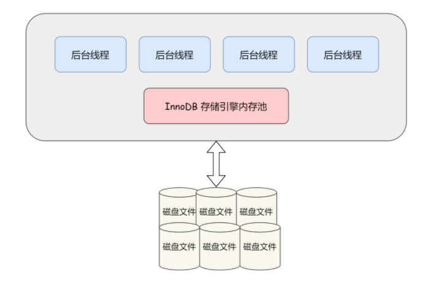


**内存池**

先来解释下内存池。

首先，我们需要知道，InnoDB 存储引擎是基于磁盘存储的，并将其中的记录按照**页**的方式进行管理。因此可将其视为**基于磁盘的数据库系统**（Disk-base Database），在这样的系统中，众所周知，由于 CPU 速度与磁盘速度之间的不匹配，通常会使用**缓冲池**技术来提高数据库的整体性能。

所以这里的内存池也被称为缓冲池（简单理解为缓存就好了）。

具体来说，缓冲池其实就是一块内存区域，在 CPU 与磁盘之间加入内存访问，通过内存的速度来弥补磁盘速度较慢对数据库性能的影响。

拥有了缓冲池后，“读取页” 操作的具体步骤就是这样的：

- 首先将从磁盘读到的页存放在缓冲池中
- 下一次再读相同的页时，首先判断该页是否在缓冲池中。若在缓冲池中，称该页在缓冲池中被命中，直接读取该页。否则，读取磁盘上的页。

“修改页” 操作的具体步骤就是这样的：

- 首先修改在缓冲池中的页；然后再以一定的频率刷新到磁盘上。

所谓 ”**脏页**“ 就发生在修改这个操作中，如果缓冲池中的页已经被修改了，但是还没有刷新到磁盘上，那么我们就称缓冲池中的这页是 ”脏页“，即缓冲池中的页的版本要比磁盘的新。

至此，综上所述，我们可以得出这样的结论：**缓冲池的大小直接影响着数据库的整体性能**。


**后台线程**

后台线程其实最大的作用就是用来完成 “将从磁盘读到的页存放在缓冲池中” 以及 “将缓冲池中的数据以一定的频率刷新到磁盘上” 这俩个操作的，当然了，还有其他的作用。以下是《MySQL 技术内幕：InnoDB 存储引擎 - 第 2 版》对于后台线程的描述：

> 后台线程的主要作用就是刷新内存池中的数据，保证内存池中缓存的是最近的数据；此外将已修改的数据文件刷新到磁盘文件，同时保证在数据库发生异常的情况下 InnoDB 能恢复到正常运行状态。

另外，**InnoDB 存储引擎是多线程的模型**，也就是说它拥有多个不同的后台线程，负责处理不同的任务。这里简单列举下几种不同的后台线程：

- **Master Thread**：主要负责将缓冲池中的数据异步刷新到磁盘，保证数据的一致性
- **IO Thread**：在 InnoDB 存储引擎中大量使用了 AIO（Async IO）来处理写 IO 请求，这样可以极大提高数据库的性能。IO Thread 的工作主要是负责这些 IO 请求的回调（call back）处理
- **Purge Thread**：回收已经使用并分配的 undo 页
- **Page Cleaner Thread**：将之前版本中脏页的刷新操作都放入到单独的线程中来完成。其目的是为了减轻原 Master Thread 的工作及对于用户查询线程的阻塞，进一步提高 InnoDB 存储引擎的性能


#### 3.3.2 redo log 与 WAL 策略

上文我们提到，当缓冲池中的某页数据被修改后，该页就被标记为 ”脏页“，脏页的数据会被定期刷新到磁盘上。

倘若每次一个页发生变化，就将新页的版本刷新到磁盘，那么这个开销是非常大的。并且，如果热点数据都集中在某几个页中，那么数据库的性能将变得非常差。另外，如果在从缓冲池将页的新版本刷新到磁盘时发生了宕机，那么这个数据就不能恢复了。

所以，为了避免发生数据丢失的问题，当前事务数据库系统（并非 MySQL 所独有）普遍都采用了 WAL（`Write Ahead Log`，**预写日志**）策略：即**当事务提交时，先写重做日志（redo log），再修改页（先修改缓冲池，再刷新到磁盘）；当由于发生宕机而导致数据丢失时，通过 redo log 来完成数据的恢复**。这也是事务 ACID 中 D（Durability 持久性）的要求。

有了 redo log，InnoDB 就可以保证即使数据库发生异常重启，之前提交的记录都不会丢失，这个能力称为 **crash-safe**。

举个简单的例子，假设你非常热心且 rich 的，借出去了很多钱，但是你非常 old school，不会使用电子设备并且记性不太好，所以你用一个小本本记下了所有欠你钱的人的名字和具体金额。这样，别人还你钱的时候，你就翻出你的小本本，一页页地找到他的名字然后把这次还的钱扣除掉。

但是呢，其实你平常是非常忙碌的，没办法随时随地翻小本本做记录，因此你就想出了一个主意：每当有人还你钱的时候，你就在一张白纸上记下来，然后挑个时间对照小本本把白纸上的账目都给清了。

这就是 WAL。白纸就是 redo log，小本本就是磁盘。

当然了，redo log 可不是白纸这么简单，一张用完了换一张就行了，这里有必要详细解释下。

每个 InnoDB 存储引擎**至少**有 1 个重做日志文件组（ redo log group），每个文件组下至少有 2 个重做日志文件（redo log file），默认的话是一个 redo log group，其中包含 2 个 redo log file：`ib_logfile0` 和 `ib_logfile1` 。

一般来说，为了得到更高的可靠性，用户可以设置多个镜像日志组（mirrored log groups），将不同的文件组放在不同的磁盘上，以此提高 redo log 的高可用性。在日志组中每个 redo log file 的大小一致，并以**循环写入**的方式运行。

所谓循环写入，也就是为啥我们说 redo log 不像白纸那样用完一张换一张就行，举个例子，如下图，一个 redo log group，包含 3 个 redo log file：

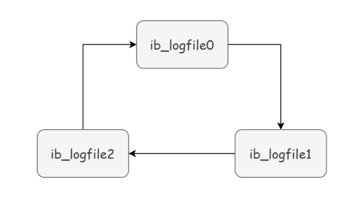

InnoDB 存储引擎会先写 redo log file 0，当 file 0 被写满的时候，会切换至 redo log file 1，当 file 1 也被写满时，会切换到 redo log file 2 中，而当 file 2 也被写满时，会再切换到  file 0 中。

可以看出，redo log file 的大小设置对于 InnoDB 存储引擎的性能有着非常大的影响：

- redo log file 不能设置得太大，如果设置得很大，在恢复时可能需要很长的时间
- redo log file 又不能设置得太小了，否则可能导致一个事务的日志需要多次切换重做日志文件


#### 3.3.3 CheckPoint 技术

有了 redo log 就可以高枕无忧了吗？显然不是这么简单，我们仍然面临这样 3 个问题：

1）缓冲池不是无限大的，也就是说不能没完没了的存储我们的数据等待一起刷新到磁盘

2）redo log 是循环使用而不是无限大的（也许可以，但是成本太高，同时不便于运维），那么当所有的 redo log file 都写满了怎么办？

3）当数据库运行了几个月甚至几年时，这时如果发生宕机，重新应用 redo log 的时间会非常久，此时恢复的代价将会非常大。

因此 Checkpoint 技术的目的就是解决上述问题：

- 缓冲池不够用时，将脏页刷新到磁盘
- redo log 不可用时，将脏页刷新到磁盘
- 缩短数据库的恢复时间

所谓 CheckPoint 技术简单来说其实就是在 redo log file 中找到一个位置，将这个位置前的页都刷新到磁盘中去，这个位置就称为 CheckPoint（检查点）。

针对上面这三点我们依次来解释下：

1）**缩短数据库的恢复时间**：当数据库发生宕机时，数据库不需要重做所有的日志，因为 Checkpoint 之前的页都已经刷新回磁盘。故数据库只需对 Checkpoint 后的 redo log 进行恢复就行了。这显然大大缩短了恢复的时间。

2）**缓冲池不够用时，将脏页刷新到磁盘**：所谓缓冲池不够用的意思就是缓冲池的空间无法存放新读取到的页，这个时候 InnoDB 引擎会怎么办呢？LRU 算法。InnoDB 存储引擎对传统的 LRU 算法做了一些优化，用其来管理缓冲池这块空间。

总的思路还是传统 LRU 那套，具体的优化细节这里就不再赘述了：即最频繁使用的页在 LRU 列表（LRU List）的前端，最少使用的页在 LRU 列表的尾端；当缓冲池的空间无法存放新读取到的页时，将首先释放 LRU 列表中尾端的页。这个被释放出来（溢出）的页，如果是脏页，那么就需要强制执行 CheckPoint，将脏页刷新到磁盘中去。

3）**redo log 不可用时，将脏页刷新到磁盘**：

所谓 redo log 不可用就是所有的 redo log file 都写满了。但事实上，其实 redo log 中的数据并不是时时刻刻都是有用的，那些已经不再需要的部分就称为 ”可以被重用的部分“，即当数据库发生宕机时，数据库恢复操作不需要这部分的 redo log，因此这部分就可以被覆盖重用（或者说被擦除）。

举个例子来具体解释下：一组 4 个文件，每个文件的大小是 1GB，那么总共就有 4GB 的 redo log file 空间。write pos 是当前 redo log 记录的位置，随着不断地写入磁盘，write pos 也不断地往后移，就像我们上文说的，写到 file 3 末尾后就回到 file 0 开头。CheckPoint 是当前要擦除的位置（将 Checkpoint 之前的页刷新回磁盘），也是往后推移并且循环的：

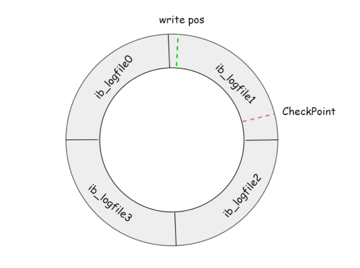

**write pos 和 CheckPoint 之间的就是 redo log file 上还空着的部分，可以用来记录新的操作**。如果 write pos 追上 CheckPoint，就表示 redo log file 满了，这时候不能再执行新的更新，得停下来先覆盖（擦掉）一些 redo log，把 CheckPoint 推进一下。


综上所述，Checkpoint 所做的事情无外乎是将缓冲池中的脏页刷新到磁盘。不同之处在于每次刷新多少页到磁盘，每次从哪里取脏页，以及什么时间触发 Checkpoint。在 InnoDB 存储引擎内部，有两种 Checkpoint，分别为：

- **Sharp Checkpoint**：发生在数据库关闭时将所有的脏页都刷新回磁盘，这是默认的工作方式，参数 `innodb_fast_shutdown=1`
- **Fuzzy Checkpoin**：InnoDB 存储引擎内部使用这种模式，只刷新一部分脏页，而不是刷新所有的脏页回磁盘。关于 Fuzzy CheckPoint 具体的情况这里就不再赘述了。


#### 3.3.4 有了 bin log 为什么还需要 redo log？

前文我们讲过，MySQL 架构可以分成俩层，一层是 Server 层，它主要做的是 MySQL 功能层面的事情；另一层就是存储引擎，负责存储与提取相关的具体事宜。

redo log 是 InnoDB 引擎特有的日志，而 Server 层也有自己的日志，包括错误日志（error log）、二进制日志（binlog）、慢查询日志（slow query log）、查询日志（log）。

其他三个日志顾明思意都挺好理解的，需要解释的就是 binlog（二进制日志，binary log），它记录了对 MySQL 数据库执行更改的所有操作，但是不包括 `SELECT` 和 `SHOW` 这类操作，因为这类操作对数据本身并没有修改。也就是说，binlog 是**逻辑日志**，记录的是这个语句的原始逻辑，比如 “给 ID=1 这一行的 a 字段加 1”。

可以看出来，binlog 日志只能用于归档，因此 binlog 也被称为**归档日志**，显然如果 MySQL 只依靠 binlog 等这四种日志是没有 crash-safe 能力的，所以为了弥补这种先天的不足，得益于 MySQL 可插拔的存储引擎架构，InnoDB 开发了另外一套日志系统 — 也就是 redo log 来实现 crash-safe 能力。

这就是为什么有了 bin log 为什么还需要 redo log 的答案。

回顾下 redo log 存储的东西，可以发现 redo log 是**物理日志**，记录的是 “在某个数据页上做了什么修改”。

另外，还有一点不同的是：binlog 是追加写入的，就是说 binlog 文件写到一定大小后会切换到下一个，并不会覆盖以前的日志；而 redo log 是循环写入的。


### 3.4 事务的隔离级别有哪些？

回答：首先回答一些数据库中**并发事务带来的问题**

1.数据丢失

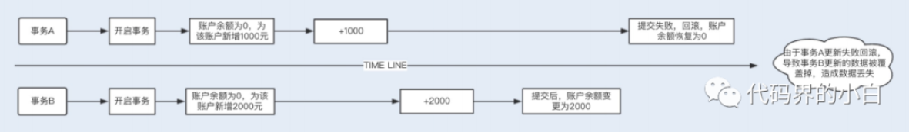

2.脏读

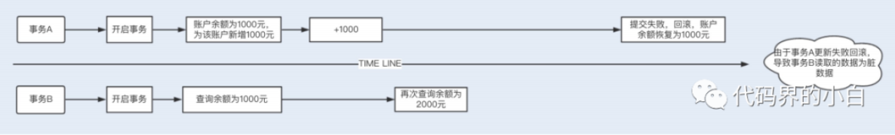

3.不可重复读

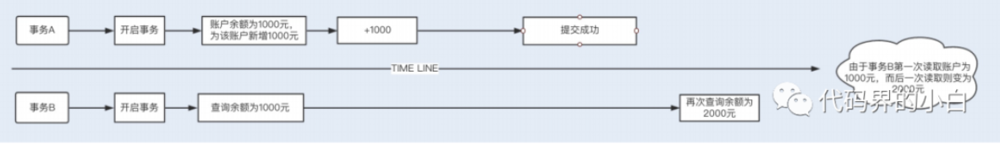

4.幻读

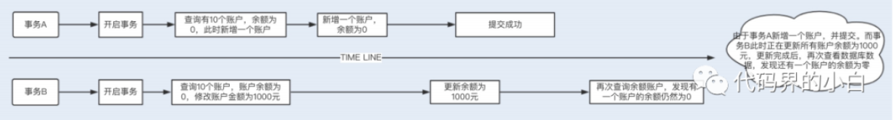

不同的隔离级别

分别可以解决并发事务产生的几个问题，对应如下：

**读未提交**（Read Uncommitted）：在事务 A 读取数据时，事务 B 读取和修改数据加了共享锁。这种隔离级别，会导致脏读、不可重复读以及幻读。

**读已提交**（Read Committed）：在事务 A 读取数据时增加了共享锁，一旦读取，立即释放锁，事务 B 读取修改数据时增加了行级排他锁，直到事务结束才释放锁。也就是说，事务 A 在读取数据时，事务 B 只能读取数据，不能修改。当事务 A 读取到数据后，事务 B才能修改。这种隔离级别，可以避免脏读，但依然存在不可重复读以及幻读的问题。

**可重复读**（Repeatable Read）：在事务 A 读取数据时增加了共享锁，事务结束，才释放锁，事务 B 读取修改数据时增加了行级排他锁，直到事务结束才释放锁。也就是说，事务A 在没有结束事务时，事务 B 只能读取数据，不能修改。当事务 A 结束事务，事务 B 才能修改。这种隔离级别，可以避免脏读、不可重复读，但依然存在幻读的问题。

**可序列化**（Serializable）：在事务 A 读取数据时增加了共享锁，事务结束，才释放锁，事务 B 读取修改数据时增加了表级排他锁，直到事务结束才释放锁。可序列化解决了脏读、不可重复读、幻读等问题，但隔离级别越来越高的同时，并发性会越来越低。

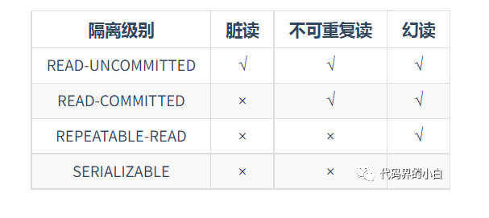


### 3.5 InnoDB 存储引擎的默认支持的隔离级别是什么？

MySQL InnoDB 存储引擎的默认支持的隔离级别是 **REPEATABLE-READ（可重复读）**

至于InnoDB为什么选用可重复读，我的个人理解是：在InnoDB存储引擎中，使用可重复读可以解决脏读、不可重复读，而幻读也有可能发生，但是可以避免的，通过加Next-Key Lock锁可以解决幻读问题。并且并非隔离级别越高越好，隔离级别越高的话，并发性能越低，所以在实际的开发中，需要根据**业务场景**进行选择事务的隔离级别。


### 3.6 Postgres默认隔离级别是什么？

在Postgres里，虽然可以设置隔离级别为以上四种中的任意一种。但是pg里实际上只有两种独立的隔离级别分别对应**读已提交**和**可串行化**。9.1版本后增加了可重复读。如果选了读未提交的级别，实际上还是读已提交，也就是说，在pg中一个事务不可能读到其他事务中未提交的数据。在选择可重复读级别时，实际上是可串行化，所以实际的隔离级别可能比选择的更为严格。

**读已提交**是Postgres的默认隔离级别。当一个事务运行于这个隔离级别的时候，select查询只能看到查询开始之前已提交的数据，而无法看到未提交的数据或在查询执行期间其他事务已提交的数据。

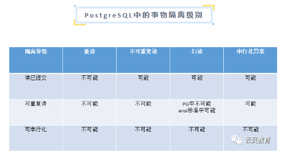


## 四、分布式事务

### 4.1 分布式事务/两阶段提交

**分布式事务简介**

分布式事务是指会涉及到操作多个数据库（或者提供事务语义的系统，如JMS）的事务。其实就是将对同一数据库事务的概念扩大到了对多个数据库的事务。目的是为了保证分布式系统中事务操作的原子性。分布式事务处理的关键是必须有一种方法可以知道事务在任何地方所做的所有动作，提交或回滚事务的决定必须产生统一的结果（全部提交或全部回滚）。

**分布式事务如何保证原子性**

在分布式系统中，各个节点（或者事务参与方）之间在物理上相互独立，通过网络进行协调。每个独立的节点（或组件）由于存在事务机制，可以保证其数据操作的ACID特性。但是，各节点之间由于相互独立，无法确切地知道其经节点中的事务执行情况，所以多节点之间很难保证ACID，尤其是原子性。

如果要实现分布式系统的原子性，则须保证所有节点的数据写操作，要不全部都执行（生效），要么全部都不执行（生效）。但是，一个节点在执行本地事务的时候无法知道其它机器的本地事务的执行结果，所以它就不知道本次事务到底应该commit还是 roolback。常规的解决办法是引入一个“协调者”的组件来统一调度所有分布式节点的执行。

**XA规范**

XA是由X/Open组织提出的分布式事务的规范。XA规范主要定义了（全局）**事务管理器**（Transaction Manager）和（局部）**资源管理器**（Resource Manager）之间的接口。XA接口是双向的系统接口，在事务管理器（Transaction Manager）以及一个或多个资源管理器（Resource Manager）之间形成通信桥梁。XA引入的事务管理器充当上文所述全局事务中的“协调者”角色。事务管理器控制着全局事务，管理事务生命周期，并协调资源。资源管理器负责控制和管理实际资源（如数据库或JMS队列）。目前，Oracle、Informix、DB2、Sybase和PostgreSQL等各主流数据库都提供了对XA的支持。

XA规范中，事务管理器主要通过以下的接口对资源管理器进行管理

- xa_open，xa_close：建立和关闭与资源管理器的连接。
- xa_start，xa_end：开始和结束一个本地事务。
- xa_prepare，xa_commit，xa_rollback：预提交、提交和回滚一个本地事务。
- xa_recover：回滚一个已进行预提交的事务。

**两阶段提交原理**

二阶段提交的算法思路可以概括为：协调者询问参与者是否准备好了提交，并根据所有参与者的反馈情况决定向所有参与者发送commit或者rollback指令（协调者向所有参与者发送相同的指令）。

所谓的两个阶段是指

- `准备阶段` 又称投票阶段。在这一阶段，协调者询问所有参与者是否准备好提交，参与者如果已经准备好提交则回复`Prepared`，否则回复`Non-Prepared`。
- `提交阶段` 又称执行阶段。协调者如果在上一阶段收到所有参与者回复的`Prepared`，则在此阶段向所有参与者发送`commit`指令，所有参与者立即执行`commit`操作；否则协调者向所有参与者发送`rollback`指令，参与者立即执行`rollback`操作。

两阶段提交中，协调者和参与方的交互过程如下图所示。

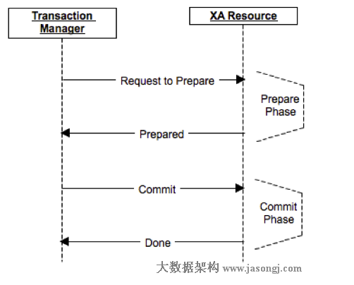

**两阶段提交前提条件**

- 网络通信是可信的。虽然网络并不可靠，但两阶段提交的主要目标并不是解决诸如拜占庭问题的网络问题。同时两阶段提交的主要网络通信危险期（In-doubt Time）在事务提交阶段，而该阶段非常短。
- 所有crash的节点最终都会恢复，不会一直处于crash状态。
- 每个分布式事务参与方都有WAL日志，并且该日志存于稳定的存储上。
- 各节点上的本地事务状态即使碰到机器crash都可从WAL日志上恢复。

**两阶段提交容错方式**

两阶段提交中的异常主要分为如下三种情况

1. 协调者正常，参与方crash
2. 协调者crash，参与者正常
3. 协调者和参与方都crash

对于第一种情况，若参与方在准备阶段crash，则协调者收不到`Prepared`回复，协调方不会发送`commit`命令，事务不会真正提交。若参与方在提交阶段crash，当它恢复后可以通过从其它参与方或者协调方获取事务是否应该提交，并作出相应的响应。

第二种情况，可以通过选出新的协调者解决。

第三种情况，是两阶段提交无法完美解决的情况。尤其是当协调者发送出`commit`命令后，唯一收到`commit`命令的参与者也crash，此时其它参与方不能从协调者和已经crash的参与者那儿了解事务提交状态。但如同上一节[两阶段提交前提条件](http://www.cnblogs.com/jasongj/p/5727897.html#u4E24_u9636_u6BB5_u63D0_u4EA4_u5047_u8BBE_u6761_u4EF6)所述，两阶段提交的前提条件之一是所有crash的节点最终都会恢复，所以当收到`commit`的参与方恢复后，其它节点可从它那里获取事务状态并作出相应操作。


### 4.2 分布式事务数据一致性

#### （1）强一致性（Strict Consistency）

也称为：**原子一致性（Atomic Consistency），线性一致性（Linearizable Consistency）**

强一致性有两个要求：

- 任何一次读都能读到某个数据的最近一次写的数据。
- 系统中的所有进程，看到的操作顺序，都和全局时钟下的顺序一致。

#### （2）顺序一致性（Sequential Consistency）

有两个要求：

- 任何一次读都能读到某个数据的最近一次写的数据。
- 系统的所有进程的顺序一致，而且是合理的。即不需要和全局时钟下的顺序一致，错的话一起错，对的话一起对。

#### （3）弱一致性

数据更新后，如果能容忍后续的访问只能访问到部分或者全部访问不到，则是弱一致性。

其实每个级别都还可以细分。这里只讲一种和今天主题相关的：最终一致性。它属于弱一致性。

#### （4）最终一致性

不保证在任意时刻任意节点上的同一份数据都是相同的，但是随着时间的迁移，不同节点上的同一份数据总是在向趋同的方向变化。

简单说，就是在一段时间后，节点间的数据会最终达到一致状态。

在数据库事务定义ACID的时候，没有想那么多。其实数据库事务中的一致性是强一致。但是强一致到了分布式系统中就遇到了困难。

### 4.3 CAP定理

CAP定理是由加州大学伯克利分校Eric Brewer教授提出来的，他指出WEB服务无法同时满足下面3个属性：

- 一致性(Consistency) ：客户端知道一系列的操作都会同时发生(生效)
- 可用性(Availability) ：每个操作都必须以可预期的响应结束
- 分区容错性(Partition tolerance) ：即使出现单个组件无法可用,操作依然可以完成

一个分布式系统不可能同时满足一致性（Consistency）、可用性（Availability）和分区容错性（Partition tolerance）这三个基本需求，最多只能同时满足其中两项。

#### （1）一致性（Consistency）

在分布式环境中，一致性是指数据在多个副本之间是否能够保持一致的特性。在一致性的要求下，当一个系统在数据一致的状态下执行更新操作后，应该保证系统的数据仍然处于一致的状态。
对于一个将数据副本分布在不同分布式节点上的系统来说，如果对第一个节点的数据进行了更新操作并且更新成功后，却没有使得第二个节点上的数据得到相应的更新，于是在对第二个节点的数据进行读取操作时，获取的仍然是老数据（脏数据），这就是典型的分布式数据不一致情况。在分布式系统中，如果能够做到针对一个数据项的更新操作执行成功后，所有的用户都可以读取到其最新的值，即满足强一致性。

#### （2）可用性（Availability）

可用性是指系统提供的服务必须一直处于可用的状态，对于用户的每一个操作请求总是能够在有限的时间内返回结果。

#### （3）分区容错性（Partition tolerance）

分区容错性约束了一个分布式系统需要具有如下特性：分布式系统在遇到任何网络分区故障的时候，仍然需要能够保证对外提供满足一致性和可用性的服务，除非是整个网络环境都发生了故障。

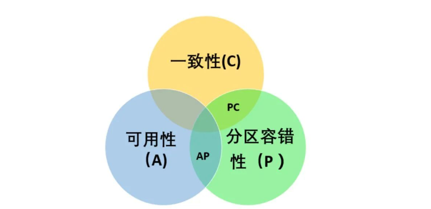

在分布式系统中，一个Web应用至多只能同时支持上面的两个属性。显然，任何横向扩展策略都要依赖于数据分区。因此，设计人员必须在一致性与可用性之间做出选择。

孔子曾经曰过：没有100分的爱人，只有50分的两个人的共同努力。那聪明的工程师就想了：一个WEB应用至多能支持两个属性达到100分，也就是200分。那我能不能让三个属性都支持到60分。3*60分=180分。200分是上限的话，还可以根据应用自身的需求决定把剩余20分应用到哪方面的提交。这三个60分是什么标准呢？这就是BASE理论。

#### （4）CAP应用

| 说明                |                                                              |
| ------------------- | ------------------------------------------------------------ |
| 放弃一致性（C）     | 这里所说的放弃C，并不是完全不需要数据一致性，如果真这样，那么系统的数据也没意义，系统也就没价值。放弃C指放弃数据的强一致性，而保留数据的最终一致性。这样的系统无法保证数据保持实时的一致性，但是能够承诺的是，数据最终会达到一个一致的状态。这就引入了一个时间窗口的概念，具体多久能够达到数据一致取决于系统的设计，主要包括数据副本在不同节点之间的复制时间长短。 |
| 放弃可用性（A）     | 相对于放弃P来说，放弃A正好相反，其做法是一旦系统遇到网络分区或其他故障时，那么受到影响的服务需要等待一定的时间，因此在等待期间系统无法对外提供正常的服务，即不可用。 |
| 放弃分区容错性（P） | 如果希望能够避免系统出现分区容错性问题，一种较为简单的做法是将所有的数据（或者仅仅是与事务相关的数据）都放在一个分布式节点上。这样的做法虽然无法100%地保证系统不会出错，但至少不会碰到由于网络分区带来的负面影响。但同时需要注意的是，放弃P的同时也就意味着放弃了系统的可拓展性。 |


### 4.4 BASE理论

- Basically Available（基本可用）
- Soft state（软状态）
- Eventually consistent（最终一致性）

BASE是对CAP中一致性和可用性权衡的结果，其核心思想是即使无法做到强一致性，但每个应用都可以根据自身的业务特点，采用适当的方法来使系统达到最终一致性。

#### （1）基本可用（Basically Available）

基本可用是指分布式系统在出现不可预知故障的时候，允许损失部分可用性

- 响应时间上的损失：正常情况下，一个在线搜索引擎需要在0.5秒之内返回给用户相应的查询结果，但由于出现故障，查询结果的响应时间增加到了1-2秒。
- 功能上的损失：在一个电子商务网站上进行购物，消费者几乎能够顺利完成每一笔订单，但是在一些节日大促购物高峰的时候，由于消费者的购物行为激增，为了保护购物系统的稳定性，部分消费者可能会被引导到一个降级页面。

#### （2）软状态（Soft state）

软状态，和硬状态相对，是指允许系统中的数据存在中间状态，并认为该中间状态的存在不会影响系统的整体可用性，即允许系统在不同节点的数据副本之间进行数据同步的过程存在延时。

#### （3）最终一致性（Eventually consistent）

最终一致性强调的是系统中所有的数据副本，在经过一段时间的同步后，最终能够达到一个一致的状态。因此，最终一致性的本质是需要系统保证最终数据能够达到一致，而不需要实时保证系统数据的强一致性。

| **最终一致性的变种** |                                                              |
| -------------------- | ------------------------------------------------------------ |
| 因果一致性           | 如果进程A在更新完某个数据项后通知了进程B，那么进程B之后对该数据项的访问都应该能够获取到进程A更新后的最新值，并且如果进程B要对该数据项进行更新操作的话，务必基于进程A更新后的最新值，即不能发生丢失更新情况。与此同时，与进程A无因果关系的进程C的数据访问则没有这样的限制。 |
| 读己之所写           | 进程A更新一个数据项之后，它自己总是能够访问到更新后的最新值，而不会看到旧值。也就是说，对于单个数据获取者来说，其读取到的数据，一定不会比自己上次写入的值旧。 |
| 会话一致性           | 对系统数据的访问过程框定在了一个会话当中，系统能够保证在同一个有效的会话中实现“读己之所写”的一致性，也就是说，执行更新操作之后，客户端能够在同一个会话中始终读取到该数据项的最新值。 |
| 单调读一致性         | 如果一个进程从系统中读取出一个数据项的某个值后，那么系统对于该进程后续的任何数据访问都不应该返回更旧的值。 |
| 单调写一致性         | 一个系统需要能够保证来自同一个进程的写操作被顺序地执行。     |

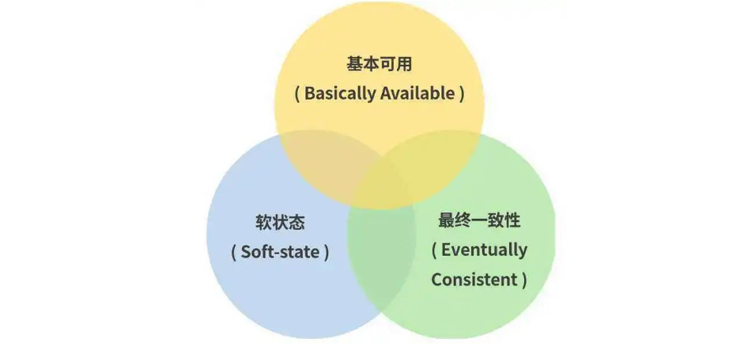


BASE理论和分布式事务到底有什么关系呢？我搜索了一下，发现没有一篇文章真正把它们的关系说明白。网上的东西给我感觉：它们觉得有关系，又不明白关系到底是啥。

**分布式事务与BASE理论的关系**

既然是事务要遵循的是ACID特性。分布式系统与单机在隔离性和持久性上没有明显的差异。所以重点关注的是原子性和一致性。原子性是说要么全做，要么全都不做，这样数据就是一致的。所以原子性是因，根本要保证的数据一致性。

所以实际工作中，我很少听到谈论具体问题的时候用分布式事务这个概念，更多的是说数据一致性。我之前写的[《数据一致性-对账》](http://mp.weixin.qq.com/s?__biz=MzUzNjAxODg4MQ==&mid=2247484990&idx=1&sn=8dc1444160af4be808f8cdbd21e6c28b&chksm=fafdec90cd8a65862023d129a095a286209efefcf699b28351b65128df3aa7e2c2d009ff0aa0&scene=21#wechat_redirect)这篇文章里提到了好几种分布式事务常用的手段，但是我没有说分布式事务这个词。工作中用这个词，具体解决的问题不明确，不建议用，建议把具体要解决的问题想清楚。

既然解决的问题是数据一致性问题，web服务不能不考虑可用性，单纯只保证一致性，所以就要考虑BASE理论了。觉得我没讲清楚的扣圆周率小数点后四位。


### 4.5 补偿型数据一致性

比如支付交易中，有典型的补偿型数据一致性保障：发起一笔支付没有收到响应，可以使用补偿查询作为第一层数据一致性保障；查询半小时还是查不回来，就关单操作，该冲正的冲正(取消交易，已付款退回账户中)，这是第二层数据一致性保障；清结算之前还要对账(做核对校验，对不上人工处理)，这是第三层数据一致性保障。在[《程序常用的设计技巧》](http://mp.weixin.qq.com/s?__biz=MzUzNjAxODg4MQ==&mid=2247484200&idx=1&sn=4ae0df004f968bb785c15d53270a5800&chksm=fafde986cd8a609057f4d5737ebcfce6b768f263636b9f9faf90bf30164027dd1e1014c7abce&scene=21#wechat_redirect)里我也提过其他的补偿性方案。


### 4.6 刚性事务、柔性事务

学习要从一个装逼的名词开始，唤起大家的好奇心：柔性事务。
而与柔性事务相对的，无疑就是刚性事务。

1. 刚性事务：遵循ACID原则，强一致性。
2. 柔性事务：遵循BASE理论，最终一致性；与刚性事务不同，柔性事务允许一定时间内，不同节点的数据不一致，但要求最终一致。


#### 4.6.1 刚性事务解决方案

由于一项操作通常会包含许多子操作，而这些子操作可能会因为硬件的损坏或其他因素产生问题，要正确实现ACID并不容易。ACID建议数据库将所有需要更新以及修改的资料一次操作完毕，但实际上并不可行。


**WAL（Write ahead logging）**

Write ahead logging，也就是日志式的方式（现代数据库均基于这种方式）。
WAL的中心思想是对数据文件的修改（它们是表和索引的载体）必须是只能发生在这些修改已经记录了日志之后。
也就是说，在日志记录冲刷到永久存储器之后，如果我们遵循这个过程，那么我们就不需要在每次事务提交的时候都把数据页冲刷到磁盘，因为我们知道在出现崩溃的情况下， 我们可以用日志来恢复数据库。
任何尚未附加到数据页的记录都将先从日志记录中重做（这叫向前滚动恢复，也叫做REDO），然后那些未提交的事务做的修改将被从数据页中删除 （这叫向后滚动恢复，UNDO）。


**3.2. 影子分页（Shadow paging）**

每个page只在日志文件中存一份，无论这个页被修改过多少次。日志文件中，只记录事务开始前page的原始信息，进行恢复时，只需要利用日志文件中的page进行覆盖即可。对于新生成的页，日志中不会记录，而是在日志头记录事务开始时数据文件page的数目，进行恢复时，只需要截断数据文件即可，不需要新页的数据，况且新页本来就没有任何数据。
相对于WAL技术，shadow paging技术实现起来比较简单，消除了写日志记录的开销，恢复的速度也快（不需要redo和undo）。
shadow paging的缺点就是事务提交时要输出多个块，这使得提交的开销很大，而且以块为单位，很难应用到允许多个事务并发执行的情况——这是它致命的缺点。


**3.3. 两阶段型**

即分布式事务两阶段提交，对应技术上的XA、JTA/JTS。
算法思路：**参与者**将操作成败通知**协调者**，再由协调者根据所有参与者的反馈情报决定各参与者是否要提交操作还是中止操作。

**3.3.1. 准备阶段**

1. 协调者节点向所有参与者节点询问是否可以执行提交操作，并开始等待各参与者节点的响应。
2. 参与者节点执行询问发起为止的所有事务操作，并将undo信息和redo信息写入日志。（若成功，其实当前每个参与者已经执行了事务操作）
3. 各参与者节点响应协调者节点发起的询问。如果参与者节点的事务操作实际执行成功，则它返回一个“同意”消息；如果参与者节点的事务实际执行失败，则它返回一个“中止”消息。

**3.3.2. 提交阶段**

如果协调者收到了参与者的失败消息或者超时，直接给每个参与者发送回滚消息；否则，发送提交消息；
参与者根据协调者的指令执行提交或者回滚操作，释放所有事务处理过程中使用的锁资源。（必须在最后阶段释放锁资源）

**3.3.2.1. 提交**

1. 协调者节点向所有参与者节点发出提交请求。
2. 参与者节点正式完成操作，并释放在整个事务期间内占用的资源。
3. 参与者节点向协调者节点发送提交完成消息。
4. 协调者节点受到所有参与者节点反馈的提交完成消息后，完成事务。

**3.3.2.2. 回滚**

1. 协调者节点向所有参与者节点发出回滚请求。
2. 参与者节点利用之前写入的undo信息执行回滚，并释放在整个事务期间内占用的资源。
3. 参与者节点向协调者发送回滚完成消息。
4. 协调者节点收到所有参与者节点反馈的回滚完成消息后，取消事务。

**3.3.3. 缺陷**

1. 同步阻塞问题：执行过程中，所有参与节点都是事务阻塞型的。当参与者占有公共资源时，其他第三方节点访问公共资源不得不处于阻塞状态。
2. 单点故障：由于协调者的重要性，一旦协调者发生故障，参与者会一直阻塞下去。尤其在第二阶段，协调者发生故障，那么所有的参与者还都处于锁定事务资源的状态中，而无法继续完成事务操作。（如果是协调者挂掉，可以重新选举一个协调者，但是无法解决因为协调者宕机导致的参与者处于阻塞状态的问题）
3. 数据不一致：在二阶段提交的阶段二中，当协调者向参与者发送提交请求之后，发生了局部网络异常或者在发送提交请求过程中协调者发生了故障，这会导致只有一部分参与者接受到了提交请求。而在这部分参与者接到提交请求之后就会执行提交操作。但是其他部分未接到提交请求的机器则无法执行事务提交。于是整个分布式系统便出现了数据不一致性的现象。
4. 协调者在发出提交消息之后宕机，而唯一接收到这条消息的参与者同时也宕机了。那么即使协调者通过选举协议产生了新的协调者，这条事务的状态也是不确定的，没人知道事务是否已经提交。

#### 4.6.2 柔性事务解决方案

**补偿型**

TCC（Try/Confirm/Cancel）型事务。
在一个长事务中，一个由两台服务器一起参与的事务，服务器A发起事务，服务器B参与事务，B的事务需要人工参与，所以处理时间可能很长。如果按照ACID的原则，要保持事务的隔离性、一致性，服务器A中发起的事务中使用到的事务资源将会被锁定，不允许其他应用访问到事务过程中的中间结果，直到整个事务被提交或者回滚。这就造成事务A中的资源被长时间锁定，系统的可用性将不可接受。
WS-BusinessActivity提供了一种基于补偿的long-running的事务处理模型。还是上面的例子，服务器A的事务如果执行顺利，那么事务A就先行提交，如果事务B也执行顺利，则事务B也提交，整个事务就算完成。但是如果事务B执行失败，事务B本身回滚，这时事务A已经被提交，所以需要执行一个补偿操作，将已经提交的事务A执行的操作作反操作，恢复到未执行前事务A的状态。这样的SAGA事务模型，是牺牲了一定的隔离性和一致性的，但是提高了long-running事务的可用性。

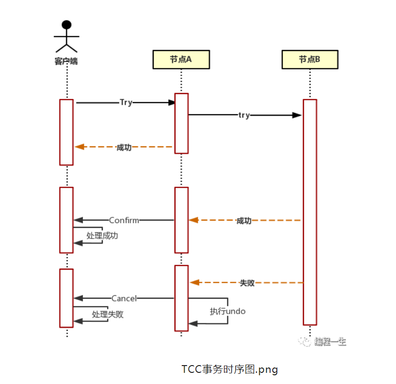

**异步确保型**

将一些同步阻塞的事务操作变为异步的操作，避免对数据库事务的争用。比如热点资源的批量更新、异步更新的处理。

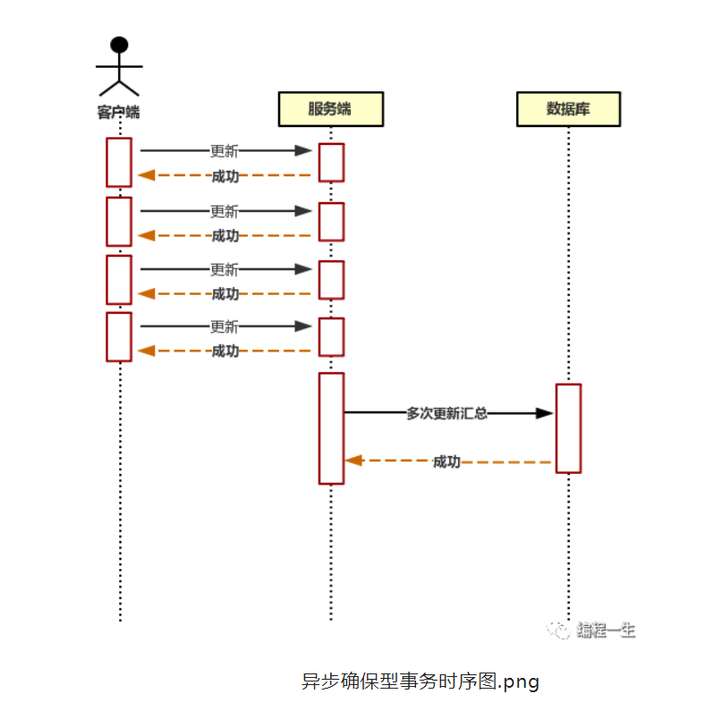

**最大努力型**

通过通知服务器（消息通知）进行，允许失败，有补偿机制（或重发机制）。

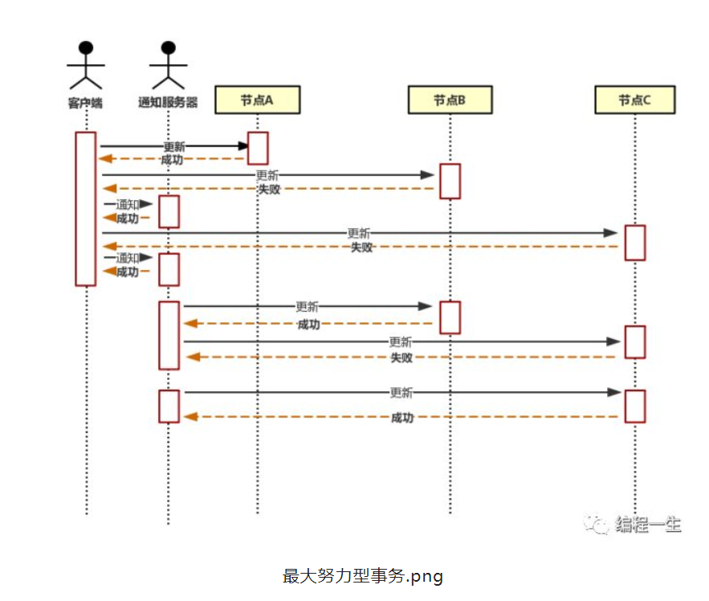

### 4.7 总结

本地事务：一个完整的事务操作可以在同一物理介质（例如：内存）上同时完成；
分布式事务：一个完整事务需要跨物理介质或跨物理节点（网络通讯）；
在分布式事务的定义里，无疑排它锁、共享锁等等就没有用武之地了，无法保证原子性完成事务。为了能够达到原子性的效果，二阶段提交提出了协调者角色，协调者拥有数据读取写入的唯一性。但同时带来了严重的同步阻塞问题，且如果协调者释放读取的能力，则无法保证原子性。
实际在分布式事务的发展过程中，刚性事务只在副本存储等局限场景中使用，柔性事务无疑是主要角色，甚至一般讲分布式事务，就是在讲柔性事务。
在柔性事务中，最重要的无疑是如何实现数据的最终一致性，在之后会另起一章，介绍主流的数据一致性算法，尤其是带有传奇色彩的经典算法-Paxos。

如果对柔性事务与数据一致性算法有更多的兴趣，可以了解一下Basic Paxos、Multi Paxos、Raft（ETCD的方案）、ZAB（Zookeeper的方案）、Gossip（Cassandra的方案）。


## 四、数据库中的锁

### 4.1 什么是锁，锁的作用是什么？

回答：锁是数据库系统区别文件系统的一个关键特性，锁机制用于管理对共享资源的并发访问，保持数据的完整性和一致性。【摘自：MySQL技术内幕InnoDB存储引擎】


### 4.2 Postgres中有哪些锁？

通常我们对于锁的认知从不同的维度上看可以分为：

（1）从锁的对象种类上看，例如：表锁，行锁等；

（2）从锁的访问类型上看，例如：共享锁，独占锁，读锁，写锁等等；

（3）实现机制上看，例如：spinlock，LWLock，LOCK等。

对于这些分类下各个锁在底层实现的机制上有什么不同，即性能如何。对于这些锁的认识，无论是对于内核人员还是DBA来说都有着非常重要的意义。


锁是实现数据库并发控制必不可少的功能，PostgreSQL数据库通过其特有的多版本属性实现了MVCC，实现了读不阻塞写，写不阻塞读。PostgreSQL中表锁有八个级别，不同的锁对应了不同的排他级别。值得注意的是同一时刻两个事务不能再同一个表上获取相互冲突的锁，但是一个事务是永远不会与自己冲突的，一个事务里连续获取两个有冲突的锁类型是没有问题的。


为了确保复杂的事务可以安全地同时运行，PostgreSQL提供了各种级别的锁来控制对各种数据对象的并发访问，使得对数据库关键部分的更改序列化。事务并发运行，直到它们尝试获取互相冲突的锁为止(比如两个事务更新同一行时)。当多个事务同时在数据库中运行时，并发控制是一种用于维持一致性和隔离性的技术，在PostgreSQL中，使用快照隔离`Sanpshot Isolation (简称SI)` 来实现多版本并发控制，同时以两阶段锁定 (2PL) 机制为辅。**在执行DDL时使用2PL，在执行DML时使用SI。**

> PostgreSQL uses SSI for DML (Data Manipulation Language, e.g, SELECT, UPDATE, INSERT, DELETE), and 2PL for DDL (Data Definition Language, e.g., CREATE TABLE, etc).


#### 4.2.1 两阶段锁（2PL）

2PL (两阶段锁定)算法是关系数据库系统用来保证数据完整性的最古老的并发控制机制之一。

The 2PL protocol splits a transaction into two sections:

- expanding phase (locks are acquired, and no lock is allowed to be released)
- shrinking phase (all locks are released, and no other lock can be further acquired).

两阶段的含义是指在同一个事务内，对所涉及的所有数据项进行先加锁，然后才对所有的数据项解锁。但两阶段封锁第一阶段加共享锁后影响了其他事务的写操作、加排它锁后影响了其他事务的读操作 (读受影响更不用提写)，所以较大地影响了其他事务的运行 (如果不操作相同数据项则互不影响)。只有第二阶段释放了所有的数据项上的锁之后，才能运行其他要操作相同数据项的事务。

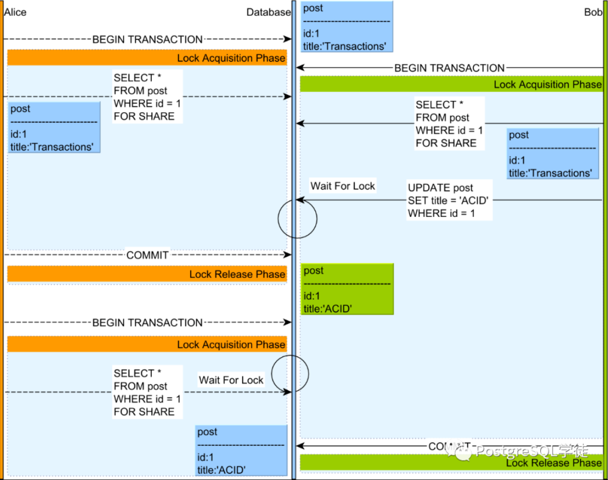

> 1. Alice 和 Bob 都通过 SELECT FOR SHARE 的子句获取给定 post 记录的读锁。
> 2. 当 Bob 尝试在 post 条目上执行 UPDATE 语句时，他的语句会被锁管理器阻塞，因为 UPDATE 语句需要在 post 行上获取写锁，而 Alice 仍然持有对该数据库记录的读锁。
> 3. 只有当 Alice 的事务结束并且她的所有锁都被释放后，Bob 才能恢复他的 UPDATE 操作。
> 4. Bob 的 UPDATE 语句会产生一个锁升级，所以他之前获取的读锁被一个排他锁取代，这将阻止其他事务在同一个 post 记录上获取读或写锁。
> 5. Alice 启动一个新事务并发出一个 SELECT FOR SHARE 查询，并为同一个 post 条目发出一个读锁获取请求，但该语句被锁管理器阻止，因为 Bob 拥有该记录的排他锁。
> 6. Bob 的事务提交后，他的所有锁都被释放，Alice 的 SELECT 查询可以恢复。

在PostgreSQL中，最主要的是表级锁与行级锁，此外还有页锁、咨询锁和死锁等。

锁根据是否对用户可见可以进一步划分，Regular Locks、Advisory Locks和Dead Locks属于可见的锁，而Spin Lock、LWLock和SIRead属于不可见的锁。

#### 4.2.2 表级锁

> LOCK [ TABLE ] [ ONLY ] name [ * ] [, ...] [ IN lockmode MODE ] [ NOWAIT ]

lockmode包括以下几种：

> ACCESS SHARE | ROW SHARE | ROW EXCLUSIVE | SHARE UPDATE EXCLUSIVE| SHARE | SHARE ROW EXCLUSIVE | EXCLUSIVE | ACCESS EXCLUSIVE

LOCK TABLE命令用于获取一个表锁，获取过程将阻塞一直到等待的锁被其他事务释放。如果使用NOWAIT关键字则如果获取不到锁，将不会等待而是直接返回，放弃执行当前指令并抛出一个错误(error)。一旦获取到锁，将一直持有锁直到事务结束。(没有主动释放锁的命令，锁总是会在事务结束的时候被释放)。

当使用自动获取锁的模式的时候，PostgreSQL总是尽可能地使用限制最小的模式。LOCK TABLE命令使我们可以自己定义锁的限制大小。比如一个应用程序使用事务在读提交(Read Committed isolation level)模式下需要保证数据库的数据在事务期间保持稳定，于是可以使用SHARE锁模式在读取前对表进行加锁。这可以防止并发的数据改变并且可以保证后续的事务对这个表的读取不会读到没有提交的数据，因为SHARE锁和由写入事务持有的ROW EXCLUSIVE锁是冲突的，所以对于想要使用SHARE锁对表进行加锁的事务，将会等到它之前所有持有该表的ROW EXCLUSIVE锁的事务commit或者是roll back。因此，一旦获取了表的SHARE锁，将不会有没有提交的数据，同样也不会有其他事务能够对表数据进行改变，直到当前事务释放SHARE锁。

为了在REPEATABLE READ(重复读)模式和SERIALIZABLE(序列化)模式下实现同样的效果，必须在任何查询和修改语句之前加上LOCK TABLE。在执行第一句SELECT语句或者修改数据语句前，重复读和序列化模式中一个事务的的数据视图将会被存储为快照。在这种情况下，事务申明的表锁同样可以避免并发的修改，但是并不能保证该事务能够读取到最新提交的数据。

如果一个事务想要修改表中的数据，应该使用SHARE ROW EXCLUSIVE(共享行排他)锁而不是SHARE锁。共享行排他锁将能够保证在同一时间只有当前事务能够运行。不加这个锁的话可能会造成死锁：两个事务同时想要获取SHARE锁，并且接下来又想要同时获取ROW EXCLUSIVE锁去进行数据更新(注意：同一个事务获取的两种不同的锁不会造成冲突，所以对于同一个事务，它可以在获取SHARE锁之后再次获取ROW EXCLUSIVE，当然是在没有其他事务获取SHARE锁的情况下)。为了避免死锁，应该保证所有的事务获取同一对象的锁的顺序是一致的，同时如果在同一个对象上想要获取多个锁，则总是应该先获取限制最大的锁。

**ACCESS SHARE（访问共享锁）**

只与ACCESS EXCLUSIVE锁冲突。

SELECT命令会在当前查询的表上获取一个ACCESS SHARE锁。总的来说，任何只读操作都会获取该锁。

**ROW SHARE（行共享锁）**

和EXCLUSIVE锁和ACCESS EXCLUSIVE锁冲突。

SELECT FOR UPDATE或者SELECT FOR SHARE命令会在目标表上获取该锁，并且所有被引用但是没有FOR UPDATE的表上会加上ACCESS SHARED锁。

**ROW EXCLUSIVE（行排他锁）**

和SHARE，SHARE ROW EXCLUSIVE和ACCESS EXCLUSIVE锁冲突。

UPDATE，DELETE和INSERT会在目标表上获取该锁，总的来说，任何对数据库数据进行修改的命令会获取到该锁。

**SHARE UPDATE EXCLUSIVE（共享更新排他锁）**

和SHARE UPDATE EXCLUSIVE，SHARE ROW EXCLUSIVE，EXCLUSIVE和ACCESS EXCLUSIVE冲突，该锁可以保护表防止并发的(schema)改变和VACUUM(释放空间)命令。

VACUUM，ANALYZE，CREATE INDEX CONCURRENTLY和ALTER TABLE VALIDATE以及其他ALTER TABLE类的命令会获取该锁。

**SHARE（共享锁）**

和ROW EXCLUSIVE，SHARE UPDATE EXCLUSIVE，SHARE ROW EXCLUSIVE，EXCLUSIVE和ACCESS EXCLUSIVE锁冲突。该锁保护一个表防止并发的数据改变。

由CREATE INDEX命令获得。

**SHARE ROW EXCLUSIVE（行共享排他锁）**

和ROW EXCLUSIVE，SHARE UPDATE EXCLUSIVE，SHARE，SHARE ROW EXCLUSIVE，EXCLUSIVE以及ACCESS EXCLUSIVE锁冲突，该锁用于保护一个表防止并发的数据改变，同时是自排他的，所以在同一时间只有同一个session可以持有该锁。

该锁不会被PGSQL的任何命令自动获取。

**EXCLUSIVE（排它锁）**

和ROW SHARE，ROW EXCLUSIVE，SHARE UPDATE EXCLUSIVE，SHARE，SHARE ROW EXCLUSIVE，EXCLUSIVE和ACCESS EXCLUSIVE锁冲突。该锁只允许并发的ACCESS SHARE锁，只有只读操作能在一个事务持有排他锁的时候进行并发操作。

**ACCESS EXCLUSIVE（访问排他锁）**

和所有的锁都冲突，该锁保证只有持有锁的事务能够访问当前表。

被DROP TABLE，TRUNCATE，REINDEX，CLUSTER，VACUUM FULL和REFRESH MATERIALIZED VIEW命令自动获取。有很多种形式的ALTER TABLE命令可以获取该锁，它同样也是LOCK TABLE命令默认的锁级别。

只有ACCESS EXCLUSIVE锁可以防止一个SELECT语句。

**注意**

一段获取锁，只有当事务结束的时候才会释放，但是如果一个锁是在一个savepoint(保存点)之后被获取，则当这个保存点回滚的时候这个锁会被马上释放。

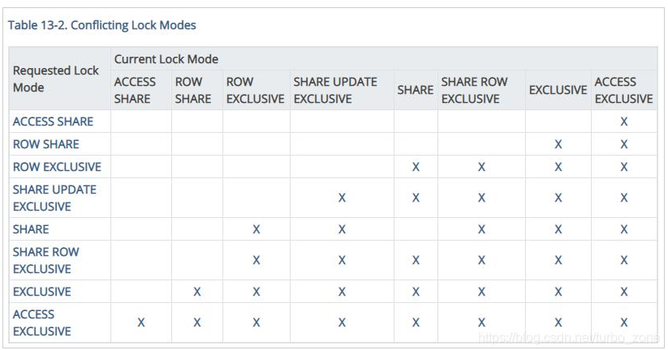

上图不方便理解和记忆，将对应的锁转换成常见的SQL就明了了，如下：

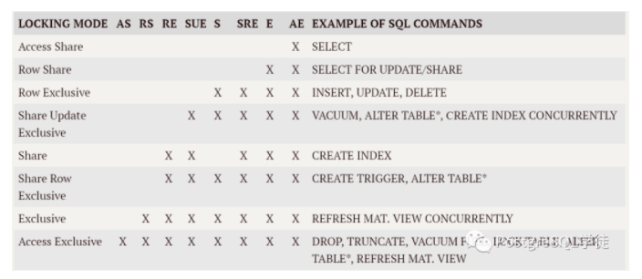

快速记忆法：

- ACCESS SHARE和ACCESS EXCLUSIVE可以理解为多版本读/写，SELECT会在查询的表上获取ACCESS SHARE，而那些很硬的操作，诸如TRUNCATE、DROP TABLE等都会获取ACCESS EXCLUSIVE。
- ROW SHARE和ROW EXCLUSIVE可以理解为意向读/写锁，意向锁根据名字，就是意向做一件事，但并非实际执行，所以可以看到ROW SHARE和ROW EXCLUSIVE之间互不冲突。当要更新插入时，需要先在对应的表上获取ROW EXCLUSIVE锁。
- SHARE和EXCLUSIVE为传统的读写锁，在PostgreSQL中有点变化，EXCLUSIVE锁出现频率很低，SHARE锁用在了创建索引的时候，因为SHARE锁不自斥，所以也就意味着在一张表上可以同时创建多个索引，但是会堵塞插入更新等(和ROW EXCLUSIVE冲突)。
- 而SHARE UPDATE EXCLUSIVE和SHARE ROW EXCLUSIVE两种锁比较难记忆，SHARE UPDATE EXCLUSIVE在VACUUM和ALTER TABLE SET(XXX)等操作时会获取，因为SHARE UPDATE EXCLUSIVE是自斥的，所以目前PostgreSQL无法做到表级的并行VACUUM，但可以做到库级的并行VACUUM(好消息是，在刚刚发布不久的POSTGRESQL13中，对索引的清理支持并行了)；SHARE ROW EXCLUSIVE出现的概率较低，一般常见的是创建触发器。

#### 4.2.3 行级锁

除了表锁，PgSQL还提供了行锁。一个事务可以获取相互冲突的两种行锁，包括在子事务中，但是两个事务不能同时在同一行获取相互冲突的两种锁。

**FOR UPDATE**

FOR UPDATE锁使得SELECT语句可以获取行锁用于更新数据。这使得该行可以防止被其他的事务获取锁或者进行更改删除操作，也就是说其他事务的操作会被阻塞直到当前事务结束；同样的，SELECT FOR UPDATE命令会等待直到前一个事务结束。在REPEATABLE模式或者SERIALIZABLE模式下，如果一个将要被上锁的行在事务开始之前被删除了，则会返回一个error。

FOR UPDATE锁同样可以被DELETE命令获取，以及UPDATE命令当使用在确定的行用来修改数据的时候也会获取到该锁。目前当使用确定的唯一索引时使用UPDATE命令可以获取到该锁（部分索引和联合索引暂时不支持），但是未来可能会改变这种设计。

**FOR NO KEY UPDATE**

和FOR UPDATE命令类似，但是对于获取锁的要求更加宽松一些，在同一行中不会阻塞SELECT FOR KEY SHARE命令。同样在UPDATE命令的时候如果没有获取到FOR UPDATE锁的情况下会获取到该锁。

**FOR SHARE**

和FOR NO KEY UPDATE命令类似，不同点在于这个锁是一个共享锁而不是之前的锁一样是排他锁，所以这个锁会阻塞UPDATE，DELETE，SELECT FOR UPDATE或者SELECT FOR NO KEY UPDATE，但是不会阻塞SELECT FOR SHARE或者SELECT FOR KEY SHARE。

**FOR KEY SHARE**

和FOR SHARE表现类似，但是对加锁的要求更加宽松，SELECT FOR UPDATE会被阻塞但是SELECT FOR NO KEY UPDATE不会被阻塞。KEY SHARE模式下的锁会阻塞其他事务的DELETE或者是改变KEY值的UPDATE语句，但是对于其他的UPDATE或者是SELECT FOR NO KEY UPDATE，SELECT FOR SHARE以及SELECT FOR KEY SHARE则不会阻塞。

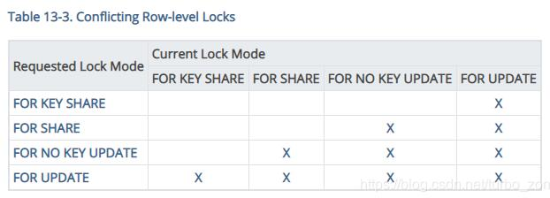


### 4.2 MySQL中lock和latch的区别

回答：数据库中有表锁和行锁等

lock锁：锁的对象是事务，用于锁定数据库中的对象，如表、页、行等，并且lock锁一般在commit或rollback后释放，有死锁机制。

latch锁：一般称为轻量级锁，要求锁定的时间必须非常短，在InnoDB中又可以分为mutex(互斥量)和rwlock(读写锁)。目的是用来保证并发线程操作临界资源的正确性，并且通常没有死锁检测的机制。


### 4.3 MySQL的InnoDB存储引擎中的锁都有哪些类型？

回答：

数据库中有表锁和行锁等

行锁：共享锁、排它锁

表锁：意向共享锁、意向排它锁


可以分为共享锁、排他锁、意向锁、一致性非锁定读和一致性锁定读。

其中**共享锁**和**排他锁**均属于**行级锁**。

共享锁(S Lock)：运行事务读一行数据。

排他锁(X Lock)：允许事务删除或更新一行数据。

> 行锁的三种算法：
>
> Record Lock：单个行记录上的锁
>
> Gap Lock：间隙锁，锁定一个范围，但不包含记录本身。
>
> Next-Key Lock：Gap+Record Lock锁定一个范围，并且锁定记录本身。

**意向锁**属于**表级别**的锁，又可以分为意向共享锁(IS Lock)和意向排他锁(IX Lock)。

意向共享锁(IS Lock)：事务想要获得一张表中某几行的共享锁。

意向排他锁(IX Lock)：事务想要获得一张表中某几行的排他锁。

**一致性非锁定读**：指InnoDB存储引擎通过**多版本控制**的方式来读取当前执行时间数据库中行的数据。如果读取的行正在执行DELETE或UPDATE操作，这时读取操作不会因此等待行上锁的释放，相反的，InnoDB存储引擎会读取一个快照数据。

一致性锁定读：InnoDB存储引擎对于SELECT语句支持两种一致性锁定读的操作：

select ... for update和select ... lock in share mode。

> - MySQL 在 server 层 和 存储引擎层 都运用了大量的锁
>
> - MySQL server 层需要讲两种锁，第一种是MDL(metadata lock) 元数据锁，第二种则 Table Lock 表锁。
>
> - MDL 又名元数据锁，那么什么是元数据呢，任何描述数据库的内容就是元数据，比如我们的表结构、库结构等都是元数据。那为什么需要 MDL 呢？
>
> - 主要解决两个问题：事务隔离问题；数据复制问题
>
> - InnoDB 有五种表级锁：IS（意向读锁）；IX（意向写锁）；S（读）；X（写）；AUTO-INC
>
> - 在对表进行select/insert/delete/update语句时候不会加表级锁
>
> - IS和IX的作用是为了判断表中是否有已经被加锁的记录
>
> - 自增主键的保障就是有 AUTO-INC 锁，是语句级别的：为表的某个列添加 AUTO_INCREMENT 属性，之后在插⼊记录时，可以不指定该列的值，系统会⾃动为它赋上单调递增的值。
>
> - InnoDB 4 种行级锁
>
> - RecordLock：记录锁
>
> - GapLock：间隙锁解决幻读；前一次查询不存在的东西在下一次查询出现了，其实就是事务A中的两次查询之间事务B执行插入操作被事务A感知了
>
> - Next-KeyLock：锁住某条记录又想阻止其它事务在改记录前面的间隙插入新纪录
>
> - InsertIntentionLock：插入意向锁;如果插入到同一行间隙中的多个事务未插入到间隙内的同一位置则无须等待
>
> - 行锁和表锁的抉择
>
> - - 全表扫描用行级锁


### 4.4 什么是一致性非锁定读(MVCC)？

**什么是MVCC？**

MVCC实现原理【MVCC多版本并发控制，指的是一种提高并发的技术。】 Multi-Version Concurrency Control。最早的数据库系统，只有读读之间可以并发，读写，写读，写写都要阻塞。引入多版本之后，只有写写之间相互阻塞，其他三种操作都可以并行，这样大幅度提高了InnoDB的并发度。

**MVCC能解决什么问题，好处是？**

数据库并发场景有三种，分别为：读-读：不存在任何问题，也不需要并发控制 读-写：有线程安全问题，可能会造成事务隔离性问题，可能遇到脏读，幻读，不可重复读 写-写：有线程安全问题，可能会存在更新丢失问题，比如第一类更新丢失，第二类更新丢失

**MVCC带来的好处是？**

MVCC可以为数据库解决以下问题

在并发读写数据库时，可以做到在读操作时不用阻塞写操作，写操作也不用阻塞读操作，提高了数据库并发读写的性能 同时还可以解决脏读，幻读，不可重复读等事务隔离问题，但不能解决更新丢失问题 MVCC只在读取已提交和可重复 读两种隔离级别下有作用

MVCC常见的实现方式乐观锁和悲观锁

MVCC是行级锁的变种，很多情况下避免了加锁操作。

应对高并发事务, MVCC比单纯的加锁更高效;

InnoDB存储引擎在数据库每行数据的后面添加了三个字段, 不是两个!!

**核心概念【很重要！！！】**

1.Read view一致性视图【 主要是用来做可见性判断的, 比较普遍的解释便是"本事务不可见的当前其他活跃事务", 】

2.read view快照的生成时机, 也非常关键, 正是因为生成时机的不同, 造成了RC,RR两种隔离级别的不同可见性;

在innodb中(默认repeatable read级别), 事务在begin/start transaction之后的第一条select读操作后, 会创建一个快照(read view), 将当前系统中活跃的其他事务记录记录起来; 在innodb中(默认repeatable committed级别), 事务中每条select语句都会创建一个快照(read view); 3.undo-log 【回滚日志，通过undo读取之前的版本信息，以此实现非锁定读取！】 是MVCC的重要组成部分！

当我们对记录做了变更操作时就会产生undo记录，Undo记录默认被记录到系统表空间(ibdata)中，但从5.6开始，也可以使用独立的Undo 表空间。

Undo记录中存储的是老版本数据，当一个旧的事务需要读取数据时，为了能读取到老版本的数据，需要顺着undo链找到满足其可见性的记录。

另外, 在回滚段中的undo logs分为: insert undo log 和 update undo log。

insert undo log : 事务对insert新记录时产生的undolog, 只在事务回滚时需要, 并且在事务提交后就可以立即丢弃。update undo log : 事务对记录进行delete和update操作时产生的undo log, 不仅在事务回滚时需要, 一致性读也需要，所以不能随便删除，只有当数据库所使用的快照中不涉及该日志记录，对应的回滚日志才会被purge线程删除。

4.InnoDB存储引擎在数据库每行数据的后面添加了三个字段 分别是事务ID、回滚指针和

6字节的DB_ROW_ID字段: 包含一个随着新行插入而单调递增的行ID, 当由innodb自动产生聚集索引时，聚集索引会包括这个行ID的值，否则这个行ID不会出现在任何索引中。

5.可见性比较算法（这里每个比较算法后面的描述是建立在rr级别下，rc级别也是使用该比较算法,此处未做描述）

设要读取的行的最后提交事务id(即当前数据行的稳定事务id)为 trx_id_current

当前新开事务id为 new_id

当前新开事务创建的快照read view 中最早的事务id为up_limit_id, 最迟的事务id为low_limit_id(注意这个low_limit_id=未开启的事务id=当前最大事务id+1)

比较:

1. trx_id_current < up_limit_id, 这种情况比较好理解, 表示, 新事务在读取该行记录时, 该行记录的稳定事务ID是小于, 系统当前所有活跃的事务, 所以当前行稳定数据对新事务可见, 跳到步骤5.
2. trx_id_current >= trx_id_last, 这种情况也比较好理解, 表示, 该行记录的稳定事务id是在本次新事务创建之后才开启的,但是却在本次新事务执行第二个select前就commit了，所以该行记录的当前值不可见, 跳到步骤4
3. up_limit_id<= trx_id_current <= trx_id_last, 表示: 该行记录所在事务在本次新事务创建的时候处于活动状态，从up_limit_id到low_limit_id进行遍历，如果trx_id_current等于他们之中的某个事务id的话，那么不可见,调到步骤4,否则表示可见。
4. 从该行记录的 DB_ROLL_PTR 指针所指向的回滚段中取出最新的undo-log的版本号, 将它赋值该 trx_id_current，然后跳到步骤1重新开始判断。
5. 将该可见行的值返回。


### 4.5 锁可能会带来什么问题/数据不一致的几种情况

回答：通过锁机制实现了事务的隔离性，使得事务可以并发的工作，但同时也会有一些潜在的问题。锁会带来如下问题：脏读、不可重复度、丢失修改和幻读。

- **脏读（Dirty read）:** 当一个事务正在访问数据并且对数据进行了修改，而这种修改还没有提交到数据库中，这时另外一个事务也访问了这个数据，然后使用了这个数据。因为这个数据是还没有提交的数据，那么另外一个事务读到的这个数据是“脏数据”，依据“脏数据”所做的操作可能是不正确的。

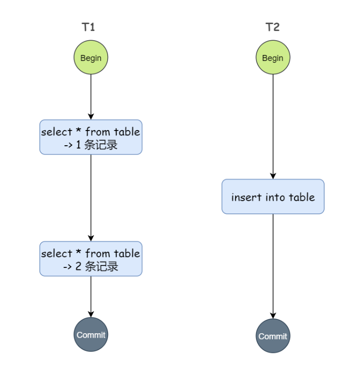

- **丢失修改（Lost to modify）:** 指在一个事务读取一个数据时，另外一个事务也访问了该数据，那么在第一个事务中修改了这个数据后，第二个事务也修改了这个数据。这样第一个事务内的修改结果就被丢失，因此称为丢失修改。例如：事务1读取某表中的数据A=20，事务2也读取A=20，事务1修改A=A-1，事务2也修改A=A-1，最终结果A=19，事务1的修改被丢失。

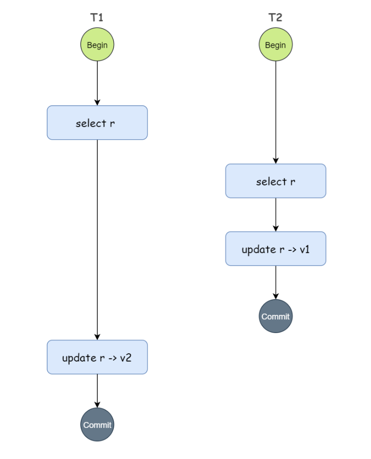

- **不可重复读（Unrepeatableread）:** 指在一个事务内多次读同一数据。在这个事务还没有结束时，另一个事务也访问该数据。那么，在第一个事务中的两次读数据之间，由于第二个事务的修改导致第一个事务两次读取的数据可能不太一样。这就发生了在一个事务内两次读到的数据是不一样的情况，因此称为不可重复读。

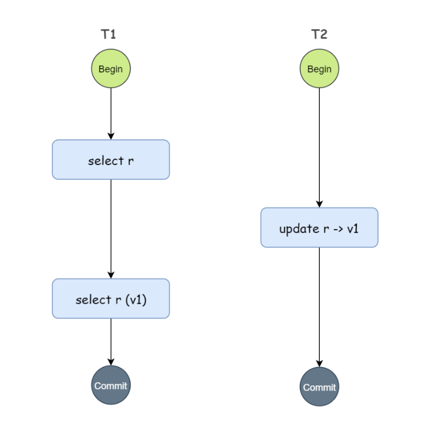

- **幻读（Phantom read）:** 幻读与不可重复读类似。它发生在一个事务（T1）读取了几行数据，接着另一个并发事务（T2）插入了一些数据时。在随后的查询中，第一个事务（T1）就会发现多了一些原本不存在的记录，就好像发生了幻觉一样，所以称为幻读。

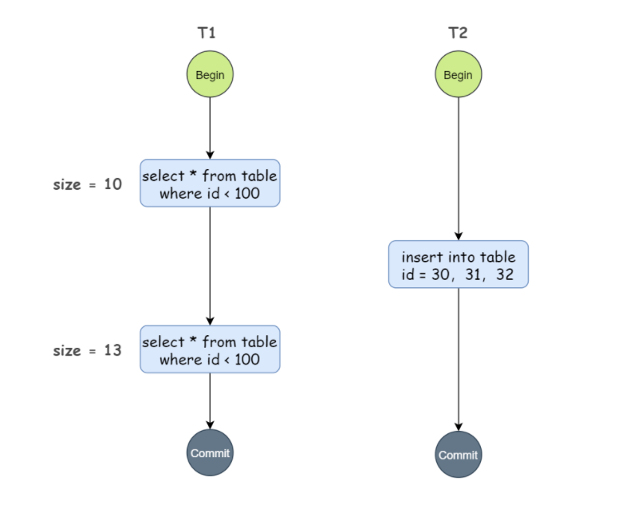

**不可重复读和幻读区别：**

不可重复读的重点是修改比如多次读取一条记录发现其中某些列的值被修改，幻读的重点在于新增或者删除比如多次读取一条记录发现记录增多或减少了。【摘自MySQL技术内幕：InnoDB存储引擎可以使用Next-Key Locking机制来避免Phantom Problem问题】


### 4.6 数据库中的死锁概念你知道吗？

回答：死锁是指两个或两个以上的事务在执行过程中，因争夺资源而造成的一种互相等待的现象。

解决死锁的办法：一种是超时回滚，一种是采用死锁检测机制（wait-for graph等待图）

如果面试官让你举例子，可以举例下面的例子：

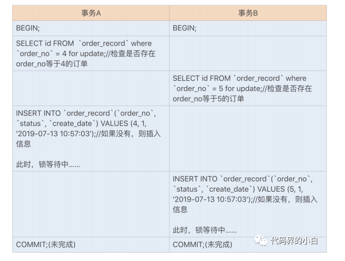

在 MySQL 中，gap lock 默认是开启的，即innodb_locks_unsafe_for_binlog 参数值是disable 的，且 MySQL 中默认的是 RR 事务隔离级别。

当我们执行以下查询 SQL 时，由于 order_no 列为非唯一索引，此时又是 RR 事务隔离级别，所以 SELECT 的加锁类型为 gap lock，这里的 gap 范围是 (4,+∞）。


执行查询 SQL 语句获取的 gap lock 并不会导致阻塞，而当我们执行以下插入 SQL 时，会在插入间隙上再次获取插入意向锁。插入意向锁其实也是一种 gap 锁，它与 gap lock 是冲突的，所以当其它事务持有该间隙的 gap lock 时，需要等待其它事务释放 gap lock 之后，才能获取到插入意向锁。

以上事务 A 和事务 B 都持有间隙 (4,+∞）的 gap 锁，而接下来的插入操作为了获取到插入意向锁，都在等待对方事务的 gap 锁释放，于是就造成了循环等待，导致死锁。

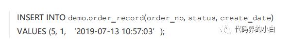

最后送上锁之间的兼容性表格：

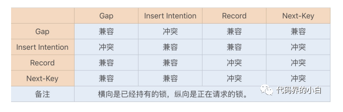


### 4.7 死锁检测机制

上层应用开发会加各种锁，有些锁是隐式的，数据库会主动加；而有些锁是显式的，比如上文所说的悲观锁。因为开发使用的不当，数据库会发生死锁。所以，作为数据库，必须有机制检测出死锁，并解决死锁问题。

先以两个事务为例，看一下死锁发生的原理。如图6-5所示：事务A持有锁1，事务B持有锁2，然后事务A请求锁2，但请求不到；事务B请求锁1，也请求不到。两个事务各拿一个锁，各请求对方的锁，互相等待，发生死锁。


图6-5 两个事务发生死锁示意图

把两个事务的场景扩展到多个事务，如图6-6所示。

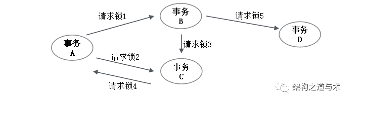

图6-6 多个事务发生死锁的示意图


以事务为顶点，以事务请求的锁为边，构建一个有向图，这个图被称为Wait-for Graph。比如事务A要请求锁1、锁2，而锁1、锁2分别被事务B、事务C持有，因此事务A依赖事务B、事务C；事务B要请求锁3，而锁3被事务C持有，所以事务B依赖事务C；事务C要请求锁4，而锁4被事务A持有，所以事务C依赖事务A；依此类推。

**死锁检测就是发现这种有向图中存在的环，本图中就是事务A、事务B、事务C之间出现了环，所以发生了死锁**。关于如何判断一个有向图是否存在环属于图论中的基本问题，存在多种算法，此处不展开讨论。

**检测到死锁后，数据库可以强制让其中某个事务回滚，释放掉锁，把环断开，死锁就解除了。**

具体到MySQL，开发者可以通过日志或者命令查看当前数据库是否发生了死锁现象。遇到这种问题，需要排查代码，分析死锁发生的原因，定位到具体的SQL语句，然后解决。死锁发生的场景非常的多，与代码有关，也与事务隔离级别有关，只能根据具体问题分析SQL语句解决。下面随便列举两个死锁发生的场景。


场景1：如表6-7所示，事务A操作了表T1、T2的两条记录，事务B也操作了表T1、T2中同样的两条记录，顺序刚好反过来，可能发生死锁。

表6-7  死锁发生场景1

| 事务A                          | 事务B                          |
| ------------------------------ | ------------------------------ |
| delete from T1 where id = 1    |                                |
|                                | update T2 set xxx where id = 5 |
| update T2 set xxx where id = 5 |                                |
|                                | delete from T1 where id = 1    |


场景2：如表6-8所示，同一张表，在第三个隔离级别（RR）下，insert操作会增加Gap锁，可能导致两个事务死锁。这个比较隐晦，不容易看出来。

表6-8  死锁发生场景2

| 事务A                       | 事务B                          |
| --------------------------- | ------------------------------ |
| delete from T1 where id = 1 |                                |
|                             | update T1 set xxx where id = 5 |
| insert into T1 values(…)    |                                |
|                             | insert into T1 values(…)       |


### 4.8 Postgres死锁的恢复

**Postgresql死锁的处理**

今天遇到一个奇怪的现象，select和delete表时正常执行，但truncate和drop表时会一直运行，也不报错。

查了些资料才发现问题的原因，总结如下：

"drop table " 和 "truncate table " 需要申请排它锁 "ACCESS EXCLUSIVE "， 执行这个命令卡住时，说明此时这张表上还有操作正在进行，比如查询等，那么只有等待这个查询操作完成，"drop table" 或"truncate table"或者增加字段的SQL 才能获取这张表上的 "ACCESS EXCLUSIVE" 锁 ，操作才能进行下去。

**1.检索出死锁进程的ID。**

> SELECT * FROM pg_stat_activity WHERE datname='死锁的数据库ID ';

检索出来的字段中，【wating 】字段，数据为t的那条，就是死锁的进程。找到对应的【procpid 】列的值。

**2.将进程杀掉。**

> SELECT pg_cancel_backend('死锁那条数据的procpid值 ');

结果：运行完后，再次更新这个表，sql顺利执行。

如果pg_stat_activity 没有记录，则查询pg_locks是否有这个对象的锁

```
select` `oid,relname ``from` `pg_class ``where` `relname=``'table name'``;``select` `locktype,pid,relation,mode,granted,* ``from` `pg_locks ``where` `relation= ``'上面查询出来的oid'``;`` ` `select` `pg_cancel_backend(``'进程ID'``);
```

另外pg_terminate_backend()函数也可以杀掉进程。


## 五、多版本并发控制（MVCC）

多版本并发控制（Multi-Version Concurrency Control, MVCC），是数据库中并发访问数据时保证数据一致性的一种方法。

### 5.1 MVCC的原理

在并发操作中，读操作和写操作是不能同时进行的，因为可能会出现数据不一致的问题，比如同时读同时写，可能会出现读到的前一部分数据是刚写入的，读到的后一部分数据是原来的。解决这个问题最简单的方法是加读写锁，写的时候不允许读，读的时候也不允许写，但是这样读操作和写操作就不能并发执行。为了能够让读操作和写操作可以并发执行，于是就有了MVCC。

通过 MVCC：

- 可以保证一个事务不会读到并发执行的另一个事务的更新
- 可以保证一个事务只可以读到该事务自己修改的数据或该事务开始之前的数据

另外，在MySQL中，MVCC 只在事务隔离级别 READ COMMITTED 和 REPEATABLE READ（默认）下才会开启。

> 从上面可以看到，MVCC可以解决并发读写问题，但是它并不能代替数据库的隔离级别，也起不到隔离级别的作用，比如读已提交。
>
> 当两个并发事务同时对同一行进行写的时候，就需要事务隔离级别来发挥作用了。


### 5.2 MVCC的主流实现

实现MVCC的方法有以下两种：

* 第一种：写新数据时，把原数据移到一个单独的位置，如回滚段中，其他用户读数据时，从回滚段中把原数据读出来。
* 第二种：写新数据时，原数据不删除，而是把新数据插入进来。

Postgres数据库使用的是第二种方法，而Oracle、MySQL的InnoDB引擎使用的是第一种方法。


### 5.3 MySQL MVCC实现

前文我们介绍了 InnoDB 存储引擎在事务隔离级别 READ COMMITTED 和 REPEATABLE READ（默认）下会开启一致性非锁定读，简单回顾下：所谓一致性非锁定读就是每行记录可能存在多个历史版本，多版本之间串联起来形成了一条版本链，这样不同时刻启动的事务可以无锁地访问到不同版本的数据。

MVCC的好处是使得读请求和写请求不冲突，读不会阻塞写，写也不会阻塞读。

#### 5.3.1 undo log版本链

一致性非锁定读是通过 MVCC（Multi Version Concurrency Control，多版本并发控制） 来实现的。事实上，MVCC 没有一个统一的实现标准，所以各个存储引擎的实现机制不尽相同。

InnoDB 存储引擎中 MVCC 的实现是通过 undo log 来完成的，undo log 是啥？

简单理解，undo log 就是每次操作的反向操作，比如比如当前事务执行了一个插入 id = 100 的记录的操作，那么 undo log 中存储的就是删除 id = 100 的记录的操作。

所以，这里用多版本来形容并不是非常准确，因为 InnoDB 并不会真正地去开辟空间存储多个版本的行记录，只是借助 undo log 记录每次写操作的反向操作。

也就是说，B+ 索引树上对应的记录只会有一个最新版本，只不过 InnoDB 可以根据 undo log 得到数据的历史版本，从而实现多版本控制。

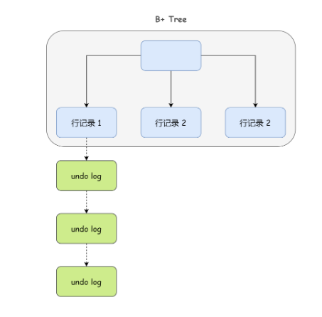

那么，还有个问题，undo log 是如何和某条行记录产生联系的呢？换句话说，我怎么能通过这条行记录找到它拥有的 undo log 呢？

具体来说，InnoDB 存储引擎中每条行记录其实都拥有两个隐藏的字段：`trx_id` 和 `roll_pointer`。

从名字也能看出来，`trx_id` 就是最近更新这条行记录的事务 ID，`roll_pointer` 就是指向之前生成的 undo log。

掏出我们的 user 表，来举个例子，假设 id = 100 的事务 A 插入一条行记录（id = 1, username = "Jack", age = 18），那么，这行记录的两个隐藏字段 `trx_id = 100` 和 `roll_pointer` 指向一个空的 undo log，因为在这之前并没有事务操作 id = 1 的这行记录。如图所示：

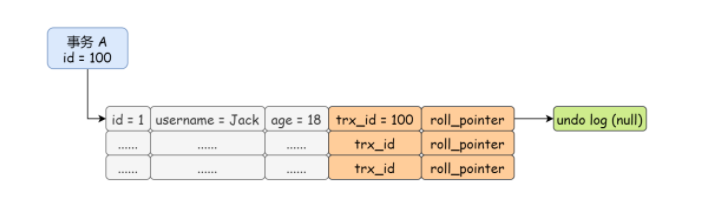

然后，id = 200 的事务 B 修改了这条行记录，把 age 从 18 修改成了 20，于是，这条行记录的 `trx_id` 就变成了 200，`rooll_pointer` 就指向事务 A 生成的 undo log ：

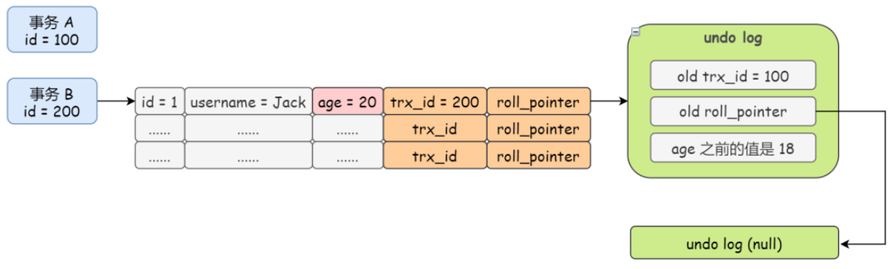

接着，id = 300 的事务 C 再次修改了这条行记录，把 age 从 20 修改成了 30，如下图：

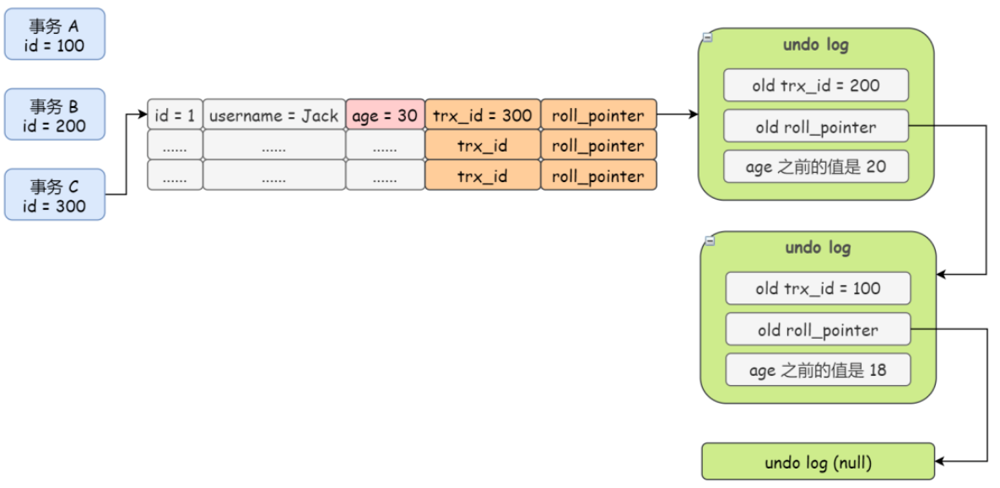

可以看到，每次修改行记录都会更新 trx_id 和 roll_pointer 这两个隐藏字段，之前的多个数据快照对应的 undo log 会通过 roll_pointer 指针串联起来，从而形成一个版本链。

需要注意的是，select 查询操作不会生成 undo log！在 InnoDB 存储引擎中，undo log 只分为两种：

- insert undo log：在 insert 操作中产生的 undo log
- update undo log：对 delete 和 update 操作产生的 undo log

事实上，由于事务隔离性的要求，insert 操作的记录，只对事务本身可见，对其他事务不可见，也即插入操作不会对已经存在的记录产生影响！，所以也就不存在并发情况下的问题。所以，也就是说，MVCC 这个机制，其实就是靠 update undo log 实现的，和 insert undo log 基本上没啥关系，我们上面说的 undo log 版本链上的其实就是 update undo log。

#### 5.3.2 ReadView机制

> MySQL里每个事务对应一个ReadView，而且这个ReadView是事务开启时创建的。

说到 MVCC，说到 undo log 版本链，如果你自己不往下说的话，八九不离十面试官都会问你下 ReadView 这个机制。

咱也不卖官子，直接说吧，ReadView 机制就是用来判断当前事务能够看见哪些版本的，一个 ReadView 主要包含如下几个部分：

- `m_ids`：生成 ReadView 时有哪些事务在执行但是还没提交的（称为 ”活跃事务“），这些活跃事务的 id 就存在这个字段里
- `min_trx_id`：m_ids 里最小的值
- `max_trx_id`：生成 ReadView 时 InnoDB 将分配给下一个事务的 ID 的值（事务 ID 是递增分配的，越后面申请的事务 ID 越大）
- `creator_trx_id`：当前创建 ReadView 事务的 ID

接下来，再掏出 user 表，通过一个例子来理解下 ReadView 机制是如何做到判断当前事务能够看见哪些版本的：

假设表中已经被之前的事务 A（id = 100）插入了一条行记录（id = 1, username = "Jack", age = 18），如图所示：

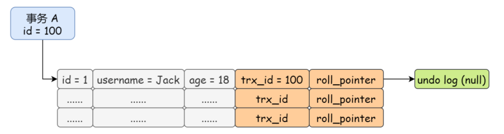

接下来，有两个事务 B（id = 200） 和 C（id = 300）过来并发执行，事务 B 想要更新（update）这行 id = 1 的记录，而事务 C（select）想要查询这行数据，这两个事务都执行了相应的操作但是还没有进行提交：

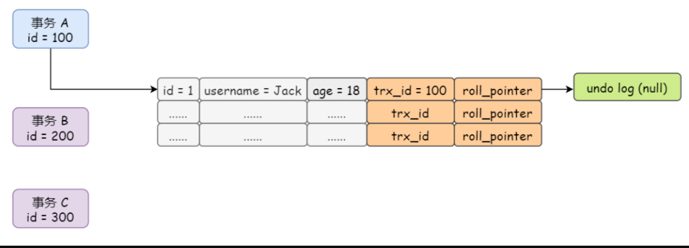

如果现在事务 B 开启了一个 ReadView，在这个 ReadView 里面：

- `m_ids` 就包含了当前的活跃事务的 id，即事务 B 和事务 C 这两个 id，200 和 300
- `min_trx_id` 就是 200
- `max_trx_id` 是下一个能够分配的事务的 id，那就是 301
- `creator_trx_id` 是当前创建 ReadView 事务 B 的 id 200

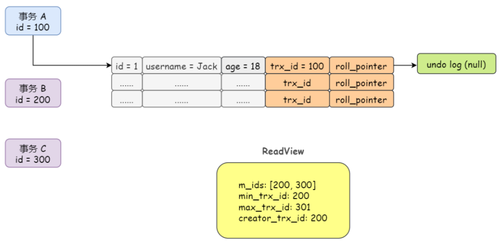

现在事务 B 进行第一次查询（上面说过 select 操作不会生成 undo log 的哈），会把这行记录的隐藏字段 `trx_id` 和 ReadView 的 `min_trx_id` 进行下判断，此时，发现 trx_id 是 100，小于 ReadView 里的 `min_trx_id`（200），这说明在事务 B 开始之前，修改这行记录的事务 A 已经提交了，所以开始于事务 A 提交之后的事务 B、是可以查到事务 A 对这行记录的更新的。

```
row.trx_id < ReadView.min_trx_id
```

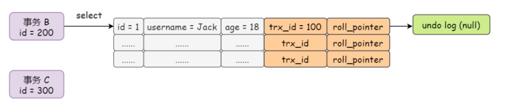

接着事务 C 过来修改这行记录，把 age = 18 改成了 age = 20，所以这行记录的 `trx_id` 就变成了 300，同时 `roll_pointer` 指向了事务 C 修改之前生成的 undo log：

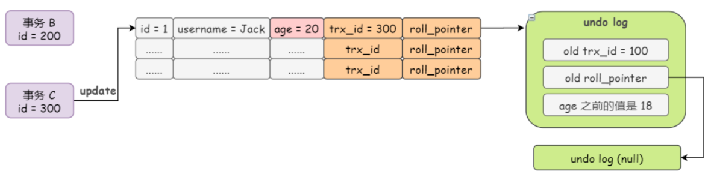

那这个时候事务 B 再次进行查询操作，会发现这行记录的 `trx_id`（300）大于 ReadView 的 `min_trx_id`（200），并且小于 `max_trx_id`（301）。

```
row.trx_id > ReadView.min_trx_id && row.trx_id < max_trx_id
```

这说明一个问题，就是更新这行记录的事务很有可能也存在于 ReadView 的 m_ids（活跃事务）中。所以事务 B 会去判断下 ReadView 的 m_ids 里面是否存在 `trx_id = 300` 的事务，显然是存在的，这就表示这个 id = 300 的事务是跟自己（事务 B）在同一时间段并发执行的事务，也就说明这行 age = 20 的记录事务 B 是不能查询到的。

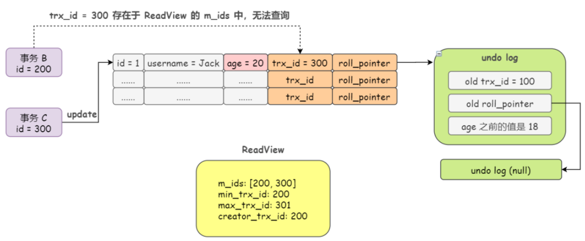

既然无法查询，那该咋整？事务 B 这次的查询操作能够查到啥呢？

没错，undo log 版本链！

这时事务 B 就会顺着这行记录的 roll_pointer 指针往下找，就会找到最近的一条 `trx_id = 100` 的 undo log，而自己的 id 是 200，即说明这个 trx_id = 100 的 undo log 版本必然是在事务 B 开启之前就已经提交的了。所以事务 B 的这次查询操作读到的就是这个版本的数据即 age = 18。

通过上述的例子，我们得出的结论是，通过 undo log 版本链和 ReadView 机制，可以保证一个事务不会读到并发执行的另一个事务的更新。


那自己修改的值，自己能不能读到呢？

这当然是废话，肯定可以读到呀。不过上面的例子我们只涉及到了 ReadView 中的前三个字段，而 `creator_trx_id` 就与自己读自己的修改有关，所以这里还是图解出来让大家更进一步理解下 ReadView 机制：

假设事务 C 的修改已经提交了，然后事务 B 更新了这行记录，把 age = 20 改成了 age = 66，如下图所示：

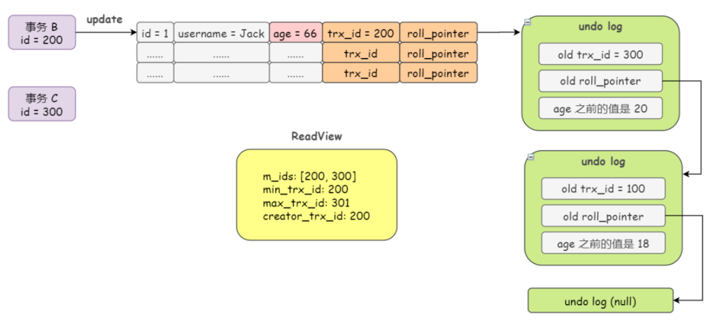

然后，事务 B 再来查询这条记录，发现 `trx_id = 200` 与 ReadView 里的 `creator_trx_id = 200` 一样，这就说明这是我自己刚刚修改的啊，当然可以被查询到。

```
row.trx_id = ReadView.creator_trx_id
```

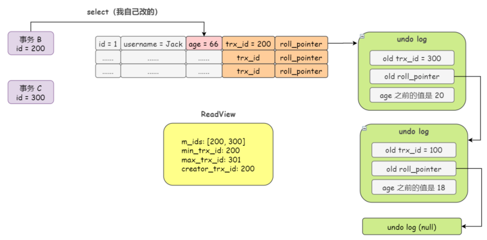

那如果在事务 B 的执行期间，突然开了一个 id = 500 的事务 D，然后更新了这行记录的 age = 88 并且还提交了，然后事务 B 再去读这行记录，能读到吗？

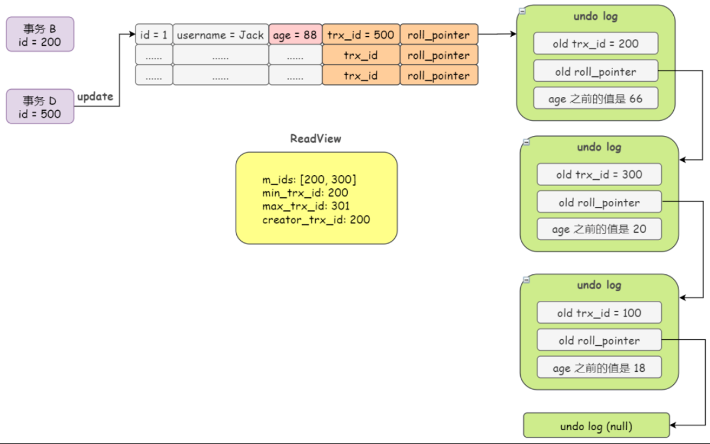

答案是不能的。

因为这个时候事务 B 再去查询这行记录，就会发现 `trx_id = 500` 大于 ReadView 中的 `max_trx_id = 301`，这说明事务 B 执行期间，有另外一个事务更新了数据，所以不能查询到另外一个事务的更新。

```
row.trx_id > ReadView.max_trx_id
```

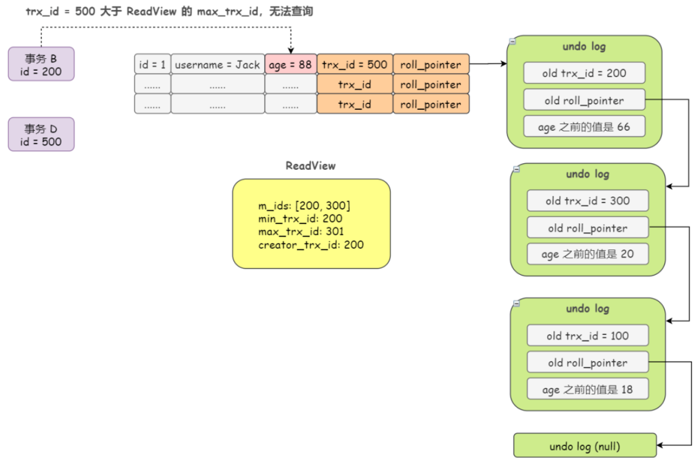

那通过上述的例子，我们得出的结论是，通过 undo log 版本链和 ReadView 机制，可以保证一个事务只可以读到该事务自己修改的数据或该事务开始之前的数据。

#### 5.3.3 小结

总结下，通过 undo log 版本链和 ReadView 机制：

- 可以保证一个事务不会读到并发执行的另一个事务的更新
- 可以保证一个事务只可以读到该事务自己修改的数据或该事务开始之前的数据

具体来说，对于这两个隔离级别，数据库会为每个事务创建一个视图 (ReadView)，访问的时候以视图的逻辑结果为准。通过 undo log 版本链使得事务可以回滚到视图记录的状态。

另外，前文说过，一致性非锁定读（或者直接说 MVCC 吧，毕竟一致性非锁定读也是靠 MVCC 实现的）只在事务隔离级别 READ COMMITTED 和 REPEATABLE READ（默认）下才会开启，那对于这两个隔离级别，其实最根本的不同之处，就在于它们生成 ReadView 的时机不同：

- 在 “读已提交” 隔离级别下，这个视图是在事务中每个 SQL 语句开始执行的时候创建的（即一个事务中每条sql对会开启一个ReadView）
- 在 “可重复读” 隔离级别下，这个视图是在事务启动时就创建的，整个事务存在期间都用这个视图


#### 5.3.4 MySQL的读已提交和可重复读

> 一致性非锁定读：对应读已提交和可重复读
>
> 一致性锁定读

台上三分钟，台下三小时，兄弟们，今天咱们花三分钟了解下数据库中的两种读（select）操作：一致性非锁定读 和 一致性锁定读

**一致性非锁定读**

一致性非锁定读是什么？这里我先给出一个最最最简单的解释：一致性非锁定读就是读快照！

快照即当前行数据之前的历史版本，每行记录可能存在多个历史版本，或者说每行记录可能有不止一个快照数据，一般我们将这种技术称为 行多版本技术。而由于一个行记录可能对应着多个快照（历史版本），为此不可避免地会带来一系列的并发问题，如何解决这些并发问题，就是所谓的 多版本并发控制（MVCC），当然，这不是本文的重点。

在不同事务隔离级别下，读取的方式不同。只有在事务隔离级别 READ COMMITTED 和 REPEATABLE READ（默认）下，InnoDB 存储引擎才会使用非锁定的一致性读。并且，即使都是使用非锁定的一致性读，它俩对于快照数据的定义也各不相同：

- 在 READ COMMITTED 事务隔离级别下，总是读取行的最新版本；如果行被锁定了，非一致性读不会因此去等待行上锁的释放，而是去读取该行版本的最新一个快照，如下图所示：

- 在 REPEATABLE READ 事务隔离级别下，对于快照数据，非一致性读总是读取事务开始时的行数据版本

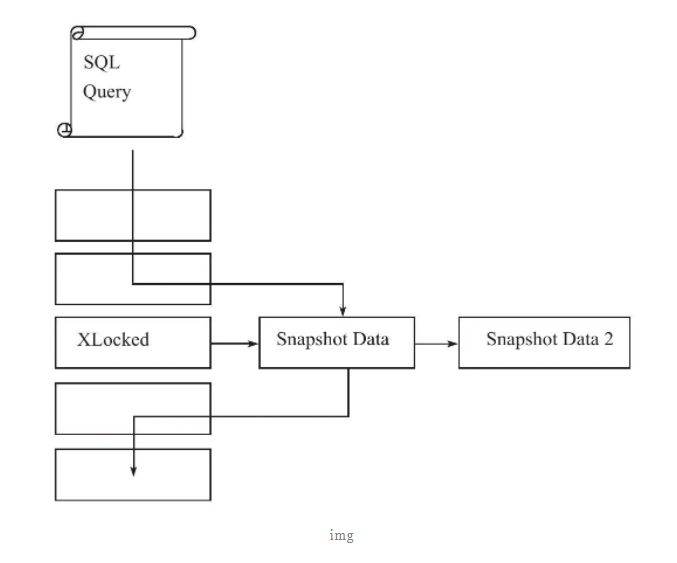

这么说可能还不是很好理解，举个例子，这个时候又得掏出我们经典的 user 表了（滑稽），表中包含三个字段 id、username、age，已存在一行记录：

```
id = 1, username = 'Jack', age = 20;
```

1）第一步，我们开启一个事务，执行如下语句：

```
事务 1:
 begin;
 select * from user where id = 1;
```

2）可以看到，第一个事务并没有提交，这时，我们开启第二个事务模拟并发，执行如下语句：

```
事务 2:
 begin;
 update user set id = 100 where id = 1;
```

3）在第二个事务中，将表中 id 为 1 的记录修改为了 id=100，但是事务同样没有提交（即此时 id = 1 的行记录被事务 2 加上了行锁）。这时如果在第一个事务中再次读取 id 为 1 的记录，那显然还是 1 对吧：

```
事务 1:
 select * from user where id = 1;
```

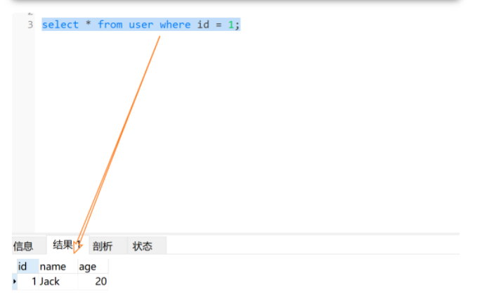

4）接着，我们再来提交下第 2 个事务中所作的修改：

```
事务 2:
 commit;
```

由于当前 `id = 1` 的数据被修改成了 100，也就是说，当前 `id = 100` 的行记录拥有了一个 `id = 1` 的历史版本。

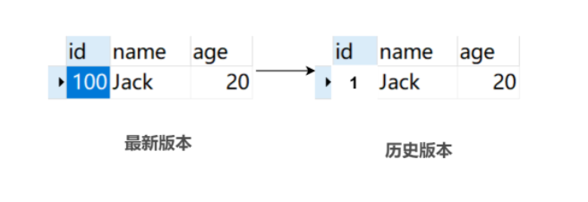

5）这个时候，再去事务 1 中读取 id 为 1 的记录，在 READ COMMITTED 和 REPEATABLE 事务隔离级别下得到结果就不一样了：

- 对于 READ COMMITTED 的事务隔离级别，由于事务 2 已经提交了，也就是说 id = 1 的行记录没有被事务 2 锁定，所以就会去读取该行的最新版本，即 id = 100，So， 在 READ COMMITTED 的事务隔离级别下，此时查询 id = 1 的结果是 Empty Set；
- 而在 REPEATABLE READ 事务隔离级别下，非一致性读总是读取事务开始时的行数据版本。也就是说，在事务 1 刚开始的时候，id = 1 的数据行是什么样，现在读到的就是什么样的：

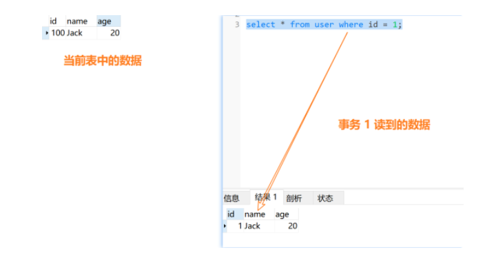

可以结合下面这张图来回顾下上述的过程：

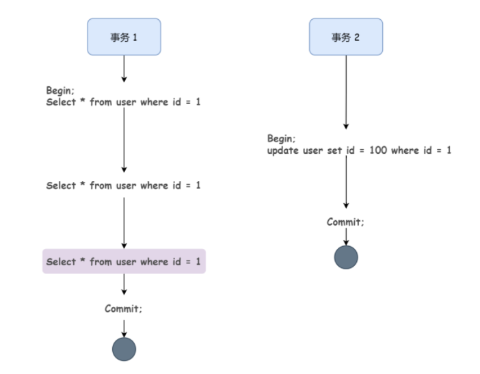


**一致性锁定读**

其实从名字上也能看出来，非一致性锁定读适用于对数据一致性要求不是很高的情况，比如在 READ COMMITTED 隔离级别下，即使行被锁定了，非一致性读也可以读到该行版本的最新一个快照。也即，非锁定读机制极大地提高了数据库的并发性。

而一致性锁定读适用于对数据一致性要求比较高的情况，这个时候我们需要对读操作进行加锁以保证数据逻辑的一致性。

InnoDB 存储引擎对读操作支持两种一致性锁定读方式，或者说对读操作支持两种加锁方式：

- `SELECT ... FOR UPDATE`，对于读取的行记录加一个 X 排它锁，其他事务不能对锁定的行加任何锁
- `SELECT ... LOCK IN SHARE MODE`，对于读取的行记录添加一个 S 共享锁。其它事务可以向被锁定的行加 S 锁，但是不允许添加 X 锁，否则会被阻塞住

So，如何用大白话解释一致性锁定读？上面这两条特殊的 select 语句就是一致性锁定读！一致性锁定读就是给行记录加 X 锁或 S 锁！

简单不？


### 5.4 Postgres MVCC实现

PostgreSQL使用MVCC的一种变体——快照隔离技术SI

**MVCC如何工作**

#### 5.4.1 事务标识符

每当事务开始时，事务管理器都会分配一个唯一标识符，称为事务 ID (txid)。PostgreSQL 的 txid 是一个 32 位无符号整数，大约为 42 亿。如果在事务开始后执行内置的txid_current()函数，该函数将返回当前的 txid。

```sql
postgres=# begin;
BEGIN
postgres=# select txid_current();
 txid_current 
--------------
          565
(1 row)
```

PostgreSQL 保留了以下三个特殊的 txid：

0表示无效的事物ID。

1表示Bootstrap txid，仅用于数据库集群的初始化。

2表示Frozen txid，冻结ID。

假设 txid=100，大于100的txid是它的未来，在txid 100中是不可见的；小于 100 的 txid 是它的过去 是可见的。PostgreSQL将txid视为一个圆圈。

之前的 21 亿是“过去”，接下来的 21 亿是“未来”。

没有为 BEGIN 命令分配 txid。

在PostgreSQL中，当执行完BEGIN命令后执行第一个命令时，事务管理器会分配一个tixd，然后它的事务就开始了。如下图：

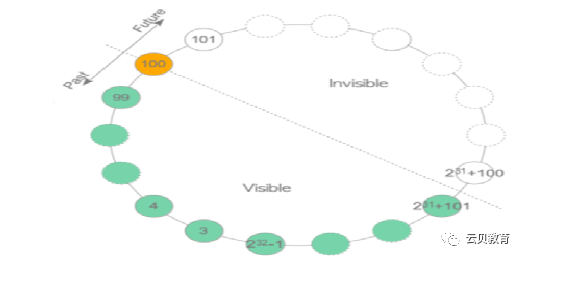

#### 5.4.2 元组结构

一个堆元组由三部分组成，即 HeapTupleHeaderData 结构、NULL 位图和用户数据。

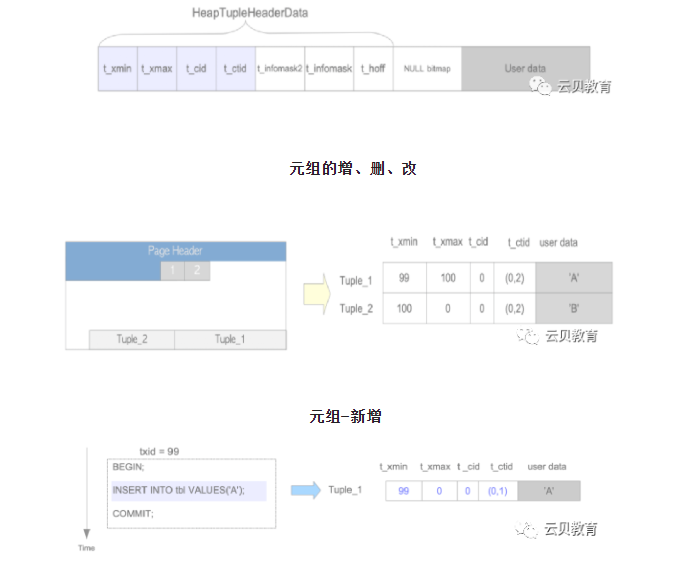

```sql
postgres=# CREATE EXTENSION pageinspect;


postgres=# CREATE TABLE tbl(data text);
CREATE TABLE


postgres=# INSERT INTO tbl VALUES('A'); 
INSERT 0 1


postgres=# SELECT lp as tuple , t_xmin , t_xmax , t_field3 as t_cid , t_ctid FROM heap_page_items ( get_raw_page ( 'tbl' , 0 )); 


 tuple | t_xmin | t_xmax | t_cid | t_ctid 
-------+--------+--------+-------+--------
     1 |    568 |      0 |     0 | (0,1)
(1 row)
```

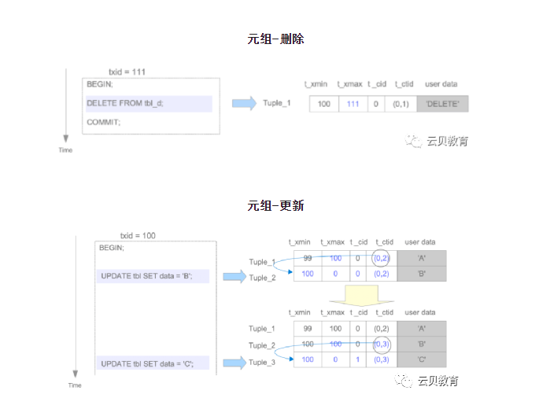

> 注意这里pg的增、删、改
>
> **Insert**: 插入一行新的记录，xmin=当前事务id，xmax=0
>
> **Delete**: 并不是真正的删除，而是把原来记录的 xmax 修改为当前事务id
>
> **Update**: 并不是真正的更新，而是插入一行新的记录，xmin=当前事务id，xmax=0；注意：要把原来记录的 xmax 置为当前事务的id。

#### 5.4.3 空间映射

在插入堆或索引元组时，PostgreSQL 使用对应表或索引的FSM来选择可以插入它的页面。

所有表和索引都有各自的 FSM。每个 FSM 将有关每个页面的可用空间容量的信息存储在相应的表或索引文件中。

所有 FSM 都以后缀“fsm”存储，如有必要，它们会加载到共享内存中。

FSM文件产生于表被第一次vacuum时，如下：

```sql
pg_freespacemap


postgres=#  CREATE EXTENSION pg_freespacemap;
CREATE EXTENSION


postgres=# SELECT *, round(100 * avail/8192 ,2) as "freespace ratio" FROM pg_freespace('test');


 blkno | avail | freespace ratio 
-------+-------+-----------------
     0 |  7744 |           94.00


(1 row)
```


#### 5.4.4 Commit Log

PostgreSQL 在Commit Log 中保存事务的状态。Commit Log，通常称为clog，分配给共享内存，并在整个事务处理过程中使用。

事务状态，PostgreSQL 定义了四种事务状态，

即IN_PROGRESS、COMMITTED、ABORTED 和 SUB_COMMITTED。

前三个状态是显而易见的。例如，当一个事务在进行中时，它的状态是 IN_PROGRESS 等。SUB_COMMITTED 用于子事务。

如何工作？

clog在逻辑上是一个数据,存储在共享内存区中,由一系列8KB页面组成。数组的序号，索引对应着相应事务的标识。其内容则是相应的事务状态。

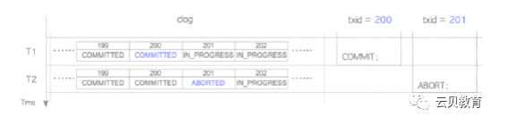

T1：txid 200 提交；txid 200 的状态从 IN_PROGRESS 更改为 COMMITTED。

T2：txid 201 中止；txid 201 的状态从 IN_PROGRESS 更改为 ABORTED。


#### 5.4.5 clog维护

当 PostgreSQL 关闭或 checkpoint 进程运行时，clog 的数据被写入存储在pg_xact子目录下的文件中。这些文件被命名为0000、0001等。最大文件大小为 256 KB。

当clog使用8个页面（第一页到第八页；总大小为64 KB）时，将其数据写入0000（64 KB），当使用第37个页面时（296 KB）数据会写入 0000 和 0001两个文件中，其大小分别为 256 KB 和 40 KB。

当 PostgreSQL 启动时，存储在 pg_clog 的文件（pg_xact 的文件）中的数据被加载以初始化 clog。


#### 5.4.6 事务快照

事务快照是一个数据集，存储着某个特定事务,在某个特定的时间点,所看到的事务状态信息，哪些事务处于活跃状态。活跃状态意味着事务正在进行中或还没有开始。

内置函数查询快照情况

```sql
SELECT txid_current_snapshot (); 
 txid_current_snapshot 
----------------------- 
100 : 104 : 100 , 102
```

txid_current_snapshot 的文本表示为'xmin:xmax:xip_list'，各部分描述如下。

xmin

最早仍然活跃的事务的txid,所有比它跟早的事务(txid < xmin),要么已经提交并可见,要么已经回滚并生成死元组。

xmax

第一个尚未分配的 txid。所有txid>xmax的事物在获取快照时尚未启动,因此其结果对当前事务不可见。

xip_list

获取快照时,活跃事物的txid列表,该列表仅包含xmin与xmax之间的txid。

> xip_list一定包含xmin，并且一定不包含xmax

例如在快照100:104:100,102中

xmin是100，xmax是104，而xip_list为100,102。

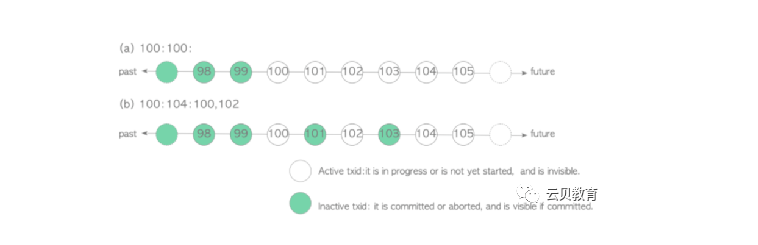

1.活跃的txid,正在运行中,或仍未开始的事务不可见。

2.不活跃的txid,已经提交或中止的事务，如果提交了就可见。

txid < 100的事务不活跃

txid > 104的事务是活跃的

txid等于100和102的事务是活跃的,因为它们在xip_list中，而txid等于101和103的事务不活跃。


#### 5.4.7 可见性检查规则

可见性检查是一组规则,用于**确定一条元祖是否对一个事务可见**,可见性检查规则会用到元祖的t_xmin和t_xmax，提交日志Clog.

```sql

Status of t_xmin is ABORTED 元祖始终不可见
 /* t_xmin status == ABORTED */
Rule 1: IF t_xmin status is 'ABORTED' THEN
                 RETURN 'Invisible'
           END IF


Status of t_xmin is IN_PROGRESS 元祖基本上不可见
 /* t_xmin status == IN_PROGRESS */
            IF t_xmin status is 'IN_PROGRESS' THEN
               IF t_xmin = current_txid THEN
Rule 2:              IF t_xmax = INVALID THEN
                           RETURN 'Visible'
Rule 3:              ELSE  /* this tuple has been deleted or updated by the current transaction itself. */
                           RETURN 'Invisible'
                     END IF
Rule 4:        ELSE   /* t_xmin ≠ current_txid */
                        RETURN 'Invisible'
               END IF
            END 
            


Status of t_xmin is COMMITTED 是可见的。
 
/* t_xmin status == COMMITTED */
            IF t_xmin status is 'COMMITTED' THEN
Rule 5:      IF t_xmin is active in the obtained transaction snapshot THEN
                     RETURN 'Invisible'
Rule 6:      ELSE IF t_xmax = INVALID OR status of t_xmax is 'ABORTED' THEN
                     RETURN 'Visible'
                   ELSE IF t_xmax status is 'IN_PROGRESS' THEN
Rule 7:           IF t_xmax =  current_txid THEN
                           RETURN 'Invisible'
Rule 8:           ELSE  /* t_xmax ≠ current_txid */
                           RETURN 'Visible'
                     END IF
                   ELSE IF t_xmax status is 'COMMITTED' THEN
Rule 9:           IF t_xmax is active in the obtained transaction snapshot THEN
                           RETURN 'Visible'
Rule 10:         ELSE
                           RETURN 'Invisible'
                     END IF
                   END IF
                   


大总结：
Rule 1: If Status(t_xmin) = ABORTED ⇒ Invisible


Rule 2: If Status(t_xmin) = IN_PROGRESS ∧ t_xmin = current_txid ∧ t_xmax = INVAILD ⇒ Visible


Rule 3: If Status(t_xmin) = IN_PROGRESS ∧ t_xmin = current_txid ∧ t_xmax ≠ INVAILD ⇒ Invisible


Rule 4: If Status(t_xmin) = IN_PROGRESS ∧ t_xmin ≠ current_txid ⇒ Invisible


Rule 5: If Status(t_xmin) = COMMITTED ∧ Snapshot(t_xmin) = active ⇒ Invisible
# Rule5这种情况是存在的，因为快照不是即时更新的，有可能先拿快照，然后事务提交


Rule 6: If Status(t_xmin) = COMMITTED ∧ (t_xmax = INVALID ∨ Status(t_xmax) = ABORTED) ⇒ Visible


Rule 7: If Status(t_xmin) = COMMITTED ∧ Status(t_xmax) = IN_PROGRESS ∧ t_xmax = current_txid ⇒ Invisible


Rule 8: If Status(t_xmin) = COMMITTED ∧ Status(t_xmax) = IN_PROGRESS ∧ t_xmax ≠ current_txid ⇒ Visible


Rule 9: If Status(t_xmin) = COMMITTED ∧ Status(t_xmax) = COMMITTED ∧ Snapshot(t_xmax) = active ⇒ Visible
# 为什么Rule8 和 Rule9的xmax对应的事务是进行中或者活跃的才对其他事务可见，因为这就是读已提交的实现原理，只在并发事务时有效，如果xmax是不活跃的，说明xmax对应事务已经committed或aborted，若为abort的，那么可见，若为committed，肯定不可见，因为这属于死元组，因为这个元组要么已经被删除，肯定不可见，要么就是被修改，则插入了一个新的元组，这个事务要读这个新元组才对

Rule 10: If Status(t_xmin) = COMMITTED ∧ Status(t_xmax) = COMMITTED ∧ Snapshot(t_xmax) ≠ active ⇒ Invisible
```


在Postgres中，每一个事务都会得到一个被称作为 XID 的事务ID。这里说的事务不仅仅是被 BEGIN - COMMIT 包裹的一组语句，还包括单条的insert、update或者delete语句。当一个事务开始时，Postgres递增XID，然后把它赋给这个事务。Postgres还在系统里的每一行记录上都存储了事务相关的信息，这被用来判断某一行记录对于当前事务是否可见。

> pg的xmin相当于MySQL里的trx_id

举个例子，当你插入一行记录时，Postgres会把当前事务的XID存储在这一行中并称之为 xmin 。只有那些已提交的而且 xmin比当前事务的XID小的记录对当前事务才是可见的。这意味着，你可以开始一个新事务然后插入一行记录，直到你提交（ COMMIT ）之前，你插入的这行记录对其他事务永远都是不可见的。等到提交以后，其他后创建的新事务就可以看到这行新记录了，因为他们满足了 xmin < XID 条件，而且创建那一行记录的事务也已经完成。

> pg在每一行后面会存`xmin`和`xmax`，分别对应`insert`操作和`update/delete`操作。

对于 DELETE 和 UPDATE 来说，机制也是类似的，但不同的是对于它们Postgres使用叫做 xmax 的值来判断数据的可见性。这幅图展示了在两个并发的插入/读取数据的事务中，MVCC在事务隔离方面是怎么起作用的。

> `xmin`和`xmax`不仅实现了postgres的mvcc，也实现了事务隔离级别！

在下面的图中，假设我们先执行了这个建表语句：
代码如下:CREATE TABLE numbers (value int);

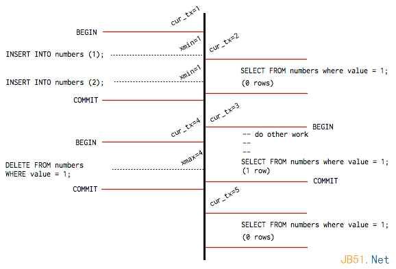

虽然 xmin 和 xmax 的值在日常使用中都是被隐藏的，但是你可以直接请求他们，Postgres会高兴的把值给你：
代码如下:SELECT *, xmin, xmax FROM numbers;
获取当前事务的XID也很简单：
代码如下:SELECT txid_current();

```sql
postgres=# select lp,t_xmin,t_xmax,t_ctid,t_infomask,t_data from heap_page_items(get_raw_page('t1',0));
 lp | t_xmin | t_xmax | t_ctid | t_infomask |   t_data   
----+--------+--------+--------+------------+------------
  1 |    625 |      0 | (0,1)  |       2304 | \x01000000
  2 |    626 |      0 | (0,2)  |       2560 | \x02000000
  3 |    627 |      0 | (0,3)  |       2304 | \x16000000
  4 |    628 |      0 | (0,4)  |       2560 | \x03000000
  5 |    629 |      0 | (0,5)  |       2304 | \x21000000
(5 rows)
postgres=# select ctid,xmin,* from t1;
 ctid  | xmin | i  
-------+------+----
 (0,1) |  625 |  1
 (0,3) |  627 | 22
 (0,5) |  629 | 33
(3 rows)

postgres=#
```


**MVCC的缺点**

现在你已经知道MVCC和事务隔离是怎么工作了吧，你获得了又一个工具用来解决这类问题： 可串行化事务隔离级别 迟早会派上用场。然而MVCC的优点虽然很明显但它也存在着一些缺点。

因为不同的事务会看到不同状态的记录，Postgres连那些可能过期的数据也需要保留着。这就是为什么 UPDATE 实际上是创建一行新纪录而 DELETE 并不真正的删除记录（它只是简单的把记录标记成已删除然后设置xmax的值）的原因。当事务完成后，数据库里会存在一些对以后的事务永远不可见的记录。它们被称作dead rows。MVCC带来的另外一个问题是，事务的ID只能不断的增加 - 它是32个bits，只能”支持大约四十亿个事务。当XID达到最大值后，它会变回零重新开始。突然间所有的记录都变成了发生在将来的事务所产生的，所有的新事务都没有办法访问到这些旧记录了。

> 事务id回卷的一个解决方案是，限制同时存在的任务数为`2^31`个，并使用如下公式：
>
> ((int32)(id1 - id2)) < 0
>
> 当事务id没有回卷时，该公式返回真，表示事务id1比事务id2更早，可以直接比较大小；
>
> 当事务id回卷时，如id1=4294967295，id2=5，id1-id2=4294967290，这是一个正数，但转换成有符号的int32时，由于超过了有符号数的取值范围，会转换成一个负数，所以这对事务id回卷的情况也适用。

上面说到的dead row和事务XID循环问题都是通过执行VACUUM命令（Postgres用来执行清理操作的命令）来解决的。这应该成为一个例行的维护，所以Postgres自带了auto_vacuum守护进程会在一个可配置的周期内自动执行清理。留意点auto_vacuum很重要，因为在不同的部署环境中需要执行清理的周期也会不同。你可以在Postgres的文档里找到关于VACUUM的更多说明。


#### 5.4.8 需要维护的过程

PostgreSQL 的并发控制机制需要以下维护流程。

1.删除死元组及指向死元组的索引元祖。

2.移除提交日志中非必要的部分。

3.冻结旧的事务标识。

4.更新FSM、VM及统计信息

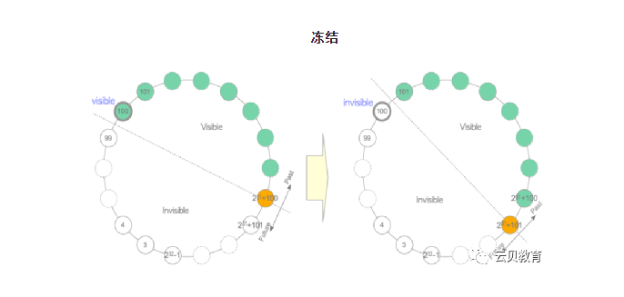

假设元祖Tuple_1是由txid=100事务创建的,即Tuple_1的t_xmin=100,服务器运行了很长时间。

但是Tuple_1一直未曾被修改,假设txid已经前进到2^31+100，这时候正好执行一条select命令。

此时因为对当前事务而言txid=100的事务属于过去的事务，所以Tuple_1对当前事务可见,

然后再执行相同的select命令,此时txid前进至2^31+101，但对当前事务而言,txid=100的事务是属于未来的,因此Tuple_1不再可见,这就是事务回卷。

为了解决这个问题，PostgreSQL 引入了一个叫做freeze txid的概念，并实现了一个叫做FREEZE的过程。

在 PostgreSQL 中定义了一个冻结的 txid，它是一个特殊的保留 txid 2，被定义为总是比所有其他 txid 旧。

换句话说，冻结的 txid 始终处于非活动状态且可见。

vacuum过程会调用冻结过程。冻结的过程将扫描所有表文件,如果 t_xmin 值早于当前 txid 减去vacuum_freeze_min_age（默认值为 5000 万）更旧，则将该元祖的t_xmin重写为冻结事务标识。

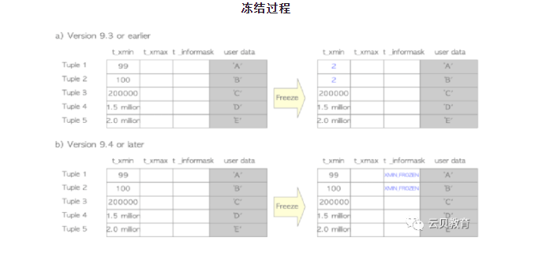


#### 5.4.9 postgres的事务隔离级别

干净利落！

> 注意！postgres的事务隔离级别并不是用锁来实现的！MySQL才是！

我知道你现在在想：要是同时有两个事务修改同一行数据会怎么样？这就是事务隔离级别（transaction isolation levels）登场的时候了。Postgres支持两个基本的模型来让你控制应该怎么处理这样的情况。默认情况下使用 读已提交（READ COMMITTED） ，等待初始的事务完成后再读取行记录然后执行语句。如果在等待的过程中记录被修改了，它就从头再来一遍。举一个例子，当你执行一条带有 WHERE 子句的 UPDATE 时， WHERE 子句会在最初的事务被提交后返回命中的记录结果，如果这时 WHERE 子句的条件仍然能得到满足的话， UPDATE 才会被执行。在下面这个例子中，两个事务同时修改同一行记录，最初的 UPDATE 语句导致第二个事务的 WHERE 不会返回任何记录，因此第二个事务根本没有修改到任何记录：

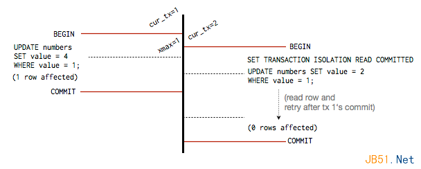

如果你需要更好的控制这种行为，你可以把事务隔离级别设置为 可串行化（SERIALIZABLE） 。在这个策略下，上面的场景会直接失败，因为它遵循这样的规则：“如果我正在修改的行被其他事务修改过的话，就不再尝试”，同时 Postgres会返回这样的错误信息： 由于并发修改导致无法进行串行访问 。捕获这个错误然后重试就是你的应用需要去做的事情了，或者不重试直接放弃也行，如果那样合理的话。

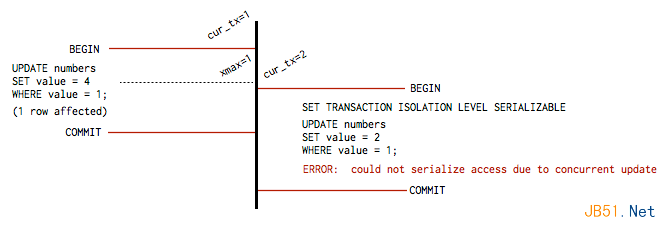


**下面其实是一个很大的误区！**

> **读读并发**是天然支持的，**读写并发**是MVCC做的事，**写写并发**才是事务隔离级别做的事儿！

postgres的 mvcc 机制可以实现读不阻塞写，写不阻塞读。如果两个事务同时写一行数据，则必须使用事务隔离级别。

postgres的读已提交的实现原理：

* 读已提交就是只能读到已提交的事务修改的数据。如果pg将隔离级别设置为读已提交，假设有两个并发事务A和B，事务A要对一个元组进行写，事务B对同一个元组进行读；
  * 先看看事务A干了什么事儿：事务A先修改了数据，会把该元组的xmax设置为自己的txid，并且插入一行新的元组，xmin设置为自己的txid
  * 当事务B去读这行新插入的记录，是读不到的，因为这行记录的xmin是当前事务快照的活跃事务修改的，该事务还未提交，所以新插入的元组对事务B不可见。事务B转而读取该记录的历史版本，因为历史元组的xmin对应事务已提交，并且xmax在自己的活跃事务列表里，那么历史元组是可见的，所以事务B只能读到已提交的数据。
* 那么将要读的记录的 xmin 和当前事务的 txid 和进行比较，如果满足 xmin < txid，再将 xmax 和 txid 进行比较，如果 xmax < txid，则说明该条记录对该事务是可见的。


postgres的可重复读的实现原理：

* 可重复读就是在同一个事务内，反复读取同一行记录的字段都是读到同样的值。将当前事务的 txid 和要读记录的 xmin 进行比较，如果满足 txid > xmin，再将 txid 和 xmax 进行比较，如果 txid < xmax，并且 xmax 不在当前事务开始时的事务快照的活跃事务列表里，说明 xmax 这行记录在该事务开始前就已经提交了，所以这行记录对该事务是可见的。


postgres的可串行化的实现原理：

* 可串行化就是宏观上像事务串行执行一样，可以解决幻读问题。实际上 pg 这种机制天然可以解决幻读，对于一个事务来说，如果它向表中插入了一行记录，那么这行记录的 xmin = current_txid，并且这行记录在事务提交前，对其他事务都是不可见的。只有当该事务提交后，该事务之后创建的事务才可以读到这行记录的值。


#### 5.4.10 postgres mvcc的优劣分析

Postgres的多版本机制与Java虚拟机的垃圾回收机制比较相像。事务提交前，只需要访问原来的数据即可；提交后，系统更新元组的存储标识，直到Vaccum进程收回为止。

相对于InnoDB和Oracle，Postgres的多版本优劣在于以下几点：

* 事务回滚可以立即完成，无论事务进行了多少操作，因为不需要频繁地做undo的操作。pg回滚事务只需要把事务状态设置为abort即可，元组层面不需要做任何事情。
* 数据可以进行很多更新，不必像Oracle和InnoDB那样需要经常保证回滚段不会被用完。

相对于InnoDB和Oracle，Postgres的多版本劣势在于以下几点：

* 旧版本数据需要清理。Postgres清理旧版本称为VACCUM，并提供了VACUUM命令进行清理。
* 旧版本的数据会导致查询更慢一些，因为旧版本的数据存储在数据文件中，查询时需要扫描更多的数据块。

> Postgres的多版本实现中首先要解决的问题就是原数据的空间释放问题。Postgres通过运行Vaccum进程来回收之前的存储空间，默认Postgres数据库中的AutoVaccum是打开的，也就是说，当一个表的更新量达到一定值时，AutoVaccum自动回收空间。当然也可以关闭AutoVaccum进程，然后在业务低峰期手动运行VACCUM命令来回收空间。

