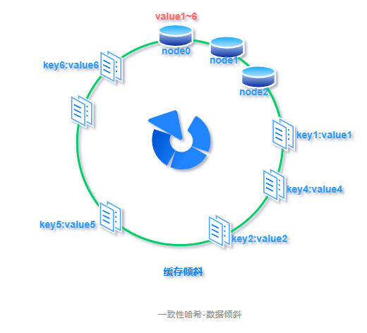

一般关于Redis面试官可能都是从你的项目中引出的问题，或者问你有没有用过除了MySQL以外的数据库等。

## Redis基础

### 1、说说你对Redis的了解

首先Redis是基于C语言编写的，而且是内存中的数据库，读写速度很快。在项目中也经常会使用Redis，一般会用来做缓存、或者分布式锁，也可以来设计消息队列，同时还支持**事务 、持久化、Lua 脚本、多种集群方案。**

**追问：与 Memcached 的区别是什么？**

现在公司一般都是用 Redis 来实现缓存，而且 Redis 自身也越来越强大了！不过，了解 Redis 和 Memcached 的区别和共同点，有助于我们在做相应的技术选型的时候，能够做到有理有据！

**共同点** ：

1. 都是基于内存的数据库，一般都用来当做缓存使用。
2. 都有过期策略。
3. 两者的性能都非常高。

**区别** ：

1. Redis 支持更丰富的数据类型（支持更复杂的应用场景）。Redis 不仅仅支持简单的 k/v 类型的数据，同时还提供 list，set，zset，hash 等数据结构的存储。Memcached 只支持最简单的 k/v 数据类型。
2. Redis 支持数据的持久化，可以将内存中的数据保持在磁盘中，重启的时候可以再次加载进行使用,而 Memecache 把数据全部存在内存之中。
3. Redis 有灾难恢复机制。因为可以把缓存中的数据持久化到磁盘上。
4. Redis 在服务器内存使用完之后，可以将不用的数据放到磁盘上。但是，Memcached 在服务器内存使用完之后，就会直接报异常。
5. Memcached 没有原生的集群模式，需要依靠客户端来实现往集群中分片写入数据；但是 Redis 目前是原生支持 cluster 模式的。
6. Memcached 是多线程，非阻塞 IO 复用的网络模型；Redis 使用单线程的多路 IO 复用模型。（Redis 6.0 引入了多线程 IO ）
7. Redis 支持发布订阅模型、Lua 脚本、事务等功能，而 Memcached 不支持。并且，Redis 支持更多的编程语言。
8. Memcached过期数据的删除策略只用了惰性删除，而 Redis 同时使用了惰性删除与定期删除。


### 2、Redis有哪些数据类型

回答：常见的有五种基本数据类型和三种特殊数据类型，

基本数据结构：String、 list、set、zset和hash，三种特殊数据类型：位图(bitmaps) 、计数器(hyperloglogs)和地理空间(geospatial indexes)。

String：一般常用在需要计数的场景，比如用户的访问次数、热点文章的点赞转发数量等等。

list：发布与订阅或者说消息队列、慢查询。

hash：系统中对象数据的存储。

set：需要存放的数据不能重复以及需要获取多个数据源交集和并集等场景

zset：需要对数据根据某个权重进行排序的场景。比如在直播系统中，实时排行信息包含直播间在线用户列表，各种礼物排行榜，弹幕消息（可以理解为按消息维度的消息排行榜）等信息。

建议看看Zset的底层数据结构，面试也会被问到。


### 3、Redis有哪几种持久化方式？优缺点是什么？

**持久化**就是把内存的数据写到磁盘中去，防止服务宕机了内存数据丢失。Redis 提供了两种持久化方式:RDB（默认）快照方式 和AOF追加方式。

**RDB(Redis DataBase)**:通过创建快照来获取存储在内存里面的数据在某个时间点上的副本。在创建快照之后，用户可以对快照进行备份，可以将快照复制到其他服务器从而创建相同数据的服务器副本。（如果系统真的发生崩溃，用户将丢失最近一次生成快照之后更改的所有数据。）

**AOF(Append Only File)**：将被执行的**写命令**写到AOF文件的末尾。

比较：

1. AOF文件比RDB更新频率高，优先使用AOF还原数据。

2. AOF比RDB更安全也更大

3. RDB性能比AOF好

4. 如果两个都配了优先加载AOF

   

### 4、Redis数据过期后的删除策略？

常用的过期数据的删除策略就两个（重要！自己造缓存轮子的时候需要格外考虑的东西）：

1. **惰性删除** ：只会在取出key的时候才对数据进行过期检查。这样对CPU最友好，但是可能会造成太多过期 key 没有被删除。
2. **定期删除** ：每隔一段时间抽取一批 key 执行删除过期key操作。并且，Redis 底层会通过限制删除操作执行的时长和频率来减少删除操作对CPU时间的影响。

定期删除对内存更加友好，惰性删除对CPU更加友好。两者各有千秋，所以Redis 采用的是 **定期删除+惰性/懒汉式删除** 。

但是，仅仅通过给 key 设置过期时间还是有问题的。因为还是可能存在定期删除和惰性删除漏掉了很多过期 key 的情况。这样就导致大量过期 key 堆积在内存里，然后就Out of memory了。


### 5、Redis的数据淘汰策略有哪些？

Redis 提供 6 种数据淘汰策略：

1. **volatile-lru（least recently used）**：从已设置过期时间的数据集（server.db[i].expires）中挑选最近最少使用的数据淘汰
2. **volatile-ttl**：从已设置过期时间的数据集（server.db[i].expires）中挑选将要过期的数据淘汰
3. **volatile-random**：从已设置过期时间的数据集（server.db[i].expires）中任意选择数据淘汰
4. **allkeys-lru（least recently used）**：当内存不足以容纳新写入数据时，在键空间中，移除最近最少使用的 key（这个是最常用的）
5. **allkeys-random**：从数据集（server.db[i].dict）中任意选择数据淘汰
6. **no-eviction**：禁止驱逐数据，也就是说当内存不足以容纳新写入数据时，新写入操作会报错。这个应该没人使用吧！


### 6、什么是缓存穿透？如何避免？什么是缓存击穿，如何避免？什么是缓存雪崩？何如避免？

**缓存穿透：**一般的缓存系统，都是按照key去缓存查询，如果不存在对应的value，就应该去后端系统查找（比如DB）。一些恶意的请求会故意查询不存在的key,请求量很大，就会对后端系统造成很大的压力。这就叫做缓存穿透。

**如何避免？**1：对查询结果为空的情况也进行缓存，缓存时间设置短一点，或者该key对应的数据insert了之后清理缓存。2：对一定不存在的key进行过滤。可以把所有的可能存在的key放到一个大的Bitmap中，查询时通过该bitmap过滤。

**缓存击穿**：对于设置了过期时间的 key，缓存在某个时间点过期的时候，恰好这时间点对这个 Key 有大量的并发请求过来，这些请求发现缓存过期一般都会从后端 DB 加载数据并回设到缓存，这个时候大并发的请求可能会瞬间把 DB 压垮。

**如何避免？**：1.使用互斥锁：当缓存失效时，不立即去 load db，先使用如 Redis 的 setnx 去设置一个互斥锁，当操作成功返回时再进行 load db 的操作并回设缓存，否则重试 get 缓存的方法。2.永远不过期：物理不过期，但逻辑过期（后台异步线程去刷新）。

**缓存雪崩：**当缓存服务器重启或者大量缓存集中在某一个时间段失效，这样在失效的时候，会给后端系统带来很大压力。导致系统崩溃。

**如何避免？**1：在缓存失效后，通过加锁或者队列来控制读数据库写缓存的线程数量。比如对某个key只允许一个线程查询数据和写缓存，其他线程等待。2：做二级缓存，A1为原始缓存，A2为拷贝缓存，A1失效时，可以访问A2，A1缓存失效时间设置为短期，A2设置为长期 3：不同的key，设置不同的过期时间，让缓存失效的时间点尽量均匀


### 7、使用过Redis分布式锁么，它是怎么实现的？

先拿setnx来争抢锁，抢到之后，再用expire给锁加一个过期时间防止锁忘记了释放。**如果在setnx之后执行expire之前进程意外crash或者要重启维护了，那会怎么样？**set指令有非常复杂的参数，这个应该是可以同时把setnx和expire合成一条指令来用的！


### 8、如果解决数据不一致问题/如何保证缓存一致性？

对于缓存和数据库的操作，主要有以下两种方式。

#### （1）先删缓存，再更新数据库

先删除缓存，数据库还没有更新成功，此时如果读取缓存，缓存不存在，去数据库中读取到的是旧值，缓存不一致发生。


解决方案：

**延时双删**

延时双删的方案的思路是，为了避免更新数据库的时候，其他线程从缓存中读取不到数据，就在更新完数据库之后，再sleep一段时间，然后再次删除缓存。

sleep的时间要对业务读写缓存的时间做出评估，sleep时间大于读写缓存的时间即可。

流程如下：

1. 线程1删除缓存，然后去更新数据库
2. 线程2来读缓存，发现缓存已经被删除，所以直接从数据库中读取，这时候由于线程1还没有更新完成，所以读到的是旧值，然后把旧值写入缓存
3. 线程1，根据估算的时间，sleep，由于sleep的时间大于线程2读数据+写缓存的时间，所以缓存被再次删除
4. 如果还有其他线程来读取缓存的话，就会再次从数据库中读取到最新值


#### （2）先更新数据库，再删除缓存

如果反过来操作，先更新数据库，再删除缓存呢？

这个就更明显的问题了，更新数据库成功，如果删除缓存失败或者还没有来得及删除，那么，其他线程从缓存中读取到的就是旧值，还是会发生不一致。


解决方案

**消息队列**

这是网上很多文章里都有写过的方案。但是这个方案的缺陷会更明显一点。

先更新数据库，成功后往消息队列发消息，消费到消息后再删除缓存，借助消息队列的重试机制来实现，达到最终一致性的效果。


这个解决方案其实问题更多。

1. 引入消息中间件之后，问题更复杂了，怎么保证消息不丢失更麻烦
2. 就算更新数据库和删除缓存都没有发生问题，消息的延迟也会带来短暂的不一致性，不过这个延迟相对来说还是可以接受的


**进阶版消息队列**

为了解决缓存一致性的问题单独引入一个消息队列，太复杂了。

其实，一般大公司本身都会有监听binlog消息的消息队列存在，主要是为了做一些核对的工作。

这样，我们可以借助监听binlog的消息队列来做删除缓存的操作。这样做的好处是，不用你自己引入，侵入到你的业务代码中，中间件帮你做了解耦，同时，中间件的这个东西本身就保证了高可用。

当然，这样消息延迟的问题依然存在，但是相比单纯引入消息队列的做法更好一点。

而且，如果并发不是特别高的话，这种做法的实时性和一致性都还算可以接受的。


#### （3）其他解决方案

**设置缓存过期时间**

每次放入缓存的时候，设置一个过期时间，比如5分钟，以后的操作只修改数据库，不操作缓存，等待缓存超时后从数据库重新读取。

如果对于一致性要求不是很高的情况，可以采用这种方案。

这个方案还会有另外一个问题，就是如果数据更新的特别频繁，不一致性的问题就很大了。

在实际生产中，我们有一些活动的缓存数据是使用这种方式处理的。

因为活动并不频繁发生改变，而且对于活动来说，短暂的不一致性并不会有什么大的问题。


#### （4）为什么是删除，而不是更新缓存？

我们以**先更新数据库，再删除缓存**来举例。

如果是更新的话，那就是**先更新数据库，再更新缓存**。

举个例子：如果数据库1小时内更新了1000次，那么缓存也要更新1000次，但是这个缓存可能在1小时内只被读取了1次，那么这1000次的更新有必要吗？

反过来，如果是删除的话，就算数据库更新了1000次，那么也只是做了1次缓存删除，只有当缓存真正被读取的时候才去数据库加载。


#### （5）总结

首先，我们要明确一点，缓存不是更新，而应该是删除。

删除缓存有两种方式：

1. 先删除缓存，再更新数据库。解决方案是使用延迟双删。
2. 先更新数据库，再删除缓存。解决方案是消息队列或者其他binlog同步，引入消息队列会带来更多的问题，并不推荐直接使用。

针对缓存一致性要求不是很高的场景，那么只通过设置超时时间就可以了。

其实，如果不是很高的并发，无论你选择先删缓存还是后删缓存的方式，都几乎很少能产生这种问题，但是在高并发下，你应该知道怎么解决问题。


## Redis负载均衡

### 1、缓存系统负载均衡

在分布式集群缓存的负载均衡实现中，比如 memcached 缓存集群，需要把缓存数据的 key 利用哈希函数散列，这样缓存数据能够均匀分布到各个分布式存储节点上，要实现这样的负载均衡一般可以用哈希算法来实现。下图演示了这一分布式存储过程：


### 2、普通哈希算法负载均衡

前面我们介绍过各种散列方法，不管是选择上述哪种散列方法，在这个应用场景下，都是要把缓存数据利用哈希函数均匀的映射到服务器集群上，我们就选择简单的「取模法」来说明这个过程。

**假设有 3 个服务器节点编号 [0 - 2]，6 个缓存键值对编号 [1 - 6]，则完成哈希映射之后，三个缓存数据映射情况如下：**

```
哈希计算公式：key % 节点总数 = Hash节点下标
1 % 3 = 1
2 % 3 = 2
3 % 3 = 0
4 % 3 = 1
5 % 3 = 2
6 % 3 = 0
```


每个连接都均匀的分散到了三个不同的服务器节点上，看起来很完美！

但是，在分布式集群系统的负载均衡实现上，这种模型有两个问题：

#### （1）扩展能力差

为了动态调节服务能力，服务节点经常需要扩容缩容。打个比方，如果是电商服务，双十一期间的服务机器数量肯定要比平常大很多，新加进来的机器会使原来计算的哈希值不准确，为了达到负载均衡的效果，要重新计算并更新哈希值，对于更新后哈希值不一致的缓存数据，要迁移到更新后的节点上去。

**假设新增了 1 个服务器节点，由原来的 3 个服务节点变成 4 个节点编号 [0 - 3]，哈希映射情况如下：**

```
哈希计算公式：key % 节点总数 = Hash节点下标
1 % 4 = 1
2 % 4 = 2
3 % 4 = 3
4 % 4 = 0
5 % 4 = 1
6 % 4 = 2
```

可以看到后面三个缓存 key ：4、5、6 对应的存储节点全部失效了，这就需要把这几个节点的缓存数据迁移到更新后的节点上 (费时费力) ，也就是由原来的节点 [1, 2, 0] 迁移到节点 [0, 1, 2]，迁移后存储示意图如下：


#### （2）容错能力不强

线上环境服务节点虽然有各种高可用性保证，但还是是有宕机的可能，即使没有宕机也有缩容的需求。不管是宕机和缩容都可以归结为服务节点删除的情况，下面分析下服务节点删除对负载均衡哈希值的影响。

**假设删除 1 个服务器节点，由最初的 3 个服务节点变成 2 个，节点编号 [0 - 1]，哈希映射情况如下：**

```
哈希计算公式：key % 节点总数 = Hash节点下标
1 % 2 = 1
2 % 2 = 0
3 % 2 = 1
4 % 2 = 0
5 % 2 = 1
6 % 2 = 0
```

下图展示普通哈希负载均衡算法在一个节点宕机时候，导致的的缓存数据迁移分布情况：


如图所见，在这个例子中，仅仅删除了一个服务节点，也导致了哈希值的大面积更新，哈希值的更新也是意味着节点缓存数据的迁移（缓存数据表示心好累）。

### 3、一致性哈希算法负载均衡

正是由于普通哈希算法实现的缓存负载均衡存在扩展能力和容错能力差问题，所以我们引入一致性哈希算法，那么什么是一致性哈希呢？先来看下wiki上对一致性Hash的定义

> 一致哈希由 MIT 的 David Karger 及其合作者提出，现在这一思想已经扩展到其它领域。在这篇1997年发表的学术论文中介绍了一致哈希如何应用于用户易变的分布式Web服务中。一致哈希也可用于实现健壮缓存来减少大型Web应用中系统部分失效带来的负面影响。

这篇描述一致性哈希的论文发表于1997年，阅读无障碍的同学可以直接看看大佬的论文理解更深刻，附上论文下载链接：http://citeseerx.ist.psu.edu/viewdoc/summary?doi=10.1.1.147.1879


**一句话概括一致性哈希：就是普通取模哈希算法的改良版，哈希函数计算方法不变，只不过是通过构建环状的 Hash 空间代替普通的线性 Hash 空间**。具体做法如下：

首先，选择一个足够大的Hash空间（一般是 0 ~ 2^32）构成一个哈希环。


然后，对于缓存集群内的每个存储服务器节点计算 Hash 值，可以用服务器的 IP 或 主机名计算得到哈希值，计算得到的哈希值就是服务节点在 Hash 环上的位置。


最后，对每个需要存储的数据 key 同样也计算一次哈希值，计算之后的哈希也映射到环上，**数据存储的位置是沿顺时针的方向找到的环上的第一个节点**。下图举例展示了节点存储的数据情况，我们下面的说明也是基于目前的存储情况来展开。


**原理讲完了，来看看为什么这样的设计能解决上面普通哈希的两个问题**。

#### （1）扩展能力提升

前面我们分析过，普通哈希算法当需要扩容增加服务节点的时候，会导致原油哈希映射大面积失效。现在，我们来看下一致性哈希是如何解决这个问题的。

如下图所示，当缓存服务集群要新增一个节点node3时，受影响的只有 key3 对应的数据 value3，**此时只需把 value3 由原来的节点 node0 迁移到新增节点 node3 即可，其余节点存储的数据保持不动**。


#### （2）容错能力提升

普通哈希算法当某一服务节点宕机下线，也会导致原来哈希映射的大面积失效，失效的映射触发数据迁移影响缓存服务性能，容错能力不足。一起来看下一致性哈希是如何提升容错能力的。

如下图所示，假设 node2 节点宕机下线，则原来存储于 node2 的数据 value2 和 value5 ，只需按顺时针方向选择新的存储节点 node0 存放即可，不会对其他节点数据产生影响。**一致性哈希能把节点宕机造成的影响控制在顺时针相邻节点之间，避免对整个集群造成影响**。


#### （3）一致性哈希的优化

上面展示了一致性哈希如何解决普通哈希的扩展和容错问题，原理比较简单，在理想情况下可以良好运行，但在实际使用中还有一些实际问题需要考虑，下面具体分析。

**数据倾斜**

试想一下若缓存集群内的服务节点比较少，就像我们例子中的三个节点，而哈希环的空间又有很大（一般是 0 ~ 2^32），这会导致什么问题呢？

可能的一种情况是，较少的服务节点哈希值聚集在一起，比如下图所示这种情况 node0 、node1、node2 聚集在一起，缓存数据的 key 哈希都映射到 node2 的顺时针方向，数据按顺时针寻找存储节点就导致全都存储到 node0 上去，给单个节点很大的压力！**这种情况称为数据倾斜**。



**节点雪崩**

数据倾斜和节点宕机都可能会导致缓存雪崩。


拿前面数据倾斜的示例来说，数据倾斜导致所有缓存数据都打到 node0 上面，有可能会导致 node0 不堪重负被压垮了，node0 宕机，数据又都打到 node1 上面把 node1 也打垮了，node1 也被打趴传递给 node2，**这时候故障就像像雪崩时滚雪球一样越滚越大**。

**还有一种情况是节点由于各种原因宕机下线**。比如下图所示的节点 node2 下线导致原本在node2 的数据压到 node0 , 在数据量特别大的情况下也可能导致节点雪崩，具体过程就像刚才的分析一样。

总之，连锁反应导致的整个缓存集群不可用，**就称为节点雪崩**。


**虚拟节点**

那该如何解决上述两个棘手的问题呢？可以通过「虚拟节点」的方式解决。

所谓虚拟节点，就是对原来单一的物理节点在哈希环上虚拟出几个它的分身节点，这些分身节点称为「虚拟节点」。打到分身节点上的数据实际上也是映射到分身对应的物理节点上，这样一个物理节点可以通过虚拟节点的方式均匀分散在哈希环的各个部分，**解决了数据倾斜问题**。

由于虚拟节点分散在哈希环各个部分，当某个节点宕机下线，他所存储的数据会被均匀分配给其他各个节点，避免对单一节点突发压力导致的节点雪崩问题。

下图展示了虚拟节点的哈希环分布，其中左边是没做虚拟节点情况下的节点分布，右边背景色绿色两个的 node0 节点是 node0 节点的虚拟节点；背景色红色的 node1 节点是 node1 的虚拟节点。


