# 一致性协议

## RAFT


### 一、目标

Raft 的目标（或者说是分布式共识算法的目标）是：**保证 log 完全相同地复制到多台服务器上**。

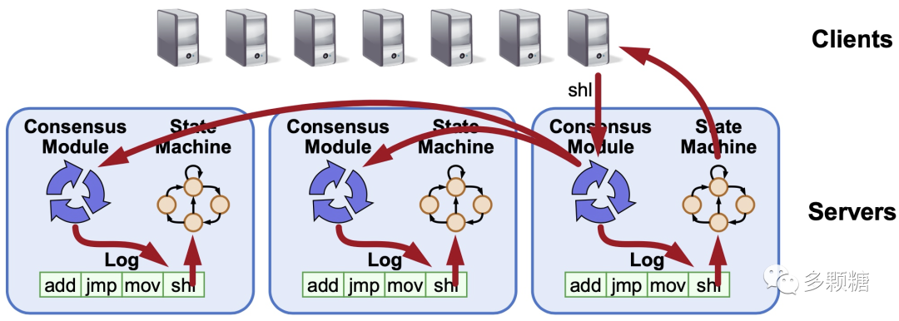

只要每台服务器的日志相同，那么，在不同服务器上的状态机以相同顺序从日志中执行相同的命令，将会产生相同的结果。

共识算法的工作就是管理这些日志。


### 二、系统模型

我们假设：

- 服务器可能会宕机、会停止运行过段时间再恢复，但是**非拜占庭的**（即它的行为是非恶意的，不会篡改数据等）；
- 网络通信会中断，消息可能会丢失、延迟或乱序；可能会网络分区；

Raft 是基于 Leader 的共识算法，故主要考虑：

- Leader 正常运行
- Leader 故障，必须选出新的 Leader

优点：只有一个 Leader，简单。

难点：**Leader 发生改变时，可能会使系统处于不一致的状态，因此，下一任 Leader 必须进行清理；**

我们将从 6 个部分解释 Raft：

1. Leader 选举；
2. 正常运行：日志复制（最简单的部分）；
3. Leader 变更时的安全性和一致性（最棘手、最关键的部分）；
4. 处理旧 Leader：旧的 Leader 并没有真的下线怎么办？
5. 客户端交互：实现线性化语义(linearizable semantics)；
6. 配置变更：如何在集群中增加或删除节点；


### 三、开始之前

开始之前需要了解 Raft 的一些术语。

#### 3.1 服务器状态

服务器在任意时间只能处于以下三种状态之一：

- Leader：处理所有客户端请求、日志复制。同一时刻最多只能有一个可行的 Leader；
- Follower：完全被动的（不发送 RPC，只响应收到的 RPC）——大多数服务器在大多数情况下处于此状态；
- Candidate：用来选举新的 Leader，处于 Leader 和 Follower 之间的暂时状态；

**系统正常运行时，只有一个 Leader，其余都是 Followers.**

状态转换图：

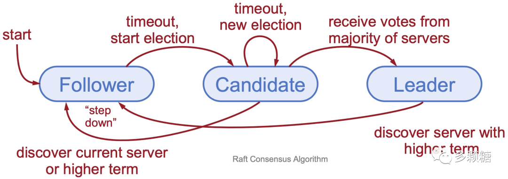

#### 3.2 任期

时间被划分成一个个的**任期(Term)**，每个任期都由一个数字来表示任期号，任期号单调递增并且永远不会重复。

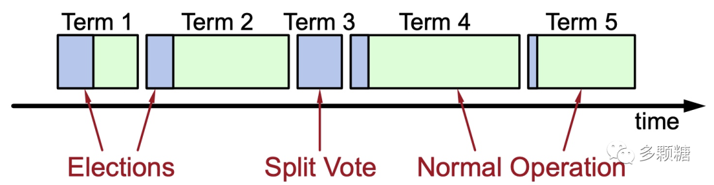

一个正常的任期至少有一个 Leader，通常分为两部分：

- 任期开始时的选举过程；
- 正常运行的部分；

有些任期可能没有选出 Leader（如图 Term 3），这时候会立即进入下一个任期，再次尝试选出一个 Leader。

每个节点维护一个 `currentTerm` 变量，表示系统中当前任期。`currentTerm` **必须持久化存储**，以便在服务器宕机重启时将其恢复。

**任期非常重要！任期能够帮助 Raft 识别过期的信息。**例如：如果 `currentTerm = 2` 的节点与 `currentTerm = 3` 的节点通信，我们可以知道第一个节点上的信息是过时的。

我们只使用最新任期的信息。后面我们会遇到各种情况，去检测和消除不是最新任期的信息。

#### 3.3 两个 RPC

Raft 中服务器之间所有类型的通信通过两个 RPC 调用：

- `RequestVote`：用于选举；
- `AppendEntries`：用于复制 log 和发送心跳；


### 四、Leader 选举

#### 4.1 启动

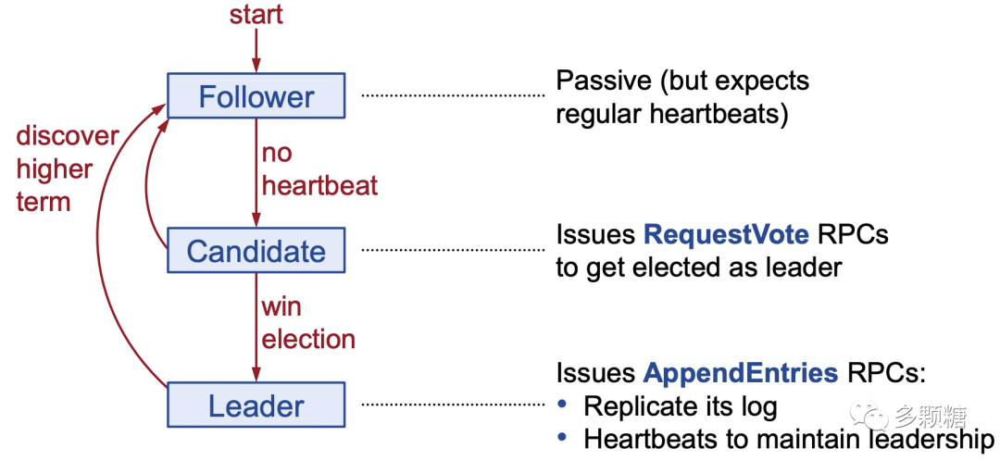

- 节点启动时，都是 Follower 状态；

- Follower 被动地接受 Leader 或 Candidate 的 RPC；

- 所以，如果 Leader 想要保持权威，必须向集群中的其它节点发送心跳包（空的 `AppendEntries RPC`）；

- 等待选举超时(`electionTimeout`，一般在 100~500ms)后，Follower 没有收到任何 RPC：

- - Follower 认为集群中没有 Leader
  - 开始新的一轮选举

#### 4.2 选举

当一个节点开始竞选：

- 增加自己的 `currentTerm`
- 转为 Candidate 状态，**其目标是获取超过半数节点的选票，让自己成为 Leader**
- **先给自己投一票**
- 并行地向集群中其它节点发送 `RequestVote RPC` 索要选票，如果没有收到指定节点的响应，它会反复尝试，直到发生以下三种情况之一：

1. 获得超过半数的选票：成为 Leader，并向其它节点发送 `AppendEntries` 心跳；
2. 收到来自 Leader 的 RPC：转为 Follower；
3. 其它两种情况都没发生，没人能够获胜(`electionTimeout` 已过)：增加 `currentTerm`，开始新一轮选举；

流程图如下：

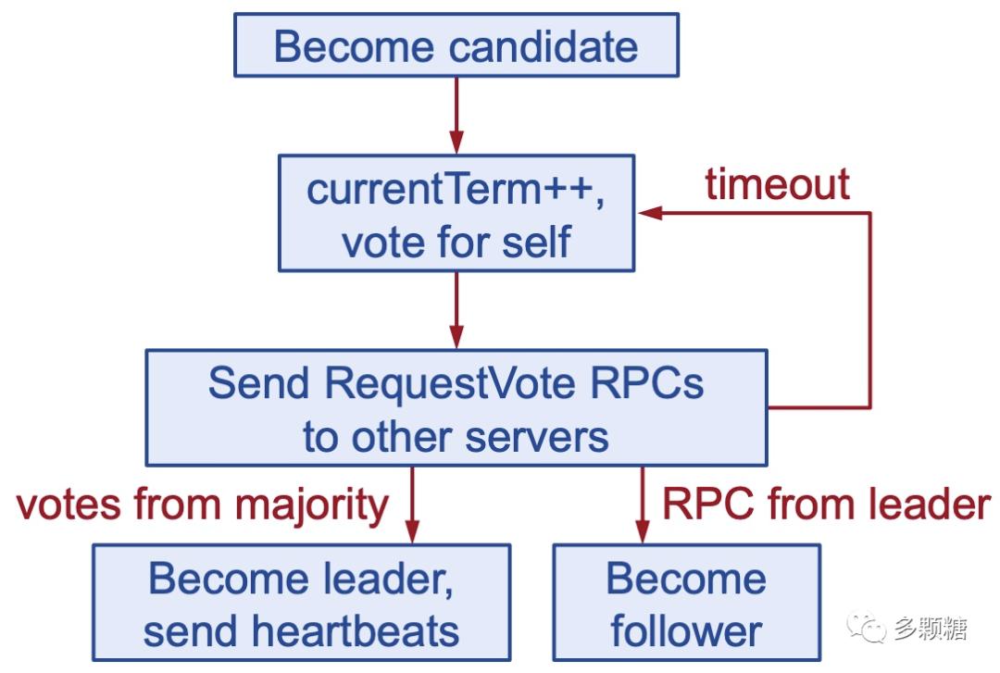

#### 4.3 选举安全性

选举过程需要保证两个特性：**安全性(safety)**和**活性(liveness)**。

**安全性(safety)**：一个任期内只会有一个 Leader 被选举出来。需要保证：

- 每个节点在同一任期内只能投一次票，它将投给第一个满足条件的投票请求，然后拒绝其它 Candidate 的请求。这需要持久化存储投票信息 `votedFor`，以便宕机重启后恢复，否则重启后 `votedFor` 丢失会导致投给别的节点；
- 只有获得超过半数节点的选票才能成为 Leader，也就是说，两个不同的 Candidate 无法在同一任期内都获得超过半数的票；


**活性(liveness)**：确保最终能选出一个 Leader。

问题是：原则上我们可以无限重复分割选票，假如选举同一时间开始，同一时间超时，同一时间再次选举，如此循环。

解决办法很简单：

- 节点随机选择超时时间，通常在 [T, 2T] 之间（T = `electionTimeout`）
- 这样，节点不太可能再同时开始竞选，先竞选的节点有足够的时间来索要其他节点的选票
- T >> broadcast time(T 远大于广播时间)时效果更佳


### 五、日志复制

#### 5.1 日志结构

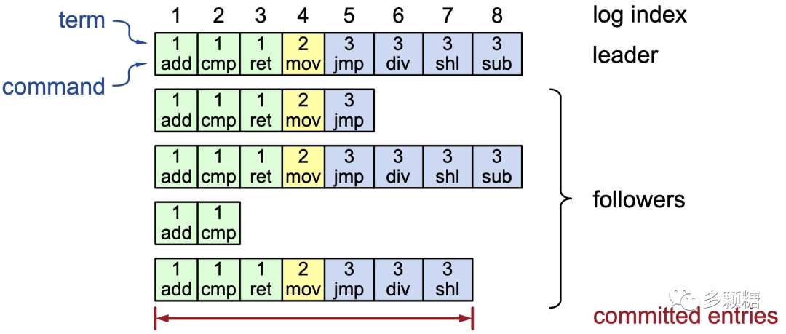

每个节点存储自己的日志副本(`log[]`)，每条日志记录包含：

- 索引：该记录在日志中的位置
- 任期号：该记录首次被创建时的任期号
- 命令

**日志必须持久化存储。**一个节点必须先将记录安全写到磁盘，才能向系统中其他节点返回响应。

如果一条日志记录被存储在超过半数的节点上，我们认为该记录**已提交**(`committed`)——这是 Raft 非常重要的特性！如果一条记录已提交，意味着状态机可以安全地执行该记录。

在上图中，第 1-7 条记录被提交，第 8 条尚未提交。

> 提醒：多数派复制了日志即已提交，这个定义并不精确，我们会在后面稍作修改。

#### 5.2 正常运行

- 客户端向 Leader 发送命令，希望该命令被所有状态机执行；

- Leader 先将该命令追加到自己的日志中；

- Leader 并行地向其它节点发送 `AppendEntries RPC`，等待响应；

- 收到超过半数节点的响应，则认为新的日志记录是被提交的：

- - Leader 将命令传给自己的状态机，然后向客户端返回响应
  - 此外，一旦 Leader 知道一条记录被提交了，将在后续的 `AppendEntries RPC` 中通知已经提交记录的 Followers
  - Follower 将已提交的命令传给自己的状态机

- 如果 Follower 宕机/超时：Leader 将反复尝试发送 RPC；

- 性能优化：Leader 不必等待每个 Follower 做出响应，只需要超过半数的成功响应（确保日志记录已经存储在超过半数的节点上）——一个很慢的节点不会使系统变慢，因为 Leader 不必等他；

#### 5.3 日志一致性

Raft 尝试在集群中保持日志较高的一致性。

**Raft 日志的 index 和 term 唯一标示一条日志记录。**（这非常重要！！！）

1. 如果两个节点的日志在相同的索引位置上的任期号相同，则认为他们具有一样的命令；**从头到这个索引位置之间的日志完全相同**；
2. **如果给定的记录已提交，那么所有前面的记录也已提交**。

#### 5.4 AppendEntries 一致性检查

Raft 通过 `AppendEntries RPC` 来检测这两个属性。

- 对于每个 `AppendEntries RPC` 包含新日志记录**之前那条记录的**索引(`prevLogIndex`)和任期(`prevLogTerm`)；
- Follower 检查自己的 index 和 term 是否与 `prevLogIndex` 和 `prevLogTerm` 匹配，匹配则接收该记录；否则拒绝；

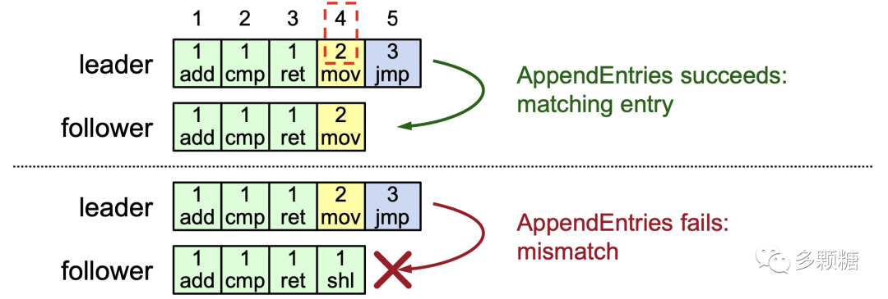


### 六、Leader 更替

当新的 Leader 上任后，日志可能不会非常干净，因为前一任领导可能在完成日志复制之前就宕机了。**Raft 对此的处理方式是：无需采取任何特殊处理。**

当新 Leader 上任后，他不会立即进行任何清理操作，他将会在正常运行期间进行清理。

原因是当一个新的 Leader 上任时，往往意味着有机器故障了，那些机器可能宕机或网络不通，所以没有办法立即清理他们的日志。在机器恢复运行之前，我们必须保证系统正常运行。

**大前提是 Raft 假设了 Leader 的日志始终是对的。**所以 Leader 要做的是，随着时间推移，让所有 Follower 的日志最终都与其匹配。

但与此同时，Leader 也可能在完成这项工作之前故障，日志会在一段时间内堆积起来，从而造成看起来相当混乱的情况，如下所示：

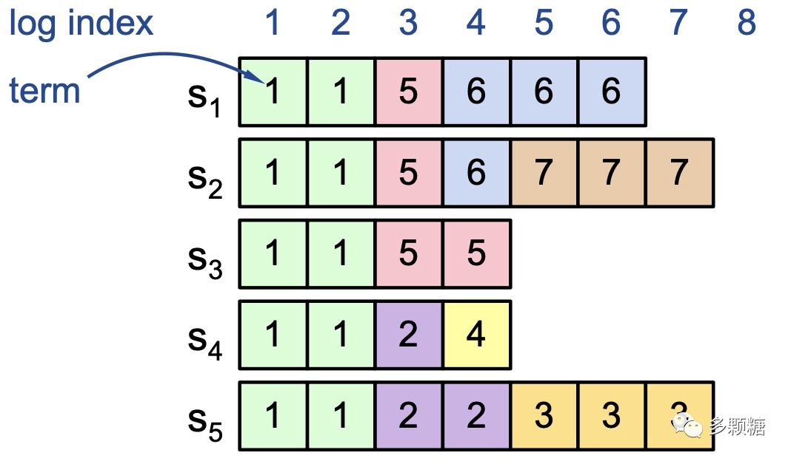

因为我们已经知道 index 和 term 是日志记录的唯一标识符，这里不再显示日志包含的命令，下同。

如图，这种情况可能出现在 S4 和 S5 是任期 2、3、4 的 Leader，但不知何故，他们没有复制自己的日志记录就崩溃了，系统分区了一段时间，S1、S2、S3 轮流成为了任期 5、6、7 的 Leader，但无法与 S4、S5 通信以进行日志清理——所以我们看到的日志非常混乱。

**唯一重要的是，索引 1-3 之间的记录是已提交的(已存在多数派节点)，因此我们必须确保留下它们**。

其它日志都是未提交的，我们还没有将这些命令传递给状态机，也没有客户端会收到这些执行的结果，所以不管是保留还是丢弃它们都无关紧要。

#### 6.1 安全性

**一旦状态机执行了一条日志里的命令，必须确保其它状态机在同样索引的位置不会执行不同的命令。**

Raft 安全性(Safety)：如果某条日志记录在某个任期号已提交，那么这条记录必然出现在更大任期号的未来 Leader 的日志中。


这保证了安全性要求：

- Leader 不会覆盖日志中的记录；
- 只有 Leader 的日志中的记录才能被提交；
- 在应用到状态机之前，日志必须先被提交；

这决定我们要修改选举程序：

- 如果节点的日志中没有正确的内容，需要避免其成为 Leader；
- 稍微修改 committed 的定义（*即前面提到的要稍作修改*）：前面说多数派存储即是已提交的，但在某些时候，我们必须延迟提交日志记录，直到我们知道这条记录是安全的，**所谓安全的，就是我们认为后续 Leader 也会有这条日志**。

#### 6.2 延迟提交，选出最佳 Leader

问题来了：我们如何确保选出了一个很好地保存了所有已提交日志的 Leader ？

这有点棘手，举个例子：假设我们要在下面的集群中选出一个新 Leader，但此时第三台服务器不可用。

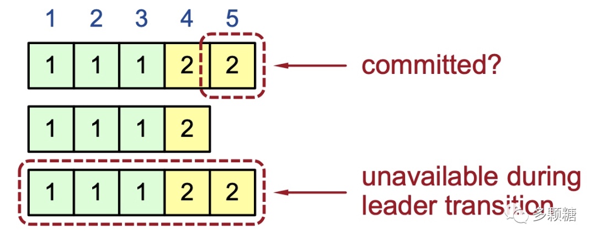

这种情况下，仅看前两个节点的日志我们无法确认是否达成多数派，故无法确认第五条日志是否已提交。

那怎么办呢？

通过比较日志，在选举期间，选择最有可能包含所有已提交的日志：

- Candidate 在 `RequestVote RPCs` 中包含日志信息（最后一条记录的 index 和 term，记为 `lastIndex` 和 `lastTerm`）；
- 收到此投票请求的服务器 V 将比较谁的日志更完整：`(lastTermV > lastTermC) ||(lastTermV == lastTermC) && (lastIndexV > lastIndexC)` 将拒绝投票；（即：V 的任期比 C 的任期新，或任期相同但 V 的日志比 C 的日志更完整）；
- 无论谁赢得选举，可以确保 Leader 和超过半数投票给它的节点中拥有最完整的日志——**最完整的意思就是 index 和 term 这对唯一标识是最大的**。

#### 6.3 举个例子

##### Case 1: Leader 决定提交日志

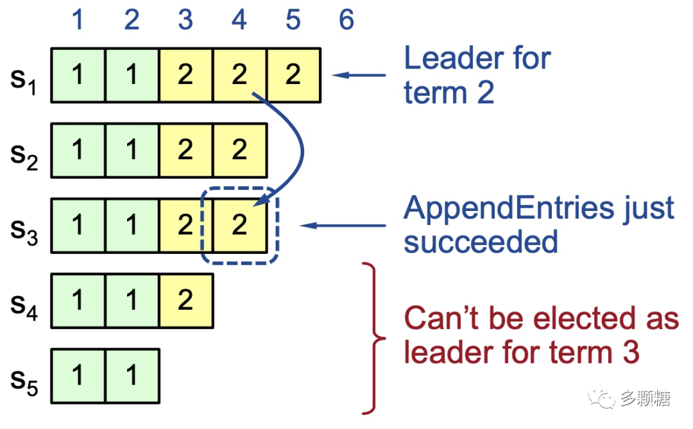

任期 2 的 Leader S1 的 index = 4 日志刚刚被复制到 S3，并且 Leader 可以看到 index = 4 已复制到超过半数的服务器，那么该日志可以提交，并且安全地应用到状态机。

现在，这条记录是安全的，下一任期的 Leader 必须包含此记录，因此 S4 和 S5 都不可能从其它节点那里获得选票：S5 任期太旧，S4 日志太短。

只有前三台中的一台可以成为新的 Leader——S1 当然可以，S2、S3 也可以通过获取 S4 和 S5 的选票成为 Leader。

##### Case 2: Leader 试图提交之前任期的日志

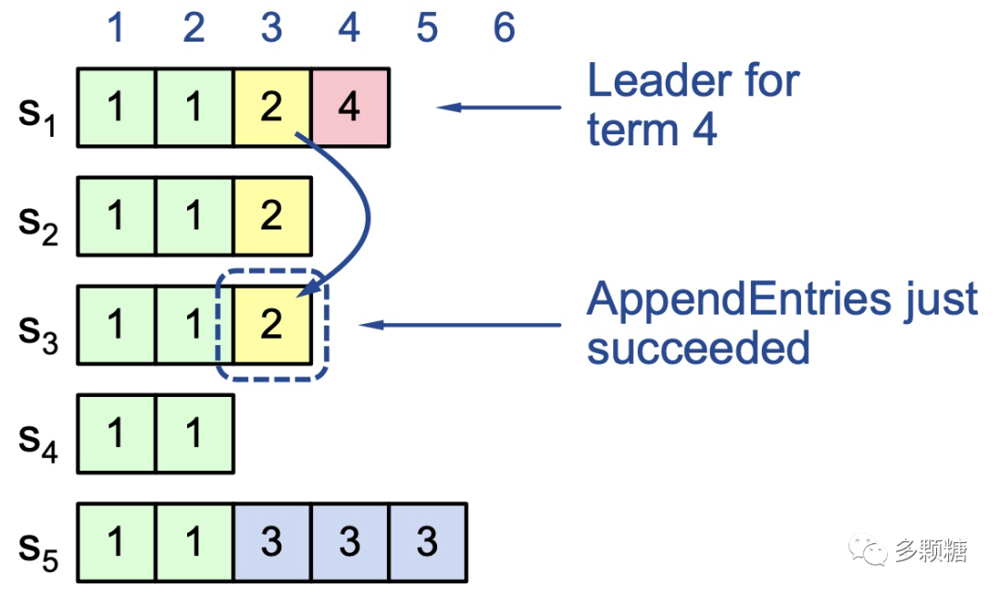

如图所示的情况，在任期 2 时记录仅写在 S1 和 S2 两个节点上，由于某种原因，任期 3 的 Leader S5 并不知道这些记录，S5 创建了自己的三条记录然后宕机了，然后任期 4 的 Leader S1 被选出，S1 试图与其它服务器的日志进行匹配。因此它复制了任期 2 的日志到 S3。

**此时 index=3 的记录时是不安全的**。

因为 S1 可能在此时宕机，然后 S5 可能从 S2、S3、S4 获得选票成为任期 5 的 Leader。一旦 S5 成为新 Leader，它将覆盖 index=3-5 的日志，S1-S3 的这些记录都将消失。

我们还要需要一条新的规则，来处理这种情况。

#### 6.4 新的 Commit 规则

新的选举不足以保证日志安全，我们还需要继续修改 commit 规则。

Leader 要提交一条日志：

- 日志必须存储在超过半数的节点上；
- **Leader 必须看到：超过半数的节点上还必须存储着至少一条自己任期内的日志**；

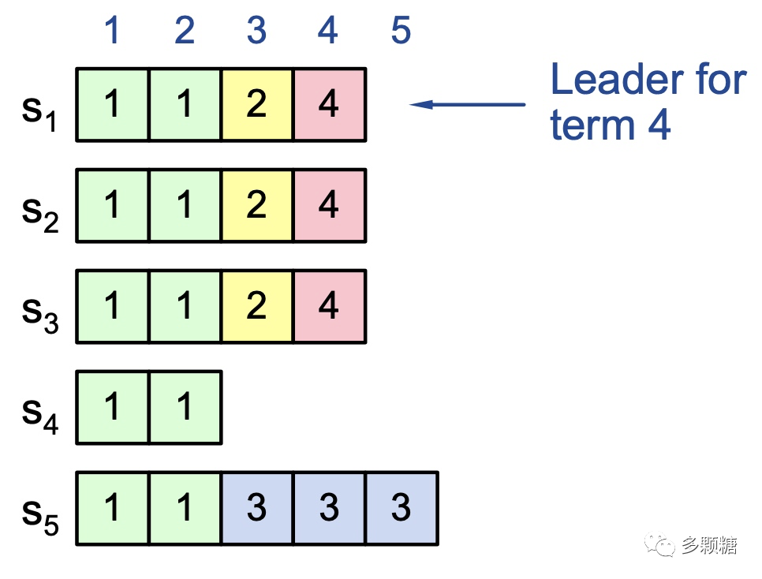

如图，回到上面的 Case 2: 当 index = 3 & term = 2 被复制到 S3 时，它还不能提交该记录，必须等到 term = 4 的记录存储在超过半数的节点上，此时 index = 3 和 index = 4 可以认为是已提交。

此时 S5 无法赢得选举了，它无法从 S1-S3 获得选票。

**结合新的选举规则和 commit 规则，我们可以保证 Raft 的安全性。**

####  6.5 日志不一致

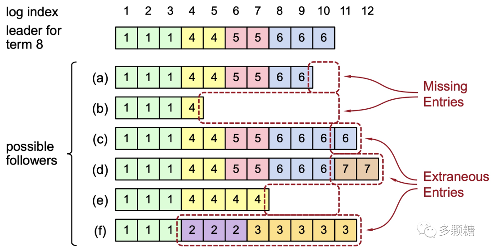

Leader 变更可能导致日志的不一致，这里展示一种可能的情况。

可以从图中看出，Raft 集群中通常有两种不一致的日志：

- 缺失的记录(Missing Entries)；
- 多出来的记录(Extraneous Entries)；

我们要做的就是清理这两种日志。

#### 6.6 修复 Follower 日志

新的 Leader 必须使 Follower 的日志与自己的日志保持一致，通过：

- 删除 Extraneous Entries；
- 补齐 Missing Entries；

Leader 为每个 Follower 保存 `nextIndex`：

- 下一个要发送给 Follower 的日志索引；
- 初始化为：1 + Leader 最后一条日志的索引；

Leader 通过 `nextIndex` 来修复日志。当 `AppendEntries RPC` 一致性检查失败，递减 `nextIndex` 并重试。如下图所示：

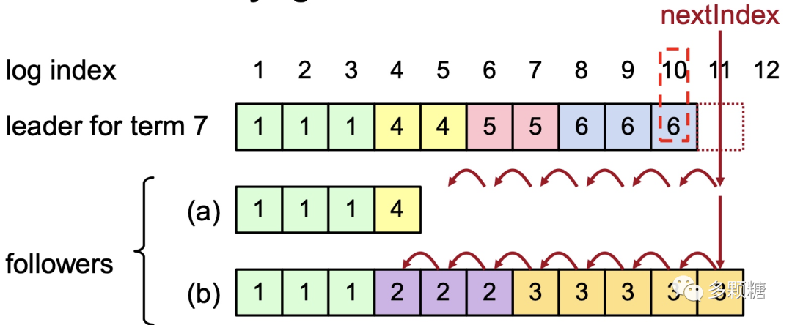

对于 a：

- 一开始 `nextIndex` = 11，带上日志 index = 10 & term = 6，检查失败；
- `nextIndex` = 10，带上日志 index = 9 & term = 6，检查失败；
- 如此反复，直到 `nextIndex` = 5，带上日志 index = 4 & term = 4，该日志现在匹配，会在 a 中补齐 Leader 的日志。如此往下补齐。

对于 b：
会一直检查到 `nextIndex` = 4 才匹配。值得注意的是，对于 b 这种情况，当 Follower 覆盖不一致的日志时，它将删除所有后续的日志记录（任何无关紧要的记录之后的记录也都是无关紧要的）。如下图所示：

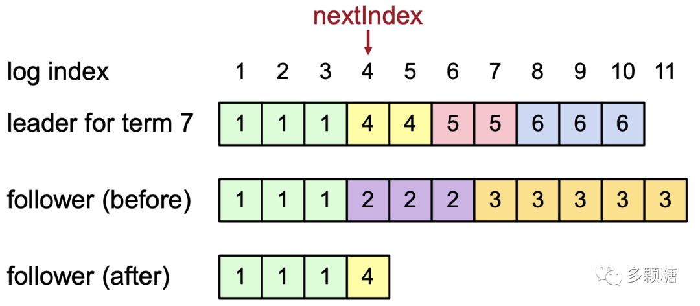


### 七、处理旧 Leader

实际上，老的 Leader 可能不会马上消失，例如：网络分区将 Leader 与集群的其余部分分隔，其余部分选举出了一个新的 Leader。问题在于，如果老的 Leader 重新连接，也不知道新的 Leader 已经被选出来，它会尝试作为 Leader 继续提交日志。此时如果有客户端向老 Leader 发送请求，老的 Leader 会尝试存储该命令并向其它节点复制日志——我们必须阻止这种情况发生。

**任期就是用来发现过时的 Leader**(和 Candidates)：

- 每个 RPC 都包含发送方的任期；
- 如果发送方的任期太老，无论哪个过程，RPC 都会被拒绝，发送方转变到 Follower 并更新其任期；
- 如果接收方的任期太老，接收方将转为 Follower，更新它的任期，然后正常的处理 RPC；

由于新 Leader 的选举会更新超过半数服务器的任期，旧的 Leader 不能提交新的日志，因为它会联系至少一台多数派集群的节点，然后发现自己任期太老，会转为 Follower 继续工作。

这里不打算继续讨论别的极端情况。


### 八、客户端协议

客户端只将命令发送到 Leader：

- 如果客户端不知道 Leader 是谁，它会和任意一台服务器通信；
- 如果通信的节点不是 Leader，它会告诉客户端 Leader 是谁；

Leader 直到将命令记录、提交和执行到状态机之前，不会做出响应。

这里的问题是如果 Leader 宕机会导致请求超时：

- 客户端重新发出命令到其他服务器上，最终重定向到新的 Leader
- 用新的 Leader 重试请求，直到命令被执行

这留下了一个命令可能被执行两次的风险——Leader 可能在执行命令之后但响应客户端之前宕机，此时客户端再去寻找下一个 Leader，同一个命令就会被执行两次——这是不可接受的！

解决办法是：客户端发送给 Leader 的每个命令都带上一个唯一 id

- Leader 将唯一 id 写到日志记录中
- 在 Leader 接受命令之前，先检查其日志中是否已经具有该 id
- 如果 id 在日志中，说明是重复的请求，则忽略新的命令，返回旧命令的响应

**每个命令只会被执行一次，这就是所谓的线性化的关键要素**。


### 九、配置变更

随着时间推移，会有机器故障需要我们去替换它，或者修改节点数量，需要有一些机制来变更系统配置，并且是安全、自动的方式，无需停止系统。

系统配置是指：

- 每台服务器的 id 和地址
- **系统配置信息是非常重要的，它决定了多数派的组成**

首先要意识到，我们不能直接从旧配置切换到新配置，这可能会导致矛盾的多数派。

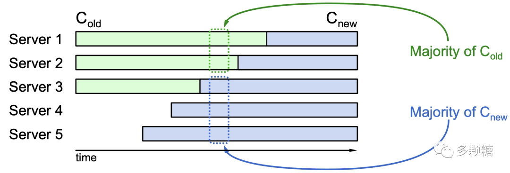

如图，系统以三台服务器的配置运行着，此时我们要添加两台服务器。如果我们直接修改配置，他们可能无法完全在同一时间做到配置切换，这会导致 S1 和 S2 形成旧集群的多数派，而同一时间 S3-S5 已经切换到新配置，这会产生两个集群。

这说明我们必须使用一个两阶段(two-phase)协议。

> 如果有人告诉你，他可以在分布式系统中一个阶段就做出决策，你应该非常认真地询问他，因为他要么错了，要么发现了世界上所有人都不知道的东西。

#### 9.1 共同一致(Joint Consensus)

Raft 通过共同一致(Joint Consensus)来完成两阶段协议，即：新、旧两种配置上都获得多数派选票。

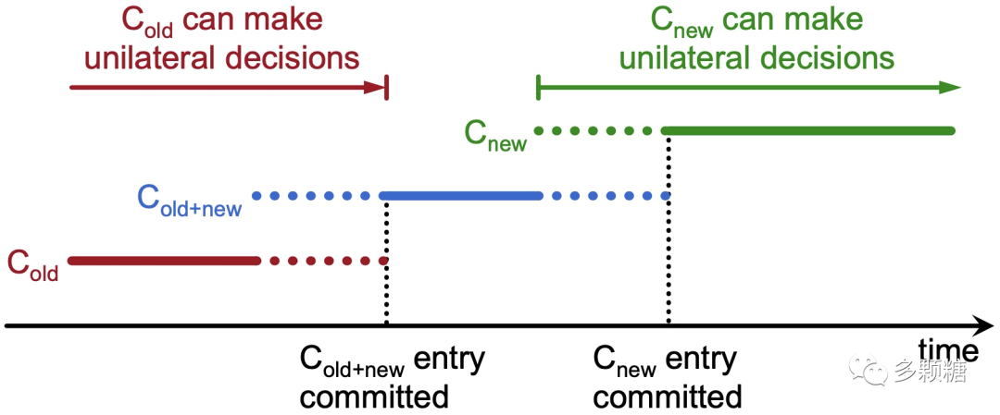


第一阶段：

- Leader 收到$C_{new}$的配置变更请求后，先写入一条$C_{old+new}$的日志，配置变更立即生效，然后将日志通过 `AppendEntries RPC` 复制到 Follower 中，收到该$C_{old+new}$的节点立即应用该配置作为当前节点的配置；

- $C_{old+new}$日志复制到多数派节点上时，$C_{old+new}$的日志已提交；

  

$C_{old+new}$日志已提交保证了后续任何 Leader 一定有$C_{old+new}$日志，Leader 选举过程必须获得旧配置中的多数派和新配置中的多数派同时投票。


第二阶段：

-  日志已提交后，立即写入一条$C_{new}$的日志，并将该日志通过 `AppendEntries RPC` 复制到 Follower 中，收到$C_{new}$的节点立即应用该配置作为当前节点的配置；
-  日志复制到多数派节点上时，$C_{new}$的日志已提交；在$C_{new}$日志提交以后，后续的配置都基于$C_{new}$了；


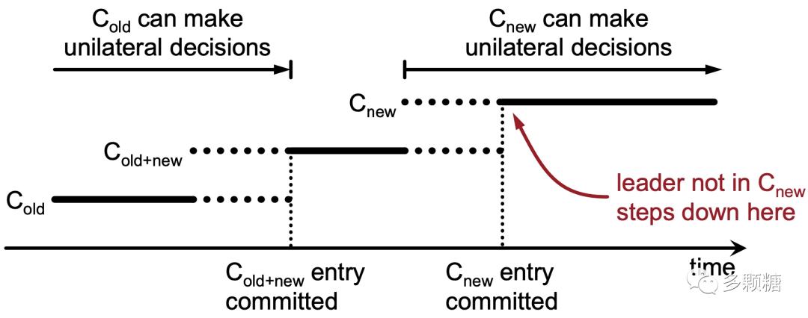


Joint Consensus 还有一些细节：

- 变更过程中，来自新旧配置的节点都有可能成为 Leader；
- 如果当前 Leader 不在$C_{new}$配置里面，一旦$C_{new}$提交，它必须下台(step down)。

如图所示，旧 Leader 不再是新配置的成员之后，还有可能继续服务一小段时间；即旧 Leader 可能在$C_{new}$配置下继续当 Leader（虽然实质上并不是Leader），直到$C_{new}$的日志复制到多数派上而 committed；


## RAFT论文学习

raft算法是一个分布式一致性算法，用来替代Paxos算法，因为Paxos算法太晦涩难懂，基于Paxos成熟的工程实践非常少。在2013年，斯坦福大学的Diego Ongaro和John Ousterhout发表了论文In Search of an Understandable Consensus Algorithm，raft算法就此诞生。随后，在2014年Diego Ongaro的博士论文CONSENSUS: BRIDGING THEORY AND PRACTICE中，对raft以及相关的一致性算法进行了系统的阐述。他们两人在设计raft算法时将可理解性放在了首位，在raft算法出现之后，出现多种语言的开源实现，像etcd中的raft是Go语言实现的。

In Search of an Understandable Consensus Algorithm论文中提到raft的核心有领导选举、日志复制、安全性和集群变更这几部分，每个部分内容不少，小编打算拆开来总结输出，本文是第一篇，主要讲论文中的raft basics和leader election两部分。

#### raft基础

- 一个raft集群包含多个节点，节点的数量为**「奇数」**个

答：不仅是raft，还有Zookeeper等[分布式存储](https://cloud.tencent.com/product/cos?from=10680)系统的节点个数都是奇数个，因为它们都是根据“少数服从多数”原则来达成一致。当集群中脑裂时，如果小集群的节点数相等，会造成没有大多数支持的局面，导致服务不可用。例如我们假定raft集群的节点数为偶数6，节点名称依次为node1,node2,node3,node4,node5和node6,当前集群中的leader节点为node1,当出现两个相同数量节点的网络分区，即每个分区有3个节点。如下图所示，分区1中由于日志复制节点无法满足绝大多数节点（4个及以上）导致无法commit，而分区2中无法选出新的leader节点，原因是候选者节点无法收到4个及以上节点的投票，直接导致服务不可用。如果集群中的节点是奇数个，不可能出现两分区中节点数相同的情况，只会存在要么node1所在分区是大多数节点区域，此时node1所在的分区可以继续正常运转，要么node1在少数节点区域，那么大多数节点分区会重新选出新的leader,也可以继续提供服务。

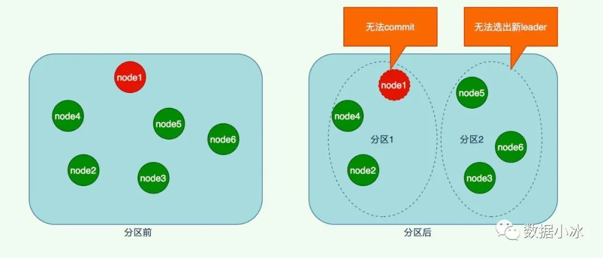

------

- raft节点是一个状态机，状态机一共有三种状态，每个节点处于leader/candidate/follower三种状态中的一个

答：raft集群中任意时刻最多只有一个leader节点，也就说集群中可以没有leader但不能有两个及以上的leader存在。raft协议通过约束条件保证集群中最多只有1个leader. 如果集群中没有leader，此时集群是无法提供服务的状态。在稳定（正常）状态下，集群中只有leader和follower角色，在非稳定状态即有选举竞选，此时集群中有candidate、follower和leader多种角色。

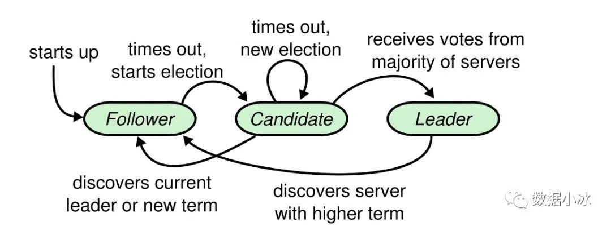

------

- 一次选举从开始到下一次新的选举开始对应一个任期，任期用连续的整数表示, 是单调递增的，raft把时间分割成了任意长度的任期。如果系统中没有选举，任期term是保持不变的。下图中有4个任期，蓝色表示处于选举过程中，是一个过渡状态，绿色表示系统中已有leader节点处于稳定状态，对应t3没有选举出leader，所以很快开始新的一轮选举term4.

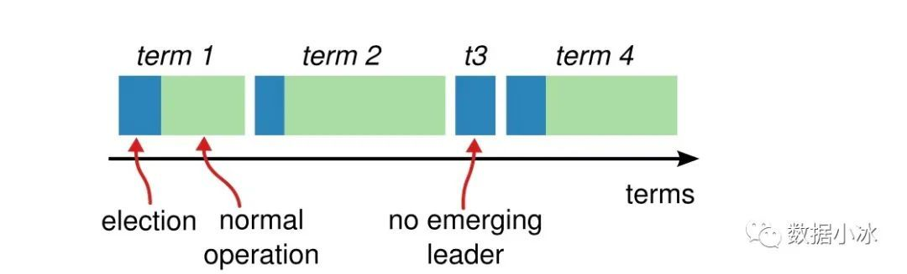

答：任期的关键作用是解决leader的"脑裂“问题，假设集群中有5台机器，当前任期term为4，发生了网络分区，leader单独成为一个分区，其他4个node成为一个分区。由于其他4个follower收不到leader心跳消息，认为leader宕机了。4个follower会发起新一轮选举选出新leader, 此时term为5，开始向其他3个follower复制日志消息，很快网络分区恢复，之前的leader加入网络，此时网络出现了两个leader.但是当旧leader向其他follower节点发送数据时，follower发现日志里面的term=4比自己的term=5小，判断它为过期的leader,拒绝执行写入操作，同时告诉旧leader，你过期了。旧leader知道自己过期之后，自动回退成follower。从而保证了任意一个时刻只有一个leader是有效的。


 5个节点构成的raft集群

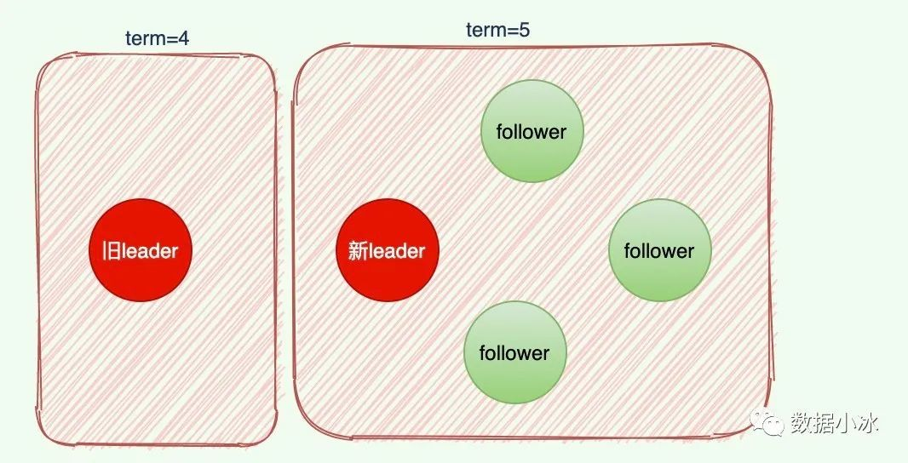

 leader发生网络分区

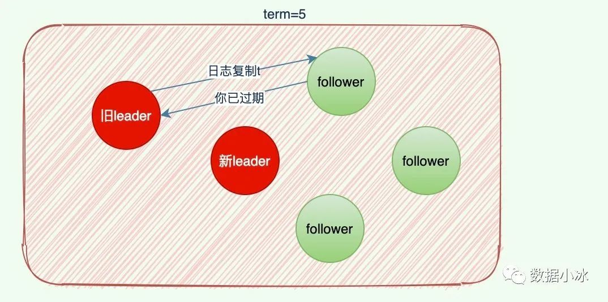

 网络分区恢复

------

- raft算法规定了节点之间采用RPC进行通信，一致性算法只需要两种类型的RPC消息，为了在[服务器](https://cloud.tencent.com/product/cvm?from=10680)之间传输快照增加了第三种类型的RPC。

答：RequestVote(请求投票) RPC: 发起请求投票RPC消息，从candidate节点广播发往其他节点。AppendEntries(追加日志)RPC,消息从leader节点发给follower节点， 用来复制日志和提供一种心跳机制。此外，为了在服务器之间传输快照增加了第三种类型的RPC，称它为快照RPC,用于传输快照数据。

------

#### leader选举

所有的节点在刚启动时都是follower角色，raft采用心跳机制触发选举。只要一个节点能够收到来自leader或candidate节点的RPC消息，就一直保持follower角色。leader会周期性的向所有follower节点发送心跳信息来捍卫自己的leader地位。心跳消息是一种不含有日志条目的AppendEntries RPC. 如果一个follower节点在一段选举超时的时间内没有收到任何消息，它就假定系统中没有leader, 然后开始进行选举尝试选出新的leader.

```javascript
// 创建一个raft对象
func newRaft(c *Config) *raft {
 ...
 // 开始时都是follower角色
 r.becomeFollower(r.Term, None)
       ...
 return r
}
```

复制

选举流程是这样的：

1. follower节点先增加自己当前的任期号并将状态切换到candidate状态
2. 给自己投一票
3. 并行地向集群中所有其他的节点发送投票请求(RequestVote RPC报文）
4. 保持candiate状态等待直到遇到下面三种情况之一产生

4.1 情况1: 收到了节点回复中有过半的节点给”我“投票，这种情况”我“赢得了选举，将会切换到leader角色 

4.2 情况2：收到了其他声称自己是leader的节点发送来的AppendEntries RPC，处理方法见下面的分析 

4.3 情况3：一段时间内没有任何获胜者，处理方法见下面的分析


对于上面的情况4.1，对于一个candidate节点获得集群中过半的节点对自己的投票，它就赢得了选举并成为leader。例如对于有5个节点的集群，至少收到3个节点的投票才会成为leader. 在投票的时候有一些约束条件：

1. 同一任期同一个节点只会投票给一个candidate，如果收到有多个相同任期的candidate需要投票，只会投票给最早的那个，遵循先来先服务(first-come-first-served)的原则。
2. 成为leader需要获得过半节点的投票，确保了最多只有一个candidate能够赢得选举。
3. 当candidate赢得选举，成为leader之后，会向其他节点发送心跳信息来捍卫自己的地位并阻止新的选举。

对于上面的情况4.2，在等待投票期间，candidate可能会收到另一个声称自己是leader节点发送来的AppendEntries RPC消息，如果这个leader的任期号（在RPC消息中）不小于candidate当前的任期号，该candidate节点会承认leader的合法性自己退回到follower状态。如果RPC中的任期号比自己的小，该candidate会拒绝响应并继续保持candidate状态。

对于上面的情况4.3，即candidate没有赢得选举也没有输，这种情况发生在有多个follower节点同时成为candidate节点，导致选票被瓜分，以至于没有一个candidate赢得过半的投票。最后的结果是每个candidate都会超时，然后通过增加当前任期号来开始新一轮的选举。当然这种情况可能一直重复，导致无法选举出leader，所以raft采用随机选举超时时间的方法确保这种情况很少出现。就算发生也能够很快解决。为了阻止选票一开始被瓜分，选举超时时间从一个固定的范围【例如150-300毫秒】随机选择。这样可以把节点分散开以至于在大多数情况下只有一个节点会选举超时，然后该节点赢得选举并在其他节点之前发送心跳。这种机制也被用来解决选票被瓜分的情况，每个candidate在开始一次选举的时候会重置一个随机的选举超时时间，然后一直等到选举超时，这样减少了新的选举中再发送选票被瓜分的情况。

上面的内容可以结合`https://raft.github.io/raftscope/index.html`动画来学习，该动画模拟了5个节点的raft集群交互，可以对节点设置超时(timte out)、宕机(stop)等场景，然后观察对集群产生的效果。

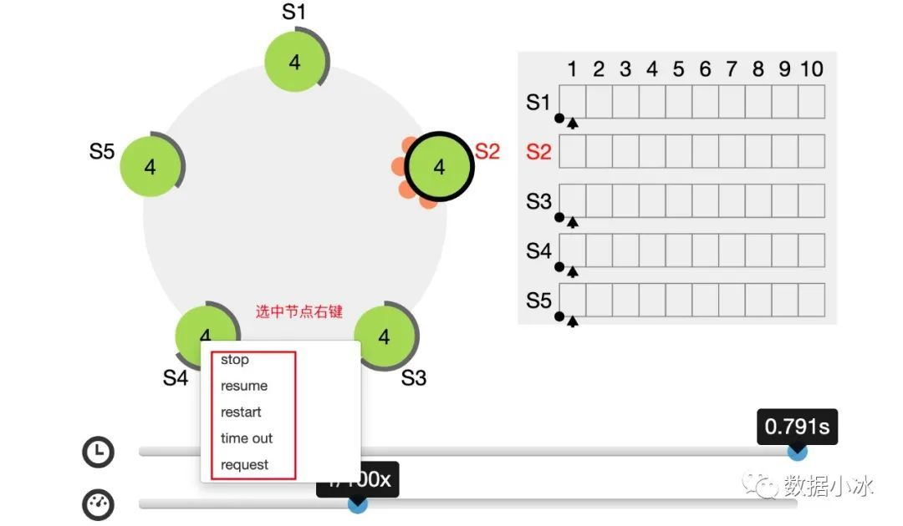

In Search of an Understandable Consensus Algorithm[1]raft动画[2]

#### Reference

[1]**In Search of an Understandable Consensus Algorithm: https://raft.github.io/raft.pdf**

[2]**raft动画: https://raft.github.io/raftscope/index.html**


# 分布式数据库

## 分布式数据库如何实现join

用关系型数据库一定多多少少会用到 Join 操作。常见的 Join 有 Nested-Loop Join，Hash Join，Sort Merge Join 等等。实际在 OLTP 场景中，最常用的就是基于索引点查的 Index Nested-Loop Join，这样的 Join 往往能在极短的时间内返回，相信这也是大多数开发同学对 Join 的感受。

PolarDB-X 不仅语法兼容 MySQL，作为分布式数据库，也力求保持与单机数据库一致的使用体验。在分布式场景下，Join 的两张表可能都是分布式表，因此需要通过多次网络请求获取相应的数据。如何高效地实现这一点呢？


### MySQL 的 Join 实现

我们先看看单机数据库上的 Join 是怎么做的。MySQL 支持的 Join 算法很有限：

- Nested-Loop Join (NL Join)
- Batched Key Access Join (BKA Join)

- Block Nested-Loop Join（版本 < 8.0.20）
- Hash Join (版本 >= 8.0.18)


如果 Join 两侧的任何一张表上 join key 列存在索引，那么 MySQL 通常会使用基于索引的 BKA Join 或 NL Join，我们实际使用中的绝大多数情形都对应这种方式。如果 Join 两侧都没有索引可以用，那么 MySQL 只能退而求其次选择 Block Nested-Loop Join 或 Hash Join（取决于 MySQL 版本）。我们今天主要关注 NL 和 BKA Join。


Nested-Loop Join 是最简单的 Join 形式，可以看作一个两层 For 循环。对于外表（也称为驱动表）中的每一行，循环检查内表（也称为被驱动表）的每一行，如果满足 Join 条件则作为 Join 结果输出。如果 Join Key 在内侧表有索引可用，那么内表的循环可以大大简化——只要查索引即可拿到可以 Join 的行，无需遍历整个表。我们也将这种带索引的 NL Join 称为 Index Nested-Loop Join。


```c
# Nested-Loop Join
for outer_row in outer_table:
   for inner_row in inner_table:
      if join_condition is True:
         output (outer_row, inner_row)

# Index Nested-Loop Join
for outer_row in outer_table:
   for inner_row in inner_index.lookup(outer_join_key):
      if join_condition is True:
         output (outer_row, inner_row)
```

注：*左右滑动阅览


下面的例子中，orders 表通过 customer 表的主键 c_custkey 与之进行 Join，MySQL 会使用 Index NL Join 算法完成 Join。

```sql

/* Query 1 */
SELECT o_orderkey, o_custkey, c_name
FROM orders JOIN customer ON o_custkey = c_custkey
WHERE o_orderkey BETWEEN 1001 AND 1005
```

注：*左右滑动阅览


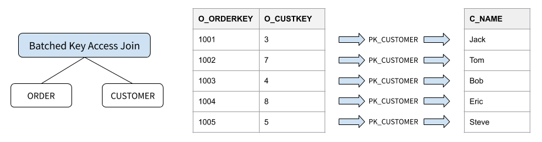


BKA Join 可以看作一个性能优化版的 Index Nested-Loop Join。之所以称为 Batched，是因为它的实现使用了存储引擎提供的 MRR（Multi-Range Read） 接口批量进行索引查询，并通过 PK 排序的方法，将随机索引回表转化为顺序回表，一定程度上加速了查索引的磁盘 IO。

下面的例子中，Join Key 命中的是二级索引，并且 SELECT 的列包含二级索引中所不包含的列，因此需要进行索引回表得到完整的 Join 结果。

```sql

/* Query 2 */
SELECT c_name, c_custkey, o_orderkey, o_totalprice
FROM customer JOIN orders ON c_cutkey = o_custkey
WHERE c_custkey BETWEEN 13 AND 15
```

注：*左右滑动阅览


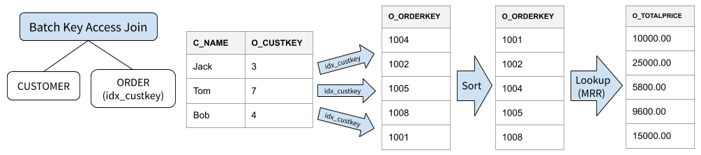


通常 OLTP 查询中 Join 驱动侧的数据量不大，并且 Join 往往都有能匹配的索引。这种情况下，NL Join、BKA Join 的代价与驱动侧的数据量呈线性相关，可以迅速计算出结果。


### PolarDB-X 的 Lookup Join

PolarDB-X 的架构与 MySQL 有很大的不同，它的架构可以分为 SQL 层和存储层，SQL 层的计算节点需要计算数据所在的分片，然后从多个 DN 节点（数据节点）拉取所需的数据。


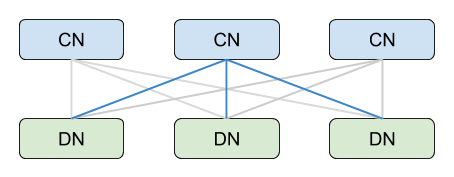


对于 Join 查询，如果恰好 Join Key 和拆分键一致，那么可以将其下推到 DN 执行。否则，就需要在 CN 节点执行 Join。PolarDB-X 支持多种 Join 算法，包括 Lookup Join、Nested-Loop Join、Hash Join、Sort-Merge Join 等多种执行方式。在 OLTP 查询中最常用的就是类似 MySQL BKA Join 的 Lookup Join，**本文主要介绍 Lookup Join，其他 Join 诸如 Hash Join、Nested-Loop Join 等将在以后的文章中介绍。**


除了 Join 本身的功能需求，PolarDB-X 的 Lookup Join 的设计中还要考虑以下两个性能需求：

- **批量**。在分布式数据库中，CN 到 DN 的每一次查询都会经过网络 RPC，其延迟相比 MySQL 的本地调用要大几个数量级，因此批量处理显得更为重要。
- **并发**。由于数据可能分布在多个 DN 节点上，如果依次遍历则会引入大量不必要的等待，最好的做法是并发地对所有 DN 进行查询，这样每批数据仅需一次网络 round-trip。

Lookup Join 的执行过程如下（非索引回表情形）：


1. **从驱动侧拉取一批数据**。通常情况下数据量不会很多，如果数据较多，那么每个批的大小受到 lookup 端的分片数量以及是否可以进行分片裁剪限制。批大小的选择会直接影响查询性能，如果批特别小会导致 RPC 次数太高，批太大则会导致内存中暂存的数据量膨胀，高并发情况下可能导致 OOM。默认情况下我们尽可能让每个分片平均查询 50 个值、最多不超过 300 个值。
2. **计算 batch 内每行数据所在分片**，由于 lookup 侧是一个分区表，驱动表的每行数据要 lookup 的数据位于不同的分区中。只有包含数据的分片才需要参与 Join，如果没有任何值被路由到某个分片上，那么这个分片也无需被 Lookup。
3. **并发请求所有需要 lookup 的分片**，并将查到的数据行以 Join Key 为 Key 构建成哈希表，缓存在内存中。

4. 类似于 Hash Join，利用哈希表为驱动侧的每行找到与其 Join 的行，取决于 Join 类型，可能 Join 出 0 行、1 行或多行。


```sql
/* Query 1 */
SELECT o_orderkey, o_custkey, c_name
FROM orders JOIN customer ON o_cutkey = c_custkey
WHERE o_orderkey BETWEEN 1001 AND 1005
```

注：*左右滑动阅览


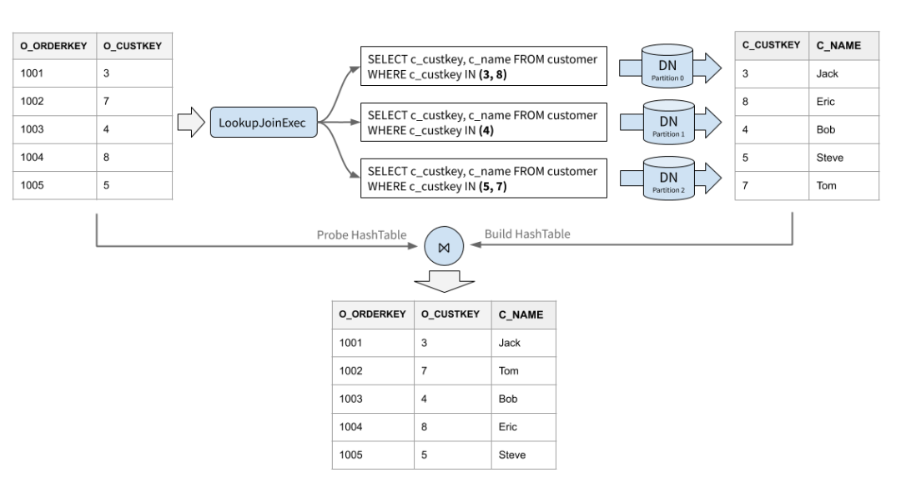


这个过程中有一些有趣的细节，例如，当要 lookup 的列不止一列（例如 `X = A AND Y = B`）时如何处理？这时可以通过 row-expression 组成多列的 IN 条件。如果多列 IN 条件中出现 NULL 如何处理？对于 Anti-Join 如何处理？这些就不在这里展开了，有兴趣的同学可以在评论交流。

对于绝大多数 TP 查询，Lookup Join 都可以通过一次 lookup 完成 Join，将延迟降到了最低。


### 全局索引与 Lookup Join

PolarDB-X 还支持全局索引，用户可以为分区表创建全局索引表，加快对索引键的查询。和本地索引一样，如果查询中包含索引未覆盖的列，全局索引也需要进行回表。回表的做法和上一小节的 Lookup Join 过程是完全一致的，不难理解——索引回表可以看作一种特殊的 1:1 的 Join。

依赖全局索引的 Join 则更为复杂一些，回忆下 MySQL 的 BKA Join，需要进行两次 lookup：


1. 第一次用 Join key 查询全局索引表（用于 Join）
2. 第二次用全局索引表中的主键查询主表（用于索引回表）

3. 将回表结果以 PK 为 key 构建哈希表，与2中的查询结果 Join，得到完整的 Join 右侧数据

4. 将完整的 Join 右侧数据以 Join Key 为 key 构建哈希表，与 1 的数据 Join，得到最终 Join 结果


```sql

/* Query 2 */
SELECT c_name, c_custkey, o_orderkey, o_totalprice
FROM customer JOIN orders ON c_cutkey = o_custkey
WHERE c_custkey BETWEEN 13 AND 15
```

注：*左右滑动阅览


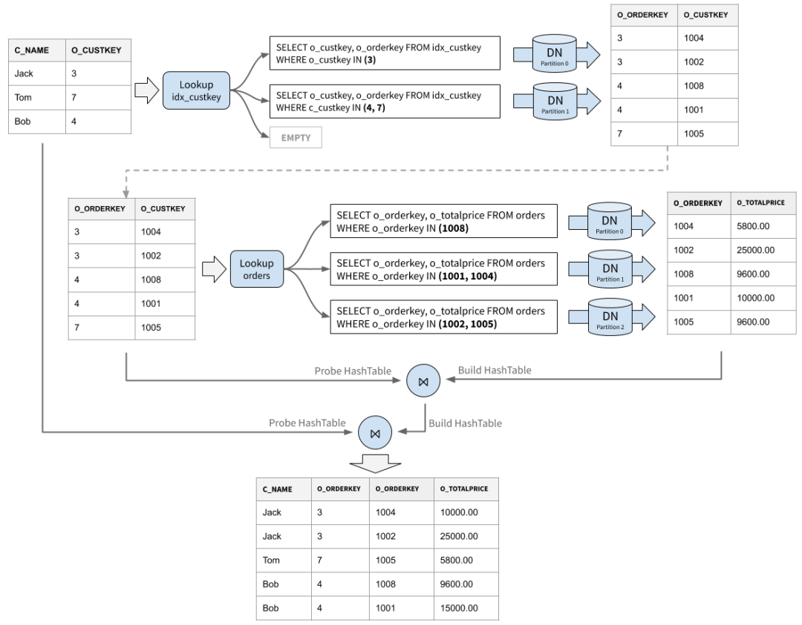


绝大多数 OLTP 查询数据量都能通过单个 batch 完成，完成查询的总延迟为 3 次 round-trip。不难证明在分布式情况下这是最优的。

此外，PolarDB-X 也允许用户手动将更多的列加入全局索引的覆盖列，牺牲部分写入性能换取更好的读取性能，如果所有列均被覆盖则无需进行回表，只需两轮 round-trip 即可。更进一步，PolarDB-X 鼓励用户通过合理设计拆分键尽可能将 Join 下推。


### 参考资料

\1. Enhancing Productivity with MySQL 5.6 New Features：

https://slideplayer.com/slide/219709/

\2. MySQL · 特性分析 · 优化器 MRR & BKA：

http://mysql.taobao.org/monthly/2016/01/04/

\3. Block Nested-Loop and Batched Key Access Joins：

https://dev.mysql.com/doc/refman/5.7/en/bnl-bka-optimization.html


# HDFS

### 文件系统的基本概述

- 文件系统定义：文件系统是一种存储和组织计算机数据的方法，它使得对其访问和查找变得容易。
- 文件名：在文件系统中，文件名是用于定位存储位置。
- 元数据（Metadata）：保存文件属性的数据，如文件名，文件长度，文件所属用户组，文件存储位置等。
- 数据块（Block）：存储文件的最小单元。对存储介质划分了固定的区域，使用时按这些区域分配使用。

### HDFS的概述

> HDFS(Hadoop Distributed File System)基于Google发布的GFS论文设计开发。HDFS是Hadoop技术框架中的分布式文件系统，对部署在多台独立物理机器上的文件进行管理。

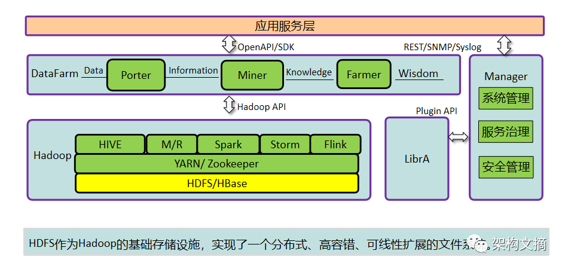

可用于多种场景，如：网站用户行为数据存储。生态系统数据存储。气象数据存储。

### HDFS的优点和缺点

其除具备其它分布式文件系统相同特性外，还有自己特有的特性：

- 高容错性：认为硬件总是不可靠的。
- 高吞吐量：为大量数据访问的应用提供高吞吐量支持。
- 大文件存储：支持存储TB-PB级别的数据。

#### 不适用场景

- 低时间延迟数据访问的应用，例如几十毫秒范围。

- - 原因：HDFS是为高数据吞吐量应用优化的，这样就会造成以高时间延迟为代价。

- 大量小文件 。

- - 原因：NameNode启动时，将文件系统的元数据加载到内存，因此文件系统所能存储的文件总数受限于NameNode内存容量。，那么需要的内存空间将是非常大的。

- 多用户写入，任意修改文件。

- - 原因：现在HDFS文件只有一个writer，而且写操作总是写在文件的末尾。

### 流式数据访问

- 流式数据访问：在数据集生成后，长时间在此数据集上进行各种分析。每次分析都将涉及该数据集的大部分数据甚至全部数据，因此读取整个数据集的时间延迟比读取第一条记录的时间延迟更重要。
- 与流数据访问对应的是随机数据访问：它要求定位、查询或修改数据的延迟较小，比较适合于创建数据后再多次读写的情况，传统关系型数据库很符合这一点。

### HDFS的架构

HDFS架构包含三个部分：NameNode，DataNode，Client。

- NameNode：NameNode用于存储、生成文件系统的元数据。运行一个实例。
- DataNode：DataNode用于存储实际的数据，将自己管理的数据块上报给NameNode ，运行多个实例。
- Client：支持业务访问HDFS，从NameNode ,DataNode获取数据返回给业务。多个实例，和业务一起运行。

#### HDFS数据的写入流程

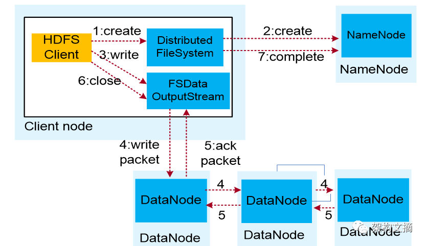

- 业务应用调用HDFS Client提供的API，请求写入文件。
- HDFS Client联系NameNode，NameNode在元数据中创建文件节点。
- 业务应用调用write API写入文件。
- HDFS Client收到业务数据后，从NameNode获取到数据块编号、位置信息后，联系DataNode，并将需要写入数据的DataNode建立起流水线。完成后，客户端再通过自有协议写入数据到DataNode1，再由DataNode1复制到DataNode2, DataNode3。
- 写完的数据，将返回确认信息给HDFS Client。
- 所有数据确认完成后，业务调用HDFS Client关闭文件。
- 业务调用close, flush后HDFSClient联系NameNode，确认数据写完成，NameNode持久化元数据。

#### HDFS数据的读取流程

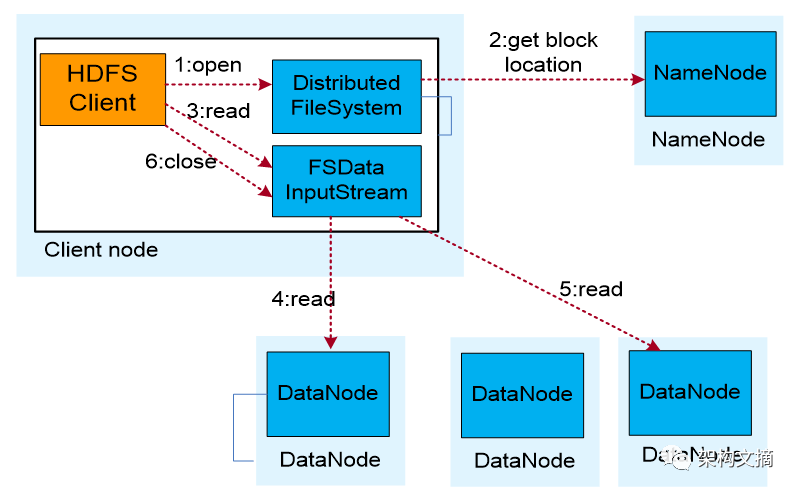

- 业务应用调用HDFS Client提供的API打开文件。
- HDFS Client联系NameNode，获取到文件信息（数据块、DataNode位置信息）。
- 业务应用调用read API读取文件。
- HDFS Client根据从NameNode获取到的信息，联系DataNode，获取相应的数据块。(Client采用就近原则读取数据)。
- HDFS Client会与多个DataNode通讯获取数据块。
- 数据读取完成后，业务调用close关闭连接。

### HDFS的关键特性

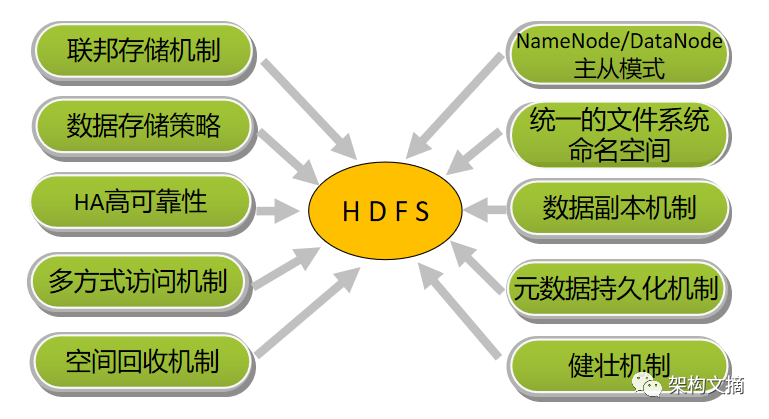

#### HDFS的高可靠性（HA）

- HDFS的高可靠性（HA）主要体现在利用zookeeper实现主备NameNode，以解决单点NameNode故障问题。
- ZooKeeper主要用来存储HA下的状态文件，主备信息。ZK个数建议3个及以上且为奇数个。
- NameNode主备模式，主提供服务，备同步主元数据并作为主的热备。
- ZKFC(ZooKeeper Failover Controller)用于监控NameNode节点的主备状态。
- JN(JournalNode)用于存储Active NameNode生成的Editlog。Standby NameNode加载JN上Editlog，同步元数据。

##### ZKFC控制NameNode主备仲裁

- ZKFC作为一个精简的仲裁代理，其利用zookeeper的分布式锁功能，实现主备仲裁，再通过命令通道，控制NameNode的主备状态。ZKFC与NN部署在一起，两者个数相同。

##### 元数据同步

- 主NameNode对外提供服务。生成的Editlog同时写入本地和JN，同时更新主NameNode内存中的元数据。
- 备NameNode监控到JN上Editlog变化时，加载Editlog进内存，生成新的与主NameNode一样的元数据。元数据同步完成。
- 主备的FSImage仍保存在各自的磁盘中，不发生交互。FSImage是内存中元数据定时写到本地磁盘的副本，也叫元数据镜像。

#### 元数据持久化

- EditLog:记录用户的操作日志，用以在FSImage的基础上生成新的文件系统镜像。
- FSImage:用以阶段性保存文件镜像。
- FSImage.ckpt:在内存中对fsimage文件和EditLog文件合并（merge）后产生新的fsimage，写到磁盘上，这个过程叫checkpoint.。备用NameNode加载完fsimage和EditLog文件后，会将merge后的结果同时写到本地磁盘和NFS。此时磁盘上有一份原始的fsimage文件和一份新生成的checkpoint文件：fsimage.ckpt. 而后将fsimage.ckpt改名为fsimage（覆盖原有的fsimage）。
- EditLog.new: NameNode每隔1小时或Editlog满64MB就触发合并,合并时,将数据传到Standby NameNode时,因数据读写不能同步进行,此时NameNode产生一个新的日志文件Editlog.new用来存放这段时间的操作日志。Standby NameNode合并成fsimage后回传给主NameNode替换掉原有fsimage,并将Editlog.new 命名为Editlog。

### HDFS联邦（Federation）

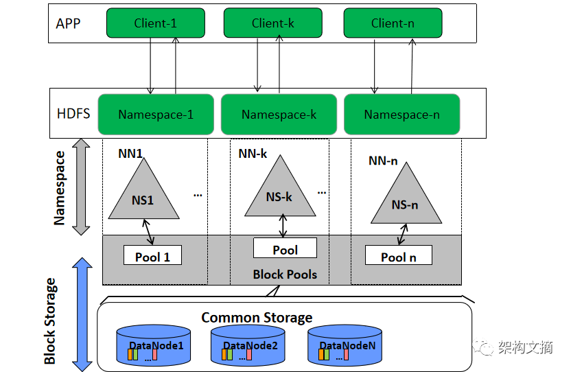

- 产生原因：单Active NN的架构使得HDFS在集群扩展性和性能上都有潜在的问题，当集群大到一定程度后，NN进程使用的内存可能会达到上百G，NN成为了性能的瓶颈。
- 应用场景：超大规模文件存储。如互联网公司存储用户行为数据、电信历史数据、语音数据等超大规模数据存储。此时NameNode的内存不足以支撑如此庞大的集群。常用的估算公式为1G对应1百万个块，按缺省块大小计算的话，大概是128T (这个估算比例是有比较大的富裕的，其实，即使是每个文件只有一个块，所有元数据信息也不会有1KB/block)。
- Federation简单理解：各NameNode负责自己所属的目录。与Linux挂载磁盘到目录类似，此时每个NameNode只负责整个hdfs集群中部分目录。如NameNode1负责/database目录，那么在/database目录下的文件元数据都由NameNode1负责。各NameNode间元数据不共享，每个NameNode都有对应的standby。
- 块池（block pool）:属于某一命名空间(NS)的一组文件块。联邦环境下，每个namenode维护一个命名空间卷（namespace volume），包括命名空间的元数据和在该空间下的文件的所有数据块的块池。
- namenode之间是相互独立的，两两之间并不互相通信，一个失效也不会影响其他namenode。
- datanode向集群中所有namenode注册，为集群中的所有块池存储数据。
- NameSpace（NS）：命名空间。HDFS的命名空间包含目录、文件和块。可以理解为NameNode所属的逻辑目录。

### 数据副本机制

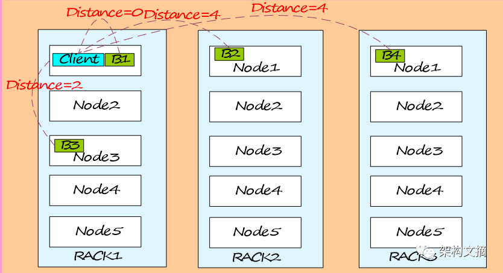

#### 副本距离计算公式：

- Distance(Rack1/D1, Rack1/D1)=0，同一台服务器的距离为0。
- Distance(Rack1/D1, Rack1/D3)=2，同一机架不同的服务器距离为2。
- Distance(Rack1/D1, Rack2/D1)=4，不同机架的服务器距离为4。

#### 副本放置策略：

- 第一个副本在本节点。
- 第二个副本在远端机架的节点。
- 第三个副本看之前的两个副本是否在同一机架，如果是则选择其他机架，否则选择和第一个副本相同机架的不同节点，第四个及以上，随机选择副本存放位置。

如果写请求方所在机器是其中一个DataNode,则直接存放在本地,否则随机在集群中选择一个DataNode。

- Rack1：表示机架1。
- D1：表示DataNode节点1。
- B1：表示节点上的block块1。

### 配置HDFS数据存储策略

默认情况下，HDFS NameNode自动选择DataNode保存数据的副本。在实际业务中，存在以下场景：

- DataNode上存在的不同的存储设备，数据需要选择一个合适的存储设备分级存储数据。
- DataNode不同目录中的数据重要程度不同，数据需要根据目录标签选择一个合适的DataNode节点保存。
- DataNode集群使用了异构服务器，关键数据需要保存在具有高度可靠性的节点组中。

#### 配置HDFS数据存储策略--分级存储

##### 配置DataNode使用分级存储

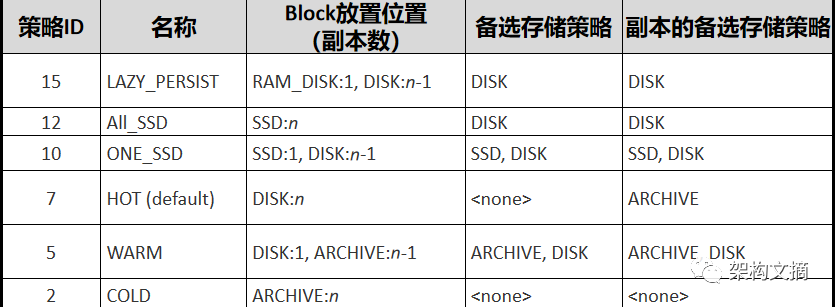

- HDFS的分级存储框架提供了RAM_DISK（内存盘）、DISK（机械硬盘）、ARCHIVE（高密度低成本存储介质）、SSD（固态硬盘）四种存储类型的存储设备。
- 通过对四种存储类型进行合理组合，即可形成适用于不同场景的存储策略。

#### 配置HDFS数据存储策略--标签存储

##### 配置DataNode使用标签存储：

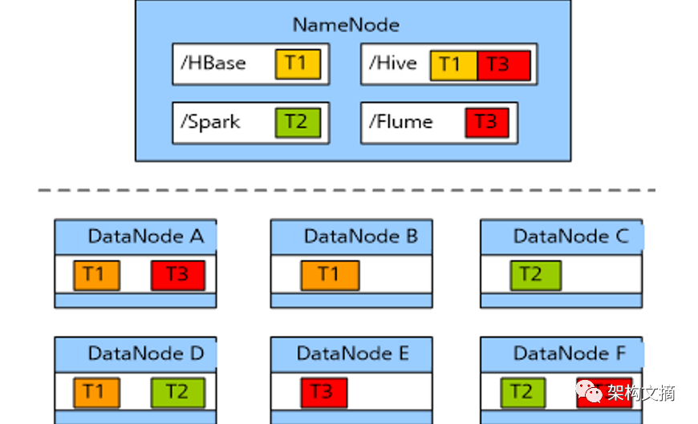

- 用户需要通过数据特征灵活配置HDFS文件数据块的存储节点。通过设置HDFS目 录/文件对应一个标签表达式，同时设置每个Datanode对应一个或多个标签，从而给文件的数据块存储指定了特定范围的Datanode。
- 当使用基于标签的数据块摆放策略，为指定的文件选择DataNode节点进行存放时，会根据文件的标签表达式选择出将要存放的Datanode节点范围，然后在这些Datanode节点范围内，选择出合适的存放节点。

支持用户将数据块的各个副本存放在指定具有不同标签的节点，如某个文件的数据块的2个副本放置在标签L1对应节点中，该数据块的其他副本放置在标签L2对应的节点中。支持选择节点失败情况下的策略，如随机从全部节点中选一个。简单的说：**给DataNode设置标签，被存储的数据也有标签。当存储数据时，数据就会存储到标签相同的DataNode中。**

#### 配置HDFS数据存储策略--节点组存储

##### 配置DataNode使用节点组存储：

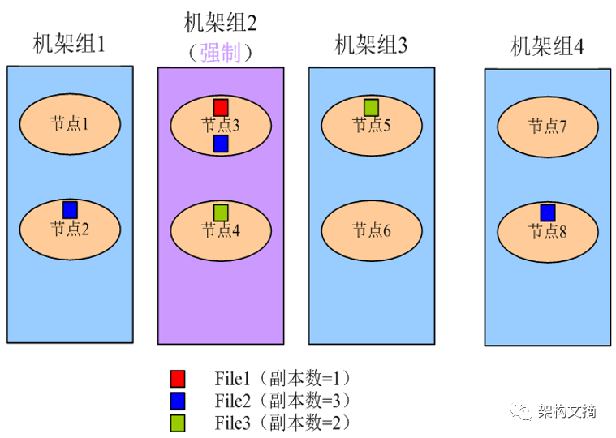

关键数据根据实际业务需要保存在具有高度可靠性的节点中，通过修改DataNode的存储策略，系统可以将数据强制保存在指定的节点组中。

**使用约束：**

1. 第一份副本将从强制机架组（机架组2）中选出，如果在强制机架组中没有可用节点，则写入失败。
2. 第二份副本将从本地客户端机器或机架组中的随机节点中（当客户端机器机架组不为强制机架组时）选出。
3. 第三份副本将从其他机架组中选出。
4. 各副本应存放在不同的机架组中。如果所需副本的数量大于可用的机架组数量，则会将多出的副本存放在随机机架组中。
5. 由于副本数量的增加或数据块受损导致再次备份时，如果有一份以上的副本缺失或无法存放至强制机架组，将不会进行再次备份。系统将会继续尝试进行重新备份，直至强制组中有正常节点恢复可用状态。
6. 简单的说：就是强制某些关键数据存储到指定服务器中。

### Colocation同分布

- 同分布(Colocation)的定义：将存在关联关系的数据或可能要进行关联操作的数据存储在相同的存储节点上。
- 按照下图存放，假设要将文件A和文件D进行关联操作，此时不可避免地要进行大量的数据搬迁，整个集群将由于数据传输占据大量网络带宽，严重影响大数据的处理速度与系统性能。

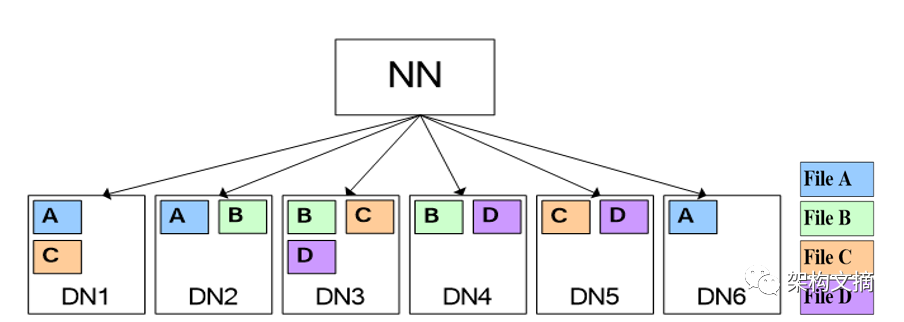

- HDFS文件同分布的特性，将那些需进行关联操作的文件存放在相同数据节点上，在进行关联操作计算时避免了到其他的数据节点上获取数据，大大降低网络带宽的占用。
- 使用同分布特性，文件A、D进行join时，由于其对应的block都在相同节点，因此大大降低资源消耗。

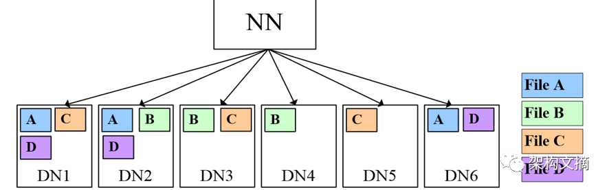

- Hadoop实现文件同分布，即存在相关联的多个文件的所有块都分布在同一存储节点上。文件级同分布实现文件的快速访问，避免了因数据搬迁带来的大量网络开销。

### HDFS数据完整性保障

HDFS主要目的是保证存储数据完整性，对于各组件的失效，做了可靠性处理。

- 重建失效数据盘的副本数据

- - DataNode向NameNode周期上报失败时，NameNode发起副本重建动作以恢复丢失副本。

- 集群数据均衡

- - HDFS架构设计了数据均衡机制，此机制保证数据在各个DataNode上分布是平均的。

- 元数据可靠性保证

- - 采用日志机制操作元数据，同时元数据存放在主备NameNode上。
  - 快照机制实现了文件系统常见的快照机制，保证数据误操作时，能及时恢复。

- 安全模式

- - HDFS提供独有安全模式机制，在数据节点故障，硬盘故障时，能防止故障扩散。

- 重建失效数据盘的副本数据

- - DataNode与NameNode之间通过心跳周期汇报数据状态，NameNode管理数据块是否上报完整，如果DataNode因硬盘损坏未上报数据块，
  - NameNode将发起副本重建动作以恢复丢失的副本。

- 安全模式防止故障扩散

- - 当节点硬盘故障时，进入安全模式，HDFS只支持访问元数据，此时HDFS 上的数据是只读的，其他的操作如创建、删除文件等操作都会导致失败。待硬盘问题解决、数据恢复后，再退出安全模式。

### HDFS架构其他关键设计要点说明

- 统一的文件系统

- - HDFS对外仅呈现一个统一的文件系统。

- 空间回收机制

- - 支持回收站机制，以及副本数的动态设置机制。

- 数据组织

- - 数据存储以数据块为单位，存储在操作系统的HDFS文件系统上。

- 访问方式

- - 提供JAVA API，HTTP方式，SHELL方式访问HDFS数据。

- 磁盘使用率

- - 比如磁盘100G，用了30G，使用率30%。

负载均衡避免了节点间数据分布不均匀，导致热点节点问题。

### 思考题

- HDFS是什么，适合于做什么？

- - 运行在通用硬件上的分布式文件系统。适合于大文件存储与访问、流式数据访问。

- HDFS包含那些角色？

- - NameNode、DataNode、Client。

- 请简述HDFS的读写流。

- - 读取：Client联系NameNode，获取文件信息。Client根据从NameNode获取到的信息，联系DataNode，获取相应的数据块；数据读取完成后，业务调用close关闭连接。
  - 写入：Client联系NameNode，NameNode在元数据中创建文件节点；Client联系DataNode并建立流水线，完成后，客户端再通过自有协议写入数据到 DataNode1，再由DataNode1复制到DataNode2,DataNode3；业务调用close关 闭连接；Client联系NameNode，确认数据写完成。
