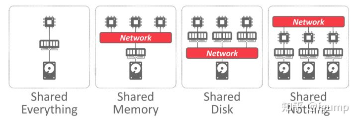
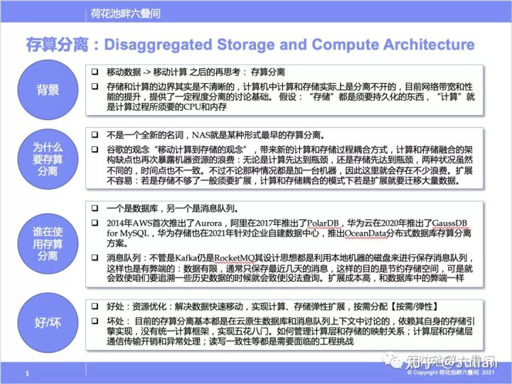
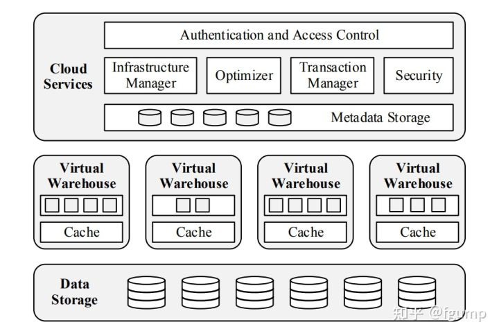
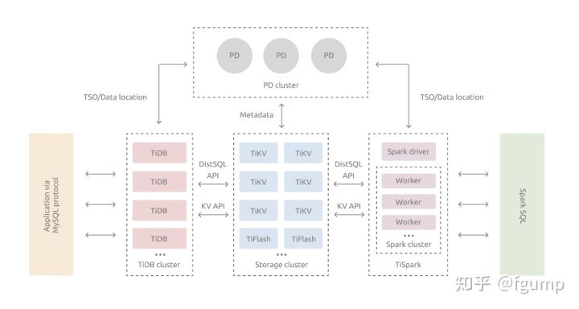
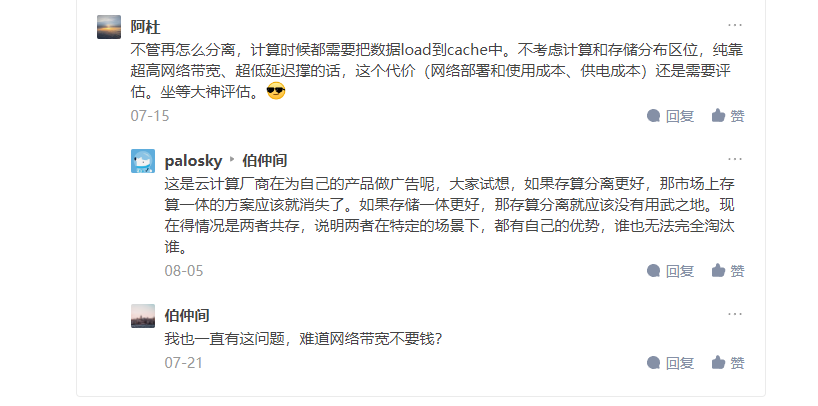

# 存算分离

## 存算分离概述

### 典型分布式数据库系统架构

数据库系统架构典型的架构有Shared Everything、Shared Memory、Shared Disk和Shared Nothing。这里Share的资源主要是指内存，磁盘。

> A DBMS’s system architecture specifies what shared resources are directly accessible to CPUs. It affects how CPUs coordinate with each other and where they retrieve and store objects in the database.

单机数据库系统称为shared everything，因为是单机节点，有自己独立的内存空间和独立的磁盘。

- **Shared Memory**

现实中并不常见，多个cpu通过网络来共享一个内存地址空间，并且共享同一个disk。

- **Shared Disk**

多个数据库实例，每个实例有自己的内存，但是通过网络共享同一个disk。Shared Disk架构在云原生比较常见，这样的好处就是利于存算分离，计算层和存储层能够解耦，因此计算层和存储层在扩缩容的时候彼此不影响。缺点是因为共享disk，因此对于高并发的写请求势必性能会比较差，因此这种架构比较适合OLAP这种读多写少的数仓。

- **Shared Nothing**

各个数据库实例，都有自己的内存和disk，这些实例之间只能通过网络通信来感知各个实例的状态变化。通常表会水平划分到各个节点，每个节点只负责其本地磁盘上的数据行。 这种设计非常适合星型模式查询，因为连接维度比较小的维度表和宽的事实表所需的带宽非常少。Share Nothing架构的优点在于性能和效率比较高，缺点在于灵活性较差，因为扩缩容的时候，需要在节点之间移动数据。而且对于事物的支持性较差，因为各个节点之间必须通过网络进行协调。

### 存算分离背景

- 存储和计算的**边界**其实是**不清晰**的，计算过程中计算和存储实际上是分离不开的，不过网络带宽和性能提升的当下，提供了一定程度分离的讨论基础。
- 讨论的前提：“存储”是需要持久化的东西，计算”就是计算过程需要的CPU和内存等。
- 移动数据->移动计算之后的再思考：存算分离。

### 为什么需要存算分离

1. **异构的工作负载:** 得益于现在云原生的环境，用户可以自由配置每台云服务器的cpu型号，内存，磁盘，带宽。但是存在的问题是适合高 I/O 带宽、轻计算的系统配置不适合复杂查询,而适合复杂查询的系统配置却不能满足高吞吐的要求。简单的理解为需要在计算和IO之间做平衡。无论是计算先达到瓶颈，还是存储先达到瓶颈，两种状况虽然不同，时间点也不一致。但通常不管那种情况都是加机器，因此就会存在不少浪费。
2. **扩缩容:** 由于计算和存储的耦合，当扩缩容的时候势必需要在节点之间移动数据，而节点同时需要对外提供计算服务，因此此时的性能可能会收到很大影响。如果存储分离，那么计算层和存储层可以独立增加减少节点而互不干扰。扩展不容易：计算和存储耦合模式下，存储扩展通常迁移大量数据，不方便。

### SnowFlake中的存算分离

SnowFlake的架构如下图。

- Data Storage : 存储层使用S3
- Virtual Warehouses : SnowFlake的计算层，负责执行查询计算。 由多个EC2实例组成，是MPP架构。
- Cloud Services : 主要对外提供服务，用户无法感知到VW的存在。维护元数据信息。主要包括database schemas, access control information, encryption keys, usage statistics。

SnowFlake通过VW和S3来将计算和存储分离。整体上来看是使用了Shared Disk架构。但是为了减少VW和S3之间的数据传输，SnowFlake通过本地磁盘做一个cache系统。如果cache系统做的比较好，那么性能上面几乎可以媲美于share nothing架构。

### TiDB中的存算分离

TiDB中的核心理念基本源自于Spanner。 TiDB将整体架构拆分成了多个模块，各模块之间互相通信，组成完整的 TiDB 系统。对应的架构图如下：

- TiDB Server：SQL 层，对外暴露 MySQL 协议的连接 endpoint，负责接受客户端的连接，执行 SQL 解析和优化，最终生成分布式执行计划。TiDB 层本身是无状态的，实践中可以启动多个 TiDB 实例，通过负载均衡组件（如 LVS、HAProxy 或 F5）对外提供统一的接入地址，客户端的连接可以均匀地分摊在多个 TiDB 实例上以达到负载均衡的效果。TiDB Server 本身并不存储数据，只是解析 SQL，将实际的数据读取请求转发给底层的存储节点 TiKV（或 TiFlash）。
- PD (Placement Driver) Server：整个 TiDB 集群的元信息管理模块，负责存储每个 TiKV 节点实时的数据分布情况和集群的整体拓扑结构。
- TiKV Server：存储数据节点，内部使用Raft一致性协议来维护数据。

TiDB通过在TiDB层实现了计算，在TiKV实现了存储来解耦计算和存储。

### 关于ClickHouse的存算分离思考

ClickHouse 是一个典型的Shared Nothing架构的分布式数据库，2022年ClickHouse社区的RoadMap中存算分离也是一个大的方向。目前ClickHouse已经支持DiskOss，设想一个可能的方案，类比于SnowFlake，很容易扩展为一个Shared Disk架构。但是还需要完成一个元数据信息的管理功能以支持动态的扩缩容。

### 参考文献

\1. [Key Concepts & Architecture](https://link.zhihu.com/?target=https%3A//docs.snowflake.com/en/user-guide/intro-key-concepts.html)

\2. [https://docs.pingcap.com/zh/tidb/dev/tidb-architecture](https://link.zhihu.com/?target=https%3A//docs.pingcap.com/zh/tidb/dev/tidb-architecture)

\3. [https://clickhouse.com/docs/en/intro/](https://link.zhihu.com/?target=https%3A//clickhouse.com/docs/en/intro/)

\4. [https://15445.courses.cs.cmu.edu](https://link.zhihu.com/?target=https%3A//15445.courses.cs.cmu.edu/fall2021/notes/21-distributed.pdf)

## 存算分离和存算一体的取舍

