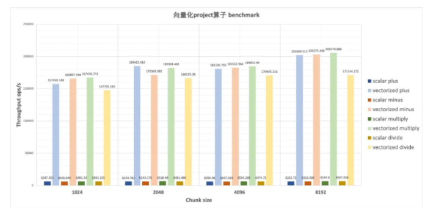

* 数据库功能开发与故障修复
* 资源管理器模块开发：Gossip机制
* 使用MonetDB/X100 执行引擎，执行速度提升5~10倍


## 一、MonetDB/X100向量化执行引擎

- 全新执行引擎，充分利用硬件的所有特性，比Apache HAWQ性能高出5-10倍


**为什么性能这么快？**

充分利用了最新CPU的每一个特性，比如SIMD单指令多数据，loop pipeline等，充分利用了CPU的每一个时钟周期。


### 1.1 传统数据库执行器的缺陷

* **一次计算一行数据（Tuple-at-a-time）**

现代数据库系统的执行引擎，大多采用一次计算一行数据（Tuple-at-a-time）的处理方式，并且需要在运行时对数据类型进行解析和判断，来适应复杂的表达式结构。我们称之为“标量（scalar）表达式”。这种方式虽然易于实现、结构清晰，但是当需要处理的数据量增大时，它具有显著的缺陷：

* **大量的指令解释开销**

为了适应复杂的表达式结构，计算一条表达式往往需要引入大量的指令；对于行式执行来说，处理单条数据需要算子树重新进行指令解释（instruction interpretation），从而带来了大量的指令解释开销。据论文《MonetDB/X100: Hyper-Pipelining Query Execution》统计，在MySQL执行TPC-H测试集的 Query1 时，指令解释就耗费了90%的执行时间。

* **没有避免分支预测**

此外，在最初的Volcano结构设计中，算子内部逻辑并没有避免分支预测（branch prediction）。错误的分支预测需要CPU终止当前的流水线，将ELSE语句中的指令重新载入，我们将这一过程称为pipeline flush或pipeline break。频繁的分支预测错误会严重影响数据库的执行性能。


### 1.2 向量化执行系统

数据库向量化执行系统最早由论文《MonetDB/X100: Hyper-Pipelining Query Execution》提出，它有以下几个要点：

1. 采用vector-at-a-time的执行模式，即以向量（vector）为数据组织单位。
2. 使用向量化原语（vectorization primitives）来作为向量化算子的基本单位，从而构建整个向量化执行系统。原语中避免产生分支预测。
3. 使用code generation（代码生成）技术来解决静态类型带来的code explosion（代码爆炸）问题。


向量化引擎为PolarDB-X的表达式计算带来了显著的性能提升。在下图中，横轴为向量大小，纵轴为吞吐量，不同标量表达式和向量化表达式的性能测试对比结果如下：



case表达式性能测试对比结果如下：


#### 1.2.1 整体流程

PolarDB-X中，向量化表达式的执行分为以下几个阶段：

1. 用户SQL经解析后，在validator中进行校验，推导和修正表达式的类型信息；这一阶段为向量化运算提供正确的、静态的类型信息；
2. 在优化器形成执行计划之后，需要对表达式树进行表达式绑定，实例化对应的向量化原语，同时分配好向量下标，供运行时内存分配；
3. 执行阶段，依据Volcano式的结构，自顶向下的触发执行向量化原语，并将向量作为运行时数据结构。


#### 1.2.2 运行时结构

##### （1）数据结构

在PolarDB-X向量化执行系统中，采用以下的数据结构来存放数据：


向量化表达式执行时，所有的数据都会存放在batch这一数据结构中。**batch由许多向量（vector）和一个selection数组而组成**。其中，向量vector包括一个存储特定类型的数值列表（values）和一个标识null值位置的null数组组成，它们在内存中都是连续存储的。null数组中的bit位以0和1来区分数值列表中的某个位置是否为空值。

我们可以用vector(type, index)来标识batch中一个向量。每个向量有其特定的下标位置(index)，来表示向量在batch中的顺序；类型信息（type）来指定向量的类型。在进行向量化表达式求值之前，我们需要遍历整个表达式树，根据每个表达式的操作数和返回值来分配好下标位置，最后根据下标位置统一为向量分配内存。


##### （2）延迟物化

* 使用selection数组记录满足过滤条件的行，从而延迟物化过程。

selection数组的设计体现了延迟物化的思想，参考论文《Materialization Strategies in a Column-Oriented DBMS》。所谓延迟物化，就是尽可能地将物化（matrialization）这一过程后推，减少内存访问带来的开销。在执行表达式计算时，往往会先经过Filter表达式过滤一部分数据，再对过滤后的数据执行求值处理；每次过滤都会影响到batch中所有的向量。以上图中的batch为例，如果我们针对第0个向量设置 vector(int, 0) != 1这一过滤条件，假设vector(int, 0)中有90%的数据满足该过滤条件（选择率selectivity = 0.9），那么我们需要将batch中所有向量90%的数据重新物化到另一块内存中。而如果我们只记录满足该过滤条件的位置，存入selection数组，我们就可以避免这一物化过程。相应的，以后每次向量化求值过程中，都需要参考此selection数组。


##### （3）向量化原语

向量化原语是向量化执行系统中的执行单位，它最大程度限制了执行期间的自由度。原语不用关注上下文信息，也不用在运行时进行类型解析和函数调用，只需要关注传入的向量即可。它是类型特定（Type-Specific）的，即一类原语只能处理特定类型。

向量化原语的主体是Tight-Loop的代码结构。在一个循环体内部，只需要进行取值和运算即可，没有任何的分支运算和函数调用，避免了分支预测错误带来的影响。一个简单的向量化原语结构如下所示：

```c++
map_plus_double_col_double_col(int n,
double*__restrict__ res,
double*__restrict__ vector1, double*__restrict__ vector2,
int*__restrict__ selection)
{
  if (selection) {
        for(int j=0;j<n; j++) {
            int i = selection[j];
            res[i] = vector1[i] + vector2[i];
        } 
  } else {
        for(int i=0;i<n; i++)
          res[i] = vector1[i] + vector2[i];
  }   
}
```

> 注：关于\__restrict__关键字的作用，详见C++笔记

其运算过程利用了selection数组，逐步对向量进行取值、运算和存值，如下图所示：


向量化原语带来了以下优点：

1. Type-Specific以及Tight-Loop的结构，大大减少了指令解释的开销；
2. 避免分支预测失败和虚函数调用对CPU流水线的干扰，同时也能有利于 loop pipeline 优化【论文引用】
3. 从向量中存取数据，有利于触发cache prefetch，减少cache miss带来的开销。

我们为各种标量化表达式提供相应的原语实现，从而完成从标量到向量化的转变。例如将加法运算 plus(Object, Object) 针对不同操作数类型生成原语，包括plus(double，double)，plus(long, long)等。

##### （4）短路求值

在向量化原语的基础上，我们可以进一步对分支运算（也称为控制流运算 Control-Flow）进行短路求值（short-circuit calculation）优化，提升表达式计算的性能。

例如，case 表达式由n个when表达式、n个then表达式、1个else表达式构成。对于表达式

```c++
select case when a > 1 then a * 2
             when b > 1 then b * 2
            else a * b
```

其逻辑语义是：

- 对于满足 a > 1 的向量位置，计算 a * 2；
- 对于满足 a <= 1 and b > 1 的向量位置，计算 b * 2；
- 对于满足 a <= 1 and b <= 1 的向量位置，计算 a * b；
- 把所有位置的数值组合在一起形成新的向量，输出。

具有以下树形结构：


由于标量化表达式按照volcano结构编排，并提供了统一的next()的接口，case表达式必须执行完所有的子表达式a>1，a\*2，b>1，b\*2和a\*b之后，将全部结果汇总到一起，最后做case语义处理。这种执行方式不能根据when表达式的处理结果及时终止计算过程，而是对全部子表达式无差别执行。

引入向量化执行器以后，我们可以设计短路求值来优化此问题，每一个子表达式需要被提供合适的selection数组，从而正确选择列中合适的位置来进行向量运算。设第i个when条件表达式接受的selection元素集合为$S_i$，其输出的selection元素集合为$R_i$，也就是第i个then条件表达式接受的selection元素集合。那么满足$S_i=S_1/\R_1/\ .../\R_{i-1}$，其中$S_1$是原始的selection数组中的下标集合。我们把求取selection元素集合的步骤称为substract selection，case运算的整个过程如下图所示：


##### （5）总结

PolarDB-X向量化引擎利用原语（primitive）来构建表达式，以向量作为运行时数据结构。每种原语仅为特定类型进行服务，从而减少了指令总数；原语中的tight-loop结构不仅对CPU流水线十分友好，也允许CPU进行数据预取，并且避免分支预测。此外，一些优化如延迟物化、短路求值，进一步提升了表达式求值性能。

#### 1.2.3 向量化引擎的上下文构建

所谓上下文构建，就是为向量化引擎准备好合适的执行环境，可以概况为以下几个问题：

1. 如何确定表达式的输入输出类型，并为SQL中的表达式分配合适的原语？
2. 每个原语需要使用不同的向量来进行输入和输出，如何正确地为原语分配向量？
3. 每种原语仅为特定类型进行服务，那么我们必然需要为一个表达式配备大量不同的原语，来适应不同的数据类型。如何应对原语数量爆炸这一问题？

PolarDB-X引入了**表达式绑定、静态类型系统、代码模板**等多种技术来解决上述问题。

##### （1）表达式绑定

在优化器完成优化阶段之后，我们从中得到代表着表达式树形结构的RexNode树，对其进行表达式绑定操作。表达式绑定需要对表达式树进行**前序遍历**，并完成以下工作：

1. 对于遍历到的函数调用节点，提取函数签名信息，通过函数签名进行反射，实例化向量化原语；
2. 在遍历过程中进行将遍历到的RexNode节点（包括列、表达式调用、常量等）按遍历顺序分配向量位置下标。下标分配完成后，在运行时依据下标信息统一进行内存分配，供表达式输入、输出使用。

下图是表达式 ((a+b)-c)*((a/b)%2) 的表达式树结构，以及通过表达式绑定得到的向量化原语实例，和分配得到的Batch结构：


此外，通过在表达式绑定时分配输入、输出向量的位置下标，我们可以灵活的处理各类数据依赖问题，包括以下的数据依赖场景：

1. 多个表达式输出到一个向量中，例如case表达式中的各个then、else子表达式。可以给这些子表达式分配相同的输出向量Index；
2. 多个表达式将同一个向量作为输入。例如select fun_1(expr), fun_2(expr)，expr表达式输出的结果可以作为fun_1和fun_2表达式的输入。可以通过分配相同的输入向量Index来实现。
3. 某些条件下，作为输出的中间结果向量可以覆盖掉作为输入的中间结果向量。

##### （2）静态类型系统

在基于行的执行器中，类型系统的静态绑定并不是必须的。例如在 MySQL 中，表达式构成一个树状结构，上层的表达式结构通过调用下层提供的不同返回值类型的接口（例如：val_int()、val_decimal()、val_str() 等），递归地计算出最终结果。这种方式实现简单，但是直到运行时才能确定表达式的输入返回类型，进而决定需要调用的计算函数，效率比较低。

向量化系统则要求静态类型系统。在解析器和优化器完成执行计划的构建之后，必须保证每个表达式的类型是正确的、不需要运行时确定的。只有这样，才能为它实例化正确的向量化原语、分配正确类型的向量。

PolarDB-X将用户传来的SQL解析为AST之后，对于树形的AST需要自顶向下地进行类型推导，确定整个表达式树的类型信息。具体过程包括：

1. 操作数类型检查（Operand Type Checker）。子表达式的返回类型，会作为父表达式的操作数类型。每个表达式配备有相应的操作数类型检查规则，通过此规则来检查操作数类型是否合法；
2. 隐式类型转换（Type Coercion）。当子表达式的返回类型不能成为合法的父表达式操作数类型时，我们需要调用相应的类型转换规则，尝试进行返回值类型return type到操作数类型operand type的转换。办法是，生成一个合法的IMPLICIT_CAST表达式，将return type强制转换为合法的operand type类型。由于此转换对于用户来说是透明的，所以称为隐式类型转换。
3. 返回值类型推导（Return Type Inference）。当表达式具备了合法的操作数之后，可以调用相应的返回值推导规则，通过操作数推出正确的返回值类型。

以上三个步骤如下图所示：


关于类型系统这部分，在接下来的文章中会进行详细介绍。

##### （3）代码生成技术

PolarDB-X采用apache freemarker框架，根据代码模板来批量生成向量化原语的源码，避免了Type-Specific引入的代码量激增的问题。原语 = 代码模板 X 类型配置，原语就是由代码模板，配合以不同的类型，在项目编译时批量生成的。

一个简化后的原语代码模板如下所示，其中${} 符号代表在编译时将要被替换成特定类型和表达式。

```java
public class ${className} {
    public ${className}(int outputIndex, VectorizedExpression[] children) {
        super(DataType.${type.outputDataType}Type, outputIndex, children);
    }

    @Override
    public void eval(EvaluationContext ctx) {
        super.evalChildren(ctx);
        VectorBatch batch = ctx.getVectorBatch();
        
        ${type.inputType1}[] array1 = ((${type.inputVectorType1}) leftInputVectorSlot).${type.inputType1}Array();
        ${type.inputType2}[] array2 = ((${type.inputVectorType2}) rightInputVectorSlot).${type.inputType2}Array();
        ${type.outputType}[] res = ((${type.outputVectorType}) outputVectorSlot).${type.outputType}Array();

        for (int i = 0; i < batchSize; i++) {
            int j = sel[i];
            res[j] = (${type.outputType})array1[j] ${operator.op}  (${type.outputType})array2[j];
        }
    }
}
```


参考资料：

https://mp.weixin.qq.com/s/8LWUll2VdvlGKeeYR4pYqQ

https://mp.weixin.qq.com/s/4M56FHni593jyd823XMzQA

[1] MonetDB/X100: Hyper-Pipelining Query Execution

[2] Materialization Strategies in a Column-Oriented DBMS

[3] Rethinking SIMD Vectorization for In-Memory Databases

[4] Breaking the Memory Wall in MonetDB

[5] Relaxed Operator Fusion for In-Memory Databases: Making Compilation, Vectorization, and Prefetching Work Together At Last二、Gossip协议


### 1.3 列式存储

#### 1.3.1 概述

从论文的标题可以看出这篇论文不是陈述一种新的技术、架构，而更偏议论文一点，它主要的目的在于搞清楚对于分析类的查询为什么Column-Store比Row-Store好那么多？好在哪里？一般认为原因是:

> 分析类查询往往只查询一个表里面很少的几个字段，Column-Store只需要从磁盘读取用户查询的Column，而Row-Store读取每一条记录的时候你会把所有Column的数据读出来，在IO上Column-Store比Row-Store效率高很多，因此性能更好。

而本文的目的是要告诉你Column-Store在存储格式优势只是一方面，如果没有查询引擎上其它几个优化措施的配合，性能也不会太好的，这篇论文认为Column-Store在查询引擎层有以下几种大的优化手段:

- 块遍历(Block Iteration)
- 压缩(Compression)
- 延迟物化(Late Materialization)
- Invisible Join

其中前三点是前人就已经总结过的、在现有Column-Store上实现过了的，而最后一点是本论文的创新。下面我们一一看一下这几种优化手段的细节，最后再看看它们优化效果的对比。

#### 1.3.2 四大列式存储优化策略

##### （1）块遍历

块遍历(Block Iteration)是相对于单记录遍历(per-tuple iteration)而言的，其实说白了就是一种批量化的操作。单记录遍历的问题在于对于每个条数据，我们都要从Row数据里面抽取出我们需要的column(针对Row-Store来说)，然后调用相应的函数去处理，函数调用的次数跟数据的条数成是 `1:1`的，在大数据量的情况下这个开销非常可观。而块遍历，因为是一次性处理多条数据，函数调用次数被降下来，当然可以提高性能。

这种提高性能的方法在Row-Store里面是case-by-case实现的(不是一种共识), 而对于Column-Store来说已经形成共识，大家都是这么做的。而如果column的值是字节意义上等宽的，比如数字类型，Column-Store可以进一步提高性能，因为查询引擎要从一个Block里取出其中一个值进行处理的时候直接用数组下标就可以获取数据，进一步提升性能。而且以数组的方式对数据进行访问使得我们可以利用现代CPU的一些优化措施比如SIMD(Single Instruction Multiple Data)来实现并行化执行，进一步提高性能。

##### （2）压缩

压缩这种优化的方法对于Column-Store比对Row-Store更有效，原因很简单，我个人对压缩的理解是:

> 对数据进行更高效的编码, 使得我们可以以更少的空间表达相同的意思。

而能够进行更高效编码的前提是这个数据肯定要有某种规律，比如有很多数据一样，或者数据的类型一样。而Column-Store正好符合这个特点，因为Column-Store是把同一个Column -- 也就是相同类型的数据保存在一起，当然比Row-Store把一条记录里面不同类型的字段值保存在一起更有规律，更有规律意味着可以有更高的压缩比。

但是为什么压缩就能带来查询的高效呢？压缩首先带来的硬盘上存储空间的降低，但是硬盘又不值钱。它的真正意义在于：数据占用的硬盘空间越小，查询引擎花在IO上的时间就越少(不管是从硬盘里面把数据读入内存，还是从内存里面把数据读入CPU)。同时要记住的是数据压缩之后，要进行处理很多时候要需要解压缩(不管是Column-Store还是Row-Store), 因此压缩比不是我们追求的唯一，因为后面解压也需要花时间，因此一般会在压缩比和解压速度之间做一个权衡。

> 高压缩比的典型如Lempel-Ziv, Huffman, 解压快的典型如: Snappy, Lz2

前面提到解压缩，有的场景下解压缩这个步骤可以彻底避免掉，比如对于采用Run-Length编码方式进行压缩的数据，我们可以直接在数据压缩的格式上进行一些计算:

> Run-Length的大概意思是这样的, 对于一个数字序列: 1 1 1 1 2 2 2, 它可以表达成 1x4, 2x3

这样不管进行 `count` (4 + 3), `sum` (1 x 4 + 2 x 3) 等等都可以不对数据进行解压直接计算，而且因为扫描的数据比未压缩的要少，从而可以进一步的提升性能。文中还提到对于Column-Store应用压缩这种优化最好的场景是当数据是经过排序的，道理很简单，因为如果没有经过排序，那么数据就没那么“有规律”，也就达不到最好的压缩比。

##### （3）延迟物化

要理解延迟物化(Late Materialization), 首先解释一下什么是物化：为了能够把底层存储格式(面向Column的), 跟用户查询表达的意思(Row)对应上，在一个查询的生命周期的某个时间点，一定要把数据转换成Row的形式，这在Column-Store里面被称为物化(Materization)。


理解了物化的概念之后，延迟物化就很好理解了，意思是把这个物化的时机尽量的拖延到整个查询生命周期的后期。延迟物化意味着在查询执行的前一段时间内，查询执行的模型不是关系代数，而是基于Column的(我也不知道怎么更好的表达这种“模型”，如果有知道的朋友欢迎告知)。下面看个例子, 比如下面的查询:

```sql
SELECT name
FROM person
WHERE id > 10
  and age > 20
```

一般(Naive)的做法是从文件系统读出三列的数据，马上物化成一行行的person数据，然后应用两个过滤条件: `id > 10` 和 `age > 20` , 过滤完了之后从数据里面抽出 `name` 字段，作为最后的结果，大致转换过程如下图:


而延迟物化的做法则会先不拼出行式数据，直接在Column数据上分别应用两个过滤条件，从而得到两个满足过滤条件的bitmap, 然后再把两个bitmap做位与(bitwise AND)的操作得到同时满足两个条件的所有的bitmap，因为最后用户需要的只是 `name` 字段而已，因此下一步我们拿着这些 `position` 对 `name` 字段的数据进行过滤就得到了最终的结果。如下图:


发现没有？整个过程中我们压根没有进行物化操作，从而可以大大的提高效率。

总结起来延迟物化有四个方面的好处:

1. 关系代数里面的 `selection` 和 `aggregation` 都会产生一些不必要的物化操作，从一种形式的tuple, 变成另外一种形式的tuple。如果对物化进行延迟的话，可以减少物化的开销(因为要物化的字段少了)，甚至直接不需要物化了。
2. 如果Column数据是以面向Column的压缩方式进行压缩的话，如果要进行物化那么就必须先解压，而这就使得我们之前提到的可以直接在压缩数据上进行查询的优势荡然无存了。
3. 操作系统Cache的利用率会更好一点，因为不会被同一个Row里面其它无关的属性污染Cache Line。
4. `块遍历` 的优化手段对Column类型的数据效果更好，因为数据以Column形式保存在一起，数据是定长的可能性更大，而如果Row形式保存在一起数据是定长的可能性非常小(因为你一行数据里面只要有一个是非定长的，比如VARCHAR，那么整行数据都是非定长的)。

##### （4）Invisible join

最后本文提出了一个具有创新性的性能优化措施: Invisible Join。Invisible Join 针对的场景是数仓里面的星型模型(Star Schema), 如果用户查询符合下面的模式就可以应用Invisible Join:

> 利用事实表的里面的外键跟维度表的主键进行JOIN的查询的, 最后select出一些column返回给用户。
> 所谓的星型模型指的是一个事实表(fact table), 周围通过外键关联一堆维度表(dimension table)的这么一种模型，


为了介绍Invisible Join的思路，我们要先介绍一下两种传统的方案，通过对比我们才能看Invisible Join方案的优点。

**传统方案一: 按Selectivity依次JOIN**

传统方案一最简单，按照 `Selectivity` 从大到小对表进行JOIN:


**传统方案二: 延迟物化**

方案二比较有意思, 它应用了延迟物化的策略，它先不进行JOIN，而是先在维度表上对数据进行过滤，拿到对应表的 `POSITION`, 然后把表的主键跟事实表的外键进行JOIN，这样我们就可以拿到两类POSITION: 事实表的POSITION和维度表的POSITION, 然后我们通过这些POSITION把数据提取出来就完成了一次JOIN, 重复以上的操作我们就可以完成整个查询。


**Invisible Join详解**

上面两种方案都各有各的缺点:

- 传统方案一因为一开始就做了JOIN，享受不了延迟物化的各种优化。
- 传统方案二在提取最终值的时候对很多Column的提取是乱序的操作，而乱序的提取性能是很差的(随机IO)。

下面正式介绍一下我们的主角: Invisible JOIN

Invisible JOIN其实是对传统方案二的一种优化，传统方案二的精髓在于延迟物化，但是受制于大量的值的提取还是乱序的，性能还是不是最好。Invisible JOIN把能这种乱序的值提取进一步的减少, 它的具体思路如下:

1. 把所有过滤条件应用到每个维度表上，得到符合条件的维度表的主键(同时也是事实表的外键)。
2. 遍历事实表，并且查询第一步得到的所有外键的值，得到符合条件的bitmap(s), 这里会有多个bitmap，因为维度表可能有多个。
3. 对第二步的多个bitmap做AND操作，得到最终事实表里面符合过滤条件的bitmap。
4. 根据第三步的事实表的bitmap以及第一步的符合条件的维度表的主键值，组装出最终的返回值。

如果只是这样的话Invisible JOIN可能比上面的第二种方案好不了多少，论文认为在很多时间维度表里面符合过滤条件的数据往往是连续的，连续的好处在于，它能把lookup join变成一个值的范围检查，范围检查比lookup join要快，原因很简单，范围检查只需要所算数运算就好了，不需要做lookup，因此可能大幅度的提高性能。

##### （5）性能对比

从论文提供的性能对比数字来看，这几大优化策略里面延迟物化的效果最好，能够提升性能3倍以上；压缩的优化效果次之: 两倍以上；Invisible JOIN 再次之：`50%` 到 `70%`；块遍历则能性能 `5%` 到 `50%`。


而如果把这些优化手段都去掉，Column-Store的性能跟一个普通的Row-Store就没什么区别了。

##### （6）总结

读这篇论文最大的收获是首先知道了到底哪些因素促使Column-Store对分析类查询性能可以大幅优于Row-Store: 延迟物化、压缩、Invisible Join以及块遍历。

特别佩服这篇论文的是很多人稍微想一下就会觉得Column-Store在分析类场景下性能优于Row-Store是天经地义的: 更少的IO，但是这篇论文详细的对各种场景进行了测试、论证，同时对Row-Store应用类似的性能优化的手段再进行测试、对比，掰开了揉碎了的分析。最终告诉我们:

> Column-Store的优点不止在于它的存储格式，查询引擎层的各种优化也同样关键，而由于Row-Store本身存储格式的限制，即使在Row-Store上使用这些优化，效果也不好。


参考资料：

https://zhuanlan.zhihu.com/p/54433448

《Column-Stores vs. Row-Stores: How Different Are They Really?》

画图工具：keynote


### 1.4 行式存储、列式存储和宽列式存储

一篇文章告诉你哪些数据库是行存储？哪些是列存储？有什么区别？

大多数数据库系统存储一组**数据记录**，这些记录由**表**中的**列**和**行**组成。**字段**是列和行的交集：某种类型的单个值。

属于同一列的字段通常具有相同的数据类型。例如，如果我们定义了一个包含用户数据的表，那么所有的用户名都将是相同的类型，并且属于同一列。在逻辑上属于同一数据记录（通常由键标识）的值的集合构成一行。

对数据库进行分类的方法之一是按数据在磁盘上的存储方式进行分类：按行或按列进行分类。表可以水平分区（将属于同一行的值存储在一起），也可以垂直分区（将属于同一列的值存储在一起）。图1-2描述了这种区别：a）显示了按列分区的值，b）显示了按行分区的值。

* 在基于行式存储的数据库中， 数据是按照行数据为基础逻辑存储单元进行存储的， 一行中的数据在存储介质中以连续存储形式存在。
* 在基于列式存储的数据库中， 数据是按照列为基础的逻辑存储单元进行存储的，一列中的数据在存储介质中以连续存储形式存在。


面向行的数据库的例子很多：**MySQL、PostgreSQL**和**大多数传统的关系数据库（Oracle、DB2、SQL Server）**。而两个开源的、面向列数据存储的先驱则是**MonetDB**和**C-Store**（C-Store是HP Vertica的开源前身）, **EMC Greenplum** 等分布式数据库均采用列式存储。


**01 面向行的数据布局**

**面向行的数据库**按记录或**行**来存储数据。它的布局非常接近表格的数据表示方法，即其中每一行都具有相同的字段集合。例如，面向行的数据库可以有效地存储用户条目，其中包含姓名、出生日期和电话号码：

| ID | Name | Birth Date | Phone Number  |

| 10 | John | 01 Aug 1981 | +1 111 222 333 |

| 20 | Sam  | 14 Sep 1988 | +1 555 888 999 |

| 30 | Keith | 07 Jan 1984 | +1 333 444 555 |

**这种方法适用于如下的场景：**数据记录（姓名、出生日期和电话号码）由多个字段组成且由某个键（在本例中为单调递增的ID）所唯一标识。表示单个用户的数据记录的所有字段通常被一起读取。在创建数据时（例如，当用户填写注册表单时），我们也将它们一起写入数据库。与此同时，我们可以单独修改某个字段。

在需要按行访问数据的情况下，面向行的存储最有用，将整行存储在一起可以提高空间局部性。

因为诸如磁盘之类的持久性介质上的数据通常是按块访问的（换句话说，磁盘访问的最小单位是块），所以单个块可能将包含某行中所有列的数据。

这对于我们希望访问整个用户记录的情况非常有用，但这样的存储布局会使访问多个用户记录某个字段的查询（例如，只获取电话号码的查询）开销更大，因为其他字段的数据在这个过程中也会被读入。


**02 面向列的数据布局**

**面向列的数据库垂直地**将数据进行分区（即通过列进行分区），而不是将其按行存储。在这种数据存储布局中，同一列的值被连续地存储在磁盘上（而不是像前面的示例那样将行连续地存储）。

例如，如果我们要存储股票市场的历史价格，那么股票价格这一列的数据便会被存储在一起。将不同列的值存储在不同的文件或文件段中，可以按列进行有效的查询，因为它们可以一次性地被读取出来，而不是先对整行进行读取后再丢弃掉不需要的列。

**面向列的存储非常适合计算聚合的分析型工作负载**，例如查找趋势、计算平均值等。如果逻辑记录具有多个字段，但是其中某些字段（在本例中为股票价格）具有不同的重要性并且该字段所存储的数据经常被一起使用，那么我们一般使用复杂聚合来处理这样的情况。

从逻辑角度看，表示股票市场价格的数据仍旧可以表示为表的形式：

| ID | Symbol | Date    | Price   |

| 1 | DOW  | 08 Aug 2018 | 24,314.65 |

| 2 | DOW  | 09 Aug 2018 | 24,136.16 |

| 3 | S&P  | 08 Aug 2018 | 2,414.45 |

| 4 | S&P  | 09 Aug 2018 | 2,232.32 |

而列式存储则看起来与上述存储布局完全不同—属于同一列的值被紧密地存储在一起：

Symbol: 1:DOW; 2:DOW; 3:S&P; 4:S&P

Date:  1:08 Aug 2018; 2:09 Aug 2018; 3:08 Aug 2018; 4:09 Aug 2018

Price: 1:24,314.65; 2:24,136.16; 3:2,414.45; 4:2,232.32

为了重建数据元组（这对于连接、筛选和多行聚合可能很有用），我们需要在列级别上保留一些元数据，以标识与它关联的其他列中的数据点是哪些。如果你显式地执行此操作，则需要每个值都必须持有一个键，这将导致数据重复并增加存储的数据量。

针对这种需求，一些列存储使用**隐式标识符**（虚拟ID），并使用该值的位置（换句话说，其偏移量）将其映射回相关值。

在过去几年中，可能由于对不断增长的数据集运行复杂分析查询的需求不断增长，我们看到了许多新的面向列的文件格式，如**Apache Parquet、Apache ORC、RCFile**，以及面向列的存储，如**Apache Kudu、ClickHouse**，以及许多其他列式数据存储组件。


**03 区别与优化**

**认为行存储和列存储之间的区别仅在于数据的存储方式有所不同，这是不充分的。**选择数据布局只是列式存储所针对的一系列可能的优化的步骤之一。

在一次读取中，从同一列中读取多个值可以显著提高缓存利用率和计算效率。在现代CPU上，向量化指令可以使单条CPU指令一次处理多个数据点。

另外，将具有相同数据类型的值存储在一起（例如，数字与数字在一起，字符串与字符串在一起）可以提高压缩率。我们可以根据不同的数据类型使用不同的压缩算法，并为每种情况选择最有效的压缩方法。

**要决定是使用面向列还是面向行的存储，你需要了解访问模式。**如果所读取的记录中的大多数或所有列都是需要的，并且工作负载主要由单条记录查询和范围扫描组成，则面向行的存储布局可能产生更好的结果。如果扫描跨越多行，或者在列的子集上进行计算聚合，则值得考虑使用面向列的存储布局。


**04 宽列式存储**

面向列的数据库不应与**宽列式存储**（如BigTable或HBase）相混淆。在这些数据库中，数据表示为多维映射，列被分组为列族（通常存储相同类型的数据），并且在每个列族中，数据被逐行存储。此布局最适合存储由一个键或一组键来检索的数据。

BigTable论文中的一个典型示例是WebTable。一个WebTable存储着一个带有某个时间戳、包含如下信息的快照：网页内容、属性以及它们之间的关系。

页面由反向URL所标识，并且所有属性（如页面内容和锚，锚表示页面之间的链接）由生成这些快照的时间戳来标识。**简而言之，它可以表示为一个嵌套的映射**，如图1-3所示。


数据存储在具有层次索引的多维排序映射中：我们可以通过特定网页的反向URL来定位与该网页相关的数据，也可以通过时间戳来定位该网页的内容或锚。每一行都按其行键进行索引。

在列族中，相关列被分组在一起（在本例中为contents和anchor），这些列族分别存储在磁盘上。列族中的每个列都由列键标识，该键是列族名称和限定符（在本例中为html，cnnsi.com，my.look.ca）的组合。

**列族可以按照时间戳存储多个版本的数据。**这种布局使得我们可以快速定位更高层的条目（在本例中为Web页面）及其参数（不同版本的内容和指向其他页面的链接）。

理解宽列式存储的概念表示是有用的，而它们的物理布局也有所不同。列族的数据布局示意图如图1-4所示：列族被单独存储，但在每个列族中，属于同一键的数据被存储在一起。


关于作者：Alex Petrov是一位数据基础架构工程师，数据库和存储系统的狂热爱好者，Apache Cassandra 提交者和PMC成员，精通存储、分布式系统和算法。

本文摘编自《数据库系统内幕》，经出版方授权发布。


#### 1.4.1 行式存储和列式存储的优缺点

**1.在数据写入上的对比**

1）行存储的写入是一次完成。如果这种写入建立在操作系统的文件系统上，可以保证写入过程的成功或者失败，数据的完整性因此可以确定。

2）列存储由于需要把一行记录拆分成单列保存，写入次数明显比行存储多（意味着磁头调度次数多，而磁头调度是需要时间的，一般在1ms~10ms)，再加上磁头需要在盘片上移动和定位花费的时间，实际时间消耗会更大。所以，行存储在写入上占有很大的优势。

3）还有数据修改,这实际也是一次写入过程。不同的是，数据修改是对磁盘上的记录做删除标记。行存储是在指定位置写入一次，列存储是将磁盘定位到多个列上分别写入，这个过程仍是行存储的列数倍。所以，数据修改也是以行存储占优。

**2.在数据读取上的对比**

1）数据读取时，行存储通常将一行数据完全读出，如果只需要其中几列数据的情况，就会存在冗余列，出于缩短处理时间的考量，消除冗余列的过程通常是在内存中进行的。

2）列存储每次读取的数据是集合的一段或者全部，不存在冗余性问题。

3） 两种存储的数据分布。由于列存储的每一列数据类型是同质的，不存在二义性问题。比如说某列数据类型为整型(int)，那么它的数据集合一定是整型数据。这种情况使数据解析变得十分容易。相比之下，行存储则要复杂得多，因为在一行记录中保存了多种类型的数据，数据解析需要在多种数据类型之间频繁转换，这个操作很消耗CPU，增加了解析的时间。所以，列存储的解析过程更有利于分析大数据。

4）从数据的压缩以及更性能的读取来对比


#### 1.4.2 行存和列存的使用场景

　　如果你大部分时间都是关注整张表的内容，而不是单独某几列，并且所关注的内容是不需要通过任何聚集运算的，那么推荐使用行式存储。原因是重构每一行数据（即解压缩过程）对于HANA来说，是一个不小的负担。列式存储的话，比如你比较关注的都是某几列的内容，或者有频繁聚集需要的，通过聚集之后进行数据分析的表。

**行式存储的适用场景：**

　　1、适合随机的增删改查操作;

　　2、需要在行中选取所有属性的查询操作;

　　3、需要频繁插入或更新的操作，其操作与索引和行的大小更为相关。

**列式存储的适用场景：**

　　一般来说，一个OLAP类型的查询可能需要访问几百万甚至几十亿个数据行，且该查询往往只关心少数几个数据列。例如，查询今年销量最高的前20个商品，这个查询只关心三个数据列：时间（date）、商品（item）以及销售量（sales amount）。商品的其他数据列，例如商品URL、商品描述、商品所属店铺，等等，对这个查询都是没有意义的。而列式数据库只需要读取存储着“时间、商品、销量”的数据列，而行式数据库需要读取所有的数据列。因此，列式数据库大大地提高了OLAP大数据量查询的效率。

　　很多列式数据库还支持列族（column group，Bigtable系统中称为locality group），即将多个经常一起访问的数据列的各个值存放在一起。如果读取的数据列属于相同的列族，列式数据库可以从相同的地方一次性读取多个数据列的值，避免了多个数据列的合并。列族是一种行列混合存储模式，这种模式能够同时满足OLTP和OLAP的查询需求。

　　实操中我们会发现，行式数据库在读取数据的时候，会存在一个固有的“缺陷”。比如，所选择查询的目标即使只涉及少数几项属性，但由于这些目标数据埋藏在各行数据单元中，而行单元往往又特别大，应用程序必须读取每一条完整的行记录，从而使得读取效率大大降低，对此，行式数据库给出的优化方案是加“索引”。

　　在OLTP类型的应用中，通过索引机制或给表分区等手段，可以简化查询操作步骤，并提升查询效率。但针对海量数据背景的OLAP应用(例如分布式数据库、数据仓库等等)，行式存储的数据库就有些“力不从心”了，行式数据库建立索引和物化视图，需要花费大量时间和资源，因此还是得不偿失，无法从根本上解决查询性能和维护成本等问题，也不适用于数据仓库等应用场景，所以后来出现了基于列式存储的数据库。对于数据仓库和分布式数据库来说，大部分情况下它会从各个数据源汇总数据，然后进行分析和反馈，其操作大多是围绕同一列属性的数据进行的，而当查询某属性的数据记录时，列式数据库只需返回与列属性相关的值，在大数据量查询场景中，列式数据库可在内存中高效组装各列的值，最终形成关系记录集，因此可以显著减少IO消耗，并降低查询响应时间，非常适合数据仓库和分布式的应用。


#### 1.4.3 行存、列存总结

1.传统行式数据库的特性如下：

　　①数据是按行存储的。

　　②没有索引的查询使用大量I/O。比如一般的数据库表都会建立索引，通过索引加快查询效率。

　　③建立索引和物化视图需要花费大量的时间和资源。

　　④面对查询需求，数据库必须被大量膨胀才能满足需求。

2.列式数据库的特性如下：

　　①数据按列存储，即每一列单独存放。

　　②数据即索引。

　　③只访问查询涉及的列，可以大量降低系统I/O。

　　④每一列由一个线程来处理，即查询的并发处理性能高。

　　⑤数据类型一致,数据特征相似,可以高效压缩。比如有增量压缩、前缀压缩算法都是基于列存储的类型定制的,所以可以大幅度提高压缩比,有利于存储和网络输出数据带宽的消耗。


### 1.4 论文总结

论文讲解视频：

https://www.bilibili.com/video/BV16b411C7HD?spm_id_from=333.999.0.0

#### 1.4.1 SQL是怎么执行的


#### 1.4.2 Volcano Execution Model


#### 1.4.3 CPU是怎么工作的

> IPC：每个时钟周期执行多少条指令。


#### 1.4.4 CPU分支预测

如果去掉最上面的sort语句，那么分支预测的命中几率会降低，程序运行会变慢。


#### 1.4.5 循环展开


#### 1.4.6 传统volcano模型的缺陷


#### 1.4.7 MonetDB/X100的设计

* 列式存储
* 向量化原语
* in-cache processing


#### 1.4.8 执行流程


#### 1.4.9 数据存储

* 延迟物化


### 1.5 火山模型

#### 1.5.1 什么是火山模型

火山模型是数据库界已经很成熟的解释计算模型，该计算模型将关系代数中每一种操作抽象为一个 Operator，将整个 SQL 构建成一个 Operator 树，从根节点到叶子结点自上而下地递归调用 next() 函数。

例如 SQL：

```
SELECT Id, Name, Age, (Age - 30) * 50 AS Bonus
FROM People
WHERE Age > 30
```

对应火山模型如下：


其中——

User：客户端；

Project：垂直分割（投影），选择字段；

Select（或 Filter）：水平分割（选择)，用于过滤行，也称为谓词；

Scan：扫描数据。

这里包含了 3 个 Operator，首先 User 调用最上方的 Operator（Project）希望得到 next tuple，Project 调用子节点（Select），而 Select 又调用子节点（Scan），Scan 获得表中的 tuple 返回给 Select，Select 会检查是否满足过滤条件，如果满足则返回给 Project，如果不满足则请求 Scan 获取 next tuple。Project 会对每一个 tuple 选择需要的字段或者计算新字段并返回新的 tuple 给 User。当 Scan 发现没有数据可以获取时，则返回一个结束标记告诉上游已结束。

为了更好地理解一个 Operator 中发生了什么，下面通过伪代码来理解 Select Operator：

```
Tuple Select::next() {
    while (true) {
        Tuple candidate = child->next(); // 从子节点中获取 next tuple
        if (candidate == EndOfStream) // 是否得到结束标记
            return EndOfStream;
        if (condition->check(candidate)) // 是否满足过滤条件
            return candidate; // 返回 tuple
    }
}
```

#### 1.5.2 火山模型的优缺点

可以看出火山模型的**优点**在于：简单，每个 Operator 可以单独抽象实现、不需要关心其他 Operator 的逻辑。

那么**缺点**呢？也够明显吧？每次都是计算一个 tuple（Tuple-at-a-time），这样会造成多次调用 next ，也就是造成大量的虚函数调用，这样会造成 CPU 的利用率不高。

> 知识点补习——虚函数
>
> C++ 中用 virtual 标记的函数，而在 Java 中没有 final 修饰的普通方法（没有标记为 static、native）都是虚函数。
>
> 虚函数的重要特性是支持在子类中进行 override（重写），从而实现面向对象的重要特性之一：多态。

但是为什么之前的数据库设计者没有去优化这方面呢？是他们没想到吗？怎么可能？这个时候我们可能要考虑到 30 年前的硬件水平了，当时的 IO 速度是远远小于 CPU 的计算速度的，那么 SQL 查询引擎的优化则会被 IO 开销所遮蔽（毕竟花费很多精力只带来 1% 场景下的速度提升意义并不大）。

可是随着近些年来存储越来越快，这个时候我们再思考如何让计算更快可能就有点意思了。

#### 1.5.3 优化方向

**首先**，考虑到大量虚函数的调用，那我能否写一个循环去执行 Operator 中的计算逻辑呢？执行完成后再向上传递，这样将之前的自上而下的拉模型改成了自下而上的推模型，databricks 的官方博客中提到他们使用一个简单的 benchmark 比较了火山模型与大学新手的手写代码的性能，性能差异如下：


这种手写代码的方式具有有将近 10 倍的性能提升，那么我们是否可以自动生成代码呢？只要自动生成的代码和高效的人肉代码几乎一致，那么提升的效果应该还是很明显的。

**其次**，火山模型中一次只取一条数据，如果每次取多条数据呢？貌似可行啊，因为可以将每次 next 带来的 CPU 开销被一组数据给分摊。这样当 CPU 访问元组中的某个列时会将该元组加载到 CPU Cache（如果该元组大小小于 CPU Cache 缓存行的大小）, 访问后继的列将直接从 CPU Cache 中获取，从而具有较高的 CPU Cache 命中率，然而如果只访问一个列或者少数几个列时 CPU 命中率仍然不理想。另外，我们再想想什么时候可以做到取多条数据同时计算呢？当然是同一列的时候，所以针对的是**列存**的场景，因为输入是同列的一组数据，面对的是相同的操作，这正是向量寄存器干的事情，这是 CPU 层面计算性能的优化，因此称为向量化。并且如果每次只取一列的部分数据，返回一个可以放到 CPU Cache 的向量，那么又可以利用到 CPU Cache。

> 知识点补习：向量化
>
> 向量化计算就是将一个循环处理一个数组的时候每次处理 1 个数据共处理 N 次，转化为向量化——每次同时处理 8 个数据共处理 N/8 次，其中依赖的技术就是 SIMD（Single Instruction Multiple Data，单指令流多数据流），SIMD 可以在一条 CPU 指令上处理 2、4、8 或者更多份的数据。

优化方向：**编译执行**和**向量化**

参考文章：

> 1. Apache Spark as a Compiler: Joining a Billion Rows per Second on a Laptop
> 2. 为什么向量化计算(vectorization)会这么快？
> 3. PgSQL · 引擎介绍 · 向量化执行引擎简介
> 4. Balancingvectorized executionwith bandwidth-optimized storag
> 5. SQL 查询优化原理与 Volcano Optimizer 介绍
> 6. 一篇文章掌握 Sql-On-Hadoop 核心技术
> 7. 知乎问答-马晓宇-PinCAP
> 8. 数据库性能之翼：SQL 语句运行时编译
> 9. Spark2.0新特性之spark1.x的Volcano Iterator Model(火山迭代器模型
> 10. 向量化与编译执行浅析

### 1.6 向量化执行的原理

关于Clickhouse之所以会像闪电一样快，是多方面的优化，包过但不仅限于：高效且磁盘友好的列式存储，高效的数据压缩，精心设计的各类索引，并行分布式查询，运行时代码生成等。

坊间有句玩笑，即“能用钱解决的问题，千万别花时间”。而业界也有种调侃如出一辙，即“能升级硬件解决的问题，千万别优化程序”。有时候，你千辛万苦优化程序逻辑带来的性能提升，还不如直接升级硬件来得简单直接。这虽然只是一句玩笑不能当真，但硬件层面的优化确实是最直接、最高效的提升途径之一。向量化执行就是这种方式的典型代表，这项寄存器硬件层面的特性，为上层应用程序的性能带来了指数级的提升。

向量化执行，可以简单地看作一项消除程序中循环的优化。这里用一个形象的例子比喻。小胡经营了一家果汁店，虽然店里的鲜榨苹果汁深受大家喜爱，但客户总是抱怨制作果汁的速度太慢。小胡的店里只有一台榨汁机，每次他都会从篮子里拿出一个苹果，放到榨汁机内等待出汁。如果有8个客户，每个客户都点了一杯苹果汁，那么小胡需要重复循环8次上述的榨汁流程，才能榨出8杯苹果汁。如果制作一杯果汁需要5分钟，那么全部制作完毕则需要40分钟。为了提升果汁的制作速度，小胡想出了一个办法。他将榨汁机的数量从1台增加到了8台，这么一来，他就可以从篮子里一次性拿出8个苹果，分别放入8台榨汁机同时榨汁。此时，小胡只需要5分钟就能够制作出8杯苹果汁。为了制作n杯果汁，非向量化执行的方式是用1台榨汁机重复循环制作n次，而向量化执行的方式是用n台榨汁机只执行1次。

为了实现向量化执行，需要利用CPU的SIMD指令。SIMD的全称是Single Instruction Multiple Data，即用单条指令操作多条数据。现代计算机系统概念中，它是通过数据并行以提高性能的一种实现方式（其他的还有指令级并行和线程级并行），它的原理是在CPU寄存器层面实现数据的并行操作。CPU是如何实现SIMD的呢？答案是扩展指令集。Intel的第一版SIMD扩展指令集称为MMX，于1997年发布。后来至今的改进版本有SSE（Streaming SIMD Extensions）、AVX（Advanced Vector Extensions），以及AMD的3DNow!等。ClickHouse的向量化执行机制主要依赖于SSE指令集，下面简要介绍之。


**SSE指令集**

SSE指令集是MMX的继任者，其第一版早在Pentium III时代就被引入了。随着新指令的扩充，又有了SSE2、SSE3、SSSE3、SSE4（包含4.1和4.2）等新版本。我们可以通过cpuid类软件获得处理器对SSE指令集的支持信息，下图以笔者自用MacBook Pro中的Intel Core i9-9880H为例。并不仅有Intel的处理器才支持SSE指令集，AMD的同样也支持。

ClickHouse提供的检查CPU是否支持SSE4.2的命令如下。

```
grep -q sse4_2 /proc/cpuinfo && echo "SSE 4.2 supported" || echo "SSE 4.2 not supported"
```

SSE指令集以8个128位寄存器为基础，命名为XMM0\~XMM7。在AMD64（即64位扩展）指令集中，又新增了XMM8~XMM15。一个XMM寄存器原本只能存储一种数据类型：

- 4个32位单精度浮点数

SSE2又扩展到能够存储以下类型：

- 2个64位双精度浮点数
- 2个64位/4个32位/8个16位整数
- 16个字节或字符

SSE的指令分为两大类，一是标量（scalar）指令，二是打包（packed）指令。标量指令只对XMM寄存器中的最低位数据进行计算，打包指令则是对所有数据进行计算。下图示出SSE1中，单精度浮点数乘法的标量和打包运算。介绍一篇很好的SSE入门：

http://www.songho.ca/misc/sse/sse.html


利用SSE指令集的三种方式：

- 直接编写（内嵌）汇编语句；
- 利用厂商提供的扩展库函数。Intel将这类指令和函数统称为intrinsics，官方提供的速查手册见这里；
- 开启编译器的优化（-msse、-msse2、-O3等等），编译器会自动将符合条件的情景（如数组相加、矩阵相乘等）编译为intrinsic指令。

需要注意的是，SIMD和SSE虽然强大，但是对于那些严重依赖流程控制（flow-control-heavy）的任务，即有大量分支、跳转和条件判断的任务明显不太适用。也就是说，它们主要被用来优化可并行计算的简单场景，以及可能被频繁调用的基础逻辑。


## 二、HAWQ/OushuDB

### 2.1 HAWQ的前世今生


**HAWQ名字的起源：**

HAWQ，即Hadoop With Query。在Hadoop之上构造出一个分布式的查询引擎。

**HAWQ 1.0**

传统的MPP数据库。

**HAWQ 2.0**

变成了拥有弹性执行引擎的MPP++的架构。


### 2.2 OushuDB介绍


**OushuDB和Postgres之间的关系：**

* OushuDB是基于Postgres 8.2.15内核研发的分布式数据库产品

**OushuDB与Postgres之间的不同点：**

* “原生”的意思是OushuDB默认的底层存储是HDFS，但是OushuDB访问HDFS不是通过java的客户端即JNI的方式，而是自己实现了一套C++的接口，以Native的方式去访问HDFS。

  **为什么不采用JNI的方式？**

  像OushuDB这种多节点的分布式数据库，一个是部署jar包，部署起来比较麻烦；另外引入JNI就势必会引入JVM，但OushuDB模型是多进程的模型，引入JVM的话一方面消耗会很大，另一方面性能会有问题的。

* OushuDB是针对OLAP场景的面向企业的分析型数据库。

  > **OLAP和OLTP的不同点：**
  >
  > OLAP（On-Line Analytical Processing）联机分析处理，也称为面向交易的处理过程，其基本特征是前台接收的用户数据可以立即传送到计算中心进行处理，并在很短的时间内给出处理结果，是对用户操作快速响应的方式之一。应用在数据仓库，使用对象是决策者。OLAP系统强调的是数据分析，响应速度要求没那么高。
  >
  > OLTP（On-Line Transaction Processing）联机事务处理，它使分析人员能够迅速、一致、交互地从各个方面观察信息，以达到深入理解数据的目的。它具有FASMI(Fast Analysis of Shared Multidimensional Information)，即共享多维信息的快速分析的特征。主要应用是传统关系型数据库。OLTP系统强调的是内存效率，实时性比较高。
  >
  > OLTP（on-line transaction processing）翻译为联机事务处理， OLAP（On-Line Analytical Processing）翻译为联机分析处理，从字面上来看OLTP是做事务处理，OLAP是做分析处理。从对数据库操作来看，OLTP主要是对数据的增删改，OLAP是对数据的查询。
  >
  > **再从应用上来看看OLTP与OLAP的区别。**
  >
  > OLTP主要用来记录某类业务事件的发生，如购买行为，当行为产生后，系统会记录是谁在何时何地做了何事，这样的一行（或多行）数据会以增删改的方式在数据库中进行数据的更新处理操作，要求实时性高、稳定性强、确保数据及时更新成功，像公司常见的业务系统如ERP，CRM，OA等系统都属于OLTP。
  >
  > 当数据积累到一定的程度，我们需要对过去发生的事情做一个总结分析时，就需要把过去一段时间内产生的数据拿出来进行统计分析，从中获取我们想要的信息，为公司做决策提供支持，这时候就是在做OLAP了。
  >
  > 因为OLTP所产生的业务数据分散在不同的业务系统中，而OLAP往往需要将不同的业务数据集中到一起进行统一综合的分析，这时候就需要根据业务分析需求做对应的数据清洗后存储在数据仓库中，然后由数据仓库来统一提供OLAP分析。所以我们常说OLTP是数据库的应用，OLAP是数据仓库的应用，下面用一张图来简要对比。
  >
  > 

* 第三个不同点是OushuDB不是传统的MPP的架构，而是具有弹性执行引擎的MPP++的架构。弹性执行引擎就是说，OushuDB可以根据查询的数据量的大小以及当前的系统的资源的使用情况，来动态的决定启动多少个计算节点来参与查询，然后会把计算调度到数据所在的地方。


### 2.3 OushuDB的主要功能点


* OushuDB的优化器
* OushuDB原生支持Parquet、ORC等文件格式。

* OushuDB的每个Segment都是没有状态的，所以可以动态的增减节点。

### 2.4 OushuDB的体系架构


* OushuDB是典型的主从架构，一个Master多个Slave。元数据保存在Master节点。
* 每个Slave节点部署有一个Yarn的Node Manager，一个Segment，一个DataNode。
* 当查询来的时候，Segment会启动多个QE（Query Executor），QE运行在资源容器里面，受资源容器的管理，Master节点启动的是QD(Query Dispatcher)。节点可以很容易的动态加进来，而且不用进行数据重分布。


**OushuDB体系架构-2022**


### 2.5 OushuDB内部组件


* 当查询过来的时候，物理的Segment会启动多个虚拟的Segment同时执行这个查询，每个Slave节点只有一个物理的Segment，而虚拟的Segment个数实际上体现了一个查询的并行度，这个并行度由弹性执行引擎由查询的数据量大小和当前资源的使用情况动态决定的。例如，一个查询启动了1000个虚拟Segment，就表明查询任务被均匀的分成1000份，然后这1000份任务并行的执行。
* **一条Query语句的查询流程**：
  * 首先客户端先连上来，可以通过libpq，或者JDBC/ODBC
  * 一条Query语句进来了以后，先经过Parser这个模块，做词法分析和语法分析，熟悉pg的code就知道，经过Parser以后就生成一个parseTree。
  * 然后把parseTree交给Analyzer做语义分析，语义分析完了以后就会生成一棵queryTree。
  * 然后把queryTree交给基于规则系统的ReWriter模块，ReWriter模块它是处于Optimizer和Analyzer之间的，经过ReWriter模块以后可能会将一棵queryTree改写成一个queryTree list。
  * 然后把queryTree list交给Optimizer去做逻辑优化以及基于cost的物理优化，生成plan。截止到这里，和postgres是一模一样的。不一样的点是生成的plan是并行的plan，而postgres生成的是串行的plan。
  * Optimizer生成的plan交给Executor，然后Executor执行查询计划并返回查询结果。
* HDFS Catalog Cache：这个模块的作用是用于确定OushuDB的哪些Segment访问表的哪个部分。为什么这么做呢，这是因为OushuDB的存储与计算是完全分离的，所以需要Datalocality的信息来把计算调度到数据所在的地方。
* Fault Tolerance Service：主要是用来检测哪些节点可用，哪些节点不可用，不可用的节点会被排除出资源池，以后弹性执行引擎就不会往不可用的节点上去调度了。
* Dispatcher：查询派遣器，作用是将Optimizer生成的plan派遣到各个查询节点上，并且负责协调查询的整个过程。
* Catalog Service：元数据服务，存一些元数据信息，比如表信息、数据库信息和权限信息等等。
* Interconnect：高速互联网络，是基于UDP写的，没有连接，没有TCP的并发数限制。但是用UDP来实现TCP的可靠传输，其实是会面临很多问题的，比如需要注意流量控制、丢包重传、死锁检测等等。
* 底层存储是LibHDFS3，通过这个接口来原生的访问HDFS。


* 高可用性：Master节点还配置了standby节点，当master节点不可用时，standby节点会接管成为新的master节点，从而进一步保证集群的可用性。


* 元数据分发：元数据信息仅存储在master的本地存储中，当query执行的时候，QD会将元数据Dispatch到各个的segment上，各个segment对于元数据是只读的。
* **SQL处理流程**：首先Master会接收客户请求，认证后会通过Parser将SQL转化为语法树，进一步通过Query Optimizer来决定最有效的并行查询计划。在这个过程中，它需要访问Resource Manager，获取整个集群可用的节点，以及上面所能提供的资源。通过访问HDFS Catalog Service来获取存储在HDFS或Magma上面的数据的分布信息，从而生成最优的查询计划，来去决定在哪些节点获取哪些数据。获取之后会有Dispatcher将查询计划分派给不同的segment。同时还负责事务管理。


**Segment**


**Magma**


**HDFS**


> HA(High Avaliability)：高可用性


**ZooKeeper**


**Yarn**


#### 2.5.1 OushuDB进程结构


> 前四个进程是master和segment都有的。


### 2.6 MPP工作原理


帮助理解如何从Postgres向MPP数据库做过渡，上图就是一个planTree，与pg相同。Motion节点是OushuDB相比Postgres所不同的，插了两个Motion节点把原来的串行的plan切成了三个slice。（实际上最顶上还有个root slice，即slice0，但不会打印出来）

* Gather Motion：做数据汇总
* Broadcast Motion：广播数据
* Redistribute Motion：根据哈希值把数据分成多份，发到对应的节点上


### 2.7 数据仓库的演进


**传统数仓**

* share-storage架构
* 需要专有的硬件平台，扩展性非常差
* Oracle、DB2，另外一个特点是贵嘛，特别贵

**传统MPP数据库**

* share-nothing架构
* 不需要专有的硬件平台，绝大部分x86服务器都可以满足部署的需求
* 但是这个架构扩展性还是比较差的

**新一代数仓**

* 硬件层面share-nothing架构，软件层面实现distributed shared-storage
* 弹性伸缩、灵活配置

**新一代数仓的细分**


* SQL on Hadoop，唯一的存储就是HDFS

* SQL on Object Store，可以部署在S3上

  **为什么Hadoop这么好却还存储在其他地方呢？**

  Hadoop的优势在于低成本、高可扩展性，可以利用低性能的机器；

  但是Hadoop也有自己的问题，

  第一，Hadoop有replica的机制，相当于是有数据冗余的，默认replica是三份，所以还是有相当大的数据冗余；

  第二，Hadoop还是存在单点的问题，Hadoop目前的元数据还是存在NameNode里面的，虽然hadoop有HA，有namenode，有standby namenode，可以布一个自动HA，通过zookeeper来保证节点的一致性，就可以切来切去，但是不可避免的单点的问题还是存在，比如系统压力大的时候，namenode可能会无响应；

  第三，就是SQL on Hadoop的引擎，实现update，delete都没有什么特别好的解决方案，因为基于Hadoop做update，delete实际上是有很多局限性的，而且很多时候就算做出来了，也是workaround的方式，性能会有很大问题。

* SQL on Hybrid Storage，有自己的存储，对外部的存储还是可插拔的

### 2.8 OushuDB的新的特性


* 全新执行器，可以完整支持tpch 22个query语句


### 2.9 GPDB


MPP架构的含义：将数据打散，分布到不同的计算节点上去，然后这些计算节点可以并行处理。

通常每个MPP架构都有一个master节点，多个slave节点，每个slave节点有独立的CPU，memory，可以并行处理。所有的query语句，需要所有的节点都参与计算。

> 而HAWQ里是不需要所有节点都参与计算的，是根据查询复杂度和系统的资源使用情况。

MPP数据库性能取决于最慢的节点，加减节点涉及到整个集群数据的重分布。


### 2.10 HAWQ


HAWQ的持久层是HDFS，所以数据的高可用性是HDFS来保证的。

**HAWQ的计算存储物理分离**

HDFS是一种append-only的文件系统，因此HAWQ里把非append-only的用户表给disable了，这时候分布式事务就很简单了，不需要两阶段提交了。只需要为每个append-only表文件对应的元数据增加一列，记录logic EOF，即有效的文件尾。这样只要能保证logic EOF的正确性，就能保证事务的正确性。然后把这个信息存储在master节点的全局系统表里，由master节点自身的事务来保证。对于segment上本地的系统表，其实是分为只读部分和可写部分的，数据库初始化以后就有了系统表，可以认为是只读部分，在HAWQ里把系统表的可写部分从segment里移除了。查询过程中用到的元数据怎么办呢，是通过meta-data dispatch的方式来实现的，把元数据dispatch到各个segment节点上。那到这个时候为止，就可以看到，之前GPDB segment上面存储的数据文件、系统表以及事务日志都被挪走了。从这个时候开始，segment就变成没有状态的了。一旦segment成为没有状态之后，整个系统的高可用策略就很简单了。不在需要之前那种很复杂的mirror的机制，那样cost是很高的，也不灵活。这样一旦一个segment节点挂掉，就可以在任意一台空闲的机器上，重新初始化一个segment节点，然后把它加入到集群里面去，替换掉故障的segment节点，然后整个集群又可以重新工作了。这个时候，HAWQ的计算和存储在物理上已经分离了。

**HAWQ的计算存储逻辑分离**

把用户表的数据在HDFS上按照全局对象来存储，什么意思呢，就是让每一张表在HDFS上只有一个文件目录，每一次insert的时候，每一个segment都会写这个目录下的一个文件，因为所有的segment的文件放到了一起，因此查询的时候不再需要启动固定个数的segment去执行了，可以起任意多个segment去查询，像之前的GPDB每个slave节点的segment是固定的，所以并行度也是固定的。在HAWQ里为了解除这个限制，引入了virtual segment的概念，就是虚拟segment，我们只需要在每一个物理节点上部署有一个物理的segment，然后在查询的时候是通过fork process的方式去启动任意多个virtual segment的模型去执行，这样查询的并行度就是动态可调的了。

为了实现这个功能，重写了整个dispatch 模块。对于HDFS上的文件，是通过block的方式来组织的，每个block大小是128MB。对于一个block的访问方式，可以是本地读，也可以是走网络去远程读，那很显然远程读的cost会比本地读大很多，因为本地读是通过socket读那个文件句柄，跟读本地文件是完全一样的。因此对于HAWQ来说，为了实现查询性能的最大化，我们需要实现block level storage，然后把HDFS上存储的文件，一个一个block的呢，根据本地读优先的原则，分配给HAWQ的每一个scan进程，这样子就知道怎么把计算派遣到数据所在的地方。

为了拿到HDFS文件全局的block信息，master节点需要为每一个文件返回一次namenode，每一次访问都是一次RPC的操作。那为了加速这一过程，我们加了一层meta-data cache，然后在HAWQ里面还加入了全新的资源管理器，新的资源管理器可以根据查询的复杂度以及当前系统的资源的使用情况，动态的决定调度多少资源来参与计算，计算资源的数量可变，以及计算资源的位置可变，就让HAWQ这个系统变得非常的灵活。

> HAWQ怎么做事务，怎么保证读写一致性呢？
>
> 实际上跟postgres是完全一样的，postgres是怎么做的，HAWQ就是怎么做的。比如说，在一个trasaction里面，begin一个trasaction，insert了一堆数据，然后最后abort了，那这个时候，在HAWQ里面，catalog记录的那张表记录有logic EOF，这个时候一旦abort了，logic EOF是没有做任何变更的。所以在下一次去做读取的时候，不会看到新写入的那部分脏数据。
>
> 下一次做insert怎么做呢，下一次insert的时候，会先从logic EOF的地方会调一把truncate，先把那部分数据truncate了以后，然后继续做append only。因为在HAWQ里面，从用户层面是没有update, delete功能的，只能做select和insert。当然update, delete是在oushudb里面magma做的，自己实现了一套分布式事务。

然后还有全新的容错服务，可以动态的加减节点。比如动态的加一个节点，新加进来的segment会自动的往master节点发送心跳，一旦收到heartbeat就已经加入到这个集群里来了，就可以接收未来的查询。新的管理工具可以让我们独立的启停每一个segment，这个时候系统的并发度和扩展性已经得到了极大的提升。

**HAWQ的设计思想**

HAWQ架构的设计变迁最基本的思想就是减耦合，计算和存储分离，然后内部的模块尽量独立，降低耦合度。然后设计的时候，尽量化繁为简，不想把简单的问题复杂化。


**HAWQ Master单点问题**

单点瓶颈不是很突出。


### 2.11 HAWQ vs GPDB


**云数据库怎么理解？**

数据库只有实现了弹性伸缩，动态增减节点的前提下，才能更好的利用云环境，不然就是为了上云而上云。所有数据库都能上云，但是上云以后，能不能和云环境结合。


### 2.12 HAWQ vs ClickHouse


优点：根据一些论文做了向量化的优化，简单查询性能很高。


### 2.13 存算分离架构的好处

* 正是因为存储与计算分离，计算可以访问存储在任何节点的数据，计算才可以在任意节点进行调度，从而可以实现高可扩展性，比如可以扩展到几千节点。
* 管理上的简单性，比如扩容不再需要像MPP一样重新分布所有数据，使得存算分离特别适合云的环境。


## 四、Gossip传播协议

### 2.1 开篇

- gossip是传播协议，在很多地方都有用到，比如在Redis集群中用于节点间消息通知，上下线，角色修改等消息传播等。
- gossip顾名思义类似于病毒传播的场景，一传十，十传百。

### 2.2 流程

* gossip集群中每个节点都有其他n个或全部节点的通讯方式。

* 开始时一个节点被感染，会从n个节点中选出规定节点数（比如10个）进行传播，传播后被感染一共11个节点再执行这个步骤，就会有新的110个节点被感染，以此类推，直到所有节点都被感染。

* 当然在传播过程中会出现重复传播，不过经过一定次数传播后所有节点必定会都被传染，周期是O(logN) 。

* 单个节点会多次传播，但不会重复传播，如果之前已经传染过邻居A，那下次就不会再传染了。

**注意：**

- 传播过程中，传播节点不会管消息是否被接收到。
- raft：gossip和raft有一些共性，都可以解决分布式一致性的问题，但raft有Leader、强一致，gossip是对等模式没有Leader、最终一致，可能这个对比不太贴切，raft一般会和paxos等强一致性算法作对比。

### 2.3 Redis Cluster Gossip协议

今天来讲一下 Reids Cluster 的 Gossip 协议和集群操作，文章的思维导图如下所示。


#### 2.3.1 集群模式和 Gossip 简介
对于数据存储领域，当数据量或者请求流量大到一定程度后，就必然会引入分布式。比如 Redis，虽然其单机性能十分优秀，但是因为下列原因时，也不得不引入集群。

**单机模式的缺点：**

* 单机无法保证高可用，需要引入多实例来提供高可用性。

* 单机能够提供高达 8W 左右的QPS，再高的QPS则需要引入多实例。

* 单机能够支持的数据量有限，处理更多的数据需要引入多实例；

* 单机所处理的网络流量已经超过服务器的网卡的上限值，需要引入多实例来分流。

有集群，集群往往需要维护一定的元数据，比如实例的ip地址，缓存分片的 slots 信息等，所以需要一套分布式机制来维护元数据的一致性。这类机制一般有两个模式：分散式和集中式

分散式机制将元数据存储在部分或者所有节点上，不同节点之间进行不断的通信来维护元数据的变更和一致性。Redis Cluster，Consul 等都是该模式。


而集中式是将集群元数据集中存储在外部节点或者中间件上，比如 zookeeper。旧版本的 kafka 和 storm 等都是使用该模式。


两种模式各有优劣，具体如下表所示：

|        模式        | 优点                                                         | 缺点                                                         |
| :----------------: | :----------------------------------------------------------- | :----------------------------------------------------------- |
| 集中式的元数据模式 | 数据更新及时，时效好，元数据的更新和读取，时效性非常好，一旦元数据出现了变更，立即就更新到集中式的外部节点中，其他节点读取的时候立即就可以感知到 | 较大数据更新压力，更新压力全部集中在外部节点，作为单点影响整个系统 |
| 分散式的元数据模式 | 数据更新压力分散，元数据的更新比较分散，不是集中某一个节点，更新请求比较分散，而且有不同节点处理，有一定的延时，降低了并发压力数据 | 数据更新延迟，可能导致集群的感知有一定的滞后                 |


分散式的元数据模式有多种可选的算法进行元数据的同步，比如说 Paxos、Raft 和 Gossip。Paxos 和 Raft 等都需要全部节点或者大多数节点(超过一半)正常运行，整个集群才能稳定运行，而 Gossip 则不需要半数以上的节点运行。

Gossip 协议，顾名思义，就像流言蜚语一样，利用一种随机、带有传染性的方式，将信息传播到整个网络中，并在一定时间内，使得系统内的所有节点数据一致。对你来说，掌握这个协议不仅能很好地理解这种最常用的，实现最终一致性的算法，也能在后续工作中得心应手地实现数据的最终一致性。


Gossip 协议又称 epidemic 协议（epidemic protocol），是基于流行病传播方式的节点或者进程之间信息交换的协议，在P2P网络和分布式系统中应用广泛，它的方法论也特别简单：

在一个处于有界网络的集群里，如果每个节点都随机与其他节点交换特定信息，经过足够长的时间后，集群各个节点对该份信息的认知终将收敛到一致。

这里的“特定信息”一般就是**指集群状态、各节点的状态以及其他元数据等**。Gossip协议是完全符合 BASE 原则，可以用在任何要求最终一致性的领域，比如分布式存储和注册中心。另外，它可以很方便地实现弹性集群，允许节点随时上下线，提供快捷的失败检测和动态负载均衡等。

此外，Gossip 协议的最大的好处是，即使集群节点的数量增加，每个节点的负载也不会增加很多，几乎是恒定的。这就允许 Redis Cluster 或者 Consul 集群管理的节点规模能横向扩展到数千个。

#### 2.3.2 Redis Cluster 的 Gossip 通信机制
Redis Cluster 是在 3.0 版本引入集群功能。为了让集群中的每个实例都知道其他所有实例的状态信息，Redis 集群规定各个实例之间按照 Gossip 协议来通信传递信息。


上图展示了主从架构的 Redis Cluster 示意图，其中实线表示节点间的主从复制关系，而虚线表示各个节点之间的 Gossip 通信。

Redis Cluster 中的每个节点都维护一份自己视角下的当前整个集群的状态，主要包括：

* 当前集群状态

* 集群中各节点所负责的 slots信息，及其migrate状态

* 集群中各节点的master-slave状态

* 集群中各节点的存活状态及怀疑Fail状态

也就是说上面的信息，就是集群中Node相互八卦传播流言蜚语的内容主题，而且比较全面，既有自己的也有别人的，这么一来大家都相互传，最终信息就全面而且一致了。

Redis Cluster 的节点之间会相互发送多种消息，较为重要的如下所示：

* MEET：通过「cluster meet ip port」命令，已有集群的节点会向新的节点发送邀请，加入现有集群，然后新节点就会开始与其他节点进行通信；

* PING：节点按照配置的时间间隔向集群中其他节点发送 ping 消息，消息中带有自己的状态，还有自己维护的集群元数据，和部分其他节点的元数据；

* PONG: 节点用于回应 PING 和 MEET 的消息，结构和 PING 消息类似，也包含自己的状态和其他信息，也可以用于信息广播和更新；

* FAIL: 节点 PING 不通某节点后，会向集群所有节点广播该节点挂掉的消息。其他节点收到消息后标记已下线。

Redis 的源码中 cluster.h 文件定义了全部的消息类型，代码为 redis 6.2.6 版本。

```c
/* Message types.
 *
 * Note that the PING, PONG and MEET messages are actually the same exact
 * kind of packet. PONG is the reply to ping, in the exact format as a PING,
 * while MEET is a special PING that forces the receiver to add the sender
 * as a node (if it is not already in the list). */
#define CLUSTERMSG_TYPE_PING 0          /* Ping */
#define CLUSTERMSG_TYPE_PONG 1          /* Pong (reply to Ping) */
#define CLUSTERMSG_TYPE_MEET 2          /* Meet "let's join" message */
#define CLUSTERMSG_TYPE_FAIL 3          /* Mark node xxx as failing */
#define CLUSTERMSG_TYPE_PUBLISH 4       /* Pub/Sub Publish propagation */
#define CLUSTERMSG_TYPE_FAILOVER_AUTH_REQUEST 5 /* May I failover? */
#define CLUSTERMSG_TYPE_FAILOVER_AUTH_ACK 6     /* Yes, you have my vote */
#define CLUSTERMSG_TYPE_UPDATE 7        /* Another node slots configuration */
#define CLUSTERMSG_TYPE_MFSTART 8       /* Pause clients for manual failover */
#define CLUSTERMSG_TYPE_MODULE 9        /* Module cluster API message. */
#define CLUSTERMSG_TYPE_PUBLISHSHARD 10 /* Pub/Sub Publish shard propagation */
#define CLUSTERMSG_TYPE_COUNT 11        /* Total number of message types. */

```

通过上述这些消息，集群中的每一个实例都能获得其它所有实例的状态信息。这样一来，即使有新节点加入、节点故障、Slot 变更等事件发生，实例间也可以通过 PING、PONG 消息的传递，完成集群状态在每个实例上的同步。下面，我们依次来看看几种常见的场景。

##### （1)定时 PING/PONG 消息
Redis Cluster 中的节点都会定时地向其他节点发送 PING 消息，来交换各个节点状态信息，检查各个节点状态，包括在线状态、疑似下线状态 PFAIL 和已下线状态 FAIL。

Redis 集群的定时 PING/PONG 的工作原理可以概括成两点：

一是，每个实例之间会按照一定的频率，从集群中随机挑选一些实例，把 PING 消息发送给挑选出来的实例，用来检测这些实例是否在线，并交换彼此的状态信息。PING 消息中封装了发送消息的实例自身的状态信息、部分其它实例的状态信息，以及 Slot 映射表。

二是，一个实例在接收到 PING 消息后，会给发送 PING 消息的实例，发送一个 PONG 消息。PONG 消息包含的内容和 PING 消息一样。

下图显示了两个实例间进行 PING、PONG 消息传递的情况，其中实例一为发送节点，实例二是接收节点


##### （2）新节点上线
Redis Cluster 加入新节点时，客户端需要执行 CLUSTER MEET 命令，如下图所示。


节点一在执行 CLUSTER MEET 命令时会首先为新节点创建一个 clusterNode 数据，并将其添加到自己维护的 clusterState 的 nodes 字典中。有关 clusterState 和 clusterNode 关系，我们在最后一节会有详尽的示意图和源码来讲解。

然后节点一会根据 CLUSTER MEET 命令中的 IP 地址和端口号，向新节点发送一条 MEET 消息。新节点接收到节点一发送的MEET消息后，新节点也会为节点一创建一个 clusterNode 结构，并将该结构添加到自己维护的 clusterState 的 nodes 字典中。

接着，新节点向节点一返回一条PONG消息。节点一接收到节点B返回的PONG消息后，得知新节点已经成功的接收了自己发送的MEET消息。

最后，节点一还会向新节点发送一条 PING 消息。新节点接收到该条 PING 消息后，可以知道节点A已经成功的接收到了自己返回的PONG消息，从而完成了新节点接入的握手操作。

MEET 操作成功之后，节点一会通过稍早时讲的定时 PING 机制将新节点的信息发送给集群中的其他节点，让其他节点也与新节点进行握手，最终，经过一段时间后，新节点会被集群中的所有节点认识。

##### （3）节点疑似下线和真正下线
Redis Cluster 中的节点会定期检查已经发送 PING 消息的接收方节点是否在规定时间 ( cluster-node-timeout ) 内返回了 PONG 消息，如果没有则会将其标记为疑似下线状态，也就是 PFAIL 状态，如下图所示。


然后，节点一会通过 PING 消息，将节点二处于疑似下线状态的信息传递给其他节点，例如节点三。节点三接收到节点一的 PING 消息得知节点二进入 PFAIL 状态后，会在自己维护的 clusterState 的 nodes 字典中找到节点二所对应的 clusterNode 结构，并将主节点一的下线报告添加到 clusterNode 结构的 fail_reports 链表中。

随着时间的推移，如果节点十 (举个例子) 也因为 PONG 超时而认为节点二疑似下线了，并且发现自己维护的节点二的 clusterNode 的 fail_reports 中有半数以上的主节点数量的未过时的将节点二标记为 PFAIL 状态报告日志，那么节点十将会把节点二将被标记为已下线 FAIL 状态，并且节点十会立刻向集群其他节点广播主节点二已经下线的 FAIL 消息，所有收到 FAIL 消息的节点都会立即将节点二状态标记为已下线。如下图所示。


需要注意的是，报告疑似下线记录是由时效性的，如果超过 cluster-node-timeout *2 的时间，这个报告就会被忽略掉，让节点二又恢复成正常状态。

#### 2.3.3 Redis Cluster 通信源码实现

Redis最新源码：

https://github.com/redis/redis

综上，我们了解了 Redis Cluster 在定时 PING/PONG、新节点上线、节点疑似下线和真正下线等环节的原理和操作流程，下面我们来真正看一下 Redis 在这些环节的源码实现和具体操作。

##### （1）涉及的数据结构体
首先，我们先来讲解一下其中涉及的数据结构，也就是上文提到的 ClusterNode 等结构。

每个节点都会维护一个 clusterState 结构，表示当前集群的整体状态，它的定义如下所示。

```c
typedef struct clusterState {   
    clusterNode *myself;  /* 当前节点的clusterNode信息 */   ....   
    dict *nodes;          /* name到clusterNode的字典 */   ....   
    clusterNode *slots[CLUSTER_SLOTS]; /* slot 和节点的对应关系*/   .... 
} clusterState; 
```

它有三个比较关键的字段，具体示意图如下所示：

* myself 字段，是一个 clusterNode 结构，用来记录自己的状态；

* nodes 字典，记录一个 name 到 clusterNode 结构的映射，以此来记录其他节点的状态；

* slot 数组，记录slot 对应的节点 clusterNode结构。


clusterNode 结构保存了一个节点的当前状态，比如节点的创建时间、节点的名字、节点当前的配置纪元、节点的IP地址和端口号等等。除此之外，clusterNode结构的 link 属性是一个clusterLink结构，该结构保存了连接节点所需的有关信息，比如套接字描述符，输入缓冲区和输出缓冲区。clusterNode 还有一个 fail_report 的列表，用来记录疑似下线报告。

```c
typedef struct clusterNode {
    mstime_t ctime; /* Node object creation time. */
    char name[CLUSTER_NAMELEN]; /* Node name, hex string, sha1-size */
    int flags;      /* CLUSTER_NODE_... */
    uint64_t configEpoch; /* Last configEpoch observed for this node */
    unsigned char slots[CLUSTER_SLOTS/8]; /* slots handled by this node */
    sds slots_info; /* Slots info represented by string. */
    int numslots;   /* Number of slots handled by this node */
    int numslaves;  /* Number of slave nodes, if this is a master */
    struct clusterNode **slaves; /* pointers to slave nodes */
    struct clusterNode *slaveof; /* pointer to the master node. Note that it
                                    may be NULL even if the node is a slave
                                    if we don't have the master node in our
                                    tables. */
    mstime_t ping_sent;      /* Unix time we sent latest ping */
    mstime_t pong_received;  /* Unix time we received the pong */
    mstime_t data_received;  /* Unix time we received any data */
    mstime_t fail_time;      /* Unix time when FAIL flag was set */
    mstime_t voted_time;     /* Last time we voted for a slave of this master */
    mstime_t repl_offset_time;  /* Unix time we received offset for this node */
    mstime_t orphaned_time;     /* Starting time of orphaned master condition */
    long long repl_offset;      /* Last known repl offset for this node. */
    char ip[NET_IP_STR_LEN];    /* Latest known IP address of this node */
    sds hostname;               /* The known hostname for this node */
    int port;                   /* Latest known clients port (TLS or plain). */
    int pport;                  /* Latest known clients plaintext port. Only used
                                   if the main clients port is for TLS. */
    int cport;                  /* Latest known cluster port of this node. */
    clusterLink *link;          /* TCP/IP link established toward this node */
    clusterLink *inbound_link;  /* TCP/IP link accepted from this node */
    list *fail_reports;         /* List of nodes signaling this as failing */
} clusterNode;

```

clusterNodeFailReport 是记录节点下线报告的结构体， node 是报告节点的信息，而 time 则代表着报告时间。

```c
/* This structure represent elements of node->fail_reports. */
typedef struct clusterNodeFailReport {
    struct clusterNode *node;  /* Node reporting the failure condition. */
    mstime_t time;             /* Time of the last report from this node. */
} clusterNodeFailReport;
```

##### （2）消息结构体

了解了 Reids 节点维护的数据结构体后，我们再来看节点进行通信的消息结构体。 通信消息最外侧的结构体为 clusterMsg，它包括了很多消息记录信息，包括 RCmb 标志位，消息总长度，消息协议版本，消息类型；它还包括了发送该消息节点的记录信息，比如节点名称，节点负责的slot信息，节点ip和端口等；最后它包含了一个 clusterMsgData 来携带具体类型的消息。 

```c
typedef struct {
    char sig[4];        /* Signature "RCmb" (Redis Cluster message bus). */
    uint32_t totlen;    /* Total length of this message */
    uint16_t ver;       /* Protocol version, currently set to 1. */
    uint16_t port;      /* TCP base port number. */
    uint16_t type;      /* Message type */
    uint16_t count;     /* Only used for some kind of messages. */
    uint64_t currentEpoch;  /* The epoch accordingly to the sending node. */
    uint64_t configEpoch;   /* The config epoch if it's a master, or the last
                               epoch advertised by its master if it is a
                               slave. */
    uint64_t offset;    /* Master replication offset if node is a master or
                           processed replication offset if node is a slave. */
    char sender[CLUSTER_NAMELEN]; /* Name of the sender node */
    unsigned char myslots[CLUSTER_SLOTS/8];
    char slaveof[CLUSTER_NAMELEN];
    char myip[NET_IP_STR_LEN];    /* Sender IP, if not all zeroed. */
    uint16_t extensions; /* Number of extensions sent along with this packet. */
    char notused1[30];   /* 30 bytes reserved for future usage. */
    uint16_t pport;      /* Sender TCP plaintext port, if base port is TLS */
    uint16_t cport;      /* Sender TCP cluster bus port */
    uint16_t flags;      /* Sender node flags */
    unsigned char state; /* Cluster state from the POV of the sender */
    unsigned char mflags[3]; /* Message flags: CLUSTERMSG_FLAG[012]_... */
    union clusterMsgData data;
} clusterMsg;
```

clusterMsgData 是一个 union 结构体，它可以为 PING，MEET，PONG 或者 FAIL 等消息体。其中当消息为 PING、MEET 和 PONG 类型时，ping 字段是被赋值的，而是 FAIL 类型时，fail 字段是被赋值的。

```c
union clusterMsgData {
    /* PING, MEET and PONG */
    struct {
        /* Array of N clusterMsgDataGossip structures */
        clusterMsgDataGossip gossip[1];
        /* Extension data that can optionally be sent for ping/meet/pong
         * messages. We can't explicitly define them here though, since
         * the gossip array isn't the real length of the gossip data. */
    } ping;

    /* FAIL */
    struct {
        clusterMsgDataFail about;
    } fail;

    /* PUBLISH */
    struct {
        clusterMsgDataPublish msg;
    } publish;

    /* UPDATE */
    struct {
        clusterMsgDataUpdate nodecfg;
    } update;

    /* MODULE */
    struct {
        clusterMsgModule msg;
    } module;
};
```

clusterMsgDataGossip 是 PING、PONG 和 MEET 消息的结构体，它会包括发送消息节点维护的其他节点信息，也就是上文中 clusterState 中 nodes 字段包含的信息，具体代码如下所示，你也会发现二者的字段是类似的。

```c
/* Initially we don't know our "name", but we'll find it once we connect
 * to the first node, using the getsockname() function. Then we'll use this
 * address for all the next messages. */
typedef struct {
    char nodename[CLUSTER_NAMELEN];
    uint32_t ping_sent;
    uint32_t pong_received;
    char ip[NET_IP_STR_LEN];  /* IP address last time it was seen */
    uint16_t port;              /* base port last time it was seen */
    uint16_t cport;             /* cluster port last time it was seen */
    uint16_t flags;             /* node->flags copy */
    uint16_t pport;             /* plaintext-port, when base port is TLS */
    uint16_t notused1;
} clusterMsgDataGossip;
```

看完了节点维护的数据结构体和发送的消息结构体后，我们就来看看 Redis 的具体行为源码了。

##### （3）随机周期性发送PING消息
Redis 的 clusterCron 函数会被定时调用，每被执行10次，就会准备向随机的一个节点发送 PING 消息。

它会先随机的选出 5 个节点，然后从中选择最久没有与之通信的节点，调用 clusterSendPing 函数发送类型为 CLUSTERMSG_TYPE_PING 的消息

// cluster.c 文件 // clusterCron() 每执行 10 次（至少间隔一秒钟），就向一个随机节点发送 gossip 信息 

```c
    /* Ping some random node 1 time every 10 iterations, so that we usually ping
     * one random node every second. */
    if (!(iteration % 10)) {
        int j;

        /* Check a few random nodes and ping the one with the oldest
         * pong_received time. */
        for (j = 0; j < 5; j++) {
            de = dictGetRandomKey(server.cluster->nodes);
            clusterNode *this = dictGetVal(de);

            /* Don't ping nodes disconnected or with a ping currently active. */
            if (this->link == NULL || this->ping_sent != 0) continue;
            if (this->flags & (CLUSTER_NODE_MYSELF|CLUSTER_NODE_HANDSHAKE))
                continue;
            if (min_pong_node == NULL || min_pong > this->pong_received) {
                min_pong_node = this;
                min_pong = this->pong_received;
            }
        }
        if (min_pong_node) {
            serverLog(LL_DEBUG,"Pinging node %.40s", min_pong_node->name);
            clusterSendPing(min_pong_node->link, CLUSTERMSG_TYPE_PING);
        }
    }
```


clusterSendPing 函数的具体行为我们后续再了解，因为该函数在其他环节也会经常用到

##### （4）节点加入集群
当节点执行 CLUSTER MEET 命令后，会在自身给新节点维护一个 clusterNode 结构体，该结构体的 link 也就是TCP连接字段是 null，表示是新节点尚未建立连接。

clusterCron 函数中也会处理这些未建立连接的新节点，调用 createClusterLink 创立连接，然后调用 clusterSendPing 函数来发送 MEET 消息

/* cluster.c clusterCron 函数部分,为未创建连接的节点创建连接 */

 if (node->link == NULL) {    int fd;    mstime_t old_ping_sent;    clusterLink *link;    /* 和该节点建立连接 */    fd = anetTcpNonBlockBindConnect(server.neterr, node->ip,        node->cport, NET_FIRST_BIND_ADDR);    /* .... fd 为-1时的异常处理 */    /* 建立 link */    link = createClusterLink(node);    link->fd = fd;    node->link = link;    aeCreateFileEvent(server.el,link->fd,AE_READABLE,            clusterReadHandler,link);    /* 向新连接的节点发送 PING 命令，防止节点被识进入下线 */    /* 如果节点被标记为 MEET ，那么发送 MEET 命令，否则发送 PING 命令 */    old_ping_sent = node->ping_sent;    clusterSendPing(link, node->flags & CLUSTER_NODE_MEET ?            CLUSTERMSG_TYPE_MEET : CLUSTERMSG_TYPE_PING);    /* .... */    /* 如果当前节点（发送者）没能收到 MEET 信息的回复，那么它将不再向目标节点发送命令。*/    /* 如果接收到回复的话，那么节点将不再处于 HANDSHAKE 状态，并继续向目标节点发送普通 PING 命令*/    node->flags &= ~CLUSTER_NODE_MEET; } 复制代码

##### （5）防止节点假超时及状态过期
防止节点假超时和标记疑似下线标记也是在 clusterCron 函数中，具体如下所示。它会检查当前所有的 nodes 节点列表，如果发现某个节点与自己的最后一个 PONG 通信时间超过了预定的阈值的一半时，为了防止节点是假超时，会主动释放掉与之的 link 连接，然后会主动向它发送一个 PING 消息。

/* cluster.c clusterCron 函数部分，遍历节点来检查 fail 的节点*/ while((de = dictNext(di)) != NULL) {    clusterNode *node = dictGetVal(de);    now = mstime(); /* Use an updated time at every iteration. */    mstime_t delay;    /* 如果等到 PONG 到达的时间超过了 node timeout 一半的连接 */    /* 因为尽管节点依然正常，但连接可能已经出问题了 */    if (node->link && /* is connected */        now - node->link->ctime >        server.cluster_node_timeout && /* 还未重连 */        node->ping_sent && /* 已经发过ping消息 */        node->pong_received < node->ping_sent && /* 还在等待pong消息 */        /* 等待pong消息超过了 timeout/2 */        now - node->ping_sent > server.cluster_node_timeout/2)    {        /* 释放连接，下次 clusterCron() 会自动重连 */        freeClusterLink(node->link);    }    /* 如果目前没有在 PING 节点*/    /* 并且已经有 node timeout 一半的时间没有从节点那里收到 PONG 回复 */    /* 那么向节点发送一个 PING ，确保节点的信息不会太旧，有可能一直没有随机中 */    if (node->link &&        node->ping_sent == 0 &&        (now - node->pong_received) > server.cluster_node_timeout/2)    {        clusterSendPing(node->link, CLUSTERMSG_TYPE_PING);        continue;    }    /* .... 处理failover和标记遗失下线 */ } 复制代码

##### （6）处理failover和标记疑似下线
如果防止节点假超时处理后，节点依旧未收到目标节点的 PONG 消息，并且时间已经超过了 cluster_node_timeout，那么就将该节点标记为疑似下线状态。

/* 如果这是一个主节点，并且有一个从服务器请求进行手动故障转移,那么向从服务器发送 PING*/ if (server.cluster->mf_end &&    nodeIsMaster(myself) &&    server.cluster->mf_slave == node &&    node->link) {    clusterSendPing(node->link, CLUSTERMSG_TYPE_PING);    continue; } /* 后续代码只在节点发送了 PING 命令的情况下执行*/ if (node->ping_sent == 0) continue; /* 计算等待 PONG 回复的时长 */ delay = now - node->ping_sent; /* 等待 PONG 回复的时长超过了限制值，将目标节点标记为 PFAIL （疑似下线)*/ if (delay > server.cluster_node_timeout) {    /* 超时了，标记为疑似下线 */    if (!(node->flags & (REDIS_NODE_PFAIL|REDIS_NODE_FAIL))) {        redisLog(REDIS_DEBUG,"*** NODE %.40s possibly failing",            node->name);        // 打开疑似下线标记        node->flags |= REDIS_NODE_PFAIL;        update_state = 1;    } } 复制代码

##### （7）实际发送Gossip消息
以下是前方多次调用过的clusterSendPing()方法的源码，代码中有详细的注释，大家可以自行阅读。主要的操作就是将节点自身维护的 clusterState 转换为对应的消息结构体。

/* 向指定节点发送一条 MEET 、 PING 或者 PONG 消息 */ void clusterSendPing(clusterLink *link, int type) {    unsigned char *buf;    clusterMsg *hdr;    int gossipcount = 0; /* Number of gossip sections added so far. */    int wanted; /* Number of gossip sections we want to append if possible. */    int totlen; /* Total packet length. */    // freshnodes 是用于发送 gossip 信息的计数器    // 每次发送一条信息时，程序将 freshnodes 的值减一    // 当 freshnodes 的数值小于等于 0 时，程序停止发送 gossip 信息    // freshnodes 的数量是节点目前的 nodes 表中的节点数量减去 2    // 这里的 2 指两个节点，一个是 myself 节点（也即是发送信息的这个节点）    // 另一个是接受 gossip 信息的节点    int freshnodes = dictSize(server.cluster->nodes)-2;        /* 计算要携带多少节点的信息，最少3个，最多 1/10 集群总节点数量*/    wanted = floor(dictSize(server.cluster->nodes)/10);    if (wanted < 3) wanted = 3;    if (wanted > freshnodes) wanted = freshnodes;    /* .... 省略 totlen 的计算等*/    /* 如果发送的信息是 PING ，那么更新最后一次发送 PING 命令的时间戳 */    if (link->node && type == CLUSTERMSG_TYPE_PING)        link->node->ping_sent = mstime();    /* 将当前节点的信息（比如名字、地址、端口号、负责处理的槽）记录到消息里面 */    clusterBuildMessageHdr(hdr,type);    /* Populate the gossip fields */    int maxiterations = wanted*3;    /* 每个节点有 freshnodes 次发送 gossip 信息的机会       每次向目标节点发送 2 个被选中节点的 gossip 信息（gossipcount 计数） */    while(freshnodes > 0 && gossipcount < wanted && maxiterations--) {        /* 从 nodes 字典中随机选出一个节点（被选中节点） */        dictEntry *de = dictGetRandomKey(server.cluster->nodes);        clusterNode *this = dictGetVal(de);        /* 以下节点不能作为被选中节点：         * Myself:节点本身。         * PFAIL状态的节点         * 处于 HANDSHAKE 状态的节点。         * 带有 NOADDR 标识的节点         * 因为不处理任何 Slot 而被断开连接的节点         */        if (this == myself) continue;        if (this->flags & CLUSTER_NODE_PFAIL) continue;        if (this->flags & (CLUSTER_NODE_HANDSHAKE|CLUSTER_NODE_NOADDR) ||            (this->link == NULL && this->numslots == 0))        {            freshnodes--; /* Tecnically not correct, but saves CPU. */            continue;        }        // 检查被选中节点是否已经在 hdr->data.ping.gossip 数组里面        // 如果是的话说明这个节点之前已经被选中了        // 不要再选中它（否则就会出现重复）        if (clusterNodeIsInGossipSection(hdr,gossipcount,this)) continue;        /* 这个被选中节点有效，计数器减一 */        clusterSetGossipEntry(hdr,gossipcount,this);        freshnodes--;        gossipcount++;    }    /* .... 如果有 PFAIL 节点，最后添加 */    /* 计算信息长度 */    totlen = sizeof(clusterMsg)-sizeof(union clusterMsgData);    totlen += (sizeof(clusterMsgDataGossip)*gossipcount);    /* 将被选中节点的数量（gossip 信息中包含了多少个节点的信息）记录在 count 属性里面*/    hdr->count = htons(gossipcount);    /* 将信息的长度记录到信息里面 */    hdr->totlen = htonl(totlen);    /* 发送网络请求 */    clusterSendMessage(link,buf,totlen);    zfree(buf); } void clusterSetGossipEntry(clusterMsg *hdr, int i, clusterNode *n) {    clusterMsgDataGossip *gossip;    /* 指向 gossip 信息结构 */    gossip = &(hdr->data.ping.gossip[i]);    /* 将被选中节点的名字记录到 gossip 信息 */      memcpy(gossip->nodename,n->name,CLUSTER_NAMELEN);    /* 将被选中节点的 PING 命令发送时间戳记录到 gossip 信息 */    gossip->ping_sent = htonl(n->ping_sent/1000);    /* 将被选中节点的 PONG 命令回复的时间戳记录到 gossip 信息 */    gossip->pong_received = htonl(n->pong_received/1000);    /* 将被选中节点的 IP 记录到 gossip 信息 */    memcpy(gossip->ip,n->ip,sizeof(n->ip));    /* 将被选中节点的端口号记录到 gossip 信息 */    gossip->port = htons(n->port);    gossip->cport = htons(n->cport);    /* 将被选中节点的标识值记录到 gossip 信息 */    gossip->flags = htons(n->flags);    gossip->notused1 = 0; } 复制代码

下面是 clusterBuildMessageHdr 函数，它主要负责填充消息结构体中的基础信息和当前节点的状态信息。

/* 构建消息的 header */ void clusterBuildMessageHdr(clusterMsg *hdr, int type) {    int totlen = 0;    uint64_t offset;    clusterNode *master;    /* 如果当前节点是salve，则master为其主节点，如果当前节点是master节点，则master就是当前节点 */    master = (nodeIsSlave(myself) && myself->slaveof) ?              myself->slaveof : myself;    memset(hdr,0,sizeof(*hdr));    /* 初始化协议版本、标识、及类型， */    hdr->ver = htons(CLUSTER_PROTO_VER);    hdr->sig[0] = 'R';    hdr->sig[1] = 'C';    hdr->sig[2] = 'm';    hdr->sig[3] = 'b';    hdr->type = htons(type);    /* 消息头设置当前节点id */    memcpy(hdr->sender,myself->name,CLUSTER_NAMELEN);    /* 消息头设置当前节点ip */    memset(hdr->myip,0,NET_IP_STR_LEN);    if (server.cluster_announce_ip) {        strncpy(hdr->myip,server.cluster_announce_ip,NET_IP_STR_LEN);        hdr->myip[NET_IP_STR_LEN-1] = '\0';    }    /* 基础端口及集群内节点通信端口 */    int announced_port = server.cluster_announce_port ?                         server.cluster_announce_port : server.port;    int announced_cport = server.cluster_announce_bus_port ?                          server.cluster_announce_bus_port :                          (server.port + CLUSTER_PORT_INCR);    /* 设置当前节点的槽信息 */    memcpy(hdr->myslots,master->slots,sizeof(hdr->myslots));    memset(hdr->slaveof,0,CLUSTER_NAMELEN);    if (myself->slaveof != NULL)        memcpy(hdr->slaveof,myself->slaveof->name, CLUSTER_NAMELEN);    hdr->port = htons(announced_port);    hdr->cport = htons(announced_cport);    hdr->flags = htons(myself->flags);    hdr->state = server.cluster->state;    /* 设置 currentEpoch and configEpochs. */    hdr->currentEpoch = htonu64(server.cluster->currentEpoch);    hdr->configEpoch = htonu64(master->configEpoch);    /* 设置复制偏移量 */    if (nodeIsSlave(myself))        offset = replicationGetSlaveOffset();    else        offset = server.master_repl_offset;    hdr->offset = htonu64(offset);    /* Set the message flags. */    if (nodeIsMaster(myself) && server.cluster->mf_end)        hdr->mflags[0] |= CLUSTERMSG_FLAG0_PAUSED;    /* 计算并设置消息的总长度 */    if (type == CLUSTERMSG_TYPE_FAIL) {        totlen = sizeof(clusterMsg)-sizeof(union clusterMsgData);        totlen += sizeof(clusterMsgDataFail);    } else if (type == CLUSTERMSG_TYPE_UPDATE) {        totlen = sizeof(clusterMsg)-sizeof(union clusterMsgData);        totlen += sizeof(clusterMsgDataUpdate);    }    hdr->totlen = htonl(totlen); } 复制代码 

后记
本来只想写一下 Redis Cluster 的 Gossip 协议，没想到文章越写，内容越多，最后源码分析也是有点虎头蛇尾，大家就凑合看一下，也希望大家继续关注我后续的问题。 作者：Java架构技术分享 https://www.bilibili.com/read/cv8705810?spm_id_from=333.999.0.0 出处：bilibili


