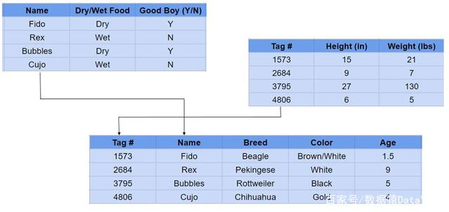
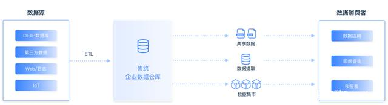
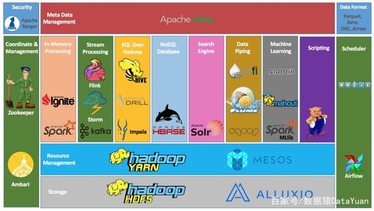
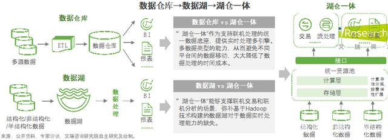
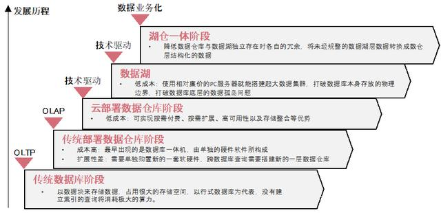
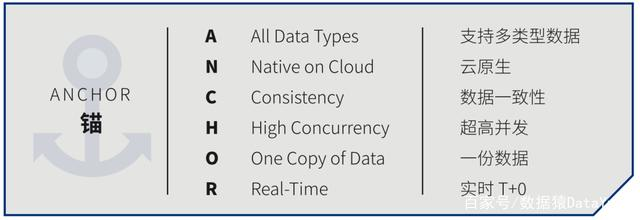
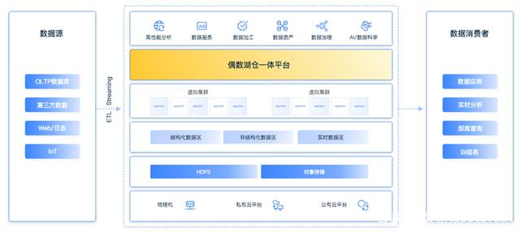
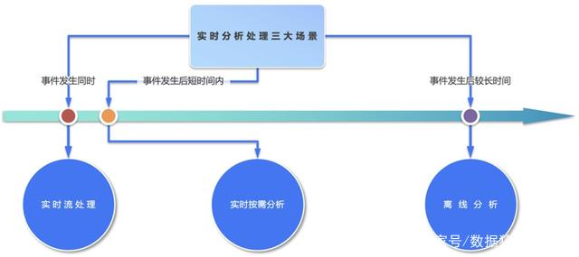
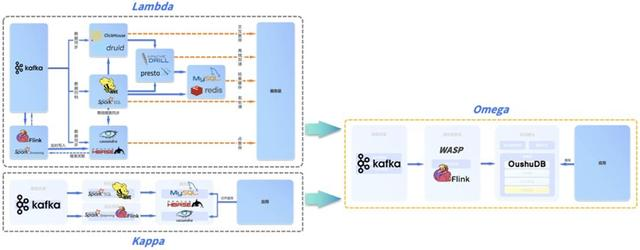

# 湖仓一体

一时间，似乎所有与数据库有关的厂商都在提“湖仓一体”，仅从百度新闻搜索查询到权重较高的媒体文章就至少有150多篇。随着企业数字化转型进入深水区，越来越多的企业视“湖仓一体”为数字变革的重要契机，如今湖仓一体受到前所未有的关注。

然而，关注度越高，意味着嘈杂声也会越多。对“湖仓一体”的错误理解，也会将转型中的企业引入更加复杂的数据孤岛局面。对此，偶数科技向数据猿表示，尽管这些错误理解最终会得被市场淘汰，但从现实而言，可能会造成企业成本上升，甚至会错过数字化转型的战略时机。

作为在数据库领域的领先创业，偶数科技获得红杉中国、腾讯、红点中国、金山云等机构的四轮融资，今年3月，偶数科技又入选了Gartner最新的《数据库市场指南》。

同时，Gartner在上述报告中指出，中国数据库行业将加速增长并逐步向云端迁移，未来四年中国数据库行业向公有云迁移的速度将超过全球平均水平。而偶数科技正是采用了云原生数仓架构方案，突破传统 MPP 和 Hadoop 的局限性，实现了存算彻底分离，并提出“湖仓一体ANCHOR标准”以及在实时性方面的Omega架构，希望能对数字化转型中的企业有所启发。

**从湖仓的前世今生说起**

最初的数据库既没有湖，也没有仓。数据库的起源可以追溯到上世纪六十年代乃至更久，当时，来自美国的查尔斯·巴赫曼（Charles Bachman）设计了第一个计算机化的数据库。紧接着七十年代发生了数据库历史上最有影响力的事件，即关系型数据库的诞生。关系型数据库是用行列二维表格结构表示实体及实体之间联系的数据模型，降低了存储成本，而且关系型数据库是可搜索的，其中SQL就是基于关系型数据库的结构化查询语言。

*关系型数据库，来源：Wikipedia*

计算机软件的发展在八九十年代可谓如日中天，虽然企业源源不断产生数据，但传统的关系型数据库依然可以满足企业的增删查改，就是通常所说的OLTP（联机事务处理）。不过，在日益激烈的市场竞争中，企业还希望能进行数据分析。

1990年，数据仓库之父比尔·恩门（Bill Inmon）率先提出了数据仓库的概念，1991年在其正式出版的专著《建立数据仓库》中指出，企业需要建立数据仓库用来数据分析进而为其决策服务，数据仓库并不是所谓的“大型数据库”，而是强调其数据分析能力，即OLAP，目的是辅助企业决策。

*来源：偶数科技*

随着数据仓库技术进一步发展，此时OLTP 数据库又无法有效满足大量历史数据的存储、查阅以及数据分析的需求，随即分布式数据库（MPP）诞生了。它是用计算机网络将物理上分散的多个数据库单元连接起来，组成逻辑上统一的数据库。MPP处理的主要还是结构化数据，仍然属于数据仓库层面。

时间来到2012 年， 当时国内技术发展较快的一些行业，如电信和头部银行，大都完成了数据仓库的建设。与此同时，互联网的快速发展，让数据体量以前所未有的速度增长，非结构化数据大量出现，而且企业对于数据处理的实时性和易用性也有了更高的要求。

彼时，企业开始大规模使用 Hadoop 分布式的大数据计算和存储方式。在这个体系架构下，Spark Streaming、Flink 让大数据平台具备了实时处理数据能力；HDFS处理海量数据的高可用廉价存储；用MapReduce实现并行计算；Hive则作为Hadoop的数据仓库工具。

*Hadoop生态，来源：Apache Hive Essentials by Dayong Du*

Hadoop曾得到了业界的广泛认可，大数据热让人们对Hadoop抱有更高的期待，认为既然 Hadoop 平台能解决很多数据处理和分析问题，自然可以替代传统的数据仓库。

然而事实并非如此，企业尝试使用后发现Hadoop的性能和并发支持能力有限。虽然Hadoop 逻辑上实现了计算和存储分离，但是其物理部署架构依然强调在每一个节点同时部署计算和存储节点，而且事务支持弱，交付运维成本高，企业最终意识到基于 Hadoop 终究无法替代核心数仓。

尽管Hadoop无法替代数据仓库，但还是找到了自身的定位，那就是数据湖。

数据湖被定义为一种存储各类格式，包括结构化、半结构化和非结构化数据的系统，此时架构师也开始考虑，如何构建一个单一的系统，共同发挥数据湖和数据仓库两种优势。

此时，“湖仓一体”应运而生。数据猿曾撰文指出，“湖仓一体”是构建在数据湖低成本的数据存储架构之上，同时继承了数据仓库的数据处理和分析功能。湖仓一体的英文名叫“Lakehouse”，有人把“湖仓一体”做了形象的比喻，就好像湖边搭建了很多小房子，有的可以负责数据分析，有的来运转机器学习，有的来检索音视频等，而这些数据源流，都可以从数据湖里轻松取得。

*来源：艾瑞*

根据沙利文和头豹研究院的观点，数据湖和数据仓库的边界正在慢慢模糊，数据湖自身的治理能力、数据仓库延伸到外部存储的能力都在加强，湖仓一体的出现让数据管理的灵活性与成长性得到了统一。

*来源：沙利文、头豹研究院*

**为什么大多数“湖仓一体”都做不到真正的一体？**

现在，业内对于“湖仓一体”的解决方案大致可以分为两大类：基于Hadoop的改造方案，如Hudi、Iceberg、Delta Lake方案；基于新一代云原生数据仓库架构的方案，如Snowflake、偶数科技的OushuDB 方案。不过这些都是真正的“湖仓一体”吗？

据偶数科技的调查发现，由于数据湖始终无法满足用户在性能、事务等方面的要求，所以很多厂商的变通做法是，先让所有的数据入湖，便于自由灵活的数据分析和探索，在某个分析逐步成熟时，将其转移到数据仓库，这样就形成了数据湖和数据仓库互补的方式。

湖与仓相互协作的前提是各自的技术都相对稳定成熟，时下这方面并不是问题。既有 Greenplum、Vertica、GaussDB等MPP 数据仓库，也有 Cloudera、AWS、阿里云、腾讯云等厂商主要基于Hadoop的数据湖解决方案。企业在构建数据湖的同时，也使用 MPP，最后形成Hadoop+MPP模式。

在这种模式下，湖是湖，仓是仓，湖仓各自独立部署， 数据通过 ETL 的方式打通，现在很大一部分“湖仓一体”实际是 “湖仓分体”的模式。

*“数据湖 + 数据仓库”互补，湖仓分体模式，来源：偶数科技*

“湖仓分体”虽然很想达到“湖仓一体”的结果，但还不是真正的“湖仓一体”。Gartner 认为，湖仓一体是将数据湖的灵活性和数仓的易用性、规范性、高性能结合起来的**融合架构，无数据孤岛。**

而事实上，“湖仓分体”的数据多集群冗余存储、集群规模受限、高并发受限均会产生数据孤岛，然后在疏解数据孤岛的过程中，又催生了一系列复杂的实施和运维问题，如ETL逻辑复杂、数据变更困难、数据不一致、数据治理困难等。

此外，传统的MPP和Hadoop都不适应云平台的要求。MPP 数据库存算耦合，而 Hadoop不得不通过计算和存储部署在同一物理集群，拉近计算与数据的距离，仅在同一集群下构成存算分离。而基于Hadoop改造方案仅从事务特性出发做优化，如Iceberg和Hudi等基于HDFS或S3实现一个支持事务的存储层，其他方面与Hadoop区别不大。

**偶数科技建立起湖仓一体的ANCHOR判断标准**

既然并不是所有的“湖”与“仓”都是一体的，偶数科技表示，那就可以建立一种标准，让企业客户能够迅速分辨出更适合他们的“湖仓一体”。

正如搜索引擎的“新快全准”，数据库事务的“ACID”，偶数科技采用英语“ANCHOR”六个首字母来界定湖仓一体的标准， 即代表了“湖仓一体”的六大特性。ANCHOR 中文译为锚点、顶梁柱，偶数科技希望这套标准能够湖仓一体浪潮下的定海神针。

*来源：偶数科技*

满足 ANCHOR 定义的湖仓一体在哪些方面会为企业带来价值？偶数科技概括为以下六个方面：

第一，**实时 T+0 （Real-Time）：**通过全量数据T+0的流处理和实时按需查询， 满足基于数据的事前预测、事中判断和事后分析。

具备实时能力的湖仓一体架构，需要同时满足实时流处理、实时分析、离线分析三种需求。实时数据服务应包括通过系统日志点查方式得到的“直接特征”，如点击、浏览、下载、支付；还有更具应用价值的“衍生特征”，如某一产品 5 分钟的点击量，某一用户 30 天内查询征信报告的次数等。

第二，**一份数据（One Copy of Data）：**所有用户（BI 用户、数据科学家等）应该共享同一份数据， 避免数据孤岛。

在多湖仓分体架构中，不同用户使用各自的副本并更新，这样引发了数据冗余存储及数据更新导致数据不一致等问题。ANCHOR 标准保障所有用户可以共享同一份数据，避免数据孤岛。

第三，**超高并发（High Concurrency）：**支持数十万用户使用复杂分析查询并发访问同一份数据。

一个涉及海量的复杂查询可能会影响整个系统的性能，当分析型的 MPP 或者 Hadoop 进行复杂查询达到几十万并发的时候，其吞吐量就会下降。ANCHOR要求的超高并发在新技术的迭代中成为可能，进而支持百万用户同时在线查询分析。

第四，**数据一致性（Consistency）：**通过支持完善的事务机制， 保障不同用户同时查询和更新同一份数据时的一致性。

在企业，多用户同时运行时，ANCHOR要求保证数据的一致性；另外，要保证在事务中的数据一致性，即同一事务中所有数据操作应是不可分割的，要么都执行，要么都不执行，不允许出现中间状态的数据。

第五，**云原生（Native on Cloud）：**适合云环境，自由增减计算和存储资源，按用量计费， 节约成本。

第六，**支持多类型数据（All Data Types, Structured & Unstructured）：**支持关系表、文本、图像、视频等结构化数据和非结构化数据存储。

从以上六要素来看，我们发现并非所有湖仓一体的方案都能完全满足ANCHOR，尤其在T+0 实时特性方面差距很大。目前大多数方案都是基于T+1 设计的，面对T+0实时的按需分析，即便引入流处理引擎实现部分固定模式的实时分析，仍无法达到T+0 全实时水平。

**面向全实时湖仓一体，偶数科技有自己独特的解决策略**

值得一提的是，随着公有云和私有云的普及，让一切软件上云成为当今趋势，为了保证存储和计算可以独立的弹性扩展和伸缩，Snowflake横空出世，数据平台的设计出现了崭新的架构，即存算分离架构。从新的基础架构发展出云原生数据仓库，其存算分离特性更具有技术前瞻性，成为实现湖仓一体的关键技术，该架构将是未来的发展趋势。

在新一代的云原生数仓架构方案中，突破传统MPP和Hadoop的局限性，实现了存算彻底分离，计算和存储可部署在不同的物理集群中，在存储层支持AWS S3、Azure Blob、Google Cloud等多个云服务商，计算层则从存储层获取数据并将其缓存在本地以备未来的查询，运行查询语句调取数据后，用户还可用SQL像使用数据仓库一样进行数据分析。

偶数科技的OushuDB同属于新一代湖仓一体架构，通过虚拟计算集群技术在数十万节点的超大规模集群上实现了高并发，保障事务支持，提供实时能力，一份数据再无数据孤岛。

*来源：偶数科技*

在新一代湖仓一体的架构下，数字化转型的业务需求和技术难点能得到更多关注和解决。随着线上业务的迅猛发展，“实时性”是其中尤为重要的需求，而大多数湖仓分体却无法达到 T+0 全实时水平。

Gartner对“实时性”给出了明确的刻画：以一个事件发生的前后作为时间轴，可以将时间线分为三个阶段， 分别是事件发生的同时、事件发生后短时间内、事件发生后较长时间，对应的实时要求分别是实时流处理、实时按需分析、离线分析。

*实时分析处理三大场景，来源：Gartner*

以一次银行转账为例，交易发生的同时要进行交易反欺诈检测，通过实时流处理系统将本次交易的时间、金额、位置等要素提供给反欺诈应用系统；该笔交易结束后，需要立即反映到实时报表和统计分析中，同时用户也会按照特定需求查询到该笔交易，由于实时报表和实时统计分析需求千变万化，流处理系统难以满足，所以需要实时按需分析；另外，这笔交易发生后也可能被用来进行报表统计、数据挖掘和机器学习，因此离线分析也是基本需求之一。

目前， 实时处理有两种典型架构：Lambda 和 Kappa 架构。Lambda架构在批处理层对离线数据进行预处理并存储，流处理层专注实时数据，其问题在于，数据在不同的视图中存储多份，浪费存储空间，数据一致性的问题亦难以解决；Kappa 架构在Lambda架构的基础上移除了批处理层，批流一体处理所有历史数据和当前数据，可以直接给业务层使用，其局限在于Kafka 难以实现数据的更新和纠错，发生故障或者升级时需要重做所有历史。

由此来看，两个架构都难以处理可变更数据（如关系数据库中不停变化的实时数据），那么自然需要一种新的架构来满足企业实时分析的全部需求。

2021年初，偶数科技推出Omega全实时架构。

Omega架构是由流数据处理系统和实时数仓构成。相比Lambda 和 Kappa，Omega架构新引入了“实时数仓”和“快照视图”的概念。实时查询可以通过存储于实时数仓的快照视图得以实现，而且任意时间点的历史数据都可以通过T+0快速得到，这样无论实时查询还是离线查询都可以在实时数仓中完成。

流处理系统WASP既可以实现实时连续的流处理，也可以实现Kappa 架构中的批流一体，但与之不同之处在于，OushuDB由实时数仓存储来自Kafka的全部历史数据，而在Kappa架构中源端采集后通常存储在 Kafka中。当需要流处理版本变更的时候，访问实时数仓即可，规避了Kafka难以实现数据更新和纠错的问题，大幅提高了效率。此外，整个服务层可以在实时数仓中实现，无需引入外部组件，至此，偶数科技实现了全实时 Omega 架构的湖仓一体，即实时湖仓一体。

*Omega vs. Lambda vs. Kappa，来源：偶数科技*

据了解，早在2020年建设银行就与偶数科技成立了高性能大数据联合实验室，合作开发基于云原生数据库技术的全实时湖仓一体方案，该方案已在建行及其客户的实时场景下得到了验证。

总结来看，通过理清历史发展的脉络，我们理解了湖仓一体是数据库发展到云原生时代的必然产物，也了解到有些“湖仓一体”不但没有从数据平台层面消除数据孤岛，反而催生了更为复杂的架构。为帮助有需求的企业更好地做出判断，偶数科技对湖仓一体率先创建了ANCHOR标准，并针对其中“实时性”方面提出了可被验证的Omega 架构。

诚然，每个新概念的诞生都离不开业务场景和技术的双重驱动，在概念落地时，难免会出现一些认知上的偏差和技术上的弯路。湖仓一体也才刚刚走过一年多的时间，包括偶数科技在内的探索者不断尝试和试错正在推动市场形成共识，如同1970年代关系型数据库和1990年数据仓库的理念，每次微小的突破，都能掀起后续的波澜，这也是让科技创新者不断前进的动力所在。
