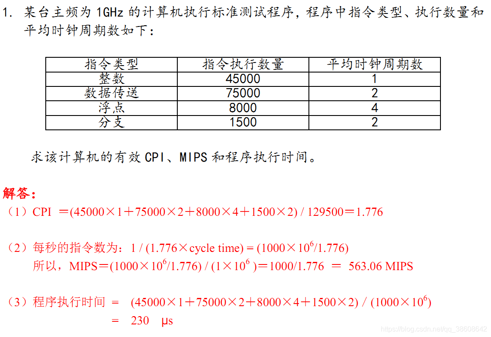

### 毕业设计题目

基于深度强化学习和联邦学习的异构网格环境中的任务调度算法

A deep reinforcement learning and federated learning based task scheduling algorithm in heterogeneous grid environment

基于联邦深度强化学习的跨域异构环境中任务调度算法的研究与实现

基于联邦深度强化学习的跨域任务调度算法的研究与实现:white_check_mark:

基于联邦深度强化学习的任务调度算法的研究与实现

基于联邦强化学习的跨域任务调度算法的研究与实现

跨自治域主动测量中资源调度算法的研究与实现

面向交易维度的比特币地址关系分析算法的研究与实现

基于深度强化学习的高效能云任务调度算法研究

### 开题报告

三个研究内容：

1. 聚类：机器/任务分类
2. 深度强化学习：任务调度
3. 联邦强化学习：数据传输请求的分配和调度

1. 机器聚类算法
2. 基于深度强化学习的任务调度算法
3. 使用联邦学习改进模型精度和实现隐私保护

可选：

任务聚类算法

存储请求调度

MDP模型建模

一个新思路：

把机器改成机器集群，

然后机器集群通过聚类获得，

任务调度给机器集群，而不是单个机器，任务调度给某个集群后，然后在集群内部用RR来分配任务；

### 聚类算法

#### 1、机器特征抽象

原始特征：CPU主频、CPU核心数、CPU逻辑处理器个数、内存大小、带宽大小

抽象特征：MIPS、ram、disk、bandwidth

对于某台计算机怎么计算MIPS？

MIPS＝主频 / (CPI * 10^6) 	（MIPS为每秒钟处理了多少百万条指令，CPI为每条指令的平均时钟周期数）

#### 2、聚类

每个自治域内聚类产生的簇的个数是相同的。

 ### 毕业设计两个创新点

1. 基于深度强化学习的任务调度算法
2. 使用联邦学习改进模型精度和实现隐私保护

