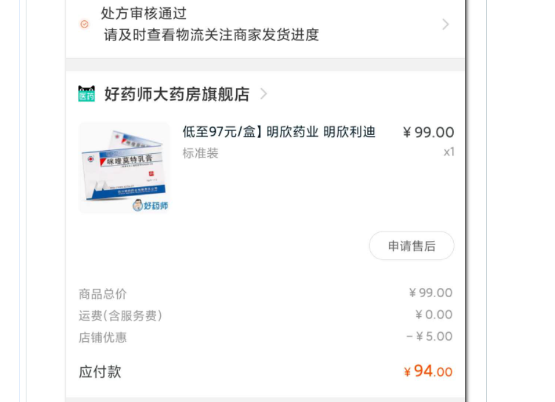
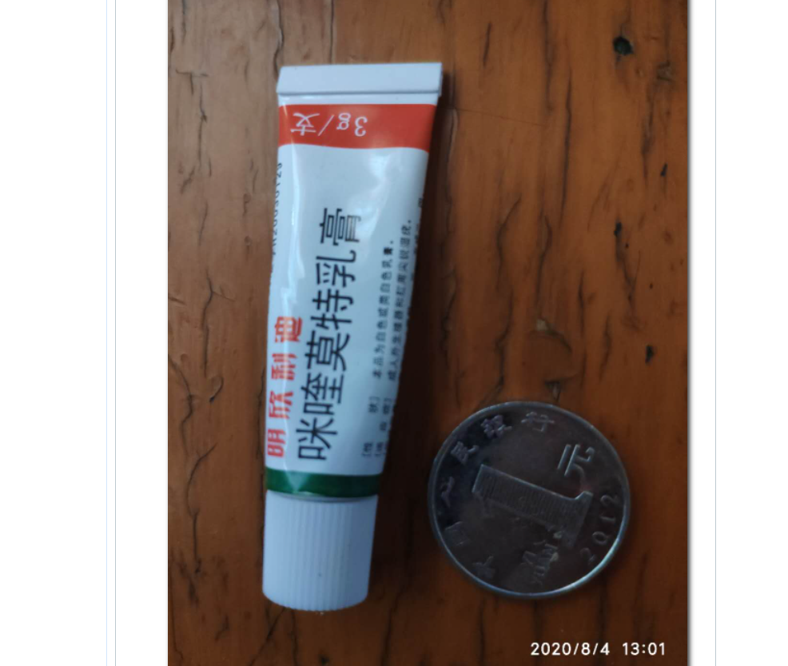

# 生活常识

## 1.外国人的姓名顺序

美国人的姓名是以名•名•姓为序排列组成的。第一名又称教名，是受法律承认的正式名字。中间名通常用缩写表示，由钟爱孩子的父母或其亲戚所取，他们甚至把自己的名字直接取给孩子。中间名代表本人同亲属之间的关系，外人一般不称呼中间名，也不得究其详，甚至法院也不承认中间名是法定姓名的一部分。姓氏是由家族世代相传的。美国法律规定，妇女婚后要使用丈夫的姓，即使离婚，也应予保留，非经法律判决，不可恢复未婚时的姓。

## 英语

### state of the art

作名词用的 state of the art，可以翻译成「（最）前沿水平」或「最高水平」。

作形容词用的 state-of-the-art，可以翻译成「（最）前沿的」。

## 2. 跖疣

> 链接：https://bbs.byr.cn/#!article/Health/221522

刚开始就长了一个没注意以为是鸡眼，过了小一个月才发现越长越多，才知道是跖疣。医生说只能液氮冷冻或者激光比较好，想请问下校医院可以做吗？会不会复发啊？以及费用什么的，谢谢大家。

先说题主的问题。
1）北邮校医院只能检查鉴别跖疣和鸡眼或者其他皮肤病，不能做液氮冷冻手术。液氮我没什么痛感，有些人会很疼，主要是术后水泡引起的疼痛；激光我没有做过，不清楚。反正这俩手术都是物理疗法，有复发的可能性。
还有第三种方法就是抹药（特别注明是：**咪喹莫特**），我是这么好的。
2）费用大概小几百块钱，从去治疗到痊愈我总共花了3+196+19.6+50+30+94-156.8=235.8，来回去了三次北医三院，至今没有复发。

个人治疗跖疣经历。
我是去年暑假的时候得的跖疣，一直不知道，以为是鸡眼，没管它，然后疼得越来越走不动路，去校医院查了一下，医生说是跖疣，建议我转北医三院，说校医院做不了液氮冷冻手术（就是棉签粘液氮，点一下皮肤呀，有什么难的？而且手套都不用带，我实验室要有液氮，我自己就给自己做了，校医院液氮手术为什么不能做？这里我吐槽一下校医院，这是校医院自己的问题），于是开了转院单。在微信上预约北医三院成功后，成功做了液氮手术，还自作聪明的要了维A酸乳膏和阿昔洛韦软膏（看网上好多这样治好的）。做完手术，照常开个小黄车蹬回学校（小黄车还钱！）。术后三周后需要去医院复诊。晚上去北师东门药店买了碘酒、棉签、纱布、胶带。天天晚上涂抹药膏后睡觉。校医院挂号1元，北医三院微信预约挂号50元，一次液氮冷冻手术30元，药膏36元，药店19.6元。
三周后跖疣一点变化没有，甚至这个大跖疣扩散了一个小跖疣（如果液氮冷冻效果显著的话，皮肤接触液氮后皮肤会发黑，周围会起水泡，接着带病皮肤会一起结痂脱落，一般是这样达到治疗目的的，然而这对于我个体而言没用，估计是我皮糙肉厚吧，物理攻击无效）。校医院开转院单，同时向医生也表明了我的疑惑，医生说是因为冻得不彻底，要多冻几次，把病毒逼到死角去，我信了。后去北医三院复诊，继续冷冻手术，又没啥效果。又三周后，在涂抹药膏的时候我怀疑手被感染上了疣，去北医三院复诊，遇到了郭金竹医生姐姐，一看手上这是甲下疣，这比跖疣更难治，开了一个药，结果北医三院药库里缺货（哎，我当时忘了加她微信，等有药的时候可以去买，走医院可以报销，最后所有寻常疣都治好了我还挺感谢她的），在诊疗单上写了咪喹莫特（诊疗单在宿舍要不然就拍张照放下面了），让我去大一点的药店去买，去校医院问了，没得卖，于是就去淘宝上买了（由于这是处方药，你得上传诊疗单审核，处方药才能给你开），快递还挺快隔天就到了，晚上涂抹以后，第二天脚上的两个跖疣和手指甲上的甲下疣就开始结痂变黑，团聚在一起，第三天就开始自然脱落了，我就坚持涂抹了一周，皮肤上没有任何变化后就停了。咪喹莫特94元，北京学生公费医疗报销80%返你卡上156.8元，我第三次挂号50元没报上。**另外注意在放假期间的北京学生公费医疗就是个渣滓，不管你生什么病，全自费，暑假最多只能报销22.5元，寒假最多只能报销15元。**
至此纠缠我半年的跖疣就治愈了。

总结：
1）确定跖疣了，怕疼不想试液氮冷冻手术，小面积疣可以试试去北医三院开外用咪喹莫特软膏。很小很贵，但效果很好。
2）**维A酸软膏是促进皮肤代谢的；阿昔洛韦是治疗疱疹病毒HSV的；咪喹莫特是治疗人乳头瘤病毒HPV的**，跖疣就是其中一种。
3）只要去与人接触多的公共场所，难免会碰到一些易传染性病毒，不用太过纠结，有病治病，遵循医嘱。

