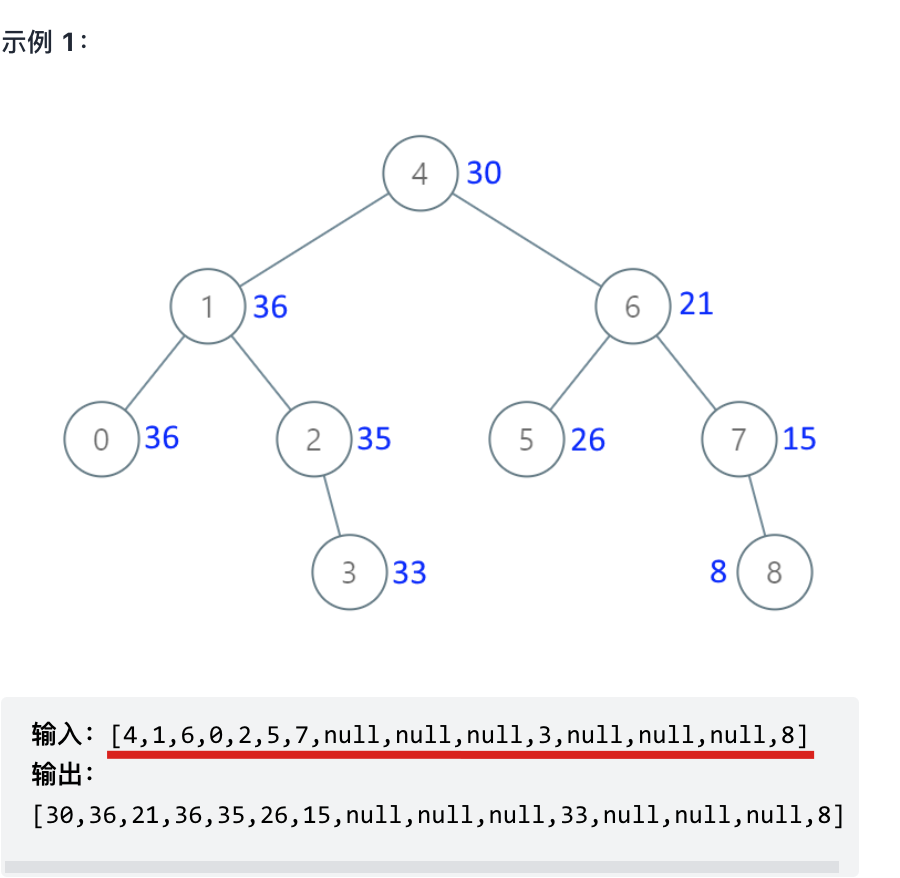
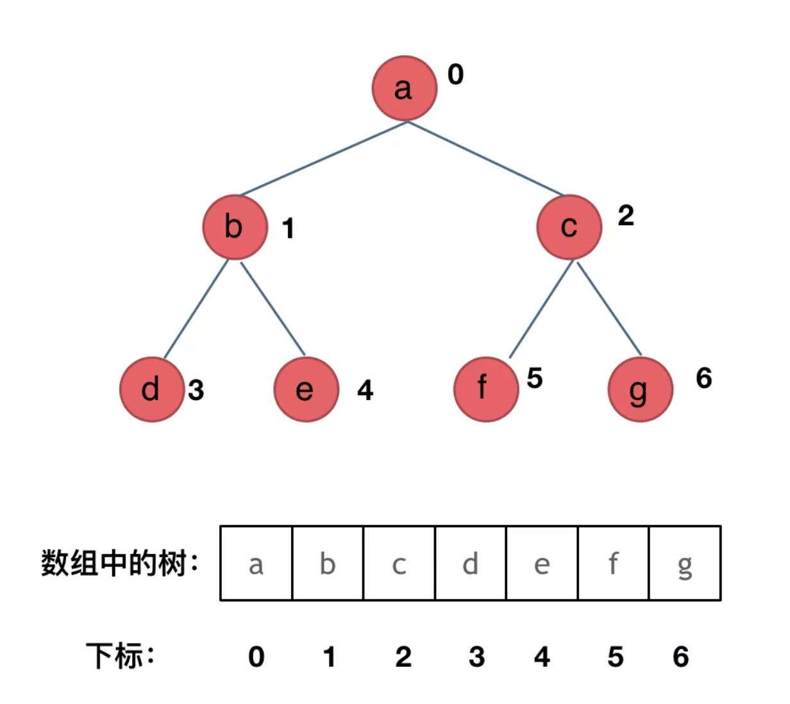
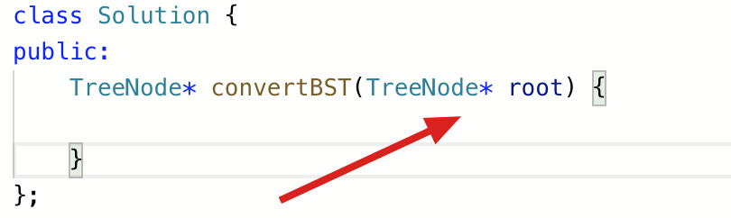
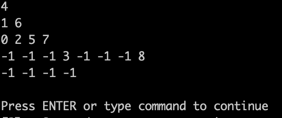
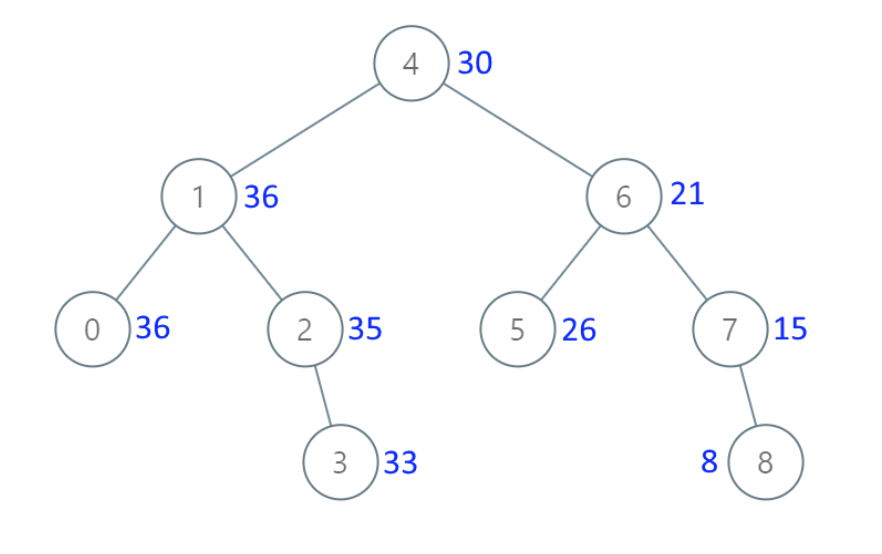

# ACM模式

现在很多企业都在牛客上进行面试，**很多录友和我反馈说搞不懂牛客上输入代码的ACM模式**。

什么是ACM输入模式呢？ 就是自己构造输入数据格式，把要需要处理的容器填充好，OJ不会给你任何代码，包括include哪些函数都要自己写，最后也要自己控制返回数据的格式。

而力扣上是核心代码模式，就是把要处理的数据都已经放入容器里，可以直接写逻辑，例如这样：

```cpp
class Solution {
public:
    int minimumTotal(vector<vector<int>>& triangle) {

    }
};
```


**如果大家从一开始学习算法就一直在力扣上的话，突然切到牛客网上的ACM模式会很不适应**。

因为我上学的时候就搞ACM，在POJ（北大的在线判题系统）和ZOJ（浙大的在线判题系统）上刷过6、7百道题目了，对这种ACM模式就很熟悉。

接下来我给大家讲一下ACM模式应该如何写。

这里我拿牛客上 腾讯2020校园招聘-后台 的面试题目来举一个例子，本题我不讲解题思路，只是拿本题为例讲解ACM输入输出格式。

题目描述：

由于业绩优秀，公司给小Q放了 n 天的假，身为工作狂的小Q打算在在假期中工作、锻炼或者休息。他有个奇怪的习惯：不会连续两天工作或锻炼。只有当公司营业时，小Q才能去工作，只有当健身房营业时，小Q才能去健身，小Q一天只能干一件事。给出假期中公司，健身房的营业情况，求小Q最少需要休息几天。

输入描述: 第一行一个整数 表示放假天数 第二行 n 个数 每个数为0或1,第 i 个数表示公司在第 i 天是否营业 第三行 n 个数 每个数为0或1,第 i 个数表示健身房在第 i 天是否营业 （1为营业 0为不营业）

输出描述: 一个整数，表示小Q休息的最少天数

示例一： 输入: 

4 

1 1 0 0 

0 1 1 0

输出: 2

这道题如果要是力扣上的核心代码模式，OJ应该直接给出如下代码：

```cpp
class Solution {
public:
    int getDays(vector<int>& work, vector<int>& gym) {
        // 处理逻辑
    }
};
```


以上代码中我们直接写核心逻辑就行了，work数组，gym数组都是填好的，直接拿来用就行，处理完之后 return 结果就完事了。

那么看看ACM模式我们要怎么写呢。

ACM模式要求写出来的代码是直接可以本地运行的，所以我们需要自己写include哪些库函数，构造输入用例，构造输出用例。

拿本题来说，为了让代码可以运行，需要include这些库函数：

```cpp
#include<iostream>
#include<vector>
using namespace std;
```


然后开始写主函数，来处理输入用例了，示例一 是一个完整的测试用例，一般我们测了一个用例还要测第二个用例，所以用：while(cin>>n) 来输入数据。

这里输入的n就是天数，得到天数之后，就可以来构造work数组和gym数组了。

此时就已经完成了输入用例构建，然后就是处理逻辑了，最后返回结果。

完整代码如下：

```cpp
#include<iostream>
#include<vector>
using namespace std;
int main() {
    int n;
    while (cin >> n) {
        vector<int> gym(n);
        vector<int> work(n);
        for (int i = 0; i < n; i++) cin >> work[i];
        for (int i = 0; i < n; i++) cin >> gym[i];
        int result = 0;

        // 处理逻辑

        cout << result << endl;
    }
    return 0;
}
```


可以看出ACM模式要比核心代码模式多写不少代码，相对来说ACM模式更锻炼代码能力，而核心代码模式是把侧重点完全放在算法逻辑上。

**国内企业现在很多都用牛客来进行面试，所以这种ACM模式大家还有必要熟悉一下**，以免面试的时候因为输入输出搞不懂而错失offer。

如果大家有精力的话，也可以去POJ上去刷刷题，POJ是ACM选手首选OJ，输入模式也是ACM模式。


# 力扣上如何自己构造二叉树输入用例？

经常有录友问，二叉树的题目中输入用例在ACM模式下应该怎么构造呢？

力扣上的题目，输入用例就给了一个数组，怎么就能构造成二叉树呢？

这次就给大家好好讲一讲！

就拿最近公众号上 二叉树的打卡题目来说：

[538.把二叉搜索树转换为累加树(opens new window)](https://mp.weixin.qq.com/s/rlJUFGCnXsIMX0Lg-fRpIw)

其输入用例，就是用一个数组来表述 二叉树，如下：



一直跟着公众号学算法的录友 应该知道，我在[二叉树：构造二叉树登场！ (opens new window)](https://mp.weixin.qq.com/s/Dza-fqjTyGrsRw4PWNKdxA)，已经讲过，**只有 中序与后序 和 中序和前序 可以确定一棵唯一的二叉树。 前序和后序是不能确定唯一的二叉树的**。

那么[538.把二叉搜索树转换为累加树 (opens new window)](https://mp.weixin.qq.com/s/rlJUFGCnXsIMX0Lg-fRpIw)的示例中，为什么，一个序列（数组或者是字符串）就可以确定二叉树了呢？

很明显，是后台直接明确了构造规则。

再看一下 这个 输入序列 和 对应的二叉树。


从二叉树 推导到 序列，大家可以发现这就是层序遍历。

但从序列 推导到 二叉树，很多同学就看不懂了，这得怎么转换呢。

我在 [关于二叉树，你该了解这些！ (opens new window)](https://mp.weixin.qq.com/s/q_eKfL8vmSbSFcptZ3aeRA)已经详细讲过，二叉树可以有两种存储方式，一种是 链式存储，另一种是顺序存储。

链式存储，就是大家熟悉的二叉树，用指针指向左右孩子。

顺序存储，就是用一个数组来存二叉树，其方式如图所示：



那么此时大家是不是应该知道了，数组如何转化成 二叉树了。**如果父节点的数组下标是i，那么它的左孩子下标就是i \* 2 + 1，右孩子下标就是 i \* 2 + 2**。计算过程为：

如果父节点在第$k$层，第$m,m \in [0,2^k]$个节点，则其左孩子所在的位置必然为$k+1$层，第$2*(m-1)+1$个节点。

- 计算父节点在数组中的索引： $$ index_{father}=(\sum_{i=0}^{i=k-1}2^i)+m-1=2^k-1+m-1 $$
- 计算左子节点在数组的索引： $$ index_{left}=(\sum_{i=0}^{i=k}2^i)+2*m-1-1=2^{k+1}+2m-3 $$
- 故左孩子的下表为$index_{left}=index_{father}\times2+1$，同理可得到右子孩子的索引关系。也可以直接在左子孩子的基础上`+1`。

那么这里又有同学疑惑了，这些我都懂了，但我还是不知道 应该 怎么构造。

来，咱上代码。 昨天晚上 速度敲了一遍实现代码。

具体过程看注释：

```cpp
// 根据数组构造二叉树
TreeNode* construct_binary_tree(const vector<int>& vec) {
    vector<TreeNode*> vecTree (vec.size(), NULL);
    TreeNode* root = NULL;
    // 把输入数值数组，先转化为二叉树节点数组
    for (int i = 0; i < vec.size(); i++) {
        TreeNode* node = NULL;
        if (vec[i] != -1) node = new TreeNode(vec[i]); // 用 -1 表示null
        vecTree[i] = node;
        if (i == 0) root = node;
    }
    // 遍历一遍，根据规则左右孩子赋值就可以了
    // 注意这里 结束规则是 i * 2 + 2 < vec.size()，避免空指针
    for (int i = 0; i * 2 + 2 < vec.size(); i++) {
        if (vecTree[i] != NULL) {
            // 线性存储转连式存储关键逻辑
            vecTree[i]->left = vecTree[i * 2 + 1];
            vecTree[i]->right = vecTree[i * 2 + 2];
        }
    }
    return root;
}
```


这个函数最后返回的 指针就是 根节点的指针， 这就是 传入二叉树的格式了，也就是 力扣上的用例输入格式，如图：



也有不少同学在做ACM模式的题目，就经常疑惑：

- 让我传入数值，我会！
- 让我传入数组，我会！
- 让我传入链表，我也会！
- **让我传入二叉树，我懵了，啥？ 传入二叉树？二叉树怎么传？**

其实传入二叉树，就是传入二叉树的根节点的指针，和传入链表都是一个逻辑。

这种现象主要就是大家对ACM模式过于陌生，说实话，ACM模式才真正的考察代码能力（注意不是算法能力），而 力扣的核心代码模式 总有一种 不够彻底的感觉。

所以，如果大家对ACM模式不够了解，一定要多去练习！

那么以上的代码，我们根据数组构造二叉树，接来下我们在 把 这个二叉树打印出来，看看是不是 我们输入的二叉树结构，这里就用到了层序遍历，我们在[二叉树：层序遍历登场！ (opens new window)](https://mp.weixin.qq.com/s/4-bDKi7SdwfBGRm9FYduiA)中讲过。

完整测试代码如下：

```cpp
#include <iostream>
#include <vector>
#include <queue>
using namespace std;

struct TreeNode {
    int val;
    TreeNode *left;
    TreeNode *right;
    TreeNode(int x) : val(x), left(NULL), right(NULL) {}
};

// 根据数组构造二叉树
TreeNode* construct_binary_tree(const vector<int>& vec) {
    vector<TreeNode*> vecTree (vec.size(), NULL);
    TreeNode* root = NULL;
    for (int i = 0; i < vec.size(); i++) {
        TreeNode* node = NULL;
        if (vec[i] != -1) node = new TreeNode(vec[i]);
        vecTree[i] = node;
        if (i == 0) root = node;
    }
    for (int i = 0; i * 2 + 2 < vec.size(); i++) {
        if (vecTree[i] != NULL) {
            vecTree[i]->left = vecTree[i * 2 + 1];
            vecTree[i]->right = vecTree[i * 2 + 2];
        }
    }
    return root;
}

// 层序打印打印二叉树
void print_binary_tree(TreeNode* root) {
    queue<TreeNode*> que;
    if (root != NULL) que.push(root);
    vector<vector<int>> result;
    while (!que.empty()) {
        int size = que.size();
        vector<int> vec;
        for (int i = 0; i < size; i++) {
            TreeNode* node = que.front();
            que.pop();
            if (node != NULL) {
                vec.push_back(node->val);
                que.push(node->left);
                que.push(node->right);
            }
            // 这里的处理逻辑是为了把null节点打印出来，用-1 表示null
            else vec.push_back(-1);
        }
        result.push_back(vec);
    }
    for (int i = 0; i < result.size(); i++) {
        for (int j = 0; j < result[i].size(); j++) {
            cout << result[i][j] << " ";
        }
        cout << endl;
    }
}

int main() {
    // 注意本代码没有考虑输入异常数据的情况
    // 用 -1 来表示null
    vector<int> vec = {4,1,6,0,2,5,7,-1,-1,-1,3,-1,-1,-1,8};
    TreeNode* root = construct_binary_tree(vec);
    print_binary_tree(root);
}
```


可以看出我们传入的数组是：{4,1,6,0,2,5,7,-1,-1,-1,3,-1,-1,-1,8} ， 这里是用 -1 来表示null，

和 [538.把二叉搜索树转换为累加树 (opens new window)](https://mp.weixin.qq.com/s/rlJUFGCnXsIMX0Lg-fRpIw)中的输入是一样的


这里可能又有同学疑惑，你这不一样啊，题目是null，你为啥用-1。

用-1 表示null为了方便举例，如果非要和 力扣输入一样一样的，就是简单的字符串处理，把null 替换为 -1 就行了。

在来看，测试代码输出的效果：



可以看出和 题目中输入用例 这个图 是一样一样的。 只不过题目中图没有把 空节点 画出来而已。



大家可以拿我的代码去测试一下，跑一跑。

**注意：我的测试代码，并没有处理输入异常的情况（例如输入空数组之类的），处理各种输入异常，大家可以自己去练练**。

# ACM模式训练

https://ac.nowcoder.com/acm/contest/5657#question

### 1、cin读取一行定长数据

链接：https://ac.nowcoder.com/acm/contest/5657/A
来源：牛客网

计算a+b
打开以下链接可以查看正确的代码
https://ac.nowcoder.com/acm/contest/5657#question
数据范围： 数据组数 1 \le t \le 100 \1≤t≤100  , 数据大小满足 1 \le n \le 1000 \1≤n≤1000 
输入描述:
输入包括两个正整数a,b(1 <= a, b <= 1000),输入数据包括多组。
输出描述:
输出a+b的结果
示例1
输入
复制
1 5
10 20
输出
复制
6
30

```c++
#include <iostream>
using namespace std;

int main() {
    int a, b;
    while (cin >> a >> b) {
        cout << a + b << endl;
    }
}
```


### 2、getline/stringstream读取一行不定长数据

链接：https://ac.nowcoder.com/acm/contest/5657/G
来源：牛客网

计算一系列数的和
打开以下链接可以查看正确的代码
https://ac.nowcoder.com/acm/contest/5657#question


输入描述:
输入数据有多组, 每行表示一组输入数据。

每行不定有n个整数，空格隔开。(1 <= n <= 100)。
输出描述:
每组数据输出求和的结果
示例1
输入
复制
1 2 3
4 5
0 0 0 0 0
输出
复制
6
9
0

```cpp
#include<iostream>
#include <bits/stdc++.h>
using namespace std;
int main(){
    string line;
    while (getline(cin, line))
    {
        stringstream ss;
        ss << line;
        int cur_sum = 0;
        int x;
        while (ss >> x)
            cur_sum += x;
        cout << cur_sum << endl;
    }
    return 0;
}
```

当然也可以用cin，读到'\n'换行：

```cpp
#include <iostream>
using namespace std;

int main()
{
    int num;
    int sum = 0;
    while(cin >> num)
    {
        sum += num;
        if(cin.get() == '\n')
        {
            cout << sum << endl;
            sum = 0;
        }
    }
    
    return 0;
}
```


# 刷题日记

>开始日期：10.12
>
>天数：14 （10.25）
>
>总题量：65

## 数组（5）

1. #### [二分查找](https://leetcode-cn.com/problems/binary-search/)

2. #### [移除元素](https://leetcode-cn.com/problems/remove-element/)

3. #### [有序数组的平方](https://leetcode-cn.com/problems/squares-of-a-sorted-array/)

4. #### [长度最小的子数组](https://leetcode-cn.com/problems/minimum-size-subarray-sum/)

5. #### [螺旋矩阵 II](https://leetcode-cn.com/problems/spiral-matrix-ii/)

## 链表（12）

1. #### [移除链表元素](https://leetcode-cn.com/problems/remove-linked-list-elements/)

2. #### [设计链表](https://leetcode-cn.com/problems/design-linked-list/)

3. #### [反转链表](https://leetcode-cn.com/problems/reverse-linked-list/)

4. #### [25. K 个一组翻转链表](https://leetcode-cn.com/problems/reverse-nodes-in-k-group/)

5. #### [两两交换链表中的节点](https://leetcode-cn.com/problems/swap-nodes-in-pairs/)

6. #### [删除链表的倒数第 N 个结点](https://leetcode-cn.com/problems/remove-nth-node-from-end-of-list/)

7. #### [链表相交](https://leetcode-cn.com/problems/intersection-of-two-linked-lists-lcci/)

8. #### [环形链表 II](https://leetcode-cn.com/problems/linked-list-cycle-ii/)（经典题目，**较难**）


## 哈希表（20）

1. #### [有效的字母异位词](https://leetcode-cn.com/problems/valid-anagram/)

2. #### [两个数组的交集](https://leetcode-cn.com/problems/intersection-of-two-arrays/)

3. #### [快乐数](https://leetcode-cn.com/problems/happy-number/)

4. #### [两数之和](https://leetcode-cn.com/problems/two-sum/)（利用哈希表的经典O(n)解法，**反复刷**）

5. #### [四数相加 II](https://leetcode-cn.com/problems/4sum-ii/)（也是经典）

6. #### [赎金信](https://leetcode-cn.com/problems/ransom-note/)

7. #### [三数之和](https://leetcode-cn.com/problems/3sum/)（必须用双指针法，**反复刷**）

8. #### [四数之和](https://leetcode-cn.com/problems/4sum/)

##  字符串（27）

1. #### [反转字符串](https://leetcode-cn.com/problems/reverse-string/)

2. #### [反转字符串 II](https://leetcode-cn.com/problems/reverse-string-ii/)

3. #### [替换空格](https://leetcode-cn.com/problems/ti-huan-kong-ge-lcof/)

4. #### [翻转字符串里的单词](https://leetcode-cn.com/problems/reverse-words-in-a-string/)

5. #### [左旋转字符串](https://leetcode-cn.com/problems/zuo-xuan-zhuan-zi-fu-chuan-lcof/)（字符串经典方法：局部反转+全局反转）

6. #### [实现 strStr()](https://leetcode-cn.com/problems/implement-strstr/)（kmp算法）

7. #### [重复的子字符串](https://leetcode-cn.com/problems/repeated-substring-pattern/)（使用next数组的规律）

## 栈与队列（35）

1. #### [用栈实现队列](https://leetcode-cn.com/problems/implement-queue-using-stacks/)（两个栈实现队列）

2. #### [用队列实现栈](https://leetcode-cn.com/problems/implement-stack-using-queues/)（两个队列实现栈）

3. #### [有效的括号](https://leetcode-cn.com/problems/valid-parentheses/)

4. #### [简化路径](https://leetcode-cn.com/problems/simplify-path/)

5. #### [删除字符串中的所有相邻重复项](https://leetcode-cn.com/problems/remove-all-adjacent-duplicates-in-string/)（利用std::string也是栈的特性）

6. #### [逆波兰表达式求值](https://leetcode-cn.com/problems/evaluate-reverse-polish-notation/)

7. #### [滑动窗口最大值](https://leetcode-cn.com/problems/sliding-window-maximum/)（deque实现单调队列的经典做法）

8. #### [前 K 个高频元素](https://leetcode-cn.com/problems/top-k-frequent-elements/)（经典优先级队列priority_queue来代替小顶堆的做法）

## 二叉树（67）

1. #### [从中序与后序遍历序列构造二叉树](https://leetcode-cn.com/problems/construct-binary-tree-from-inorder-and-postorder-traversal/)

2. #### [从前序与中序遍历序列构造二叉树](https://leetcode-cn.com/problems/construct-binary-tree-from-preorder-and-inorder-traversal/)

3. 二叉树三种遍历的递归和非递归、二叉树的层次遍历

4. 二叉搜索树的建立、插入、查找和删除

5. #### [翻转二叉树](https://leetcode-cn.com/problems/invert-binary-tree/)

6. #### [对称二叉树](https://leetcode-cn.com/problems/symmetric-tree/)

7. #### [二叉树的最大深度](https://leetcode-cn.com/problems/maximum-depth-of-binary-tree/)

8. #### [N 叉树的最大深度](https://leetcode-cn.com/problems/maximum-depth-of-n-ary-tree/)（做法跟二叉树一模一样）

9. #### [二叉树的最小深度](https://leetcode-cn.com/problems/minimum-depth-of-binary-tree/)

10. 判断完全二叉树

11. #### [完全二叉树的节点个数](https://leetcode-cn.com/problems/count-complete-tree-nodes/)（完全二叉树性质+位运算，**反复刷**）

12. #### [平衡二叉树](https://leetcode-cn.com/problems/balanced-binary-tree/)

13. #### [二叉树的所有路径](https://leetcode-cn.com/problems/binary-tree-paths/)

14. #### [相同的树](https://leetcode-cn.com/problems/same-tree/)

15. #### [左叶子之和](https://leetcode-cn.com/problems/sum-of-left-leaves/)

16. #### [找树左下角的值](https://leetcode-cn.com/problems/find-bottom-left-tree-value/)

17. #### [路径总和](https://leetcode-cn.com/problems/path-sum/)

18. #### [路径总和 II](https://leetcode-cn.com/problems/path-sum-ii/)

19. #### [最大二叉树](https://leetcode-cn.com/problems/maximum-binary-tree/)

20. #### [合并二叉树](https://leetcode-cn.com/problems/merge-two-binary-trees/)

21. #### [二叉搜索树中的搜索](https://leetcode-cn.com/problems/search-in-a-binary-search-tree/)（二叉搜索树大多数操作跟中序遍历挂钩）

22. #### [验证二叉搜索树](https://leetcode-cn.com/problems/validate-binary-search-tree/)

23. #### [二叉搜索树的最小绝对差](https://leetcode-cn.com/problems/minimum-absolute-difference-in-bst/)

24. #### [二叉搜索树中的众数](https://leetcode-cn.com/problems/find-mode-in-binary-search-tree/)

25. #### [二叉树的最近公共祖先](https://leetcode-cn.com/problems/lowest-common-ancestor-of-a-binary-tree/)

26. #### [二叉搜索树的最近公共祖先](https://leetcode-cn.com/problems/lowest-common-ancestor-of-a-binary-search-tree/)

27. #### [二叉搜索树中的插入操作](https://leetcode-cn.com/problems/insert-into-a-binary-search-tree/)

28. #### [删除二叉搜索树中的节点](https://leetcode-cn.com/problems/delete-node-in-a-bst/)

29. #### [修剪二叉搜索树](https://leetcode-cn.com/problems/trim-a-binary-search-tree/)（二叉搜索树的迭代不需要栈）

30. #### [将有序数组转换为二叉搜索树](https://leetcode-cn.com/problems/convert-sorted-array-to-binary-search-tree/)

31. #### [把二叉搜索树转换为累加树](https://leetcode-cn.com/problems/convert-bst-to-greater-tree/)

32. 手写平衡二叉树

## 回溯法（81）

1. #### [组合](https://leetcode-cn.com/problems/combinations/)（回溯法经典题目）

2. #### [组合总和 III](https://leetcode-cn.com/problems/combination-sum-iii/)

3. #### [电话号码的字母组合](https://leetcode-cn.com/problems/letter-combinations-of-a-phone-number/)

4. #### [组合总和](https://leetcode-cn.com/problems/combination-sum/)

5. #### [组合总和 II](https://leetcode-cn.com/problems/combination-sum-ii/)

6. #### [分割回文串](https://leetcode-cn.com/problems/palindrome-partitioning/)

7. #### [复原 IP 地址](https://leetcode-cn.com/problems/restore-ip-addresses/)

8. #### [子集](https://leetcode-cn.com/problems/subsets/)

9. #### [子集 II](https://leetcode-cn.com/problems/subsets-ii/)

10. #### [全排列](https://leetcode-cn.com/problems/permutations/)

11. #### [全排列 II](https://leetcode-cn.com/problems/permutations-ii/)

12. #### [重新安排行程](https://leetcode-cn.com/problems/reconstruct-itinerary/)(困难题，重复做)

13. #### [N 皇后](https://leetcode-cn.com/problems/n-queens/)

14. #### [解数独](https://leetcode-cn.com/problems/sudoku-solver/)

## 贪心法（99，贪心难点，反复刷）

1. #### [分发饼干](https://leetcode-cn.com/problems/assign-cookies/)

2. #### [摆动序列](https://leetcode-cn.com/problems/wiggle-subsequence/)

3. #### [最大子序和](https://leetcode-cn.com/problems/maximum-subarray/)

4. #### [买卖股票的最佳时机 II](https://leetcode-cn.com/problems/best-time-to-buy-and-sell-stock-ii/)（转化为求每天利润的问题）

5. #### [跳跃游戏](https://leetcode-cn.com/problems/jump-game/)

6. #### [跳跃游戏 II](https://leetcode-cn.com/problems/jump-game-ii/)

7. #### [K 次取反后最大化的数组和](https://leetcode-cn.com/problems/maximize-sum-of-array-after-k-negations/)

8. #### [加油站](https://leetcode-cn.com/problems/gas-station/)（面试原题，贪心典例）

9. #### [分发糖果](https://leetcode-cn.com/problems/candy/)（从左到右，再从右到左）

10. #### [柠檬水找零](https://leetcode-cn.com/problems/lemonade-change/)

11. #### [根据身高重建队列](https://leetcode-cn.com/problems/queue-reconstruction-by-height/)

12. #### [用最少数量的箭引爆气球](https://leetcode-cn.com/problems/minimum-number-of-arrows-to-burst-balloons/)（区间排序思想）

13. #### [无重叠区间](https://leetcode-cn.com/problems/non-overlapping-intervals/)（区间排序，加反向思维，先求最大非重叠区间个数）

14. #### [划分字母区间](https://leetcode-cn.com/problems/partition-labels/)

15. #### [合并区间](https://leetcode-cn.com/problems/merge-intervals/)

16. #### [单调递增的数字](https://leetcode-cn.com/problems/monotone-increasing-digits/)

17. #### [买卖股票的最佳时机含手续费](https://leetcode-cn.com/problems/best-time-to-buy-and-sell-stock-with-transaction-fee/)

18. #### [监控二叉树](https://leetcode-cn.com/problems/binary-tree-cameras/)

## 动态规划（141）

1. #### [斐波那契数](https://leetcode-cn.com/problems/fibonacci-number/)

2. #### [爬楼梯](https://leetcode-cn.com/problems/climbing-stairs/)

3. #### [使用最小花费爬楼梯](https://leetcode-cn.com/problems/min-cost-climbing-stairs/)

4. #### [不同路径](https://leetcode-cn.com/problems/unique-paths/)（最优解其实是组合的解法，线性时间复杂度，常量空间复杂度）

5. #### [不同路径 II](https://leetcode-cn.com/problems/unique-paths-ii/)

6. #### [整数拆分](https://leetcode-cn.com/problems/integer-break/)

7. #### [不同的二叉搜索树](https://leetcode-cn.com/problems/unique-binary-search-trees/)

8. 01背包问题

9. #### [分割等和子集](https://leetcode-cn.com/problems/partition-equal-subset-sum/)（神仙思维转换，转换成01背包问题，**反复刷**）

10. #### [最后一块石头的重量 II](https://leetcode-cn.com/problems/last-stone-weight-ii/)（同样转换成01背包问题，**反复刷**）

11. #### [目标和](https://leetcode-cn.com/problems/target-sum/)（转换为动态规划问题，**反复刷**）

12. #### [一和零](https://leetcode-cn.com/problems/ones-and-zeroes/)

13. 完全背包问题

14. #### [零钱兑换 II](https://leetcode-cn.com/problems/coin-change-2/)

15. #### [组合总和 Ⅳ](https://leetcode-cn.com/problems/combination-sum-iv/)

16. #### [爬楼梯](https://leetcode-cn.com/problems/climbing-stairs/)

17. #### [零钱兑换](https://leetcode-cn.com/problems/coin-change/)

18. #### [完全平方数](https://leetcode-cn.com/problems/perfect-squares/)

19. #### [单词拆分](https://leetcode-cn.com/problems/word-break/)

20. #### [打家劫舍](https://leetcode-cn.com/problems/house-robber/)

21. #### [打家劫舍 II](https://leetcode-cn.com/problems/house-robber-ii/)

22. #### [打家劫舍 III](https://leetcode-cn.com/problems/house-robber-iii/)（后序遍历+树形DP，**反复刷**）

23. #### [买卖股票的最佳时机](https://leetcode-cn.com/problems/best-time-to-buy-and-sell-stock/)（经典题目，**反复刷**）

24. #### [买卖股票的最佳时机 II](https://leetcode-cn.com/problems/best-time-to-buy-and-sell-stock-ii/)

25. #### [买卖股票的最佳时机 III](https://leetcode-cn.com/problems/best-time-to-buy-and-sell-stock-iii/)

26. #### [买卖股票的最佳时机 IV](https://leetcode-cn.com/problems/best-time-to-buy-and-sell-stock-iv/)

27. #### [最佳买卖股票时机含冷冻期](https://leetcode-cn.com/problems/best-time-to-buy-and-sell-stock-with-cooldown/)

28. #### [买卖股票的最佳时机含手续费](https://leetcode-cn.com/problems/best-time-to-buy-and-sell-stock-with-transaction-fee/)

29. #### [最长递增子序列](https://leetcode-cn.com/problems/longest-increasing-subsequence/)（经典题目，动规+二分查找，**反复刷**）

30. #### [最长连续递增序列](https://leetcode-cn.com/problems/longest-continuous-increasing-subsequence/)

31. #### [最长重复子数组](https://leetcode-cn.com/problems/maximum-length-of-repeated-subarray/)

32. #### [最长公共子序列](https://leetcode-cn.com/problems/longest-common-subsequence/)

33. #### [不相交的线](https://leetcode-cn.com/problems/uncrossed-lines/)（怎么想到用DP的，反复刷）

34. #### [最大子数组和](https://leetcode-cn.com/problems/maximum-subarray/)

35. #### [判断子序列](https://leetcode-cn.com/problems/is-subsequence/)（热门面试题，反复刷）

36. #### [不同的子序列](https://leetcode-cn.com/problems/distinct-subsequences/)

37. #### [两个字符串的删除操作](https://leetcode-cn.com/problems/delete-operation-for-two-strings/)

38. #### [编辑距离](https://leetcode-cn.com/problems/edit-distance/)（动规思想的极致，反复刷）

39. #### [回文子串](https://leetcode-cn.com/problems/palindromic-substrings/)（动规次优，双指针最优）

40. #### [最长回文子序列](https://leetcode-cn.com/problems/longest-palindromic-subsequence/)

41. #### [最长回文串](https://leetcode-cn.com/problems/longest-palindrome/)

42. #### [最长回文子串](https://leetcode-cn.com/problems/longest-palindromic-substring/)

## 单调栈（146）

1. #### [每日温度](https://leetcode-cn.com/problems/daily-temperatures/)

2. #### [下一个更大元素 I](https://leetcode-cn.com/problems/next-greater-element-i/)

3. #### [下一个更大元素 II](https://leetcode-cn.com/problems/next-greater-element-ii/)

4. #### [接雨水](https://leetcode-cn.com/problems/trapping-rain-water/)

5. #### [柱状图中最大的矩形](https://leetcode-cn.com/problems/largest-rectangle-in-histogram/)

6. 

## 分治法（递归）

1. #### [数值的整数次方](https://leetcode-cn.com/problems/shu-zhi-de-zheng-shu-ci-fang-lcof/)

2. #### [斐波那契数列](https://leetcode-cn.com/problems/fei-bo-na-qi-shu-lie-lcof/)

3. 

## 桶思想

1. #### [任务调度器](https://leetcode-cn.com/problems/task-scheduler/)（经典桶思想）

2. 

## 经典算法

1. #### [LRU 缓存机制](https://leetcode-cn.com/problems/lru-cache/)（面试高频题，反复刷）

2. #### [LFU 缓存](https://leetcode-cn.com/problems/lfu-cache/)

3. #### [数组中的第K个最大元素](https://leetcode-cn.com/problems/kth-largest-element-in-an-array/)（快排partition，小根堆）

## 排序算法

1. #### [排序数组](https://leetcode-cn.com/problems/sort-an-array/)（可以用该题练习内部排序算法）

## 剑指offer

1. #### [剑指 Offer 37. 序列化二叉树](https://leetcode-cn.com/problems/xu-lie-hua-er-cha-shu-lcof/)（中规中矩的编程题）

2. #### [剑指 Offer 41. 数据流中的中位数](https://leetcode-cn.com/problems/shu-ju-liu-zhong-de-zhong-wei-shu-lcof/)（数据结构的胜利，大顶堆+小顶堆，hard秒变easy）

3. #### [剑指 Offer 43. 1～n 整数中 1 出现的次数](https://leetcode-cn.com/problems/1nzheng-shu-zhong-1chu-xian-de-ci-shu-lcof/)（对数字的操作，编程题）

4. #### [剑指 Offer 48. 最长不含重复字符的子字符串](https://leetcode-cn.com/problems/zui-chang-bu-han-zhong-fu-zi-fu-de-zi-zi-fu-chuan-lcof/)（双指针法）

5. #### [剑指 Offer 51. 数组中的逆序对](https://leetcode-cn.com/problems/shu-zu-zhong-de-ni-xu-dui-lcof/)（归并排序的应用）

6. #### [剑指 Offer II 062. 实现前缀树](https://leetcode-cn.com/problems/QC3q1f/)（Trie树）

7. #### [剑指 Offer 66. 构建乘积数组](https://leetcode-cn.com/problems/gou-jian-cheng-ji-shu-zu-lcof/)（动态规划，O(n)复杂度）

8. #### [剑指 Offer 67. 把字符串转换成整数](https://leetcode-cn.com/problems/ba-zi-fu-chuan-zhuan-huan-cheng-zheng-shu-lcof/)（编码能力考查）

9. #### [面试题19. 正则表达式匹配](https://leetcode-cn.com/problems/zheng-ze-biao-da-shi-pi-pei-lcof/)（动态规划在双字符数组比较上的应用）

10. 

## 方法总结

数组题目常用方法：**二分法**；**双指针法**（头指针、尾指针）；**滑动窗口**（快指针、慢指针）；**模拟行为**（不涉及算法，就是单纯的模拟，考验对代码的掌控能力和分析能力）

链表题目常用方法：递归回溯法；双指针法；dummyHead伪头结点法；

字符串题目常用方法：局部反转和全局反转的结合；双指针法；数组题目常用方法；kmp算法及其变体；

二叉树常用方法：递归和迭代，每种又包括前序、中序、后序和层序以及变种的遍历方法，当节点数目为$10^4$量级时，使用递归法效率更高。

当使用简单数据结构如数组等会超时时，考虑使用高级数据结构，如unordered_map，set等。


## 面试注意事项

1. 面试平台很多用牛客网的，所以一定要在牛客网上做一些题，找找手感。
2. 

