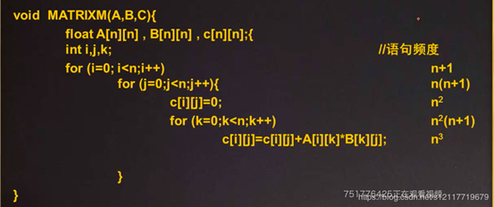
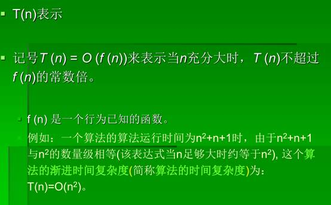
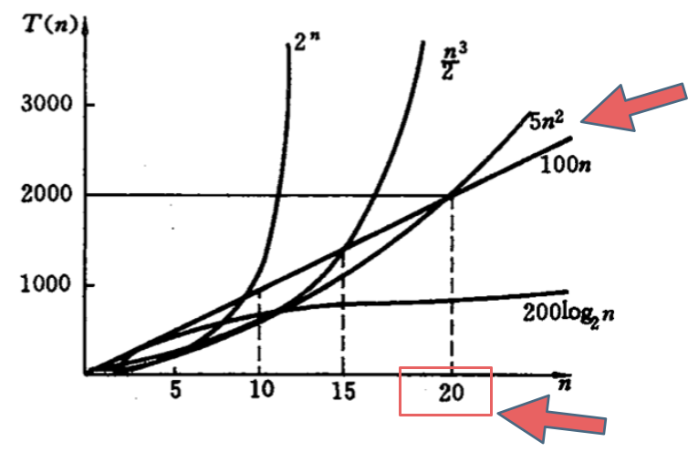
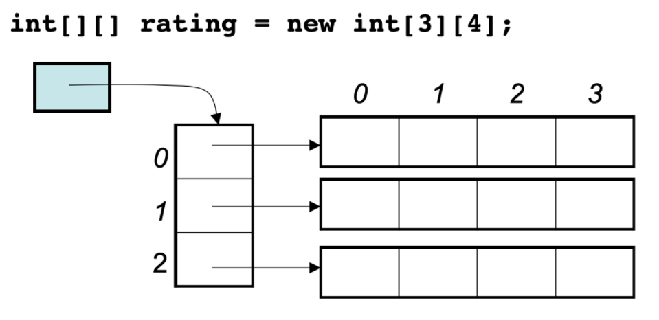
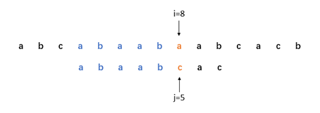
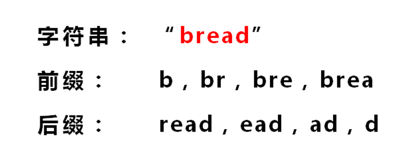

算法与数据结构

>使用说明：本笔记应结合《代码随想录》进行复习，https://www.programmercarl.com/

# 数据结构篇

## 一、绪论

### 1、算法的五大特性
输入、输出、有穷性、确定性、可行性。


什么是算法的正确性？
算法正确性是对任意一个合法的输入经过有限步执行之后算法应给出正确的结果。算法正确性证明包括两个方面：①证明关于输入与输出之关系的命题是正确的；②证明算法中的公式及计算方法是正确的。

### 2、算法的描述方法
（1）自然语言描述


（2）伪代码形式


## 二、算法复杂度

### 1、如何分析一个算法的时间复杂度和空间复杂度？

（1）算法的时间复杂度就是所有语句的频度之和

（2）空间复杂度就是执行该算法所需要占用的内存空间

例如以下算法

 

详解：

算法（Algorithm）是指用来操作数据、解决程序问题的一组方法。对于同一个问题，使用不同的算法，也许最终得到的结果是一样的，但在过程中消耗的资源和时间却会有很大的区别。

 

那么我们应该如何去衡量不同算法之间的优劣呢？


主要还是从算法所占用的「时间」和「空间」两个维度去考量。

 

时间维度：是指执行当前算法所消耗的时间，我们通常用「时间复杂度」来描述。

 

空间维度：是指执行当前算法需要占用多少内存空间，我们通常用「空间复杂度」来描述。

 

因此，评价一个算法的效率主要是看它的时间复杂度和空间复杂度情况。然而，有的时候时间和空间却又是「鱼和熊掌」，不可兼得的，那么我们就需要从中去取一个平衡点。

 

下面我来分别介绍一下「时间复杂度」和「空间复杂度」的计算方式。

 

一、时间复杂度

 

我们想要知道一个算法的「时间复杂度」，很多人首先想到的的方法就是把这个算法程序运行一遍，那么它所消耗的时间就自然而然知道了。

 

这种方式可以吗？当然可以，不过它也有很多弊端。

这种方式非常容易受运行环境的影响，在性能高的机器上跑出来的结果与在性能低的机器上跑的结果相差会很大。而且对测试时使用的数据规模也有很大关系。再者，并我们在写算法的时候，还没有办法完整的去运行呢。

 

因此，另一种更为通用的方法就出来了：「 大O符号表示法 」，即 T(n) = O(f(n))

 

我们先来看个例子：

 

for(i=1; i<=n; ++i)

{

  j = i;

  j++;

}

通过「 大O符号表示法 」，这段代码的时间复杂度为：O(n) ，为什么呢?

 

在 大O符号表示法中，时间复杂度的公式是： T(n) = O( f(n) )，其中f(n) 表示每行代码执行次数之和，而 O 表示正比例关系，这个公式的全称是：算法的渐进时间复杂度。

 

我们继续看上面的例子，假设每行代码的执行时间都是一样的，我们用 1颗粒时间 来表示，那么这个例子的第一行耗时是1个颗粒时间，第三行的执行时间是 n个颗粒时间，第四行的执行时间也是 n个颗粒时间（第二行和第五行是符号，暂时忽略），那么总时间就是 1颗粒时间 + n颗粒时间 + n颗粒时间 ，即 (1+2n)个颗粒时间，即： T(n) =  (1+2n)*颗粒时间，从这个结果可以看出，这个算法的耗时是随着n的变化而变化，因此，我们可以简化的将这个算法的时间复杂度表示为：T(n) =  O(n)

 

为什么可以这么去简化呢，因为大O符号表示法并不是用于来真实代表算法的执行时间的，它是用来表示代码执行时间的增长变化趋势的。

 

所以上面的例子中，如果n无限大的时候，T(n) =  time(1+2n)中的常量1就没有意义了，倍数2也意义不大。因此直接简化为T(n) =  O(n) 就可以了。

 

常见的时间复杂度量级有：

 

常数阶O(1)

对数阶O(logN)

线性阶O(n)

线性对数阶O(nlogN)

平方阶O(n²)

立方阶O(n³)

K次方阶O(n^k)【n的k次方，符号不会敲】

指数阶(2^n)

 

上面从上至下依次的时间复杂度越来越大，执行的效率越来越低。

 

下面选取一些较为常用的来讲解一下（没有严格按照顺序）：

 

常数阶O(1)

 

无论代码执行了多少行，只要是没有循环等复杂结构，那这个代码的时间复杂度就都是O(1)，如：

 

int i = 1;

int j = 2;

++i;

j++;

int m = i + j;

上述代码在执行的时候，它消耗的时候并不随着某个变量的增长而增长，那么无论这类代码有多长，即使有几万几十万行，都可以用O(1)来表示它的时间复杂度。

 

线性阶O(n)

 

这个在最开始的代码示例中就讲解过了，如：

 

for(i=1; i<=n; ++i)

{

  j = i;

  j++;

}

这段代码，for循环里面的代码会执行n遍，因此它消耗的时间是随着n的变化而变化的，因此这类代码都可以用O(n)来表示它的时间复杂度。

 

对数阶O(logN)

 

还是先来看代码：

 

int i = 1;

while(i<n)

{

  i = i * 2;

}

从上面代码可以看到，在while循环里面，每次都将 i 乘以 2，乘完之后，i 距离 n 就越来越近了。我们试着求解一下，假设循环x次之后，i 就大于 2 了，此时这个循环就退出了，也就是说 2 的 x 次方等于 n，那么 x = log2n【这里是log 2的n次方，符号不会敲】

也就是说当循环 log2n【这里是log 2的n次方，符号不会敲】 次以后，这个代码就结束了。因此这个代码的时间复杂度为：O(logn)

 

线性对数阶O(nlogN)

 

线性对数阶O(nlogN) 其实非常容易理解，将时间复杂度为O(logn)的代码循环N遍的话，那么它的时间复杂度就是 n * O(logN)，也就是了O(nlogN)。

 

就拿上面的代码加一点修改来举例：

 

for(m=1; m<n; m++)

{

  i = 1;

  while(i<n)

  {

​    i = i * 2;

  }

}

平方阶O(n²)

 

平方阶O(n²) 就更容易理解了，如果把 O(n) 的代码再嵌套循环一遍，它的时间复杂度就是 O(n²) 了。

举例：

 

for(x=1; i<=n; x++)

{

  for(i=1; i<=n; i++)

  {

​    j = i;

​    j++;

  }

}

这段代码其实就是嵌套了2层n循环，它的时间复杂度就是 O(n*n)，即  O(n²) 

如果将其中一层循环的n改成m，即：

 

for(x=1; i<=m; x++)

{

  for(i=1; i<=n; i++)

  {

​    j = i;

​    j++;

  }

}

那它的时间复杂度就变成了 O(m*n)

 

立方阶O(n³)、K次方阶O(n^k)

 

参考上面的O(n²) 去理解就好了，O(n³)相当于三层n循环，其它的类似。

 

除此之外，其实还有 平均时间复杂度、均摊时间复杂度、最坏时间复杂度、最好时间复杂度 的分析方法，有点复杂，这里就不展开了。

 

二、空间复杂度

 

既然时间复杂度不是用来计算程序具体耗时的，那么我也应该明白，空间复杂度也不是用来计算程序实际占用的空间的。

 

空间复杂度是对一个算法在运行过程中临时占用存储空间大小的一个量度，同样反映的是一个趋势，我们用 S(n) 来定义。

 

空间复杂度比较常用的有：O(1)、O(n)、O(n²)，我们下面来看看：

 

空间复杂度 O(1)

 

如果算法执行所需要的临时空间不随着某个变量n的大小而变化，即此算法空间复杂度为一个常量，可表示为 O(1)

举例：

 

int i = 1;

int j = 2;

++i;

j++;

int m = i + j;

代码中的 i、j、m 所分配的空间都不随着处理数据量变化，因此它的空间复杂度 S(n) = O(1)

 

空间复杂度 O(n)

 

我们先看一个代码：

 

int[] m = new int[n]

for(i=1; i<=n; ++i)

{

  j = i;

  j++;

}

这段代码中，第一行new了一个数组出来，这个数据占用的大小为n，这段代码的2-6行，虽然有循环，但没有再分配新的空间，因此，这段代码的空间复杂度主要看第一行即可，即 S(n) = O(n)

### 2、时间复杂度估算


 

### 3、T（n）



 

### 4、大O符号


 

### 5、算法的时间复杂度分级


 

### 6、大欧米伽和theta


 

### 7、拓展

#### （1）O(1), O(n), O(logn), O(nlogn) 的区别

在描述算法复杂度时，经常用到O(1), O(n), O(logn), O(nlogn)来表示对应复杂度程度, 不过目前大家默认也通过这几个方式表示空间复杂度 。

那么，O(1), O(n), O(logn), O(nlogn)就可以看作既可表示算法复杂度，也可以表示空间复杂度。

大O加上（）的形式，里面其实包裹的是一个函数f(),O（f()）,指明某个算法的耗时/耗空间与数据增长量之间的关系。其中的n代表输入数据的量。


注：$O(n)$和$O({\log_n}^2)$、$O({\log_n}^3)$的比较：


画函数图像的网站：https://zuotu.91maths.com/

#### （2）log级复杂度与底数无关

问题：
 最近一直在研究算法，无论是计算机算法概论、还是数据结构书中，

关于算法的时间复杂度很多都用包含O(logN)这样的描述，但是却没有明确说logN的底数究竟是多少。

解答：
 算法中log级别的时间复杂度都是由于使用了分治思想,这个底数直接由分治的复杂度决定。
 如果采用二分法,那么就会以2为底数,三分法就会以3为底数,其他亦然。
 不过无论底数是什么,log级别的渐进意义是一样的。
 也就是说该算法的时间复杂度的增长与处理数据多少的增长的关系是一样的。

**但我们统一说 logn，也就是忽略底数的描述**。

为什么可以这么做呢？如下图所示：


假如有两个算法的时间复杂度，分别是log以2为底n的对数和log以10为底n的对数，那么这里如果还记得高中数学的话，应该不难理解`以2为底n的对数 = 以2为底10的对数 * 以10为底n的对数`（对数换底公式）。

而以2为底10的对数是一个常数，在上文已经讲述了我们计算时间复杂度是忽略常数项系数的。

抽象一下就是在时间复杂度的计算过程中，log以i为底n的对数等于log 以j为底n的对数，所以忽略了i，直接说是logn。

这样就应该不难理解为什么忽略底数了。

#### （3）算法选择还受数据规模的影响

如下图中可以看出不同算法的时间复杂度在不同数据输入规模下的差异。



在决定使用哪些算法的时候，不是时间复杂越低的越好（因为简化后的时间复杂度忽略了常数项等等），要考虑数据规模，如果数据规模很小甚至可以用O(n^2)的算法比O(n)的更合适（在有常数项的时候）。

就像上图中 O(5n^2) 和 O(100n) 在n为20之前 很明显 O(5n^2)是更优的，所花费的时间也是最少的。

那为什么在计算时间复杂度的时候要忽略常数项系数呢，也就说O(100n) 就是O(n)的时间复杂度，O(5n^2) 就是O(n^2)的时间复杂度，而且要默认O(n) 优于O(n^2) 呢 ？

这里就又涉及到大O的定义，**因为大O就是数据量级突破一个点且数据量级非常大的情况下所表现出的时间复杂度，这个数据量也就是常数项系数已经不起决定性作用的数据量**。

例如上图中20就是那个点，n只要大于20 常数项系数已经不起决定性作用了。

**所以我们说的时间复杂度都是省略常数项系数的，是因为一般情况下都是默认数据规模足够的大，基于这样的事实，给出的算法时间复杂的的一个排行如下所示**：

O(1)常数阶 < O(logn)对数阶 < O(n)线性阶 < O(n^2)平方阶 < O(n^3)(立方阶) < O(2^n) (指数阶)

但是也要注意大常数，如果这个常数非常大，例如10^7 ，10^9 ，那么常数就是不得不考虑的因素了。

### 思考题


答案：

（1）该算法求1到n的平方和。

（2）基本语句：

T=0。执行一次。

T=T+i*i。执行n次。

（3）O(n)

 


答案：

在老机器上：$t=5*2^n$

在新机器上：$t=64*5*2^n=5*2^(n+6)$

所以新机器可以解输入规模为n+6的问题。

 


答案：$f_4(n)<f_2(n)<f_5(n)<f_1(n)<f_2(n)$

 


答案：


该方法复杂度：$O(\sqrt n)$

## 三、数组

数组是非常基础的数据结构，在面试中，考察数组的题目一般在思维上都不难，主要是考察对代码的掌控能力

也就是说，想法很简单，但实现起来 可能就不是那么回事了。

首先要知道数组在内存中的存储方式，这样才能真正理解数组相关的面试题

**数组是存放在连续内存空间上的相同类型数据的集合。**

数组可以方便的通过下标索引的方式获取到下标下对应的数据。

举一个字符数组的例子，如图所示：


需要两点注意的是

- **数组下标都是从0开始的。**
- **数组内存空间的地址是连续的**

正是**因为数组的在内存空间的地址是连续的，所以我们在删除或者增添元素的时候，就难免要移动其他元素的地址。**

例如删除下标为3的元素，需要对下标为3的元素后面的所有元素都要做移动操作，如图所示：


而且大家如果使用C++的话，要注意vector 和 array的区别，vector的底层实现是array，严格来讲vector是容器，不是数组。

**数组的元素是不能删的，只能覆盖。**

那么二维数组直接上图，大家应该就知道怎么回事了


**那么二维数组在内存的空间地址是连续的么？**

不同编程语言的内存管理是不一样的，以C++为例，在C++中二维数组是连续分布的。

我们来做一个实验，C++测试代码如下：

```cpp
void test_arr() {
    int array[2][3] = {
		{0, 1, 2},
		{3, 4, 5}
    };
    cout << &array[0][0] << " " << &array[0][1] << " " << &array[0][2] << endl;
    cout << &array[1][0] << " " << &array[1][1] << " " << &array[1][2] << endl;
}

int main() {
    test_arr();
}
```

测试地址为

```text
0x7ffee4065820 0x7ffee4065824 0x7ffee4065828
0x7ffee406582c 0x7ffee4065830 0x7ffee4065834
```

注意地址为16进制，可以看出二维数组地址是连续一条线的。

一些录友可能看不懂内存地址，我就简单介绍一下， 0x7ffee4065820 与 0x7ffee4065824 差了一个4，就是4个字节，因为这是一个int型的数组，所以两个相邻数组元素地址差4个字节。

0x7ffee4065828 与 0x7ffee406582c 也是差了4个字节，在16进制里8 + 4 = c，c就是12。

如图：


**所以可以看出在C++中二维数组在地址空间上是连续的**。

像Java是没有指针的，同时也不对程序员暴露其元素的地址，寻址操作完全交给虚拟机。

所以看不到每个元素的地址情况，这里我以Java为例，也做一个实验。

```java
public static void test_arr() {
    int[][] arr = {{1, 2, 3}, {3, 4, 5}, {6, 7, 8}, {9,9,9}};
    System.out.println(arr[0]);
    System.out.println(arr[1]);
    System.out.println(arr[2]);
    System.out.println(arr[3]);
}
```

输出的地址为：

```text
[I@7852e922
[I@4e25154f
[I@70dea4e
[I@5c647e05
```

这里的数值也是16进制，这不是真正的地址，而是经过处理过后的数值了，我们也可以看出，二维数组的每一行头结点的地址是没有规则的，更谈不上连续。

所以Java的二维数组可能是如下排列的方式：



这里面试中数组相关的理论知识就介绍完了。

## 三、链表

### 1、链表定义代码

```c++
// 单链表
struct ListNode {
    int val;		// 节点上储存的元素
    ListNode* next;  // 指向下一个节点的指针
    ListNode() : val(0), next(nullptr) {}	// 节点的构造函数
    ListNode(int x) : val(x), next(nullptr) {}	
    ListNode(int x, ListNode* next) : val(x), next(next) {}
}
```


### 2、链表理论基础

#### （1）链表定义

链表是一种通过指针串联在一起的线性结构，每一个节点由两部分组成，一个是数据域一个是指针域（存放指向下一个节点的指针），最后一个节点的指针域指向null（空指针的意思）。

链接的入口节点称为链表的头结点也就是head。

如图所示：


#### （2）链表的类型

##### 单链表

刚刚说的就是单链表。

##### 双链表

单链表中的节点只能指向节点的下一个节点。

双链表：每一个节点有两个指针域，一个指向下一个节点，一个指向上一个节点。

双链表 既可以向前查询也可以向后查询。

如图所示：


##### 循环链表

循环链表，顾名思义，就是链表首尾相连。

循环链表可以用来解决约瑟夫环问题。


#### （3）链表的存储方式

了解完链表的类型，再来说一说链表在内存中的存储方式。

数组是在内存中是连续分布的，但是链表在内存中可不是连续分布的。

链表是通过指针域的指针链接在内存中各个节点。

所以链表中的节点在内存中不是连续分布的 ，而是散乱分布在内存中的某地址上，分配机制取决于操作系统的内存管理。

如图所示：


这个链表起始节点为2， 终止节点为7， 各个节点分布在内存中不同地址空间上，通过指针串联在一起。

### 3、链表的操作

#### （1）删除节点

删除D节点，如图所示：


只要将C节点的next指针 指向E节点就可以了。

那有同学说了，D节点不是依然存留在内存里么？只不过是没有在这个链表里而已。

是这样的，所以在C++里最好是再手动释放这个D节点，释放这块内存。

其他语言例如Java、Python，就有自己的内存回收机制，就不用自己手动释放了。

#### （2）添加节点

如图所示：


可以看出链表的增添和删除都是$O(1)$操作，也不会影响到其他节点。

但是要注意，要是删除第五个节点，需要从头节点查找到第四个节点通过next指针进行删除操作，查找的时间复杂度是$O(n)$。

### 4、性能分析

再把链表的特性和数组的特性进行一个对比，如图所示：


数组在定义的时候，长度就是固定的，如果想改动数组的长度，就需要重新定义一个新的数组。

链表的长度可以是不固定的，并且可以动态增删， 适合数据量不固定，频繁增删，较少查询的场景。

## 四、字符串

### 1、朴素的字符串匹配算法

求一个字符串（模式串）在另一个字符串（主串）中的位置，称为字符串模式匹配。

在朴素的字符串模式匹配算法中，我们对主串S和模式串T分别设置指针i和j，假设字符串下标从0开始，初始时i和j分别指向每个串的第0个位置。在第n趟匹配开始时，i指向主串S中的第n-1个位置，j指向模式串T的第0个位置，然后逐个向后比较。若T中的每一个字符都与S中的字符相等，则称匹配成功，否则，当遇到某个字符不相等时，i重新指向S的第n个位置，j重新指向T的第0个位置，继续进行第n+1趟匹配。

例如，我们对模式串T=“abaabcac”和主串S=“abcabaabaabcacb”进行匹配。如图1.1，此时正在进行第4趟匹配，S[3...7]与T[0...4]均相等，但当i=8，j=5时，S[8]与T[5]不相等，匹配失败。于是，置i=4，j=0，相当于将模式串向右移动一位后，重新开始下一趟匹配，如图1.2。

​							                          

图1.1 当i=8，j=5时，字符不相等，匹配失败


图1.2 将模式串向右移动一位后，重新开始下一趟匹配

利用此种方法进行字符串匹配，最坏情况下时间复杂度为O(n*m)，其中n和m分别为主串和模式串的长度。

代码：

```c++
int strStr(string haystack, string needle) {
    if (needle.length() == 0) return 0;
    int lstart = 0;
    int llen = haystack.length();
    int rlen = needle.length();
    for (; lstart <= llen - rlen; lstart++) {
        int lptr = lstart;
        int rptr = 0;
        for (; rptr < rlen; rptr++) {
            if (haystack[lptr] == needle[rptr]) lptr++;
            else break;
        }
        if (rptr == rlen) return lstart;
    }
    return -1;
}
```

>时间复杂度：$O(m*n)$
>
>空间复杂度：$O(m+n)$

### 2、KMP算法

#### （1）算法简介

 KMP算法，又称作“看猫片”算法（误），是一种改进的字符串模式匹配算法，可以在O(n+m)的时间复杂度以内完成字符串的匹配操作，其核心思想在于：当一趟匹配过程中出现字符不匹配时，不需要回溯主串的指针，而是利用已经得到的“部分匹配”，将模式串尽可能多地向右“滑动”一段距离，然后继续比较。


#### （2）原理图解

字符串匹配是计算机的基本任务之一。                                   
举例来说，有一个字符串"BBC ABCDAB ABCDABCDABDE"，我想知道，里面是否包含另一个字符串"ABCDABD"？


许多算法可以完成这个任务，[Knuth-Morris-Pratt算法](http://en.wikipedia.org/wiki/Knuth–Morris–Pratt_algorithm)（简称KMP）是最常用的之一。它以三个发明者命名，起头的那个K就是著名科学家Donald Knuth。


这种算法不太容易理解，网上有很多[解释](http://www.google.com/search?q=Knuth-Morris-Pratt+algorithm)，但读起来都很费劲。直到读到[Jake Boxer](http://jakeboxer.com/blog/2009/12/13/the-knuth-morris-pratt-algorithm-in-my-own-words/)的文章，我才真正理解这种算法。下面，我用自己的语言，试图写一篇比较好懂的KMP算法解释。

 1.


首先，字符串"BBC ABCDAB ABCDABCDABDE"的第一个字符与搜索词"ABCDABD"的第一个字符，进行比较。因为B与A不匹配，所以搜索词后移一位。
 2.


因为B与A不匹配，搜索词再往后移。                                         
 3.

 

就这样，直到字符串有一个字符，与搜索词的第一个字符相同为止。

 4.

 

接着比较字符串和搜索词的下一个字符，还是相同。

 5.

 

直到字符串有一个字符，与搜索词对应的字符不相同为止。
 6.


这时，最自然的反应是，将搜索词整个后移一位，再从头逐个比较。这样做虽然可行，但是效率很差，因为你要把"搜索位置"移到已经比较过的位置，重比一遍。                                       
 7.

  

一个基本事实是，当空格与D不匹配时，你其实知道前面六个字符是"ABCDAB"。KMP算法的想法是，设法利用这个已知信息，不要把"搜索位置"移回已经比较过的位置，继续把它向后移，这样就提高了效率。
 8.


怎么做到这一点呢？可以针对搜索词，算出一张《部分匹配表》（Partial Match Table）。这张表是如何产生的，后面再介绍，这里只要会用就可以了。
 9.

  

已知空格与D不匹配时，前面六个字符"ABCDAB"是匹配的。查表可知，最后一个匹配字符B对应的"部分匹配值"为2，因此按照下面的公式算出向后移动的位数：

　　`移动位数 = 已匹配的字符数 - 对应的部分匹配值`

因为 6 - 2 等于4，所以将搜索词向后移动4位。

10.


 因为空格与Ｃ不匹配，搜索词还要继续往后移。这时，已匹配的字符数为2（"AB")，对应的"部分匹配值"为0。所以，移动位数 = 2 - 0，结果为 2，于是将搜索词向后移2位。

11.


因为空格与A不匹配，继续后移一位。
 12.

 

逐位比较，直到发现C与D不匹配。于是，移动位数 = 6 - 2，继续将搜索词向后移动4位。
 13.

 

逐位比较，直到搜索词的最后一位，发现完全匹配，于是搜索完成。如果还要继续搜索（即找出全部匹配），移动位数 = 7 - 0，再将搜索词向后移动7位，这里就不再重复了。

14.



下面介绍《部分匹配表》是如何产生的。

首先，要了解两个概念："前缀"和"后缀"。 "前缀"指除了最后一个字符以外，一个字符串的全部头部组合；"后缀"指除了第一个字符以外，一个字符串的全部尾部组合。
 15.


**注意：这里的部分匹配值只是助于理解，它并不是我们要求的next数组！**

>"部分匹配值"就是"前缀"和"后缀"的最长的共有元素的长度。以"ABCDABD"为例，
>
>　　－　"A"的前缀和后缀都为空集，共有元素的长度为0；
>
>　　－　"AB"的前缀为[A]，后缀为[B]，共有元素的长度为0；
>
>　　－　"ABC"的前缀为[A, AB]，后缀为[BC, C]，共有元素的长度0；
>
>　　－　"ABCD"的前缀为[A, AB, ABC]，后缀为[BCD, CD, D]，共有元素的长度为0；
>
>　　－　"ABCDA"的前缀为[A, AB, ABC, ABCD]，后缀为[BCDA, CDA, DA, A]，共有元素为"A"，长度为1；
>
>　　－　"ABCDAB"的前缀为[A, AB, ABC, ABCD, ABCDA]，后缀为[BCDAB, CDAB, DAB, AB, B]，共有元素为"AB"，长度为2；
>
>　　－　"ABCDABD"的前缀为[A, AB, ABC, ABCD, ABCDA, ABCDAB]，后缀为[BCDABD, CDABD, DABD, ABD, BD, D]，共有元素的长度为0。

 16.


"部分匹配"的实质是，有时候，字符串头部和尾部会有重复。比如，"ABCDAB"之中有两个"AB"，那么它的"部分匹配值"就是2（"AB"的长度）。搜索词移动的时候，第一个"AB"向后移动4位（字符串长度-部分匹配值），就可以来到第二个"AB"的位置。

#### （3）next数组求解方法

**next数组的定义**：对于模式串T，next[j]代表了T的前j个字符组成的子串中，其前缀和后缀的最长公共串的长度。

（注：前j个下标为0~j-1）

把将要进行next计算的模式串T分成 k ，j 前后两串，k代表前串开头所在的序号，j代表后串开头所在的序号，起始的时候k=-1，j=0。

**求解字符串T的next数组的算法如下：**

```
0.  int* next = new int[tLen] {0};
1.	next[0]=-1。
2.	初始 k=-1, j=0。
3.	while (j < len - 1)，
	a. k等于-1 或 T[j]等于T[k]，j++，k++，next[j]=k。
	b. 若T[j]不等于T[k]，k=next[k]。
```

 

**例1**：

| 序号   | **0**  | **1** | **2** | **3** | **4** | **5** | **6** | **7** | **8** |
| ------ | ------ | ----- | ----- | ----- | ----- | ----- | ----- | ----- | ----- |
| 子串   | **a**  | **b** | **c** | **a** | **a** | **b** | **c** | **b** | **a** |
| Next值 | **-1** | **0** | **0** | **0** | **1** | **1** | **2** | **3** | **0** |

1，第一个字符的next值令为-1。初始k=-1，j=0，

2，因为k=-1，所以 j++，k++，k=0，j=1，next[1]=0

3，比较S[0] != S[1]，所以k返回到next[k]位置，所以 k=next[0]=-1

4，因为k=-1，所以 j++，k++，k=0，j=2，next[2]=0

5，比较S[0] != S[2]，所以k返回到next[k]位置，所以 k=next[0]=-1

6，因为k=-1，所以 j++，k++，k=0，j=3，next[3]=0

7，比较S[0] == S[3]  所以 j++，k++，k=1，j=4，next[4]=1

8，比较S[1] != S[4]，所以k返回到next[k]位置，即k=next[1]=0

9，比较S[0] == S[4]，所以 j++，k++，k=1，j=5，next[5]=1

10，比较S[1] == S[5]，所以 j++，k++，k=2，j=6，next[6]=2

11，比较S[2] == S[6]，所以 j++，k++，k=3，j=7，next[7]=3

12，比较S[3] != S[7]，所以k返回到next[k=3]位置，即k=next[3]=0

13，比较S[0] != S[7]，所以k返回到next[k=0]位置，即k=next[0]=-1

14，因为k=-1，所以 j++，k++，k=0，j=8，next[8]=0

完毕


                                 
**例二**：在例一中，每次不相等时返回的都是k=next[k]=0，都是返回到了开头，我们看一个不是返回到开头0的情况：

从 j=5，k=1的时候开始

5，比较 S[1] == S[5] 所以 j++，k++，k=2，j=6，next[6]=k=2

6，比较S[2] != S[6] 所以 k返回到next[k=2]位置，即k=next[2]=1,然后比较S[k=1]  == S[6] 所以 j++ ，k=1+1=2，next[7]=k=2

…………

因此，我们发现K的退回 是退回到next[k]的位置 即S[j]!=S[k]时，k=next[k]

#### （4）改进的next数组求解方法


#### （5）代码实现

getNext函数实现代码如下：

```c++
// next函数
void getNext(string needle, int next[]) {
    int tLen = needle.length();
    int j = 0;		//后串起始位置，一直增加
    int k = -1;		//k==-1时，代表j++进入下一轮匹配，k代表前串起始位置，匹配失败回到-1
    next[0] = -1;
    while (j < tLen - 1) {
        if (k == -1 || needle[j] == needle[k]) {	//匹配的情况下，T[j] == T[k], next[j+1] = k+1;
            k++;
            j++;
            next[j] = k;
        } else {		//不匹配的情况下，T[j] != T[k], k = next[k];
            k = next[k];
        }
    }
}
```

>时间复杂度：$O(m)$                    
>
>空间复杂度： $O(m)$


改进的next函数实现代码如下：

```c++
// next函数
void getNext(string needle, int next[]) {
    int tLen = needle.length();
    int j = 0;		//后串起始位置，一直增加
    int k = -1;		//k==-1时，代表j++进入下一轮匹配，k代表前串起始位置，匹配失败回到-1
    next[0] = -1;
    while (j < tLen - 1) {
        if (k == -1 || needle[j] == needle[k]) {	//匹配的情况下，T[j] == T[k], next[j+1] = k+1;
            k++;
            j++;
            if (needle[j] != needle[k]) {
                next[j] = k;
            } else {
                next[j] = next[k];
            }
        } else {		//不匹配的情况下，T[j] != T[k], k = next[k];
            k = next[k];
        }
    }
}
```

>时间复杂度：$O(m)$                    
>
>空间复杂度： $O(m)$


字符串匹配KMP算法：

```c++
// kmp算法
int strStr(string haystack, string needle) {
    if (needle.length() == 0) return 0;
    int sLen = haystack.length();
    int tLen = needle.length();
    // 求解next数组
    int* next = new int[tLen] {0};
    getNext(needle, next);

    // 进行模式匹配
    int i = 0;
    int j = 0;
    while (i < sLen && j < tLen) {
        if (j == -1 || haystack[i] == needle[j]) {
            i++;
            j++;
        } else {
            j = next[j];
        }
    }
    if (j == tLen) return i - j;
    else return -1;
}
```

>时间复杂度：$O(m+n)$                    
>
>空间复杂度： $O(m)$，注：m为模式串长度


#### （6）算法总结

以上就是KMP匹配算法的全过程。总结一下，KMP算法的实质就是以空间换时间，在匹配之前将模式串的一些信息存储起来（next数组），在随后的匹配过程中利用这些信息减少不必要的匹配次数，以提高匹配效率。在实际的应用过程中，简单模式匹配算法的执行时间常常接近于KMP算法，仅当主串与模式串有很多“部分匹配”时，KMP算法才能显著提升性能。


## 五、栈

我想栈和队列的原理大家应该很熟悉了，队列是先进先出，栈是先进后出。

如图所示：


那么我这里在列出四个关于栈的问题，大家可以思考一下。以下是以C++为例，使用其他编程语言的同学也对应思考一下，自己使用的编程语言里栈和队列是什么样的。

1. C++中stack 是容器么？
2. 我们使用的stack是属于那个版本的STL？
3. 我们使用的STL中stack是如何实现的？
4. stack 提供迭代器来遍历stack空间么？

相信这四个问题并不那么好回答， 因为一些同学使用数据结构会停留在非常表面上的应用，稍稍往深一问，就会有好像懂，好像也不懂的感觉。

有的同学可能仅仅知道有栈和队列这么个数据结构，却不知道底层实现，也不清楚所使用栈和队列和STL是什么关系。

所以这里我在给大家扫一遍基础知识，

首先大家要知道 栈和队列是STL（C++标准库）里面的两个数据结构。

C++标准库是有多个版本的，要知道我们使用的STL是哪个版本，才能知道对应的栈和队列的实现原理。

那么来介绍一下，三个最为普遍的STL版本：

1. **HP STL** 其他版本的C++ STL，一般是以HP STL为蓝本实现出来的，HP STL是C++ STL的第一个实现版本，而且开放源代码。
2. **P.J.Plauger STL** 由P.J.Plauger参照HP STL实现出来的，被Visual C++编译器所采用，不是开源的。
3. **SGI STL** 由Silicon Graphics Computer Systems公司参照HP STL实现，被Linux的C++编译器GCC所采用，SGI STL是开源软件，源码可读性甚高。

接下来介绍的栈和队列也是SGI STL里面的数据结构， 知道了使用版本，才知道对应的底层实现。

来说一说栈，栈先进后出，如图所示：


栈提供push 和 pop 等等接口，所有元素必须符合先进后出规则，所以栈不提供走访功能，也不提供迭代器(iterator)。 不像是set 或者map 提供迭代器iterator来遍历所有元素。

**栈是以底层容器完成其所有的工作，对外提供统一的接口，底层容器是可插拔的（也就是说我们可以控制使用哪种容器来实现栈的功能）。**

总结如下：

**stl中栈和队列不是容器，而是容器适配器。它们提供接口，由其他容器实现。**

所以STL中栈往往不被归类为容器，而被归类为container adapter（容器适配器）。

那么问题来了，STL 中栈是用什么容器实现的？

从下图中可以看出，栈的内部结构，栈的底层实现可以是vector，deque，list 都是可以的， 主要就是数组和链表的底层实现。


**我们常用的SGI STL，如果没有指定底层实现的话，默认是以deque为缺省情况下栈的低层结构。**

deque是一个双向队列，只要封住一段，只开通另一端就可以实现栈的逻辑了。

**SGI STL中 队列底层实现缺省情况下一样使用deque实现的。**

我们也可以指定vector为栈的底层实现，初始化语句如下：

```text
std::stack<int, std::vector<int> > third;  // 使用vector为底层容器的栈
```

刚刚讲过栈的特性，对应的队列的情况是一样的。

队列中先进先出的数据结构，同样不允许有遍历行为，不提供迭代器, **SGI STL中队列一样是以deque为缺省情况下的底部结构。**

也可以指定list 为起底层实现，初始化queue的语句如下：

```text
std::queue<int, std::list<int>> third; // 定义以list为底层容器的队列
```

所以STL 队列也不被归类为容器，而被归类为container adapter（ 容器适配器）。

我这里讲的都是C++ 语言中情况， 使用其他语言的同学也要思考栈与队列的底层实现问题， 不要对数据结构的使用浅尝辄止，而要深挖起内部原理，才能夯实基础。


## 六、队列


