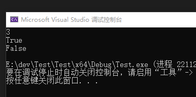

## 九、内部排序

### 1、快速排序

#### （1）算法简介

快速排序原理是首先要找到一个中枢，把小于中枢的值放到他前面，大于中枢的值放到他的右边，然后再以此方法对这两部分数据分别进行快速排序。

这里是先用待排数组的第一个元素作为中枢，把数组划分两部分，小于他的往前挪，那大于他的自然就在后面了，然后再把中枢值放到大于和小于他之间的位置。

> 注：这种方式固定选择第一个元素作为中枢，其实是可以优化的，因为当原始数组有序时，快排会退化成$O(n^2)$，即冒泡排序。
>
> 优化方式：随机选择中枢。

快速排序的主要思想是通过划分将待排序的序列分成前后两部分，其中前一部分的数据都比后一部分的数据要小，然后再递归调用函数对两部分的序列分别进行快速排序，以此使整个序列达到有序。

我们定义函数 randomized_quicksort(nums, l, r) 为对 nums 数组里 $[l, r]$的部分进行排序，每次先调用 randomized_partition 函数对 nums 数组里的 $[l, r]$部分进行划分，并返回分界值的下标 pos，然后递归调用 randomized_quicksort(nums, l, pos - 1) 和 randomized_quicksort(nums, pos + 1, r) 即可。

那么核心就是划分函数的实现了，划分函数一开始需要确定一个分界值（我们称之为主元 pivot)，然后再进行划分。而主元的选取有很多种方式，这里我们采用随机的方式，对当前划分区间 $[l, r]$ 里的数等概率随机一个作为我们的主元，再将主元放到区间末尾，进行划分。

整个划分函数 partition 主要涉及两个指针 i 和 j，一开始 i = l - 1，j = l。我们需要实时维护两个指针使得任意时候，对于任意数组下标 k，我们有如下条件成立：
$$
l\leq k\leq i时，\text{nums}[k]\leq \text{pivot}\\

i+1\leq k\leq r-1时，\text{nums}[k]> \text{pivot}\\

k==r时，\text{nums}[k]=\text{pivot}
$$
我们每次移动指针 j ，如果 $\text{nums}[j]> pivot$，我们只需要继续移动指针 j ，即能使上述三个条件成立，否则我们需要将指针 i 加一，然后交换 $\text{nums}[i]$ 和 $\text{nums}[j]$，再移动指针 j 才能使得三个条件成立。

当 j 移动到 r-1 时结束循环，此时我们可以由上述三个条件知道 $[l, i]$ 的数都小于等于主元 pivot，$[i+1, r-1]$ 的数都大于主元 pivot，那么我们只要交换 $\text{nums}[i+1]$ 和 $\text{nums}[r]$ ，即能使得 $[l, i+1]$ 区间的数都小于 $[i+2, r]$ 区间的数，完成一次划分，且分界值下标为 i+1，返回即可。

如下的动图展示了一次划分的过程，刚开始随机选了 4 作为主元，与末尾元素交换后开始划分：


实现思路：

1. 范围内首先选随机中枢key
2. 将随机中枢key放到第一个元素处
3. 第一个元素处设置一个游标，指向的是最后一个小于等于key的元素，游标右侧元素都大于key
4. 从第二个元素位置开始遍历，若元素小于等于key，则游标加一，元素放到游标处；若元素大于key，则继续遍历
5. 遍历完之后，游标指向的是最后一个小于等于key的元素，将游标处元素与第一个元素处的key交换
6. 继续递归遍历


#### （2）递归实现

```c++
// 快速排序，递归写法
void quickSort(vector<int>& arr, int start, int end) {
    if (start < end) {
        int pivot = (rand() % (end - start + 1)) + start;  // 优化手段，随机选择中枢，避免出现O(n^2)情况
        swap(arr[start], arr[pivot]);
        int i = start;
        for (int j = start + 1; j <= end; ++j) {
            if (arr[j] <= arr[start]) {
                swap(arr[j], arr[++i]);
            }
        }
        swap(arr[i], arr[start]);	// array[i]是最后一个小于pivot的元素，跟pivot替换即可
        quickSort(arr, start, i - 1);
        quickSort(arr, i + 1, end);
    }
}

vector<int> sortArray(vector<int>& arr) {
    srand(time(NULL));
    quickSort(arr, 0, (int)arr.size() - 1);
    return arr;
}
```

> 注意：做题时尽量不要用递归方法，待排数组元素过多容易超时。
>
> 中枢位置是固定的，排完一轮后最后才动。

#### （3）迭代实现

```c++
// 快速排序，迭代写法
void quickSort(vector<int>& array, int start, int end) {
    stack<int> st;
    st.push(end);
    st.push(start);
    while (!st.empty()) {
        int start = st.top();
        st.pop();
        int end = st.top();
        st.pop();
        int k = partition(array, start, end);
        if (k > start) {
            st.push(k - 1);
            st.push(start);
        }
        if (k < end) {
            st.push(end);
            st.push(k + 1);
        }
    }
}
int partition(vector<int>& array, int start, int end) {
    // pivot是中枢
    int pivotIdx = rand() % (end - start + 1) + start;
    swap(array, pivotIdx, start);
    int pivot = array[start];
    int i = start;
    for (int j = start + 1; j <= end; ++j) {
        if (array[j] < pivot) {
            swap(array, j, ++i);
        }
    }
    array[start] = array[i];
    array[i] = pivot;
    return i;
}
void swap(vector<int>& array, int a, int b) {
    if (array[a] != array[b]) {
        array[a] ^= array[b];
        array[b] ^= array[a];
        array[a] ^= array[b];
    }
}
vector<int> sortArray(vector<int>& nums) {
    srand(time(NULL));
    quickSort(nums, 0, (int)nums.size() - 1);
    return nums;
}
```

> 迭代写法和递归写法的partition部分是一样的，无非是用栈保存`end`和`start`索引来代替递归调用。

#### （4）性能分析

> 时间复杂度：平均情况$O(n\log n)$，最坏情况$O(n^2)$
>
> 空间复杂度：$O(\log n)$

快速排序的一次划分算法从两头交替搜索，直到low和high重合，因此其时间复杂度是O(n)；而整个快速排序算法的时间复杂度与划分的趟数有关。

**理想的情况是**，每次划分所选择的中间数恰好将当前序列几乎等分，经过logn趟划分，便可得到长度为1的子表。这样，整个算法的时间复杂度为O(nlogn)。

**最坏的情况是**，每次所选的中间数是当前序列中的最大或最小元素（若初始记录序列按关键字有序或基本有序时，快速排序将蜕化为冒泡排序，其时间复杂度为 $O(n^2)$），这使得每次划分所得的子表中一个为空表，另一子表的长度为原表的长度-1。这样，长度为n的数据表的快速排序需要经过n趟划分，使得整个排序算法的时间复杂度为O(n2)。 

**为改善最坏情况下的时间性能**，可采用其他方法选取中间数，如随机数法。 

可以证明，**快速排序的平均时间复杂度也是O(nlog2n)**。因此，该排序方法被认为是目前最好的一种内部排序方法。

**从空间性能上看**，尽管快速排序只需要一个元素的辅助空间，但快速排序需要一个栈空间来实现递归。最好的情况下，即快速排序的每一趟排序都将元素序列均匀地分割成长度相近的两个子表，所需栈的最大深度为log2(n)；但最坏的情况下，栈的最大深度为n。这样，快速排序的空间复杂度为O(log2n))。


### 2、堆排序

#### （1）算法简介

> 堆分为大顶堆（maxHeap）和小顶堆（minHeap），满足Key[i]>=Key[2i+1]&&key>=key[2i+2]称为大顶堆，满足 Key[i]<=key[2i+1]&&Key[i]<=key[2i+2]称为小顶堆。由上述性质可知大顶堆的堆顶的关键字肯定是所有关键字中最大的，小顶堆的堆顶的关键字是所有关键字中最小的。
>
> 在C++中可以使用优先队列priority_queue来实现大小顶堆，std::priority_queue**默认为大顶堆**：
>
> **大顶堆**：std::priority_queue\<int, vector\<int>> pq;
>
> **小顶堆**：std::priority_queue\<int, vector\<int>, std::greater\<int>> pq;

这一部分来分析一下堆排序，也可以理解为二叉树排序，这里的堆分为两种，一种是大顶堆，一种是小顶堆，我们所有的排序方法都以升序为主，其实倒序原理也都差不多，所以这里我们主要分析的是大顶堆。大顶堆就是根节点不小于他的两个子节点。

下面通过图示来研究一下堆排序的原理：

> 先从最后一个非叶子节点开始调整


这是堆的构建的过程，其实也就是代码中的buildMaxHeap方法执行的过程，下面再来看一下是怎么排序的。


其实就是每次截取root节点然后存放到数组中，存放数组的位置是从后往前，然后把最后一个节点截取放到原来的root节点的位置，因为最后一个节点放到root节点，打破了二叉树的平衡，所以要从root节点开始进行调整。然后通过不断的循环不断的截取不断的再调整，直到截取完为止。

#### （2）递归实现

下面代码中heapSort方法表示对数组进行排序，buildMaxHeap表示堆的构建，maxHeapfy表示堆的调整，包括每次截取数据的时候也都需要调整，截取数据就相当于把root节点截取，然后用最后的一个节点替换到root的位置，然后再进行调整。

```c++
// 堆排序，迭代写法
void heapSort(vector<int>& array) {
    int size = array.size();
    buildMaxHeap(array, size);
    for (int i = 0; i < size; ++i) {
        swap(array, 0, size - 1 - i);
        heapAdjust(array, 0, size - 1 - i);
    }
}
void buildMaxHeap(vector<int>& array, int size) {
    // 从最后一个非叶子结点开始循环
    for (int i = (size - 2) >> 1; i >= 0; --i) {
        heapAdjust(array, i, size);
    }
}
void heapAdjust(vector<int>& array, int i, int size) {
    int left = 2 * i + 1;
    int right = 2 * i + 2;
    int largest = i;
    if (left < size && array[left] > array[largest]) {
        largest = left;
    }
    if (right < size && array[right] > array[largest]) {
        largest = right;
    }
    if (largest != i) {
        swap(array, i, largest);
        heapAdjust(array, largest, size);
    }
}
void swap(vector<int>& array, int a, int b) {
    if (array[a] != array[b]) {
        array[a] ^= array[b];
        array[b] ^= array[a];
        array[a] ^= array[b];
    }
}
vector<int> sortArray(vector<int>& nums) {
    heapSort(nums);
    return nums;
}
```


**注：堆排序（完全二叉树）最后一个非叶子节点的序号是n/2-1的原因**

堆排序是基于完全二叉树实现的，在将一个数组调整成一个堆的时候，关键之一是确定最后一个非叶子节点的序号，这个序号为n/2-1，n为数组的长度。但是为什么呢？

可以分两种情形考虑：

**①堆的最后一个非叶子节点若只有左孩子**

**②堆的最后一个非叶子节点有左右两个孩子**

完全二叉树的性质之一是：如果节点序号为i，在它的左孩子序号为2\*i+1，右孩子序号为2*i+2。

 

对于①左孩子的序号为n-1，则n-1=2*i+1，推出i=n/2-1；

对于②左孩子的序号为n-2，在n-2=2\*i+1，推出i=(n-1)/2-1；右孩子的序号为n-1，则n-1=2*i+2，推出i=(n-1)/2-1；


很显然，当完全二叉树最后一个节点是其父节点的左孩子时，树的节点数为偶数；当完全二叉树最后一个节点是其父节点的右孩子时，树的节点数为奇数。

根据java语法的特征，整数除不尽时向下取整，则若n为奇数时(n-1)/2-1=n/2-1。

因此对于②最后一个非叶子节点的序号也是n/2-1。

得证。

显然序号是从0开始的。

#### （3）性能分析

> 时间复杂度：平均情况$O(n\log n)$，最坏情况$O(n\log n)$
>
> 空间复杂度：$O(1)$

堆排序方法对记录数较少的文件并不值得提倡，但对n较大的文件还是很有效的。因为其运行时间主要耗费在建初始堆和调整建新堆时进行的反复“筛选”上。

堆排序在最坏的情况下，其时间复杂度也为 $O(n\log n)$ 。相对于快速排序来说，这是堆排序的最大优点。此外，堆排序仅需一个记录大小供交换用的辅助存储空间。


### 3、归并排序

#### （1）算法简介

图示归并排序的原理：

先分开再合并，合并的时候先合并两个，然后再合并4个，然后再合并8个……直到合并完为止。


#### （2）递归实现

```c++
// 归并排序，递归写法
void mergeSort(vector<int>& array, int left, int right) {
    if (left < right) {
        int center = left + ((right - left) >> 1);
        mergeSort(array, left, center);
        mergeSort(array, center + 1, right);
        merge(array, left, center, right);
    }
}
void merge(vector<int>& array, int left, int center, int right) {
    int length = right - left + 1;
    // _left为左半部分开始的位置，_right为右半部分开始的位置
    int _left = left;
    int _right = center + 1;
    // 创建临时数组保存排序结果，初始值填充为0
    vector<int> ret(length, 0);
    int idx = 0;
    while (_left <= center && _right <= right) {
        if (array[_left] <= array[_right]) {
            ret[idx++] = array[_left++];
        } else {
            ret[idx++] = array[_right++];
        }
    }
    while (_left <= center) {
        ret[idx++] = array[_left++];
    }
    while (_right <= right) {
        ret[idx++] = array[_right++];
    }
    // 将排序好的数组复制回原数组
    idx = 0;
    while (idx < length) {
        array[left++] = ret[idx++];
    }
}
vector<int> sortArray(vector<int>& nums) {
    mergeSort(nums, 0, (int)nums.size() - 1);
    return nums;
}
```


#### （3）迭代实现

```c++
// 归并排序，迭代写法
void mergeSort(vector<int>& array, int left, int right) {
    int i = 1;  // i为跨度，取值为1,2,4,8,...
    int length = right - left + 1;
    while (i < length) {
        //原理很简单，就是先两个两个合并，然后4个，然后8个...
        for (int j = 0; j + i < length; j += 2 * i) {
            // j+2*i-1 做边界判断
            merge(array, j, j + i - 1, j + 2 * i - 1 > right ? right : j + 2 * i - 1);
        }
        i = i << 1;
    }
}
void merge(vector<int>& array, int left, int center, int right) {
    int length = right - left + 1;
    // _left为左半部分开始的位置，_right为右半部分开始的位置
    int _left = left;
    int _right = center + 1;
    // 创建临时数组保存排序结果，初始值填充为0
    vector<int> ret(length, 0);
    int idx = 0;
    while (_left <= center && _right <= right) {
        if (array[_left] <= array[_right]) {
            ret[idx++] = array[_left++];
        } else {
            ret[idx++] = array[_right++];
        }
    }
    while (_left <= center) {
        ret[idx++] = array[_left++];
    }
    while (_right <= right) {
        ret[idx++] = array[_right++];
    }
    // 将排序好的数组复制回原数组
    idx = 0;
    while (idx < length) {
        array[left++] = ret[idx++];
    }
}
vector<int> sortArray(vector<int>& nums) {
    mergeSort(nums, 0, (int)nums.size() - 1);
    return nums;
}
```


下面的图示可以帮助理解非递归算法的i和j的索引：


#### （4）性能分析

> 时间复杂度：平均情况$O(n\log n)$，最坏情况$O(n\log n)$
>
> 空间复杂度：$O(n)$

归并排序比较占用内存，但却是一种效率高且稳定的算法。

与快速排序和堆排序相比，归并排序的最大特点是，它是一种稳定的排序方法。但在一般情况下，很少利用2-路归并排序法进行内部排序。

#### （5）改进归并排序

改进归并排序在归并时先判断前段序列的最大值与后段序列最小值的关系再确定是否进行复制比较。如果前段序列的最大值小于等于后段序列最小值，则说明序列可以直接形成一段有序序列不需要再归并，反之则需要。所以在序列本身有序的情况下时间复杂度可以降至$O(n)$。

```c++
void merge(vector<int>& array, int left, int center, int right) {
    // 归并排序优化，如果左半部分最大值小于等于右半部分最小值，则说明原序列有序，不用排序直接返回
    if (array[center] <= array[center + 1]) return;
    
    // 以下部分不变
    int length = right - left + 1;
    // _left为左半部分开始的位置，_right为右半部分开始的位置
    int _left = left;
    int _right = center + 1;
    // 创建临时数组保存排序结果，初始值填充为0
    vector<int> ret(length, 0);
    int idx = 0;
    while (_left <= center && _right <= right) {
        if (array[_left] <= array[_right]) {
            ret[idx++] = array[_left++];
        } else {
            ret[idx++] = array[_right++];
        }
    }
    while (_left <= center) {
        ret[idx++] = array[_left++];
    }
    while (_right <= right) {
        ret[idx++] = array[_right++];
    }
    // 将排序好的数组复制回原数组
    idx = 0;
    while (idx < length) {
        array[left++] = ret[idx++];
    }
}
```


### 4、插入排序

#### （1）算法简介

插入排序的原理是**默认前面的元素都是已经排序好的，然后从后面逐个读取插入到前面排序好的合适的位置**，就相当于打扑克的时候每获取一张牌的时候就插入到合适的位置一样。插入排序可以分为两种，一种是直接插入还一种是二分法插入，直接插入的原理比较简单，就是往前逐个查找直到找到合适的位置然后插入，二分法插入是先折半查找，找到合适的位置然后再插入。

#### （2）迭代实现

```c++
// 插入排序，迭代写法
void insertSort(vector<int>& array) {
    int size = array.size();
    // 每次插入一个元素，前面的序列都已是有序的
    for (int i = 1; i < size; ++i) {
        int j = i;
        int key = array[i];
        while (j > 0 && array[j - 1] > key) {
            array[j] = array[j - 1];    // 从前往后覆盖
            --j;
        }
        if (i != j) {
            array[j] = key;
        }
    }
}
```


#### （3）递归实现

```c++
// 插入排序，递归写法，这里i相当于迭代写法中的i
void insertSort(vector<int>& array, int i) {
    if (i == 0) return;
    insertSort(array, i - 1);
    int j = i;
    int key = array[i];
    while (j > 0 && array[j - 1] > key) {
        array[j] = array[j - 1];
        --j;
    }
    if (i != j) {
        array[j] = key;
    }
}
```


#### （4）优化版本：二分插入排序

```c++
// 插入排序，迭代写法，二分法查找优化版本
void binaryInsertSort(vector<int>& array) {
    int size = array.size();
    for (int i = 1; i < size; ++i) {
        int j = i;
        int key = array[i];

        // 查找元素过程使用二分法
        if (array[j - 1] > array[j]) {
            int low = 0;
            int high = i - 1;
            while (low <= high) {   // 离开while循环后，low指向第一个大于key的值
                int mid = (low + high) >> 1;
                if (array[mid] > key) {
                    high = mid - 1;
                } else {
                    low = mid + 1;
                }
            }
            for (int j = i; j > low; --j) {
                array[j] = array[j - 1];
            }
            array[low] = key; 
        }
    }
}
```


#### （4）性能分析

> 时间复杂度：平均情况$O(n^2)$，最坏情况$O(n^2)$，最好情况$O(n)$，当原序列有序时是最好情况，原序列逆序时是最坏情况
>
> 空间复杂度：$O(1)$

二分插入排序和直接插入排序所需附加存储空间相同，从时间上比较，二分插入排序仅减少了关键字间的比较次数，而记录的移动次数不变。因此，二分插入排序的时间复杂度仍为$O(n^2)$。

如果排序数据量很大的情况下，二分法插入排序明显比直接插入效率要高。


### 5、冒泡排序

#### （1）算法简介

首先拿第一个元素和后一个元素比较，如果比后面的大就交换，然后再走到第二个元素、第三个元素...在这个过程中，**如果前一个元素比后一个元素大就交换**，每一轮比较最后得到一个最大值放到最后面的位置，就像水里的泡泡往上冒一样，因此叫冒泡排序。

冒泡排序有两个思路：一是每次循环把小的往前排，另一种是每次循环把大的往后排。

#### （2）迭代实现

版本一：

```c++
// 冒泡排序，迭代写法，每一轮找出最大值放后面
void bubbleSort(vector<int>& array) {
    int size = array.size();
    for (int i = size - 1; i >= 1; --i) {
        for (int j = 1; j <= i; ++j) {
            if (array[j - 1] > array[j]) {
                swap(array, j - 1, j);
            }
        }
    }
}
void swap(vector<int>& array, int a, int b) {
    if (array[a] != array[b]) {
        array[a] ^= array[b];
        array[b] ^= array[a];
        array[a] ^= array[b];
    }
}
vector<int> sortArray(vector<int>& nums) {
    bubbleSort(nums);
    return nums;
}
```


版本二：

```c++
// 冒泡排序，迭代写法，每一轮找出最小值放在前面
void bubbleSort(vector<int>& array) {
    int size = array.size();
    for (int i = 0; i < size - 1; ++i) {
        for (int j = size - 1; j > i; --j) {
            if (array[j] < array[j - 1]) {
                swap(array, j, j - 1);
            }
        }
    }
}
void swap(vector<int>& array, int a, int b) {
    if (array[a] != array[b]) {
        array[a] ^= array[b];
        array[b] ^= array[a];
        array[a] ^= array[b];
    }
}
vector<int> sortArray(vector<int>& nums) {
    bubbleSort(nums);
    return nums;
}
```


#### （3）递归实现

```c++
// 冒泡排序，递归写法，每一轮找出最大值放后面
void bubbleSort(vector<int>& array, int i) {
    if (i == 0) return;
    for (int j = 1; j <= i; ++j) {
        if (array[j - 1] > array[j]) {
            swap(array, j - 1, j);
        }
    }
    bubbleSort(array, i - 1);
}
void swap(vector<int>& array, int a, int b) {
    if (array[a] != array[b]) {
        array[a] ^= array[b];
        array[b] ^= array[a];
        array[a] ^= array[b];
    }
}
vector<int> sortArray(vector<int>& nums) {
    bubbleSort(nums, (int)nums.size() - 1);
    return nums;
}
```


#### （4）冒泡排序优化版本，加flag

如果原来数组本来就是排序好的，那么其实这种效率还不是很高，我们还可以再修改一下，当后面的已经排序好的时候其实完全可以终止循环的。

实现方法很简单，加入一个布尔型变量flag，当经过一轮比较而没有进行一次交换的时候，说明整个序列已经有序了，后面的比较都是没有必要的，检查flag后直接跳出即可。

```c++
// 冒泡排序，迭代写法，每一轮找出最大值放后面
void bubbleSort(vector<int>& array) {
    int size = array.size();
    int flag = true;
    for (int i = size - 1; i >= 1 && flag; --i) {
        flag = false;
        for (int j = 1; j <= i; ++j) {
            if (array[j - 1] > array[j]) {
                swap(array, j - 1, j);
                flag = true;
            }
        }
    }
}
void swap(vector<int>& array, int a, int b) {
    if (array[a] != array[b]) {
        array[a] ^= array[b];
        array[b] ^= array[a];
        array[a] ^= array[b];
    }
}
vector<int> sortArray(vector<int>& nums) {
    bubbleSort(nums);
    return nums;
}
```


#### （5）性能分析

> 时间复杂度：平均情况$O(n^2)$，最坏情况$O(n^2)$，最好情况$O(n)$
>
> 空间复杂度：$O(1)$

当初始序列为正序时，只需进行一趟排序，时间复杂度为$O(n)$；

当初始序列为逆序时，需要进行n-1趟排序，共需进行$\sum_{i=n}^2 (i - 1)=\frac{n(n-1)}{2}$次比较，并作等数量级的移动，因此，总的时间复杂度为$O(n^2)$。


### 6、选择排序

#### （1）算法简介

选择排序和冒泡排序有一点点像，选择排序是默认前面都是已经排序好的，然后从后面选择最小的放在前面排序好的的后面，首先第一轮循环的时候默认的排序好的为空，然后从后面选择最小的放到数组的第一个位置，第二轮循环的时候默认第一个元素是已经排序好的，然后从剩下的找出最小的放到数组的第二个位置，第三轮循环的时候默认前两个都是已经排序好的，然后再从剩下的选择一个最小的放到数组的第三个位置，以此类推。

#### （2）迭代实现

```c++
// 选择排序，迭代写法，每一轮找出最小值放到前面
void selectionSort(vector<int>& array) {
    int size = array.size();
    for (int i = 0; i < size - 1; ++i) {
        int minIdx = i;
        for (int j = i + 1; j <= size - 1; ++j) {
            if (array[j] < array[minIdx]) {
                minIdx = j;
            }
        }
        if (minIdx != i) {
            swap(array, minIdx, i);
        }
    }
}
void swap(vector<int>& array, int a, int b) {
    if (array[a] != array[b]) {
        array[a] ^= array[b];
        array[b] ^= array[a];
        array[a] ^= array[b];
    }
}
vector<int> sortArray(vector<int>& nums) {
    selectionSort(nums);
    return nums;
}
```


#### （3）递归实现

```c++
// 选择排序，迭代写法，每一轮找出最小值放到前面
void selectionSort(vector<int>& array, int i) {
    int size = array.size();
    if (i == size - 1) return;
    int minIdx = i;
    for (int j = i + 1; j < size; ++j) {
        if (array[j] < array[minIdx]) {
            minIdx = j;
        }
    }
    if (minIdx != i) {
        swap(array, minIdx, i);
    }
    selectionSort(array, i + 1);
}
void swap(vector<int>& array, int a, int b) {
    if (array[a] != array[b]) {
        array[a] ^= array[b];
        array[b] ^= array[a];
        array[a] ^= array[b];
    }
}
vector<int> sortArray(vector<int>& nums) {
    selectionSort(nums, 0);
    return nums;
}
```


#### （4）性能分析

> 时间复杂度：平均情况$O(n^2)$，比较次数$O(n^2)$，交换次数$O(n)$
>
> 空间复杂度：$O(1)$

选择排序的交换操作介于 0 和 (n-1) 次之间。选择排序的比较操作为 n(n - 1)/2 次之间。选择排序的赋值操作介于 0 和 3(n - 1) 次之间。

比较次数$O(n^2)$，比较次数与关键字的初始状态无关，总的比较次数$\sum_{i=n}^2 (i - 1)=\frac{n(n-1)}{2}$。交换次数$O(n)$，

最好情况是，已经有序，交换0次；

最坏情况是逆序，交换n-1次。

跟冒泡排序相比，交换次数比冒泡排序少多了，由于交换所需CPU时间比比较所需的CPU时间多，n值较小时，选择排序比冒泡排序快。

### 7、希尔排序

#### （1）算法简介

希尔排序也成缩小增量排序，原理是将待排序列划分为若干组，每组都是不连续的，有间隔step，step可以自己定，但间隔step最后的值一定是1，也就说最后一步是前后两两比较。间隔为step的默认划分为一组，先在每一组内进行排序，以使整个序列基本有序，然后再减小间隔step的值，重新分组再排序……不断重复，直到间隔step小于1则停止。

#### （2）迭代实现

```c++
// 希尔排序，迭代写法
void shellSort(vector<int>& array) {
    int size = array.size();
    int step = size >> 2;   // 初始间隔为n/4，这是个经验值
    while (step >= 1) {
        for (int i = step; i < size; ++i) {
            for (int j = i; j >= step; j -= step) {
                if (array[j] < array[j - step]) {
                    swap(array, j, j - step);
                } else {
                    // 如果大于，就不用继续比较了
                    // 因为前面的元素已经排好序
                    break;
                }
            }
        }
        step >>= 1;
    }
}
void swap(vector<int>& array, int a, int b) {
    if (array[a] != array[b]) {
        array[a] ^= array[b];
        array[b] ^= array[a];
        array[a] ^= array[b];
    }
}
vector<int> sortArray(vector<int>& nums) {
    shellSort(nums);
    return nums;
}
```


#### （3）性能分析

> 时间复杂度：平均情况$O(n^{\frac{3}{2}} )$，最好情况$O(n \log_2{n})$
>
> 空间复杂度：$O(1)$

使用Hibbard增量的希尔排序最坏运行时间是$O(n^{\frac{3}{2}} )$，是经过严格的数学证明的，这也使得希尔排序成为第一个突破$O(n^2)$复杂度的排序算法。

不需要大量的辅助空间，和[归并排序](https://baike.baidu.com/item/归并排序)一样容易实现。希尔排序是基于[插入排序](https://baike.baidu.com/item/插入排序)的一种算法， 在此算法基础之上增加了一个新的特性，提高了效率。希尔排序的[时间](https://baike.baidu.com/item/时间)的时间复杂度为$O(n^{\frac{3}{2}} )$，希尔排序时间复杂度的下界是$O(n \log_2{n})$。希尔排序没有[快速排序算法](https://baike.baidu.com/item/快速排序算法)快$O(n \log n)$，在中等大小规模表现良好，对规模非常大的[数据排序](https://baike.baidu.com/item/数据排序)不是最优选择。但是比$O(n^2)$复杂度的算法快得多。并且希尔排序非常容易实现，算法代码短而简单。 此外，希尔算法在最坏的情况下和平均情况下执行效率相差不是很多，与此同时快速排序在最坏的情况下执行的效率会非常差。专家们提倡，几乎任何排序工作在开始时都可以用希尔排序，若在实际使用中证明它不够快，再改成快速排序这样更高级的[排序算法](https://baike.baidu.com/item/排序算法). 本质上讲，[希尔排序算法](https://baike.baidu.com/item/希尔排序算法)是直接插入排序算法的一种改进，减少了其复制的次数，速度要快很多。 原因是，当n值很大时[数据项](https://baike.baidu.com/item/数据项)每一趟排序需要移动的个数很少，但数据项的距离很长。当n值减小时每一趟需要移动的数据增多，此时已经接近于它们排序后的最终位置。 正是这两种情况的结合才使希尔排序效率比[插入排序](https://baike.baidu.com/item/插入排序)高很多。Shell算法的性能与所选取的分组长度序列有很大关系。只对特定的待排序记录序列，可以准确地估算关键词的比较次数和对象移动次数。想要弄清关键词比较次数和记录移动次数与增量选择之间的关系，并给出完整的数学分析，今仍然是数学难题。


### 8、外部排序

#### （1）算法简介

排序是计算机程序设计中的一种重要操作，它的功能是将任意序列的数据元素或记录重新按关键字顺序排列成有序的序列。 有序序列为记录的查找、插入和删除提供了方便，可以有效提高搜索效率。因此，研究各类排序方法是计算机研究中的重要课题之一。根据待排序记录数量及其在排序过程中涉及的存储器，可将排序方法分为两大类: 一类是内部排序, 指的是待排序记录存放在计算机[存储器](https://baike.baidu.com/item/存储器)中进行的排序过程；另一类是外部排序, 指的是待排序记录的数量很大，以至于内存一次不能容纳全部记录，在排序过程中尚需对外存进行访问的排序过程。 [1] 

**外部排序指的是大文件的排序，当待排序的文件很大时，无法将整个文件的所有记录同时调入内存进行排序，只能将文件存放在外存，这种排称为外部排序**。外部排序的过程主要是依据数据的内外存交换和“内部归并”两者结合起来实现的。

一般提到排序都是指内排序，比如[快速排序](https://baike.baidu.com/item/快速排序)，[堆排序](https://baike.baidu.com/item/堆排序)，[归并排序](https://baike.baidu.com/item/归并排序)等，所谓内排序就是可以在内存中完成的排序。[RAM](https://baike.baidu.com/item/RAM)的访问速度大约是磁盘的25万倍，我们当然希望如果可以的话都是内排来完成。但对于大数据集来说，内存是远远不够的，这时候就涉及到外排序的知识了。 [2] 

外部排序最常用的算法是多路归并排序，即将原文件分解成多个能够一次性装入内存的部分分别把每一部分调入内存完成排序。然后，对已经排序的子文件进行归并排序。

#### （2）算法思路

一般来说外排序分为两个步骤：预处理和合并排序。首先，根据可用内存的大小，将外存上含有n个纪录的文件分成若干长度为t的子文件（或段）；其次，利用内部排序的方法，对每个子文件的t个纪录进行内部排序。这些经过排序的子文件（段）通常称为[顺串](https://baike.baidu.com/item/顺串)(run)，顺串生成后即将其写入外存。这样在外存上就得到了m个顺串（m=[n/t]）。最后，对这些顺串进行归并，使顺串的长度逐渐增大，直到所有的待排序的记录成为一个顺串为止。 [3] 


**（1） 二路合并排序**

二路合并是最简单的合并方法，合并的实现与内排序中的二路归并算法并无本质区别，下面通过具体例子，分析二路合并外部排序的过程。

有一个含有9000个纪录的文件需要排序（基于关键字）。假定系统仅能提供容纳1800个纪录的内存。文件在外存（如磁盘）上分块存储，每块600个纪录。外部排序的过程分为生成初始顺串和对顺串进行归并排序两个阶段。在生成初始顺串阶段，每次读入1800个纪录（即3段）待内存，采用内排序依次生成顺串依次写入外存储器中。

顺串生成后，就开一开始对顺串进行归并。首先将内存等分成3个缓冲区，每个缓冲区可容纳600个纪录，其中两个为输入缓冲区，一个为输出缓冲区，每次从外存读入待归并的块到输入缓冲取，进行内部归并，归并后的结果送入输出缓冲区，输出缓冲区的记录写满时再将其写入外存。若输入缓冲区中的纪录为空，则将待归并顺串中的后续块读入输入缓冲区中进行归并，直到待归并的两个顺串都已归并为止。重复上述的归并方法，由含有5块（每块上限1800个记录）的顺串经二路归并的一遍归并后生成含有3块（每块上限3600个记录）的顺串，再经过第二遍……第s遍（s=[]，m为初始顺串的个数），生成含有所有记录的顺串，从而完成了二路归并外部排序。

对文件进行外部排序的过程中，因为对外存的读写操作所用的操作的时间远远超过在内存中产生顺串和合并所需的时间，所以常用对外存的读写操作所用的时间作为外部排序的主要时间开销。分析一下上述二路归并排序的对外存的读写时间。初始时生成5个顺串的读写次数为30次(每块的读写次数为2次)。

类似地，可得到二路、三路……多路合并方法。

**（2） 多路替代选择合并排序**

采用多路合并技术，可以减少合并遍数，从而减少块读写次数，加快排序速度。但路数的多少依赖于内存容量的限制。此外，多路合并排序的快慢还依赖于内部归并算法的快慢。

设文件有n个纪录，m个初始顺串，采用k路合并方法，那么合并阶段将进行遍合并。k路合并的基本操作是从k个顺换的第一个纪录中选出最小纪录（即关键字最小的纪录），把它从输入缓冲区移入输出缓冲区。若采用直接选择方式选择最小元，需要k-1次比较，遍合并共需n(k-1)=次比较。由于随k的增长而增长，则内部归并时间亦随k的增大而增大，这将抵消由于增大k而减少外存信息读写时间所得的效果。若在k个纪录中采用树形选择方式选择最小元，则选择输出一个最小元之后，只需从某叶到根的路径上重新调整选择树，即可选择下一个最小元。重新构造选择书仅用O()次比较，于是内部合并时间O(n)=O(),它与k无关，不再随k的增大而增大。

常见的有基于“败者树”的多路替代选择合并排序方法。


### 9、内部排序算法比较

| 排序算法 | 平均时间复杂度 | 最好     | 最坏      | 空间复杂度 | 稳定性 |
| :------- | :------------- | :------- | :-------- | :--------- | :----- |
| 冒泡排序 | O(n^2)         | O(n)     | O(n^2)    | O(1)       | 稳定   |
| 快速排序 | O(nlogn)       | O(nlogn) | O(n^2)    | O(logn)    | 不稳定 |
| 插入排序 | O(n^2)         | O(n)     | O(n^2)    | O(1)       | 稳定   |
| 希尔排序 | O(n^1.3)       | O(n)     | O(nlog2n) | O(1)       | 不稳定 |
| 选择排序 | O(n^2)         | O(n^2)   | O(n^2)    | O(1)       | 不稳定 |
| 堆排序   | O(nlogn)       | O(nlogn) | O(nlogn)  | O(1)       | 不稳定 |
| 归并排序 | O(nlogn)       | O(nlogn) | O(nlogn)  | O(n)       | 稳定   |
| 桶排序   | O(n+k)         | O(n+k)   | O(n+k)    | O(n+k)     | 稳定   |
| 计数排序 | O(n+k)         | O(n+k)   | O(n+k)    | O(k)       | 稳定   |
| 基数排序 | O(n*k)         | O(n*k)   | O(n*k)    | O(n+k)     | 稳定   |


## 十、查找算法

### 1、二分查找

#### （1）算法简介

**二分法查找适用于数据量大的数据，但前提条件是数据必须是有序的**，他的原理是先和中间的比较，如果等于就直接返回，如果小于就在前半部分继续使用二分法进行查找，如果大于则在后半部分继续使用二分法进行查找。

#### （2）递归写法

```c++
int binarySearch(vector<int>& array, int low, int high, int target) {
    if (low > high) return -1;
    int mid = low + ((high - low) >> 1);    // 该写法可以防止溢出，注意移位运算优先级低要加括号
    if (array[mid] == target) return mid;
    else if (array[mid] < target) return binarySearch(array, mid + 1, high, target);
    else return binarySearch(array, low, mid - 1, target);
}
```


#### （3）迭代写法

```c++
int binarySearch(vector<int>& array, int target) {
    int low = 0;
    int high = (int)array.size() - 1;
    while (low <= high) {
        int mid = low + ((high - low) >> 1);    // 该写法可以防止溢出
        if (array[mid] == target) return mid;
        else if (array[mid] < target) low = mid + 1;
        else high = mid - 1;
    }
    return -1;
}
```


#### （4）性能分析

> 时间复杂度：平均情况$O(\log n)$，最坏情况$O(\log n)$
>
> 空间复杂度：$O(1)$

折半查找法也称为二分查找法，它充分利用了元素间的次序关系（只适用于已经有序的序列），采用分治策略，可在最坏的情况下用$O(\log n)$完成搜索任务。


### 2、哈希表

#### （1）哈希表的定义

散列表（Hash table，也叫哈希表），是根据关键码值(Key value)而直接进行访问的数据结构。也就是说，它通过把关键码值映射到表中一个位置来访问记录，以加快查找的速度。这个映射函数叫做散列函数，存放记录的数组叫做散列表。

给定表M，存在函数f(key)，对任意给定的关键字值key，代入函数后若能得到包含该关键字的记录在表中的地址，则称表M为哈希(Hash）表，函数f(key)为哈希(Hash) 函数。

散列表，是根据键直接访问在指定储存位置数据的数据结构。通过计算一个关于键的函数也称为哈希函数，将所需查询的数据映射到表中一个位置来访问记录，加快查找速度。这个映射函数称做「散列函数」，存放记录的数组称做散列表。

散列函数能使对一个数据序列的访问过程更加迅速有效，是一种空间换时间的算法，通过散列函数数据元素将被更快定位。

下图示意了字符串经过哈希函数映射到哈希表的过程。没错，输入字符串是用脸滚键盘打出来的：)


常见的哈希算法有MD5、CRC 、MurmurHash 等算法，简单介绍一下。

**MD5算法**

MD5消息摘要算法（英语：MD5 Message-Digest Algorithm），一种被广泛使用的密码散列函数，可以产生出一个128位（16字节）的散列值（hash value），MD5算法将数据（如一段文字）运算变为另一固定长度值，是散列算法的基础原理。由美国密码学家 Ronald Linn Rivest设计，于1992年公开并在 RFC 1321 中被加以规范。

**CRC算法**

循环冗余校验（Cyclic Redundancy Check）是一种根据网络数据包或电脑文件等数据，产生简短固定位数校验码的一种散列函数，由 W. Wesley Peterson 于1961年发表。生成的数字在传输或者存储之前计算出来并且附加到数据后面，然后接收方进行检验确定数据是否发生变化。由于本函数易于用二进制的电脑硬件使用、容易进行数学分析并且尤其善于检测传输通道干扰引起的错误，因此获得广泛应用。

**MurmurHash**

MurmurHash 是一种非加密型哈希函数，适用于一般的哈希检索操作。由 Austin Appleby 在2008年发明，并出现了多个变种，与其它流行的哈希函数相比，对于规律性较强的键，MurmurHash的随机分布特征表现更良好。

这个算法已经被很多开源项目使用，比如libstdc++ (4.6版)、Perl、nginx (不早于1.0.1版)、Rubinius、 libmemcached、maatkit、Hadoop等。

#### （2）构造哈希表的方法


##### 1、直接定址法

取关键字或关键字的某个线性函数值为散列地址。即H(key)=key或H(key) = a·key + b，其中a和b为常数（这种散列函数叫做自身函数）。若其中H(key）中已经有值了，就往下一个找，直到H(key）中没有值了，就放进去。


##### 2、数字分析法

分析一组数据，比如一组员工的出生年月日，这时我们发现出生年月日的前几位数字大体相同，这样的话，出现冲突的几率就会很大，但是我们发现年月日的后几位表示月份和具体日期的数字差别很大，如果用后面的数字来构成散列地址，则冲突的几率会明显降低。因此数字分析法就是找出数字的规律，尽可能利用这些数据来构造冲突几率较低的散列地址。


##### 3、平方取中法

当无法确定关键字中哪几位分布较均匀时，可以先求出关键字的平方值，然后按需要取平方值的中间几位作为哈希地址。这是因为：平方后中间几位和关键字中每一位都相关，故不同关键字会以较高的概率产生不同的哈希地址。 [1] 

例：我们把英文字母在字母表中的位置序号作为该英文字母的内部编码。例如K的内部编码为11，E的内部编码为05，Y的内部编码为25，A的内部编码为01, B的内部编码为02。由此组成关键字“KEYA”的内部代码为11052501，同理我们可以得到关键字“KYAB”、“AKEY”、“BKEY”的内部编码。之后对关键字进行平方运算后，取出第7到第9位作为该关键字哈希地址，如下图所示

| 关键字 | 内部编码 | 内部编码的平方值 | H(k)关键字的哈希地址 |
| ------ | -------- | ---------------- | -------------------- |
| KEYA   | 11052501 | 122157778355001  | 778                  |
| KYAB   | 11250102 | 126564795010404  | 795                  |
| AKEY   | 01110525 | 001233265775625  | 265                  |
| BKEY   | 02110525 | 004454315775625  | 315                  |

 

##### 4、折叠法

将关键字分割成位数相同的几部分，最后一部分位数可以不同，然后取这几部分的叠加和（去除进位）作为散列地址。数位叠加可以有移位叠加和间界叠加两种方法。移位叠加是将分割后的每一部分的最低位对齐，然后相加；间界叠加是从一端向另一端沿分割界来回折叠，然后对齐相加。


##### 5、除留余数法

取关键字被某个不大于散列表表长m的数p除后所得的余数为散列地址。即 H(key) = key MOD p,p<=m。不仅可以对关键字直接取模，也可在折叠、平方取中等运算之后取模。对p的选择很重要，一般取素数或m，若p选的不好，容易产生同义词。


##### 6、随机数法

选择一随机函数，取关键字的随机值作为散列地址，通常用于关键字长度不同的场合。


#### （3）处理冲突（碰撞）的方法

  通过构造性能良好的哈希函数，可以减少冲突，但一般不可能完全避免冲突，因此解决冲突是哈希法的另一个关键问题。创建哈希表和查找哈希表都会遇到冲突，两种情况下解决冲突的方法应该一致。下面以创建哈希表为例，说明解决冲突的方法。常用的解决冲突方法有以下四种：

##### 1、开放定址法（线性探测法）

这种方法也称**再散列法，**其基本思想是：当关键字key的哈希地址p=H（key）出现冲突时，以p为基础，产生另一个哈希地址p1，如果p1仍然冲突，再以p为基础，产生另一个哈希地址p2，…，直到找出一个不冲突的哈希地址pi ，将相应元素存入其中。这种方法有一个通用的再散列函数形式：

$H_i = (H(key) + d_i) \% m,\quad \text{i = 1,2,...,n}$

  其中H（key）为哈希函数，m 为表长，di称为**增量序列。**增量序列的取值方式不同，相应的再散列方式也不同。主要有以下三种：

**（1）线性探测再散列**

$d_i = 1,2,3,...,m-1$

这种方法的特点是：冲突发生时，顺序查看表中下一单元，直到找出一个空单元或查遍全表。

**（2）二次探测再散列**

$d_i = 1^2, -1^2, 2^2, -2^2, ..., k^2, -k^2 \quad (k \leq m/2)$

  这种方法的特点是：冲突发生时，在表的左右进行跳跃式探测，比较灵活。

**（3）伪随机探测再散列**

$d_i = \text{伪随机数序列}$

具体实现时，应建立一个伪随机数发生器，（如i=(i+p) % m），并给定一个随机数做起点。

例如，已知哈希表长度m=11，哈希函数为：H（key）= key % 11，则H（47）=3，H（26）=4，H（60）=5，假设下一个关键字为69，则H（69）=3，与47冲突。如果用线性探测再散列处理冲突，下一个哈希地址为H1=（3 + 1）% 11 = 4，仍然冲突，再找下一个哈希地址为H2=（3 + 2）% 11 = 5，还是冲突，继续找下一个哈希地址为H3=（3 + 3）% 11 = 6，此时不再冲突，将69填入5号单元，参图8.26 (a)。如果用二次探测再散列处理冲突，下一个哈希地址为$H_1 = (3+1^2)\%11=4$，仍然冲突，再找下一个哈希地址为$H_2 = (3-1^2)\%11=2$，此时不再冲突，将69填入2号单元，参图8.26 (b)。如果用伪随机探测再散列处理冲突，且伪随机数序列为：2，5，9，……..，则下一个哈希地址为H1=（3 + 2）% 11 = 5，仍然冲突，再找下一个哈希地址为H2=（3 + 5）% 11 = 8，此时不再冲突，将69填入8号单元，参图8.26 (c)。

                                              

从上述例子可以看出，线性探测再散列容易产生“二次聚集”，即在处理同义词的冲突时又导致非同义词的冲突。例如，当表中i, i+1 ,i+2三个单元已满时，下一个哈希地址为i, 或i+1 ,或i+2，或i+3的元素，都将填入i+3这同一个单元，而这四个元素并非同义词。线性探测再散列的优点是：只要哈希表不满，就一定能找到一个不冲突的哈希地址，而二次探测再散列和伪随机探测再散列则不一定。


##### 2、再哈希法

  这种方法是同时构造多个不同的哈希函数：

$H_i = RH_1(key)，\quad i=1,2,...,k$

当哈希地址$H_i = RH_1 (key)$发生冲突时，再计算$H_i = RH_2(key)$……，直到冲突不再产生。这种方法不易产生聚集，但增加了计算时间。


##### 3、链地址法（拉链法）

  这种方法的基本思想是将所有哈希地址为i的元素构成一个称为**同义词链**的单链表，并将单链表的头指针存在哈希表的第i个单元中，因而查找、插入和删除主要在同义词链中进行。链地址法适用于经常进行插入和删除的情况。

例如，已知一组关键字（32，40，36，53，16，46，71，27，42，24，49，64），哈希表长度为13，哈希函数为：H（key）= key % 13，则用链地址法处理冲突的结果如图8.27所示：

 

​     

##### 4、建立一个公共溢出区

这种方法的基本思想是：将哈希表分为基本表和溢出表两部分，凡是和基本表发生冲突的元素，一律填入溢出表。


### 3、布隆过滤器

#### （1）算法简介

布隆过滤器在wiki上的介绍:

布隆过滤器（Bloom Filter）是1970年由布隆提出的。它实际上是一个很长的二进制向量和一系列随机映射函数。布隆过滤器可以用于检索一个元素是否在一个集合中。它的优点是空间效率和查询时间都远远超过一般的算法，缺点是有一定的误识别率和删除困难。

#### （2）为什么要用布隆过滤器？

事实上，布隆过滤器被广泛用于网页黑名单系统、垃圾邮件过滤系统、爬虫的网址判重系统以及解决缓存穿透问题。通过介绍已经知晓布隆过滤器的作用是检索一个元素是否在集合中。可能有人认为这个功能非常简单，直接放在redis中或者数据库中查询就好了。又或者当数据量较小，内存又足够大时，使用hashMap或者hashSet等结构就好了。但是如果当这些数据量很大，数十亿甚至更多，内存装不下且数据库检索又极慢的情况，我们应该如何去处理？这个时候我们不妨考虑下布隆过滤器，因为它是一个内存空间占用极少和查询时间极快的算法，但是需要业务可以忍受一个判断失误率。

#### （3）哈希函数

布隆过滤器离不开哈希函数，所以在这里有必要介绍下哈希函数的概念，如果你已经掌握了，可以直接跳到下一小节。
 哈希函数的性质:

1. 经典的哈希函数都有无限大的输入值域(无穷大)。
2. 经典的哈希函数的输出域都是固定的范围(有穷大，假设输出域为S)
3. 当给哈希函数传入相同的值时，返回值必一样
4. 当给哈希函数传入不同的输入值时，返回值可能一样，也可能不一样。
5. 输入值会尽可能均匀的分布在S上

前三点都是哈希函数的基础，第四点描述了哈希函数存在哈希碰撞的现象，因为输入域无限大，输出域有穷大，这是必然的，输入域中会有不同的值对应到输入域S中。第五点是评价一个哈希函数优劣的关键，哈希函数越优秀，分布就越均匀且与输入值出现的规律无关。比如存在"hash1","hash2","hash3"三个输入值比较类似，经过哈希函数计算后的结果应该相差非常大，可以通过常见的MD5和SHA1算法来验证这些特性。如果一个优秀的函数能够做到不同的输入值所得到的返回值可以均匀的分布在S中，将其返回值对m取余(%m),得到的返回值可以认为也会均匀的分布在0~m-1位置上。

#### （4）基于缓存业务分析布隆过滤器原理

在大多应用中，当业务系统中发送一个请求时，会先从缓存中查询；若缓存中存在，则直接返回；若返回中不存在，则查询数据库。其流程如下图所示:


**缓存穿透**：当请求数据库中不存在的数据，这时候所有的请求都会打到数据库上，这种情况就是缓存穿透。如果当请求较多的话，这将会严重浪费数据库资源甚至导致数据库假死。

#### （5）布隆过滤器原理

接下来开始介绍布隆过滤器。有一个长度为m的bit型数组，如我们所知，每个位置只占一个bit，每个位置只有0和1两种状态。假设一共有k个哈希函数相互独立，输入域都为s且都大于等于m，那么对同一个输入对象（可以想象为缓存中的一个key），经过k个哈希函数计算出来的结果也都是独立的。对算出来的每一个结果都对m取余，然后在bit数组上把相应的位置设置为1(描黑)，如下图所示：


至此一个输入对象对bit array集合的影响过程就结束了，我们可以看到会有多个位置被描黑，也就是设置为1.接下来所有的输入对象都按照这种方式去描黑数组，最终一个布隆过滤器就生成了，它代表了所有输入对象组成的集合。
 那么如何判断一个对象是否在过滤器中呢？假设一个输入对象为hash1,我们需要通过看k个哈希函数算出k个值，然后把k个值取余（%m），就得到了k个[0,m-1]的值。然后我们判断bit array上这k个值是否都为黑，如果有一个不为黑，那么肯定hash1肯定不在这个集合里。如果都为黑，则说明hash1在集合里，但有可能误判。因为当输入对象过多，而集合过小，会导致集合中大多位置都会被描黑，那么在检查hash1时，有可能hash1对应的k个位置正好被描黑了，然后错误的认为hash1存在集合里。

#### （6）核心思想

BloomFilter的核心思想有两点：

1. 多个hash，增大随机性，减少hash碰撞的概率
2. 扩大数组范围，使hash值均匀分布，进一步减少hash碰撞的概率。

#### （7）控制布隆过滤器的误判率

尽管BloomFilter已经尽可能的减小hash碰撞的概率了，但是，并不能彻底消除，因此正如上面提到的：

如果对应的bit位值都为1，那么也不能肯定这个url一定存在

也就是说，BloomFilter其实是存在一定的误判的，这个误判的概率显然和数组的大小以及hash函数的个数以及每个hash函数本身的好坏有关，具体的计算公式，可以查阅相关论文，这里只给出结果：

Wiki的Bloom Filter词条有关于误报的概率的详细分析：Probability of false positives。从分析可以看出，误判概率还是比较小的，空间利用率也很高。

如果bit array集合的大小m相比于输入对象的个数过小，失误率就会变高。这里直接引入一个已经得到证明的公式，根据输入对象数量n和我们想要达到的误判率为p计算出布隆过滤器的大小m和哈希函数的个数k.
 布隆过滤器的大小m公式:
$$
m = -\frac{n \cdot \ln{p}}{(\ln 2)^2}
$$
哈希函数的个数k公式：
$$
k = \ln 2 \cdot \frac{m}{n} = 0.7 \cdot \frac{m}{n}
$$
布隆过滤器真实失误率p公式：
$$
(1 - e^{-\frac{nk}{m}})^k
$$
假设我们的缓存系统，key为userId，value为user。如果我们有10亿个用户，规定失误率不能超过0.01%，通过计算器计算可得m=19.17n，向上取整为20n，也就是需要200亿个bit，换算之后所需内存大小就是2.3G。通过第二个公式可计算出所需哈希函数k=14.因为在计算m的时候用了向上取整，所以真是的误判率绝对小于等于0.01%。

#### （8）布隆过滤器的应用

1、黑名单

比如邮件黑名单过滤器，判断邮件地址是否在黑名单中

2、排序(仅限于BitSet)

仔细想想，其实BitSet在set(int value)的时候，“顺便”把value也给排序了。

3、网络爬虫

判断某个URL是否已经被爬取过

4、K-V系统快速判断某个key是否存在

典型的例子有Hbase，Hbase的每个Region中都包含一个BloomFilter，用于在查询时快速判断某个key在该region中是否存在，如果不存在，直接返回，节省掉后续的查询。

## 十一、并查集

在阿里巴巴的文化中，充满了各种武侠元素。在面试阿里时，也经常会出现一些有趣的题目，今天，我们来看一道阿里巴巴面试的题目：

在武林中，朋友的朋友还是朋友，比如朋友关系如下表所示，那么周芷若、张无忌、韩小昭属于一个朋友圈，成昆和陈友谅属于一个朋友圈，杨逍和纪晓芙属于一个朋友圈。最终，不同朋友圈的个数是3.

| 人物   | 人物   | 关系 |
| ------ | ------ | ---- |
| 周芷若 | 张无忌 | 朋友 |
| 张无忌 | 韩小昭 | 朋友 |
| 成昆   | 陈友谅 | 朋友 |
| 杨逍   | 纪晓芙 | 朋友 |

(1)任意给定两个人，判断他们是否属于同一个朋友圈。

(2)编程求出不同朋友圈的个数。

### 1、题目理解

首先，我们来看看周芷若、张无忌和韩小昭长什么样子吧，还是挺可爱的。张无忌这家伙，笑得挺开心，别问为什么，懂的自然懂。


我来解释什么叫“朋友的朋友还是朋友”：周芷若和张无忌是朋友，张无忌和韩小昭是朋友。所以，他们三人是朋友，属于同一个朋友圈。

### 2、思路分析

在解决这个问题之前，我们得想一种合理的数据结构，然而，貌似书本上的数据结构都不合适，那怎么办呢？

我们来讲一个周芷若与并查集的故事。先来分析一下，好友关系如下：

 {周芷若，张无忌}

 {张无忌，韩小昭}

 {成昆，陈友谅}

 {杨逍，纪晓芙}

他们关系的逻辑图如下：


从上图可知，这些人属于不同的3个朋友圈，那么这3个朋友圈是怎么得出来的呢？

很显然，我们可以在每个朋友圈定义一个**名义上的leader**. 

- 如果要判断两个人是否属于一个朋友圈，只需要判断他们的leader是否为同一个人，这是一个查询的过程。
- 如果两个人是好友关系，则需要把两个人并入同一个朋友圈，这是一个合并的过程。

这一查一并的操作，就分出了最终有多少个朋友圈，对应的数据结构就是并查集。在很多笔试面试或ACM竞赛中，并查集屡见不鲜。

### 3、编程实现

根据上述思路分析，我们用C++代码来实现并查集，并给出测试和结果。代码的注释非常详细，所以不再赘述：

```cpp
map<string, string> leader;

// 每一行表示一对朋友关系
vector<string> input =
{
  "周芷若", "张无忌",
  "张无忌", "韩小昭",
  "成昆", "陈友谅",
  "杨逍", "纪晓芙",
};

// 测试每行的两个人是否为朋友
vector<string> test =
{
  "周芷若", "韩小昭",
  "张无忌", "成昆",
};

int numSets;

void init() {
    int size = input.size();
    for (int i = 0; i < size; ++i) {
        leader[input[i]] = input[i];
    }
    numSets = leader.size();
}

string findLeader(string person) {
    string s = person;
    while (leader[s] != s) {
        s = leader[s];
    }
    return s;
}

void unionSet(string person1, string person2) {
    string leader1 = findLeader(person1);
    string leader2 = findLeader(person2);
    if (leader1 != leader2) {
        leader[leader1] = leader2;
        --numSets;
    }
}

int main() {
    init();
    int size = input.size();
    for (int i = 0; i + 1 < size; i += 2) {
        unionSet(input[i], input[i + 1]);
    }
    cout << numSets << endl;

    for (int i = 0; i + 1 < test.size(); i += 2) {
        if (findLeader(test[i]) != findLeader(test[i + 1])) cout << "False" << endl;
        else cout << "True" << endl;
    }
	return 0;
}
```

程序结果为：



很显然，周芷若和韩小昭是朋友关系，张无忌和成昆不是朋友关系，而且，朋友圈个数为3, 如上程序可以通过阿里的面试。希望大家对并查集了如指掌，顺利通过笔试、面试，拿到更好的offer.

并查集很有意思，也是经常涉及到的考点，关键还是在于思路。我们也会一步一个脚印，争取每篇文章讲清讲透一件事，也希望大家阅读后有所收获，心情愉快。最后，来看一段舞蹈吧，皆大欢喜。


### 4、并查集类模板（岛屿数量）

给你一个由 '1'（陆地）和 '0'（水）组成的的二维网格，请你计算网格中岛屿的数量。

岛屿总是被水包围，并且每座岛屿只能由水平方向和/或竖直方向上相邻的陆地连接形成。

此外，你可以假设该网格的四条边均被水包围。

 

示例 1：

输入：grid = [
  ["1","1","1","1","0"],
  ["1","1","0","1","0"],
  ["1","1","0","0","0"],
  ["0","0","0","0","0"]
]
输出：1
示例 2：

输入：grid = [
  ["1","1","0","0","0"],
  ["1","1","0","0","0"],
  ["0","0","1","0","0"],
  ["0","0","0","1","1"]
]
输出：3


提示：

m == grid.length
n == grid[i].length
1 <= m, n <= 300
grid[i][j] 的值为 '0' 或 '1'

来源：力扣（LeetCode）
链接：https://leetcode-cn.com/problems/number-of-islands
著作权归领扣网络所有。商业转载请联系官方授权，非商业转载请注明出处。


c++代码：

```cpp
class UnionFind {
public:
    UnionFind(vector<vector<char>>& grid) {
        count = 0;
        int m = grid.size();
        int n = grid[0].size();
        for (int i = 0; i < m; ++i) {
            for (int j = 0; j < n; ++j) {
                if (grid[i][j] == '1') {
                    parent.push_back(i * n + j);
                    ++count;
                } else {
                    parent.push_back(-1);
                }
                rank.push_back(0);
            }
        }
    }

    int find(int i) {
        if (parent[i] != i) {
            parent[i] = find(parent[i]);
        }
        return parent[i];
    }

    void unite(int x, int y) {
        int rootx = find(x);
        int rooty = find(y);
        if (rootx != rooty) {
            // 按秩合并
            if (rank[rootx] < rank[rooty]) {
                swap(rootx, rooty);
            }
            parent[rooty] = rootx;
            if (rank[rooty] == rank[rootx]) rank[rootx]++;
            --count;
        }
    }

    int getCount() {
        return count;
    }

private:
    vector<int> parent; // 保存虚拟的leader
    vector<int> rank;   // 按秩合并
    int count;  // 岛屿数量
};

class Solution {
public:
    int numIslands(vector<vector<char>>& grid) {
        UnionFind ufset(grid);
        int m = grid.size();
        int n = grid[0].size();
        for (int i = 0; i < m; ++i) {
            for (int j = 0; j < n; ++j) {
                if (grid[i][j] == '1') {
                    if (i - 1 >= 0 && grid[i - 1][j] == '1') ufset.unite(i * n + j, (i - 1) * n + j);
                    if (j - 1 >= 0 && grid[i][j - 1] == '1') ufset.unite(i * n + j, i * n + j - 1);
                }
            }
        }
        return ufset.getCount();
    }
};
```


### 5、并查集模板

```c++
int n = 1005; // 节点数量3 到 1000
int father[1005];

// 并查集初始化
void init() {
    for (int i = 0; i < n; ++i) {
        father[i] = i;
    }
}
// 并查集里寻根的过程
int find(int u) {
    return u == father[u] ? u : father[u] = find(father[u]);
}
// 将v->u 这条边加入并查集
void join(int u, int v) {
    u = find(u);
    v = find(v);
    if (u == v) return ;
    father[v] = u;
}
// 判断 u 和 v是否找到同一个根
bool same(int u, int v) {
    u = find(u);
    v = find(v);
    return u == v;
}
```

以上模板汇总，只要修改 n 和father数组的大小就可以了。

并查集主要有三个功能。

1. 寻找根节点，函数：find(int u)，也就是判断这个节点的祖先节点是哪个
2. 将两个节点接入到同一个集合，函数：join(int u, int v)，将两个节点连在同一个根节点上
3. 判断两个节点是否在同一个集合，函数：same(int u, int v)，就是判断两个节点是不是同一个根节点

简单介绍并查集之后，我们再来看一下这道题目。

题目说是无向图，返回一条可以删去的边，使得结果图是一个有着N个节点的树。

如果有多个答案，则返回二维数组中最后出现的边。

那么我们就可以从前向后遍历每一条边，边的两个节点如果不在同一个集合，就加入集合（即：同一个根节点）。

如果边的两个节点已经出现在同一个集合里，说明着边的两个节点已经连在一起了，如果再加入这条边一定就出现环了。

