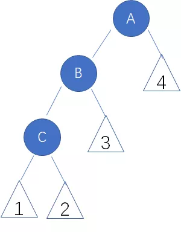

七、二叉树

### 1、基本概念

#### 高度和深度

**节点（结点）的深度：**对于任意节点n，n的深度为从根到n的唯一**路径长**，根的深度为0。

**节点（结点）的高度：**对于任意节点n，n的高度为从n到一片树叶的最长**路径长**，所有树叶的高度为0。

**树的深度：**树中所有结点中的最大深度。

**树的高度：**树中所有节点的最大高度。

注：对于整个树来说，其高度和深度是相等的。

**路径和路径长度**：从结点n1到nk的路径为一个结点序列n1,n2,…nk,ni是ni+1的父结点。路径所包含边的个数为路径的长度。

注：

1. 所以对于一个有12个结点的完全二叉树，其所有结点的高度和为10。
2. 建堆时最坏情况下需要挪动元素次数是等于树中各结点的高度和。
3. 二叉树的路径即二叉树中两个结点之间的路线，类似于一笔画。Y字型的不叫路径哦。

**结点的层次：**规定根结点在1层，其它任一结点的层数是其父结点的层数加1。

>（1）关于高度和深度的区别：
>
>* n的深度是把n看作叶子，去找n的根k；
>
>* n的高度是把n看作根，去找n的最深的叶子。
>
>
>
>（2）高度和深度的争议点：
>
>* 叶子节点的高度，有人说是0，有人说是1，其实叶节点的高度作为高度的初值，是可以人为定义的，所以因场景和上下文而定。
>* 根节点的深度，一般争议不大，都认为是0。


#### 满二叉树（Full Binary Tree）

**满二叉树：**一个二叉树，如果每一个层的结点数都达到最大值，则这个二叉树就是满二叉树。也就是说，如果一个二叉树的层数为k，且结点总数是$2^k-1$ ，则它就是满二叉树。


从图形上看，满二叉树是一个三角形；

从数学上看，满二叉树的各个层的节点数形成一个首项为1，公比为2的等比数列。

**满二叉树性质：**

满二叉树满足如下性质：

1. 一个层数为k的满二叉树总结点数为：$2^k - 1$，因此满二叉树总结点数一定是奇数个。
2. 第i层的节点数为：$2^{i - 1}$
3. 一个层数为k的满二叉树的叶子节点个数：$2^{k - 1}$


#### 完全二叉树（Complete Binary Tree）

**完全二叉树：**如果一棵二叉树的结点要么是叶子结点，要么它有两个子结点，这样的树就是完全二叉树。

另一个定义：

如果对满二叉树的结点进行编号, 约定编号从根结点起, 自上而下, 自左而右。则深度为k的, 有n个结点的二叉树, 当且仅当其每一个结点都与深度为k的满二叉树中编号从1至n的结点一一对应时, 称之为完全二叉树。

**完全二叉树特点：**

叶子结点只能出现在最下层和次下层，且最下层的叶子结点集中在树的左部。

需要注意的是，满二叉树肯定是完全二叉树，而完全二叉树不一定是满二叉树。 

**完全二叉树性质：**

1. 具有n个节点的完全二叉树的深度为：$\lfloor \log_nk \rfloor + 1$，根节点深度定义为1。
2. 如果对一棵有n个节点的完全二叉树的节点按层序编号，则对任一节点$i, (1 \le i \le n)$，有
   * 如果$i = 1$，则节点i是二叉树的根，无双亲；如果$i > 1$，则其双亲为$\lfloor \frac{i}{2} \rfloor$；
   * 如果$2i > n$，则节点i无左孩子，否则其左孩子是节点$2i$；
   * 如果$2i + 1 > n$，则节点i无右孩子，否则其右孩子是节点$2i + 1$。

>注：完全二叉树的编号表示法，使得完全二叉树可以更方便地用数组进行表示和存储。

**判断一棵树是不是完全二叉树：**

1. 若为空树，返回false
2. 若树不为空，使用层序遍历，从队列中pop队首结点，
   * 若该节点左右孩子均不为空，则将其左右孩子入队列
   * 若该节点左孩子为空，右孩子不为空，则该树一定不是完全二叉树，返回false
   * 若该节点右孩子为空，左孩子不为空或者左右孩子均为空，那么只有当队列中该节点之后的节点都是叶子节点时，该树才是完全二叉树，否则就不是。

```c++
bool isCompleteBinaryTree(TreeNode* root) {
    if (!root) return false;
    std::queue<TreeNode*> que;
    que.push(root);
    
    while (!que.empty()) {
        TreeNode* tmp = que.front();
        que.pop();
        if (tmp->left && tmp->right) {	// 如果左右子树均不为空
            que.push(tmp->left);
            que.push(tmp->right);
        } else if (!tmp->left && tmp->right){	// 如果左子树为空，右子树不为空，返回false
            return false;
        } else {		// 如果左子树不为空，右子树为空或左右子树均不为空
            while (!que.empty()) {
                tmp = que.front();
                que.pop();
                if (tmp->left != nullptr || tmp->right != nullptr) return false;
            }
            break;
        }
    }
    return true;
}
```


### 2、二叉树定义代码

```c++
// 普通二叉树定义
struct TreeNode {
    int val;
    TreeNode* left;
    TreeNode* right;
    TreeNode() : val(0), left(nullptr), right(nullptr) {}
    TreeNode(int x) : val(x), left(nullptr), right(nullptr) {}
};

// 带模板参数的二叉树定义
template<typename T>
struct TreeNode {
    T val;
    TreeNode* left;
    TreeNode* right;
    TreeNode(T x) : val(x), left(nullptr), right(nullptr) {}
};
```


### 3、二叉树的创建

遍历二叉树之前，首先我们要有一个二叉树。要创建一个如下图的二叉树，就要先进行二叉树的扩展，也就是将二叉树每个结点的空指针引出一个虚结点，其值为一个特定值，比如'#'。处理后的二叉树称为原二叉树的扩展二叉树。扩展二叉树的每个遍历序列可以确定一个二叉树，我们采用前序遍历创建二叉树。前序遍历序列：124##5##36##7##。


#### 二叉树创建代码

##### （1）手动输入创建

方法一：

用递归的方式，每个节点的数据手动输入。

```c++
// 先序方式递归创建二叉树，手动输入数据
void createTree(TreeNode* tree) {
    if (!tree) return;

    std::cin >> tree->val;
    if (tree->val == '#') return;

    tree->left = new TreeNode();
    createTree(tree->left);
    tree->right = new TreeNode();
    createTree(tree->right);
}
```

##### （2）通过中序遍历序列和后序遍历序列创建

方法二：

通过给定字符串来构建二叉树，该字符串是该二叉树的某种遍历方法得到的序列。

注：如果仅有一个遍历序列是无法得到唯一的二叉树的，考虑给定先序遍历序列：a-b-d-e-c，该序列可能对应多个二叉树：


要想通过给定的输入序列得到唯一的二叉树，必须通过两个序列。如已知中序遍历序列和后序遍历序列，来构建唯一的二叉树。

```c++
TreeNode* buildTreeRecursively(std::vector<int>& inorder, int inorderL, int inorderR, std::vector<int>&
                               postorder, int postorderL, int postorderR) {
    if (inorderR >= inorderL && postorderR >= postorderL) {
        TreeNode* node = new TreeNode(postorder[postorderR]);
        if (inorderR == inorderL) return node;
        int idxRootInorder = 0;
        // 切割中序数组
        for (int i = inorderL; i <= inorderR; i++) {
            if (inorder[i] == node->val) {
                idxRootInorder = i;
                break;
            }
        }
        // 切割后序数组
        node->left = buildTreeRecursively(inorder, inorderL, idxRootInorder - 1, postorder, postorderL,
                                          postorderL + idxRootInorder - inorderL - 1);
        node->right = buildTreeRecursively(inorder, idxRootInorder + 1, inorderR, postorder, postorderL + 
                                           idxRootInorder - inorderL, postorderR - 1);
        return node;
    }
    return nullptr;
}

TreeNode* buildTree(std::vector<int>& inorder, std::vector<int>& postorder) {
    return buildTreeRecursively(inorder, 0, inorder.size() - 1, postorder, 0, postorder.size() - 1);
}
```


##### （3）通过中序遍历序列和前序遍历序列创建

该方法和（2）如出一辙，基本思想都是：

1. 先根据后序数组或前序数组找到根节点
2. 然后拿找到的根节点的值切割中序数组，得到左子树和右子树
3. 然后递归处理左右子树即可

```c++
TreeNode* buildTreeRecursively(std::vector<int>& preorder, int preorderL, int preorderR, std::vector<int>& 
                               inorder, int inorderL, int inorderR) {
    if (inorderR >= inorderL && preorderR >= preorderL) {
        TreeNode* node = new TreeNode(preorder[preorderL]);
        if (inorderR == inorderL) return node;
        int idxRootInorder = 0;
        // 切割中序数组
        for (int i = inorderL; i <= inorderR; i++) {
            if (inorder[i] == node->val) {
                idxRootInorder = i;
                break;
            }
        }
        // 切割前序数组
        node->left = buildTreeRecursively(preorder, preorderL + 1, preorderL+ idxRootInorder  - inorderL, 
                                          inorder, inorderL, idxRootInorder - 1);
        node->right = buildTreeRecursively(preorder, preorderL+ idxRootInorder  - inorderL + 1, preorderR, 
                                           inorder, idxRootInorder + 1, inorderR);
        return node;
    }
    return nullptr;
}

TreeNode* buildTree(std::vector<int>& preorder, std::vector<int>& inorder) {
    return buildTreeRecursively(preorder, 0, preorder.size() - 1, inorder, 0, inorder.size() - 1);
}
```

>注：
>
>通过中序和后序遍历序列可以唯一确定一棵二叉树，
>
>通过中序和前序遍历序列也可以唯一确定一颗二叉树，
>
>但是仅通过前序和后序则不能唯一确定一颗二叉树！
>
>
>
>tree1 的前序遍历是[1 2 3]， 后序遍历是[3 2 1]。
>
>tree2 的前序遍历是[1 2 3]， 后序遍历是[3 2 1]。
>
>那么tree1 和 tree2 的前序和后序完全相同，这是一棵树么，很明显是两棵树！
>
>所以前序和后序不能唯一确定一颗二叉树！

### 4、二叉树的遍历

**二叉树遍历原理**

二叉树的遍历是指按照某种次序依次访问二叉树中所有结点，使得每个结点被访问一次且仅被访问一次。


**为什么研究二叉树的遍历？**

因为计算机只会处理线性序列，而我们研究遍历，就是把树中的结点变成某种意义的线性序列，这给程序的实现带来了好处。


#### 二叉树遍历方法

1. 前序遍历
2. 中序遍历
3. 后序遍历
4. 层序遍历


##### 先序遍历--递归

```c++
void preOrderTraversal(TreeNode* node) {
    if (!node) return;
    
    std::cout << node->val << " ";
    preOrderTraversal(node->left);
    preOrderTraversal(node->right);
}
```


##### 先序遍历--迭代

具体过程：

1. 首先申请一个新的栈，记为stack；
2. 将头结点head压入stack中；
3. 每次从stack中弹出栈顶节点，记为cur，然后打印cur值，如果cur右孩子不为空，则将右孩子压入栈中；如果cur的左孩子不为空，将其压入stack中；
4. 重复步骤3，直到stack为空。

```c++
void preOrderTraversal(TreeNode* node) {
    if (!node) return;
    std::stack<TreeNode*> stack;
    stack.push(node);
    while (!stack.empty()) {
        TreeNode* tmp = stack.top();
        std::cout << tmp->val << " ";
        stack.pop();
        if (tmp->right) stack.push(tmp->right);
        if (tmp->left) stack.push(tmp->left);
    }
}
```


##### 中序遍历--递归

```c++
void inOrderTraversal(TreeNode* node) {
    if (!node) return;
    
    inOrderTraversal(node->left);
    std::cout << node->val << " ";
    inOrderTraversal(node->right);
}
```


##### 中序遍历--迭代

具体过程：

1. 申请一个新栈，记为stack，申请一个变量cur，初始时令cur为头节点；
2. 先把cur节点压入栈中，对以cur节点为头的整棵子树来说，依次把整棵树的左子树压入栈中，即不断令cur=cur.left，然后重复步骤2；
3. 不断重复步骤2，直到发现cur为空，此时从stack中弹出一个节点记为node，打印node的值，并让cur = node.right，然后继续重复步骤2；
4. 当stack为空并且cur为空时结束。

```c++
void inOrderTraversal(TreeNode* node) {
    if (!node) return;
    
    std::stack<TreeNode*> stack;
    TreeNode* cur = node;
    while (cur || !stack.empty()) {
        while (cur) {
            stack.push(cur);
            cur = cur->left;
        }
        if (!stack.empty()) {
            TreeNode* tmp = stack.top();
            stack.pop();
            std::cout << tmp->val << " ";
            cur = tmp->right;
        }
    }
}
```


##### 后序遍历--递归

```c++
void postOrderTraversal(TreeNode* node) {
    if (!node) return;
    
    postOrderTraversal(node->left);
    postOrderTraversal(node->right);
    std::cout << node->val << " ";
}
```


##### 后序遍历--迭代

具体过程：

**（1）方式一：使用两个栈实现**

1. 申请两个栈stack1，stack2，然后将头结点压入stack1中；
2. 从stack1中弹出节点并记为cur，然后先把cur的左孩子压入stack1中，再把cur的右孩子压入stack1中；
3. 在整个过程中，每一个从stack1中弹出的节点都放在第二个栈stack2中；
4. 不断重复步骤2和步骤3，直到stack1为空，过程停止；
5. 从stack2中依次弹出节点并打印，打印的顺序就是后序遍历的顺序；

注：该方法利用了反向思维，先找出后序遍历的倒序，在放到栈中，就成正序啦！

```c++
void postOrderTraversal(TreeNode* node) {
    if (!node) return;
    
    std::stack<TreeNode*> stack1;
    std::stack<TreeNode*> stack2;
    stack1.push(node);
    while (!stack1.empty()) {
        TreeNode* tmp = stack1.top();
        stack1.pop();
        if (tmp->left) stack1.push(tmp->left);
        if (tmp->right) stack1.push(tmp->right);
        stack2.push(tmp);
    }
    while (!stack2.empty()) {
        TreeNode* tmp = stack2.top();
        stack2.pop();
        std::cout << tmp->val << " ";
    }
}
```


**（2）方式二：使用一个栈实现**

1. 申请一个栈stack，将头节点压入stack，同时设置两个变量 h 和 c，在整个流程中，h代表最近一次弹出并打印的节点，c代表当前stack的栈顶节点，初始时令h为头节点，c为null；

2. 每次令c等于当前stack的栈顶节点，但是不从stack中弹出节点，此时分以下三种情况：

   (1)如果c的左孩子不为空，并且h不等于c的左孩子，也不等于c的右孩子，则把c的左孩子压入stack中

   (2)如果情况1不成立，并且c的右孩子不为空，并且h不等于c的右孩子，则把c的右孩子压入stack中；

   (3)如果情况1和2不成立，则从stack中弹出c并打印，然后令h等于c；

3. 一直重复步骤2，直到stack为空.

>步骤 2. 中：
>
>（1）c的左孩子不为空，并且h不等于c的左孩子，也不等于c的右孩子，说明c有左孩子，并且左孩子没有被遍历（输出）过，右孩子也没有被遍历（输出）过，此时将左孩子压入栈。
>
>（2）如果情况1不成立，并且c的右孩子不为空，并且h不等于c的右孩子，说明是以下两种情况：
>
>​		i.  c的左孩子为空
>
>​		ii. c的左孩子不为空，但是已经被遍历过了
>
>​		此时若右孩子不为空，且没有被遍历（输出）过，则将右孩子压入栈即可。
>
>（3）如果情况1和2不成立，则说明是以下两种情况：
>
>​		i.  c的左右孩子均为空
>
>​		ii. c的左右孩子均被遍历过
>
>​		此时将栈顶元素弹出并打印，令h等于c。

```c++
void postOrderTraversal(TreeNode* node) {
    if (!node) return;
    
    std::stack<TreeNode*> stack;
    stack.push(node);
    TreeNode* h = node;
    TreeNode* c = nullptr;
    while (!stack.empty()) {
        c = stack.top(); 
        if (c->left && h != c->left && h != c->right) {
            stack.push(c->left);
        }
        else if (c->right && h != c->right) {
            stack.push(c->right);
        }
        else {
            stack.pop();
            h = c;
            std::cout << c->val << " ";
        }
    }
}
```


##### 层次遍历

具体过程：

1. 首先申请一个新的队列，记为queue；
2. 将头结点head压入queue中；
3. 每次从queue中出队，记为node，然后打印node值，如果node左孩子不为空，则将左孩子入队；如果node的右孩子不为空，则将右孩子入队；
4. 重复步骤3，直到queue为空。

```c++
void leverOrderTraversal(TreeNode* node) {
    if (!node) return;
    
    std::queue<TreeNode*> queue;
    queue.push(node);
    while (!queue.empty()) {
        TreeNode* tmp = queue.front();
        queue.pop();
        if (tmp->left) queue.push(tmp->left);
        if (tmp->right) queue.push(tmp->right);
        std::cout << tmp->val << " ";
    }
}
```


##### 树的广度优先遍历

注意：这里的树可以不是二叉树，如图所示


**广度优先遍历定义：**

英文缩写为BFS即Broadth First Search。其过程简单来说是对每一层节点依次访问，访问完一层进入下一层，而且每个节点只能访问一次。对于上面的例子来说，广度优先遍历的 结果是：A,B,C,D,E,F,G,H,I(假设每层节点从左到右访问)。

**先往队列中插入左节点，再插右节点，这样出队就是先左节点后右节点了。**

广度优先遍历树，需要用到队列（Queue）来存储节点对象,队列的特点就是先进先出。例如，上面这颗树的访问如下：

首先将A节点插入队列中，队列中有元素（A）;

将A节点弹出，同时将A节点的左、右节点依次插入队列，B在队首，C在队尾，（B，C），此时得到A节点；

继续弹出队首元素，即弹出B，并将B的左、右节点插入队列，C在队首，E在队尾（C,D，E），此时得到B节点；

继续弹出，即弹出C，并将C节点的左、中、右节点依次插入队列，（D,E,F,G,H），此时得到C节点；

将D弹出，此时D没有子节点，队列中元素为（E,F,G,H），得到D节点；

。。。以此类推。。

> 具体代码实现因树的叉数而异，二叉树的广度优先遍历即层序遍历。


##### 树的深度优先遍历

树的深度优先遍历类似于二叉树的先序遍历。

**深度优先遍历定义**

英文缩写为DFS即Depth First Search.其过程简要来说是对每一个可能的分支路径深入到不能再深入为止，而且每个节点只能访问一次。对于上面的例子来说深度优先遍历的结果就是：A,B,D,E,I,C,F,G,H.(假设先走子节点的的左侧)。

深度优先遍历各个节点，需要使用到栈（Stack）这种数据结构。stack的特点是是先进后出。整个遍历过程如下：

**先往栈中压入右节点，再压左节点，这样出栈就是先左节点后右节点了。**

首先将A节点压入栈中，stack（A）;

将A节点弹出，同时将A的子节点C，B压入栈中，此时B在栈的顶部，stack(B,C)；

将B节点弹出，同时将B的子节点E，D压入栈中，此时D在栈的顶部，stack（D,E,C）；

将D节点弹出，没有子节点压入,此时E在栈的顶部，stack（E，C）；

将E节点弹出，同时将E的子节点I压入，stack（I,C）；

...依次往下，最终遍历完成。

> 同样，树的深度优先遍历的具体实现因树的叉数而异，二叉树的深度优先遍历即先序遍历。


### 5、二叉查找树（Binary Search Tree，BST）

#### （1）二叉查找树的定义

每棵子树头节点的值都比各自左子树上所有节点值要大，也都比各自右子树上所有节点值要小。

二叉查找树的中序遍历序列一定是从小到大排列的。

```c++
class BST {
public:
    BST() : root(nullptr) {}
    void insertNode(int val);	// 插入节点
    int findMin();		// 查找节点最小值
    int findMax();		// 查找节点最大值
    TreeNode* findNode(int val);	// 查找指定节点
    bool deleteNode(int val);	// 删除指定节点
    TreeNode* getRoot();
private:
    TreeNode* root;		// TreeNode定义见二叉树定义一节
};

// 模板写法
template<typename T>
class BST {
public:
    BST() : root(nullptr) {}
    void insertNode(T val);	// 插入节点
    bool deleteNode(T val);	// 删除指定节点
    T findMin();		// 查找节点最小值
    T findMax();		// 查找节点最大值
    TreeNode<T>* findNode(T val);	// 查找指定节点
    TreeNode* getRoot();
private:
    TreeNode<T>* root;
};
```


#### （2）插入节点

二叉查找树的插入节点操作相对比较简单，只需要找到要插入节点的位置放置即可，因为插入一定是在叶子节点插入的。

插入节点的整体流程：

1. 把父节点设置为当前节点，即根节点。
2. 如果新节点内的数据值小于当前节点内的数据值，那么把当前节点设置为当前节点的左子节点。如果新节点内的数据值大于当前节点内的数据值，那么就跳到步骤 4。
3. 如果当前节点的左子节点的数值为空（null），就把新节点插入在这里并且退出循环。否则，跳到 while 循环的下一次循环操作中。
4. 把当前节点设置为当前节点的右子节点。
5. 如果当前节点的右子节点的数值为空（null），就把新节点插入在这里并且退出循环。否则，跳到 while 循环的下一次循环操作中。

```c++
void BST::insertNode(int val) {
    TreeNode* node = new TreeNode(val);
    if (!root) {
        root = node;
    }
    else {
        TreeNode* cur = root;
        while (true) {
            if (cur->val <= val) {
                if (cur->right != nullptr) {
                    cur = cur->right;
                }
                else {
                    cur->right = node;
                    break;
                }
            }
            else {
                if (cur->left != nullptr) {
                    cur = cur->left;
                }
                else {
                    cur->left = node;
                    break;
                }
            }
        }
    }
}
```


#### （3）查找节点

对于 二叉查找树（BST） 有三件最容易做的事情：查找一个特殊数值，找到最小值，以及找到最大值。

##### 查找最小值

根据二叉查找树的性质，二叉查找树的最小值一定是在左子树的最左侧子节点。

所以实现很简单，就是从根结点出发找出二叉查找树左子树的最左侧子节点。

```c++
int BST::findMin() {
	if (!root) return -1;
    TreeNode* cur = root;
    while (cur->left != nullptr) cur = cur->left;
    return cur->val;
}
```


##### 查找最大值

根据二叉查找树的性质，二叉查找树的最大值一定是在右子树的最右侧子节点。

所以实现很简单，就是从根结点出发找出二叉查找树右子树的最右侧子节点。

```c++
int BST::findMax() {
    if (!root) return;
    TreeNode* cur = root;
    while (cur->right != nullptr) cur = cur->right;
    return cur->val;
}
```


##### 查找特定值

根据二叉查找树的性质，从根结点开始，比较特定值和根结点值的大小。如果比根结点值大，则说明特定值在根结点右子树上，继续在右子节点执行此操作；如果比根结点值小，则说明特定值在根结点左子树上，继续在左子节点执行此操作。如果到执行完成都没有找到和特定值相等的节点值，那么二叉查找树中没有包含此特定值的节点。

```c++
TreeNode* BST::findNode(int val) {
    if (!root) return nullptr;
    
    TreeNode* cur = root;
    while (cur != nullptr) {
        if (val == cur->val) break;
        if (val < cur->val) {
            cur = cur->left;
        } else {
            cur = cur->right;
        }
    }
    return cur;
} 
```

#### （4）删除节点

相对于前面的操作，二叉查找树的删除节点操作就显得要复杂一些了，因为删除节点会有破坏 BST 正确层次顺序的风险。

我们都知道在二叉查找树中的结点可分为：没有子节点的节点，带有一个子节点的节点 ，带有两个子节点的节点 。那么可以将二叉查找树的删除节点操作简单拆分一下，以便于我们的理解。如下图：


##### 删除叶子节点

删除叶子节点是最简单的事情。 唯一要做的就是把目标节点的父节点的一个子节点设置为空（null）。

查看这个节点的左子节点和右子节点是否为空（null），都为空（null）说明为叶子节点。

然后检测这个节点是否是根节点。如果是，就把它设置为空（null）。

否则，如果isLeftChild 为true，把父节点的左子节点设置为空（null）；如果isLeftChild 为false,把父节点的右子节点设置为空（null）。

注：isLeftChild是判断当前节点是否是该节点的父节点的左子节点的布尔变量。

**代码：**

```c++
// 要删除的节点是叶子节点时
if (cur->left == nullptr && cur->right == nullptr) {
    if (cur == root) {
        root = nullptr;
    } else if (isLeftChild) {
        parent->left = nullptr;
    } else {
        parent->right = nullptr;
    }
}
```


##### 删除带有一个子节点的节点

当要删除的节点有一个子节点的时候，需要检查四个条件：

1. 这个节点的子节点可能是左子节点；
2. 这个节点的子节点可能是右子节点；
3. 要删除的这个节点可能是左子节点；
4. 要删除的这个节点可能是右子节点。


**代码：**

```c++
// 要删除的结点是带有一个子节点的节点的处理
// 首先判断子结点是左子节点还是右子节点，然后再判断当前节点是左子节点还是右子节点
else if (cur->left == nullptr) {
    if (cur == root) {
        root = cur->right;
    } else if (isLeftChild) {
        parent->left = cur->right;
    } else {
        parent->right = cur->right;
    }
} else if (cur->right == nullptr) {
    if (cur == root) {
        root = cur->left;
    }else if (isLeftChild) {
        parent->left = cur->left;
    } else {
        parent->right = cur->left;
    }
}
```


##### 删除带有两个子节点的节点

 如果要删除标记为 52 的节点，需要重构这棵树。这里不能用起始节点为 54 的子树来替换它，因为 54 已经有一个左子节点了。这个问题的答案是把**中序后继节点**移动到要删除节点的位置上。 当然还要区分后继节点本身是否有子节点。


这里我们需要了解一下**后继节点**的定义。

一个节点的后继节点是指，这个节点在中序遍历序列中的下一个节点。相应的，前驱节点是指这个节点在中序遍历序列中的上一个节点。


举个例子，下图中的二叉树中序遍历序列为: DBEAFCG，则A的后继节点为F，A的前驱节点为E。


了解了这些，删除带有两个子节点的节点的操作就可以转化为**寻找要删除节点的后继节点并且把要删除节点的右子树赋给后继结点的右子节点**，这里需要注意的是如果后继节点本身有子节点，则需要将后继节点的子结点赋给后继节点父节点的左子节点。

先上获取后继结点的代码，然后举个例子说明:

```c++
// 获取某个节点的后继节点
TreeNode* getSuccessor(TreeNode* delNode) {
    // 这里没必要判断，因为处理的是被删除节点有两个子节点的情况，所以被删节点必有两个子节点
    // if (!delNode) return nullptr;  
    
    // 后继节点的父节点
    TreeNode* successorParent = delNode;
    // 后继节点
    TreeNode* successor = delNode->right;
    // 当前节点
    TreeNode* current = delNode->right->left;
    while (current) {
        successorParent = successor;
        successor = current;
        current = current->left;
    }
    // 如果后继结点不是要删除结点的右子结点，
    // 则要将后继节点的右子结点赋给后继节点父节点的左节点
    // 要删除结点的右子结点赋给后继结点作为 后继结点的右子结点
    if (successor != delNode->right) {
        successorParent->left = successor->right;
        successor->right = delNode->right;
    }
    return successor;
}
```

删除带有两个子节点的节点的代码实现：

```c++
// 要删除的结点是带有两个子节点的节点的处理
else {
    TreeNode* successor = getSuccessor(cur);
    
    // 因为后继结点是要删除结点右子树的最左侧结点
    // 所以后继结点的左子树肯定是要删除结点左子树
    successor->left = cur->left;
    
    if (cur == root) {
        root = successor;
    } else if (isLeftChild) {
        parent->left = successor;
    } else {
        parent->right = successor;
    }
}
```


**详解：**

我们观察到**删除节点的后继节点一定是删除节点右子树的最左侧节点**。这里有3种情况：


**后继节点是删除节点的子节点**

 

删除节点37，后继节点40是删除节点37的子节点。`delNode`是结点37，`successor`是节点40，`delNode.Right`是节点40，`successor == delNode.Right`,后继节点为删除节点的子节点,这种情况是最简单的。

 


**后继节点不是删除节点的子节点**

 

后继节点38是删除节点37右子树的最左侧节点。`delNode`是节点37，`successor`是节点38，`successorParent` 是节点40,`delNode.Right`是节点40。`successor != delNode.Right`，所以要将 `successorParent.Left = successor.Right;successor.Right = delNode.Right;`。因为`successor.Right==null`,所以`successorParent.Left = null`。`successor.Right = delNode.Right`,节点40成为了节点38的右子节点。因为**删除节点的后继节点一定是删除节点右子树的最左侧节点，所以后继节点肯定没有左子节点**。删除节点被删除后，后继结点会补到删除节点的位置。`successor.Left = current.Left;`,也就是删除节点的左子节点变成了后继节点的左子节点。

**完成删除节点后的搜索二叉树变为：**

 


**后继节点不是删除节点的子节点且有子节点**

这种情况和上一种情况相似，唯一的区别是后继节点有子节点（注意肯定是右子节点）。也就是successorParent.Left = successor.Right;,后继节点的右子节点变成后继结点父节点的左子节点。因为successor.Right是节点39,所以节点40的左子节点变成了节点39。其它操作和上一种情况完全相同。

 
**完成删除节点后的搜索二叉树变为：**

 


删除带有两个子节点的节点操作的整体流程：

1. 把后继节点的右子节点赋值为后继节点的父节点的左子节点。
2. 把要删除节点的右子节点赋值为后继节点的右子节点。
3. 从当前节点中移除当前节点的左子节点，并且让它成为后继节点的左子节点。
4. 从父节点的左子节点或右子节点中移除当前节点，并且把它指向后继节点。


##### 删除节点综合代码

综合以上删除节点的三种情况，删除节点操作的完整代码如下：

```c++
TreeNode* getSuccessor(TreeNode* delNode)；

bool BST::deleteNode(int val) {
    // 记录当前节点
    TreeNode* cur = root;
    // 记录当前节点的父节点
    TreeNode* parent = nullptr;
    // 记录当前节点是父节点的左孩子还是右孩子
    bool isLeftChild = false;
    
    // 先查找到该节点
    while (cur->val != val) {
        parent = cur;
        if (val < cur->val) {
            cur = cur->left;
            isLeftChild = true;
        } else {
            cur = cur->right;
            isLeftChild = false;
        }
        // 若未找到节点，删除失败
        if (cur == nullptr) return false;
    }

    
    // 1. 要删除的节点是叶子节点时
    if (cur->left == nullptr && cur->right == nullptr) {
        if (cur == root) {
            root = nullptr;
        } else if (isLeftChild) {
            parent->left = nullptr;
        } else {
            parent->right = nullptr;
        }
    }
    // 2. 要删除的结点是带有一个子节点的节点的处理
    // 首先判断子结点是左子节点还是右子节点，然后再判断当前节点是左子节点还是右子节点
    else if (cur->left == nullptr) {
        if (cur == root) {
            root = cur->right;
        } else if (isLeftChild) {
            parent->left = cur->right;
        } else {
            parent->right = cur->right;
        }
    } else if (cur->right == nullptr) {
        if (cur == root) {
            root = cur->left;
        }else if (isLeftChild) {
            parent->left = cur->left;
        } else {
            parent->right = cur->left;
        }
    }
    // 3. 要删除的结点是带有两个子节点的节点的处理
    else {
        TreeNode* successor = getSuccessor(cur);

        // 因为后继结点是要删除结点右子树的最左侧结点
        // 所以后继结点的左子树肯定是要删除结点左子树
        successor->left = cur->left;

        if (cur == root) {
            root = successor;
        } else if (isLeftChild) {
            parent->left = successor;
        } else {
            parent->right = successor;
        }
    }
    return true;
}


// 获取某个节点的后继节点
TreeNode* getSuccessor(TreeNode* delNode) {
    // 这里没必要判断，因为处理的是被删除节点有两个子节点的情况，所以被删节点必有两个子节点
    // if (!delNode) return nullptr;  
    
    // 后继节点的父节点
    TreeNode* successorParent = delNode;
    // 后继节点
    TreeNode* successor = delNode->right;
    // 当前节点
    TreeNode* current = delNode->right->left;
    while (current) {
        successorParent = successor;
        successor = current;
        current = current->left;
    }
    // 如果后继结点不是要删除结点的右子结点，
    // 则要将后继节点的右子结点赋给后继节点父节点的左节点
    // 要删除结点的右子结点赋给后继结点作为 后继结点的右子结点
    if (successor != delNode->right) {
        successorParent->left = successor->right;
        successor->right = delNode->right;
    }
    return successor;
}
```


##### 二叉搜索树删除节点递归写法

```c++
// 获取最小值的节点
TreeNode* getMin(TreeNode* node) {
    if (!node) return nullptr;
    if (!node->left) return node;
    else return getMin(node->left);
}

// 获取最大值的节点
TreeNode* getMax(TreeNode* node) {
    if (!node) return nullptr;
    if (!node->right) return node;
    else return getMax(node->right);
}

// 递归写法，注意参数必须是 TreeNode*&，必须是引用，否则指针赋值不会生效
bool BST::deleteNode(TreeNode*& node, int val) {
    if (!node) {	// 如果没有找到节点，返回false
        return false;
    } else if (val == node->val) {
        // 如果左右子树都有
        if (node->left && node->right) {
            // 用左子树最大值替换该节点
            node->val = getMax(node->left)->val;
            deleteNode(node->left, node->val);
        } else {	// 如果某个子树为空，则用非空子树替换之
            TreeNode* tmp = node;
            node = node->left ? node->left : node->right;
            delete tmp;
        }
    } else if (val < node->val) {
        return deleteNode(node->left, val);
    } else {
        return deleteNode(node->right, val);
    }
    return true;
}

// 获取最小值的节点
TreeNode* getMin(TreeNode* node) {
    if (!node) return nullptr;
    if (!node->left) return node;
    else return getMin(node->left);
}


// 递归写法精简版
// 分三种情况
class Solution {
public:
    TreeNode* deleteNode(TreeNode* root, int key) 
    {
        if (root == nullptr)    return nullptr;
        if (key > root->val)    root->right = deleteNode(root->right, key);     // 去右子树删除
        else if (key < root->val)    root->left = deleteNode(root->left, key);  // 去左子树删除
        else    // 当前节点就是要删除的节点
        {
            if (! root->left)   return root->right; // 情况1，欲删除节点无左子
            if (! root->right)  return root->left;  // 情况2，欲删除节点无右子
            TreeNode* node = root->right;           // 情况3，欲删除节点左右子都有 
            while (node->left)          // 寻找欲删除节点右子树的最左节点
                node = node->left;
            node->left = root->left;    // 将欲删除节点的左子树成为其右子树的最左节点的左子树
            root = root->right;         // 欲删除节点的右子顶替其位置，节点被删除
        }
        return root;    
    }
};
```


#### （5）二叉搜索树完整代码

```c++
#include <vector>
#include <iostream>
#include <unordered_set>
#include <unordered_map>
#include <utility>
#include <algorithm>
#include <queue>
#include <stack>
using namespace std;

#include <malloc.h>
#include <math.h>
#include <stdint.h>
#include <stdio.h>

struct TreeNode {
    int val;
    TreeNode* left;
    TreeNode* right;
    TreeNode() : val(0), left(nullptr), right(nullptr) {}
    TreeNode(int x) : val(x), left(nullptr), right(nullptr) {}
};

class BST {
public:
    BST() : root(nullptr) {}
    void insertNode(int val);	// 插入节点
    TreeNode* findMin(TreeNode* node);		// 查找节点最小值
    TreeNode* findMax(TreeNode* node);		// 查找节点最大值
    TreeNode* findNode(int val);	// 查找指定节点
    bool deleteNode(int val);	// 删除指定节点
    TreeNode* buildTreeRecursively(std::vector<int>& inorder, int inorderL, int inorderR, std::vector<int>& postorder, int postorderL, int postorderR);
    void buildTree(std::vector<int>& inorder, std::vector<int>& postorder);
    void printTree();

private:
    TreeNode* root;		// TreeNode定义见二叉树定义一节
};

TreeNode* BST::findMin(TreeNode* node) {
    if (!node) return nullptr;
    if (!node->left) return node;
    return findMin(node->left);
}

TreeNode* BST::findMax(TreeNode* node) {
    if (!node) return nullptr;
    if (!node->right) return node;
    return findMax(node->right);
}

TreeNode* BST::findNode(int val) {
    if (!root) return nullptr;

    TreeNode* cur = root;
    while (cur) {
        if (val == cur->val) break;
        if (val < cur->val) {
            cur = cur->left;
        }
        else {
            cur = cur->right;
        }
    }
    return cur;
}

void BST::insertNode(int val) {
    TreeNode* node = new TreeNode(val);
    if (!root) {
        root = node;
    }
    else {
        TreeNode* cur = root;
        while (true) {
            if (cur->val <= val) {
                if (cur->right) {
                    cur = cur->right;
                }
                else {
                    cur->right = node;
                    break;
                }
            }
            else {
                if (cur->left) {
                    cur = cur->left;
                }
                else {
                    cur->left = node;
                    break;
                }
            }
        }
    }
}

TreeNode* getSuccessor(TreeNode* delNode);

bool BST::deleteNode(int val) {
    // 记录当前节点
    TreeNode* cur = root;
    // 记录当前节点的父节点
    TreeNode* parent = nullptr;
    // 记录当前节点是父节点的左孩子还是右孩子
    bool isLeftChild = false;

    // 先查找到该节点
    while (cur->val != val) {
        parent = cur;
        if (val < cur->val) {
            cur = cur->left;
            isLeftChild = true;
        }
        else {
            cur = cur->right;
            isLeftChild = false;
        }
        // 若未找到节点，删除失败
        if (cur == nullptr) return false;
    }


    // 1. 要删除的节点是叶子节点时
    if (cur->left == nullptr && cur->right == nullptr) {
        if (cur == root) {
            root = nullptr;
        }
        else if (isLeftChild) {
            parent->left = nullptr;
        }
        else {
            parent->right = nullptr;
        }
    }
    // 2. 要删除的结点是带有一个子节点的节点的处理
    // 首先判断子结点是左子节点还是右子节点，然后再判断当前节点是左子节点还是右子节点
    else if (cur->left == nullptr) {
        if (cur == root) {
            root = cur->right;
        }
        else if (isLeftChild) {
            parent->left = cur->right;
        }
        else {
            parent->right = cur->right;
        }
    }
    else if (cur->right == nullptr) {
        if (cur == root) {
            root = cur->left;
        }
        else if (isLeftChild) {
            parent->left = cur->left;
        }
        else {
            parent->right = cur->left;
        }
    }
    // 3. 要删除的结点是带有两个子节点的节点的处理
    else {
        TreeNode* successor = getSuccessor(cur);

        // 因为后继结点是要删除结点右子树的最左侧结点
        // 所以后继结点的左子树肯定是要删除结点左子树
        successor->left = cur->left;

        if (cur == root) {
            root = successor;
        }
        else if (isLeftChild) {
            parent->left = successor;
        }
        else {
            parent->right = successor;
        }
    }
    return true;
}

// 获取某个节点的后继节点
TreeNode* getSuccessor(TreeNode* delNode) {
    // 这里没必要判断，因为处理的是被删除节点有两个子节点的情况，所以被删节点必有两个子节点
    // if (!delNode) return nullptr;  

    // 后继节点的父节点
    TreeNode* successorParent = delNode;
    // 后继节点
    TreeNode* successor = delNode->right;
    // 当前节点
    TreeNode* current = delNode->right->left;
    while (current) {
        successorParent = successor;
        successor = current;
        current = current->left;
    }
    // 如果后继结点不是要删除结点的右子结点，
    // 则要将后继节点的右子结点赋给后继节点父节点的左节点
    // 要删除结点的右子结点赋给后继结点作为 后继结点的右子结点
    if (successor != delNode->right) {
        successorParent->left = successor->right;
        successor->right = delNode->right;
    }
    return successor;
}

TreeNode* BST::buildTreeRecursively(std::vector<int>& inorder, int inorderL, int inorderR, std::vector<int>& postorder, int postorderL, int postorderR) {
    if (inorderR >= inorderL && postorderR >= postorderL) {
        TreeNode* node = new TreeNode(postorder[postorderR]);
        if (inorderR == inorderL) return node;
        int idxRootInorder = 0;
        // 切割中序数组
        for (int i = inorderL; i <= inorderR; i++) {
            if (inorder[i] == node->val) {
                idxRootInorder = i;
                break;
            }
        }
        // 切割后序数组
        node->left = buildTreeRecursively(inorder, inorderL, idxRootInorder - 1, postorder, postorderL, postorderL + idxRootInorder - inorderL - 1);
        node->right = buildTreeRecursively(inorder, idxRootInorder + 1, inorderR, postorder, postorderL + idxRootInorder - inorderL, postorderR - 1);
        return node;
    }
    return nullptr;
}

void BST::buildTree(std::vector<int>& inorder, std::vector<int>& postorder) {
    root = buildTreeRecursively(inorder, 0, inorder.size() - 1, postorder, 0, postorder.size() - 1);
}

void BST::printTree() {
    if (!root) return;

    std::stack<TreeNode*> stack;
    TreeNode* cur = root;
    while (cur || !stack.empty()) {
        while (cur) {
            stack.push(cur);
            cur = cur->left;
        }
        if (!stack.empty()) {
            TreeNode* tmp = stack.top();
            stack.pop();
            std::cout << tmp->val << " ";
            cur = tmp->right;
        }
    }
    std::cout << std::endl;
}

int main() {
    BST* bst = new BST();
    std::vector<int> inOrder = { 3, 9, 10, 12, 13 };
    std::vector<int> postOrder = { 3, 10, 13, 12, 9 };
    bst->buildTree(inOrder, postOrder);
    bst->printTree();

    bst->insertNode(8);
    bst->insertNode(8);
    bst->insertNode(7);
    bst->insertNode(6);
    bst->insertNode(14);
    bst->printTree();

    TreeNode* tmp = bst->findNode(14);
    std::cout << tmp->val << std::endl;

    if (bst->deleteNode(14)) {
        std::cout << "delete succeeded!" << std::endl;
        bst->printTree();
    }
    else {
        std::cout << "delete failed!" << std::endl;
    }

    if (bst->deleteNode(8)) {
        std::cout << "delete succeeded!" << std::endl;
        bst->printTree();
    }
    else {
        std::cout << "delete failed!" << std::endl;
    }

    return 0;
}
```


#### （6）性能分析

**线性结构和二叉搜索树对比：**

二叉搜索树：

查询、插入和删除平均复杂度为$O(\log n)$，最坏复杂度为$O(n)$。


线性结构（以二分法为例）：

查询复杂度为$O(\log n)$，比较稳定，考虑二叉树存在最坏情况，所以查询由于二叉搜索树。

插入操作包括查询和插入，查询为$O(\log n)$，插入元素并调整位置复杂度为$O(n)$。

删除操作同插入，为$O(n)$。


由此可知，二叉搜索树相对于线性结构，在构造复杂度和删除复杂度方面占优；在查询复杂度方面，二叉搜索树可能存在类似于斜树，每层上只有一个节点的情况，该情况下查询复杂度不占优势。


**总结**

二叉搜索树的节点查询、构造和删除性能，与树的高度相关，如果二叉搜索树能够更“平衡”一些，避免了树结构向线性结构的倾斜，则能够显著降低时间复杂度。二叉搜索树的存储方面，相对于线性结构只需要保存元素值，树中节点需要额外的空间保存节点之间的父子关系，所以在存储消耗上要高于线性结构。


### 6、平衡二叉树（Balanced Binary Tree，AVL树）

#### （1）背景

**为什么需要平衡二叉树？**

我们之前的二叉排序树的插入（构建）是按照我们输入的数据来进行的，若是我们的数据分布不同，那么就会构造不同的二叉树

{ 62, 88, 58, 47, 35, 73, 51, 99, 37, 93 }

  

{ 35, 37, 47, 51, 58, 62, 73, 88, 93, 99 }

 

我们发现若是数组元素分布大小按顺序，那么我们极有可能得到一颗极不平衡的二叉树，而二叉树深度越大，查找的次数越多，其查找时间复杂度可以高达O(n), 那么如何构造一颗平衡的二叉树？

#### （2）平衡二叉树定义

##### 平衡二叉树

平衡二叉树（Balanced BinaryTree）又被称为AVL树。它具有以下性质：它是一棵空树或它的左右两个子树的**高度**差的绝对值不超过1，并且左右两个子树都是一棵平衡二叉树。

>至于它为什么又叫AVL树，则是取自两个发明平衡二叉树的科学家的名字：G. M. **A**delson-**V**elsky和E. M. **L**andis。

示例：


（注：图二是平衡二叉树，但不是二叉排序树）

##### 平衡因子

将二叉树上结点的左子树高度（或深度）减去右子树高度（或深度）的值称为平衡因子BF(Balance Factor) 。

（注：有的地方的写法是右子树减左子树，方法很灵活，但思想是一样的。）

节点X的平衡因子定义为：
$$
\text{BF}(X)=\text{Height}(\text{LeftSubtree(X)}) - \text{Height}(\text{RightSubtree(X)})
$$
一棵树是一颗平衡二叉树，当且仅当，对于该树的任意节点X，有
$$
\text{BF}(X) \in \{-1, 0, 1\}
$$
对于节点X，若$\text{BF}(X)<0$则称“右倾斜”，$\text{BF}(X)>0$则称“左倾斜”，$\text{BF}=0$则称“平衡”。

示例：


其中结点4的左子树高度是1，右子树不存在，所以该结点的平衡因子是1-0=1。

结点7的左子树不存在，右子树高度是1，所以平衡因子是0-1=-1。

所有的叶子结点，不存在左右子树，所以平衡因子都是0。

>* 这棵树的叶子节点的高度定义为1，有的地方叶子节点高度为0，这个可以人为指定，不唯一。
>
>* 若某个节点的左子树/右子树不存在，则视该子树的高度为0。

##### 平衡二叉树结构体定义

```c++
// 平衡二叉树节点定义
// 注意：和普通二叉树节点定义不同，多了height数据成员
struct AVLNode {
    int height;	// 高度，通过高度的计算可以得到节点是否平衡
    int val;	// 节点的数据域
    AVLNode* left;		// 该节点的左孩子
    AVLNode* right;		// 该节点的右孩子
    AVLNode() : height(0), val(0), left(nullptr), right(nullptr) {}
    AVLNode(int val) : height(0), val(val), left(nullptr), right(nullptr) {}
};

// 平衡二叉树节点模板定义
template <typename T>
struct AVLNode {
    int height;	// 高度，通过高度的计算可以得到节点是否平衡
    T val;	// 节点的数据域
    AVLNode* left;		// 该节点的左孩子
    AVLNode* right;		// 该节点的右孩子
    AVLNode() : height(0), val(0), left(nullptr), right(nullptr) {}
    AVLNode(T val) : height(0), val(val), left(nullptr), right(nullptr) {}
};


// 平衡二叉树类定义
// 直接写模板写法
template <typename T>
class AVLTree {
public:
    AVLTree<T>() {}
    ~AVLTree<T>() {}
    AVLNode<T>*  root = nullptr;
    AVLNode<T>* findMin(AVLNode<T>* node);
    AVLNode<T>* findMax(AVLNode<T>* node);
    AVLNode<T>* findNode(T val);
    void insertNode(AVLNode<T>*& node, T val);	// 插入节点
    bool deleteNode(AVLNode<T>*& node, T val);	// 删除节点
private:
    int getNodeHeight(AVLNode<T>* node);	// 求节点的高度
    AVLNode<T>* LL(AVLNode<T>* node);		// LL旋转，返回旋转后的node节点
    AVLNode<T>* RR(AVLNode<T>* node);		// RR旋转
    AVLNode<T>* LR(AVLNode<T>* node);		// LR旋转
    AVLNode<T>* RL(AVLNode<T>* node);		// RL旋转
};

// 获取节点高度的函数，注意叶子节点高度定义为0
template <typename T>
int AVLTree<T>::getNodeHeight(AVLNode<T>* node) {
    if (!node) {
        return -1;
    } else {
        return node->height;
    }
}

// 获取值最小的节点
template <typename T>
AVLNode<T>* AVLTree<T>::findMin(AVLNode<T>* node) {
    if (!node) return nullptr;
    if (!node->left) return node;
    return findMin(node->left);
}

// 获取值最大的节点
template <typename T>
AVLNode<T>* AVLTree<T>::findMax(AVLNode<T>* node) {
    if (!node) return nullptr;
    if (!node->right) return node;
    return findMax(node->right);
}

// 查找节点
template <typename T>
AVLNode<T>* AVLTree<T>::findNode(T val) {
    AVLNode<T>* cur = root;
    while (cur) {
        if (val == cur->val) break;
        else if (val < cur->val) {
            cur = cur->left;
        } else {
            cur = cur->right;
        }
    }
    return cur;
}
```

#### （3）平衡二叉树的旋转操作

##### 左旋转

**逆时针**旋转AVL树的两个结点X和Y，使得父结点被自己的右孩子取代，而父节点成为自己的右孩子的左孩子：


##### 右旋转

**顺时针**旋转AVL树的两个结点X和Y，使得父结点被自己的左孩子取代，而父节点成为自己的左孩子的右孩子：


AVL树的调整分为四种情况，分别为LL（左左）、RR（右右）、LR（左右）和RL（右左）。下面依次介绍该如何调整：

> 平衡二叉树失衡调整很重要的一点是：
>
> 失衡调整只会影响根节点到失衡节点路径上的节点的高度，其他节点的高度都不会受到影响。

##### 左左情况（LL）



顾名思义，祖父结点A有一个左孩子结点B，而结点B又有一个左孩子结点C。标号1,2,3,4的三角形是各个结点的子树。

在这种局面下，我们以结点A为轴，进行**右旋**操作：


代码实现：

```c++
// 左左情况
template <typename T>
AVLNode<T>* AVLTree<T>::LL(AVLNode<T>* node) {
    AVLNode<T>* newRoot = node->left;
    node->left = newRoot->right;
    newRoot->right = node;
    node->height = max(getNodeHeight(node->left), getNodeHeight(node->right)) + 1;	// + 1是因为多一层
    return newRoot;
}
```


##### 右右情况（RR）


祖父结点A有一个右孩子结点B，而结点B又有一个右孩子结点C。

在这种局面下，我们以结点A为轴，进行**左旋**操作：


代码实现：

```c++
// 右右情况
template <typename T>
AVLNode<T>* AVLTree<T>::RR(AVLNode<T>* node) {
    AVLNode<T>* newRoot = node->right;
    node->right = newRoot->left;
    newRoot->left = node;
    node->height = max(getNodeHeight(node->left), getNodeHeight(node->right)) + 1;	// + 1是因为多一层
    return newRoot;
}
```


##### 左右情况（LR）


祖父结点A有一个左孩子结点B，而结点B又有一个右孩子结点C。

在这种局面下，我们先以结点B为轴，进行**左旋**操作：


这样就转化成了左左局面。我们继续以结点A为轴，进行右旋操作：


代码实现：

```c++
// 左右情况
template <typename T>
AVLNode<T>* AVLTree<T>::LR(AVLNode<T>* node) {
    node->left = RR(node->left);
    return LL(node);
}
```


##### 右左情况（RL）


祖父结点A有一个右孩子结点B，而结点B又有一个左孩子结点C。

在这种局面下，我们先以结点B为轴，进行**右旋**操作：


这样就转化成了右右局面。我们继续以结点A为轴，进行左旋操作：


代码实现：

```c++
// 右左情况
template <typename T>
AVLNode<T>* AVLTree<T>::RL(AVLNode<T>* node) {
    node->right = LL(node->right);
    return RR(node);
}
```


#### （4）插入节点

```c++
// 插入节点，递归思想
template <typename T>
void AVLTree<T>::insertNode(AVLNode<T>*& node, T val) {
    if (!node) {
        node = new AVLNode<T>(val);
    }
    else if (val < node->val) {
        insertNode(node->left, val);
        // 检查是否失衡
        if (getNodeHeight(node->left) - getNodeHeight(node->right) > 1) {
            if (val < node->left->val) {
                node = LL(node);	// 左左
            }
            else {
                node = LR(node);	// 左右
            }
        }
    }
    else if (val > node->val) {
        insertNode(node->right, val);
        // 检查是否失衡
        if (getNodeHeight(node->right) - getNodeHeight(node->left) > 1) {
            if (val > node->right->val) {
                node = RR(node);	// 右右
            }
            else {
                node = RL(node);	// 右左
            }
        }
    }
    else {
        // 平衡二叉树没有节点值相等的重复节点，直接返回
        return;
    }
    // 递归回溯时更新路径上节点的高度
    node->height = max(getNodeHeight(node->left), getNodeHeight(node->right)) + 1;
}
```


#### （5）删除节点

##### 删除节点递归写法

```c++
// 删除节点的递归写法
template <typename T>
bool AVLTree<T>::deleteNode(AVLNode<T>*& node, T val) {
    // 未找到该节点，删除失败
    if (!node) {
        return false;
    }
    else if (node->val == val) {	// 找到该节点
     // 如果左右子树都非空
        if (node->left && node->right) {
            // 在高度更大的子树上进行删除操作
            if (getNodeHeight(node->left) > getNodeHeight(node->right)) {	// 如果左子树高度更高
                node->val = findMax(node->left)->val;
                // 注意这里必须要用递归删除节点的原因是：
                // 虽然删除节点不需要递归就可以删除，但是平衡二叉树需要更新删除节点路径上的所有节点的高度
                // 所以必须递归，在回溯时更新节点高度
                deleteNode(node->left, node->val);
            }
            else {	// 如果右子树高度更高
                node->val = findMin(node->right)->val;
                deleteNode(node->right, node->val);
            }
        }
        else {	// 如果某一子树为空，直接用非空子树替换当前节点即可
            AVLNode<T>* tmp = node;
            node = node->left ? node->left : node->right;
            delete tmp;
        }
        // 更新高度
        node->height = max(getNodeHeight(node->left), getNodeHeight(node->right)) + 1;
    }
    else if (val < node->val) {	// 如果删除节点在左子树上
     // 递归删除左子树节点
        deleteNode(node->left, val);
        // 注意如果这里返回false，则说明没有找到节点，则下面一定走else分支，因为原树一定是平衡的
        // 由于删除节点位于左子树，节点删除后可能会导致左子树高度变小，从而导致整棵树失衡，需要调整
        // 这里不需要取绝对值，因为原树是平衡的，删左子树节点，一定会引起右子树节点相对变多
        if (getNodeHeight(node->right) - getNodeHeight(node->left) > 1) {
            if (getNodeHeight(node->right->left) > getNodeHeight(node->right->right)) {
                node = RL(node);
            }
            else {
                node = RR(node);
            }
        }
        else {	// 满足平衡条件，直接调整高度
            node->height = max(getNodeHeight(node->left), getNodeHeight(node->right)) + 1;
        }
    }
    else {	// 如果删除节点在右子树上
     // 递归删除右子树节点
        deleteNode(node->right, val);
        // 同样进行失衡调整
        if (getNodeHeight(node->left) - getNodeHeight(node->right) > 1) {
            if (getNodeHeight(node->left->left) > getNodeHeight(node->left->right)) {
                node = LL(node);
            }
            else {
                node = LR(node);
            }
        }
        else {	// 满足平衡条件，直接调整高度
            node->height = max(getNodeHeight(node->left), getNodeHeight(node->right)) + 1;
        }
    }
    return true;
}

```


#### （6）平衡二叉树完整代码

```c++
// 平衡二叉树节点模板定义
template <typename T>
struct AVLNode {
    int height;	// 高度，通过高度的计算可以得到节点是否平衡
    T val;	// 节点的数据域
    AVLNode* left;		// 该节点的左孩子
    AVLNode* right;		// 该节点的右孩子
    AVLNode() : height(0), val(0), left(nullptr), right(nullptr) {}
    AVLNode(T val) : height(0), val(val), left(nullptr), right(nullptr) {}
};


// 平衡二叉树类定义
// 直接写模板写法
template <typename T>
class AVLTree {
public:
    AVLTree<T>() {}
    ~AVLTree<T>() {}
    AVLNode<T>* root = nullptr;
    AVLNode<T>* findMin(AVLNode<T>* node);
    AVLNode<T>* findMax(AVLNode<T>* node);
    AVLNode<T>* findNode(T val);
    void insertNode(AVLNode<T>*& node, T val);	// 插入节点
    bool deleteNode(AVLNode<T>*& node, T val);	// 删除节点
    void printTree();		// 中序遍历打印
private:
    int getNodeHeight(AVLNode<T>* node);	// 求节点的高度
    AVLNode<T>* LL(AVLNode<T>* node);		// LL旋转，返回旋转后的node节点
    AVLNode<T>* RR(AVLNode<T>* node);		// RR旋转
    AVLNode<T>* LR(AVLNode<T>* node);		// LR旋转
    AVLNode<T>* RL(AVLNode<T>* node);		// RL旋转
};

// 中序遍历打印，迭代
template <typename T>
void AVLTree<T>::printTree() {
    if (!root) return;
    AVLNode<T>* cur = root;
    stack<AVLNode<T>*> st;
    while (cur || !st.empty()) {
        while (cur) {
            st.push(cur);
            cur = cur->left;
        }
        if (!st.empty()) {
            AVLNode<T>* tmp = st.top();
            st.pop();
            cout << tmp->val << " ";
            if (tmp->right) {
                cur = tmp->right;
            }
        }
    }
    cout << endl;
}

// 获取节点高度的函数，注意叶子节点高度定义为1
template <typename T>
int AVLTree<T>::getNodeHeight(AVLNode<T>* node) {
    if (!node) {
        return -1;
    }
    else {
        return node->height;
    }
}

// 获取值最小的节点
template <typename T>
AVLNode<T>* AVLTree<T>::findMin(AVLNode<T>* node) {
    if (!node) return nullptr;
    if (!node->left) return node;
    return findMin(node->left);
}

// 获取值最大的节点
template <typename T>
AVLNode<T>* AVLTree<T>::findMax(AVLNode<T>* node) {
    if (!node) return nullptr;
    if (!node->right) return node;
    return findMax(node->right);
}

// 查找节点
template <typename T>
AVLNode<T>* AVLTree<T>::findNode(T val) {
    AVLNode<T>* cur = root;
    while (cur) {
        if (val == cur->val) break;
        else if (val < cur->val) {
            cur = cur->left;
        }
        else {
            cur = cur->right;
        }
    }
    return cur;
}

// 左左情况
template <typename T>
AVLNode<T>* AVLTree<T>::LL(AVLNode<T>* node) {
    AVLNode<T>* newRoot = node->left;
    node->left = newRoot->right;
    newRoot->right = node;
    node->height = max(getNodeHeight(node->left), getNodeHeight(node->right)) + 1;	// + 1是因为多一层
    return newRoot;
}

// 右右情况
template <typename T>
AVLNode<T>* AVLTree<T>::RR(AVLNode<T>* node) {
    AVLNode<T>* newRoot = node->right;
    node->right = newRoot->left;
    newRoot->left = node;
    node->height = max(getNodeHeight(node->left), getNodeHeight(node->right)) + 1;	// + 1是因为多一层
    return newRoot;
}

// 左右情况
template <typename T>
AVLNode<T>* AVLTree<T>::LR(AVLNode<T>* node) {
    node->left = RR(node->left);
    return LL(node);
}

// 右左情况
template <typename T>
AVLNode<T>* AVLTree<T>::RL(AVLNode<T>* node) {
    node->right = LL(node->right);
    return RR(node);
}

// 插入节点，递归思想
template <typename T>
void AVLTree<T>::insertNode(AVLNode<T>*& node, T val) {
    if (!node) {
        node = new AVLNode<T>(val);
    }
    else if (val < node->val) {
        insertNode(node->left, val);
        // 检查是否失衡
        if (getNodeHeight(node->left) - getNodeHeight(node->right) > 1) {
            if (val < node->left->val) {
                node = LL(node);	// 左左
            }
            else {
                node = LR(node);	// 左右
            }
        }
    }
    else if (val > node->val) {
        insertNode(node->right, val);
        // 检查是否失衡
        if (getNodeHeight(node->right) - getNodeHeight(node->left) > 1) {
            if (val > node->right->val) {
                node = RR(node);	// 右右
            }
            else {
                node = RL(node);	// 右左
            }
        }
    }
    else {
        // 平衡二叉树没有节点值相等的重复节点，直接返回
        return;
    }
    // 递归回溯时更新路径上节点的高度
    node->height = max(getNodeHeight(node->left), getNodeHeight(node->right)) + 1;
}

// 删除节点的递归写法
template <typename T>
bool AVLTree<T>::deleteNode(AVLNode<T>*& node, T val) {
    // 未找到该节点，删除失败
    if (!node) {
        return false;
    }
    else if (node->val == val) {	// 找到该节点
     // 如果左右子树都非空
        if (node->left && node->right) {
            // 在高度更大的子树上进行删除操作
            if (getNodeHeight(node->left) > getNodeHeight(node->right)) {	// 如果左子树高度更高
                node->val = findMax(node->left)->val;
                // 注意这里必须要用递归删除节点的原因是：
                // 虽然删除节点不需要递归就可以删除，但是平衡二叉树需要更新删除节点路径上的所有节点的高度
                // 所以必须递归，在回溯时更新节点高度
                deleteNode(node->left, node->val);
            }
            else {	// 如果右子树高度更高
                node->val = findMin(node->right)->val;
                deleteNode(node->right, node->val);
            }
        }
        else {	// 如果某一子树为空，直接用非空子树替换当前节点即可
            AVLNode<T>* tmp = node;
            node = node->left ? node->left : node->right;
            delete tmp;
        }
        // 更新高度
        node->height = max(getNodeHeight(node->left), getNodeHeight(node->right)) + 1;
    }
    else if (val < node->val) {	// 如果删除节点在左子树上
     // 递归删除左子树节点
        deleteNode(node->left, val);
        // 注意如果这里返回false，则说明没有找到节点，则下面一定走else分支，因为原树一定是平衡的
        // 由于删除节点位于左子树，节点删除后可能会导致左子树高度变小，从而导致整棵树失衡，需要调整
        // 这里不需要取绝对值，因为原树是平衡的，删左子树节点，一定会引起右子树节点相对变多
        if (getNodeHeight(node->right) - getNodeHeight(node->left) > 1) {
            if (getNodeHeight(node->right->left) > getNodeHeight(node->right->right)) {
                node = RL(node);
            }
            else {
                node = RR(node);
            }
        }
        else {	// 满足平衡条件，直接调整高度
            node->height = max(getNodeHeight(node->left), getNodeHeight(node->right)) + 1;
        }
    }
    else {	// 如果删除节点在右子树上
     // 递归删除右子树节点
        deleteNode(node->right, val);
        // 同样进行失衡调整
        if (getNodeHeight(node->left) - getNodeHeight(node->right) > 1) {
            if (getNodeHeight(node->left->left) > getNodeHeight(node->left->right)) {
                node = LL(node);
            }
            else {
                node = LR(node);
            }
        }
        else {	// 满足平衡条件，直接调整高度
            node->height = max(getNodeHeight(node->left), getNodeHeight(node->right)) + 1;
        }
    }
    return true;
}


int main() {
    AVLTree<int>* tree = new AVLTree<int>();

    //cout << "Please input values to create a tree(-1 to end):" << endl;
    //int val;
    //while (cin >> val) {
    //    if (val == -1) break;
    //    tree->insertNode(tree->root, val);
    //}
    tree->insertNode(tree->root, 16);
    tree->insertNode(tree->root, 13);
    tree->insertNode(tree->root, 20);
    tree->insertNode(tree->root, 24);
    tree->insertNode(tree->root, 12);
    tree->insertNode(tree->root, 14);
    tree->insertNode(tree->root, 15);

    tree->deleteNode(tree->root, 13);
    tree->printTree();

    return 0;
}
```


#### （7）性能分析

> 时间复杂度：平均情况$O(\log_n)$，最差情况$O(\log_n)$
>
> 具体时间复杂度：
>
> * 插入节点：$O(\log_n)$，节点插入包含查找节点的过程
> * 删除节点：$O(\log_n)$
> * 查找节点：$O(\log_n)$
>
> 空间复杂度：$O(1)$

平衡二叉树(AVL)是在二叉排序树的基础上进一步完善得到的，所以平衡二叉树首先是一棵二叉排序树，其次它每一个结点的左右子树的高度差最多为1。平衡二叉树平衡因子大于1时右旋，平衡因子小于-1时左旋，进而使树平衡。平衡二叉树查找的时间复杂度为O(logn)，其中n为二叉树结点个数。

关于平衡二叉树的性能，可以看到平衡二叉树是牺牲了插入节点和删除节点的时间复杂度，换来了查找节点时稳定$O(\log_n)$复杂度。而下文要讲的红黑树，能够以不牺牲太大的插入和删除时间的代价，来保证稳定高效的查找效率。


### 7、红黑树（Red-Black Tree， RBT）

#### （1）背景


**当在10亿数据中只需要进行10几次比较就能查找到目标时，不禁感叹编程之魅力！人类之伟大呀！ **

**——学红黑树有感。**


终于，在学习了几天的红黑树相关的知识后，我想把我所学所想和所感分享给大家。红黑树是一种比较难的数据结构，要完全搞懂非常耗时耗力，红黑树怎么自平衡？什么时候需要左旋或右旋？插入和删除破坏了树的平衡后怎么处理？等等一连串的问题在学习前困扰着我。如果你在学习过程中也会存在我的疑问，那么本文对你会有帮助，本文帮助你全面、彻底地理解红黑树！

本文将通过图文的方式讲解红黑树的知识点，并且不会涉及到任何代码，相信我，在懂得红黑树实现原理前，看代码会一头雾水的，当原理懂了，代码也就按部就班写而已，没任何难度。

阅读本文你需具备知识点：

- 二叉查找树
- 完美平衡二叉树

事不宜迟，让我们进入正题吧。

红黑树也是二叉查找树，我们知道，二叉查找树这一数据结构并不难，而红黑树之所以难是难在它是自平衡的二叉查找树，在进行插入和删除等可能会破坏树的平衡的操作时，需要重新自处理达到平衡状态。现在在脑海想下怎么实现？是不是太多情景需要考虑了？啧啧，先别急，通过本文的学习后，你会觉得，其实也不过如此而已。好吧，我们先来看下红黑树的定义和一些基本性质。

#### （2）红黑树的定义

红黑树是一种含有红黑结点并能自平衡的二叉查找树。它必须满足下面性质：

* 性质1：每个节点要么是黑色，要么是红色。
* 性质2：根节点是黑色。
* 性质3：每个叶子节点（NIL）是黑色。
* 性质4：每个红色结点的两个子结点一定都是黑色。
* 性质5：任意一结点到该结点每个叶子结点的路径都包含数量相同的黑结点。

从性质5又可以推出：

- 性质5.1：如果一个结点存在黑子结点，那么该结点肯定有两个子结点

 

对于红黑树，你可以只了解：红黑树是一种常用的平衡二叉搜索树，单次的查找、插入、删除的复杂度都是log(n)，这些操作的复杂度都不会恶化；红黑树的定义；红黑树结点数与树高的约束：log(n+1) >= h/2，及其证明；STL中的map和set是用红黑树实现的，以及它们的用法。


（2）左旋右旋

红黑树插入或删除后，一般就会改变红黑树的特性，要恢复红黑树上述5个性质，一般都要那就要做2方面的工作：

1、部分结点颜色，重新着色

2、调整部分指针的指向，即左旋、右旋。

左选右旋如图所示：


左旋，如图所示（左->右），以x->y之间的链为“支轴”进行，使y成为该新子树的根，x成为y的左孩子，而y的左孩子则成为x的右孩

子。算法很简单，旋转后各个结点从左往右，仍然都是从小到大。

左旋代码实现，分三步:

（1） 开始变化，y的左孩子成为x的右孩子；

（2） y成为x的父结点；

（3） x成为y的左孩子；

右旋类似，不再累述；

#### （3）性能分析

RBT 的操作代价分析：
**(1) 查找代价：**
由于红黑树的性质(最长路径长度不超过最短路径长度的2倍)，可以说明红黑树虽然不像AVL一样是严格平衡的，但平衡性能还是要比BST要好。其查找代价基本维持在O(logN)左右，但在最差情况下(最长路径是最短路径的2倍少1)，比AVL要略逊色一点。

**(2) 插入代价：**
RBT插入结点时，需要旋转操作和变色操作。但由于只需要保证RBT基本平衡就可以了。因此插入结点最多只需要2次旋转，这一点和AVL的插入操作一样。虽然变色操作需要O(logN)，但是变色操作十分简单，代价很小。

**(3) 删除代价：**
RBT的删除操作代价要比AVL要好的多，删除一个结点最多只需要3次旋转操作。


**RBT 效率总结 :**
**查找**效率最好情况下时间复杂度为O(logN)，但在最坏情况下比AVL要差一些，但也远远好于BST。
**插入**和**删除**操作改变树的平衡性的概率要远远小于AVL（RBT不是高度平衡的）。因此需要的旋转操作的可能性要小，而且一旦需要旋转，插入一个结点最多只需要旋转2次，删除最多只需要旋转3次(小于AVL的删除操作所需要的旋转次数)。虽然变色操作的时间复杂度在O(logN)，但是实际上，这种操作由于简单所需要的代价很小。


#### （4）二叉查找树、平衡二叉树、红黑树的效率比较

查找、插入、删除操作的**最坏**时间复杂度：

| 操作 | 二叉查找树 | 平衡二叉树  |   红黑树    |
| :--: | :--------: | :---------: | :---------: |
| 查找 |   $O(n)$   | $O(\log_n)$ | $O(\log_n)$ |
| 插入 |   $O(n)$   | $O(\log_n)$ | $O(\log_n)$ |
| 删除 |   $O(n)$   | $O(\log_n)$ | $O(\log_n)$ |

二叉查找树因可能退化成链表，故其性能最差。平衡二叉树和红黑树是带有平衡条件的二叉查找树，故它们的效率也较高。

平衡二叉树的插入/删除操作带来的旋转操作可能会达到logn次，而红黑树的插入/删除操作带来的旋转操作最多为2/3次。

所以说，当红黑树出现的时候，平衡二叉树就只能出现在博物馆里了。即红黑树是最优选择。


**平衡二叉树和红黑树性能对比：**
AVL 和RBT 都是二叉查找树的优化。其性能要远远好于二叉查找树。他们之间都有自己的优势，其应用上也有不同。
结构对比： AVL的结构高度平衡，RBT的结构基本平衡。平衡度AVL > RBT.
查找对比： AVL 查找时间复杂度最好，最坏情况都是O(logN)。RBT 查找时间复杂度最好为O(logN)，最坏情况下比AVL略差。
插入删除对比：

1. AVL的插入和删除结点很容易造成树结构的不平衡，而RBT的平衡度要求较低。因此在大量数据插入的情况下，RBT需要通过旋转变色操作来重新达到平衡的频度要小于AVL。
2. 如果需要平衡处理时，RBT比AVL多一种变色操作，而且变色的时间复杂度在O(logN)数量级上。但是由于操作简单，所以在实践中这种变色仍然是非常快速的。
3. 当插入一个结点都引起了树的不平衡，AVL和RBT都最多需要2次旋转操作。但删除一个结点引起不平衡后，AVL最多需要logN 次旋转操作，而RBT最多只需要3次。因此两者插入一个结点的代价差不多，但删除一个结点的代价RBT要低一些。
4. AVL和RBT的插入删除代价主要还是消耗在查找待操作的结点上。因此时间复杂度基本上都是与O(logN) 成正比的。

**总体评价：大量数据实践证明，RBT的总体统计性能要好于平衡二叉树**。


### 8、B-树

ps：B-树就是B树，中间的横线并不是减号。谁要是把B树读成B减树，那可就丢人现眼喽。

#### （1）B树的定义

维基百科对B树的定义为“在计算机科学中，B树（B-tree）是一种树状数据结构，它能够存储数据、对其进行排序并允许以O(log n)的时间复杂度运行进行查找、顺序读取、插入和删除的数据结构。B树，概括来说是一个节点可以拥有多于2个子节点的二叉查找树。与自平衡二叉查找树不同，B-树为系统最优化大块数据的读和写操作。B-tree算法减少定位记录时所经历的中间过程，从而加快存取速度。普遍运用在数据库和文件系统。”


讲B树之前，我们通过一些数据库的内容来引入：

**1、MySQL数据库里面的索引是基于什么数据结构？**

索引主要是基于Hash表或者B+树。

 

**2、数据库索引为什么要使用树结构存储呢？**

因为树的查询效率高，而且可以保持有序。

 

详解：

（1）首先，内存是有限的不可能无止境的一直插入数据，而基于BST的平衡树如AVL树和红黑树，或者我们上一节学习的跳跃表本质上都是基于内存的数据结构。

（2）如果将AVL树，红黑树或者跳跃表直接存储到磁盘上，然后用来检索可以吗？ 答案是可以的，但问题是基于磁盘寻道查询比基于内存慢太多了，举个例子，假设现在有100万数据分布在红黑树里面，按照红黑树的平均查找性能O（logN）来计算，在N=100万时，检索任意数据平均需要20次查询，如果是在内存完全没问题，但此时红黑树是如果存在磁盘上，那就完全不一样了，按照普通硬盘或者文件系统，每次查询IO一次总耗时约10毫秒计算，那么在百万级别的数据量下，检索一次数据就需要10*20，大概就是0.2秒，而当我们查询100条数据时，就需要20秒，这样的性能显然是无法忍受的。 

正是由于描述的问题，所以迫切需要一种面向磁盘或者文件系统友好的数据结构，而它就是B树，或者基于B树的扩展B+，B*树等。上面问题的根源在于树的高度太高，导致查询外存，也就是访问磁盘IO次数太多，从而大大拖慢了检索性能，那么思路就清晰了，只要想法子降低树的高度就可以了，没错B树就是这么一种m叉的多路平衡树，你可以想象它的孩子节点少则2个，多则数千个，所以就从二叉树的廋高，变成了多叉树的矮胖，正是这样才大大降低了树的高度，从而使得这种数据结构更适合存储在磁盘上，并且充分了利用了磁盘的块的预读机制（局部性访问原理），通过缓存的方式进一步提升性能，磁盘在读取某一个文件指针的时候，通常会把紧挨着的数据，也全部读到缓存，因为实践证明，当一个文件数据被访问的时候，它周边的数据很快也会被访问（即局部性访问原理）。这里简单说下磁盘扇区，磁盘块，磁盘也的区别：

扇区：磁盘的最小存储单位；

磁盘块：文件系统读写数据的最小单位；

页：内存的最小存储单位；

磁盘块和页的大小一般情况下为4KB，所以在B树中一个节点的最大存储数据个数的总大小一般不能超过4KB。

基于B树的结构充分利用了这一点，从而非常适合做文件系统或者数据库的索引。


**3、既然这样，为什么索引没有使用二叉查找树来实现呢？**                                                   
 其实从算法逻辑来讲，二叉查找树的查找速度和比较次数都是最小的。但是，我们不得不考虑一个现实问题：磁盘IO。数据库索引是存储在磁盘上的，当数据量比较大的时候，索引的大小可能有几个G甚至更多。当我们利用索引查询的时候，能把整个索引全部加载到内存吗？显然不可能。能做的只有逐一加载每一个磁盘页，这里的磁盘页对应着索引树的结点。


二叉查找树的结构：


第1次磁盘IO：


第2次磁盘IO：


 第3次磁盘IO：


第4次磁盘IO：


#### （2）B树的特征

下面来具体介绍一下B-树（Balance Tree），一个m阶的B树具有如下几个特征：

1.根结点至少有两个子女。

2.每个中间节点都包含k-1个元素和k个孩子，其中 m/2 <= k <= m

3.每一个叶子节点都包含k-1个元素，其中 m/2 <= k <= m

4.所有的叶子结点都位于同一层。

5.每个节点中的元素从小到大排列，节点当中k-1个元素正好是k个孩子包含的元素的值域分划。


 第1次磁盘IO：


在内存中定位（和9比较）：


第2次磁盘IO：


 在内存中定位（和2，6比较）：


第3次磁盘IO：


在内存中定位（和3，5比较）：


自顶向下查找4的节点位置，发现4应当插入到节点元素3，5之间。


节点3，5已经是两元素节点，无法再增加。父亲节点 2， 6 也是两元素节点，也无法再增加。根节点9是单元素节点，可以升级为两元素节点。于是**拆分**节点3，5与节点2，6，让根节点9升级为两元素节点4，9。节点6独立为根节点的第二个孩子。


自顶向下查找元素11的节点位置。


删除11后，节点12只有一个孩子，不符合B树规范。因此找出12,13,15三个节点的中位数13，取代节点12，而节点12自身下移成为第一个孩子。（这个过程称为**左旋**）


### 9、B+树

#### （1）B+树的定义

什么是B+树？

B+树是基于B树的一种变体，有着比B树更高的查询性能。B+树和B树有一些共同点，但是B+树也具备一些新的特征。

#### （2）B+树的特征

**一个m阶的B+树具有如下几个特征：**

1. 每个中间节点包含有k个子树和k个元素（B树中是k-1个元素），每个元素不保存数据，只用来索引，所有数据都保存在叶子节点，其中m/2 <= k <= m。

2. 所有的叶子结点中包含了全部元素的信息，及指向含这些元素记录的指针，且叶子结点本身依关键字的大小自小而大通过链表顺序链接。

3. 所有的中间节点元素都同时存在于子节点，在子节点元素中是最大（或最小）元素。


B-树中的卫星数据（Satellite Information）：


B+树中的卫星数据（Satellite Information）：


需要补充的是，在数据库的聚集索引（Clustered Index）中，叶子节点直接包含卫星数据。在非聚集索引（NonClustered Index）中，叶子节点带有指向卫星数据的指针。


第一次磁盘IO：


第二次磁盘IO：


第三次磁盘IO：


**B-树的范围查找过程**

自顶向下，查找到范围的下限（3）：


 中序遍历到元素6：


 中序遍历到元素8：


 中序遍历到元素9：


 中序遍历到元素11，遍历结束：


**B+树的范围查找过程**                         
自顶向下，查找到范围的下限（3）：


通过链表指针，遍历到元素6, 8：


通过链表指针，遍历到元素9, 11，遍历结束：


#### （3）B+树的优势

1. 单一节点存储更多的元素，使得查询的IO次数更少，所以也就使得它更适合做为数据库MySQL的底层数据结构了。

2. 所有查询都要查找到叶子节点，查询性能稳定；而B树，每个节点都可以查找到数据，所以不稳定。

3. 所有叶子节点形成有序链表，便于范围查询。


### 10、线段树

#### （1）区间问题

我们在刷题时经常会遇到和区间有关的题目，最典型的是区间求和，给你一个数组，求出从到这一段子区间的所有元素的和。比如leetcode 307.区域检索-数组可修改

这种问题很容易想到要用前缀和来做。

但是，如果我们的数组是变化的呢？

这时候前缀和就不怎么高效了，这时候需要考虑另外2种结构：**树状数组**和**线段树**。

#### （2）线段树简介

线段树是一种非常灵活的数据结构，能够处理各种区间问题，那么，让我们一起来看看线段树到底是怎样的吧。

既然是处理区间，线段树需要将这个数组作为输入，如下图所示，数组转换为线段树。


细心的童鞋可能已经发现了，线段树的叶子节点**从左到右**刚好是原数组。除了叶子节点，所有节点的值都是左右子树的和。根节点的值就是所有叶子节点的和。

#### （3）问题规约

规约是一种很常见的解决问题的方法，通过将一个问题转化为另外一个问题，进而能够更加清晰简易的解决。线段树也可以规约为如下问题：

> 如何将数组构造一个**叶子节点**是数组，父节点是左右孩子节点和的树?

如果你把LeetCode上树的题目都刷了，那么这个问题相当简单，无非就是后序遍历自底向上创建树。代码如下：

```cpp
TreeNode * buildTree(vector<int>& nums, int l, int r)
{
    if(l == r){
        // 叶子节点
        return new TreeNode(l, r, nums[l]);
    }

    // 后序构造
    auto left = buildTree(nums, l, (l+r)/2);
    auto right = buildTree(nums, (l+r)/2+1, r);

    // 非叶子节点
    return new TreeNode(l, r, left->v+right->v, left, right);
}
```

碰到叶子节点就特殊处理，每次进行二分操作，构造完左右孩子再构造自己。注意二分操作一般都是向下取整。

#### （4）更新操作

完成第一步构建，我们就掌握了线段树90％的内容，接下来让我们看看更新操作。如下代码：

```cpp
void updateNode(TreeNode * n, int pos, int val){
    if(!n)return;

    if(n->l == n->r && n->l == pos){
        n->v = val;
        return;
    }

    int m = (n->l+n->r)/2;

    // 后序遍历
    if(pos <= m){
        updateNode(n->left, pos, val);
    }else{
        updateNode(n->right, pos, val);
    }
    n->v = n->left->v + n->right->v;
}
```

更新操作首先是找到元素，然后更新父节点，依然是后序遍历。

#### （5）查询操作

然后是查询操作，查询操作要分几种情况，区间ij可能刚好在左右子树的一边，另外一种情况是跨越左右子树，一部分在左子树，一部分在右子树。这时候要拆分求和。如下代码：

```cpp
int query(TreeNode * n, int l, int r){
    if(!n)return 0;
    
    if(n->l == l && n->r == r){
        return n->v;
    }

    int m = (n->l + n->r)/2;

    // 左右
    if(r <= m){
        return query(n->left, l, r);
    }else if(l > m){
        return query(n->right, l, r);
    }

    // 跨区间
    return query(n->left, l, m) + query(n->right, m+1, r);
}
```

#### （6）题目示例

LeetCode 307题是一个线段树的模板题，也被划分到中等难度的题目，线段树的其他题目都是难题，可见线段树真的有点难啃。题解源码：

```cpp
class NumArray {
public:
    struct TreeNode{
        int l, r, v;
        TreeNode * left = nullptr;
        TreeNode * right = nullptr;
        TreeNode(int l, int r, int v):l(l), r(r), v(v){

        }
        TreeNode(int l, int r, int v, TreeNode * left, TreeNode * right):l(l), r(r), v(v),
            left(left), right(right)
        {

        }
    };

    TreeNode * root;

    TreeNode * buildTree(vector<int>& nums, int l, int r)
    {
        if(l == r){
            // 叶子节点
            return new TreeNode(l, r, nums[l]);
        }

        // 后序构造
        auto left = buildTree(nums, l, (l+r)/2);
        auto right = buildTree(nums, (l+r)/2+1, r);

        // 非叶子节点
        return new TreeNode(l, r, left->v+right->v, left, right);
    }

    void dumpInternal(TreeNode * n, int d){
        if(!n)return;
        for(int i=0; i<d; i++)printf("--");
        printf("%d(%d %d)\n", n->v, n->l, n->r);
        dumpInternal(n->left, d+1);
        dumpInternal(n->right, d+1);
    }

    void updateNode(TreeNode * n, int pos, int val){
        if(!n)return;

        if(n->l == n->r && n->l == pos){
            n->v = val;
            return;
        }

        int m = (n->l+n->r)/2;

        // 后序遍历
        if(pos <= m){
            updateNode(n->left, pos, val);
        }else{
            updateNode(n->right, pos, val);
        }
        n->v = n->left->v + n->right->v;
    }

    int query(TreeNode * n, int l, int r){
        if(!n)return 0;
        
        if(n->l == l && n->r == r){
            return n->v;
        }

        int m = (n->l + n->r)/2;

        // 左右
        if(r <= m){
            return query(n->left, l, r);
        }else if(l > m){
            return query(n->right, l, r);
        }

        // 跨区间
        return query(n->left, l, m) + query(n->right, m+1, r);
    }

    void dump(TreeNode * n){
        // dumpInternal(n, 1);
    }

    NumArray(vector<int>& nums)
    {
        root = buildTree(nums, 0, nums.size()-1);
        dump(root);
    }

    void update(int pos, int val)
    {
        updateNode(root, pos, val);
        dump(root);
    }

    int sumRange(int l, int r)
    {
        return query(root, l, r);
    }
};
```


## 八、图

### 1、图的创建和遍历

今天我们来聊一聊图结构，虽然在面试中图结构用的不多，但是我真的觉得图结构可以综合很多知识点，以及STL中容器的使用，并且需要很强大的逻辑性！是一个锻炼脑子的东西，并且Coding起来非常之爽~~


#### 1.1 图的元素和结构


我们使用算法来模拟图结构之前，需要首先搞清楚图结构都需要什么元素！一般来说我们将一张图定义为G=（V, E）,其中集合V表示顶点（nodes）,而集合E表示某一对顶点之间的关系，叫做边，**如果这种关系是单向的，那么形成的图为有向图，反之如果是双向的，那么形成的图就是无向图，如果一个图中顶点的关系既有单向，又存在双向，那么叫做混合图！**


**顶点类**

对于一个顶点而言，我们需要定义什么呢？主要有以下几个属性：

- 顶点的值value
- 顶点的入度in（也就是指向该顶点的边数）
- 顶点的出度out（也就是从该顶点出发的边数）
- to节点的集合nexts（有向图时，指向的节点为to节点，当前节点为from节点）
- 从该节点出发边的集合edges

然后顶点的类定义如下：
**使用list的原因是因为list相比vector在中间操作数据更加快速！**

```cpp
class Node{
public:
    int value;
    int in;
    int out;
    list<Node*> nexts;   // 当前节点为from，to的节点的集合
    list<Edge*> edges;

    Node(int value){
        this->value = value;
        in = 0;
        out = 0;
    }
};
```


**边类**

对于边的定义就很简单了，确定一个边只要知道其从哪个顶点来，到那个顶点去就好了，还有如果是带权图，每个边都有一个权重属性！因此对于边类来说，其属性很简单，如下：

- 权重weight
- from节点
- to节点

边类的定义如下：

```cpp
class Edge{
public:
    int weight;
    Node* from;
    Node* to;

    Edge(int weight, Node* from, Node* to){
        this->weight = weight;
        this->from = from;
        this->to = to;
    }
};
```


**图类**

由于上面也说了，一张图其实本质就是一个点的集合+一个边的集合，并且这些元素都是无序的，因此为了更加便捷的访问，所以我们在这里都是用基于哈希函数的无序容器结构来储存！
注意：如果使用自定义类型，需要重写哈希函数，请参考原来的文章：
[如何使用哈希容器来操作自定义类型](https://mp.weixin.qq.com/s?__biz=Mzg3OTA1MTYzOQ==&mid=2247483736&idx=1&sn=48dd57097507f9cf816aaa88cc66a4a4&scene=21#wechat_redirect)
图类的定义如下：

```cpp
class Graph{
public:
    unordered_map<int, Node*> nodes;
    unordered_set<Edge*> edges;
};
```


#### 1.2 图的创建过程

当我们准备好了这些类之后，我们就可以建立整个图了，我们使用邻接矩阵的形式，只需要输入一个边的权重、from节点的值和to节点的值就可以创建两个节点和一条边，然后添加入整个图中！

建立过程中，一定要注意，**当加入一条边时，我们一定要将from节点的出度+1，to节点的入度+1，然后将to节点添加到from节点的nexts中，并将这个边添加到from节点的边集edges。**

```cpp
class GraphGenerator{
// 三列分别是weight，from， to
public:
    Graph createGraph(vector<vector<int>> matrix, int rows, int cols){
        Graph graph;
        for(int i=0; i < rows; i++){
            int weight = matrix[i][0];
            int from = matrix[i][1];
            int to = matrix[i][2];
            if(graph.nodes.find(from) == graph.nodes.end()){
                graph.nodes[from] = new Node(from);
            }
            if(graph.nodes.find(to) == graph.nodes.end()){
                graph.nodes[to] = new Node(to);
            }
            Node* fromNode = graph.nodes.find(from)->second;
            Node* toNode = graph.nodes.find(to)->second;

            Edge* newEdge = new Edge(weight, fromNode, toNode);
            // 新增一条边，则to节点的入度增加
            toNode->in++;
            // from节点的出度增加
            fromNode->out++;
            fromNode->nexts.push_back(toNode);
            fromNode->edges.push_back(newEdge);
            graph.edges.insert(newEdge);
        }
        return graph;
    }
};
```

那么我们如何创建一个有向图和无向图呢？由于我们的edge是有指向的，从from节点到to节点，假设有向图的边为1->3，那么我们可以用有向图的方式创建无向图，只不过多了一个描述，则为1->3, 3->1。例如下面这个无向图，我们可以这样创建：


```cpp
vector<vector<int>> matrix = {{6, 1, 2}, {5, 1, 4}, {2, 6, 4},
                                {6, 6, 5}, {3, 2, 5}, {1, 3, 1},
                                {5, 3, 2}, {6, 3, 5}, {4, 3, 6}, {5, 3, 4},  
                                // 只到这里为一个有向图，from和to再反过来一遍就是无向的了
                                {6, 2, 1}, {5, 4, 1}, {2, 4, 6},
                                {6, 5, 6}, {3, 5, 2}, {1, 1, 3},
                                {5, 2, 3}, {6, 5, 3}, {4, 6, 3}, {5, 4, 3}};
```


#### 1.3 BFS（广度优先遍历）

广度优先遍历算法，从一个节点开始，优先打印其所有的下一节点，然后再打印其下一节点的下一节点，这时候就需要我们标记这个节点是否被打印过，避免重复打印！因此我们使用unordered_set用来储存访问过的节点，**并使用队列结构来储存将要打印的节点，接着在打印一个节点的同时要把其所有下一节点且未访问过的压入队列中！** 

```cpp
// 广度优先遍历图节点
void bfs(Node* node){
    if(node == nullptr){
        return;
    }
    queue<Node*> que;
    unordered_set<Node*> set;   // 用来标示是否访问过
    Node* help;
    que.push(node);
    set.insert(node);
    while(!que.empty()){
        help = que.front();
        que.pop();
        cout << help->value << " ";
        // 使用出队的当前节点来找
        for(auto node: help->nexts){
            if(set.find(node) == set.end()){
                que.push(node);
                set.insert(node);
            }
        }
    }
    cout << endl;
}
```


#### 1.4 DFS（深度优先遍历）

深度优先遍历算法同样也需要一个容器用来标记是否被访问过，但是与BFS不同的是其使用的是栈结构，原因是对于DFS来说是从一个点一直遍历到最后节点，然后还要返回到上一节点判断，如果其nexts中的节点都标记访问过了，那么就再向上回溯，如果有没有访问过的节点，那么就访问，一直重复这个过程！**而栈结构可以维护我们的访问节点顺序，便于回溯！** 

```cpp
// 深度优先遍历图节点
void dfs(Node* node){
    stack<Node*> sta;
    unordered_set<Node*> set;   // 用来标示是否被访问过
    Node* help;   // 辅助节点
    // 入栈的同时并打印信息
    sta.push(node);5
    set.insert(node);
    cout << node->value << " ";
    while(!sta.empty()){
        help = sta.top();
        sta.pop();
        // 对出栈的元素判断，如果被打印过，则不会被压栈，说明访问过了
        for(auto node: help->nexts){
            if(set.find(node) == set.end()){
                cout << node->value << " ";
                sta.push(help);  // 将访问的节点入栈，由于当前节点可能还有的分支没有访问
                sta.push(node);   
                set.insert(node);
                break;  // 每次只访问某个节点的一个分支，一直深入下去访问
            }
        }
    }
    cout << endl;
}
```


### 2、 图的最短路径算法

图的深度优先搜索（Depth First Search）

图的广度优先搜索（Breadth First Search）

类似树的先序遍历和层次遍历

#### （1）深度或广度优先搜索算法（解决单源最短路径）

从起点开始访问所有深度遍历路径或广度优先路径，则到达终点节点的路径有多条，取其中路径权值最短的一条则为最短路径。


下面是核心代码：

\--------------------- 


例：先输入n个节点，m条边，之后输入有向图的m条边，边的前两个元素表示起点和终点，第三个值表示权值，输出1号城市到n号城市的最短距离。


程序运行结果如下：


#### （2）弗洛伊德算法（解决多源最短路径）

时间复杂度o(n\^3),空间复杂度o(n^2)

基本思想：最开始只允许经过1号顶点进行中转，接下来只允许经过1号和2号顶点进行中转.......允许经过1~n号所有顶点进行中转，来不断动态更新任意两点之间的最短距离。即求从i号顶点到j顶点只经过前k号点的最短距离。


分析如下：1，首先构建邻接矩阵edge\[n+1][n+1],假如现在只允许经过1号节点，求任意两点间的最短距离，很显然edge\[i][j]=min(edge\[i][j], edge\[i][1] + edge\[1][j])


2.接下来继续求在只允许经过1和2号两个顶点的情况下任意两点之间的最短距离，在已经实现了从i号顶点到j号顶点只经过前1号点的最短路程的前提下，现在插入第2号节点，来看看能不能更新最短路径，因此只需在步骤一求得的基础上，进行edge\[i][j]=min(edge\[i][j],edge\[i][2]+edge\[2][j]);.......


3.很显然，需要n次这样的更新，表示依次插入了1号2号.......n号节点，最后求得的edge\[i][j]是从i号顶点到j号顶点只经过前n号点的最短路程。因此核心代码如下：


例1：寻找最短的从商场到赛场的路线。其中商店在1号节点处，赛场在n号节点处，1~n节点中有m条线路双向连接。

/***先输入n，m，在输入m个三元组，n为路口数，m表示有几条路，其中1为商店，n为赛场，三元组分别表示起点终点，和该路径长，输出1到n的最短距离***/


程序运行结果如下：


#### （3）迪杰斯特拉算法（解决单源最短路径）


基本思想：每次找到离源点（如1号节点）最近的一个顶点，然后以该顶点为中心进行扩展，最终得到源点到其余所有点的最短路径。


基本步骤：1，设置标记数组book[]：将所有的顶点分为两部分，已知最短路径的顶点集合P和未知最短路径的顶点集合Q，很显然最开始集合P只有源点一个顶点。book[i]为1表示在集合P中；


2，设置最短路径数组dst[]并不断更新：初始状态下，dst[i]=edge\[s]\[i](s为源点，edge为邻接矩阵),很显然此时dst[s]=0,book[s]=1.此时，在集合Q中可选择一个离源点s最近的顶点u加入到P中。并依据以u为新的中心点，对每一条边进行松弛操作（松弛是指由顶点s-->j的途中可以经过点u，并令dst[j]=min(dst[j],dst[u]+edge\[u][j])）,并令book[u]=1;


3，在集合Q中再次选择一个离源点s最近的顶点v加入到P中。并依据v为新的中心点，对每一条边进行松弛操作（即dst[j]=min(dst[j],dst[v]+edge\[v][j])）,并令book[v]=1;

4,重复3，直至集合Q为空。


核心代码如下：


例1：给你n个点，m条无向边，每条边都有长度d和花费p，给你起点s，终点t，要求输出起点到终点的最短距离及其花费，如果最短距离是有多条路线，则输出花费最少的。


输入：输入n，m，点的编号是1~n，然后是m行，每行4个数a，b，d，p，表示a和b之间有一条边，且长度为d，花费为p。最后一行是两个数s，t，起点s，终点t。n和m为0时输入结束。（1<n<=1000,0<m<100000,s!=t）


输出：输出一行，有两个数，最短距离及其花费。

分析：由于每条边有长度d和花费p，最好构建变结构体存放。

使用邻接矩阵求解：


程序运行结果如下：


#### （4）Bellman-Ford算法（解决负权边，解决单源最短路径，前几种方法不能解决负权边）

主要思想：所有的边进行n-1轮松弛，因为在一个含有n个顶点的图中，任意两点之间的最短路径最多包含n-1条边。换句话说，第1轮在对所有的边进行松弛操作后，得到从1号顶点只能经过一条边到达其余各定点的最短路径长度，第2轮在对所有的边进行松弛操作后，得到从1号顶点只能经过两条边到达其余各定点的最短路径长度，........


此外，Bellman-Ford算法可以检测一个图是否含有负权回路：如果经过n-1轮松弛后任然存在dst[e[i]]>dst[s[i]]+w[i].


例1：对图中含有负权的有向图，输出从1号节点到各节点的最短距离，并判断有无负权回路。


程序运行结果如下：


#### （5）SPFA(Shortest Path Faster Algorithm)算法

SPFA(Shortest Path Faster Algorithm)算法是求单源最短路径的一种算法，它是Bellman-ford队列优化，它是一种十分高效的最短路算法。


实现方法：建立一个队列，初始时队列里只有起始点s，在建立一个数组记录起始点s到所有点的最短路径（初始值都要赋为极大值，该点到他本身的路径赋为0）。然后执行松弛操作，用队列里的点去刷新起始点s到所有点的距离的距离，如果刷新成功且刷新的点不在队列中，则把该点加入到队列，重复执行直到队列为空。


此外，SPFA算法可以判断图中是否有负权欢=环，即一个点的入队次数超过N。


### 3、检测有向图中的环

DFS

给定一个有向图，检查这个图是否包含一个环。如果给定的图形至少包含一个环，那么函数应该返回true ，否则返回false 。

**样例输入**

n = 4, e = 6 0 -> 1, 0 -> 2, 1 -> 2, 2 -> 0, 2 -> 3, 3 -> 3

**样例输出** Yes


The diagram clearly shows a cycle 0 -> 2 -> 0

**样例输入**

n = 4, e = 3 0 -> 1, 0 -> 2, 1 -> 2, 2 -> 3

**样例输出** Yes

The diagram clearly shows no cycle


**解决方案**

使用深度优先搜索

深度优先遍历可以用来检测图形中的一个循环。一个连通图的DFS产生一个树。只有当图中存在一个后边时，图中才有一个循环。后边是指从一个节点到自身(自环)或DFS生成的树中的一个祖先的边。在下图中，有3条后边，用十字标记。我们可以观察到，这3条后边表示图中出现的3个循环。


对于非连通图，得到DFS森林作为输出。为了检测环，通过检查后边来检查单个树中是否存在环。

要检测后边，跟踪当前递归栈中的顶点，进行DFS遍历。如果与当前顶点邻接的顶点已经在递归栈中，那么树中就存在一个环。连接当前顶点到递归栈中顶点的边是后边。使用recStack[]数组来跟踪递归栈中的顶点。

上述方法的运行实例：


**算法**

使用给定的边和顶点数量创建图。

创建递归函数，初始化当前顶点编号、已访问的标记数组和递归栈。

标记当前节点为已访问节点，并记录在递归栈中。

找到所有没有访问过并且与当前节点相邻的顶点。对于这些顶点递归调用函数，如果递归函数返回true，则返回true。

如果在递归栈中已经标记了相邻顶点，则返回true。

为所有顶点调用递归函数，如果任何一个函数返回true，则返回true。否则，如果对所有顶点函数返回false，则返回false。

```cpp
// A C++ Program to detect cycle in a graph
#include <bits/stdc++.h>
using namespace std;

class Graph
{
  int V; // No. of vertices
  list<int> *adj; // Pointer to an array containing adjacency lists

  // used by isCyclic()
  bool isCyclicUtil(int v, vector<bool>& visited, vector<bool>& recStack);

public:
  Graph(int V); // Constructor
  void addEdge(int v, int w); // to add an edge to graph
  bool isCyclic(); // returns true if there is a cycle in this graph
};

Graph::Graph(int V)
{
  this->V = V;
  adj = new list<int>[V];
}

void Graph::addEdge(int v, int w)
{
  adj[v].push_back(w); // Add w to v’s list.
}

// This function is a variation of DFSUtil()
bool Graph::isCyclicUtil(int v, vector<bool>& visited, vector<bool>& recStack)
{
  if (!visited[v])
  {
    // Mark the current node as visited and part of recursion stack
    visited[v] = true;
    recStack[v] = true;

    // Recur for all the vertices adjacent to this vertex
    for (list<int>::iterator i = adj[v].begin(); i != adj[v].end(); ++i)
    {
      if (!visited[*i] && isCyclicUtil(*i, visited, recStack))
        return true;
      else if (recStack[*i])
        return true;
    }
  }

  recStack[v] = false; // remove the vertex from recursion stack
  return false;
}

// Returns true if the graph contains a cycle, else false.
// This function is a variation of DFS()
bool Graph::isCyclic()
{
  // Mark all the vertices as not visited and not part of recursion stack
  vector<bool> visited(V, false);
  vector<bool> recStack(V, false);

  // Call the recursive helper function to detect cycle in different DFS trees
  for (int i = 0; i < V; i++)
    if (isCyclicUtil(i, visited, recStack))
      return true;

  return false;
}

int main()
{
  // Create a graph given in the above diagram
  Graph g(4);
  g.addEdge(0, 1);
  g.addEdge(0, 2);
  g.addEdge(1, 2);
  g.addEdge(2, 0);
  g.addEdge(2, 3);
  g.addEdge(3, 3);

  if (g.isCyclic())
    cout << "Graph contains cycle\n";
  else
    cout << "Graph doesn't contain cycle\n";
  return 0;
}
```

**程序输出**

```
Graph contains cycle
```

**复杂性分析**

时间复杂度$O(V+E)$，该方法的时间复杂度与遍历DFS的时间复杂度相同，即$O(V+E)$。

空间复杂度：$O(V)$，为了存储访问和递归栈，需要$O(V)$空间。


### 4、最小生成树

#### （1）基本概念

在学习最小生成树之前需要先明确几个重要概念。

**连通图：**在无向图中，若任意两个顶点与都有路径相通，则称该无向图为连通图。

**强连通图：**在有向图中，若任意两个顶点与都有路径相通，则称该有向图为强连通图。

**连通网：**在连通图中，若图的边具有一定的意义，每一条边都对应着一个数，称为权；权代表着连接两个顶点的代价，称这种连通图叫做连通网。

**生成树：**一个连通图的生成树是指一个连通子图，它含有图中全部n个顶点，但只有足以构成一棵树的n-1条边。一颗有n个顶点的生成树有且仅有n-1条边，如果生成树中再添加一条边，则必定成环。

**最小生成树：**在连通网的所有生成树中，所有边的代价和最小的生成树，称为最小生成树。


**什么是最小生成树**

在给定一张无向图，如果在它的子图中，任意两个顶点都是互相连通，并且是一个树结构，那么这棵树叫做生成树。当连接顶点之间的图有权重时，权重之和最小的树结构为最小生成树！

在实际中，这种算法的应用非常广泛，比如我们需要在n个城市铺设电缆，则需要n-1条通信线路，那么我们如何铺设可以使得电缆最短呢？最小生成树就是为了解决这个问题而诞生的！


> 如上图所示，一幅两两相连的图中，找到一个子图，连接到所有的节点，并且连接边的权重最小（也就是说边的数量也是最小的，这也保证了其是树结构）.


#### （2）Kruskal算法（克鲁斯卡算法）

Kruskal算法是一种**贪心算法**，我们将图中的每个edge按照权重大小进行排序，每次从边集中取出权重最小且两个顶点都不在同一个集合的边加入生成树中！**注意：如果这两个顶点都在同一集合内，说明已经通过其他边相连，因此如果将这个边添加到生成树中，那么就会形成环！**这样反复做，直到所有的节点都连接成功！


在这个算法中，最重要的一环就是判断两个节点在不在同一个集合内，很多人想，那你直接用一个set来保存不就好了？这是思路显然不行，因为假设A和其他三个节点相连，同属一个集合，而B和另外三个节点相连，同属一个集合，那么**我们将A和B取并集时，是将这两组数据合并一起的，如果使用set，那么当数据量大时还需要遍历，复杂度就会很高，因此使用并查集就会效率快很多了**！

[什么是并查集？并查集实现和详解](https://mp.weixin.qq.com/s?__biz=Mzg3OTA1MTYzOQ==&mid=2247483736&idx=1&sn=48dd57097507f9cf816aaa88cc66a4a4&scene=21#wechat_redirect)

1. 对所有节点遍历建立并查集，按照边的权重建立最小堆

2. 取出最小堆堆顶数据，并判断两端节点是否在同一集合

3. 如不在，则将这两个节点添加到同一集合，接着将边加入生成边，如在，则不进行操作，为无效边

4. 重复上面的操作，直到所有的边都检查完

   

```cpp
unordered_set<Edge, EdgeHash, EdgeEqual> kruskalMST(Graph graph){
    auto cmp = [](const Edge& a, const Edge& b){
        return a.weight > b.weight;    // 最小堆
    };
    vector<Node*> list;
    for(auto ite: graph.nodes){
        list.push_back(ite.second);
    }
    UnionFindSet unionFind(list);   // 建立并查集
    priority_queue<Edge, vector<Edge>, decltype(cmp)> smallQueue(cmp);
    for(auto edge: graph.edges){
        smallQueue.push(*edge);
    }
    // 构造选中的输出边集
    unordered_set<Edge, EdgeHash, EdgeEqual> result;
    while(!smallQueue.empty()){
        Edge edge = smallQueue.top();

        smallQueue.pop();
        if(!unionFind.isSameSet(edge.from, edge.to)){  // 判断是否为一个环，如果一个边的两端节点为一个集合，那么必为一个闭合环
            result.insert(edge);
            unionFind.Union(edge.from, edge.to);
        }
    }
    return result;
}
```


#### （3）Prim算法（普里姆算法）

Prim算法是另一种贪心算法，和Kruskal算法的贪心策略不同，Kruskal算法主要对边进行操作，而Prim算法则是对节点进行操作，每次遍历添加一个点，这时候我们就不需要使用并查集了。具体步骤为：


1. 建立边set用来存放结果，建立节点set用来存放节点同时用于标记是否被访问过，建立边的最小堆
2. 开始遍历所有节点，如果没有访问，则添加到节点set，然后将其相连的边入堆。
3. 从堆中取最小的边，然后判断to节点是否被访问过，如果没有，将这个边加入生成树（我们想要的边），并标记该节点访问。
4. 然后将to节点所相连的边添加到最小堆中，不然这个网络就不会向外扩展了（这个步骤是必须的）。
5. 循环上面的操作，直到所有的节点遍历完。

**注意：对于单连通，从一个节点出发就可以直接找到完整的最小生成树，因此最外的for循环也可以为一个顺序结构，但多连通，就需要从不同的节点出发了！！！**

```cpp
unordered_set<Edge, EdgeHash, EdgeEqual> primMST(Graph graph){
    // 装边的最小堆
    auto cmp = [](const Edge& e1, const Edge& e2){
        return e1.weight > e2.weight;
    };
    priority_queue<Edge, vector<Edge>, decltype(cmp)> smallQueue(cmp);
    // 判断节点是否访问过
    unordered_set<Node, NodeHash, NodeEqual> node_set;
    unordered_set<Edge, EdgeHash, EdgeEqual> result;
    for(auto ite: graph.nodes){
        if(node_set.find(*ite.second) == node_set.end()){
            // 如果没有访问,将其标记为访问过，并把它对应的边放入最小堆
            node_set.insert(*ite.second);
            for(Edge* edge: ite.second->edges){
                smallQueue.push(*edge);
            }
            // 在当前这个图中寻找最小生成树
            while(!smallQueue.empty()){
                // 从堆中取出一个最小权重边，并取出对应节点
                Edge help_edge = smallQueue.top();
                smallQueue.pop();

                Node edge_to = *(help_edge.to);
                // 然后判断这个节点是否被访问过，如果没有则将这个边加入边集
                if(node_set.find(edge_to) == node_set.end()){
                    result.insert(help_edge);
                    node_set.insert(edge_to);   // 标记edge_to也已经访问过了
                    for(Edge *newEdge: edge_to.edges){
                        smallQueue.push(*newEdge);
                    }
                }
            }
        }
    }
    return result;
}
```

那么对于这两种算法，我们应该用哪种呢？记得某个人说过这句话，算法没有优劣，每个算法都有它的使用场景，在对的场合使用对的算法，这才是算法工程师应该做的事情！

由于Kruskal算法是对边进行操作，先取出边，然后判断	边的两个节点，这样的话，如果一个图结构非常的稠密，那么Kruskal算法就比较慢了，而Prim算法只是对节点进行遍历，并使用set进行标记，因此会相对于Kruskal算法，在稠密图方面好很多，因此**Kruskal算法常用于稀疏图，而Prim算法常用于稠密图！**
