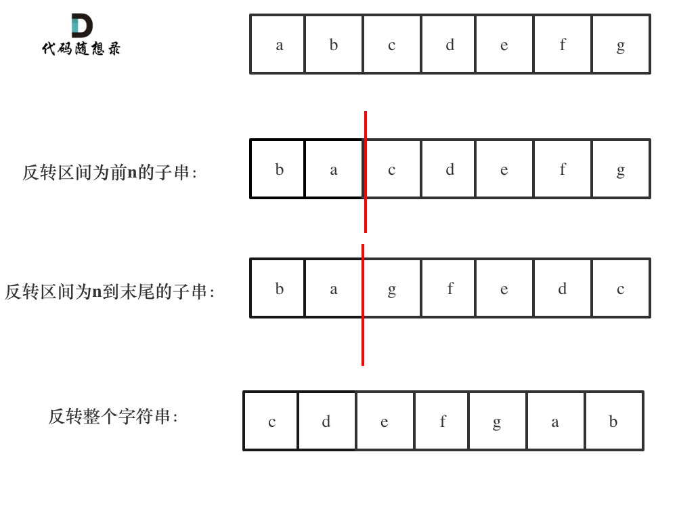
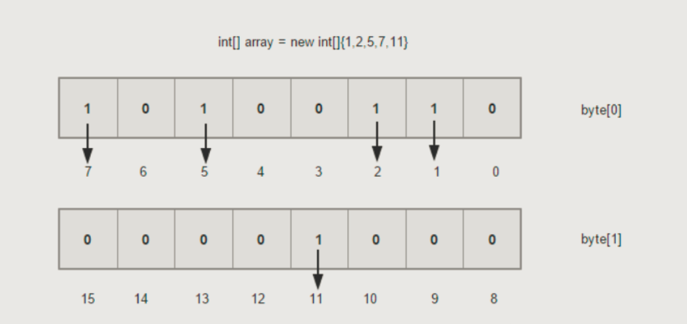

# 算法篇

## 链表

### 链表示例一：K个一组翻转链表

给你一个链表，每 k 个节点一组进行翻转，请你返回翻转后的链表。

k 是一个正整数，它的值小于或等于链表的长度。

如果节点总数不是 k 的整数倍，那么请将最后剩余的节点保持原有顺序。

进阶：

你可以设计一个只使用常数额外空间的算法来解决此问题吗？
你不能只是单纯的改变节点内部的值，而是需要实际进行节点交换。

示例 1：


输入：head = [1,2,3,4,5], k = 2
输出：[2,1,4,3,5]
示例 2：


输入：head = [1,2,3,4,5], k = 3
输出：[3,2,1,4,5]
示例 3：

输入：head = [1,2,3,4,5], k = 1
输出：[1,2,3,4,5]
示例 4：

输入：head = [1], k = 1
输出：[1]

C++代码：

```c++
/**
 * Definition for singly-linked list.
 * struct ListNode {
 *     int val;
 *     ListNode *next;
 *     ListNode() : val(0), next(nullptr) {}
 *     ListNode(int x) : val(x), next(nullptr) {}
 *     ListNode(int x, ListNode *next) : val(x), next(next) {}
 * };
 */
class Solution {
public:
    ListNode* reverseKGroup(ListNode* head, int k) {
        if (k == 1) return head;
        ListNode* dummyHead = new ListNode(0, head);
        ListNode* cur = dummyHead;
        while (cur->next) {
            int i = 0;
            ListNode* pre = cur;
            ListNode* tail = nullptr;
            ListNode* nextIter = nullptr;
            while (cur->next) {
                ++i;
                cur = cur->next;
                if (i == k) {
                    tail = cur->next;
                    break;
                }
            }
            if (i < k) break;
            cur = pre->next->next;
            nextIter = pre->next;
            pre->next->next = tail;
            ListNode* ptr = cur->next;
            while (i > 1) {
                cur->next = pre->next;
                pre->next = cur;
                cur = ptr;
                --i;
                if (ptr != nullptr) ptr = ptr->next;
            }
            cur = nextIter;
        }
        return dummyHead->next;
    }
};
```

### 链表示例二：链表相交

[面试题 02.07. 链表相交](https://leetcode-cn.com/problems/intersection-of-two-linked-lists-lcci/)

思路

A长度为 a, B长度为b， 假设存在交叉点，此时 A到交叉点距离为 c， 而B到交叉点距离为d
后续交叉后长度是一样的，那么就是 a-c = b-d -> a+d = b+c
这里意味着只要分别让A和B额外多走一遍B和A，那么必然会走到交叉，注意这里边缘情况是，大家都走到null依然没交叉，那么正好返回null即可。

如图：


```c++
class Solution {
public:
    ListNode *getIntersectionNode(ListNode *headA, ListNode *headB) {
        ListNode* cur1 = headA;
        ListNode* cur2 = headB;
        while (cur1 != cur2) {
            if (cur1 == nullptr) {
                cur1 = headB;
            } else {
                cur1 = cur1->next;
            }
            if (cur2 == nullptr) {
                cur2 = headA;
            } else {
                cur2 = cur2->next;
            }
        }
        return cur1;
    }
};
```


### 链表示例三：环形链表二

[142. 环形链表 II](https://leetcode-cn.com/problems/linked-list-cycle-ii/)

**思路**

这道题目，不仅考察对链表的操作，而且还需要一些数学运算。

主要考察两知识点：

- 判断链表是否环
- 如果有环，如何找到这个环的入口


**判断链表是否有环**

可以使用快慢指针法，分别定义 fast 和 slow 指针，从头结点出发，fast指针每次移动两个节点，slow指针每次移动一个节点，如果 fast 和 slow指针在途中相遇 ，说明这个链表有环。

为什么fast 走两个节点，slow走一个节点，有环的话，一定会在环内相遇呢，而不是永远的错开呢

首先第一点：**fast指针一定先进入环中，如果fast指针和slow指针相遇的话，一定是在环中相遇，这是毋庸置疑的。**

那么来看一下，**为什么fast指针和slow指针一定会相遇呢？**

可以画一个环，然后让 fast指针在任意一个节点开始追赶slow指针。

会发现最终都是这种情况， 如下图：


fast和slow各自再走一步， fast和slow就相遇了

这是因为fast是走两步，slow是走一步，**其实相对于slow来说，fast是一个节点一个节点的靠近slow的**，所以fast一定可以和slow重合。

动画如下：


**如果有环，如何找到这个环的入口**

**此时已经可以判断链表是否有环了，那么接下来要找这个环的入口了。**

假设从头结点到环形入口节点 的节点数为x。 环形入口节点到 fast指针与slow指针相遇节点 节点数为y。 从相遇节点 再到环形入口节点节点数为 z。 如图所示：


那么相遇时： slow指针走过的节点数为: `x + y`， fast指针走过的节点数：`x + y + n (y + z)`，n为fast指针在环内走了n圈才遇到slow指针， （y+z）为 一圈内节点的个数A。

因为fast指针是一步走两个节点，slow指针一步走一个节点， 所以 fast指针走过的节点数 = slow指针走过的节点数 * 2：

```
(x + y) * 2 = x + y + n (y + z)
```

两边消掉一个（x+y）: `x + y = n (y + z)`

因为要找环形的入口，那么要求的是x，因为x表示 头结点到 环形入口节点的的距离。

所以要求x ，将x单独放在左面：`x = n (y + z) - y` ,

再从n(y+z)中提出一个 （y+z）来，整理公式之后为如下公式：`x = (n - 1) (y + z) + z` 注意这里n一定是大于等于1的，因为 fast指针至少要多走一圈才能相遇slow指针。

这个公式说明什么呢？

先拿n为1的情况来举例，意味着fast指针在环形里转了一圈之后，就遇到了 slow指针了。

当 n为1的时候，公式就化解为 `x = z`，

这就意味着，**从头结点出发一个指针，从相遇节点 也出发一个指针，这两个指针每次只走一个节点， 那么当这两个指针相遇的时候就是 环形入口的节点**。

也就是在相遇节点处，定义一个指针index1，在头结点处定一个指针index2。

让index1和index2同时移动，每次移动一个节点， 那么他们相遇的地方就是 环形入口的节点。

动画如下：


那么 n如果大于1是什么情况呢，就是fast指针在环形转n圈之后才遇到 slow指针。

其实这种情况和n为1的时候 效果是一样的，一样可以通过这个方法找到 环形的入口节点，只不过，index1 指针在环里 多转了(n-1)圈，然后再遇到index2，相遇点依然是环形的入口节点。

代码如下：

```cpp
/**
 * Definition for singly-linked list.
 * struct ListNode {
 *     int val;
 *     ListNode *next;
 *     ListNode(int x) : val(x), next(NULL) {}
 * };
 */
class Solution {
public:
    ListNode *detectCycle(ListNode *head) {
        ListNode* fast = head;
        ListNode* slow = head;
        while(fast != NULL && fast->next != NULL) {
            slow = slow->next;
            fast = fast->next->next;
            // 快慢指针相遇，此时从head 和 相遇点，同时查找直至相遇
            if (slow == fast) {
                ListNode* index1 = fast;
                ListNode* index2 = head;
                while (index1 != index2) {
                    index1 = index1->next;
                    index2 = index2->next;
                }
                return index2; // 返回环的入口
            }
        }
        return NULL;
    }
};
```


## 字符串

### 字符串示例一：左反转字符串

[剑指 Offer 58 - II. 左旋转字符串](https://leetcode-cn.com/problems/zuo-xuan-zhuan-zi-fu-chuan-lcof/)

**思路**

为了让本题更有意义，提升一下本题难度：**不能申请额外空间，只能在本串上操作**。

不能使用额外空间的话，模拟在本串操作要实现左旋转字符串的功能还是有点困难的。

那么我们可以想一下上一题目[字符串：花式反转还不够！ (opens new window)](https://programmercarl.com/0151.翻转字符串里的单词.html)中讲过，使用整体反转+局部反转就可以实现，反转单词顺序的目的。

这道题目也非常类似，依然可以通过局部反转+整体反转 达到左旋转的目的。

具体步骤为：

1. 反转区间为前n的子串
2. 反转区间为n到末尾的子串
3. 反转整个字符串

最后就可以得到左旋n的目的，而不用定义新的字符串，完全在本串上操作。

例如 ：示例1中 输入：字符串abcdefg，n=2

如图：



最终得到左旋2个单元的字符串：cdefgab

思路明确之后，那么代码实现就很简单了

C++代码如下：

```cpp
class Solution {
public:
    string reverseLeftWords(string s, int n) {
        reverse(s.begin(), s.begin() + n);
        reverse(s.begin() + n, s.end());
        reverse(s.begin(), s.end());
        return s;
    }
};
```

是不是发现这代码也太简单了，哈哈。

### 字符串示例二：实现strstr()

[28. 实现 strStr()](https://leetcode-cn.com/problems/implement-strstr/)

参考Kmp算法原理。


## 栈与队列

### 适用场景

灵活运用栈与队列的数据结构特性，很多场景可以做到O(n)复杂度。

### 栈与队列示例一：滑动窗口最大值

deque实现的单调队列

这是使用单调队列的经典题目。

难点是如何求一个区间里的最大值呢？ （这好像是废话），暴力一下不就得了。

暴力方法，遍历一遍的过程中每次从窗口中在找到最大的数值，这样很明显是$O(n × k)$的算法。

有的同学可能会想用一个大顶堆（优先级队列）来存放这个窗口里的k个数字，这样就可以知道最大的最大值是多少了， **但是问题是这个窗口是移动的，而大顶堆每次只能弹出最大值，我们无法移除其他数值，这样就造成大顶堆维护的不是滑动窗口里面的数值了。所以不能用大顶堆。**

此时我们需要一个队列，这个队列呢，放进去窗口里的元素，然后随着窗口的移动，队列也一进一出，每次移动之后，队列告诉我们里面的最大值是什么。

这个队列应该长这个样子：

```text
class MyQueue {
public:
    void pop(int value) {
    }
    void push(int value) {
    }
    int front() {
        return que.front();
    }
};
```

每次窗口移动的时候，调用que.pop(滑动窗口中移除元素的数值)，que.push(滑动窗口添加元素的数值)，然后que.front()就返回我们要的最大值。

这么个队列香不香，要是有现成的这种数据结构是不是更香了！

**可惜了，没有！ 我们需要自己实现这么个队列。**

然后在分析一下，队列里的元素一定是要排序的，而且要最大值放在出队口，要不然怎么知道最大值呢。

但如果把窗口里的元素都放进队列里，窗口移动的时候，队列需要弹出元素。

那么问题来了，已经排序之后的队列 怎么能把窗口要移除的元素（这个元素可不一定是最大值）弹出呢。

大家此时应该陷入深思.....

**其实队列没有必要维护窗口里的所有元素，只需要维护有可能成为窗口里最大值的元素就可以了，同时保证队里里的元素数值是由大到小的。**

那么这个维护元素单调递减的队列就叫做**单调队列，即单调递减或单调递增的队列。C++中没有直接支持单调队列，需要我们自己来一个单调队列**

**不要以为实现的单调队列就是 对窗口里面的数进行排序，如果排序的话，那和优先级队列又有什么区别了呢。**

来看一下单调队列如何维护队列里的元素。

动画如下：


对于窗口里的元素{2, 3, 5, 1 ,4}，单调队列里只维护{5, 4} 就够了，保持单调队列里单调递减，此时队列出口元素就是窗口里最大元素。

此时大家应该怀疑单调队列里维护着{5, 4} 怎么配合窗口经行滑动呢？

设计单调队列的时候，pop，和push操作要保持如下规则：

1. pop(value)：如果窗口移除的元素value等于单调队列的出口元素，那么队列弹出元素，否则不用任何操作
2. push(value)：如果push的元素value大于入口元素的数值，那么就将队列入口的元素弹出，直到push元素的数值小于等于队列入口元素的数值为止

保持如上规则，每次窗口移动的时候，只要问que.front()就可以返回当前窗口的最大值。

为了更直观的感受到单调队列的工作过程，以题目示例为例，输入: nums = [1,3,-1,-3,5,3,6,7], 和 k = 3，动画如下：


那么我们用什么数据结构来实现这个单调队列呢？

使用deque最为合适，在文章[栈与队列：来看看栈和队列不为人知的一面 (opens new window)](https://programmercarl.com/栈与队列理论基础.html)中，我们就提到了常用的queue在没有指定容器的情况下，deque就是默认底层容器。

基于刚刚说过的单调队列pop和push的规则，代码不难实现，如下：

```cpp
class MyQueue { //单调队列（从大到小）
public:
    deque<int> que; // 使用deque来实现单调队列
    // 每次弹出的时候，比较当前要弹出的数值是否等于队列出口元素的数值，如果相等则弹出。
    // 同时pop之前判断队列当前是否为空。
    void pop(int value) {
        if (!que.empty() && value == que.front()) {
            que.pop_front();
        }
    }
    // 如果push的数值大于入口元素的数值，那么就将队列后端的数值弹出，直到push的数值小于等于队列入口元素的数值为止。
    // 这样就保持了队列里的数值是单调从大到小的了。
    void push(int value) {
        while (!que.empty() && value > que.back()) {
            que.pop_back();
        }
        que.push_back(value);

    }
    // 查询当前队列里的最大值 直接返回队列前端也就是front就可以了。
    int front() {
        return que.front();
    }
};
```

这样我们就用deque实现了一个单调队列，接下来解决滑动窗口最大值的问题就很简单了，直接看代码吧。

C++代码如下：

```cpp
class Solution {
private:
    class MyQueue { //单调队列（从大到小）
    public:
        deque<int> que; // 使用deque来实现单调队列
        // 每次弹出的时候，比较当前要弹出的数值是否等于队列出口元素的数值，如果相等则弹出。
        // 同时pop之前判断队列当前是否为空。
        void pop(int value) {
            if (!que.empty() && value == que.front()) {
                que.pop_front();
            }
        }
        // 如果push的数值大于入口元素的数值，那么就将队列后端的数值弹出，直到push的数值小于等于队列入口元素的数值为止。
        // 这样就保持了队列里的数值是单调从大到小的了。
        void push(int value) {
            while (!que.empty() && value > que.back()) {
                que.pop_back();
            }
            que.push_back(value);

        }
        // 查询当前队列里的最大值 直接返回队列前端也就是front就可以了。
        int front() {
            return que.front();
        }
    };
public:
    vector<int> maxSlidingWindow(vector<int>& nums, int k) {
        MyQueue que;
        vector<int> result;
        for (int i = 0; i < k; i++) { // 先将前k的元素放进队列
            que.push(nums[i]);
        }
        result.push_back(que.front()); // result 记录前k的元素的最大值
        for (int i = k; i < nums.size(); i++) {
            que.pop(nums[i - k]); // 滑动窗口移除最前面元素
            que.push(nums[i]); // 滑动窗口前加入最后面的元素
            result.push_back(que.front()); // 记录对应的最大值
        }
        return result;
    }
};
```

在来看一下时间复杂度，使用单调队列的时间复杂度是 $O(n)$。

有的同学可能想了，在队列中 push元素的过程中，还有pop操作呢，感觉不是纯粹的$O(n)$。

其实，大家可以自己观察一下单调队列的实现，nums 中的每个元素最多也就被 push_back 和 pop_back 各一次，没有任何多余操作，所以整体的复杂度还是 $O(n)$。

空间复杂度因为我们定义一个辅助队列，所以是$O(k)$。

**扩展**

大家貌似对单调队列 都有一些疑惑，首先要明确的是，题解中单调队列里的pop和push接口，仅适用于本题哈。单调队列不是一成不变的，而是不同场景不同写法，总之要保证队列里单调递减或递增的原则，所以叫做单调队列。 不要以为本地中的单调队列实现就是固定的写法哈。

大家貌似对deque也有一些疑惑，C++中deque是stack和queue默认的底层实现容器（这个我们之前已经讲过啦），deque是可以两边扩展的，而且deque里元素并不是严格的连续分布的。

### 栈与队列示例二：前K个高频元素

这道题目主要涉及到如下三块内容：

1. 要统计元素出现频率
2. 对频率排序
3. 找出前K个高频元素

首先统计元素出现的频率，这一类的问题可以使用map来进行统计。

然后是对频率进行排序，这里我们可以使用一种 容器适配器就是**优先级队列**。

什么是优先级队列呢？

其实**就是一个披着队列外衣的堆**，因为优先级队列对外接口只是从队头取元素，从队尾添加元素，再无其他取元素的方式，看起来就是一个队列。

而且优先级队列内部元素是自动依照元素的权值排列。那么它是如何有序排列的呢？

缺省情况下priority_queue利用max-heap（大顶堆）完成对元素的排序，这个大顶堆是以vector为表现形式的complete binary tree（完全二叉树）。

什么是堆呢？

**堆是一棵完全二叉树，树中每个结点的值都不小于（或不大于）其左右孩子的值。** 如果父亲结点是大于等于左右孩子就是大顶堆，小于等于左右孩子就是小顶堆。

所以大家经常说的大顶堆（堆头是最大元素），小顶堆（堆头是最小元素），如果懒得自己实现的话，就直接用priority_queue（优先级队列）就可以了，底层实现都是一样的，从小到大排就是小顶堆，从大到小排就是大顶堆。

本题我们就要使用优先级队列来对部分频率进行排序。

为什么不用快排呢， 使用快排要将map转换为vector的结构，然后对整个数组进行排序， 而这种场景下，我们其实只需要维护k个有序的序列就可以了，所以使用优先级队列是最优的。

此时要思考一下，是使用小顶堆呢，还是大顶堆？

有的同学一想，题目要求前 K 个高频元素，那么果断用大顶堆啊。

那么问题来了，定义一个大小为k的大顶堆，在每次移动更新大顶堆的时候，每次弹出都把最大的元素弹出去了，那么怎么保留下来前K个高频元素呢。

而且使用大顶堆就要把所有元素都进行排序，那能不能只排序k个元素呢？

**所以我们要用小顶堆，因为要统计最大前k个元素，只有小顶堆每次将最小的元素弹出，最后小顶堆里积累的才是前k个最大元素。**

寻找前k个最大元素流程如图所示：（图中的频率只有三个，所以正好构成一个大小为3的小顶堆，如果频率更多一些，则用这个小顶堆进行扫描）


我们来看一下C++代码：

```c++
class Solution {
public:
    vector<int> topKFrequent(vector<int>& nums, int k) {
        vector<int> ret(k, 0);
        unordered_map<int, int> umap;
        for (int i = 0; i < nums.size(); ++i) {
            umap[nums[i]]++;
        }
        using int_pair = pair<int, int>;
        auto cmp = [](const int_pair& a, const int_pair& b) {
            return a.second > b.second;
        };
        priority_queue<int_pair, vector<int_pair>, decltype(cmp)> pq(cmp);
        for (auto elem : umap) {
            pq.push(elem);
            if (pq.size() > k) pq.pop();
        }
        int size = pq.size();
        int i = 0;
        while (i < size) {
            ret[i] = pq.top().first;
            pq.pop();
            ++i;
        }
        return ret;
    }
};
```


## 哈希表

### 适用场景

需要快速查询的场景

### 哈希法示例一：两数之和

[两数之和](https://leetcode-cn.com/problems/two-sum/)

很明显暴力的解法是两层for循环查找，时间复杂度是$O(n^2)$。

建议大家做这道题目之前，先做一下这两道

- [242. 有效的字母异位词(opens new window)](https://www.programmercarl.com/0242.有效的字母异位词.html)
- [349. 两个数组的交集(opens new window)](https://www.programmercarl.com/0349.两个数组的交集.html)

[242. 有效的字母异位词 (opens new window)](https://www.programmercarl.com/0242.有效的字母异位词.html)这道题目是用数组作为哈希表来解决哈希问题，[349. 两个数组的交集 (opens new window)](https://www.programmercarl.com/0349.两个数组的交集.html)这道题目是通过set作为哈希表来解决哈希问题。

本题呢，则要使用map，那么来看一下使用数组和set来做哈希法的局限。

- 数组的大小是受限制的，而且如果元素很少，而哈希值太大会造成内存空间的浪费。
- set是一个集合，里面放的元素只能是一个key，而两数之和这道题目，不仅要判断y是否存在而且还要记录y的下标位置，因为要返回x 和 y的下标。所以set 也不能用。

此时就要选择另一种数据结构：map ，map是一种key value的存储结构，可以用key保存数值，用value在保存数值所在的下标。

C++中map，有三种类型：

| 映射               | 底层实现 | 是否有序 | 数值是否可以重复 | 能否更改数值 | 查询效率    | 增删效率    |
| ------------------ | -------- | -------- | ---------------- | ------------ | ----------- | ----------- |
| std::map           | 红黑树   | key有序  | key不可重复      | key不可修改  | $O(\log n)$ | $O(\log n)$ |
| std::multimap      | 红黑树   | key有序  | key可重复        | key不可修改  | $O(\log n)$ | $O(\log n)$ |
| std::unordered_map | 哈希表   | key无序  | key不可重复      | key不可修改  | $O(1)$      | $O(1)$      |

std::unordered_map 底层实现为哈希表，std::map 和std::multimap 的底层实现是红黑树。

同理，std::map 和std::multimap 的key也是有序的（这个问题也经常作为面试题，考察对语言容器底层的理解）。 更多哈希表的理论知识请看[关于哈希表，你该了解这些！ (opens new window)](https://www.programmercarl.com/哈希表理论基础.html)。

**这道题目中并不需要key有序，选择std::unordered_map 效率更高！**

解题思路动画如下：


C++代码：

```cpp
class Solution {
public:
    vector<int> twoSum(vector<int>& nums, int target) {
        std::unordered_map <int,int> map;
        for(int i = 0; i < nums.size(); i++) {
            auto iter = map.find(target - nums[i]);
            if(iter != map.end()) {
                return {iter->second, i};
            }
            map.insert(pair<int, int>(nums[i], i));
        }
        return {};
    }
};
```


## 二叉树

### 适用场景

二叉树


### 二叉树示例一：二叉树的最近公共祖先

[二叉树的最近公共祖先](https://leetcode-cn.com/problems/lowest-common-ancestor-of-a-binary-tree/)

**思路**

遇到这个题目首先想的是要是能自底向上查找就好了，这样就可以找到公共祖先了。

那么二叉树如何可以自底向上查找呢？

回溯啊，二叉树回溯的过程就是从低到上。

后序遍历就是天然的回溯过程，最先处理的一定是叶子节点。

接下来就看如何判断一个节点是节点q和节点p的公共公共祖先呢。

**如果找到一个节点，发现左子树出现结点p，右子树出现节点q，或者 左子树出现结点q，右子树出现节点p，那么该节点就是节点p和q的最近公共祖先。**

使用后序遍历，回溯的过程，就是从低向上遍历节点，一旦发现如何这个条件的节点，就是最近公共节点了。

递归三部曲：

- 确定递归函数返回值以及参数

需要递归函数返回值，来告诉我们是否找到节点q或者p，那么返回值为bool类型就可以了。

但我们还要返回最近公共节点，可以利用上题目中返回值是TreeNode * ，那么如果遇到p或者q，就把q或者p返回，返回值不为空，就说明找到了q或者p。

代码如下：

```text
TreeNode* lowestCommonAncestor(TreeNode* root, TreeNode* p, TreeNode* q)
```

- 确定终止条件

如果找到了 节点p或者q，或者遇到空节点，就返回。

代码如下：

```text
if (root == q || root == p || root == NULL) return root;
```

- 确定单层递归逻辑

值得注意的是 本题函数有返回值，是因为回溯的过程需要递归函数的返回值做判断，但本题我们依然要遍历树的所有节点。

我们在[二叉树：递归函数究竟什么时候需要返回值，什么时候不要返回值？ (opens new window)](https://programmercarl.com/0112.路径总和.html)中说了 递归函数有返回值就是要遍历某一条边，但有返回值也要看如何处理返回值！

如果递归函数有返回值，如何区分要搜索一条边，还是搜索整个树呢？

搜索一条边的写法：

```text
if (递归函数(root->left)) return ;

if (递归函数(root->right)) return ;
```

搜索整个树写法：

```text
left = 递归函数(root->left);
right = 递归函数(root->right);
left与right的逻辑处理;
```

看出区别了没？

**在递归函数有返回值的情况下：如果要搜索一条边，递归函数返回值不为空的时候，立刻返回，如果搜索整个树，直接用一个变量left、right接住返回值，这个left、right后序还有逻辑处理的需要，也就是后序遍历中处理中间节点的逻辑（也是回溯）**。

那么为什么要遍历整棵树呢？直观上来看，找到最近公共祖先，直接一路返回就可以了。

如图：


就像图中一样直接返回7，多美滋滋。

但事实上还要遍历根节点右子树（即使此时已经找到了目标节点了），也就是图中的节点4、15、20。

因为在如下代码的后序遍历中，如果想利用left和right做逻辑处理， 不能立刻返回，而是要等left与right逻辑处理完之后才能返回。

```text
left = 递归函数(root->left);
right = 递归函数(root->right);
left与right的逻辑处理;
```

所以此时大家要知道我们要遍历整棵树。知道这一点，对本题就有一定深度的理解了。

那么先用left和right接住左子树和右子树的返回值，代码如下：

```text
TreeNode* left = lowestCommonAncestor(root->left, p, q);
TreeNode* right = lowestCommonAncestor(root->right, p, q);
```

**如果left 和 right都不为空，说明此时root就是最近公共节点。这个比较好理解**

**如果left为空，right不为空，就返回right，说明目标节点是通过right返回的，反之依然**。

这里有的同学就理解不了了，为什么left为空，right不为空，目标节点通过right返回呢？

如图：


图中节点10的左子树返回null，右子树返回目标值7，那么此时节点10的处理逻辑就是把右子树的返回值（最近公共祖先7）返回上去！

这里点也很重要，可能刷过这道题目的同学，都不清楚结果究竟是如何从底层一层一层传到头结点的。

那么如果left和right都为空，则返回left或者right都是可以的，也就是返回空。

代码如下：

```cpp
if (left == NULL && right != NULL) return right;
else if (left != NULL && right == NULL) return left;
else  { //  (left == NULL && right == NULL)
    return NULL;
}
```

那么寻找最小公共祖先，完整流程图如下：


**从图中，大家可以看到，我们是如何回溯遍历整棵二叉树，将结果返回给头结点的！**

整体代码如下：

```cpp
class Solution {
public:
    TreeNode* lowestCommonAncestor(TreeNode* root, TreeNode* p, TreeNode* q) {
        if (root == q || root == p || root == NULL) return root;
        TreeNode* left = lowestCommonAncestor(root->left, p, q);
        TreeNode* right = lowestCommonAncestor(root->right, p, q);
        if (left != NULL && right != NULL) return root;

        if (left == NULL && right != NULL) return right;
        else if (left != NULL && right == NULL) return left;
        else  { //  (left == NULL && right == NULL)
            return NULL;
        }

    }
};
```

稍加精简，代码如下：

```cpp
class Solution {
public:
    TreeNode* lowestCommonAncestor(TreeNode* root, TreeNode* p, TreeNode* q) {
        if (root == q || root == p || root == NULL) return root;
        TreeNode* left = lowestCommonAncestor(root->left, p, q);
        TreeNode* right = lowestCommonAncestor(root->right, p, q);
        if (left != NULL && right != NULL) return root;
        if (left == NULL) return right;
        return left;
    }
};
```

**总结**

这道题目刷过的同学未必真正了解这里面回溯的过程，以及结果是如何一层一层传上去的。

**那么我给大家归纳如下三点**：

1. 求最小公共祖先，需要从底向上遍历，那么二叉树，只能通过后序遍历（即：回溯）实现从低向上的遍历方式。
2. 在回溯的过程中，必然要遍历整棵二叉树，即使已经找到结果了，依然要把其他节点遍历完，因为要使用递归函数的返回值（也就是代码中的left和right）做逻辑判断。
3. 要理解如果返回值left为空，right不为空为什么要返回right，为什么可以用返回right传给上一层结果。

可以说这里每一步，都是有难度的，都需要对二叉树，递归和回溯有一定的理解。

本题没有给出迭代法，因为迭代法不适合模拟回溯的过程。理解递归的解法就够了。


### 二叉树示例二：路径总和

[路径总和](https://leetcode-cn.com/problems/path-sum/)


### 二叉树示例三：完全二叉树的节点个数

[222. 完全二叉树的节点个数](https://leetcode-cn.com/problems/count-complete-tree-nodes/)

**思路**：二分查找+位运算


```c++
class Solution {
public:
    // 依据完全二叉树的特性，采用位运算+二分查找优化
    // 先序遍历得出二叉树高度，在算出最后一层的范围，然后在范围内二分查找
    int countNodes(TreeNode* root) {
        if (!root) return 0;
        TreeNode* cur = root;
        int n = 1;
        while (cur->left) {
            ++n;
            cur = cur->left;
        }
        int left = (1 << (n - 1));
        int right = (1 << n) - 1;
        while (left < right) {
            int mid = left + ((right - left) >> 1);
            if (exist(root, n, mid)) {
                left = mid + 1;
            } else {
                right = mid - 1;
            }
        }
        if (exist(root, n, left)) return left;
        else return left - 1;
    }
    bool exist(TreeNode* root, int n, int val) {
        for (int i = n - 2; i >= 0; --i) {
            if (val & (0x1 << i)) {
                root = root->right;
            } else {
                root = root->left;
            }
        }
        return root == nullptr ? false : true;
    }
};
```

复杂度分析：

* 时间复杂度：$O(\log^2 n)$

* 空间复杂度：$O(1)$


## 一、双指针法

### 适用场景

双指针法适用场景有：

* 数组问题
* 字符串问题
* 链表问题
* N数之和问题

### 双指针法示例一：三数之和

[三数之和](https://leetcode-cn.com/problems/3sum/)

**其实这道题目使用哈希法并不十分合适**，因为在去重的操作中有很多细节需要注意，在面试中很难直接写出没有bug的代码。

而且使用哈希法 在使用两层for循环的时候，能做的剪枝操作很有限，虽然时间复杂度是$O(n^2)$，也是可以在leetcode上通过，但是程序的执行时间依然比较长 。

接下来我来介绍另一个解法：双指针法，**这道题目使用双指针法 要比哈希法高效一些**，那么来讲解一下具体实现的思路。

动画效果如下：


拿这个nums数组来举例，首先将数组排序，然后有一层for循环，i从下标0的地方开始，同时定一个下标left 定义在i+1的位置上，定义下标right 在数组结尾的位置上。

依然还是在数组中找到 abc 使得a + b +c =0，我们这里相当于 a = nums[i] b = nums[left] c = nums[right]。

接下来如何移动left 和right呢， 如果nums[i] + nums[left] + nums[right] > 0 就说明 此时三数之和大了，因为数组是排序后了，所以right下标就应该向左移动，这样才能让三数之和小一些。

如果 nums[i] + nums[left] + nums[right] < 0 说明 此时 三数之和小了，left 就向右移动，才能让三数之和大一些，直到left与right相遇为止。

时间复杂度：$O(n^2)$。

C++代码代码如下：

```cpp
class Solution {
public:
    vector<vector<int>> threeSum(vector<int>& nums) {
        // 注意一定要先排序
        vector<vector<int>> result;
        sort(nums.begin(), nums.end());
        // 找出a + b + c = 0
        // a = nums[i], b = nums[left], c = nums[right]
        for (int i = 0; i < nums.size(); i++) {
            // 排序之后如果第一个元素已经大于零，那么无论如何组合都不可能凑成三元组，直接返回结果就可以了
            if (nums[i] > 0) {
                return result;
            }
            // 错误去重方法，将会漏掉-1,-1,2 这种情况
            /*
            if (nums[i] == nums[i + 1]) {
                continue;
            }
            */
            // 正确去重方法
            if (i > 0 && nums[i] == nums[i - 1]) {
                continue;
            }
            int left = i + 1;
            int right = nums.size() - 1;
            while (right > left) {
                // 去重复逻辑如果放在这里，0，0，0 的情况，可能直接导致 right<=left 了，从而漏掉了 0,0,0 这种三元组
                /*
                while (right > left && nums[right] == nums[right - 1]) right--;
                while (right > left && nums[left] == nums[left + 1]) left++;
                */
                if (nums[i] + nums[left] + nums[right] > 0) {
                    right--;
                } else if (nums[i] + nums[left] + nums[right] < 0) {
                    left++;
                } else {
                    result.push_back(vector<int>{nums[i], nums[left], nums[right]});
                    // 去重逻辑应该放在找到一个三元组之后
                    while (right > left && nums[right] == nums[right - 1]) right--;
                    while (right > left && nums[left] == nums[left + 1]) left++;

                    // 找到答案时，双指针同时收缩
                    right--;
                    left++;
                }
            }

        }
        return result;
    }
};
```

**思考题**

既然三数之和可以使用双指针法，我们之前讲过的[1.两数之和 (opens new window)](https://programmercarl.com/0001.两数之和.html)，可不可以使用双指针法呢？

如果不能，题意如何更改就可以使用双指针法呢？ **大家留言说出自己的想法吧！**

两数之和 就不能使用双指针法，因为[1.两数之和 (opens new window)](https://programmercarl.com/0001.两数之和.html)要求返回的是索引下标， 而双指针法一定要排序，一旦排序之后原数组的索引就被改变了。

如果[1.两数之和 (opens new window)](https://programmercarl.com/0001.两数之和.html)要求返回的是数值的话，就可以使用双指针法了。


### 双指针法示例二：判断子序列

[392. 判断子序列](https://leetcode-cn.com/problems/is-subsequence/)

```cpp
class Solution {
public:
    // 双指针法
    bool isSubsequence(string s, string t) {
        int sLen = s.length();
        int tLen = t.length();
        int sptr = 0;
        int tptr = 0;
        while (sptr < sLen && tptr < tLen) {
            if (s[sptr] == t[tptr]) ++sptr;
            ++tptr;
        }
        if (sptr == sLen) return true;
        else return false;
    }
};
```


## 一、回溯法

### 适用场景

* 组合问题
* 排列问题
* 分割问题
* 子集问题
* 棋盘问题

### 什么是回溯法

回溯法也可以叫做回溯搜索法，它是一种搜索的方式。

在二叉树系列中，我们已经不止一次，提到了回溯，例如[二叉树：以为使用了递归，其实还隐藏着回溯 (opens new window)](https://programmercarl.com/二叉树中递归带着回溯.html)。

回溯是递归的副产品，只要有递归就会有回溯。

**所以以下讲解中，回溯函数也就是递归函数，指的都是一个函数**。


### 回溯法的效率

回溯法的性能如何呢，这里要和大家说清楚了，**虽然回溯法很难，很不好理解，但是回溯法并不是什么高效的算法**。

**因为回溯的本质是穷举，穷举所有可能，然后选出我们想要的答案**，如果想让回溯法高效一些，可以加一些剪枝的操作，但也改不了回溯法就是穷举的本质。

那么既然回溯法并不高效为什么还要用它呢？

因为没得选，一些问题能暴力搜出来就不错了，撑死了再剪枝一下，还没有更高效的解法。

此时大家应该好奇了，都什么问题，这么牛逼，只能暴力搜索。


### 回溯法解决的问题

回溯法，一般可以解决如下几种问题：

- 组合问题：N个数里面按一定规则找出k个数的集合
- 切割问题：一个字符串按一定规则有几种切割方式
- 子集问题：一个N个数的集合里有多少符合条件的子集
- 排列问题：N个数按一定规则全排列，有几种排列方式
- 棋盘问题：N皇后，解数独等等

**相信大家看着这些之后会发现，每个问题，都不简单！**

另外，会有一些同学可能分不清什么是组合，什么是排列？

**组合是不强调元素顺序的，排列是强调元素顺序**。

例如：{1, 2} 和 {2, 1} 在组合上，就是一个集合，因为不强调顺序，而要是排列的话，{1, 2} 和 {2, 1} 就是两个集合了。

记住组合无序，排列有序，就可以了。


### 如何理解回溯法

**回溯法解决的问题都可以抽象为树形结构**，是的，我指的是所有回溯法的问题都可以抽象为树形结构！

因为回溯法解决的都是在集合中递归查找子集，**集合的大小就构成了树的宽度，递归的深度，都构成的树的深度**。

递归就要有终止条件，所以必然是一颗高度有限的树（N叉树）。

这块可能初学者还不太理解，后面的回溯算法解决的所有题目中，我都会强调这一点并画图举相应的例子，现在有一个印象就行。

### 回溯法模板

这里给出Carl总结的回溯算法模板。

在讲[二叉树的递归 (opens new window)](https://programmercarl.com/二叉树的递归遍历.html)中我们说了递归三部曲，这里我再给大家列出回溯三部曲。

- 回溯函数模板返回值以及参数

在回溯算法中，我的习惯是函数起名字为backtracking，这个起名大家随意。

回溯算法中函数返回值一般为void。

再来看一下参数，因为回溯算法需要的参数可不像二叉树递归的时候那么容易一次性确定下来，所以一般是先写逻辑，然后需要什么参数，就填什么参数。

但后面的回溯题目的讲解中，为了方便大家理解，我在一开始就帮大家把参数确定下来。

回溯函数伪代码如下：

```text
void backtracking(参数)
```


- 回溯函数终止条件

既然是树形结构，那么我们在讲解[二叉树的递归 (opens new window)](https://programmercarl.com/二叉树的递归遍历.html)的时候，就知道遍历树形结构一定要有终止条件。

所以回溯也有要终止条件。

什么时候达到了终止条件，树中就可以看出，一般来说搜到叶子节点了，也就找到了满足条件的一条答案，把这个答案存放起来，并结束本层递归。

所以回溯函数终止条件伪代码如下：

```text
if (终止条件) {
    存放结果;
    return;
}
```


- 回溯搜索的遍历过程

在上面我们提到了，回溯法一般是在集合中递归搜索，集合的大小构成了树的宽度，递归的深度构成的树的深度。

如图：


注意图中，我特意举例集合大小和孩子的数量是相等的！

回溯函数遍历过程伪代码如下：

```text
for (选择：本层集合中元素（树中节点孩子的数量就是集合的大小）) {
    处理节点;
    backtracking(路径，选择列表); // 递归
    回溯，撤销处理结果
}
```


for循环就是遍历集合区间，可以理解一个节点有多少个孩子，这个for循环就执行多少次。

backtracking这里自己调用自己，实现递归。

大家可以从图中看出**for循环可以理解是横向遍历，backtracking（递归）就是纵向遍历**，这样就把这棵树全遍历完了，一般来说，搜索叶子节点就是找的其中一个结果了。

分析完过程，回溯算法模板框架如下：

```text
void backtracking(参数) {
    if (终止条件) {
        存放结果;
        return;
    }

    for (选择：本层集合中元素（树中节点孩子的数量就是集合的大小）) {
        处理节点;
        backtracking(路径，选择列表); // 递归
        回溯，撤销处理结果
    }
}
```

**这份模板很重要，后面做回溯法的题目都靠它了！**

如果从来没有学过回溯算法的录友们，看到这里会有点懵，后面开始讲解具体题目的时候就会好一些了，已经做过回溯法题目的录友，看到这里应该会感同身受了

### 回溯法示例一：N皇后问题

[N 皇后](https://leetcode-cn.com/problems/n-queens/)

**如果对回溯算法基础还不了解的话，我还特意录制了一期视频：[带你学透回溯算法（理论篇） (opens new window)](https://www.bilibili.com/video/BV1cy4y167mM/)**可以结合题解和视频一起看，希望对大家理解回溯算法有所帮助。

都知道n皇后问题是回溯算法解决的经典问题，但是用回溯解决多了组合、切割、子集、排列问题之后，遇到这种二维矩阵还会有点不知所措。

首先来看一下皇后们的约束条件：

1. 不能同行
2. 不能同列
3. 不能同斜线

确定完约束条件，来看看究竟要怎么去搜索皇后们的位置，其实搜索皇后的位置，可以抽象为一棵树。

下面我用一个 3 * 3 的棋盘，将搜索过程抽象为一棵树，如图：


从图中，可以看出，二维矩阵中矩阵的高就是这棵树的高度，矩阵的宽就是树形结构中每一个节点的宽度。

那么我们用皇后们的约束条件，来回溯搜索这棵树，**只要搜索到了树的叶子节点，说明就找到了皇后们的合理位置了**。

**回溯三部曲**

按照我总结的如下回溯模板，我们来依次分析：

```text
void backtracking(参数) {
    if (终止条件) {
        存放结果;
        return;
    }
    for (选择：本层集合中元素（树中节点孩子的数量就是集合的大小）) {
        处理节点;
        backtracking(路径，选择列表); // 递归
        回溯，撤销处理结果
    }
}
```

- 递归函数参数

我依然是定义全局变量二维数组result来记录最终结果。

参数n是棋盘的大小，然后用row来记录当前遍历到棋盘的第几层了。

代码如下：

```cpp
vector<vector<string>> result;
void backtracking(int n, int row, vector<string>& chessboard) {
```

- 递归终止条件

在如下树形结构中： 

可以看出，当递归到棋盘最底层（也就是叶子节点）的时候，就可以收集结果并返回了。

代码如下：

```cpp
if (row == n) {
    result.push_back(chessboard);
    return;
}
```

- 单层搜索的逻辑

递归深度就是row控制棋盘的行，每一层里for循环的col控制棋盘的列，一行一列，确定了放置皇后的位置。

每次都是要从新的一行的起始位置开始搜，所以都是从0开始。

代码如下：

```cpp
for (int col = 0; col < n; col++) {
    if (isValid(row, col, chessboard, n)) { // 验证合法就可以放
        chessboard[row][col] = 'Q'; // 放置皇后
        backtracking(n, row + 1, chessboard);
        chessboard[row][col] = '.'; // 回溯，撤销皇后
    }
}
```

- 验证棋盘是否合法

按照如下标准去重：

1. 不能同行
2. 不能同列
3. 不能同斜线 （45度和135度角）

代码如下：

```cpp
bool isValid(int row, int col, vector<string>& chessboard, int n) {
    int count = 0;
    // 检查列
    for (int i = 0; i < row; i++) { // 这是一个剪枝
        if (chessboard[i][col] == 'Q') {
            return false;
        }
    }
    // 检查 45度角是否有皇后
    for (int i = row - 1, j = col - 1; i >=0 && j >= 0; i--, j--) {
        if (chessboard[i][j] == 'Q') {
            return false;
        }
    }
    // 检查 135度角是否有皇后
    for(int i = row - 1, j = col + 1; i >= 0 && j < n; i--, j++) {
        if (chessboard[i][j] == 'Q') {
            return false;
        }
    }
    return true;
}
```

在这份代码中，细心的同学可以发现为什么没有在同行进行检查呢？

因为在单层搜索的过程中，每一层递归，只会选for循环（也就是同一行）里的一个元素，所以不用去重了。

那么按照这个模板不难写出如下C++代码：

```cpp
class Solution {
private:
vector<vector<string>> result;
// n 为输入的棋盘大小
// row 是当前递归到棋盘的第几行了
void backtracking(int n, int row, vector<string>& chessboard) {
    if (row == n) {
        result.push_back(chessboard);
        return;
    }
    for (int col = 0; col < n; col++) {
        if (isValid(row, col, chessboard, n)) { // 验证合法就可以放
            chessboard[row][col] = 'Q'; // 放置皇后
            backtracking(n, row + 1, chessboard);
            chessboard[row][col] = '.'; // 回溯，撤销皇后
        }
    }
}
bool isValid(int row, int col, vector<string>& chessboard, int n) {
    int count = 0;
    // 检查列
    for (int i = 0; i < row; i++) { // 这是一个剪枝
        if (chessboard[i][col] == 'Q') {
            return false;
        }
    }
    // 检查 45度角是否有皇后
    for (int i = row - 1, j = col - 1; i >=0 && j >= 0; i--, j--) {
        if (chessboard[i][j] == 'Q') {
            return false;
        }
    }
    // 检查 135度角是否有皇后
    for(int i = row - 1, j = col + 1; i >= 0 && j < n; i--, j++) {
        if (chessboard[i][j] == 'Q') {
            return false;
        }
    }
    return true;
}
public:
    vector<vector<string>> solveNQueens(int n) {
        result.clear();
        std::vector<std::string> chessboard(n, std::string(n, '.'));
        backtracking(n, 0, chessboard);
        return result;
    }
};
```

可以看出，除了验证棋盘合法性的代码，省下来部分就是按照回溯法模板来的。

**总结**

本题是我们解决棋盘问题的第一道题目。

如果从来没有接触过N皇后问题的同学看着这样的题会感觉无从下手，可能知道要用回溯法，但也不知道该怎么去搜。

**这里我明确给出了棋盘的宽度就是for循环的长度，递归的深度就是棋盘的高度，这样就可以套进回溯法的模板里了**。

大家可以在仔细体会体会！

## 二、贪心法

### 核心思想

核心思想：局部最优推出全局最优，并且找不到反例，就可以试试贪心！

### 适用场景

当通过局部最优可以推出全局最优时，详细的理论证明很困难，所以更多情况下是凭感觉。

### 什么是贪心

**贪心的本质是选择每一阶段的局部最优，从而达到全局最优**。

这么说有点抽象，来举一个例子：

例如，有一堆钞票，你可以拿走十张，如果想达到最大的金额，你要怎么拿？

指定每次拿最大的，最终结果就是拿走最大数额的钱。

每次拿最大的就是局部最优，最后拿走最大数额的钱就是推出全局最优。

再举一个例子如果是 有一堆盒子，你有一个背包体积为n，如何把背包尽可能装满，如果还每次选最大的盒子，就不行了。这时候就需要动态规划。动态规划的问题在下一个系列会详细讲解。

### 贪心的套路（什么时候用贪心）

很多同学做贪心的题目的时候，想不出来是贪心，想知道有没有什么套路可以一看就看出来是贪心。

**说实话贪心算法并没有固定的套路**。

所以唯一的难点就是如何通过局部最优，推出整体最优。

那么如何能看出局部最优是否能推出整体最优呢？有没有什么固定策略或者套路呢？

**不好意思，也没有！** 靠自己手动模拟，如果模拟可行，就可以试一试贪心策略，如果不可行，可能需要动态规划。

有同学问了如何验证可不可以用贪心算法呢？

**最好用的策略就是举反例，如果想不到反例，那么就试一试贪心吧**。

可有有同学认为手动模拟，举例子得出的结论不靠谱，想要严格的数学证明。

一般数学证明有如下两种方法：

- 数学归纳法
- 反证法

看教课书上讲解贪心可以是一堆公式，估计大家连看都不想看，所以数学证明就不在我要讲解的范围内了，大家感兴趣可以自行查找资料。

**面试中基本不会让面试者现场证明贪心的合理性，代码写出来跑过测试用例即可，或者自己能自圆其说理由就行了**。

举一个不太恰当的例子：我要用一下1+1 = 2，但我要先证明1+1 为什么等于2。严谨是严谨了，但没必要。

虽然这个例子很极端，但可以表达这么个意思：**刷题或者面试的时候，手动模拟一下感觉可以局部最优推出整体最优，而且想不到反例，那么就试一试贪心**。

**例如刚刚举的拿钞票的例子，就是模拟一下每次拿最大的，最后就能拿到最多的钱，这还要数学证明的话，其实就不在算法面试的范围内了，可以看看专业的数学书籍！**

所以这也是为什么很多同学通过（accept）了贪心的题目，但都不知道自己用了贪心算法，**因为贪心有时候就是常识性的推导，所以会认为本应该就这么做！**

**那么刷题的时候什么时候真的需要数学推导呢？**

例如这道题目：[链表：环找到了，那入口呢？ (opens new window)](https://programmercarl.com/0142.环形链表II.html)，这道题不用数学推导一下，就找不出环的起始位置，想试一下就不知道怎么试，这种题目确实需要数学简单推导一下。

### 贪心一般解题步骤

贪心算法一般分为如下四步：

- 将问题分解为若干个子问题
- 找出适合的贪心策略
- 求解每一个子问题的最优解
- 将局部最优解堆叠成全局最优解

其实这个分的有点细了，真正做题的时候很难分出这么详细的解题步骤，可能就是因为贪心的题目往往还和其他方面的知识混在一起。

### 总结

本篇给出了什么是贪心以及大家关心的贪心算法固定套路。

**不好意思了，贪心没有套路，说白了就是常识性推导加上举反例**。

最后给出贪心的一般解题步骤，大家可以发现这个解题步骤也是比较抽象的，不像是二叉树，回溯算法，给出了那么具体的解题套路和模板。


## 三、动态规划法

### 适用场景


### 什么是动态规划

动态规划，英文：Dynamic Programming，简称DP，如果某一问题有很多重叠子问题，使用动态规划是最有效的。

所以动态规划中每一个状态一定是由上一个状态推导出来的，**这一点就区分于贪心**，贪心没有状态推导，而是从局部直接选最优的，

在[关于贪心算法，你该了解这些！ (opens new window)](https://mp.weixin.qq.com/s/A9MHJi1a5uugFaqp8QJFWg)中我举了一个背包问题的例子。

例如：有N件物品和一个最多能背重量为W 的背包。第i件物品的重量是weight[i]，得到的价值是value[i] 。**每件物品只能用一次**，求解将哪些物品装入背包里物品价值总和最大。

动态规划中dp[j]是由dp[j-weight[i]]推导出来的，然后取max(dp[j], dp[j - weight[i]] + value[i])。

但如果是贪心呢，每次拿物品选一个最大的或者最小的就完事了，和上一个状态没有关系。

所以贪心解决不了动态规划的问题。

**其实大家也不用死扣动规和贪心的理论区别，后面做做题目自然就知道了**。

而且很多讲解动态规划的文章都会讲最优子结构啊和重叠子问题啊这些，这些东西都是教科书的上定义，晦涩难懂而且不实用。

大家知道动规是由前一个状态推导出来的，而贪心是局部直接选最优的，对于刷题来说就够用了。

上述提到的背包问题，后序会详细讲解。

### 动态规划的解题步骤

做动规题目的时候，很多同学会陷入一个误区，就是以为把状态转移公式背下来，照葫芦画瓢改改，就开始写代码，甚至把题目AC之后，都不太清楚dp[i]表示的是什么。

**这就是一种朦胧的状态，然后就把题给过了，遇到稍稍难一点的，可能直接就不会了，然后看题解，然后继续照葫芦画瓢陷入这种恶性循环中**。

状态转移公式（递推公式）是很重要，但动规不仅仅只有递推公式。

**对于动态规划问题，我将拆解为如下五步曲，这五步都搞清楚了，才能说把动态规划真的掌握了！**

1. 确定dp数组（dp table）以及下标的含义
2. 确定递推公式
3. dp数组如何初始化
4. 确定遍历顺序
5. 举例推导dp数组

一些同学可能想为什么要先确定递推公式，然后在考虑初始化呢？

**因为一些情况是递推公式决定了dp数组要如何初始化！**

后面的讲解中我都是围绕着这五点来进行讲解。

可能刷过动态规划题目的同学可能都知道递推公式的重要性，感觉确定了递推公式这道题目就解出来了。

其实 确定递推公式 仅仅是解题里的一步而已！

一些同学知道递推公式，但搞不清楚dp数组应该如何初始化，或者正确的遍历顺序，以至于记下来公式，但写的程序怎么改都通过不了。

后序的讲解的大家就会慢慢感受到这五步的重要性了。

### 动态规划应该如何debug

相信动规的题目，很大部分同学都是这样做的。

看一下题解，感觉看懂了，然后照葫芦画瓢，如果能正好画对了，万事大吉，一旦要是没通过，就怎么改都通过不了，对 dp数组的初始化，递推公式，遍历顺序，处于一种黑盒的理解状态。

写动规题目，代码出问题很正常！

**找问题的最好方式就是把dp数组打印出来，看看究竟是不是按照自己思路推导的！**

一些同学对于dp的学习是黑盒的状态，就是不清楚dp数组的含义，不懂为什么这么初始化，递推公式背下来了，遍历顺序靠习惯就是这么写的，然后一鼓作气写出代码，如果代码能通过万事大吉，通过不了的话就凭感觉改一改。

这是一个很不好的习惯！

**做动规的题目，写代码之前一定要把状态转移在dp数组的上具体情况模拟一遍，心中有数，确定最后推出的是想要的结果**。

然后再写代码，如果代码没通过就打印dp数组，看看是不是和自己预先推导的哪里不一样。

如果打印出来和自己预先模拟推导是一样的，那么就是自己的递归公式、初始化或者遍历顺序有问题了。

如果和自己预先模拟推导的不一样，那么就是代码实现细节有问题。

**这样才是一个完整的思考过程，而不是一旦代码出问题，就毫无头绪的东改改西改改，最后过不了，或者说是稀里糊涂的过了**。

这也是我为什么在动规五步曲里强调推导dp数组的重要性。

举个例子哈：在「代码随想录」刷题小分队微信群里，一些录友可能代码通过不了，会把代码抛到讨论群里问：我这里代码都已经和题解一模一样了，为什么通过不了呢？

发出这样的问题之前，其实可以自己先思考这三个问题：

- 这道题目我举例推导状态转移公式了么？
- 我打印dp数组的日志了么？
- 打印出来了dp数组和我想的一样么？

**如果这灵魂三问自己都做到了，基本上这道题目也就解决了**，或者更清晰的知道自己究竟是哪一点不明白，是状态转移不明白，还是实现代码不知道该怎么写，还是不理解遍历dp数组的顺序。

然后在问问题，目的性就很强了，群里的小伙伴也可以快速知道提问者的疑惑了。

**注意这里不是说不让大家问问题哈， 而是说问问题之前要有自己的思考，问题要问到点子上！**

**大家工作之后就会发现，特别是大厂，问问题是一个专业活，是的，问问题也要体现出专业！**

如果问同事很不专业的问题，同事们会懒的回答，领导也会认为你缺乏思考能力，这对职场发展是很不利的。

所以大家在刷题的时候，就锻炼自己养成专业提问的好习惯。

### 总结

这一篇是动态规划的整体概述，讲解了什么是动态规划，动态规划的解题步骤，以及如何debug。

动态规划是一个很大的领域，今天这一篇讲解的内容是整个动态规划系列中都会使用到的一些理论基础。

在后序讲解中针对某一具体问题，还会讲解其对应的理论基础，例如背包问题中的01背包，leetcode上的题目都是01背包的应用，而没有纯01背包的问题，那么就需要在把对应的理论知识讲解一下。

大家会发现，我讲解的理论基础并不是教科书上各种动态规划的定义，错综复杂的公式。

这里理论基础篇已经是非常偏实用的了，每个知识点都是在解题实战中非常有用的内容，大家要重视起来哈。

### 01背包问题

一维数组写法：

```c++
int zeroOneBagProblem(const vector<int>& weights, const vector<int>& values, int capacity) {
    int size = weights.size();
    vector<int> dp(capacity + 1, 0);
    dp[0] = 0;
    for (int i = 0; i < size; ++i) {
        for (int j = capacity; j >= weights[i]; --j) {
            dp[j] = max(dp[j], dp[j - weights[i]] + values[i]);
        }
    }
    return dp[capacity];
}

int main() {
    vector<int> weights{ 1, 3, 4 };
    vector<int> values{ 15, 20, 30 };
    int capacity = 4;
    int ret = zeroOneBagProblem(weights, values, capacity);
    cout << ret << endl;
} 
```


二维数组写法：

```c++
int zeroOneBagProblem(const vector<int>& weights, const vector<int>& values, int capacity) {
    int size = weights.size();
    vector<vector<int>> dp(size, vector<int>(capacity + 1, 0));

    for (int j = weights[0]; j <= capacity; ++j) {
        dp[0][j] = values[0];
    }

    for (int i = 1; i < size; ++i) {
        for (int j = 0; j <= capacity; ++j) {
            if (j - weights[i] >= 0) {
                dp[i][j] = max(dp[i - 1][j], dp[i - 1][j - weights[i]] + values[i]);
            }
            else {
                dp[i][j] = dp[i - 1][j];
            }
        }
    }
    return dp[size - 1][capacity];
}

int main() {
    vector<int> weights{ 1, 3, 4 };
    vector<int> values{ 15, 20, 30 };
    int capacity = 4;
    int ret = zeroOneBagProblem(weights, values, capacity);
    cout << ret << endl;
}
```


### 完全背包问题

> **完全背包和01背包问题唯一不同的地方就是，每种物品有无限件**。
>
> 首先在回顾一下01背包的核心代码
>
> ```c++
> for(int i = 0; i < weight.size(); i++) { // 遍历物品
>  for(int j = bagWeight; j >= weight[i]; j--) { // 遍历背包容量
>      dp[j] = max(dp[j], dp[j - weight[i]] + value[i]);
>  }
> }
> ```
>
> 我们知道01背包内嵌的循环是从大到小遍历，为了保证每个物品仅被添加一次。
>
> 而完全背包的物品是可以添加多次的，所以要从小到大去遍历，即：
>
> ```cpp
> // 先遍历物品，再遍历背包
> for(int i = 0; i < weight.size(); i++) { // 遍历物品
>  for(int j = weight[i]; j < bagWeight ; j++) { // 遍历背包容量
>      dp[j] = max(dp[j], dp[j - weight[i]] + value[i]);
>  }
> }
> ```


一维数组写法：

**写法一：先遍历物品，再遍历背包容量：**

> 该方法算出来的是组合数，因为物品在外层循环，只会被遍历一次

```c++
int completeBagProblem(const vector<int>& weights, const vector<int>& values, int capacity) {
    int size = weights.size();
    vector<int> dp(capacity + 1, 0);
    dp[0] = 0;
    for (int i = 0; i < size; ++i) {
        for (int j = weights[i]; j <= capacity; ++j) {
            dp[j] = max(dp[j], dp[j - weights[i]] + values[i]);
        }
    }
    return dp[capacity];
}

int main() {
    vector<int> weights{ 1, 3, 4 };
    vector<int> values{ 15, 20, 30 };
    int capacity = 4;
    int ret = completeBagProblem(weights, values, capacity);
    cout << ret << endl;
}

```


**写法二：先遍历背包容量，再遍历物品：**

> 该方法算出来的是排列数，因为物品在内层循环，会被遍历多次

```c++
int completeBagProblem(const vector<int>& weights, const vector<int>& values, int capacity) {
    int size = weights.size();
    vector<int> dp(capacity + 1, 0);
    dp[0] = 0;
    for (int j = 0; j <= capacity; ++j) {
        for (int i = 0; i < size; ++i) {
            if (j - weights[i] >= 0) {
                dp[j] = max(dp[j], dp[j - weights[i]] + values[i]);
            }
        }
    }
    return dp[capacity];
}

int main() {
    vector<int> weights{ 1, 3, 4 };
    vector<int> values{ 15, 20, 30 };
    int capacity = 4;
    int ret = completeBagProblem(weights, values, capacity);
    cout << ret << endl;
}
```

### 动态规划示例一：正则表达式匹配

[面试题19. 正则表达式匹配](https://leetcode-cn.com/problems/zheng-ze-biao-da-shi-pi-pei-lcof/)

题目中的匹配是一个「逐步匹配」的过程：我们每次从字符串 p 中取出一个字符或者「字符 + 星号」的组合，并在 s 中进行匹配。对于 p 中一个字符而言，它只能在 s 中匹配一个字符，匹配的方法具有唯一性；而对于 p 中字符 + 星号的组合而言，它可以在 s 中匹配任意自然数个字符，并不具有唯一性。因此我们可以考虑使用动态规划，对匹配的方案进行枚举。

动态规划五部曲分析如下：

1. 确定dp数组（dp table）以及下标的含义

**dp\[i][j]表示以下标 i 为结尾的字符串s，和以下标 j 为结尾的字符串p，是否能够进行匹配。**

2. 确定递推公式

对于 p 中第 j 个字符，

如果p[j]不为'*'，那么正常匹配：
$$
\begin{equation}
dp[i][j] = \begin{cases}
	dp[i-1][j-1] & matches(s[i],p[j])\\
	false & otherwise
	\end{cases}
\end{equation}
$$
如果p[j]为'*'，那么需要考虑字母和星号的组合在匹配过程中，会有两种情况：

* 若p[j-1]与s[i]匹配，有两种情况，一种是匹配 s 末尾的一个字符，而该组合还可以继续匹配，即dp\[i-1][j]；另一种是虽然匹配的上，但是由于是'*'，所以有可能不用这次匹配，即dp\[i][j-2]。
* 若p[j-1]与s[i]不匹配，则不使用该组合，即dp\[i][j-2]。

$$
\begin{equation}
dp[i][j] = \begin{cases}
	dp[i][j-2] 逻辑或 dp[i-1][j] & matches(s[i],p[j-1])\\
	dp[i][j-2] & otherwise
	\end{cases}
\end{equation}
$$

最终的状态转移方程为：
$$
\begin{equation}
dp[i][j] = \begin{cases}
	\text{if(p[j] == '*')} = \begin{cases}
								dp[i][j-2] 逻辑或 dp[i-1][j] & matches(s[i],p[j-1])\\
								dp[i][j-2] & otherwise
							\end{cases}\\
	\text{otherwise} = \begin{cases}
						dp[i-1][j-1] & matches(s[i],p[j])\\
						false & otherwise
						\end{cases}
	\end{cases}
\end{equation}
$$

> 其中matches是判断两个字符是否匹配的辅助函数，只有当`y`是`'.'`或者`x`和`y`本身相同时，这两个字符才匹配。

3. dp数组如何初始化

两个空字符串是可以匹配的，所以dp\[0][0]=true，

当s为空串时，p为非空时，由于p中可能含'*'，因为有可能匹配成功，所以dp\[0][j]直接放进循环体即可；

当s非空，p为空串时，肯定匹配不成功，初始化为false即可。

4. 确定遍历顺序

可以看出dp\[i][j]是依赖于dp\[i][j-2]，dp\[i-1][j]，dp\[i-1][j-1]的，所以从上到下，从左到右遍历即可。

5. 举例推导dp数组


由于dp\[i][j]表示长度为 i 的字符串 s 是否能匹配长度为 j 的字符串 p，所以程序返回结果即dp\[i][j]，dp\[i][j]==true表示可以匹配成功。

动规五部曲分析完成。C++代码如下：

```c++
class Solution {
public:
    // 动态规划法
    bool isMatch(string s, string p) {
        auto matches = [&](int i, int j) {
            if (i == 0) return false;
            if ((p[j - 1] == '.') || (s[i - 1] == p[j - 1])) return true;
            return false;
        };
        vector<vector<bool>> dp(s.length() + 1, vector<bool>(p.length() + 1, 0));
        dp[0][0] = true;
        for (int i = 0; i <= s.length(); ++i) {
            for (int j = 1; j <= p.length(); ++j) {
                if (p[j - 1] == '*') {
                    dp[i][j] = dp[i][j] || dp[i][j - 2];
                    if (matches(i, j - 1)) {
                        dp[i][j] = dp[i][j] || dp[i - 1][j];
                    }
                } else {
                    if (matches(i, j)) {
                        dp[i][j] = dp[i - 1][j - 1];
                    }
                }
            }
        }
        return dp[s.length()][p.length()];
    }
};
```


### 动态规划示例二：最长上升子序列

[300. 最长递增子序列](https://leetcode-cn.com/problems/longest-increasing-subsequence/)

最长上升子序列是动规的经典题目，这里dp[i]是可以根据dp[j] （j < i）推导出来的，那么依然用动规五部曲来分析详细一波：

1. dp[i]的定义

**dp[i]表示i之前包括i的最长上升子序列的长度**。注意：这个定义中 **`nums[i]` 必须被选取，且必须是这个子序列的最后一个元素**；

基于「动态规划」的状态设计需要满足「无后效性」的设计思想，可以将状态定义为「以 nums[i] 结尾 的「上升子序列」的长度」。

> 「无后效性」的设计思想：让不确定的因素确定下来，以保证求解的过程形成一个逻辑上的有向无环图。这题不确定的因素是某个元素是否被选中，而我们设计状态的时候，让 nums[i] 必需被选中，这一点是「让不确定的因素确定下来」，也是我们这样设计状态的原因。

1. 状态转移方程

位置i的最长升序子序列等于j从0到i-1各个位置的最长升序子序列 + 1 的最大值。

所以：if (nums[i] > nums[j]) dp[i] = max(dp[i], dp[j] + 1);

**注意这里不是要dp[i] 与 dp[j] + 1进行比较，而是我们要取dp[j] + 1的最大值**。

1. dp[i]的初始化

每一个i，对应的dp[i]（即最长上升子序列）起始大小至少都是1.

1. 确定遍历顺序

dp[i] 是有0到i-1各个位置的最长升序子序列 推导而来，那么遍历i一定是从前向后遍历。

j其实就是0到i-1，遍历i的循环在外层，遍历j则在内层，代码如下：

```cpp
for (int i = 1; i < nums.size(); i++) {
    for (int j = 0; j < i; j++) {
        if (nums[i] > nums[j]) dp[i] = max(dp[i], dp[j] + 1);
    }
    if (dp[i] > result) result = dp[i]; // 取长的子序列
}
```

1. 举例推导dp数组

输入：[0,1,0,3,2]，dp数组的变化如下：


> 注意：本题的最终结果并不是dp[size - 1]，所以需要一个变量 result 来存储最终答案。

如果代码写出来，但一直AC不了，那么就把dp数组打印出来，看看对不对！

以上五部分析完毕，C++代码如下：

```cpp
class Solution {
public:
    int lengthOfLIS(vector<int>& nums) {
        if (nums.size() <= 1) return nums.size();
        vector<int> dp(nums.size(), 1);
        int result = 0;
        for (int i = 1; i < nums.size(); i++) {
            for (int j = 0; j < i; j++) {
                if (nums[i] > nums[j]) dp[i] = max(dp[i], dp[j] + 1);
            }
            if (dp[i] > result) result = dp[i]; // 取长的子序列
        }
        return result;
    }
};
```

**总结**

本题最关键的是要想到dp[i]由哪些状态可以推出来，并取最大值，那么很自然就能想到递推公式：dp[i] = max(dp[i], dp[j] + 1);

复杂度分析：

时间复杂度：O(n2)，双层遍历

空间复杂度：O(n)


### 动态规划示例三：最长上升子序列（优化）

**动态规划+二分查找**
很具小巧思。新建数组 cell，用于保存最长上升子序列。

对原序列进行遍历，将每位元素二分插入 cell 中。

如果 cell 中元素都比它小，将它插到最后
否则，用它覆盖掉大于等于它的元素中最小的那个。
总之，思想就是让 cell 中存储比较小的元素。这样，cell 未必是真实的最长上升子序列，但长度是对的。

C++代码如下：

```cpp
class Solution {
public:
    int lengthOfLIS(vector<int>& nums) {
        int size = nums.size();
        if (size == 1) return size;
        vector<int> cell;
        cell.push_back(nums[0]);
        for (int i = 1; i < size; ++i) {
            if (nums[i] > cell[cell.size() - 1]) {
                cell.push_back(nums[i]);
            } else {
                int left = 0;
                int right = cell.size() - 1;
                while (left < right) {
                    int mid = left + ((right - left) >> 1);
                    if (cell[mid] < nums[i]) {
                        left = mid + 1;
                    } else {
                        right = mid;
                    }
                }
                cell[left] = nums[i];
            }
        }
        return cell.size();
    }
};
```

复杂度分析：

时间复杂度：O(nlogn)

空间复杂度：O(n)


### 动态规划示例四：最大子序和

[最大子数组和](https://leetcode-cn.com/problems/maximum-subarray/)

```cpp
class Solution {
public:
    int maxSubArray(vector<int>& nums) {
        int size = nums.size();
        vector<int> dp(size, 0);
        dp[0] = nums[0];
        int ret = dp[0];
        for (int i = 1; i < size; ++i) {
            if (nums[i] + dp[i - 1] <= 0) {
                dp[i] = nums[i];
            } else {
                dp[i] = max(dp[i - 1] + nums[i], nums[i]);
            }
            ret = max(ret, dp[i]);
        }
        return ret;
    }
};
```


### 动态规划示例五：最长公共子序列

[1143. 最长公共子序列](https://leetcode-cn.com/problems/longest-common-subsequence/)

```cpp
class Solution {
public:
    int longestCommonSubsequence(string text1, string text2) {
        vector<vector<int>> dp(text1.length() + 1, vector<int>(text2.length() + 1, 0));
        for (int i = 1; i <= text1.length(); ++i) {
            for (int j = 1; j <= text2.length(); ++j) {
                if (text1[i - 1] == text2[j - 1]) {
                    dp[i][j] = dp[i - 1][j - 1] + 1;
                } else {
                    dp[i][j] = max(dp[i - 1][j], dp[i][j - 1]);
                }
            }
        }
        return dp[text1.length()][text2.length()];
    }
};
```


### 动态规划示例六：买卖股票的最佳时机

给定一个数组 prices ，它的第 i 个元素 prices[i] 表示一支给定股票第 i 天的价格。

你只能选择 某一天 买入这只股票，并选择在 未来的某一个不同的日子 卖出该股票。设计一个算法来计算你所能获取的最大利润。

返回你可以从这笔交易中获取的最大利润。如果你不能获取任何利润，返回 0 。


示例 1：

输入：[7,1,5,3,6,4]
输出：5
解释：在第 2 天（股票价格 = 1）的时候买入，在第 5 天（股票价格 = 6）的时候卖出，最大利润 = 6-1 = 5 。
     注意利润不能是 7-1 = 6, 因为卖出价格需要大于买入价格；同时，你不能在买入前卖出股票。
示例 2：

输入：prices = [7,6,4,3,1]
输出：0
解释：在这种情况下, 没有交易完成, 所以最大利润为 0。


提示：

1 <= prices.length <= 105
0 <= prices[i] <= 104


动规五部曲分析如下：

1. 确定dp数组（dp table）以及下标的含义

dp\[i][0] 表示第i天持有股票所得最多现金 ，**这里可能有同学疑惑，本题中只能买卖一次，持有股票之后哪还有现金呢？**

其实一开始现金是0，那么加入第i天买入股票现金就是 -prices[i]， 这是一个负数。

dp\[i][1] 表示第i天不持有股票所得最多现金

**注意这里说的是“持有”，“持有”不代表就是当天“买入”！也有可能是昨天就买入了，今天保持持有的状态**

很多同学把“持有”和“买入”没分区分清楚。

在下面递推公式分析中，我会进一步讲解。

1. 确定递推公式

如果第i天持有股票即dp\[i][0]， 那么可以由两个状态推出来

- 第i-1天就持有股票，那么就保持现状，所得现金就是昨天持有股票的所得现金 即：dp\[i - 1][0]
- 第i天买入股票，所得现金就是买入今天的股票后所得现金即：-prices[i]

那么dp\[i][0]应该选所得现金最大的，所以dp\[i][0] = max(dp\[i - 1][0], -prices[i]);

如果第i天不持有股票即dp\[i][1]， 也可以由两个状态推出来

- 第i-1天就不持有股票，那么就保持现状，所得现金就是昨天不持有股票的所得现金 即：dp\[i - 1][1]
- 第i天卖出股票，所得现金就是按照今天股票佳价格卖出后所得现金即：prices[i] + dp\[i - 1][0]

同样dp\[i][1]取最大的，dp\[i][1] = max(dp\[i - 1][1], prices[i] + dp\[i - 1][0]);

这样递归公式我们就分析完了

1. dp数组如何初始化

由递推公式 dp\[i][0] = max(dp\[i - 1][0], -prices[i]); 和 dp\[i][1] = max(dp\[i - 1][1], prices[i] + dp\[i - 1][0]);可以看出

其基础都是要从dp\[0][0]和dp\[0][1]推导出来。

那么dp\[0][0]表示第0天持有股票，此时的持有股票就一定是买入股票了，因为不可能有前一天推出来，所以dp\[0][0] -= prices[0];

dp\[0][1]表示第0天不持有股票，不持有股票那么现金就是0，所以dp\[0][1] = 0;

1. 确定遍历顺序

从递推公式可以看出dp[i]都是有dp[i - 1]推导出来的，那么一定是从前向后遍历。

1. 举例推导dp数组

以示例1，输入：[7,1,5,3,6,4]为例，dp数组状态如下：


dp\[5][1]就是最终结果。

为什么不是dp\[5][0]呢？

**因为本题中不持有股票状态所得金钱一定比持有股票状态得到的多！**

以上分析完毕，C++代码如下：

```cpp
// 版本一
class Solution {
public:
    int maxProfit(vector<int>& prices) {
        int len = prices.size();
        if (len == 0) return 0;
        vector<vector<int>> dp(len, vector<int>(2));
        dp[0][0] -= prices[0];
        dp[0][1] = 0;
        for (int i = 1; i < len; i++) {
            dp[i][0] = max(dp[i - 1][0], -prices[i]);
            dp[i][1] = max(dp[i - 1][1], prices[i] + dp[i - 1][0]);
        }
        return dp[len - 1][1];
    }
};
```

- 时间复杂度：$O(n)$
- 空间复杂度：$O(n)$

从递推公式可以看出，dp[i]只是依赖于dp[i - 1]的状态。

```text
dp[i][0] = max(dp[i - 1][0], -prices[i]);
dp[i][1] = max(dp[i - 1][1], prices[i] + dp[i - 1][0];
```

那么我们只需要记录 当前天的dp状态和前一天的dp状态就可以了，可以使用滚动数组来节省空间，代码如下：

```cpp
// 版本二
class Solution {
public:
    int maxProfit(vector<int>& prices) {
        int len = prices.size();
        vector<vector<int>> dp(2, vector<int>(2)); // 注意这里只开辟了一个2 * 2大小的二维数组
        dp[0][0] -= prices[0];
        dp[0][1] = 0;
        for (int i = 1; i < len; i++) {
            dp[i % 2][0] = max(dp[(i - 1) % 2][0], -prices[i]);
            dp[i % 2][1] = max(dp[(i - 1) % 2][1], prices[i] + dp[(i - 1) % 2][0]);
        }
        return dp[(len - 1) % 2][1];
    }
};
```

- 时间复杂度：$O(n)$
- 空间复杂度：$O(1)$

这里能写出版本一就可以了，版本二虽然原理都一样，但是想直接写出版本二还是有点麻烦，容易自己给自己找bug。

所以建议是先写出版本一，然后在版本一的基础上优化成版本二，而不是直接就写出版本二。

## 经典算法

### LRU（最近最少使用缓存淘汰算法）

思路：哈希表+双向链表

> 注意：双向链表为了方便操作，可以在首尾定义两个辅助节点。

```c++
// 经典哈希表+双向链表方法
// 双向链表节点
struct DoubleLinkedListNode {
    std::pair<int, int> data;
    DoubleLinkedListNode* prev;
    DoubleLinkedListNode* next;
    DoubleLinkedListNode() : data(std::pair<int, int>(0, 0)), prev(nullptr), next(nullptr) {}
    DoubleLinkedListNode(std::pair<int, int> val) : data(val), prev(nullptr), next(nullptr) {}
};
using DLNode = DoubleLinkedListNode;


class LRUCache {
public:
    LRUCache(int capacity) : capacity(capacity) {
        head = new DLNode();
        tail = new DLNode();
        head->next = tail;
        tail->prev = head;
    }

    int get(int key) {
        if (umap.find(key) != umap.end()) {     // 找到元素
            // 将该节点移到链表尾部
            DLNode* curNode = umap[key];
            if (curNode != tail) {
                moveToEnd(curNode);
            }
            return curNode->data.second;
        }
        else {    // 未找到元素
            return -1;
        }
    }

    void put(int key, int value) {
        if (umap.find(key) != umap.end()) {     // 找到元素
            DLNode* curNode = umap[key];
            curNode->data.second = value;
            moveToEnd(curNode);
        }
        else {      // 未找到元素
            if (umap.size() < capacity) {  // 如果缓存未满，则末端插入元素
                DLNode* newNode = new DLNode(std::pair<int, int>(key, value));
                insertToEnd(newNode);
                umap[key] = newNode;
            }
            else {    // 如果缓存已满，删除首端元素
                // 先删除首端元素
                DLNode* firstNode = head->next;
                head->next = firstNode->next;
                firstNode->next->prev = head;
                umap.erase(firstNode->data.first);
                delete firstNode;
                // 再末端插入元素
                DLNode* newNode = new DLNode(std::pair<int, int>(key, value));
                insertToEnd(newNode);
                umap[key] = newNode;
            }
        }
    }

    void moveToEnd(DLNode* curNode) {
        DLNode* prevNode = curNode->prev;
        DLNode* nextNode = curNode->next;
        prevNode->next = nextNode;
        nextNode->prev = prevNode;
        insertToEnd(curNode);
    }

    void insertToEnd(DLNode* newNode) {
        DLNode* lastNode = tail->prev;
        lastNode->next = newNode;
        newNode->prev = lastNode;
        newNode->next = tail;
        tail->prev = newNode;
    }

private:
    unordered_map<int, DLNode*> umap;
    int capacity;
    DLNode* head;
    DLNode* tail;
};

/**
 * Your LRUCache object will be instantiated and called as such:
 * LRUCache* obj = new LRUCache(capacity);
 * int param_1 = obj->get(key);
 * obj->put(key,value);
 */
```


## 算法技巧总结

## 

### 1、利用异或操作实现原地交换（in-place）

先说结论，原地交换的两种方式：

（1）

```c++
void swap(vector<int>& array, int a, int b) {
    if (a != b) {
        array[a] = array[a] + array[b];
        array[b] = array[a] - array[b];
        array[a] = array[a] - array[b];
    }
}
```

（2）

```c++
void swap(vector<int>& array, int a, int b) {
    if (a != b) {
        array[a] ^= array[b];
        array[b] ^= array[a];
        array[a] ^= array[b];
    }
}
```

**缘由**

刷leetcode的时候，经常会碰到in-place的要求，遇到这种的我一般都是忽略过去，先不去考虑。反正能通过就行但心里总是过不去这个坎，于是乎，查了一下。

**原地交换（in-place）的定义**

我的理解in-place就是尽量不使用临时变量。

**例子**

一说到交换，我一般想到的代码是这样的

```c++
swap(a, b)
{
  int t = a;
  a = b;
  b= t;
}
```

看，上面占用了一个临时变量，大神们用的解法是用异或来解决这个问题，代码如下

```c++
swap(a, b)
{
  a = a^b;
  b = b^a;
  a = b^a;
}
```

一眼好像看不出来，举个例子

a = 3, b = 5, a的二进制位`011`,b的二进制为`101`

a^b = 110

110^b = 011,看到了吗， 和a相等

110^a = 101, 看到了吗， 和b相等

通过上面的代码，无需临时变量就可以使得两个数字进行交换，是不是很简单，那么这样做的原理是什么？

**原理**

其实原理就是两个数字异或的结果保存了两个数上每一个二进制位相同或不同的信息。

对于a^b的任意一位，假设第i位，是0

那么说明在第i位，a和b的值是相同的，那么求交换后的b的时候，也就是 `b =a^b^b`，在第i位，假设b是0，那么新的值还是0，因为a和b在第i位的二进制数字相同,所以这个操作是正确的

如果对于第i位，是1， 那么说明第i位，a和b的值是不同的,那么求交换后的b的时候，也就是 `b =a^b^b`，在第i位，假设b是0，那么新的值是1，对吧，因为a和b在第i位的二进制数字不同,所以这个操作是正确的

**原地操作的作用(in-order)的作用**

不要小看，节省的临时变量的空间，要知道，开辟新的空间是需要花费时间的，如果执行100000次操作，in-order的操作节省的时间是很可观的。

> 注 ：C++11可以直接使用std::swap(a, b)，std::swap会交换两个变量的地址。


### 2、整数右移一位和除2的区别

**结论：除了负整数除以2等于其右移1位加1外，所有的整数除以2与右移1位等价。**

> 左移一位相当于乘以2的1次方，左移n位就相当于乘以2的n次方。 
> 右移一位相当于除以2的1次方，右移n位就相当于除以2的n次方。

在要得到的结果是整数的情况下，推荐使用右移操作，原因如下：

**在大多数机器上，进行除法指令比整数乘法指令更慢，需要30几个时钟周期，而移位只需要1个或几个时钟周期。**这节省了很多时间。

右移只需要一条汇编指令即可，而除2无论怎么优化都不会少于一条。

用移位操作可以极大地提高性能，因为在计算机底层对位的操作是最快的，没有之一！移位操作虽然快，但是可能会使代码不太好理解，因此最好加上相应的注释。 

所以一些编译器会把除法，编译为右移指令。（编译器优化）

所以关于这个会有些争议，比如java中jvm优化完代码后，可能整数右移和除2的时间几乎相同，那时因为那是因为现在CPU使用流水线技术，指令多周期并行处理，本来ISHL 位移指令一个周期，IMUL 多个周期，结果并行处理后，时间差异不大。 但如果是简单的芯片机，立马看见差异。

**但是，进行算术右移的时候，是要分类讨论的。**因为在大多数编程语言中，右移就是算术右移。

x/(2^k)，若x为正数，那么右移，高位补0，这个没问题；

当x为负数的时候，右移，高位补1，那么由于得到的数是向下取整的（例如，得到的理论上的值为-2.1，那么结果为-3）

所以要在低位加1，也即在第k位置1.换成c语言为

(x<0 ? (x+(1<<k)-1) : x)>>k,

**举例：**

n为非负数时，>> 1和/ 2的结果是一样的

n为负数且还是偶数时，>> 1和/ 2的结果是一样的

n为负数且还是奇数时，>> 1和/ 2的结果是不一样的

原因是奇数除二会发生截断现象。而>> 1和/ 2在n为负奇数时截断的反向不一样。

-5 / 2 = -(int)2.5 = -2，这里是把绝对值变小了，加个负号，结果就变大了。

-5 >> 1 = (1011) >> 1 = (1101) = -3，假设用4-bit表示一个整数，补码表示。发现结果变小了。

我们纵向比较一下

-5 / 2 = -2，5 / 2 = 2。这表明除二是向零取整

-5 >> 1 = -3，5 >> 1 = 2。这表明右移一位是向下取整


### 3、区间二分的完美写法

先公布程序中求区间中点的完美写法：`mid = left + (right - left) >> 1`, 或 `mid = left + (right - left) / 2`。

在数学上，mid = l + (r - l) / 2和mid = (l + r) / 2是等价的，这个自己通分一下就行了。但是在程序中，往往需要求一个数组区间的中点，这也就意味着区间必须是一个整数，如果中点是x.5这种情况，你是向下取整还是向上取整。这在编程中是一个很大的坑。


**mid = (l + r) / 2的劣势**

首先看看mid = (l + r) / 2这种求中点有什么劣势。

> * 溢出
> * 求上下界会不统一

**溢出**

溢出比较好理解，l + r可能会溢出int的最大范围，而l + (r - l) / 2不会，这里用减法替代了加法，这种思想很多地方都有用到，比如求最小一个数，这个数的平方大于或等于给定的一个值n，直观代码的写法如下：

int x;

for (x = 0; x * x < n; ++x) {}

循环跳出，x就是答案，但是如果n = (1 << 31) - 1呢？这个循环永远不会结束，可以试试看，原因就是x * x会大过int的最大值，从而导致溢出出现负数。正确的写法如下：

int x;

for (x = 0; x < n * 1.0 / x; ++x) {}

这就是利用除法代替乘法，规避了溢出的分险，从数学的角度来看，这两者等价，但是在编程的领域中差别很大。

**求上下界不统一**

这个很有趣，一般不怎么会注意求上下界不统一这个坑，可以看下这篇博客右移一位和除二的区别。举个例子，区间[2, 5]的中点求下界是mid = (2 + 5) / 2 = 3，这没问题；区间[-5, 2]的中点求下界是mid = (-5 + 2) / 2 = -1，这里就出现问题了，[-5, 2]求下界是-2。而(l + r) / 2求出来是-1，也就是说(l + r) / 2想要正确求出区间中点的上下界就要针对(l + r)的正负做不同的处理。而用mid = l + (r - l) / 2就不会出现上述问题。

​                                                                                                                   

**mid = l + (r - l) / 2的优势**

mid = (l + r) / 2的劣势其实就是mid = l + (r - l) / 2的优势，这里总结一下：

> * 不会溢出
>
> * 上下界求法统一 


下界：mid = l + (r - l) / 2 

上界：mid = l + (r - l + 1) / 2

为什么很多人还是会写mid = (l + r) / 2

这是个问题，因为我也这样写，我总结了三点原因，如下。

> * 代码短，简单
>
> * 溢出这个问题一般不会发生，因为如果左右端点的范围到了$10^9$，我都会选用long long，因此就不会发生溢出
>
> * 由于二分通常是求一个数组或向量的区间中点，那么l + r肯定不会是负数，那么也不会出现上下界不统一的问题

这也是为什么mid = (l + r) / 2能活这么久，且很多人没有发现mid = l + (r - l) / 2好处的原因。


### 4、关于海量数据处理

所谓海量数据处理，就是指数据量太大，无法在较短时间内迅速解决，或者无法一次性装入内存。

而解决方案就是：

- 针对时间，可以采用巧妙的算法搭配合适的数据结构，如 **Bloom filter**/**Hashmap**/**bit-map**/**堆**/**数据库**/**倒排索引**/Trie树；
- 针对空间，**大而化小**，分而治之（hash映射），把规模大化为规模小的，各个击破。

[**海量数据**]处理的基本方法总结起来分为以下几种：

1. 分而治之/hash映射 + hash统计 + 堆/快速/归并排序；
2. Trie树/Bloom filter/Bitmap
3. 数据库/倒排索引；
4. 双层桶划分；
5. 外排序；
6. 分布式处理之**Hadoop/Mapreduce**

#### （1）面试的时候快速口算内存占用


int的取值范围为 0~2\^32，而2\^32约为4.3*10^9，即4G个bit，即512M内存，可以用512M的bitmap来表示所有的32位整数。


#### （2）使用Linux命令进行排序


#### （3）100亿个int的大文件找中位数


#### （4）大文件排序（不用sort）


**有10个文件，每个文件1G，每个文件的每一行存放的都是用户的 query，每个文件的query都可能重复。要求你按照query的频度[排序]**

> 解决方案1：hash分解+ 分而治之 +归并

（1）顺序读取10个文件 a0~a9，按照 hash(query)%10 的结果将 query 写入到另外10个文件（记为 b0~b9）中，这样新生成的文件每个的大小大约也1G

（2）找一台内存2G左右的机器，依次使用 hashmap(query, query_count) 来统计每个 query 出现的次数。利用 快速/堆/归并排序 按照出现次数进行排序。将排序好的query和对应的query_cout输出到文件中。这样得到了10个排好序的文件c0~c9。

（3）对这10个文件 c0~c9 进行归并排序（内排序与外排序相结合）。每次取 c0~c9 文件的 m 个数据放到内存中，进行 10m 个数据的归并，即使把归并好的数据存到 d结果文件中。如果 ci 对应的m个数据全归并完了，再从 ci 余下的数据中取m个数据重新加载到内存中。直到所有ci文件的所有数据全部归并完成。

> 解决方案2：Trie树

如果query的总量是有限的，只是重复的次数比较多而已。

可能对于所有的query，一次性就可以加入到内存了。

在这种情况下，可以采用 trie树/hashmap 等直接来统计每个query出现的次数，

然后按出现次数做快速/堆/归并排序就可以了。


#### （5）大文件取Top K


**有一个1G大小的一个文件，里面每一行是一个词，词的大小不超过16字节，内存限制大小是1M。返回频数最高的100个词**。

解决思想：hash分解+ 分而治之 + 归并

（1）顺序读文件中，对于每个词x，按照 hash(x)/(1024*4) 存到4096个小文件中。这样每个文件大概是250k左右。如果其中有的文件超过了1M大小，还可以按照hash继续往下分，直到分解得到的小文件的大小都不超过1M。

（2）对每个小文件，可以采用 trie树/hashmap 统计每个文件中出现的词以及相应的频率，并使用 100个节点的小顶堆取出出现频率最大的100个词，并把100个词及相应的频率存入文件。这样又得到了4096个文件。

（3）下一步就是把这4096个文件进行归并的过程了


#### （6）40G大文件找不重复的数字


> 解决方案1：hash 分解+ 分而治之 + 归并

（1）2.5亿个 int 类型 hash 到1024个小文件中 a0~a1023，如果某个小文件大小还大于内存，进行多级hash

（2）将每个小文件读进内存，找出只出现一次的数据，输出到b0~b1023

（3）最后数据合并即可

> 解决方案2 ：2-Bitmap

如果内存够1GB的话，采用 2-Bitmap 进行统计，共需内存 2^32 * 2bit = 1GB内存。

2-bitmap 中，每个数分配 2bit（00表示不存在，01表示出现一次，10表示多次，11无意义）

然后扫描这 2.5 亿个整数，查看Bitmap中相对应位，如果是00，则将其置为01；如果是01，将其置为10；如果是10，则保持不变。

扫描完成后，查看Bitmap，把对应位是01的整数输出即可。（如果是找出重复的数据，可以用1-bitmap。第一次bit位由0变1，第二次查询到相应bit位为1说明是重复数据，输出即可）

总结：还是感觉位图好。。。


#### （7）40亿个int中判断某个数是否存在

**方案1：使用Bitmap**
一个bit位代表一个unsigned int值。读入40亿个数，设置相应的bit位。由于2\^32=42.9+亿，那么2\^32bit才能存下40亿个数，也就需要2^32=4Gb=0.5GB=512M内存。读入要查询的数，查看相应bit位是否为1，为1表示存在，为0表示不存在。

**方案2：二分法**
我们把40亿个数中的每一个数都用32位的二进制来表示，因为它们的二进制中每一位要么是0要么是1，因此可以根据数据的某一位来分，该位为1的在分配在一组，该位为0的分配在另一组，然后定位到某一组，然后再在这一组中按照下一位继续二分。这里的二分法就是采用了这种思想。
已知需要查询的这位数的二进制的每位是0还是1，所以从最高位到最低位，总共需进行31次二分查找（由于是unsigned类型，所以最高那位都为0），时间复杂度为O(logn)。

总结： 用位图法很直接，但占用内存量会大点；利用二分法比较巧妙，不太容易想到。


#### （8）海量日志数据，统计出某日访问[百度]次数最多的那个IP

**解决方式**：IP地址最多有 2^32 = 4G 种取值情况，所以不能完全加载到内存中进行处理，采用 hash分解+ 分而治之 + 归并的方式：

（1）按照 IP 地址的 Hash(IP)%1024 值，把海量IP日志分别存储到1024个小文件中。这样，每个小文件最多包含4MB个IP地址；

（2）对于每一个小文件，构建一个IP为key，出现次数为value的Hash map，同时记录当前出现次数最多的那个IP地址

（3）然后再在这1024组最大的IP中，找出那个频率最大的IP


#### （9）两个大文件url找相同

**有a、b两个文件，各存放50亿个url，每个url各占64字节，内存限制是4G，让你找出a、b文件共同的url？**

> 解决方案1：hash 分解+ 分而治之 + 归并 的方式：

如果内存中想要存入所有的 url，共需要 50亿 * 64= 320G大小空间，所以采用 hash 分解+ 分而治之 + 归并 的方式：

（1）遍历文件a，对每个 url 根据某种hash规则，求取hash(url)/1024，然后根据所取得的值将 url 分别存储到1024个小文件（a0\~a1023）中。这样每个小文件的大约为300M。如果hash结果很集中使得某个文件ai过大，可以再对ai进行二级hash(ai0~ai1024)，这样 url 就被hash到 1024 个不同级别的文件中。

（2）分别比较文件，a0 VS b0，…… ，a1023 VS b1023，求每对小文件中相同的url时：把其中一个小文件的 url 存储到 hashmap 中，然后遍历另一个小文件的每个url，看其是否在刚才构建的 hashmap 中，如果是，那么就是共同的url，存到文件中。

（3）把1024个文件中的相同 url 合并起来

> 解决方案2：Bloom filter

如果允许有一定的错误率，可以使用 Bloom filter。

4G内存大概可以表示 340 亿bit，n = 50亿。

如果按照出错率0.01算需要的大概是650亿个bit，现在可用的是340亿，相差并不多，这样可能会使出错率上升些。

将其中一个文件中的 url 使用 Bloom filter 映射为这340亿bit

然后挨个读取另外一个文件的url，检查是否与Bloom filter，如果是，那么该url应该是共同的url（注意会有一定的错误率）


#### （10）两个大文件整数取交集

**现有两个各有20亿行的文件，每一行都只有一个数字，求这两个文件的交集。**

**解决方案**：采用 bitmap 进行问题解决，int 的[最大数]是 2^32 = 4G。

用一个二进制的下标来表示一个 int 值，大概需要4G个bit位，即约4G/8 = 512M的内存，就可以解决问题了。

① **首先**遍历文件，将每个文件按照数字的正数，负数标记到2个 bitmap 上，为：正数 bitmapA_positive，负数 bitmapA_negative

② **遍历**另为一个文件，生成正数：bitmapB_positive，bitmapB_negative

③ 取 bitmapA_positive and bitmapB_positive 得到2个文件的正数的交集，同理得到负数的交集。

④ 合并，问题解决

这里一次只能解决全正数，或全负数，所以要分两次


### 5、短路求值定理

**短路求值：**
   作为"&&"和"||"操作符的操作数表达式，这些表达式在进行求值时，只要最终的结果已经可以确定是真或假，求值过程便告终止，这称之为短路求值。这是这两个操作符的一个重要属性。假如expr1和expr2都是表达式，并且expr1的值为0，在下面这个逻辑表达式的求值过程中：
 　expr1 && expr2
 　expr2将不会进行求值，因为整个逻辑表达式的值已经可以确定为0。 类似地，如果expr1的值不是0，那么在下面的这个逻辑表达式的求值过程中:
 　expr1 || expr2
 　expr2将不会进行求值，因为整个逻辑表达式的值已经确定为1。
 　下面是一个简单的可能会出现短路求值的例子。假如我们需要处理的字符数量不超过5个。
 　
 　int cnt =0;
 　while (++cnt<＝5&&(c=getchar())!=EOF)
 　{
 　...
 　
 　当表达式++cnt<=5的值是假时，下一个字符就不会被读取。


### 6、为什么内存很适合用hash方式存储/访问,磁盘则适合用b树方式~

我们使用hash寻找数据的时候，数据随机分散到各个物理位置，不是有序的数据。而内存设备也是随机访问设备。内存很适合用hash方式来读取数据。比如memcached、redis等这些内存缓存，都是使用key-value形式来读取数据的

内存是一个随机存储设备，随机存储设备，我觉得是相对顺序存储设备而言的。机械硬盘存储，读取速度会影响整体速度，比如就近读取就会快。主存的数据读取与先后顺序无关。是典型的随机访问设备。很适合hash数据结构查找。

如何理解内存中数据的读取与先后顺序无关? 熟悉了内存存储原理，才知道，为什么内存是随机存储设备。


这张图很好的帮我理解了内存的数据读取方式。感谢作者。

把内存里面的存储空间，看成是一个一个的单元格组成的矩阵，每个单元格就是存储数据的。

数据d1，d2，d3分别分散存储在内存中的各个单元格子里面。

要读取数据d1。通过一个行地址和一个列地址可以唯一定位到一个存储单元。

随便数据存储在哪个单元个子里面，都能通过行地址与列地址快速定位找到数据所在的单元格。

假设要读取数据d1、d2、d3。先读取d1，还是先读取d3，对于整体速度是没有影响的。**因为定位每个单元格子所需要的操作是一样的(行地址与列地址)。所以，读取的速度是与读取顺序无关的。**

而在硬盘中则不同，硬盘的磁头要进行定位，如何数据在磁头附近，则直接移过去即可。如果接下来要读取的数据不在磁头附近，又需要让磁盘片重新转一圈才行(磁头不转动,盘片转动）。

所以需要让数据所在区域转动到到磁头位置下,以便磁头读取数据)，这就需要耗费磁盘i/o。在磁盘扇区，相临近的数据,能减少盘片转动，所以安排数据的先后读取顺序其实就是减少了盘片转动。比如把需要一起访问的数据放到同一个柱面上，就是一种方式。

这时候，理解了为什么内存很适合用hash方式存取数据。是与随机存储设备有关。

**磁盘靠物理旋转来定位读取数据，于是存在寻道时间和旋转延迟。内存查找数据不存在这种问题。**

有的对比，就更加了解硬盘为什么很适合用b树方式作为数据结构。不适合使用hash方式来组织数据。

可以这样理解:内存与磁盘存储的原理的不同，使得内存很适合hash方式访问数据，磁盘则很适合使用b树形式组织数据。

### 7、位运算

结论：除了负整数除以2等于其右移1位加1外，所有的整数除以2与右移1位等价。

**移位运算小技巧**

左移一位相当于乘以2的1次方，左移n位就相当于乘以2的n次方。 
右移一位相当于除以2的1次方，右移n位就相当于除以2的n次方。

使用移位运算表示2的n次方：

1 << n

例：2的3次方，表示为1 << 3，从位表示来看，就是 000**1** << 3 = **1**000


 

但是在要得到结果是整数的情况下，推荐使用右移操作，原因如下：

第一，在大多数机器上，进行除法指令比整数乘法指令更慢，需要30几个时钟周期。而移位只需要1个或几个时钟周期。这节省了很多时间。

右移只需要一条汇编指令即可，而除2无论怎么优化都不会少于一条。

用移位操作可以极大地提高性能，因为在计算机底层对位的操作是最快的，没有之一！移位操作虽然快，但是可能会使代码不太好理解，因此最好加上相应的注释。 

 

所以一些编译器会把除法，编译为右移指令。（编译器优化）

所以关于这个会有些争议，比如java中jvm优化完代码后，可能整数右移和除2的时间几乎相同，那时因为那是因为现在CPU使用流水线技术，指令多周期并行处理，本来ISHL 位移指令一个周期，IMUL 多个周期，结果并行处理后，时间差异不大。 但如果是简单的芯片机，立马看见差异。

 

第二，进行算术右移的时候，是要分类讨论的。因为在大多数编程语言中，右移就是算术右移。

 

x/(2^k)，若x为正数，那么右移，高位补0，这个没问题；

 

当x为负数的时候，右移，高位补1，那么由于得到的数是向下取整的（例如，得到的理论上的值为-2.1，那么结果为--3）

 

所以要在低位加1，也即在第k位置1.换成c语言为

 

(x<0 ? (x+(1<<k)-1) : x)>>k,

 

**举例：**

n为非负数时，>> 1和/ 2的结果是一样的

n为负数且还是偶数时，>> 1和/ 2的结果是一样的

n为负数且还是奇数时，>> 1和/ 2的结果是不一样的

原因是奇数除二会发生截断现象。而>> 1和/ 2在n为负奇数时截断的反向不一样。

 

-5 / 2 = -(int)2.5 = -2，这里是把绝对值变小了，加个负号，结果就变大了。

-5 >> 1 = (1011) >> 1 = (1101) = -3，假设用4-bit表示一个整数，补码表示。发现结果变小了。

我们纵向比较一下

 

-5 / 2 = -2，5 / 2 = 2。这表明除二是向零取整

-5 >> 1 = -3，5 >> 1 = 2。这表明右移一位是向下取整

### 8、递归算法总结

* 递归函数的参数是什么
* 递归的返回值是什么
* 并且注意递归有时需要辅助函数来进行递归操作
* 当递归层数不多时，递归的效率会比迭代的效率更高，运行时间更快。

### 9、bitmap与2-bitmap

Bitmap
BitMap也就是位图

引出Bitmap
举一个小例子，有一个无序整形数组{8,4,9}，也就占用内存3\*4=12字节，这很正常，但如果有1亿个这样的数呢？1亿\*4/(1024\*1024*1024)=0.372G左右。如果对该数据做查找，那内存压力很大，我们想要高性能地解决这个问题，就得引出Bitmap。

Bitmap概念
一个byte占8个bit，如果每一个bit的值就是有或没有，也就是二进制的0或1。那就可用bit的0或1代表某数组值有或没有。0代表该数值没有出现过，1代表该数组值出现过。具体如下图：



那1亿的数据现在所需的空间0.372G/32，一个原占32bit的数据现在只占用1bit，节省了不少内存。

应用和代码
疑问：一个数怎么快速定位它的索引，也就是说搞清楚byte[index]的索引号index是多少，位置号position是哪一位。

例子：例如add(14)。14已经超出byte[0]的映射范围，在byte[1]的范围内。那怎么快速定位它的索引号？如果找到它的索引号，又怎么找到它的位置号？Index(N)代表N的索引号，Position(N)代表N的位置号。

公式：
Index(N) = N/8 = N >> 3;
Position(N) = N%8 = N & 7;（对于2的幂的数才能这样干！）

例子：
add(int num)向Bitmap里add数据该怎么办?
上面已分析了，add的目的是为了将所在的位置从0变成1，其他位置不变。
（图中间，不是“作与操作”，是“作或操作”。“a|=b”表示a和b作或操作，结果赋给a。）


代码：

public void add(int num)
{
    int index=num>>3;
    int position=num&7;
    byte[index] |= 1<<position;//如图，将1左移position位，使目标位置1
}

Bitmap的其他操作与此类似。还可把byte换成unsigned int，即用32位的unsigned来存。

总结： Bitmap是简单快速的数据结构，常用于空间的优化。

2-Bitmap
每个数分配2bit，00表示不存在，01表示出现一次，10表示多次，其他同Bitmap。

### 10、矩阵乘法的优化手段

假设我们封装了矩阵类，现在要实现矩阵乘法 C = AB 。**为了讨论方便，设所有矩阵都是 n 阶矩阵。本文假定矩阵是按行存储的。**最普通的实现方式如下： 

#### （1）朴素的矩阵乘法

```c++
for(int i=0;i<n;++i)
    for(int j=0;j<n;++j)
        for(int k=0;k<n;++k)
            C[i][j]+=A[i][k]*B[k][j];
```

#### （2）优化一：调换循环顺序

将原来的`ijk`顺序改为`ikj`顺序：

```c++
for(int i=0;i<n;++i)
    for(int k=0;k<n;++k)
        s=A[i][k];
        for(int j=0;j<n;++j)
            C[i][j]+=s*B[k][j];
```

对于一千阶的矩阵，速度提升5倍左右。

> 因为使用该方法，降低了内存访问的不连续程度，cache的命中率大幅提高。

#### （3）优化二：矩阵转置

先将矩阵B转置，然后再相乘，由于相乘时都是按行乘的，所以cache命中率提高。

```c++
reverse(B)
for(int i=0;i<n;++i)
    for(int j=0;j<n;++j)
        for(int k=0;k<n;++k)
            C[i][j]+=A[i][k]*B[j][k];
```

#### （4）优化三：循环展开

使用SIMD流水线技术，对循环进行展开

```c++
reverse(B)
for(int i=0;i<n;++i)
    for(int j=0;j<n;++j)
        int k;
        for(k=0;k<n-2;k+=2)
            C[i][j]=A[i][k]*B[j][k]+A[i][k+1]*B[j][k+1];
	    while(k<n)
            C[i][j]=A[i][k]*B[j][k];
		   ++k;
```


### 11、判断某个数是不是奇数

```c++
bool isOdd(int n) {
    return n & 1;
}
```


### 12、循环取余/快速幂取余

#### [剑指 Offer 14- II. 剪绳子 II](https://leetcode-cn.com/problems/jian-sheng-zi-ii-lcof/)

### 13、快排partition思想

#### [剑指 Offer 40. 最小的k个数](https://leetcode-cn.com/problems/zui-xiao-de-kge-shu-lcof/)

```C++
class Solution {
public:
    vector<int> getLeastNumbers(vector<int>& arr, int k) {
        // 思路：快排的partition思想，使得pivot等于k即可
        if (k >= arr.size()) return arr;
        vector<int> ret(k, 0);
        int size = arr.size();
        int left = 0;
        int right = size - 1;
        stack<int> st;
        st.push(left);
        st.push(right);
        while (!st.empty()) {
            int r = st.top(); st.pop();
            int l = st.top(); st.pop();
            int key = partition(arr, l, r);
            if (key == k) {
                for (int i = 0; i < k; ++i) ret[i] = arr[i];
                return ret;
            } if (key > k) {
                st.push(l);
                st.push(key - 1);
            } if (key < k) {
                st.push(key + 1);
                st.push(r);
            }
        }
        return ret;
    }

    int partition(vector<int>& arr, int left, int right) {
        int pivot = rand() % (right - left + 1) + left;
        swap(arr[pivot], arr[left]);
        int i = left;
        for (int j = i + 1; j <= right; ++j) {
            if (arr[j] <= arr[left]) {
                swap(arr[j], arr[++i]);
            }
        }
        swap(arr[left], arr[i]);
        return i;
    }
};
```


### 14、记忆化搜索

#### （1）雪山滑雪最长路径

[矩阵中的最长递增路径](https://leetcode-cn.com/problems/longest-increasing-path-in-a-matrix/)

有一天小K去滑雪，雪山高低不平，当然小K只能从高的地方向低的地方滑，那如何选择路线才能滑的最远呢？


把这个问题抽象描述如下：
在一个二维地图中，数值代表此处山的高度，在某个点只能滑向上下左右4个相邻的点，最远的滑行路线，也就等价于找出一条最长的数值下降路线。
比如下图中的红色路线就是此时最长的一条路线，长度为10。那要如何找出这样的一条路线呢？


在每个点上，只能向周围4个方向滑行，当然前提是此处的高度必须比周围高。


我们当然可以选择尽可能高的位置出发，比如图中17比15要高。


但这种有可能会陷入局部最优解，比如从下图中的15开始，最大长度为2。而从13开始会更优，长度为5。


所以启示我们，不能简单的贪心，而是要考虑全局最优，因为每一个起点都有可能是最优的起点。
那就有了初步的框架了，从每一个起点出发，把可行的路线都找出来，也就是能走的路线都走一遍，再比较全局最优的就行了，而且这也正好符合深搜的算法框架。

**伪代码**

```
int find(int i,int j){
  // 向4个方向尝试
  for (i=0->3){
    if (ok){
      return find(next)+1
    }
  }
}
int main(){
  for (i=0->n) {
    for (j=0->m) {
      t=find(i,j)
      ans=max(ans,t)
    }
  }
}
```


上面的做法可以得到最优解，但有一个问题。如下例，以15为起点的时候，会尝试把6->5->4->3->2->1走一遍。但以16为起点的时候，还会尝试把这条路线走一遍，这就会导致大量的重复计算。


那能不能优化呢？
之所以重复计算，是因为每一次尝试都是重新的开始，它并不知道这条路已经走过了，也就是没有记忆，所以我们引入一种优化的方法，就是记忆化搜索。

#### （2）记忆化搜索

可以引入一个f\[i][j]数组，记录以(i,j)为起点所能找到的最长路线的长度，初始赋值为-1，表示还没有走过。


当走过一点，就将对应的f\[i][j]更新为以(i,j)为起点的最大长度。
再回到上面的问题，因为之前肯定走过了(2,3)，对应的f\[2][3]为6，当尝试从(2,4)出发时，会发现周围已经走过了，只需要更新当前的值+1即可，就避免了重复计算。


#### （3）代码实现

路线搜索

```c
int find(vector<vector<int>> &snowMountain, vector<vector<int>> &f, int i, int j, int r, int c) {
    int x, y;
    if (f[i][j] != -1)
        return f[i][j];
    f[i][j] = 1;
    for (int k = 0; k < 4; k++) {
        x = i + direction[k][0];
        y = j + direction[k][1];
        //valid direction
        if (x >= 0 && x < r && y >= 0 && y < c && snowMountain[i][j] > snowMountain[x][y]) {
            f[i][j] = maxOfTwo(f[i][j], find(snowMountain, f, x, y, r, c) + 1);
        }
    }
    return f[i][j];
}
```

main函数

```c
int main() {
    ifstream fin("a.in");
    ofstream fout("a.out");
    int i, j, r, c, maxHeight = 0;
    fin >> r >> c;
    vector<vector<int>> snowMountain(r, vector<int>(c, 0));
    vector<vector<int>> f(r, vector<int>(c, -1));
    for (i = 0; i < r; i++)
        for (j = 0; j < c; j++)
            fin >> snowMountain[i][j];
    for (i = 0; i < r; i++)
        for (j = 0; j < c; j++) {
            maxHeight = maxOfTwo(maxHeight, find(snowMountain, f, i, j, r, c));
        }
    fout << maxHeight << endl;
    fin.close();
    fout.close();
    return 0;
}
```


记忆化搜索是一种非常实用的算法，因为深搜用递归很容易实现，记忆化又避免了重复子问题的计算，提高了运行效率。
这其实就是动态规划的思想，常见的动态规划用递推实现，相比记忆化搜索实现上会更难一点，而记忆化搜索就没有这个问题。
算法的适用场景也需要根据具体的问题来分析，一般常用在地图或者树型结构中。


### 15、模拟

#### （1）顺时针打印矩阵

[剑指 Offer 29. 顺时针打印矩阵](https://leetcode-cn.com/problems/shun-shi-zhen-da-yin-ju-zhen-lcof/)

有这样的一种矩阵，从左上角开始，顺时针从外向里旋转，数字依次递增，如果给定任意行n、列m，请问如何输出这样的矩阵呢？


这个问题第一眼就觉得很简单，为啥呢，因为规律很明显，问题描述都已经说的很清晰了，只要按照要求模拟一遍就行了。
如果现在让你把这个问题描述给其他人，你是不是也会这样来描述：一直向前走，无路可走向右转。。。


啥是模拟呢，模拟就是按照你的想法，机械的执行命令就可以了，没有啥算法可言，就像这个问题一样。


不过机器并不能听懂你的高级语言，所以需要翻译一下。


**说机话**
整个过程拆解为4个步骤:
从矩阵左上角开始向右直到边界；2）向下；3）向左；4）向上。
重复上面4个步骤，直到填满整个矩阵。


于是我们就得到了初步的框架：

```
while (还没填满) {
    // 向右直到边界
    j++;
    // 向下直到边界
    i++;
    // 向左直到边界
    j--;
    // 向上直到边界
    i--;
}
```

从左向右，结束时j超出边界，需要j--。最上一行已填满，上边界下移，同时i也下移。


从上向下，结束时i超出边界，需要i--。最右一列已填满，右边界左移，同时j也左移。


其余2个过程同理。

```cpp
#define ROW 5
#define COLUMN 5
void main() {
    int left = 0, right = COLUMN - 1, top = 0, bottom = ROW - 1;
    int f[ROW][COLUMN], i = 0, j = 0, num = 1;
    while (i >= top && i <= bottom && j >= left && j <= right) {
        // left->right
        while (j <= right) {
            f[i][j++] = num++;
        }
        j--;
        top++;
        i++;
        // top->bottom
        while (i <= bottom) {
            f[i++][j] = num++;
        }
        i--;
        right--;
        j--;
        // right->left
        while (j >= left) {
            f[i][j--] = num++;
        }
        j++;
        bottom--;
        i--;
        // bottom->top
        while (i >= top) {
            f[i--][j] = num++;
        }
        i++;
        left++;
        j++;
    }
}

```

模拟问题一般都比较简单，只需要把整个框架过程抽象出来，然后机械的实现即可。但偶尔也会遇到复杂的模拟，一般都是细节涉及的比较多，比如边界信息太多，或者过程太多等。不过这种问题很适合锻炼代码实现能力，多做就能达到“有思想就一定能实现”的状态。


### 16、矩阵幂乘

https://mp.weixin.qq.com/s/UQlxGpkk7kNpRJsjMiItOA

#### （1）整数幂运算


**代码实现-整数幂运算**

```
int pow(int a, int b) {
    int ret = 1;
    while (b) {
        if (b & 1) {
            ret *= a;
        }
        a *= a;
        b >>= 1;
    }
    return ret;
}
```


#### （2）矩阵幂运算


**代码实现-矩阵乘法**

```c
void multiMatrix(int a[][N], int b[][N]) {
    int tmp[N][N] = {0}, i, j;
    for (i = 0; i < N; i++)
        for (j = 0; j < N; j++)
            for (int k = 0; k < N; k++) {
                tmp[i][j] += a[i][k] * b[k][j];
            }

    for (i = 0; i < N; i++)
        for (j = 0; j < N; j++) {
            a[i][j] = tmp[i][j];
        }
}
```

**代码实现-矩阵幂运算**

```c
void powMatrix(int a[][N], int b, int ret[][N]) {
    memset(ret, 0, sizeof(int) * N * N);
    for (int i = 0; i < N; i++) {
        ret[i][i] = 1;
    }

    while (b) {
        if (b & 1) {
            multiMatrix(ret, a);
        }
        multiMatrix(a, a);
        b >>= 1;
    }
}
```


### 17. 笔试技巧

当多次提交不过，但是代码逻辑没有问题的时候，考虑以下几点：

* 可能题目没有说清楚，比如可能会有非法输入，然后对于非法输入要返回-1，这种情况要自己猜
* 可能int类型会溢出，必须使用long类型


## 算法智力题

### 1、9个玻璃球找出质量轻的那个，要称几次

解：将9个玻璃球分成3、3、3三组，
第一次：称量其中的两组，若天平平衡，则较轻的那个就在剩下的那组中，再需一次就可以找出那个较轻的玻璃球；
若天平不平衡，则较轻的那个玻璃球就在天平托盘上升的那一端；
第二次：将较轻的那一组再分成1、1、1三组，称量其中的两组，即可以找出那个较轻的玻璃球；
所以只需2次即可找出那个较轻的玻璃球


### 2、高楼扔鸡蛋

问题：有2个鸡蛋，从100层楼上往下扔，以此来测试鸡蛋的硬度。比如鸡蛋在第9层没有摔碎，在第10层摔碎了，那么鸡蛋不会摔碎的临界点就是9层。如何用最少的尝试次数，测试出鸡蛋不会摔碎的临界点？


首先要说明的是这道题你要是一上来就说出正确答案，那说明你的智商不是超过160就是你做过这题。所以建议你循序渐进的回答，一上来就说最优解可能结果不会让你和面试官满意。

**1.暴力法**

举个栗子，最笨的测试方法，是什么样的呢？把其中一个鸡蛋，从第1层开始往下扔。如果在第1层没碎，换到第2层扔；如果在第2层没碎，换到第3层扔.......如果第59层没碎，换到第60层扔；如果第60层碎了，说明不会摔碎的临界点是第59层。在最坏情况下，这个方法需要扔100次。

**2. 二分法**

采用类似于  二分查找 的方法，把鸡蛋从一半楼层（50层）往下扔。

如果第一枚鸡蛋，在50层碎了，第二枚鸡蛋，就从第1层开始扔，一层一层增长，一直扔到第49层。

如果第一枚鸡蛋在50层没碎了，则继续使用二分法，在剩余楼层的一半（75层）往下扔......

这个方法在最坏情况下，需要尝试50次。

**3.均匀法**

如何让第一枚鸡蛋和第二枚鸡蛋的尝试次数，尽可能均衡呢？

很简单，做一个平方根运算，100的平方根是10。

因此，我们尝试每10层扔一次：第1次从10层扔，第2次从20层扔，第3次从30层...一直扔到100层。

这样的最好情况是在第10层碎掉，尝试次数为 1 + 9 = 10次。

最坏的情况是在第100层碎掉，尝试次数为 10 + 9 = 19次。

不过，这里有一个小小的优化点，我们可以从15层开始扔，接下来从25层、35层扔......一直到95层。
这样最坏情况是在第95层碎掉，尝试次数为 9 + 9 = 18次。

**4.最优解法**

最优解法是反向思考的经典：如果最优解法在最坏情况下需要扔X次，那第一次在第几层扔最好呢？

答案是：从X层扔假设最优的尝试次数的x次，为什么第一次扔就要选择第x层呢？

这里的解释会有些烧脑，请小伙伴们坐稳扶好：

**假设第一次扔在第x+1层：**

如果第一个鸡蛋碎了，那么第二个鸡蛋只能从第1层开始一层一层扔，一直扔到第x层。

这样一来，我们总共尝试了x+1次，和假设尝试x次相悖。由此可见，第一次扔的楼层必须小于x+1层。

**假设第一次扔在第x-1层：**

如果第一个鸡蛋碎了，那么第二个鸡蛋只能从第1层开始一层一层扔，一直扔到第x-2层。

这样一来，我们总共尝试了x-2+1 = x-1次，虽然没有超出假设次数，但似乎有些过于保守。

**假设第一次扔在第x层：**

如果第一个鸡蛋碎了，那么第二个鸡蛋只能从第1层开始一层一层扔，一直扔到第x-1层。

这样一来，我们总共尝试了x-1+1 = x次，刚刚好没有超出假设次数。

因此，要想尽量楼层跨度大一些，又要保证不超过假设的尝试次数x，那么第一次扔鸡蛋的最优选择就是第x层。

那么算最坏情况，第二次你只剩下x-1次机会，按照上面的说法，你第二次尝试的位置必然是X+（X-1）；

以此类推我们可得： x + (x-1) + (x-2) + ... + 1 = 100

这个方程式不难理解：

左边的多项式是各次扔鸡蛋的楼层跨度之和。由于假设尝试x次，所以这个多项式共有x项。

右边是总的楼层数100。

下面我们来解这个方程：

x + (x-1) + (x-2) + ... + 1 = 100 转化为 (x+1)*x/2 = 100

最终x向上取整，得到 x = 14

因此，最优解在最坏情况的尝试次数是14次，第一次扔鸡蛋的楼层也是14层。

最后，让我们把第一个鸡蛋没碎的情况下，所尝试的楼层数完整列举出来：

14，27， 39， 50， 60， 69， 77， 84， 90， 95， 99， 100

举个栗子验证下： 假如鸡蛋不会碎的临界点是65层， 那么第一个鸡蛋扔出的楼层是14，27，50，60，69。这时候啪的一声碎了。第二个鸡蛋继续，从61层开始，61，62，63，64，65，66，啪的一声碎了。因此得到不会碎的临界点65层，总尝试次数是 6 + 6 = 12 < 14 。


### 3、毒药问题

问题：有1000个一模一样的瓶子，其中有999瓶是普通的水，有1瓶是毒药。任何喝下毒药的生命都会在一星期之后死亡。现在你只有10只小白鼠和1个星期的时间，如何检验出哪个瓶子有毒药？


首先一共有1000瓶，2的10次方是1024，刚好大于1000， 也就是说，1000瓶药品可以使用10位二进制数就可以表示。

从第一个开始：

- 第一瓶 ：00 0000 0001

- 第二瓶 ：00 0000 0010

- 第三瓶 ：00 0000 0011

- ……

- 第999瓶：11 1111 0010

- 第1000瓶：11 1111 0011

  需要十只老鼠，如果按顺序编号，ABCDEFGHIJ分别代表从低位到高位每一个位。每只老鼠对应一个二进制位，如果该位上的数字为1，则给老鼠喝瓶里的药。观察，若死亡的老鼠编号为：ACFGJ，一共死去五只老鼠，则对应的编号为 10 0110 0101， 则有毒的药品为该编号的药品，转为十进制数为：613号。


### 4、火枪手决斗，谁活下来的概率大

问题：彼此痛恨的甲、乙、丙三个枪手准备决斗。甲枪法最好，十发八中；乙枪法次之，十发六中；丙枪法最差，十发四中。如果三人同时开枪，并且每人每轮只发一枪；那么枪战后，谁活下来的机会大一些？


参考回答： 一般人认为甲的枪法好，活下来的可能性大一些。但合乎推理的结论是，**枪法最糟糕的丙活下来的几率最大；**

那么我们先来分析一下各个枪手的策略：

如同田忌赛马一般，枪手甲一定要对枪手乙先。因为乙对甲的威胁要比丙对甲的威胁更大，甲应该首先干掉乙，这是甲的最佳策略。

同样的道理，枪手乙的最佳策略是第一枪瞄准甲。乙一旦将甲干掉，乙和丙进行对决，乙胜算的概率自然大很多。

枪手丙的最佳策略也是先对甲。乙的枪法毕竟比甲差一些，丙先把甲干掉再与乙进行对决，丙的存活概率还是要高一些。

我们根据分析来计算一下三个枪手在上述情况下的存活几率：

第一轮：甲射乙，乙射甲，丙射甲。

- 甲的活率为24%（40% X 60%）

- 乙的活率为20%(100% - 80%)

- 丙的活率为100%（无人射丙）

  由于丙100％存活率，因此根据上轮甲乙存活的情况来计算三人第二轮的存活几率：

  情况1：甲活乙死（24% X 80% = 19.2%） 甲射丙，丙射甲：甲的活率为60%，丙的活率为20%。

  情况2：乙活甲死（20% X 76% = 15.2%） 乙射丙，丙射乙：乙的活率为60%，丙的活率为40%。

  情况3：甲乙同活（24% X 20% = 4.8%） 重复第一轮。

  情况4：甲乙同死（76% X 80% = 60.8%） 枪战结束。

  据此来计算三人活率：

- 甲的活率为(19.2% X 60%) + (4.8% X 24%) = 12.672%

- 乙的活率为(15.2% X 60%) + (4.8% X 20%) = 10.08%

- 丙的活率为(19.2% X 20%) + (15.2% X 40%) + (4.8% X 100%) + (60.8% X 100%) = 75.52%

  **通过对两轮枪战的详细概率计算，我们发现枪法最差的丙存活的几率最大，枪法较好的甲和乙的存活几率却远低于丙的存活几率。**


### 5、水资源无限，3L和5L水桶各一个，怎样取4L的水？

- 初始时0，5
- 然后3，2
- 然后0，2
- 然后2，0
- 然后2，5
- 然后1，4


### 6、赛马问题

25匹马5条跑道找最快的3匹马，需要跑几次？

参考回答：7

- 将25匹马分成ABCDE5组，假设每组的排名就是A1>A2>A3>A4>A5,用边相连，这里比赛5次

- 第6次，每组的第一名进行比赛，这里假设A1>B1>C1>D1>E1 D1，E1肯定进不了前3，直接排除掉

- 第7次，B1 C1 A2 B2 A3比赛，可以找出第二，第三名

  所以最少比赛需要7次；


### 7、限时过桥问题

问题：在一个夜晚，同时有4人需要过一桥，一次最多只能通过两个人，且只有一只手电筒，而且每人的速度不同。A，B，C，D需要时间分别为：1，2，5，10分钟。问：在17分钟内这四个人怎么过桥？


总共是17分钟

- 第一步：A、B过花时间2分钟。
- 第二步：B回花时间2分钟。
- 第三步：C、D过花时间10分钟。
- 第四步：A回花时间1分钟。
- 第五步：A、B再过花时间2分钟。

