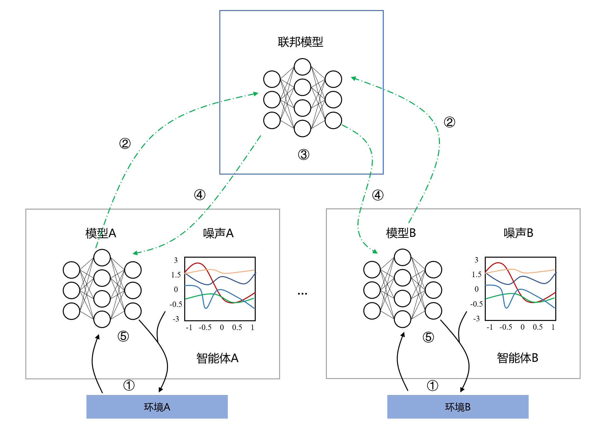
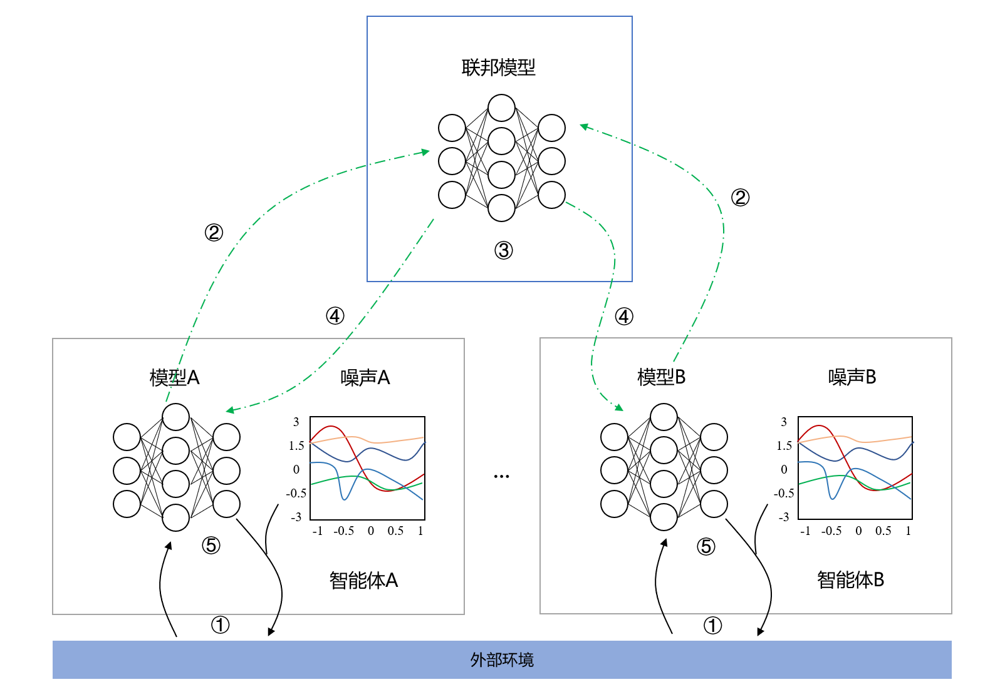

## 联邦学习

联邦学习框架的提出，就是为了解决数据安全和隐私保护问题。

#### 1、联邦学习的思想

两句话：**数据不动模型动，数据可用不可见**。

##### （1）数据不动模型动

这是联邦学习的核心，让模型在不同机构之间、端和云之间沟通交流。

##### （2）数据可用不可见

别人看不见你的数据，你也看不见别人的数据。数据和模型都保留在本地，发送给别人的仅仅是加密过的模型的参数。

## 联邦强化学习

联邦强化学习（Federated Reinforcement Learning，FRL），是强化学习的隐私保护版本，解决了政府、企业及个人对于数据安全和隐私保护的需求。

* 之前采用的深度强化学习方法是一种集中式的强化学习，即把各地的数据都收集到一起，用于强化学习模型的训练，但这种方法由于需要集合各个地区的数据，因此不能保证各个地区的数据安全性，存在数据泄露的可能性。

联邦强化学习分为横向联邦强化学习和纵向联邦强化学习，二者区别在于**RL智能体是否在同一环境**。

#### 1、横向联邦强化学习（HFRL）

在横向联邦强化学习中，每个RL智能体维持对不同环境的不同观察，每个RL智能体训练各自的强化学习模型，然后通过联邦服务器整合为一个联邦模型，最后联邦服务器将联邦模型发送给所有RL智能体，进行模型更新。

横向联邦学习的步骤如下：

1. 所有RL智能体先在各自的环境中，在本地独立训练各自的强化学习模型，在训练过程中不会交换任何数据经验、参数梯度及损失。
2. RL智能体将加密过的模型参数发送给联邦服务器。
3. 联邦服务器将接收到的来自RL智能体的模型参数进行解密和融合，进而得到一个新的联邦模型。
4. 联邦服务器将联邦模型发送给各RL智能体。
5. RL智能体更新本地模型。

#### 2、纵向联邦强化学习（VFRL）

在纵向联邦强化学习中，所有的RL智能体维持对同一环境的不同观察。对于同样的外部环境，每个RL智能体可能会有不同的动作策略，进而训练出不同的强化学习模型，然后通过联邦服务器整合为一个联邦模型，最后联邦服务器将联邦模型发送给所有RL智能体，进行模型更新。

纵向联邦学习的步骤如下：

1. 所有RL智能体根据对当前环境的观察和抽取的知识进行动作决策，然后根据环境的反馈结果（即动作决策和得到的奖励）进行强化学习模型的训练。
2. RL智能体将加密过的模型参数发送给联邦服务器。
3. 联邦服务器将接收到的来自RL智能体的模型参数进行解密和融合，进而得到一个新的联邦模型。
4. 联邦服务器将联邦模型发送给各RL智能体。
5. RL智能体更新本地模型。

#### 3、联邦强化学习的意义

* 维护数据安全，实现隐私保护

  联邦模型的建立不依赖任何的原始数据信息，只需要各个RL智能体的模型参数即可。

* 提高强化学习的性能

  如果采用恰当的知识提取方法，则可以训练出一个更合理、更健壮的RL智能体，从而提高效率。

## 训练数据的IID与Non-IID

参考资料：**若DL没了独立同分布假设，样本不独立的机器学习方法综述**[https://baijiahao.baidu.com/s?id=1644080266291233216&wfr=spider&for=pc]

> 《Learning Classifiers When The Training Data Is Not IID》主要解决经典统计分析进行分类器预测过程中针对 Non-IID 数据的处理方法
>
> 《Communication-Efficient Learning of Deep Networks from Decentralized Data (http://arxiv.org/abs/1602.05629)》为解决联邦学习中 Non-IID 数据问题，提出一种基于迭代模型平均的深层网络联合学习方法（Federated Averaging，FedAvg）
>
> 《Federated Learning with Non-IID Data》是针对（2）的分析和改进，使用客户端数据分布和中央服务器数据总体分布之间的土方运距 (earth mover』s distance, EMD) 计算权重散度，同时提出了一种数据共享（Data-Sharing）策略改进 FedAvg 的性能
>
> 《On the Convergence of FedAvg on Non-IID Data》重点讨论联邦学习问题中 FedAvg 在处理 Non-IID 数据时的收敛性问题，从理论角度证明了 FedAvg 的有效性	
>
> 《LoAdaBoost:Loss-Based AdaBoost Federated Machine Learning on medical data》基于 FedAvg 和数据共享策略提出了一种针对医学数据的提高联邦学习效率的自适应增强方法

### 1、独立同分布的训练数据（IID）

现有的机器学习任务默认训练数据遵循独立同分布 (independently and identically distributed, IID)，神经网络、深度学习等常见算法一般都将数据遵循 IID 的假设作为其推导的一部分。

### 2、非独立同分布的训练数据（Non-IID）

现有的机器学习任务默认训练数据遵循独立同分布 (independently and identically distributed, IID)，神经网络、深度学习等常见算法一般都将数据遵循 IID 的假设作为其推导的一部分。

然而，在真实世界中样本数据相关性（inter-dependent）几乎无处不在，非同源数据/标签的分布也可能具有不同的概率分布，这些数据都遵循非独立、同分布（Non-IID）。而且**联邦学习的客户端所用的数据应当是Non-IID的**。

在一些场景中，直接应用已有机器学习算法基于 Non-IID 数据完成模型训练，由于算法本身的先进性训练结果仍然较好。但对于某些应用场景，基于现有的机器学习算法和框架，使用 Non-IID 数据训练会出现意想不到的负面效果，比如模型准确度低、模型无法收敛等。

