# CSAPP学习笔记

# 深入理解计算机系统

## 一、计算机系统漫游

### 1.1、程序是如何被编译、链接的？


简化版：

`linux> gcc -Og -o p p1.c p2.c`


### 1.2、了解编译系统的益处&&一些可能的面试问题


### 1.3、计算机系统的硬件组成

总结：CPU、Memory、Bus、I/O devices


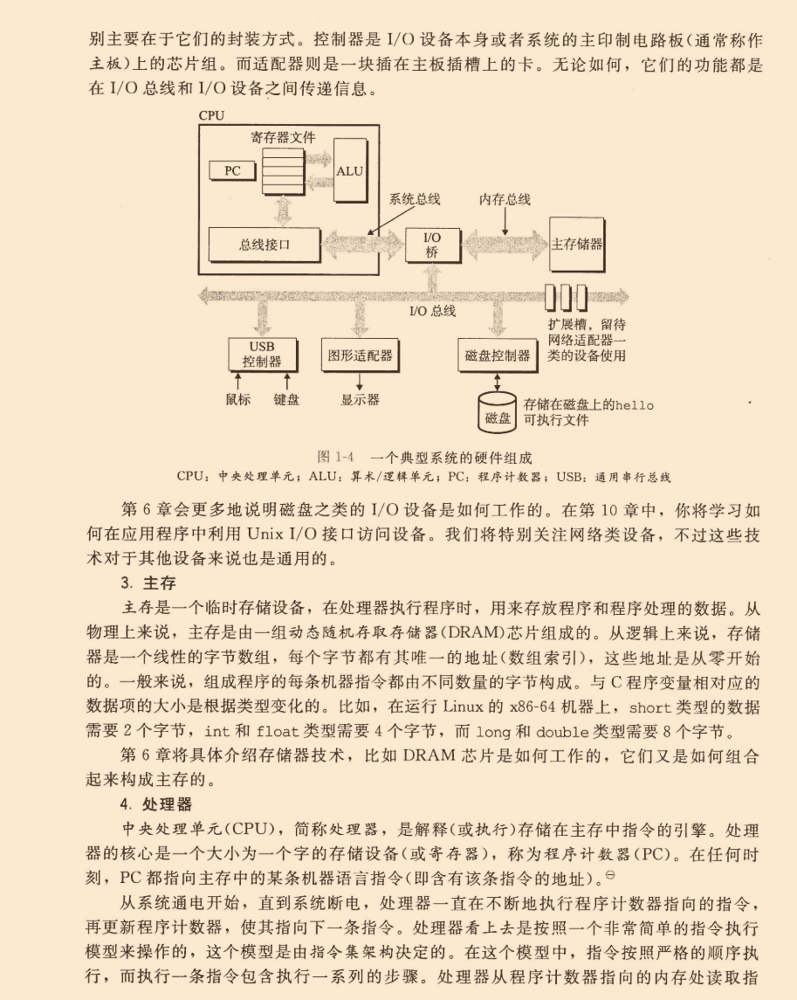


### 1.4、操作系统管理硬件


#### 1.4.1 进程、线程、虚拟内存和文件


### 1.5、系统间网络通信


### 1.6、重要主题

#### 1.6.1 Amdahl定律（阿姆达尔定律）


#### 1.6.2 并发和并行

* 线程级并发
* 指令集并行
* 单指令、多数据并行（SIMD）


#### 1.6.3 计算机系统中的抽象


### 1.7 本章小结


## 第一部分 程序结构和执行

### 第二章、信息的表示和处理

>**计算机中整数运算和浮点数运算的不同**：
>
>* 整数运算是精确的，而浮点数运算是近似的（由于表示的精度有限）。

#### 2.1 信息存储

**虚拟内存**：机器级程序将内存视为一个非常大的字节数组，称为**虚拟内存**（virtual memory）。

**地址**：内存的每个字节都由一个唯一的数字来标识，称为它的**地址**（address）。

**虚拟地址空间**：所有可能地址的集合就称为**虚拟地址空间**（virtual address space）。

>但是这个虚拟地址空间只是一个展现给机器级程序的概念性映像，实际的实现是将动态随机访问存储器（DRAM）、闪存、磁盘存储器、特殊硬件和操作系统软件结合起来，为程序提供一个看上去统一的字节数组。

##### 2.1.1 十六进制表示法（略，easy）

##### 2.1.2 字数据大小

**字长**：每台计算机的字长（word size）取决于计算机是32位的还是64位的，32位机器字长为32bit（4字节），64位机器字长为64bit（8字节），字长大小也是该机器上指针变量的大小。因此字长决定的最重要的系统参数就是`虚拟地址空间的最大大小`。也就是说，对于一个字长为$w$的机器来说，虚拟地址的范围为$[0,2^w-1]$，程序最多访问$2^w$个字节。

>常见地址范围（数值范围）：
>
>$2^8 = 256$，（`int8_t`表示的最大无符号整数为 255 = 256 - 1，因为是从0开始算起的，所以减1）
>
>$2^{16} = 65536$， （`int16_t`表示的最大无符号整数为 65535 = 65536 - 1）
>
>$2^{32} = 43亿 \approx 4.3*10^{9}$,（32位地址表示的最大范围，大约4GB）
>
>$2^{64} \approx 1.8*10^{19}$，（64位地址表示的最大范围，大约16EB，1EB=1024PB，1PB=1024TB）


##### 2.1.3 寻址和字节顺序

###### 1. 大端模式和小端模式


大小端存储由 CPU架构 决定。
**大端模式（ big endian ）**：低地址存在高位，高地址存在低位；
**小端模式（ Little Endian ）**：低地址存在低位；高地址高位；
例如：
使用**大端模式**的有：PowerPC、IBM、Sun、TCP/IP网络数据流；
使用**小端模式**的有：x86_64（包括Windows、Linux、Mac OS等使用intel处理器的机器）；
而ARM可以是大端模式，也可以是小端模式；


###### 2. 如何判断CPU是大端模式还是小端模式？

```c++
// 指针方法
void check_CPU_mode()
{    
    int a = 1;
    unsigned char *p = (unsigned char*)(&a); // p指向指向a地址最低一个字节
    if( *p == 1)
        cout << "CPU使用小端模式存储\n";
    else
        cout << "CPU使用大端模式存储\n";
}
```


###### 3. 使用宏定义进行大小端转换

```C++
//对于32位数据
#define BigtoLittle32(A)   ((( (uint32)(A) & 0xff000000) >> 24) | \
                            (( (uint32)(A) & 0x00ff0000) >> 8)   | \
                            (( (uint32)(A) & 0x0000ff00) << 8)   | \
                            (( (uint32)(A) & 0x000000ff) << 24))
```


###### 4. 大端模式、小端模式和网络字节序说明

大端小端之分

小端字节序和大端字节序表示存储的字节顺序有区别
**小端字节序**：低字节存于内存低地址；高字节存于内存高地址;
long型数据0x12345678
在小端系统中，


内存的地址是由低到高的顺序；而数据的字节也是由低到高的。


**大端字节序**：高字节存于内存低地址；低字节存于内存高地址;
long型数据0x12345678
在大端系统中，


内存的地址是由低到高的顺序；而数据的字节却是由高到低的。


**网络字节序**
网络上传输的数据都是字节流,对于一个多字节数值,在进行网络传输的时候,先传递哪个字节?也就是说,当接收端收到第一个字节的时候,它将这个字节作为高位字节还是低位字节处理,是一个比较有意义的问题;
UDP/TCP/IP协议规定:把接收到的第一个字节当作高位字节看待,这就要求发送端发送的第一个字节是高位字节;而在发送端发送数据时,发送的第一个字节是该数值在内存中的起始地址处对应的那个字节,也就是说,该数值在内存中的起始地址处对应的那个字节就是要发送的第一个高位字节(即:高位字节存放在低地址处);由此可见,多字节数值在发送之前,在内存中应该是以大端法存放的;
所以说,网络字节序是大端字节序;比如,我们经过网络发送整型数值0x12345678时,在80X86平台中,它是以小端发存放的,在发送之前需要使用系统提供的字节序转换函数htonl()将其转换成大端法存放的数值;


**常见CPU的字节序**
Big Endian : PowerPC、IBM、Sun
Little Endian : x86、DEC
ARM既可以工作在大端模式，也可以工作在小端模式。


##### 2.1.4 表示字符串

在使用ASCII码作为字符码的任何系统上都将得到相同的结果，与字节顺序和字大小规则无关。因而，文本数据比二进制数据具有更强的平台独立性。

##### 2.1.5 表示代码

当相同的程序文件在不同的机器类型（Linux 32, Windows, Sun, Linux 64）上进行编译时，生成的字节表示的机器代码完全不同。因此不同的机器类型的指令编码方式是不同的，即二进制代码是不兼容的。二进制代码很少能够在不同机器和操作系统之间移植。

##### 2.1.6~2.1.9 位运算（简单过）


#### 2.2 整数表示

##### 2.2.1 整型数据类型


##### 2.2.2 无符号数编码（略）

##### 2.2.3 补码编码

计算机内二进制计算均是采用**补码**进行计算的。

>###### 首先要知道原码、反码和补码的概念：
>
>**正数**：原码、反码、补码都是它本身。
>
>**负数**：原码=本身；反码=符号位不变，其他位取反；补码=反码+1。
>
>
>
>以数字-3为例，
>
>```c++
>int a = -3;
>
>原码 = 10000000 00000000 00000000 00000011
>
>反码 = 11111111 11111111 11111111 11111100
>
>补码 = 11111111 11111111 11111111 11111101
>```

C库文件<limits.h>定义了一组常量，来限定编译器运行的这台机器的不同整型数据类型的取值范围。

INT_MAX：2147483647

INT_MIN：-2147483648

UINT_MAX：4294967295

###### 确定大小的整数类型


##### 2.2.4 有符号数和无符号数之间的转换

位表示不变，只是改变了解释这些位的方式。


##### 2.2.5 C语言中的有符号数和无符号数

* 通常声明的常量如 12345 或 0x1A2B 这样的默认是有符号的。
* 要声明一个无符号常量，必须在后缀加上字符 'u' 或 'U'，如 12345U 或 0x1A2Bu。
* 当对一个**有符号数**和一个**无符号数**进行运算时，C语言会隐式地将有符号参数转换为无符号参数，并假设这两个数都是非负的，来执行运算。这可能会导致非期望的结果，比如 -1 < 0U，会被转换为 4294967295U < 0U，而这个显然是错的。

##### 2.2.6 数字的位表示扩展


##### 2.2.7 截断数字


#### 2.3 整数运算

**整数运算的优化：**

在大多数机器上，整数乘法指令相当慢，需要10个或者更多时钟周期，而除法指令比乘法还要慢，需要30个或更多个时钟周期，而其他整数运算（例如加法、减法、位级运算和移位）只需要一个时钟周期。因此，可以通过移位运算来优化整数的乘法和除法：

* 乘以2的n次幂 = 左移n位
* 除以2的n次幂 = 右移n位

#### 2.4 浮点数

**int，float，double之间的类型转换：**


### 第三章 程序的机器级表示

#### 3.1 历史观点

* x86-64，简称x86，代指整个系列。
* 摩尔定律：芯片上的晶体管数量每年都会翻一番。

#### 3.2 程序编码

###### GCC编译器的参数

* -O：指定代码的优化级别。

  >-Og：生成符合原始C代码整体结构的机器代码的优化等级
  >
  >-O1：一级代码优化
  >
  >-O2：二级代码优化

* -S：生成后缀名为 .s 的汇编文件

* -c：生成后缀名为 .o 的目标代码文件，该文件是二进制的，无法直接查看。

* -o：指定生成的可执行文件的名称，也可以不指定，linux系统缺省为 a.out

* -g：带调试信息，使用gdb或者lldb调试时可以看到源码

###### GDB调试工具

使用GDB展示程序的字节表示：


GDB调试器常用命令：


###### 反汇编工具

linux的反汇编工具为OBJDUMP，使用 -d 命令可以对 .o 文件进行反汇编：


##### 3.2.1 机器级代码

**常用寄存器：**


#### 3.3 数据格式（略）

#### 3.4 访问信息

* 局部变量通常保存在**寄存器**中，而不是内存中，访问寄存器比访问内存要快很多。

#### 3.5~3.6 汇编知识，略

#### 3.7 过程


##### 3.7.1 运行时栈


##### 3.7.2 转移控制

通过将返回地址压入栈的机制能够让函数在稍后返回到程序中正确的点。


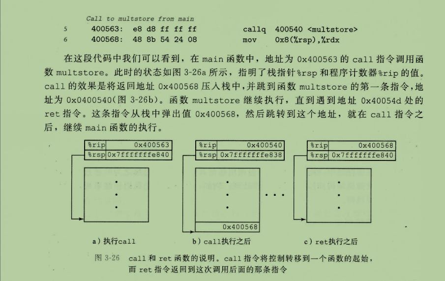

##### 3.7.3 数据传送


##### 3.7.4 栈上的局部存储


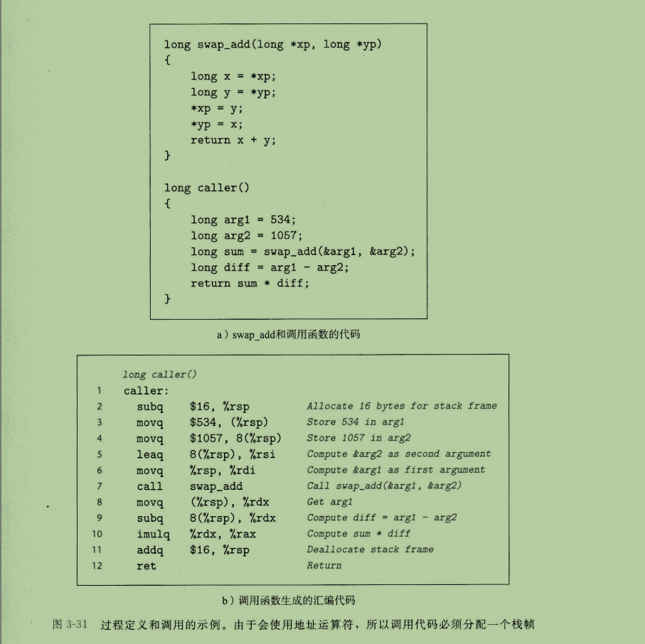

##### 3.7.5 寄存器中的局部存储空间

寄存器组是唯一被所有进程共享的资源。


##### 3.7.6 递归过程


#### 3.8 数组分配和访问

##### 3.8.1 基本原则（略）

##### 3.8.2 指针计算


##### 3.8.3 嵌套数组（多维数组）

由此我们可知，多维数组在内存空间上也是连续的。


##### 3.8.4 定长数组

编译器会偷偷进行一些优化~


##### 3.8.5 变长数组

C语言支持变长数组？

数组的维度可以是表达式。


#### 3.9 异质的数据结构

##### 3.9.1 结构体


##### 3.9.2 联合

联合中的元素共享同一段内存。


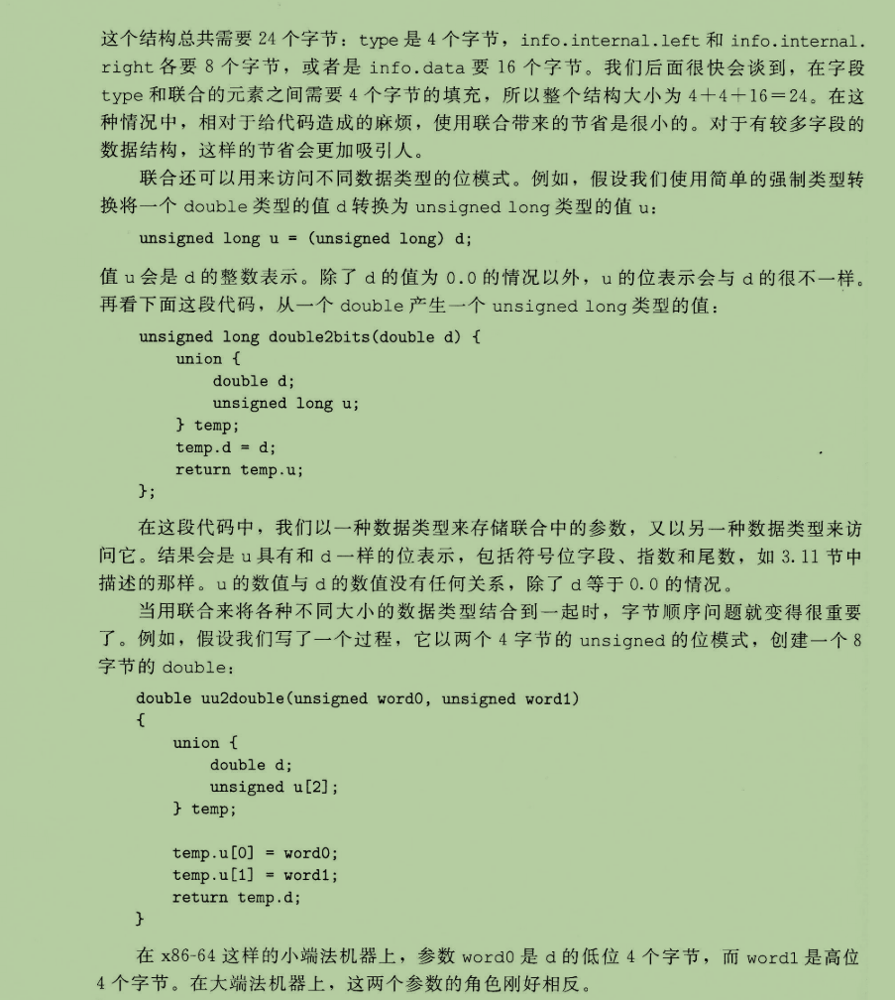

##### 3.9.3 数据对齐


##### 3.9.4 编译器字节对齐的原则

数据类型自身的对齐值：为指定平台上基本类型的长度。对于char型数据，其自身对齐值为1，对于short型为2，对于int,float,double类型，其自身对齐值为4，单位字节。

结构体或者类的自身对齐值：其成员中自身对齐值最大的那个值。

指定对齐值：#pragma pack (value)时的指定对齐值value。

数据成员、结构体和类的有效对齐值：自身对齐值和指定对齐值中小的那个值。

对于标准数据类型，它的地址只要是它的长度的整数倍就行了，而非标准数据类型按下面的原则对齐：

数组 ：按照基本数据类型对齐，第一个对齐了后面的自然也就对齐了。

联合 ：按其包含的长度最大的数据类型对齐。

结构体：结构体中每个数据类型都要对齐。


当数据类型为结构体时，编译器可能需要在结构体字段的分配中插入间隙，以保证每个结构元素都满足它的对齐要求。第一个数据变量的起始地址就是数据结构的起始地址。结构体的成员变量要对齐排放（对于非对齐成员需要在其前面填充一些字节，保证其在对齐位置上），结构体本身也要根据自身的有效对齐值圆整(就是结构体总长度需要是结构体有效对齐值的整数倍)，此时可能需要在结构末尾填充一些空间，以满足结构体整体的对齐—-向结构体元素中最大的元素对齐。


通过上面的分析，对结构体进行字节对齐，我们需要知道四个值：


指定对齐值：代码中指定的对齐值，记为packLen；

默认对齐值：结构体中每个数据成员及结构体本身都有默认对齐值，记为defaultLen；

成员偏移量：即相对于结构体起始位置的长度，记为offset；

成员长度：结构体中每个数据成员的长度（注结构体成员为补齐之后的长度），记为memberLen。

及两个规则：


对齐规则：offset % vaildLen = 0，其中vaildLen为有效对齐值vaildLen = min(packLen, defaultLen)；

填充规则：如成员变量不遵守对齐规则，则需要对其补齐；在其前面填充一些字节保证该成员对齐。需填充的字节数记为pad


##### 3.9.5 结构体内存对齐示例

我们先来看一个例子：

```c
struct S1
{
 char c1;
 int i;
 char c2;
};
```

大家来猜猜这个结构体S1的内存是多少？

相信会有人给出 6 的结果，他们或许是这样想的，两个 char 类型分别为一个字节，一个 int 类型又为4个字节，加起来刚好为6个

但是

结果真是如此吗？

我们来看看运行结果：


为什么呢，接下来我们就引出正文。

**一.结构体内存对齐规则**

首先，正如引例所示，结构体的内存并不是简简单单的将结构体各个成员的大小相加。

结构体的大小往往遵循着结构体的对齐规则：

1. 第一个成员在与结构体变量偏移量为0的地址处。
2. 其他成员变量要对齐到某个数字（对齐数）的整数倍的地址处。
3. 结构体总大小为最大对齐数（每个成员变量都有一个对齐数）的整数倍。
4. 如果嵌套了结构体的情况，嵌套的结构体对齐到自己的最大对齐数的整数倍处，结构体的整体大小就是所有最大对齐数（含嵌套结构体的对齐数）的整数倍。

这里要注意的一点就是要解释一下这个对齐数的概念

对齐数：编译器默认的一个对齐数 与 该结构体变量成员自身大小的较小值。

　　注：

　　　　不是所有的编译器都有自己默认的对齐数。

　　　　在VS下其默认的对齐数为8

　　　　在linux下的默认值为4


**二、怎样计算结构体的大小**

在讲计算之前，我们继续来看一看上面的那个例子：

```c
#define _CRT_SECURE_NO_WARNINGS
 
#include<stdio.h>
#include<stddef.h>
 
struct S1
{
 char c1;
 int i;
 char c2;
};
 
int main()
{
 printf("该结构体成员 c1 开始的位置为第 %d 个字节\n", offsetof(struct S1, c1));
 printf("该结构体成员 i 开始的位置为第 %d 个字节\n", offsetof(struct S1, i));
 printf("该结构体成员 c2 开始的位置为第 %d 个字节\n", offsetof(struct S1, c2));
 printf("该结构体所占的内存空间为 %d 个字节\n", sizeof(struct S1));
 return 0;
}
```

注：

　　宏 offsetof() 可以计算出结构体各成员所相对开始位置的一个偏移量。

　　偏移量 ：我们可以理解为把结构体变量第一个成员所储存的第一个位置置于0，以此递增

我们来看看结果：


这是为什么呢？

我们来看看上面所提到的结构体内存对齐规则：


然后我们来看示意图：


此时，关于结构体的大小，我们应该清楚了不少，接下来，我们继续来看几道例题：

```c
struct S2
{
 char c1;
 char c2;
 int i;
};
int main()
{
 printf("%d\n", sizeof(struct S2));
 return 0;
 }
```

我们看到，S1与S2的区别仅仅只是调换了一下各成员间的顺序，那它所占的内存还是刚才的值吗：

运行结果：


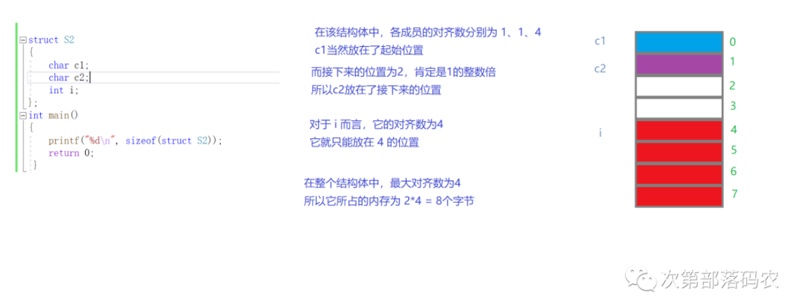

趁此机会，我们再来巩固一下：

```c
struct S3
{
  double d;
  char c;
  int i;
};
 
int main()
{
  printf("%d\n", sizeof(struct S3));
  return 0;
}
```

它的结果会是多少呢？


不知道大家作对了吗？

解析：

　　 首先 double 类型占8个字节

　　char 又占了接下来的一个

　　而 int 的对齐数为 4，所以空3个字节从12开始

　　而这个结构体的最大对齐数为8

　　 所以该结构体占 2*8 = 16个字节

最后，我们再来看一道嵌套结构体的例题：

```c
struct S3
{
  double d;
  char c;
  int i;
};
 
struct S4
{
  char c1;
  struct S3 s3;
  double d;
};
 
int main()
{
  printf("%d\n", sizeof(struct S4));
  return 0;
}
```

它的结果又为多少呢？


解析：

　　我们先来看看规则 4：如果嵌套了结构体的情况，嵌套的结构体对齐到自己的最大对齐数的整数倍处，

　　　　　　　　　　　　结构体的整体大小就是所有最大对齐数（含嵌套结构体的对齐数）的整数倍

　　S3的最大对齐数为 8，它的大小为 16 个字节

　　首先，毋庸置疑的是 char 先放到首位

　　 接下来因为S3的对齐数为 8，所以S3放在了以位置8开始的16个字节

　　 最后是double，对齐数为8，所以放在了24的位置

　　最后，该结构体的大小为 4*8 = 32 个字节

在进行结构体所占大小的计算中，我们又可以得到一个基本编程常识：


##### 3.9.6 设计结构体要注意的方面

在我们进行结构体的设计中，我们可以把一些所占空间小的，来凑到一起，提高资源的利用率。

正如上文所提到的例1与例2，结构体成员完全相同，但顺序不同，两个结构体的大小也截然不同

```c
//例1
struct S1
{
  char c1;
  int i;
  char c2;
};
 
//例2
struct S2
{
  char c1;
  char c2;
  int i;
};
 
int main()
{
  printf("%d\n", sizeof(struct S1));//12
  printf("%d\n", sizeof(struct S2));//8
  return 0;
}
```


数据结构的成员位置要兼顾成员之间的关系、数据访问效率和空间利用率。顺序安排的原则是：四字节的放在最前面，两字节的紧接最后一个四字节成员，一字节紧接最后一个两字节成员，填充字节放在最后。举例如下：

```c
typedef struct tag_T_MSG{
long ParaA;
long ParaB;
short ParaC；
char ParaD;
char Pad;
} T_MSG; 
```


##### 3.9.7 为什么存在内存对齐

对于这个原因，目前话没有一种完全正确的答案，但是：

大部分的参考资料都是如是说的：

　　1. 平台原因(移植原因)：

　　　　不是所有的硬件平台都能访问任意地址上的任意数据的；

　　　　某些硬件平台只能在某些地址处取某些特定类型的数据，否则抛出硬件异常。

​			 在x86上，类似的操作只会影响效率，但是在MIPS或者sparc上，可能就是一个error 

　　 2. 性能原因：

　　　　 数据结构(尤其是栈)应该尽可能地在自然边界上对齐。

　　　　原因在于，为了访问未对齐的内存，处理器需要作两次内存访问；而对齐的内存访问仅需要一次访问。

对于原因而我们来看一个示意图：


> 对于上图的解释：
>
> * 如果要取整个结构体的话，两种方式没有差异，都是访问两次内存
> * 如果只是取结构体中的变量b的话，对齐方式访问内存一次就可以了，非对齐方式需要访问两次内存


体系结构的对齐和不对齐，是在时间和空间上的一个权衡。

字节对齐节省了时间。应该是设计者考虑用空间换取时间。

为什么说对齐会提高效率呢节省时间?我想大家要理解的重点之重点就在这里了。

在我们常用的PC下总线宽度是32位

**1.如果是总线宽度对齐的话**

那么所有读写操作都是获取一个<=32位数据可以一次保证在数据总线传输完毕

没有任何的额外消耗

|1|2|3|4|5|6|7|8|

从1开始这里是a的起始位置,5起始为b的位置 访问的时候

如果访问a一次在总线传输8位其他24位无效的

访问b时则一次在总线上传输32完成

读写均是一次完整

插叙一下 读操作先要将读地址放到地址总线上然后下个时钟周期再从外部

存储器接口上读回数据通过数据总线返回需要两个周期

而写操作一次将地址及数据写入相应总线就完成了

读操作要比写操作慢一半


**2.我们看访问数据时如果不对齐地址的情况**

|1|2|3|4|5|6|7|8|

此时a的地址没变还在1而因为是不对齐则b的位置就在2处

这时访问就带来效率上问题 访问a时没问题还是读会一个字节

但是2处地址因为不是总线宽度对齐一般的CPU在此地址操作将产生error

如sparc，MIPS。它们在硬件的设计上就强制性的要求对齐。在不对齐的地址上肯定发生错误

但是x86是支持非对齐访问的

它通过多次访问来拼接得到的结果,具体做法就是从1地址处先读回后三字节234 暂存起来

然后再由5地址处读回一个字节5 与234进行拼接组成一个完整的int也就是b返回

大家看看如此的操作带来的消耗多了不止三倍很明显在字长对齐时效率要高许多

淡然这种效率仅仅是访问多字节带来的 如果还是进行的byte操作那效率差不了多少


##### 3.9.8 修改默认对齐数

我们通常使用如下的预处理命令来修改编译器的默认对齐数：

```c
#pragma pack()
```

如果（）里面不加数字，则默认为编译器的默认对齐数

我们修改的时候，只需在（）里加一个数字就行

取消的时候再添加一次#pragma pack() 即可

注：

　　再（）里添加的数字，我们通常加的都是2的多少次方

下面来举一个实例：

```c
#include <stdio.h>
#pragma pack(8)//设置默认对齐数为8
struct S1
{
  char c1;
  int i;
  char c2;
};
#pragma pack()//取消设置的默认对齐数，还原为默认
#pragma pack(1)//设置默认对齐数为8
struct S2
{
  char c1;
  int i;
  char c2;
};
#pragma pack()//取消设置的默认对齐数，还原为默认
int main()
{
  //输出的结果是什么？
  printf("%d\n", sizeof(struct S1));//12
  printf("%d\n", sizeof(struct S2));//6
  return 0;
}
```

由此可见，我们也可以通过修改默认对齐数来节约 结构体使用的空间。

关于结构体内存的讲解便到此为止。


##### 3.9.9 ARM的内存对齐

有部分摘自ARM编译器文档对齐部分
对齐的使用:
1.\_\_align(num)
  这个用于修改最高级别对象的字节边界。在汇编中使用LDRD或者STRD时
  就要用到此命令\_\_align(8)进行修饰限制。来保证数据对象是相应对齐。
  这个修饰对象的命令最大是8个字节限制,可以让2字节的对象进行4字节
  对齐,但是不能让4字节的对象2字节对齐。
 \__align是存储类修改,他只修饰最高级类型对象不能用于结构或者函数对象。

2.\_\_packed 
  \_\_packed 是进行一字节对齐
  1.不能对packed的对象进行对齐
  2.所有对象的读写访问都进行非对齐访问
 3.float及包含float的结构联合及未用\_\_packed 的对象将不能字节对齐
  4.\_\_packed 对局部整形变量无影响
 5.强制由unpacked对象向packed对象转化是未定义,整形指针可以合法定
  义为packed。
   \_\_packed  int* p;  //\_\_packed  int 则没有意义
  6.对齐或非对齐读写访问带来问题

```c

__packed struct STRUCT_TEST
{
   char a;
   int b;
   char c;
}  ;    //定义如下结构此时b的起始地址一定是不对齐的
         //在栈中访问b可能有问题,因为栈上数据肯定是对齐访问[from CL]
//将下面变量定义成全局静态不在栈上 
static char* p;
static struct STRUCT_TEST a;
void Main()
{
__packed int* q;  //此时定义成__packed来修饰当前q指向为非对齐的数据地址下面的访问则可以
p = (char*)&a;          
q = (int*)(p+1);      

*q = 0x87654321; 


//这样可以很清楚的看到非对齐访问是如何产生错误的
//以及如何消除非对齐访问带来问题
//也可以看到非对齐访问和对齐访问的指令差异导致效率问题
}

```


 


#### 3.10 缓冲区溢出

**缓冲区溢出：**在栈中分配某个字符数组来保存一个字符串，但是字符串的长度超出了为数组分配的空间。

**缓冲区溢出攻击：**


上图是一个例子，当复制字符串超出23字节后，返回地址会被覆盖。黑客会使用一个指向攻击代码的指针覆盖返回地址，那么执行ret指令的效果就是跳转到攻击代码。

**如何对抗缓冲区溢出攻击？**

1. **栈地址随机化**。该技术是地址空间布局随机化的一种，表现为每次运行同样的代码，其局部变量的地址都是在变化的，而不是固定的。这样程序运行时，栈地址就不容易被预测到，也不容易被攻击。
2. **栈破坏检测**。通过在栈帧中任何局部缓冲区与栈状态之间插入一个特殊值（**金丝雀canary**），也称为哨兵值。该值是在程序每次运行时随机产生的，理论上该值在程序运行期间不会被修改，如果检查到该值改变，则程序异常终止。
3. **限制可执行代码区域**。限制哪部分内存才可以存储可执行代码，限制栈上只可读和可写，不可执行。

### 第四章 处理器体系结构

#### 4.1-4.2 略

#### 4.3 指令执行顺序

取指、译码、执行、访存、写回、更新PC。


#### 4.4 流水线技术


### 第五章 优化程序性能

#### 5.1 略

#### 5.2 表示程序性能


##### 最小二乘拟合法


#### 5.3 GCC编译器进行的优化


#### 5.4 消除循环的低效率

**代码移动**

将循环体内的值不会改变的函数调用或者计算，移到循环体外。

```c++
// 低效的
for (int i = 0; i < vec.size(); i++) {}

// 优化的
int size = vec.size();
for (int i = 0; i < size; i++) {}
```

#### 5.8 循环展开

循环展开（loop unrolling）


#### 5.9 提高并行性

对于可结合和可交换的计算，可以分割计算量，然后最后合并，得到的结果是相同的，但是却可以并行计算。


##### SIMD，单指令多数据

使用一组向量寄存器，可以使部分计算并行进行，从而可以提高并行度。

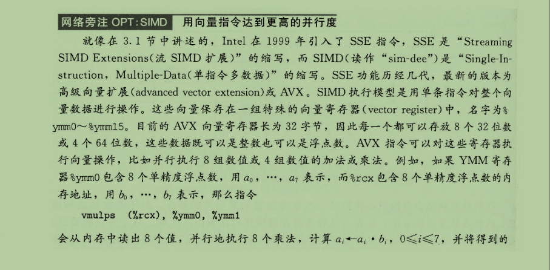


#### 5.14 性能分析工具

Linux提供的性能分析工具，GPROF

可以分析程序运行过程中，每个函数的用时及调用次数等信息。

### 第六章 存储器层次结构

> 存储器间的性能差异，访问数据所需的指令周期数：
>
> CPU寄存器：1个周期
>
> 高速缓存cache：4~75个周期（取决于几级缓存）
>
> 主存：上百周期，$10^2$
>
> 磁盘：几千万个周期，$10^7$

#### 6.1 存储技术

##### 6.1.1 随机访问存储器

###### （1）RAM

随机访问存储器（Random-Access Memory, RAM）分为静态RAM（SRAM）和动态RAM（DRAM）。二者区别如下：


###### （2）ROM


###### （3）访问主存

**访问主存与总线设计**


**总线的读事务和写事务**


##### 6.1.2 磁盘存储


###### （1）磁盘构造


###### （2）磁盘容量


###### （3）磁盘读写


> 注意最后一句话的性能差异！

###### （4）逻辑磁盘块


###### （5）I/O总线


###### （6）访问磁盘


##### 6.1.3 固态硬盘


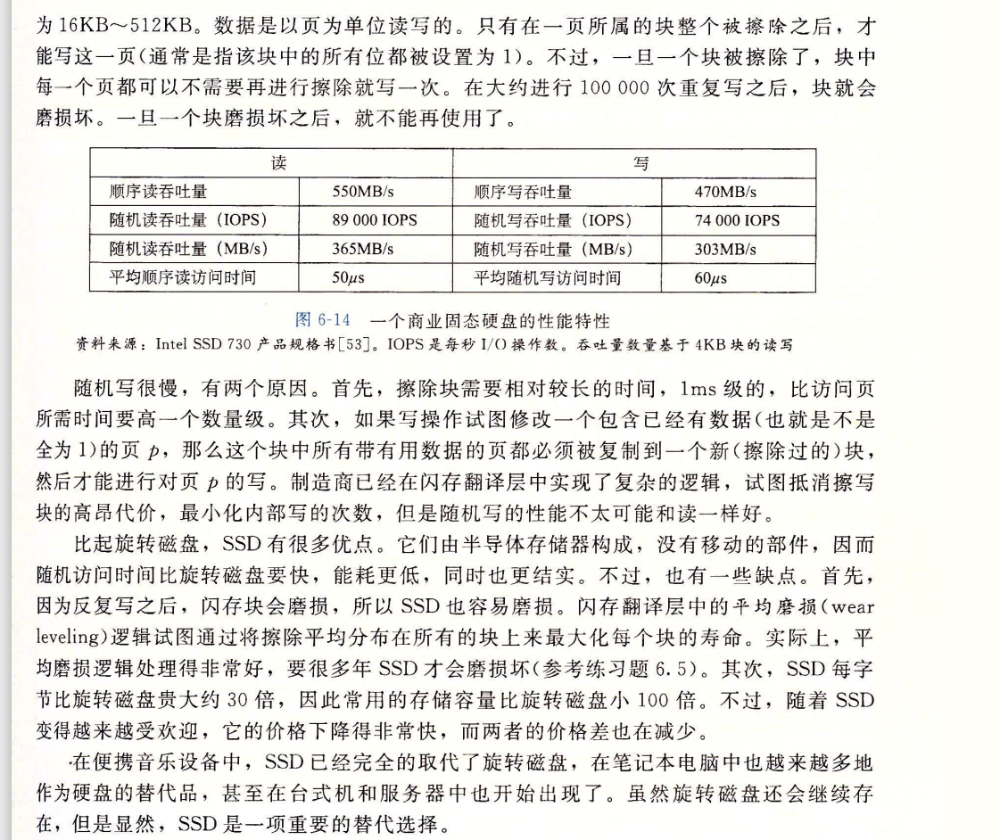

##### 6.1.4 存储技术趋势

> 简单来说，主存和硬盘的访问速度提升赶不上CPU的速度提升，所以现代计算机频繁使用高速缓存，来弥补主存和CPU之间的性能差距。


#### 6.2 程序的局部性

> **注意：这里是重点！**
>
> 局部性是指一个计算机程序倾向于引用最近引用过的数据项或指令。大白话说，就是：当一个数据被用到时，其附近的数据通常也会马上被使用。


##### 6.2.1 对程序数据引用的局部性


##### 6.2.2 取指令的局部性


##### 6.2.3 局部性小结


#### 6.3 存储器层次结构

> 存储器层次结构的本质是，每一层存储设备都是较低一层的缓存。

**存储器山**


##### 6.3.1 存储器层次结构中的缓存

> **广义的缓存的定义**：
>
> 缓存是一个小而快速的存储设备，它作为存储在更大也更慢的设备中的数据对象的缓冲区域。


###### （1）缓存命中和缓存不命中


##### 6.3.2 存储器层次结构小结


#### 6.4 高速缓存存储器

> 高速缓存通常指的是CPU寄存器和主存之间的SRAM高速缓存存储器，包括L1、L2、L3缓存。


##### 6.4.1 通用的高速缓存存储器组织结构


细节看原书。

##### 6.4.2 直接映射高速缓存


细节看原书。

##### 6.4.3 组相连高速缓存


细节看原书。

##### 6.4.4 全相联高速缓存


##### 6.4.5 缓存写

|        写命中         |            写不命中            |
| :-------------------: | :----------------------------: |
| 直写（write-through） | 非写分配（not-write-allocate） |
|  写回（write-back）   |    写分配（write-allocate）    |


##### 6.4.6 一个真实的高速缓存层次结构的解剖


	##### 6.4.7 高速缓存参数的性能影响


#### 6.5 编写高速缓存友好的代码

> 主要是两点：
>
> **时间局部性**：对局部变量的反复引用是好的，因为编译器会将它们缓存在寄存器文件中
>
> **空间局部性**：步长为1的引用模式是好的，因为存储器层次结构中所有层次上的块都是将数据存储为连续的块。


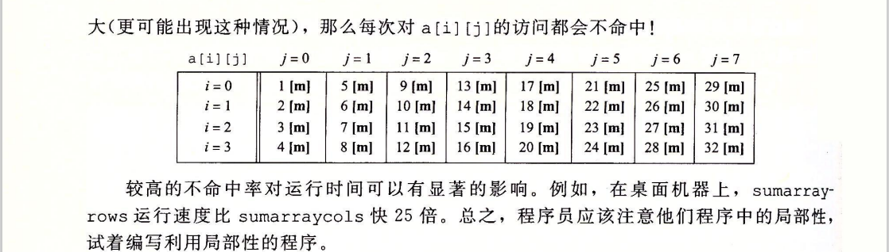

#### 6.6 综合：高速缓存对程序性能的影响

##### 6.6.1 存储器山


##### 6.6.2 重新排列循环以提高空间局部性


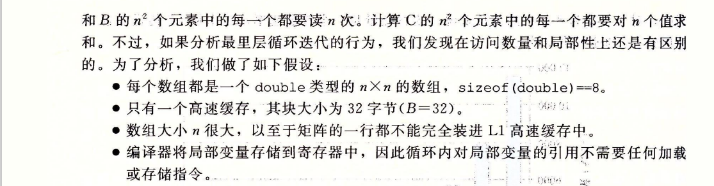


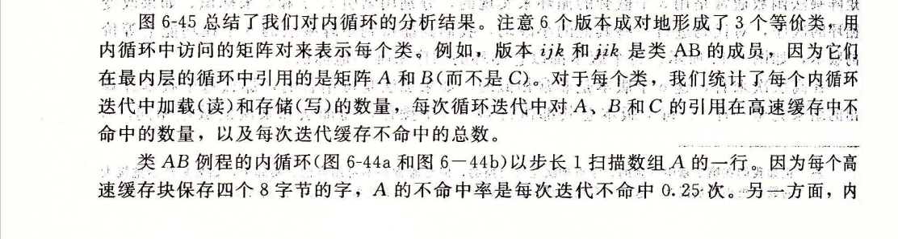


##### 6.6.3 在程序中利用局部性


#### 6.7 小结


## 第二部分 在系统上运行程序

### 第七章 链接


#### 7.1 编译器驱动程序


#### 7.2 静态链接


#### 7.3 目标文件


#### 7.4 可重定位目标文件


#### 7.5 符号和符号表

> 这一节不重要。


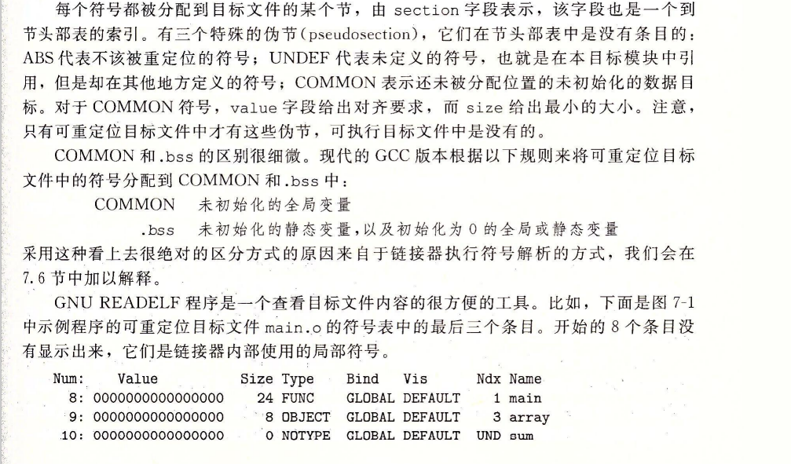


#### 7.6 符号解析


##### 7.6.1 链接器如何解析多重定义的全局符号


##### 7.6.2 与静态库链接

**什么是静态库？**

编译系统将所有相关的目标模块打包成为一个单独的文件，称为**静态库**，它可用做链接器的输入。

在链接时，链接器将只复制被程序引用的目标模块，这就减少了可执行文件在磁盘和内存中的大小。


##### 7.6.3 链接器如何使用静态库来解析引用

* 链接静态库时要放在命令行的结尾，因为存在引用依赖问题。
* 被引用的静态库之间如果存在依赖关系，则库的放置顺序也很关键，被依赖的库要放在后面。


#### 7.7 重定位

**什么是重定位？**

链接器完成符号解析之后，就把代码中的每个符号引用和正好一个符号定义关联起来。此时，链接器就知道它的输入目标模块中的代码节和数据节的确切大小。现在就可以开始重定位步骤了，在这个步骤中，将合并输入模块，并为每个符号分配运行时地址。

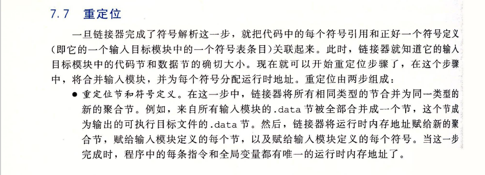


##### 7.7.1 重定位条目


##### 7.7.2 重定位符号引用

非重点，过于详细请查看原书。

#### 7.8 可执行目标文件


#### 7.9 加载可执行目标文件

**什么是加载？**

加载器将可执行目标文件中的代码和数据从磁盘复制到内存中，然后通过跳转到程序的第一条指令或入口点来运行该程序。这个将程序复制到内存并运行的过程叫做加载。


## 基础知识

### 1. 虚拟内存的概念与介绍

答：虚拟内存中，允许将一个作业分多次调入内存，需要时就调入，不需要的就先放在外存。因此，虚拟内存需要建立在离散分配的内存管理方式的基础上。虚拟内存的实现有以下三种方式：

\#请求分页存储管理

\#请求分段存储管理

\#请求段页式存储管理

虚拟内存的意义：

一，虚拟内存可以使得物理内存更加高效。虚拟内存使用置换方式，需要的页就置换进来，不需要的置换出去，使得内存中只保存了需要的页，提高了利用率，也避免了不必要的写入与擦除；

二，使用虚拟地址可以使内存的管理更加便捷。在程序编译的时候就会生成虚拟地址，该虚拟地址并不是对应一个物理地址，使得也就极大地减少了地址被占用的冲突，减少管理难度；

三，为了安全性的考虑。在使用虚拟地址的时候，暴露给程序员永远都是虚拟地址，而具体的物理地址在哪里，这个只有系统才了解。这样就提高了系统的封装性。

