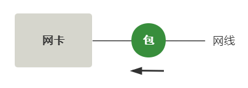
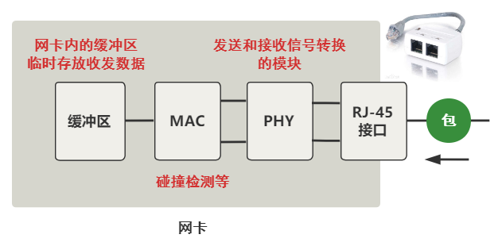
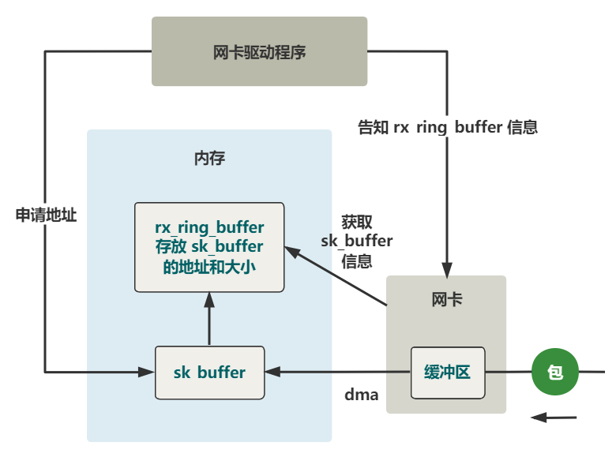
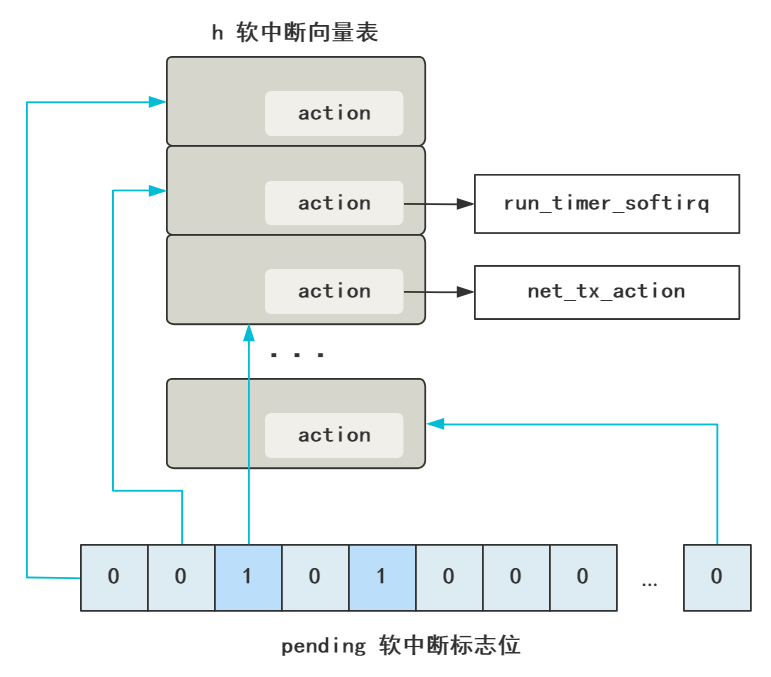
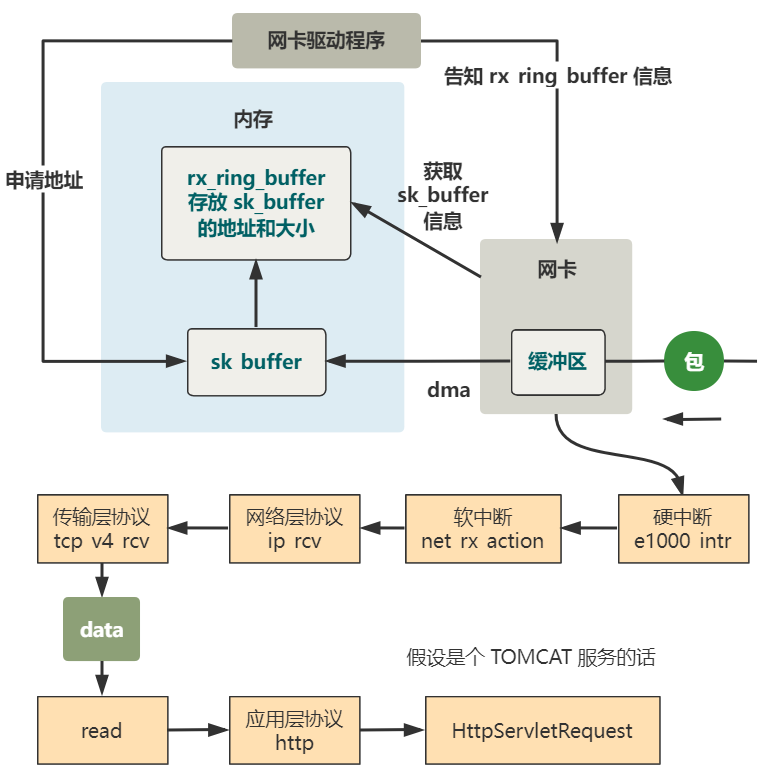

## 当内核收到一个网络包


### 从网线到网卡

现在，就有一个数据包，即将从网线进入网卡。

 

这个数据包从很遥远的另一台计算机发出，经历重重艰难险阻，到达了这台计算机的网卡，这个过程可以阅读[《如果让你来设计网络》](http://mp.weixin.qq.com/s?__biz=Mzk0MjE3NDE0Ng==&mid=2247489907&idx=1&sn=a296cb42467cab6f0a7847be32f52dae&chksm=c2c663def5b1eac84b664c8c1cadf1c8ec23ea2e57e48e04add9b833c841256fc9449b62c0ec&scene=21#wechat_redirect)，总之现在这个数据包已经过来了。





这个数据包来了之后，现在只是一堆**电信号**，离内核程序的处理还十万八千里呢，需要先经历**网卡**这个硬件的折磨。

我们把上图中的网卡放大看看。

 



 

最开始就是我们常见的网线插口，之后会经过信号转换的模块 PHY，再经过 MAC 模块，最后到达**网卡内的一个缓冲区**，注意哦这个是网卡这个硬件设备内的缓冲区，此时和内核代码还一点关系也没有。

总之这个过程，**实质上就是把网线中的高低电平，转换到网卡上的一个缓冲区中存储着**。


### 从网卡到内存

上一步，数据到达了网卡这个硬件的缓冲区中，现在要把它弄到**内存中的缓冲区**，简单一张图就是这样。


 

而且，这个过程完全不需要 CPU 参与，只需要 **DMA** 这个硬件设备，配合网卡这个硬件设备即可完成。

当然，这个过程的前提是，**网卡驱动**需要在内存中申请一个缓冲区叫 **sk_buffer**，然后把这个 sk_buffer 的地址告诉网卡，这样 DMA 才知道等网卡的缓冲区有数据到来时，把它拷贝到内存的什么位置上。

具体过程展开如下。

 



 

### 注册硬中断处理程序

之前的部分就不展示代码了，比较繁琐，且对主流程的理解帮助不大。总之现在，这份数据包，**已经从网卡内的缓冲区，然后通过 DMA 的方式，拷贝到了内存中的 sk_buffer 这个结构中**。

由于这个过程完全是由硬件完成的，所以下一步网卡该做的最后一件事，就是通知内核，让内核去处理这个数据。

怎么通知呢？就是**中断**。

网卡向 CPU 发起中断信号，CPU 打断当前的程序，根据中断号找到中断处理程序，开始执行。

那我们主要去看，这个网卡收包这个**中断处理程序是什么**，以及它是**如何注册到中断向量表中**的。

由于各个类型的网卡驱动程序是不同的，这里我们拿 e1000 这个网卡驱动来举例。我们在 e1000_main.c 中找到了这样一行代码。

```c
request_irq(netdev->irq, &e1000_intr, ...);
```

这段代码的作用就是，当数据包从网卡缓冲区到内存中的 sk_buffer 后发出中断，将会执行到 **e1000_intr** 这个中断处理函数。


### 硬中断 e1000_intr 干了什么

drivers\net\e1000\e1000_main.c

```c
// 注册的硬中断处理函数
static irqreturn_t e1000_intr(int irq, void *data, struct pt_regs *regs) {
   __netif_rx_schedule(netdev);
}
include\linux\netdevice.h
static inline void __netif_rx_schedule(struct net_device *dev) {
    list_add_tail(&dev->poll_list, &__get_cpu_var(softnet_data).poll_list);
    // 发出软中断    
    __raise_softirq_irqoff(NET_RX_SOFTIRQ);
}
```


没错，几乎啥也没干，将网卡设备 dev 放入 **poll_list** 里，然后立刻发起了一次**软中断**，然后就结束了。

软中断原理在[《认认真真聊聊软中断》](http://mp.weixin.qq.com/s?__biz=Mzk0MjE3NDE0Ng==&mid=2247498246&idx=1&sn=efca37b5dcb06271eb19500b2c2597f1&chksm=c2c580abf5b209bdacd5cba9728723af1f725016960d334067f9cc979b721f29f860d612ec1b&scene=21#wechat_redirect)讲过，其实就是修改 **pending** 的某个标志位，然后内核中有一个线程不断**轮询**这组标志位，看哪个是 1 了，就去**软中断向量表**里，寻找这个标志位对应的处理程序，然后执行它。

 




这是为了尽快响应硬中断，以便计算机可以尽快处理下一个硬中断，毕竟鼠标点击、键盘敲击等需要响应特别及时。而像网络包到来后的拷贝和解析过程，在硬中断面前优先级没那么高，所以就触发一个软中断等着内核线程去执行就好了。

 

### 注册软中断处理程序

刚刚代码中我们就触发了一个值为 **NET_RX_SOFTIRQ** 的软中断，那这个软中断会执行到哪个软中断处理函数呢？

内核早在网络子系统初始化的过程中，把这个软中断对应的处理函数注册好了。

net\core\dev.c

```c
static int __init net_dev_init(void) {
    open_softirq(NET_TX_SOFTIRQ, net_tx_action, NULL);
    open_softirq(NET_RX_SOFTIRQ, net_rx_action, NULL);
}

// transmit 发送
static void net_tx_action(struct softirq_action *h) {...}
// receive 接收
static void net_rx_action(struct softirq_action *h) {...}
```

这个 **open_softirq** 就是注册一个软中断函数，很简单，就是把这个函数赋值给**软中断向量表**中对应位置的 action 上。还是上面的图。


这里注册了两个软中断，一个发送，一个接收。我们这次是接收，所以软中断触发后，就执行到了 **net_rx_action** 这个函数。

 

### 软中断 net_rx_action 干了什么

直接看！

net\core\dev.c

```c
static void net_rx_action(struct softirq_action *h) {
    struct softnet_data *queue = &__get_cpu_var(softnet_data);   
    while (!list_empty(&queue->poll_list)) {
        struct net_device dev = list_entry(
            queue->poll_list.next, struct net_device, poll_list);
        dev->poll(dev, &budget)；
    }
}
```

遍历 poll_list 取出一个个的设备 dev，然后调用其 **poll** 函数。

还记得我们发起软中断前的一行代码吧？正是把当前有数据包到来的这个网卡设备 dev 放入了这个 poll_list，现在又取出来了。

 

由于要调用该网卡相应驱动的 poll 函数，那网卡初始化时，e1000 这款网卡的 poll 函数被附上了这个函数地址。

```c
netdev->poll = &e1000_clean;
```

所以，接下来就看这个函数就好了，听名字就知道是清理这个网卡的数据包的工作。

drivers\net\e1000\e1000_main.c

```c
static int e1000_clean(struct net_device *netdev, int *budget) {
    struct e1000_adapter *adapter = netdev->priv;    
    e1000_clean_tx_irq(adapter);
    e1000_clean_rx_irq(adapter, &work_done, work_to_do);
}
```

由于本讲我们只看读数据的过程，所以就看 rx 部分就好了。

 

这个函数过长，我们只顺着一条线往下跟。

```c
// drivers\net\e1000\e1000_main.c
e1000_clean_rx_irq(struct e1000_adapter *adapter) {
    ...
    netif_receive_skb(skb);
    ...
}

// net\core\dev.c
int netif_receive_skb(struct sk_buff *skb) {
    ...
    list_for_each_entry_rcu(ptype, &ptype_base[ntohs(type)&15], list) {
        ...
        deliver_skb(skb, ptype, 0);
        ...
    }
    ...
}

static __inline__ int deliver_skb(
        struct sk_buff *skb, struct packet_type *pt_prev, int last) {
    ...
    return pt_prev->func(skb, skb->dev, pt_prev);
}
```

我们看到，一路跟来，执行了 pt_prev 的 **func** 函数。

这个函数是干嘛的呢？或者先问，这个函数具体的实现指向的是哪个函数呢？这就涉及到**协议栈**的注册。

 

### 协议栈的注册

IP 协议的注册，在这里。

```c
// net\ipv4\ip_output.c
static struct packet_type ip_packet_type = {
    .type = __constant_htons(ETH_P_IP),
    .func = ip_rcv,
};

void __init ip_init(void) {
    dev_add_pack(&ip_packet_type);
}

// net\core\dev.c
void dev_add_pack(struct packet_type *pt) {
    if (pt->type == htons(ETH_P_ALL)) {
        list_add_rcu(&pt->list, &ptype_all);
    } else {
        hash = ntohs(pt->type) & 15;
        list_add_rcu(&pt->list, &ptype_base[hash]);
    }
}
```

我们看到，func 被赋值为了 **ip_rcv**，那上一步自然就执行到了这个函数，其实就是**网络层**交给谁来负责解析的意思。

 

那我们顺便把传输层的协议注册也看了吧，不难想到，ip_rcv 这个函数处理完必然交给**传输层**继续处理。

```c
module_init(inet_init);

static struct inet_protocol tcp_protocol = {
    .handler =  tcp_v4_rcv,
    .err_handler =  tcp_v4_err,
    .no_policy =    1,
};

static struct inet_protocol udp_protocol = {
    .handler =  udp_rcv,
    .err_handler =  udp_err,
    .no_policy =    1,
};

static int __init inet_init(void) {
    inet_add_protocol(&udp_protocol, IPPROTO_UDP);
    inet_add_protocol(&tcp_protocol, IPPROTO_TCP);
    ip_init();
    tcp_init();
}
```

非常直观明了，记住上面两个 handler 分别是 **tcp_v4_rcv** 和 **udp_rcv**。

我们回过头，继续看 ip_rcv 这个函数里面。


### 网络层处理函数 ip_rcv 干了什么

```c
// net\ipv4\ip_input.c
int ip_rcv(struct sk_buff *skb, struct net_device *dev, struct packet_type *pt) {
    ...
    return NF_HOOK(PF_INET, NF_IP_PRE_ROUTING, skb, dev, NULL,
               ip_rcv_finish);
}

static inline int ip_rcv_finish(struct sk_buff *skb) {
    ...
    if (skb->dst == NULL) {
        if (ip_route_input(skb, iph->daddr, iph->saddr, iph->tos, dev))
            goto drop; 
    }
    ...
    return dst_input(skb);
}

// include\net\dst.h
// rth->u.dst.input= ip_local_deliver;
static inline int dst_input(struct sk_buff *skb) {
    ...
    skb->dst->input(skb);
    ...
}

// net\ipv4\ip_input.c
int ip_local_deliver(struct sk_buff *skb) {
    ...
    return NF_HOOK(PF_INET, NF_IP_LOCAL_IN, skb, skb->dev, NULL,
               ip_local_deliver_finish);
}

static inline int ip_local_deliver_finish(struct sk_buff *skb) {
    ...
    ipprot = inet_protos[hash];
    ipprot->handler(skb);
    ...
}

```

OK，大功告成！最后执行了这个 **handler**，还记得上一节协议栈中注册的吧？

```c
static struct inet_protocol tcp_protocol = {
    .handler =  tcp_v4_rcv,
    .err_handler =  tcp_v4_err,
    .no_policy =    1,
};

static struct inet_protocol udp_protocol = {
    .handler =  udp_rcv,
    .err_handler =  udp_err,
    .no_policy =    1,
};
```

由于网络层解析到的传输层协议是 **tcp**，所以 handler 就指向了处理 tcp 协议的函数，**tcp_v4_rcv**！

 

再往后就是 tcp 协议的处理流程，解析出来的数据，由应用程序去接受和处理，就是我们的 **socket bind listen read** 的流程了。这块又是一片新天地，我还没有研究，就写到这吧！

不过对于 TCP 的原理，可以读这篇文章形象地了解下，[《你管这破玩意叫 TCP》](http://mp.weixin.qq.com/s?__biz=Mzk0MjE3NDE0Ng==&mid=2247491962&idx=1&sn=aa4414483edaba487c080e91ad0efb93&chksm=c2c59bd7f5b212c12231394c585f3b063b0b2d5b05d6f05fddccdb4e856875e7ee1127bb30a7&scene=21#wechat_redirect)。

最后来一张图帮忙理解今天讲的内核收包全过程。

 




你看，我们常说协议栈不断去掉头部，交给上层协议栈处理，这句话在代码层面其实就是网络层协议解析的方法 ip_rcv 里的末尾调用了传输层协议解析的方法 tcp_v4_rcv，仅此而已。

而说 Linux 处理中断是分上半部和下半部的方案，代码层面就是硬中断处理函数的代码里，直接发起一个软中断，然后便返回，仅此而已。

好啦，大家好好学习！不要再想为什么不 ban 猛犸这个问题了。
