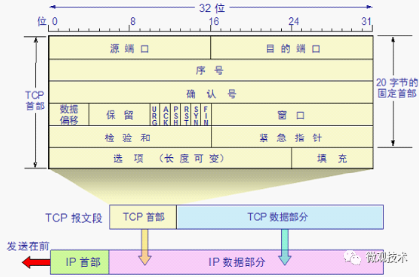
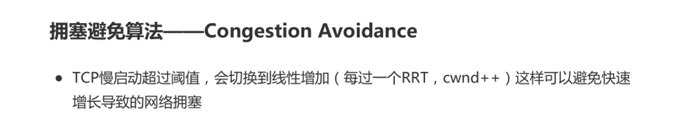
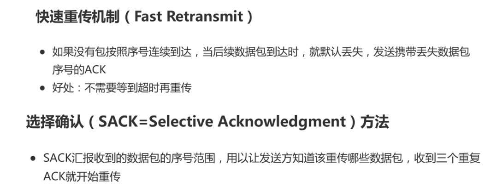
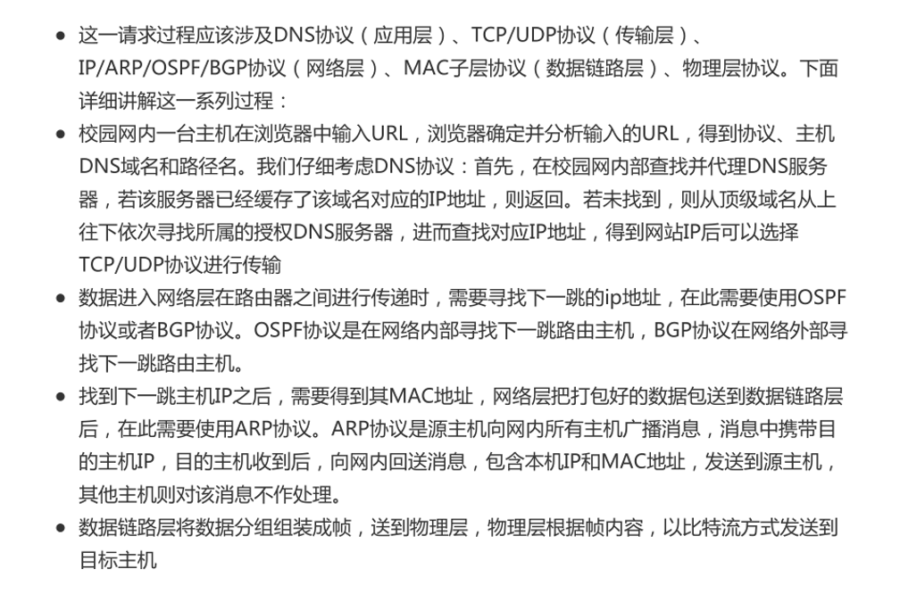

## 数据链路层

### 循环冗余校验（CRC）


## 网络层

### IP包头格式


### 路由算法

1、**距离矢量路由算法（distance vector routing）**

算法原理：每个路由器维护一张表，表中记录了当前已知的到每个目标的最佳距离，以及所使用的链路。这些表通过邻居之间相互交换信息而不断更新，最终每个路由器都了解到每个目的地的最佳链路。

无穷计算问题

 

2、**链路状态路由算法（link state routing）**

每一个路由器必须完成以下事情，算法才能正常工作：

（1）发现它的邻居结点，并了解其网络地址

（2）设置到每个邻居结点的距离或成本度量值

（3）构造一个包含这些数据的包

（4）将这个包发送给所有其他路由器，并接收来自所有其他路由器的信息包

（5）计算出到每个其他路由器的最短路径

 

基于链路状态路由算法的路由协议有：OSPF，IS-IS


### RIP协议

RIP（Routing Information Protocol）是内部网关协议IGP中最先得到广泛使用的协议，它的中文名称叫做路由信息协议，但很少被使用。RIP是一种分布式的**基于距离向量的路由选择协议**，是互联网的标准协议，其最大优点就是简单。

RIP协议要求网络中的每一个路由器都要维护从它自己到其他每一个目的网络的距离记录（因此，这是**一组距离**，即“**距离向量**”）。RIP协议将“距离”定义如下：

从一路由器到直接连接的网络的距离定义为1。从一路由器到非直接连接的网络的距离定义为所经过的路由器数加1。“加1” 是因为到达目的网络后就进行直接交付，而到直接连接的网络的距离已经定义为1。

RIP协议的“距离”也称为“**跳数**”（hop count）0，因为每经过一个路由器，跳数就加1。RIP认为好的路由就是它通过的路由器的数目少，即“距离短”。RIP允许一条路径最多只能包含15个路由器。因此“距离”等于16时即相当于不可达。可见RIP只适用于小型互联网。

需要注意的是，到直接连接的网络的距离也可定义为0（采用这种定义的理由是：路由器在和直接连接在该网络上的主机通信时，不需要经过另外的路由器。既然每经过一个路由器要将距离加1，那么不再经过路由器的距离就应当为0）。两种不同的定义对实现RIP协议并无影响，因为重要的是要找出最短距离，将所有的距离都加1或都减1，对选择最佳路由其实是一样的。


RIP不能在两个网络之间同时使用多条路由。RIP选择一条具有最少路由器的路由（即最短路由），哪怕还存在另一条高速（低时延）但路由器较多的路由。

本篇讨论的RIP协议和下一节要讨论的OSPF协议，都是分布式路由选择协议。它们的共同特点就是每一个路由器都要不断地和其他一些路由器交换路由信息。我们一定要弄清以下三个要点，**即和哪些路由器交换信息？交换什么信息？在什么时候交换信息？**


RIP协议的特点是：

（1）**仅和相邻路由器交换信息**。如果两个路由器之间的通信不需要经过另一个路由器，那么这两个路由器就是相邻的。RIP协议规定，不相邻的路由器不交换信息。

（2）路由器交换的信息是**当前本路由器所知道的全部信息**，即自己现在的路由表。也就是说，交换的信息是：“我到本自治系统中所有网络的（最短）距离，以及到每个网络应经过的下一跳路由器”。

（3）**按固定的时间间隔**交换路由信息，例如，每隔30秒。然后路由器根据收到的路由信息更新路由表。当网络拓扑发生变化时，路由器也及时向相邻路由器通告拓扑变化后的路由信息。


这里要强调一点：路由器在**刚刚开始工作时**，它的路由表是空的。然后路由器就得出到直接相连的几个网络的距离（这些距离定义为1）。接着，每一个路由器也只和数目非常有限的相邻路由器交换并更新路由信息。但经过若干次的更新后，所有的路由器最终都会知道到达本自治系统中任何一个网络的最短距离和下一跳路由器的地址。


看起来RIP协议有些奇怪，因为“我的路由表中的信息要依赖于你的，而你的信息又依赖于我的。”然而事实证明，通过这样的方式——“我告诉别人一些信息，而别人又告诉我一些信息。我再把我知道的更新后的信息告诉别人，别人也这样把更新后的信息再告诉我”，最后在自治系统中所有的结点都得到了正确的路由选择信息。在一般情况下，RIP协议可以收敛，并且过程也较快。“收敛”就是在自治系统中所有的结点都得到正确的路由选择信息的过程。


路由表中最主要的信息就是：到某个网络的距离（即最短距离），以及应经过的下一跳地址。路由表更新的原则是找出到每个目的网络的**最短距离**。这种更新算法又称为**距离向量算法**。明天介绍RIP协议使用的距离向量算法。


### OSPF协议

**OSPF协议的基本特点**

这个协议的名字是**开放最短路径优先OSPF**（Open Shortest Path First）。它是为克服RIP的缺点在1989年开发出来的。OSPF的原理很简单，但实现起来却较复杂。“开放”表明OSPF协议不是受某一家厂商控制，而是公开发表的。**“最短路径优先”是因为使用了Dijkstra提出的最短路径算法SPF**。OSPF的第二个版本OSPF2已成为互联网标准协议,请注意：OSPF只是一个协议的名字，**它并不表示其他的路由选择协议不是“最短路径优先”**。实际上，所有的在自治系统内部使用的路由选择协议（包括RIP协议）都是要寻找一条最短的路径。


OSPF 最主要的特征就是使用分布式的**链路状态协议**（link state protocol），而不是像RIP那样的距离向量协议。和RIP协议相比，OSPF的三个要点和RIP的都不一样：


（1）向本自治系统中**所有路由器**发送信息。这里使用的方法是洪泛法（flooding），这就是路由器通过所有输出端口向所有相邻的路由器发送信息。而每一个相邻路由器又再将此信息发往其所有的相邻路由器（但不再发送给刚刚发来信息的那个路由器）。这样，最终整个区域中所有的路由器都得到了这个信息的一个副本。更具体的做法后面还要讨论。我们应注意，RIP协议是仅仅向自己相邻的几个路由器发送信息。


（2）发送的信息就是与本路由器**相邻的所有路由器****的链路状态**，但这只是路由器所知道的部分信息。所谓“链路状态”就是说明本路由器都和哪些路由器相邻，以及该链路的**“度量”**（metric）。OSPF将这个“度量”用来表示费用、距离、时延、带宽，等等。这些都由网络管理人员来决定，因此较为灵活。有时为了方便就称这个度量为“代价”。我们应注意，对于RIP协议，发送的信息是：“到所有网络的距离和下一跳路由器”。


（3）只有当链路状态发生变化时，路由器才向所有路由器用洪泛法发送此信息。而不像RIP那样，不管网络拓扑有无发生变化，路由器之间都要定期交换路由表的信息。


从上述的三个方面可以看出，OSPF和RIP的工作原理相差较大。


由于各路由器之间频繁地交换链路状态信息，因此所有的路由器最终都能建立一个**链路状态数据库**（link-state database），这个数据库实际上就是**全网的拓扑结构图**。这个拓扑结构图在全网范围内是**一致的**（这称为**链路状态数据库的同步**）。因此，每一个路由器都知道全网共有多少个路由器，以及哪些路由器是相连的，其代价是多少，等等。每一个路由器使用链路状态数据库中的数据，构造出自己的路由表（例如，使用Dijkstra的最短路径路由算法）。


我们注意到，RIP协议的每一个路由器虽然知道到所有的网络的距离以及下一跳路由器，但却不知道全网的拓扑结构（只有到了下一跳路由器，才能知道再下一跳应当怎样。OSPF的链路状态数据库能较快地进行更新，使各个路由器能及时更新其路由表。


OSPF的更新过程收敛得快是其重要优点。


### 子网掩码计算

\1.    有以下四个IP地址块（address block）：

\1)     192.168.0.0/23 

\2)     192.168.2.0/23 

\3)     192.168.4.0/22 

\4)     192.168.8.0/21

请分别算出这四个IP地址块对应的网络掩码（netmask）。请写出计算过程。

若将这四个IP地址块进行聚合，聚合后得到的IP地址块的IP地址前缀（IP Prefix ）是多少？请写出计算过程。


## 一、网络模型

### OSI网络七层模型，简单介绍每层的作用？

答案：分为7层，从下到上依次是：

- 应用层：计算机用户与网络之间的接口，常见的协议有：HTTP、FTP、 SMTP、TELNET
- 表示层：数据的表示、安全、压缩。将应用处理的信息转换为适合网络传输的格式。
- 会话层：建立和管理本地主机与远程主机之间的会话。
- 传输层：定义传输数据的`协议端口号`，以及流量控制和差错校验，保证报文能正确传输。协议有TCP、UDP
- 网络层：使用路由选择算法，进行逻辑地址寻址，实现不同网络之间的最佳路径选择。协议有IP、ICMP
- 数据链路层：接收来自物理层的位流形式的数据，并封装成帧，传送到上一层；同样，也将来自上层的数据帧，拆装为位流形式的数据转发到物理层。这一层的数据叫做帧。
- 物理层：建立、维护、断开物理连接。传输比特流（将1、0转化为电流强弱来进行传输，到达目的地后在转化为1、0，也就是我们常说的数模转换与模数转换）。这一层的数据叫做比特。


### 四层TCP/IP模型

**TCP/IP 模型**：也叫做互联网协议栈，是目前互联网所使用的通信模型，由 TCP 协议和 IP 协议的规范发展而来，分为 4 层。


四层网络模型每层各司其职，消息在进入每一层时都会多加一个**报头**，每多一个报头可以理解为**数据报多戴一顶帽子**。这个报头上面记录着消息从哪来，到哪去，以及消息多长等信息。比如，**`mac头部`记录的是硬件的唯一地址，`IP头`记录的是从哪来和到哪去，传输层头记录到是到达目的主机后具体去哪个进程**。

在从消息发到网络的时候给消息带上报头，消息和纷繁复杂的网络中通过这些信息在路由器间流转，最后到达目的机器上，接受者再通过这些报头，一步一步还原出发送者最原始要发送的消息。


## 二、传输层

### TCP 报文首部有哪些字段?

TCP 头部标准长度是 20 字节。包含源端口、目的端口、序列号、确认号、数据偏移、保留位、控制位、窗口大小、校验和、紧急指针、选项等。



- 源端口、目的端口：各占2个字节，表示数据从哪个进程来，去往哪个进程

- 序号（Sequence Number）：占4个字节，TCP连接中传送的数据每一个字节都会有一个序号

- 确认号（Acknowledgement Number）：占4个字节，另一方发送的tcp报文段的响应

- 数据偏移：头部长度，占4个字节，表示TCP报文段的数据距离TCP报文段的起始处有多远。

- 6位标志位：

- - URG：紧急指针是否有效
  - ACK：表示确认号是否有效
  - PSH：提示接收端应用程序立刻将数据从tcp缓冲区读走
  - RST：表示要求对方重新建立连接
  - SYN：这是一个连接请求或连接接受的报文
  - FIN：告知对方本端要关闭连接

- 窗口大小：占4个字节，用于TCP流量控制。告诉对方本端的TCP接收缓冲区还能容纳多少字节的数据，这样对方就可以控制发送数据的速度。

- 校验和：占2个字节，由发送端填充，接收端对TCP报文段执行CRC算法以检验TCP报文段在传输过程中是否损坏。检验的范围包括头部、数据两部分，是TCP可靠传输的一个重要保障。

- 紧急指针：占2个字节，一个正的偏移量。它和序号字段的值相加表示最后一个紧急数据的下一个字节的序号，用于发送端向接收端发送紧急数据。


### TCP三次握手

**三次握手过程：**

- 第一次握手，客户端发送SYN (seq=x)（随机产生的序列号），客户端进入`SYN_SENT`状态
- 第二次握手，服务端响应SYN,ACK (Seq=y, Ack=x+1)，服务器端就进入`SYN_RCVD`状态。
- 第三次握手，客户端收到服务端的确认后，发送ACK (Ack=y+1)，客户端进入`ESTABLISHED`状态。当服务器端接收到这个包时，也进入`ESTABLISHED`状态。


**为什么需要“三次握手”？**

“三次握手”的目的是“**为了防止已失效的连接请求报文段突然又传送到了服务端，因而产生错误**”。具体例如：client发出的第一个连接请求报文段并没有丢失，而是在某个网络结点长时间的滞留了，以致延误到连接释放以后的某个时间才到达server。本来这是一个早已失效的报文段。但server收到此失效的连接请求报文段后，就误认为是client再次发出的一个新的连接请求。于是就向client发出确认报文段，同意建立连接。假设不采用“三次握手”，那么只要server发出确认，新的连接就建立了。由于现在client并没有发出建立连接的请求，因此不会理睬server的确认，也不会向server发送数据。但server却以为新的运输连接已经建立，并一直等待client发来数据。这样，server的很多资源就白白浪费掉了。采用“三次握手”的办法可以防止上述现象发生。例如刚才那种情况，client不会向server的确认发出确认。server由于收不到确认，就知道client并没有要求建立连接。主要目的防止server端一直等待，浪费资源。

**为什么是三次握手，而不是两次或四次？**

答案：

如果只有两次握手，那么服务端向客户端发送 `SYN/ACK` 报文后，就会认为连接建立。但是如果客户端没有收到报文，那么客户端是没有建立连接的，这就导致服务端会浪费资源。

使用两次握手无法建立 TCP 连接，而使用三次握手是建立连接所需要的最小次数，不需要使用更多的通信次数。


**三次握手过程中各状态介绍：**

（1）**LISTEN**: 这个也是非常容易理解的一个状态，表示服务器端的某个SOCKET处于监听状态，可以接受连接了。

（2）**SYN_SENT**: 当客户端SOCKET执行CONNECT连接时，它首先发送SYN报文，因此也随即它会进入到了SYN_SENT状态，并等待服务端的发送三次握手中的第2个报文。SYN_SENT状态表示客户端已发送SYN报文。(发送端)

（3）**SYN_RCVD**: 这个状态与SYN_SENT遥想呼应这个状态表示接受到了SYN报文，在正常情况下，这个状态是服务器端的SOCKET在建立TCP连接时的三次握手会话过程中的一个中间状态，很短暂，基本上用netstat你是很难看到这种状态的，除非你特意写了一个客户端测试程序，故意将三次TCP握手过程中最后一个ACK报文不予发送。因此这种状态时，当收到客户端的ACK报文后，它会进入到ESTABLISHED状态。(服务器端)

（4）**ESTABLISHED**：这个容易理解了，表示连接已经建立了。


### TCP四次挥手

**TCP四次挥手的过程：**

答案：

- 第一次挥手：客户端向服务端发送连接释放报文FIN
- 第二次挥手：服务端收到连接释放报文后，立即发出确认报文ACK。这时 TCP 连接处于半关闭状态，即客户端到服务端的连接已经释放了，但是服务端到客户端的连接还未释放。表示客户端已经没有数据发送了，但是服务端可能还要给客户端发送数据。
- 第三次挥手：服务端向客户端发送连接释放报文FIN
- 第四次挥手：客户端收到服务端的连接释放报文后，立即发出确认报文ACK。此时，客户端就进入了 `TIME-WAIT` 状态。注意此时客户端到 TCP 连接还没有释放，必须经过 2*MSL（最长报文段寿命）的时间后，才进入`CLOSED` 状态。


> 由于TCP连接是全双工的，因此每个方向都必须单独进行关闭。这原则是当一方完成它的数据发送任务后就能发送一个FIN来终止这个方向的连接。收到一个 FIN只意味着这一方向上没有数据流动，一个TCP连接在收到一个FIN后仍能发送数据。首先进行关闭的一方将执行主动关闭，而另一方执行被动关闭。


**为什么是“四次挥手”？**

因为当收到对方的FIN报文通知时，它仅仅表示对方没有数据发送给你了；但未必你所有的数据都全部发送给对方了，所以你可能还需要发送一些数据给对方，再发送FIN报文给对方来表示你同意现在可以关闭连接了，故这里的ACK报文和FIN报文多数情况下都是分开发送的，也就造成了4次挥手。


**四次挥手过程状态：**

（1）**FIN_WAIT_1**: 这个状态要好好解释一下，其实FIN_WAIT_1和FIN_WAIT_2状态的真正含义都是表示等待对方的FIN报文。而这两种状态的区别是：FIN_WAIT_1状态实际上是当SOCKET在ESTABLISHED状态时，它想主动关闭连接，向对方发送了FIN报文，此时该SOCKET即进入到FIN_WAIT_1状态。而当对方回应ACK报文后，则进入到FIN_WAIT_2状态，当然在实际的正常情况下，无论对方何种情况下，都应该马上回应ACK报文，所以FIN_WAIT_1状态一般是比较难见到的，而FIN_WAIT_2状态还有时常常可以用netstat看到。(主动方)

（2）**FIN_WAIT_2**：上面已经详细解释了这种状态，实际上FIN_WAIT_2状态下的SOCKET，表示半连接，也即有一方要求close连接，但另外还告诉对方，我暂时还有点数据需要传送给你(ACK信息)，稍后再关闭连接。(主动方)

（3）**TIME_WAIT**: 表示收到了对方的FIN报文，并发送出了ACK报文，就等2MSL后即可回到CLOSED可用状态了。如果FIN_WAIT_1状态下，收到了对方同时带FIN标志和ACK标志的报文时，可以直接进入到TIME_WAIT状态，而无须经过FIN_WAIT_2状态。(主动方)

> 注意：主动关闭连接的，才有TIME_WAIT状态

（4）**CLOSING**(比较少见): 这种状态比较特殊，实际情况中应该是很少见，属于一种比较罕见的例外状态。正常情况下，当你发送FIN报文后，按理来说是应该先收到(或同时收到)对方的ACK报文，再收到对方的FIN报文。但是CLOSING状态表示你发送FIN报文后，并没有收到对方的ACK报文，反而却也收到了对方的FIN报文。什么情况下会出现此种情况呢?其实细想一下，也不难得出结论：那就是如果双方几乎在同时close一个SOCKET的话，那么就出现了双方同时发送FIN报文的情况，也即会出现CLOSING状态，表示双方都正在关闭SOCKET连接。

（5）**CLOSE_WAIT**: 这种状态的含义其实是表示在等待关闭。怎么理解呢?当对方close一个SOCKET后发送FIN报文给自己，你系统毫无疑问地会回应一个ACK报文给对方，此时则进入到CLOSE_WAIT状态。接下来呢，实际上你真正需要考虑的事情是察看你是否还有数据发送给对方，如果没有的话，那么你也就可以close这个SOCKET，发送FIN报文给对方，也即关闭连接。所以你在CLOSE_WAIT状态下，需要完成的事情是等待你去关闭连接。(被动方)

（6）**LAST_ACK**: 这个状态还是比较容易好理解的，它是被动关闭一方在发送FIN报文后，最后等待对方的ACK报文。当收到ACK报文后，也即可以进入到CLOSED可用状态了。(被动方)


**为什么需要 TIME_WAIT 状态？**

主要是两个原因：

防止具有相同「四元组」的「旧」数据包被收到；

保证「被动关闭连接」的一方能被正确的关闭，即保证最后的 ACK 能让被动关闭⽅接收，从而帮助其正常关闭；


**TIME_WAIT过多有什么危害？**

过多的 TIME-WAIT 状态主要的危害有两种：

第一是内存资源占用；

第二是对端口资源的占用，一个 TCP 连接⾄少消耗⼀个本地端口。


**客户端 TIME-WAIT ，为什么要等待 2MSL 才进入 CLOSED 状态？**

答案：MSL 是报文段在网络上最大存活时间。

确保 ACK 报文能够到达服务端，从而使服务端正常关闭连接。客户端在发送完最后一个 ACK 报文段后，再经过 2MSL，就可以保证本连接持续的时间内产生的所有报文段都从网络中消失。这样就可以使下一个连接中不会出现这种旧的连接请求报文段。


### TCP半连接队列和全连接队列

在 TCP 三次握手的时候，Linux 内核会维护两个队列，分别是：

- 半连接队列，也称 SYN 队列；
- 全连接队列，也称 accept 队列

服务端收到客户端发起的 SYN 请求后，**内核会把该连接存储到半连接队列**，并向客户端响应 SYN+ACK，接着客户端会返回 ACK，服务端收到第三次握手的 ACK 后，**内核会把连接从半连接队列移除，然后创建新的完全的连接，并将其添加到** **accept** **队列，等待进程调用**accept **函数时把连接取出来。**


### TCP重传机制

TCP 实现可靠传输的方式之一，是通过序列号与确认应答。

在 TCP 中，当发送端的数据到达接收主机时，接收端主机会返回一个确认应答消息，表示已收到消息。


但在错综复杂的网络，并不一定能如上图那么顺利能正常的数据传输，万一数据在传输过程中丢失了呢？

所以 TCP 针对数据包丢失的情况，会用**重传机制**解决。

接下来说说常见的重传机制：

- 超时重传
- 快速重传
- SACK
- D-SACK

#### 超时重传

重传机制的其中一个方式，就是在发送数据时，设定一个定时器，当超过指定的时间后，没有收到对方的 `ACK` 确认应答报文，就会重发该数据，也就是我们常说的**超时重传**。

TCP 会在以下两种情况发生超时重传：

- 数据包丢失
- 确认应答丢失


> 超时时间应该设置为多少呢？

我们先来了解一下什么是 `RTT`（Round-Trip Time 往返时延），从下图我们就可以知道：


`RTT` 就是**数据从网络一端传送到另一端所需的时间**，也就是包的往返时间。

超时重传时间是以 `RTO` （Retransmission Timeout 超时重传时间）表示。

假设在重传的情况下，超时时间 `RTO` 「较长或较短」时，会发生什么事情呢？


上图中有两种超时时间不同的情况：

- 当超时时间 **RTO 较大**时，重发就慢，丢了老半天才重发，没有效率，性能差；
- 当超时时间 **RTO 较小**时，会导致可能并没有丢就重发，于是重发的就快，会增加网络拥塞，导致更多的超时，更多的超时导致更多的重发。

精确的测量超时时间 `RTO` 的值是非常重要的，这可让我们的重传机制更高效。

根据上述的两种情况，我们可以得知，**超时重传时间 RTO 的值应该略大于报文往返  RTT 的值**。


至此，可能大家觉得超时重传时间 `RTO` 的值计算，也不是很复杂嘛。

好像就是在发送端发包时记下 `t0` ，然后接收端再把这个 `ack` 回来时再记一个 `t1`，于是 `RTT = t1 – t0`。没那么简单，**这只是一个采样，不能代表普遍情况**。

实际上「报文往返 RTT 的值」是经常变化的，因为我们的网络也是时常变化的。也就因为「报文往返 RTT 的值」 是经常波动变化的，所以「超时重传时间 RTO 的值」应该是一个**动态变化的值**。

我们来看看 Linux 是如何计算 `RTO` 的呢？

估计往返时间，通常需要采样以下两个：

- 需要 TCP 通过采样 RTT 的时间，然后进行加权平均，算出一个平滑 RTT 的值，而且这个值还是要不断变化的，因为网络状况不断地变化。
- 除了采样 RTT，还要采样 RTT 的波动范围，这样就避免如果 RTT 有一个大的波动的话，很难被发现的情况。

RFC6289 建议使用以下的公式计算 RTO：


其中 `SRTT` 是计算平滑的RTT ，`DevRTR` 是计算平滑的RTT 与 最新 RTT 的差距。

在 Linux 下，**α = 0.125，β = 0.25， μ = 1，∂ = 4**。别问怎么来的，问就是大量实验中调出来的。

如果超时重发的数据，再次超时的时候，又需要重传的时候，TCP 的策略是**超时间隔加倍。**

也就是**每当遇到一次超时重传的时候，都会将下一次超时时间间隔设为先前值的两倍。两次超时，就说明网络环境差，不宜频繁反复发送。**

超时触发重传存在的问题是，超时周期可能相对较长。那是不是可以有更快的方式呢？

于是就可以用「快速重传」机制来解决超时重发的时间等待。

#### 快速重传

TCP 还有另外一种**快速重传（Fast Retransmit）机制**，它**不以时间为驱动，而是以数据驱动重传**。

快速重传机制，是如何工作的呢？其实很简单，一图胜千言。

																	

在上图，发送方发出了 1，2，3，4，5 份数据：

- 第一份 Seq1 先送到了，于是就 Ack 回 2；
- 结果 Seq2 因为某些原因没收到，Seq3 到达了，于是还是 Ack 回 2；
- 后面的 Seq4 和 Seq5 都到了，但还是 Ack 回 2，因为 Seq2 还是没有收到；
- **发送端收到了三个 Ack = 2 的确认，知道了 Seq2 还没有收到，就会在定时器过期之前，重传丢失的 Seq2。**
- 最后，接收到收到了 Seq2，此时因为 Seq3，Seq4，Seq5 都收到了，于是 Ack 回 6 。

所以，快速重传的工作方式是当收到三个相同的 ACK 报文时，会在定时器过期之前，重传丢失的报文段。

快速重传机制只解决了一个问题，就是超时时间的问题，但是它依然面临着另外一个问题。就是**重传的时候，是重传之前的一个，还是重传所有的问题。**

比如对于上面的例子，是重传 Seq2 呢？还是重传 Seq2、Seq3、Seq4、Seq5 呢？因为发送端并不清楚这连续的三个 Ack 2 是谁传回来的。

根据 TCP 不同的实现，以上两种情况都是有可能的。可见，这是一把双刃剑。

为了解决不知道该重传哪些 TCP 报文，于是就有 `SACK` 方法。

#### SACK 方法

还有一种实现重传机制的方式叫：`SACK`（ Selective Acknowledgment 选择性确认）。

这种方式需要在 TCP 头部「选项」字段里加一个 `SACK` 的东西，它**可以将缓存的map发送给发送方**，这样发送方就可以知道哪些数据收到了，哪些数据没收到，知道了这些信息，就可以**只重传丢失的数据**。

如下图，发送方收到了三次同样的 ACK 确认报文，于是就会触发快速重发机制，通过 `SACK` 信息发现只有 `200~299` 这段数据丢失，则重发时，就只选择了这个 TCP 段进行重复。


如果要支持 `SACK`，必须双方都要支持。在 Linux 下，可以通过 `net.ipv4.tcp_sack` 参数打开这个功能（Linux 2.4 后默认打开）。

#### Duplicate SACK

Duplicate SACK 又称 `D-SACK`，其主要**使用了 SACK 来告诉「发送方」有哪些数据被重复接收了。**

下面举例两个栗子，来说明 `D-SACK` 的作用。

*栗子一号：ACK 丢包*


- 
  「接收方」发给「发送方」的两个 ACK 确认应答都丢失了，所以发送方超时后，重传第一个数据包（3000 ~ 3499）
- **于是「接收方」发现数据是重复收到的，于是回了一个 SACK = 3000~3500**，告诉「发送方」 3000~3500 的数据早已被接收了，因为 ACK 都到了 4000 了，已经意味着 4000 之前的所有数据都已收到，所以这个 SACK 就代表着 `D-SACK`。
- 这样「发送方」就知道了，数据没有丢，是「接收方」的 ACK 确认报文丢了。

*栗子二号：网络延时*


- 数据包（1000~1499） 被网络延迟了，导致「发送方」没有收到 Ack 1500 的确认报文。
- 而后面报文到达的三个相同的 ACK 确认报文，就触发了快速重传机制，但是在重传后，被延迟的数据包（1000~1499）又到了「接收方」；
- **所以「接收方」回了一个 SACK=1000~1500，因为 ACK 已经到了 3000，所以这个 SACK 是 D-SACK，表示收到了重复的包。**
- 这样发送方就知道快速重传触发的原因不是发出去的包丢了，也不是因为回应的 ACK 包丢了，而是因为网络延迟了。

可见，`D-SACK` 有这么几个好处：

1. 可以让「发送方」知道，是发出去的包丢了，还是接收方回应的 ACK 包丢了;
2. 可以知道是不是「发送方」的数据包被网络延迟了;
3. 可以知道网络中是不是把「发送方」的数据包给复制了;

在 Linux 下可以通过 `net.ipv4.tcp_dsack` 参数开启/关闭这个功能（Linux 2.4 后默认打开）。


### TCP 滑动窗口

**TCP怎么控制流量传输的速度？**

答案：简单讲通过`滑动窗口`。发送、接收窗口的大小可以用来控制 TCP 协议的流速。窗口越大，同时可以发送、接收的数据就越多，吞吐量也就越大。但是窗口越大，如果数据发生错误，损失也就越大，因为需要重传越多的数据。

TCP每个请求都要有响应，如果一个请求没有收到响应，发送方就会认为这次发送出现了故障，会触发重发。为了提升吞吐量，一个TCP段在没有收到响应时，可以继续发送下一个段。


- 窗口区域包含两类数据：已发送未确认、未发送（即将发送）
- 窗口中序号最小的分组如果收到 ACK，窗口就会向右滑动
- 滑动窗口的size规格可能会变化，需要从ACK数据包实时取最新值
- 如果最小序号的分组长时间没有收到 ACK，就会触发整个窗口的数据重新发送


假设窗口大小为 `3` 个 TCP 段，那么发送方就可以「连续发送」 `3` 个 TCP 段，并且中途若有 ACK 丢失，可以通过「下一个确认应答进行确认」。如下图：


图中的 ACK 600 确认应答报文丢失，也没关系，因为可以通话下一个确认应答进行确认，只要发送方收到了 ACK 700 确认应答，就意味着 700 之前的所有数据「接收方」都收到了。这个模式就叫**累计确认**或者**累计应答**。

> 窗口大小由哪一方决定？

TCP 头里有一个字段叫 `Window`，也就是窗口大小。

**这个字段是接收端告诉发送端自己还有多少缓冲区可以接收数据。于是发送端就可以根据这个接收端的处理能力来发送数据，而不会导致接收端处理不过来。**

所以，通常窗口的大小是由接收方的决定的。

发送方发送的数据大小不能超过接收方的窗口大小，否则接收方就无法正常接收到数据。

> 发送方的滑动窗口

我们先来看看发送方的窗口，下图就是发送方缓存的数据，根据处理的情况分成四个部分，其中深蓝色方框是发送窗口，紫色方框是可用窗口：


- \#1 是已发送并收到 ACK确认的数据：1~31 字节
- \#2 是已发送但未收到 ACK确认的数据：32~45 字节
- \#3 是未发送但总大小在接收方处理范围内（接收方还有空间）：46~51字节
- \#4 是未发送但总大小超过接收方处理范围（接收方没有空间）：52字节以后

在下图，当发送方把数据「全部」都一下发送出去后，可用窗口的大小就为 0 了，表明可用窗口耗尽，在没收到 ACK 确认之前是无法继续发送数据了。


在下图，当收到之前发送的数据 `32~36` 字节的 ACK 确认应答后，如果发送窗口的大小没有变化，则**滑动窗口往右边移动 5 个字节，因为有 5 个字节的数据被应答确认**，接下来 `52~56` 字节又变成了可用窗口，那么后续也就可以发送 `52~56` 这 5 个字节的数据了。


> 程序是如何表示发送方的四个部分的呢？

TCP 滑动窗口方案使用三个指针来跟踪在四个传输类别中的每一个类别中的字节。其中两个指针是绝对指针（指特定的序列号），一个是相对指针（需要做偏移）。


- `SND.WND`：表示发送窗口的大小（大小是由接收方指定的）；
- `SND.UNA`：是一个绝对指针，它指向的是已发送但未收到确认的第一个字节的序列号，也就是 #2 的第一个字节。
- `SND.NXT`：也是一个绝对指针，它指向未发送但可发送范围的第一个字节的序列号，也就是 #3 的第一个字节。
- 指向 #4 的第一个字节是个相对指针，它需要 `SND.UNA` 指针加上 `SND.WND` 大小的偏移量，就可以指向 #4 的第一个字节了。

那么可用窗口大小的计算就可以是：

**可用窗口大 = SND.WND -（SND.NXT - SND.UNA）**

> 接收方的滑动窗口

接下来我们看看接收方的窗口，接收窗口相对简单一些，根据处理的情况划分成三个部分：

- \#1 + #2 是已成功接收并确认的数据（等待应用进程读取）；
- \#3 是未收到数据但可以接收的数据；
- \#4 未收到数据并不可以接收的数据；


其中三个接收部分，使用两个指针进行划分:

- `RCV.WND`：表示接收窗口的大小，它会通告给发送方。
- `RCV.NXT`：是一个指针，它指向期望从发送方发送来的下一个数据字节的序列号，也就是 #3 的第一个字节。
- 指向 #4 的第一个字节是个相对指针，它需要 `RCV.NXT` 指针加上 `RCV.WND` 大小的偏移量，就可以指向 #4 的第一个字节了。


> 接收窗口和发送窗口的大小是相等的吗？

并不是完全相等，接收窗口的大小是**约等于**发送窗口的大小的。

因为滑动窗口并不是一成不变的。比如，当接收方的应用进程读取数据的速度非常快的话，这样的话接收窗口可以很快的就空缺出来。那么新的接收窗口大小，是通过 TCP 报文中的 Windows 字段来告诉发送方。那么这个传输过程是存在时延的，所以接收窗口和发送窗口是约等于的关系。

### TCP流量控制

发送方不能无脑的发数据给接收方，要考虑接收方处理能力。

如果一直无脑的发数据给对方，但对方处理不过来，那么就会导致触发重发机制，从而导致网络流量的无端的浪费。

为了解决这种现象发生，**TCP 提供一种机制可以让「发送方」根据「接收方」的实际接收能力控制发送的数据量，这就是所谓的流量控制。**

下面举个栗子，为了简单起见，假设以下场景：

- 客户端是接收方，服务端是发送方
- 假设接收窗口和发送窗口相同，都为 `200`
- 假设两个设备在整个传输过程中都保持相同的窗口大小，不受外界影响


根据上图的流量控制，说明下每个过程：

1. 客户端向服务端发送请求数据报文。这里要说明下，本次例子是把服务端作为发送方，所以没有画出服务端的接收窗口。
2. 服务端收到请求报文后，发送确认报文和 80 字节的数据，于是可用窗口 `Usable` 减少为 120 字节，同时 `SND.NXT` 指针也向右偏移 80 字节后，指向 321，**这意味着下次发送数据的时候，序列号是 321。**
3. 客户端收到 80 字节数据后，于是接收窗口往右移动 80 字节，`RCV.NXT` 也就指向 321，**这意味着客户端期望的下一个报文的序列号是 321**，接着发送确认报文给服务端。
4. 服务端再次发送了 120 字节数据，于是可用窗口耗尽为 0，服务端无法在继续发送数据。
5. 客户端收到 120 字节的数据后，于是接收窗口往右移动 120 字节，`RCV.NXT` 也就指向 441，接着发送确认报文给服务端。
6. 服务端收到对 80 字节数据的确认报文后，`SND.UNA` 指针往右偏移后指向 321，于是可用窗口 `Usable` 增大到 80。
7. 服务端收到对 120 字节数据的确认报文后，`SND.UNA` 指针往右偏移后指向 441，于是可用窗口 `Usable` 增大到 200。
8. 服务端可以继续发送了，于是发送了 160 字节的数据后，`SND.NXT` 指向 601，于是可用窗口  `Usable` 减少到 40。
9. 客户端收到 160 字节后，接收窗口往右移动了 160 字节，`RCV.NXT` 也就是指向了 601，接着发送确认报文给服务端。
10. 服务端收到对 160 字节数据的确认报文后，发送窗口往右移动了 160 字节，于是 `SND.UNA` 指针偏移了 160 后指向 601，可用窗口 `Usable` 也就增大至了 200。

#### 操作系统缓冲区与滑动窗口的关系

前面的流量控制例子，我们假定了发送窗口和接收窗口是不变的，但是实际上，发送窗口和接收窗口中所存放的字节数，都是放在操作系统内存缓冲区中的，而操作系统的缓冲区，会**被操作系统调整**。

当应用进程没办法及时读取缓冲区的内容时，也会对我们的缓冲区造成影响。

> 那操心系统的缓冲区，是如何影响发送窗口和接收窗口的呢？

*我们先来看看第一个例子。*

当应用程序没有及时读取缓存时，发送窗口和接收窗口的变化。

考虑以下场景：

- 客户端作为发送方，服务端作为接收方，发送窗口和接收窗口初始大小为 `360`；
- 服务端非常的繁忙，当收到客户端的数据时，应用层不能及时读取数据。


根据上图的流量控制，说明下每个过程：

1. 客户端发送 140 字节数据后，可用窗口变为 220 （360 - 140）。
2. 服务端收到 140 字节数据，**但是服务端非常繁忙，应用进程只读取了 40 个字节，还有 100 字节占用着缓冲区，于是接收窗口收缩到了 260 （360 - 100）**，最后发送确认信息时，将窗口大小通过给客户端。
3. 客户端收到确认和窗口通告报文后，发送窗口减少为 260。
4. 客户端发送 180 字节数据，此时可用窗口减少到 80。
5. 服务端收到 180 字节数据，**但是应用程序没有读取任何数据，这 180 字节直接就留在了缓冲区，于是接收窗口收缩到了 80 （260 - 180）**，并在发送确认信息时，通过窗口大小给客户端。
6. 客户端收到确认和窗口通告报文后，发送窗口减少为 80。
7. 客户端发送 80 字节数据后，可用窗口耗尽。
8. 服务端收到 80 字节数据，**但是应用程序依然没有读取任何数据，这 80 字节留在了缓冲区，于是接收窗口收缩到了 0**，并在发送确认信息时，通过窗口大小给客户端。
9. 客户端收到确认和窗口通告报文后，发送窗口减少为 0。

可见最后窗口都收缩为 0 了，也就是发生了窗口关闭。当发送方可用窗口变为 0 时，发送方实际上会定时发送窗口探测报文，以便知道接收方的窗口是否发生了改变，这个内容后面会说，这里先简单提一下。

*我们先来看看第二个例子。*

当服务端系统资源非常紧张的时候，操心系统可能会直接减少了接收缓冲区大小，这时应用程序又无法及时读取缓存数据，那么这时候就有严重的事情发生了，会出现数据包丢失的现象。


说明下每个过程：

1. 客户端发送 140 字节的数据，于是可用窗口减少到了 220。
2. **服务端因为现在非常的繁忙，操作系统于是就把接收缓存减少了 100 字节，当收到 对 140 数据确认报文后，又因为应用程序没有读取任何数据，所以 140 字节留在了缓冲区中，于是接收窗口大小从 360 收缩成了 100**，最后发送确认信息时，通告窗口大小给对方。
3. 此时客户端因为还没有收到服务端的通告窗口报文，所以不知道此时接收窗口收缩成了 100，客户端只会看自己的可用窗口还有 220，所以客户端就发送了 180 字节数据，于是可用窗口减少到 40。
4. 服务端收到了 180 字节数据时，**发现数据大小超过了接收窗口的大小，于是就把数据包丢失了。**
5. 客户端收到第 2 步时，服务端发送的确认报文和通告窗口报文，尝试减少发送窗口到 100，把窗口的右端向左收缩了 80，此时可用窗口的大小就会出现诡异的负值。

所以，如果发生了先减少缓存，再收缩窗口，就会出现丢包的现象。

**为了防止这种情况发生，TCP 规定是不允许同时减少缓存又收缩窗口的，而是采用先收缩窗口，过段时间在减少缓存，这样就可以避免了丢包情况。**

#### 窗口关闭

在前面我们都看到了，TCP 通过让接收方指明希望从发送方接收的数据大小（窗口大小）来进行流量控制。

**如果窗口大小为 0 时，就会阻止发送方给接收方传递数据，直到窗口变为非 0 为止，这就是窗口关闭。**

> 窗口关闭潜在的危险

接收方向发送方通告窗口大小时，是通过 `ACK` 报文来通告的。

那么，当发生窗口关闭时，接收方处理完数据后，会向发送方通告一个窗口非 0 的 ACK 报文，如果这个通告窗口的 ACK 报文在网络中丢失了，那麻烦就大了。


这会导致发送方一直等待接收方的非 0 窗口通知，接收方也一直等待发送方的数据，如不不采取措施，这种相互等待的过程，会造成了死锁的现象。

> TCP 是如何解决窗口关闭时，潜在的死锁现象呢？

为了解决这个问题，TCP 为每个连接设有一个持续定时器，**只要 TCP 连接一方收到对方的零窗口通知，就启动持续计时器。**

如果持续计时器超时，就会发送**窗口探测 ( Window probe ) 报文**，而对方在确认这个探测报文时，给出自己现在的接收窗口大小。


- 如果接收窗口仍然为 0，那么收到这个报文的一方就会重新启动持续计时器；
- 如果接收窗口不是 0，那么死锁的局面就可以被打破了。

窗口探查探测的次数一般为 3 此次，每次次大约 30-60 秒（不同的实现可能会不一样）。如果 3 次过后接收窗口还是 0 的话，有的 TCP 实现就会发 `RST` 报文来中断连接。

#### 糊涂窗口综合症

如果接收方太忙了，来不及取走接收窗口里的数据，那么就会导致发送方的发送窗口越来越小。

到最后，**如果接收方腾出几个字节并告诉发送方现在有几个字节的窗口，而发送方会义无反顾地发送这几个字节，这就是糊涂窗口综合症**。

要知道，我们的 `TCP + IP` 头有 `40` 个字节，为了传输那几个字节的数据，要达上这么大的开销，这太不经济了。

就好像一个可以承载 50 人的大巴车，每次来了一两个人，就直接发车。除非家里有矿的大巴司机，才敢这样玩，不然迟早破产。要解决这个问题也不难，大巴司机等乘客数量超过了 25 个，才认定可以发车。

现举个糊涂窗口综合症的栗子，考虑以下场景：

接收方的窗口大小是 360 字节，但接收方由于某些原因陷入困境，假设接收方的应用层读取的能力如下：

- 接收方每接收 3 个字节，应用程序就只能从缓冲区中读取 1 个字节的数据；
- 在下一个发送方的 TCP 段到达之前，应用程序
  还从缓冲区中读取了 40 个额外的字节；


每个过程的窗口大小的变化，在图中都描述的很清楚了，可以发现窗口不断减少了，并且发送的数据都是比较小的了。

所以，糊涂窗口综合症的现象是可以发生在发送方和接收方：

- 接收方可以通告一个小的窗口
- 而发送方可以发送小数据

于是，要解决糊涂窗口综合症，就解决上面两个问题就可以了

- 让接收方不通告小窗口给发送方
- 让发送方避免发送小数据


> 怎么让接收方不通告小窗口呢？

接收方通常的策略如下:

当「窗口大小」小于 min( MSS，缓存空间/2 ) ，也就是小于 MSS 与 1/2 缓存大小中的最小值时，就会向发送方通告窗口为 `0`，也就阻止了发送方再发数据过来。

等到接收方处理了一些数据后，窗口大小 >= MSS，或者接收方缓存空间有一半可以使用，就可以把窗口打开让发送方发送数据过来。

> 怎么让发送方避免发送小数据呢？

发送方通常的策略:

使用 Nagle 算法，该算法的思路是延时处理，它满足以下两个条件中的一条才可以发送数据：

- 要等到窗口大小 >= `MSS` 或是 数据大小 >= `MSS`
- 收到之前发送数据的 `ack` 回包

只要没满足上面条件中的一条，发送方一直在囤积数据，直到满足上面的发送条件。

另外，Nagle 算法默认是打开的，如果对于一些需要小数据包交互的场景的程序，比如，telnet 或 ssh 这样的交互性比较强的程序，则需要关闭 Nagle 算法。

可以在 Socket 设置 `TCP_NODELAY` 选项来关闭这个算法（关闭 Nagle 算法没有全局参数，需要根据每个应用自己的特点来关闭）

```
setsockopt(sock_fd, IPPROTO_TCP, TCP_NODELAY, (char *)&value, sizeof(int));
```


### TCP拥塞控制

> 为什么要有拥塞控制呀，不是有流量控制了吗？

前面的流量控制是避免「发送方」的数据填满「接收方」的缓存，但是并不知道网络的中发生了什么。

一般来说，计算机网络都处在一个共享的环境。因此也有可能会因为其他主机之间的通信使得网络拥堵。

**在网络出现拥堵时，如果继续发送大量数据包，可能会导致数据包时延、丢失等，这时 TCP 就会重传数据，但是一重传就会导致网络的负担更重，于是会导致更大的延迟以及更多的丢包，这个情况就会进入恶性循环被不断地放大….**

所以，TCP 不能忽略网络上发生的事，它被设计成一个无私的协议，当网络发送拥塞时，TCP 会自我牺牲，降低发送的数据量。

于是，就有了**拥塞控制**，控制的目的就是**避免「发送方」的数据填满整个网络。**

为了在「发送方」调节所要发送数据的量，定义了一个叫做「**拥塞窗口**」的概念。

> 什么是拥塞窗口？和发送窗口有什么关系呢？

**拥塞窗口 cwnd**是发送方维护的一个 的状态变量，它会根据**网络的拥塞程度动态变化的**。

我们在前面提到过发送窗口 `swnd` 和接收窗口 `rwnd` 是约等于的关系，那么由于入了拥塞窗口的概念后，此时发送窗口的值是swnd = min(cwnd, rwnd)，也就是拥塞窗口和接收窗口中的最小值。

拥塞窗口 `cwnd` 变化的规则：

- 只要网络中没有出现拥塞，`cwnd` 就会增大；
- 但网络中出现了拥塞，`cwnd` 就减少；

> 那么怎么知道当前网络是否出现了拥塞呢？

其实只要「发送方」没有在规定时间内接收到 ACK 应答报文，也就是**发生了超时重传，就会认为网络出现了用拥塞。**

> 拥塞控制有哪些控制算法？

拥塞控制主要是四个算法：

- 慢启动
- 拥塞避免
- 拥塞发生
- 快速恢复

#### 慢启动

TCP 在刚建立连接完成后，首先是有个慢启动的过程，这个慢启动的意思就是一点一点的提高发送数据包的数量，如果一上来就发大量的数据，这不是给网络添堵吗？

慢启动的算法记住一个规则就行：**当发送方每收到一个 ACK，就拥塞窗口 cwnd 的大小就会加 1。**

这里假定拥塞窗口 `cwnd` 和发送窗口 `swnd` 相等，下面举个栗子：

- 连接建立完成后，一开始初始化 `cwnd = 1`，表示可以传一个 `MSS` 大小的数据。
- 当收到一个 ACK 确认应答后，cwnd 增加 1，于是一次能够发送 2 个
- 当收到 2 个的 ACK 确认应答后， cwnd 增加 2，于是就可以比之前多发2 个，所以这一次能够发送 4 个
- 当这 4 个的 ACK 确认到来的时候，每个确认 cwnd 增加 1， 4 个确认 cwnd 增加 4，于是就可以比之前多发 4 个，所以这一次能够发送 8 个。


可以看出慢启动算法，发包的个数是**指数性的增长**。

> 那慢启动涨到什么时候是个头呢？

有一个叫慢启动门限  `ssthresh` （slow start threshold）状态变量。

- 当 `cwnd < ssthresh` 时，使用慢启动算法。
- 当 `cwnd >= ssthresh` 时，就会使用「拥塞避免算法」。

#### 拥塞避免算法

前面说道，当拥塞窗口 `cwnd` 「超过」慢启动门限 `ssthresh` 就会进入拥塞避免算法。

一般来说 `ssthresh` 的大小是 `65535` 字节。

那么进入拥塞避免算法后，它的规则是：**每当收到一个 ACK 时，cwnd 增加 1/cwnd。（其实说白了，就是朴实无华的+1）**

接上前面的慢启动的栗子，现假定 `ssthresh` 为 `8`：

- 当 8 个 ACK 应答确认到来时，每个确认增加 1/8，8 个 ACK 确认 cwnd 一共增加 1，于是这一次能够发送 9 个 `MSS` 大小的数据，变成了**线性增长。**


所以，我们可以发现，拥塞避免算法就是将原本慢启动算法的指数增长变成了线性增长，还是增长阶段，但是增长速度缓慢了一些。

就这么一直增长着后，网络就会慢慢进入了拥塞的状况了，于是就会出现丢包现象，这时就需要对丢失的数据包进行重传。

当触发了重传机制，也就进入了「拥塞发生算法」。

#### 拥塞发生

当网络出现拥塞，也就是会发生数据包重传，重传机制主要有两种：

- 超时重传
- 快速重传

这两种使用的拥塞发送算法是不同的，接下来分别来说说。

> 发生超时重传的拥塞发生算法

当发生了「超时重传」，则就会使用拥塞发生算法。

这个时候，sshresh 和 cwnd 的值会发生变化：

- `ssthresh` 设为 `cwnd/2`，
- `cwnd` 重置为 `1`


接着，就重新开始慢启动，慢启动是会突然减少数据流的。这真是一旦「超时重传」，马上回到解放前。但是这种方式太激进了，反应也很强烈，会造成网络卡顿。

就好像本来在秋名山高速漂移着，突然来个紧急刹车，轮胎受得了吗。。。

> 发生快速重传的拥塞发生算法

还有更好的方式，前面我们讲过「快速重传算法」。当接收方发现丢了一个中间包的时候，发送三次前一个包的 ACK，于是发送端就会快速地重传，不必等待超时再重传。

TCP 认为这种情况不严重，因为大部分没丢，只丢了一小部分，则 `ssthresh` 和 `cwnd` 变化如下：

- `cwnd = cwnd/2` ，也就是设置为原来的一半;
- `ssthresh = cwnd`;
- 进入快速恢复算法

#### 快速恢复

快速重传和快速恢复算法一般同时使用，快速恢复算法是认为，你还能收到 3 个重复 ACK 说明网络也不那么糟糕，所以没有必要像 `RTO` 超时那么强烈。

正如前面所说，进入快速恢复之前，`cwnd` 和 `ssthresh` 已被更新了：

- `cwnd = cwnd/2` ，也就是设置为原来的一半;
- `ssthresh = cwnd`;

然后，进入快速恢复算法如下：

- 拥塞窗口 `cwnd = ssthresh + 3` （ 3 的意思是确认有 3 个数据包被收到了）
- 重传丢失的数据包
- 如果再收到重复的 ACK，那么 cwnd 增加 1
- 如果收到新数据的 ACK 后，设置 cwnd 为 ssthresh，接着就进入了拥塞避免算法


也就是没有像「超时重传」一夜回到解放前，而是还在比较高的值，后续呈线性增长。


### 一台 8G 内存服务器，可以同时维护多少个TCP连接？

答案：发送、接收缓存各4k，还要考虑socket描述符，一个tcp连接需要占用的最小内存是8k，那么最大连接数为：`8*1024*1024 K / 8 K = 1048576 个`，即约100万个tcp长连接。


### 什么是TCP 拆包？

答案：传输层封包不能太大，基于这个限制，往往以缓冲区大小为单位，将数据拆分成多个 TCP 段（`TCP Segment`）传输。在接收数据的时候，一个个 `TCP 段`又被重组成原来的数据。简单来讲分为几个过程：拆分——传输——重组。

小例子：

软件**琛琛**是属于**应用层**上的。

而"李东"，"亚健康终结者"这两条消息在进入传输层时使用的是**传输层上的 TCP 协议**。消息在进入**传输层（TCP）**时会被切片为一个个数据包。这个数据包的长度是`MSS`。

可以把网络比喻为一个水管，是有一定的**粗细**的，这个粗细由**网络接口层（数据链路层）**提供给**网络层**，一般认为是的`MTU`（1500），直接传入整个消息，会超过水管的最大承受范围，那么，就需要进行切片，成为一个个数据包，这样消息才能正常通过“水管”。


### TCP的MTU和MSS


- **MTU: Maximum Transmit Unit**，最大传输单元。 由**网络接口层（数据链路层）**提供给**网络层**最大一次传输数据的大小；一般 MTU=**1500 Byte**。
  假设IP层有 <= 1500 byte 需要发送，只需要一个 IP 包就可以完成发送任务；假设 IP 层有> 1500 byte 数据需要发送，需要分片才能完成发送，分片后的 IP Header ID 相同。
- **MSS：Maximum Segment Size**。TCP 提交给 IP 层最大分段大小，不包含 TCP Header 和  TCP Option，只包含 TCP Payload ，MSS 是 TCP 用来限制应用层最大的发送字节数。
  假设 MTU= 1500 byte，那么**MSS = 1500- 20(IP Header) -20 (TCP Header) = 1460 byte**，如果应用层有**2000 byte**发送，那么需要两个切片才可以完成发送，第一个 TCP 切片 = 1460，第二个 TCP 切片 = 540。


### 什么是TCP 粘包？

答案：

> TCP拆包是正常现象，TCP粘包是应用层的异常现象。

解决数据太小问题，防止`多次发送`占用资源。TCP 协议将它们合并成一个 TCP 段发送，在目的地再还原成多个数据。

那么当李东在手机上键入"李东""亚健康终结者"的时候，在 TCP 中把消息分成 MSS 大小后，消息顺着网线顺利发出。


网络稳得很，将消息分片传到了对端手机 B 上。经过 TCP 层消息重组。变成"李东亚健康终结者"这样的**字节流（stream）**。


但由于聊天软件**琛琛**是新开发的，而且开发者叫**小白**，完了，是个**臭名昭著的造 bug 工程师**。经过他的代码，在处理**字节流**的时候消息从"李东"，"亚健康终结者"变成了"李东亚"，"健康终结者"。"李东"作为上一个包的内容与下一个包里的"亚"粘在了一起被错误地当成了一个数据包解析了出来。这就是所谓的**粘包**。


一个号称**健康终结者**的健身教练，大概运气也不会很差吧，就祝他客源滚滚吧。


### 为什么会出现TCP粘包？

那就要从 TCP 是啥说起。

**TCP，Transmission Control Protocol**。传输控制协议，是一种面向连接的、可靠的、基于**字节流**的传输层通信协议。


其中跟**粘包**关系最大的就是**基于字节流**这个特点。

字节流可以理解为一个双向的通道里流淌的数据，这个**数据**其实就是我们常说的二进制数据，简单来说就是一大堆 01 串。这些 01 串之间**没有任何边界**。


应用层传到 TCP 协议的数据，不是以**消息报为单位**向目的主机发送，而是以**字节流**的方式发送到下游，这些数据可能被**切割和组装**成各种数据包，接收端收到这些数据包后没有正确还原原来的消息，因此出现粘包现象。


### UDP会粘包吗？

UDP是以**数据报**为单位发送的，不管数据多大，都是一次性发送过去，因此不会出现粘包现象。


### 缓冲区是做什么用？

答案：缓冲区是在内存中开辟的一块区域，目的是缓冲。当应用频繁地通过网卡收、发数据，网卡只能一个一个处理。当网卡忙不过来的时候，数据就需要排队，也就是将数据放入缓冲区。

注意：TCP Segment 的大小不能超过缓冲区大小。


### TCP 协议是如何保证数据的顺序？

答案：


大数据拆包成多个片段，发送可以保证有序，但是由于网络环境复杂，并不能保证它们到达时也是有序的，为了解决这个问题，对每个片段用`Sequence Number`编号，接收数据的时候，通过 Seq 进行排序。

注意：**seq是累计的发送字节数**


### TCP 协议如何解决丢包？

答案：丢包需要重发，关键是如何判断有没有丢包！

每一个数据包，接收方都会给发送方发响应。每个 TCP 段发送时，接收方已经接收了多少数据，用 `Acknowledgement Number`（简写ACK） 表示。

注意：**ack是累计的接收字节数，表示这个包之前的包都已经收到了。**


### 什么是 MSS ?

答案：MSS 全称 `Maximum Segment Size`。是TCP Header 中的可选项（Options），控制了 TCP 段的大小，不能由单方决定，需要双方协商。


### TCP拥塞控制有哪些算法？

回答：拥塞控制主要是四个算法：

- 慢启动
- 拥塞避免
- 快速重传
- 快速恢复

**慢启动**


**拥塞避免**



**拥塞状态**





**快速恢复**

保持拥塞窗口上运行确认时钟，并且对重复确认计数，直到网络内的数据包数量下降到新阈值，重传的数据包被确认后，快速恢复模式退出。


### TCP 抓包用什么工具？

答案：Wireshark，应用最广泛的网络协议分析器。功能非常丰富

- 支持数百个协议
- 实时捕获、离线分析
- 支持 Windows、Linux、macOS、Solaris、FreeBSD、NetBSD等平台；
- 界面化操作
- 支持 Gzip
- 支持 IPSec


### TCP是如何保证可靠传输的

相信大家都知道 TCP 是一个可靠传输的协议，那它是如何保证可靠的呢？

为了实现可靠性传输，需要考虑很多事情，例如数据的破坏、丢包、重复以及分片顺序混乱等问题。如不能解决这些问题，也就无从谈起可靠传输。

那么，TCP 是通过序列号、确认应答、重发控制、连接管理以及窗口控制等机制实现可靠性传输的。

1. 应用数据被分割成 TCP 认为最适合发送的数据块。
2. TCP 给发送的每一个包进行编号，接收方对数据包进行排序，把有序数据传送给应用层。
3. **校验和：** TCP 将保持它首部和数据的检验和。这是一个端到端的检验和，目的是检测数据在传输过程中的任何变化。如果收到段的检验和有差错，TCP 将丢弃这个报文段和不确认收到此报文段。
4. TCP 的接收端会丢弃重复的数据。
5. **流量控制：** TCP 连接的每一方都有固定大小的缓冲空间，TCP的接收端只允许发送端发送接收端缓冲区能接纳的数据。当接收方来不及处理发送方的数据，能提示发送方降低发送的速率，防止包丢失。TCP 使用的流量控制协议是可变大小的滑动窗口协议。（TCP 利用滑动窗口实现流量控制）
6. **拥塞控制：** 当网络拥塞时，减少数据的发送。
7. **ARQ协议：** 也是为了实现可靠传输的，它的基本原理就是每发完一个分组就停止发送，等待对方确认。在收到确认后再发下一个分组。
8. **超时重传：** 当 TCP 发出一个段后，它启动一个定时器，等待目的端确认收到这个报文段。如果不能及时收到一个确认，将重发这个报文段。


### TCP和UDP的区别

回答:TCP 和UDP都是属于传输层的

1、TCP面向连接（如打电话要先拨号建立连接）;UDP是无连接的，即发送数据之前不需要建立连接

2、TCP提供可靠的服务。也就是说，通过TCP连接传送的数据，无差错，不丢失，不重复，且按序到达;UDP尽最大努力交付，即不保证可靠交付

3、TCP面向字节流，实际上是TCP把数据看成一连串无结构的字节流;UDP是面向报文的；UDP没有拥塞控制，因此网络出现拥塞不会使源主机的发送速率降低（对实时应用很有用，如IP电话，实时视频会议等）

4、每一条TCP连接只能是点到点的;UDP支持一对一，一对多，多对一和多对多的交互通信

5、TCP首部开销20字节;UDP的首部开销小，只有8个字节


6、TCP的逻辑通信信道是全双工的可靠信道，UDP则是不可靠信道


### TCP和UDP的使用场景

某些情况下 UDP 确是一种最有效的工作方式（一般用于即时通信），比如：QQ 语音、 QQ 视频 、直播等等。

TCP 一般用于文件传输、发送和接收邮件、远程登录等场景。


### 什么协议用TCP，什么协议用UDP


## 三、应用层

### HTTP是什么？HTTP 常见的状态码？

回答：HTTP是超文本传输协议(HTTP 是在计算机世界的**协议**。它使计算机能够理解的语言确立了一种计算机之间交流通信的规范（两个以上的参与者），以及相关的各种控制和错误处理方式（行为约定和规范）。


### 说一下HTTP的优缺点？

回答：

优点：简单、灵活和易于拓展、应用广泛和跨平台。

缺点：无状态、明文传输、不安全


### HTTP 1.0 、1.1 和 HTTP 2.0 有什么区别？

答案：

1、HTTP 1.0

- 默认是短连接，每次与服务器交互，都需要新开一个连接。

2、HTTP 1.1

- 默认持久化连接，建立一次连接，多次请求均由这个连接完成。

3、HTTP 2.0

- 二进制分帧：在应用层和传输层之间加了一个二进制分帧层，将所有传输的信息分割为更小的消息和帧（frame），并对它们采用二进制格式的编码。减少服务端的压力，内存占用更少，连接吞吐量更大
- 多路复用：允许同时通过单一的HTTP/2.0连接发起多次的请求-响应消息。
- 头部压缩：采用了`Hpack`头部压缩算法对Header进行压缩，减少重复发送。
- 服务器推送：服务器主动将一些资源推送给浏览器并缓存起来。


### HTTP和HTTPS的区别？

答：

1. HTTP 是超文本传输协议，信息是明文传输，存在安全⻛险的问题。HTTPS 则解决 HTTP 不安全的缺陷，在TCP 和 HTTP 网络层之间加了 SSL/TLS 安全协议，使得报文能够加密传输。
2. HTTP 连接建立相对简单， TCP 三次握手之后便可进行 HTTP 的报文传输。HTTPS 在 TCP 三次握手之后，还需 SSL/TLS 的握⼿过程，才可进⼊加密报⽂传输。
3. HTTP 的端口号是 80，HTTPS 的端口号是 443。
4. HTTPS 协议需要向 CA（证书权威机构）申请数字证书，来保证服务器的身份是可信的。


### HTTPS 解决了 HTTP 的哪些问题？

HTTP 由于是明文传输，所以安全上存在以下三个⻛险：

**窃听风险**，如通信链路上可以获取通信内容，号容易没。

**篡改风险**，如强制植入垃圾广告，视觉污染，用户眼容易瞎。

**冒充风险**，冒充淘宝网站，用户钱容易没。


HTTP**S** 在 HTTP 与 TCP 层之间加了 SSL/TLS 协议，可以很好的解决了上述的⻛险：

- **信息加密**：交互信息无法被窃取，但你的号会因为「自身忘记」账号而没。
- **校验机制**：无法篡改通信内容，篡改了就不能正常显示，但百度「竞价排名」依然可以搜索垃圾广告。
- **身份证书**：证明淘宝是真的淘宝网，但你的钱还是会因为「剁⼿」而没。

SSL/TLS 协议是能保证通信是安全的。


**HTTPS 是如何解决上面的三个风险的？**

- **混合加密**的方式实现信息的**机密性**，解决了窃听的⻛险。
- **摘要算法**的方式来实现**完整性**，它能够为数据生成独一无二的「指纹」，指纹⽤于校验数据的完整性，解决了篡改的风险。
- 将服务器公钥放入到**数字证书**中，解决了冒充的风险


### HTTP协议和TCP协议之间的区别联系

①TCP/IP协议是传输层协议，主要解决数据如何在网络中传输，而HTTP是应用层协议，主要解决如何包装数据；

②HTTP的默认端口号是80，TCP/IP协议通信编程时端口号需要自己指定（例如socket编程）；

③HTTP协议是在TCP/IP协议基础上实现的，即HTTP数据包是经过TCP/IP协议实现传输的；

④HTTP是无状态的短连接协议，TCP是有状态的长连接协议；


### HTTP是在有状态长连接TCP/IP协议的基础上实现的，为什么却是无状态短连接协议？

答：因为HTTP协议每次请求结束就会自动关闭连接，这样就变成了短连接；

短连接又导致了该次请求相关信息的丢失，也就造成了HTTP协议对于前期事务处理没有记忆能力，故为无状态协议。


### HTTP 协议为什么要设计成无状态？

答案：HTTP是一种无状态协议，每个请求都是独立执行，请求/响应。这样设计的重要原因是，降低架构设计复杂度，毕竟服务器一旦带上了状态，`扩容、缩容、路由`都会受到制约。无状态协议不要求服务器在多个请求期间保留每个用户的信息。

但，你可能会问，如果有登录要求的业务怎么办？HTTP协议提供扩展机制，Header中增加了Cookie，存储在客户端，每次请求时自动携带，采用空间换时间机制，满足上下请求关联。虽然浪费了些网络带宽，但是减少了复杂度。当然为了减轻网络负担，浏览器会限制Cookie的大小，不同浏览器的限制标准略有差异，如：Chrome 10，限制最多 180个，每个Cookie大小不能超过 4096 bytes


### HTTP协议其完整的工作过程可分为四步

①连接：首先客户机与服务器需要建立连接（由TCP/IP握手连接实现）。只要单击某个超级链接，HTTP的工作开始；

②请求：建立连接后，客户机发送一个请求给服务器，请求方式的格式为：统一资源标识符（URL）、协议版本号，后边是MIME信息包括请求修饰符、客户机信息和可能的内容；

③应答：服务器接到请求后，给予相应的响应信息，其格式为一个状态行，包括信息的协议版本号、一个成功或错误的代码，后边是MIME信息包括服务器信息、实体信息和可能的内容。客户端接收服务器所返回的信息通过浏览器显示在用户的显示屏上；

④关闭：当应答结束后，浏览器和服务器关闭连接，以保证其他浏览器可以与服务器进行连接。

更完整的过程可能如下：

域名解析--> 发起TCP的3次握手 --> 建立TCP连接后发起http请求 --> 服务器响应http请求，浏览器得到html代码 --> 浏览器解析html代码，并请求html代码中的资源（如js、css、图片等） --> 浏览器对页面进行渲染呈现给用户。

如果在以上过程中的某一步出现错误，那么产生错误的信息将返回到客户端，在显示屏输出。对于用户来说，这些过程是由HTTP自己完成的，用户只要用鼠标点击，等待信息显示就可以了。


### HTTPS握手过程

答案：

HTTPS握手过程包括五步：

1）**客户端请求连接**：客户端发起一个https请求，告诉服务器自己支持哪些hash算法。

2）**服务端返回证书**：证书里面包含了网站地址，加密公钥，以及证书的颁发机构等信息。

3）**客户端收到证书后作以下工作**：

a) 验证证书的合法性；（证书中包含的地址与正在访问的地址是否一致，证书是否过期）

b) 生成随机的对称密钥，用证书的公钥加密；

c) 将加密后的密钥发送给服务端；

4）**服务端收到消息后作以下工作**：

a) 服务端用私钥解密，解密之后就得到客户端的密钥，并验证HASH是否与客户端发来的一致；

b) 使用对称密钥加密一段消息，发送给浏览器；

5）**客户端解密并计算握手消息的HASH**：如果与服务端发来的HASH一致，此时握手过程结束，之后所有的通信数据将由之前浏览器生成的对称密钥进行加密。

注意：服务器有两个密钥，一个公钥、一个私钥，只有私钥才可以解密公钥加密的消息；

如图：


**HTTPS协议、SSL、和数字证书的关系介绍**：

概述：对于HTTPS协议，所有的消息都是经过SSL协议方式加密，而支持加密的文件正是数字证书；

（1）SSL

SSL常用的加密算法：对称加密算法、非对称加密算法、散列算法；

SSL的加密过程：需要注意的是非对称加解密算法的效率要比对称加解密要低的多。所以SSL在握手过程中使用非对称密码算法来协商密钥，实际使用对称加解密的方法对http内容加密传输；

（2）数字证书

数字证书是用于在INTERNET上标识个人或者机构身份的一种技术手段，它通过由一些公认的权威机构所认证，从而可以保证其安全地被应用在各种场合。证书里面包含了网站地址，加密公钥，以及证书的颁发机构等信息。


### 对称加密与非对称加密有什么区别？

答案：

- 对称加密。加密和解密使用同一个密钥。速度快。常用的如：AES、DES
- 非对称加密。公钥与私钥配对出现，公钥对数据加密，私钥对数据解密。常用的如：RSA、DSS


### 浏览器打开一个url会用到什么协议？

答：


1、解析URL得到发送给web的信息，并生产 HTTP 请求信息

2、查询服务器域名对应的 **IP** **地址**，这个过程中涉及到DNS解析。

3、通过 DNS 获取到 IP 后，就可以把 HTTP 的传输工作交给操作系统中的**协议栈**。

4、经过TCP三次握手建立连接进行数据传输。

5、TCP 模块在执行连接、收发、断开等各阶段操作时，都需要委托 IP 模块将数据封装成**网络包**发送给通信对象。

6、生成了 IP 头部之后，接下来网络包还需要在 IP 头部的前面加上 **MAC** **头部**。

7、后续还会经过网卡、交换机和路由器到对端，然后就是一个反向的过程。





具体的：

举例：在浏览器中打开一个页面，需要输入地址。随便输入一个以HTTP开头的URL地址，比如我的简书首页地址(可以点击阅读原文访问哦)：https://www.jianshu.com/u/8f1bb9388ce9
这个URL是以https开头的，用到了HTTPS协议，浏览器发送HTTPS请求，接收到HTTPS返回，然后解析，展现给你这个URL所对应的页面。

当然除了HTTPS协议之外，还有很多的网络协议。有些朋友学习过计算机网络课程，知道网络协议是分层的。


**网络协议的分层**

国际标准化组织在 1984年 提出的模型标准，也就是OSI模型里分了七层。OSI 模型是从上往下的，越底层越接近硬件，越往上越接近软件，这七层模型分别是物理层、数据链路层、网络层、传输层、会话层、表示层、应用层。但是网络七层模型是一个标准，而非实现。

那么在实际应用里，我们使用的是TCP/IP模型，它将 OSI 模型由七层简化为四层，这四层是：网络接入层、网络层、传输层、应用层。在每一层里都有许多的网络协议，这里我就不展开来说了。


**浏览器访问一个页面用到的协议**

光是看上面七层四层模型的概念，是不是枯燥的快睡着了？那么我们具体的来看一看，从浏览器输入URL地址，到页面呈现在你面前，会用到哪一层的什么协议。

首先，我们输入的网址，这是一个URL。但是浏览器并不知道这个地址如何访问，所以需要使用DNS协议，去查找它的IP地址。

你会留意到，有些网站是用http开头，有些则是用https开头的。HTTP协议是非加密协议，而HTTPS是一个加密协议，对于需要加密传输的数据，可以使用HTTPS协议。

**应用层**

刚才提到的DNS/HTTP/HTTPS协议，都是应用层的协议。因此通过这些协议封装的包，需要交给下一层，直到最底层，才能通过网卡，网线等硬件进行数据传输。

**传输层**

应用层的下一层是传输层。传输层有面向连接的TCP协议和无连接的UDP协议。面向连接的TCP协议会保证这个包能够到达目的地，如果一次没有到达就会重新发送，直到送达。

而面向无连接的UDP协议是尽最大努力交付，并不能保证可靠交付，其优点就是对系统资源要求少，程序结构简单。

因此，两种协议有各自的适用场景。对数据可靠性要求高的，例如支付场景可以选用TCP协议，而对数据可靠性要求没那么高，但是希望不要占用太多系统资源的，例如视频通话场景，则可以选用UDP协议。

**网络层**

当包在传输层封装完毕之后，就会继续交给传输层的下一层，也就是网络层。网络层的协议是IP协议。IP协议里面就有源IP和目标IP地址，也就是浏览器所在机器的IP地址，和所要访问的目标网站的IP地址。所以，刚才我们利用DNS协议通过网站URL查找到的IP地址，就在这里派上用场了！

知道了目标IP地址，一般我们不能直接找到他，除非这个地址是在本地。而我们访问的网站，一般都是在外面，所以我们要离开本地出去。怎么去呢，就要通过网关。

你可以查看一下本地机器的IP配置，linux下通过ifconfig命令就可以查看。这个IP配置可能是你自己或者网络管理员手动配置的，也可能是自动配置的。如果是自动配置，会通过DHCP协议进行配置，这里就先不展开来说了。

本机的IP配置里面有一个网关的IP地址，因此要先找到网关。通过IP地址怎么找到网关呢？大家应该知道，每一个网卡都有一个全世界唯一的MAC地址，这个是在出厂的时候就被厂家设定好了的。因此只要我们知道网关的MAC地址，就一定能找到它了。

**网络接入层**

所以，我们有了网关的IP地址，再通过ARP协议发出询问，网关就会答复一个它的MAC地址。此时，网络层的包就可以交给下一层了，也就是网络接入层，在这一层里封装了本地的MAC地址和网关的MAC地址。

网关一般是路由器，它收到包之后，会判断如何走才能到达目标IP。当然到达目标IP可能会通过多个网关，那么如何进行判断到达目标IP的路径呢？

网关之间会通过路由协议进行沟通，常用的路由协议有OSPF和BGP。每一个网关都会判断这个包里的目标IP地址是不是在自己的网络里，如果不在，则会告诉你，下一步应该去哪个网关比较近，直到来到目标IP所在网络的网关，这个网关知道目标IP的MAC地址，也就抵达了目的地。

所以就这样经过多个网关，最终我们的数据包就到达了目标IP对应的机器上。

**送达目标机器，进行处理**

目标机器收到了这个包之后，会把层层封装的包再一个个拆掉，最终该网站对应的进程得到了HTTP请求的内容，对其进行处理，并给出返回内容。这个包就像来的时候一样再返回到我们自己的电脑上，最终被浏览器接收，然后把HTTP响应的内容解析后，展现在我们的眼前。


### GET和POST的区别

1. GET是获取数据的，而POST是提交数据的。
2. GET 用于获取信息，是无副作用的，是幂等的，且可缓存， 而POST 用于修改服务器上的数据，有副作用，非幂等，不可缓存。


### HTTP常用请求方法


### HTTP常见状态码


| 100  | Continue                        | 继续。客户端应继续其请求                                     |
| :--- | :------------------------------ | :----------------------------------------------------------- |
| 101  | Switching Protocols             | 切换协议。服务器根据客户端的请求切换协议。只能切换到更高级的协议，例如，切换到HTTP的新版本协议 |
|      |                                 |                                                              |
| 200  | OK                              | 请求成功。一般用于GET与POST请求                              |
| 201  | Created                         | 已创建。成功请求并创建了新的资源                             |
| 202  | Accepted                        | 已接受。已经接受请求，但未处理完成                           |
| 203  | Non-Authoritative Information   | 非授权信息。请求成功。但返回的meta信息不在原始的服务器，而是一个副本 |
| 204  | No Content                      | 无内容。服务器成功处理，但未返回内容。在未更新网页的情况下，可确保浏览器继续显示当前文档 |
| 205  | Reset Content                   | 重置内容。服务器处理成功，用户终端（例如：浏览器）应重置文档视图。可通过此返回码清除浏览器的表单域 |
| 206  | Partial Content                 | 部分内容。服务器成功处理了部分GET请求                        |
|      |                                 |                                                              |
| 300  | Multiple Choices                | 多种选择。请求的资源可包括多个位置，相应可返回一个资源特征与地址的列表用于用户终端（例如：浏览器）选择 |
| 301  | Moved Permanently               | 永久移动。请求的资源已被永久的移动到新URI，返回信息会包括新的URI，浏览器会自动定向到新URI。今后任何新的请求都应使用新的URI代替 |
| 302  | Found                           | 临时移动。与301类似。但资源只是临时被移动。客户端应继续使用原有URI |
| 303  | See Other                       | 查看其它地址。与301类似。使用GET和POST请求查看               |
| 304  | Not Modified                    | 未修改。所请求的资源未修改，服务器返回此状态码时，不会返回任何资源。客户端通常会缓存访问过的资源，通过提供一个头信息指出客户端希望只返回在指定日期之后修改的资源 |
| 305  | Use Proxy                       | 使用代理。所请求的资源必须通过代理访问                       |
| 306  | Unused                          | 已经被废弃的HTTP状态码                                       |
| 307  | Temporary Redirect              | 临时重定向。与302类似。使用GET请求重定向                     |
|      |                                 |                                                              |
| 400  | Bad Request                     | 客户端请求的语法错误，服务器无法理解                         |
| 401  | Unauthorized                    | 请求要求用户的身份认证                                       |
| 402  | Payment Required                | 保留，将来使用                                               |
| 403  | Forbidden                       | 服务器理解请求客户端的请求，但是拒绝执行此请求               |
| 404  | Not Found                       | 服务器无法根据客户端的请求找到资源（网页）。通过此代码，网站设计人员可设置"您所请求的资源无法找到"的个性页面 |
| 405  | Method Not Allowed              | 客户端请求中的方法被禁止                                     |
| 406  | Not Acceptable                  | 服务器无法根据客户端请求的内容特性完成请求                   |
| 407  | Proxy Authentication Required   | 请求要求代理的身份认证，与401类似，但请求者应当使用代理进行授权 |
| 408  | Request Time-out                | 服务器等待客户端发送的请求时间过长，超时                     |
| 409  | Conflict                        | 服务器完成客户端的 PUT 请求时可能返回此代码，服务器处理请求时发生了冲突 |
| 410  | Gone                            | 客户端请求的资源已经不存在。410不同于404，如果资源以前有现在被永久删除了可使用410代码，网站设计人员可通过301代码指定资源的新位置 |
| 411  | Length Required                 | 服务器无法处理客户端发送的不带Content-Length的请求信息       |
| 412  | Precondition Failed             | 客户端请求信息的先决条件错误                                 |
| 413  | Request Entity Too Large        | 由于请求的实体过大，服务器无法处理，因此拒绝请求。为防止客户端的连续请求，服务器可能会关闭连接。如果只是服务器暂时无法处理，则会包含一个Retry-After的响应信息 |
| 414  | Request-URI Too Large           | 请求的URI过长（URI通常为网址），服务器无法处理               |
| 415  | Unsupported Media Type          | 服务器无法处理请求附带的媒体格式                             |
| 416  | Requested range not satisfiable | 客户端请求的范围无效                                         |
| 417  | Expectation Failed              | 服务器无法满足Expect的请求头信息                             |
|      |                                 |                                                              |
| 500  | Internal Server Error           | 服务器内部错误，无法完成请求                                 |
| 501  | Not Implemented                 | 服务器不支持请求的功能，无法完成请求                         |
| 502  | Bad Gateway                     | 作为网关或者代理工作的服务器尝试执行请求时，从远程服务器接收到了一个无效的响应 |
| 503  | Service Unavailable             | 由于超载或系统维护，服务器暂时的无法处理客户端的请求。延时的长度可包含在服务器的Retry-After头信息中 |
| 504  | Gateway Time-out                | 充当网关或代理的服务器，未及时从远端服务器获取请求           |
| 505  | HTTP Version not supported      | 服务器不支持请求的HTTP协议的版本，无法完成处理               |


### Ping的工作原理

回答：Ping是基于ICMP协议栈【ICMP可以网上去看看关于他的介绍】，常常使用 **ping** 某一个 IP 地址或者某个域名看下基本连接是否正常；是否有丢包；是否有网络延迟。

> Ping是一种计算机网络工具，用来测试数据包能否透过IP协议到达特定主机。ping的运作原理是向目标主机传出一个ICMP echo@要求数据包，并等待接收echo回应数据包。程序会按时间和成功响应的次数估算丢失数据包率（丢包率）和数据包往返时间（网络时延，Round-trip delay time）。———— 维基百科

ping 命令执行的时候，源主机先会构建一个 **ICMP** **回送请求消息**数据包。

ICMP 数据包内包含多个字段，最重要的是两个：

第一个是**类型**，对于回送请求消息而言该字段为 8 ；另外一个是**序号**，主要用于区分连续 ping 的时候发出的多个数据包。

每发出一个请求数据包，序号会自动加 1 。为了能够计算往返时间 RTT ，它会在报文的数据部分插⼊发送时间。

在规定的时间内，源主机如果没有接到 ICMP 的应答包，则说明目标主机不可达；如果接收到了 ICMP 回送响应消息，则说明目标主机可达。此时，源主机会检查，用当前时刻减去该数据包最初从源主机上发出的时刻，就是 ICMP 数据包的时间延迟。


### Cookie的作用是什么?和Session有什么区别？

回答：

- session 在服务器端，cookie 在客户端（浏览器）
- session 默认被存储在服务器的一个文件里（不是内存）
- session 的运行依赖 session id，而 session id 是存在 cookie 中的，也就是说，如果浏览器禁用了 cookie ，同时 session 也会失效（但是可以通过其它方式实现，比如在 url 中传递 session_id）
- session 可以放在 文件、数据库、或内存中都可以。
- 用户验证这种场合一般会用 session

> Cookie 和 Session都是用来跟踪浏览器用户身份的会话方式，但是两者的应用场景不太一样。
>
> **Cookie 一般用来保存用户信息** 比如①我们在 Cookie 中保存已经登录过的用户信息，下次访问网站的时候页面可以自动帮你登录的一些基本信息给填了；②一般的网站都会有保持登录也就是说下次你再访问网站的时候就不需要重新登录了，这是因为用户登录的时候我们可以存放了一个 Token 在 Cookie 中，下次登录的时候只需要根据 Token 值来查找用户即可(为了安全考虑，重新登录一般要将 Token 重写)；③登录一次网站后访问网站其他页面不需要重新登录。**Session 的主要作用就是通过服务端记录用户的状态。** 典型的场景是购物车，当你要添加商品到购物车的时候，系统不知道是哪个用户操作的，因为 HTTP 协议是无状态的。服务端给特定的用户创建特定的 Session 之后就可以标识这个用户并且跟踪这个用户了。
>
> Cookie 数据保存在客户端(浏览器端)，Session 数据保存在服务器端。
>
> Cookie 存储在客户端中，而Session存储在服务器上，相对来说 Session 安全性更高。如果要在 Cookie 中存储一些敏感信息，不要直接写入 Cookie 中，最好能将 Cookie 信息加密然后使用到的时候再去服务器端解密。【摘自Guide哥】


### DNS协议

* DNS的主要用途是将主机名映射成IP地址。

* DNS的工作原理：

应用程序调用一个名为解析器的库程序，并将名字作为参数传给此程序，解析器向本地DNS服务器发送一个包含该名字的请求报文；本地DNS服务器查询该名字，并且返回一个该名字对应IP地址的响应报文给解析器，然后解析器再将IP地址返回给调用方。

注：查询报文与响应报文都以UDP数据包发送。


### DNS解析过程

1、首先会在**本地的hosts文件**中查找是否有这个网址的映射关系，如果有则直接调用这个IP的映射进行访问；

2、如果没有则会去**本地DNS解析缓存**查找是否有这个网址的映射关系，如果有则返回；

3、如果本地DNS解析缓存没有映射关系，首先找本地的TCP/IP设置的DNS服务器，这里我们叫做**本地DNS服务器**，如果所找的网址在本地DNS的资源范围内则返回解析给主机，此解析具有权威性；

4、如果不在本地DNS的资源范围内，但该服务器已经存储了网址的映射关系，那么调用这个IP的映射关系，完成地址解析，此解析不具有权威性。

5、如果本地服务器的解析失败并且缓存中没有对应的映射关系。那么就有两种情况

1）本地DNS服务器**开启转发模式**，则向上一级请求，若上一级也不能解析就找上上一级依次类推，最终把解析返回给本地DNS，本地DNS返回给主机。

2）如果本地DNS**未采用转发模式**。就回去找13组根DNS，根DNS收到后就会去判断这个域名由谁来管理将负责此域名的IP返给本地DNS，本地DNS再去找负责的根DNS，如果根DNS不能解析就去找下一级的DNS给本地DNS，然后一直重复这个过程直到找到xx的主机。


## 四、基础知识

### 127.0.0.1 和 0.0.0.0 的区别

127.0.0.1：数据出不去自己的网卡，也就说在本机器调试的话可以用；
0.0.0.0 ：是可以接受网络中所有“发给自己”的数据，数据是可以来自其他的地方，实际上是本机的Ipv4地址，即命令行运行ipconfig命令得到的ipv4地址，使用该地址可以与外网进行交互。

### CGI的了解

答：CGI：通用网关接口（Common Gateway Interface）是一个Web服务器主机提供信息服务的标准接口。通过CGI接口，Web服务器就能够获取客户端提交的信息，转交给服务器端的CGI程序进行处理，最后返回结果给客户端。

CGI通信系统的组成是两部分：一部分是html页面，就是在用户端浏览器上显示的页面。另一部分则是运行在服务器上的Cgi程序。