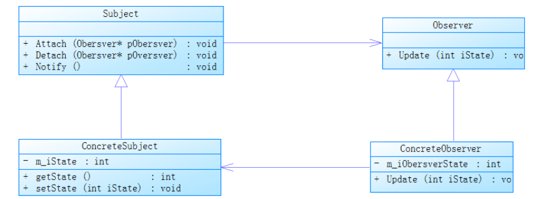
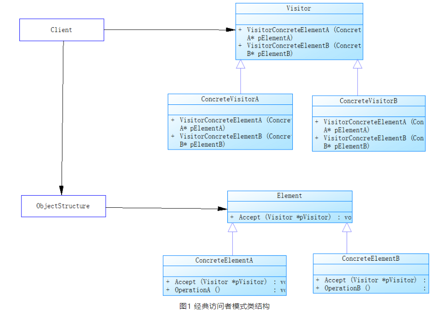

## 单例模式

单例模式可以保证一个类只有一个实例，通过全局访问点来对类进行操作，在实际的编码中，如果想要开发一个泛型的单例模式，这个单例又能够创建所有的类型对象，就不可避免的遇到构造函数形参类型或者个数不同，导致单例中需要实现很多构造函数的问题，这些工作大部分都是重复的，给编码带来很多重复的工作量。

C++11提供的新特性就可以帮助我们解决这些问题，尤其是实现一个通用的泛型单实例类就可以使用C++11中的可变参数模版消除这种重复，同时又可以使用完美转发避免不必要的内存复制，从而提升程序的性能也增加了代码的灵活性。下面就可以通过两段代码之间的对比来展示C++11新特性的便利和灵活之处。

**1 C++11前实现一个泛型单例**

一般情况下，构造函数形参不超过6个，如果要实现一个通用单实例模板类可以按照下面进行编写。代码如下：

```c++

template <class T>
class SingleClass{
public:
 //实现0个参数的构造函数
  static T* instance(){
      if(nullptr == m_pInstance){
          m_pInstance = new T();
      }
      return m_pInstance;
  }
  //实现1个参数的构造函数
  template <typename T0>
  static T* instance(T0 arg1){
      if(nullptr == m_pInstance){
          m_pInstance = new T(arg1);
      }
      return m_pInstance;
  }
  //中间具备2,3,4,5个参数的函数不依次实现，这里实现0,1,6个参数
  //实现6个参数的构造函数
  template <typename T0,typename T1,typename T2,typename T3,typename T4,typename T5>
  static T* instance(T0 arg0,T1 arg1,T2 arg2,T3 arg3,T4 arg4,T5 arg5){
      if(nullptr == m_pInstance){
          m_pInstance = new T(arg0,arg1,arg2,arg3,arg4,arg5);
      }
      return m_pInstance;
  }
  //获取单例
  static T* GetInstance(){
      if(nullptr == m_pInstance) throw std::logic_error("指针没有初始化,需要先使用构造函数进行初始化");
      return m_pInstance;
  }
  //释放单例
  static void DestoryInstance(){
      if(m_pInstance){
          delete m_pInstance;
          m_pInstance = nullptr;
      }
  }
private:
  SingleClass(){};
  virtual ~SingleClass(){};
  SingleClass(const SingleClass &){};
  SingleClass &operator = (const SingleClass&){};
  static T *m_pInstance;
};
```

上面代码在实现0-6个形参的构造函数中，为了实现通用（但是也仅仅支持0-6个形参），存在着很多重复的代码编写。这种工作对于编码人员来说是非常繁琐的且不够灵活，下面的代码用C++11的新的特性进行实现，大家可以做个对比。

**2 C++11新特性的泛型单例**

```c++
template <class T>
class SingleClass{
public:
 template <typename ...Args>
  static T* instance(Args&&... args){
      if(nullptr == m_pInstance){
          m_pInstance = new T(std::forward<Args>(args)...);
      }
      return m_pInstance;
  }
  //获取单例
  static T* GetInstance(){
      if(nullptr == m_pInstance) throw std::logic_error("指针没有初始化,需要先使用构造函数进行初始化");
      return m_pInstance;
  }
  //释放单例
  static void DestoryInstance(){
      if(m_pInstance){
          delete m_pInstance;
          m_pInstance = nullptr;
      }
  }
private:
  SingleClass(){};
  virtual ~SingleClass(){};
  SingleClass(const SingleClass &){};
  SingleClass &operator = (const SingleClass&){};
  static T *m_pInstance;
};
```

如上代码所示，代码中使用了C++11的新特性有三处，分别是：

- **模板可变参数**

- **右值引用** 

- **完美转发**

新特性的使用，没有了重复模板的定义，且再也没有形参个数0-6的限制，可以实现任意参数的模板；完美转发可以将参数的原始定义转发到构造函数中，右值引用也可以减少内存复制，提升代码性能。

当然，在上面的单例构建中，还可以进行优化，不知道大家有没有注意到在private定义的部分，单实例类的默认构造函数，析构函数，拷贝构造函数，拷贝赋值函数通过定义成private的方式，禁止编译器提供这几种函数，除了写在private还可以通过=delete的方式禁止编译器默认生成，**=delete的说明可以参考下面的文章：**

[C++中 =defaule 和 =delete 使用](http://mp.weixin.qq.com/s?__biz=MjM5ODg5MDIzOQ==&mid=2650490871&idx=2&sn=bfa6c90e3e50864ed903581bb9b26981&chksm=becc386789bbb171d2882ef746c065b5c8d7682929fdbfe350c81d716c4357ae0bce6773547b&scene=21#wechat_redirect)

在本文中，上面的代码可以修改为：

```c++
template <class T>
class SingleClass{
public:
SingleClass() =delete;
virtual ~SingleClass() =delete;
SingleClass &operator = (const SingleClass&) =delete;
SingleClass(const SingleClass &) =delete;
 template <typename ...Args>
  static T* instance(Args&&... args){
      if(nullptr == m_pInstance){
          m_pInstance = new T(std::forward<Args>(args)...);
      }
      return m_pInstance;
  }
  //获取单例
  static T* GetInstance(){
      if(nullptr == m_pInstance) throw std::logic_error("指针没有初始化,需要先使用构造函数进行初始化");
      return m_pInstance;
  }
  //释放单例
  static void DestoryInstance(){
      if(m_pInstance){
          delete m_pInstance;
          m_pInstance = nullptr;
      }
  }
private:
  static T *m_pInstance;
};
```

## 观察者模式

观察者模式（Observer Pattern）主要解决的是当对象间存在一对多关系时当一个对象被修改，会自动通知依赖它的其它对象。在设计模式中观察者模式属于行为型模式。

**1 经典观察者模式**

设计模式相关的书籍中，介绍观察者模式时大都用下面的图：



如上，上面的类图就是一个简单的观察者模式，上面的类说明如下：

- Subject：主题，通俗的理解为信息的发布者，提供了三个接口，分别是添加观察者，删除观察者，消息通知；
- ConcreteSubject：具体主题，Subject的派生类，包含两个接口，设置和获取状态；
- Observer：观察者，提供了一个通知接口。
- ConcreteObserver：Observer的派生类，实现了基类的接口，维护一个指向ConcreteSubject对象的引用。

实现上面这个观察者模式的代码如下：

```c++
class Observer{
public:
    virtual void Update(int) = 0;
};
 
class Subject{
public:
    virtual void Attach(Observer *) = 0;
    virtual void Detach(Observer *) = 0;
    virtual void Notify() = 0;
};
 
class ConcreteObserver : public Observer{
public:
    ConcreteObserver(Subject *pSubject) : m_pSubject(pSubject){};
    void Update(int value){
        cout << "接收到信息通知:" << value << endl;
    }
private:
    Subject *m_pSubject;
};
 
class ConcreteSubject : public Subject{
public:
    void Attach(Observer *pObserver);
    void Detach(Observer *pObserver);
    void Notify();
    void SetState(int state){
        m_iState = state;
    }
    
    void GetState(){
        return m_iState;
    }
private:
    std::list<Observer *> m_ObserverList;
    int m_iState;
};
 
void ConcreteSubject::Attach(Observer *pObserver){
    m_ObserverList.push_back(pObserver);
}
 
void ConcreteSubject::Detach(Observer *pObserver){
    m_ObserverList.erase(pObserver);
}
 
void ConcreteSubject::Notify(){
    std::list<Observer *>::iterator it = m_ObserverList.begin();
    while (it != m_ObserverList.end()){
        (*it)->Update(m_iState);
        ++it;
    }
}
```

如上面代码所示，实现了一个经典的观察者模式，但是在实际的使用时，这种实现方式并不灵活，有很多的限定，最明显的两个限制是：

- 需要使用继承关系，继承的缺点有很多，如：继承关系会造成派生类中产生冗余代码，降低了代码的灵活性，且需要实现父类中定义的方法；和基类耦合性太强，一旦使用继承，派生类就拥有了父类中所有方法。
- 主题和观察者之间的接口定义方式是固定的，不能适应后续随着业务发展带来的新的交互方式的变化。

**2 改进后的观察者模式**

为了解决经典观察者模式中的问题，可以使用C++11中提供的新的语言特性，如将消息通知接口进行参数化和使用std::function函数绑定解决类的继承问题，通过完美转发和可变参数模板消除接口变化的影响。经过改进后的观察者模式有新增观察者时不需要继承基类。只要新增一个事件类型即可。

在本次代码实现中，我们不希望新增的事件类型能够进行复制，因此，在实现时将会用=default和=delete标识符对类的特殊函数进行限制，改进后的观察者模式代码如下：

```c++
class NonCopyable{
protected:
    NonCopyable()=default;
    ~NonCopyable()=default;
    NonCopyable(const NonCopyable &)=delete;
    NonCopyable & operator =(const NonCopyable &) = delete;
};

template <typename Func>
class Event:NonCopyable{
public:
    Event()=default;
    ~Event()=delete;
    //注册观察者,支持右值引用
    int Attach(Func && f){
        return Assign(f);
    }
     //注册观察者,支持左值引用
    int Attach(Func & f){
        return Assign(f);
    }
    //移除观察者
    void Detach(int iKey){
        m_mapObserver.erase(iKey);
    }
    //通知接口
    template <typename... Args>
    void Notify(Args&&... args){
        for(auto& it:m_mapObserver)
        {
            it.second(std::forward<Args>(args)...);
        }
    }
private:
    template <typename F>
    int Assign(F && f){
        int k = m_iObserver++;
        m_mapObserver.emplace(k,std::forward<F>(f));
        return k;
    }
    
    int m_iObserver = 0;
    std::map<int,Func> m_mapObserver;
};

```

如上面的代码所示，使用C++11后的观察者模式通过维护一个泛型函数列表消除了类继承导致的代码耦合，使得只需要传入观察者调用函数既可。通知接口通过可变参数模版也实现了任意参数的输入消除了通知接口不适应业务发展变化的影响。

## 访问者模式

**1 了解访问者模式**

访问者模式的应用场景不多，它可以在不改变类成员的前提下定义作用于这些元素的新的操作，是一种数据元素和数据操作分离的设计模式。

**2 访问者模式的使用场景**

在《设计模式》书籍中，访问者模式的使用场景主要有以下几个方面：

- 需要对对象结构中的对象进行分别处理，又不想影响或者改变原有的对象结构。
- 类结构非常稳定，但是有需要新增新的操作
- 一个对象结构中有很多类对象且包含不同的接口，又想对这些对象实施一些依赖于具体类的操作。
- **3 访问者模式的类结构**



类结构说明如下：

- Visitor ：访问者抽象类，通过VisitorConcrete方法决定可以访问的对象；
- ConcreteVisitor：访问者具体类，实现抽象类中的方法，决定访问到该对象类之后实际干什么。
- Element：被访问者抽象类，定义了支持接受访问得到类，通过Accept方法进行获取。
- ConcereElementA：实现基类中的方法。

**4 经典访问者模式的实现**

```c++

#include <iostream>
#include <memory>
class ConcreteElementA;
class ConcreteElementB;
//访问者类
class Visitor
{
public:
   virtual void VisitorConcreteElementA(ConcreteElementA* pElementA)=0;
   virtual void VisitorConcreteElementB(ConcreteElementB* pElementB)=0;
};
//访问者类具体实现
class ConcreteVisitorA : public Visitor
{
public:
  void VisitorConcreteElementA(ConcreteElementA* pElementA){
      std::cout<<"visitor ConcreteElementA"<<std::endl;
  };
  void VisitorConcreteElementB(ConcreteElementB* pElementB){
      std::cout<<"visitor ConcreteElementB"<<std::endl;
  };
};
//被访问基类
class Element
{
public:
    virtual void Accept(Visitor &pVisitor)=0;
};
//被访问类实例类
class ConcreteElementA : public Element
{
public:
   void Accept(Visitor &pVisitor){
       pVisitor.VisitorConcreteElementA(this);
   };
};
int main(){
    std::unique_ptr<Element> pConEle(new ConcreteElementA());
    ConcreteVisitorA Convis;
    pConEle->Accept(Convis);
    return 0;
}
```

上面的代码就实现了一个经典的访问者模式类，代码运行结果为：

 visitor ConcreteElementA

代码发布上线后，如果改动频繁，就会给生产带来很多的风险，尤其是没有经过充分测试、验证的代码，轻则产生业务故障，重则影响整个业务。在《设计模式》一书中，也强调了访问者模式中被访问者应该是一个稳定的继承结构，如果经常发生变更，就需要经常变更代码。如在上面的代码中，如果需要新增一个被访问对象，就需要修改虚基类Visitor的结构。

**5 改进后的访问者模式**

根据面向对象的原则，在实际开发中应该是依赖于接口，但是不要依赖于接口的实现为原则，上面经典模式的实现就违反了这一个原则。要想解决这一问题，就需要将Visitor定义成一个稳定的接口层。既：不会因为接口的增加而修改。使用C++11的可变参数模板就可以帮助我们解决这一问题。

可变参数模版可以让接口支撑任意个参数，这一特性也有助于我们实现一个稳定的接口层，下面的代码就通过可变参数模板实现一个稳定的接口层。

```c++

template <typename... Types>
class Visitor;

template <typename T, typename... Types>
class Visitor<T,Types ...>:public Visitor<Types...>{
public:
    using Visitor<Types...>::Visit;
    virtual void Visit(const T&)=0;
};

template <typename T>
class Visitor <T>{
public:
    virtual void Visit(const T&) = 0;
};
```

上面的代码为每一种类型都定义了一个纯虚函数Visit。下面的代码演示了经过改进后的访问者模式。

```c++
//定义被访问者基类
class ConcreteA;
class ConcreteB;
class Element{
public:
    typedef Visitor<ConcreteA,ConcreteB> MyVisitor;
    virtual void Accept(MyVisitor&)=0;
};
//具体的被访问者
class ConcreteA:public Element{
public:
    std::string strName;
    void Accept(Element::MyVisitor &v){
        v.Visit(*this);
    }
};

class ConcreteB:public Element{
public:
    std::string strName;
    void Accept(Element::MyVisitor &v){
        v.Visit(*this);
    } 
};
//具体的访问者	
class ConcreteVisitor:public Element::MyVisitor{
public:
    void Visit(const ConcreteA &concreteA){
        cout<<"访问者:"<<concreteA.strName<<endl;
    }
    
    void Visit(const ConcreteB &concreteB){
        cout<<"访问者:"<<concreteB.strName<<endl;
    }
};
int main()
{
   ConcreteA vA;
    vA.strName="nameA";
    ConcreteB vB;
    vB.strName="nameB";
    Element *ele = &vA;
    //定义一个访问者
    ConcreteVisitor conVisitor;
    ele->Accept(conVisitor);
    ele = &vB;
    ele->Accept(conVisitor);
    return 0;
}
```

上述代码运行结果如下：

```
访问者:nameA
访问者:nameB
```

在上面的代码中，typedef Visitor<ConcreteA,ConcreteB> MyVisitor会自动生成ConcreteA和ConcreteB的Visit虚拟函数。如下所示：

```c++

struct Visitor<ConcreteA, ConcreteB>
{
    virtual void Visit(const ConcreteA&) = 0;
    virtual void Visit(const ConcreteB&) = 0;
};
```

如果需要新增新的被访问者，只需要在typedef Visitor<ConcreteA,ConcreteB>中增加新的类型即可。如下所示：

```c++
typedef Visitor<ConcreteA,ConcreteB,ConcreteC,ConcreteD>
```

新的类型也会重新生成新的访问者接口。

**6 总结**

从上面的代码示例可知，改进后的Visitor可自动生成虚函数，增加新的被访问者后，不需要修改Visitor访问接口层的代码。和经典的访问者模式实现相比，接口层更加稳定。C++11实现的访问者模式，将之前接口层的变化大部分转移到了被访问者的修改，接口层只需要增加新的类型即可。从维护角度来说，由于变更导致的风险变小了，也更加易于维护。