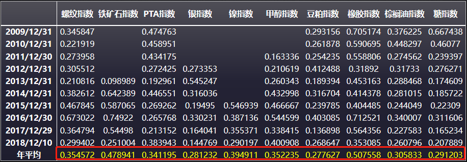
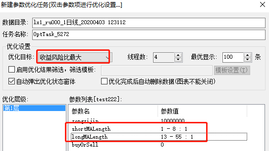
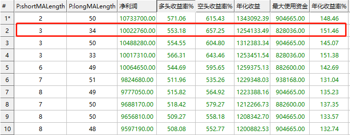
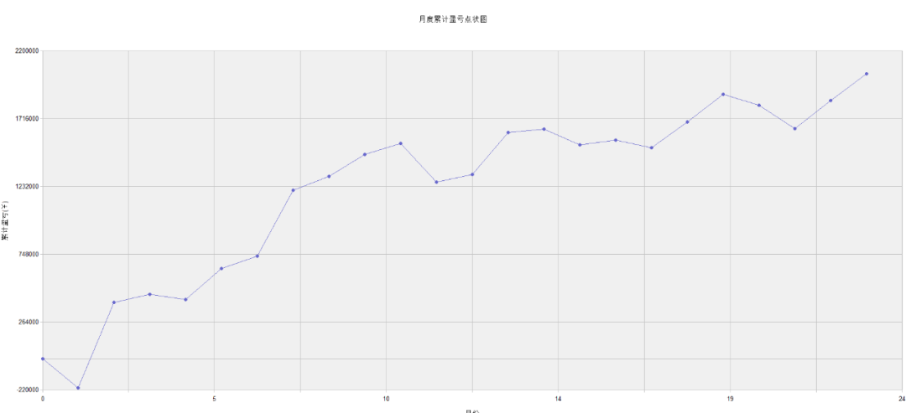
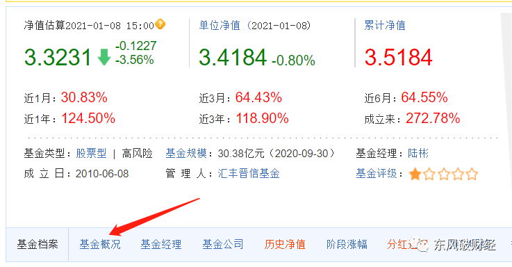
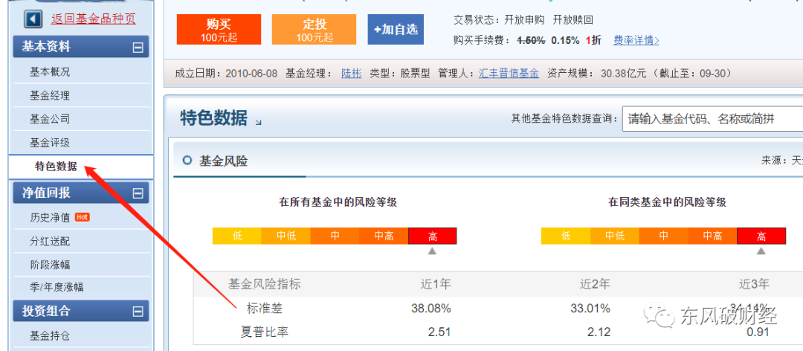

## 量化交易

### 1、什么是量化交易

所谓量化交易，简单的讲就是根据历史数据，设计一套固定的交易模式对股票或者商品等一系列金融产品进行交易，最终实现稳定盈利。


### 2、量化交易的分类

从大方向来划分，量化交易策略可以分为如下四类：1）趋势策略、2）宏观策略、3）套利策略、4）高频策略。

**趋势策略**：直接对交易品种的价格走势进行跟随交易，往往进行右侧交易。这里要注意的是，这里的趋势区分短期趋势、中期趋势、长期趋势。在不同的时间维度下，趋势是可以相反的。一般各个周期的趋势都保持一致的时候，行情是最强烈的，也是利润最丰厚的。

**宏观策略**：是一种对冲基金策略，指持有不同股票、债券、货币及期货市场的卖空和买空头寸。这些投资主要根据对不同国家的总体经济（及政治）看法而做出。

**套利策略**：是选择两个相关性比较高的品种，同时进行方向相反的两种操作。它盈利的核心是两个交易品种的差价是会回归的，而且两者的偏离度往往在一个有限的范围内。

**高频交易**：高频交易与低频交易对应，特征是交易次数更多，且每笔交易的平均盈利较小，对买卖双方的有效匹配起着至关重要的作用。


### 3、为什么选择量化交易

量化投资主要有下面几个特点：1）纪律性 、2）系统性、3）及时性、4）准确性、5）分散化。

**纪律性**：量化投资会严格根据交易信号信号进行交易，可以排除投资者的情绪对交易系统的干扰。

**系统性**：一般量化系统在设计的时候为了达到好的盈利效果，会综合考虑各种因素，所以这种投资方式是多层次、多角度以及海量数据的综合结果。

**及时性**：量化投资是用计算机对市场数据进行快速的计算并生成交易信号，对于高频的量化模型，它的延时是毫秒级别的。

**准确性**：量化投资以历史数据为依托，综合各种信息，得到大概率的统计结果。

**分散化**：一般量化投资系统为了达到风险控制目的，会分散配置交易标的，用概率取胜，进而可以得到更加平滑的净值增长曲线。


04

**量化策略的实现**


量化策略的实现一般分五步走：1）策略逻辑构建、2）代码实现、3）数据回测、4）模拟测试、5）实盘运行。


**4.1.	策略逻辑构建**


每个策略都是有自己的运行逻辑的，如果策略连交易逻辑都不能自洽，是一定不可能稳定挣钱的。比如量化交易的获利是来源于市场的无效性，因为如果市场服从随机游走，那么金融机构可以关门了。


选择策略分类：根据自己的优势，在趋势策略、宏观策略、套利策略、高频策略中选择最适合自己的策略分类。


可行性分析：分析市场上是否有该策略的生存空间。举个例子，决定做日线级别的趋势策略，去挣10%左右的趋势行情。这个时候就要去统计历史的日线数据，每年日K的波动有没有15%；如果没有，就说明没有这个策略的生存空间，这个策略就可以停止往下推进了。


市场是否存在日线级别10%以上的趋势行情呢？这是我做的一个统计：10个期货品种的年波动，10年以来大部分都在20%以上，说明这种行情是存在的。

 




策略逻辑构建时最容易出现的误区：不选择策略分类，没有自己的逻辑，计划利用统计工具对大量的历史数据进行调优测试，最后得到一个回测极其漂亮的统计模型。没有逻辑的策略是没有灵魂的，这种策略只能一时好看（回测漂亮），最终的结果一定是毁灭性的。


初学者最喜欢干的就是做统计策略，而量化策略中最无用的就是统计策略。因为初学者没有对市场的理解，只能从统计做起。比如双均线，初学者特别喜欢把两根均线的参数进行优化，找到最优的哪两个值，这个操作本质上就是在做统计，其中蕴含的风险会在参数调整这一小节详细讲解。


**4.2.	代码实现**


对于初学者，建议分两步走，先选择平台，然后借用平台的api实现代码。除了高频交易，笔者的代码实现全部基于交易开拓者平台，平台丰富的图形化结果展示会极大的节省我们的时间。


举例：基于双均线，对每个品种每次下单1000万的5%，程序自动计算手数，下面给出代码：

```
//用于1000万回测的模型
Params
Numeric zongzijin(10000000);
 Numeric shortMALength(3);
 Numeric longMALength(34);
 Numeric buyOrSell(0);
Vars
NumericSeries firstContract(2); 
 NumericSeries shortMA;
 NumericSeries longMA;
 Bool buyCon;
 Bool sellCon;

Begin
firstContract = (zongzijin*0.5) /(Close[1] * ContractUnit()*BigPointValue());
firstContract = IntPart(firstContract); // 对小数取整
 if(BarStatus==2 && High==Low) Return;
 // 集合竞价和小节休息过滤  
 If(!CallAuctionFilter()) Return;
 shortMA = Average(Close,shortMALength);
 longMA = Average(close,longMALength);
 PlotNumeric("shortMA",shortMA);
 PlotNumeric("longMA",longMA);
 buyCon = shortMA[1]>longMA[1]  ;
 sellCon = shortMA[1]<longMA[1] ;
 If(buyCon )
 {
      Buy(firstContract,Open);
 }
 If(sellCon )
 {
      SellShort(firstContract,Open);
 }
End
```


**4.3.	数据回测**


数据回测就是将你的独特的策略应用到历史金融数据上，得到一系列交易信号。每次交易 (这里的一次 包含买入和卖出) 都会有相应的利润或者损失。将回测时间区间内的收益与损失进行累加，可以得到总盈亏。 


数据回测一般分两步走：1）根据样本内回测进行参数调优、2）根据调优后的参数进行样本外回测。目前很多投资者直接使用样本内回测，得到一组参数的最优值，然后上实盘。这样的效果一般不太好，为什么？因为没有进行样本外回测的检验。


举个例子：用4.2章的双均线策略回测2010年-2019年天然橡胶。理论上，应该先截取时间片段，80%的历史数据进行样本内测试，20%贴近当下的历史数据进行样本外测试。也就是用2010年-2017年的数据进行参数调优，用2018年-2019年的数据进行参数验证。


样本内回测（以收益风险比最大为目标）：优化shortMALength和longMALength两个参数。其中shortMALength优化范围1-8，步长为1；longMALength优化范围13-55，步长为1。

 




程序运行完之后，结果如下，根据我个人的经验我会选择排序第二的参数shortMALength：3，longMALength：34。

 




样本外回测：将shortMALength设置为3，longMALength设置为4，进行样本外回测，效果非常好，月度资金曲线如下：




 

**4.4.	模拟测试**


参数调整好之后，永远不要着急上实盘。就像所有的app都有bug一样，我们写的代码也一定会隐藏着bug。这时候就需要申请模拟账户来进行模拟测试，消除代码中肉眼不可见的bug。


模拟测试主要针对以下几个问题： 


1）未来函数。很多交易策略会用到一段时间内的极值点，譬如利用 OHLC (开高低收) 数据中的 high 和 low 的价格 序列。但是，这些极值点之后在相应的 bar 结束后才可以用来计算，如果在对应的 bar 还没有走完就采用极值点，就是在使用未来函数。当策略代码中用到了未来的数据，会导致程序出现信号忽闪。


2）未来数据。这是量化策略中最容易被忽略的一个漏洞。比如取沪深300的成分股进行双均线的历史回测，就利用到了未来数据。为什么？沪深300固定周期会进行成分股的调整，所以沪深300最近的成分股理论上是过去多年市场里非常优秀的股票，差的股票都被剔除了。在过去多年内都是涨幅优秀的成分股里做数据回测，自然回测数据会非常棒，但是实盘效果会差很多。


3）过度优化。当参数对历史行情过度拟合时，会出现模拟账户走势与历史回测大相径庭的情况。


4）回测偏差。一般而言，策略回测的结果是策略实盘结果的上限。模拟账户运行一段时间后，对于实盘策略能发挥回测的百分比可以得到一个预估。在实盘的时候，我们可以根据这个数值更好的设置仓位的百分比。


5）历史数据不准确。历史回测时使用的数据集可能存在实盘误差。比如用指数回测，在真实的移仓换月时，指数与实盘的价差是真实存在的，而这个误差在回测时无法体现。当模拟盘数据与实盘数据相差过大时，我们就应该从未来函数、未来数据、过度优化、回测偏差、历史数据不准确这几个方向来寻找问题，最终找到解决方案。


**4.5.	实盘运行**


一切准备就绪之后，用实盘验证策略。


05

**参数**


参数可以说是量化的核心，是量化策略永远无法回避的一个问题。


**5.1.	参数设置**


参数的设置一般遵循2个原则：


1）投资者必须可以解释参数背后的逻辑。策略的运行本身就是一个黑箱子，我们通过参数来对其进行调整。如果我们连参数背后的逻辑都不清楚，也就说明我们对自己的策略到底怎么运行、挣什么钱、怎么挣到都不清楚。


2）在能力范围内，参数越少越好。参数越多，越容易过度优化。


**5.2.	参数调优**


参数的调优经常会出现自相矛盾的情况。也是基于这样的现实，参数调整并没有一个确定的范本，让我们照抄执行。根据不同的策略，会有不同的调优方案。总的来说，有以下几个共识：


1）没有最优参数，除非给定优化区间。不给定区间的优化都是耍流氓。为什么一再强调，在进行参数寻优之前，我们首先需要明确每一个参数背后所代表的意义？因为不存在最优参数！做过策略的人就会发现，过去一年优化与过去10年优化，最优参数一定不是一个值。优化的过程，其实就是策略匹配历史行情的过程，越是调低步长，就会越匹配历史。而尴尬是，我们交易的是未来的数据。在不明白每个参数背后代表的意义的时候，优化的意义并不大，优化仅仅是在进行数据统计。除非能拿到未来的数据，再进行优化，才能找到未来的最优参数。


2）量化模型中的参数，主要分两类，一类是固定参数，一类是寻优参数。固定参数基本上是由经验值确定的，固定参数一旦选择，会约束寻优参数的选择范围。在交易逻辑确定之后，模型的局部最优解的分布其实也是确定的。举个例子，我的策略预计挣10%的趋势行情，10%就是固定参数，止盈点就是一个寻优参数，当10%确定了之后，止盈点的范围也就确定了（7%-13%）。


3）参数调整主要参考下面几个方面：1.夏普率或者波动率 2. 收益风险比 3. 盈亏比。


**5.3.	参数选择的原则**


1）选择最优区间而不是最优值。单个的最优值在统计学的概念里可能就是一个小概率事件，只是因为优化，导致我们碰巧找到了它。但是如果一个区间里的参数都表现很好，那就说明这个参数大概率是真的很好。


2）主观能定的参数主观定。这是量化最有意思的地方，一个标榜客观的行业竟然需要主观来决定参数。它背后的意义就是，如果我们对自己的量化策略真的掌握到了极致，参数是不需要优化的，因为我们已经将最优参数了然于心。所以，大道至简，殊途同归，交易走到最后，根本就不区分主观还是量化，所有的交易手段都只是我们成功的工具。


06

**量化投资的不足**


正如每枚硬币都有两面一样，量化有它的优势，也有它的不足：


1）系统性风险。一般系统性风险发生的时候也是回撤最大的时候，随着模型和市场的不同，系统性风险出现的概率也是不同的，一般半年到几年内，总会出现几次。在出现系统性风险后，账户的回撤只和仓位有关系，多品种多策略都不会减小最大回撤。


2）资金容量问题。任何一个交易市场的流动性都是有上限的，所以量化模型在特定的市场下，其资金承载量也会随着市场流通性的变化而变化。


3）策略同质化问题。资本交易市场利润来源的核心就是买卖的差价，虽然在建模的时候，大家会采用各种各样的数据和指标。但这些模型最终落实到交易环节的时候，其相关性是非常高的。比如机器学习策略，大家用的算法都是市面上公开的算法，大家用的数据都是交易所公开的数据，大家最后训练出来的策略，同质化是非常的严重的。如果不能另辟蹊径，在算法、数据或者交易细节上和同行业竞争者拉开差距，量化交易是很难稳定挣钱的。


4）量化策略是无法做到完全客观的，或多或少会包含主观成分。一个策略的回测曲线摆在那里，信或者不信，用或者不用以及什么时候用都取决于你自己。过去表现好的参数不代表未来也会好，如果把参数固定一直坚守，本质就是碰运气。而调整参数，需要使用策略的人具备一定的主观交易能力。话说回来，量化只是一种工具，它最大的作用是帮助我们自动处理大量数据并机械化执行以克服情绪，但使用工具的最终还是人。量化策略不是印钞机，写完之后放在那里交易就可以躺着赚钱了，它需要研究员不断调整以适应市场的进化。这些调整包括增删改查，经常性的小修小补是避免不了的。


## 夏普比率

最近在准备写《未来基金布局三大方向之一新能源基金怎么买？场外篇》，其中使用到了一个重要指标**夏普比率。**下面具体科普一下它是怎么一回事。


01

—

用什么来衡量基金的风险

大多数人比较基金业绩时，最喜欢看的就是排名。不过要知道，“冠军基金魔咒”这种事情每年都在发生，不能只看排名。

所以就需要更加系统地评估基金的优劣，比如从收益期望和风险两方面去综合考虑。

收益率好办，随便一查就知道，风险的衡量就要靠**夏普比率**了。

我们先来看个例子，甲和乙两人在同一段时间里获得了不同的收益：甲在一笔交易中赚了20000元，乙赚了5000元。谁的投资做得更好呢？

毫无疑问很多人都会选择甲，因为他收益高。其实，我们在看到高收益的同时，往往会忽略掉了风险。

我在平时筛选基金是不会只看涨幅的，而是要看单位风险获得的收益。元旦开盘第一天申万菱信新能源净值飙到了7个点以上，于是我群里就不少人以为它就是最好的新能源基金，其实并不是这样。


02

—

夏普比率的定义


由美国的诺贝尔经济学家威廉夏普提出，夏普比率是这么定义的：


**“** 夏普比率(Sharpe Ratio)，又被称为夏普指数，基金绩效评价标准化指标，其计算公式为“SharpeRatio=[E(Rp)-Rf]/σp”，其中E(Rp)为投资组合预期报酬率；Rf为无风险利率；σp为投资组合的标准差。 **”**


投资中有一个常规的特点就是投资标的预期报酬越高，投资人所能承受的波动风险越高；反之，预期报酬越低，波动风险也越低。

所以理性的投资者选择投资标的与投资组合的主要目的是，在固定所能承受的风险下，追求最大的报酬；或在固定的预期报酬下，追求最低的风险。**买东西都要追求性价比，而夏普比率就是风险和收益的性价比。**

所以在上面这个公式中，就是要计算投资组合每承受一单位总风险，会产生多少的超额报酬。公式我也看不懂，但是概念一定要知道。

它代表着投资人每多承担一分风险，相应地可以拿到几分报酬，这样一来就有助于投资者判断自己是否值得付出更多成本。

如果计算结果为正值，那么代表基金报酬率高过波动风险；若为负值，则基金操作风险高于报酬率。也就是说，这个比例越高，投资组合就越佳。

一般夏普比率会设置一定的区间，设置不同的区间，这样算出来的夏普比率就会大不一样，所以还是存在一定的局限性。

用标准差对收益进行风险调整，其隐含的假设就是所考察的组合构成了投资者投资的全部。

因此在考察单只基金的时候，最好比较同类型的基金，这样来看更客观、夏普比率的准确性更好。


03

—

怎么查基金的夏普比率

在哪里查看基金的夏普比率呢？在天天基金就可查询，但是会有部分基金没有显示夏普比率数据。听说晨星网也有，但是我没试过，有账户的可以去试试。




编辑搜图


打开天天基金任意一支基金




04

—

如何使用夏普比率

下面再举个更有操作性的例子。有两个净值型产品，A的历史收益率为5.5%，B的历史收益率为6.5%，但产品A的夏普比率远高于产品B，该选哪个？

显然在承受同一单位风险的情况下，产品A的回报较高，购买产品A可能更合算。

如果再用夏普比率来比较基金和银行存款，那么这一指数其实是反映了单位风险基金净值增长率超过无风险收益率的程度。

如果夏普比率为正值，说明在衡量期内，基金的平均净值增长率超过了无风险利率，在以同期银行存款利率作为无风险利率的情况下，说明投资基金比银行存款要好。

05

—

夏普比率的启示

夏普比率主要给我们带来的启示是——**投资不能只看回报率，还要看担多少风险**。收益与风险是相伴而生的，我们必须要考虑收益及风险与自身投资目标的匹配。

通过这个比率，大家就可以判断相比于无风险资产，所持有的风险资产的波动性能带来多少额外收益，从而判断是否能接受这种风险水平。

需要注意的是夏普比率没有基准点，因此其大小本身没有意义，只有在与其他组合的比较中才有价值。
